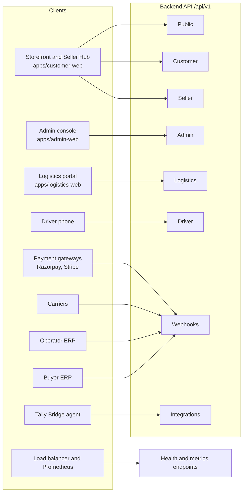
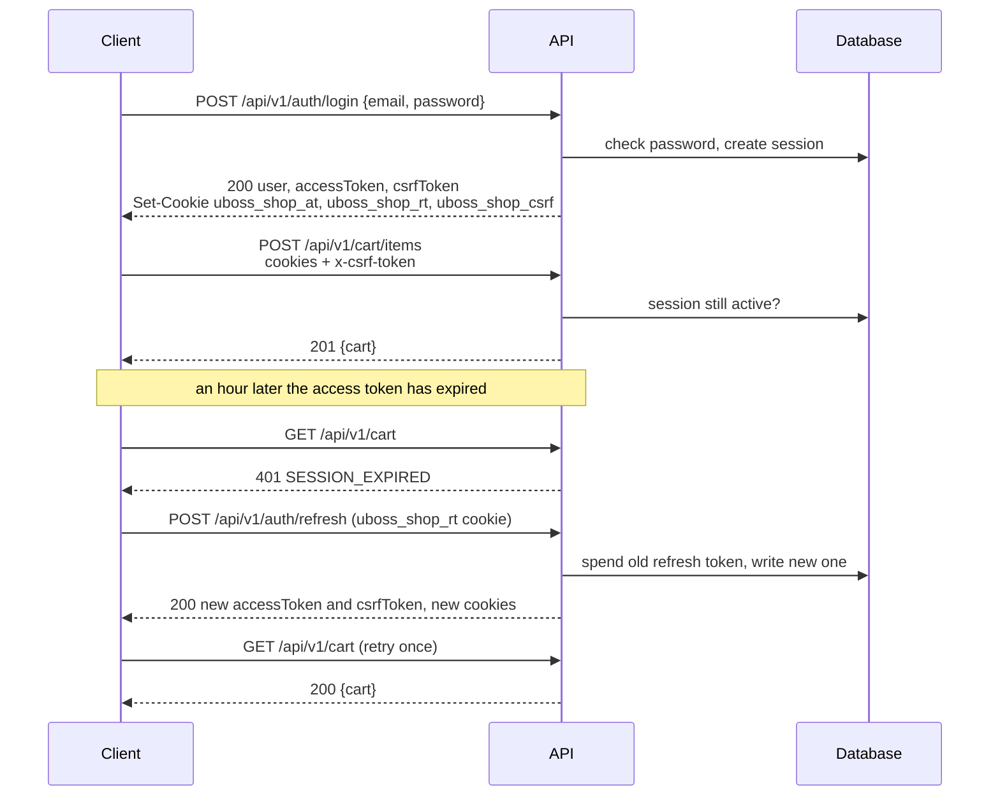
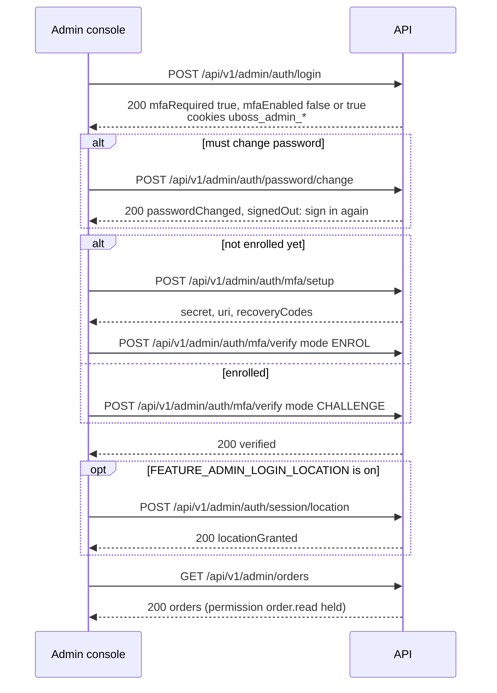
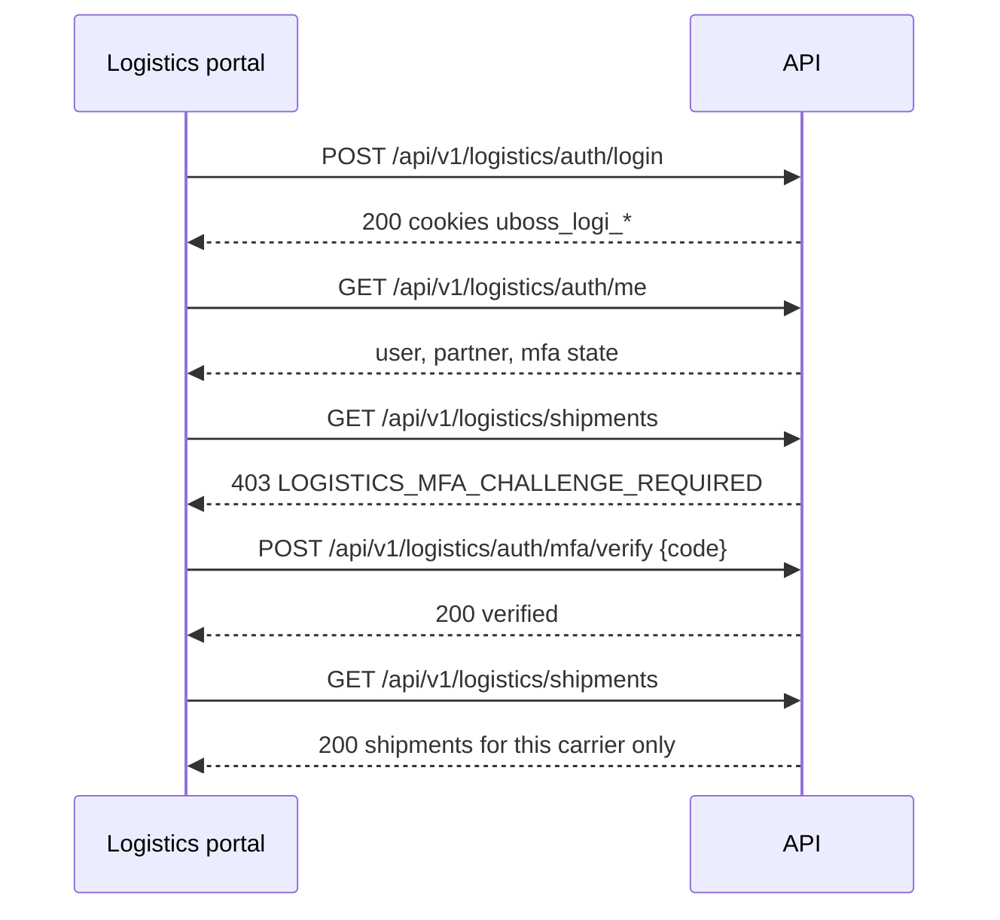
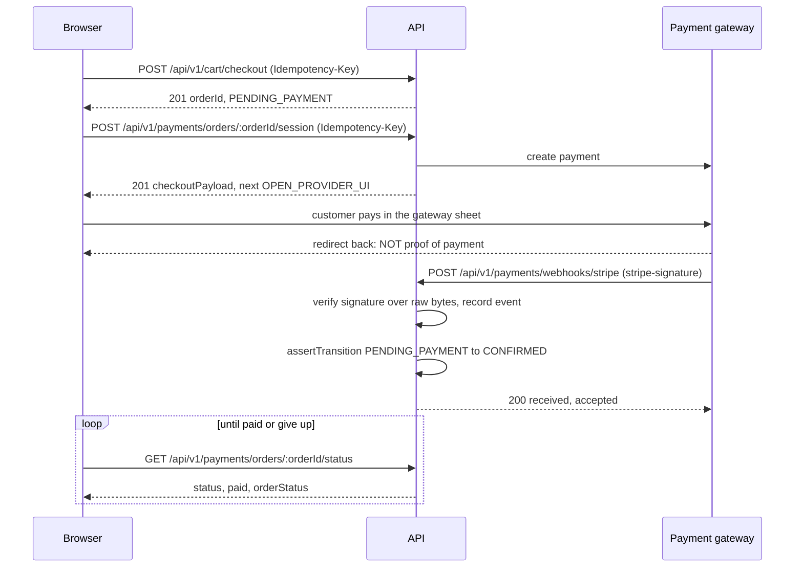

# The Glovia API guide

This guide explains how the Glovia backend API works and how to use it. Glovia
is the product name; the repository is called UBOSS Sourcing, and you will see
both words in the code and in cookie names.

It is written for anybody who has to talk to the backend from a program: a
frontend developer, an integrator connecting an ERP or a carrier, a tester, or a
buyer checking what the software can do. You do not need to know the code to
read it. Every path, header, field and error code named here exists in the code
today.

Two generated reference files sit beside this guide. This guide explains how
the API behaves; the references list what it contains:

| File | What it holds |
|---|---|
| [`reference/API-ENDPOINTS.md`](reference/API-ENDPOINTS.md) | Every endpoint: method, path, who may call it, the exact guard and permission |
| [`reference/ERROR-CODES.md`](reference/ERROR-CODES.md) | Every error code the API can return |

---

## Keeping this document true

This guide describes code, and code changes. A guide that has quietly stopped
being true is worse than no guide, because people trust it and act on it.

**Update this file in the same piece of work** whenever a change alters:

- how somebody signs in, refreshes, or signs out, or a cookie or header name;
- a guard, a permission, a role, or which role holds a permission;
- a feature flag that switches routes on or off;
- the error envelope, the money shape, the pagination shape or the idempotency
  rules;
- a webhook: its path, its signature scheme, or what it answers;
- a request or response used in one of the walkthroughs below;
- a rate limit or an upload limit stated here.

The two reference files are **generated**, never hand-edited. After changing a
route file, `app.ts` or `errors.ts`, rebuild them:

```powershell
cd scripts; npm run docs
```

`npm run docs:check` in the same folder fails when they have fallen behind the
code.

The same change usually also needs `PROJECT-GUIDE.md` (and its Hinglish twin),
`README.md` and the feature guide. `CLAUDE.md` at the repository root lists
exactly when each one must change.

---

## Table of contents

1. [The API in one page](#1-the-api-in-one-page)
2. [Authentication and sessions](#2-authentication-and-sessions)
3. [Authorisation: who may do what](#3-authorisation-who-may-do-what)
4. [Conventions every endpoint follows](#4-conventions-every-endpoint-follows)
5. [Errors](#5-errors)
6. [Webhooks in and out](#6-webhooks-in-and-out)
7. [Walkthroughs with real requests](#7-walkthroughs-with-real-requests)
8. [Area-by-area guide](#8-area-by-area-guide)
9. [OpenAPI](#9-openapi)
10. [Health, readiness and metrics](#10-health-readiness-and-metrics)
11. [FAQ for API consumers](#11-faq-for-api-consumers)
12. [Glossary](#12-glossary)

---

# 1. The API in one page

## What it is

The backend is one program, written with **Fastify** (a web framework for
Node.js). It answers **HTTP requests** and speaks **JSON** (a plain-text format
for structured data). There is no other channel: no GraphQL, no WebSocket. Two
kinds of answer stream text as it is written, using **Server-Sent Events**
(SSE, a long HTTP response that sends small pieces as they are ready): the AI
assistant chat and the dashboard "insights" panels.

## The base URL

Every business endpoint starts with the **API prefix** `/api/v1`. The `v1` is
the version. If an answer ever has to change in a way that would break old
clients, the new shape goes under `/api/v2` and `/api/v1` keeps working.

| Where | Base URL |
|---|---|
| Local development | `http://localhost:4000/api/v1` |
| A deployed installation | The same host the browser application is served from, for example `https://shop.example.com/api/v1`. The shipped nginx configuration forwards `/api/v1/` on each site's host to the API |

Three things live **outside** the prefix: the health checks (`/health/live`,
`/health/ready`), the Prometheus metrics (`/metrics`) and, in development, the
uploaded product pictures (`/media/products/...`).

The frontends read the base URL from `VITE_API_BASE_URL`, and fall back to
`http://localhost:4000/api/v1`.

## Requests and responses

- Send bodies as `Content-Type: application/json`. A body that is not valid JSON
  is refused with `400 VALIDATION_FAILED`.
- A JSON body may be at most **1 MiB** (1,048,576 bytes). Larger is
  `413 PAYLOAD_TOO_LARGE`.
- Answers are JSON unless an endpoint says otherwise (a PDF, a CSV export, the
  sitemap XML, an SSE stream).
- There is **no success envelope**. A successful answer is the object itself,
  for example `{ "cart": { ... } }` or `{ "orders": [...], "pagination": {...} }`.
  Only errors share one fixed shape (see [section 5](#5-errors)).
- Every response carries an `x-correlation-id` header. It is the id of this one
  request in the server log. You may send your own (up to 64 characters) and it
  is echoed back; otherwise the server makes one.

## The zones

A **zone** is a group of endpoints that share one kind of caller. The caller's
credential decides which zone it can reach, and the zones never share a
credential.

| Zone | Prefix | Who calls it | How they prove who they are |
|---|---|---|---|
| **Public** | `/api/v1/config`, `/api/v1/catalog/*`, `/api/v1/delivery/*`, `/api/v1/sitemap.xml`, `/api/v1/partner-invitations/*`, `/api/v1/documents/verify`, `/api/v1/payments/links/:token` | Anybody | Nothing. Some public routes answer a signed-in customer better (`optionalCustomer`) |
| **Customer** | `/api/v1/auth/*`, `/api/v1/account/*`, `/api/v1/cart/*`, `/api/v1/orders/*`, `/api/v1/payments/*`, `/api/v1/fulfilment/*`, `/api/v1/pricing/*`, `/api/v1/recurring-schedules/*`, `/api/v1/preorders/*`, `/api/v1/documents/*`, `/api/v1/assistant/*`, `/api/v1/sellers/*` | A signed-in storefront customer | Customer session (cookies `uboss_shop_*`, or a Bearer token) |
| **Seller** | `/api/v1/seller/*` | A customer who also sells on the marketplace | The customer session, plus seller membership, a seller role, and the Seller Hub password for this session |
| **Admin** | `/api/v1/admin/*` (sign-in under `/api/v1/admin/auth/*`) | A member of the operator's staff | Admin session (cookies `uboss_admin_*`), plus the named permission, plus two-step sign-in |
| **Logistics** | `/api/v1/logistics/*` (sign-in under `/api/v1/logistics/auth/*`) | A person from a carrier company | Logistics session (cookies `uboss_logi_*`), plus a logistics permission, plus two-step sign-in for some roles |
| **Driver** | `/api/v1/logistics/driver/*` | A carrier's driver, on a phone | A logistics session; the location pings carry a device token instead |
| **Webhooks** | `/api/v1/payments/webhooks/:provider`, `/api/v1/integrations/erp/webhooks/:slug`, `/api/v1/erp-inbound/:slug`, `/api/v1/integrations/carriers/:pathToken/webhook` | Another company's server | A signature over the exact bytes of the body |
| **Integrations** | `/api/v1/integrations/tally-bridge/*` | The Glovia Tally Bridge agent on a seller's own computer | A Bearer token issued to that paired device |
| **Token downloads** | `/api/v1/exports/download/:token`, `/api/v1/my-data/download/:token` | Whoever holds a link from an email | The unguessable, expiring token in the path |
| **Health and metrics** | `/health/live`, `/health/ready`, `/metrics` | Load balancers, monitoring | Nothing. `/metrics` is closed to the internet by nginx |

This picture shows which client talks to which zone:



## Which shop a request is for

Before any route runs, the API looks at the request's `Host` header. When the
operator has set `SELLER_STOREFRONT_DOMAIN`, a seller can have their own shop
front on a subdomain of it, and public prices and the public configuration are
answered for that seller. A subdomain that matches no approved seller is refused
with `404 NOT_FOUND` and the message "There is no shop at this address." — it
never falls through to the operator's own catalogue. With the setting empty
(the default) every request is the operator's own shop.

This is decided from the host and nothing else. A query string, a cookie or a
parameter cannot choose whose prices a shopper is charged.

---

# 2. Authentication and sessions

**Authentication** means proving who you are. **Authorisation** (the next
section) means what you are then allowed to do.

## The three audiences

There are three kinds of account, called **audiences** (or user kinds): `ADMIN`
(staff), `CUSTOMER` (buyers, and sellers, who are customers too) and
`LOGISTICS` (people at carrier companies). All three sign in through the same
code, registered three times under three prefixes:

| Audience | Sign-in prefix | Cookie names |
|---|---|---|
| `ADMIN` | `/api/v1/admin/auth` | `uboss_admin_at`, `uboss_admin_rt`, `uboss_admin_csrf` |
| `CUSTOMER` | `/api/v1/auth` | `uboss_shop_at`, `uboss_shop_rt`, `uboss_shop_csrf` |
| `LOGISTICS` | `/api/v1/logistics/auth` | `uboss_logi_at`, `uboss_logi_rt`, `uboss_logi_csrf` |

`_at` is the **access token** cookie, `_rt` the **refresh token** cookie, and
`_csrf` the **CSRF token** cookie (all explained below).

The names are different on purpose. A browser treats two cookies with the same
name on the same host as one cookie, whatever the port. With separate names, a
member of staff and a customer can be signed in at the same time in one browser.

**An audience is checked twice.** The access token carries a claim, `typ`, that
names its audience. The guard compares it with the audience of the route, and
then loads the user from the database and checks the user's own type again. A
customer's token presented to an admin route is refused with `403 FORBIDDEN`
("This credential is not valid for this application."), and a customer's
password presented to the admin sign-in is refused like an unknown account.

## Tokens and cookies

| Token | What it is | How long it lives | Where it travels |
|---|---|---|---|
| **Access token** | A short, signed statement: user id (`sub`), session id (`sid`), audience (`typ`), expiry (`exp`). It is two base64url parts joined by a dot, signed with HMAC-SHA256. Not a JWT | `ACCESS_TOKEN_TTL_SECONDS` (default 3600, one hour) for customers and logistics; `ADMIN_ACCESS_TOKEN_TTL_SECONDS` (default 900, fifteen minutes) for staff | The `_at` cookie (httpOnly), **or** an `Authorization: Bearer <token>` header |
| **Refresh token** | A random secret. The database keeps only its SHA-256 hash | `REFRESH_TOKEN_TTL_SECONDS` (default 2,592,000, thirty days). It slides: each use gives a new one | The `_rt` cookie only (httpOnly). **Never in a response body** |
| **CSRF token** | A random value that proves the caller can read this site's cookies | Same as the refresh cookie | The `_csrf` cookie (readable by JavaScript), and returned as `csrfToken` in the sign-in and refresh answers |
| **Session family** | Not a token: the chain of sessions started by one password sign-in | `SESSION_ABSOLUTE_TTL_SECONDS` (default 7,776,000, ninety days) from the sign-in. It does not slide | Server side only |

**httpOnly** means JavaScript in the page cannot read the cookie, so a script
injected into the page cannot steal the session.

The access token is stateless, but the **session is not**. Every guarded request
also checks that the session row is still active. Sign-out, a password change,
deactivation or a theft alarm ends the session at once, not at the next token
expiry.

Cookie settings come from `COOKIE_SECURE` (send only over HTTPS; set it `true`
in production), `COOKIE_SAME_SITE` (`lax` by default) and `COOKIE_DOMAIN`.

## Two ways to send the access token

1. **Cookies (browsers).** Send requests with credentials included
   (`credentials: 'include'` in `fetch`). The browser attaches the cookies. Every
   state-changing request (anything but `GET`, `HEAD`, `OPTIONS`) must also carry
   the CSRF header.
2. **Bearer (scripts and servers).** Send `Authorization: Bearer <accessToken>`,
   using the `accessToken` from the sign-in answer. **No CSRF header is needed**,
   because a browser cannot attach this header to another site's request.

The server decides by **where the token came from**, not by whether an
`Authorization` header exists. A header like `Authorization: Basic ...` is not a
Bearer token, so the cookie is used and the CSRF check still runs.

## CSRF protection

**CSRF** (cross-site request forgery) is when another website makes your browser
send a request to this API, and the browser helpfully attaches your cookies.

The defence is the **double-submit check**:

- At sign-in the server sets the `_csrf` cookie and also returns the same value
  as `csrfToken`.
- On every cookie-authenticated `POST`, `PUT`, `PATCH` or `DELETE`, the client
  copies that value into the **`x-csrf-token`** header (header names are not
  case-sensitive; `X-CSRF-Token` is the same header).
- The server checks that the cookie and the header match, in constant time.
  Another site cannot read your cookie, so it cannot write the header.

A missing or wrong header is `403 FORBIDDEN` with the message "CSRF validation
failed. Refresh the page and try again."

The CORS allowlist lists `x-csrf-token` as an allowed header; without it a
browser would refuse every write before it was even sent.

## Signing in

`POST {prefix}/login` with `{ "email": "...", "password": "..." }`. It is
limited per address to `RATE_LIMIT_LOGIN_PER_15MIN` (default 10) attempts in 15
minutes. Separately, an account is locked after `LOGIN_LOCKOUT_THRESHOLD`
(default 8) failures for `LOGIN_LOCKOUT_MINUTES` (default 15).

A successful answer (`200`) sets the three cookies and returns:

```json
{
  "user": {
    "id": "01J9ZD0A1B2C3D4E5F6G7H8J9K",
    "email": "buyer@acme.local",
    "type": "CUSTOMER",
    "roles": ["customer"],
    "permissions": [],
    "customerProfileId": "01J9ZD1B2C3D4E5F6G7H8J9K0M",
    "mfaEnabled": false,
    "mfaRequired": false,
    "mfaSessionVerified": false,
    "mustChangePassword": false,
    "locationRequired": false,
    "locationGranted": false,
    "locationCountry": null,
    "locationPlace": null,
    "locationLanguage": null,
    "locationCurrency": null
  },
  "accessToken": "eyJzdWIiOi....Qm9n",
  "accessTokenExpiresAt": "2026-09-24T11:00:00.000Z",
  "csrfToken": "d0Zy8u3kq1Vb2mS9xT4nQw7cLp5eHjRa"
}
```

The failures you should expect:

| Code | Status | Meaning |
|---|---|---|
| `INVALID_CREDENTIALS` | 401 | Wrong email or password. The message is the same for an unknown account, so nobody can use it to find out who has one |
| `ACCOUNT_LOCKED` | 401 | Too many failures. Wait for the lockout to end |
| `ACCOUNT_DEACTIVATED` | 401 | The account was closed |
| `ACCOUNT_NOT_ACTIVATED` | 401 | An invited account whose invitation was never accepted |
| `EMAIL_NOT_VERIFIED` | 401 | A self-registered customer who has not opened the confirmation link |
| `ACCOUNT_PENDING_APPROVAL` | 401 | A self-registered customer waiting for staff to approve them |
| `TEMPORARY_PASSWORD_EXPIRED` | 401 | A staff member's emailed temporary password has lapsed |
| `RATE_LIMITED` | 429 | Too many sign-in attempts from this address |

## Staying signed in: refresh

`POST {prefix}/refresh`, with no body. It reads **only the `_rt` cookie**, so a
client that wants to refresh must keep its cookie jar. On success it rotates the
session: the old refresh token is spent, a new one is set, and the answer is:

```json
{
  "accessToken": "eyJzdWIiOi....bm9u",
  "accessTokenExpiresAt": "2026-09-24T12:00:00.000Z",
  "csrfToken": "Vb2mS9xT4nQw7cLp5eHjRad0Zy8u3kq1"
}
```

The CSRF value changes on every refresh. Read it again from the answer or from
the cookie.

The rules a client must follow:

- When a request fails with `401 SESSION_EXPIRED`, refresh **once**, then retry
  the request **once**. If it fails again, send the person to sign in.
- If refresh fails with `401 REFRESH_TOKEN_REUSED`, **stop**. The same refresh
  token arrived twice, which means it was copied. The server has ended the whole
  session family, for both the real client and the thief, because it cannot tell
  which is which. Retrying achieves nothing.
- A failed refresh clears the cookies, so the client stops retrying with a dead
  token.
- Make sure only one refresh runs at a time. The three frontends share one
  in-flight refresh between all requests that hit a 401 together.



## Who is signed in

| Audience | Endpoint | Answer |
|---|---|---|
| Customer | `GET /api/v1/auth/me` | The same `user` object as the sign-in answer, with the live values |
| Admin | `GET /api/v1/admin/auth/me` | The same shape. For staff, `locationCountry`, `locationPlace`, `locationLanguage` and `locationCurrency` describe where this session signed in (they are always null for customers) |
| Logistics | `GET /api/v1/logistics/auth/me` | `{ user: { id, email, fullName, role, permissions, isDriver }, partner: { id, code, displayName, status, canAcceptNewWork }, mfa }` |

Each audience also has `GET`/`PUT {prefix}/language` for the interface language
(`{ "language": "de" }`; one of `en`, `de`, `es`, `fr`, `it`, `nl`, `pl`, `el`),
and `POST {prefix}/password/change` with `{ currentPassword, newPassword }`.
A new password must be 12 to 128 characters. Changing it ends every session.

## Signing out

| Endpoint | Effect | Answer |
|---|---|---|
| `POST {prefix}/logout` | Ends this session and clears this audience's cookies only. Signing out of the admin panel does not sign you out of the shop | `204` |
| `POST {prefix}/logout-all` | Ends every session of this account, on every device | `200 { "sessionsRevoked": 3 }` |

Both are state-changing, so a cookie client must send `x-csrf-token`.

## Customer sign-up, email confirmation and invitations

These exist only on the customer prefix `/api/v1/auth`:

| Endpoint | Body | Answer |
|---|---|---|
| `POST /api/v1/auth/register` | `fullName`, `email`, `phone`, `country` (two letters), `password`, `acceptedTerms`, optional `organization`, `consentVersion`, `language` | `202 { registered, requiresApproval, message }`. The same answer whether or not the address is already taken, so it cannot be used to discover accounts. 5 per hour per address |
| `POST /api/v1/auth/verify-email` | `{ token }` from the email | `200 { verified, email, status }` |
| `POST /api/v1/auth/verify-email/resend` | `{ email }` | `202` with a neutral message |
| `POST /api/v1/auth/invitations/accept` | `{ token, password, acceptedTerms, consentVersion? }` | `200 { activated, email, message }` |
| `GET /api/v1/account/config` | none, public | `{ selfRegistrationEnabled }` so the storefront knows whether to show "Create account" |

Self-registration is off unless `FEATURE_CUSTOMER_SELF_REGISTRATION=true`; when
off, `register` answers `403 SELF_REGISTRATION_DISABLED`. Whether a new account
must also wait for staff approval is `CUSTOMER_SELF_REGISTRATION_REQUIRES_APPROVAL`.

The logistics prefix has its own `POST /api/v1/logistics/auth/invitations/accept`
for a carrier's staff.

Every prefix also has password reset:

| Endpoint | Body | Answer |
|---|---|---|
| `POST {prefix}/password/forgot` | `{ email }` | `202` with a neutral message. 5 per 15 minutes |
| `POST {prefix}/password/reset` | `{ token, newPassword }` | `200 { passwordReset: true }`. Ends every session |

## Staff: temporary passwords, two-step sign-in and location

A staff session has up to three extra gates before it may use any admin route.
Each gate is enforced by the API, not only by the admin screens.

**1. Temporary password.** A new staff account gets an emailed temporary
password. Until the person sets their own, every admin route answers
`403 PASSWORD_CHANGE_REQUIRED`. Only `/me`, `/password/change`, `/logout` and
`/language` stay open. The sign-in answer says `mustChangePassword: true`.

**2. Two-step sign-in (MFA).** MFA means a second proof after the password: a
six-digit code from an authenticator app (TOTP, a time-based one-time
password). It is on for staff unless `FEATURE_ADMIN_MFA=false`. With it on, every
admin route answers `403 MFA_REQUIRED` until **this session** has passed a code.

| Endpoint | Body | Answer |
|---|---|---|
| `POST /api/v1/admin/auth/mfa/setup` | none | `{ secret, uri, recoveryCodes }`. `uri` is the `otpauth://` link to show as a QR code. Replacing an existing factor needs this session to have passed the old one first |
| `POST /api/v1/admin/auth/mfa/verify` | `{ "code": "123456", "mode": "ENROL" }` to finish setting up, or `"mode": "CHALLENGE"` (the default) at each sign-in | `{ verified: true }`, and for a challenge also `usedRecoveryCode` and `recoveryCodesRemaining`. Either mode marks this session as verified |

A wrong code is `MFA_INVALID`. Both answers are sent with
`cache-control: no-store`.

**3. Sign-in location.** Only when `FEATURE_ADMIN_LOGIN_LOCATION=true` (off by
default). The session must report where it is before admin routes work; until
then they answer `403 LOCATION_REQUIRED`.

`POST /api/v1/admin/auth/session/location` with
`{ "latitude": 52.52, "longitude": 13.405, "accuracyM": 30 }` answers
`{ locationGranted: true, place, recordedAt }`. It is limited to 20 per 15
minutes. The storefront never asks a customer for this.



## Logistics: the portal's own gates

The logistics portal exists only when `FEATURE_LOGISTICS_PORTAL=true`. With it
off, every guarded logistics route answers `403 FEATURE_DISABLED`.

A logistics account must belong to a carrier company (otherwise
`403 LOGISTICS_PARTNER_REQUIRED`). The **Partner Owner** and **Partner
Administrator** roles must use two-step sign-in. Until they do, every permission-
guarded logistics route answers `403 LOGISTICS_MFA_SETUP_REQUIRED` (never set up)
or `403 LOGISTICS_MFA_CHALLENGE_REQUIRED` (set up, but not yet entered in this
session).

| Endpoint | Body | Answer |
|---|---|---|
| `POST /api/v1/logistics/auth/mfa/setup` | none | The enrolment secret and link |
| `POST /api/v1/logistics/auth/mfa/verify` | `{ code, mode: "ENROL" \| "CHALLENGE" }` | `{ verified: true, usedRecoveryCode, ... }` |

`GET /api/v1/logistics/auth/me`, the MFA endpoints and sign-out stay open before
the second factor, so the portal can show the right screen.



## Sellers: the Seller Hub password

A seller signs in as a customer; there is no fourth audience. Every
`/api/v1/seller/*` route then also needs a second password, the **Seller Hub
password**, opened for this session:

| Endpoint | Body | Answer |
|---|---|---|
| `GET /api/v1/sellers/me` | none | `{ seller: null }`, or the membership with `status`, `role`, `permissions`, `isTrading` and `lock` |
| `POST /api/v1/sellers/lock` | `{ newPassword, currentPassword? }` (12 to 128 characters) | `{ lock }`. Sets or changes it |
| `POST /api/v1/sellers/lock/open` | `{ password }` | `{ lock }`. Opens the Hub for this session |
| `POST /api/v1/sellers/lock/close` | none | `{ lock }` |

Until a password is set, seller routes answer `403 SELLER_LOCK_NOT_SET`; while it
is set but not opened, `403 SELLER_LOCK_REQUIRED`; a wrong one is
`403 SELLER_LOCK_INVALID`.

---

# 3. Authorisation: who may do what

## The rule: deny by default

A route is unreachable unless it names a **guard** (a check that runs before
the handler). There is no "signed in, therefore allowed" path.

| Guard | Used on | What it checks |
|---|---|---|
| `requireAdmin(Permission.X, ...)` | Admin routes | An admin session, the temporary-password, MFA and location gates, and **all** the listed permissions |
| `requireAuthenticated(kind)` | `/me`, `/logout`, `/password/change`, `/language`, `/mfa/*`, `/session/location` | Any valid session of that audience, before the extra gates |
| `requireCustomer` | Customer routes | A customer session with a customer profile |
| `optionalCustomer` | A few public routes that answer a customer better (AI assistant, bulk pricing, preorder eligibility) | No credential means guest. A credential that is sent must be valid, or the request fails |
| `requireSeller(SellerPermission.X, ...)` | Seller Hub routes | A customer session, seller membership, the Seller Hub password opened, and each listed seller permission |
| `requireTradingSeller(...)` | Seller routes that sell or ship | As above, and the seller must be approved and not suspended |
| `requireLogisticsSession` | `/logistics/auth/me`, `/logistics/auth/mfa/*` | The portal is on, a logistics session, and membership of a carrier |
| `requireLogistics(LogisticsPermission.X, ...)` | Logistics routes | As above, the MFA gate, and each listed permission |
| Feature guards (`requireFeature` inside a route file) | Optional features | That the feature's switch is on (see below) |

**Ownership.** Customer routes never take the id of the owner. The customer is
always the one in the session, and every query is scoped by it. A row that
belongs to somebody else answers `404 NOT_FOUND`, never `403`, so that nobody can
learn that it exists. Seller and logistics routes work the same way: there is no
seller id or carrier id in any path; both come from the session.

## Staff permissions

A **permission** is a named right, written `resource.action`. Staff get
permissions through **roles**. The five staff roles are fixed; the sixth role,
`customer`, holds no admin permission at all.

Role columns: **Owner** = Business Owner / Super Admin, **Cat** = Catalog
Manager, **Inv** = Inventory Manager, **Ord** = Order Manager, **Fin** =
Finance / Approver. The Business Owner holds every permission.

| Permission | What it lets somebody do | Owner | Cat | Inv | Ord | Fin |
|---|---|:-:|:-:|:-:|:-:|:-:|
| `settings.read` | Read business settings, tax classes, shipping methods, feature flags, exchange rates | ✓ | ✓ | ✓ | ✓ | ✓ |
| `settings.write` | Change business settings, VAT rates, shipping methods, exchange rates, seller commission | ✓ | | | | |
| `feature_flag.write` | Switch a runtime feature flag on or off | ✓ | | | | |
| `staff.read` | See the staff list | ✓ | | | | |
| `staff.write` | Create staff, issue temporary passwords, deactivate staff | ✓ | | | | |
| `role.assign` | Give roles to staff (only roles whose permissions you hold yourself) | ✓ | | | | |
| `category.read` | Read categories | ✓ | ✓ | ✓ | ✓ | |
| `category.write` | Create and edit categories and their translations | ✓ | ✓ | | | |
| `category.archive` | Archive a category | ✓ | ✓ | | | |
| `product.read` | Read products, prices, variants, safety data; see seller listings waiting for review | ✓ | ✓ | ✓ | ✓ | ✓ |
| `product.write` | Create and edit products, prices, variants, translations | ✓ | ✓ | | | |
| `product.publish` | Make a product buyable; approve seller listings and brand requests | ✓ | ✓ | | | |
| `product.archive` | Archive a product | ✓ | ✓ | | | |
| `product.import` | Bulk import products from a file | ✓ | ✓ | | | |
| `media.upload` | Upload product pictures | ✓ | ✓ | | | |
| `coupon.read` | Read coupons and store-wide quantity discounts | ✓ | ✓ | | | |
| `coupon.write` | Create and edit coupons and quantity discounts | ✓ | ✓ | | | |
| `coupon.archive` | Retire a live coupon | ✓ | ✓ | | | |
| `inventory.read` | Read stock, movements, warehouses | ✓ | ✓ | ✓ | ✓ | |
| `inventory.receive` | Record goods received | ✓ | | ✓ | | |
| `inventory.adjust` | Correct stock up or down | ✓ | | ✓ | | |
| `inventory.location.write` | Add and edit warehouses | ✓ | | ✓ | | |
| `customer.read` | Read customers and sellers | ✓ | | | ✓ | ✓ |
| `customer.write` | Edit customers and their addresses, send password resets | ✓ | | | | |
| `customer.invite` | Invite a customer | ✓ | | | | |
| `customer.limits.write` | Change a customer's purchasing limits | ✓ | | | | ✓ |
| `customer.status.write` | Approve, suspend or reactivate customers; decide seller applications and documents | ✓ | | | | |
| `assistant_chat.read` | Read AI chat transcripts | ✓ | | | ✓ | ✓ |
| `order.read` | Read orders, returns, preorders | ✓ | | ✓ | ✓ | ✓ |
| `order.approve` | Approve or reject an order waiting for approval | ✓ | | | | ✓ |
| `order.fulfil` | Ship orders; act on preorders | ✓ | | | ✓ | |
| `order.cancel` | Cancel an order | ✓ | | | ✓ | ✓ |
| `order.return` | Handle returns | ✓ | | | ✓ | |
| `order.note.write` | Write internal order notes | ✓ | | | ✓ | ✓ |
| `payment.read` | Read payments, webhook health, refund quotes | ✓ | | | ✓ | ✓ |
| `payment_link.create` | Create and revoke payment links | ✓ | | | | ✓ |
| `payment_gateway.write` | Connect and configure payment gateways | ✓ | | | | ✓ |
| `refund.create` | Refund money | ✓ | | | | ✓ |
| `schedule.read` | Read recurring and scheduled orders | ✓ | | | ✓ | ✓ |
| `schedule.write` | Pause, resume or cancel customers' schedules | ✓ | | | | ✓ |
| `integration.read` | Read ERP and other integrations | ✓ | | | | |
| `integration.write` | Configure and run integrations | ✓ | | | | |
| `logistics.read` | Read carriers, shipments, exceptions, carrier integrations | ✓ | | ✓ | ✓ | |
| `logistics.write` | Create carriers, set their regions and SLA, invite their owner, suspend them | ✓ | | | | |
| `logistics.assign` | Put a consignment on a carrier, take it off, correct a status | ✓ | | | ✓ | |
| `logistics.integration.write` | Configure a carrier API connection and rotate its secret | ✓ | | | | |
| `finance.policy.read` | Read platform-fee policies | ✓ | | | | ✓ |
| `finance.policy.write` | Draft, publish and retire platform-fee policies | ✓ | | | | ✓ |
| `finance.tax.verify` | Mark a fee policy's tax rule as verified | ✓ | | | | ✓ |
| `report.read` | Read reports and the dashboard | ✓ | ✓ | ✓ | ✓ | ✓ |
| `export.create` | Create report exports | ✓ | | ✓ | ✓ | ✓ |
| `audit.read` | Read the audit log | ✓ | | | | ✓ |
| `invoice.read` | Read invoices and credit notes | ✓ | | | ✓ | ✓ |
| `invoice.issue` | Issue an invoice or a credit note | ✓ | | | | ✓ |
| `data_request.read` | See the data-protection request queue | ✓ | | | | |
| `data_request.action` | Approve or reject a data-protection request | ✓ | | | | |

The source of truth is `backend/src/domain/permissions.ts`. The admin sign-in
answer lists the caller's `permissions`, so a screen can hide what the person
cannot do. Hiding is a convenience; the API refuses anyway with
`403 PERMISSION_DENIED`.

Two details worth knowing:

- `requireAdmin` with several permissions needs **all** of them. For example,
  `POST /api/v1/admin/staff` needs `staff.write` **and** `role.assign`.
- Order status changes are checked twice: `POST /api/v1/admin/orders/:id/transition`
  needs `order.read`, and then the order state machine demands the permission of
  the particular move (for example `order.cancel` to cancel, `order.fulfil` to
  ship). See `backend/src/domain/order-state-machine.ts`.

## Seller roles

A seller company has **members**. Each member has one seller role. Seller
permissions are separate from staff permissions and are never mixed.

| Seller role | What it is for |
|---|---|
| `OWNER` (Seller Owner) | Everything, including the team and the marketplace agreements |
| `ADMIN` (Seller Admin) | Runs the business day to day. Everything except accepting agreements |
| `CATALOGUE_MANAGER` | Listings, brands, product pictures, offer prices, bulk import |
| `INVENTORY_MANAGER` | Stock, warehouses, reorder thresholds, stock synchronisation |
| `ORDER_MANAGER` | Orders, dispatch, shipments, returns |
| `FINANCE_VIEWER` | Settlements, statements, payouts. Read only |
| `SUPPORT_MEMBER` | Reads orders and listings to answer a buyer. Changes nothing |

| Seller permission | Meaning | Roles that hold it (besides Owner) |
|---|---|---|
| `seller.account.read` | Read the seller profile | all |
| `seller.account.write` | Edit profile, logo, documents, invoice settings | Admin |
| `seller.account.submit` | Submit the seller application | Admin |
| `seller.agreement.accept` | Accept marketplace agreements | Owner only |
| `seller.member.read` / `seller.member.write` | See / manage team members | Admin |
| `seller.listing.read` | Read listings and drafts | Admin, Catalogue, Inventory, Order, Support |
| `seller.listing.write` | Create and edit listings and drafts | Admin, Catalogue |
| `seller.listing.submit` | Submit a draft for review | Admin, Catalogue |
| `seller.offer.publish` | Pause or resume a live listing | Admin, Catalogue |
| `seller.offer.price.write` | Change prices and preorder terms | Admin, Catalogue |
| `seller.brand.request` | Ask for a new brand | Admin, Catalogue |
| `seller.media.upload` | Upload listing pictures | Admin, Catalogue |
| `seller.bulk_import.run` | Run a bulk import | Admin, Catalogue |
| `seller.inventory.read` | Read stock | Admin, Catalogue, Inventory, Order, Support |
| `seller.inventory.write` / `seller.inventory.adjust` | Change stock | Admin, Inventory |
| `seller.location.read` | Read warehouses | Admin, Catalogue, Inventory, Order |
| `seller.location.write` | Manage warehouses | Admin, Inventory |
| `seller.order.read` | Read orders | Admin, Inventory, Order, Finance, Support |
| `seller.order.fulfil` | Ship orders, book carriers, act on preorders | Admin, Order |
| `seller.order.cancel`, `seller.return.handle` | Cancel, handle returns | Admin, Order |
| `seller.finance.read` | Settlements and payouts | Admin, Finance |
| `seller.payout.setup` | Set up the payout account | Admin |
| `seller.fulfilment.read` | Read delivery set-up | Admin, Inventory, Order |
| `seller.fulfilment.write` | Change delivery set-up and logistics levels | Admin |
| `seller.carrier.credential.write` | Enter the seller's own carrier API keys | Admin |
| `seller.integration.read` | Read the seller's ERP connection | Admin, Inventory |
| `seller.integration.write` | Configure it | Admin |
| `seller.analytics.read` | Read analytics | Admin, Catalogue, Inventory, Order, Finance |
| `seller.audit.read` | Read the seller's audit log | Admin |

A missing seller permission is `403 SELLER_ROLE_DENIED`. A seller that is not yet
approved gets `403 SELLER_NOT_APPROVED` on trading routes, and a suspended one
`403 SELLER_SUSPENDED`. Source: `backend/src/domain/seller-permissions.ts`.

## Logistics roles

| Logistics role | What it is for | Two-step sign-in |
|---|---|---|
| `LOGISTICS_PARTNER_OWNER` (Partner Owner) | Everything in the carrier company | Required |
| `LOGISTICS_PARTNER_ADMIN` (Partner Administrator) | Runs the company, its people and its fleet | Required |
| `DISPATCHER` | Accepts work, schedules pickups, builds manifests, assigns drivers | Optional |
| `DRIVER` | Sees only their own stops, scans, updates status, captures proof of delivery | Optional |
| `OPERATIONS_AGENT` | Works the exception queue | Optional |
| `READ_ONLY_TRACKING_USER` (Tracking Viewer) | Reads shipments. Cannot see where a driver is | Optional |

| Logistics permission | Meaning |
|---|---|
| `logistics.organisation.read` / `.write` | Read / edit the carrier's own profile |
| `logistics.member.read` / `.write` | See / manage the carrier's people |
| `logistics.shipment.read` | List and read the carrier's shipments |
| `logistics.shipment.accept` | Accept or reject offered work |
| `logistics.shipment.status.write` | Record tracking events |
| `logistics.shipment.exception.write` | Raise and update exceptions |
| `logistics.shipment.export` | Export shipments |
| `logistics.document.read` / `.write` | Read / upload shipment documents |
| `logistics.pod.write` | Record proof of delivery |
| `logistics.pickup.read` / `.write` | Pickups |
| `logistics.dispatch.read` / `.write` | Dispatch manifests |
| `logistics.driver.read` / `.write` / `.assign` | Drivers, and putting them on shipments |
| `logistics.vehicle.read` / `.write` | Vehicles |
| `logistics.driver.task.read` | A driver's own task list |
| `logistics.trip.write` | Start and end trips, consent to location sharing |
| `logistics.trip.location.read` | See a driver's live position |
| `logistics.company.read` | Read the seller and buyer companies on the carrier's work |
| `logistics.analytics.read`, `logistics.audit.read`, `logistics.integration.read` | Analytics, audit log, the carrier's own integration health |

Source: `backend/src/domain/logistics-permissions.ts`. The operator's own
authority over carriers is the **staff** permissions `logistics.*` above, never
these.

## Feature flags that gate routes

A **feature flag** is an on/off switch in `backend/.env`. When a flag is off, the
routes it guards refuse to work. What they answer is shown below.

| Flag | Default | What it gates | Answer when off |
|---|---|---|---|
| `FEATURE_CUSTOMER_SELF_REGISTRATION` | `false` | `POST /api/v1/auth/register` | `403 SELF_REGISTRATION_DISABLED` |
| `FEATURE_ADMIN_MFA` | `true` | Two-step sign-in for staff, and the `/admin/auth/mfa/*` routes | The routes do not exist |
| `FEATURE_ADMIN_LOGIN_LOCATION` | `false` | The location gate and `/admin/auth/session/location` | The route does not exist |
| `FEATURE_RECURRING_ORDERS` | `true` | Creating recurring schedules (`POST /api/v1/recurring-schedules`) | `403 FEATURE_DISABLED` |
| `FEATURE_SCHEDULED_ORDERS` | `true` | One-time scheduled orders | `400 FEATURE_DISABLED` |
| `FEATURE_CUSTOMER_AUTOPAY` | `false` | Writes under `/api/v1/account/autopay` (reading and withdrawing stay open) | `403 FEATURE_DISABLED` |
| `FEATURE_SUBSCRIPTION_AUTOPAY` | `false` | Starting to save a card for automatic charges: `POST /api/v1/account/payment-methods/setup-intent` and `POST /api/v1/account/payment-methods` (listing, choosing the default and removing cards stay open) | `403 FEATURE_DISABLED` |
| `FEATURE_ERP_INTEGRATION` | `false` | Writes under `/api/v1/admin/erp/*`, and the operator ERP webhook | `403 FEATURE_DISABLED`; the webhook answers `404` |
| `FEATURE_CUSTOMER_ERP` | `false` | Writes under `/api/v1/account/integrations/erp/*`, and `/api/v1/erp-inbound/:slug` | `403 FEATURE_DISABLED`; the webhook answers `404` |
| `FEATURE_SELLER_ERP` | `false` | Writes under `/api/v1/seller/erp/*`, and `/api/v1/integrations/tally-bridge/*` | `403 FEATURE_DISABLED` |
| `FEATURE_LOGISTICS_PORTAL` | `false` | Every guarded `/api/v1/logistics/*` route (the shared sign-in routes under `/api/v1/logistics/auth` are registered regardless), and the carrier webhook | `403 FEATURE_DISABLED`; the carrier webhook answers `404` |
| `PAYMENT_MOCK_SUCCESS` | `false` | `POST /api/v1/payments/orders/:orderId/mock-capture` (never in production) | `403 FEATURE_DISABLED` |
| `ASSISTANT_ALLOW_GUESTS` | `false` | Whether the AI assistant answers visitors who are not signed in | `401` for a guest |

A webhook answers `404` rather than `403` when its feature is off, so that
somebody probing cannot learn which integrations a deployment has.

There are also **runtime** flags, stored in the database and switched by staff
through `GET /api/v1/admin/settings/feature-flags`,
`GET /api/v1/admin/settings/feature-flags/:key/impact` and
`PATCH /api/v1/admin/settings/feature-flags/:key` with `{ "enabled": true }`
(needs `feature_flag.write`). The public `GET /api/v1/config` tells the
storefront which capabilities are on before anybody signs in.

---

# 4. Conventions every endpoint follows

## Request validation

Every route checks its input with **Zod** (a library that describes what a valid
object looks like) before it does anything. Path parameters, query strings and
bodies are all checked. A failure is `400 VALIDATION_FAILED`, and `details` lists
each field that was wrong:

```json
{
  "error": {
    "code": "VALIDATION_FAILED",
    "message": "The request contains invalid data.",
    "details": [
      { "field": "quantity", "code": "too_small", "message": "Too small: expected number to be >=1" },
      { "field": "productId", "code": "too_small", "message": "Too small: expected string to have >=26 characters" }
    ],
    "correlationId": "01J9ZE2C3D4E5F6G7H8J9K0M1N"
  }
}
```

`field` is a dotted path into the body, such as `items.0.quantity`. The
`details[].code` values on a validation failure are Zod's own issue codes; the
top-level `code` is the stable contract.

Fields not named in a schema are usually ignored. A few endpoints are strict and
refuse unknown fields (for example the logistics leg routes).

## IDs

Every id is a **ULID**: 26 characters from the alphabet
`0123456789ABCDEFGHJKMNPQRSTVWXYZ`, for example `01J9Z3K4M5N6P7Q8R9S0T1V2W3`.
ULIDs sort by creation time. Routes check ids with `length(26)`, so an id of the
wrong length is a `400`, not a `404`.

Products and categories are also reachable by **slug** (a readable name in the
URL, such as `nitrile-gloves-medium`) on the public catalogue. Slugs can be up to
255 characters.

Some things have human numbers as well as ids, for example `orderNumber`
(`UB-2026-000001`). Use the id in paths.

## Money

**Money is never a JSON number.** A JavaScript number loses precision above
2^53, and a float cannot hold 0.1 exactly. Every amount is a count of the
currency's **minor unit** (cents, paise), sent as a **string** of digits.

Most answers use the **money object** from `serialiseMoney` in
`backend/src/domain/money.ts`:

```json
{ "minor": "149950", "formatted": "1499.50", "currency": "INR" }
```

| Field | Meaning |
|---|---|
| `minor` | Whole minor units, as a string. Do arithmetic on this, with `BigInt` |
| `formatted` | The same amount with a decimal point, for display. No thousands separator and no currency symbol. Format it for the reader's language yourself |
| `currency` | The ISO 4217 code |

Some answers and most **request bodies** use a plain string field whose name
ends in `Minor`, for example `basePriceMinor: "149950"` or `amountMinor`. The
rule is the same: whole minor units, as a string, matching `^\d+$`.

How many minor units make one major unit depends on the currency. Most have 2
(`INR`, `USD`, `EUR`, `GBP`, `AED`, `SGD`, `PLN`, `BGN`, `CZK`, `DKK`, `HUF`,
`RON`, `SEK`); `JPY` and `KRW` have 0, so `"5000"` in JPY is five thousand yen.

Percentages (tax rates, discounts) travel as decimal strings too, for example
`"taxRatePercent": "18"` or `"discountPercent": "12.5"`.

In code:

```ts
const total = BigInt(cart.totals.grandTotal.minor);   // right
const wrong = Number(cart.totals.grandTotal.minor);   // loses precision on large sums
```

```powershell
$total = [System.Numerics.BigInteger]::Parse($cart.cart.totals.grandTotal.minor)
```

## Dates and times

- A moment in time is an **ISO 8601** string in UTC, for example
  `"2026-09-24T10:15:00.000Z"`.
- A calendar date with no time (a schedule's start date, a requested delivery
  date, a batch expiry) is `"YYYY-MM-DD"`.
- A schedule's run time is `runAtMinute`, minutes after local midnight (0 to
  1439), in its `timezone` (an IANA zone such as `Europe/Berlin`).
- Query filters named `from` / `to` take ISO date-times.

## Pagination

Lists that can grow are paged. Most use `page` (starting at 1) and `limit`, and
answer with a `pagination` object:

```json
{
  "orders": [ ... ],
  "pagination": { "page": 1, "limit": 20, "total": 143, "totalPages": 8 }
}
```

| List | Default `limit` | Largest `limit` |
|---|---|---|
| Public catalogue products | 24 | 60 |
| Customer orders | 20 | 100 |
| Admin lists (orders, products, payments, ...) | 25 | 100 |

Some Seller Hub, logistics and directory lists call the page size `pageSize`
instead of `limit` (for example `GET /api/v1/seller/listing-drafts` takes
`page` and `pageSize`, and `GET /api/v1/logistics/shipments` takes `page`,
`pageSize` up to 200). The reference file shows each endpoint's parameters.

Lists are sorted with the id as the final tiebreaker, so a row cannot appear on
two pages or be skipped.

## Filtering and sorting

Filters are plain query parameters, named per endpoint. Some examples:

| Endpoint | Filters | Sort |
|---|---|---|
| `GET /api/v1/catalog/products` | `category`, `q`, `model`, `minPrice`, `maxPrice`, `recurringOnly`, `inStockOnly`, `onSaleOnly`, `addedWithinDays`, `attr` (repeatable), `currency`, `country`, `language` | `sort` = `newest` (default), `price_asc`, `price_desc`, `name_asc`, `name_desc` |
| `GET /api/v1/orders` | `status`, `source` (`ONE_TIME` or `RECURRING`) | Newest first |
| `GET /api/v1/admin/orders` | as above, plus `q`, `customerProfileId`, `from`, `to` | Newest first |
| `GET /api/v1/admin/products` | `q`, `categoryId`, `status`, `published`, `includeArchived`, `stock`, `onSaleOnly`, `recurringOnly`, ... | Newest first |
| `GET /api/v1/logistics/shipments` | status, SLA state, countries, dates, driver, exceptions, ... | `sortBy`, `sortDir` |

Boolean filters are the strings `"true"` and `"false"`. A filter that can repeat
is sent more than once: `?attr=size:M&attr=colour:blue`.

## Idempotency keys

An **idempotency key** makes a request safe to send twice. You invent a unique
value (a UUID is ideal), send it in the **`Idempotency-Key`** header, and send
the **same** value again if you retry. The server does the work only once.

These endpoints **require** the header; without it they answer
`400 IDEMPOTENCY_KEY_REQUIRED`:

| Endpoint | Why |
|---|---|
| `POST /api/v1/cart/checkout` | A double-click must not create two orders |
| `POST /api/v1/payments/orders/:orderId/session` | A retry must not open two payments |
| `POST /api/v1/admin/orders/:id/refunds` | A retry must not refund twice |
| `POST /api/v1/preorders` | A double-click must send one preorder request |
| `POST /api/v1/preorders/:id/confirm` | Confirming terms creates an order, once |

What happens next:

| Situation | Answer |
|---|---|
| New key | The work is done and the answer stored |
| Same key, same body | The first answer is replayed. Checkout adds `"replayed": true` |
| Same key, different body | `409 IDEMPOTENCY_KEY_REUSED_WITH_DIFFERENT_BODY`. That is a client bug: make a new key |
| Same key while the first is still running | `409 IDEMPOTENT_REQUEST_IN_PROGRESS`. Wait and retry the same key |
| The first attempt failed | The key is released; fix the problem and retry |

Stored keys expire after **24 hours**. A claim left "in progress" by a crashed
process is treated as abandoned after **5 minutes**. Keys are scoped to the
caller, so two customers cannot collide.

Some other endpoints **accept** the header and use it to ignore duplicates
without requiring it: `POST /api/v1/logistics/shipments/:id/status-events`
(a repeat answers `200` instead of `201`), the logistics package scan, and the
admin manual shipment status event. A few take an `idempotencyKey` **field in
the body** instead: the driver's location pings, logistics leg progress and some
Seller Hub carrier actions.

Rule of thumb: make **one key per user intention**, and reuse it on every retry
of that intention. Make a new key when the person genuinely starts again.

## Rate limiting

Every request counts against a limit per client IP address. The counters live in
the database, and if the database cannot answer, the request is refused rather
than let through, so brute-force protection never silently switches off.

| Limit | Value |
|---|---|
| Global, every route | `RATE_LIMIT_GLOBAL_PER_MINUTE` per minute, default **300** |
| Sign-in and refresh | `RATE_LIMIT_LOGIN_PER_15MIN` per 15 minutes, default **10** |
| Password forgot / reset | 5 / 10 per 15 minutes |
| Customer register | 5 per hour |
| Checkout | 20 per 5 minutes |
| Payment session | 20 per 5 minutes |
| Coupon apply | 30 per 5 minutes |
| AI dashboard insights | 10 per 5 minutes, per route |
| AI assistant start | 30 per 15 minutes |
| AI assistant chat | `ASSISTANT_RATE_LIMIT_PER_5MIN` (default 20) per 5 minutes; guests get a smaller allowance |
| Image search | 12 per 5 minutes |
| Payment webhooks | 300 per minute |
| ERP webhooks (operator and buyer) | 600 per minute |
| Carrier webhooks | 2000 per minute |

Health checks under `/health` are never counted. Many other routes have their own
limits; the reference file lists them.

When a limit is reached the answer is `429 RATE_LIMITED`, with a message like
"Too many requests. Retry in 1 minute." The response headers
`x-ratelimit-limit`, `x-ratelimit-remaining`, `x-ratelimit-reset` and
`retry-after` say how long to wait. Wait that long before retrying.

In production, the API trusts exactly one proxy hop on the same machine
(nginx), so a client cannot fake its own IP address to escape the limit.

## File uploads

Files are sent as `multipart/form-data` (the format a browser form uses for a
file). The limits for every upload:

| Limit | Value |
|---|---|
| Size of one file | `UPLOAD_MAX_BYTES`, default **5 MiB** (5,242,880 bytes) |
| Files per request | 1 |
| Other form fields | 10 |
| Parts in total | 20 |

Uploads are checked by their **content**, not by their name or the
`Content-Type` the client claims. SVG is refused for pictures, because it can
carry script. Files may be scanned for malware: `MALWARE_DETECTED` means the file
was refused, `MALWARE_SCANNER_UNAVAILABLE` means the scanner could not be
reached. A file that is too big is `413 PAYLOAD_TOO_LARGE` or `MEDIA_TOO_LARGE`;
a wrong type is `MEDIA_TYPE_NOT_ALLOWED`.

Examples: `POST /api/v1/admin/products/:id/media` (one image, plus an optional
`altText` field), `POST /api/v1/seller/listing-drafts/:id/media`,
`POST /api/v1/seller/documents`, `POST /api/v1/catalog/image-search` (one file
named `image`; the bytes are never stored).

## CORS

**CORS** (cross-origin resource sharing) is how a browser decides whether a page
from one address may call an API at another.

- Only the exact origins in `ADMIN_WEB_ORIGIN`, `CUSTOMER_WEB_ORIGIN` and
  `LOGISTICS_WEB_ORIGIN` are allowed. There are no wildcards.
- Credentials (cookies) are allowed.
- Allowed methods: `GET`, `POST`, `PATCH`, `PUT`, `DELETE`, `OPTIONS`.
- Allowed request headers: `Content-Type`, `Authorization`, `Idempotency-Key`,
  `x-csrf-token`, `x-correlation-id`.
- A request with no `Origin` header (a server, a script, `curl`) is not a CORS
  request and is allowed through to the normal checks.

In local development the origins are `http://localhost:5173` (admin),
`http://localhost:5174` (storefront) and `http://localhost:5175` (logistics).

## Security headers

Every answer carries strict headers: a content security policy that forbids
scripts and styles (the API never serves a web page), `Referrer-Policy:
no-referrer`, and in production `Strict-Transport-Security`. Downloads of
personal data are sent as attachments with `Cache-Control: no-store`.

---

# 5. Errors

## The one shape of every error

Every failure, from a missing field to a crash, has exactly this shape:

```json
{
  "error": {
    "code": "INSUFFICIENT_STOCK",
    "message": "Only 40 are available.",
    "details": [
      { "field": "items.0.quantity", "code": "INSUFFICIENT_STOCK", "meta": { "available": 40 } }
    ],
    "correlationId": "01J9ZE2C3D4E5F6G7H8J9K0M1N"
  }
}
```

| Field | Always present | Meaning |
|---|---|---|
| `code` | Yes | A stable, machine-readable name. **This is what a program should read** |
| `message` | Yes | An English sentence for a person. Do not match on it; it can change |
| `details` | Yes (may be empty) | A list of `{ field?, code?, message?, meta? }`. `field` is the dotted path of the input at fault. `meta` holds values a message can use, such as `{ "minimum": 10 }` |
| `correlationId` | Yes | The id of this request in the server log. Quote it when reporting a problem |

A `500` never includes a stack trace, a database message or a SQL fragment. It
says "An unexpected error occurred. Quote the correlation id when reporting
this." and the details are only in the server log.

## HTTP status codes

| Status | When |
|---|---|
| `200 OK` | Success |
| `201 Created` | Something new was created (a cart line, an order, a schedule) |
| `202 Accepted` | Accepted for later work, or a neutral answer that must not reveal anything (register, forgot password, carrier webhooks) |
| `204 No Content` | Success with nothing to say (logout) |
| `400 Bad Request` | The input is invalid, or a business rule refused it |
| `401 Unauthorized` | Not signed in, the session ended, or wrong credentials |
| `403 Forbidden` | Signed in but not allowed: a missing permission, the CSRF check, a gate (MFA, location, temporary password), a feature that is off |
| `404 Not Found` | No such thing, **or it belongs to somebody else**, or no such route |
| `409 Conflict` | The request clashes with the current state: an illegal status change, stock that ran out, an idempotency conflict, a stale version |
| `413 Payload Too Large` | The body or file is too big |
| `422 Unprocessable Entity` | Understood but not acceptable as it stands, for example a product not complete enough to publish |
| `429 Too Many Requests` | A rate limit |
| `500 Internal Server Error` | Our fault. Quote the `correlationId` |
| `502` / `503` | A provider behind the API failed (`IMAGE_SEARCH_UNREADABLE` is 502; `SERVICE_UNAVAILABLE` and `IMAGE_SEARCH_BUSY` are 503). `/health/ready` also answers 503 when not ready |

The status tells you the kind of problem; the `code` tells you exactly which.

## Codes are a published contract

Both frontends turn each `code` into a message in eight languages. So:

- **A new situation gets a new code.** Add it to `backend/src/domain/errors.ts`
  and to both frontends' translations.
- **Never rename a code or give it a new meaning.** A renamed code makes every
  screen fall back to a generic error, silently.
- Clients should map codes to messages and show `message` only as a last resort.

## The codes you will meet most

| Code | Usual status | What it means, and what to do |
|---|---|---|
| `VALIDATION_FAILED` | 400 | The input is wrong. Show each `details[]` entry next to its `field` |
| `NOT_FOUND` | 404 | No such thing, or not yours, or no such route |
| `UNAUTHENTICATED` | 401 | No credential was sent. Sign in |
| `SESSION_EXPIRED` | 401 | The access token expired or the session ended. Refresh once, retry once |
| `REFRESH_TOKEN_REUSED` | 401 | A refresh token was used twice. Sign in again; do not retry |
| `INVALID_CREDENTIALS` | 401 | Wrong email or password |
| `FORBIDDEN` | 403 | Wrong audience, or the CSRF header is missing or wrong |
| `PERMISSION_DENIED` | 403 | A staff member lacks a permission. The action should not have been offered |
| `MFA_REQUIRED` | 403 | A staff session has not passed its two-step code yet |
| `PASSWORD_CHANGE_REQUIRED` | 403 | A staff member is still on a temporary password |
| `FEATURE_DISABLED` | 403 (400 for scheduled one-time orders) | The operator has not switched this feature on |
| `RATE_LIMITED` | 429 | Slow down; read `retry-after` |
| `IDEMPOTENCY_KEY_REQUIRED` | 400 | Send an `Idempotency-Key` header |
| `IDEMPOTENCY_KEY_REUSED_WITH_DIFFERENT_BODY` | 409 | The same key was used for a different request. Make a new key |
| `IDEMPOTENT_REQUEST_IN_PROGRESS` | 409 | The first request with this key is still running. Wait, retry the same key |
| `CART_EMPTY` | 400 | Checkout with nothing in the cart |
| `CART_ITEM_UNAVAILABLE` | 409 at checkout | Some lines need attention. `details` lists each problem (for example `QUANTITY_BELOW_MINIMUM`, `INSUFFICIENT_STOCK`) with `field` `items.N` or `cart` |
| `INSUFFICIENT_STOCK` | 409 | Not enough stock. `meta.available` says how many remain |
| `ADDRESS_REQUIRED` | 400 | The address is missing or is not one of yours |
| `ORDER_TRANSITION_NOT_ALLOWED` | 409 | That status change is not legal from the order's current status |
| `PAYMENT_PROVIDER_NOT_CONFIGURED` | 400 | The operator has not connected a payment gateway. Not the customer's fault |
| `SELLER_LOCK_REQUIRED` | 403 | Open the Seller Hub password for this session |
| `LOGISTICS_MFA_CHALLENGE_REQUIRED` | 403 | Enter the authenticator code in the logistics portal |
| `INTERNAL_ERROR` | 500 | Our fault. Quote `correlationId` |

The complete list, over three hundred codes, is in
[`reference/ERROR-CODES.md`](reference/ERROR-CODES.md).

---

# 6. Webhooks in and out

A **webhook** is a request that another company's server sends to us (inbound),
or that we send to theirs (outbound), when something happens. Inbound webhooks
cannot sign in: the caller is a machine with no session. Instead it proves who it
is with a **signature**: a keyed hash (HMAC) of the exact bytes of the body,
made with a secret only the two sides hold.

## The rules all inbound webhooks share

1. **The raw bytes are verified.** Each webhook path is listed in
   `RAW_BODY_ROUTES` in `backend/src/http/app.ts`, so the server keeps the body
   exactly as it arrived. Checking a signature against JSON that was parsed and
   written again would fail for every honest sender, because key order and
   spacing change. If the raw body is somehow missing, the endpoint refuses; it
   never falls back to checking a re-written copy.
2. **There is no unsigned mode.** A connection with no signing secret accepts
   nothing.
3. **Comparisons are constant-time**, so timing cannot leak the secret.
4. **Duplicates are harmless and answered with success.** A sender that
   delivers the same event twice gets `200` or `202` with `duplicate: true`, and
   nothing is applied twice. Answering a duplicate with an error would only make
   the sender retry harder.
5. **Most paths carry an unguessable token** (the ERP `slug`, the carrier
   `pathToken`), so an endpoint cannot be found by guessing ids.
6. **Rate limits are generous**, so a real burst is never throttled into failure.

## Payment gateway webhooks

`POST /api/v1/payments/webhooks/razorpay` and
`POST /api/v1/payments/webhooks/stripe`.

**This is the only thing that confirms an order.** An order moves from
`PENDING_PAYMENT` to `CONFIRMED` only when a signature-verified payment event
arrives. The browser coming back from the gateway's payment page proves nothing:
the page can be closed, the redirect can be forged, and a payment can still fail
after it. A client must never show "paid" because of a redirect; it asks
`GET /api/v1/payments/orders/:orderId/status` instead.

| | Razorpay | Stripe |
|---|---|---|
| Signature header | `x-razorpay-signature` | `stripe-signature` (the `v1` signature is used) |
| Secret | The Razorpay connection's webhook secret | The Stripe connection's webhook signing secret |
| Configured by | Staff, in `PUT /api/v1/admin/payments/connections` | The same |

The `:provider` in the path alone decides which gateway's secret is used. An
event is never checked against another gateway's secret.

What the endpoint answers, and what the gateway then does:

| Outcome | Answer | The gateway |
|---|---|---|
| Verified and applied | `200 { received: true, accepted: true, duplicate: false }` | Stops |
| Already applied before (redelivery) | `200 { received: true, accepted: true, duplicate: true }` | Stops |
| Signature did not verify | `200 { received: true, accepted: false, duplicate: false, reason: "signature verification failed" }`. The attempt is recorded as `REJECTED` and audited | Stops |
| Another delivery of the same event is being applied right now | `409 CONFLICT` | Retries shortly |
| Applying it failed | `5xx` | Retries; the next delivery applies it |
| No raw body | `400 WEBHOOK_PAYLOAD_INVALID` | — |

Each event is written down **before** it is applied, and the unique event id is
what makes a redelivery harmless. A failed or abandoned event can be claimed
again by the next delivery, and the claim is conditional, so two retries can
never apply one capture twice.

Staff can watch this in `GET /api/v1/admin/payments/webhook-health`: counts of
events by processing status and the twenty most recent.

**Testing without a gateway.** A gateway cannot reach `localhost`. With
`PAYMENT_MOCK_SUCCESS=true` (refused at start-up in production and when a live
key is configured), `POST /api/v1/payments/orders/:orderId/mock-capture` builds
the event the gateway would have sent and runs it through the same code as a
real webhook. To test the real path, forward events instead:
`stripe listen --forward-to localhost:4000/api/v1/payments/webhooks/stripe`.

## The operator's ERP: stock pushed to us

`POST /api/v1/integrations/erp/webhooks/:slug` — only with
`FEATURE_ERP_INTEGRATION=true`.

An **ERP** (enterprise resource planning system, such as SAP or Odoo) is the
business's own stock and accounting system. The operator can let theirs push
stock levels to us.

- `slug` is 16 to 64 characters of `A-Z a-z 0-9 _ -`, unique per connection.
- The signature is **HMAC-SHA256 of the raw body, as lowercase hex**, in the
  header the connection names (default `X-UBOSS-Signature`). A leading
  `sha256=` is accepted.
- A duplicate is recognised by the `x-erp-event-id` (or `x-event-id`) header, or,
  when neither is sent, by the SHA-256 of the body.
- The body is JSON, read through the connection's own field mapping.
- Every refusal (unknown slug, webhooks off, no secret, paused connection, bad
  signature) answers the same way, `403 ERP_WEBHOOK_REJECTED`, so a caller cannot
  tell which part it got right.
- Success: `200 { received: true, duplicate, runId, message }`.

## A buyer's ERP: events pushed to us

`POST /api/v1/erp-inbound/:slug` — only with `FEATURE_CUSTOMER_ERP=true`.

This is a different feature with a different owner: a **buying company**
connecting its own purchasing system so that what it buys here appears there.

- The signature is **HMAC-SHA256** over the raw body, in the header the
  connection names (default `X-UBOSS-Signature`), as hex or base64, with or
  without `sha256=`.
- If the connection names a **timestamp header**, the signed text is
  `<timestamp>.<raw body>`, and the timestamp must be within the connection's
  window (default 300 seconds). This stops an old captured request from being
  replayed.
- Duplicates are recognised from an id in the body (`id`, `eventId`,
  `event_id`, `messageId`, `data.id` or `event.id`).
- Refusals answer `400 CUSTOMER_ERP_WEBHOOK_REJECTED`; success answers
  `200 { received: true, duplicate }`.

## Carriers: tracking pushed to us

`POST /api/v1/integrations/carriers/:pathToken/webhook` — only with
`FEATURE_LOGISTICS_PORTAL=true` (otherwise `404`).

- `pathToken` is 16 to 64 characters, unique per carrier integration.
- The signature header defaults to `x-signature` and the timestamp header to
  `x-timestamp`; staff can change both per integration.
- The algorithm is HMAC-SHA256 (or SHA-512 when configured), lowercase hex, with
  or without `sha256=`. With a timestamp, the signed bytes are
  `<timestamp>.<raw body>` and the timestamp must be inside the window (default
  300 seconds).
- The body is JSON. The event id is read from `eventId`, `id` or `event_id`.
- Anything accepted, **including a duplicate and an event whose status code we
  do not recognise**, answers `202 { accepted, duplicate, unmapped }`. An
  unrecognised code is kept and flagged for a person rather than guessed.
- A refusal is `401 CARRIER_WEBHOOK_REJECTED`, with no hint of which check
  failed. The answer never mentions our own shipment ids.

## The Tally Bridge

`/api/v1/integrations/tally-bridge/pair`, `/rotate-token`, `/heartbeat`,
`/tasks/claim`, `/tasks/result` — only with `FEATURE_SELLER_ERP=true`.

These are not webhooks but a small agent program on a seller's own computer,
which connects their TallyPrime accounting software. It pairs once with a code
from the Seller Hub, then authenticates every call with
`Authorization: Bearer <device token>`. The token is checked by its hash on every
request and names the device, which names the connection, which names the seller.

## Outbound: what we send to other systems

| What | To whom | How it stays safe |
|---|---|---|
| Paid orders pushed to the operator's ERP | The operator's ERP | Sent with an `Idempotency-Key` header (the header name is configurable per connection), so the ERP can drop a repeat. Retried with widening waits of 1, 5, 15, 60, 180, 360 and 720 minutes, up to `ERP_ORDER_MAX_ATTEMPTS` (default 8). Staff see abandoned pushes at `GET /api/v1/admin/erp/order-pushes` and retry one with `POST /api/v1/admin/erp/order-pushes/:orderId/retry` |
| Order and delivery events to a buyer's ERP | The buyer's ERP | Queued, sent with an idempotency header, retried with back-off (honouring the ERP's own `Retry-After`) up to `CUSTOMER_ERP_MAX_ATTEMPTS`, then parked as failed for a person. The buyer can retry an event with `POST /api/v1/account/integrations/erp/events/:eventId/retry` |
| Carrier bookings | The seller's own carrier account (DHL, FedEx, ...) | With the seller's own credentials, entered in the Seller Hub |
| Emails | People | Through the worker's notification outbox |

We do not offer a general "subscribe to events" webhook for third parties.

---

# 7. Walkthroughs with real requests

Every example below uses the local development API at
`http://localhost:4000/api/v1` and the development accounts that
`npm run db:seed` creates (listed in `README.md`). Ids in the examples are
made-up ULIDs; use the ones your own answers give you. Long answers are
shortened with `...`.

Two ways to authenticate are shown:

- **PowerShell** uses the **Bearer** path: take `accessToken` from the sign-in
  answer and send it in `Authorization`. No CSRF header is needed. A
  `-SessionVariable` keeps the cookies too, so refresh works.
- **curl** uses the **cookie** path, as a browser does: `-c`/`-b` keep a cookie
  jar, and every write copies the CSRF value into `x-csrf-token`.

In Windows PowerShell 5.1, `curl` is an alias for `Invoke-WebRequest`. Use
`curl.exe` to get the real curl. The curl examples are written for a POSIX shell
(Git Bash, WSL, macOS, Linux).

## 7.1 Customer: sign up, sign in, and who am I

Sign-up (only where self-registration is on):

```powershell
$api = 'http://localhost:4000/api/v1'
$body = @{
  fullName = 'Asha Rao'; email = 'asha@example.com'; phone = '+49 30 1234567'
  country = 'DE'; password = 'correct-horse-battery'; acceptedTerms = $true
  organization = 'Rao Klinik GmbH'
} | ConvertTo-Json
Invoke-RestMethod -Method Post -Uri "$api/auth/register" -ContentType 'application/json' -Body $body
```

```json
{
  "registered": true,
  "requiresApproval": false,
  "message": "Check your email. If this address can have an account here, a confirmation link is on its way."
}
```

The email carries a link with a token. Confirm it:

```powershell
Invoke-RestMethod -Method Post -Uri "$api/auth/verify-email" -ContentType 'application/json' -Body (@{ token = 'the-token-from-the-email' } | ConvertTo-Json)
```

Sign in (PowerShell, Bearer):

```powershell
$api = 'http://localhost:4000/api/v1'
$login = Invoke-RestMethod -Method Post -Uri "$api/auth/login" -ContentType 'application/json' -Body (@{ email = 'buyer@acme.local'; password = 'BuyerDev!2026' } | ConvertTo-Json) -SessionVariable shop
$headers = @{ Authorization = "Bearer $($login.accessToken)" }
Invoke-RestMethod -Uri "$api/auth/me" -Headers $headers
```

Sign in (curl, cookies):

```bash
API=http://localhost:4000/api/v1
curl -s -c jar.txt -H 'Content-Type: application/json' \
  -d '{"email":"buyer@acme.local","password":"BuyerDev!2026"}' \
  "$API/auth/login"
CSRF=$(awk '$6=="uboss_shop_csrf"{print $7}' jar.txt)
curl -s -b jar.txt "$API/auth/me"
```

The answers are the `user` object shown in
[section 2](#signing-in). From here on, PowerShell examples reuse `$api` and
`$headers`, and curl examples reuse `$API`, `jar.txt` and `$CSRF`.

## 7.2 Browse the catalogue and open a product

No sign-in needed.

```powershell
Invoke-RestMethod -Uri "$api/catalog/categories"
Invoke-RestMethod -Uri "$api/catalog/products?q=gloves&country=DE&currency=EUR&sort=price_asc&limit=12"
```

```bash
curl -s "$API/catalog/products?q=gloves&country=DE&currency=EUR&sort=price_asc&limit=12"
```

```json
{
  "products": [
    {
      "id": "01J9Z3K4M5N6P7Q8R9S0T1V2W3",
      "name": "Nitrile examination gloves, medium",
      "slug": "nitrile-examination-gloves-medium",
      "sku": "GLV-NIT-M",
      "shortDescription": "Powder-free, 100 per box",
      "currency": "EUR",
      "availableInCurrency": true,
      "price": { "minor": "899", "formatted": "8.99", "currency": "EUR" },
      "compareAtPrice": null,
      "...": "..."
    }
  ],
  "currency": "EUR",
  "country": "DE",
  "pagination": { "page": 1, "limit": 12, "total": 1, "totalPages": 1 }
}
```

`country` is the destination the prices were quoted for, because the tax that
applies depends on where the goods go. Open one product by its slug:

```powershell
Invoke-RestMethod -Uri "$api/catalog/products/nitrile-examination-gloves-medium?country=DE&currency=EUR&language=de"
```

The answer is `{ product, currency, country, taxNote, soldInCurrencies,
packagingOptions }`. `taxNote` is one sentence explaining the price (for
example which country's VAT applies); `packagingOptions` lists cartons, pallets
or containers the seller sells it in, and is empty for most products. A product
that is not published answers `404`, whatever its slug.

Other public reads: `GET /api/v1/catalog/filters` (price range and attribute
facets for the current filters), `GET /api/v1/catalog/categories/:slug`,
`GET /api/v1/catalog/product-cards?refs=slug-a,slug-b` (up to twelve), and
`GET /api/v1/config` (branding and capabilities).

## 7.3 Get a price and a delivery quote

There are several questions a buyer asks before buying, and each has its own
endpoint.

**"What does it cost if I buy more?"** Public, better when signed in:

```powershell
Invoke-RestMethod -Uri "$api/catalog/bulk-pricing?productId=01J9Z3K4M5N6P7Q8R9S0T1V2W3&quantity=500&displayCurrency=EUR" -Headers $headers
```

The answer is the quantity bands and the saving at this quantity. It is sent
`private, no-store`.

**"Can you deliver to Belgium, and when?"** Public, before any account:

```powershell
$body = @{ countryCode = 'BE'; items = @(@{ productId = '01J9Z3K4M5N6P7Q8R9S0T1V2W3'; quantity = 200 }) } | ConvertTo-Json -Depth 5
Invoke-RestMethod -Method Post -Uri "$api/delivery/options" -ContentType 'application/json' -Body $body
```

It answers `200` with an empty `options` list when nobody can deliver there.
That is a real answer, not an error.

**"Which warehouse will send my order to my address, and for how much?"** Signed
in. Every answer writes a **quote** with an expiry, and the quote's `quoteId` is
what fixes the price on the order:

```powershell
$body = @{ deliveryAddressId = '01J9Z4A1B2C3D4E5F6G7H8J9K0'; currency = 'EUR' } | ConvertTo-Json
Invoke-RestMethod -Method Post -Uri "$api/fulfilment/warehouse-options" -Headers $headers -ContentType 'application/json' -Body $body
```

Before checking out, a quote can be checked again with
`POST /api/v1/fulfilment/warehouse-options/:quoteId/revalidate`.

**"What will delivery cost for my cart?"** Signed in:

```powershell
Invoke-RestMethod -Method Post -Uri "$api/pricing/logistics/quote" -Headers $headers -ContentType 'application/json' -Body (@{ shippingAddressId = '01J9Z4A1B2C3D4E5F6G7H8J9K0' } | ConvertTo-Json)
```

It answers `{ delivery, totals, checkoutReady, blockingIssues }` for the current
cart. When the delivery price changes between this answer and checkout, checkout
refuses with `409 LOGISTICS_PRICE_CHANGED`.

## 7.4 Save a delivery address

Checkout needs the id of one of your own addresses.

```powershell
$body = @{
  kind = 'BOTH'; contactName = 'Asha Rao'; contactPhone = '+49 30 1234567'
  line1 = 'Invalidenstrasse 1'; city = 'Berlin'; state = 'Berlin'
  postalCode = '10115'; country = 'DE'
} | ConvertTo-Json
Invoke-RestMethod -Method Post -Uri "$api/account/addresses" -Headers $headers -ContentType 'application/json' -Body $body
```

```json
{ "addressId": "01J9Z4A1B2C3D4E5F6G7H8J9K0" }
```

`GET /api/v1/account/addresses` answers `{ addresses: [...] }`.

## 7.5 Add to the cart

```powershell
$body = @{ productId = '01J9Z3K4M5N6P7Q8R9S0T1V2W3'; quantity = 200 } | ConvertTo-Json
$cart = Invoke-RestMethod -Method Post -Uri "$api/cart/items" -Headers $headers -ContentType 'application/json' -Body $body
```

```bash
curl -s -b jar.txt -c jar.txt -H 'Content-Type: application/json' -H "x-csrf-token: $CSRF" \
  -d '{"productId":"01J9Z3K4M5N6P7Q8R9S0T1V2W3","quantity":200}' \
  "$API/cart/items"
```

The body may also carry `variantId` (a product option), `orderingUnit`
(`PIECE` or `OUTER_CARTON`) with `unitQuantity`, a line `note`, and a
`packageType` (`CARTON`, `UK_PALLET`, `US_PALLET`, `CONTAINER`) with
`packageQuantity`. `POST /api/v1/cart/items/bulk` adds up to 50 lines in one
all-or-nothing request.

The answer (`201`) is the whole cart, priced fresh:

```json
{
  "cart": {
    "cartId": "01J9ZF4E5F6G7H8J9K0M1N2P3Q",
    "currency": "EUR",
    "lines": [
      {
        "itemId": "01J9Z6M7N8P9Q0R1S2T3V4W5X6",
        "productId": "01J9Z3K4M5N6P7Q8R9S0T1V2W3",
        "variantId": null,
        "name": "Nitrile examination gloves, medium",
        "sku": "GLV-NIT-M",
        "quantity": 200,
        "unitPrice": { "minor": "899", "formatted": "8.99", "currency": "EUR" },
        "lineSubtotal": { "minor": "179800", "formatted": "1798.00", "currency": "EUR" },
        "taxAmount": { "minor": "34162", "formatted": "341.62", "currency": "EUR" },
        "lineTotal": { "minor": "213962", "formatted": "2139.62", "currency": "EUR" },
        "taxRatePercent": "19",
        "availableQty": 5000,
        "issues": [],
        "...": "..."
      }
    ],
    "totals": {
      "subtotal": { "minor": "179800", "formatted": "1798.00", "currency": "EUR" },
      "discount": { "minor": "0", "formatted": "0.00", "currency": "EUR" },
      "tax": { "minor": "34162", "formatted": "341.62", "currency": "EUR" },
      "shipping": { "minor": "0", "formatted": "0.00", "currency": "EUR" },
      "grandTotal": { "minor": "213962", "formatted": "2139.62", "currency": "EUR" }
    },
    "coupon": null,
    "availableCoupons": [],
    "checkoutReady": true,
    "blockingIssues": [],
    "requiresApproval": false,
    "approvalReason": null,
    "itemCount": 200,
    "requiresFreightQuote": false,
    "delivery": null
  }
}
```

The cart does not fail when something is wrong with a line; it **reports** it.
A line whose `issues` list is not empty, or a non-empty `blockingIssues`, sets
`checkoutReady` to `false`. Show the issues next to the line.

Other cart calls: `GET /api/v1/cart` (optionally with `shippingAddressId` to
price for that address), `PATCH /api/v1/cart/items/:itemId` with
`{ "quantity": 0 }` to remove a line, `PATCH .../packs`, `PATCH .../note`,
`DELETE /api/v1/cart/items/:itemId`, `DELETE /api/v1/cart`, and
`POST /api/v1/cart/coupon` with `{ "code": "SPRING10" }`.

## 7.6 Check out

Checkout turns the cart into an order. It **requires** an `Idempotency-Key`.

```powershell
$key = [guid]::NewGuid().ToString()
$checkoutHeaders = $headers + @{ 'Idempotency-Key' = $key }
$body = @{
  shippingAddressId = '01J9Z4A1B2C3D4E5F6G7H8J9K0'
  paymentMode = 'ONLINE'
  preferredPaymentInstrument = 'CREDIT_CARD'
  customerNote = 'Deliver to goods-in, dock 3'
} | ConvertTo-Json
$order = Invoke-RestMethod -Method Post -Uri "$api/cart/checkout" -Headers $checkoutHeaders -ContentType 'application/json' -Body $body
```

```bash
KEY=$(uuidgen)
curl -s -b jar.txt -c jar.txt -H 'Content-Type: application/json' \
  -H "x-csrf-token: $CSRF" -H "Idempotency-Key: $KEY" \
  -d '{"shippingAddressId":"01J9Z4A1B2C3D4E5F6G7H8J9K0","paymentMode":"ONLINE","preferredPaymentInstrument":"CREDIT_CARD"}' \
  "$API/cart/checkout"
```

The body fields: `shippingAddressId` (required), `billingAddressId` (defaults to
the shipping address), `shippingMethodCode`, `paymentMode` (`ONLINE`, the
default, or `PAYMENT_LINK`), `preferredPaymentInstrument` (`CREDIT_CARD`,
`DEBIT_CARD` or `UPI`), `preferredPaymentMethodId` (one of your saved cards),
`fulfilmentQuoteId` (from 7.3), `logisticsQuoteToken`, `customerNote`. The
older `preferredPaymentProvider` (`RAZORPAY`, `STRIPE`) and
`preferredPaymentMethod` (`ANY`, `UPI`) still work for clients that name a
gateway directly.

The answer (`201`):

```json
{
  "orderId": "01J9Z5Q0R1S2T3V4W5X6Y7Z8A9",
  "orderNumber": "UB-2026-000042",
  "status": "PENDING_PAYMENT",
  "currency": "EUR",
  "totals": {
    "subtotal": { "minor": "179800", "formatted": "1798.00", "currency": "EUR" },
    "discount": { "minor": "0", "formatted": "0.00", "currency": "EUR" },
    "tax": { "minor": "34162", "formatted": "341.62", "currency": "EUR" },
    "shipping": { "minor": "0", "formatted": "0.00", "currency": "EUR" },
    "grandTotal": { "minor": "213962", "formatted": "2139.62", "currency": "EUR" }
  },
  "requiresApproval": false,
  "paymentMode": "ONLINE",
  "replayed": false
}
```

The status is `PENDING_PAYMENT`, or `PENDING_APPROVAL` when the order needs a
member of staff to approve it first (for example above a customer's spending
limit). Stock is reserved for the order.

If the network drops and you are not sure the request arrived, **send it again
with the same key**. You get the same answer with `"replayed": true`, and no
second order.

A cart that is not ready is refused with `409 CART_ITEM_UNAVAILABLE`, and each
problem is in `details` (`field` is `items.N` for a line or `cart` for the whole
cart). An empty cart is `400 CART_EMPTY`.

## 7.7 Create a payment session

Ask which ways to pay are offered for the order's currency:

```powershell
Invoke-RestMethod -Uri "$api/payments/instruments?currency=EUR" -Headers $headers
```

Then open a payment. This also **requires** an `Idempotency-Key`. The body is
optional; with no body, the choice recorded at checkout is used.

```powershell
$payHeaders = $headers + @{ 'Idempotency-Key' = [guid]::NewGuid().ToString() }
$session = Invoke-RestMethod -Method Post -Uri "$api/payments/orders/01J9Z5Q0R1S2T3V4W5X6Y7Z8A9/session" -Headers $payHeaders -ContentType 'application/json' -Body (@{ instrument = 'CREDIT_CARD' } | ConvertTo-Json)
```

```json
{
  "paymentTransactionId": "01J9Z7B8C9D0E1F2G3H4J5K6M7",
  "provider": "STRIPE",
  "mode": "TEST",
  "providerOrderId": "pi_3Q...",
  "amount": { "minor": "213962", "formatted": "2139.62", "currency": "EUR" },
  "checkoutPayload": { "...": "passed to the gateway's own browser library" },
  "instrument": "CREDIT_CARD",
  "next": "OPEN_PROVIDER_UI"
}
```

`next` tells the client what to do: `OPEN_PROVIDER_UI` (open the gateway's
payment sheet with `checkoutPayload`), `AUTHENTICATE` (the card needs a
3-D Secure check) or `AWAIT_CONFIRMATION`. `checkoutPayload` contains only the
gateway's **publishable** key. No secret ever reaches the browser. The amount is
always the order's own; a client cannot choose what to pay.

The optional body fields are `instrument`, `savedPaymentMethodId` (a saved card
of yours), `saveCard`, and the older `provider` and `method`.

If a payment fails, the order stays `PENDING_PAYMENT` with its stock reserved.
Open a **new session for the same order**. Do not check out again; that would
make a second order.

## 7.8 The webhook confirms the order

The customer pays in the gateway's sheet. The gateway then calls
`POST /api/v1/payments/webhooks/stripe` (or `/razorpay`) with a signed event.
Only that event moves the order to `CONFIRMED`.



While waiting, the client polls:

```powershell
Invoke-RestMethod -Uri "$api/payments/orders/01J9Z5Q0R1S2T3V4W5X6Y7Z8A9/status" -Headers $headers
```

```json
{ "status": "CAPTURED", "paid": true, "orderStatus": "CONFIRMED" }
```

Show success only when `orderStatus` is `CONFIRMED` (or later). If the answer is
stuck, `POST /api/v1/payments/orders/:orderId/reconcile` asks the gateway
directly and applies what it says.

On a development machine with `PAYMENT_MOCK_SUCCESS=true`:

```powershell
Invoke-RestMethod -Method Post -Uri "$api/payments/orders/01J9Z5Q0R1S2T3V4W5X6Y7Z8A9/mock-capture" -Headers $headers
```

```json
{ "status": "CAPTURED", "paid": true, "orderStatus": "CONFIRMED", "applied": true }
```

## 7.9 View the order

```powershell
Invoke-RestMethod -Uri "$api/orders?limit=10" -Headers $headers
Invoke-RestMethod -Uri "$api/orders/01J9Z5Q0R1S2T3V4W5X6Y7Z8A9" -Headers $headers
```

The list answers `{ orders: [...], pagination }`. Each summary has `id`,
`orderNumber`, `status`, `source`, `currency`, `totals` (the five totals above
plus `paid` and `refunded`), `paymentMode`, `placedAt`, `confirmedAt`,
`itemCount` and `createdAt`.

The detail answers `{ order }`, which adds `shippingAddress`, `billingAddress`,
`items`, `timeline` (each status change with `from`, `to`, `reason`, `at`),
`shipments` (carrier, tracking number and link, status, and who sent it),
`approval` and more.

Order lines are **snapshots**: the name, SKU, price and tax rate as they were at
checkout. Never rebuild an old order from the live catalogue.

Other order calls: `GET /api/v1/orders/:id/invoice`,
`GET /api/v1/orders/:id/price-breakdown`, and
`POST /api/v1/orders/:id/cancel` with `{ "reason": "Ordered by mistake" }`
(only while the order status still allows a customer to cancel).

The ten order statuses are `DRAFT`, `PENDING_APPROVAL`, `PENDING_PAYMENT`,
`CONFIRMED`, `PROCESSING`, `SHIPPED`, `DELIVERED`, `CANCELLED`, `RETURNED` and
`REFUNDED`. `REFUNDED` is final.

## 7.10 Staff: sign in and manage a product

Staff sign in on the admin prefix. With two-step sign-in on (the default), the
session must pass a code before any admin route works.

```powershell
$api = 'http://localhost:4000/api/v1'
$login = Invoke-RestMethod -Method Post -Uri "$api/admin/auth/login" -ContentType 'application/json' -Body (@{ email = 'catalog@uboss.local'; password = 'CatalogDev!2026' } | ConvertTo-Json) -SessionVariable adminSession
$admin = @{ Authorization = "Bearer $($login.accessToken)" }
$login.user.mfaEnabled
```

If `mfaEnabled` is `false`, enrol first. Show `uri` as a QR code in an
authenticator app, or type `secret` into it, and keep `recoveryCodes` somewhere
safe:

```powershell
$enrol = Invoke-RestMethod -Method Post -Uri "$api/admin/auth/mfa/setup" -Headers $admin
Invoke-RestMethod -Method Post -Uri "$api/admin/auth/mfa/verify" -Headers $admin -ContentType 'application/json' -Body (@{ code = '123456'; mode = 'ENROL' } | ConvertTo-Json)
```

If it is `true`, answer the challenge:

```powershell
Invoke-RestMethod -Method Post -Uri "$api/admin/auth/mfa/verify" -Headers $admin -ContentType 'application/json' -Body (@{ code = '123456' } | ConvertTo-Json)
```

If the deployment has `FEATURE_ADMIN_LOGIN_LOCATION=true`, also post a position
to `POST /api/v1/admin/auth/session/location` (see [section 2](#staff-temporary-passwords-two-step-sign-in-and-location)).

Now create a product. `product.write` is needed:

```powershell
$body = @{
  name = 'Nitrile examination gloves, large'; sku = 'GLV-NIT-L'
  categoryId = '01J9ZBF3G4H5J6K7M8N9P0Q1R2'
  shortDescription = 'Powder-free, 100 per box'
  basePriceMinor = '899'; currency = 'EUR'
  minOrderQty = 10; qtyIncrement = 10; isStockTracked = $true
} | ConvertTo-Json
$product = Invoke-RestMethod -Method Post -Uri "$api/admin/products" -Headers $admin -ContentType 'application/json' -Body $body
```

```json
{ "id": "01J9ZCG4H5J6K7M8N9P0Q1R2S3", "slug": "nitrile-examination-gloves-large", "sku": "GLV-NIT-L" }
```

A duplicate SKU is `SKU_ALREADY_EXISTS`; a duplicate slug `SLUG_ALREADY_EXISTS`.

Give it a price in another currency (each market holds its own price, rather
than a converted one):

```powershell
$body = @{ prices = @(@{ currencyCode = 'GBP'; basePriceMinor = '779' }) } | ConvertTo-Json -Depth 5
Invoke-RestMethod -Method Put -Uri "$api/admin/products/$($product.id)/prices" -Headers $admin -ContentType 'application/json' -Body $body
```

Upload a picture (`media.upload`). In PowerShell 7 use `-Form`; in Windows
PowerShell 5.1 use curl:

```powershell
Invoke-RestMethod -Method Post -Uri "$api/admin/products/$($product.id)/media" -Headers $admin -Form @{ file = Get-Item '.\gloves.jpg'; altText = 'Box of large gloves' }
```

```bash
curl -s -b admin-jar.txt -H "x-csrf-token: $ADMIN_CSRF" \
  -F "file=@gloves.jpg" -F "altText=Box of large gloves" \
  "$API/admin/products/01J9ZCG4H5J6K7M8N9P0Q1R2S3/media"
```

Publish it (`product.publish`, which is separate from `product.write` because
publishing makes it buyable):

```powershell
Invoke-RestMethod -Method Patch -Uri "$api/admin/products/$($product.id)/publication" -Headers $admin -ContentType 'application/json' -Body (@{ publish = $true } | ConvertTo-Json)
```

```json
{ "isPublished": true, "publishedAt": "2026-09-24T10:31:07.000Z" }
```

A product that is not complete is refused with
`422 PRODUCT_INCOMPLETE_FOR_PUBLISH`, and **every** missing piece is listed in
`details` at once, so a screen can show a checklist. Unpublish with
`{ "publish": false, "reason": "..." }`.

Read products back with `GET /api/v1/admin/products?q=gloves&published=true`
and `GET /api/v1/admin/products/:id`.

## 7.11 Seller: create a listing

A seller is a customer who has applied to sell. Sign in as a customer
(7.1), then:

```powershell
# 1. Apply (once)
$body = @{ legalName = 'Rao Medical Supplies GmbH'; displayName = 'Rao Medical'; registrationCountry = 'DE'; kind = 'WHOLESALER' } | ConvertTo-Json
Invoke-RestMethod -Method Post -Uri "$api/sellers/apply" -Headers $headers -ContentType 'application/json' -Body $body

# 2. Set, then open, the Seller Hub password for this session
Invoke-RestMethod -Method Post -Uri "$api/sellers/lock" -Headers $headers -ContentType 'application/json' -Body (@{ newPassword = 'a-long-hub-password' } | ConvertTo-Json)
Invoke-RestMethod -Method Post -Uri "$api/sellers/lock/open" -Headers $headers -ContentType 'application/json' -Body (@{ password = 'a-long-hub-password' } | ConvertTo-Json)
```

The application must then be completed (`/api/v1/seller/business-profile`,
`/documents`, `/agreements`, `/submit`) and approved by staff before the seller
is **trading**. Creating and submitting listings needs a trading seller.

```powershell
# 3. Start a draft
$draft = Invoke-RestMethod -Method Post -Uri "$api/seller/listing-drafts" -Headers $headers -ContentType 'application/json' -Body (@{ categoryId = '01J9ZBF3G4H5J6K7M8N9P0Q1R2' } | ConvertTo-Json)

# 4. Fill it in. Send the version you last saw, so two tabs cannot overwrite each other
$body = @{
  expectedVersion = $draft.version
  sellerSku = 'RAO-GLV-L'
  attributes = @{ material = 'Nitrile'; size = 'L' }
  offer = @{ priceMinor = '849'; currency = 'EUR'; minimumOrderQuantity = 10; orderIncrement = 10; handlingTimeDays = 2; sellingRegions = @('DE', 'AT') }
  stock = @(@{ locationId = '01J9ZG5H6J7K8M9N0P1Q2R3S4T'; availableQuantity = 5000 })
} | ConvertTo-Json -Depth 6
$draft = Invoke-RestMethod -Method Patch -Uri "$api/seller/listing-drafts/$($draft.id)" -Headers $headers -ContentType 'application/json' -Body $body

# 5. Add a photo (PowerShell 7), then submit it for review
Invoke-RestMethod -Method Post -Uri "$api/seller/listing-drafts/$($draft.id)/media" -Headers $headers -Form @{ file = Get-Item '.\gloves.jpg' }
Invoke-RestMethod -Method Post -Uri "$api/seller/listing-drafts/$($draft.id)/submit" -Headers $headers
```

Every draft call answers the whole draft: `id`, `status`, `offer`, `stock`,
`packaging`, `generatedTitle`, `issues`, `isSubmittable`, `version`,
`updatedAt` and more. `issues` and `isSubmittable` say what still blocks
submission; `POST /api/v1/seller/listing-drafts/:id/validate` asks explicitly.
After submission the status is `PENDING_REVIEW` until staff decide at
`POST /api/v1/admin/seller-listings/:id/decision`.

Draft statuses: `DRAFT`, `VALIDATION_FAILED`, `READY_FOR_SUBMISSION`,
`PENDING_REVIEW`, `ACTION_REQUIRED`, `APPROVED`, `REJECTED`, `ARCHIVED`.

Seller-side money, like `priceMinor`, is always whole minor units as a string.

## 7.12 Customer: create a scheduled or recurring order

A **schedule** buys the same basket again on a pattern (weekly, monthly, ...),
or once on a future date (`ONE_TIME`). The price a customer confirms and the
price the worker later charges come from one pricing function, `quoteSchedule`.

Preview the plan first; nothing is saved:

```powershell
$plan = @{
  frequency = 'MONTHLY'; monthDay = 1; startDate = '2026-10-01'
  runAtMinute = 360; timezone = 'Europe/Berlin'
  shippingAddressId = '01J9Z4A1B2C3D4E5F6G7H8J9K0'
  paymentMode = 'PAYMENT_LINK'
  payerEmail = 'accounts@rao-klinik.example'
  name = 'Monthly gloves'
} | ConvertTo-Json
Invoke-RestMethod -Method Post -Uri "$api/recurring-schedules/preview" -Headers $headers -ContentType 'application/json' -Body $plan
```

Then make it from the current cart:

```powershell
$created = Invoke-RestMethod -Method Post -Uri "$api/recurring-schedules/from-cart" -Headers $headers -ContentType 'application/json' -Body $plan
```

```json
{
  "scheduleId": "01J9Z8C0D1E2F3G4H5J6K7M8N9",
  "name": "Monthly gloves",
  "status": "DRAFT",
  "kind": "RECURRING",
  "summary": "Monthly on day 1",
  "paymentMode": "PAYMENT_LINK",
  "preview": { "...": "..." }
}
```

The customer must then consent:

```powershell
Invoke-RestMethod -Method Post -Uri "$api/recurring-schedules/$($created.scheduleId)/activate" -Headers $headers -ContentType 'application/json' -Body (@{ consentAccepted = $true } | ConvertTo-Json)
```

```json
{ "status": "ACTIVE", "nextRunAt": "2026-10-01T04:00:00.000Z", "cartCleared": true }
```

A schedule can also be created directly, with its own items, through
`POST /api/v1/recurring-schedules` (`name`, `frequency`, `startDate`,
`paymentMode`, `shippingAddressId`, `items`, `consentAccepted`, and the
frequency's own field). Frequencies and the field each needs:

| `frequency` | Needs |
|---|---|
| `EVERY_N_DAYS` | `intervalDays` (1 to 365) |
| `WEEKLY`, `BIWEEKLY` | `weekday` (1 = Monday to 7 = Sunday) |
| `MONTHLY` | `monthDay` (1 to 31) |
| `EVERY_N_MONTHS` | `intervalMonths` (2 to 24); the day comes from `startDate` |
| `ONE_TIME` | Only `startDate` |

`paymentMode` is `AUTO_PAY` (charge a saved card; needs `paymentMethodId`) or
`PAYMENT_LINK` (email a payment link to `payerEmail`).

Afterwards: `GET /api/v1/recurring-schedules`, `GET .../:id`,
`GET .../:id/estimate`, `GET .../:id/occurrences`, `PATCH .../:id`,
`POST .../:id/pause`, `POST .../:id/resume`, `POST .../:id/skip-next`,
`POST .../occurrences/:occurrenceId/skip`, and `DELETE .../:id` to cancel future
runs. Changes are refused after the edit cut-off with
`SCHEDULE_EDIT_CUTOFF_PASSED`.

## 7.13 Logistics partner: accept a shipment and update it

Sign in to the logistics portal (only with `FEATURE_LOGISTICS_PORTAL=true`):

```powershell
$api = 'http://localhost:4000/api/v1'
$login = Invoke-RestMethod -Method Post -Uri "$api/logistics/auth/login" -ContentType 'application/json' -Body (@{ email = 'carrier.dispatch@uboss.local'; password = 'DispatchDev!2026' } | ConvertTo-Json) -SessionVariable logi
$carrier = @{ Authorization = "Bearer $($login.accessToken)" }
Invoke-RestMethod -Uri "$api/logistics/auth/me" -Headers $carrier
```

Find work offered to your company, and accept it:

```powershell
Invoke-RestMethod -Uri "$api/logistics/shipments?status=ACCEPTANCE_PENDING&pageSize=20" -Headers $carrier
Invoke-RestMethod -Method Post -Uri "$api/logistics/shipments/01J9Z9D1E2F3G4H5J6K7M8N9P0/accept" -Headers $carrier
```

Rejecting needs a reason of at least 4 characters:
`POST /api/v1/logistics/shipments/:id/reject` with `{ "reason": "No capacity on Friday" }`.

Record a tracking event. Send an `Idempotency-Key` so a retry on a bad mobile
connection is not recorded twice:

```powershell
$eventHeaders = $carrier + @{ 'Idempotency-Key' = [guid]::NewGuid().ToString() }
$body = @{
  status = 'PICKED_UP'
  publicDescription = 'Collected from the seller'
  locationLabel = 'Hamburg depot'; locationCountry = 'DE'
  occurredAt = '2026-09-24T09:40:00Z'
} | ConvertTo-Json
Invoke-RestMethod -Method Post -Uri "$api/logistics/shipments/01J9Z9D1E2F3G4H5J6K7M8N9P0/status-events" -Headers $eventHeaders -ContentType 'application/json' -Body $body
```

```bash
curl -s -b logi-jar.txt -H 'Content-Type: application/json' \
  -H "x-csrf-token: $LOGI_CSRF" -H "Idempotency-Key: $(uuidgen)" \
  -d '{"status":"PICKED_UP","publicDescription":"Collected from the seller"}' \
  "$API/logistics/shipments/01J9Z9D1E2F3G4H5J6K7M8N9P0/status-events"
```

```json
{
  "eventId": "01J9ZH6J7K8M9N0P1Q2R3S4T5V",
  "shipmentId": "01J9Z9D1E2F3G4H5J6K7M8N9P0",
  "previousStatus": "ACCEPTED",
  "status": "PICKED_UP",
  "occurredAt": "2026-09-24T09:40:00.000Z",
  "duplicate": false
}
```

The answer is `201`, or `200` with `duplicate: true` for a repeat.
`publicDescription` is what the buyer sees; `internalNote` never is.

The status must be a legal next step, or the answer is
`409 SHIPMENT_TRANSITION_NOT_ALLOWED`. For example, `DELIVERED` is reachable
only from `OUT_FOR_DELIVERY` or `DELIVERY_ATTEMPTED`, and a carrier can never
reverse `DELIVERED`. The shipment statuses are: `CREATED`, `AWAITING_ASSIGNMENT`,
`ASSIGNED`, `ACCEPTANCE_PENDING`, `ACCEPTED`, `PICKUP_SCHEDULED`,
`READY_FOR_PICKUP`, `PICKED_UP`, `DISPATCHED`, `AT_ORIGIN_HUB`, `IN_TRANSIT`,
`AT_DESTINATION_HUB`, `OUT_FOR_DELIVERY`, `DELIVERY_ATTEMPTED`, `DELIVERED`,
`DELAYED`, `ON_HOLD`, `ADDRESS_ISSUE`, `CUSTOMS_HOLD`, `DAMAGED`,
`TEMPERATURE_EXCEPTION`, `DELIVERY_FAILED`, `RETURN_REQUESTED`,
`RETURN_IN_TRANSIT`, `RETURNED`, `LOST`, `CANCELLED`.

Problems go through exceptions:
`POST /api/v1/logistics/shipments/:id/exceptions` with a `type` (for example
`CUSTOMS_DELAY`), an optional `severity` and a `reason`. Proof of delivery is
`POST /api/v1/logistics/shipments/:id/proof-of-delivery`.

A carrier sees only its own shipments; another carrier's id answers `404`.

---

# 8. Area-by-area guide

This section explains what each group of routes is for, with its most
important endpoints. Every endpoint, with its exact guard, is in
[`reference/API-ENDPOINTS.md`](reference/API-ENDPOINTS.md). Route files are in
`backend/src/http/routes/`.

## Authentication (`auth.ts`)

One factory, registered three times (admin, customer, logistics). Covered fully
in [section 2](#2-authentication-and-sessions).

| Endpoint | Who | What |
|---|---|---|
| `POST /api/v1/auth/login` (and `/admin/auth/login`, `/logistics/auth/login`) | Anyone | Sign in |
| `POST /api/v1/auth/refresh` | Holder of the refresh cookie | New access token |
| `POST /api/v1/auth/logout`, `/logout-all` | Signed in | Sign out here, or everywhere |
| `GET /api/v1/auth/me`, `/admin/auth/me` | Signed in | Who am I |
| `POST /api/v1/admin/auth/mfa/setup`, `/mfa/verify` | Staff | Two-step sign-in |
| `POST /api/v1/admin/auth/session/location` | Staff | Report sign-in location (when switched on) |
| `POST /api/v1/auth/register`, `/verify-email`, `/verify-email/resend` | Anyone | Customer self-registration |
| `POST {prefix}/password/forgot`, `/password/reset`, `/password/change` | Anyone / signed in | Passwords |

## Public configuration, catalogue and delivery

`config.public.ts`, `catalog.public.ts`, `bulk-pricing.ts`, `delivery.public.ts`,
`sitemap.public.ts`. Everything a visitor needs before signing in. Every product
read goes through one visibility rule, so an unpublished product can never be
confirmed by guessing its slug.

| Endpoint | What |
|---|---|
| `GET /api/v1/config` | Branding, support contacts, capability flags. Cached for a minute |
| `GET /api/v1/catalog/categories`, `/categories/:slug` | The category tree, one category |
| `GET /api/v1/catalog/products`, `/products/:slug` | Product list and detail, priced for `country` and `currency` |
| `GET /api/v1/catalog/filters` | Price range and attribute facets |
| `GET /api/v1/catalog/variant-axes` | The option templates (sizes, volumes...) by category |
| `GET /api/v1/catalog/product-cards?refs=` | Verified cards for AI answers |
| `GET /api/v1/catalog/bulk-pricing` | Quantity bands and savings |
| `POST /api/v1/catalog/image-search` | Find products from a photo (customer only, 12 per 5 minutes) |
| `POST /api/v1/delivery/options` | Can we deliver to this country, and when |
| `GET /api/v1/sitemap.xml` | The sitemap |

## Customer account (`account.customer.ts`)

Self-service. The customer is always the one in the session.

| Endpoint | What |
|---|---|
| `GET /api/v1/account/dashboard` | The buyer dashboard in one read |
| `GET`/`PATCH /api/v1/account/profile` | Profile. Email and purchasing limits cannot be changed here |
| `GET`/`POST /api/v1/account/addresses`, `PATCH`/`DELETE .../:addressId` | Addresses |
| `POST /api/v1/account/email-change`, `/email-change/confirm` | Change email with a link to both addresses |
| `POST /api/v1/account/phone-change`, `/phone-change/confirm` | Change phone number |
| `GET`/`PUT /api/v1/account/locale` | Country, currency, language |
| `GET /api/v1/account/coupons`, `/notifications`, `/wishlist` | Coupons, sent emails (subjects only), saved products |
| `GET /api/v1/account/closure`, `POST /api/v1/account/deactivate` | What closing would do; close the account (deletes nothing) |
| `GET`/`POST /api/v1/account/data-requests` | Data-protection requests: a copy of your data, or erasure |
| `POST /api/v1/account/dashboard/insights`, `/insights/stream` | AI explanation of the dashboard figures |

## Cart, fulfilment and pricing

`cart.customer.ts`, `fulfilment.customer.ts`, and the pricing routes in
`logistics-levels.admin.ts`. The cart reprices on every call and reports
problems instead of failing. See walkthroughs 7.3 to 7.6.

| Endpoint | What |
|---|---|
| `GET /api/v1/cart` | The priced cart |
| `POST /api/v1/cart/items`, `/items/bulk` | Add lines |
| `PATCH /api/v1/cart/items/:itemId` (and `/packs`, `/note`), `DELETE .../:itemId`, `DELETE /api/v1/cart` | Change, remove, empty |
| `POST`/`DELETE /api/v1/cart/coupon` | Apply or remove a coupon |
| `POST /api/v1/cart/checkout` | Make the order (Idempotency-Key required) |
| `POST /api/v1/fulfilment/warehouse-options`, `/:quoteId/revalidate` | Warehouse and delivery offers for an address |
| `POST /api/v1/pricing/logistics/quote` | Delivery price for the cart |

## Orders (`orders.ts`)

| Endpoint | Who | What |
|---|---|---|
| `GET /api/v1/orders`, `/orders/:id` | Customer | Own orders |
| `GET /api/v1/orders/:id/invoice`, `/:id/price-breakdown` | Customer | Invoice and price breakdown |
| `POST /api/v1/orders/:id/cancel` | Customer | Cancel with a reason |
| `GET /api/v1/admin/orders`, `/admin/orders/:id` | Staff, `order.read` | Every order; the detail includes the transitions this person may make |
| `POST /api/v1/admin/orders/:id/transition` | Staff, `order.read` + the move's permission | `{ to, reason }`. Every status change goes through the order state machine |
| `POST /api/v1/admin/orders/:id/approval` | Staff, `order.approve` | `{ approved, comment }` |
| `PATCH /api/v1/admin/orders/:id/note` | Staff, `order.note.write` | Internal note |

Shipping, returns and invoices for the operator's own orders are in
`settings.admin.ts` and `vat.admin.ts`: `POST /api/v1/admin/orders/:id/shipments`,
`PATCH /api/v1/admin/shipments/:id/status`, `POST /api/v1/admin/orders/:id/returns`,
`POST /api/v1/admin/orders/:id/invoice`, `POST /api/v1/admin/invoices/:id/credit`.

## Payments, saved cards and auto-pay

`payments.ts`, `payment-methods.customer.ts`, `autopay.customer.ts`. See
[section 6](#payment-gateway-webhooks) and walkthroughs 7.7 and 7.8.

| Endpoint | Who | What |
|---|---|---|
| `GET /api/v1/payments/gateways`, `/instruments?currency=` | Customer | What payment choices exist |
| `POST /api/v1/payments/orders/:orderId/session` | Customer | Open a payment (Idempotency-Key required) |
| `GET /api/v1/payments/orders/:orderId/status` | Customer | Is it paid |
| `POST /api/v1/payments/orders/:orderId/reconcile` | Customer | Ask the gateway directly |
| `GET /api/v1/payments/links/:token`, `POST .../pay` | Anyone with the link | Pay an emailed payment link |
| `POST /api/v1/payments/webhooks/:provider` | Gateway | Signed payment events |
| `GET`/`POST /api/v1/account/payment-methods`, `POST .../setup-intent`, `POST .../:id/default`, `DELETE .../:id` | Customer | Saved cards |
| `GET`/`POST`/`PATCH`/`DELETE /api/v1/account/autopay`, `POST .../pause` | Customer | Standing permission to be charged |
| `GET /api/v1/admin/payments`, `/payments/webhook-health` | Staff, `payment.read` | Payments and webhook health |
| `PUT`/`GET /api/v1/admin/payments/connections`, `POST .../:id/test`, `PATCH .../:id/status` | Staff, `payment_gateway.write` | Connect a gateway |
| `POST /api/v1/admin/orders/:id/payment-links`, `DELETE /api/v1/admin/payment-links/:linkId` | Staff, `payment_link.create` | Payment links |
| `GET /api/v1/admin/orders/:id/refund-quote`, `POST /api/v1/admin/orders/:id/refunds` | Staff, `payment.read` / `refund.create` | Refunds. `{ amountMinor?, reason }`, Idempotency-Key required |

## Recurring and scheduled orders (`schedules.ts`)

See walkthrough 7.12. Plan and occurrence statuses change only through
`backend/src/domain/schedule-state.ts`.

| Endpoint | Who | What |
|---|---|---|
| `GET /api/v1/recurring-schedules/delivery-window` | Customer | Earliest allowed date |
| `POST /api/v1/recurring-schedules/preview`, `/from-cart` | Customer | Plan from the cart |
| `POST /api/v1/recurring-schedules` | Customer | Plan with its own items |
| `POST .../:id/activate`, `/pause`, `/resume`, `/skip-next`, `/hide`; `DELETE .../:id` | Customer | Manage a plan |
| `GET .../:id/occurrences`, `POST .../occurrences/:occurrenceId/skip`, `DELETE .../occurrences/:occurrenceId` | Customer | Individual runs |
| `GET /api/v1/admin/schedules`, `/:id`; `POST .../pause`, `/resume`; `DELETE` | Staff, `schedule.read` / `schedule.write` | Every plan |

## Bulk preorders

`preorders.ts`, `seller.preorders.ts`, `preorders.admin.ts`. A buyer asks a
seller to make or reserve a large quantity for a future date; the seller accepts,
counters or rejects; the buyer confirms, which creates the order.

| Endpoint | Who | What |
|---|---|---|
| `GET /api/v1/preorders/eligibility` | Anyone | Can this be preordered |
| `POST /api/v1/preorders/preview`, `POST /api/v1/preorders` | Customer | Preview and send (Idempotency-Key required on send) |
| `GET /api/v1/preorders`, `/:id`; `POST .../:id/confirm` (Idempotency-Key required), `/decline`, `/cancel` | Customer | Follow and answer |
| `GET /api/v1/seller/preorders`, `POST .../:id/accept`, `/counter`, `/reject`, `/start-production`, `/ready` | Seller | Answer requests |
| `GET`/`PUT /api/v1/seller/preorder-policies` | Seller | Preorder terms |
| `GET /api/v1/admin/preorders`, `/:id`, and the same answers | Staff, `order.read` / `order.fulfil` | The operator's view |

## Documents

`documents.ts`, `seller.documents.ts`, `documents.admin.ts`. Seller invoices
and packing lists: issued once, never edited, corrected only by a credit note.

| Endpoint | Who | What |
|---|---|---|
| `GET /api/v1/documents/verify` | Anyone | Check a document's QR code is genuine |
| `GET /api/v1/documents/orders/:orderId`, `/:kind/:id/download`, `/batch/:id/download` | Customer | The buyer's documents |
| `POST /api/v1/seller/consignments/:id/invoice/preview`, `/invoice/issue`, `/packing-list/issue` | Seller | Issue documents |
| `POST /api/v1/seller/invoices/:id/credit` | Seller | Credit note |
| `GET /api/v1/admin/orders/:id/seller-documents` | Staff, `invoice.read` | Read only |

## Seller Hub (`seller.*.ts`)

Everything a seller does, under `/api/v1/seller`. Before a seller exists, the
entry routes under `/api/v1/sellers` apply, report membership and handle the
Seller Hub password.

| Area | Key endpoints |
|---|---|
| Entry | `GET /api/v1/sellers/me`, `POST /api/v1/sellers/apply`, `POST /api/v1/sellers/lock`, `/lock/open`, `/lock/close` |
| Onboarding | `GET /api/v1/seller/onboarding`, `PATCH /business-profile`, `POST /documents`, `POST /agreements`, `POST /submit` |
| Listings | `GET /api/v1/seller/listings`, `PATCH /listings/:id/status`, `PATCH /listings/:id/price`, `GET`/`PATCH /listings/:id/edit` |
| Drafts | `GET`/`POST /api/v1/seller/listing-drafts`, `PATCH /:id`, `POST /:id/validate`, `POST /:id/submit`, `POST /:id/media` |
| Packaging and prices | `GET`/`PUT /api/v1/seller/offers/:id/packaging/*`, `GET`/`PUT /offers/:id/quantity-tiers` |
| Stock and warehouses | `GET /api/v1/seller/inventory`, `POST /inventory/movements`, `GET`/`POST /locations` |
| Orders and shipping | `GET /api/v1/seller/orders`, `POST /orders/:id/consignments`, `POST /consignments/:id/quotes`, `/purchase`, `/carrier`, `/manual-booking`, `/pickups` |
| Delivery set-up | `/api/v1/seller/fulfilment/*` (methods, rules, carrier connections, service areas, rate cards) |
| Logistics levels | `GET`/`PUT /api/v1/seller/logistics/policy`, `PUT /logistics/levels/:level`, `/logistics/rates`, `/orders/:id/legs` |
| Money | `GET /api/v1/seller/settlements`, `/payouts`, `/payout-account`, `/settlements/estimate` |
| Team and audit | `GET /api/v1/seller/members`, `PATCH`/`DELETE /members/:memberId`, `GET /audit` |
| Own ERP (TallyPrime) | `/api/v1/seller/erp/*`, with `FEATURE_SELLER_ERP` |

## Admin areas (`*.admin.ts`)

Everything under `/api/v1/admin`, each behind its named permission.

| Area | Key endpoints | Permission |
|---|---|---|
| Catalogue | `GET`/`POST /admin/categories`, `GET`/`POST`/`PATCH /admin/products`, `PUT /products/:id/prices`, `/variants/*`, `/media`, `/publication`, `/import` | `category.*`, `product.*`, `media.upload` |
| Translations | `PUT`/`DELETE /admin/products/:id/translations/:language`, same for categories | `product.write`, `category.write` |
| Product safety (EU GPSR) | `/admin/economic-operators`, `/admin/products/:id/safety`, `/device` | `product.read` / `product.write` |
| Coupons and discounts | `/admin/coupons`, `GET`/`PUT /admin/quantity-discounts` | `coupon.*` |
| Inventory | `/admin/inventory`, `/inventory/receipts`, `/inventory/adjustments`, `/inventory/warehouses` | `inventory.*` |
| Customers | `/admin/customers`, `/:id/limits`, `/:id/status`, `/:id/approve`, `/:id/invite` | `customer.*` |
| Companies | `GET /admin/directory` | `customer.read` or `logistics.read` (either) |
| Sellers | `/admin/sellers`, `/sellers/:id/decision`, `/seller-listings/review-queue`, `/seller-listings/:id/decision`, `/brand-requests` | `customer.*`, `product.publish` |
| Settings and staff | `/admin/settings/*`, `/admin/staff`, `/staff/:id/roles` | `settings.*`, `staff.*`, `role.assign` |
| VAT and invoices | `/admin/vat-rates`, `/admin/customers/:id/vat-number/check`, `/admin/invoices/:id`, `/ubl`, `/en16931-check` | `settings.*`, `invoice.*` |
| Logistics | `/admin/logistics/partners`, `/logistics/shipments`, `/shipments/:id/assign`, `/logistics/integrations`, `/logistics/managed-levels`, `/logistics/legs` | `logistics.*` |
| Platform fees | `/admin/platform-fees`, `/:id/publish`, `/:id/verify-tax` | `finance.*` |
| Reports and exports | `/admin/dashboard`, `/admin/reports/*`, `POST /admin/exports`, `/admin/audit-logs` | `report.read`, `export.create`, `audit.read` |
| Notifications | `/admin/notifications`, `/admin/attention` | Any staff |
| Privacy | `/admin/data-requests`, `/:requestId/approve`, `/reject` | `data_request.*` |
| AI chat transcripts | `/admin/assistant/conversations` | `assistant_chat.read` |

Export files and personal-data copies are downloaded through
`GET /api/v1/exports/download/:token` and `GET /api/v1/my-data/download/:token`.
The token is hashed, expires, and is the whole authorisation, so a link works
from an email without a session.

## Logistics portal (`logistics.portal.ts`, `logistics.operations.ts`, `logistics.driver.ts`)

A carrier's own desk. There is no carrier id in any path.

| Endpoint | Permission | What |
|---|---|---|
| `GET /api/v1/logistics/dashboard` | `shipment.read` | Dashboard |
| `GET /api/v1/logistics/shipments`, `/:id`, `/:id/timeline`, `/export` | `shipment.read` / `.export` | Shipments |
| `POST /api/v1/logistics/shipments/:id/accept`, `/reject` | `shipment.accept` | Answer offered work |
| `POST /api/v1/logistics/shipments/:id/status-events` | `shipment.status.write` | Tracking events |
| `POST /api/v1/logistics/shipments/:id/exceptions`, `PATCH /api/v1/logistics/exceptions/:id` | `shipment.exception.write` | Exceptions |
| `GET`/`POST /api/v1/logistics/shipments/:id/proof-of-delivery` | `shipment.read` / `pod.write` | Proof of delivery |
| `GET`/`POST /api/v1/logistics/pickups`, `/dispatch-manifests` | `pickup.*`, `dispatch.*` | Pickups and manifests |
| `GET`/`POST /api/v1/logistics/drivers`, `/vehicles`, `POST /shipments/:id/assign-driver` | `driver.*`, `vehicle.*` | Fleet |
| `GET /api/v1/logistics/packages/lookup`, `POST /packages/:id/scan` | any member | Scanning |
| `GET /api/v1/logistics/legs`, `POST /legs/:id/accept`, `/progress` | `shipment.*` | Delivery legs the operator manages |
| `GET /api/v1/logistics/driver/tasks`, `POST /driver/trips`, `/driver/trips/:id/end`, `/driver/location-consent` | `driver.task.read`, `trip.write` | The driver's phone |
| `POST /api/v1/logistics/driver/location-pings` | Device token in the body | Position updates, 120 per 15 minutes |

## ERP integrations

Two separate features that must not be confused:

1. **The operator's own ERP** (`erp.admin.ts`, `erp-webhooks.ts`): the
   warehouse system of the business running this installation. Configured by
   staff with `integration.*`, behind `FEATURE_ERP_INTEGRATION`. Endpoints under
   `/api/v1/admin/erp/*`: connections, test, dry-run, sync, sync runs, inventory,
   events, order status.
2. **A buyer's own ERP** (`customer-erp.customer.ts`, `customer-erp-webhooks.ts`,
   `customer-erp.admin.ts`): a customer company connecting its SAP, Odoo,
   monday.com or in-house system. Configured by the buyer under
   `/api/v1/account/integrations/erp/*` (organisation and members, connections,
   endpoints, mappings, OAuth, test, dry-run, sync, events, approvals), behind
   `FEATURE_CUSTOMER_ERP`. Staff can monitor, read only, under
   `/api/v1/admin/customer-erp/*`. The monitoring view never returns a
   credential or a request body.

A third, the **seller's own accounting system** (TallyPrime through the Tally
Bridge), is under `/api/v1/seller/erp/*` and `/api/v1/integrations/tally-bridge/*`.

## AI assistant and insights

`assistant.public.ts`, `assistant.admin.ts`, `dashboard-insights.ts`.

| Endpoint | Who | What |
|---|---|---|
| `POST /api/v1/assistant/start` | Customer, or guest if allowed | `{ conversationId }`, plus a `conversationToken` for a guest |
| `POST /api/v1/assistant/chat` | Same | `{ conversationId, message, conversationToken? }`. Answers as an SSE stream |
| `GET /api/v1/assistant/conversations`, `/:id`; `PATCH`/`DELETE .../:id` | Customer | History; delete is a soft delete |
| `POST /api/v1/account/dashboard/insights` (and `/admin/`, `/logistics/`), plus `/stream` | Each audience | Explains that dashboard's figures. The figures come from the server, never from the request |

The request cannot name a model, a system prompt or a token budget; a body that
tries is a `400`. When no AI provider is configured, insights fall back to a
plain summary marked `source: "deterministic"`.

## Privacy

A customer asks at `POST /api/v1/account/data-requests` for a copy of their data
(GDPR Article 15) or erasure (Article 17). Staff with `data_request.read` see the
queue at `GET /api/v1/admin/data-requests`; only `data_request.action` may
approve or reject. A copy is delivered as a download link to
`/api/v1/my-data/download/:token`.

## Reports, notifications and integrations health

`reports.admin.ts`, `notifications.admin.ts`: `GET /api/v1/admin/dashboard`,
`GET /api/v1/admin/reports/sales` (also `orders`, `payments`, `inventory`,
`customers`, `recurring`), `POST /api/v1/admin/exports`,
`GET /api/v1/admin/audit-logs`, `GET /api/v1/admin/notifications`,
`GET /api/v1/admin/attention`, and the general integrations list at
`/api/v1/admin/integrations`.

## Partner invitations (`partner-invitations.public.ts`)

A company invited to join (for example a carrier a seller invites) has no
account yet. `POST /api/v1/partner-invitations/describe` shows what the
invitation is for, and `POST /api/v1/partner-invitations/accept` accepts it. The
token travels in the body, not the URL, so it does not end up in logs.

---

# 9. OpenAPI

**OpenAPI** is a standard, machine-readable description of an HTTP API. Tools
can turn it into typed client code or interactive documentation.

## Generating `openapi.json`

```powershell
cd backend; npm run openapi:export
```

This builds the real application, reads Fastify's live route table and writes
`backend/openapi.json` (OpenAPI 3.1). It prints how many paths and operations it
found and lists the operations that have no hand-written summary. The file is
ignored by git; generate it when you need it.

To make TypeScript types from it:

```powershell
cd apps/customer-web; npx openapi-typescript ../../backend/openapi.json -o src/api/schema.d.ts
```

## What is authored and what is derived

| Part | Where it comes from |
|---|---|
| Every path, method and path parameter | **Derived** from the live route table, so the document cannot list a route that does not exist or miss one that does |
| Summaries, descriptions, tags, request and response schemas, the required permission (`x-required-permission`) and the idempotency marker (`x-idempotency-key: required`) for the important operations | **Authored** by hand in `backend/src/http/openapi.ts` (about 155 operations) |
| Everything else | A summary guessed from the method and path, and an auth requirement guessed from the path. These are listed under `x-undocumented-operations`. Treat their bodies as unknown, and trust [`reference/API-ENDPOINTS.md`](reference/API-ENDPOINTS.md) for the guard |
| The standard error answers (400, 401, 403, 429, 500) | Added to every operation, all using the `ErrorEnvelope` schema |

The routes validate with Zod inside their handlers, not through Fastify's
schema hook. That is why request and response schemas in OpenAPI are written by
hand, and why they can fall behind. When they disagree with this guide's
walkthroughs, the code (and this guide) wins; please fix `openapi.ts`.

Shared schemas worth knowing: `ErrorEnvelope`, `ErrorDetail`, `Money`
(`minor`, `formatted`, `currency`, all strings), `Pagination`
(`page`, `limit`, `total`, `totalPages`), `CartResponse`, `CheckoutRequest`,
`CheckoutResponse`, `PaymentSessionResponse`, `CreateScheduleRequest`.

Security schemes: `cookieAuth` (a cookie, shown as `uboss_shop_at`) and
`bearerAuth`.

## The contract test

`backend/tests/integration/openapi.test.ts` builds the document exactly as the
export does and checks that:

- nested prefixes are rebuilt correctly, and no path has two parameter names for
  one segment;
- it is a valid OpenAPI 3.1 skeleton, and every served route is documented;
- every templated path segment declares its parameter;
- every operation has a real summary and a tag;
- every `$ref` resolves;
- the error envelope has a stable `code`, money is typed as strings, the
  idempotent operations carry their header, admin operations carry their
  permission, the webhook and public catalogue are unsecured, and the admin and
  customer surfaces are secured.

It runs as part of `cd backend; npm run verify`.

---

# 10. Health, readiness and metrics

These three live outside `/api/v1` and need no sign-in.

| Endpoint | Purpose | Answer |
|---|---|---|
| `GET /health/live` | **Liveness**: is the process running? It touches nothing else, so a database outage never restarts the process | `200 { "status": "ok", "uptimeSeconds": 5321 }` |
| `GET /health/ready` | **Readiness**: can it serve traffic? Checks the database and the job queue | `200 { "status": "ready", "uptimeSeconds": 5321, "dependencies": { "database": { "ok": true, "latencyMs": 2 }, "queue": { "ok": true, "latencyMs": 1 } } }`, or `503` with `"status": "not_ready"` so a load balancer stops sending requests to this instance |
| `GET /metrics` | **Prometheus** metrics, in Prometheus' text format | Counters and gauges, for example `uboss_http_requests_total`, `uboss_http_request_duration_seconds`, `uboss_http_errors_total`, `uboss_orders_created_total`, `uboss_payment_events_total`, `uboss_payment_rejections_total`, `uboss_queue_depth`, `uboss_payments_unreconciled`, `uboss_low_stock_products` |

Readiness hides the reason for a failure from the caller and writes it to the
server log.

Metrics are labelled by the **registered** route (such as `/api/v1/orders/:id`),
never the real URL, so one order id cannot create a new series.

The API does not protect `/metrics` itself. The shipped nginx configuration
allows it only from the same machine (`127.0.0.1` and `::1`) and refuses
everybody else. If you deploy another way, put it behind a network rule too: it
reveals no customer data, but it is a detailed map of what the installation does.

Health checks are not counted against the rate limit.

```powershell
Invoke-RestMethod -Uri 'http://localhost:4000/health/ready'
```

---

# 11. FAQ for API consumers

**Why do I get `403 FORBIDDEN` on every POST, when GETs work?**
You authenticate with cookies but did not send `x-csrf-token`. Copy the
`csrfToken` from the sign-in answer (or the `_csrf` cookie of your audience)
into that header. Or use `Authorization: Bearer` instead, which needs no CSRF
header.

**My customer token works on the storefront but an admin route says
`FORBIDDEN`.**
Tokens are bound to one audience. Sign in on `/api/v1/admin/auth/login` with a
staff account.

**Every admin route answers `MFA_REQUIRED`, but I signed in.**
Two-step sign-in is on. Post the authenticator code to
`/api/v1/admin/auth/mfa/verify` (or enrol first with `/mfa/setup`). It applies to
Bearer calls too: the check is on the session.

**Can a script refresh with only the Bearer token?**
No. Refresh reads the refresh cookie only. Keep the cookie jar
(`-SessionVariable` / `-WebSession` in PowerShell, `-c`/`-b` in curl), or sign in
again when the access token expires.

**I got `REFRESH_TOKEN_REUSED`. What did I do?**
The same refresh token was sent twice, probably by two requests refreshing at
once. The whole session family has been ended on purpose. Sign in again, and make
sure only one refresh runs at a time.

**Why is a price `"149950"` and not `1499.5`?**
Money is always whole minor units in a string, so no precision is ever lost. Use
`BigInt` (or `BigInteger`) for arithmetic and `formatted` only for display.

**The browser came back from the payment page. Is the order paid?**
Not necessarily. Only the signed webhook confirms payment. Poll
`GET /api/v1/payments/orders/:orderId/status` until `orderStatus` is
`CONFIRMED`.

**I retried checkout and got a `409`.**
Either you reused the key with a different body
(`IDEMPOTENCY_KEY_REUSED_WITH_DIFFERENT_BODY`: make a new key) or the first
request is still running (`IDEMPOTENT_REQUEST_IN_PROGRESS`: wait and retry the
same key). If the code is `CART_ITEM_UNAVAILABLE`, the cart needs attention; read
`details`.

**A product exists but its page answers `404`.**
It is not published, or not sold in the requested currency or country, or you
are on a seller's subdomain that does not sell it.

**Why `404` and not `403` for somebody else's order?**
So that nobody can learn that an order with that id exists.

**Where do I find which permission an endpoint needs?**
In [`reference/API-ENDPOINTS.md`](reference/API-ENDPOINTS.md), which is built
from the guards in the code.

**How do I report a problem?**
Quote the `correlationId` from the error (or the `x-correlation-id` response
header). It finds the exact log line.

**Is there a sandbox?**
Run the stack locally (see `SETUP.md`) with the seeded accounts, and set
`PAYMENT_MOCK_SUCCESS=true` in `backend/.env` to settle payments without a
gateway.

**My webhook signature never verifies.**
Sign the exact bytes you send, not a re-formatted copy. Check the header name
the connection expects, that the secret is the one shown for that connection,
and, where a timestamp header is used, that the signed text is
`<timestamp>.<body>` and your clock is within the window (300 seconds by
default).

---

# 12. Glossary

| Term | Meaning |
|---|---|
| **Access token** | A short-lived signed proof of who you are, sent as a cookie or a Bearer header |
| **API prefix** | `/api/v1`, the start of every business path |
| **Audience** | The kind of account a token belongs to: `ADMIN`, `CUSTOMER` or `LOGISTICS` |
| **Bearer token** | An access token sent as `Authorization: Bearer <token>` |
| **Correlation id** | The id of one request, in the `x-correlation-id` header and every error |
| **CORS** | The browser rule that decides which web pages may call the API |
| **CSRF** | Cross-site request forgery: another site making your browser send a request. Stopped by the `x-csrf-token` double-submit check |
| **ERP** | Enterprise resource planning system: a company's own stock and accounting software |
| **Feature flag** | An on/off switch that turns a feature, and its routes, on or off |
| **Guard** | The check that runs before a route: who may call it |
| **HMAC** | A keyed hash. Used to sign webhooks with a shared secret |
| **Idempotency key** | A value sent in `Idempotency-Key` that makes a retried request happen only once |
| **Minor unit** | The smallest unit of a currency (cent, paisa). Money is counted in these |
| **MFA / TOTP** | Two-step sign-in: a six-digit code from an authenticator app, as well as the password |
| **Occurrence** | One run of a recurring schedule |
| **Order state machine** | The one table of legal order status changes, in `order-state-machine.ts` |
| **Permission** | A named right such as `order.read`, granted through roles |
| **Refresh token** | A long-lived secret, in an httpOnly cookie, used only to get a new access token |
| **Role** | A named bundle of permissions |
| **Seller Hub** | The seller's side of the storefront, under `/api/v1/seller` |
| **Seller Hub password** | A second password that opens the Seller Hub for one session |
| **Session family** | The chain of sessions from one password sign-in; ends after 90 days at most |
| **Slug** | A readable name used in a URL, such as `nitrile-gloves-medium` |
| **SSE** | Server-Sent Events: a response that streams text as it is written |
| **Trading seller** | A seller that is approved and not suspended |
| **ULID** | The 26-character, time-sortable id used for every record |
| **Webhook** | A request another company's server sends us, or we send them, when something happens |
| **Zod** | The library that checks every request's shape |
| **Zone** | A group of endpoints that share one kind of caller |
