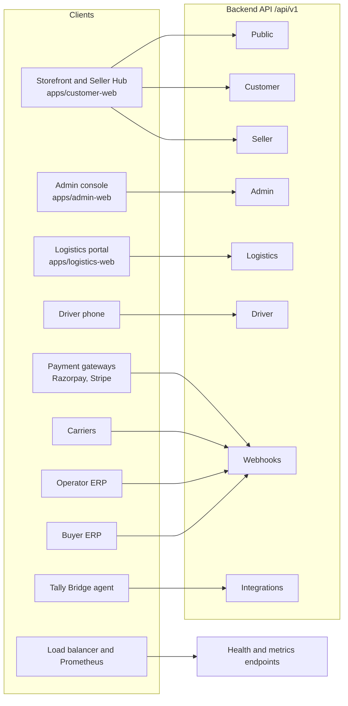
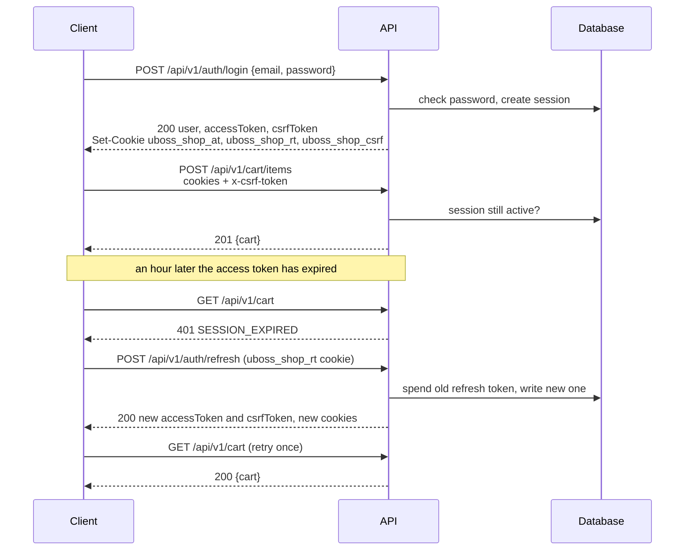
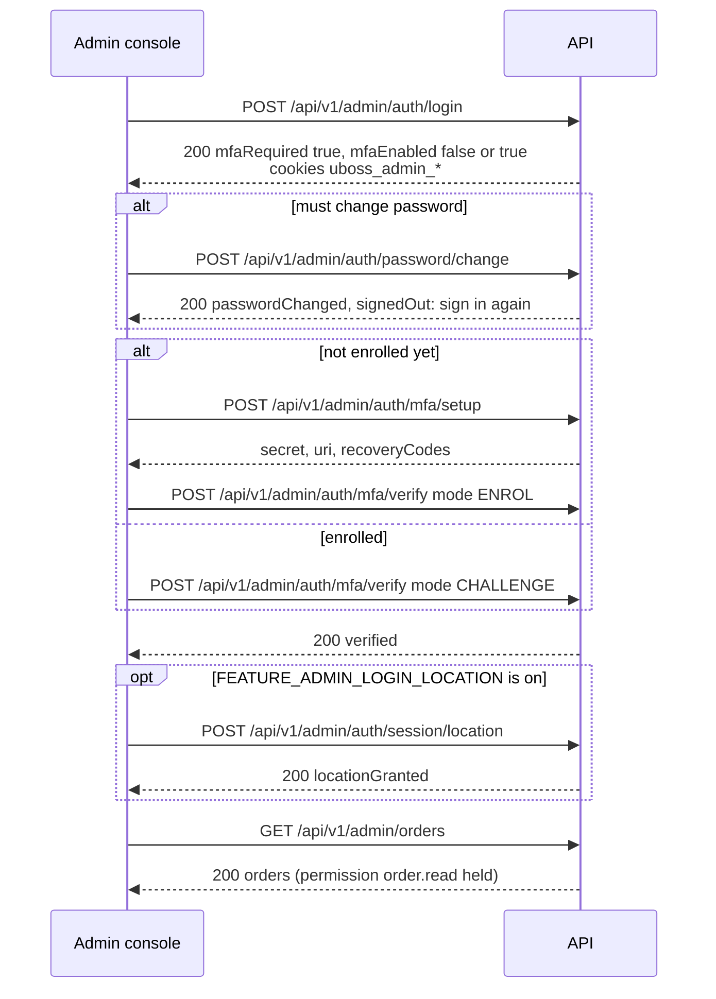
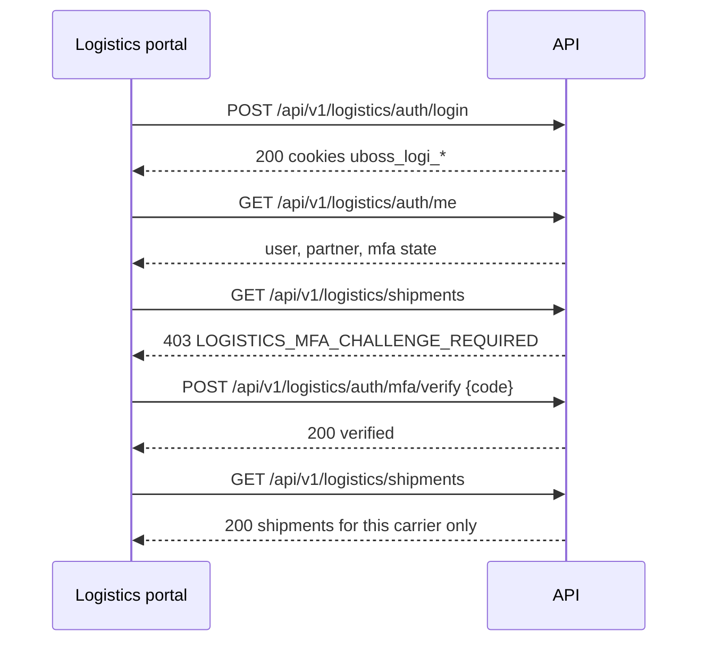
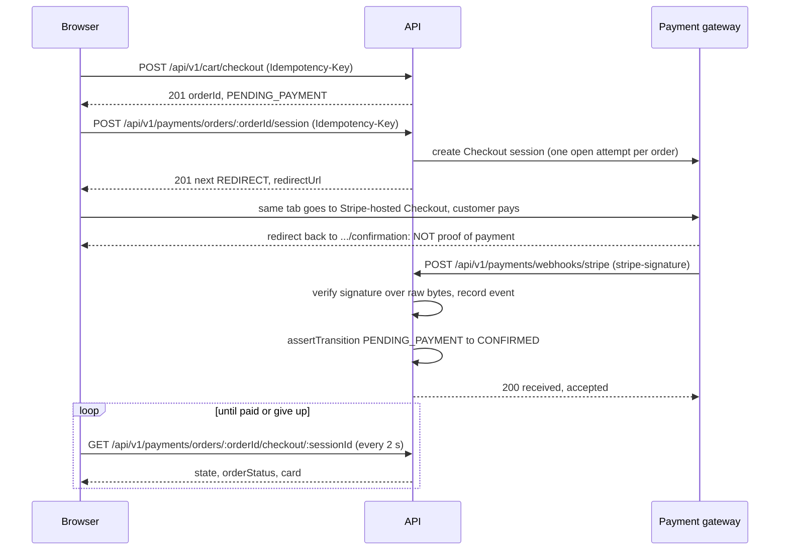

# The Gloviaa Mart API guide

This guide explains how the Gloviaa Mart backend API works and how to use it. Gloviaa Mart
is the product name; the repository is called UBOSS Sourcing, and you will see
both words in the code and in cookie names.

It is written for anybody who has to talk to the backend from a program: a
frontend developer, an integrator connecting an ERP or a carrier, a tester, or a
buyer checking what the software can do. You do not need to know the code to
read it. Every path, header, field and error code named here exists in the code
today.

Two generated reference files sit beside this guide. This guide explains how
the API behaves; the references list what it contains:

| File | What it holds |
|---|---|
| [`reference/API-ENDPOINTS.md`](reference/API-ENDPOINTS.md) | Every endpoint: method, path, who may call it, the exact guard and permission |
| [`reference/ERROR-CODES.md`](reference/ERROR-CODES.md) | Every error code the API can return |

---

## Keeping this document true

This guide describes code, and code changes. A guide that has quietly stopped
being true is worse than no guide, because people trust it and act on it.

**Update this file in the same piece of work** whenever a change alters:

- how somebody signs in, refreshes, or signs out, or a cookie or header name;
- a guard, a permission, a role, or which role holds a permission;
- a feature flag that switches routes on or off;
- the error envelope, the money shape, the pagination shape or the idempotency
  rules;
- a webhook: its path, its signature scheme, or what it answers;
- a request or response used in one of the walkthroughs below;
- a rate limit or an upload limit stated here.

The two reference files are **generated**, never hand-edited. After changing a
route file, `app.ts` or `errors.ts`, rebuild them:

```powershell
cd scripts; npm run docs
```

`npm run docs:check` in the same folder fails when they have fallen behind the
code.

The same change usually also needs `PROJECT-GUIDE.md` (and its Hinglish twin),
`README.md` and the feature guide. `CLAUDE.md` at the repository root lists
exactly when each one must change.

---

## Table of contents

1. [The API in one page](#1-the-api-in-one-page)
2. [Authentication and sessions](#2-authentication-and-sessions)
   - [The buyer context: buying for yourself or for a company](#the-buyer-context-buying-for-yourself-or-for-a-company)
3. [Authorisation: who may do what](#3-authorisation-who-may-do-what)
4. [Conventions every endpoint follows](#4-conventions-every-endpoint-follows)
5. [Errors](#5-errors)
6. [Webhooks in and out](#6-webhooks-in-and-out)
7. [Walkthroughs with real requests](#7-walkthroughs-with-real-requests)
8. [Area-by-area guide](#8-area-by-area-guide)
9. [OpenAPI](#9-openapi)
10. [Health, readiness and metrics](#10-health-readiness-and-metrics)
11. [FAQ for API consumers](#11-faq-for-api-consumers)
12. [Glossary](#12-glossary)

---

# 1. The API in one page

## What it is

The backend is one program, written with **Fastify** (a web framework for
Node.js). It answers **HTTP requests** and speaks **JSON** (a plain-text format
for structured data). There is no other channel: no GraphQL, no WebSocket. Two
kinds of answer stream text as it is written, using **Server-Sent Events**
(SSE, a long HTTP response that sends small pieces as they are ready): the AI
assistant chat and the dashboard "insights" panels.

## The base URL

Every business endpoint starts with the **API prefix** `/api/v1`. The `v1` is
the version. If an answer ever has to change in a way that would break old
clients, the new shape goes under `/api/v2` and `/api/v1` keeps working.

| Where | Base URL |
|---|---|
| Local development | `http://localhost:4000/api/v1` |
| A deployed installation | The same host the browser application is served from, for example `https://shop.example.com/api/v1`. The shipped nginx configuration forwards `/api/v1/` on each site's host to the API |

Three things live **outside** the prefix: the health checks (`/health/live`,
`/health/ready`), the Prometheus metrics (`/metrics`) and, in development, the
uploaded product pictures (`/media/products/...`).

The frontends read the base URL from `VITE_API_BASE_URL`, and fall back to
`http://localhost:4000/api/v1`.

## Requests and responses

- Send bodies as `Content-Type: application/json`. A body that is not valid JSON
  is refused with `400 VALIDATION_FAILED`.
- A JSON body may be at most **1 MiB** (1,048,576 bytes). Larger is
  `413 PAYLOAD_TOO_LARGE`.
- Answers are JSON unless an endpoint says otherwise (a PDF, a CSV export, the
  sitemap XML, an SSE stream).
- There is **no success envelope**. A successful answer is the object itself,
  for example `{ "cart": { ... } }` or `{ "orders": [...], "pagination": {...} }`.
  Only errors share one fixed shape (see [section 5](#5-errors)).
- Every response carries an `x-correlation-id` header. It is the id of this one
  request in the server log. You may send your own (up to 64 characters) and it
  is echoed back; otherwise the server makes one.

## The zones

A **zone** is a group of endpoints that share one kind of caller. The caller's
credential decides which zone it can reach, and the zones never share a
credential.

| Zone | Prefix | Who calls it | How they prove who they are |
|---|---|---|---|
| **Public** | `/api/v1/config`, `/api/v1/catalog/*`, `/api/v1/delivery/*`, `/api/v1/sitemap.xml`, `/api/v1/partner-invitations/*`, `/api/v1/documents/verify`, `/api/v1/payments/links/:token` | Anybody | Nothing. Some public routes answer a signed-in customer better (`optionalCustomer`) |
| **Customer** | `/api/v1/auth/*`, `/api/v1/account/*`, `/api/v1/cart/*`, `/api/v1/orders/*`, `/api/v1/payments/*`, `/api/v1/fulfilment/*`, `/api/v1/pricing/*`, `/api/v1/recurring-schedules/*`, `/api/v1/preorders/*`, `/api/v1/buyer-companies/*`, `/api/v1/documents/*`, `/api/v1/assistant/*`, `/api/v1/sellers/*` | A signed-in storefront customer | Customer session (cookies `uboss_shop_*`, or a Bearer token) |
| **Seller** | `/api/v1/seller/*` | A customer who also sells on the marketplace | The customer session, plus seller membership, a seller role, and the Seller Hub password for this session |
| **Admin** | `/api/v1/admin/*` (sign-in under `/api/v1/admin/auth/*`) | A member of the operator's staff | Admin session (cookies `uboss_admin_*`), plus the named permission, plus two-step sign-in |
| **Logistics** | `/api/v1/logistics/*` (sign-in under `/api/v1/logistics/auth/*`) | A person from a carrier company | Logistics session (cookies `uboss_logi_*`), plus a logistics permission, plus two-step sign-in for some roles |
| **Driver** | `/api/v1/logistics/driver/*` | A carrier's driver, on a phone | A logistics session; the location pings carry a device token instead |
| **Webhooks** | `/api/v1/payments/webhooks/:provider`, `/api/v1/integrations/erp/webhooks/:slug`, `/api/v1/erp-inbound/:slug`, `/api/v1/integrations/carriers/:pathToken/webhook` | Another company's server | A signature over the exact bytes of the body |
| **Integrations** | `/api/v1/integrations/tally-bridge/*` | The Gloviaa Mart Tally Bridge agent on a seller's own computer | A Bearer token issued to that paired device |
| **Token downloads** | `/api/v1/exports/download/:token`, `/api/v1/my-data/download/:token` | Whoever holds a link from an email | The unguessable, expiring token in the path |
| **Health and metrics** | `/health/live`, `/health/ready`, `/metrics` | Load balancers, monitoring | Nothing. `/metrics` is closed to the internet by nginx |

This picture shows which client talks to which zone:


```mermaid
flowchart LR
  subgraph Clients
    SF["Storefront and Seller Hub<br/>apps/customer-web"]
    AD["Admin console<br/>apps/admin-web"]
    LP["Logistics portal<br/>apps/logistics-web"]
    DP["Driver phone"]
    GW["Payment gateways<br/>Razorpay, Stripe"]
    CR["Carriers"]
    OE["Operator ERP"]
    BE["Buyer ERP"]
    TB["Tally Bridge agent"]
    MON["Load balancer and Prometheus"]
  end
  subgraph API["Backend API /api/v1"]
    PUB["Public"]
    CUS["Customer"]
    SEL["Seller"]
    ADM["Admin"]
    LOG["Logistics"]
    DRV["Driver"]
    WH["Webhooks"]
    INT["Integrations"]
  end
  HL["Health and metrics endpoints"]
  SF --> PUB
  SF --> CUS
  SF --> SEL
  AD --> ADM
  LP --> LOG
  DP --> DRV
  GW --> WH
  CR --> WH
  OE --> WH
  BE --> WH
  TB --> INT
  MON --> HL
```

## Which shop a request is for

Before any route runs, the API looks at the request's `Host` header. When the
operator has set `SELLER_STOREFRONT_DOMAIN`, a seller can have their own shop
front on a subdomain of it, and public prices and the public configuration are
answered for that seller. A subdomain that matches no approved seller is refused
with `404 NOT_FOUND` and the message "There is no shop at this address." — it
never falls through to the operator's own catalogue. With the setting empty
(the default) every request is the operator's own shop.

This is decided from the host and nothing else. A query string, a cookie or a
parameter cannot choose whose prices a shopper is charged.

---

# 2. Authentication and sessions

**Authentication** means proving who you are. **Authorisation** (the next
section) means what you are then allowed to do.

## The three audiences

There are three kinds of account, called **audiences** (or user kinds): `ADMIN`
(staff), `CUSTOMER` (buyers, and sellers, who are customers too) and
`LOGISTICS` (people at carrier companies). All three sign in through the same
code, registered three times under three prefixes:

| Audience | Sign-in prefix | Cookie names |
|---|---|---|
| `ADMIN` | `/api/v1/admin/auth` | `uboss_admin_at`, `uboss_admin_rt`, `uboss_admin_csrf` |
| `CUSTOMER` | `/api/v1/auth` | `uboss_shop_at`, `uboss_shop_rt`, `uboss_shop_csrf` |
| `LOGISTICS` | `/api/v1/logistics/auth` | `uboss_logi_at`, `uboss_logi_rt`, `uboss_logi_csrf` |

`_at` is the **access token** cookie, `_rt` the **refresh token** cookie, and
`_csrf` the **CSRF token** cookie (all explained below).

The names are different on purpose. A browser treats two cookies with the same
name on the same host as one cookie, whatever the port. With separate names, a
member of staff and a customer can be signed in at the same time in one browser.

**An audience is checked twice.** The access token carries a claim, `typ`, that
names its audience. The guard compares it with the audience of the route, and
then loads the user from the database and checks the user's own type again. A
customer's token presented to an admin route is refused with `403 FORBIDDEN`
("This credential is not valid for this application."), and a customer's
password presented to the admin sign-in is refused like an unknown account.

## Tokens and cookies

| Token | What it is | How long it lives | Where it travels |
|---|---|---|---|
| **Access token** | A short, signed statement: user id (`sub`), session id (`sid`), audience (`typ`), expiry (`exp`). It is two base64url parts joined by a dot, signed with HMAC-SHA256. Not a JWT | `ACCESS_TOKEN_TTL_SECONDS` (default 3600, one hour) for customers and logistics; `ADMIN_ACCESS_TOKEN_TTL_SECONDS` (default 900, fifteen minutes) for staff | The `_at` cookie (httpOnly), **or** an `Authorization: Bearer <token>` header |
| **Refresh token** | A random secret. The database keeps only its SHA-256 hash | `REFRESH_TOKEN_TTL_SECONDS` (default 2,592,000, thirty days). It slides: each use gives a new one | The `_rt` cookie only (httpOnly). **Never in a response body** |
| **CSRF token** | A random value that proves the caller can read this site's cookies | Same as the refresh cookie | The `_csrf` cookie (readable by JavaScript), and returned as `csrfToken` in the sign-in and refresh answers |
| **Session family** | Not a token: the chain of sessions started by one password sign-in | `SESSION_ABSOLUTE_TTL_SECONDS` (default 7,776,000, ninety days) from the sign-in. It does not slide | Server side only |

**httpOnly** means JavaScript in the page cannot read the cookie, so a script
injected into the page cannot steal the session.

The access token is stateless, but the **session is not**. Every guarded request
also checks that the session row is still active. Sign-out, a password change,
deactivation or a theft alarm ends the session at once, not at the next token
expiry.

Cookie settings come from `COOKIE_SECURE` (send only over HTTPS; set it `true`
in production), `COOKIE_SAME_SITE` (`lax` by default) and `COOKIE_DOMAIN`.

## Two ways to send the access token

1. **Cookies (browsers).** Send requests with credentials included
   (`credentials: 'include'` in `fetch`). The browser attaches the cookies. Every
   state-changing request (anything but `GET`, `HEAD`, `OPTIONS`) must also carry
   the CSRF header.
2. **Bearer (scripts and servers).** Send `Authorization: Bearer <accessToken>`,
   using the `accessToken` from the sign-in answer. **No CSRF header is needed**,
   because a browser cannot attach this header to another site's request.

The server decides by **where the token came from**, not by whether an
`Authorization` header exists. A header like `Authorization: Basic ...` is not a
Bearer token, so the cookie is used and the CSRF check still runs.

## CSRF protection

**CSRF** (cross-site request forgery) is when another website makes your browser
send a request to this API, and the browser helpfully attaches your cookies.

The defence is the **double-submit check**:

- At sign-in the server sets the `_csrf` cookie and also returns the same value
  as `csrfToken`.
- On every cookie-authenticated `POST`, `PUT`, `PATCH` or `DELETE`, the client
  copies that value into the **`x-csrf-token`** header (header names are not
  case-sensitive; `X-CSRF-Token` is the same header).
- The server checks that the cookie and the header match, in constant time.
  Another site cannot read your cookie, so it cannot write the header.

A missing or wrong header is `403 FORBIDDEN` with the message "CSRF validation
failed. Refresh the page and try again."

The CORS allowlist lists `x-csrf-token` as an allowed header; without it a
browser would refuse every write before it was even sent.

## Signing in

`POST {prefix}/login` with `{ "email": "...", "password": "..." }`. It is
limited per address to `RATE_LIMIT_LOGIN_PER_15MIN` (default 10) attempts in 15
minutes. Separately, an account is locked after `LOGIN_LOCKOUT_THRESHOLD`
(default 8) failures for `LOGIN_LOCKOUT_MINUTES` (default 15).

On the customer prefix only, the body may also carry **`buyerType`**:
`"individual"` or `"company"`. It says which tab the person signed in on. It is
a **preference, not a claim**. The password is checked exactly as before, and
only after it is accepted does the server look at `buyerType`. A wrong password
or an unknown email is the same `401 INVALID_CREDENTIALS` on both tabs, so the
field cannot be used to learn whether somebody belongs to a company. Leaving it
out means `"individual"`. The admin and logistics sign-ins ignore it.

A successful answer (`200`) sets the three cookies and returns:

```json
{
  "user": {
    "id": "01J9ZD0A1B2C3D4E5F6G7H8J9K",
    "email": "buyer@acme.local",
    "type": "CUSTOMER",
    "roles": ["customer"],
    "permissions": [],
    "customerProfileId": "01J9ZD1B2C3D4E5F6G7H8J9K0M",
    "mfaEnabled": false,
    "mfaRequired": false,
    "mfaSessionVerified": false,
    "mustChangePassword": false,
    "locationRequired": false,
    "locationGranted": false,
    "locationCountry": null,
    "locationPlace": null,
    "locationLanguage": null,
    "locationCurrency": null
  },
  "accessToken": "eyJzdWIiOi....Qm9n",
  "accessTokenExpiresAt": "2026-09-24T11:00:00.000Z",
  "csrfToken": "d0Zy8u3kq1Vb2mS9xT4nQw7cLp5eHjRa"
}
```

A **customer** sign-in answer also carries three fields about the buyer
context (explained in
[The buyer context](#the-buyer-context-buying-for-yourself-or-for-a-company)).
For example, somebody who signed in on the Company tab and belongs to exactly
one company:

```json
{
  "buyerContext": {
    "kind": "COMPANY",
    "companyId": "01JA2B3C4D5E6F7G8H9J0K1M2N",
    "companyName": "Acme Medical Supplies",
    "companyStatus": "UNDER_REVIEW",
    "role": "OWNER",
    "applicationReference": "BC-7K2M9QXA"
  },
  "companies": [
    {
      "companyId": "01JA2B3C4D5E6F7G8H9J0K1M2N",
      "companyName": "Acme Medical Supplies",
      "companyStatus": "UNDER_REVIEW",
      "role": "OWNER",
      "applicationReference": "BC-7K2M9QXA"
    }
  ],
  "next": "READY",
  "user": { "...": "as above" },
  "accessToken": "...",
  "accessTokenExpiresAt": "...",
  "csrfToken": "..."
}
```

| Field | Meaning |
|---|---|
| `buyerContext` | Who this new session buys for: `{ "kind": "INDIVIDUAL" }`, or `kind: "COMPANY"` with the company's id, name, status, the person's role in it and the application reference |
| `companies` | Every company the person is an active member of, oldest membership first. Empty when `FEATURE_BUYER_COMPANIES` is off |
| `next` | What the storefront should do now (below) |

| `next` | When | What the storefront does |
|---|---|---|
| `READY` | The Individual tab; or the Company tab and exactly one company, which the session is now set to | Goes on, normally to `/` |
| `CHOOSE_COMPANY` | The Company tab and more than one company. The session stays Individual until the person chooses; the server never guesses | Shows `/select-company` |
| `NO_COMPANY` | The Company tab and no company. The person is signed in as an individual | Shows `/select-company`, which offers to register a company |

`NO_COMPANY` is only ever said to somebody who has just proven the password, so
it tells a stranger nothing.

The failures you should expect:

| Code | Status | Meaning |
|---|---|---|
| `INVALID_CREDENTIALS` | 401 | Wrong email or password. The message is the same for an unknown account, so nobody can use it to find out who has one |
| `ACCOUNT_LOCKED` | 401 | Too many failures. Wait for the lockout to end |
| `ACCOUNT_DEACTIVATED` | 401 | The account was closed |
| `ACCOUNT_NOT_ACTIVATED` | 401 | An invited account whose invitation was never accepted |
| `EMAIL_NOT_VERIFIED` | 401 | A self-registered customer who has not opened the confirmation link |
| `ACCOUNT_PENDING_APPROVAL` | 401 | A self-registered customer waiting for staff to approve them |
| `TEMPORARY_PASSWORD_EXPIRED` | 401 | A staff member's emailed temporary password has lapsed |
| `RATE_LIMITED` | 429 | Too many sign-in attempts from this address |

## Staying signed in: refresh

`POST {prefix}/refresh`, with no body. It reads **only the `_rt` cookie**, so a
client that wants to refresh must keep its cookie jar. On success it rotates the
session: the old refresh token is spent, a new one is set, and the answer is:

```json
{
  "accessToken": "eyJzdWIiOi....bm9u",
  "accessTokenExpiresAt": "2026-09-24T12:00:00.000Z",
  "csrfToken": "Vb2mS9xT4nQw7cLp5eHjRad0Zy8u3kq1"
}
```

The CSRF value changes on every refresh. Read it again from the answer or from
the cookie.

The rules a client must follow:

- When a request fails with `401 SESSION_EXPIRED`, refresh **once**, then retry
  the request **once**. If it fails again, send the person to sign in.
- If refresh fails with `401 REFRESH_TOKEN_REUSED`, **stop**. The same refresh
  token arrived twice, which means it was copied. The server has ended the whole
  session family, for both the real client and the thief, because it cannot tell
  which is which. Retrying achieves nothing.
- A failed refresh clears the cookies, so the client stops retrying with a dead
  token.
- Make sure only one refresh runs at a time. The three frontends share one
  in-flight refresh between all requests that hit a 401 together.


```mermaid
sequenceDiagram
  participant C as Client
  participant A as API
  participant D as Database
  C->>A: POST /api/v1/auth/login {email, password}
  A->>D: check password, create session
  A-->>C: 200 user, accessToken, csrfToken<br/>Set-Cookie uboss_shop_at, uboss_shop_rt, uboss_shop_csrf
  C->>A: POST /api/v1/cart/items<br/>cookies + x-csrf-token
  A->>D: session still active?
  A-->>C: 201 {cart}
  Note over C,A: an hour later the access token has expired
  C->>A: GET /api/v1/cart
  A-->>C: 401 SESSION_EXPIRED
  C->>A: POST /api/v1/auth/refresh (uboss_shop_rt cookie)
  A->>D: spend old refresh token, write new one
  A-->>C: 200 new accessToken and csrfToken, new cookies
  C->>A: GET /api/v1/cart (retry once)
  A-->>C: 200 {cart}
```

## Who is signed in

| Audience | Endpoint | Answer |
|---|---|---|
| Customer | `GET /api/v1/auth/me` | The same `user` object as the sign-in answer, with the live values, plus `buyerContext` and `companies` (as in the sign-in answer) and `buyerContextReset`. The context is confirmed against the membership on this request, not copied from the session. `buyerContextReset: true` means the session named a company the person no longer belongs to, and the server has just put it back to Individual |
| Admin | `GET /api/v1/admin/auth/me` | The same shape. For staff, `locationCountry`, `locationPlace`, `locationLanguage` and `locationCurrency` describe where this session signed in (they are always null for customers) |
| Logistics | `GET /api/v1/logistics/auth/me` | `{ user: { id, email, fullName, role, permissions, isDriver }, partner: { id, code, displayName, status, canAcceptNewWork }, mfa }` |

Each audience also has `GET`/`PUT {prefix}/language` for the interface language
(`{ "language": "de" }`; one of `en`, `de`, `es`, `fr`, `it`, `nl`, `pl`, `el`),
and `POST {prefix}/password/change` with `{ currentPassword, newPassword }`.
A new password must be 12 to 128 characters. Changing it ends every session.

## Signing out

| Endpoint | Effect | Answer |
|---|---|---|
| `POST {prefix}/logout` | Ends this session and clears this audience's cookies only. Signing out of the admin panel does not sign you out of the shop | `204` |
| `POST {prefix}/logout-all` | Ends every session of this account, on every device | `200 { "sessionsRevoked": 3 }` |

Both are state-changing, so a cookie client must send `x-csrf-token`.

## Customer sign-up, email confirmation and invitations

These exist only on the customer prefix `/api/v1/auth`:

| Endpoint | Body | Answer |
|---|---|---|
| `POST /api/v1/auth/register` | `fullName`, `email`, `phone`, `country` (two letters), `password`, `acceptedTerms`, `termsDocumentId`, optional `organization`, `language` | `202 { registered, requiresApproval, message }`. The same answer whether or not the address is already taken, so it cannot be used to discover accounts. 5 per hour per address |
| `POST /api/v1/auth/verify-email` | `{ token }` from the email | `200 { verified, email, status }` |
| `POST /api/v1/auth/verify-email/resend` | `{ email }` | `202` with a neutral message |
| `POST /api/v1/auth/invitations/accept` | `{ token, password, acceptedTerms, termsDocumentId }` | `200 { activated, email, message }` |
| `GET /api/v1/account/config` | none, public | `{ selfRegistrationEnabled }` so the storefront knows whether to show "Create account" |

Self-registration is off unless `FEATURE_CUSTOMER_SELF_REGISTRATION=true`; when
off, `register` answers `403 SELF_REGISTRATION_DISABLED`. Whether a new account
must also wait for staff approval is `CUSTOMER_SELF_REGISTRATION_REQUIRES_APPROVAL`.

The logistics prefix has its own `POST /api/v1/logistics/auth/invitations/accept`
for a carrier's staff.

### Terms and Conditions: which ones, and proving they were agreed to

All three of those endpoints need the Terms and Conditions in force. The client
asks which they are, shows them, and sends back the document's id:

1. `GET /api/v1/legal/current?kind=PLATFORM_TERMS&locale=pl` (`kind` is
   `LOGISTICS_PARTNER_TERMS` on the carrier portal). The answer is
   `{ document, requestedLocale, isFallback }`. `document` holds `id`,
   `version`, `locale`, `title`, `body`, `changeSummary`, `effectiveAt`,
   `publishedAt` and `contentSha256`. `isFallback` is true when the Terms are
   not published in the language asked for; `document.locale` then says which
   language they are in (English where it exists).
2. The person reads them and agrees. The client sends `acceptedTerms: true` and
   `termsDocumentId: document.id`.
3. The server checks the id names a published document of the kind this account
   needs, and that its version is the one in force now. It then writes the
   acceptance (version, language, hash, where it was given, the server's own
   time) in the same transaction that creates or activates the account.

Nothing else about the agreement is read from the request. The old
`consentVersion` field is ignored.

`body` is plain text: a line starting `## ` is a heading, `- ` is a bullet,
and a blank line ends a paragraph. Render it as text, never as HTML.

| Refusal | Status | Meaning |
|---|---|---|
| `TERMS_ACCEPTANCE_REQUIRED` | 400 | `acceptedTerms` was not true, or no `termsDocumentId` was sent |
| `TERMS_VERSION_OUTDATED` | 409 | The document is not the version in force: a newer one was published, it is not in force yet, or it was never published. `details[0].meta.currentVersion` names the current one. Fetch it again and ask again |
| `TERMS_DOCUMENT_UNAVAILABLE` | 503 | No Terms of that kind are published, so no account can be opened. The operator must publish them |

An invitation link is not spent by a Terms refusal: the checks run before the
link is redeemed, so the person agrees to the current version and sends again.
A link for another surface (a customer's link posted to the carrier portal) is
refused as `TOKEN_INVALID` before it is spent, too.

Public, and needing no session:

| Endpoint | Answer |
|---|---|
| `GET /api/v1/legal/current?kind=&locale=` | The Terms in force, as above. `no-store` |
| `GET /api/v1/legal/versions?kind=` | `{ versions: [{ id, version, locale, title, effectiveAt, isCurrent }] }`, newest first, including versions not yet in force |
| `GET /api/v1/legal/documents/:id` | One published document of any version. A draft is 404 |
| `GET /api/v1/legal/documents/:id/pdf` | The same document as a PDF, built from the stored text. Always the same bytes for the same document. 30 per 15 minutes per address |

The admin console manages them under `/api/v1/admin/legal-documents`: list,
read, create a draft, change or delete a draft, and `POST …/:id/publish`.
Permissions `legal_document.read`, `legal_document.write` and
`legal_document.publish`. A published document is refused with
`409 LEGAL_DOCUMENT_IMMUTABLE` on any change; a repeated kind, version and
language with `409 LEGAL_DOCUMENT_VERSION_EXISTS`. Publishing moves an effective
date in the past to now, and refuses one earlier than the latest published
version in the same language.

A person who wants to buy for a company signs up exactly as above: one account,
the same confirmation email, the same password rules. The company is applied
for afterwards, from inside the account, through `/api/v1/buyer-companies`
(see [Buyer companies](#buyer-companies-buyer-companiescustomerts-and-buyer-companiesadmints)).

Every prefix also has password reset:

| Endpoint | Body | Answer |
|---|---|---|
| `POST {prefix}/password/forgot` | `{ email }` | `202` with a neutral message. 5 per 15 minutes |
| `POST {prefix}/password/reset` | `{ token, newPassword }` | `200 { passwordReset: true }`. Ends every session |

## The buyer context: buying for yourself or for a company

A storefront customer can buy **as themselves** (the **individual** context,
which is how every account worked before) or **for a company they belong to**
(the **company** context). A company becomes one the person belongs to by
applying for it; see
[Buyer companies](#buyer-companies-buyer-companiescustomerts-and-buyer-companiesadmints).
All of this exists only while `FEATURE_BUYER_COMPANIES` is on (the default).

**Where it is held.** On the server-side **session row**, and nowhere else. It
is never read from a cookie, a header or a request body. A refresh-token
rotation carries it onto the new session. The sign-in sets it (see
[Signing in](#signing-in)); after that it changes only through these two
routes:

| Endpoint | Body | Answer |
|---|---|---|
| `GET /api/v1/auth/buyer-context` | none | `{ buyerContext, companies }`: who this session buys for now, and every company it may switch to |
| `PUT /api/v1/auth/buyer-context` | `{ "kind": "INDIVIDUAL" }` or `{ "kind": "COMPANY", "companyId": "01JA..." }` | `200 { buyerContext, companies }` |

The switch is state-changing, so a cookie client sends `x-csrf-token`. It is
limited to **30 per 15 minutes**, and every switch is written to the audit log
(`buyer_context.switched`). No second password is asked: the person is
choosing between rights they already hold.

**One refusal for every reason.** A company id that is not the person's, a
membership that was removed, and a company that does not exist all get the
same `403 BUYER_CONTEXT_INVALID`. So guessing ids teaches nothing.

**Checked again on every request.** Each customer request re-reads the
membership behind a company context before the route runs. If the person was
removed from the company, or the company is gone, the server puts the session
back to Individual **and refuses that request** with `403 BUYER_CONTEXT_INVALID`
("You can no longer buy for that company. You are now shopping for yourself.").
It refuses rather than quietly carrying on as the individual, because somebody
who pressed "place order" for the company must not find the order on their own
account. The next request works as Individual. `GET /api/v1/auth/me` reports
the same event as `buyerContextReset: true`.

A company that is **suspended or rejected is not a reset**. The person stays in
its context and is told why they cannot buy (the purchasing gate below).

Turning `FEATURE_BUYER_COMPANIES` off makes every company context invalid, so
those sessions are reset the same way.

### What the context scopes

| Area | In the individual context | In a company context |
|---|---|---|
| Cart | The person's own basket | A separate basket for that company. There is one active basket per person per company, so switching never mixes them |
| Orders (`/api/v1/orders/*`) | Only the person's own orders **not** placed for a company | A company **Buyer** sees the company's orders they placed. Every other company role sees all of the company's orders |
| Paying an order (`/api/v1/payments/orders/:orderId/*`) | Own orders | Only an order this person placed for this company |
| Addresses (`/api/v1/account/addresses`) | The person's own address book | The company's own address book. On the company's first approval, its verified billing and delivery addresses are copied into it |
| Preorders (`/api/v1/preorders/*`) | Own preorders | The company's preorders. The order made when one is confirmed belongs to the company |
| Recurring and scheduled orders (`/api/v1/recurring-schedules/*`) | Work as before | **Refused** with `403 BUYER_CONTEXT_UNSUPPORTED`. The scheduling worker only knows a person's profile, so a plan made here would place orders for the wrong buyer. Switch to Individual to use them |

An order, cart or preorder from the other context, or from somebody else, is a
`404 NOT_FOUND`, never a `403` (the same ownership rule as everywhere else).

Two honest limits: pricing and tax in a company context still use the
**person's** profile (for example the VAT number used for zero-rating), and
nothing here is linked to the separate "buyer organisation" used for a buyer's
own ERP connection.

### The purchasing gate

Inside a company context, what a request may do depends on two things: the
person's **role** in the company and the company's **status**.

| Company role | May buy (checkout, pay, send or confirm a preorder) | Other rights |
|---|---|---|
| `OWNER` | Yes | Manage the application, approve orders, finance, manage members |
| `COMPANY_ADMIN` | Yes | The same as the owner |
| `BUYER` | Yes | View |
| `ORDER_APPROVER` | No | Approve orders, view |
| `FINANCE` | No | Finance, view |
| `VIEWER` | No | View |

The person who applies for a company becomes its `OWNER`. **Inviting other
members is not built yet**: the roles exist, but there is no invitation route.

- **Only an `APPROVED` company can buy.** Checkout, paying, and sending or
  confirming a preorder in any other status are refused with
  `403 BUYER_COMPANY_NOT_APPROVED`.
- **Getting ready is allowed before approval.** Changing the basket and the
  company's address book work while the company is still pending, for any role
  that may buy.
- **The wrong role** is `403 BUYER_COMPANY_ROLE_FORBIDDEN`.

`BUYER_COMPANY_NOT_APPROVED` carries the company's status, so a client can say
why and link to the application instead of showing a bare refusal:

```json
{
  "error": {
    "code": "BUYER_COMPANY_NOT_APPROVED",
    "message": "This company is not verified for purchasing yet. You can keep browsing and building your cart.",
    "details": [
      {
        "code": "UNDER_REVIEW",
        "meta": { "status": "UNDER_REVIEW", "companyId": "01JA2B3C4D5E6F7G8H9J0K1M2N" }
      }
    ],
    "correlationId": "01J9ZE2C3D4E5F6G7H8J9K0M1N"
  }
}
```

The individual context is never gated this way: everything a customer could do
before still works exactly as it did.

## Staff: temporary passwords, two-step sign-in and location

A staff session has up to three extra gates before it may use any admin route.
Each gate is enforced by the API, not only by the admin screens.

**1. Temporary password.** A new staff account gets an emailed temporary
password. Until the person sets their own, every admin route answers
`403 PASSWORD_CHANGE_REQUIRED`. Only `/me`, `/password/change`, `/logout` and
`/language` stay open. The sign-in answer says `mustChangePassword: true`.

**2. Two-step sign-in (MFA).** MFA means a second proof after the password: a
six-digit code from an authenticator app (TOTP, a time-based one-time
password). It is on for staff unless `FEATURE_ADMIN_MFA=false`. With it on, every
admin route answers `403 MFA_REQUIRED` until **this session** has passed a code.

| Endpoint | Body | Answer |
|---|---|---|
| `POST /api/v1/admin/auth/mfa/setup` | none | `{ secret, uri, recoveryCodes }`. `uri` is the `otpauth://` link to show as a QR code. Replacing an existing factor needs this session to have passed the old one first |
| `POST /api/v1/admin/auth/mfa/verify` | `{ "code": "123456", "mode": "ENROL" }` to finish setting up, or `"mode": "CHALLENGE"` (the default) at each sign-in | `{ verified: true }`, and for a challenge also `usedRecoveryCode` and `recoveryCodesRemaining`. Either mode marks this session as verified |

A wrong code is `MFA_INVALID`. Both answers are sent with
`cache-control: no-store`.

**3. Sign-in location.** Only when `FEATURE_ADMIN_LOGIN_LOCATION=true` (off by
default). The session must report where it is before admin routes work; until
then they answer `403 LOCATION_REQUIRED`.

`POST /api/v1/admin/auth/session/location` with
`{ "latitude": 52.52, "longitude": 13.405, "accuracyM": 30 }` answers
`{ locationGranted: true, place, recordedAt }`. It is limited to 20 per 15
minutes. The storefront never asks a customer for this.


```mermaid
sequenceDiagram
  participant P as Admin console
  participant A as API
  P->>A: POST /api/v1/admin/auth/login
  A-->>P: 200 mfaRequired true, mfaEnabled false or true<br/>cookies uboss_admin_*
  alt must change password
    P->>A: POST /api/v1/admin/auth/password/change
    A-->>P: 200 passwordChanged, signedOut: sign in again
  end
  alt not enrolled yet
    P->>A: POST /api/v1/admin/auth/mfa/setup
    A-->>P: secret, uri, recoveryCodes
    P->>A: POST /api/v1/admin/auth/mfa/verify mode ENROL
  else enrolled
    P->>A: POST /api/v1/admin/auth/mfa/verify mode CHALLENGE
  end
  A-->>P: 200 verified
  opt FEATURE_ADMIN_LOGIN_LOCATION is on
    P->>A: POST /api/v1/admin/auth/session/location
    A-->>P: 200 locationGranted
  end
  P->>A: GET /api/v1/admin/orders
  A-->>P: 200 orders (permission order.read held)
```

## Logistics: the portal's own gates

The logistics portal exists only when `FEATURE_LOGISTICS_PORTAL=true`. With it
off, every guarded logistics route answers `403 FEATURE_DISABLED`.

A logistics account must belong to a carrier company (otherwise
`403 LOGISTICS_PARTNER_REQUIRED`). The **Partner Owner** and **Partner
Administrator** roles must use two-step sign-in. Until they do, every permission-
guarded logistics route answers `403 LOGISTICS_MFA_SETUP_REQUIRED` (never set up)
or `403 LOGISTICS_MFA_CHALLENGE_REQUIRED` (set up, but not yet entered in this
session).

| Endpoint | Body | Answer |
|---|---|---|
| `POST /api/v1/logistics/auth/mfa/setup` | none | The enrolment secret and link |
| `POST /api/v1/logistics/auth/mfa/verify` | `{ code, mode: "ENROL" \| "CHALLENGE" }` | `{ verified: true, usedRecoveryCode, ... }` |

`GET /api/v1/logistics/auth/me`, the MFA endpoints and sign-out stay open before
the second factor, so the portal can show the right screen.


```mermaid
sequenceDiagram
  participant L as Logistics portal
  participant A as API
  L->>A: POST /api/v1/logistics/auth/login
  A-->>L: 200 cookies uboss_logi_*
  L->>A: GET /api/v1/logistics/auth/me
  A-->>L: user, partner, mfa state
  L->>A: GET /api/v1/logistics/shipments
  A-->>L: 403 LOGISTICS_MFA_CHALLENGE_REQUIRED
  L->>A: POST /api/v1/logistics/auth/mfa/verify {code}
  A-->>L: 200 verified
  L->>A: GET /api/v1/logistics/shipments
  A-->>L: 200 shipments for this carrier only
```

## Sellers: the Seller Hub password

A seller signs in as a customer; there is no fourth audience. Every
`/api/v1/seller/*` route then also needs a second password, the **Seller Hub
password**, opened for this session:

| Endpoint | Body | Answer |
|---|---|---|
| `GET /api/v1/sellers/me` | none | `{ seller: null }`, or the membership with `status`, `role`, `permissions`, `isTrading`, `lock` and `session` |
| `POST /api/v1/sellers/lock` | `{ newPassword, currentPassword? }` (12 to 128 characters) | `{ lock }`. Sets or changes it |
| `POST /api/v1/sellers/lock/open` | `{ password }` | `{ lock }`. Opens the Hub for this session |
| `POST /api/v1/sellers/lock/close` | none | `{ lock }` |
| `GET /api/v1/sellers/session` | none | `{ session: { expiresAt, idleTimeoutSeconds, warningSeconds } }`: when the open Hub closes, and the two settings. Reading it is **not** activity |
| `POST /api/v1/sellers/session/renew` | none | "Stay signed in": the Hub stays open for another full idle period. CSRF required; audited |

Until a password is set, seller routes answer `403 SELLER_LOCK_NOT_SET`; while it
is set but not opened, `403 SELLER_LOCK_REQUIRED`; a wrong one is
`403 SELLER_LOCK_INVALID`.

### The Seller Hub idle limit

An open Hub closes itself when nobody has used it for
`SELLER_HUB_IDLE_TIMEOUT_SECONDS` (default 3600, sixty minutes; allowed 300 to
86,400). The seller guard checks it on the server, on every `/api/v1/seller/*`
route and on the two `/api/v1/sellers/session` routes. Only the Hub closes: the
shop session, the console and the logistics portal are not affected, and the
access and refresh token lifetimes do not change.

- **What counts as activity.** Any `POST`, `PUT`, `PATCH` or `DELETE` to a Hub
  route, or a `GET` that carries the request header **`x-seller-activity: 1`**.
  The storefront sends that header only when the person clicked or pressed a
  key in the last 15 seconds and the tab is visible. Background polling (the
  notification badges), hidden tabs and mouse movement do not count. The server
  writes the activity time at most every 30 seconds.
- **What every Hub answer carries.** The response header
  **`x-seller-session-expires-at`**: the ISO time at which the Hub closes if
  nothing else happens. Both headers pass through CORS.
- **When the limit passes.** The server clears the unlock on the session row
  and answers `403 SELLER_SESSION_EXPIRED` ("Your Seller Hub session expired due
  to inactivity. Please sign in again."). After that, every Hub request gets
  `403 SELLER_LOCK_REQUIRED` until `POST /api/v1/sellers/lock/open` succeeds.
  `GET /api/v1/sellers/session` and `POST /api/v1/sellers/session/renew` are
  also refused with `SELLER_SESSION_EXPIRED` once the Hub has closed.
- **Warning.** `SELLER_HUB_IDLE_WARNING_SECONDS` (default 300, five minutes;
  shorter than the limit) is returned as `warningSeconds`. The storefront uses
  it to ask "Are you still there?" before the end.
- **Refresh.** A refresh-token rotation copies the Hub unlock and the activity
  time onto the new session, so refreshing never closes the Hub.
- **Still true.** Closing the Hub and signing out end it at once; a password
  reset or email change ends every session; replaying an old refresh token ends
  the whole family. Opening the Hub does not issue a new session id.
- **Audit actions.** `seller.lock.opened`, `seller.lock.closed`,
  `seller.session.renewed`, `seller.session.expired`.

---

# 3. Authorisation: who may do what

## The rule: deny by default

A route is unreachable unless it names a **guard** (a check that runs before
the handler). There is no "signed in, therefore allowed" path.

| Guard | Used on | What it checks |
|---|---|---|
| `requireAdmin(Permission.X, ...)` | Admin routes | An admin session, the temporary-password, MFA and location gates, and **all** the listed permissions |
| `requireAuthenticated(kind)` | `/me`, `/logout`, `/password/change`, `/language`, `/mfa/*`, `/session/location` | Any valid session of that audience, before the extra gates |
| `requireCustomer` | Customer routes | A customer session with a customer profile |
| `optionalCustomer` | A few public routes that answer a customer better (AI assistant, bulk pricing, preorder eligibility) | No credential means guest. A credential that is sent must be valid, or the request fails |
| `requireSeller(SellerPermission.X, ...)` | Seller Hub routes | A customer session, seller membership, the Seller Hub password opened, and each listed seller permission |
| `requireTradingSeller(...)` | Seller routes that sell or ship | As above, and the seller must be approved and not suspended |
| `requireLogisticsSession` | `/logistics/auth/me`, `/logistics/auth/mfa/*` | The portal is on, a logistics session, and membership of a carrier |
| `requireLogistics(LogisticsPermission.X, ...)` | Logistics routes | As above, the MFA gate, and each listed permission |
| Feature guards (`requireFeature` inside a route file) | Optional features | That the feature's switch is on (see below) |

**Ownership.** Customer routes never take the id of the owner. The customer is
always the one in the session, and every query is scoped by it. A row that
belongs to somebody else answers `404 NOT_FOUND`, never `403`, so that nobody can
learn that it exists. Seller and logistics routes work the same way: there is no
seller id or carrier id in any path; both come from the session.

## Staff permissions

A **permission** is a named right, written `resource.action`. Staff get
permissions through **roles**. The five staff roles are fixed; the sixth role,
`customer`, holds no admin permission at all.

Role columns: **Owner** = Business Owner / Super Admin, **Cat** = Catalog
Manager, **Inv** = Inventory Manager, **Ord** = Order Manager, **Fin** =
Finance / Approver. The Business Owner holds every permission.

| Permission | What it lets somebody do | Owner | Cat | Inv | Ord | Fin |
|---|---|:-:|:-:|:-:|:-:|:-:|
| `settings.read` | Read business settings, tax classes, shipping methods, feature flags, exchange rates | ✓ | ✓ | ✓ | ✓ | ✓ |
| `settings.write` | Change business settings, VAT rates, shipping methods, exchange rates, seller commission | ✓ | | | | |
| `feature_flag.write` | Switch a runtime feature flag on or off | ✓ | | | | |
| `staff.read` | See the staff list | ✓ | | | | |
| `staff.write` | Create staff, issue temporary passwords, deactivate staff | ✓ | | | | |
| `role.assign` | Give roles to staff (only roles whose permissions you hold yourself) | ✓ | | | | |
| `category.read` | Read categories | ✓ | ✓ | ✓ | ✓ | |
| `category.write` | Create and edit categories and their translations | ✓ | ✓ | | | |
| `category.archive` | Archive a category | ✓ | ✓ | | | |
| `product.read` | Read products, prices, variants, safety data; see seller listings waiting for review | ✓ | ✓ | ✓ | ✓ | ✓ |
| `product.write` | Create and edit products, prices, variants, translations | ✓ | ✓ | | | |
| `product.publish` | Make a product buyable; approve seller listings and brand requests | ✓ | ✓ | | | |
| `product.archive` | Archive a product | ✓ | ✓ | | | |
| `product.import` | Bulk import products from a file | ✓ | ✓ | | | |
| `media.upload` | Upload product pictures | ✓ | ✓ | | | |
| `review.read` | Read every product review, including hidden ones and who wrote them | ✓ | ✓ | | ✓ | |
| `review.moderate` | Hide a product review (a reason is required and shown to its author) and show it again | ✓ | ✓ | | | |
| `coupon.read` | Read coupons and store-wide quantity discounts | ✓ | ✓ | | | |
| `coupon.write` | Create and edit coupons and quantity discounts | ✓ | ✓ | | | |
| `coupon.archive` | Retire a live coupon | ✓ | ✓ | | | |
| `inventory.read` | Read stock, movements, warehouses | ✓ | ✓ | ✓ | ✓ | |
| `inventory.receive` | Record goods received | ✓ | | ✓ | | |
| `inventory.adjust` | Correct stock up or down | ✓ | | ✓ | | |
| `inventory.location.write` | Add and edit warehouses | ✓ | | ✓ | | |
| `customer.read` | Read customers and sellers | ✓ | | | ✓ | ✓ |
| `customer.write` | Edit customers and their addresses, send password resets | ✓ | | | | |
| `customer.invite` | Invite a customer | ✓ | | | | |
| `customer.limits.write` | Change a customer's purchasing limits | ✓ | | | | ✓ |
| `customer.status.write` | Approve, suspend or reactivate customers; decide seller applications and documents | ✓ | | | | |
| `buyer_company.read` | See the company verification queue, one application, its registry checks, and open its documents | ✓ | | | ✓ | ✓ |
| `buyer_company.review` | Work a company application: start or take the review, assign it, add internal notes, ask for more information, approve, reject, ask for re-verification, re-run the registry checks, accept or refuse a document | ✓ | | | | ✓ |
| `buyer_company.suspend` | Suspend an approved company. Restoring a suspended company needs this **and** `buyer_company.review` | ✓ | | | | |
| `assistant_chat.read` | Read AI chat transcripts | ✓ | | | ✓ | ✓ |
| `support_ticket.view` | Read the support inbox, every ticket, its internal notes and its files | ✓ | | | ✓ | ✓ |
| `support_ticket.reply` | Reply to a sender, write an internal note, change status and priority, take or release a ticket | ✓ | | | ✓ | |
| `support_ticket.assign` | Give a ticket to a colleague or take it off them | ✓ | | | | |
| `order.read` | Read orders, returns, preorders | ✓ | | ✓ | ✓ | ✓ |
| `order.approve` | Approve or reject an order waiting for approval | ✓ | | | | ✓ |
| `order.fulfil` | Ship orders; act on preorders | ✓ | | | ✓ | |
| `order.cancel` | Cancel an order | ✓ | | | ✓ | ✓ |
| `order.return` | Handle returns | ✓ | | | ✓ | |
| `order.note.write` | Write internal order notes | ✓ | | | ✓ | ✓ |
| `payment.read` | Read payments, webhook health, refund quotes | ✓ | | | ✓ | ✓ |
| `payment_link.create` | Create and revoke payment links | ✓ | | | | ✓ |
| `payment_gateway.write` | Connect and configure payment gateways | ✓ | | | | ✓ |
| `refund.create` | Refund money | ✓ | | | | ✓ |
| `schedule.read` | Read recurring and scheduled orders | ✓ | | | ✓ | ✓ |
| `schedule.write` | Pause, resume or cancel customers' schedules | ✓ | | | | ✓ |
| `integration.read` | Read ERP and other integrations | ✓ | | | | |
| `integration.write` | Configure and run integrations | ✓ | | | | |
| `logistics.read` | Read carriers, shipments, exceptions, carrier integrations | ✓ | | ✓ | ✓ | |
| `logistics.write` | Create carriers, set their regions and SLA, invite their owner, suspend them | ✓ | | | | |
| `logistics.assign` | Put a consignment on a carrier, take it off, correct a status | ✓ | | | ✓ | |
| `logistics.integration.write` | Configure a carrier API connection and rotate its secret | ✓ | | | | |
| `finance.policy.read` | Read platform-fee policies | ✓ | | | | ✓ |
| `finance.policy.write` | Draft, publish and retire platform-fee policies | ✓ | | | | ✓ |
| `finance.tax.verify` | Mark a fee policy's tax rule as verified | ✓ | | | | ✓ |
| `report.read` | Read reports and the dashboard | ✓ | ✓ | ✓ | ✓ | ✓ |
| `export.create` | Create report exports | ✓ | | ✓ | ✓ | ✓ |
| `audit.read` | Read the audit log | ✓ | | | | ✓ |
| `invoice.read` | Read invoices and credit notes | ✓ | | | ✓ | ✓ |
| `invoice.issue` | Issue an invoice or a credit note | ✓ | | | | ✓ |
| `commission_invoice.view` | See the commission invoices to sellers, one invoice with its history, the awaiting list, the settings and an order's commission card | ✓ | | | | ✓ |
| `commission_invoice.preview` | Render a draft commission invoice as a watermarked PDF | ✓ | | | | ✓ |
| `commission_invoice.generate` | Create, rebuild and discard a draft commission invoice | ✓ | | | | ✓ |
| `commission_invoice.issue` | Issue a commission invoice, void an issued one where the settings allow it, record the seller's payment | ✓ | | | | ✓ |
| `commission_invoice.download` | Download an issued commission invoice or credit note PDF | ✓ | | | | ✓ |
| `commission_credit_note.create` | Issue a credit note against an issued commission invoice | ✓ | | | | ✓ |
| `commission_invoice.settings.write` | Change who commission invoices are issued by, their numbering and rules | ✓ | | | | ✓ |
| `data_request.read` | See the data-protection request queue | ✓ | | | | |
| `data_request.action` | Approve or reject a data-protection request | ✓ | | | | |

The source of truth is `backend/src/domain/permissions.ts`. The admin sign-in
answer lists the caller's `permissions`, so a screen can hide what the person
cannot do. Hiding is a convenience; the API refuses anyway with
`403 PERMISSION_DENIED`.

Two details worth knowing:

- `requireAdmin` with several permissions needs **all** of them. For example,
  `POST /api/v1/admin/staff` needs `staff.write` **and** `role.assign`.
- Order status changes are checked twice: `POST /api/v1/admin/orders/:id/transition`
  needs `order.read`, and then the order state machine demands the permission of
  the particular move (for example `order.cancel` to cancel, `order.fulfil` to
  ship). See `backend/src/domain/order-state-machine.ts`.

## Seller roles

A seller company has **members**. Each member has one seller role. Seller
permissions are separate from staff permissions and are never mixed.

| Seller role | What it is for |
|---|---|
| `OWNER` (Seller Owner) | Everything, including the team and the marketplace agreements |
| `ADMIN` (Seller Admin) | Runs the business day to day. Everything except accepting agreements |
| `CATALOGUE_MANAGER` | Listings, brands, product pictures, offer prices, bulk import |
| `INVENTORY_MANAGER` | Stock, warehouses, reorder thresholds, stock synchronisation |
| `ORDER_MANAGER` | Orders, dispatch, shipments, returns |
| `FINANCE_VIEWER` | Settlements, statements, payouts. Read only |
| `SUPPORT_MEMBER` | Reads orders and listings to answer a buyer. Changes nothing |

| Seller permission | Meaning | Roles that hold it (besides Owner) |
|---|---|---|
| `seller.account.read` | Read the seller profile | all |
| `seller.account.write` | Edit profile, logo, documents, invoice settings | Admin |
| `seller.account.submit` | Submit the seller application | Admin |
| `seller.agreement.accept` | Accept marketplace agreements | Owner only |
| `seller.member.read` / `seller.member.write` | See / manage team members | Admin |
| `seller.listing.read` | Read listings and drafts | Admin, Catalogue, Inventory, Order, Support |
| `seller.listing.write` | Create and edit listings and drafts | Admin, Catalogue |
| `seller.listing.submit` | Submit a draft for review | Admin, Catalogue |
| `seller.offer.publish` | Pause or resume a live listing | Admin, Catalogue |
| `seller.offer.price.write` | Change prices and preorder terms | Admin, Catalogue |
| `seller.brand.request` | Ask for a new brand | Admin, Catalogue |
| `seller.media.upload` | Upload listing pictures | Admin, Catalogue |
| `seller.bulk_import.run` | Run a bulk import | Admin, Catalogue |
| `seller.inventory.read` | Read stock | Admin, Catalogue, Inventory, Order, Support |
| `seller.inventory.write` / `seller.inventory.adjust` | Change stock | Admin, Inventory |
| `seller.location.read` | Read warehouses | Admin, Catalogue, Inventory, Order |
| `seller.location.write` | Manage warehouses | Admin, Inventory |
| `seller.order.read` | Read orders | Admin, Inventory, Order, Finance, Support |
| `seller.order.fulfil` | Ship orders, book carriers, act on preorders | Admin, Order |
| `seller.order.cancel`, `seller.return.handle` | Cancel, handle returns | Admin, Order |
| `seller.finance.read` | Settlements and payouts | Admin, Finance |
| `seller.payout.setup` | Set up the payout account | Admin |
| `seller.fulfilment.read` | Read delivery set-up | Admin, Inventory, Order |
| `seller.fulfilment.write` | Change delivery set-up and logistics levels | Admin |
| `seller.carrier.credential.write` | Enter the seller's own carrier API keys | Admin |
| `seller.integration.read` | Read the seller's ERP connection | Admin, Inventory |
| `seller.integration.write` | Configure it | Admin |
| `seller.analytics.read` | Read analytics | Admin, Catalogue, Inventory, Order, Finance |
| `seller.audit.read` | Read the seller's audit log | Admin |

A missing seller permission is `403 SELLER_ROLE_DENIED`. A seller that is not yet
approved gets `403 SELLER_NOT_APPROVED` on trading routes, and a suspended one
`403 SELLER_SUSPENDED`. Source: `backend/src/domain/seller-permissions.ts`.

## Logistics roles

| Logistics role | What it is for | Two-step sign-in |
|---|---|---|
| `LOGISTICS_PARTNER_OWNER` (Partner Owner) | Everything in the carrier company | Required |
| `LOGISTICS_PARTNER_ADMIN` (Partner Administrator) | Runs the company, its people and its fleet | Required |
| `DISPATCHER` | Accepts work, schedules pickups, builds manifests, assigns drivers | Optional |
| `DRIVER` | Sees only their own stops, scans, updates status, captures proof of delivery | Optional |
| `OPERATIONS_AGENT` | Works the exception queue | Optional |
| `READ_ONLY_TRACKING_USER` (Tracking Viewer) | Reads shipments. Cannot see where a driver is | Optional |

| Logistics permission | Meaning |
|---|---|
| `logistics.organisation.read` / `.write` | Read / edit the carrier's own profile |
| `logistics.member.read` / `.write` | See / manage the carrier's people |
| `logistics.shipment.read` | List and read the carrier's shipments |
| `logistics.shipment.accept` | Accept or reject offered work |
| `logistics.shipment.status.write` | Record tracking events |
| `logistics.shipment.exception.write` | Raise and update exceptions |
| `logistics.shipment.export` | Export shipments |
| `logistics.document.read` / `.write` | Read / upload shipment documents |
| `logistics.pod.write` | Record proof of delivery |
| `logistics.pickup.read` / `.write` | Pickups |
| `logistics.dispatch.read` / `.write` | Dispatch manifests |
| `logistics.driver.read` / `.write` / `.assign` | Drivers, and putting them on shipments |
| `logistics.vehicle.read` / `.write` | Vehicles |
| `logistics.driver.task.read` | A driver's own task list |
| `logistics.trip.write` | Start and end trips, consent to location sharing |
| `logistics.trip.location.read` | See a driver's live position |
| `logistics.company.read` | Read the seller and buyer companies on the carrier's work |
| `logistics.analytics.read`, `logistics.audit.read`, `logistics.integration.read` | Analytics, audit log, the carrier's own integration health |

Source: `backend/src/domain/logistics-permissions.ts`. The operator's own
authority over carriers is the **staff** permissions `logistics.*` above, never
these.

## Feature flags that gate routes

A **feature flag** is an on/off switch in `backend/.env`. When a flag is off, the
routes it guards refuse to work. What they answer is shown below.

| Flag | Default | What it gates | Answer when off |
|---|---|---|---|
| `FEATURE_CUSTOMER_SELF_REGISTRATION` | `false` | `POST /api/v1/auth/register` | `403 SELF_REGISTRATION_DISABLED` |
| `FEATURE_ADMIN_MFA` | `true` | Two-step sign-in for staff, and the `/admin/auth/mfa/*` routes | The routes do not exist |
| `FEATURE_ADMIN_LOGIN_LOCATION` | `false` | The location gate and `/admin/auth/session/location` | The route does not exist |
| `FEATURE_RECURRING_ORDERS` | `true` | Creating recurring schedules (`POST /api/v1/recurring-schedules`) | `403 FEATURE_DISABLED` |
| `FEATURE_SCHEDULED_ORDERS` | `true` | One-time scheduled orders | `400 FEATURE_DISABLED` |
| `FEATURE_CUSTOMER_AUTOPAY` | `true` | Writes under `/api/v1/account/autopay` (reading and withdrawing stay open). Also refused while no Stripe gateway is connected | `403 FEATURE_DISABLED` |
| `FEATURE_SUBSCRIPTION_AUTOPAY` | `true` (refused while no Stripe gateway is connected) | Starting to save a card for automatic charges: `POST /api/v1/account/payment-methods/setup-intent` and `POST /api/v1/account/payment-methods` (listing, choosing the default and removing cards stay open) | `403 FEATURE_DISABLED` |
| `FEATURE_ERP_INTEGRATION` | `false` | Writes under `/api/v1/admin/erp/*`, and the operator ERP webhook | `403 FEATURE_DISABLED`; the webhook answers `404` |
| `FEATURE_CUSTOMER_ERP` | `true` | Writes under `/api/v1/account/integrations/erp/*`, and `/api/v1/erp-inbound/:slug` | `403 FEATURE_DISABLED`; the webhook answers `404` |
| `FEATURE_SELLER_ERP` | `false` | Writes under `/api/v1/seller/erp/*`, and `/api/v1/integrations/tally-bridge/*` | `403 FEATURE_DISABLED` |
| `FEATURE_LOGISTICS_PORTAL` | `false` | Every guarded `/api/v1/logistics/*` route (the shared sign-in routes under `/api/v1/logistics/auth` are registered regardless), and the carrier webhook | `403 FEATURE_DISABLED`; the carrier webhook answers `404` |
| `PAYMENT_MOCK_SUCCESS` | `false` | `POST /api/v1/payments/orders/:orderId/mock-capture` (never in production) | `403 FEATURE_DISABLED` |
| `ASSISTANT_ALLOW_GUESTS` | `false` | Whether the AI assistant answers visitors who are not signed in | `401` for a guest |
| `FEATURE_BUYER_COMPANIES` | `true` | Every `/api/v1/buyer-companies/*` route, and every company buyer context | `403 BUYER_COMPANIES_DISABLED`. `GET /api/v1/auth/buyer-context` and the sign-in still answer, with an empty `companies` list; a session that was in a company context is reset to Individual with `403 BUYER_CONTEXT_INVALID`. The staff routes under `/api/v1/admin/buyer-companies` are not switched off by the flag, so existing applications can still be read |
| `FEATURE_PREORDER_CHAT` | `true` | Every `/api/v1/preorder-chats/*` and `/api/v1/admin/preorder-chats/*` route, including both sockets | `404 NOT_FOUND`; `GET /api/v1/preorder-chats/availability` still answers, with `"enabled": false` |
| `FEATURE_PRODUCT_REVIEWS` | `true` | `GET /api/v1/catalog/products/:slug/reviews` and every customer review route (`/api/v1/account/product-reviews*`, `/api/v1/account/products/:productId/review`). The staff routes under `/api/v1/admin/product-reviews` stay on. Catalogue products carry `rating: null` while it is off | `403 FEATURE_DISABLED` |
| `FEATURE_SUPPORT_TICKETS` | `true` | Raising a new ticket: `POST /api/v1/support/tickets`, `POST /api/v1/seller/support/tickets` and `POST /api/v1/logistics/support/tickets`. Reading existing tickets, writing again on them, adding files and every staff route under `/api/v1/admin/support-tickets` stay on. The `context` routes answer `"enabled": false`, and the public config reports `features.supportTickets` | `403 FEATURE_DISABLED` |

A webhook answers `404` rather than `403` when its feature is off, so that
somebody probing cannot learn which integrations a deployment has.

There are also **runtime** flags, stored in the database and switched by staff
through `GET /api/v1/admin/settings/feature-flags`,
`GET /api/v1/admin/settings/feature-flags/:key/impact` and
`PATCH /api/v1/admin/settings/feature-flags/:key` with `{ "enabled": true }`
(needs `feature_flag.write`). The public `GET /api/v1/config` tells the
storefront which capabilities are on before anybody signs in.

---

# 4. Conventions every endpoint follows

## Request validation

Every route checks its input with **Zod** (a library that describes what a valid
object looks like) before it does anything. Path parameters, query strings and
bodies are all checked. A failure is `400 VALIDATION_FAILED`, and `details` lists
each field that was wrong:

```json
{
  "error": {
    "code": "VALIDATION_FAILED",
    "message": "The request contains invalid data.",
    "details": [
      { "field": "quantity", "code": "too_small", "message": "Too small: expected number to be >=1" },
      { "field": "productId", "code": "too_small", "message": "Too small: expected string to have >=26 characters" }
    ],
    "correlationId": "01J9ZE2C3D4E5F6G7H8J9K0M1N"
  }
}
```

`field` is a dotted path into the body, such as `items.0.quantity`. The
`details[].code` values on a validation failure are Zod's own issue codes; the
top-level `code` is the stable contract.

Fields not named in a schema are usually ignored. A few endpoints are strict and
refuse unknown fields (for example the logistics leg routes).

## IDs

Every id is a **ULID**: 26 characters from the alphabet
`0123456789ABCDEFGHJKMNPQRSTVWXYZ`, for example `01J9Z3K4M5N6P7Q8R9S0T1V2W3`.
ULIDs sort by creation time. Routes check ids with `length(26)`, so an id of the
wrong length is a `400`, not a `404`.

Products and categories are also reachable by **slug** (a readable name in the
URL, such as `nitrile-gloves-medium`) on the public catalogue. Slugs can be up to
255 characters.

Some things have human numbers as well as ids, for example `orderNumber`
(`UB-2026-000001`). Use the id in paths.

## Money

**Money is never a JSON number.** A JavaScript number loses precision above
2^53, and a float cannot hold 0.1 exactly. Every amount is a count of the
currency's **minor unit** (cents, paise), sent as a **string** of digits.

Most answers use the **money object** from `serialiseMoney` in
`backend/src/domain/money.ts`:

```json
{ "minor": "149950", "formatted": "1499.50", "currency": "INR" }
```

| Field | Meaning |
|---|---|
| `minor` | Whole minor units, as a string. Do arithmetic on this, with `BigInt` |
| `formatted` | The same amount with a decimal point, for display. No thousands separator and no currency symbol. Format it for the reader's language yourself |
| `currency` | The ISO 4217 code |

Some answers and most **request bodies** use a plain string field whose name
ends in `Minor`, for example `basePriceMinor: "149950"` or `amountMinor`. The
rule is the same: whole minor units, as a string, matching `^\d+$`.

How many minor units make one major unit depends on the currency. Most have 2
(`INR`, `USD`, `EUR`, `GBP`, `AED`, `SGD`, `PLN`, `BGN`, `CZK`, `DKK`, `HUF`,
`RON`, `SEK`); `JPY` and `KRW` have 0, so `"5000"` in JPY is five thousand yen.

Percentages (tax rates, discounts) travel as decimal strings too, for example
`"taxRatePercent": "18"` or `"discountPercent": "12.5"`.

In code:

```ts
const total = BigInt(cart.totals.grandTotal.minor);   // right
const wrong = Number(cart.totals.grandTotal.minor);   // loses precision on large sums
```

```powershell
$total = [System.Numerics.BigInteger]::Parse($cart.cart.totals.grandTotal.minor)
```

## Dates and times

- A moment in time is an **ISO 8601** string in UTC, for example
  `"2026-09-24T10:15:00.000Z"`.
- A calendar date with no time (a schedule's start date, a requested delivery
  date, a batch expiry) is `"YYYY-MM-DD"`.
- A schedule's run time is `runAtMinute`, minutes after local midnight (0 to
  1439), in its `timezone` (an IANA zone such as `Europe/Berlin`).
- Query filters named `from` / `to` take ISO date-times.

## Pagination

Lists that can grow are paged. Most use `page` (starting at 1) and `limit`, and
answer with a `pagination` object:

```json
{
  "orders": [ ... ],
  "pagination": { "page": 1, "limit": 20, "total": 143, "totalPages": 8 }
}
```

| List | Default `limit` | Largest `limit` |
|---|---|---|
| Public catalogue products | 24 | 60 |
| Customer orders | 20 | 100 |
| Admin lists (orders, products, payments, ...) | 25 | 100 |

Some Seller Hub, logistics and directory lists call the page size `pageSize`
instead of `limit` (for example `GET /api/v1/seller/listing-drafts` takes
`page` and `pageSize`, and `GET /api/v1/logistics/shipments` takes `page`,
`pageSize` up to 200). The reference file shows each endpoint's parameters.

Lists are sorted with the id as the final tiebreaker, so a row cannot appear on
two pages or be skipped.

## Filtering and sorting

Filters are plain query parameters, named per endpoint. Some examples:

| Endpoint | Filters | Sort |
|---|---|---|
| `GET /api/v1/catalog/products` | `category`, `q`, `model`, `minPrice`, `maxPrice`, `recurringOnly`, `inStockOnly`, `onSaleOnly`, `addedWithinDays`, `attr` (repeatable), `currency`, `country`, `language` | `sort` = `newest` (default), `price_asc`, `price_desc`, `name_asc`, `name_desc` |
| `GET /api/v1/orders` | `status`, `source` (`ONE_TIME` or `RECURRING`) | Newest first |
| `GET /api/v1/admin/orders` | as above, plus `q`, `customerProfileId`, `from`, `to` | Newest first |
| `GET /api/v1/admin/products` | `q`, `categoryId`, `status`, `published`, `includeArchived`, `stock`, `onSaleOnly`, `recurringOnly`, ... | Newest first |
| `GET /api/v1/logistics/shipments` | status, SLA state, countries, dates, driver, exceptions, ... | `sortBy`, `sortDir` |

Boolean filters are the strings `"true"` and `"false"`. A filter that can repeat
is sent more than once: `?attr=size:M&attr=colour:blue`.

## Idempotency keys

An **idempotency key** makes a request safe to send twice. You invent a unique
value (a UUID is ideal), send it in the **`Idempotency-Key`** header, and send
the **same** value again if you retry. The server does the work only once.

These endpoints **require** the header; without it they answer
`400 IDEMPOTENCY_KEY_REQUIRED`:

| Endpoint | Why |
|---|---|
| `POST /api/v1/cart/checkout` | A double-click must not create two orders |
| `POST /api/v1/payments/orders/:orderId/session` | A retry must not open two payments |
| `POST /api/v1/admin/orders/:id/refunds` | A retry must not refund twice |
| `POST /api/v1/preorders` | A double-click must send one preorder request |
| `POST /api/v1/preorders/:id/confirm` | Confirming terms creates an order, once |
| `POST /api/v1/support/tickets`, `POST /api/v1/seller/support/tickets`, `POST /api/v1/logistics/support/tickets` | A double-click or a network retry must raise one support ticket |
| `POST /api/v1/support/tickets/:reference/messages`, `POST /api/v1/seller/support/tickets/:reference/messages`, `POST /api/v1/logistics/support/tickets/:reference/messages` | A retry must add the message once |
| `POST /api/v1/admin/seller-orders/:id/commission-invoice` | A double click must make one draft commission invoice |
| `POST /api/v1/admin/commission-invoices/:id/credit-notes` | A retry must issue one credit note, with one number |

What happens next:

| Situation | Answer |
|---|---|
| New key | The work is done and the answer stored |
| Same key, same body | The first answer is replayed. Checkout adds `"replayed": true` |
| Same key, different body | `409 IDEMPOTENCY_KEY_REUSED_WITH_DIFFERENT_BODY`. That is a client bug: make a new key |
| Same key while the first is still running | `409 IDEMPOTENT_REQUEST_IN_PROGRESS`. Wait and retry the same key |
| The first attempt failed | The key is released; fix the problem and retry |

Stored keys expire after **24 hours**. A claim left "in progress" by a crashed
process is treated as abandoned after **5 minutes**. Keys are scoped to the
caller, so two customers cannot collide.

The two commission-invoice endpoints keep the key on the document itself (a
`UNIQUE` column) rather than in the 24-hour store, so a retry returns the same
document however late it comes: `201` when it was made, `200` when it already
existed. The same key sent for a different seller order or invoice is
`409 IDEMPOTENCY_KEY_REUSED_WITH_DIFFERENT_BODY`. Generating a draft for a
seller order that already has a live one also returns that one, whatever the
key.

Some other endpoints **accept** the header and use it to ignore duplicates
without requiring it: `POST /api/v1/logistics/shipments/:id/status-events`
(a repeat answers `200` instead of `201`), the logistics package scan, and the
admin manual shipment status event. A few take an `idempotencyKey` **field in
the body** instead: the driver's location pings, logistics leg progress and some
Seller Hub carrier actions.

Rule of thumb: make **one key per user intention**, and reuse it on every retry
of that intention. Make a new key when the person genuinely starts again.

## Optimistic concurrency: sending the version you saw

Some records can be changed by two people at once. For those, the request
carries the **version** the client last read, and the server refuses the
change if the record has moved on since. This is called **optimistic
concurrency**: nothing is locked while somebody reads, and a clash is caught
when they write. A seller's listing draft works this way (walkthrough 7.11), and
so does a company application in the admin console, and so do the commission
invoice settings: `PUT /api/v1/admin/commission-invoices/settings` carries
`expectedVersion`, and a stale one is `409 COMMISSION_INVOICE_SETTINGS_CONFLICT`.

Every staff decision on a company application sends `expectedVersion`, the
`version` from the last `GET /api/v1/admin/buyer-companies/:id`:

```json
{ "expectedVersion": 7, "reasonCode": "DETAILS_DO_NOT_MATCH", "reason": "The registered name differs from the KRS entry.", "resubmissionAllowed": true }
```

It is required on `request-information`, `approve`, `reject`, `suspend` and
`reverify`, and optional on `start-review`. The version goes up by one every
time the application's status changes. When it has moved on since you read it
(another reviewer decided, the applicant sent it back, the automatic checks
finished), the answer is `409 BUYER_COMPANY_VERSION_CONFLICT`. Two reviewers
pressing at the same moment cannot both succeed either: the second one gets the
same answer. Nothing was changed. Load the
application again, look at what changed, and decide again. The console does this
for you: it reloads the page and says so.

## Rate limiting

Every request counts against a limit per client IP address. The counters live in
the database, and if the database cannot answer, the request is refused rather
than let through, so brute-force protection never silently switches off.

| Limit | Value |
|---|---|
| Global, every route | `RATE_LIMIT_GLOBAL_PER_MINUTE` per minute, default **300** |
| Sign-in and refresh | `RATE_LIMIT_LOGIN_PER_15MIN` per 15 minutes, default **10** |
| Password forgot / reset | 5 / 10 per 15 minutes |
| Customer register | 5 per hour |
| Checkout | 20 per 5 minutes |
| Payment session | 20 per 5 minutes |
| Coupon apply | 30 per 5 minutes |
| AI dashboard insights | 10 per 5 minutes, per route |
| AI assistant start | 30 per 15 minutes |
| AI assistant chat | `ASSISTANT_RATE_LIMIT_PER_5MIN` (default 20) per 5 minutes; guests get a smaller allowance |
| Image search | 12 per 5 minutes |
| Switching the buyer context (`PUT /api/v1/auth/buyer-context`) | 30 per 15 minutes |
| Starting a company application (`POST /api/v1/buyer-companies`) | 10 per hour |
| Sending the business email code | 5 per 15 minutes |
| Entering the business email code | 10 per 15 minutes |
| Submitting a company application | 10 per 15 minutes |
| Uploading a company document | 30 per 15 minutes |
| Re-running a company's registry checks (staff) | 20 per 15 minutes |
| Raising a support ticket (storefront, Seller Hub, portal) | 5 per 10 minutes. Each account may also raise only `SUPPORT_TICKETS_PER_DAY` (default 10) a day: `429 SUPPORT_TICKET_LIMIT_REACHED` |
| Writing again on a support ticket; uploading a file to one | 20 per 10 minutes each |
| Asking for a support file's download link | 60 per minute |
| Commission invoices (staff): generate, rebuild, issue; download link and download | 30 per minute each |
| Commission invoices (staff): save settings, void, record payment, credit note | 20 per minute each |
| Commission invoice draft preview (staff) | 60 per minute |
| Checking a document's QR (`GET /api/v1/documents/verify`) | 60 per minute |
| Payment webhooks | 300 per minute |
| ERP webhooks (operator and buyer) | 600 per minute |
| Carrier webhooks | 2000 per minute |

Health checks under `/health` are never counted. Many other routes have their own
limits; the reference file lists them.

When a limit is reached the answer is `429 RATE_LIMITED`, with a message like
"Too many requests. Retry in 1 minute." The response headers
`x-ratelimit-limit`, `x-ratelimit-remaining`, `x-ratelimit-reset` and
`retry-after` say how long to wait. Wait that long before retrying.

In production, the API trusts exactly one proxy hop on the same machine
(nginx), so a client cannot fake its own IP address to escape the limit.

## File uploads

Files are sent as `multipart/form-data` (the format a browser form uses for a
file). The limits for every upload:

| Limit | Value |
|---|---|
| Size of one file | `UPLOAD_MAX_BYTES`, default **5 MiB** (5,242,880 bytes) |
| Files per request | 1 |
| Other form fields | 10 |
| Parts in total | 20 |

Uploads are checked by their **content**, not by their name or the
`Content-Type` the client claims. SVG is refused for pictures, because it can
carry script. Files may be scanned for malware: `MALWARE_DETECTED` means the file
was refused, `MALWARE_SCANNER_UNAVAILABLE` means the scanner could not be
reached. A file that is too big is `413 PAYLOAD_TOO_LARGE` or `MEDIA_TOO_LARGE`;
a wrong type is `MEDIA_TYPE_NOT_ALLOWED`.

Examples: `POST /api/v1/admin/products/:id/media` (one image, plus an optional
`altText` field), `POST /api/v1/seller/listing-drafts/:id/media`,
`POST /api/v1/seller/documents`, `POST /api/v1/catalog/image-search` (one file
named `image`; the bytes are never stored). Image search scans the file for
malware before it goes to the AI provider: a flagged file is
`400 MALWARE_DETECTED`, and a scanner that cannot be reached is a 503.

A listing's description and specifications: `GET /api/v1/seller/listing-drafts/:id/content`
returns `{ content: { specifications, descriptionSections, variantOverrides },
variants: [{ signature, name }], images: [{ id, fileName, altText }], editable,
appliesTo: draft | live }`; `PUT` the same `content` (strict) to replace it.
`400 VALIDATION_FAILED` with `details[].field` (for example
`specifications.0.rows.1.label`) and `code` `DUPLICATE_LABEL`, `EMPTY_VALUE`,
`EMPTY_SECTION`, `DUPLICATE_GROUP`, `TOO_MANY_HIGHLIGHTS` or `NOT_THIS_LISTING`;
`409 LISTING_TRANSITION_NOT_ALLOWED` while the listing is under review or when
the product page is shared; another seller's listing is `404`.

A carrier's compliance documents (`POST /api/v1/logistics/profile/documents`)
have their own limit: **10 MiB**, PDF, JPEG, PNG, WebP or GIF, decided by the
file's signature. With no scanner configured the file is stored as "not
scanned", never as clean. A carrier's logo
(`POST /api/v1/logistics/profile/logo`) is JPEG, PNG, WebP or GIF; SVG is
refused. It follows the ordinary image limit, `UPLOAD_MAX_BYTES` (5 MiB by
default), not the 10 MiB document limit.

**A company's verification documents** have their own, stricter rules.
`POST /api/v1/buyer-companies/:id/documents` takes one file and two text fields:
`kind` (for example `CERTIFICATE_OF_INCORPORATION`, `REGISTRY_EXTRACT` or
`BUSINESS_LICENCE`) and,
when the file answers a reviewer's request, `infoRequestId`. **Send the text
fields before the file** in the multipart body; a field sent after the file is
not read.

- **Type from the bytes.** PDF, JPEG, PNG or WebP, decided from the file's own
  contents, never from its name or the `Content-Type` the client sends.
- **No active content.** A PDF with JavaScript, a launch action, embedded
  files, rich media or an interactive (XFA or submit) form is refused. So is an
  image with markup inside it, and a file that is two things at once (a
  **polyglot**: an archive or program hidden inside, or extra data after the end
  of a picture).
- **Limits.** At most `BUYER_COMPANY_DOCUMENT_MAX_BYTES` (default 10,000,000
  bytes, 10 MB) and `BUYER_COMPANY_DOCUMENT_MAX_PAGES` (default 50) PDF pages.
- **Scanned and private.** The file goes through the same malware scanner as
  other uploads (`MALWARE_DETECTED` if it fails) and is stored privately under a
  generated name; the original file name is not kept. A file the
  scanner has not cleared is not served to staff, unless
  `BUYER_COMPANY_ALLOW_UNSCANNED_DOCUMENTS=true`, which is for development only
  and refused at start-up in production.
- **Only what was asked for.** A kind that only a reviewer may ask for (a
  representative's identity document, an ownership declaration) is refused with
  `403` unless an open request names it.

A refused file is `400 BUYER_COMPANY_DOCUMENT_REJECTED`, with `details[0].field`
`file` and a `code` saying why. The answer to a good upload is
`201 { documentId, application }`. `DELETE /api/v1/buyer-companies/:id/documents/:documentId`
withdraws a document nobody has decided on yet.

**Staff open these documents through a single-use link**, never a plain URL:

1. `POST /api/v1/admin/buyer-company-documents/:id/link` (`buyer_company.read`)
   answers `{ url, expiresAt }`. The link belongs to the member of staff who
   asked for it and expires after `LOGISTICS_DOCUMENT_URL_TTL_SECONDS` (default
   300, five minutes).
2. `GET /api/v1/admin/buyer-company-documents/:id/download?token=...` spends it.
   It works once, only for that same person, and only before it expires;
   otherwise `403 TOKEN_INVALID`. The file is sent as an attachment with
   `x-content-type-options: nosniff`, `content-security-policy: sandbox;
   default-src 'none'` and `cache-control: no-store`. Every download is written
   to the audit log and to the application's history.

## CORS

**CORS** (cross-origin resource sharing) is how a browser decides whether a page
from one address may call an API at another.

- Only the exact origins in `ADMIN_WEB_ORIGIN`, `CUSTOMER_WEB_ORIGIN` and
  `LOGISTICS_WEB_ORIGIN` are allowed. There are no wildcards.
- Credentials (cookies) are allowed.
- Allowed methods: `GET`, `POST`, `PATCH`, `PUT`, `DELETE`, `OPTIONS`.
- Allowed request headers: `Content-Type`, `Authorization`, `Idempotency-Key`,
  `x-csrf-token`, `x-correlation-id`, `x-seller-activity`.
- Response headers a page may read: `x-correlation-id`, `RateLimit-Limit`,
  `RateLimit-Remaining`, `x-seller-session-expires-at`.
- A request with no `Origin` header (a server, a script, `curl`) is not a CORS
  request and is allowed through to the normal checks.

In local development the origins are `http://localhost:5173` (admin),
`http://localhost:5174` (storefront) and `http://localhost:5175` (logistics).

## Security headers

Every answer carries strict headers: a content security policy that forbids
scripts and styles (the API never serves a web page), `Referrer-Policy:
no-referrer`, and in production `Strict-Transport-Security`. Downloads of
personal data are sent as attachments with `Cache-Control: no-store`.

---

# 5. Errors

## The one shape of every error

Every failure, from a missing field to a crash, has exactly this shape:

```json
{
  "error": {
    "code": "INSUFFICIENT_STOCK",
    "message": "Only 40 are available.",
    "details": [
      { "field": "items.0.quantity", "code": "INSUFFICIENT_STOCK", "meta": { "available": 40 } }
    ],
    "correlationId": "01J9ZE2C3D4E5F6G7H8J9K0M1N"
  }
}
```

| Field | Always present | Meaning |
|---|---|---|
| `code` | Yes | A stable, machine-readable name. **This is what a program should read** |
| `message` | Yes | An English sentence for a person. Do not match on it; it can change |
| `details` | Yes (may be empty) | A list of `{ field?, code?, message?, meta? }`. `field` is the dotted path of the input at fault. `meta` holds values a message can use, such as `{ "minimum": 10 }` |
| `correlationId` | Yes | The id of this request in the server log. Quote it when reporting a problem |

A `500` never includes a stack trace, a database message or a SQL fragment. It
says "An unexpected error occurred. Quote the correlation id when reporting
this." and the details are only in the server log.

## HTTP status codes

| Status | When |
|---|---|
| `200 OK` | Success |
| `201 Created` | Something new was created (a cart line, an order, a schedule) |
| `202 Accepted` | Accepted for later work, or a neutral answer that must not reveal anything (register, forgot password, carrier webhooks) |
| `204 No Content` | Success with nothing to say (logout) |
| `400 Bad Request` | The input is invalid, or a business rule refused it |
| `401 Unauthorized` | Not signed in, the session ended, or wrong credentials |
| `403 Forbidden` | Signed in but not allowed: a missing permission, the CSRF check, a gate (MFA, location, temporary password), a feature that is off |
| `404 Not Found` | No such thing, **or it belongs to somebody else**, or no such route |
| `409 Conflict` | The request clashes with the current state: an illegal status change, stock that ran out, an idempotency conflict, a stale version |
| `413 Payload Too Large` | The body or file is too big |
| `422 Unprocessable Entity` | Understood but not acceptable as it stands, for example a product not complete enough to publish |
| `429 Too Many Requests` | A rate limit |
| `500 Internal Server Error` | Our fault. Quote the `correlationId` |
| `502` / `503` | A provider behind the API failed (`IMAGE_SEARCH_UNREADABLE` is 502; `SERVICE_UNAVAILABLE`, `IMAGE_SEARCH_BUSY` and `IMAGE_SEARCH_UNAVAILABLE` are 503). `/health/ready` also answers 503 when not ready |

The status tells you the kind of problem; the `code` tells you exactly which.

## Codes are a published contract

Both frontends turn each `code` into a message in eight languages. So:

- **A new situation gets a new code.** Add it to `backend/src/domain/errors.ts`
  and to both frontends' translations.
- **Never rename a code or give it a new meaning.** A renamed code makes every
  screen fall back to a generic error, silently.
- Clients should map codes to messages and show `message` only as a last resort.

## The codes you will meet most

| Code | Usual status | What it means, and what to do |
|---|---|---|
| `VALIDATION_FAILED` | 400 | The input is wrong. Show each `details[]` entry next to its `field` |
| `NOT_FOUND` | 404 | No such thing, or not yours, or no such route |
| `UNAUTHENTICATED` | 401 | No credential was sent. Sign in |
| `SESSION_EXPIRED` | 401 | The access token expired or the session ended. Refresh once, retry once |
| `REFRESH_TOKEN_REUSED` | 401 | A refresh token was used twice. Sign in again; do not retry |
| `INVALID_CREDENTIALS` | 401 | Wrong email or password |
| `FORBIDDEN` | 403 | Wrong audience, or the CSRF header is missing or wrong |
| `PERMISSION_DENIED` | 403 | A staff member lacks a permission. The action should not have been offered |
| `MFA_REQUIRED` | 403 | A staff session has not passed its two-step code yet |
| `PASSWORD_CHANGE_REQUIRED` | 403 | A staff member is still on a temporary password |
| `FEATURE_DISABLED` | 403 (400 for scheduled one-time orders) | The operator has not switched this feature on |
| `RATE_LIMITED` | 429 | Slow down; read `retry-after` |
| `IDEMPOTENCY_KEY_REQUIRED` | 400 | Send an `Idempotency-Key` header |
| `IDEMPOTENCY_KEY_REUSED_WITH_DIFFERENT_BODY` | 409 | The same key was used for a different request. Make a new key |
| `IDEMPOTENT_REQUEST_IN_PROGRESS` | 409 | The first request with this key is still running. Wait, retry the same key |
| `CART_EMPTY` | 400 | Checkout with nothing in the cart |
| `CART_ITEM_UNAVAILABLE` | 409 at checkout | Some lines need attention. `details` lists each problem (for example `QUANTITY_BELOW_MINIMUM`, `INSUFFICIENT_STOCK`, `B2C_MAX_ORDER_QUANTITY_EXCEEDED`) with `field` `items.N` or `cart` |
| `INSUFFICIENT_STOCK` | 409 | Not enough stock. `meta.available` says how many remain |
| `B2C_MAX_ORDER_QUANTITY_EXCEEDED` | 409 | An Individual buyer (or somebody buying for a company that is not approved) asked for more of one seller's product than that seller's B2C Maximum Order Quantity allows in one order. `details[0].meta` is `{ productId, allowedQuantity, requestedQuantity, currentCartQuantity, requiresApprovedCompanyAccount: true }`. Offer "Reduce to `allowedQuantity` − `currentCartQuantity`" or an approved company account. See [The B2C Maximum Order Quantity](#the-b2c-maximum-order-quantity) |
| `ADDRESS_REQUIRED` | 400 | The address is missing or is not one of yours |
| `ORDER_TRANSITION_NOT_ALLOWED` | 409 | That status change is not legal from the order's current status |
| `PAYMENT_PROVIDER_NOT_CONFIGURED` | 400 | The operator has not connected a payment gateway. Not the customer's fault |
| `PAYMENT_ATTEMPT_IN_PROGRESS` | 409 | Another payment for this order is open or settling. Wait a moment and retry (the storefront retries 3 times, 1.5 s apart) |
| `PAYMENT_AMOUNT_NOT_SUPPORTED` | 400 | The order total cannot be taken by card online in its currency (for example above Stripe's per-payment ceiling). Nothing is rounded |
| `SELLER_LOCK_REQUIRED` | 403 | Open the Seller Hub password for this session |
| `SELLER_SESSION_EXPIRED` | 403 | The open Seller Hub was idle too long and has closed. Ask for the Seller Hub password again; the shop session is still signed in |
| `LOGISTICS_MFA_CHALLENGE_REQUIRED` | 403 | Enter the authenticator code in the logistics portal |
| `BUYER_COMPANIES_DISABLED` | 403 | This deployment does not offer company accounts (`FEATURE_BUYER_COMPANIES=false`). Hide the company screens |
| `BUYER_CONTEXT_INVALID` | 403 | The session asked to buy for a company the person is not an active member of. On a switch, nothing changed. On any other request, the session has just been put back to Individual: tell the person, reload who is signed in, and let them carry on |
| `BUYER_CONTEXT_UNSUPPORTED` | 403 | This feature works only when buying for yourself (today: recurring and scheduled orders). Offer to switch to Individual |
| `BUYER_COMPANY_NOT_APPROVED` | 403 | The company is not verified for buying yet. `details[0].meta.status` says its status; link to the application. The basket can still be built |
| `BUYER_COMPANY_ROLE_FORBIDDEN` | 403 | The person's role in the company does not allow this, for example a Viewer checking out |
| `BUYER_COMPANY_NOT_EDITABLE` | 409 | The application cannot be changed in its current status (it is with a reviewer, approved, or closed) |
| `BUYER_COMPANY_INCOMPLETE` | 400 | Submission or resubmission refused: something is missing or wrong. One `details[]` entry per problem, each with its `field`; or a reviewer's request is still unanswered |
| `BUYER_COMPANY_EMAIL_CODE_INVALID` | 400 | The six-digit business email code is wrong, expired or used up. Ask for a new one |
| `BUYER_COMPANY_DOCUMENT_REJECTED` | 400 (403 for a kind nobody asked for) | The file was not accepted. `details[0].code` says why: `EMPTY`, `TOO_LARGE`, `TYPE`, `ACTIVE_CONTENT`, `POLYGLOT`, `UNREADABLE`, `TOO_MANY_PAGES` |
| `BUYER_COMPANY_LIMIT_REACHED` | 409 | The person already has as many unfinished applications as allowed (`BUYER_COMPANY_MAX_OPEN_APPLICATIONS`, default 3) |
| `BUYER_COMPANY_TRANSITION_NOT_ALLOWED` | 409 | That status change is not allowed from the current status, by this kind of actor, or without a reason. `details[0].code` is `SAME_STATUS`, `TRANSITION_UNDEFINED`, `ACTOR_NOT_PERMITTED` or `REASON_REQUIRED` |
| `BUYER_COMPANY_VERSION_CONFLICT` | 409 | Staff only. The application changed since it was loaded. Reload and decide again |
| `BUYER_COMPANY_ALREADY_CLAIMED` | 409 | Staff only. Approving would give a registration or tax number to a second approved company. Resolve the duplicate first |
| `BUYER_COMPANY_SECOND_REVIEW_REQUIRED` | 409 | Staff only. This application's risk needs two different reviewers, and this person gave the first approval |
| `REVIEW_NOT_ELIGIBLE` | 403 | Only a buyer whose own order containing the product was delivered may review it. Hide the review form for this buyer |
| `SUPPORT_TICKET_LIMIT_REACHED` | 429 | This account has raised as many support tickets today as allowed (`SUPPORT_TICKETS_PER_DAY`). Point to the published support email |
| `SUPPORT_ORDER_NOT_FOUND` | 422 | The order number on a support ticket is not one of the sender's orders — a typo or somebody else's order, deliberately the same answer. Show it next to the order field |
| `SUPPORT_TICKET_CLOSED` | 409 | The ticket is closed. It can be read, not written on; a new problem is a new ticket |
| `SUPPORT_ATTACHMENTS_UNAVAILABLE` | 409 | Files cannot be attached here (switched off, or no malware scanner). The ticket itself still goes |
| `SUPPORT_ATTACHMENT_LIMIT_REACHED` | 409 | The ticket already has as many files as allowed (10). `meta.limit` says how many |
| `COMMISSION_INVOICE_NOT_ELIGIBLE` | 422 | Staff only. This seller order cannot have a commission invoice yet. `details[]` names each reason (for example `PAYMENT_NOT_CAPTURED`, `STAGE_NOT_REACHED_DELIVERED`, `NO_COMMISSION`) |
| `COMMISSION_INVOICE_VALIDATION_FAILED` | 422 | Staff only. The draft cannot be issued: `details[]` lists what is missing (issuer details, seller tax number, unverified tax rule, LUT). `SOURCES_CHANGED` means the sources changed since the draft was reviewed: rebuild it and review again |
| `COMMISSION_INVOICE_IMMUTABLE` | 409 | Staff only. The invoice is issued and can no longer change. Correct it with a credit note |
| `COMMISSION_INVOICE_INVALID_TRANSITION` | 409 | Staff only. The invoice's status does not allow that action |
| `COMMISSION_INVOICE_VOID_NOT_PERMITTED` | 409 | Staff only. An issued invoice cannot be voided under the current settings, or it has credit notes. Issue a credit note instead |
| `COMMISSION_INVOICE_SETTINGS_INVALID` | 400 | Staff only. A setting is not valid (a series, the country, the email). `details[]` names the field |
| `COMMISSION_INVOICE_SETTINGS_CONFLICT` | 409 | Staff only. Somebody else saved the settings since you loaded them. Reload and try again |
| `COMMISSION_CREDIT_INVALID` | 409 (400 for a missing amount) | Staff only. Nothing is left to credit, or the amount is more than what is left |
| `TOKEN_INVALID` | 403 for a download link (400 for an emailed link) | The link has expired, been used, or belongs to somebody else. Ask for a new one |
| `DOCUMENT_RENDER_FAILED` | 500 | A document PDF could not be made or stored. Nothing was issued and no number was used; try again |
| `INTERNAL_ERROR` | 500 | Our fault. Quote `correlationId` |

The complete list, over three hundred codes, is in
[`reference/ERROR-CODES.md`](reference/ERROR-CODES.md).

---

# 6. Webhooks in and out

A **webhook** is a request that another company's server sends to us (inbound),
or that we send to theirs (outbound), when something happens. Inbound webhooks
cannot sign in: the caller is a machine with no session. Instead it proves who it
is with a **signature**: a keyed hash (HMAC) of the exact bytes of the body,
made with a secret only the two sides hold.

## The rules all inbound webhooks share

1. **The raw bytes are verified.** Each webhook path is listed in
   `RAW_BODY_ROUTES` in `backend/src/http/app.ts`, so the server keeps the body
   exactly as it arrived. Checking a signature against JSON that was parsed and
   written again would fail for every honest sender, because key order and
   spacing change. If the raw body is somehow missing, the endpoint refuses; it
   never falls back to checking a re-written copy.
2. **There is no unsigned mode.** A connection with no signing secret accepts
   nothing.
3. **Comparisons are constant-time**, so timing cannot leak the secret.
4. **Duplicates are harmless and answered with success.** A sender that
   delivers the same event twice gets `200` or `202` with `duplicate: true`, and
   nothing is applied twice. Answering a duplicate with an error would only make
   the sender retry harder.
5. **Most paths carry an unguessable token** (the ERP `slug`, the carrier
   `pathToken`), so an endpoint cannot be found by guessing ids.
6. **Rate limits are generous**, so a real burst is never throttled into failure.

## Payment gateway webhooks

`POST /api/v1/payments/webhooks/razorpay` and
`POST /api/v1/payments/webhooks/stripe`.

**This is what confirms an order.** An order moves from `PENDING_PAYMENT` to
`CONFIRMED` only when a signature-verified payment event arrives — or when our
server asks Stripe's API itself (the confirmation view and *Check again* in
§7.7, the worker's `payment.reconcile` sweep, and staff reconcile). The browser coming back from the gateway's payment page proves
nothing: the page can be closed, the redirect can be forged, and a payment can
still fail after it. A client must never show "paid" because of a redirect; it
asks `GET /api/v1/payments/orders/:orderId/status`, or for Stripe Checkout
`GET /api/v1/payments/orders/:orderId/checkout/:sessionId`, instead. That view
also carries `paymentReference`, the provider's own id for the payment (null
until it has one), for the buyer to quote to support. Every one
of these paths ends in the same guarded capture, so an order is confirmed
exactly once.

**Stripe events to subscribe to** (in the Stripe Dashboard, on the endpoint
`https://<api-host>/api/v1/payments/webhooks/stripe`):

| Event | What it does here |
|---|---|
| `checkout.session.completed` | Paid: amount and currency must equal the attempt; the server re-reads the session from Stripe and captures. Unpaid (a delayed payment method): the attempt becomes `PENDING` and still holds the order |
| `checkout.session.async_payment_succeeded` | A delayed payment arrived: capture |
| `checkout.session.async_payment_failed` | A delayed payment failed: the attempt fails and the payment-failed email is sent |
| `checkout.session.expired` | The Stripe page timed out: the attempt expires and the order is free for a new one |
| `payment_intent.succeeded` | Capture (matched even if it arrives before its `checkout.session.completed`) |
| `payment_intent.payment_failed` | On a Checkout attempt, only noted: the customer is still on Stripe's page and can try another card |
| `charge.refunded`, `refund.updated`, `refund.failed` | Refund outcomes |
| `charge.dispute.created` | A chargeback: recorded on the payment, audited, finance alerted. The payment stays captured and the order keeps its status |
| `payment_method.detached` | That saved card is marked `DETACHED` here too |

Do **not** subscribe to `charge.succeeded`: it reports the same capture under a
different event id. A Stripe event is matched to its payment by Checkout
session id, then (for a dispute) charge id, then PaymentIntent id, then our own
attempt id carried in `client_reference_id` or the PaymentIntent's metadata.

| | Razorpay | Stripe |
|---|---|---|
| Signature header | `x-razorpay-signature` | `stripe-signature` (the `v1` signature is used) |
| Secret | The Razorpay connection's webhook secret | The Stripe connection's webhook signing secret |
| Configured by | Staff, in `PUT /api/v1/admin/payments/connections` | The same |

The `:provider` in the path alone decides which gateway's secret is used. An
event is never checked against another gateway's secret.

What the endpoint answers, and what the gateway then does:

| Outcome | Answer | The gateway |
|---|---|---|
| Verified and applied | `200 { received: true, accepted: true, duplicate: false }` | Stops |
| Already applied before (redelivery) | `200 { received: true, accepted: true, duplicate: true }` | Stops |
| Signature did not verify | `200 { received: true, accepted: false, duplicate: false, reason: "signature verification failed" }`. The attempt is recorded as `REJECTED` and audited | Stops |
| Another delivery of the same event is being applied right now | `409 CONFLICT` | Retries shortly |
| Applying it failed | `5xx` | Retries; the next delivery applies it |
| No raw body | `400 WEBHOOK_PAYLOAD_INVALID` | — |

Each event is written down **before** it is applied, and the unique event id is
what makes a redelivery harmless. A failed or abandoned event can be claimed
again by the next delivery, and the claim is conditional, so two retries can
never apply one capture twice.

Staff can watch this in `GET /api/v1/admin/payments/webhook-health`: counts of
events by processing status and the twenty most recent.

**Testing without a gateway.** A gateway cannot reach `localhost`. With
`PAYMENT_MOCK_SUCCESS=true` (refused at start-up in production and when a live
key is configured), `POST /api/v1/payments/orders/:orderId/mock-capture` builds
the event the gateway would have sent and runs it through the same code as a
real webhook. To test the real path, forward events instead:
`stripe listen --forward-to localhost:4000/api/v1/payments/webhooks/stripe`,
and paste the `whsec_` it prints into `STRIPE_WEBHOOK_SECRET`. Without any
webhooks, a Stripe Checkout payment is still confirmed from Stripe's API — by
the confirmation view, *Check again* or the worker's sweep — but the webhook
path itself is not exercised.

## The operator's ERP: stock pushed to us

`POST /api/v1/integrations/erp/webhooks/:slug` — only with
`FEATURE_ERP_INTEGRATION=true`.

An **ERP** (enterprise resource planning system, such as SAP or Odoo) is the
business's own stock and accounting system. The operator can let theirs push
stock levels to us.

- `slug` is 16 to 64 characters of `A-Z a-z 0-9 _ -`, unique per connection.
- The signature is **HMAC-SHA256 of the raw body, as lowercase hex**, in the
  header the connection names (default `X-UBOSS-Signature`). A leading
  `sha256=` is accepted.
- A duplicate is recognised by the `x-erp-event-id` (or `x-event-id`) header, or,
  when neither is sent, by the SHA-256 of the body.
- The body is JSON, read through the connection's own field mapping.
- Every refusal (unknown slug, webhooks off, no secret, paused connection, bad
  signature) answers the same way, `403 ERP_WEBHOOK_REJECTED`, so a caller cannot
  tell which part it got right.
- Success: `200 { received: true, duplicate, runId, message }`.

## A buyer's ERP: events pushed to us

`POST /api/v1/erp-inbound/:slug` — only with `FEATURE_CUSTOMER_ERP=true`.

This is a different feature with a different owner: a **buying company**
connecting its own purchasing system so that what it buys here appears there.

- The signature is **HMAC-SHA256** over the raw body, in the header the
  connection names (default `X-UBOSS-Signature`), as hex or base64, with or
  without `sha256=`.
- If the connection names a **timestamp header**, the signed text is
  `<timestamp>.<raw body>`, and the timestamp must be within the connection's
  window (default 300 seconds). This stops an old captured request from being
  replayed.
- Duplicates are recognised from an id in the body (`id`, `eventId`,
  `event_id`, `messageId`, `data.id` or `event.id`).
- Refusals answer `400 CUSTOMER_ERP_WEBHOOK_REJECTED`; success answers
  `200 { received: true, duplicate }`.

## Carriers: tracking pushed to us

`POST /api/v1/integrations/carriers/:pathToken/webhook` — only with
`FEATURE_LOGISTICS_PORTAL=true` (otherwise `404`).

- `pathToken` is 16 to 64 characters, unique per carrier integration.
- The signature header defaults to `x-signature` and the timestamp header to
  `x-timestamp`; staff can change both per integration.
- The algorithm is HMAC-SHA256 (or SHA-512 when configured), lowercase hex, with
  or without `sha256=`. With a timestamp, the signed bytes are
  `<timestamp>.<raw body>` and the timestamp must be inside the window (default
  300 seconds).
- The body is JSON. The event id is read from `eventId`, `id` or `event_id`.
- Anything accepted, **including a duplicate and an event whose status code we
  do not recognise**, answers `202 { accepted, duplicate, unmapped }`. An
  unrecognised code is kept and flagged for a person rather than guessed.
- A refusal is `401 CARRIER_WEBHOOK_REJECTED`, with no hint of which check
  failed. The answer never mentions our own shipment ids.

## The Tally Bridge

`/api/v1/integrations/tally-bridge/pair`, `/rotate-token`, `/heartbeat`,
`/tasks/claim`, `/tasks/result` — only with `FEATURE_SELLER_ERP=true`.

These are not webhooks but a small agent program on a seller's own computer,
which connects their TallyPrime accounting software. It pairs once with a code
from the Seller Hub, then authenticates every call with
`Authorization: Bearer <device token>`. The token is checked by its hash on every
request and names the device, which names the connection, which names the seller.

## Outbound: what we send to other systems

| What | To whom | How it stays safe |
|---|---|---|
| Paid orders pushed to the operator's ERP | The operator's ERP | Sent with an `Idempotency-Key` header (the header name is configurable per connection), so the ERP can drop a repeat. Retried with widening waits of 1, 5, 15, 60, 180, 360 and 720 minutes, up to `ERP_ORDER_MAX_ATTEMPTS` (default 8). Staff see abandoned pushes at `GET /api/v1/admin/erp/order-pushes` and retry one with `POST /api/v1/admin/erp/order-pushes/:orderId/retry` |
| Order and delivery events to a buyer's ERP | The buyer's ERP | Queued, sent with an idempotency header, retried with back-off (honouring the ERP's own `Retry-After`) up to `CUSTOMER_ERP_MAX_ATTEMPTS`, then parked as failed for a person. The buyer can retry an event with `POST /api/v1/account/integrations/erp/events/:eventId/retry` |
| Carrier bookings | The seller's own carrier account (DHL, FedEx, ...) | With the seller's own credentials, entered in the Seller Hub |
| Emails | People | Through the worker's notification outbox |

We do not offer a general "subscribe to events" webhook for third parties.

---

# 7. Walkthroughs with real requests

Every example below uses the local development API at
`http://localhost:4000/api/v1` and the development accounts that
`npm run db:seed` creates (listed in `README.md`). Ids in the examples are
made-up ULIDs; use the ones your own answers give you. Long answers are
shortened with `...`.

Two ways to authenticate are shown:

- **PowerShell** uses the **Bearer** path: take `accessToken` from the sign-in
  answer and send it in `Authorization`. No CSRF header is needed. A
  `-SessionVariable` keeps the cookies too, so refresh works.
- **curl** uses the **cookie** path, as a browser does: `-c`/`-b` keep a cookie
  jar, and every write copies the CSRF value into `x-csrf-token`.

In Windows PowerShell 5.1, `curl` is an alias for `Invoke-WebRequest`. Use
`curl.exe` to get the real curl. The curl examples are written for a POSIX shell
(Git Bash, WSL, macOS, Linux).

## 7.1 Customer: sign up, sign in, and who am I

Sign-up (only where self-registration is on). First fetch the Terms in force -
a real client shows them and waits for the person to agree:

```powershell
$api = 'http://localhost:4000/api/v1'
$terms = Invoke-RestMethod -Uri "$api/legal/current?kind=PLATFORM_TERMS&locale=de"
$body = @{
  fullName = 'Asha Rao'; email = 'asha@example.com'; phone = '+49 30 1234567'
  country = 'DE'; password = 'correct-horse-battery'
  acceptedTerms = $true; termsDocumentId = $terms.document.id
  organization = 'Rao Klinik GmbH'
} | ConvertTo-Json
Invoke-RestMethod -Method Post -Uri "$api/auth/register" -ContentType 'application/json' -Body $body
```

```json
{
  "registered": true,
  "requiresApproval": false,
  "message": "Check your email. If this address can have an account here, a confirmation link is on its way."
}
```

The email carries a link with a token. Confirm it:

```powershell
Invoke-RestMethod -Method Post -Uri "$api/auth/verify-email" -ContentType 'application/json' -Body (@{ token = 'the-token-from-the-email' } | ConvertTo-Json)
```

Sign in (PowerShell, Bearer):

```powershell
$api = 'http://localhost:4000/api/v1'
$login = Invoke-RestMethod -Method Post -Uri "$api/auth/login" -ContentType 'application/json' -Body (@{ email = 'buyer@acme.local'; password = 'BuyerDev!2026' } | ConvertTo-Json) -SessionVariable shop
$headers = @{ Authorization = "Bearer $($login.accessToken)" }
Invoke-RestMethod -Uri "$api/auth/me" -Headers $headers
```

Sign in (curl, cookies):

```bash
API=http://localhost:4000/api/v1
curl -s -c jar.txt -H 'Content-Type: application/json' \
  -d '{"email":"buyer@acme.local","password":"BuyerDev!2026"}' \
  "$API/auth/login"
CSRF=$(awk '$6=="uboss_shop_csrf"{print $7}' jar.txt)
curl -s -b jar.txt "$API/auth/me"
```

The answers are the `user` object shown in
[section 2](#signing-in). From here on, PowerShell examples reuse `$api` and
`$headers`, and curl examples reuse `$API`, `jar.txt` and `$CSRF`.

## 7.2 Browse the catalogue and open a product

No sign-in needed.

```powershell
Invoke-RestMethod -Uri "$api/catalog/categories"
Invoke-RestMethod -Uri "$api/catalog/products?q=gloves&country=DE&currency=EUR&sort=price_asc&limit=12"
```

```bash
curl -s "$API/catalog/products?q=gloves&country=DE&currency=EUR&sort=price_asc&limit=12"
```

```json
{
  "products": [
    {
      "id": "01J9Z3K4M5N6P7Q8R9S0T1V2W3",
      "name": "Nitrile examination gloves, medium",
      "slug": "nitrile-examination-gloves-medium",
      "sku": "GLV-NIT-M",
      "shortDescription": "Powder-free, 100 per box",
      "currency": "EUR",
      "availableInCurrency": true,
      "price": { "minor": "899", "formatted": "8.99", "currency": "EUR" },
      "compareAtPrice": null,
      "...": "..."
    }
  ],
  "currency": "EUR",
  "country": "DE",
  "pagination": { "page": 1, "limit": 12, "total": 1, "totalPages": 1 }
}
```

`country` is the destination the prices were quoted for, because the tax that
applies depends on where the goods go. Open one product by its slug:

```powershell
Invoke-RestMethod -Uri "$api/catalog/products/nitrile-examination-gloves-medium?country=DE&currency=EUR&language=de"
```

The answer is `{ product, currency, country, taxNote, soldInCurrencies,
packagingOptions }`. `product.specifications` is `[{ group, rows: [{ label, value,
unit, highlight }] }]` in the fixed group order with empty and duplicate rows
left out; each `variants[i].specifications` is that variant's own list when any
value differs, else `null`. `product.descriptionSections` is `[{ heading, body,
image: { url, alt, width, height } | null }]` - plain text, in the requested
language when a translated set exists. `taxNote` is one sentence explaining the price (for
example which country's VAT applies); `packagingOptions` lists cartons, pallets
or containers the seller sells it in, and is empty for most products. A product
that is not published answers `404`, whatever its slug.

`product.purchaseRules.b2cMaxOrderQuantity` is the **B2C Maximum Order
Quantity**: the most units of this product an Individual buyer may put in one
order. For a seller's product it is the seller offer's figure; for the
operator's own product it is the product's. `null` means none is set, so there
is no such ceiling. It is shown to everyone; the basket decides whether it
applies to the caller (see
[The B2C Maximum Order Quantity](#the-b2c-maximum-order-quantity)).

Other public reads: `GET /api/v1/catalog/filters` (price range and attribute
facets for the current filters), `GET /api/v1/catalog/categories/:slug`,
`GET /api/v1/catalog/product-cards?refs=slug-a,slug-b` (up to twelve), and
`GET /api/v1/config` (branding and capabilities).

## 7.3 Get a price and a delivery quote

There are several questions a buyer asks before buying, and each has its own
endpoint.

**"What does it cost if I buy more?"** Public, better when signed in:

```powershell
Invoke-RestMethod -Uri "$api/catalog/bulk-pricing?productId=01J9Z3K4M5N6P7Q8R9S0T1V2W3&quantity=500&displayCurrency=EUR" -Headers $headers
```

The answer is the quantity bands and the saving at this quantity. It is sent
`private, no-store`.

It also carries two lists of ready-made offer cards: `offers` (every band this
buyer can reach in the basket) and `preorderOffers` (bands the seller keeps for
preorders only). A band that is not cheaper than the list price gives no card.
Each card has `minQuantity`, `maxQuantity`, `unitPrice`, `listUnitPrice`,
`savingPerPiece`, `lineTotal` (band price x `minQuantity`), `totalSaving`,
`savingBasisPoints` (whole basis points, rounded down), `businessBuyersOnly`,
`endsAt`, `isCurrent`, `isNext`, `isBestValue`, `withinStock` and, only when
it differs, `approximateUnitPrice` in the display currency. Money fields are
money objects, so the amount is a string of minor units. The cards reserve nothing: the basket and checkout
price again.

**"Can you deliver to Belgium, and when?"** Public, before any account:

```powershell
$body = @{ countryCode = 'BE'; items = @(@{ productId = '01J9Z3K4M5N6P7Q8R9S0T1V2W3'; quantity = 200 }) } | ConvertTo-Json -Depth 5
Invoke-RestMethod -Method Post -Uri "$api/delivery/options" -ContentType 'application/json' -Body $body
```

It answers `200` with an empty `options` list when nobody can deliver there.
That is a real answer, not an error.

**"Which warehouse will send my order to my address, and for how much?"** Signed
in. Every answer writes a **quote** with an expiry, and the quote's `quoteId` is
what fixes the price on the order:

```powershell
$body = @{ deliveryAddressId = '01J9Z4A1B2C3D4E5F6G7H8J9K0'; currency = 'EUR' } | ConvertTo-Json
Invoke-RestMethod -Method Post -Uri "$api/fulfilment/warehouse-options" -Headers $headers -ContentType 'application/json' -Body $body
```

Before checking out, a quote can be checked again with
`POST /api/v1/fulfilment/warehouse-options/:quoteId/revalidate`.

**"What will delivery cost for my cart?"** Signed in:

```powershell
Invoke-RestMethod -Method Post -Uri "$api/pricing/logistics/quote" -Headers $headers -ContentType 'application/json' -Body (@{ shippingAddressId = '01J9Z4A1B2C3D4E5F6G7H8J9K0' } | ConvertTo-Json)
```

It answers `{ delivery, totals, checkoutReady, blockingIssues }` for the current
cart. When the delivery price changes between this answer and checkout, checkout
refuses with `409 LOGISTICS_PRICE_CHANGED`.

## 7.4 Save a delivery address

Checkout needs the id of one of your own addresses.

```powershell
$body = @{
  kind = 'BOTH'; contactName = 'Asha Rao'; contactPhone = '+49 30 1234567'
  line1 = 'Invalidenstrasse 1'; city = 'Berlin'; state = 'Berlin'
  postalCode = '10115'; country = 'DE'
} | ConvertTo-Json
Invoke-RestMethod -Method Post -Uri "$api/account/addresses" -Headers $headers -ContentType 'application/json' -Body $body
```

```json
{ "addressId": "01J9Z4A1B2C3D4E5F6G7H8J9K0" }
```

`GET /api/v1/account/addresses` answers `{ addresses: [...] }`.

## 7.5 Add to the cart

```powershell
$body = @{ productId = '01J9Z3K4M5N6P7Q8R9S0T1V2W3'; quantity = 200 } | ConvertTo-Json
$cart = Invoke-RestMethod -Method Post -Uri "$api/cart/items" -Headers $headers -ContentType 'application/json' -Body $body
```

```bash
curl -s -b jar.txt -c jar.txt -H 'Content-Type: application/json' -H "x-csrf-token: $CSRF" \
  -d '{"productId":"01J9Z3K4M5N6P7Q8R9S0T1V2W3","quantity":200}' \
  "$API/cart/items"
```

The body may also carry `variantId` (a product option), `orderingUnit`
(`PIECE` or `OUTER_CARTON`) with `unitQuantity`, a line `note`, and a
`packageType` (`CARTON`, `UK_PALLET`, `US_PALLET`, `CONTAINER`) with
`packageQuantity`. `POST /api/v1/cart/items/bulk` adds up to 50 lines in one
all-or-nothing request.

The answer (`201`) is the whole cart, priced fresh:

```json
{
  "cart": {
    "cartId": "01J9ZF4E5F6G7H8J9K0M1N2P3Q",
    "currency": "EUR",
    "lines": [
      {
        "itemId": "01J9Z6M7N8P9Q0R1S2T3V4W5X6",
        "productId": "01J9Z3K4M5N6P7Q8R9S0T1V2W3",
        "variantId": null,
        "name": "Nitrile examination gloves, medium",
        "sku": "GLV-NIT-M",
        "quantity": 200,
        "unitPrice": { "minor": "899", "formatted": "8.99", "currency": "EUR" },
        "lineSubtotal": { "minor": "179800", "formatted": "1798.00", "currency": "EUR" },
        "taxAmount": { "minor": "34162", "formatted": "341.62", "currency": "EUR" },
        "lineTotal": { "minor": "213962", "formatted": "2139.62", "currency": "EUR" },
        "taxRatePercent": "19",
        "availableQty": 5000,
        "issues": [],
        "b2cLimit": { "maxQuantity": 500, "productQuantity": 200, "applies": true, "exceeded": false },
        "...": "..."
      }
    ],
    "totals": {
      "subtotal": { "minor": "179800", "formatted": "1798.00", "currency": "EUR" },
      "discount": { "minor": "0", "formatted": "0.00", "currency": "EUR" },
      "tax": { "minor": "34162", "formatted": "341.62", "currency": "EUR" },
      "shipping": { "minor": "0", "formatted": "0.00", "currency": "EUR" },
      "grandTotal": { "minor": "213962", "formatted": "2139.62", "currency": "EUR" }
    },
    "coupon": null,
    "availableCoupons": [],
    "checkoutReady": true,
    "blockingIssues": [],
    "requiresApproval": false,
    "approvalReason": null,
    "itemCount": 200,
    "requiresFreightQuote": false,
    "delivery": null
  }
}
```

The cart does not fail when something is wrong with a line; it **reports** it.
A line whose `issues` list is not empty, or a non-empty `blockingIssues`, sets
`checkoutReady` to `false`. Show the issues next to the line.

### The B2C Maximum Order Quantity

A seller can set, per listing, the most units an **Individual** buyer may buy
of their product in one order (the operator sets the same on its own
products). Guests, individuals and anybody buying for a company that is not
approved are held to it. Only an **approved** company context, which the
server works out from the session, is exempt. Nothing in the request body can
claim an exemption.

It counts **one seller's units of one product**: every variant and every line
are added together. Two sellers of the same catalogue product are counted
separately.

- **Each line** carries `b2cLimit`: `{ maxQuantity, productQuantity, applies,
  exceeded }`, or `null` when no limit is set. `productQuantity` is the
  seller's whole product total in this basket, not the line's own quantity.
  `applies` is `false` for an approved company: shown, not enforced.
- **Adding, bulk adding, changing a quantity or changing packs** is refused
  with `409 B2C_MAX_ORDER_QUANTITY_EXCEEDED` when it would raise that total
  past the limit. Each request locks the basket, so two at once cannot both
  get through. Lowering a quantity is always accepted, even while still over.
- **A basket already over** (the seller lowered the limit, or the company lost
  approval) is not trimmed. Each line of that product gets an issue with code
  `B2C_MAX_ORDER_QUANTITY_EXCEEDED`, and `checkoutReady` is `false`.

The refusal:

```json
{
  "error": {
    "code": "B2C_MAX_ORDER_QUANTITY_EXCEEDED",
    "message": "Individual buyers can order up to 500 units of this product.",
    "details": [
      {
        "code": "B2C_MAX_ORDER_QUANTITY_EXCEEDED",
        "message": "Individual buyers can order up to 500 units of this product.",
        "meta": {
          "productId": "01J9Z3K4M5N6P7Q8R9S0T1V2W3",
          "allowedQuantity": 500,
          "requestedQuantity": 600,
          "currentCartQuantity": 200,
          "requiresApprovedCompanyAccount": true
        }
      }
    ],
    "correlationId": "01J9ZE2C3D4E5F6G7H8J9K0M1N"
  }
}
```

The status is `409`. `requestedQuantity` is the total the basket would have
held; `currentCartQuantity` is what it holds now.

Nothing about the seller or any company is in it. The same detail appears
inside a refused checkout (`409 CART_ITEM_UNAVAILABLE`), and inside a refused
scheduled plan (`400 SCHEDULE_PRODUCT_NOT_ELIGIBLE`). Preorder preview and
submit are refused the same way unless the buyer is in an approved company
context.

Other cart calls: `GET /api/v1/cart` (optionally with `shippingAddressId` to
price for that address), `PATCH /api/v1/cart/items/:itemId` with
`{ "quantity": 0 }` to remove a line, `PATCH .../packs`, `PATCH .../note`,
`DELETE /api/v1/cart/items/:itemId`, `DELETE /api/v1/cart`, and
`POST /api/v1/cart/coupon` with `{ "code": "SPRING10" }`.

## 7.6 Check out

Checkout turns the cart into an order. It **requires** an `Idempotency-Key`.

```powershell
$key = [guid]::NewGuid().ToString()
$checkoutHeaders = $headers + @{ 'Idempotency-Key' = $key }
$body = @{
  shippingAddressId = '01J9Z4A1B2C3D4E5F6G7H8J9K0'
  paymentMode = 'ONLINE'
  preferredPaymentInstrument = 'CREDIT_CARD'
  customerNote = 'Deliver to goods-in, dock 3'
} | ConvertTo-Json
$order = Invoke-RestMethod -Method Post -Uri "$api/cart/checkout" -Headers $checkoutHeaders -ContentType 'application/json' -Body $body
```

```bash
KEY=$(uuidgen)
curl -s -b jar.txt -c jar.txt -H 'Content-Type: application/json' \
  -H "x-csrf-token: $CSRF" -H "Idempotency-Key: $KEY" \
  -d '{"shippingAddressId":"01J9Z4A1B2C3D4E5F6G7H8J9K0","paymentMode":"ONLINE","preferredPaymentInstrument":"CREDIT_CARD"}' \
  "$API/cart/checkout"
```

The body fields: `shippingAddressId` (required), `billingAddressId` (defaults to
the shipping address), `shippingMethodCode`, `paymentMode` (`ONLINE`, the
default, or `PAYMENT_LINK`), `preferredPaymentInstrument` (`CREDIT_CARD`,
`DEBIT_CARD` or `UPI`), `preferredPaymentMethodId` (one of your saved cards),
`fulfilmentQuoteId` (from 7.3), `logisticsQuoteToken`, `customerNote`. The
older `preferredPaymentProvider` (`RAZORPAY`, `STRIPE`) and
`preferredPaymentMethod` (`ANY`, `UPI`) still work for clients that name a
gateway directly.

The answer (`201`):

```json
{
  "orderId": "01J9Z5Q0R1S2T3V4W5X6Y7Z8A9",
  "orderNumber": "UB-2026-000042",
  "status": "PENDING_PAYMENT",
  "currency": "EUR",
  "totals": {
    "subtotal": { "minor": "179800", "formatted": "1798.00", "currency": "EUR" },
    "discount": { "minor": "0", "formatted": "0.00", "currency": "EUR" },
    "tax": { "minor": "34162", "formatted": "341.62", "currency": "EUR" },
    "shipping": { "minor": "0", "formatted": "0.00", "currency": "EUR" },
    "grandTotal": { "minor": "213962", "formatted": "2139.62", "currency": "EUR" }
  },
  "requiresApproval": false,
  "paymentMode": "ONLINE",
  "replayed": false
}
```

The status is `PENDING_PAYMENT`, or `PENDING_APPROVAL` when the order needs a
member of staff to approve it first (for example above a customer's spending
limit). Stock is reserved for the order.

If the network drops and you are not sure the request arrived, **send it again
with the same key**. You get the same answer with `"replayed": true`, and no
second order.

A cart that is not ready is refused with `409 CART_ITEM_UNAVAILABLE`, and each
problem is in `details` (`field` is `items.N` for a line or `cart` for the whole
cart). An empty cart is `400 CART_EMPTY`.

## 7.7 Create a payment session

Ask which ways to pay are offered for the order's currency:

```powershell
Invoke-RestMethod -Uri "$api/payments/instruments?currency=EUR" -Headers $headers
```

Then open a payment. This also **requires** an `Idempotency-Key`. The body is
optional; with no body, the choice recorded at checkout is used.

```powershell
$payHeaders = $headers + @{ 'Idempotency-Key' = [guid]::NewGuid().ToString() }
$session = Invoke-RestMethod -Method Post -Uri "$api/payments/orders/01J9Z5Q0R1S2T3V4W5X6Y7Z8A9/session" -Headers $payHeaders -ContentType 'application/json' -Body (@{ instrument = 'CREDIT_CARD' } | ConvertTo-Json)
```

With Stripe, the answer sends the customer to **Stripe-hosted Checkout**,
Stripe's own payment page:

```json
{
  "paymentTransactionId": "01J9Z7B8C9D0E1F2G3H4J5K6M7",
  "provider": "STRIPE",
  "mode": "TEST",
  "providerOrderId": "",
  "amount": { "minor": "213962", "formatted": "2139.62", "currency": "EUR" },
  "checkoutPayload": {},
  "instrument": "CREDIT_CARD",
  "next": "REDIRECT",
  "redirectUrl": "https://checkout.stripe.com/c/pay/cs_test_a1B2c3D4e5F6...",
  "checkoutSessionId": "cs_test_a1B2c3D4e5F6...",
  "expiresAt": "2026-09-25T10:32:00.000Z"
}
```

`next` tells the client what to do:

| `next` | Do this |
|---|---|
| `REDIRECT` | Stripe. Send this same tab to `redirectUrl` (it is always `https` and contains the session id — check both before navigating). The card is entered or chosen, and 3-D Secure answered, on Stripe's page. The page closes at `expiresAt` (32 minutes) |
| `OPEN_PROVIDER_UI` | Razorpay. Open the gateway's payment sheet with `checkoutPayload`, which contains only the gateway's **publishable** key |
| `AUTHENTICATE` | The card needs a 3-D Secure check |
| `AWAIT_CONFIRMATION` | Nothing to open. For Stripe this also means the order is already being paid; `checkoutSessionId` says which page, so go to the confirmation view below |

No secret ever reaches the browser. The amount is always the order's own
outstanding total, read on the server; a client cannot choose what to pay, and
an amount, currency, discount or tax in the body is ignored.

Stripe Checkout keeps **one open attempt per order**. A second call while the
first is still creating Stripe's page is answered
`409 PAYMENT_ATTEMPT_IN_PROGRESS` — wait about 1.5 seconds and retry. A second
call once the page exists gets the same `redirectUrl` (if more than two minutes
are left). The Stripe idempotency key is made by the server from the attempt,
not taken from your `Idempotency-Key`. A total a card cannot take in its
currency is `400 PAYMENT_AMOUNT_NOT_SUPPORTED`, and a lost stock reservation
that cannot be taken again is `409 INSUFFICIENT_STOCK`.

The optional body fields are `instrument`, `savedPaymentMethodId` (a saved card
of yours), `saveCard`, and the older `provider` and `method`. With Stripe
Checkout, saved cards and the save box are Stripe's, on Stripe's page.

After paying, Stripe returns the customer to
`/checkout/payment/:orderId/confirmation?session_id=cs_...` on the storefront.
That return proves nothing. Ask the API what happened to it. While the attempt
is still open (`CREATED` or `PENDING`), this read has our server ask Stripe's
API and apply the answer through the guarded capture — at most once per 4
seconds per attempt, however often it is called. If Stripe does not answer, it
answers from our records. A card Stripe has confirmed therefore reads
`SUCCEEDED` on the first call, even before the webhook:

```powershell
Invoke-RestMethod -Uri "$api/payments/orders/01J9Z5Q0R1S2T3V4W5X6Y7Z8A9/checkout/cs_test_a1B2c3D4e5F6..." -Headers $headers
```

The answer has `state` (`CONFIRMING`, `SUCCEEDED`, `PROCESSING`, `FAILED`,
`CANCELLED` or `EXPIRED`), `orderId`, `orderNumber`, `orderStatus`, `amount`,
`paidAt`, `card` (`{ brand, last4 }` or `null`), `failureReason` (`DECLINED`,
`INSUFFICIENT_FUNDS`, `EXPIRED_CARD`, `INCORRECT_CVC`,
`AUTHENTICATION_FAILED`, `BANK_PAYMENT_FAILED`, `OTHER` or `null` — Stripe's
raw decline codes are never passed on) and `canRetry`. A session id that is not
shaped like `cs_test_…` or `cs_live_…` is `400`; another customer's is `404`.

- `POST .../checkout/:sessionId/refresh` (*Check again*) makes our server ask
  Stripe's API and apply the answer through the same guarded capture. It never
  starts a payment.
- `POST .../checkout/cancel`, after Stripe's *Cancel* link, expires the open
  page at Stripe (so a tab left open cannot pay) and frees the order. If Stripe
  says it was paid after all, the payment is recorded instead.

If a payment fails, the order stays `PENDING_PAYMENT` with its stock reserved.
Open a **new session for the same order**. Do not check out again; that would
make a second order.

## 7.8 The webhook confirms the order

The customer pays on Stripe's page (or in Razorpay's sheet). The gateway then
calls `POST /api/v1/payments/webhooks/stripe` (or `/razorpay`) with a signed
event. That event — or our server's own read of Stripe's API through the
confirmation view, *Check again*, the worker's `payment.reconcile` sweep or
reconcile — is what moves the order to `CONFIRMED`.


```mermaid
sequenceDiagram
  participant B as Browser
  participant A as API
  participant G as Payment gateway
  B->>A: POST /api/v1/cart/checkout (Idempotency-Key)
  A-->>B: 201 orderId, PENDING_PAYMENT
  B->>A: POST /api/v1/payments/orders/:orderId/session (Idempotency-Key)
  A->>G: create Checkout session (one open attempt per order)
  A-->>B: 201 next REDIRECT, redirectUrl
  B->>G: same tab goes to Stripe-hosted Checkout, customer pays
  G-->>B: redirect back to .../confirmation: NOT proof of payment
  G->>A: POST /api/v1/payments/webhooks/stripe (stripe-signature)
  A->>A: verify signature over raw bytes, record event
  A->>A: assertTransition PENDING_PAYMENT to CONFIRMED
  A-->>G: 200 received, accepted
  loop until paid or give up
    B->>A: GET /api/v1/payments/orders/:orderId/checkout/:sessionId (every 2 s)
    A-->>B: state, orderStatus, card
  end
```

While waiting, a Stripe Checkout client polls the confirmation view shown in
§7.7 (the storefront polls every 2 seconds and, after 60 seconds, offers
*Check again*). Each poll on an open attempt also asks Stripe, so the loop
usually ends on its first answer. A customer who closes the tab is covered by
the worker, which asks Stripe about attempts still open after a minute. Any client can also poll the order's payment status:

```powershell
Invoke-RestMethod -Uri "$api/payments/orders/01J9Z5Q0R1S2T3V4W5X6Y7Z8A9/status" -Headers $headers
```

```json
{ "status": "CAPTURED", "paid": true, "orderStatus": "CONFIRMED" }
```

Show success only when `orderStatus` is `CONFIRMED` (or later). If the answer is
stuck, `POST /api/v1/payments/orders/:orderId/reconcile` (or, for Stripe
Checkout, `POST .../checkout/:sessionId/refresh`) asks the attempt's own
gateway directly and applies what it says.

On a development machine with `PAYMENT_MOCK_SUCCESS=true`:

```powershell
Invoke-RestMethod -Method Post -Uri "$api/payments/orders/01J9Z5Q0R1S2T3V4W5X6Y7Z8A9/mock-capture" -Headers $headers
```

```json
{ "status": "CAPTURED", "paid": true, "orderStatus": "CONFIRMED", "applied": true }
```

## 7.9 View the order

```powershell
Invoke-RestMethod -Uri "$api/orders?limit=10" -Headers $headers
Invoke-RestMethod -Uri "$api/orders/01J9Z5Q0R1S2T3V4W5X6Y7Z8A9" -Headers $headers
```

The list answers `{ orders: [...], pagination }`. Each summary has `id`,
`orderNumber`, `status`, `source`, `currency`, `totals` (the five totals above
plus `paid` and `refunded`), `paymentMode`, `placedAt`, `confirmedAt`,
`itemCount` and `createdAt`.

The detail answers `{ order }`, which adds `shippingAddress`, `billingAddress`,
`items`, `timeline` (each status change with `from`, `to`, `reason`, `at`),
`shipments` (carrier, tracking number and link, status, and who sent it),
`approval` and more.

Order lines are **snapshots**: the name, SKU, price and tax rate as they were at
checkout. Never rebuild an old order from the live catalogue.

Each `items[i].productInfo` on `GET /api/v1/orders/:id` is what was bought as it
was described when the order was created - `{ schemaVersion, capturedAt,
productName, sku, variantName, selectedOptions, description: { text, html,
sections }, specificationGroups, packaging: { orderingUnit, unitQuantity,
piecesPerUnit, equivalentPieces, ... }, moqPieces, piecesPerCarton,
containerCapacity, specialInstructions }` - or `null` for an order from before
these were kept. The seller's `GET /api/v1/seller/orders/:id` returns the same
object per line as `lines[i].productInfo: { source: SNAPSHOT | CURRENT_LISTING |
UNAVAILABLE, info }`; `CURRENT_LISTING` is today's listing for an older order,
never stored.

Other order calls: `GET /api/v1/orders/:id/invoice`,
`GET /api/v1/orders/:id/price-breakdown`, and
`POST /api/v1/orders/:id/cancel` with `{ "reason": "Ordered by mistake" }`
(only while the order status still allows a customer to cancel).

The ten order statuses are `DRAFT`, `PENDING_APPROVAL`, `PENDING_PAYMENT`,
`CONFIRMED`, `PROCESSING`, `SHIPPED`, `DELIVERED`, `CANCELLED`, `RETURNED` and
`REFUNDED`. `REFUNDED` is final.

## 7.10 Staff: sign in and manage a product

Staff sign in on the admin prefix. With two-step sign-in on (the default), the
session must pass a code before any admin route works.

```powershell
$api = 'http://localhost:4000/api/v1'
$login = Invoke-RestMethod -Method Post -Uri "$api/admin/auth/login" -ContentType 'application/json' -Body (@{ email = 'catalog@uboss.local'; password = 'CatalogDev!2026' } | ConvertTo-Json) -SessionVariable adminSession
$admin = @{ Authorization = "Bearer $($login.accessToken)" }
$login.user.mfaEnabled
```

If `mfaEnabled` is `false`, enrol first. Show `uri` as a QR code in an
authenticator app, or type `secret` into it, and keep `recoveryCodes` somewhere
safe:

```powershell
$enrol = Invoke-RestMethod -Method Post -Uri "$api/admin/auth/mfa/setup" -Headers $admin
Invoke-RestMethod -Method Post -Uri "$api/admin/auth/mfa/verify" -Headers $admin -ContentType 'application/json' -Body (@{ code = '123456'; mode = 'ENROL' } | ConvertTo-Json)
```

If it is `true`, answer the challenge:

```powershell
Invoke-RestMethod -Method Post -Uri "$api/admin/auth/mfa/verify" -Headers $admin -ContentType 'application/json' -Body (@{ code = '123456' } | ConvertTo-Json)
```

If the deployment has `FEATURE_ADMIN_LOGIN_LOCATION=true`, also post a position
to `POST /api/v1/admin/auth/session/location` (see [section 2](#staff-temporary-passwords-two-step-sign-in-and-location)).

Now create a product. `product.write` is needed:

```powershell
$body = @{
  name = 'Nitrile examination gloves, large'; sku = 'GLV-NIT-L'
  categoryId = '01J9ZBF3G4H5J6K7M8N9P0Q1R2'
  shortDescription = 'Powder-free, 100 per box'
  basePriceMinor = '899'; currency = 'EUR'
  minOrderQty = 10; qtyIncrement = 10; isStockTracked = $true
} | ConvertTo-Json
$product = Invoke-RestMethod -Method Post -Uri "$api/admin/products" -Headers $admin -ContentType 'application/json' -Body $body
```

```json
{ "id": "01J9ZCG4H5J6K7M8N9P0Q1R2S3", "slug": "nitrile-examination-gloves-large", "sku": "GLV-NIT-L" }
```

A duplicate SKU is `SKU_ALREADY_EXISTS`; a duplicate slug `SLUG_ALREADY_EXISTS`.

Give it a price in another currency (each market holds its own price, rather
than a converted one):

```powershell
$body = @{ prices = @(@{ currencyCode = 'GBP'; basePriceMinor = '779' }) } | ConvertTo-Json -Depth 5
Invoke-RestMethod -Method Put -Uri "$api/admin/products/$($product.id)/prices" -Headers $admin -ContentType 'application/json' -Body $body
```

Upload a picture (`media.upload`). In PowerShell 7 use `-Form`; in Windows
PowerShell 5.1 use curl:

```powershell
Invoke-RestMethod -Method Post -Uri "$api/admin/products/$($product.id)/media" -Headers $admin -Form @{ file = Get-Item '.\gloves.jpg'; altText = 'Box of large gloves' }
```

```bash
curl -s -b admin-jar.txt -H "x-csrf-token: $ADMIN_CSRF" \
  -F "file=@gloves.jpg" -F "altText=Box of large gloves" \
  "$API/admin/products/01J9ZCG4H5J6K7M8N9P0Q1R2S3/media"
```

Publish it (`product.publish`, which is separate from `product.write` because
publishing makes it buyable):

```powershell
Invoke-RestMethod -Method Patch -Uri "$api/admin/products/$($product.id)/publication" -Headers $admin -ContentType 'application/json' -Body (@{ publish = $true } | ConvertTo-Json)
```

```json
{ "isPublished": true, "publishedAt": "2026-09-24T10:31:07.000Z" }
```

A product that is not complete is refused with
`422 PRODUCT_INCOMPLETE_FOR_PUBLISH`, and **every** missing piece is listed in
`details` at once, so a screen can show a checklist. Unpublish with
`{ "publish": false, "reason": "..." }`.

Read products back with `GET /api/v1/admin/products?q=gloves&published=true`
and `GET /api/v1/admin/products/:id`.

## 7.11 Seller: create a listing

A seller is a customer who has applied to sell. Sign in as a customer
(7.1), then:

```powershell
# 1. Apply (once)
$body = @{ legalName = 'Rao Medical Supplies GmbH'; displayName = 'Rao Medical'; registrationCountry = 'DE'; kind = 'WHOLESALER' } | ConvertTo-Json
Invoke-RestMethod -Method Post -Uri "$api/sellers/apply" -Headers $headers -ContentType 'application/json' -Body $body

# 2. Set, then open, the Seller Hub password for this session
Invoke-RestMethod -Method Post -Uri "$api/sellers/lock" -Headers $headers -ContentType 'application/json' -Body (@{ newPassword = 'a-long-hub-password' } | ConvertTo-Json)
Invoke-RestMethod -Method Post -Uri "$api/sellers/lock/open" -Headers $headers -ContentType 'application/json' -Body (@{ password = 'a-long-hub-password' } | ConvertTo-Json)
```

The application must then be completed (`/api/v1/seller/business-profile`,
`/documents`, `/agreements`, `/submit`) and approved by staff before the seller
is **trading**. Creating and submitting listings needs a trading seller.

```powershell
# 3. Start a draft
$draft = Invoke-RestMethod -Method Post -Uri "$api/seller/listing-drafts" -Headers $headers -ContentType 'application/json' -Body (@{ categoryId = '01J9ZBF3G4H5J6K7M8N9P0Q1R2' } | ConvertTo-Json)

# 4. Fill it in. Send the version you last saw, so two tabs cannot overwrite each other
$body = @{
  expectedVersion = $draft.version
  sellerSku = 'RAO-GLV-L'
  attributes = @{ material = 'Nitrile'; size = 'L' }
  offer = @{ priceMinor = '849'; currency = 'EUR'; minimumOrderQuantity = 10; orderIncrement = 10; handlingTimeDays = 2; sellingRegions = @('DE', 'AT') }
  stock = @(@{ locationId = '01J9ZG5H6J7K8M9N0P1Q2R3S4T'; availableQuantity = 5000 })
} | ConvertTo-Json -Depth 6
$draft = Invoke-RestMethod -Method Patch -Uri "$api/seller/listing-drafts/$($draft.id)" -Headers $headers -ContentType 'application/json' -Body $body

# 5. Add a photo (PowerShell 7), then submit it for review
Invoke-RestMethod -Method Post -Uri "$api/seller/listing-drafts/$($draft.id)/media" -Headers $headers -Form @{ file = Get-Item '.\gloves.jpg' }
Invoke-RestMethod -Method Post -Uri "$api/seller/listing-drafts/$($draft.id)/submit" -Headers $headers
```

Every draft call answers the whole draft: `id`, `status`, `offer`, `stock`,
`packaging`, `generatedTitle`, `issues`, `isSubmittable`, `version`,
`updatedAt` and more. `issues` and `isSubmittable` say what still blocks
submission; `POST /api/v1/seller/listing-drafts/:id/validate` asks explicitly.
After submission the status is `PENDING_REVIEW` until staff decide at
`POST /api/v1/admin/seller-listings/:id/decision`.

Draft statuses: `DRAFT`, `VALIDATION_FAILED`, `READY_FOR_SUBMISSION`,
`PENDING_REVIEW`, `ACTION_REQUIRED`, `APPROVED`, `REJECTED`, `ARCHIVED`.

Seller-side money, like `priceMinor`, is always whole minor units as a string.

## 7.12 Customer: create a scheduled or recurring order

A **schedule** buys the same basket again on a pattern (weekly, monthly, ...),
or once on a future date (`ONE_TIME`). The price a customer confirms and the
price the worker later charges come from one pricing function, `quoteSchedule`.

Preview the plan first; nothing is saved:

```powershell
$plan = @{
  frequency = 'MONTHLY'; monthDay = 1; startDate = '2026-10-01'
  runAtMinute = 360; timezone = 'Europe/Berlin'
  shippingAddressId = '01J9Z4A1B2C3D4E5F6G7H8J9K0'
  paymentMode = 'PAYMENT_LINK'
  payerEmail = 'accounts@rao-klinik.example'
  name = 'Monthly gloves'
} | ConvertTo-Json
Invoke-RestMethod -Method Post -Uri "$api/recurring-schedules/preview" -Headers $headers -ContentType 'application/json' -Body $plan
```

Then make it from the current cart:

```powershell
$created = Invoke-RestMethod -Method Post -Uri "$api/recurring-schedules/from-cart" -Headers $headers -ContentType 'application/json' -Body $plan
```

```json
{
  "scheduleId": "01J9Z8C0D1E2F3G4H5J6K7M8N9",
  "name": "Monthly gloves",
  "status": "DRAFT",
  "kind": "RECURRING",
  "summary": "Monthly on day 1",
  "paymentMode": "PAYMENT_LINK",
  "preview": { "...": "..." }
}
```

The customer must then consent:

```powershell
Invoke-RestMethod -Method Post -Uri "$api/recurring-schedules/$($created.scheduleId)/activate" -Headers $headers -ContentType 'application/json' -Body (@{ consentAccepted = $true } | ConvertTo-Json)
```

```json
{ "status": "ACTIVE", "nextRunAt": "2026-10-01T04:00:00.000Z", "cartCleared": true }
```

A schedule can also be created directly, with its own items, through
`POST /api/v1/recurring-schedules` (`name`, `frequency`, `startDate`,
`paymentMode`, `shippingAddressId`, `items`, `consentAccepted`, and the
frequency's own field). Frequencies and the field each needs:

| `frequency` | Needs |
|---|---|
| `EVERY_N_DAYS` | `intervalDays` (1 to 365) |
| `WEEKLY`, `BIWEEKLY` | `weekday` (1 = Monday to 7 = Sunday) |
| `MONTHLY` | `monthDay` (1 to 31) |
| `EVERY_N_MONTHS` | `intervalMonths` (2 to 24); the day comes from `startDate` |
| `ONE_TIME` | Only `startDate` |

`paymentMode` is `AUTO_PAY` (charge a saved card; needs `paymentMethodId`) or
`PAYMENT_LINK` (email a payment link to `payerEmail`).

Afterwards: `GET /api/v1/recurring-schedules`, `GET .../:id`,
`GET .../:id/estimate`, `GET .../:id/occurrences`, `PATCH .../:id`,
`POST .../:id/pause`, `POST .../:id/resume`, `POST .../:id/skip-next`,
`POST .../occurrences/:occurrenceId/skip`, and `DELETE .../:id` to cancel future
runs. Changes are refused after the edit cut-off with
`SCHEDULE_EDIT_CUTOFF_PASSED`.

## 7.13 Logistics partner: accept a shipment and update it

Sign in to the logistics portal (only with `FEATURE_LOGISTICS_PORTAL=true`):

```powershell
$api = 'http://localhost:4000/api/v1'
$login = Invoke-RestMethod -Method Post -Uri "$api/logistics/auth/login" -ContentType 'application/json' -Body (@{ email = 'carrier.dispatch@uboss.local'; password = 'DispatchDev!2026' } | ConvertTo-Json) -SessionVariable logi
$carrier = @{ Authorization = "Bearer $($login.accessToken)" }
Invoke-RestMethod -Uri "$api/logistics/auth/me" -Headers $carrier
```

Find work offered to your company, and accept it:

```powershell
Invoke-RestMethod -Uri "$api/logistics/shipments?status=ACCEPTANCE_PENDING&pageSize=20" -Headers $carrier
Invoke-RestMethod -Method Post -Uri "$api/logistics/shipments/01J9Z9D1E2F3G4H5J6K7M8N9P0/accept" -Headers $carrier
```

Rejecting needs a reason of at least 4 characters:
`POST /api/v1/logistics/shipments/:id/reject` with `{ "reason": "No capacity on Friday" }`.

Record a tracking event. Send an `Idempotency-Key` so a retry on a bad mobile
connection is not recorded twice:

```powershell
$eventHeaders = $carrier + @{ 'Idempotency-Key' = [guid]::NewGuid().ToString() }
$body = @{
  status = 'PICKED_UP'
  publicDescription = 'Collected from the seller'
  locationLabel = 'Hamburg depot'; locationCountry = 'DE'
  occurredAt = '2026-09-24T09:40:00Z'
} | ConvertTo-Json
Invoke-RestMethod -Method Post -Uri "$api/logistics/shipments/01J9Z9D1E2F3G4H5J6K7M8N9P0/status-events" -Headers $eventHeaders -ContentType 'application/json' -Body $body
```

```bash
curl -s -b logi-jar.txt -H 'Content-Type: application/json' \
  -H "x-csrf-token: $LOGI_CSRF" -H "Idempotency-Key: $(uuidgen)" \
  -d '{"status":"PICKED_UP","publicDescription":"Collected from the seller"}' \
  "$API/logistics/shipments/01J9Z9D1E2F3G4H5J6K7M8N9P0/status-events"
```

```json
{
  "eventId": "01J9ZH6J7K8M9N0P1Q2R3S4T5V",
  "shipmentId": "01J9Z9D1E2F3G4H5J6K7M8N9P0",
  "previousStatus": "ACCEPTED",
  "status": "PICKED_UP",
  "occurredAt": "2026-09-24T09:40:00.000Z",
  "duplicate": false
}
```

The answer is `201`, or `200` with `duplicate: true` for a repeat.
`publicDescription` is what the buyer sees; `internalNote` never is.

The status must be a legal next step, or the answer is
`409 SHIPMENT_TRANSITION_NOT_ALLOWED`. For example, `DELIVERED` is reachable
only from `OUT_FOR_DELIVERY` or `DELIVERY_ATTEMPTED`, and a carrier can never
reverse `DELIVERED`. The shipment statuses are: `CREATED`, `AWAITING_ASSIGNMENT`,
`ASSIGNED`, `ACCEPTANCE_PENDING`, `ACCEPTED`, `PICKUP_SCHEDULED`,
`READY_FOR_PICKUP`, `PICKED_UP`, `DISPATCHED`, `AT_ORIGIN_HUB`, `IN_TRANSIT`,
`AT_DESTINATION_HUB`, `OUT_FOR_DELIVERY`, `DELIVERY_ATTEMPTED`, `DELIVERED`,
`DELAYED`, `ON_HOLD`, `ADDRESS_ISSUE`, `CUSTOMS_HOLD`, `DAMAGED`,
`TEMPERATURE_EXCEPTION`, `DELIVERY_FAILED`, `RETURN_REQUESTED`,
`RETURN_IN_TRANSIT`, `RETURNED`, `LOST`, `CANCELLED`.

Problems go through exceptions:
`POST /api/v1/logistics/shipments/:id/exceptions` with a `type` (for example
`CUSTOMS_DELAY`), an optional `severity` and a `reason`. Proof of delivery is
`POST /api/v1/logistics/shipments/:id/proof-of-delivery`.

**Completing a delivery.** `DELIVERED` needs a proof of delivery, and
recording the proof is what moves the shipment there — there is no separate
status event. `GET /api/v1/logistics/shipments/:id` returns
`podRequirements` from the shipment's SLA policy:

```json
"podRequirements": {
  "requiresRecipientName": true,
  "requiresSignature": false,
  "requiresPhoto": false,
  "requiresOtp": false,
  "requiresDesignation": false
}
```

Upload any signature or photo first, as images, with
`POST /api/v1/logistics/shipments/:id/documents` (multipart). Then send
`POST /api/v1/logistics/shipments/:id/proof-of-delivery` with an
`Idempotency-Key` and a body such as `recipientName`,
`recipientDesignation`, `signatureDocumentId`, `photoDocumentId`,
`businessStamped` and `exceptionNote`. It needs `logistics.pod.write`. The
answer is `{ podId, status, duplicate }`. A repeat after a successful capture —
a phone retrying after a lost response — answers `duplicate: true` rather than
an error.

**Delivery codes (OTP).** When `requiresOtp` is true, the buyer is emailed a
six-digit code when the shipment goes `OUT_FOR_DELIVERY`. Send the digits the
buyer reads out as `otp` in the proof-of-delivery body. The code is never in
any response. `GET /shipments/:id` also returns `deliveryCode` (or `null` when
no code is needed):

```json
"deliveryCode": {
  "status": "ACTIVE",
  "canBeSent": true,
  "sentAt": "2026-09-29T08:00:00.000Z",
  "expiresAt": "2026-09-29T20:00:00.000Z",
  "attemptsLeft": 5,
  "nextSendAt": "2026-09-29T08:01:00.000Z",
  "sendsLeftToday": 4
}
```

`status` is `NOT_SENT`, `ACTIVE`, `EXPIRED`, `LOCKED` (five wrong tries) or
`USED`. `POST /api/v1/logistics/shipments/:id/delivery-code` (needs
`logistics.pod.write`, only while `OUT_FOR_DELIVERY` or `DELIVERY_ATTEMPTED`)
emails a new code, cancels the old one, and answers
`{ sentAt, expiresAt, deliveryCode }`. The errors:

| Code | HTTP | `details[0].code` |
|---|---|---|
| `SHIPMENT_OTP_INVALID` | 409 | `MISSING`, `INVALID`, `EXPIRED`, `NOT_SENT`, `TOO_MANY_ATTEMPTS` (with `field: "otp"`) |
| `SHIPMENT_OTP_UNAVAILABLE` | 409 | `NOT_REQUIRED`, `NOT_OUT_FOR_DELIVERY`, `NO_RECIPIENT` |
| `SHIPMENT_OTP_RESEND_LIMITED` | 429 | `TOO_SOON` (with `meta.retryAt`), `DAILY_LIMIT_REACHED` |

A carrier sees only its own shipments; another carrier's id answers `404`. A
driver reads `GET /shipments/:id`, `/timeline` and `/proof-of-delivery` with
`logistics.driver.task.read`, and only for a stop assigned to them; anything
else answers `404`.

---

# 8. Area-by-area guide

This section explains what each group of routes is for, with its most
important endpoints. Every endpoint, with its exact guard, is in
[`reference/API-ENDPOINTS.md`](reference/API-ENDPOINTS.md). Route files are in
`backend/src/http/routes/`.

## Authentication (`auth.ts`)

One factory, registered three times (admin, customer, logistics). Covered fully
in [section 2](#2-authentication-and-sessions).

| Endpoint | Who | What |
|---|---|---|
| `POST /api/v1/auth/login` (and `/admin/auth/login`, `/logistics/auth/login`) | Anyone | Sign in |
| `POST /api/v1/auth/refresh` | Holder of the refresh cookie | New access token |
| `POST /api/v1/auth/logout`, `/logout-all` | Signed in | Sign out here, or everywhere |
| `GET /api/v1/auth/me`, `/admin/auth/me` | Signed in | Who am I |
| `POST /api/v1/admin/auth/mfa/setup`, `/mfa/verify` | Staff | Two-step sign-in |
| `POST /api/v1/admin/auth/session/location` | Staff | Report sign-in location (when switched on) |
| `POST /api/v1/auth/register`, `/verify-email`, `/verify-email/resend` | Anyone | Customer self-registration |
| `GET /api/v1/legal/current`, `/versions`, `/documents/:id`, `/documents/:id/pdf` | Anyone | The published Terms and Conditions a new account must agree to. See [Terms and Conditions](#terms-and-conditions-which-ones-and-proving-they-were-agreed-to) |
| `GET`/`POST /api/v1/admin/legal-documents`, `GET`/`PUT`/`DELETE …/:id`, `POST …/:id/publish` | Staff with `legal_document.*` | Write and publish the Terms |
| `GET`/`PUT /api/v1/auth/buyer-context` | Customer | Who this session buys for: yourself, or one of your companies. See [the buyer context](#the-buyer-context-buying-for-yourself-or-for-a-company) |
| `POST {prefix}/password/forgot`, `/password/reset`, `/password/change` | Anyone / signed in | Passwords |

## Public configuration, catalogue and delivery

`config.public.ts`, `catalog.public.ts`, `bulk-pricing.ts`, `delivery.public.ts`,
`sitemap.public.ts`. Everything a visitor needs before signing in. Every product
read goes through one visibility rule, so an unpublished product can never be
confirmed by guessing its slug.

| Endpoint | What |
|---|---|
| `GET /api/v1/config` | Branding, support contacts, capability flags. `marketplace` is `{ displayName, teamName }` - the operator's trading name, and the name the operator's own team works under in preorder chat and delivery levels (`OPERATOR_TEAM_NAME`, else the trading name). `features.customerAutopay` is true only when `FEATURE_CUSTOMER_AUTOPAY` and `FEATURE_SUBSCRIPTION_AUTOPAY` are both on; `features.customerErp` follows `FEATURE_CUSTOMER_ERP`. A client should treat a missing flag as off. Cached for a minute |
| `GET /api/v1/catalog/categories`, `/categories/:slug` | The category tree, one category |
| `GET /api/v1/catalog/products`, `/products/:slug` | Product list and detail, priced for `country` and `currency` |
| `GET /api/v1/catalog/filters` | Price range and attribute facets |
| `GET /api/v1/catalog/variant-axes` | The option templates (sizes, volumes...) by category |
| `GET /api/v1/catalog/product-cards?refs=` | Verified cards for AI answers |
| `GET /api/v1/catalog/bulk-pricing` | Quantity bands and savings |
| `POST /api/v1/catalog/image-search` | Find products from a photo (customer only, 12 per 5 minutes) |
| `POST /api/v1/delivery/options` | Can we deliver to this country, and when |
| `GET /api/v1/sitemap.xml` | The sitemap |

## Customer account (`account.customer.ts`)

Self-service. The customer is always the one in the session.

| Endpoint | What |
|---|---|
| `GET /api/v1/account/dashboard` | The buyer dashboard in one read |
| `GET`/`PATCH /api/v1/account/profile` | Profile. Email and purchasing limits cannot be changed here |
| `GET`/`POST /api/v1/account/addresses`, `PATCH`/`DELETE .../:addressId` | Addresses |
| `POST /api/v1/account/email-change`, `/email-change/confirm` | Change email with a link to both addresses |
| `POST /api/v1/account/phone-change`, `/phone-change/confirm` | Change phone number |
| `GET`/`PUT /api/v1/account/locale` | Country, currency, language |
| `GET /api/v1/account/coupons`, `/notifications`, `/wishlist` | Coupons, sent emails (subjects only), saved products |
| `GET /api/v1/account/closure`, `POST /api/v1/account/deactivate` | What closing would do; close the account (deletes nothing) |
| `GET`/`POST /api/v1/account/data-requests` | Data-protection requests: a copy of your data, erasure, or a correction (`RECTIFICATION`, needs a `note` of at least 10 characters) |
| `POST /api/v1/account/dashboard/insights`, `/insights/stream` | AI explanation of the dashboard figures |

In a company buyer context, `/api/v1/account/addresses` is the company's
address book rather than the person's.

## Buyer companies (`buyer-companies.customer.ts` and `buyer-companies.admin.ts`)

A business applying to buy in its own name, and the console that verifies it.
Everything here needs `FEATURE_BUYER_COMPANIES` (on by default); the customer
routes answer `403 BUYER_COMPANIES_DISABLED` without it. How a session then
buys for an approved company is in
[the buyer context](#the-buyer-context-buying-for-yourself-or-for-a-company).

**The customer side**, under `/api/v1/buyer-companies`. Every route needs a
customer session, and every one names the company in its path. That id is
never trusted: each call first loads the caller's active membership, and a
company the caller is not in is a `404`, the same as one that does not exist.
None of these routes needs the session to be *in* the company's context; an
applicant manages the application from their own account.

| Endpoint | What |
|---|---|
| `GET /api/v1/buyer-companies` | The companies this person belongs to, each with its status and their role, the current declaration wording version (`consentVersion`), and `sellerSource`: the one seller account this person runs as `OWNER` or `ADMIN` (`{ id, legalName, registrationCountry }`), or `null`. Only ever the caller's own |
| `POST /api/v1/buyer-companies` | Start an application, with the caller as its `OWNER`. 10 per hour. Refused with `409 BUYER_COMPANY_LIMIT_REACHED` past `BUYER_COMPANY_MAX_OPEN_APPLICATIONS` (default 3) unfinished applications. `{ fromSellerAccountId }` pre-fills the draft from that seller account and links it (`prefilledFromSeller: true` in the view); it must be the account `sellerSource` names, and anything else is the same `404 NOT_FOUND` as an id that does not exist. The draft starts at `DRAFT` whatever the seller account's status |
| `GET /api/v1/buyer-companies/:id` | The application as its member sees it: details, what is required and why, what is still missing, the reviewer's requests, the documents and an applicant-facing timeline. Internal staff notes never appear here |
| `PATCH /api/v1/buyer-companies/:id` | Save one or more of the six steps. `applicant` takes `{ jobTitle, relationship, authorityConfirmed }`, where `relationship` is one of `DIRECTOR_OR_OFFICER`, `OWNER_OR_PARTNER`, `EMPLOYEE`, `AUTHORISED_AGENT`, `OTHER` (anything else is `400 VALIDATION_FAILED`); the view returns it with the representative's `fullName` and `phone` from their profile. An `AUTHORISED_AGENT` makes `AUTHORIZATION_LETTER` a required document. Only the sections sent are checked; if any is wrong, nothing is saved and each problem comes back with its `field` and a `code`. Refused with `409 BUYER_COMPANY_NOT_EDITABLE` unless the status is Draft, Email verification pending, More information required or Re-verification required |
| `POST /api/v1/buyer-companies/:id/email-code` | Send a six-digit code to the business email (when it is not the account's own confirmed address). The code lasts 15 minutes and allows 5 tries. 5 per 15 minutes |
| `POST /api/v1/buyer-companies/:id/email-code/confirm` | `{ code }`. Confirms the address, and completes a submission that was waiting for it. 10 per 15 minutes |
| `POST /api/v1/buyer-companies/:id/submit` | `{ consents }`: the four declarations, each ticked separately (accuracy, business terms, privacy notice, authority to act). Each is recorded on its own with the wording version and a hash of the exact text. 10 per 15 minutes. Missing parts are `400 BUYER_COMPANY_INCOMPLETE` |
| `POST /api/v1/buyer-companies/:id/info-requests/:requestId/answer` | `{ message }`. Answer one of the reviewer's requests |
| `POST /api/v1/buyer-companies/:id/resubmit` | Send the application back after answering. Refused while a request is still unanswered |
| `POST /api/v1/buyer-companies/:id/reopen` | Take a rejected application back to a draft to correct it, where the reviewer allowed that |
| `POST /api/v1/buyer-companies/:id/documents` | Upload one document (multipart, `kind` before the file). 30 per 15 minutes. See [File uploads](#file-uploads) |
| `DELETE /api/v1/buyer-companies/:id/documents/:documentId` | Withdraw a document nobody has decided on yet |

On a submit or resubmit, a background job checks the details against official
registers where a free official service exists (the EU VIES VAT check, GLEIF
for an LEI, the Polish VAT whitelist and the Polish KRS register), records what
each said, and **always** hands the application to a person. A register that is
down or slow is recorded as unavailable and goes to a person; it is never a
reason to refuse. The system never approves or rejects on its own.

**The staff side**, under `/api/v1/admin`:

| Endpoint | Permission | What |
|---|---|---|
| `GET /api/v1/admin/buyer-companies` | `buyer_company.read` | The review queue. Query: `status` (comma-separated), `country`, `search` (name, reference, registration or tax number, email), `assignee`, `risk` (`NONE`, `LOW`, `ELEVATED`, `HIGH`), `sort` (`oldest` by default, `newest`, `recent_activity`, `risk`), `page`, `pageSize` (25 by default, at most 100) |
| `GET /api/v1/admin/buyer-companies/reviewers` | `buyer_company.read` | Staff who may be given a review |
| `GET /api/v1/admin/buyer-companies/:id` | `buyer_company.read` | One application with everything a reviewer needs: details, requirement status, registry checks and manual-check links, duplicate flags, risk, documents, requests, internal notes, full history, `version` and `allowedTransitions` |
| `POST .../buyer-companies/:id/start-review` | `buyer_company.review` | Open a submitted application for review, and take it if nobody has |
| `POST .../buyer-companies/:id/assign` | `buyer_company.review` | `{ reviewerId }`: give it to a colleague who may review, or `null` to unassign |
| `POST .../buyer-companies/:id/notes` | `buyer_company.review` | Add an internal note. Never shown to the applicant |
| `POST .../buyer-companies/:id/request-information` | `buyer_company.review` | `{ expectedVersion, message, documentKinds }`: send it back with a question, optionally naming documents to upload |
| `POST .../buyer-companies/:id/approve` | `buyer_company.review` (restoring a suspended company also needs `buyer_company.suspend`) | `{ expectedVersion, reason? }`. Only a person can approve. When `BUYER_COMPANY_SECOND_REVIEW_RISK` asks for two reviewers, the first approval is recorded and a different reviewer completes it |
| `POST .../buyer-companies/:id/reject` | `buyer_company.review` | `{ expectedVersion, reasonCode, reason, resubmissionAllowed }`. `reason` is what the applicant reads |
| `POST .../buyer-companies/:id/suspend` | `buyer_company.suspend` | `{ expectedVersion, reason }`. Stops an approved company buying, at once |
| `POST .../buyer-companies/:id/reverify` | `buyer_company.review` | `{ expectedVersion, reason, documentKinds }`. Asks an approved company to confirm its details again; buying stops until it is approved again |
| `POST .../buyer-companies/:id/checks` | `buyer_company.review` | Ask every register again now. Earlier results are kept. 20 per 15 minutes |
| `POST /api/v1/admin/buyer-company-documents/:id/link` | `buyer_company.read` | A single-use download link, valid for a few minutes |
| `GET /api/v1/admin/buyer-company-documents/:id/download?token=` | `buyer_company.read` | Spend the link. Served as an attachment; audited |
| `POST /api/v1/admin/buyer-company-documents/:id/decision` | `buyer_company.review` | `{ decision: "ACCEPTED" \| "REJECTED", reason }`. A refusal needs a reason the applicant reads |

Rejection reason codes: `REGISTRATION_NOT_FOUND`, `DETAILS_DO_NOT_MATCH`,
`DOCUMENTS_INSUFFICIENT`, `AUTHORITY_NOT_SHOWN`, `NOT_A_REGISTERED_BUSINESS`,
`DUPLICATE_APPLICATION`, `UNSUPPORTED_JURISDICTION`, `NO_RESPONSE`, `OTHER`.

The registration number and each tax number are reserved for a company only
**at approval**. So two applications for the same business can both wait (and
are flagged to the reviewer as duplicates), but the second cannot be approved:
`409 BUYER_COMPANY_ALREADY_CLAIMED`. Rejecting an application releases its
numbers.

A submission and an answer to a reviewer each put a notification in the staff
bell (`buyer_company.submitted`, `buyer_company.responded`). The applicant is
emailed, in their own language, when the application is received, when a code
is sent, when more information is needed, and when it is approved, rejected,
suspended, asked to re-verify, restored, or a document is refused.

## Cart, fulfilment and pricing

`cart.customer.ts`, `fulfilment.customer.ts`, and the pricing routes in
`logistics-levels.admin.ts`. The cart reprices on every call and reports
problems instead of failing. See walkthroughs 7.3 to 7.6.

| Endpoint | What |
|---|---|
| `GET /api/v1/cart` | The priced cart |
| `POST /api/v1/cart/items`, `/items/bulk` | Add lines |
| `PATCH /api/v1/cart/items/:itemId` (and `/packs`, `/note`), `DELETE .../:itemId`, `DELETE /api/v1/cart` | Change, remove, empty |
| `POST`/`DELETE /api/v1/cart/coupon` | Apply or remove a coupon |
| `POST /api/v1/cart/checkout` | Make the order (Idempotency-Key required) |
| `POST /api/v1/fulfilment/warehouse-options`, `/:quoteId/revalidate` | Warehouse and delivery offers for an address |
| `POST /api/v1/pricing/logistics/quote` | Delivery price for the cart |

## Orders (`orders.ts`)

| Endpoint | Who | What |
|---|---|---|
| `GET /api/v1/orders`, `/orders/:id` | Customer | Own orders |
| `GET /api/v1/orders/:id/invoice`, `/:id/price-breakdown` | Customer | Invoice and price breakdown |
| `POST /api/v1/orders/:id/cancel` | Customer | Cancel with a reason |
| `GET /api/v1/admin/orders`, `/admin/orders/:id` | Staff, `order.read` | Every order; the detail includes the transitions this person may make |
| `POST /api/v1/admin/orders/:id/transition` | Staff, `order.read` + the move's permission | `{ to, reason }`. Every status change goes through the order state machine |
| `POST /api/v1/admin/orders/:id/approval` | Staff, `order.approve` | `{ approved, comment }` |
| `PATCH /api/v1/admin/orders/:id/note` | Staff, `order.note.write` | Internal note |

Shipping, returns and invoices for the operator's own orders are in
`settings.admin.ts` and `vat.admin.ts`: `POST /api/v1/admin/orders/:id/shipments`,
`PATCH /api/v1/admin/shipments/:id/status`, `POST /api/v1/admin/orders/:id/returns`,
`POST /api/v1/admin/orders/:id/invoice`, `POST /api/v1/admin/invoices/:id/credit`.

## Payments, saved cards and auto-pay

`payments.ts`, `payment-methods.customer.ts`, `autopay.customer.ts`. See
[section 6](#payment-gateway-webhooks) and walkthroughs 7.7 and 7.8.

| Endpoint | Who | What |
|---|---|---|
| `GET /api/v1/payments/gateways`, `/instruments?currency=` | Customer | What payment choices exist. Each offer says `hostedCheckout` (paid on Stripe's page); `savedCardsChargeableHere` is `false` for Stripe |
| `POST /api/v1/payments/orders/:orderId/session` | Customer | Open a payment (Idempotency-Key required). For Stripe, `next: "REDIRECT"` with `redirectUrl`, `checkoutSessionId`, `expiresAt` |
| `GET /api/v1/payments/orders/:orderId/checkout/:sessionId` | Customer (own order) | The Stripe Checkout confirmation view: `state`, order, amount, card, `failureReason`, `canRetry`. Reads our records only. 120 per 5 minutes |
| `POST /api/v1/payments/orders/:orderId/checkout/:sessionId/refresh` | Customer (own order) | *Check again*: ask Stripe's API and apply the answer. Never starts a payment. 12 per 5 minutes |
| `POST /api/v1/payments/orders/:orderId/checkout/cancel` | Customer (own order) | After Stripe's *Cancel* link: expire the open page at Stripe and free the order (records the payment instead if Stripe says it was paid). 20 per 5 minutes |
| `GET /api/v1/payments/orders/:orderId/status` | Customer | Is it paid |
| `POST /api/v1/payments/orders/:orderId/reconcile` | Customer | Ask the attempt's own gateway directly |
| `GET /api/v1/payments/links/:token`, `POST .../pay` | Anyone with the link | Pay an emailed payment link |
| `POST /api/v1/payments/webhooks/:provider` | Gateway | Signed payment events |
| `GET`/`POST /api/v1/account/payment-methods`, `POST .../setup-intent`, `POST .../:id/default`, `DELETE .../:id` | Customer | Saved cards. Removing a card an ACTIVE or PAUSED auto-pay mandate uses is refused (`PAYMENT_METHOD_IN_USE`, detail `AUTOPAY_DEPENDS_ON_METHOD`) |
| `GET`/`POST`/`PATCH`/`DELETE /api/v1/account/autopay`, `POST .../pause` | Customer | Standing permission to be charged |
| `GET /api/v1/admin/payments`, `/payments/webhook-health` | Staff, `payment.read` | Payments and webhook health. Each payment carries a derived `lifecycleState` (for example `CHECKOUT_SESSION_CREATED`, `SUCCEEDED`, `PARTIALLY_REFUNDED`, `DISPUTED`) and `checkoutSessionId`, `cardBrand`, `cardLast4`, `disputedAt`, `disputeReason` |
| `PUT`/`GET /api/v1/admin/payments/connections`, `POST .../:id/test`, `PATCH .../:id/status` | Staff, `payment_gateway.write` | Connect a gateway |
| `POST /api/v1/admin/orders/:id/payment-links`, `DELETE /api/v1/admin/payment-links/:linkId` | Staff, `payment_link.create` | Payment links |
| `GET /api/v1/admin/orders/:id/refund-quote`, `POST /api/v1/admin/orders/:id/refunds` | Staff, `payment.read` / `refund.create` | Refunds. `{ amountMinor?, reason }`, Idempotency-Key required |

## Recurring and scheduled orders (`schedules.ts`)

See walkthrough 7.12. Plan and occurrence statuses change only through
`backend/src/domain/schedule-state.ts`.

| Endpoint | Who | What |
|---|---|---|
| `GET /api/v1/recurring-schedules/delivery-window` | Customer | Earliest allowed date |
| `POST /api/v1/recurring-schedules/preview`, `/from-cart` | Customer | Plan from the cart |
| `POST /api/v1/recurring-schedules` | Customer | Plan with its own items |
| `POST .../:id/activate`, `/pause`, `/resume`, `/skip-next`, `/hide`; `DELETE .../:id` | Customer | Manage a plan |
| `GET .../:id/occurrences`, `POST .../occurrences/:occurrenceId/skip`, `DELETE .../occurrences/:occurrenceId` | Customer | Individual runs |
| `GET /api/v1/admin/schedules`, `/:id`; `POST .../pause`, `/resume`; `DELETE` | Staff, `schedule.read` / `schedule.write` | Every plan |

A plan whose basket goes over a seller's B2C Maximum Order Quantity is refused
when it is created or changed: `400 SCHEDULE_PRODUCT_NOT_ELIGIBLE` with a
`B2C_MAX_ORDER_QUANTITY_EXCEEDED` detail. If the limit is lowered later, the
next delivery is held rather than charged for more than today's limit.

## Bulk preorders

`preorders.ts`, `seller.preorders.ts`, `preorders.admin.ts`. A buyer asks a
seller to make or reserve a large quantity for a future date; the seller accepts,
counters or rejects; the buyer confirms, which creates the order.

| Endpoint | Who | What |
|---|---|---|
| `GET /api/v1/preorders/eligibility` | Anyone | Can this be preordered; `viewer.preorderInfo` says which version of the bulk preorder note is current and whether this account has acknowledged it |
| `POST /api/v1/preorders/acknowledgement` | Customer | Record that the buyer read the bulk preorder note, body `{ "policyVersion": "PREORDER_INFO_V1" }`. Only the current version is accepted (`409 PREORDER_INFO_OUTDATED`); repeating it returns the first record |
| `POST /api/v1/preorders/preview`, `POST /api/v1/preorders` | Customer | Preview and send (Idempotency-Key required on send). Sending is refused with `409 PREORDER_ACKNOWLEDGEMENT_REQUIRED` until the buyer has acknowledged the current version of the note — the server checks its own record, and the strict body schema rejects any flag claiming otherwise |
| `GET /api/v1/preorders`, `/:id`; `POST .../:id/confirm` (Idempotency-Key required), `/decline`, `/cancel` | Customer | Follow and answer |
| `GET /api/v1/seller/preorders`, `POST .../:id/accept`, `/counter`, `/reject`, `/start-production`, `/ready` | Seller | Answer requests |
| `GET`/`PUT /api/v1/seller/preorder-policies` | Seller | Preorder terms |
| `GET /api/v1/admin/preorders`, `/:id`, and the same answers | Staff, `order.read` / `order.fulfil` | The operator's view |
| `POST /api/v1/preorders/:id/request-change` | Customer | Ask the seller to change their proposal. A message is required. The request goes back to the seller (`SELLER_REVIEW_REQUIRED`) and the offer is declined with the message. Nothing is charged |
| `GET`/`PUT /api/v1/seller/offers/:id/container-loading` | Seller, `seller.listing.read` / `seller.listing.write` | Read or save how many pieces of this listing fit a 20-ft and a 40-ft container. The save carries the version it was read at (optimistic concurrency) and is audited |
| `POST /api/v1/seller/offers/:id/container-loading/preview` | Seller, `seller.listing.read` | The server's figures for a draft loading while the seller types: pieces per container, weight against payload, space used, the system estimate, and any problem |
| `POST /api/v1/seller/preorders/:id/availability-proposal/preview` | Seller, `seller.order.read` | Preview a revised-date or split-delivery proposal: the schedule with container equivalents, the stock that would be held, and the full price with tax and delivery |
| `POST /api/v1/seller/preorders/:id/availability-proposal` | Seller, `seller.order.fulfil` | Send that proposal to the buyer |

Preview and send are refused with `409 B2C_MAX_ORDER_QUANTITY_EXCEEDED` when
the quantity is over the seller's B2C Maximum Order Quantity and the buyer is
not in an approved company context; confirming checks it again. This is a
ceiling. The preorder minimum is a separate floor with its own errors.

### Containers and more than is available

**Only the unit and the count.** For a container preorder the buyer sends the
unit (`CONTAINER_20_FT` or `CONTAINER_40_FT`) and the number of containers. The
server works out pieces per container, total pieces, price and stock. The body
is strict: an extra field such as `unitsPerPackage` is refused with `400`.

**What the answers now carry.**

- `GET /api/v1/preorders/eligibility` returns `containerOptions`: both sizes,
  each available or not, with the reason `NOT_CONFIGURED`, `NOT_VERIFIED` or
  `NOT_OFFERED`.
- `POST /api/v1/preorders/preview` returns the container, the availability and
  the logistics status (delivery is quoted by the seller later).
- A buyer's and a seller's preorder view return `container`, `availability` (the
  seller sees live available-to-promise; the buyer never sees warehouse
  details), `stockHolds` (seller and admin only), and for the current offer a
  `quote`, `stockStillAvailable` and `isExpired`.

**Accepting.** A revised-date or split-delivery offer is accepted through the
existing `POST /api/v1/preorders/:id/confirm`. If the stock it relied on has
gone, nothing is reserved or charged, and the answer is
`PREORDER_STOCK_CHANGED`.

**Error codes (added, none repurposed).**

| Code | When |
|---|---|
| `PREORDER_CONTAINER_NOT_CONFIGURED` | A container size was asked for that the seller has not configured or verified |
| `PREORDER_PROPOSAL_INVALID` | A revised-date or split-delivery proposal breaks a rule; `details` lists each problem |
| `PREORDER_STOCK_CHANGED` | The stock an offer relied on was gone when the buyer accepted; the seller must revise |
| `CONTAINER_LOADING_INVALID` | A container loading is impossible (too heavy, too much room, a carton that fits no way round) or incomplete |

**Who may.** Every seller read and write is limited to the seller's own
listings and preorders; another seller's answers `404`. A buyer sees only their
own preorders (`404` otherwise).

## Documents

`documents.ts`, `seller.documents.ts`, `documents.admin.ts`. Seller invoices
and packing lists: issued once, never edited, corrected only by a credit note.

| Endpoint | Who | What |
|---|---|---|
| `GET /api/v1/documents/verify` | Anyone | Check a document's QR code is genuine |
| `GET /api/v1/documents/orders/:orderId`, `/:kind/:id/download`, `/batch/:id/download` | Customer | The buyer's documents |
| `POST /api/v1/seller/consignments/:id/invoice/preview`, `/invoice/issue`, `/packing-list/issue` | Seller | Issue documents |
| `POST /api/v1/seller/invoices/:id/credit` | Seller | Credit note |
| `GET /api/v1/admin/orders/:id/seller-documents` | Staff, `invoice.read` | Read only |

`GET /api/v1/documents/verify?kind=&number=&code=` takes four kinds:
`invoice` and `packing-list` (a seller's documents), and
`commission-invoice` and `commission-credit-note` (the operator's invoices to
sellers, next section). `code` is the 16-character HMAC printed in the QR;
`number` is up to 40 characters. It is public, answers `no-store`, and is
limited to 60 a minute. For a commission document it answers only
`{ valid, number, kind, status, issuedAt, issuer }` — the issuer being the
legal name — and nothing about the seller or the amounts. A wrong code or an
unknown number is `{ valid: false }`.

## Commission invoices to sellers (`commission-invoices.admin.ts`)

The operator's own invoice **to a seller** for the platform commission on one
seller order, plus the tax on it. It is not the seller's invoice to the buyer
(above). All under `/api/v1/admin`, each route behind its own permission, with
the CSRF double-submit on writes as everywhere else. **Nothing a client sends is
trusted as a figure**: a generate names a seller order, an issue names a draft,
a credit note names a basis, and every amount is the server's. Money crosses as
a string of minor units, as elsewhere.

| Endpoint | Permission | What |
|---|---|---|
| `GET /commission-invoices` | `commission_invoice.view` | The list. Query: `q` (invoice number, seller name or ID, order or seller order number), `status`, `collectionStatus`, `country` (seller registration country), `currency`, `from`, `to` (`YYYY-MM-DD`; issue date, or created date for drafts), `page`, `pageSize` (default 25, at most 100) |
| `GET /commission-invoices/candidates` | `commission_invoice.view` | Seller orders with a commission and no live invoice, each with its blockers. Query: `q`, `page`, `pageSize` |
| `GET /commission-invoices/settings` | `commission_invoice.view` | Who issues them and how they are numbered, with what is still missing |
| `PUT /commission-invoices/settings` | `commission_invoice.settings.write` | Save them. Carries `expectedVersion`; a stale one is `409 COMMISSION_INVOICE_SETTINGS_CONFLICT` |
| `GET /orders/:id/commission-invoices` | `commission_invoice.view` | The commission and the commission invoice of every seller order on one buyer order |
| `POST /seller-orders/:id/commission-invoice` | `commission_invoice.generate` | Create the draft, or return the live one. **Needs `Idempotency-Key`.** `201` when made, `200` when it already existed |
| `GET /commission-invoices/:id` | `commission_invoice.view` | One invoice: lines, totals, sources, credit notes, history, the actions allowed |
| `POST /commission-invoices/:id/regenerate` | `commission_invoice.generate` | Rebuild a draft from its sources |
| `GET /commission-invoices/:id/preview.pdf` | `commission_invoice.preview` | The draft as a watermarked A6 PDF, with no number, barcode or QR. `no-store` |
| `POST /commission-invoices/:id/issue` | `commission_invoice.issue` | `{ snapshotHash }` — the hash of the draft that was reviewed. Takes the number, renders and stores the PDF, freezes it. Issuing an issued invoice returns it |
| `POST /commission-invoices/:id/discard` | `commission_invoice.generate` | `{ reason }`. Discards a draft, which has no number, so a new one can be started. Refused on an issued invoice (`409 COMMISSION_INVOICE_IMMUTABLE`) |
| `POST /commission-invoices/:id/void` | `commission_invoice.issue` | `{ reason }`. Voids an issued invoice, only where the settings allow it and it has no credit notes. The number stays used |
| `POST /commission-invoices/:id/collection` | `commission_invoice.issue` | `{ reference, collectedAt? }`. Records the seller's payment; the issued PDF is not changed |
| `POST /commission-invoices/:id/credit-notes` | `commission_credit_note.create` | `{ reason, basis, taxableMinor?, note? }`. **Needs `Idempotency-Key`.** `basis` is `FULL`, `PROPORTIONAL_TO_REFUND` or `CUSTOM_AMOUNT` (then `taxableMinor`, a string, is required) |
| `POST /commission-invoices/documents/:id/link` | `commission_invoice.download` | A download link for an issued invoice or credit note PDF: `{ url, expiresAt }` |
| `GET /commission-invoices/documents/:id/download?token=` | `commission_invoice.download` | The PDF itself, with the header `x-content-sha256` |

**Issuing checks the draft you reviewed.** The server rebuilds the draft inside
the issuing transaction. If the result differs from the stored draft, or from
the `snapshotHash` sent, the answer is
`422 COMMISSION_INVOICE_VALIDATION_FAILED` with `details[0].code`
`SOURCES_CHANGED`: regenerate the draft, look at it again, then issue. If the
PDF cannot be rendered or stored, the answer is `DOCUMENT_RENDER_FAILED` and
no number was used.

**Downloads are two steps.** `POST .../documents/:id/link` returns a URL with a
token that works **once**, for **five minutes**
(`LOGISTICS_DOCUMENT_URL_TTL_SECONDS`, default 300), and only for the staff
member who asked for it; only the token's SHA-256 is stored. `GET` that URL
while signed in. The server hashes the stored bytes again and refuses the
download (`500`) if they no longer match the hash recorded at issue; otherwise
it sends the file as an attachment, `no-store`, with `x-content-sha256` set to
that hash so the client can check what it received. A used, expired or
somebody else's token is `403 TOKEN_INVALID`. Every download is audited and
shown in the invoice's history.

Errors: `COMMISSION_INVOICE_NOT_ELIGIBLE`, `COMMISSION_INVOICE_VALIDATION_FAILED`,
`COMMISSION_INVOICE_IMMUTABLE`, `COMMISSION_INVOICE_INVALID_TRANSITION`,
`COMMISSION_INVOICE_VOID_NOT_PERMITTED`, `COMMISSION_INVOICE_SETTINGS_INVALID`,
`COMMISSION_INVOICE_SETTINGS_CONFLICT`, `COMMISSION_CREDIT_INVALID`, and the
existing `IDEMPOTENCY_KEY_REQUIRED`, `IDEMPOTENCY_KEY_REUSED_WITH_DIFFERENT_BODY`,
`DOCUMENT_RENDER_FAILED` and `TOKEN_INVALID` (see
[The codes you will meet most](#the-codes-you-will-meet-most)).

## Seller Hub (`seller.*.ts`)

Everything a seller does, under `/api/v1/seller`. Before a seller exists, the
entry routes under `/api/v1/sellers` apply, report membership and handle the
Seller Hub password.

| Area | Key endpoints |
|---|---|
| Entry | `GET /api/v1/sellers/me`, `POST /api/v1/sellers/apply`, `POST /api/v1/sellers/lock`, `/lock/open`, `/lock/close`, `GET /api/v1/sellers/session`, `POST /api/v1/sellers/session/renew` |
| Onboarding | `GET /api/v1/seller/onboarding`, `PATCH /business-profile`, `POST /documents`, `POST /agreements`, `POST /submit` |
| Listings | `GET /api/v1/seller/listings`, `PATCH /listings/:id/status`, `PATCH /listings/:id/price`, `GET`/`PATCH /listings/:id/edit` |
| Drafts | `GET`/`POST /api/v1/seller/listing-drafts`, `PATCH /:id`, `POST /:id/validate`, `POST /:id/submit`, `POST /:id/media` |
| Packaging and prices | `GET`/`PUT /api/v1/seller/offers/:id/packaging/*`, `GET`/`PUT /offers/:id/quantity-tiers` |
| Stock and warehouses | `GET /api/v1/seller/inventory`, `POST /inventory/movements`, `GET`/`POST /locations` |
| Orders and shipping | `GET /api/v1/seller/orders`, `POST /orders/:id/consignments`, `POST /consignments/:id/quotes`, `/purchase`, `/carrier`, `/manual-booking`, `/pickups` |
| Delivery set-up | `/api/v1/seller/fulfilment/*` (methods, rules, carrier connections, service areas, rate cards) |
| Logistics levels | `GET`/`PUT /api/v1/seller/logistics/policy`, `PUT /logistics/levels/:level`, `/logistics/rates`, `/orders/:id/legs` |
| Money | `GET /api/v1/seller/settlements`, `/settlements/:id/lines`, `/payouts`, `/payout-account`, `/settlements/estimate`. Statements exist only when the operator turns on `FEATURE_SELLER_SETTLEMENT_STATEMENTS`: a daily job then writes one per seller, period and currency, `PENDING_PAYOUT`, numbered `STL-YYYY-MM-NNNN`. A line's `description` is the seller order number only; label it by its `kind`. A statement moves no money — paying one is refused with `SELLER_PAYOUT_PROVIDER_UNCONFIGURED` |
| Team and audit | `GET /api/v1/seller/members`, `PATCH`/`DELETE /members/:memberId`, `GET /audit` |
| Own ERP (TallyPrime) | `/api/v1/seller/erp/*`, with `FEATURE_SELLER_ERP` |

**The B2C Maximum Order Quantity on a listing.** A draft's offer and the terms
of `PATCH /listings/:id/edit` accept `b2cMaxOrderQuantity`: a JSON whole number
from 1 to 1,000,000, not below the listing's minimum order quantity. A string,
even `"100"`, is refused rather than read. A draft may leave it empty, but
`POST /listing-drafts/:id/validate` and `/submit` report the blocker
`B2C_MAX_ORDER_QUANTITY_REQUIRED` or `B2C_MAX_ORDER_QUANTITY_INVALID` until it
is valid. On a live listing a set limit can be changed but not cleared. The
one figure is written to every variant's offer, and the seller's offer rows
(`GET /listings`, `GET /listings/:id/edit`) include it (`null` = not
configured). Only the seller who owns the offer can change it
(`seller.listing.write`), and each change writes the seller audit entry
`seller.offer.b2c_limit_changed`.

## Admin areas (`*.admin.ts`)

Everything under `/api/v1/admin`, each behind its named permission.

| Area | Key endpoints | Permission |
|---|---|---|
| Catalogue | `GET`/`POST /admin/categories`, `GET`/`POST`/`PATCH /admin/products`, `PUT /products/:id/prices`, `/variants/*`, `/media`, `/publication`, `/import` | `category.*`, `product.*`, `media.upload` |
| Translations | `PUT`/`DELETE /admin/products/:id/translations/:language`, same for categories | `product.write`, `category.write` |
| Product safety (EU GPSR) | `/admin/economic-operators`, `/admin/products/:id/safety`, `/device` | `product.read` / `product.write` |
| Coupons and discounts | `/admin/coupons`, `GET`/`PUT /admin/quantity-discounts` | `coupon.*` |
| Inventory | `/admin/inventory`, `/inventory/receipts`, `/inventory/adjustments`, `/inventory/warehouses` | `inventory.*` |
| Customers | `/admin/customers`, `/:id/limits`, `/:id/status`, `/:id/approve`, `/:id/invite` | `customer.*` |
| Companies | `GET /admin/directory` | `customer.read` or `logistics.read` (either) |
| Company verification | `/admin/buyer-companies`, `/:id/start-review`, `/approve`, `/reject`, `/suspend`, `/reverify`, `/admin/buyer-company-documents/:id/link` (see [Buyer companies](#buyer-companies-buyer-companiescustomerts-and-buyer-companiesadmints)) | `buyer_company.*` |
| Sellers | `/admin/sellers`, `/sellers/:id/decision`, `/seller-listings/review-queue`, `/seller-listings/:id/decision`, `/brand-requests` | `customer.*`, `product.publish` |
| Settings and staff | `/admin/settings/*`, `/admin/staff`, `/staff/:id/roles` | `settings.*`, `staff.*`, `role.assign` |
| VAT and invoices | `/admin/vat-rates`, `/admin/customers/:id/vat-number/check`, `/admin/invoices/:id`, `/ubl`, `/en16931-check` | `settings.*`, `invoice.*` |
| Logistics | `/admin/logistics/partners`, `/logistics/shipments`, `/shipments/:id/assign`, `/logistics/integrations`, `/logistics/managed-levels`, `/logistics/legs` | `logistics.*` |
| Platform fees | `/admin/platform-fees`, `/:id/publish`, `/:id/verify-tax` | `finance.*` |
| Commission invoices to sellers | `/admin/commission-invoices`, `/candidates`, `/settings`, `/:id/issue`, `/:id/credit-notes`, `/admin/seller-orders/:id/commission-invoice` (see [Commission invoices to sellers](#commission-invoices-to-sellers-commission-invoicesadmints)) | `commission_invoice.*`, `commission_credit_note.create` |
| Reports and exports | `/admin/dashboard`, `/admin/reports/*`, `POST /admin/exports`, `/admin/audit-logs`, `POST /admin/audit-logs/export` (needs `audit.read` and `export.create`) | `report.read`, `export.create`, `audit.read` |
| Notifications | `/admin/notifications`, `/admin/attention` | Any staff |
| Privacy | `/admin/data-requests`, `/:requestId/approve`, `/reject`. With `STAFF_SENSITIVE_DATA_COUNTRIES` set, these and the KYC/KYB/seller document routes refuse a caller whose proxy country header is missing or not listed: 403 `PERMISSION_DENIED`, detail `DATA_REGION_NOT_ALLOWED` | `data_request.*` |
| Analytics | `GET /admin/analytics/summary`, `GET /admin/analytics/reconciliation` (`from`, `to` as dates; at most a year; UTC days). Public: `POST /api/v1/analytics/events` with `{ events: [{ event, screen }] }`, at most 20, event from a fixed list, screen a route pattern (an id in it is a 400); no credentials; 204 | `report.read` |
| Fraud and risk | `GET /admin/risk/signals`, `POST /admin/risk/signals/:id/decision` (`{ decision: CONFIRMED or FALSE_POSITIVE, reason }`; 403 detail `SELF_REVIEW` for a signal about yourself; 409 when unchanged), `GET /admin/risk/rules`, `PATCH /admin/risk/rules/:code` (needs `expectedVersion`; 409 when stale; `thresholdMinor` is a string) | `risk.read`, `risk.review`, `risk.rule.write` |
| AI chat transcripts | `/admin/assistant/conversations` | `assistant_chat.read` |

`POST` and `PATCH /admin/products` accept `b2cMaxOrderQuantity` for the
operator's own products: a whole number from 1 to 1,000,000, or `null` for
"not configured" (no ceiling). It is optional there. The change is recorded
in the product's `PRODUCT_UPDATED` audit entry with before and after.

Export files and personal-data copies are downloaded through
`GET /api/v1/exports/download/:token` and `GET /api/v1/my-data/download/:token`.
The token is hashed, expires, and is the whole authorisation, so a link works
from an email without a session.

## Logistics portal (`logistics.portal.ts`, `logistics.operations.ts`, `logistics.driver.ts`)

A carrier's own desk. There is no carrier id in any path.

| Endpoint | Permission | What |
|---|---|---|
| `GET /api/v1/logistics/dashboard` | `shipment.read` | Dashboard |
| `GET /api/v1/logistics/shipments`, `/:id`, `/:id/timeline`, `/export` | `shipment.read` / `.export` | Shipments |
| `POST /api/v1/logistics/shipments/:id/accept`, `/reject` | `shipment.accept` | Answer offered work |
| `POST /api/v1/logistics/shipments/:id/status-events` | `shipment.status.write` | Tracking events |
| `POST /api/v1/logistics/shipments/:id/exceptions`, `PATCH /api/v1/logistics/exceptions/:id` | `shipment.exception.write` | Exceptions |
| `GET`/`POST /api/v1/logistics/shipments/:id/proof-of-delivery` | `shipment.read` or `driver.task.read` / `pod.write` | Proof of delivery. Recording it moves the shipment to `DELIVERED`; a repeat answers `duplicate: true`. The shipment's `podRequirements` (on `GET /shipments/:id`) say what it must contain |
| `POST /api/v1/logistics/shipments/:id/delivery-code` | `pod.write` | Email the buyer a new delivery code. One a minute, five a day; the code is never in the response |
| `GET /api/v1/logistics/shipments/:id`, `/:id/timeline` for a driver | `driver.task.read` | A stop on the driver's own round only |
| `GET`/`POST /api/v1/logistics/pickups`, `/dispatch-manifests` | `pickup.*`, `dispatch.*` | Pickups and manifests |
| `GET`/`POST /api/v1/logistics/drivers`, `/vehicles`, `POST /shipments/:id/assign-driver` | `driver.*`, `vehicle.*` | Fleet |
| `GET /api/v1/logistics/packages/lookup`, `POST /packages/:id/scan` | any member | Scanning |
| `GET /api/v1/logistics/legs`, `POST /legs/:id/accept`, `/progress` | `shipment.*` | Delivery legs the operator manages |
| `GET /api/v1/logistics/driver/tasks`, `POST /driver/trips`, `/driver/trips/:id/end`, `/driver/location-consent` | `driver.task.read`, `trip.write` | The driver's phone |
| `POST /api/v1/logistics/driver/location-pings` | Device token in the body | Position updates, 120 per 15 minutes |
| `GET /api/v1/logistics/profile` | `organisation.read` | The **My Profile** page: the profile, derived capabilities, compliance, integration status, completion |
| `PATCH /api/v1/logistics/profile` | `organisation.write` | Strict body: only fields the carrier may change, or re-verified fields (which create one pending change request instead of changing the record). Anything else is `400`; a trading name used by another carrier is `409` |
| `DELETE /api/v1/logistics/profile/pending-change` | `organisation.write` | Withdraw the open change request |
| `POST`/`DELETE /api/v1/logistics/profile/logo` | `organisation.write` | Set or remove the logo |
| `POST /api/v1/logistics/profile/documents` | `organisation.write` | Upload a compliance document (multipart). A newer one of the same kind supersedes the older |
| `POST /api/v1/logistics/profile/documents/:id/link`, `GET .../download` | `organisation.read` | A single-use link, valid `LOGISTICS_DOCUMENT_URL_TTL_SECONDS` (300), redeemed by the same signed-in person. Served as an attachment with `nosniff`. An unscanned file is refused unless `LOGISTICS_ALLOW_UNSCANNED_DOCUMENTS=true` |

## ERP integrations

Two separate features that must not be confused:

1. **The operator's own ERP** (`erp.admin.ts`, `erp-webhooks.ts`): the
   warehouse system of the business running this installation. Configured by
   staff with `integration.*`, behind `FEATURE_ERP_INTEGRATION`. Endpoints under
   `/api/v1/admin/erp/*`: connections, test, dry-run, sync, sync runs, inventory,
   events, order status.
2. **A buyer's own ERP** (`customer-erp.customer.ts`, `customer-erp-webhooks.ts`,
   `customer-erp.admin.ts`): a customer company connecting its SAP, Odoo,
   monday.com or in-house system. Configured by the buyer under
   `/api/v1/account/integrations/erp/*` (organisation and members, connections,
   endpoints, mappings, OAuth, test, dry-run, sync, events, approvals), behind
   `FEATURE_CUSTOMER_ERP`. Staff can monitor, read only, under
   `/api/v1/admin/customer-erp/*`. The monitoring view never returns a
   credential or a request body.

A third, the **seller's own accounting system** (TallyPrime through the Tally
Bridge), is under `/api/v1/seller/erp/*` and `/api/v1/integrations/tally-bridge/*`.

## Preorder chat

`preorder-chats.ts` (customer) and `preorder-chats.admin.ts` (staff). A
signed-in buyer asks the operator's team about a preorder from a product page.
**Customer and operator staff only**: there is no seller route, and a seller's
customer credential reaches only that seller's own conversations as a buyer.

**Writes are REST; the socket only announces.** A message is validated, stored
and committed, then announced, and the `201` response carrying the stored
message is the sender's acknowledgement. Everything the socket says can be read
back over REST.

### Customer endpoints

All need a customer session except `availability` and the two `assistant`
routes. Every conversation route
narrows to the caller's own profile inside the query; another customer's id
answers `404` exactly as a missing one.

| Endpoint | What |
|---|---|
| `GET /api/v1/preorder-chats/availability` | Public. `{ enabled, teamAvailable, typicalResponse, maxMessageChars, attachments: { available, reason, maxBytes, types } }`. `teamAvailable` is true only while staff who can reply are connected |
| `POST /api/v1/preorder-chats/context` | Body `{ productId, variantId, orderingUnit, unitQuantity, desiredDeliveryDate }` (strict). The product card as the server builds it, and the live conversation about it if one exists. **Creates nothing** |
| `POST /api/v1/preorder-chats/assistant` | Public (a session is read if present). Body `{ context }`. `{ greeting: { firstName, productName, variantName }, questions: [{ id, category, questionKey, version, requiresHumanConfirmation }], signedIn }`. Creates nothing. 60/min |
| `POST /api/v1/preorder-chats/assistant/answer` | Public. `{ context, faqId }`. `{ answer: { faqId, version, outcome: ANSWERED \| NEEDS_CONFIRMATION, lines: [{ key, values }] }, askedAt, token }`. Each value is typed: `{ kind: number, value }`, `{ kind: date, value: YYYY-MM-DD }`, `{ kind: money, minor, currency }` (minor units as a string), `{ kind: unit \| text, value }`, `{ kind: countries, value: [ISO codes] }`. `token` is the server's signature; `404` for a product not on sale. 60/min |
| `POST /api/v1/preorder-chats/handoff` | "Connect with a human agent". `{ clientRequestId, context, locale, topic, transcript: [{ answer, askedAt, token }] }` (at most 24). Creates or reuses the live conversation, stores the transcript and the request. `{ conversation, messages, created, duplicate }`; `201`, or `200` with `duplicate: true` for a retry with the same `clientRequestId`. An answer not signed by this server for this product in the last 24 h is `400 VALIDATION_FAILED` with `{ field: transcript.<n>, code: NOT_SIGNED }`. 20 per 10 min |
| `POST /api/v1/preorder-chats/messages` | The first message about a product: `{ clientMessageId, body, replyToMessageId, context, locale, transcript }` (`transcript` optional, as for `handoff`). Creates the conversation in the same transaction, or continues the live one. `201`, or `200` with `duplicate: true` for a retry |
| `GET /api/v1/preorder-chats`, `/unread`, `/:id` | The customer's conversations (cursor), total unread, one conversation. `/unread` takes an optional `productId` (26-character id) to count only the signed-in customer's conversations about that product; a malformed id is `400`. Without it the count covers all their conversations |
| `GET /api/v1/preorder-chats/:id/messages?after=&before=&limit=` | History. `after` = everything since a sequence, oldest first (reconnect); `before` = earlier messages |
| `POST /api/v1/preorder-chats/:id/messages` | `{ clientMessageId, body, replyToMessageId }` |
| `POST /api/v1/preorder-chats/:id/read` | `{ seq }`, clamped to what exists; returns `{ readSeq, unreadCount }` |
| `POST /api/v1/preorder-chats/:id/attachments` | Multipart: field `clientMessageId`, then `file` |
| `POST .../attachments/:attachmentId/link`, `GET .../download?token=` | A five-minute, single-use link, redeemed by the same signed-in person. Served as an attachment with `nosniff` and `sandbox` |
| `GET /api/v1/preorder-chats/:id/proposals/:proposalId` | A proposal and the figures to prefill the preorder form |
| `POST .../proposals/:proposalId/decline` | `{ reason }` |
| `POST .../proposals/:proposalId/submitted` | `{ preorderRequestId }`: a request made through `POST /api/v1/preorders` from this proposal. Checked: the customer's own, same product and option, made after the proposal |

### Staff endpoints

Under `/api/v1/admin/preorder-chats`. Every route needs `preorder_chat.view`;
the others are named per route.

| Endpoint | Permission | What |
|---|---|---|
| `GET /` `?filter=&sort=&q=&cursor=&limit=` | view | The inbox. Filters `all`, `unassigned`, `mine`, `unread`, `priority` (high and urgent, still being worked), `open`, `waiting_customer`, `waiting_internal`, `resolved`, `closed`, `spam`; sorts `newest`, `oldest_unanswered`, `priority`, `longest_waiting`. Keyset cursor. No message history |
| `GET /counts`, `/operations`, `/assignees` | view (`assignees`: + assign) | Tab counts; queue sizes and 30-day response and resolution times; staff who can reply |
| `GET /:id`, `/:id/messages`, `/:id/notes`, `/:id/activity`, `/:id/proposals` | view | One conversation (opening it is audited once per person per 30 minutes), history, internal notes, audit entries, proposals |
| `POST /:id/messages`, `/:id/read` | reply / view | Reply (first reply assigns it to the writer and closes the SLA alert); read for the team |
| `POST /:id/assign` `{ assigneeUserId }` | reply for yourself, assign for anyone else | Take, give or release |
| `POST /:id/status` `{ status, reason }` | reply; moderate for `SPAM` | Move the conversation. `409 PREORDER_CHAT_TRANSITION_NOT_ALLOWED` for a move the lifecycle lacks |
| `POST /:id/priority`, `PUT /:id/tags`, `POST /:id/notes`, `POST /:id/preorder` | reply | Priority, tags, a note, link or unlink a preorder |
| `POST /:id/proposals`, `/:id/proposals/:proposalId/withdraw` | reply | Send (or revise) a proposal, withdraw it |
| `POST /:id/messages/:messageId/redact` `{ reason }`, `/:id/block` `{ reason }`, `/:id/unblock` | moderate | Moderation |
| `GET /:id/export` | export | The transcript as JSON, notes included. Audited |
| `POST /:id/attachments`, `.../attachments/:attachmentId/link`, `.../download` | reply / view | Files, as for the customer |

### The WebSocket

`GET /api/v1/preorder-chats/socket` (customer) and
`GET /api/v1/admin/preorder-chats/socket` (staff, `preorder_chat.view`) upgrade
to a WebSocket. **Authentication is the same session cookie** as every REST call,
checked with the same guard. An `Origin` that is present and not on the CORS
allowlist is refused before the upgrade. A failed session check still upgrades,
sends `{ "type": "error", "code": "..." }` and closes with **4401** (sign in
again: refresh and reconnect) or **4403** (not allowed). Every ten seconds the
server re-checks each socket's session, account and permissions and closes it
the same way when they no longer hold. Frames are JSON, at most 4 KB inbound,
60 per 10 seconds.

| From the browser | Meaning |
|---|---|
| `{ "type": "subscribe", "conversationId" }` | Open a conversation. Checked: the customer must own it. Needed for typing |
| `{ "type": "unsubscribe", "conversationId" }` | |
| `{ "type": "typing", "conversationId", "state": "start" \| "stop" }` | Throttled; never stored |
| `{ "type": "delivered", "conversationId", "seq" }` | This side has been shown up to `seq` |
| `{ "type": "ping" }` | Answered with `pong` |

| From the server | Meaning |
|---|---|
| `hello`, `presence` | `teamAvailable` |
| `message.created`, `message.updated` | `{ conversationId, message }`, serialised for the receiving side |
| `conversation.updated` | The conversation, as this side sees it. Staff-only changes (notes, tags, assignment) are never sent to a customer |
| `receipt` | `{ conversationId, side, deliveredSeq, readSeq }` |
| `typing` | `{ conversationId, side, state }` |
| `error` | `{ code }`, before a close |

**Reconnecting.** Browsers reconnect after 1, 2, 4 … up to 30 seconds with
jitter, and at once when back online, then fetch
`GET .../messages?after=<last sequence held>` and merge on the sequence, so
nothing is lost or doubled.

**Several API processes.** Set `REALTIME_BUS_DRIVER=database`. Each event is
written to `realtime_events` as ids only, polled by every process every
`REALTIME_BUS_POLL_MS`, and deleted within minutes.

### Retries, limits, errors

- **Retries.** `clientMessageId` (8-64 of `A-Z a-z 0-9 _ -`) is UNIQUE per
  sender. The same id with the same text returns the stored message; with other
  text or another conversation, `409 PREORDER_CHAT_MESSAGE_ID_REUSED`.
- **Limits.** `PREORDER_CHAT_MESSAGES_PER_MINUTE` per sender and
  `PREORDER_CHAT_CONVERSATIONS_PER_HOUR` per customer, counted in the database
  (so across processes), answer `429 RATE_LIMITED`; the routes also carry the
  usual per-IP limit. Over `PREORDER_CHAT_MAX_MESSAGE_CHARS` code points:
  `400 PREORDER_CHAT_MESSAGE_TOO_LONG`.
- **Text.** Stored as written, minus control characters and bidirectional
  overrides. Clients render it as text, never HTML, and link only `http(s)`.
- **Codes.** `PREORDER_CHAT_CLOSED`, `PREORDER_CHAT_BLOCKED`,
  `PREORDER_CHAT_DUPLICATE_CONVERSATION`, `PREORDER_CHAT_ASSIGNEE_NOT_ELIGIBLE`,
  `PREORDER_CHAT_PREORDER_MISMATCH`, `PREORDER_CHAT_PROPOSAL_NOT_OPEN`,
  `PREORDER_CHAT_ATTACHMENTS_UNAVAILABLE`; files reuse `MEDIA_TYPE_NOT_ALLOWED`,
  `MEDIA_TOO_LARGE` and `MALWARE_DETECTED`. See
  [ERROR-CODES.md](reference/ERROR-CODES.md).

## Support tickets

`support.ts`. A **support ticket** is a written request for help, raised by a
signed-in person and answered by the operator's staff. There are three
identical sets of sender routes, one per surface, each behind that surface's
own guard: the storefront (`/api/v1/support/*`, customer session), Seller Hub
(`/api/v1/seller/support/*`, `requireSeller`) and the logistics portal
(`/api/v1/logistics/support/*`, `requireLogistics`). All use cookie sessions,
so the CSRF double-submit header is required on every write. There is no
guest route.

### Sender endpoints

Shown for the storefront; Seller Hub and the portal have the same paths under
their prefix.

| Endpoint | What |
|---|---|
| `GET /api/v1/support/context` | What the form needs: `enabled`, the operator's published `contacts`, the `requester` prefill (`name`, `email`, `emailVerified`, `role`, `companyName`, `companyNameEditable`, `canReferenceOrder`), the `attachments` policy (`available`, `reason`, `maxBytes`, `maxFiles`, `types`) and `limits` |
| `POST /api/v1/support/tickets` | Raise a ticket. **`Idempotency-Key` required.** Body: `category` (the topic), `subject`, `message` (10–5000 characters), optional `orderNumber` (only an order the sender may see: a buyer's own orders in this buying context; in Seller Hub the seller's orders, and only for a member who may read them; never in the portal — `canReferenceOrder` in the context says which). A `name` field is optional and ignored in favour of the account's name; the email and the company, seller or carrier come from the session, never the body. The answer carries the new `reference` (`SR-XXXX-XXXX`) and whether the acknowledgement email was queued. 5 per 10 minutes |
| `GET /api/v1/support/tickets` | The sender's own tickets on this surface, newest first |
| `GET /api/v1/support/tickets/:reference` | One ticket: the first message, the visible thread (staff replies and status changes; staff shown as "Support team"), and the files. Another person's reference answers `404` exactly like a missing one |
| `POST /api/v1/support/tickets/:reference/messages` | Write again. **`Idempotency-Key` required.** Moves `WAITING_FOR_CUSTOMER` or `RESOLVED` back to `IN_PROGRESS`; refused on `CLOSED` with `409 SUPPORT_TICKET_CLOSED`. 20 per 10 minutes |
| `POST /api/v1/support/tickets/:reference/attachments` | Multipart, one file. Uploaded one by one after the ticket exists. 20 per 10 minutes |
| `POST /api/v1/support/tickets/:reference/attachments/:attachmentId/link`, `GET .../attachments/:attachmentId/download?token=` | A five-minute, single-use link for the signed-in person, then the file itself |

Which tickets a sender can read is decided inside the query: their user id and
the surface — plus the seller in Seller Hub and the carrier in the portal.
Colleagues at the same company or seller never see each other's tickets.

### Staff endpoints

Under `/api/v1/admin/support-tickets`.

| Endpoint | Permission | What |
|---|---|---|
| `GET /` `?status=&priority=&category=&source=&assignee=&search=&page=&limit=` | view | The inbox, most recently active first, with a count per status. `status` also takes `WORKING` (Open, In progress and Waiting for customer together — the console's **Needs work**). `assignee` is `me`, `unassigned` or a staff id. `search` matches reference, subject, name, email, company or order number |
| `GET /assignees` | view | Staff who may be given a ticket |
| `GET /:id` | view | One ticket in full: who sent it and for whom, the related order, the whole timeline including internal notes, and the files |
| `POST /:id/replies` `{ body, nextStatus? }` | reply | Answer the sender. On an `OPEN` ticket the reply moves it to `IN_PROGRESS` and assigns it to the writer if nobody holds it. `nextStatus` can then mark it `WAITING_FOR_CUSTOMER` or `RESOLVED`. The sender is emailed a link, never the text |
| `POST /:id/notes` `{ body }` | reply | An internal note, never shown to the sender |
| `PATCH /:id` `{ status?, priority? }` | reply | Move the status (`409 SUPPORT_TICKET_TRANSITION_NOT_ALLOWED` for a move the lifecycle lacks) and set the priority |
| `POST /:id/assignment` `{ assigneeUserId \| null }` | reply for yourself, assign for anyone else | Take, give or release. `400 SUPPORT_ASSIGNEE_NOT_ELIGIBLE` for somebody deactivated or without the support permission |
| `POST /:id/attachments/:attachmentId/link`, `GET .../download?token=` | view | Open one of the sender's files |

### Files, text and errors

- **Files.** Images (JPEG, PNG, WebP, GIF), video (MP4, WebM, MOV) and PDF,
  decided from the bytes. No Office documents or archives. Scanned before
  storage; stored privately. At most 10 per ticket and
  `SUPPORT_ATTACHMENT_MAX_BYTES` (default 26,214,400 bytes, 25 MB) each. With
  no scanner, and `SUPPORT_ALLOW_UNSCANNED_ATTACHMENTS` not set (it is refused
  in production), uploads answer `409 SUPPORT_ATTACHMENTS_UNAVAILABLE`.
- **Download links** work exactly like the company documents' links: minted by
  `POST .../link`, valid for five minutes, spent once, only by the person who
  asked; otherwise `403 TOKEN_INVALID`. The file is sent as an attachment with
  `nosniff`, a `sandbox` Content Security Policy and `no-store`. Uploads and
  downloads are audited, without the file name.
- **Text.** Plain text. Control and bidirectional-override characters are
  removed; clients render it as text, never HTML.
- **Codes.** `SUPPORT_TICKET_LIMIT_REACHED` (429), `SUPPORT_ORDER_NOT_FOUND`
  (422), `SUPPORT_TICKET_CLOSED` (409), `SUPPORT_TICKET_TRANSITION_NOT_ALLOWED`
  (409), `SUPPORT_ASSIGNEE_NOT_ELIGIBLE` (400), `SUPPORT_ATTACHMENTS_UNAVAILABLE`
  (409), `SUPPORT_ATTACHMENT_LIMIT_REACHED` (409); files also reuse
  `MEDIA_TYPE_NOT_ALLOWED`, `MEDIA_TOO_LARGE` and `MALWARE_DETECTED`. See
  [ERROR-CODES.md](reference/ERROR-CODES.md).

## AI assistant and insights

`assistant.public.ts`, `assistant.admin.ts`, `dashboard-insights.ts`.

| Endpoint | Who | What |
|---|---|---|
| `POST /api/v1/assistant/start` | Customer, or guest if allowed | `{ conversationId }`, plus a `conversationToken` for a guest |
| `POST /api/v1/assistant/chat` | Same | `{ conversationId, message, conversationToken? }`. Answers as an SSE stream: `delta` frames, then `done`, or an `error` frame `{ code, retryable, message }` |
| `GET /api/v1/admin/assistant/status` | Staff with `settings.read` | `{ status, provider, model }`, where `status` is `DISABLED`, `MISSING_CREDENTIALS` or `CONFIGURED`. `?probe=true` also makes one real call and adds `probe: { ok, reason, latencyMs }`. Never returns the key. 10 per hour |
| `GET /api/v1/assistant/conversations`, `/:id`; `PATCH`/`DELETE .../:id` | Customer | History; delete is a soft delete |
| `POST /api/v1/account/dashboard/insights` (and `/admin/`, `/logistics/`), plus `/stream` | Each audience | Explains that dashboard's figures. The figures come from the server, never from the request |

The request cannot name a model, a system prompt or a token budget; a body that
tries is a `400`.

A chat `error` frame's `code` is one of `BUSY` (the provider is overloaded),
`QUOTA` (the key's allowance is spent), `TIMEOUT` (the provider did not answer in time: 30 seconds per attempt on Gemini; on Anthropic 30 seconds to start and 60 for the whole answer),
`UNAVAILABLE` (the provider could not be reached, refused the key, or does not
have the model) and `REFUSED` (the model declined). `retryable` says whether a
second attempt can work: it is `false` for `REFUSED` and for a refused key or
missing model. `message` is English, for an older client; a client should
word the `code` itself. No answer is ever invented to cover a failure. When no AI provider is configured, insights fall back to a
plain summary marked `source: "deterministic"`.

## Privacy

A customer asks at `POST /api/v1/account/data-requests` for a copy of their data
(GDPR Article 15) or erasure (Article 17). Staff with `data_request.read` see the
queue at `GET /api/v1/admin/data-requests`; only `data_request.action` may
approve or reject. A copy is delivered as a download link to
`/api/v1/my-data/download/:token`.

## Reports, notifications and integrations health

`reports.admin.ts`, `notifications.admin.ts`: `GET /api/v1/admin/dashboard`,
`GET /api/v1/admin/reports/sales` (also `orders`, `payments`, `inventory`,
`customers`, `recurring`), `POST /api/v1/admin/exports`,
`GET /api/v1/admin/audit-logs`, `GET /api/v1/admin/notifications`,
`GET /api/v1/admin/attention`, and the general integrations list at
`/api/v1/admin/integrations`.

**Dead background jobs and undeliverable emails.**
`GET /api/v1/admin/operations/dead-jobs` and
`GET /api/v1/admin/operations/failed-notifications` list what stopped after
its last attempt (`settings.read`; paged with `page` and `pageSize`, at most
100). A job row carries its type, attempts made and allowed, the last error
and when it stopped — never its payload. An email row carries the event key,
the recipient masked (first letter and domain), attempts, the last error with
addresses masked, the last attempt, and `retryable` (false when the
recipient was erased) — never the body, subject, name or phone. `POST .../dead-jobs/:id/retry` and
`POST .../failed-notifications/:id/retry` (`settings.write`) give **one more
attempt**: the attempt count is kept and the allowance raised by one. Anything
no longer waiting to be retried — a second press, a second person, or an email
to an erased person — answers `409 CONFLICT`. Each retry is audited as
`job.retried` or `notification.retried`.

**The audit log, and a copy of it.** `GET /api/v1/admin/audit-logs`
(`audit.read`, `Cache-Control: no-store`) pages the trail newest first
(`page`, `limit` up to 100) and filters on exact `action`, `resourceType`,
`resourceId`, `actorUserId`, `actorEmail`, and a `from`/`to` date range. Each
entry carries `actorRoles` (the role keys the actor held **when the entry was
written**, or `null` where none was recorded — never today's roles),
`reason` (read from the entry's `after` values, or `null`), `ipAddress`,
`userAgent` (the full header as recorded) and `device`
(`{ browser, os }`, a summary of it, or `null`), beside `before`, `after`
and `correlationId`. `POST /api/v1/admin/audit-logs/export` takes the same
filter as a JSON body and answers a CSV attachment (`text/csv`,
`Cache-Control: no-store`) of at most **10,000** entries. It needs
`audit.read` **and** `export.create`, carries the CSRF token like every
write, is limited to 10 per 15 minutes, and reports its size in two headers,
`X-Audit-Export-Rows` (in the file) and `X-Audit-Export-Total` (matched),
exposed to the panel through CORS. Before the file is sent it writes an
`audit.exported` entry with the filter and the counts.

## Partner invitations (`partner-invitations.public.ts`)

A company invited to join (for example a carrier a seller invites) has no
account yet. `POST /api/v1/partner-invitations/describe` shows what the
invitation is for, and `POST /api/v1/partner-invitations/accept` accepts it. The
token travels in the body, not the URL, so it does not end up in logs.

---

# 9. OpenAPI

**OpenAPI** is a standard, machine-readable description of an HTTP API. Tools
can turn it into typed client code or interactive documentation.

## Generating `openapi.json`

```powershell
cd backend; npm run openapi:export
```

This builds the real application, reads Fastify's live route table and writes
`backend/openapi.json` (OpenAPI 3.1). It prints how many paths and operations it
found and lists the operations that have no hand-written summary. The file is
ignored by git; generate it when you need it.

To make TypeScript types from it:

```powershell
cd apps/customer-web; npx openapi-typescript ../../backend/openapi.json -o src/api/schema.d.ts
```

## What is authored and what is derived

| Part | Where it comes from |
|---|---|
| Every path, method and path parameter | **Derived** from the live route table, so the document cannot list a route that does not exist or miss one that does |
| Summaries, descriptions, tags, request and response schemas, the required permission (`x-required-permission`) and the idempotency marker (`x-idempotency-key: required`) for the important operations | **Authored** by hand in `backend/src/http/openapi.ts` (about 155 operations) |
| Everything else | A summary guessed from the method and path, and an auth requirement guessed from the path. These are listed under `x-undocumented-operations`. Treat their bodies as unknown, and trust [`reference/API-ENDPOINTS.md`](reference/API-ENDPOINTS.md) for the guard |
| The standard error answers (400, 401, 403, 429, 500) | Added to every operation, all using the `ErrorEnvelope` schema |

The routes validate with Zod inside their handlers, not through Fastify's
schema hook. That is why request and response schemas in OpenAPI are written by
hand, and why they can fall behind. When they disagree with this guide's
walkthroughs, the code (and this guide) wins; please fix `openapi.ts`.

Shared schemas worth knowing: `ErrorEnvelope`, `ErrorDetail`, `Money`
(`minor`, `formatted`, `currency`, all strings), `Pagination`
(`page`, `limit`, `total`, `totalPages`), `CartResponse`, `CheckoutRequest`,
`CheckoutResponse`, `PaymentSessionResponse`, `CreateScheduleRequest`.

Security schemes: `cookieAuth` (a cookie, shown as `uboss_shop_at`) and
`bearerAuth`.

## The contract test

`backend/tests/integration/openapi.test.ts` builds the document exactly as the
export does and checks that:

- nested prefixes are rebuilt correctly, and no path has two parameter names for
  one segment;
- it is a valid OpenAPI 3.1 skeleton, and every served route is documented;
- every templated path segment declares its parameter;
- every operation has a real summary and a tag;
- every `$ref` resolves;
- the error envelope has a stable `code`, money is typed as strings, the
  idempotent operations carry their header, admin operations carry their
  permission, the webhook and public catalogue are unsecured, and the admin and
  customer surfaces are secured.

It runs as part of `cd backend; npm run verify`.

---

# 10. Health, readiness and metrics

These three live outside `/api/v1` and need no sign-in.

| Endpoint | Purpose | Answer |
|---|---|---|
| `GET /health/live` | **Liveness**: is the process running? It touches nothing else, so a database outage never restarts the process | `200 { "status": "ok", "uptimeSeconds": 5321 }` |
| `GET /health/ready` | **Readiness**: can it serve traffic? Checks the database, the job queue and the preorder chat's live bus (under `REALTIME_BUS_DRIVER=database`, a process that cannot read `realtime_events` is not ready) | `200 { "status": "ready", "uptimeSeconds": 5321, "dependencies": { "database": { "ok": true, "latencyMs": 2 }, "queue": { "ok": true, "latencyMs": 1 }, "realtime": { "ok": true, "latencyMs": 0 } } }`, or `503` with `"status": "not_ready"` so a load balancer stops sending requests to this instance |
| `GET /metrics` | **Prometheus** metrics, in Prometheus' text format | Counters and gauges, for example `uboss_http_requests_total`, `uboss_http_request_duration_seconds`, `uboss_http_errors_total`, `uboss_orders_created_total`, `uboss_payment_events_total`, `uboss_payment_rejections_total`, `uboss_queue_depth`, `uboss_payments_unreconciled`, `uboss_low_stock_products` |

Readiness hides the reason for a failure from the caller and writes it to the
server log.

Metrics are labelled by the **registered** route (such as `/api/v1/orders/:id`),
never the real URL, so one order id cannot create a new series.

The API does not protect `/metrics` itself. The shipped nginx configuration
allows it only from the same machine (`127.0.0.1` and `::1`) and refuses
everybody else. If you deploy another way, put it behind a network rule too: it
reveals no customer data, but it is a detailed map of what the installation does.

Health checks are not counted against the rate limit.

```powershell
Invoke-RestMethod -Uri 'http://localhost:4000/health/ready'
```

---

# 11. FAQ for API consumers

**Why do I get `403 FORBIDDEN` on every POST, when GETs work?**
You authenticate with cookies but did not send `x-csrf-token`. Copy the
`csrfToken` from the sign-in answer (or the `_csrf` cookie of your audience)
into that header. Or use `Authorization: Bearer` instead, which needs no CSRF
header.

**My customer token works on the storefront but an admin route says
`FORBIDDEN`.**
Tokens are bound to one audience. Sign in on `/api/v1/admin/auth/login` with a
staff account.

**Every admin route answers `MFA_REQUIRED`, but I signed in.**
Two-step sign-in is on. Post the authenticator code to
`/api/v1/admin/auth/mfa/verify` (or enrol first with `/mfa/setup`). It applies to
Bearer calls too: the check is on the session.

**Can a script refresh with only the Bearer token?**
No. Refresh reads the refresh cookie only. Keep the cookie jar
(`-SessionVariable` / `-WebSession` in PowerShell, `-c`/`-b` in curl), or sign in
again when the access token expires.

**I got `REFRESH_TOKEN_REUSED`. What did I do?**
The same refresh token was sent twice, probably by two requests refreshing at
once. The whole session family has been ended on purpose. Sign in again, and make
sure only one refresh runs at a time.

**Why is a price `"149950"` and not `1499.5`?**
Money is always whole minor units in a string, so no precision is ever lost. Use
`BigInt` (or `BigInteger`) for arithmetic and `formatted` only for display.

**The browser came back from the payment page. Is the order paid?**
Not necessarily. Only the signed webhook confirms payment. Poll
`GET /api/v1/payments/orders/:orderId/status` until `orderStatus` is
`CONFIRMED`.

**I retried checkout and got a `409`.**
Either you reused the key with a different body
(`IDEMPOTENCY_KEY_REUSED_WITH_DIFFERENT_BODY`: make a new key) or the first
request is still running (`IDEMPOTENT_REQUEST_IN_PROGRESS`: wait and retry the
same key). If the code is `CART_ITEM_UNAVAILABLE`, the cart needs attention; read
`details`.

**A product exists but its page answers `404`.**
It is not published, or not sold in the requested currency or country, or you
are on a seller's subdomain that does not sell it.

**Why `404` and not `403` for somebody else's order?**
So that nobody can learn that an order with that id exists.

**Where do I find which permission an endpoint needs?**
In [`reference/API-ENDPOINTS.md`](reference/API-ENDPOINTS.md), which is built
from the guards in the code.

**How do I report a problem?**
Quote the `correlationId` from the error (or the `x-correlation-id` response
header). It finds the exact log line.

**Is there a sandbox?**
Run the stack locally (see `SETUP.md`) with the seeded accounts, and set
`PAYMENT_MOCK_SUCCESS=true` in `backend/.env` to settle payments without a
gateway.

**My webhook signature never verifies.**
Sign the exact bytes you send, not a re-formatted copy. Check the header name
the connection expects, that the secret is the one shown for that connection,
and, where a timestamp header is used, that the signed text is
`<timestamp>.<body>` and your clock is within the window (300 seconds by
default).

---

## RFQ purchase-order review

These storefront routes require a customer session in the same buyer context
as the RFQ. Requests outside that scope answer 404. Writes require the CSRF
header; raising a PO also requires the approved-company `PURCHASE` capability.

| Method and path | Body | Result |
|---|---|---|
| `GET /api/v1/rfqs/:id/purchase-order` | — | A derived `PREVIEW` of the awarded contract, or the immutable `PURCHASE_ORDER` already raised |
| `POST /api/v1/rfqs/:id/purchase-order` | `acceptedTermsHash`, `eAccepted: true`, `signatureName`, optional `signatureTitle`, optional `buyerSku` | Raises the one PO for the RFQ. A stale hash is `RFQ_PURCHASE_ORDER_INVALID`; a safe retry returns the same PO |
| `POST /api/v1/rfqs/:id/purchase-order/decision` | `expectedVersion`, `approved`, optional `reason` (required to reject) | Decides the next company APPROVER or FINANCE stage. Stale, out-of-order or maker-checker violations are `RFQ_PURCHASE_ORDER_APPROVAL_INVALID` |

The contract and all money fields are snapshots. Amounts remain minor-unit
strings in API responses. The PO total contains goods, tooling and the quoted
shipping estimate; tax is calculated separately by the existing order
checkout.

---

# 12. Glossary

| Term | Meaning |
|---|---|
| **Access token** | A short-lived signed proof of who you are, sent as a cookie or a Bearer header |
| **API prefix** | `/api/v1`, the start of every business path |
| **Audience** | The kind of account a token belongs to: `ADMIN`, `CUSTOMER` or `LOGISTICS` |
| **Bearer token** | An access token sent as `Authorization: Bearer <token>` |
| **Buyer company** | A registered business a customer applies to buy for. It can buy only once a person on the operator's staff has approved it |
| **Buyer context** | Who a storefront session buys for: the person (Individual) or one of their companies. Held on the session and checked on every request |
| **Correlation id** | The id of one request, in the `x-correlation-id` header and every error |
| **CORS** | The browser rule that decides which web pages may call the API |
| **CSRF** | Cross-site request forgery: another site making your browser send a request. Stopped by the `x-csrf-token` double-submit check |
| **ERP** | Enterprise resource planning system: a company's own stock and accounting software |
| **Feature flag** | An on/off switch that turns a feature, and its routes, on or off |
| **Guard** | The check that runs before a route: who may call it |
| **HMAC** | A keyed hash. Used to sign webhooks with a shared secret |
| **Idempotency key** | A value sent in `Idempotency-Key` that makes a retried request happen only once |
| **Minor unit** | The smallest unit of a currency (cent, paisa). Money is counted in these |
| **MFA / TOTP** | Two-step sign-in: a six-digit code from an authenticator app, as well as the password |
| **Occurrence** | One run of a recurring schedule |
| **Optimistic concurrency** | Sending the version you last read, so a change made by somebody else in the meantime is refused instead of overwritten |
| **Order state machine** | The one table of legal order status changes, in `order-state-machine.ts` |
| **Permission** | A named right such as `order.read`, granted through roles |
| **Refresh token** | A long-lived secret, in an httpOnly cookie, used only to get a new access token |
| **Role** | A named bundle of permissions |
| **Seller Hub** | The seller's side of the storefront, under `/api/v1/seller` |
| **Seller Hub password** | A second password that opens the Seller Hub for one session |
| **Session family** | The chain of sessions from one password sign-in; ends after 90 days at most |
| **Slug** | A readable name used in a URL, such as `nitrile-gloves-medium` |
| **SSE** | Server-Sent Events: a response that streams text as it is written |
| **Trading seller** | A seller that is approved and not suspended |
| **ULID** | The 26-character, time-sortable id used for every record |
| **Webhook** | A request another company's server sends us, or we send them, when something happens |
| **Zod** | The library that checks every request's shape |
| **Zone** | A group of endpoints that share one kind of caller |
# Inspection writes and purchase-order privacy exports

Inspection bookings, agency registration, rule and plan creation, defect creation and reclassification, shipment binding, and agency/seller evidence uploads require `Idempotency-Key`. The central replay mechanism returns the first successful response for the same caller, route, key and request. A missing key returns `IDEMPOTENCY_KEY_REQUIRED`. Saved checklist answers, sampling, declarations and guarded transitions retain their service protections.

The customer data export includes RFQ purchase orders under `data.rfqRequests.requests[].purchaseOrder`: immutable contract and hashes, signature, monetary strings, status and approval decisions. Requests are selected by the subject's customer profile. Approval actors' user identifiers are omitted.


### Packaging evidence validation

Agency evidence uploads with `checkItemCode` must name an exact item code from the job’s frozen plan. Unknown codes return 400 VALIDATION_FAILED with NOT_IN_PLAN. The existing named-inspector, job-state and agency boundaries apply. Packaging checks continue through the existing checks endpoint, carrying outcome, measuredValue and note; NONCONFORM requires a note.


### Latest visible inspection report

Each inspection job view includes report, the latest audience-visible entry from reports, or null when none is visible. Revision history and buyer/seller visibility rules are unchanged. Agency me.allowedTransitions contains objects with to and requiresReason; clients must read to rather than compare objects to status strings. Seller corrective evidence uses purpose CAPA and the defectId on the same job. Re-inspection booking uses reinspectionOfJobId and preserves the existing original-report and corrective-action preconditions.

The requirement also includes gate with allowed and sentence, matching the existing customer/admin panels. The top-level gate retains the full server decision, including any conditional release. The HTTP lifecycle verifies that the failed job blocks dispatch and the valid passing repeat job opens that gate.

## Shipment documents and booking (Master rows 42 and 56)

Seller: `GET/POST /api/v1/seller/orders/:id/trade-documents` (POST records a version by number), `POST .../trade-documents/upload` (multipart; send the fields before the file part), `POST .../trade-documents/certificate-of-origin` (generates a draft PDF), `GET /api/v1/seller/trade-documents/versions/:id/file`, `GET/PUT /api/v1/seller/consignments/:id/booking`. Buyer: `GET /api/v1/orders/:id/shipment-details` returns `{ shipments, documents }`; `GET /api/v1/orders/:id/trade-documents/:versionId/file`. Staff: `GET /api/v1/admin/orders/:id/trade-documents`, `GET /api/v1/admin/trade-documents/versions/:id/file`, `POST /api/v1/admin/trade-documents/versions/:id/validation` with `{ decision: 'VALID' | 'REJECTED', note }`. Files are served with `Cache-Control: no-store`. Refusals use `TRADE_DOCUMENT_INVALID` and `BOOKING_TERMS_INVALID` (400), `MEDIA_TYPE_NOT_ALLOWED` for a file that is not a PDF or image, and `SHIPMENT_TRANSITION_NOT_ALLOWED` (409) for a booking change after collection.

## Held funds, ledger and payouts (Master rows 58–61, 43, 12)

Anything that moves money needs `FEATURE_ESCROW_LEDGER` (`ESCROW_LEDGER_DISABLED`, 409, otherwise). Money is minor units as strings.

- `GET /orders/:id/payment-protection` (buyer, own order): payment method and status, release terms, each seller's `fundsStatus` and conditions, receipts. No seller fee or share.
- `GET /seller/finance/balances`, `GET /seller/finance/holds` (`FINANCE_READ`).
- `GET /admin/finance/ledger/orders`, `/ledger/orders/:id`, `/ledger/entries`, `/refunds-chargebacks`, `/holds`, `/reconciliations`, `/reconciliations/:id` (`payment.read`).
- `POST /admin/finance/holds/:id/suspend`, `/holds/:id/resume`, `/holds/:id/release`, `/release-requests/:id/decide`, `/escrow/refresh`, `/payouts/run`, `/reconcile` (`finance.policy.write`). A repeat is harmless: hold changes are state-guarded, there is one open release request per hold, and a payout run claims each balance under a row lock and sends it with `ledger-payout:<payoutId>` as the Stripe `Idempotency-Key`.
- New error codes: `ESCROW_LEDGER_DISABLED` (409), `FUND_HOLD_STATE_CONFLICT` (409), `FUND_RELEASE_ALREADY_PENDING` (409), `FUND_RELEASE_SAME_APPROVER` (403).
- `POST /seller/payout-account/onboarding` returns a real Stripe account link when `STRIPE_CONNECT_CLIENT_ID` and `STRIPE_SECRET_KEY` are set, and stores the connected account id.

## Catalogue sourcing filters and listing terms (pass 8)

`GET /api/v1/catalog/products` and `GET /api/v1/catalog/filters` accept `maxMoq` (integer), `origin` (ISO alpha-2), `maxLeadTimeDays` (1–730), `certified`, `verifiedSupplier`, `sample` (`true`) and `incoterm` (EXW, FCA, FAS, FOB, CFR, CIF, CPT, CIP, DAP, DPU, DDP). `GET /api/v1/catalog/products/:slug` now carries `sourcing.capacity` and `sourcing.terms`; `GET /api/v1/catalog/categories/:slug` carries `metaTitle` and `metaDescription`; `GET /api/v1/catalog/suppliers/:slug` carries `legalName` (registered companies only), `inspectionSummary` and `factories[].machines`. Seller Hub: `GET` and `PUT /api/v1/seller/listings/:id/sourcing` (`seller.listing.write` to save).
