# Glovia database design

This document explains **how the Glovia database is designed and why**. It is
written for everyone: a new developer, a reviewer, an operator deciding whether
to trust the system, and a business person who wants to know where a piece of
information lives.

Glovia is the product name. Inside the code and the database the old name,
**UBOSS**, is still used on purpose: the databases are called `uboss` and
`uboss_test`, and the four database accounts start with `uboss_`.

This is the **design narrative**. It tells the story of the tables: what each
group is for, what one row means, how the groups connect, and which rules the
database itself enforces. It does **not** list every column. For that, use the
generated reference:

> **[reference/DATABASE-TABLES.md](reference/DATABASE-TABLES.md)** lists every
> table, column, type, default, index and enum, with an automatic diagram per
> section. Each model has an anchor of the form `#model-<lowercase model name>`,
> for example [`Order`](reference/DATABASE-TABLES.md#model-order).

The single source of truth is `backend/prisma/schema.prisma`. When this
document and that file disagree, the schema file is right and this document is
a bug.

---

## 1. Keeping this document true

A design document that has quietly stopped being true is worse than none,
because people trust it and act on it. So the rule is the same one
`CLAUDE.md` sets for the project guides:

**Update this file in the same piece of work as any change that alters:**

- a table (added, removed, renamed, split or merged);
- a relationship, or what happens on delete (`Cascade`, `Restrict`, `SetNull`);
- a status enum, or a state machine in `backend/src/domain/*-state*.ts` or
  `order-state-machine.ts`;
- a `UNIQUE` index or a `CHECK` constraint that encodes a business rule;
- a money column, or how money flows between tables;
- where personal data lives, or how it is exported or erased;
- how migrations are made, applied or recovered.

What you do **not** need to update here: a new ordinary column, a new
non-unique index, a comment. The generated reference picks those up.

When you add a section banner (`// ====` heading) to `schema.prisma`, add it to
the domain map in [section 4](#4-the-domain-map) and give it a chapter in
[section 5](#5-the-domains-one-by-one).

### Table of contents

1. [Keeping this document true](#1-keeping-this-document-true)
2. [The database in one page](#2-the-database-in-one-page)
3. [Design principles, and why](#3-design-principles-and-why)
4. [The domain map](#4-the-domain-map)
5. [The domains, one by one](#5-the-domains-one-by-one)
   - [5.1 Identity and access](#51-identity-and-access)
   - [5.2 Business configuration and media](#52-business-configuration-and-media)
   - [5.3 Catalogue](#53-catalogue)
   - [5.4 Inventory and warehouses](#54-inventory-and-warehouses)
   - [5.5 Customers, carts and saved lines](#55-customers-carts-and-saved-lines)
   - [5.6 Orders](#56-orders)
   - [5.7 Payments](#57-payments)
   - [5.8 Recurring and scheduled purchases](#58-recurring-and-scheduled-purchases)
   - [5.9 Fulfilment quotes and after-sale](#59-fulfilment-quotes-and-after-sale)
   - [5.10 Currencies, countries, prices and exchange rates](#510-currencies-countries-prices-and-exchange-rates)
   - [5.11 Coupons and purchasing limits](#511-coupons-and-purchasing-limits)
   - [5.12 Tax and invoicing](#512-tax-and-invoicing)
   - [5.13 Product compliance: GPSR and MDR](#513-product-compliance-gpsr-and-mdr)
   - [5.14 Operator connector, bulk import and export](#514-operator-connector-bulk-import-and-export)
   - [5.15 The operator's ERP and Autopay](#515-the-operators-erp-and-autopay)
   - [5.16 Buyer organisations and their own ERP](#516-buyer-organisations-and-their-own-erp)
   - [5.17 Seller Hub](#517-seller-hub)
   - [5.18 Seller carriers and fulfilment modes](#518-seller-carriers-and-fulfilment-modes)
   - [5.19 Logistics partner portal](#519-logistics-partner-portal)
   - [5.20 Bulk ordering and freight](#520-bulk-ordering-and-freight)
   - [5.21 A seller's own accounting system: TallyPrime](#521-a-sellers-own-accounting-system-tallyprime)
   - [5.22 Seller logistics policy and platform fees](#522-seller-logistics-policy-and-platform-fees)
   - [5.23 Enterprise bulk preorders](#523-enterprise-bulk-preorders)
   - [5.24 Seller documents: invoices and packing lists](#524-seller-documents-invoices-and-packing-lists)
   - [5.25 Storefront assistant and translations](#525-storefront-assistant-and-translations)
   - [5.26 Data protection requests](#526-data-protection-requests)
   - [5.27 Machinery: outbox, console bell, job queue, audit, sequences](#527-machinery-outbox-console-bell-job-queue-audit-sequences)
   - [5.28 Demo catalogue](#528-demo-catalogue)
6. [Cross-cutting flows](#6-cross-cutting-flows)
7. [Migrations](#7-migrations)
8. [Data retention and privacy](#8-data-retention-and-privacy)
9. [Performance](#9-performance)
10. [FAQ and common mistakes](#10-faq-and-common-mistakes)
11. [Glossary](#11-glossary)

---

## 2. The database in one page

### What it is

| | |
|---|---|
| Engine | **MariaDB**, reached through **Prisma 7** with the `mysql` provider (Prisma has no separate MariaDB provider) and the `@prisma/adapter-mariadb` driver adapter |
| Development | MariaDB **10.4.32**, installed by XAMPP on Windows |
| Production | MariaDB **11.4 LTS** (tested on 11.4.13), native on Ubuntu. CI runs the same 11.4.13 |
| Storage engine | InnoDB on every table |
| Schema file | `backend/prisma/schema.prisma` (about 17,300 lines, heavily commented) |
| Size of the schema | **226 models** (one table each, plus Prisma's own `_prisma_migrations`), **203 enums**, **81 migrations** |
| Constraints | Several hundred foreign keys and `UNIQUE` indexes, and roughly **200 `CHECK` constraints** written by hand in migration SQL |
| Views, triggers, stored procedures, events | **None.** All logic is in the application, so a logical dump moves between servers unchanged |
| Full-text indexes | None. Search is `LIKE` plus application code |
| Floating-point columns | **None.** Money is integers; rates are `DECIMAL` |

A **model** is Prisma's name for a table definition. Every model carries
`@@map("...")`, which gives the real table name. The model is written in
`PascalCase` (`CustomerProfile`); the table in `snake_case`
(`customer_profiles`). This document gives both where they differ.

### The two versions, and why the gap matters

Development and production run different MariaDB versions. They behave
differently, not just at different speeds:

| Behaviour | 10.4 (development) | 11.4 (production and CI) |
|---|---|---|
| A value too long for its column | Silently **truncated** (not strict) | **Rejected** (strict `sql_mode`) |
| Default collation for a new database | `utf8mb4_general_ci` | `utf8mb4_uca1400_ai_ci` - so every `CREATE DATABASE` here spells `COLLATE utf8mb4_unicode_ci` out |
| A `CHECK` on a column whose foreign key rewrites it (`ON UPDATE CASCADE`, `ON DELETE SET NULL`) | Accepted | **Refused**, error 1901 - see [3.9](#39-check-constraints-and-the-on-update-restrict-rule) |
| `FOR UPDATE SKIP LOCKED` | Not available | Available, but deliberately not used |
| Native UUID type | Not available | Available, but deliberately not used |
| Client tools | `mysqldump` | `mariadb-dump` (the `mysql*` names are gone) |

The schema is written for the **older** version, so it is correct on both. A
green test run on a laptop proves nothing about the strict server, which is why
`deploy/compat/` runs the exact production version in Docker on
`127.0.0.1:3307` and CI runs every migration on a fresh 11.4 database.

### Character set, collation and time

- **Character set `utf8mb4`, collation `utf8mb4_unicode_ci`** on the server,
  on every database and on every table. `_ci` means case-insensitive:
  `ACME-100` and `acme-100` are the same SKU. It is accent-**sensitive**:
  `zaba` and `żaba` are different words, which matters for Polish, Greek and
  German catalogues.
- Emails are also stored normalised (`users.emailNormalized`) and the `UNIQUE`
  index is on that column, so uniqueness never depends on the collation.
- **Every instant is UTC, stored as `DATETIME(3)`** (millisecond precision).
  There are **no `TIMESTAMP` columns**: `TIMESTAMP` is re-interpreted against
  the session time zone when read, and `DATETIME` is not. Do not add one.
- The production server runs at `+00:00`; the XAMPP server runs at the
  machine's zone (Asia/Calcutta), so the driver pins its session to UTC in
  `backend/src/infra/prisma.ts`.
- Anything that happens at a **wall-clock time** stores its own IANA time zone
  beside it. A standing order is "06:00 in `Europe/Warsaw`"
  (`recurring_schedules.timezone`, `runAtMinute`), never "04:00 UTC", because
  the second drifts by an hour twice a year. The arithmetic is done in Node
  (`backend/src/domain/recurrence.ts`), never with `CONVERT_TZ`.
- Calendar dates with no time of day (a delivery date, a VAT rate's start
  date) use `DATE`.

### The four database accounts

The application must not be able to change the schema, and must not be able to
rewrite its own audit trail. So production has four accounts, none of them
`root` (from `docs/DATABASE-PRODUCTION.md` section 6):

| Account | Used by | What it may do |
|---|---|---|
| `uboss_app` | the API and the worker | `SELECT` and `INSERT` everywhere; `UPDATE` and `DELETE` granted **table by table**, and never on `audit_logs` or `_prisma_migrations` |
| `uboss_migrate` | `prisma migrate deploy`, during a release only | All privileges on the database, nothing server-wide |
| `uboss_backup` | the nightly dump | Read-only dump privileges on the database, nothing server-wide |
| `uboss_binlog` | shipping binary logs for point-in-time recovery | Replication privileges only, **no `SELECT` on any table** |

A consequence to remember: **a new table arrives with no `UPDATE`/`DELETE`
grant.** `deploy/scripts/apply-grants.sh` runs after every migration and adds
them. Forgetting it shows up as `ERROR 1142: UPDATE command denied` in
production while CI is green.

### How the programs connect

- One `PrismaClient` per process, created once in `backend/src/infra/prisma.ts`.
  Never one per request.
- Each API instance and the worker has a pool of `DB_POOL_SIZE` connections
  (12 by default). Three API instances and one worker use about 55 connections
  in steady state and about 91 during a rolling restart, against
  `max_connections = 200`.
- Waiting for a connection has a finite timeout (`DB_CONNECT_TIMEOUT_MS`).
- The transaction isolation level is **`REPEATABLE-READ`**, and stock
  reservation depends on it (see [3.6](#36-row-locks-for-stock-and-counters)).
- Money crosses the driver as a string (`bigIntAsNumber: false`), so a large
  amount can never be rounded by JavaScript.

`docs/DATABASE-PRODUCTION.md` owns server configuration and connections,
`docs/DATABASE-MIGRATION.md` owns moving data and releasing migrations, and
`docs/DATABASE-RECOVERY.md` owns backups and restores. This document does not
repeat them.

---

## 3. Design principles, and why

Each principle below says **what** the rule is, **why** it exists, and
**where** you will see it. Most of them exist because a simpler design fails in
a way that costs money or trust.

### 3.1 Primary keys are ULIDs in `CHAR(26)`

**What.** Every row's `id` looks like `01J8XR4M2K7QZP3V9N6TBC5DWA`: a **ULID**
(Universally Unique Lexicographically Sortable Identifier), 26 characters,
stored as `CHAR(26)`. They are generated in the application
(`backend/src/infra/ids.ts`), never by the database.

**Why not `1, 2, 3`?** Counting numbers leak business facts (a competitor who
sees `order/1834` knows you have had 1,834 orders) and make merging data from
two systems painful.

**Why not a random UUID?** InnoDB stores rows physically sorted by primary key.
Random keys land in random places and fragment the table. A ULID begins with a
millisecond timestamp, so new ids are always larger than old ones and inserts
stay at the end of the index, like a counter. MariaDB 10.4 also has no native
UUID type.

**A detail.** `newId()` is *monotonic* inside one process: two ids created in
the same millisecond still sort in creation order. That keeps
`order_status_history` and `audit_logs` in the order things happened.

**Exceptions.** A few tables use a natural key because the key *is* the fact:
`currencies.code` (`CHAR(3)`, ISO 4217), `countries.code` (`CHAR(2)`, ISO
3166-1), `number_sequences.key`, `rate_limit_buckets.bucketKey`. Pure join
tables use a composite primary key, for example `role_permissions`
(`roleId`, `permissionId`) and `customer_limits` (`customerProfileId`,
`currencyCode`).

### 3.2 Money is `BIGINT` minor units; rates are exact decimals

**What.** Every amount is a whole number of the currency's **minor unit** -
paise for rupees, cents for dollars and euros - in a `BIGINT` column whose name
ends in `Minor`: `orders.grandTotalMinor`, `order_items.unitPriceMinor`,
`refunds.amountMinor`. ₹1,234.50 is stored as `123450`.

- The currency travels **with** the amount: `orders.currency`,
  `payment_transactions.currency`, `refunds.currency`, `seller_offers.currency`
  and so on, each `CHAR(3)`.
- How many minor units make one major unit is `currencies.exponent` (2 for
  most, 0 for JPY and KRW), mirrored in `backend/src/domain/money.ts`.
- **Tax rates** are `DECIMAL(9,6)` percent, for example `18.000000`. Coupon
  percentages are `DECIMAL(5,2)`. **Exchange rates** are `DECIMAL(24,12)`.
- Rounding is half-up, applied per line, in one place (the pricing code).
- In the application a money value is a `bigint`, never a JavaScript `number`,
  and it crosses the API as a **string**.

**Why.** Binary floating point cannot hold `0.1` exactly, so `0.1 + 0.2` is not
`0.3`. A cent of drift per line becomes a reconciliation dispute at scale. An
integer count of paise is exact. There are **zero** `FLOAT`, `DOUBLE` or `REAL`
columns in the schema; keep it that way.

### 3.3 `variantKey` instead of a nullable column inside a `UNIQUE` index

**What.** Many tables are "one row per product, or per variant of a product":
stock balances, prices, cart lines, wishlist lines, schedule items. They carry
both `variantId` (nullable, the foreign key) **and** `variantKey`, a
`VARCHAR(26)` that holds the variant's ULID or the empty string `''` for the
base product. It is **never `NULL`**. The `UNIQUE` index uses `variantKey`:

```prisma
@@unique([productId, variantKey, locationId], map: "uq_inventory_balance_sku_location")
```

**Why.** In MariaDB (and MySQL) a `UNIQUE` index treats every `NULL` as
different from every other `NULL`. So `UNIQUE(productId, variantId,
locationId)` would happily accept two balance rows for the same base product in
the same warehouse, because both have `variantId = NULL`. Two balances for one
shelf is how you oversell. The empty string is an ordinary value, so the index
works.

**Where.** `inventory_balances`, `inventory_movements`, `stock_reservations`,
`product_prices`, `product_packaging`, `product_import_records`, `cart_items`,
`recurring_schedule_items` (also `substituteVariantKey`), `wishlist_items`,
`product_instructions`, `seller_offers`, `customer_erp_inventory_links`,
`preorder_requests`. `cart_items` uses the same trick for the seller:
`sellerOfferKey` is the offer's id or `''` for the operator's own stock. The
constant is `NO_VARIANT_KEY` in `backend/src/infra/ids.ts`.

### 3.4 The "active slot": a nullable `UNIQUE` used on purpose

**What.** The same `NULL` behaviour is also *used* deliberately, because
MariaDB has no partial indexes ("unique only where active"). A row gets an
extra nullable column that holds a value **only while the row is the live
one**, and a `UNIQUE` index on it:

| Column | Guarantees |
|---|---|
| `exchange_rate_snapshots.activeProvider` | exactly one active rate list per provider |
| `logistics_driver_assignments.activeShipmentId` | one live driver per consignment |
| `logistics_pickup_requests.activeForShipmentId` | one open pickup per consignment |
| `seller_manual_carrier_bookings.activeShipmentId` | one live manual booking per consignment |
| `seller_invoices.liveKey`, `seller_packing_lists.liveKey` | one live invoice or packing list per consignment |
| `seller_fulfilment_methods.primaryForSellerAccountId` / `fallbackForSellerAccountId` | one primary and one fallback method per seller |
| `seller_logistics_policies.activeVersionId` | a policy version is active for at most one policy |
| `platform_fee_policies.activeScopeKey` | one published fee policy per scope |

Retired rows set the column back to `NULL`, and any number of `NULL`s are
allowed. **Why a constraint and not a check in code?** Two workers that both
read "nothing is active" would both activate. A service rule loses that race;
a unique index does not.

### 3.5 A lease instead of `SKIP LOCKED`

**What.** Background work (jobs, due schedules, ERP sync jobs) is claimed with
a **lease**: a conditional `UPDATE` plus a check of how many rows it changed.

```sql
-- 1. read candidates, holding no locks
SELECT id FROM job_queue WHERE status = 'PENDING' AND runAt <= NOW(3)
 ORDER BY priority DESC, runAt ASC LIMIT 10;
-- 2. try to take each one
UPDATE job_queue SET status = 'RUNNING', leaseOwner = ?, leaseExpiresAt = ?
 WHERE id = ? AND status = 'PENDING';
-- 3. proceed only if affectedRows = 1; otherwise another worker won
```

A worker that crashes leaves `leaseExpiresAt` in the past, and a reaper puts
the row back to `PENDING`.

**Why.** The usual tool, `SELECT ... FOR UPDATE SKIP LOCKED`, only exists from
MariaDB 10.6. Plain `FOR UPDATE` would make every worker queue behind the same
row. One conditional `UPDATE` is atomic on one row, so exactly one worker can
win. The pattern is correct on 11.4 too, so it stays.

**Where.** `job_queue` (`leaseOwner`, `leaseExpiresAt`),
`recurring_schedules` (the same two columns), and the claim loops in
`backend/src/infra/queue/database-queue.ts` and
`backend/src/modules/recurring/occurrence.service.ts`.

### 3.6 Row locks for stock and counters

Two places do take a real row lock, inside a transaction, and depend on
`REPEATABLE-READ` isolation:

- **Stock.** Reserving stock runs `SELECT ... FOR UPDATE` on the
  `inventory_balances` row, checks `onHandQty - reservedQty`, and writes the new
  `reservedQty` in the same transaction. Two checkouts racing for the last unit
  are serialised on that one row. `CHECK` constraints stop either figure going
  negative or `reservedQty` exceeding `onHandQty`.
- **Counters.** Order, invoice, shipment and similar numbers come from a row in
  `number_sequences`, incremented with `value = value + 1` inside the same
  transaction that uses the number (see [3.14](#314-number-sequences)).

### 3.7 Archive, hide or pseudonymise - rarely delete

**What.** Things other records point at are **archived**, not deleted. An
`archivedAt DATETIME(3)` column is set, and ordinary reads filter it out. It
appears on `users`, `categories`, `products`, `product_variants`, `addresses`,
`coupons`, `economic_operators`, `buyer_organizations`, `seller_accounts`,
`seller_offers`, `seller_locations`, `seller_fulfilment_methods`,
`seller_fulfilment_rules`, `seller_logistics_partners` and
`logistics_partners`. A few tables use `deletedAt` for the same idea
(`erp_connections`, `customer_erp_connections`,
`logistics_shipment_documents`), and two use `hiddenAt` for "the customer
removed it from their own list" (`recurring_schedules`,
`assistant_conversations`).

A person is never hard-deleted either: erasure **pseudonymises** the account
and sets `users.erasedAt` (see [section 8](#8-data-retention-and-privacy)).

**Why.** A product that has been sold appears on order lines, invoices and
stock movements. Deleting it would either be refused by a foreign key or would
leave history pointing at nothing. Archiving keeps the history readable and
the product off the shelf.

**What is genuinely deleted.** Configuration and short-lived rows: an expired
fulfilment quote, a consumed token, a stale rate-limit bucket, an abandoned
cart after its retention window, a warehouse's country exclusion.

### 3.8 What happens on delete: `Restrict`, `Cascade`, `SetNull`

Every relation says what happens when its parent row is deleted. The schema
uses the three options deliberately:

| Action | Meaning | Used for | Example |
|---|---|---|---|
| `Restrict` | The parent **cannot** be deleted while children exist | **History and money.** Anything a customer or a tax office may ask about later | `orders` -> `customer_profiles`, `payment_transactions` -> `orders`, `refunds` -> `orders`, `invoices` -> `orders`, `order_items` -> `products`, `inventory_movements` -> `inventory_locations` |
| `Cascade` | Deleting the parent deletes the children | **Parts of one thing**, meaningless without their parent | `order_items` -> `orders`, `cart_items` -> `carts`, `role_permissions` -> `roles`, every seller-owned row -> `seller_accounts` |
| `SetNull` | Deleting the parent clears the link | **Optional pointers** where the child is still valid alone | `orders.cartId`, `stock_reservations.orderId`, `payment_events.orderId`, `audit_logs.actorUserId` |

**Orders are protected by `Restrict`.** An order that has a payment, a refund,
an invoice or a seller's invoice cannot be deleted, and a customer who has
orders cannot be deleted. That is intended: the database refuses to lose a
financial record, even to a bug. (It is also why integration tests must clean
up in the right order - leftovers block the next run.)

**No foreign key, on purpose.** A handful of columns point at another table by
value with no foreign key, and each has a reason written in the schema:

- `warehouse_country_exclusions.countryCode` - an operator must be able to
  close a country the deployment has never priced in, and `countries` only
  lists priced markets.
- `wishlist_items` and `product_instructions` record the variant only as
  `variantKey`, with no foreign key to `product_variants` - somebody's wishlist
  must not stop an administrator tidying up a variant.
- `data_requests.subjectUserId` - the request must outlive the erasure it
  asked for.
- `seller_order_lines.orderItemId`, `logistics_shipment_lines.orderItemId`,
  `customer_erp_order_links.orderId`, `preorder_requests.policyId` - the row is
  a record of a moment and carries its own copy of what mattered.

### 3.9 `CHECK` constraints, and the `ON UPDATE RESTRICT` rule

**What.** Prisma cannot describe `CHECK` constraints, so they are written by
hand in migration SQL (the first batch is
`20260902143000_add_check_constraints`). There are about two hundred. They
state facts that must be true of every row, whatever the code does:

```sql
CHECK (`reservedQty` <= `onHandQty`)                -- inventory_balances
CHECK (`paidMinor` <= `grandTotalMinor`)            -- orders
CHECK (`refundedMinor` <= `paidMinor`)              -- orders
CHECK (`capturedMinor` <= `amountMinor`)            -- payment_transactions
CHECK (`ratePercent` >= 0 AND `ratePercent` <= 100) -- tax_classes
CHECK (`endDate` IS NULL OR `endDate` >= `startDate`) -- recurring_schedules
```

MariaDB enforces `CHECK` from 10.2, so these are real on both versions.

**Constraints that name enum members must be amended when the enum grows.**
`chk_schedule_frequency_field_present` on `recurring_schedules` says "the
column this frequency needs is filled in":

```sql
    (`frequency` = 'EVERY_N_DAYS'   AND `intervalDays`   IS NOT NULL)
 OR (`frequency` = 'WEEKLY'         AND `weekday`        IS NOT NULL)
 OR (`frequency` = 'BIWEEKLY'       AND `weekday`        IS NOT NULL)
 OR (`frequency` = 'MONTHLY'        AND `monthDay`       IS NOT NULL)
 OR (`frequency` = 'EVERY_N_MONTHS' AND `intervalMonths` IS NOT NULL)
 OR (`frequency` = 'ONE_TIME'       AND `runOnceAt`      IS NOT NULL)
```

A new member of `ScheduleFrequency` matches no branch, so **every insert with
it fails**. It was introduced in `20260902143000_add_check_constraints`,
restated in `20260908181000_scheduled_orders_check_constraints` and again in
`20260909160000_schedule_month_intervals`. The same is true of the constraints
added with `SellerFulfilmentMode` and `SellerFulfilmentRuleScope`
(`20260922160000_seller_fulfilment_modes`). MariaDB has no `ALTER CONSTRAINT`,
so a new migration drops and re-adds it.

**The `ON UPDATE RESTRICT` rule (MariaDB 11.4 error 1901).** From 10.5 onwards
MariaDB refuses a `CHECK` that names a column whose foreign key can **rewrite**
that column. Two referential actions do that: `ON UPDATE CASCADE` (copies a
changed parent key down) and `ON DELETE SET NULL` (writes a `NULL`). The error
reads *"Function or expression 'x' cannot be used in the CHECK clause"*. 10.4
does not check, so the migration passes on a laptop and fails in CI.

The trap is that **Prisma writes `ON UPDATE CASCADE` on every relation unless
told otherwise.** The fix:

- Parents are keyed by ULIDs that never change, so `ON UPDATE CASCADE` has
  nothing to do. Put `onUpdate: Restrict` on the relation in `schema.prisma`
  **and** `ON UPDATE RESTRICT` in the migration SQL. (About fifty relations
  already carry it; the newer sections use it everywhere.)
- `ON DELETE SET NULL` under a `CHECK` is usually a real design conflict -
  emptying the column is what the check forbids. `ON DELETE RESTRICT` is
  normally what was meant.
- **Never** fix it by dropping the `CHECK`. The constraint is the invariant;
  the referential action is a default nobody chose.

`backend/tests/unit/migration-check-constraints.test.ts` reads every
committed migration in order and fails with the table, column and migration
that clash, so this is caught before CI.

### 3.10 Snapshots: an order remembers the world as it was

**What.** When something becomes a financial or legal record, the facts it
depends on are **copied into it**, not pointed at:

| Record | What is frozen into it |
|---|---|
| `order_items` | `nameSnapshot`, `skuSnapshot`, `variantNameSnapshot`, `taxClassCodeSnapshot`, `imageUrlSnapshot`, `unitPriceMinor`, `taxRatePercent`, `taxInclusive`, `piecesPerUnitSnapshot`, `noteSnapshot`, `quantityTierJson` |
| `orders` | `billingAddressJson`, `shippingAddressJson`, `shippingMethodCode`/`Name`, the chosen warehouse's promise (`fulfilmentCarrier`, `fulfilmentDispatchDate`, `fulfilmentDeliveryFrom`/`To`), the tax decision (`taxTreatment`, `taxCountry`, `sellerVatNumberSnapshot`, `buyerVatNumberSnapshot`) and the exchange rate used (`fxRateUsed`, `fxMidRate`, `fxRateAsOf`, `fxProvider`, `fxSnapshotId`) |
| `invoices` | `sellerJson`, `buyerJson`, `linesJson`, `vatBreakdownJson`, all totals |
| `coupon_redemptions` | `codeSnapshot`, `discountPercentSnapshot` |
| `order_item_packaging` | the package type, counts and prices the buyer chose |
| `order_logistics_legs` | the rate row and its version, the price and the exchange rate |
| `schedule_occurrences`, `recurring_schedules` | `cartSnapshotJson` |
| `preorder_requests` | `policySnapshotJson`, `confirmedTermsJson` with its SHA-256 `confirmedTermsHash` |

**Why.** Prices change and products get renamed. If an order pointed at the
live product, raising a price tomorrow would silently rewrite what a customer
paid last month, and the invoice would stop matching the order behind it. A
financial record must not move. The foreign keys (`productId`, `variantId`)
are still there, for reports and links, but no amount is ever re-read through
them.

**JSON columns** are used for exactly this kind of frozen copy, for raw
provider payloads, and for configuration that is read whole
(`fieldMappingJson`, `policyLinksJson`). They are never used for anything the
database must search, join or constrain.

### 3.11 Status changes go through one function; history is a table

**What.** Every important lifecycle has a status column and a **state machine
in code**:

| Status column | The only place allowed to change it |
|---|---|
| `orders.status` | `assertTransition` in `backend/src/domain/order-state-machine.ts` |
| `recurring_schedules.status`, `schedule_occurrences.status` | `assertPlanTransition` / `assertOccurrenceTransition` in `backend/src/domain/schedule-state.ts` |
| `seller_accounts.status`, `seller_listing_drafts.status`, `seller_order_groups.status` | `backend/src/domain/seller-state.ts` |
| `logistics_shipments.status` | `backend/src/domain/logistics-shipment-state.ts` |
| `preorder_requests.status` | `backend/src/domain/preorder-state.ts` |
| customer ERP, seller ERP, operator ERP connection states | `customer-erp-state.ts`, `seller-erp-state.ts`, `erp-connection-state.ts` |

No service writes a status column directly. The function is called **inside
the same transaction** as the update, and each change appends a history row:
`order_status_history`, `preorder_status_history`,
`logistics_shipment_events`, `shipment_leg_events`,
`seller_logistics_relationship_events`.

**Why.** One file decides what is legal, so the admin panel's buttons and the
API's answer can never disagree, and the table can be tested exhaustively. The
database stores the result; it does not decide the rule.

### 3.12 The audit trail is append-only

`audit_logs` (model `AuditLog`) records who did what to which resource:
`actorType`, `actorUserId`, `action`, `resourceType`, `resourceId`,
`beforeJson`, `afterJson`, `ipAddress`, `correlationId`. The application never
updates or deletes it, and in production **the database account cannot**
(see [section 2](#the-four-database-accounts)). Sellers and logistics
partners have their own trails, scoped to their tenant: `seller_audit_logs`,
`logistics_audit_logs`, `seller_erp_audit_events`,
`customer_erp_audit_logs`.

### 3.13 Idempotency: a retry must not do the thing twice

**Idempotent** means "doing it twice has the same effect as doing it once".
Networks retry, people double-click, and payment providers redeliver webhooks.
The defence is **structural**: a `UNIQUE` index that makes the second attempt
collide.

| Risk | The guard |
|---|---|
| Duplicate checkout / payment / refund request | `idempotency_records` `UNIQUE(scope, key)` plus a SHA-256 of the request body (`requestHash`) |
| Duplicate webhook delivery | `payment_events.providerEventId` `UNIQUE`; `erp_webhook_receipts (connectionId, externalEventId)`; `customer_erp_webhook_events (connectionId, externalEventId)`; `carrier_webhook_events (carrierIntegrationId, providerEventId)` |
| A payment started twice | `payment_transactions.idempotencyKey` `UNIQUE`, `providerPaymentId` `UNIQUE` |
| A refund made twice | `refunds.idempotencyKey` `UNIQUE`, `providerRefundId` `UNIQUE` |
| A scheduled order run twice | `schedule_occurrences (scheduleId, plannedRunAt)` `UNIQUE`, `schedule_occurrences.idempotencyKey` `UNIQUE` |
| One occurrence becoming two orders | `orders.scheduleOccurrenceId` `UNIQUE` |
| One order pushed to the ERP twice | `erp_order_pushes.orderId`, `.occurrenceId`, `.idempotencyKey`, all `UNIQUE` |
| A stock movement applied twice | `inventory_movements.dedupeKey` `UNIQUE` |
| The same email queued twice | `notification_outbox.dedupeKey` `UNIQUE` |
| The same job queued twice | `job_queue.dedupeKey` `UNIQUE` |
| The same tracking event recorded twice | `logistics_shipment_events.externalEventKey` `UNIQUE`, `(shipmentId, idempotencyKey)` `UNIQUE` |
| A coupon counted twice for one order | `coupon_redemptions.orderId` `UNIQUE` |
| A seller split made twice | `seller_order_groups (orderId, sellerAccountId)` `UNIQUE`, `seller_order_lines.orderItemId` `UNIQUE` |

Same key, same body: the first response is replayed. Same key, **different**
body: refused with `IDEMPOTENCY_KEY_REUSED_WITH_DIFFERENT_BODY`, never answered
with the earlier response. These are database constraints, not code checks:
application logic can be bypassed by a bug; a unique index cannot.

### 3.14 Number sequences

Human-readable numbers - `UB-2026-000123` for an order, an invoice number, a
shipment reference - come from `number_sequences` (model `NumberSequence`):
one row per counter, keyed by a string such as `order:2026` or
`invoice:INV:2026`, with `value`, `prefix` and `padding`.

The number is allocated **inside the same transaction** that writes the row
that uses it: an upsert that increments `value` (which takes an InnoDB row
lock), then a read. Two concurrent checkouts cannot get the same number. A
rolled-back transaction gives its number back for invoices (they must not have
gaps) and may leave a gap for orders (acceptable). **Duplicates are never
acceptable**, and `UNIQUE` indexes on `orders.orderNumber`,
`invoices.number`, `logistics_shipments.shipmentReference` and others back it
up.

Never reset or delete a `number_sequences` row on a database with data in it:
the next allocation starts from 1 again and collides with a number already
used.

### 3.15 Secrets are encrypted; tokens are hashed

Three different jobs, deliberately kept apart (`backend/src/infra/crypto.ts`):

| Kind | Stored as | Example columns |
|---|---|---|
| Passwords | **Argon2id** hash | `users.passwordHash` |
| Secrets the server must use again (gateway keys, ERP credentials, carrier keys, webhook secrets, the DeepL key, the TOTP secret) | **AES-256-GCM** ciphertext, keyed by `SECRETS_ENCRYPTION_KEY`, bound to its row. Columns end in `Enc` or `Encrypted`; a `...Mask` or `...Hint` column holds what a screen may show | `payment_provider_connections.credentialsEnc`, `.webhookSecretEnc`, `integration_connections.credentialsEnc`, `users.mfaSecretEnc`, `catalog_translation_sync.apiKeyEncrypted`, `customer_erp_credentials`, `seller_carrier_credentials` |
| Lookup tokens sent by link (invitations, password resets, payment links, downloads, device tokens) | **SHA-256** of 32 random bytes. Columns end in `Hash` | `auth_tokens.tokenHash`, `payment_links.tokenHash`, `sessions.refreshTokenHash`, `export_jobs.downloadTokenHash`, `seller_erp_bridge_devices.tokenHash` |

A database dump therefore contains **no usable link and no readable secret**.
No card number is ever stored: `customer_payment_methods` holds the gateway's
token, the brand and the last four digits only.

### 3.16 Personal data is findable, exportable and erasable

Every table that holds data about a person carries a column that says whose it
is: `userId`, `customerProfileId`, `actorUserId`, `subjectUserId` or
`visitorEmailNormalized`. `backend/tests/unit/export-bundle-completeness.test.ts`
reads `schema.prisma` as text, finds every model with one of those columns,
and **fails** unless each is either a section of the GDPR export bundle
(`SECTIONS` in `backend/src/modules/privacy/export-bundle.service.ts`) or listed
as out of scope with a reason. Adding a table with a `customerProfileId` and
forgetting the export turns the suite red. That is the test working. See
[section 8](#8-data-retention-and-privacy).

### 3.17 Tenancy is a column on every row

Buyers, buyer organisations, sellers, logistics partners and staff share one
database. Each tenant is a table - `buyer_organizations`, `seller_accounts`,
`logistics_partners` - and every row a tenant owns carries its id
(`organizationId`, `sellerAccountId`, `logisticsPartnerId`). Uniqueness is
scoped by it, for example `seller_offers (sellerAccountId, sellerSku)`: two
sellers may use the same SKU.

**The database cannot enforce isolation on its own.** MariaDB has no row-level
security; the column stops a row being orphaned, not a seller reading another
seller's row. Every read path takes the tenant from the verified session and
filters on it. That is a backend rule, covered by tests.

---

## 4. The domain map

`schema.prisma` is divided into sections by banner comments (`// ====`). Each
section is one **domain**: a group of tables that serve one purpose. This
table maps every banner to its chapter here.

| Schema section (banner) | Chapter | Main tables |
|---|---|---|
| IDENTITY & ACCESS | [5.1](#51-identity-and-access) | `users`, `roles`, `sessions`, `auth_tokens` |
| BUSINESS CONFIGURATION, MEDIA | [5.2](#52-business-configuration-and-media) | `business_profile`, `tax_classes`, `feature_flags`, `media_assets` |
| CATALOG | [5.3](#53-catalogue) | `categories`, `products`, `product_variants` |
| INVENTORY | [5.4](#54-inventory-and-warehouses) | `inventory_locations`, `inventory_balances`, `inventory_movements` |
| CUSTOMERS, CART, SAVED FOR LATER, INSTRUCTIONS LEFT ON A PRODUCT | [5.5](#55-customers-carts-and-saved-lines) | `customer_profiles`, `addresses`, `carts`, `cart_items` |
| ORDERS | [5.6](#56-orders) | `orders`, `order_items`, `order_status_history` |
| PAYMENTS | [5.7](#57-payments) | `payment_transactions`, `payment_events`, `refunds` |
| RECURRING PURCHASES | [5.8](#58-recurring-and-scheduled-purchases) | `recurring_schedules`, `schedule_occurrences` |
| FULFILMENT AND AFTER-SALE, FULFILMENT QUOTES | [5.9](#59-fulfilment-quotes-and-after-sale) | `fulfilment_quotes`, `shipments`, `return_requests` |
| LOCALISATION, CURRENCY & PRICING, EXCHANGE RATES | [5.10](#510-currencies-countries-prices-and-exchange-rates) | `currencies`, `countries`, `product_prices`, `exchange_rate_snapshots` |
| COUPONS | [5.11](#511-coupons-and-purchasing-limits) | `coupons`, `coupon_redemptions`, `customer_limits` |
| EU VAT, INVOICING | [5.12](#512-tax-and-invoicing) | `vat_rates`, `vat_number_checks`, `invoices` |
| PRODUCT SAFETY (GPSR), MEDICAL DEVICES (MDR) | [5.13](#513-product-compliance-gpsr-and-mdr) | `economic_operators`, `product_device_info` |
| INTEGRATIONS, BULK IMPORT / EXPORT | [5.14](#514-operator-connector-bulk-import-and-export) | `integration_connections`, `import_jobs`, `export_jobs` |
| ERP CONNECTIVITY | [5.15](#515-the-operators-erp-and-autopay) | `erp_connections`, `integration_events`, `customer_autopay_settings` |
| BUYER ORGANISATIONS AND THEIR OWN ERP | [5.16](#516-buyer-organisations-and-their-own-erp) | `buyer_organizations`, `customer_erp_connections` |
| SELLER HUB | [5.17](#517-seller-hub) | `seller_accounts`, `seller_offers`, `seller_order_groups` |
| WHICH CARRIERS A SELLER MAY USE, HOW A SELLER'S OWN GOODS GET DELIVERED | [5.18](#518-seller-carriers-and-fulfilment-modes) | `seller_fulfilment_methods`, `seller_carrier_connections` |
| LOGISTICS PARTNER PORTAL | [5.19](#519-logistics-partner-portal) | `logistics_partners`, `logistics_shipments` |
| BULK ORDERING, FREIGHT | [5.20](#520-bulk-ordering-and-freight) | `seller_packaging_options`, `seller_freight_quote_requests` |
| A SELLER'S OWN ACCOUNTING SYSTEM: TALLYPRIME | [5.21](#521-a-sellers-own-accounting-system-tallyprime) | `seller_erp_connections`, `seller_erp_sync_jobs` |
| SELLER LOGISTICS POLICY | [5.22](#522-seller-logistics-policy-and-platform-fees) | `seller_logistics_policies`, `order_logistics_legs`, `shipment_legs` |
| ENTERPRISE BULK PREORDER | [5.23](#523-enterprise-bulk-preorders) | `preorder_requests`, `preorder_offers` |
| SELLER DOCUMENTS | [5.24](#524-seller-documents-invoices-and-packing-lists) | `seller_invoices`, `seller_packing_lists` |
| STOREFRONT ASSISTANT | [5.25](#525-storefront-assistant-and-translations) | `assistant_conversations`, `product_translations` |
| DATA PROTECTION (GDPR) | [5.26](#526-data-protection-requests) | `data_requests` |
| NOTIFICATIONS, CONSOLE NOTIFICATIONS, JOB QUEUE, AUDIT, SEQUENCES | [5.27](#527-machinery-outbox-console-bell-job-queue-audit-sequences) | `notification_outbox`, `admin_notifications`, `job_queue`, `audit_logs`, `number_sequences` |
| DEMO CATALOGUE | [5.28](#528-demo-catalogue) | `demo_catalog_entries` |

### How the domains relate

Arrows read "depends on" or "points at". The centre of gravity is the order:
almost every domain either feeds it or hangs off it.

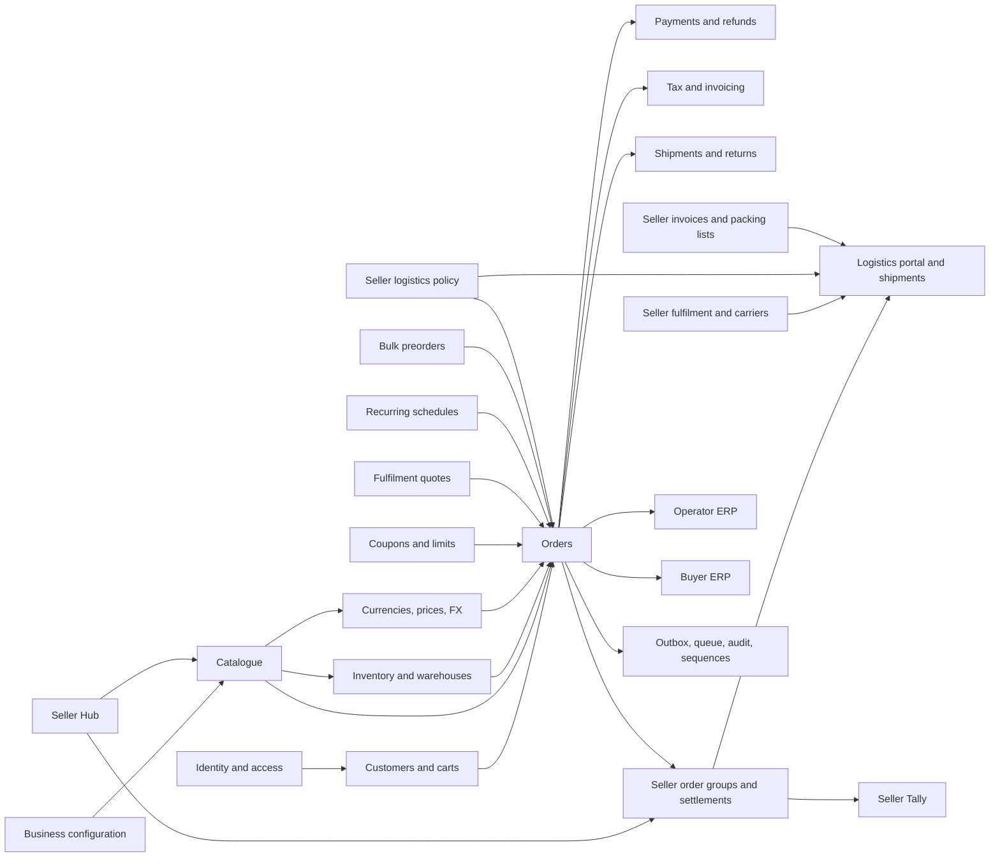
```mermaid
flowchart LR
    ID["Identity and access"] --> CUST["Customers and carts"]
    CFG["Business configuration"] --> CAT["Catalogue"]
    CAT --> INV["Inventory and warehouses"]
    CAT --> PRICE["Currencies, prices, FX"]
    CUST --> ORD["Orders"]
    CAT --> ORD
    INV --> ORD
    PRICE --> ORD
    COUP["Coupons and limits"] --> ORD
    FQ["Fulfilment quotes"] --> ORD
    ORD --> PAY["Payments and refunds"]
    ORD --> TAX["Tax and invoicing"]
    ORD --> AFTER["Shipments and returns"]
    REC["Recurring schedules"] --> ORD
    PRE["Bulk preorders"] --> ORD
    SELL["Seller Hub"] --> CAT
    SELL --> SORD["Seller order groups and settlements"]
    ORD --> SORD
    SORD --> LOG["Logistics portal and shipments"]
    SFUL["Seller fulfilment and carriers"] --> LOG
    SPOL["Seller logistics policy"] --> ORD
    SPOL --> LOG
    SDOC["Seller invoices and packing lists"] --> LOG
    ORD --> ERP["Operator ERP"]
    ORD --> BERP["Buyer ERP"]
    SORD --> TALLY["Seller Tally"]
    ORD --> MACH["Outbox, queue, audit, sequences"]
```

---

## 5. The domains, one by one

Every chapter follows the same shape: what the domain is for, the key tables
and what **one row** means, a diagram of the core tables, the important enums,
the lifecycle, the constraints that encode business rules, and a worked
example.

**How to read the diagrams.** They are Mermaid entity-relationship diagrams.
Each box is a table (by its real name); `PK` is the primary key, `FK` a
foreign key, `UK` a unique key. Only the most important columns are shown -
the full list is in the reference. The line ends mean:

| Symbol | Meaning |
|---|---|
| `\|\|` | exactly one |
| `o\|` | zero or one |
| `o{` | zero or many |
| `\|{` | one or many |

So `customer_profiles ||--o{ orders` reads "one customer profile has zero or
many orders; each order has exactly one customer profile". A nullable foreign
key is drawn `|o` on the parent side ("zero or one parent").

### 5.1 Identity and access

**Purpose.** Who a person is, how they prove it, and what they may do. One
`users` table serves all three audiences - staff, customers (who may also be
sellers) and people who work for a logistics company - distinguished by
`users.type`.

| Model | Table | One row means |
|---|---|---|
| [`User`](reference/DATABASE-TABLES.md#model-user) | `users` | one sign-in identity |
| [`Role`](reference/DATABASE-TABLES.md#model-role) | `roles` | a named bundle of permissions, for example "Order Manager" |
| [`Permission`](reference/DATABASE-TABLES.md#model-permission) | `permissions` | one permission key, for example `order.cancel` |
| [`RolePermission`](reference/DATABASE-TABLES.md#model-rolepermission) | `role_permissions` | "this role includes this permission" |
| [`UserRole`](reference/DATABASE-TABLES.md#model-userrole) | `user_roles` | "this user holds this role" |
| [`Session`](reference/DATABASE-TABLES.md#model-session) | `sessions` | one signed-in device, identified by the hash of its refresh token |
| [`AuthToken`](reference/DATABASE-TABLES.md#model-authtoken) | `auth_tokens` | one single-use emailed link (invitation, verification, reset, contact change) |
| [`LoginAttempt`](reference/DATABASE-TABLES.md#model-loginattempt) | `login_attempts` | one sign-in attempt, successful or not |

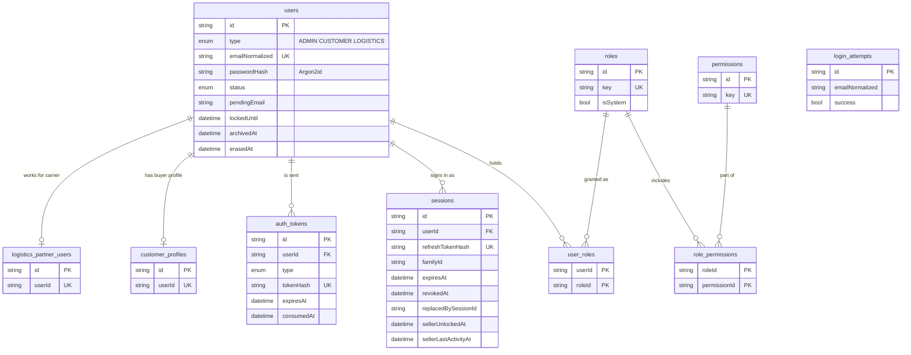
```mermaid
erDiagram
    users ||--o{ user_roles : "holds"
    roles ||--o{ user_roles : "granted as"
    roles ||--o{ role_permissions : "includes"
    permissions ||--o{ role_permissions : "part of"
    users ||--o{ sessions : "signs in as"
    users ||--o{ auth_tokens : "is sent"
    users ||--o| customer_profiles : "has buyer profile"
    users ||--o| logistics_partner_users : "works for carrier"
    users {
        string id PK
        enum type "ADMIN CUSTOMER LOGISTICS"
        string emailNormalized UK
        string passwordHash "Argon2id"
        enum status
        string pendingEmail
        datetime lockedUntil
        datetime archivedAt
        datetime erasedAt
    }
    sessions {
        string id PK
        string userId FK
        string refreshTokenHash UK
        string familyId
        datetime expiresAt
        datetime revokedAt
        string replacedBySessionId
        datetime sellerUnlockedAt
        datetime sellerLastActivityAt
    }
    auth_tokens {
        string id PK
        string userId FK
        enum type
        string tokenHash UK
        datetime expiresAt
        datetime consumedAt
    }
    user_roles {
        string userId PK
        string roleId PK
    }
    roles {
        string id PK
        string key UK
        bool isSystem
    }
    permissions {
        string id PK
        string key UK
    }
    role_permissions {
        string roleId PK
        string permissionId PK
    }
    customer_profiles {
        string id PK
        string userId UK
    }
    logistics_partner_users {
        string id PK
        string userId UK
    }
    login_attempts {
        string id PK
        string emailNormalized
        bool success
    }
```

**Enums.**

- `UserType`: `ADMIN` (staff of the operator), `CUSTOMER` (a buyer; a seller
  is also a customer, because the same person buys and sells), `LOGISTICS` (an
  employee of a third-party delivery company, who must never reach a cart, a
  price or a payment method).
- `UserStatus`: `PENDING_INVITATION`, `PENDING_APPROVAL` (the parked sign-up
  approval gate), `ACTIVE`, `DEACTIVATED`.
- `AuthTokenType`: `INVITATION`, `EMAIL_VERIFICATION`, `PASSWORD_RESET`,
  `EMAIL_CHANGE`, `PHONE_CHANGE`. Separate values so a link minted to prove one
  thing cannot be replayed to prove another.

**Rules the tables encode.**

- `uq_user_email_normalized`: one account per email address, whatever its
  case.
- A contact change is **confirmed before it is adopted**: the new address waits
  in `pendingEmail` / `pendingEmailNormalized` / `pendingPhone` and the live
  `email` is untouched until the emailed link is used.
  `pendingEmailNormalized` is indexed but deliberately **not** unique.
- Refresh tokens rotate. Each refresh creates a new `sessions` row and revokes
  the old one (`revokedAt`, `replacedBySessionId`); all rows of one chain share
  a `familyId`, so a stolen, re-used token revokes the whole family.
- A rotation **copies the session's extra checks** onto the new row: the
  carrier portal's `mfaVerifiedAt`, and the Seller Hub's `sellerUnlockedAt`,
  `sellerUnlockedForId` and `sellerLastActivityAt`. Before this, the Hub's
  unlock was not copied, so every refresh closed the Hub.
- Seller Hub idle limit: `sellerLastActivityAt` (`DATETIME(3) NULL`, added by
  migration `20260929100000_seller_hub_idle_session`) is the time of the last
  deliberate Hub action, written at most every 30 seconds. When it is older than
  `SELLER_HUB_IDLE_TIMEOUT_SECONDS`, the seller guard clears the unlock on the
  row and the Hub must be opened again with its password. Opening the Hub sets
  it; closing or expiry sets it back to `NULL` with the unlock. Where it is
  `NULL` on an open Hub (a row from before the migration), `sellerUnlockedAt` is
  used instead.
- Lockout: `failedLoginCount` and `lockedUntil`; `login_attempts` feeds the
  rate limits by email and by IP.
- MFA: `mfaSecretEnc` (encrypted TOTP secret), `mfaLastCounter` (stops a code
  being replayed), `mfaRecoveryCodeHashesJson` (hashes only).
- `user_roles.roleId` is `Restrict`: a role in use cannot be deleted.

**Worked example: a customer signs in.** One `login_attempts` row is written
(`success = true`), `users.lastLoginAt` is updated and `failedLoginCount`
reset, and a `sessions` row is inserted with the SHA-256 of the new refresh
token. Thirty minutes later the browser refreshes: a second `sessions` row is
inserted with the same `familyId`, and the first is marked `revokedAt` with
`replacedBySessionId` pointing at the second.

### 5.2 Business configuration and media

**Purpose.** The settings that make one installation one business. Glovia is
sold to companies that run it themselves, so nothing about the business is
hard-coded: it lives in these rows.

| Model | Table | One row means |
|---|---|---|
| [`BusinessProfile`](reference/DATABASE-TABLES.md#model-businessprofile) | `business_profile` | **the** business (single row): legal name, currency, time zone, order and invoice prefixes, VAT and GST numbers, `sellerCommissionBasisPoints`, the `gpsrEnforced` and `mdrEnforced` switches |
| [`TaxClass`](reference/DATABASE-TABLES.md#model-taxclass) | `tax_classes` | one tax rate a product can be in (`ratePercent`, `isInclusive`, optional `vatCategory`) |
| [`ShippingMethod`](reference/DATABASE-TABLES.md#model-shippingmethod) | `shipping_methods` | a simple priced delivery option (`priceMinor`, `freeAboveMinor`) |
| [`CurrencyRateSync`](reference/DATABASE-TABLES.md#model-currencyratesync) | `currency_rate_sync` | settings for the exchange-rate job (single row): margin, rounding, `maxDriftPercent`, freshness limits |
| [`CatalogTranslationSync`](reference/DATABASE-TABLES.md#model-catalogtranslationsync) | `catalog_translation_sync` | settings for automatic translation (single row), with the encrypted API key |
| [`FeatureFlag`](reference/DATABASE-TABLES.md#model-featureflag) | `feature_flags` | one on/off switch, by `key` |
| [`NotificationSetting`](reference/DATABASE-TABLES.md#model-notificationsetting) | `notification_settings` | the email/SMS template for one event key |
| [`MediaAsset`](reference/DATABASE-TABLES.md#model-mediaasset) | `media_assets` | one uploaded file: `storageKey`, root-relative `url`, MIME type, size, `checksum` |

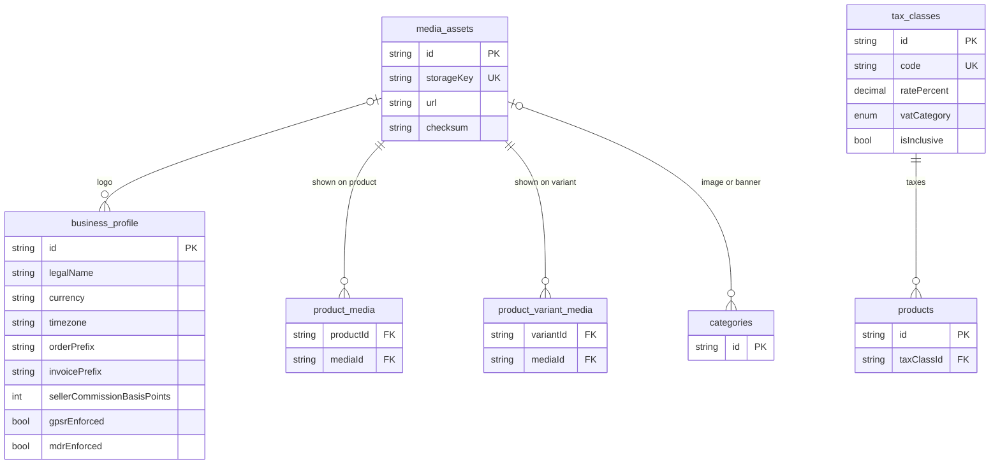
```mermaid
erDiagram
    media_assets |o--o{ business_profile : "logo"
    media_assets ||--o{ product_media : "shown on product"
    media_assets ||--o{ product_variant_media : "shown on variant"
    media_assets |o--o{ categories : "image or banner"
    tax_classes ||--o{ products : "taxes"
    business_profile {
        string id PK
        string legalName
        string currency
        string timezone
        string orderPrefix
        string invoicePrefix
        int sellerCommissionBasisPoints
        bool gpsrEnforced
        bool mdrEnforced
    }
    tax_classes {
        string id PK
        string code UK
        decimal ratePercent
        enum vatCategory
        bool isInclusive
    }
    media_assets {
        string id PK
        string storageKey UK
        string url
        string checksum
    }
    product_media {
        string productId FK
        string mediaId FK
    }
    product_variant_media {
        string variantId FK
        string mediaId FK
    }
    categories {
        string id PK
    }
    products {
        string id PK
        string taxClassId FK
    }
```

**Rules.** `chk_tax_rate_range` keeps `ratePercent` between 0 and 100.
`media_assets` is `Restrict` from product and variant media, so a picture in
use cannot be deleted. Media URLs are stored **root-relative**, never with a
host, so pictures still load behind a tunnel or a new domain.

**Worked example.** An operator sets up a new installation: the seed writes one
`business_profile` row, the default `tax_classes`, the permission catalogue
into `permissions`, the system `roles` and their `role_permissions`. Changing
the order prefix from `UB` to `ACME` later changes the next number allocated
(`ACME-2026-000124`); existing orders keep theirs.

### 5.3 Catalogue

**Purpose.** What is for sale. A **product** is one catalogue item; a
**variant** is one purchasable version of it (size, colour, pack). Categories
form a tree. Marketplace sellers do not own products - they make **offers**
against them (see [5.17](#517-seller-hub)).

| Model | Table | One row means |
|---|---|---|
| [`Category`](reference/DATABASE-TABLES.md#model-category) | `categories` | one node in the category tree |
| [`Product`](reference/DATABASE-TABLES.md#model-product) | `products` | one catalogue item, with its base price in the base currency |
| [`ProductVariant`](reference/DATABASE-TABLES.md#model-productvariant) | `product_variants` | one purchasable version, identified by its `optionSignature` |
| [`ProductMedia`](reference/DATABASE-TABLES.md#model-productmedia) / [`ProductVariantMedia`](reference/DATABASE-TABLES.md#model-productvariantmedia) | `product_media` / `product_variant_media` | one picture on a product or a variant, in order |
| [`ProductAttribute`](reference/DATABASE-TABLES.md#model-productattribute) | `product_attributes` | one name/value fact ("Material: nitrile"), optionally filterable; its specification group (`groupKey`, NULL = General), `unit` and whether it is a highlight |
| [`ProductVariantAttribute`](reference/DATABASE-TABLES.md#model-productvariantattribute) | `product_variant_attributes` | one specification that differs for one variant: same label replaces the product's, a new label is added. UNIQUE (variantId, name) |
| [`ProductDescriptionSection`](reference/DATABASE-TABLES.md#model-productdescriptionsection) | `product_description_sections` | one heading-and-plain-text section of a product's description, with an optional picture (`imageMediaId`, SET NULL) and a `language` (NULL = the product's own) |
| [`ProductPackaging`](reference/DATABASE-TABLES.md#model-productpackaging) | `product_packaging` | how one SKU is packed, as the supplier wrote it |
| [`ProductPackDimension`](reference/DATABASE-TABLES.md#model-productpackdimension) | `product_pack_dimensions` | one box size (primary pack, inner box, outer carton) |
| [`ProductImportRecord`](reference/DATABASE-TABLES.md#model-productimportrecord) | `product_import_records` | where one catalogue row came from: file, sheet, row, the raw row as JSON |

**Specifications and description sections.** Groups and units are closed lists
in `domain/product-specifications.ts` (`SPEC_GROUPS`, `SPEC_UNITS`), validated
on write rather than enforced by an ENUM, so adding a group is a code change and
not a migration. The storefront's copies are held to them by a test. Sections
are plain text, never HTML. A seller's content waits on the draft in
`seller_listing_drafts.listingContentJson` until approval copies it onto the
product (`publishApprovedListing`, only for a product the listing described).
All three product tables cascade from their product or variant, ON UPDATE
RESTRICT. Migration `20261002090000_product_specifications`.

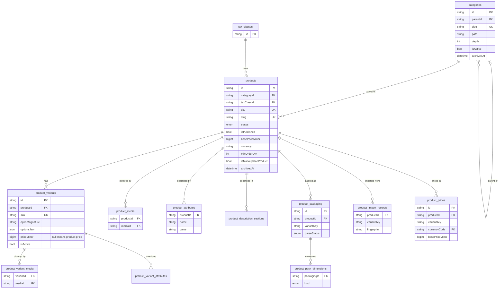
```mermaid
erDiagram
    categories |o--o{ categories : "parent of"
    categories ||--o{ products : "contains"
    tax_classes ||--o{ products : "taxes"
    products ||--o{ product_variants : "has"
    products ||--o{ product_media : "pictured by"
    product_variants ||--o{ product_variant_media : "pictured by"
    products ||--o{ product_attributes : "described by"
    product_variants ||--o{ product_variant_attributes : "overrides"
    products ||--o{ product_description_sections : "described in"
    products ||--o{ product_packaging : "packed as"
    product_packaging ||--o{ product_pack_dimensions : "measures"
    products ||--o{ product_import_records : "imported from"
    products ||--o{ product_prices : "priced in"
    categories {
        string id PK
        string parentId FK
        string slug UK
        string path
        int depth
        bool isActive
        datetime archivedAt
    }
    products {
        string id PK
        string categoryId FK
        string taxClassId FK
        string sku UK
        string slug UK
        enum status
        bool isPublished
        bigint basePriceMinor
        string currency
        int minOrderQty
        bool isMarketplaceProduct
        datetime archivedAt
    }
    product_variants {
        string id PK
        string productId FK
        string sku UK
        string optionSignature
        json optionsJson
        bigint priceMinor "null means product price"
        bool isActive
    }
    product_packaging {
        string id PK
        string productId FK
        string variantKey
        enum parseStatus
    }
    product_prices {
        string id PK
        string productId FK
        string variantKey
        string currencyCode FK
        bigint basePriceMinor
    }
    tax_classes {
        string id PK
    }
    product_media {
        string productId FK
        string mediaId FK
    }
    product_variant_media {
        string variantId FK
        string mediaId FK
    }
    product_attributes {
        string productId FK
        string name
        string value
    }
    product_pack_dimensions {
        string packagingId FK
        enum kind
    }
    product_import_records {
        string productId FK
        string variantKey
        string fingerprint
    }
```

**Enums.**

- `CatalogStatus`: `DRAFT`, `ACTIVE`, `INACTIVE`. **A product is visible to
  the public only when `status = ACTIVE` and `isPublished = true`** (and it is
  not archived). One helper, `publicProductWhere()`, builds that filter; no
  route builds it by hand.
- `OrderingUnit`: `PIECE`, `INNER_PACK`, `OUTER_CARTON`, `CARTON`,
  `UK_PALLET`, `US_PALLET`, `CONTAINER` - what a buyer orders by. The stored
  quantity is always in base units (pieces) regardless.
- `PackingParseStatus`, `PackDimensionKind`, `DimensionParseStatus` - how much
  of the supplier's packing text was understood.

**Rules the tables encode.**

- `uq_product_sku`, `uq_variant_sku`: a SKU is unique across the catalogue
  (case-insensitive, because of the collation).
- `uq_variant_option_signature (productId, optionSignature)`: two variants of
  one product cannot have the same set of options.
- `uq_product_attribute_name (productId, name)`: one value per attribute name.
- `CHECK`s: `basePriceMinor >= 0`, `minOrderQty >= 1`, `qtyIncrement >= 1`,
  `maxOrderQty` null or not below `minOrderQty`, `compareAtPriceMinor` null or
  not below the price.
- `categories.parentId` is `Restrict`: a category with children cannot be
  deleted. `categories.path` (for example `/medical/gloves/`) lets a subtree be
  found with one prefix search; its index is a 768-character prefix because the
  full `VARCHAR(1024)` is over InnoDB's key limit.
- `products.categoryId`, `products.taxClassId` and `product_variants.productId`
  are `Restrict`. Products and variants are archived, never deleted.
- `importFingerprint` (`UNIQUE` on products and variants) lets a re-import of
  the same sheet update rows rather than duplicate them.
- `product_import_records` is a separate table on purpose: operator-internal
  facts (licence status, production capacity, the raw row) can never leak
  through a public product read.

**Worked example: an administrator creates a product with two sizes.** One
`products` row (`status = DRAFT`, `isPublished = false`, `hasVariants =
true`), two `product_variants` rows with signatures such as `size=m` and
`size=l`, two `product_media` rows pointing at existing `media_assets`, and an
`audit_logs` row. Publishing sets `status = ACTIVE`, `isPublished = true` and
`publishedAt`; only now does the storefront see it.

### 5.4 Inventory and warehouses

**Purpose.** How much of each thing is where, and which warehouse may deliver
to which address. This is the **operator's** stock; sellers' stock lives in
`seller_inventory` ([5.17](#517-seller-hub)).

| Model | Table | One row means |
|---|---|---|
| [`InventoryLocation`](reference/DATABASE-TABLES.md#model-inventorylocation) | `inventory_locations` | one warehouse: address, country, coordinates, operational status, ERP link |
| [`InventoryBalance`](reference/DATABASE-TABLES.md#model-inventorybalance) | `inventory_balances` | how many of one SKU are on hand and reserved at one warehouse - **the fast read** |
| [`InventoryMovement`](reference/DATABASE-TABLES.md#model-inventorymovement) | `inventory_movements` | one change to on-hand stock - **the append-only ledger and source of truth** |
| [`StockReservation`](reference/DATABASE-TABLES.md#model-stockreservation) | `stock_reservations` | a quantity held for one cart or order until it is committed, released or expires |
| [`WarehouseDeliveryZone`](reference/DATABASE-TABLES.md#model-warehousedeliveryzone) | `warehouse_delivery_zones` | one **lane**: this warehouse delivers to this country (optionally these postal prefixes) with this carrier, handling time, transit range and fee |
| [`WarehouseCountryExclusion`](reference/DATABASE-TABLES.md#model-warehousecountryexclusion) | `warehouse_country_exclusions` | "this warehouse never ships to this country" |

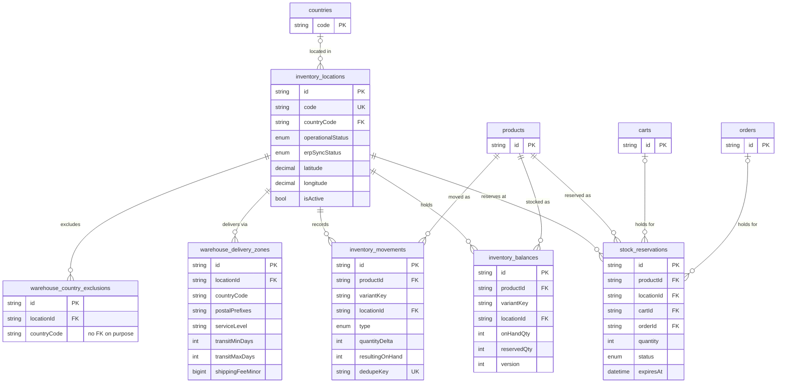
```mermaid
erDiagram
    countries |o--o{ inventory_locations : "located in"
    inventory_locations ||--o{ inventory_balances : "holds"
    inventory_locations ||--o{ inventory_movements : "records"
    inventory_locations ||--o{ stock_reservations : "reserves at"
    inventory_locations ||--o{ warehouse_delivery_zones : "delivers via"
    inventory_locations ||--o{ warehouse_country_exclusions : "excludes"
    products ||--o{ inventory_balances : "stocked as"
    products ||--o{ inventory_movements : "moved as"
    products ||--o{ stock_reservations : "reserved as"
    carts |o--o{ stock_reservations : "holds for"
    orders |o--o{ stock_reservations : "holds for"
    inventory_locations {
        string id PK
        string code UK
        string countryCode FK
        enum operationalStatus
        enum erpSyncStatus
        decimal latitude
        decimal longitude
        bool isActive
    }
    inventory_balances {
        string id PK
        string productId FK
        string variantKey
        string locationId FK
        int onHandQty
        int reservedQty
        int version
    }
    inventory_movements {
        string id PK
        string productId FK
        string variantKey
        string locationId FK
        enum type
        int quantityDelta
        int resultingOnHand
        string dedupeKey UK
    }
    stock_reservations {
        string id PK
        string productId FK
        string locationId FK
        string cartId FK
        string orderId FK
        int quantity
        enum status
        datetime expiresAt
    }
    warehouse_delivery_zones {
        string id PK
        string locationId FK
        string countryCode
        string postalPrefixes
        string serviceLevel
        int transitMinDays
        int transitMaxDays
        bigint shippingFeeMinor
    }
    warehouse_country_exclusions {
        string id PK
        string locationId FK
        string countryCode "no FK on purpose"
    }
    countries {
        string code PK
    }
    products {
        string id PK
    }
    carts {
        string id PK
    }
    orders {
        string id PK
    }
```

**Enums.**

- `InventoryMovementType`: `RECEIPT` (goods in), `ADJUSTMENT` (a count
  correction), `RESERVATION_COMMIT` (an order was confirmed and stock left the
  available pool), `ORDER_CANCEL_RESTOCK`, `RETURN_RESTOCK`,
  `RETURN_QUARANTINE`, `SYNC_CORRECTION` (an integration corrected the count).
- `ReservationStatus`: `ACTIVE` (held), `COMMITTED` (turned into a real
  deduction when the order was confirmed), `RELEASED` (given back, for example
  the order was cancelled before payment), `EXPIRED` (swept after
  `expiresAt`).
- `WarehouseOperationalStatus`: `OPERATIONAL`, `LIMITED`, `MAINTENANCE`,
  `SUSPENDED`. `WarehouseErpSyncStatus`: `NEVER_SYNCED`, `SYNCED`, `PENDING`,
  `FAILED`.

**Rules.**

- **Available stock = `onHandQty - reservedQty`.** `CHECK`s keep both
  non-negative and `reservedQty <= onHandQty`, so the database itself refuses
  an oversell.
- `uq_inventory_balance_sku_location (productId, variantKey, locationId)`: one
  balance per SKU per warehouse ([3.3](#33-variantkey-instead-of-a-nullable-column-inside-a-unique-index)).
- Every movement has `quantityDelta <> 0` and `resultingOnHand >= 0`, and an
  optional `dedupeKey` (`UNIQUE`) so a replayed job cannot apply it twice.
- History tables (`inventory_balances`, `inventory_movements`,
  `stock_reservations`) point at the warehouse with `Restrict`. The exclusions
  table is the only `Cascade`: it is configuration, meaningless without its
  warehouse.
- `uq_warehouse_zone_lane (locationId, countryCode, postalPrefixes,
  serviceLevel)`: one lane per warehouse, destination and service.
  `postalPrefixes` defaults to `''` rather than `NULL` for the same reason as
  `variantKey`.
- A lane, not a map radius, decides whether a warehouse may serve an address.
  `deliveryRadiusKm` on the warehouse is a picture for the person configuring
  it.

**Worked example: the last carton.** Two buyers check out the last carton at
the same instant. Each checkout transaction runs `SELECT ... FOR UPDATE` on the
same `inventory_balances` row. The first gets the lock, sees `onHandQty = 1,
reservedQty = 0`, inserts a `stock_reservations` row (`ACTIVE`) and sets
`reservedQty = 1`. The second waits, then sees nothing available and is
refused. When the first order is paid, the reservation becomes `COMMITTED`,
`onHandQty` and `reservedQty` both drop to 0, and an `inventory_movements` row
of type `RESERVATION_COMMIT` with `quantityDelta = -1` is appended.

### 5.5 Customers, carts and saved lines

**Purpose.** The buyer side before an order exists: the buyer's profile and
addresses, the basket, things saved for later, and instructions left on a
product.

| Model | Table | One row means |
|---|---|---|
| [`CustomerProfile`](reference/DATABASE-TABLES.md#model-customerprofile) | `customer_profiles` | one buyer: name, organisation, GST/VAT number and its validation, `requiresOrderApproval`, preferred country and currency, consent |
| [`Address`](reference/DATABASE-TABLES.md#model-address) | `addresses` | one billing and/or shipping address of a buyer |
| [`Cart`](reference/DATABASE-TABLES.md#model-cart) | `carts` | one basket, for a signed-in buyer or a guest (`guestToken`) |
| [`CartItem`](reference/DATABASE-TABLES.md#model-cartitem) | `cart_items` | one line: a product (and variant, and seller offer) and a quantity in pieces |
| [`CartItemPackaging`](reference/DATABASE-TABLES.md#model-cartitempackaging) | `cart_item_packaging` | the carton/pallet/container a line is ordered by ([5.20](#520-bulk-ordering-and-freight)) |
| [`WishlistItem`](reference/DATABASE-TABLES.md#model-wishlistitem) | `wishlist_items` | "saved for later": a person, a product, a `variantKey`, a time. No quantity |
| [`ProductInstruction`](reference/DATABASE-TABLES.md#model-productinstruction) | `product_instructions` | a note a shopper left on a product without buying it |

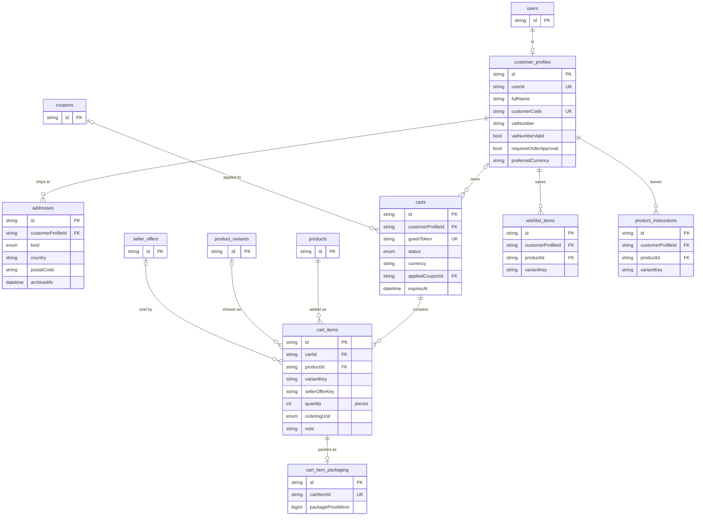
```mermaid
erDiagram
    users ||--o| customer_profiles : "is"
    customer_profiles ||--o{ addresses : "ships to"
    customer_profiles |o--o{ carts : "owns"
    carts ||--o{ cart_items : "contains"
    products ||--o{ cart_items : "added as"
    product_variants |o--o{ cart_items : "chosen as"
    seller_offers |o--o{ cart_items : "sold by"
    cart_items ||--o| cart_item_packaging : "packed as"
    coupons |o--o{ carts : "applied to"
    customer_profiles ||--o{ wishlist_items : "saves"
    customer_profiles ||--o{ product_instructions : "leaves"
    customer_profiles {
        string id PK
        string userId UK
        string fullName
        string customerCode UK
        string vatNumber
        bool vatNumberValid
        bool requiresOrderApproval
        string preferredCurrency
    }
    addresses {
        string id PK
        string customerProfileId FK
        enum kind
        string country
        string postalCode
        datetime archivedAt
    }
    carts {
        string id PK
        string customerProfileId FK
        string guestToken UK
        enum status
        string currency
        string appliedCouponId FK
        datetime expiresAt
    }
    cart_items {
        string id PK
        string cartId FK
        string productId FK
        string variantKey
        string sellerOfferKey
        int quantity "pieces"
        enum orderingUnit
        string note
    }
    cart_item_packaging {
        string id PK
        string cartItemId UK
        bigint packagePriceMinor
    }
    wishlist_items {
        string id PK
        string customerProfileId FK
        string productId FK
        string variantKey
    }
    product_instructions {
        string id PK
        string customerProfileId FK
        string productId FK
        string variantKey
    }
    users {
        string id PK
    }
    products {
        string id PK
    }
    product_variants {
        string id PK
    }
    seller_offers {
        string id PK
    }
    coupons {
        string id PK
    }
```

**Enums.** `CartStatus`: `ACTIVE`, `CONVERTED` (became an order), `ABANDONED`.
`AddressKind`: `BILLING`, `SHIPPING`, `BOTH`.

**Rules.**

- `uq_customer_profile_user`: one buyer profile per user.
- `uq_cart_item_sku (cartId, productId, variantKey, sellerOfferKey)`: the same
  product, variant and seller appears once per basket; adding it again raises
  the quantity. `chk_cart_item_qty_positive` keeps quantities above zero.
- `uq_wishlist_item` and `uq_product_instruction` are both
  `(customerProfileId, productId, variantKey)`.
- `cart_items.note` (500 characters) is the instruction for **one product**;
  it is copied to `order_items.noteSnapshot` because the basket is emptied the
  moment the order commits. `orders.customerNote` is for the whole delivery.
- Addresses are archived, not deleted: schedules point at them with
  `Restrict`.
- `firstName` and `lastName` are nullable parts; `fullName` is the canonical
  name used on orders and invoices.

**Worked example: adding two sizes at once.** The storefront posts both lines
together. In one transaction the server finds the buyer's `ACTIVE` cart (or
inserts one with the buyer's currency), then inserts or updates two
`cart_items` rows, one per `variantKey`. If either line is invalid, neither is
written.

### 5.6 Orders

**Purpose.** The moment the system stops being a catalogue and becomes a
financial record. An order freezes what was bought, at what price, with what
tax, to which address, from which warehouse.

| Model | Table | One row means |
|---|---|---|
| [`Order`](reference/DATABASE-TABLES.md#model-order) | `orders` | one order: its number, status, totals, frozen addresses, tax decision, warehouse promise and exchange rate |
| [`OrderItem`](reference/DATABASE-TABLES.md#model-orderitem) | `order_items` | one line, fully snapshotted - including `productInfoSnapshotJson`, the product as described when the order was created (description, specifications with the variant's values, packaging, minimum, carton and container figures, options, instructions; `schemaVersion` 1), written once in the creating transaction and never updated (migration `20261003090000_order_item_product_snapshot`) |
| [`OrderItemPackaging`](reference/DATABASE-TABLES.md#model-orderitempackaging) | `order_item_packaging` | the package choice frozen from the cart line |
| [`OrderStatusHistory`](reference/DATABASE-TABLES.md#model-orderstatushistory) | `order_status_history` | one status change: from, to, who, why, correlation id |
| [`OrderApproval`](reference/DATABASE-TABLES.md#model-orderapproval) | `order_approvals` | one approval request for a high-value or credit-terms order, and its decision |
| [`IdempotencyRecord`](reference/DATABASE-TABLES.md#model-idempotencyrecord) | `idempotency_records` | one claimed idempotency key and the response it produced |

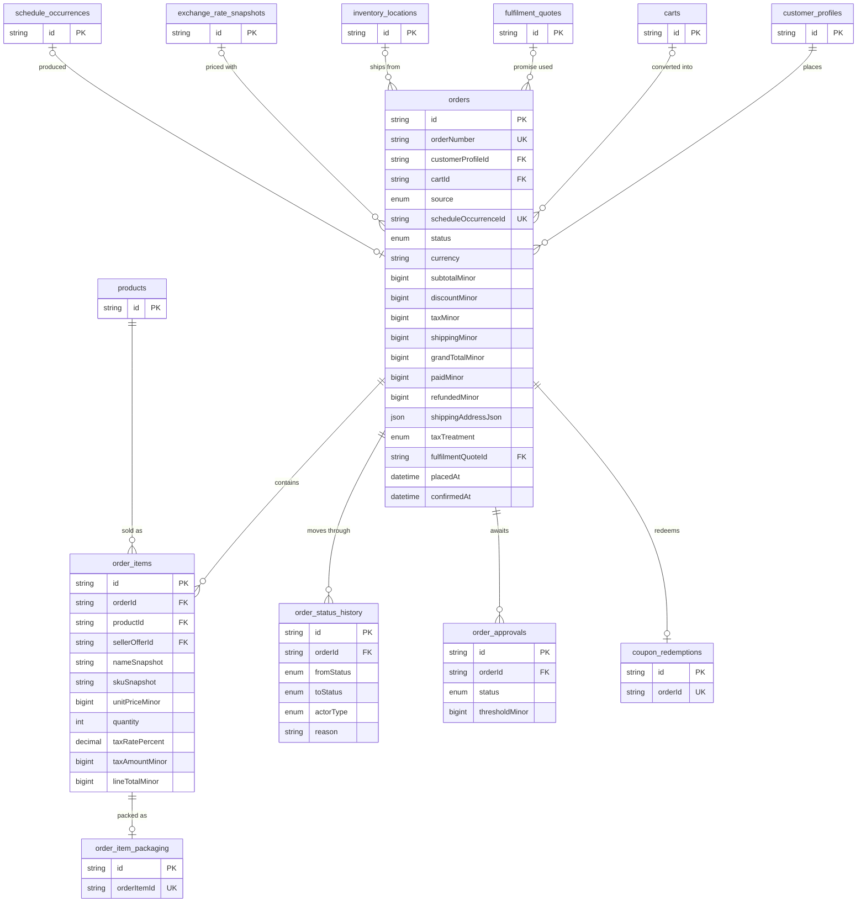
```mermaid
erDiagram
    customer_profiles ||--o{ orders : "places"
    carts |o--o{ orders : "converted into"
    orders ||--o{ order_items : "contains"
    order_items ||--o| order_item_packaging : "packed as"
    products ||--o{ order_items : "sold as"
    orders ||--o{ order_status_history : "moves through"
    orders ||--o{ order_approvals : "awaits"
    fulfilment_quotes |o--o{ orders : "promise used"
    inventory_locations |o--o{ orders : "ships from"
    exchange_rate_snapshots |o--o{ orders : "priced with"
    schedule_occurrences |o--o| orders : "produced"
    orders ||--o| coupon_redemptions : "redeems"
    orders {
        string id PK
        string orderNumber UK
        string customerProfileId FK
        string cartId FK
        enum source
        string scheduleOccurrenceId UK
        enum status
        string currency
        bigint subtotalMinor
        bigint discountMinor
        bigint taxMinor
        bigint shippingMinor
        bigint grandTotalMinor
        bigint paidMinor
        bigint refundedMinor
        json shippingAddressJson
        enum taxTreatment
        string fulfilmentQuoteId FK
        datetime placedAt
        datetime confirmedAt
    }
    order_items {
        string id PK
        string orderId FK
        string productId FK
        string sellerOfferId FK
        string nameSnapshot
        string skuSnapshot
        bigint unitPriceMinor
        int quantity
        decimal taxRatePercent
        bigint taxAmountMinor
        bigint lineTotalMinor
    }
    order_status_history {
        string id PK
        string orderId FK
        enum fromStatus
        enum toStatus
        enum actorType
        string reason
    }
    order_approvals {
        string id PK
        string orderId FK
        enum status
        bigint thresholdMinor
    }
    order_item_packaging {
        string id PK
        string orderItemId UK
    }
    coupon_redemptions {
        string id PK
        string orderId UK
    }
    customer_profiles {
        string id PK
    }
    carts {
        string id PK
    }
    products {
        string id PK
    }
    fulfilment_quotes {
        string id PK
    }
    inventory_locations {
        string id PK
    }
    exchange_rate_snapshots {
        string id PK
    }
    schedule_occurrences {
        string id PK
    }
```

**Enums.**

- `OrderStatus` - ten values, fixed by the business process and not to be
  extended without a business decision. See the state machine below.
- `OrderSource`: `ONE_TIME` (a normal checkout), `RECURRING` (made by the
  schedule worker), `PREORDER` (converted from a bulk preorder).
- `PaymentIntentMode`: `ONLINE` (pay now) or `PAYMENT_LINK` (a link is emailed).
- `FxPriceSource`: `MANUAL` (the currency had its own price rows) or
  `CONVERTED` (derived from the base price at a recorded rate).
- `ApprovalStatus`: `PENDING`, `APPROVED`, `REJECTED`.
- `ActorType` (used by history and audit tables): `SYSTEM`, `ADMIN`,
  `CUSTOMER`, `PROVIDER` (a payment gateway), `LOGISTICS`.

**Lifecycle.** Taken exactly from `TRANSITIONS` in
`backend/src/domain/order-state-machine.ts`. Labels show who may make the
move.

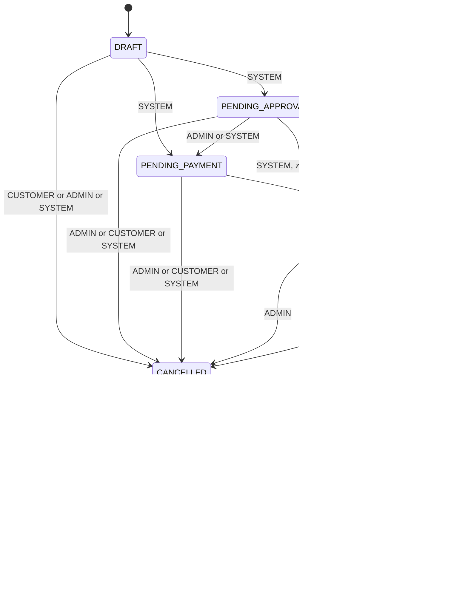
```mermaid
stateDiagram-v2
    [*] --> DRAFT
    DRAFT --> PENDING_APPROVAL : SYSTEM
    DRAFT --> PENDING_PAYMENT : SYSTEM
    DRAFT --> CANCELLED : CUSTOMER or ADMIN or SYSTEM
    PENDING_APPROVAL --> PENDING_PAYMENT : ADMIN or SYSTEM
    PENDING_APPROVAL --> CONFIRMED : SYSTEM, zero balance
    PENDING_APPROVAL --> CANCELLED : ADMIN or CUSTOMER or SYSTEM
    PENDING_PAYMENT --> CONFIRMED : SYSTEM, signed webhook only
    PENDING_PAYMENT --> CANCELLED : ADMIN or CUSTOMER or SYSTEM
    CONFIRMED --> PROCESSING : ADMIN or SYSTEM
    CONFIRMED --> CANCELLED : ADMIN
    PROCESSING --> SHIPPED : ADMIN or SYSTEM
    PROCESSING --> CANCELLED : ADMIN
    SHIPPED --> DELIVERED : ADMIN or SYSTEM
    SHIPPED --> RETURNED : ADMIN
    DELIVERED --> RETURNED : ADMIN
    CANCELLED --> REFUNDED : ADMIN or SYSTEM
    RETURNED --> REFUNDED : ADMIN or SYSTEM
    REFUNDED --> [*]
```

What each status means:

| Status | Meaning | Stock |
|---|---|---|
| `DRAFT` | Being built; not yet placed | none |
| `PENDING_APPROVAL` | Placed, but policy says somebody must approve it first | reserved |
| `PENDING_PAYMENT` | Placed and approved (or not needing approval); waiting for money | reserved |
| `CONFIRMED` | Paid, proven by a **signature-verified webhook**. Never by the browser returning to a success page | committed |
| `PROCESSING` | Being picked and packed | committed |
| `SHIPPED` | Handed to a carrier | committed |
| `DELIVERED` | Received | committed |
| `CANCELLED` | Stopped. Stock is released (or restocked if it was committed) | released |
| `RETURNED` | Came back after shipping or delivery | released |
| `REFUNDED` | Money given back. **Terminal**: nothing leaves it | - |

Deliberately absent: `CONFIRMED -> PENDING_PAYMENT` (a second charge could
attach to a paid order), `DELIVERED -> CANCELLED` (the only way back after
delivery is `RETURNED`), and anything out of `REFUNDED`. Every admin
cancellation requires the `order.cancel` permission and a reason.

**Rules the tables encode.**

- `uq_order_number`: an order number is used once.
- `uq_order_schedule_occurrence`: one scheduled occurrence produces at most one
  order.
- `CHECK`s on `orders`: every total is non-negative, `discountMinor <=
  subtotalMinor`, **`paidMinor <= grandTotalMinor`**, **`refundedMinor <=
  paidMinor`**. Over-refunding is impossible at the database level.
- `CHECK`s on `order_items`: quantity above zero, amounts non-negative, tax
  rate between 0 and 100.
- `orders.customerProfileId` is `Restrict`; `order_items.orderId` is
  `Cascade`; `order_items.productId` is `Restrict` (a sold product cannot be
  deleted).
- `order_status_history` is written in the same transaction as every status
  change.

**Worked example: a customer places an order.** The browser sends
`POST /orders/checkout` with an `Idempotency-Key` header. Rows are written in
this order (from `submitCheckout` in `backend/src/modules/orders/order.service.ts`):

1. `idempotency_records`: a conditional insert claims `(scope =
   'checkout.submit', key)` with the SHA-256 of the body. A second click with
   the same key waits for, then replays, this response.
2. Outside the transaction: the delivery and billing addresses are read and
   the cart is priced **against the delivery address** (EU VAT depends on
   it), and the chosen `fulfilment_quotes` row is re-checked.
3. **One transaction begins.**
4. `number_sequences`: the `order:2026` row is incremented; the order gets
   `UB-2026-000124`.
5. `orders`: one row, `status = PENDING_APPROVAL` if approval is needed,
   otherwise `PENDING_PAYMENT`, with every total, both addresses as JSON, the
   warehouse promise copied from the quote, the tax decision and the exchange
   rate.
6. `order_items`: one row per line, snapshotted.
7. `order_item_packaging` for any line ordered by carton, pallet or
   container; `order_logistics_legs` for marketplace delivery legs
   ([5.22](#522-seller-logistics-policy-and-platform-fees)).
8. `stock_reservations` plus `inventory_balances.reservedQty`, under
   `FOR UPDATE` ([5.4](#54-inventory-and-warehouses)).
9. `order_status_history`: the first row (`toStatus = PENDING_PAYMENT`).
10. `order_approvals` if approval is needed; `coupon_redemptions` if a coupon
    applied.
11. `carts.status = CONVERTED`.
12. `notification_outbox`: the confirmation email, **in the same
    transaction**, so a committed order cannot lose its email and a rolled-back
    one cannot send it.
13. `admin_notifications`: the bell in the admin panel.
14. `audit_logs`: who placed it, which warehouse, at what price.
15. **Commit.** If anything failed, none of the above exists.

What happens when the payment arrives is in [5.7](#57-payments).

### 5.7 Payments

**Purpose.** Taking money through a gateway (Stripe or Razorpay), proving it
arrived, giving it back, and remembering saved cards - without ever holding a
card number.

| Model | Table | One row means |
|---|---|---|
| [`PaymentProviderConnection`](reference/DATABASE-TABLES.md#model-paymentproviderconnection) | `payment_provider_connections` | one gateway account, in `TEST` or `LIVE` mode, with encrypted credentials and webhook secret |
| [`PaymentTransaction`](reference/DATABASE-TABLES.md#model-paymenttransaction) | `payment_transactions` | one attempt to take money for one order |
| [`PaymentEvent`](reference/DATABASE-TABLES.md#model-paymentevent) | `payment_events` | one webhook the gateway sent, kept raw - **the inbox** |
| [`PaymentLink`](reference/DATABASE-TABLES.md#model-paymentlink) | `payment_links` | one emailed, single-use, expiring link to pay one order |
| [`Refund`](reference/DATABASE-TABLES.md#model-refund) | `refunds` | one refund against one captured transaction |
| [`CustomerPaymentMethod`](reference/DATABASE-TABLES.md#model-customerpaymentmethod) | `customer_payment_methods` | one saved card: the gateway's token, brand, last four, expiry, and **what the owner consented to** |
| [`PaymentProviderCustomer`](reference/DATABASE-TABLES.md#model-paymentprovidercustomer) | `payment_provider_customers` | the gateway's customer record for one person, in one mode: which Stripe Customer (`cus_…`) is theirs in `TEST` and which in `LIVE` |

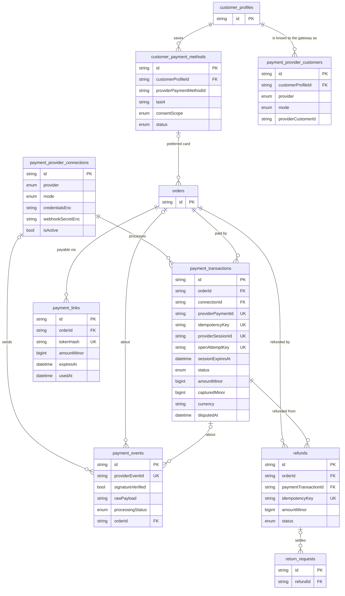
```mermaid
erDiagram
    payment_provider_connections ||--o{ payment_transactions : "processes"
    payment_provider_connections |o--o{ payment_events : "sends"
    orders ||--o{ payment_transactions : "paid by"
    orders ||--o{ payment_links : "payable via"
    orders ||--o{ refunds : "refunded by"
    orders |o--o{ payment_events : "about"
    payment_transactions ||--o{ refunds : "refunded from"
    payment_transactions |o--o{ payment_events : "about"
    refunds |o--o{ return_requests : "settles"
    customer_profiles ||--o{ customer_payment_methods : "saves"
    customer_profiles ||--o{ payment_provider_customers : "is known to the gateway as"
    customer_payment_methods |o--o{ orders : "preferred card"
    payment_provider_connections {
        string id PK
        enum provider
        enum mode
        string credentialsEnc
        string webhookSecretEnc
        bool isActive
    }
    payment_transactions {
        string id PK
        string orderId FK
        string connectionId FK
        string providerPaymentId UK
        string idempotencyKey UK
        string providerSessionId UK
        string openAttemptKey UK
        datetime sessionExpiresAt
        enum status
        bigint amountMinor
        bigint capturedMinor
        string currency
        datetime disputedAt
    }
    payment_provider_customers {
        string id PK
        string customerProfileId FK
        enum provider
        enum mode
        string providerCustomerId
    }
    payment_events {
        string id PK
        string providerEventId UK
        bool signatureVerified
        string rawPayload
        enum processingStatus
        string orderId FK
    }
    payment_links {
        string id PK
        string orderId FK
        string tokenHash UK
        bigint amountMinor
        datetime expiresAt
        datetime usedAt
    }
    refunds {
        string id PK
        string orderId FK
        string paymentTransactionId FK
        string idempotencyKey UK
        bigint amountMinor
        enum status
    }
    customer_payment_methods {
        string id PK
        string customerProfileId FK
        string providerPaymentMethodId
        string last4
        enum consentScope
        enum status
    }
    orders {
        string id PK
    }
    return_requests {
        string id PK
        string refundId FK
    }
    customer_profiles {
        string id PK
    }
```

**Enums.**

- `PaymentProviderKind`: `RAZORPAY`, `STRIPE`. `PaymentMode`: `TEST`, `LIVE`.
- `PaymentInstrumentKind`: `CREDIT_CARD`, `DEBIT_CARD`, `UPI` - what the
  customer chose. The customer is never shown a gateway name; the server maps
  instrument to gateway in `backend/src/domain/payment-instrument.ts`.
- `PaymentTransactionStatus`: `CREATED`, `PENDING`, `AUTHORIZED`, `CAPTURED`
  (money taken), `FAILED`, `CANCELLED`, `EXPIRED`. Which may follow which is
  below, under **The payment state model**.
- `WebhookProcessingStatus`: `RECEIVED`, `PROCESSED`, `DUPLICATE`, `REJECTED`
  (bad signature), `FAILED`.
- `RefundStatus`: `REQUESTED`, `PROCESSING`, `SUCCEEDED`, `FAILED`,
  `CANCELLED`.
- `PaymentConsentScope`: `CHECKOUT` ("keep this so I need not type it again")
  and `OFF_SESSION` ("charge this while I am not here", from Autopay). These
  are **different agreements**: only `OFF_SESSION` may be charged by a worker.
- `StoredPaymentMethodStatus`: `ACTIVE`, `DETACHED`, `EXPIRED`.

**Rules.**

- `uq_payment_connection_provider_mode (provider, mode)`: one Stripe test
  account, one Stripe live account, and so on. A connection cannot be activated
  without a webhook signing secret, because without one nothing could confirm
  an order.
- `uq_payment_event_provider_id`: a redelivered webhook is a duplicate-key
  error, not a second payment. `rawPayload` keeps the exact bytes.
- `payment_transactions.idempotencyKey` and `providerPaymentId` are `UNIQUE`;
  `refunds.idempotencyKey` and `providerRefundId` are `UNIQUE`.
- `CHECK`s: `amountMinor > 0` on transactions, links and refunds;
  `capturedMinor <= amountMinor`. With `orders.refundedMinor <= paidMinor`, a
  refund can never exceed what was captured.
- A payment link stores only the SHA-256 of its token, is bound to one order,
  recipient and amount, expires, and is single-use (`usedAt`).
- `uq_payment_method_provider_ref (provider, providerPaymentMethodId)`: one row
  per gateway token.
- `payment_transactions` and `refunds` are `Restrict` to `orders`: an order
  with money on it cannot be deleted.

**Stripe-hosted Checkout columns on `payment_transactions`.** Stripe-hosted
Checkout is Stripe's own payment page; one attempt is one Checkout Session.

| Column | What it holds |
|---|---|
| `providerSessionId` | The Checkout Session id (`cs_…`). `UNIQUE` (`uq_payment_provider_session`), so one session belongs to one attempt |
| `sessionExpiresAt` | When Stripe closes the page (32 minutes after it opens) |
| `openAttemptKey` | The order id while the attempt is open; `NULL` once it closes. See the rule below |
| `cardBrand`, `cardLast4` | For display only ("Visa ending in 4242"). Never a card number |
| `disputedAt`, `disputeReason` | Set when Stripe reports a chargeback. The status stays `CAPTURED` |

- **`uq_payment_open_attempt (openAttemptKey)`: one open payment attempt per
  order.** An open attempt carries its order id in `openAttemptKey`; closing
  it sets the column to `NULL`. MariaDB treats every `NULL` in a `UNIQUE`
  index as distinct, so any number of closed attempts sit side by side and
  only a second *open* one collides. A double click, a second tab or a retry
  therefore hits a duplicate-key error, and the service hands it the first
  attempt's Stripe page, tells it to wait (`PAYMENT_ATTEMPT_IN_PROGRESS`), or
  sends it to the confirmation. An attempt left open without a session for 20
  seconds (its request timed out) is closed `FAILED` so a new one can open.
- `uq_payment_provider_session (providerSessionId)`: a Checkout webhook finds
  exactly one attempt.

**`payment_provider_customers`.** The link between a person and the gateway's
own customer record. Stripe needs one so that Checkout can offer the "save for
future purchases" box and show saved cards again.

- `uq_provider_customer_profile (customerProfileId, provider, mode)`: one
  Stripe Customer per person per mode. Two first checkouts at the same moment
  both insert; one lands and the other adopts it.
- `uq_provider_customer_ref (provider, providerCustomerId)`: one person per
  Stripe Customer, so one person can never see another's cards.
- The foreign key to `customer_profiles` is `ON DELETE CASCADE`. Erasure
  deletes the row and then, best-effort, the Customer at Stripe. The data
  export lists it under the withheld `credentials` section.
- A row is never matched by email and never taken from a browser. A Stripe
  Customer that Stripe says no longer exists is forgotten and a new one made.

**A card saved on Checkout.** A `customer_payment_methods` row is written only
when the card, read back from Stripe, is a card attached to this person's
mapped Stripe Customer and saved for redisplay. It is stored with
`consentScope = CHECKOUT` and `consentVersion = 'stripe-checkout-native-v1'`,
and an `audit_logs` row (`payment_method.saved`) records the consent. A
`CHECKOUT` card can never be charged off-session.

**The payment state model** (`backend/src/domain/payment-state.ts`).
`payment_transactions.status` is written from several places — a webhook, a
reconcile, a Checkout Session opening or closing — each with a conditional
`UPDATE` whose allowed source states come from this one file, so two racing
writers cannot both win.

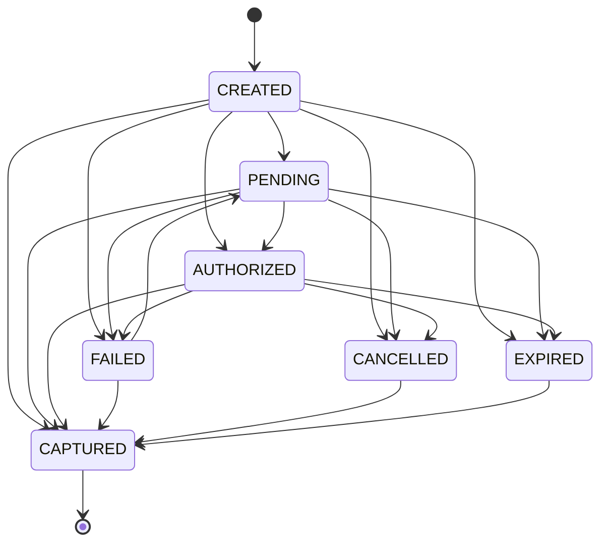
```mermaid
stateDiagram-v2
    [*] --> CREATED
    CREATED --> PENDING
    CREATED --> AUTHORIZED
    CREATED --> FAILED
    CREATED --> CANCELLED
    CREATED --> EXPIRED
    PENDING --> AUTHORIZED
    PENDING --> FAILED
    PENDING --> CANCELLED
    PENDING --> EXPIRED
    AUTHORIZED --> FAILED
    AUTHORIZED --> CANCELLED
    AUTHORIZED --> EXPIRED
    FAILED --> PENDING
    CREATED --> CAPTURED
    PENDING --> CAPTURED
    AUTHORIZED --> CAPTURED
    FAILED --> CAPTURED
    CANCELLED --> CAPTURED
    EXPIRED --> CAPTURED
    CAPTURED --> [*]
```

- `CAPTURED` is terminal. It may follow **any** other state, because money
  that moved is always recorded. A capture on a `CANCELLED` or `EXPIRED`
  attempt alerts finance (`CAPTURE_ON_CLOSED_ATTEMPT`); a capture on an order
  already paid in full is recorded and alerted (`DUPLICATE_PAYMENT`).
- `FAILED` may go back to `PENDING`: on Checkout the customer can try another
  card on the same payment.
- `CREATED`, `PENDING` and `AUTHORIZED` are the open states; they hold the
  order's `openAttemptKey`.
- Refunds and disputes are **separate facts**, not statuses. A richer
  *lifecycle state* is derived from them, never stored, and shown to staff as
  `lifecycleState`: `CREATED` (no session yet), `CHECKOUT_SESSION_CREATED`,
  `PROCESSING` and `REQUIRES_ACTION` (both stored `PENDING`), `AUTHORIZED`,
  `SUCCEEDED` (stored `CAPTURED`), `PARTIALLY_REFUNDED`, `REFUNDED`,
  `DISPUTED` (outranks the refund states), `FAILED`, `CANCELLED`, `EXPIRED`.

**Stock while the customer is on Stripe's page.** Opening Checkout extends the
order's active `stock_reservations` to the session's expiry plus 5 minutes.
Reservations that had already lapsed are taken again, all or nothing; if the
stock is gone, the attempt closes `FAILED` and the payment page is refused.
Reservations are committed once, when the order moves to `CONFIRMED`.

**Worked example: the webhook confirms the order.** The customer pays. The
browser returns to the confirmation page - **this confirms nothing**. Then the
gateway's server calls the webhook:

1. `payment_events`: inserted with `providerEventId`, the raw payload and
   `signatureVerified`, which is checked against the raw bytes. A duplicate
   delivery collides on the unique index and is marked `DUPLICATE`.
2. In one transaction: `payment_transactions` is moved to `CAPTURED` with a
   conditional update (so a replay cannot credit twice), and
   `orders.paidMinor` is increased by the captured amount only if that update
   matched. This happens in one place, `applyCapturedPayment`, whichever path
   brought the news: the webhook, `checkout.session.completed`, *Check again*
   or a reconcile. `openAttemptKey` is cleared and, for Checkout, `cardBrand`
   and `cardLast4` are filled from Stripe.
3. The order moves `PENDING_PAYMENT -> CONFIRMED` through `assertTransition`.
   Inside that same transaction: reservations become `COMMITTED` and
   `inventory_movements` rows are written; the order is split into
   `seller_order_groups` and `seller_order_lines` for any marketplace lines
   ([5.17](#517-seller-hub)); a linked preorder is confirmed; an
   `order_status_history` row and outbox rows are written.
4. `payment_events.processingStatus = PROCESSED`.
5. After commit, consignments are raised in `logistics_shipments`
   ([5.19](#519-logistics-partner-portal)).

### 5.8 Recurring and scheduled purchases

**Purpose.** A buyer sets up a basket to be ordered and charged automatically:
every two weeks, on the 5th of each month, or once on a future date. This is
the most dangerous code in the system - it charges people with nobody watching
- so duplicate protection is built into the tables.

| Model | Table | One row means |
|---|---|---|
| [`RecurringSchedule`](reference/DATABASE-TABLES.md#model-recurringschedule) | `recurring_schedules` | one **plan**: when to run, in which time zone, how to pay, where to deliver, price tolerance, consent |
| [`RecurringScheduleItem`](reference/DATABASE-TABLES.md#model-recurringscheduleitem) | `recurring_schedule_items` | one line of the plan, with an optional substitute product |
| [`ScheduleOccurrence`](reference/DATABASE-TABLES.md#model-scheduleoccurrence) | `schedule_occurrences` | one **run** of a plan for one planned time - created **before** any side effect |
| [`CustomerPaymentMethod`](reference/DATABASE-TABLES.md#model-customerpaymentmethod) | `customer_payment_methods` | the saved card a plan charges (see [5.7](#57-payments)) |
| [`ErpOrderPush`](reference/DATABASE-TABLES.md#model-erporderpush) | `erp_order_pushes` | one attempt record for sending one order to the operator's ERP |

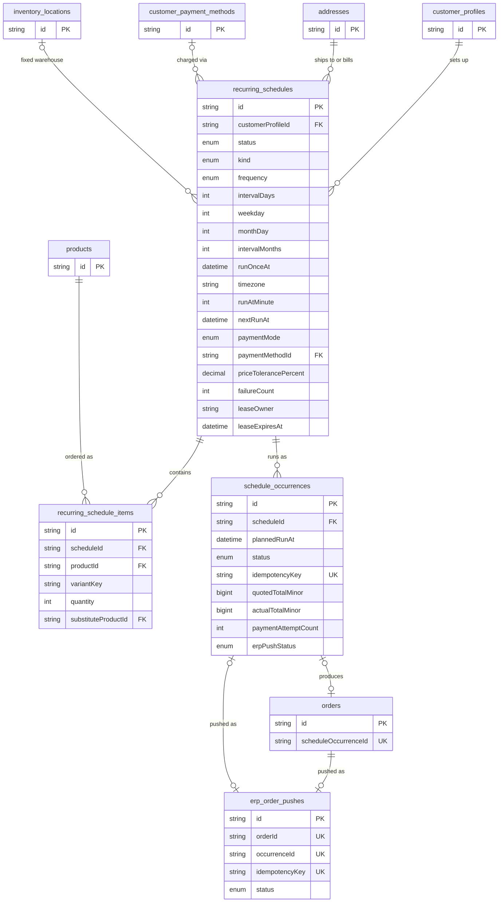
```mermaid
erDiagram
    customer_profiles ||--o{ recurring_schedules : "sets up"
    addresses ||--o{ recurring_schedules : "ships to or bills"
    customer_payment_methods |o--o{ recurring_schedules : "charged via"
    inventory_locations |o--o{ recurring_schedules : "fixed warehouse"
    recurring_schedules ||--o{ recurring_schedule_items : "contains"
    products ||--o{ recurring_schedule_items : "ordered as"
    recurring_schedules ||--o{ schedule_occurrences : "runs as"
    schedule_occurrences |o--o| orders : "produces"
    orders ||--o| erp_order_pushes : "pushed as"
    schedule_occurrences |o--o| erp_order_pushes : "pushed as"
    recurring_schedules {
        string id PK
        string customerProfileId FK
        enum status
        enum kind
        enum frequency
        int intervalDays
        int weekday
        int monthDay
        int intervalMonths
        datetime runOnceAt
        string timezone
        int runAtMinute
        datetime nextRunAt
        enum paymentMode
        string paymentMethodId FK
        decimal priceTolerancePercent
        int failureCount
        string leaseOwner
        datetime leaseExpiresAt
    }
    recurring_schedule_items {
        string id PK
        string scheduleId FK
        string productId FK
        string variantKey
        int quantity
        string substituteProductId FK
    }
    schedule_occurrences {
        string id PK
        string scheduleId FK
        datetime plannedRunAt
        enum status
        string idempotencyKey UK
        bigint quotedTotalMinor
        bigint actualTotalMinor
        int paymentAttemptCount
        enum erpPushStatus
    }
    erp_order_pushes {
        string id PK
        string orderId UK
        string occurrenceId UK
        string idempotencyKey UK
        enum status
    }
    orders {
        string id PK
        string scheduleOccurrenceId UK
    }
    customer_profiles {
        string id PK
    }
    addresses {
        string id PK
    }
    customer_payment_methods {
        string id PK
    }
    inventory_locations {
        string id PK
    }
    products {
        string id PK
    }
```

**Enums.**

- `ScheduleFrequency`: `EVERY_N_DAYS` (needs `intervalDays`), `WEEKLY` and
  `BIWEEKLY` (need `weekday`, 1-7), `MONTHLY` (needs `monthDay`, 1-31),
  `EVERY_N_MONTHS` (needs `intervalMonths`), `ONE_TIME` (needs `runOnceAt`).
- `ScheduleKind`: `ONE_TIME`, `RECURRING`.
- `SchedulePaymentMode`: `AUTO_PAY` (charge the saved card off-session) or
  `PAYMENT_LINK` (email a link each time).
- `SubstitutionPolicy`: `NEVER`, `SAVED_PREFERENCE` (use the item's saved
  substitute if the product is unavailable).
- `ScheduleFulfilmentRule`: `AUTO` (choose a warehouse each time) or
  `FIXED_LOCATION` (`inventoryLocationId`).
- `OccurrenceStatus`: see the diagram. `PENDING`, `ORDER_CREATED` and `PAID`
  are **legacy** values written by an earlier engine: still readable, never
  written, never moved.
- `ErpPushStatus`: `PENDING`, `SUCCEEDED`, `FAILED`, `ABANDONED`.

**Plan lifecycle** (`PLAN_TRANSITIONS` in `backend/src/domain/schedule-state.ts`):

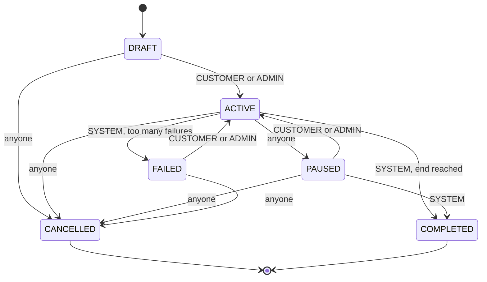
```mermaid
stateDiagram-v2
    [*] --> DRAFT
    DRAFT --> ACTIVE : CUSTOMER or ADMIN
    DRAFT --> CANCELLED : anyone
    ACTIVE --> PAUSED : anyone
    ACTIVE --> CANCELLED : anyone
    ACTIVE --> COMPLETED : SYSTEM, end reached
    ACTIVE --> FAILED : SYSTEM, too many failures
    PAUSED --> ACTIVE : CUSTOMER or ADMIN
    PAUSED --> CANCELLED : anyone
    PAUSED --> COMPLETED : SYSTEM
    FAILED --> ACTIVE : CUSTOMER or ADMIN
    FAILED --> CANCELLED : anyone
    CANCELLED --> [*]
    COMPLETED --> [*]
```

A plan only becomes `ACTIVE` because a person said so; no worker may resume
one. `CANCELLED` and `COMPLETED` are terminal.

**Occurrence lifecycle** (`OCCURRENCE_TRANSITIONS` in the same file):

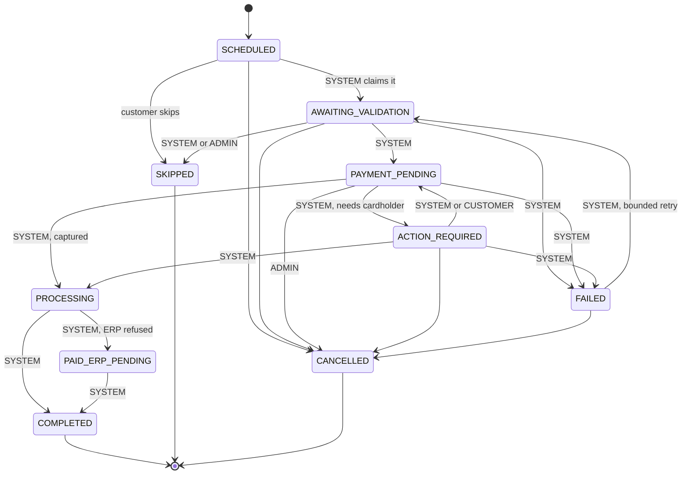
```mermaid
stateDiagram-v2
    [*] --> SCHEDULED
    SCHEDULED --> AWAITING_VALIDATION : SYSTEM claims it
    SCHEDULED --> SKIPPED : customer skips
    SCHEDULED --> CANCELLED
    AWAITING_VALIDATION --> PAYMENT_PENDING : SYSTEM
    AWAITING_VALIDATION --> SKIPPED : SYSTEM or ADMIN
    AWAITING_VALIDATION --> CANCELLED
    AWAITING_VALIDATION --> FAILED : SYSTEM
    PAYMENT_PENDING --> PROCESSING : SYSTEM, captured
    PAYMENT_PENDING --> ACTION_REQUIRED : SYSTEM, needs cardholder
    PAYMENT_PENDING --> FAILED : SYSTEM
    PAYMENT_PENDING --> CANCELLED : ADMIN
    ACTION_REQUIRED --> PROCESSING : SYSTEM
    ACTION_REQUIRED --> PAYMENT_PENDING : SYSTEM or CUSTOMER
    ACTION_REQUIRED --> FAILED : SYSTEM
    ACTION_REQUIRED --> CANCELLED
    PROCESSING --> COMPLETED : SYSTEM
    PROCESSING --> PAID_ERP_PENDING : SYSTEM, ERP refused
    PAID_ERP_PENDING --> COMPLETED : SYSTEM
    FAILED --> AWAITING_VALIDATION : SYSTEM, bounded retry
    FAILED --> CANCELLED
    COMPLETED --> [*]
    SKIPPED --> [*]
    CANCELLED --> [*]
```

Two invariants: **nothing goes back to a pre-payment state once money has
moved** (there is no edge out of `PROCESSING`, `PAID_ERP_PENDING` or
`COMPLETED` to `PAYMENT_PENDING` or `AWAITING_VALIDATION`), and
**`PAID_ERP_PENDING` is not a failure** - the customer has paid and the order
is real; only the paperwork is late. A customer may only edit or skip while
the occurrence is `SCHEDULED`.

**Rules the tables encode.**

- `uq_occurrence_schedule_run (scheduleId, plannedRunAt)`: one occurrence per
  slot. The row is inserted **before** anything else happens, so a second
  worker, a retry or clock skew collides and stops.
- `uq_occurrence_idempotency`: the key is `occ:<plan ULID>:<UTC
  YYYYMMDDHHMMSSmmm>` (48 characters), a pure function of the slot
  (`occurrenceIdempotencyKey`). Every side effect derives its own key from it
  (`...:payment`, `...:order`, `...:erp`, `...:stock`), so a retry recomputes
  the same keys. **Changing the format needs a migration that rewrites stored
  keys.**
- `uq_order_schedule_occurrence` on `orders` and `uq_erp_push_order` /
  `uq_erp_push_occurrence` on `erp_order_pushes`.
- `CHECK`s: `chk_schedule_frequency_field_present`
  ([3.9](#39-check-constraints-and-the-on-update-restrict-rule)),
  `weekday` 1-7, `monthDay` 1-31, `runAtMinute` 0-1439, `maxFailures >= 1`,
  `endDate >= startDate`, item quantities above zero.
- A scheduled basket is priced by **`quoteSchedule`** and nothing else
  (`backend/src/modules/recurring/schedule-quote.service.ts`). The review
  screen and the worker that charges weeks later both call it, so the number
  agreed to and the number charged come from one place.

**Worked example.** See [6.3](#63-how-a-scheduled-order-is-claimed-and-run)
for the full run of one occurrence.

### 5.9 Fulfilment quotes and after-sale

**Purpose.** Which warehouse will ship a basket, when it will arrive and what
delivery costs - frozen so the number read is the number charged - and what
happens after the sale: the operator's dispatch notes and returns.

| Model | Table | One row means |
|---|---|---|
| [`FulfilmentQuote`](reference/DATABASE-TABLES.md#model-fulfilmentquote) | `fulfilment_quotes` | one warehouse's offer for one basket, to one address, at one moment: price, dates, carrier, expiry, and a hash of the basket |
| [`Shipment`](reference/DATABASE-TABLES.md#model-shipment) | `shipments` | the operator's dispatch note against an order: carrier, tracking number, which items |
| [`ReturnRequest`](reference/DATABASE-TABLES.md#model-returnrequest) | `return_requests` | a buyer's request to return items, its decision, and the refund that settled it |

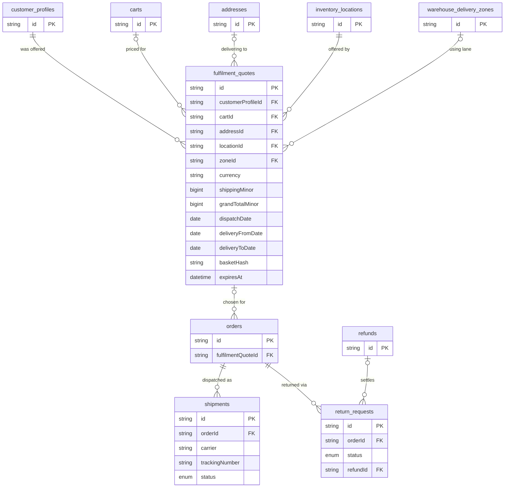
```mermaid
erDiagram
    customer_profiles ||--o{ fulfilment_quotes : "was offered"
    carts |o--o{ fulfilment_quotes : "priced for"
    addresses |o--o{ fulfilment_quotes : "delivering to"
    inventory_locations ||--o{ fulfilment_quotes : "offered by"
    warehouse_delivery_zones |o--o{ fulfilment_quotes : "using lane"
    fulfilment_quotes |o--o{ orders : "chosen for"
    orders ||--o{ shipments : "dispatched as"
    orders ||--o{ return_requests : "returned via"
    refunds |o--o{ return_requests : "settles"
    fulfilment_quotes {
        string id PK
        string customerProfileId FK
        string cartId FK
        string addressId FK
        string locationId FK
        string zoneId FK
        string currency
        bigint shippingMinor
        bigint grandTotalMinor
        date dispatchDate
        date deliveryFromDate
        date deliveryToDate
        string basketHash
        datetime expiresAt
    }
    shipments {
        string id PK
        string orderId FK
        string carrier
        string trackingNumber
        enum status
    }
    return_requests {
        string id PK
        string orderId FK
        enum status
        string refundId FK
    }
    orders {
        string id PK
        string fulfilmentQuoteId FK
    }
    customer_profiles {
        string id PK
    }
    carts {
        string id PK
    }
    addresses {
        string id PK
    }
    inventory_locations {
        string id PK
    }
    warehouse_delivery_zones {
        string id PK
    }
    refunds {
        string id PK
    }
```

**Enums.** `ShipmentStatus`: `CREATED`, `DISPATCHED`, `IN_TRANSIT`,
`DELIVERED`, `FAILED`, `RETURNED_TO_ORIGIN` (also used by
`seller_shipments`). `ReturnStatus`: `REQUESTED`, `APPROVED`, `REJECTED`,
`RECEIVED`, `INSPECTED`, `COMPLETED` (also used by `seller_returns`).

**Rules.** A quote that has expired, or whose `basketHash` no longer matches
the basket, is **refused** at checkout with a code the storefront turns into
"these options have moved" - never silently repriced. Expired quotes are swept
by the worker, except the one bound to an order (`orders.fulfilmentQuoteId`
is `Restrict`), which is the evidence behind that order's delivery date.
`shipments` and `return_requests` cascade with their order; a return points at
its refund with `SetNull`.

**Worked example.** At checkout the buyer picks an address. The server writes
one `fulfilment_quotes` row for each warehouse that can serve that address
(it has a matching lane and is not excluded), each with its own dates,
delivery fee and `expiresAt`. The buyer chooses the Rotterdam quote; checkout re-reads that
row, checks the basket hash and expiry, and copies the carrier, dispatch date
and delivery window onto `orders.fulfilmentCarrier`,
`fulfilmentDispatchDate`, `fulfilmentDeliveryFrom` and `fulfilmentDeliveryTo`.

### 5.10 Currencies, countries, prices and exchange rates

**Purpose.** Which markets the business sells in, what each product costs in
each currency, and what the exchange-rate feed said when a price was
converted. **Language is separate from currency**: a Polish-speaking buyer may
pay in euro.

| Model | Table | One row means |
|---|---|---|
| [`Currency`](reference/DATABASE-TABLES.md#model-currency) | `currencies` | one currency the deployment prices in (`code` is the key), with its `exponent` and whether it is the base (`isBase`) |
| [`Country`](reference/DATABASE-TABLES.md#model-country) | `countries` | one market: its currency, phone prefix, language, and whether EU VAT applies (`isEuVat`) |
| [`ProductPrice`](reference/DATABASE-TABLES.md#model-productprice) | `product_prices` | the price of one SKU in one currency; `isAutoConverted` says a tool derived it |
| [`ExchangeRateSnapshot`](reference/DATABASE-TABLES.md#model-exchangeratesnapshot) | `exchange_rate_snapshots` | **one fetch** from a rate provider: when, from where, whether it validated, whether it is active |
| [`ExchangeRate`](reference/DATABASE-TABLES.md#model-exchangerate) | `exchange_rates` | one rate inside one snapshot (`baseCurrency` to `quoteCurrency`, `DECIMAL(24,12)`) |

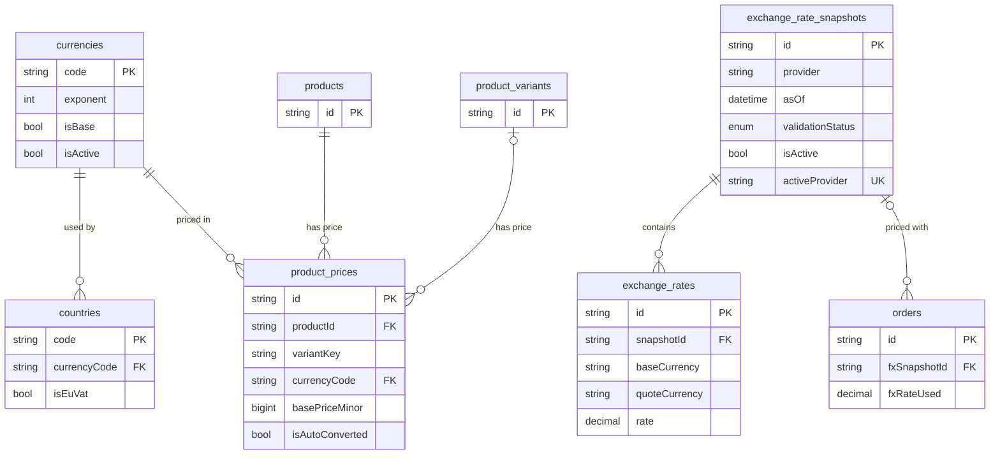
```mermaid
erDiagram
    currencies ||--o{ countries : "used by"
    currencies ||--o{ product_prices : "priced in"
    products ||--o{ product_prices : "has price"
    product_variants |o--o{ product_prices : "has price"
    exchange_rate_snapshots ||--o{ exchange_rates : "contains"
    exchange_rate_snapshots |o--o{ orders : "priced with"
    currencies {
        string code PK
        int exponent
        bool isBase
        bool isActive
    }
    countries {
        string code PK
        string currencyCode FK
        bool isEuVat
    }
    product_prices {
        string id PK
        string productId FK
        string variantKey
        string currencyCode FK
        bigint basePriceMinor
        bool isAutoConverted
    }
    exchange_rate_snapshots {
        string id PK
        string provider
        datetime asOf
        enum validationStatus
        bool isActive
        string activeProvider UK
    }
    exchange_rates {
        string id PK
        string snapshotId FK
        string baseCurrency
        string quoteCurrency
        decimal rate
    }
    orders {
        string id PK
        string fxSnapshotId FK
        decimal fxRateUsed
    }
    products {
        string id PK
    }
    product_variants {
        string id PK
    }
```

**Enums.** `FxRetrievalStatus`: `FETCHED`, `FAILED`. `FxValidationStatus`:
`PENDING`, `VALID`, `REJECTED`.

**Rules.**

- `uq_product_price_sku_currency (productId, variantKey, currencyCode)`: one
  price per SKU per currency.
- A rate list is the unit of trust: mixing Friday's zloty with Monday's dollar
  produces a cross-rate that never existed. So a **snapshot** is validated and
  activated as a whole, and `uq_fx_snapshot_active_provider` allows exactly one
  active snapshot per provider ([3.4](#34-the-active-slot-a-nullable-unique-used-on-purpose)).
- **Append-only.** Nothing updates a rate row. An order that points at a
  snapshot points at a fact.
- `uq_exchange_rate_snapshot_currency (snapshotId, quoteCurrency)`.
- `countries.currencyCode` and every other pointer at `currencies` is
  `Restrict`.
- The optional daily re-conversion job (settings in `currency_rate_sync`)
  only touches `product_prices` rows with `isAutoConverted = true`, and
  abandons the whole run if any price would move more than `maxDriftPercent`.

**Worked example.** A buyer in Poland views a product priced only in rupees.
The storefront converts at the active snapshot's rate. At checkout the order
stores `currency = 'PLN'`, `fxPriceSource = CONVERTED`, `fxSnapshotId`,
`fxMidRate`, `fxRateUsed` (after the configured margin), `fxRateAsOf`,
`fxProvider`, and the base-currency total in `fxBaseGrandTotalMinor`. A dispute
a year later can be answered from those columns alone.

### 5.11 Coupons and purchasing limits

**Purpose.** Percentage discounts that unlock above a minimum basket value,
and per-customer spending controls agreed with a business buyer.

| Model | Table | One row means |
|---|---|---|
| [`Coupon`](reference/DATABASE-TABLES.md#model-coupon) | `coupons` | one discount code: percentage, scope, validity window, usage limits |
| [`CouponCategory`](reference/DATABASE-TABLES.md#model-couponcategory) | `coupon_categories` | "this coupon applies to this category" (optionally its descendants) |
| [`CouponMinimum`](reference/DATABASE-TABLES.md#model-couponminimum) | `coupon_minimums` | the minimum basket for this coupon **in one currency** |
| [`CouponRedemption`](reference/DATABASE-TABLES.md#model-couponredemption) | `coupon_redemptions` | one use of a coupon on one order - **the truth** (`coupons.usageCount` is only a cache) |
| [`CustomerLimit`](reference/DATABASE-TABLES.md#model-customerlimit) | `customer_limits` | one buyer's agreed limits in one currency: per-order minimum and maximum, monthly cap, approval threshold |

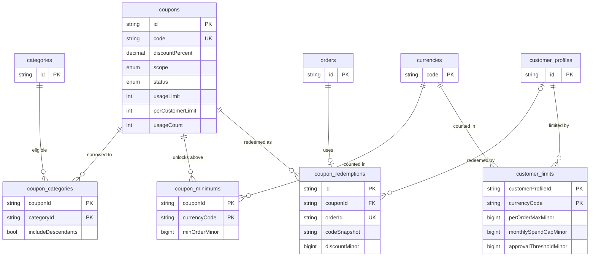
```mermaid
erDiagram
    coupons ||--o{ coupon_categories : "narrowed to"
    categories ||--o{ coupon_categories : "eligible"
    coupons ||--o{ coupon_minimums : "unlocks above"
    currencies ||--o{ coupon_minimums : "counted in"
    coupons ||--o{ coupon_redemptions : "redeemed as"
    orders ||--o| coupon_redemptions : "uses"
    customer_profiles |o--o{ coupon_redemptions : "redeemed by"
    customer_profiles ||--o{ customer_limits : "limited by"
    currencies ||--o{ customer_limits : "counted in"
    coupons {
        string id PK
        string code UK
        decimal discountPercent
        enum scope
        enum status
        int usageLimit
        int perCustomerLimit
        int usageCount
    }
    coupon_categories {
        string couponId PK
        string categoryId PK
        bool includeDescendants
    }
    coupon_minimums {
        string couponId PK
        string currencyCode PK
        bigint minOrderMinor
    }
    coupon_redemptions {
        string id PK
        string couponId FK
        string orderId UK
        string codeSnapshot
        bigint discountMinor
    }
    customer_limits {
        string customerProfileId PK
        string currencyCode PK
        bigint perOrderMaxMinor
        bigint monthlySpendCapMinor
        bigint approvalThresholdMinor
    }
    categories {
        string id PK
    }
    currencies {
        string code PK
    }
    orders {
        string id PK
    }
    customer_profiles {
        string id PK
    }
```

**Enums.** `CouponScope`: `ALL_PRODUCTS`, `CATEGORIES`. `CouponStatus`:
`DRAFT`, `ACTIVE`, `DISABLED`.

**Rules.** A threshold is **per currency**: "works above 5,000" cannot mean the
same in INR and USD, so a coupon with no minimum in a currency does not apply
in it. `uq_coupon_redemption_order` stops a retried checkout counting twice.
A buyer with limits anywhere may only order in currencies where they have a
row - dropping a credit control because the shopper switched currency is worse
than refusing the order. `CHECK`s keep limit amounts non-negative and the
minimum at or below the maximum. `customer_profiles.requiresOrderApproval`
stays on the profile because it is a policy about the account, not an amount.

**Worked example.** A buyer applies `SPRING10` to a EUR cart: `carts.appliedCouponId`
is set. At checkout the server checks `coupon_minimums` for `EUR`, the
category scope and the usage limits, then writes `orders.discountMinor` and one
`coupon_redemptions` row with the code and percentage frozen.

### 5.12 Tax and invoicing

**Purpose.** Two tax worlds side by side, and the legal invoice.

- **Flat rate** (for example Indian GST): the rate travels with the product's
  `tax_classes` row, and every buyer is quoted the same.
- **EU VAT**: the rate depends on the buyer's member state, whether they are a
  business, and whether their VAT number is valid (reverse charge). A tax class
  with a `vatCategory` is resolved against the destination country at pricing
  time.

| Model | Table | One row means |
|---|---|---|
| [`VatRate`](reference/DATABASE-TABLES.md#model-vatrate) | `vat_rates` | one member state's rate for one category, valid from a date |
| [`VatNumberCheck`](reference/DATABASE-TABLES.md#model-vatnumbercheck) | `vat_number_checks` | the latest VIES answer for one VAT number |
| [`Invoice`](reference/DATABASE-TABLES.md#model-invoice) | `invoices` | one issued invoice or credit note for goods **the operator** sold, with every figure frozen |

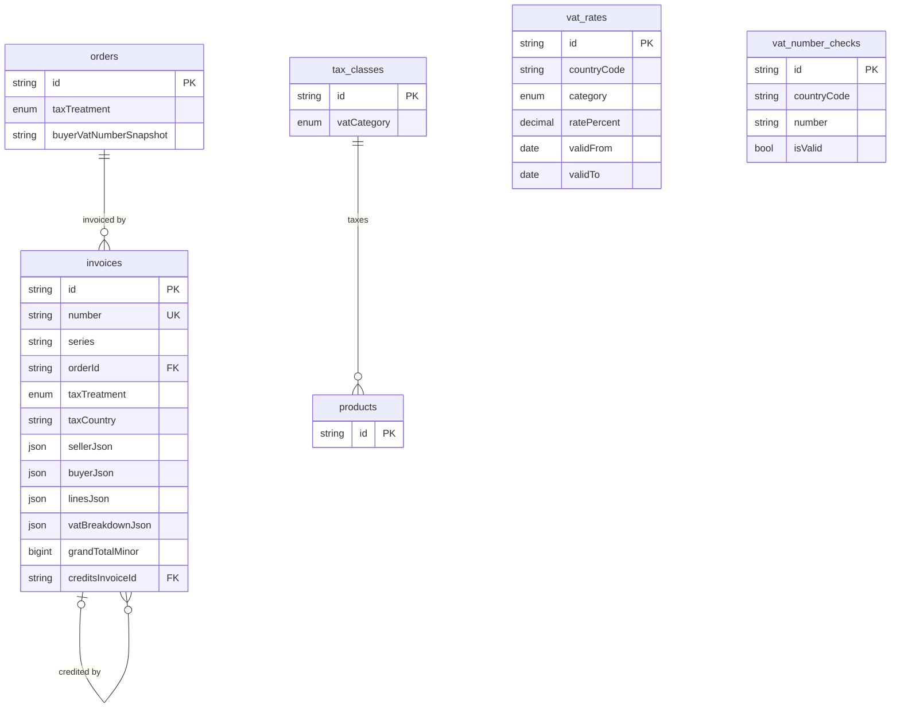
```mermaid
erDiagram
    orders ||--o{ invoices : "invoiced by"
    invoices |o--o{ invoices : "credited by"
    tax_classes ||--o{ products : "taxes"
    invoices {
        string id PK
        string number UK
        string series
        string orderId FK
        enum taxTreatment
        string taxCountry
        json sellerJson
        json buyerJson
        json linesJson
        json vatBreakdownJson
        bigint grandTotalMinor
        string creditsInvoiceId FK
    }
    vat_rates {
        string id PK
        string countryCode
        enum category
        decimal ratePercent
        date validFrom
        date validTo
    }
    vat_number_checks {
        string id PK
        string countryCode
        string number
        bool isValid
    }
    orders {
        string id PK
        enum taxTreatment
        string buyerVatNumberSnapshot
    }
    tax_classes {
        string id PK
        enum vatCategory
    }
    products {
        string id PK
    }
```

**Enums.** `VatCategory`: `STANDARD`, `REDUCED`, `SUPER_REDUCED`, `ZERO`,
`EXEMPT`. `TaxTreatment`: `FLAT_RATE` (non-EU deployments), `DOMESTIC`,
`INTRA_EU_REVERSE_CHARGE` (valid VAT number in another member state, 0%),
`INTRA_EU_B2C` (destination country's rate), `EXPORT` (outside the EU).

**Rules.**

- `uq_vat_rate_period (countryCode, category, validFrom)`: rate history, not
  overwrites. A rate change is a new row with a later `validFrom`.
- `uq_vat_number_check (countryCode, number)`: one cached answer per number.
- **An invoice has no update path.** Everything it says is frozen when it is
  issued. A correction is a **credit note**: a new `invoices` row whose
  `creditsInvoiceId` points at the original (`Restrict`).
- `invoices.orderId` is `Restrict`. Issuing is idempotent by order: a retried
  job returns the invoice the order already has.
- The invoice number comes from `number_sequences` key
  `invoice:<series>:<year>`, allocated in the same transaction, so a rolled-back
  issue takes its number back and the series has no gaps.
- These tables are the **operator's**. A marketplace seller's invoice is the
  seller's own document ([5.24](#524-seller-documents-invoices-and-packing-lists)).

**Worked example.** A German wholesaler with a valid VAT number buys from an
operator registered in the Netherlands. At
checkout `vat_number_checks` confirms the number, the order is stored with
`taxTreatment = INTRA_EU_REVERSE_CHARGE`, `taxCountry = 'DE'`, both VAT numbers
snapshotted and `taxMinor = 0`. When invoiced, `invoices` copies those, adds an
`exemptionNote` and a `vatBreakdownJson` with one 0% band.

### 5.13 Product compliance: GPSR and MDR

**Purpose.** EU product law. The General Product Safety Regulation (GPSR)
requires a named manufacturer and, for non-EU manufacturers, an EU responsible
person on each product. The Medical Device Regulation (MDR) adds a risk class
and device identifiers. Both are switched on per deployment
(`business_profile.gpsrEnforced`, `mdrEnforced`).

| Model | Table | One row means |
|---|---|---|
| [`EconomicOperator`](reference/DATABASE-TABLES.md#model-economicoperator) | `economic_operators` | one company in a legal role: manufacturer, EU responsible person or importer |
| [`ProductDeviceInfo`](reference/DATABASE-TABLES.md#model-productdeviceinfo) | `product_device_info` | the MDR facts of one product: `deviceClass`, `basicUdiDi`, `udiDi` |
| [`ProductCountryRestriction`](reference/DATABASE-TABLES.md#model-productcountryrestriction) | `product_country_restrictions` | "this product may not be sold into this country" |

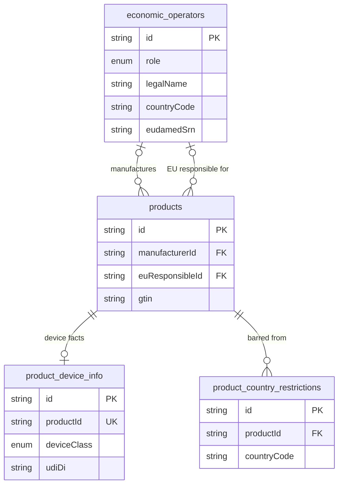
```mermaid
erDiagram
    economic_operators |o--o{ products : "manufactures"
    economic_operators |o--o{ products : "EU responsible for"
    products ||--o| product_device_info : "device facts"
    products ||--o{ product_country_restrictions : "barred from"
    economic_operators {
        string id PK
        enum role
        string legalName
        string countryCode
        string eudamedSrn
    }
    products {
        string id PK
        string manufacturerId FK
        string euResponsibleId FK
        string gtin
    }
    product_device_info {
        string id PK
        string productId UK
        enum deviceClass
        string udiDi
    }
    product_country_restrictions {
        string id PK
        string productId FK
        string countryCode
    }
```

**Enums.** `EconomicOperatorRole`: `MANUFACTURER`, `EU_RESPONSIBLE_PERSON`,
`IMPORTER`. `DeviceClass`: `CLASS_I`, `CLASS_I_STERILE`, `CLASS_I_MEASURING`,
`CLASS_I_REUSABLE_SURGICAL`, `CLASS_IIA`, `CLASS_IIB`, `CLASS_III`.

**Rules.** Products point at operators with `Restrict`, so an operator named
on a product cannot be deleted (archive it). `uq_device_info_product`: one
device record per product. `uq_product_country_restriction (productId,
countryCode)`. The marketplace is general, not medical: MDR rows exist only for
products that are devices.

**Worked example.** An administrator adds a sterile Class I device made in
China: one `economic_operators` row for the manufacturer, one for the EU
responsible person, the product's `manufacturerId` and `euResponsibleId` set,
and a `product_device_info` row with `deviceClass = CLASS_I_STERILE`.

### 5.14 Operator connector, bulk import and export

**Purpose.** The operator's generic product/inventory API connector, and file
uploads and downloads run as background jobs.

| Model | Table | One row means |
|---|---|---|
| [`IntegrationConnection`](reference/DATABASE-TABLES.md#model-integrationconnection) | `integration_connections` | one configured external API: URL, auth type, encrypted credentials, field mapping, direction, conflict policy, circuit breaker |
| [`SyncRun`](reference/DATABASE-TABLES.md#model-syncrun) | `sync_runs` | one run of that connector, with counts |
| [`SyncError`](reference/DATABASE-TABLES.md#model-syncerror) | `sync_errors` | one failed record inside a run |
| [`ImportJob`](reference/DATABASE-TABLES.md#model-importjob) | `import_jobs` | one uploaded file being validated (dry run) or applied |
| [`ImportRowError`](reference/DATABASE-TABLES.md#model-importrowerror) | `import_row_errors` | one bad row in an import |
| [`ExportJob`](reference/DATABASE-TABLES.md#model-exportjob) | `export_jobs` | one requested export file and its one-time download token |

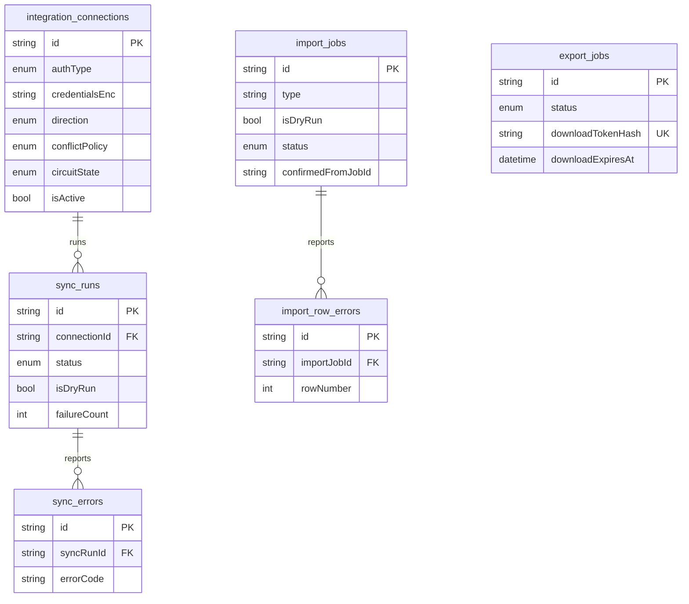
```mermaid
erDiagram
    integration_connections ||--o{ sync_runs : "runs"
    sync_runs ||--o{ sync_errors : "reports"
    import_jobs ||--o{ import_row_errors : "reports"
    integration_connections {
        string id PK
        enum authType
        string credentialsEnc
        enum direction
        enum conflictPolicy
        enum circuitState
        bool isActive
    }
    sync_runs {
        string id PK
        string connectionId FK
        enum status
        bool isDryRun
        int failureCount
    }
    sync_errors {
        string id PK
        string syncRunId FK
        string errorCode
    }
    import_jobs {
        string id PK
        string type
        bool isDryRun
        enum status
        string confirmedFromJobId
    }
    import_row_errors {
        string id PK
        string importJobId FK
        int rowNumber
    }
    export_jobs {
        string id PK
        enum status
        string downloadTokenHash UK
        datetime downloadExpiresAt
    }
```

**Enums.** `SyncDirection`: `IMPORT`, `EXPORT`, `BIDIRECTIONAL`.
`ConflictPolicy`: `EXTERNAL_WINS`, `UBOSS_WINS`, `FIELD_LEVEL`.
`CircuitState`: `CLOSED` (calls flow), `OPEN` (too many failures; calls
stopped), `HALF_OPEN` (trying again). `SyncRunStatus`: `RUNNING`,
`SUCCEEDED`, `PARTIAL`, `FAILED`, `CANCELLED`. `JobStatus` (also used by
`job_queue` and seller imports): `PENDING`, `RUNNING`, `SUCCEEDED`, `PARTIAL`,
`FAILED`, `DEAD`, `CANCELLED`.

**Worked example.** An administrator uploads a product sheet. An
`import_jobs` row is written with `isDryRun = true`; the worker validates every
row and writes `import_row_errors` for the bad ones. The administrator
confirms: a second `import_jobs` row with `isDryRun = false` and
`confirmedFromJobId` pointing at the first re-reads the file and applies it.

### 5.15 The operator's ERP and Autopay

**Purpose.** The **operator's own** warehouse or ERP system, configured once
under Settings -> ERP and used for every order. Not to be confused with a
buyer's ERP ([5.16](#516-buyer-organisations-and-their-own-erp)) or a seller's
Tally ([5.21](#521-a-sellers-own-accounting-system-tallyprime)) - three
separate features that share no table.

| Model | Table | One row means |
|---|---|---|
| [`ErpConnection`](reference/DATABASE-TABLES.md#model-erpconnection) | `erp_connections` | the operator's ERP: endpoints, auth, encrypted credentials, webhook slug and secret, polling, field mapping, `inventoryAuthority` |
| [`ErpInventorySyncRun`](reference/DATABASE-TABLES.md#model-erpinventorysyncrun) | `erp_inventory_sync_runs` | one inventory sync |
| [`ErpSyncRecordError`](reference/DATABASE-TABLES.md#model-erpsyncrecorderror) | `erp_sync_record_errors` | one bad record in a sync |
| [`ErpInventorySnapshot`](reference/DATABASE-TABLES.md#model-erpinventorysnapshot) | `erp_inventory_snapshots` | what the ERP last said about one SKU at one warehouse |
| [`IntegrationEvent`](reference/DATABASE-TABLES.md#model-integrationevent) | `integration_events` | one outbound call or attempt (order push, sync, test, autopay charge), with its idempotency key and result |
| [`ErpWebhookReceipt`](reference/DATABASE-TABLES.md#model-erpwebhookreceipt) | `erp_webhook_receipts` | one webhook the ERP sent - the inbox |
| [`ErpOrderPush`](reference/DATABASE-TABLES.md#model-erporderpush) | `erp_order_pushes` | the push record for one order (see [5.8](#58-recurring-and-scheduled-purchases)) |
| [`CustomerAutoPaySetting`](reference/DATABASE-TABLES.md#model-customerautopaysetting) | `customer_autopay_settings` | one buyer's standing authority to be charged automatically, with limits and consent |

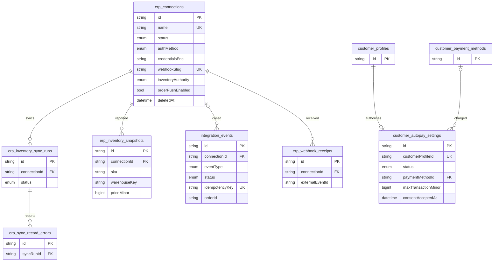
```mermaid
erDiagram
    erp_connections ||--o{ erp_inventory_sync_runs : "syncs"
    erp_inventory_sync_runs ||--o{ erp_sync_record_errors : "reports"
    erp_connections ||--o{ erp_inventory_snapshots : "reported"
    erp_connections |o--o{ integration_events : "called"
    erp_connections ||--o{ erp_webhook_receipts : "received"
    customer_profiles ||--o| customer_autopay_settings : "authorises"
    customer_payment_methods |o--o{ customer_autopay_settings : "charged"
    erp_connections {
        string id PK
        string name UK
        enum status
        enum authMethod
        string credentialsEnc
        string webhookSlug UK
        enum inventoryAuthority
        bool orderPushEnabled
        datetime deletedAt
    }
    erp_inventory_snapshots {
        string id PK
        string connectionId FK
        string sku
        string warehouseKey
        bigint priceMinor
    }
    integration_events {
        string id PK
        string connectionId FK
        enum eventType
        enum status
        string idempotencyKey UK
        string orderId
    }
    erp_webhook_receipts {
        string id PK
        string connectionId FK
        string externalEventId
    }
    erp_inventory_sync_runs {
        string id PK
        string connectionId FK
        enum status
    }
    erp_sync_record_errors {
        string id PK
        string syncRunId FK
    }
    customer_autopay_settings {
        string id PK
        string customerProfileId UK
        enum status
        string paymentMethodId FK
        bigint maxTransactionMinor
        datetime consentAcceptedAt
    }
    customer_profiles {
        string id PK
    }
    customer_payment_methods {
        string id PK
    }
```

**Enums.** `ErpConnectionStatus`: `DRAFT`, `TESTING`, `CONNECTED`, `ACTIVE`,
`PAUSED`, `ERROR`, `DISABLED` (moved only through
`backend/src/domain/erp-connection-state.ts`). `ErpInventoryAuthority`: `ERP`,
`PLATFORM`, `MANUAL` - who is the source of truth for stock.
`IntegrationEventType`: `CONNECTION_TEST`, `DRY_RUN`, `ORDER_PUSH`,
`INVENTORY_SYNC`, `INVENTORY_WEBHOOK`, `ORDER_STATUS_POLL`, `AUTOPAY_CHARGE`.
`IntegrationEventStatus`: `PENDING`, `IN_PROGRESS`, `SUCCEEDED`,
`RETRY_SCHEDULED`, `FAILED`, `ABANDONED`. `AutoPayStatus`: `DISABLED`,
`ACTIVE`, `PAUSED`.

**Rules.** `uq_erp_snapshot_sku_warehouse (connectionId, sku, warehouseKey)`;
`uq_erp_webhook_receipt (connectionId, externalEventId)` makes a redelivered
webhook a no-op; `uq_integration_event_idempotency`; `uq_autopay_customer`
(one authority per buyer). **ERP sync writes `erp_inventory_snapshots`, never
`inventory_balances`** - the ERP's view is recorded beside the stock ledger,
not over it. There is deliberately no per-customer connection here: a buyer
supplying the URL this server calls would be a server-side request forgery
hole.

**Worked example.** An order is confirmed. An `integration_events` row
(`ORDER_PUSH`, `PENDING`) and an `erp_order_pushes` row are written; the worker
calls the ERP with the push's idempotency key as a header, records the ERP's
order reference on success, or sets `nextRetryAt` on failure.

### 5.16 Buyer organisations and their own ERP

**Purpose.** A buyer is often a business - a hospital group, a distributor -
running SAP, Odoo, monday.com or something in-house. It wants what it buys
here to appear there: a purchase order on confirmation, a goods receipt on
delivery, an invoice, a payment reference. **The organisation owns the
connection, not the person**, so it keeps working when staff change.

| Model | Table | One row means |
|---|---|---|
| [`BuyerOrganization`](reference/DATABASE-TABLES.md#model-buyerorganization) | `buyer_organizations` | one buyer company (the tenant) |
| [`BuyerOrganizationMember`](reference/DATABASE-TABLES.md#model-buyerorganizationmember) | `buyer_organization_members` | one person in it, with a role |
| [`BuyerOrganizationInvite`](reference/DATABASE-TABLES.md#model-buyerorganizationinvite) | `buyer_organization_invites` | one pending invitation (hashed token) |
| [`CustomerErpConnection`](reference/DATABASE-TABLES.md#model-customererpconnection) | `customer_erp_connections` | one ERP the organisation connected: system, API style, environment, state |
| [`CustomerErpCredential`](reference/DATABASE-TABLES.md#model-customererpcredential) | `customer_erp_credentials` | one encrypted secret (`payloadEnc`) and the `hint` a screen may show |
| [`CustomerErpEndpoint`](reference/DATABASE-TABLES.md#model-customererpendpoint) / [`CustomerErpFieldMapping`](reference/DATABASE-TABLES.md#model-customererpfieldmapping) / [`CustomerErpWarehouseMap`](reference/DATABASE-TABLES.md#model-customererpwarehousemap) | `customer_erp_endpoints` / `customer_erp_field_mappings` / `customer_erp_warehouse_maps` | configuration: one URL per purpose, one field mapping, one warehouse mapping |
| [`CustomerErpSyncPolicy`](reference/DATABASE-TABLES.md#model-customererpsyncpolicy) | `customer_erp_sync_policies` | what to send and when (one per connection), approval threshold |
| [`CustomerErpSyncEvent`](reference/DATABASE-TABLES.md#model-customererpsyncevent) | `customer_erp_sync_events` | one thing to send to the buyer's ERP - **the outbox** |
| [`CustomerErpSyncJob`](reference/DATABASE-TABLES.md#model-customererpsyncjob) | `customer_erp_sync_jobs` | one bulk pull or push run |
| [`CustomerErpWebhookEvent`](reference/DATABASE-TABLES.md#model-customererpwebhookevent) | `customer_erp_webhook_events` | one webhook the buyer's ERP sent - **the inbox** |
| `CustomerErpOrderLink`, `CustomerErpInvoiceLink`, `CustomerErpInventoryLink`, `CustomerErpProductCode` | `customer_erp_order_links`, `customer_erp_invoice_links`, `customer_erp_inventory_links`, `customer_erp_product_codes` | "this order / invoice / stock line / product is that record in the buyer's ERP" |
| [`CustomerErpApproval`](reference/DATABASE-TABLES.md#model-customererpapproval) | `customer_erp_approvals` | a sync event held for a person to approve |
| [`CustomerErpOAuthState`](reference/DATABASE-TABLES.md#model-customererpoauthstate) | `customer_erp_oauth_states` | one in-flight OAuth handshake |
| [`CustomerErpAuditLog`](reference/DATABASE-TABLES.md#model-customererpauditlog) | `customer_erp_audit_logs` | one audited action, scoped to the organisation |

```mermaid
erDiagram
    buyer_organizations ||--o{ buyer_organization_members : "employs"
    customer_profiles ||--o| buyer_organization_members : "belongs as"
    buyer_organizations ||--o{ buyer_organization_invites : "invites"
    buyer_organizations ||--o{ customer_erp_connections : "connects"
    customer_erp_connections ||--o{ customer_erp_credentials : "secured by"
    customer_erp_connections ||--o| customer_erp_sync_policies : "governed by"
    customer_erp_connections ||--o{ customer_erp_sync_events : "sends"
    customer_erp_connections ||--o{ customer_erp_webhook_events : "receives"
    customer_erp_connections ||--o{ customer_erp_order_links : "links orders"
    customer_erp_connections ||--o{ customer_erp_approvals : "holds for approval"
    buyer_organizations ||--o{ customer_erp_audit_logs : "audited"
    buyer_organizations {
        string id PK
        string name
        datetime archivedAt
    }
    buyer_organization_members {
        string id PK
        string organizationId FK
        string customerProfileId UK
        enum role
    }
    buyer_organization_invites {
        string id PK
        string organizationId FK
        string tokenHash UK
    }
    customer_erp_connections {
        string id PK
        string organizationId FK
        enum system
        enum environment
        enum state
        string webhookSlug UK
    }
    customer_erp_credentials {
        string id PK
        string connectionId FK
        enum kind
        string payloadEnc
        string hint
    }
    customer_erp_sync_policies {
        string id PK
        string connectionId UK
        bigint approvalThresholdMinor
    }
    customer_erp_sync_events {
        string id PK
        string connectionId FK
        enum state
        string idempotencyKey UK
    }
    customer_erp_webhook_events {
        string id PK
        string connectionId FK
        string externalEventId
    }
    customer_erp_order_links {
        string id PK
        string connectionId FK
        string orderId "no FK"
    }
    customer_erp_approvals {
        string id PK
        string connectionId FK
        string syncEventId UK
        enum state
    }
    customer_erp_audit_logs {
        string id PK
        string organizationId FK
    }
    customer_profiles {
        string id PK
    }
```

**Enums.** `BuyerOrgRole`: `OWNER`, `INTEGRATION_MANAGER`, `MEMBER`.
`CustomerErpSystem`: `SAP`, `MONDAY`, `ODOO`, `CUSTOM`.
`CustomerErpConnectionState`: `DRAFT`, `TESTING`, `ACTIVE`, `PAUSED`,
`ACTION_REQUIRED`, `FAILED`, `DISCONNECTED` (moved through
`backend/src/domain/customer-erp-state.ts`). `CustomerErpEventState`:
`QUEUED`, `PROCESSING`, `SUCCEEDED`, `RETRYING`, `FAILED`, `SKIPPED`.

**Rules.** `uq_buyer_org_member_profile`: a person belongs to at most one
organisation. `uq_customer_erp_connection_name (organizationId, name)`,
`uq_customer_erp_credential (connectionId, kind)`,
`uq_customer_erp_webhook_event (connectionId, externalEventId)`,
`uq_customer_erp_order_link (connectionId, orderId)`,
`uq_customer_erp_inventory_link (connectionId, productId, variantKey,
erpPlant)`. Everything cascades from the connection, and the connection from
the organisation. **Stock order matters:** a confirmed order raises a purchase
order and moves the quantity to "on order" in the buyer's ERP; on-hand stock
moves only on a goods receipt, and only if the policy says to write it
automatically.

**Worked example.** A hospital's order is confirmed. A
`customer_erp_sync_events` row (`QUEUED`) is written with an idempotency key;
if the order is above the policy's `approvalThresholdMinor`, a
`customer_erp_approvals` row holds it. The worker sends the purchase order and
writes a `customer_erp_order_links` row with the ERP's document number.

### 5.17 Seller Hub

**Purpose.** Third-party sellers on the marketplace. Two decisions shape it:

1. **A seller is a tenant, not a flag on a user.** `seller_accounts` is the
   tenant; `seller_members` puts a person (a customer profile) in it; every
   seller-owned row carries `sellerAccountId`.
2. **A catalogue product is not an offer.** Ten sellers of the same infusion
   pump produce **one** `products` row and **ten** `seller_offers` rows, each
   with its own price, stock and terms.

**Onboarding and catalogue tables.**

| Model | Table | One row means |
|---|---|---|
| [`SellerAccount`](reference/DATABASE-TABLES.md#model-selleraccount) | `seller_accounts` | one seller company: names, slug, kind, application status, commission override |
| [`SellerMember`](reference/DATABASE-TABLES.md#model-sellermember) / [`SellerInvitation`](reference/DATABASE-TABLES.md#model-sellerinvitation) | `seller_members` / `seller_invitations` | a person in the seller, with a role / a pending invite |
| [`SellerOnboardingProgress`](reference/DATABASE-TABLES.md#model-selleronboardingprogress) / [`SellerOnboardingRequirement`](reference/DATABASE-TABLES.md#model-selleronboardingrequirement) | `seller_onboarding_progress` / `seller_onboarding_requirements` | how far the application has got / what each country asks for, **as data, not code** |
| [`SellerBusinessProfile`](reference/DATABASE-TABLES.md#model-sellerbusinessprofile) | `seller_business_profiles` | registration details (one per seller) |
| [`SellerVerificationCase`](reference/DATABASE-TABLES.md#model-sellerverificationcase), [`SellerDocument`](reference/DATABASE-TABLES.md#model-sellerdocument), [`SellerAgreementAcceptance`](reference/DATABASE-TABLES.md#model-selleragreementacceptance), [`SellerPayoutAccountReference`](reference/DATABASE-TABLES.md#model-sellerpayoutaccountreference) | `seller_verification_cases`, `seller_documents`, `seller_agreement_acceptances`, `seller_payout_account_references` | a verification check, an uploaded certificate (malware-scanned), an accepted agreement, a reference to the payout account held by a regulated provider |
| [`SellerLocation`](reference/DATABASE-TABLES.md#model-sellerlocation) | `seller_locations` | one of the seller's warehouses or pickup points |
| [`Brand`](reference/DATABASE-TABLES.md#model-brand) / [`BrandRequest`](reference/DATABASE-TABLES.md#model-brandrequest) | `brands` / `brand_requests` | a marketplace-wide brand name / a seller asking to sell under one |
| [`CategoryAttributeDefinition`](reference/DATABASE-TABLES.md#model-categoryattributedefinition) | `category_attribute_definitions` | one field the listing wizard asks for in one category |
| [`SellerListingDraft`](reference/DATABASE-TABLES.md#model-sellerlistingdraft) (+ `SellerListingDraftMedia`, `SellerListingIssue`) | `seller_listing_drafts` (+ `seller_listing_draft_media`, `seller_listing_issues`) | a listing being written and reviewed, its pictures, its validation issues |
| [`SellerOffer`](reference/DATABASE-TABLES.md#model-selleroffer) | `seller_offers` | one seller's terms for one product or variant: price, currency, SKU, minimums, handling time |
| [`SellerPriceTier`](reference/DATABASE-TABLES.md#model-sellerpricetier) / [`StoreQuantityDiscount`](reference/DATABASE-TABLES.md#model-storequantitydiscount) | `seller_price_tiers` / `store_quantity_discounts` | a quantity price band on one offer / a store-wide quantity discount band |
| [`SellerInventory`](reference/DATABASE-TABLES.md#model-sellerinventory) / [`SellerInventoryMovement`](reference/DATABASE-TABLES.md#model-sellerinventorymovement) | `seller_inventory` / `seller_inventory_movements` | one offer's stock at one seller location / one change to it |
| [`SellerBulkImportJob`](reference/DATABASE-TABLES.md#model-sellerbulkimportjob) (+ row errors) | `seller_bulk_import_jobs` (+ `seller_bulk_import_row_errors`) | a seller's spreadsheet upload |

```mermaid
erDiagram
    seller_accounts ||--o{ seller_members : "staffed by"
    customer_profiles ||--o| seller_members : "works as"
    seller_accounts ||--o{ seller_locations : "operates"
    seller_accounts ||--o{ seller_listing_drafts : "writes"
    categories |o--o{ seller_listing_drafts : "filed under"
    brands |o--o{ seller_listing_drafts : "branded"
    seller_accounts ||--o{ seller_offers : "offers"
    products ||--o{ seller_offers : "offered as"
    product_variants |o--o{ seller_offers : "offered as"
    seller_offers ||--o{ seller_price_tiers : "banded by"
    seller_offers ||--o{ seller_inventory : "stocked as"
    seller_locations ||--o{ seller_inventory : "holds"
    seller_accounts {
        string id PK
        string displayNameNormalized UK
        string slug UK
        enum kind
        enum status
        int commissionBasisPoints
        datetime archivedAt
    }
    seller_members {
        string id PK
        string sellerAccountId FK
        string customerProfileId UK
        enum role
    }
    seller_locations {
        string id PK
        string sellerAccountId FK
        string code
        string countryCode
    }
    seller_listing_drafts {
        string id PK
        string sellerAccountId FK
        enum status
        string categoryId FK
        string brandId FK
        string publishedOfferId
        int version
    }
    seller_offers {
        string id PK
        string sellerAccountId FK
        string productId FK
        string variantKey
        string sellerSku
        enum status
        bigint priceMinor
        string currency
        int minimumOrderQuantity
    }
    seller_price_tiers {
        string id PK
        string offerId FK
        int minQuantity
        bigint priceMinor
    }
    seller_inventory {
        string id PK
        string offerId FK
        string locationId FK
        int availableQuantity
        int reservedQuantity
        int quarantinedQuantity
    }
    customer_profiles {
        string id PK
    }
    categories {
        string id PK
    }
    brands {
        string id PK
    }
    products {
        string id PK
    }
    product_variants {
        string id PK
    }
```

**Orders and money tables.**

| Model | Table | One row means |
|---|---|---|
| [`SellerOrderGroup`](reference/DATABASE-TABLES.md#model-sellerordergroup) | `seller_order_groups` | **one seller's share of one order**: its own number, status, goods, tax, shipping, commission and net |
| [`SellerOrderLine`](reference/DATABASE-TABLES.md#model-sellerorderline) | `seller_order_lines` | one order line that belongs to that seller |
| [`SellerShipment`](reference/DATABASE-TABLES.md#model-sellershipment) / [`SellerReturn`](reference/DATABASE-TABLES.md#model-sellerreturn) | `seller_shipments` / `seller_returns` | a seller's dispatch note / a return against the seller's share |
| [`SellerSettlement`](reference/DATABASE-TABLES.md#model-sellersettlement) | `seller_settlements` | one settlement period: gross, commission, fees, refunds, adjustments, **net payable** |
| [`SellerSettlementLine`](reference/DATABASE-TABLES.md#model-sellersettlementline) | `seller_settlement_lines` | one signed amount in it (sale, commission, refund, manual adjustment) |
| [`SellerPayout`](reference/DATABASE-TABLES.md#model-sellerpayout) | `seller_payouts` | one transfer of money to the seller |
| [`SellerNotification`](reference/DATABASE-TABLES.md#model-sellernotification) / [`SellerAuditLog`](reference/DATABASE-TABLES.md#model-sellerauditlog) | `seller_notifications` / `seller_audit_logs` | the seller's own bell / the seller's own audit trail |

```mermaid
erDiagram
    orders ||--o{ seller_order_groups : "split into"
    seller_accounts ||--o{ seller_order_groups : "fulfils"
    seller_order_groups ||--o{ seller_order_lines : "contains"
    seller_offers ||--o{ seller_order_lines : "sold via"
    seller_order_groups ||--o{ seller_shipments : "dispatched as"
    seller_order_groups ||--o{ seller_returns : "returned via"
    seller_accounts ||--o{ seller_settlements : "settled in"
    seller_settlements ||--o{ seller_settlement_lines : "itemised by"
    seller_order_groups |o--o{ seller_settlement_lines : "accounted in"
    seller_settlements |o--o{ seller_payouts : "paid by"
    seller_order_groups ||--o| seller_order_settlements : "estimated as"
    seller_order_groups {
        string id PK
        string orderId FK
        string sellerAccountId FK
        string sellerOrderNumber
        enum status
        bigint goodsTotalMinor
        bigint commissionMinor
        bigint sellerNetMinor
        string currency
        datetime dispatchDueAt
    }
    seller_order_lines {
        string id PK
        string orderGroupId FK
        string orderItemId UK
        string offerId FK
        int quantity
        bigint lineTotalMinor
        bigint sellerNetMinor
    }
    seller_settlements {
        string id PK
        string sellerAccountId FK
        string reference UK
        enum status
        bigint grossMinor
        bigint commissionMinor
        bigint netPayableMinor
    }
    seller_settlement_lines {
        string id PK
        string settlementId FK
        string orderGroupId FK
        enum kind
        bigint amountMinor
    }
    seller_payouts {
        string id PK
        string sellerAccountId FK
        string settlementId FK
        enum status
        bigint amountMinor
    }
    seller_shipments {
        string id PK
        string orderGroupId FK
        enum status
    }
    seller_returns {
        string id PK
        string orderGroupId FK
        enum status
    }
    seller_order_settlements {
        string id PK
        string sellerOrderGroupId UK
    }
    orders {
        string id PK
    }
    seller_accounts {
        string id PK
    }
    seller_offers {
        string id PK
    }
```

**Enums.**

- `SellerKind`: `MANUFACTURER`, `AUTHORISED_DISTRIBUTOR`, `WHOLESALER`,
  `RESELLER`.
- `SellerMemberRole`: `OWNER`, `ADMIN`, `CATALOGUE_MANAGER`,
  `INVENTORY_MANAGER`, `ORDER_MANAGER`, `FINANCE_VIEWER`, `SUPPORT_MEMBER`.
- `SellerOfferStatus`: `INACTIVE`, `ACTIVE`, `PAUSED`, `NEEDS_CHANGES`,
  `ARCHIVED`.
- `ListingDraftStatus`: `DRAFT`, `VALIDATION_FAILED`, `READY_FOR_SUBMISSION`,
  `PENDING_REVIEW`, `ACTION_REQUIRED`, `APPROVED`, `REJECTED`, `ARCHIVED`.
- `BrandStatus`: `APPROVED`, `PENDING`, `REJECTED`, `RETIRED`.
- `SellerSettlementStatus`: `OPEN`, `PENDING_PAYOUT`, `PAID`, `ON_HOLD`.
  `SellerPayoutStatus`: `PENDING`, `IN_TRANSIT`, `PAID`, `FAILED`, `CANCELLED`.
  `SellerSettlementLineKind`: `SALE`, `COMMISSION`, `PROCESSING_FEE`, `REFUND`,
  `RETURN_DEDUCTION`, `SHIPPING_CHARGE`, `MANUAL_ADJUSTMENT`.

**Application lifecycle** (`APPLICATION_TRANSITIONS` in
`backend/src/domain/seller-state.ts`). Only `APPROVED` sellers may list and
receive orders.

```mermaid
stateDiagram-v2
    [*] --> DRAFT
    DRAFT --> SUBMITTED : SELLER
    SUBMITTED --> UNDER_REVIEW : OPERATOR or SYSTEM
    SUBMITTED --> ACTION_REQUIRED : OPERATOR
    SUBMITTED --> APPROVED : OPERATOR
    SUBMITTED --> REJECTED : OPERATOR
    SUBMITTED --> DRAFT : SELLER withdraws
    UNDER_REVIEW --> ACTION_REQUIRED : OPERATOR
    UNDER_REVIEW --> APPROVED : OPERATOR
    UNDER_REVIEW --> REJECTED : OPERATOR
    ACTION_REQUIRED --> SUBMITTED : SELLER
    ACTION_REQUIRED --> REJECTED : OPERATOR or SYSTEM
    APPROVED --> SUSPENDED : OPERATOR or SYSTEM
    APPROVED --> ACTION_REQUIRED : OPERATOR or SYSTEM
    REJECTED --> ACTION_REQUIRED : OPERATOR, if resubmission allowed
    SUSPENDED --> APPROVED : OPERATOR
    SUSPENDED --> ACTION_REQUIRED : OPERATOR
    SUSPENDED --> REJECTED : OPERATOR
```

**Seller order group lifecycle** (`ORDER_GROUP_TRANSITIONS`, same file).
Stock is held while the group is `NEW`, `ACCEPTED`, `PROCESSING` or
`READY_FOR_DISPATCH`.

```mermaid
stateDiagram-v2
    [*] --> NEW
    NEW --> ACCEPTED : SELLER or SYSTEM
    NEW --> CANCELLED : SELLER or OPERATOR
    ACCEPTED --> PROCESSING : SELLER
    ACCEPTED --> SHIPPED : SELLER
    ACCEPTED --> CANCELLED : SELLER or OPERATOR
    PROCESSING --> READY_FOR_DISPATCH : SELLER
    PROCESSING --> SHIPPED : SELLER
    PROCESSING --> CANCELLED : SELLER or OPERATOR
    READY_FOR_DISPATCH --> SHIPPED : SELLER
    READY_FOR_DISPATCH --> CANCELLED : OPERATOR
    SHIPPED --> DELIVERED : SELLER or OPERATOR or SYSTEM
    SHIPPED --> RETURN_REQUESTED : OPERATOR or SYSTEM
    DELIVERED --> RETURN_REQUESTED : OPERATOR or SYSTEM
    RETURN_REQUESTED --> RETURNED : SELLER or OPERATOR
    RETURN_REQUESTED --> DISPUTED : SELLER or OPERATOR
    RETURN_REQUESTED --> DELIVERED : OPERATOR
    RETURNED --> REFUNDED : OPERATOR or SYSTEM
    DISPUTED --> RETURNED : OPERATOR
    DISPUTED --> DELIVERED : OPERATOR
    DISPUTED --> REFUNDED : OPERATOR
    CANCELLED --> REFUNDED : OPERATOR or SYSTEM
    REFUNDED --> [*]
```

The listing-draft lifecycle is in the same file (`LISTING_TRANSITIONS`).

**Rules.**

- `uq_seller_display_name`, `uq_seller_slug`: two sellers cannot share a name.
- `uq_seller_member_profile`: a person is a member of at most one seller.
- `uq_seller_offer_product (sellerAccountId, productId, variantKey)`: one offer
  per seller per SKU. `uq_seller_offer_sku (sellerAccountId, sellerSku)`: the
  seller's own SKU is unique **within that seller**.
- `uq_seller_inventory_offer_location (offerId, locationId)`;
  `uq_seller_movement_idempotency (sellerAccountId, idempotencyKey)`.
- `uq_seller_order_group (orderId, sellerAccountId)` and
  `uq_seller_order_line_item (orderItemId)` make the split idempotent: a
  redelivered webhook cannot create a second set of groups.
  `uq_seller_order_number (sellerAccountId, sellerOrderNumber)`.
- `uq_seller_settlement_reference`, `uq_seller_payout_reference`,
  `uq_seller_payout_idempotency (sellerAccountId, idempotencyKey)`.
- `seller_order_lines.offerId` is `Restrict`: an offer that sold cannot be
  deleted. Nearly everything else cascades from `seller_accounts`.
- The commission applied is frozen on the group
  (`commissionBasisPointsApplied`), so a later rate change does not rewrite it.
- Bank details are **not** stored here: `seller_payout_account_references`
  holds a reference to an account at a regulated provider.

**Worked example: an order with two sellers.** A buyer's order has lines from
Seller A and Seller B plus one operator line. When the webhook confirms it,
`splitOrderToSellers` writes, in the confirming transaction, two
`seller_order_groups` rows (`status = NEW`, each with its own
`sellerOrderNumber`, totals and commission) and one `seller_order_lines` row
per seller line. The operator's line gets no group. Seller A accepts (group
`ACCEPTED`, stock reserved at a named `seller_locations` row), dispatches
(`SHIPPED`), and at period end a `seller_settlement_lines` row of kind `SALE`
and one of kind `COMMISSION` land in Seller A's `OPEN` settlement.

### 5.18 Seller carriers and fulfilment modes

**Purpose.** Who moves a seller's parcel. Four different answers, recorded as
a **mode** first:

| Mode (`SellerFulfilmentMode`) | Who stores and packs | Who carries |
|---|---|---|
| `INTEGRATED_CARRIER` | the seller | an external carrier (DHL, FedEx, India Post) on **the seller's own account** |
| `SELF_MANAGED` | the seller | the seller's own delivery operation, with drivers inside the portal |
| `DEDICATED_PARTNER` | the seller | a delivery company contracted to that seller |
| `OPERATOR_FULFILLED` | the operator | the operator, as before any of this existed |

| Model | Table | One row means |
|---|---|---|
| [`SellerLogisticsPartner`](reference/DATABASE-TABLES.md#model-sellerlogisticspartner) | `seller_logistics_partners` | "this seller may hand work to this marketplace carrier", with its status |
| [`SellerLogisticsRelationshipEvent`](reference/DATABASE-TABLES.md#model-sellerlogisticsrelationshipevent) | `seller_logistics_relationship_events` | one status change of that arrangement |
| [`SellerLogisticsPartnerInvitation`](reference/DATABASE-TABLES.md#model-sellerlogisticspartnerinvitation) | `seller_logistics_partner_invitations` | a seller inviting a delivery company to join |
| [`SellerFulfilmentMethod`](reference/DATABASE-TABLES.md#model-sellerfulfilmentmethod) | `seller_fulfilment_methods` | one way this seller can deliver (mode, status, role) |
| [`SellerCarrierConnection`](reference/DATABASE-TABLES.md#model-sellercarrierconnection) / [`SellerCarrierCredential`](reference/DATABASE-TABLES.md#model-sellercarriercredential) | `seller_carrier_connections` / `seller_carrier_credentials` | the seller's own account with a carrier / its encrypted keys (one per connection) |
| [`SellerFulfilmentRule`](reference/DATABASE-TABLES.md#model-sellerfulfilmentrule) | `seller_fulfilment_rules` | "for this offer / location / scope, use that method" |
| [`SellerLogisticsPickupProfile`](reference/DATABASE-TABLES.md#model-sellerlogisticspickupprofile) | `seller_logistics_pickup_profiles` | collection details for one method at one location |
| [`SellerLogisticsRateCard`](reference/DATABASE-TABLES.md#model-sellerlogisticsratecard) / [`SellerLogisticsRateBand`](reference/DATABASE-TABLES.md#model-sellerlogisticsrateband) | `seller_logistics_rate_cards` / `seller_logistics_rate_bands` | a versioned price list for a method / one band in it |
| [`CarrierRateQuote`](reference/DATABASE-TABLES.md#model-carrierratequote) | `carrier_rate_quotes` | one price offered for one consignment |
| [`ShipmentPurchase`](reference/DATABASE-TABLES.md#model-shipmentpurchase) | `shipment_purchases` | one attempt to buy a label from a carrier |

```mermaid
erDiagram
    seller_accounts ||--o{ seller_logistics_partners : "may use"
    logistics_partners ||--o{ seller_logistics_partners : "serves"
    seller_logistics_partners ||--o{ seller_logistics_relationship_events : "history"
    seller_accounts ||--o{ seller_fulfilment_methods : "delivers via"
    seller_carrier_connections |o--o{ seller_fulfilment_methods : "uses account"
    logistics_partners |o--o{ seller_fulfilment_methods : "uses partner"
    seller_carrier_connections ||--o| seller_carrier_credentials : "secured by"
    seller_fulfilment_methods ||--o{ seller_fulfilment_rules : "chosen by"
    seller_fulfilment_methods ||--o{ seller_logistics_rate_cards : "priced by"
    seller_logistics_rate_cards ||--o{ seller_logistics_rate_bands : "banded"
    logistics_shipments ||--o{ carrier_rate_quotes : "quoted"
    logistics_shipments ||--o{ shipment_purchases : "bought"
    seller_logistics_partners {
        string id PK
        string sellerAccountId FK
        string logisticsPartnerId FK
        enum status
    }
    seller_fulfilment_methods {
        string id PK
        string sellerAccountId FK
        enum mode
        enum status
        enum role
        string sellerCarrierConnectionId FK
        string logisticsPartnerId FK
        string primaryForSellerAccountId UK
    }
    seller_carrier_connections {
        string id PK
        string sellerAccountId FK
        enum provider
        enum environment
        enum state
    }
    seller_carrier_credentials {
        string id PK
        string sellerCarrierConnectionId UK
        string credentialsEnc
        string maskedHint
    }
    seller_fulfilment_rules {
        string id PK
        string fulfilmentMethodId FK
        string sellerOfferId FK
        string sellerLocationId FK
    }
    seller_logistics_rate_cards {
        string id PK
        string fulfilmentMethodId FK
        int version
    }
    seller_logistics_rate_bands {
        string id PK
        string rateCardId FK
        bigint amountMinor
    }
    carrier_rate_quotes {
        string id PK
        string shipmentId FK
        bigint totalMinor
        enum state
        string selectedForShipmentId UK
    }
    shipment_purchases {
        string id PK
        string shipmentId FK
        string idempotencyKey UK
        string purchasedShipmentId UK
    }
    seller_accounts {
        string id PK
    }
    logistics_partners {
        string id PK
    }
    seller_logistics_relationship_events {
        string id PK
    }
    logistics_shipments {
        string id PK
    }
```

**Enums.** `SellerLogisticsRelationshipStatus`: `REQUESTED`, `APPROVED`,
`REJECTED`, `SUSPENDED`, `ENDED`, `DRAFT`, `INVITED`,
`PARTNER_ACCEPTANCE_PENDING`, `CHANGES_REQUESTED`.
`SellerFulfilmentMethodStatus`: `DRAFT`, `PENDING_SETUP`, `PENDING_APPROVAL`,
`APPROVED`, `CHANGES_REQUESTED`, `REJECTED`, `PAUSED`, `DISCONNECTED`.
`SellerFulfilmentMethodRole`: `PRIMARY`, `FALLBACK`, `ADDITIONAL`.
`CarrierProvider`: `MANUAL`, `CUSTOM`, `DHL`, `FEDEX`, `UPS`, `INDIA_POST`.

**Rules.**

- **Carrier credentials are per seller**, entered by the seller in the Seller
  Hub - never environment variables, never the operator's.
  `uq_seller_carrier_connection (sellerAccountId, provider, environment)`.
- `uq_seller_logistics_pair (sellerAccountId, logisticsPartnerId)`: one
  arrangement per pair.
- One primary and one fallback method per seller, by the active-slot pattern
  (`uq_seller_fulfilment_primary`, `uq_seller_fulfilment_fallback`).
- `CHECK` constraints (in `20260922160000_seller_fulfilment_modes`) require
  that a method points at no more than one target
  (`chk_seller_fulfilment_method_single_target`) and, once past `DRAFT` and
  `PENDING_SETUP`, at the target its mode needs
  (`chk_seller_fulfilment_method_target`: an `INTEGRATED_CARRIER` method has a
  carrier connection, `SELF_MANAGED` and `DEDICATED_PARTNER` have a logistics
  partner). `chk_seller_fulfilment_rule_scope` ties a rule's `scope`
  (`PRODUCT`, `WAREHOUSE`, `DESTINATION`, `SELLER_DEFAULT`) to the column it
  matches on. They name enum
  members, so a new mode or rule scope needs a migration amending them. The
  foreign keys under them carry `onUpdate: Restrict` (see
  [3.9](#39-check-constraints-and-the-on-update-restrict-rule)).
- `uq_carrier_quote_selected` and `uq_shipment_purchase_succeeded` (active
  slots): one selected quote and one successful label purchase per consignment.
- **The seller chooses a carrier; the carrier chooses a driver.** Neither reaches
  into the other.

**Worked example.** A seller connects their own DHL account: a
`seller_carrier_connections` row (`provider = DHL`, `environment` test or live)
and its `seller_carrier_credentials` row, then a `seller_fulfilment_methods`
row (`mode = INTEGRATED_CARRIER`, `role = PRIMARY`). When the seller's next
consignment is ready, DHL is asked for prices (`carrier_rate_quotes`), one is
selected, and a `shipment_purchases` row with an idempotency key buys the
label.

### 5.19 Logistics partner portal

**Purpose.** Third-party carriers who collect consignments and deliver them.
`logistics_partners` is the tenant; `logistics_partner_users` joins a `users`
row of type `LOGISTICS` to it. A second boundary sits on top: a partner may
only see a consignment **currently assigned** to it.

`LogisticsShipment` is a **consignment**: one physical load. It is separate
from the operator's `shipments` and the seller's `seller_shipments` on purpose,
and links to them rather than replacing them.

| Model | Table | One row means |
|---|---|---|
| [`LogisticsPartner`](reference/DATABASE-TABLES.md#model-logisticspartner) | `logistics_partners` | one delivery company (marketplace carrier, or owned by a seller), with its own profile and its verification state |
| [`LogisticsPartnerProfileChange`](reference/DATABASE-TABLES.md#model-logisticspartnerprofilechange) | `logistics_partner_profile_changes` | one request by the carrier to change a re-verified profile field (legal name, registration, licence …), and staff's answer |
| [`LogisticsPartnerDocument`](reference/DATABASE-TABLES.md#model-logisticspartnerdocument) | `logistics_partner_documents` | one compliance document the carrier uploaded (licence, insurance, permit …), its scan and its review |
| [`LogisticsPartnerUser`](reference/DATABASE-TABLES.md#model-logisticspartneruser) / [`LogisticsPartnerInvitation`](reference/DATABASE-TABLES.md#model-logisticspartnerinvitation) | `logistics_partner_users` / `logistics_partner_invitations` | one person working for it, with a role / a pending invite |
| `LogisticsServiceRegion`, `LogisticsCapability`, `LogisticsSlaPolicy` | `logistics_service_regions`, `logistics_capabilities`, `logistics_sla_policies` | where it delivers, what it can carry (cold chain, dangerous goods), its promised times |
| [`LogisticsShipment`](reference/DATABASE-TABLES.md#model-logisticsshipment) | `logistics_shipments` | one consignment: reference, tracking number, status, addresses, handling needs, SLA dates |
| `LogisticsShipmentPackage`, `LogisticsShipmentLine`, `LogisticsShipmentPackageLine` | `logistics_shipment_packages`, `logistics_shipment_lines`, `logistics_shipment_package_lines` | one box in it; which order lines it carries; which lines are in which box |
| [`LogisticsShipmentAssignment`](reference/DATABASE-TABLES.md#model-logisticsshipmentassignment) | `logistics_shipment_assignments` | one offer of the consignment to a partner, and its answer |
| [`LogisticsShipmentEvent`](reference/DATABASE-TABLES.md#model-logisticsshipmentevent) | `logistics_shipment_events` | one tracking event / status change |
| `LogisticsShipmentException`, `LogisticsShipmentDocument`, `LogisticsProofOfDelivery` | `logistics_shipment_exceptions`, `logistics_shipment_documents`, `logistics_proof_of_delivery` | a problem, a document (scanned), the proof of delivery (one per consignment) |
| `LogisticsPickupRequest`, `LogisticsDispatchManifest`, `LogisticsDispatchManifestEntry` | `logistics_pickup_requests`, `logistics_dispatch_manifests`, `logistics_dispatch_manifest_entries` | a collection booking; a driver's run sheet and its lines |
| `LogisticsDriverProfile`, `LogisticsVehicle`, `LogisticsDriverAssignment`, `LogisticsActiveTrip`, `LogisticsLocationPing` | `logistics_driver_profiles`, `logistics_vehicles`, `logistics_driver_assignments`, `logistics_active_trips`, `logistics_location_pings` | drivers, vehicles, who drives which consignment, a live trip, one GPS position |
| `SellerManualCarrierBooking` | `seller_manual_carrier_bookings` | a consignment a seller books with a carrier by hand |
| `CarrierIntegration`, `CarrierStatusMapping`, `CarrierWebhookEvent` | `carrier_integrations`, `carrier_status_mappings`, `carrier_webhook_events` | a carrier API, how its status codes map to ours, one webhook it sent (the inbox) |
| `LogisticsNotification`, `LogisticsAuditLog` | `logistics_notifications`, `logistics_audit_logs` | the partner's bell and audit trail |

```mermaid
erDiagram
    logistics_partners ||--o{ logistics_partner_users : "employs"
    logistics_partners ||--o{ logistics_partner_profile_changes : "asks to change"
    logistics_partners ||--o{ logistics_partner_documents : "files"
    users ||--o| logistics_partner_users : "is"
    orders |o--o{ logistics_shipments : "shipped as"
    seller_order_groups |o--o{ logistics_shipments : "shipped as"
    inventory_locations |o--o{ logistics_shipments : "leaves from"
    logistics_partners |o--o{ logistics_shipments : "carries"
    logistics_shipments ||--o{ logistics_shipment_packages : "packed in"
    logistics_shipments ||--o{ logistics_shipment_assignments : "offered via"
    logistics_partners ||--o{ logistics_shipment_assignments : "offered"
    logistics_shipments ||--o{ logistics_shipment_events : "tracked by"
    logistics_shipments ||--o| logistics_proof_of_delivery : "proved by"
    logistics_shipments ||--o{ logistics_driver_assignments : "driven by"
    logistics_partners {
        string id PK
        string partnerCode UK
        enum partnerKind
        enum status
        string ownerSellerAccountId FK
        enum verificationState
    }
    logistics_partner_profile_changes {
        string id PK
        string logisticsPartnerId FK
        enum state
        string pendingKey UK
        json proposedJson
        json currentJson
    }
    logistics_partner_documents {
        string id PK
        string logisticsPartnerId FK
        enum kind
        enum scanState
        enum reviewState
        datetime supersededAt
    }
    logistics_partner_users {
        string id PK
        string logisticsPartnerId FK
        string userId UK
        enum status
    }
    logistics_shipments {
        string id PK
        string shipmentReference UK
        string trackingNumber UK
        string orderId FK
        string sellerOrderGroupId FK
        string assignedPartnerId FK
        enum status
        enum slaState
        bigint declaredValueMinor
        int version
    }
    logistics_shipment_packages {
        string id PK
        string shipmentId FK
        string packageReference UK
        int sequence
    }
    logistics_shipment_assignments {
        string id PK
        string shipmentId FK
        string logisticsPartnerId FK
        enum state
    }
    logistics_shipment_events {
        string id PK
        string shipmentId FK
        enum previousStatus
        enum status
        string externalEventKey UK
        string idempotencyKey
    }
    logistics_proof_of_delivery {
        string id PK
        string shipmentId UK
    }
    logistics_driver_assignments {
        string id PK
        string shipmentId FK
        string driverProfileId FK
        string activeShipmentId UK
    }
    users {
        string id PK
    }
    orders {
        string id PK
    }
    seller_order_groups {
        string id PK
    }
    inventory_locations {
        string id PK
    }
```

**Enums.** `LogisticsPartnerStatus`: `PENDING_ACTIVATION`, `ACTIVE`,
`SUSPENDED`, `DEACTIVATED`. `LogisticsPartnerKind`: `MARKETPLACE_CARRIER`,
`SELLER_SELF_MANAGED`, `SELLER_DEDICATED`. `LogisticsPartnerRole`:
`LOGISTICS_PARTNER_OWNER`, `LOGISTICS_PARTNER_ADMIN`, `DISPATCHER`, `DRIVER`,
`OPERATIONS_AGENT`, `READ_ONLY_TRACKING_USER`. `LogisticsAssignmentState`:
`OFFERED`, `ACCEPTED`, `REJECTED`, `WITHDRAWN`, `EXPIRED`, `COMPLETED`.
`LogisticsShipmentStatus` has 27 values: the forward path below plus
exceptions (`DELAYED`, `ON_HOLD`, `ADDRESS_ISSUE`, `CUSTOMS_HOLD`, `DAMAGED`,
`TEMPERATURE_EXCEPTION`, `DELIVERY_FAILED`), returns (`RETURN_REQUESTED`,
`RETURN_IN_TRANSIT`, `RETURNED`) and `LOST`, `CANCELLED`.
`LogisticsPartnerVerificationState`: `UNVERIFIED` (the default), `VERIFIED`,
`REVERIFICATION_REQUIRED`. `LogisticsProfileChangeState`: `PENDING`,
`APPROVED`, `REJECTED`, `WITHDRAWN`. `LogisticsComplianceDocumentKind`:
`BUSINESS_LICENCE`, `INSURANCE_CERTIFICATE`, `TRANSPORT_PERMIT` (these three
are required), `COMPANY_REGISTRATION`, `TAX_REGISTRATION`, `OTHER`.
`LogisticsComplianceReviewState`: `PENDING_REVIEW`, `VERIFIED`, `REJECTED`.
A compliance document's `scanState` reuses `LogisticsDocumentScanState` from
the shipment documents.

**The carrier's profile** (migration
`20260929090000_logistics_partner_profile`). `logistics_partners` gained
nullable columns for the profile the carrier keeps on its **My Profile** page:
`logoStorageKey`, `operationalAddressJson`, `businessDescription`,
`primaryContactName`, `primaryContactTitle`, `emergencyContactName`,
`supportEmail`, `supportPhone`, `billingContactName`, `billingEmail`,
`billingPhone`, `operatingHoursJson`, `timeZone`, `declaredTransportModesJson`,
`hubLocationsJson`, and three for verification: `verificationState`,
`verifiedAt`, `verifiedByUserId`. Every carrier that existed before the
migration is `UNVERIFIED`, because no check was ever recorded for it.
`declaredTransportModesJson` is the carrier's own statement and is never read
as an approval; approvals stay in `logistics_capabilities`.

- **Re-verified fields are never written straight to `logistics_partners`.**
  Legal name, trading name, registration number, tax number, registration
  country, registered address and transport licence number and expiry go into
  a `logistics_partner_profile_changes` row. `proposedJson` holds only the
  fields being changed; `currentJson` holds the same fields as they stood, so
  the reviewer sees a before-and-after. The live row keeps the old values until
  staff approve. Approving copies the values across and sets the partner
  `VERIFIED`.
- **At most one open request per company, held by the database.**
  `pendingKey` is the partner id while the row is `PENDING` and `NULL`
  otherwise, under `uq_logistics_profile_change_pending`. This relies on
  MariaDB treating every `NULL` in a `UNIQUE` index as distinct, so any number
  of decided rows can sit beside the one open one. A newer request marks the
  older one `WITHDRAWN` first.
- **A compliance document is never overwritten.** A newer upload of the same
  `kind` sets `supersededAt` on the older row, which is kept. `contentHash` is
  the SHA-256 of the bytes; `contentType` is decided by the file's signature.
  `scanState = SKIPPED` means no scanner was configured and never means clean.
  A document whose `expiresOn` has passed reads as Expired.
- Both new tables **cascade-delete with the partner**.

```mermaid
stateDiagram-v2
    [*] --> PENDING : carrier saves a re-verified field
    PENDING --> APPROVED : staff approve (partner becomes VERIFIED)
    PENDING --> REJECTED : staff reject, with a reason
    PENDING --> WITHDRAWN : carrier withdraws, or sends a newer request
```

**Lifecycle.** The **forward path only**, simplified from `SHIPMENT_TRANSITIONS`
in `backend/src/domain/logistics-shipment-state.ts`. The file also holds every
exception and return edge, who may make each move (carrier staff, driver,
seller, admin, system) and which permission it needs. `RETURNED` and `LOST`
are terminal.

```mermaid
stateDiagram-v2
    [*] --> CREATED
    CREATED --> AWAITING_ASSIGNMENT
    CREATED --> ASSIGNED : SELLER
    AWAITING_ASSIGNMENT --> ASSIGNED
    ASSIGNED --> ACCEPTANCE_PENDING
    ASSIGNED --> PICKUP_SCHEDULED : SELLER
    ACCEPTANCE_PENDING --> ACCEPTED : PARTNER
    ACCEPTED --> PICKUP_SCHEDULED
    PICKUP_SCHEDULED --> READY_FOR_PICKUP
    PICKUP_SCHEDULED --> PICKED_UP
    READY_FOR_PICKUP --> PICKED_UP
    PICKED_UP --> DISPATCHED
    PICKED_UP --> AT_ORIGIN_HUB
    PICKED_UP --> IN_TRANSIT
    DISPATCHED --> AT_ORIGIN_HUB
    DISPATCHED --> IN_TRANSIT
    AT_ORIGIN_HUB --> IN_TRANSIT
    IN_TRANSIT --> AT_DESTINATION_HUB
    IN_TRANSIT --> OUT_FOR_DELIVERY
    AT_DESTINATION_HUB --> OUT_FOR_DELIVERY
    OUT_FOR_DELIVERY --> DELIVERED
    OUT_FOR_DELIVERY --> DELIVERY_ATTEMPTED
    DELIVERY_ATTEMPTED --> DELIVERED
    DELIVERY_ATTEMPTED --> OUT_FOR_DELIVERY
```

**Rules.**

- `uq_logistics_shipment_reference`, `uq_logistics_shipment_tracking`,
  `uq_logistics_package_reference`, `uq_logistics_package_sequence (shipmentId,
  sequence)`.
- `uq_logistics_event_external` and `uq_logistics_event_idempotency
  (shipmentId, idempotencyKey)`: a redelivered carrier webhook cannot tell a
  hospital twice that its consignment arrived. Both columns are `NOT NULL`
  surrogates (the event's own ULID where the carrier supplied no id), because a
  nullable unique would not protect anything.
- `uq_carrier_webhook_event (carrierIntegrationId, providerEventId)`.
- Active slots: one live driver (`uq_logistics_driver_active`), one open pickup
  (`uq_logistics_pickup_active`), one live manual booking
  (`uq_manual_booking_active`) per consignment. `uq_logistics_pod_shipment`:
  one proof of delivery.
- `uq_logistics_ping_sequence (tripId, sequence)` and
  `uq_logistics_ping_idempotency (tripId, idempotencyKey)` for GPS pings.
- `logistics_shipments.version` is an optimistic-lock counter.
- The shipment reference comes from `number_sequences`; never reset those rows.
- Nothing here claims work in a loop; the carrier poller leases through
  `job_queue`.

**Worked example.** An order with a seller's goods is confirmed. After commit,
`createShipmentsForOrder` writes one `logistics_shipments` row per despatching
seller (status `CREATED`, a new `shipmentReference`, pickup and delivery
addresses copied as JSON) with its `logistics_shipment_lines`. An admin offers
it to a carrier: a `logistics_shipment_assignments` row (`OFFERED`) and the
status `ACCEPTANCE_PENDING`. The carrier accepts, assigns a driver
(`logistics_driver_assignments` with `activeShipmentId` set), and each scan
appends a `logistics_shipment_events` row until a `logistics_proof_of_delivery`
row and the status `DELIVERED`.

### 5.20 Bulk ordering and freight

**Purpose.** A seller states how their goods are really packed (carton,
pallet, container) and a buyer orders in those packages. Loads a parcel
carrier cannot take get a **freight quotation**, never an invented price.

**The one rule everything follows.** The stored quantity is **always base
units** (pieces). A two-pallet order of 50 cartons of 24 stores
`quantity = 2400` on the cart and order line; the pallet count lives **beside**
it in the packaging snapshot. So pricing, tax, reservation, settlement and
every ERP push read one number and never had to learn that pallets exist.

| Model | Table | One row means |
|---|---|---|
| [`SellerPackagingProfile`](reference/DATABASE-TABLES.md#model-sellerpackagingprofile) | `seller_packaging_profiles` | the packaging set-up of one offer (one per offer) |
| [`SellerPackagingOption`](reference/DATABASE-TABLES.md#model-sellerpackagingoption) | `seller_packaging_options` | one way it can be ordered (carton, UK pallet, US pallet, container), with units per package - derived and, if the seller overrides it, the override beside it |
| [`SellerPackagingTier`](reference/DATABASE-TABLES.md#model-sellerpackagingtier) | `seller_packaging_tiers` | a price per package from a minimum number of packages |
| [`CartItemPackaging`](reference/DATABASE-TABLES.md#model-cartitempackaging) / [`OrderItemPackaging`](reference/DATABASE-TABLES.md#model-orderitempackaging) | `cart_item_packaging` / `order_item_packaging` | the package choice on one cart line / frozen on one order line |
| [`SellerFreightQuoteRequest`](reference/DATABASE-TABLES.md#model-sellerfreightquoterequest) | `seller_freight_quote_requests` | a load that needs a freight quote: type, package counts, weight, route, the quoted amount |

```mermaid
erDiagram
    seller_offers ||--o| seller_packaging_profiles : "packed as"
    seller_packaging_profiles ||--o{ seller_packaging_options : "offers"
    seller_packaging_options ||--o{ seller_packaging_tiers : "priced by"
    cart_items ||--o| cart_item_packaging : "ordered as"
    order_items ||--o| order_item_packaging : "ordered as"
    seller_accounts ||--o{ seller_freight_quote_requests : "asked for"
    seller_packaging_profiles {
        string id PK
        string offerId UK
    }
    seller_packaging_options {
        string id PK
        string profileId FK
        enum packageType
        enum state
        int unitsPerPackage
        int unitsPerPackageDerived
        bool unitsPerPackageIsOverride
        bigint pricePerPackageMinor
    }
    seller_packaging_tiers {
        string id PK
        string optionId FK
        int minPackages
        bigint pricePerPackageMinor
    }
    cart_item_packaging {
        string id PK
        string cartItemId UK
        bigint packagePriceMinor
        bigint unitPriceMinor
    }
    order_item_packaging {
        string id PK
        string orderItemId UK
        bigint packagePriceMinor
        bigint unitPriceMinor
    }
    seller_freight_quote_requests {
        string id PK
        string sellerAccountId FK
        enum loadType
        enum state
        int totalPackages
        bigint quotedAmountMinor
    }
    seller_offers {
        string id PK
    }
    cart_items {
        string id PK
    }
    order_items {
        string id PK
    }
    seller_accounts {
        string id PK
    }
```

**Enums.** `SellerPackageType`: `CARTON`, `UK_PALLET`, `US_PALLET`,
`CONTAINER`. `PackagingOptionState`: `DRAFT`, `INCOMPLETE`, `ACTIVE`,
`DISABLED`. `FreightLoadType`: `PARCEL`, `CARTON`, `PALLET`, `FCL` (full
container), `LCL` (shared container). `FreightQuoteState`: `REQUESTED`,
`QUOTED`, `ACCEPTED`, `DECLINED`, `EXPIRED`, `CANCELLED`.

**Rules.** Packaging hangs off the **offer**, not the product: two sellers of
the same item pack it differently. `uq_packaging_option_type (profileId,
packageType)`, `uq_packaging_tier_band (optionId, minPackages)`, one packaging
row per cart line and per order line. Nothing here is a packing optimiser: the
seller says how many cartons fit; the system multiplies and says out loud that
the figure is the seller's.

**Worked example.** A buyer orders 2 UK pallets of an offer whose pallet holds
50 cartons of 24. The `cart_items` row stores `quantity = 2400`,
`orderingUnit = UK_PALLET`, `unitQuantity = 2`, `piecesPerUnitSnapshot = 1200`;
`cart_item_packaging` stores the per-pallet and per-unit prices. At checkout
both are copied to `order_items` and `order_item_packaging`.

### 5.21 A seller's own accounting system: TallyPrime

**Purpose.** A seller's own books. TallyPrime is a Windows desktop program
whose integration port has **no authentication**, so no URL is ever safe to
call. Instead the seller runs the **Glovia Tally Bridge** beside Tally; it is
paired with a one-time code and connects **out** to this API to claim work.
This is the third ERP feature and shares no table with the other two.

| Model | Table | One row means |
|---|---|---|
| [`SellerErpConnection`](reference/DATABASE-TABLES.md#model-sellererpconnection) | `seller_erp_connections` | one seller's accounting connection: provider, state, network mode, circuit breaker |
| [`SellerErpBridgeDevice`](reference/DATABASE-TABLES.md#model-sellererpbridgedevice) / [`SellerErpPairingCode`](reference/DATABASE-TABLES.md#model-sellererppairingcode) | `seller_erp_bridge_devices` / `seller_erp_pairing_codes` | one paired bridge (hashed device token, heartbeat) / one short-lived, single-use pairing code (hashed) |
| `SellerErpCompany`, `SellerErpMasterCache`, `SellerErpMapping` | `seller_erp_companies`, `seller_erp_master_cache`, `seller_erp_mappings` | a Tally company; the ledgers and items Tally reported; "this local thing is that Tally ledger" |
| [`SellerErpSyncPolicy`](reference/DATABASE-TABLES.md#model-sellererpsyncpolicy) | `seller_erp_sync_policies` | what to post and when (one per connection) |
| [`SellerErpSyncJob`](reference/DATABASE-TABLES.md#model-sellererpsyncjob) / [`SellerErpSyncAttempt`](reference/DATABASE-TABLES.md#model-sellererpsyncattempt) | `seller_erp_sync_jobs` / `seller_erp_sync_attempts` | one thing to post into Tally (idempotent) / one try at it |
| `SellerErpExternalReference`, `SellerErpAuditEvent` | `seller_erp_external_references`, `seller_erp_audit_events` | "this order is that Tally voucher"; the audit trail |

```mermaid
erDiagram
    seller_accounts ||--o{ seller_erp_connections : "keeps books in"
    seller_erp_connections ||--o{ seller_erp_bridge_devices : "reached via"
    seller_erp_connections ||--o{ seller_erp_pairing_codes : "paired with"
    seller_erp_connections ||--o{ seller_erp_companies : "has"
    seller_erp_connections ||--o{ seller_erp_mappings : "maps"
    seller_erp_connections ||--o| seller_erp_sync_policies : "governed by"
    seller_erp_connections ||--o{ seller_erp_sync_jobs : "posts"
    seller_erp_sync_jobs ||--o{ seller_erp_sync_attempts : "tried as"
    seller_erp_connections ||--o{ seller_erp_external_references : "links"
    seller_erp_connections {
        string id PK
        string sellerAccountId FK
        enum provider
        enum state
        enum networkMode
        enum circuitState
    }
    seller_erp_bridge_devices {
        string id PK
        string connectionId FK
        string tokenHash UK
        enum state
    }
    seller_erp_pairing_codes {
        string id PK
        string connectionId FK
        string codeHash UK
    }
    seller_erp_sync_jobs {
        string id PK
        string connectionId FK
        string idempotencyKey UK
        enum eventType
        enum status
        string orderId
    }
    seller_erp_sync_attempts {
        string id PK
        string jobId FK
        int attemptNumber
    }
    seller_accounts {
        string id PK
    }
    seller_erp_companies {
        string id PK
    }
    seller_erp_mappings {
        string id PK
    }
    seller_erp_sync_policies {
        string id PK
    }
    seller_erp_external_references {
        string id PK
    }
```

**Enums.** `SellerErpProvider`: `TALLY_PRIME` (one member today; the
abstraction is the point). `SellerErpNetworkMode`: `BRIDGE` (default) or
`DIRECT_PRIVATE` (allow-listed, same private network only).
`SellerErpConnectionState` has thirteen values from `NOT_CONFIGURED` through
`AWAITING_PAIRING`, `BRIDGE_OFFLINE`, `TALLY_UNAVAILABLE`, `MAPPING_INCOMPLETE`
to `CONNECTED` and `SYNCING`; **`CONNECTED` means one thing only**: a fresh
health check reached Tally and found the company loaded. Moved through
`backend/src/domain/seller-erp-state.ts`. `SellerErpJobStatus`: `PENDING`,
`IN_FLIGHT`, `SUCCEEDED`, `RETRY_SCHEDULED`, `FAILED`, `DEAD_LETTER`,
`CANCELLED`, `BLOCKED`.

**Rules.** `uq_seller_erp_connection_name (sellerAccountId, name)`;
`uq_seller_erp_job_idempotency`; `uq_seller_erp_attempt_number (jobId,
attemptNumber)`; `uq_seller_erp_mapping (connectionId, entity, localKey)`;
`uq_seller_erp_ref_entity (connectionId, entityType, localId)`. Jobs are
claimed with the lease pattern and handed only to that seller's paired device.

**Worked example.** A seller's order group is delivered. A
`seller_erp_sync_jobs` row (sales voucher, `PENDING`) is written with an
idempotency key. The bridge polls, claims it (`IN_FLIGHT`), posts it to Tally,
and reports back: a `seller_erp_sync_attempts` row, the job `SUCCEEDED`, and a
`seller_erp_external_references` row with the voucher number.

### 5.22 Seller logistics policy and platform fees

**Purpose.** A delivery from a seller's plant to a buyer is **four legs**:

| Level | Leg |
|---|---|
| `L1` | first mile: origin warehouse to port or airport of loading |
| `L2` | international haul: port of loading to destination port |
| `L3` | destination inland: port to destination warehouse |
| `L4` | last mile: destination warehouse to the buyer |

Each level is controlled by the **seller** or by the marketplace (**UBOSS**),
and the seller's policy says which. This section also holds what the
marketplace charges the seller (platform fee) and what the seller is owed per
order.

| Model | Table | One row means |
|---|---|---|
| [`SellerLogisticsPolicy`](reference/DATABASE-TABLES.md#model-sellerlogisticspolicy) | `seller_logistics_policies` | one seller's current choice (one per seller) and its active version |
| [`SellerLogisticsPolicyVersion`](reference/DATABASE-TABLES.md#model-sellerlogisticspolicyversion) | `seller_logistics_policy_versions` | one published, immutable version of it |
| [`SellerLogisticsProvider`](reference/DATABASE-TABLES.md#model-sellerlogisticsprovider) | `seller_logistics_providers` | a carrier the seller uses, possibly booked by hand |
| [`LogisticsLevelRate`](reference/DATABASE-TABLES.md#model-logisticslevelrate) | `logistics_level_rates` | one versioned price for one level on one route |
| [`OrderLogisticsLeg`](reference/DATABASE-TABLES.md#model-orderlogisticsleg) | `order_logistics_legs` | **what the buyer was charged** for one level of one seller's part of one order, frozen with the rate version and exchange rate |
| [`ShipmentLeg`](reference/DATABASE-TABLES.md#model-shipmentleg) / [`ShipmentLegEvent`](reference/DATABASE-TABLES.md#model-shipmentlegevent) | `shipment_legs` / `shipment_leg_events` | **the physical leg** being carried, and its history |
| [`PlatformFeePolicy`](reference/DATABASE-TABLES.md#model-platformfeepolicy) | `platform_fee_policies` | one versioned fee rule for a scope (global, market, category, seller) |
| [`SellerOrderSettlement`](reference/DATABASE-TABLES.md#model-sellerordersettlement) | `seller_order_settlements` | the computed proceeds, fee and fee tax for one seller order group |

```mermaid
erDiagram
    seller_accounts ||--o| seller_logistics_policies : "sets"
    seller_logistics_policies ||--o{ seller_logistics_policy_versions : "versioned as"
    seller_logistics_policy_versions |o--o| seller_logistics_policies : "active for"
    seller_accounts ||--o{ logistics_level_rates : "prices"
    orders ||--o{ order_logistics_legs : "charged for"
    seller_logistics_policy_versions ||--o{ order_logistics_legs : "under"
    orders ||--o{ shipment_legs : "carried as"
    seller_order_groups ||--o{ shipment_legs : "carried as"
    order_logistics_legs |o--o| shipment_legs : "fulfilled by"
    shipment_legs ||--o{ shipment_leg_events : "history"
    seller_order_groups ||--o| seller_order_settlements : "settles as"
    platform_fee_policies |o--o{ seller_order_settlements : "fee from"
    seller_logistics_policies {
        string id PK
        string sellerAccountId UK
        enum mode
        string activeVersionId UK
    }
    seller_logistics_policy_versions {
        string id PK
        string policyId FK
        int versionNumber
        enum mode
        enum l2Owner
        enum l3Owner
        enum l4Owner
    }
    logistics_level_rates {
        string id PK
        string sellerAccountId FK
        enum level
        enum owner
        bigint amountMinor
        enum status
        int versionNumber
    }
    order_logistics_legs {
        string id PK
        string orderId FK
        string sellerAccountId FK
        enum level
        string policyVersionId FK
        string rateId
        bigint originalAmountMinor
        bigint amountMinor
    }
    shipment_legs {
        string id PK
        string sellerOrderGroupId FK
        string orderLegId UK
        enum level
        enum status
    }
    platform_fee_policies {
        string id PK
        enum scope
        string scopeKey
        int versionNumber
        enum status
        string activeScopeKey UK
        decimal percentRate
        bigint flatFeeMinor
    }
    seller_order_settlements {
        string id PK
        string sellerOrderGroupId UK
        bigint grossProceedsMinor
        bigint platformFeeMinor
        bigint estimatedSettlementMinor
    }
    seller_accounts {
        string id PK
    }
    orders {
        string id PK
    }
    seller_order_groups {
        string id PK
    }
    shipment_leg_events {
        string id PK
    }
```

**Enums.** `LogisticsControlMode`: `SELF` (seller controls all four),
`UBOSS` (seller controls L1; the marketplace L2-L4), `HYBRID` (seller controls
L1 and chooses per level). `LogisticsControlOwner`: `SELLER`, `UBOSS`.
`LogisticsLevelRateStatus`: `DRAFT`, `PUBLISHED`, `SUPERSEDED`, `INACTIVE`.
`LogisticsPriceSource`: `MANUAL`, `PROVIDER_QUOTE`, `UBOSS_RATE`, `RATE_CARD`.
`ShipmentLegStatus`: `PENDING`, `AWAITING_ASSIGNMENT`, `ASSIGNED`, `ACCEPTED`,
`IN_PROGRESS`, `COMPLETED`, `CANCELLED`. `PlatformFeeType`: `PERCENT`, `FLAT`,
`PERCENT_PLUS_FLAT`. `PlatformFeeScope`: `GLOBAL`, `MARKET`, `CATEGORY`,
`SELLER`. `PlatformFeePolicyStatus`: `DRAFT`, `PUBLISHED`, `RETIRED`.

**Rules.** **L1 is the seller's in every mode**, and in `HYBRID` the seller may
not choose all of L2-L4 (that is `SELF`); `CHECK` constraints refuse anything
else and `backend/src/domain/logistics-levels.ts` holds the same rules so the
API can refuse with a sentence first. `uq_order_logistics_leg (orderId,
sellerAccountId, level)`, `uq_shipment_leg_group_level (sellerOrderGroupId,
level)`, `uq_shipment_leg_charge (orderLegId)`, `uq_logistics_policy_version_number
(policyId, versionNumber)`, `uq_platform_fee_version (scopeKey,
versionNumber)`, `uq_order_settlement_group`. Policies and fees are
**versioned, never edited**: an order points at the version it was priced
under. Every relation in this section carries `onUpdate: Restrict`.

**Worked example.** A seller in `HYBRID` mode owns L1 and L4; the marketplace
owns L2 and L3. At checkout four `order_logistics_legs` rows are written for
that seller's part, each with the rate id, rate version, original currency,
exchange rate and converted `amountMinor`. When the order is confirmed and
split, four `shipment_legs` rows link to them, and a `seller_order_settlements`
row computes gross proceeds, the platform fee from the published
`platform_fee_policies` row, the fee's tax and the estimated settlement.

### 5.23 Enterprise bulk preorders

**Purpose.** A request for a quantity so large the seller must say whether
they can make it, by when and at what price - and the buyer must then agree.
**Nothing reserves stock, charges a card or creates an order until both sides
have agreed.**

| Model | Table | One row means |
|---|---|---|
| [`PreorderPolicy`](reference/DATABASE-TABLES.md#model-preorderpolicy) | `preorder_policies` | a seller's preorder terms at one level: offer, product or seller default (minimum, capacity, lead time, pricing mode) |
| [`PreorderPriceTier`](reference/DATABASE-TABLES.md#model-preorderpricetier) | `preorder_price_tiers` | a unit price from a minimum quantity |
| [`PreorderCapacityBucket`](reference/DATABASE-TABLES.md#model-preordercapacitybucket) | `preorder_capacity_buckets` | how much production capacity is reserved in one period |
| [`PreorderRequest`](reference/DATABASE-TABLES.md#model-preorderrequest) | `preorder_requests` | one buyer's request, with the policy snapshot, the agreed terms and the order it became |
| [`PreorderOffer`](reference/DATABASE-TABLES.md#model-preorderoffer) | `preorder_offers` | one numbered, hashed proposal of terms. Never edited: a change is a new revision |
| [`PreorderStatusHistory`](reference/DATABASE-TABLES.md#model-preorderstatushistory) | `preorder_status_history` | one status change |
| [`CustomerAcknowledgement`](reference/DATABASE-TABLES.md#model-customeracknowledgement) | `customer_acknowledgements` | one person saying they read one version of a piece of information - today only the bulk preorder note (`PREORDER_INFO`) |
| [`SellerContainerLoading`](reference/DATABASE-TABLES.md#model-sellercontainerloading) | `seller_container_loading` | how many pieces of one listing (`seller_offers` row, so one variant) fit a 20-ft and a 40-ft container: the carton, and per size the carton count, pieces, where the figure came from and when it was verified |
| [`PreorderFulfilmentInstallment`](reference/DATABASE-TABLES.md#model-preorderfulfilmentinstallment) | `preorder_fulfilment_installments` | one shipment of a delivery schedule, in one revision of the seller's terms |
| [`PreorderStockHold`](reference/DATABASE-TABLES.md#model-preorderstockhold) | `preorder_stock_holds` | pieces at one seller location held for one accepted preorder |

**The acknowledgement.** `uq_customer_ack (userId, type, policyVersion)` is the
whole rule: one row per person per version of the note. A new
`PREORDER_INFO_VERSION` matches no existing row, so every buyer is asked again,
and the older rows stay as the record of what each person read and when. The
server writes only the current version, and a preorder submission is refused
while no row exists at it. The foreign key to `users` is `ON DELETE CASCADE`.
It is information only - not acceptance of terms, not consent to be charged.

```mermaid
erDiagram
    seller_accounts ||--o{ preorder_policies : "sets"
    preorder_policies ||--o{ preorder_price_tiers : "priced by"
    preorder_policies ||--o{ preorder_capacity_buckets : "capacity in"
    customer_profiles ||--o{ preorder_requests : "requests"
    seller_accounts |o--o{ preorder_requests : "answers"
    seller_offers |o--o{ preorder_requests : "for"
    preorder_requests ||--o{ preorder_offers : "negotiated by"
    preorder_requests ||--o{ preorder_status_history : "history"
    preorder_requests |o--o| orders : "became"
    preorder_policies {
        string id PK
        string sellerAccountId FK
        enum scope
        string scopeKey
        enum pricingMode
        int capacityBaseUnits
    }
    preorder_price_tiers {
        string id PK
        string policyId FK
        int minBaseUnits
        bigint unitPriceMinor
    }
    preorder_capacity_buckets {
        string id PK
        string policyId FK
        string periodKey
        int reservedBaseUnits
    }
    preorder_requests {
        string id PK
        string requestNumber UK
        string customerProfileId FK
        enum status
        int requestedBaseUnits
        json policySnapshotJson
        string acceptedOfferId UK
        string confirmedTermsHash
        bigint confirmedGoodsTotalMinor
        string convertedOrderId UK
    }
    preorder_offers {
        string id PK
        string requestId FK
        int revision
        enum state
        bigint unitPriceMinor
        bigint freightMinor
        string termsHash
    }
    preorder_status_history {
        string id PK
        string requestId FK
        enum fromStatus
        enum toStatus
    }
    seller_accounts {
        string id PK
    }
    customer_profiles {
        string id PK
    }
    seller_offers {
        string id PK
    }
    orders {
        string id PK
    }
```

**Lifecycle** (`TRANSITIONS` in `backend/src/domain/preorder-state.ts`):

```mermaid
stateDiagram-v2
    [*] --> SUBMITTED
    SUBMITTED --> SELLER_ACCEPTED : SELLER
    SUBMITTED --> SELLER_COUNTERED : SELLER
    SUBMITTED --> REJECTED : SELLER
    SUBMITTED --> CANCELLED : BUYER or ADMIN
    SUBMITTED --> EXPIRED : SYSTEM
    SELLER_REVIEW_REQUIRED --> SELLER_ACCEPTED : SELLER
    SELLER_REVIEW_REQUIRED --> SELLER_COUNTERED : SELLER
    SELLER_REVIEW_REQUIRED --> REJECTED : SELLER
    SELLER_REVIEW_REQUIRED --> CANCELLED : BUYER or ADMIN
    SELLER_REVIEW_REQUIRED --> EXPIRED : SYSTEM
    SELLER_ACCEPTED --> BUYER_CONFIRMED : BUYER
    SELLER_ACCEPTED --> SELLER_REVIEW_REQUIRED : BUYER
    SELLER_ACCEPTED --> SELLER_COUNTERED : SELLER
    SELLER_ACCEPTED --> CANCELLED
    SELLER_ACCEPTED --> EXPIRED : SYSTEM
    SELLER_COUNTERED --> BUYER_CONFIRMED : BUYER
    SELLER_COUNTERED --> SELLER_REVIEW_REQUIRED : BUYER
    SELLER_COUNTERED --> SELLER_COUNTERED : SELLER
    SELLER_COUNTERED --> CANCELLED
    SELLER_COUNTERED --> EXPIRED : SYSTEM
    BUYER_CONFIRMED --> PAYMENT_REQUIRED : SYSTEM
    PAYMENT_REQUIRED --> CONFIRMED : SYSTEM, order paid
    PAYMENT_REQUIRED --> CANCELLED
    PAYMENT_REQUIRED --> EXPIRED : SYSTEM
    CONFIRMED --> IN_PRODUCTION : SELLER
    CONFIRMED --> READY_FOR_FULFILLMENT : SELLER
    CONFIRMED --> CONVERTED_TO_ORDER : SYSTEM
    CONFIRMED --> CANCELLED : SYSTEM or ADMIN
    IN_PRODUCTION --> READY_FOR_FULFILLMENT : SELLER
    IN_PRODUCTION --> CONVERTED_TO_ORDER : SYSTEM
    IN_PRODUCTION --> CANCELLED : SYSTEM or ADMIN
    READY_FOR_FULFILLMENT --> CONVERTED_TO_ORDER : SYSTEM
    READY_FOR_FULFILLMENT --> CANCELLED : SYSTEM or ADMIN
    CONVERTED_TO_ORDER --> [*]
    REJECTED --> [*]
    CANCELLED --> [*]
    EXPIRED --> [*]
```

Capacity is held in `PAYMENT_REQUIRED`, `CONFIRMED`, `IN_PRODUCTION` and
`READY_FOR_FULFILLMENT`, and released on any terminal status except
`CONVERTED_TO_ORDER` (where it was used).

**Rules.** `uq_preorder_request_number`; `uq_preorder_request_accepted_offer`;
`uq_preorder_request_order` (one preorder, one order);
`uq_preorder_offer_revision (requestId, revision)`; `uq_preorder_policy_scope
(sellerAccountId, scope, scopeKey)`; `uq_preorder_tier_band`;
`uq_preorder_capacity_period (policyId, periodKey)`. The buyer's confirmation
names a **terms hash**, so it cannot land on a revision the seller has since
superseded. The preorder becomes `CONFIRMED` only inside the transaction in
which the signed payment webhook confirms its order - they cannot disagree.

**Worked example.** A buyer asks for 40,000 units by March. A
`preorder_requests` row (`SUBMITTED`, with `policySnapshotJson`) and a history
row are written. The seller counters: a `preorder_offers` row (revision 1,
`PROPOSED`, with `termsHash`) and status `SELLER_COUNTERED`. The buyer
confirms that hash: the offer becomes `ACCEPTED`, `confirmedTermsJson` and
`confirmedTermsHash` are copied onto the request, capacity is added to the
`preorder_capacity_buckets` row for the period, **one** `orders` row is created
(`source = PREORDER`, `PENDING_PAYMENT`) and the request moves to
`PAYMENT_REQUIRED`. The payment webhook confirms the order and the preorder
together.

#### Containers, available-to-promise and delivery schedules

Added by `20260927090000_container_preorders_and_availability`. It is backward
compatible: every new column is nullable or has a default, and the enums only
gain members.

**Container loading.** `seller_container_loading` is one-to-one with
`seller_offers` (`uq_container_loading_offer`, `ON DELETE CASCADE`), so each
variant has its own figure. The carton is described once (pieces, length,
width, height in mm, gross weight in grams, an optional stacking limit, loose or
pallet-loaded - `ContainerLoadingMethod` `CARTON_LOADED` / `PALLET_LOADED`).
Each size has its own carton count, pieces, source
(`ContainerCapacitySource`: `SELLER_VERIFIED` or `CALCULATED_ESTIMATE`) and
verification time. Only a `SELLER_VERIFIED` size is offered to buyers. `version`
is bumped on every save (optimistic concurrency) and the seller audit log keeps
the figures before and after.

**New columns.**

| Table | Column | Meaning |
|---|---|---|
| `preorder_policies` | `safetyStockBaseUnits` | pieces never promised to a preorder (default 0) |
| `preorder_requests` | `containerLoadingSnapshotJson`, `containerLoadingVersion` | the container loading as it stood at submission; never rewritten |
| `preorder_requests` | `availableToPromiseAtSubmission`, `shortfallAtSubmission` | available-to-promise at submission and how far short the request fell (0 = enough). Informational: nothing is reserved at submission |
| `preorder_offers` | `availableNowBaseUnits` | available-to-promise when the seller wrote the terms |
| `preorder_offers` | `stockAllocationBaseUnits` | pieces these terms take from stock on hand, reserved when the buyer accepts (default 0) |

**Enums that gained members.** `PreorderQuantityUnit`: `CONTAINER_20_FT`,
`CONTAINER_40_FT` (beside the existing `PIECE`, carton, pallet and `CONTAINER`
packaging members). `PreorderOfferKind`:
`FULL_ON_REVISED_DATE`, `SPLIT_DELIVERY`. `PreorderOfferState`: `INVALIDATED`
(the stock an offer relied on was gone when the buyer accepted). New enums:
`PreorderInstallmentSource` (`AVAILABLE_STOCK`, `FUTURE_SUPPLY`),
`PreorderInstallmentStatus` (`PROPOSED`, `PLANNED`, `STOCK_RESERVED`,
`CANCELLED`), `PreorderStockHoldStatus` (`HELD`, `RELEASED`, `TRANSFERRED`).

**Installments** belong to the **offer**, not the request
(`uq_preorder_installment_sequence (offerId, sequence)`), so every revision
keeps the schedule it proposed and the negotiation history is the offers in
revision order. A plain accept or counter has none; a revised-date proposal has
one; a split delivery has two to 24.

**Stock holds** are written in the same transaction as the buyer's acceptance,
after `SELECT … FOR UPDATE` on the listing's stock rows, by the same conditional
decrement a basket reservation uses, with matching `seller_inventory_movements`
rows (`referenceType = 'preorder_request'`). `uq_preorder_stock_hold_location
(requestId, locationId)` means a retried acceptance cannot hold twice. A hold
goes `HELD` → `RELEASED` (the preorder is cancelled, expires or is rejected, or
its order is cancelled) or `HELD` → `TRANSFERRED` (the seller accepts the
order, in the same transaction as the order's own reservation, so nothing is
reserved twice).

**CHECK constraints.**

| Constraint | Rule |
|---|---|
| `chk_container_loading_carton` | carton pieces, dimensions and weight are positive |
| `chk_container_loading_stack`, `chk_container_loading_pallets` | stacking limit and pallet figures are positive when set |
| `chk_container_loading_20ft_pieces`, `…_40ft_pieces` | pieces per container = pieces per carton × cartons per container |
| `chk_container_loading_20ft_verified`, `…_40ft_verified` | a `SELLER_VERIFIED` size has a verification date |
| `chk_preorder_policy_safety_stock` | stock kept back ≥ 0 |
| `chk_preorder_request_base_units` | `requestedBaseUnits` = `unitQuantity` × `unitsPerPackage` |
| `chk_preorder_request_container_snapshot` | a container unit has a loading snapshot and version |
| `chk_preorder_request_availability` | the shortfall and the recorded available-to-promise are not negative |
| `chk_preorder_offer_stock_allocation` | stock allocation between 0 and the offer quantity |
| `chk_preorder_installment_quantity` | an installment's pieces are positive and its sequence starts at 1 |
| `chk_preorder_stock_hold_quantity` | a hold's pieces are positive |

The rule that an offer's installments add up to its quantity spans rows, which a
`CHECK` cannot see. It is enforced in the transaction that writes them
(`domain/preorder-availability.ts`).

**State model changes.** No new preorder statuses. The new offer kinds sit on
`SELLER_COUNTERED`. A new SYSTEM edge, `SELLER_ACCEPTED` / `SELLER_COUNTERED` →
`SELLER_REVIEW_REQUIRED`, is taken when the stock is gone at acceptance (the
offer becomes `INVALIDATED`). A buyer's *Request a change* uses the existing
BUYER edge to `SELLER_REVIEW_REQUIRED`, marking the offer `DECLINED` with the
message.

**Worked example.** A buyer asks for 40,000 pieces; available-to-promise is
15,000, so the request records `availableToPromiseAtSubmission = 15000` and
`shortfallAtSubmission = 25000`. The seller proposes a split delivery: a
`preorder_offers` row (`kind = SPLIT_DELIVERY`, `stockAllocationBaseUnits =
15000`) and two installments (15,000 `AVAILABLE_STOCK`, 25,000 `FUTURE_SUPPLY`,
both `PROPOSED`). The buyer accepts: one `preorder_stock_holds` row per location
(`HELD`, 15,000 in total), the installments become `STOCK_RESERVED` and
`PLANNED`, capacity is held for 25,000 only, and one order is created awaiting
payment. When the seller accepts the order the holds become `TRANSFERRED`; the
second shipment reserves its own stock when it is dispatched.

### 5.23a Preorder chat

**Purpose.** A signed-in buyer asking the operator's own team about a preorder,
from the product page, answered live in the console. **Customer and operator
staff only**: the seller is not a participant and no seller route reads these
tables. The database is the source of truth; the live connection only says
something changed.

| Model | Table | One row means |
|---|---|---|
| [`PreorderChatConversation`](reference/DATABASE-TABLES.md#model-preorderchatconversation) | `preorder_chat_conversations` | one customer's conversation about one product (and option, and linked preorder), with its frozen product snapshot, status, assignee, counters and clocks |
| [`PreorderChatParticipant`](reference/DATABASE-TABLES.md#model-preorderchatparticipant) | `preorder_chat_participants` | one person's place in a conversation - the customer, or a member of staff who opened it - and how far they have read |
| [`PreorderChatMessage`](reference/DATABASE-TABLES.md#model-preorderchatmessage) | `preorder_chat_messages` | one message the customer can see: text, a file, a system card, or a proposal card |
| [`PreorderChatNote`](reference/DATABASE-TABLES.md#model-preorderchatnote) | `preorder_chat_notes` | one internal note by staff. **Never** read by any customer route |
| [`PreorderChatProposal`](reference/DATABASE-TABLES.md#model-preorderchatproposal) | `preorder_chat_proposals` | one revision of preorder terms staff suggested, and the preorder request the customer made from it |
| [`PreorderChatAttachment`](reference/DATABASE-TABLES.md#model-preorderchatattachment) | `preorder_chat_attachments` | one file in a conversation: private storage key, safe display name, SHA-256, scan state |
| [`PreorderChatCustomerBlock`](reference/DATABASE-TABLES.md#model-preorderchatcustomerblock) | `preorder_chat_customer_blocks` | one customer the team has stopped messaging, with the reason |
| [`RealtimeEvent`](reference/DATABASE-TABLES.md#model-realtimeevent) | `realtime_events` | one live event in flight between API processes (`REALTIME_BUS_DRIVER=database`): ids only, deleted within minutes |

**One live conversation per thing.** `activeKey` is
`customerProfileId:productId:variantKey:preorderKey` while the conversation is
live and `NULL` once it is `CLOSED`; `uq_preorder_chat_active` is UNIQUE, and
MariaDB treats every `NULL` as distinct, so any number of closed conversations may
share a product while two live ones cannot. `variantKey` and `preorderKey` are
`''` rather than `NULL` for the same reason. Two first messages racing each other
meet the index and the second joins the first.

**Order and retries.** `serverSequence` is allocated by incrementing
`lastSequence` on the conversation row inside the message's own transaction (the
row lock queues concurrent senders), and `uq_preorder_chat_message_seq
(conversationId, serverSequence)` holds it. `uq_preorder_chat_message_client
(senderKey, clientMessageId)` makes a retry return the stored message.
`senderKey` is `C:<userId>`, `A:<userId>`, `S:<conversationId>` or (the assistant) `B:<conversationId>`; a system
card's `clientMessageId` is deterministic (`proposal:<id>`), so the system
cannot post a card twice either.

**Unread without counting rows.** `customerMessageCount` / `staffMessageCount`
count each side's messages (system cards count on the staff side);
`customerReadStaffCount` / `staffReadCustomerCount` record how many of the other
side's messages existed when that side last read. Unread is the difference.
Staff unread is the **team's**. `customerDeliveredSeq`, `customerReadSeq`,
`staffDeliveredSeq`, `staffReadSeq` drive Delivered and Read, and move only
forward. `awaitingReplySince` is the oldest unanswered customer message; the
queue's waiting clock, the badge and the SLA alert read it.

**The snapshot.** `contextSnapshotJson` is written once: product, option, seller
name, SKU, minimum, verified unit sizes and the customer's unit, quantity,
equivalent pieces and date. `productName`, `productSku` and `sellerName` are
copied out of it for search. `productId`, `variantId`, `sellerAccountId` and
`offerId` are not foreign keys, like `preorder_requests`: an archived product
must not take the conversation with it.

**The preorder assistant.** Its answers reach this table only when the customer
asks for a person or writes a first message after reading them. Each question
the customer picked is a `FAQ_QUESTION` message from the CUSTOMER (`systemEvent`
= the question id); each answer is an `AUTOMATED_REPLY` from sender
`AUTOMATION` (`senderKey` `B:<conversationId>`) whose `systemMetaJson` holds
`{ answer: { faqId, version, outcome, lines }, askedAt }` exactly as shown; the
request itself is a `HANDOFF_REQUEST` from the customer, so it counts as unread
for staff and starts `awaitingReplySince`. AUTOMATION messages count on the
staff side of the unread counters (the customer is the reader) and never set
`firstResponseAt`. `handoffRequestedAt` / `handoffTopic` on the conversation
record the latest request; "human requested" is `handoffRequestedAt` later than
`lastStaffMessageAt`, read as a filter, not a status. Migration
`20261001090000_preorder_chat_assistant`.

**Foreign keys.** Conversations, messages, participants, notes, proposals and
attachments cascade from the customer profile (erasure removes them all).
`assignedAdminId` and `preorderRequestId` are `SET NULL`. Participants cascade
from `users`. An attachment's `messageId` is UNIQUE and `SET NULL`. Every key is
`ON UPDATE RESTRICT`.

**State model.** See `domain/preorder-chat-state.ts` and the PRD (7.4a).
Proposals: `PROPOSED` → `SUPERSEDED` | `WITHDRAWN` | `DECLINED` | `SUBMITTED` |
`EXPIRED`; a change is a new revision (`uq_preorder_chat_proposal_revision`),
and `preorderRequestId` is UNIQUE, so one request answers one proposal.

**Personal data.** Disclosed in the Art. 15 bundle as `preorderChats`
(conversations, messages as the customer saw them, proposals, read position,
block); internal notes are withheld under `internalNotes`. Art. 17 erasure
deletes the customer's conversations and blocks and, after commit, the
attachment files. `PREORDER_CHAT_RETENTION_DAYS` (0 = keep for ever) deletes
closed conversations older than that.

**Worked example.** A buyer writes about 2,000 pieces: one conversation (`NEW`,
`lastSequence = 1`, `awaitingReplySince` set), one participant, one message
(`serverSequence = 1`). Staff reply: message 2, `firstResponseAt` set,
`awaitingReplySince` cleared, `status = OPEN`, and the conversation is assigned to
whoever replied. Staff send a proposal: one `preorder_chat_proposals` row
(revision 1, `PROPOSED`) and a `STRUCTURED_OFFER` message pointing at it. The
buyer sends a preorder request from it: the proposal becomes `SUBMITTED` with the
request's id, the conversation's `preorderRequestId` and `activeKey` take it, and
a system card says so. The request itself is untouched and goes to the supplier.

### 5.24 Seller documents: invoices and packing lists

**Purpose.** A marketplace seller is the supplier of their goods, so the tax
invoice is **theirs**: their legal name, their tax registration, their number
series. Both documents are per **consignment** (`logistics_shipments`), not
per order, because one seller's part can leave in several vehicles.

| Model | Table | One row means |
|---|---|---|
| [`SellerInvoiceSettings`](reference/DATABASE-TABLES.md#model-sellerinvoicesettings) | `seller_invoice_settings` | a seller's invoice set-up: jurisdiction, series, financial-year start, signatory, export LUT (one per seller) |
| [`SellerInvoice`](reference/DATABASE-TABLES.md#model-sellerinvoice) | `seller_invoices` | one tax invoice or credit note for one consignment, frozen once issued |
| [`SellerPackingList`](reference/DATABASE-TABLES.md#model-sellerpackinglist) | `seller_packing_lists` | one packing list for one consignment |
| [`LogisticsShipmentLine`](reference/DATABASE-TABLES.md#model-logisticsshipmentline) / [`LogisticsShipmentPackageLine`](reference/DATABASE-TABLES.md#model-logisticsshipmentpackageline) | `logistics_shipment_lines` / `logistics_shipment_package_lines` | which order lines are in the consignment / in each box (with batch number) |

```mermaid
erDiagram
    seller_accounts ||--o| seller_invoice_settings : "configures"
    logistics_shipments ||--o{ seller_invoices : "invoiced by"
    logistics_shipments ||--o{ seller_packing_lists : "listed by"
    orders ||--o{ seller_invoices : "for"
    seller_order_groups ||--o{ seller_invoices : "for"
    logistics_shipments ||--o{ logistics_shipment_lines : "carries"
    logistics_shipment_packages ||--o{ logistics_shipment_package_lines : "contains"
    seller_invoices {
        string id PK
        string sellerAccountId FK
        string logisticsShipmentId FK
        enum kind
        enum status
        enum jurisdiction
        string liveKey UK
        string number
        bigint cgstMinor
        bigint sgstMinor
        bigint igstMinor
        bigint grandTotalMinor
    }
    seller_packing_lists {
        string id PK
        string logisticsShipmentId FK
        enum status
        string liveKey UK
        string number UK
    }
    logistics_shipment_lines {
        string id PK
        string shipmentId FK
        string orderItemId
    }
    logistics_shipment_package_lines {
        string id PK
        string packageId FK
        string orderItemId
        string batchNumber
    }
    seller_invoice_settings {
        string id PK
        string sellerAccountId UK
        string invoiceSeries
    }
    seller_accounts {
        string id PK
    }
    logistics_shipments {
        string id PK
    }
    orders {
        string id PK
    }
    seller_order_groups {
        string id PK
    }
    logistics_shipment_packages {
        string id PK
    }
```

**Enums.** `SellerInvoiceJurisdiction`: `IN_GST`, `EU_VAT`, `GENERIC`.
`SellerInvoiceKind`: `TAX_INVOICE`, `CREDIT_NOTE`. `SellerDocumentStatus`:
`DRAFT`, `VALIDATION_REQUIRED`, `READY_TO_ISSUE` (all rewritable previews),
`ISSUED` (numbered, rendered, hashed, immutable), `VOIDED`,
`CREDIT_NOTE_REQUIRED`, `SUPERSEDED`.

**Rules.** `liveKey` (for example `<shipmentId>:TAX_INVOICE`) is set while the
document is the consignment's live one and `NULL` once voided or credited, so
`uq_seller_invoice_live` allows **one live invoice per consignment** however
many clicks ask for one. `uq_seller_invoice_number (sellerAccountId, number)`.
Documents point at the order, group and consignment with `Restrict`. An issued
document is never edited; a correction is a credit note (invoice) or a
superseding version with a new number (packing list). The operator's
`invoices` table must never be used for a seller's supply.

**Worked example.** A seller packs a consignment and presses Issue. In one
transaction the draft is validated, the next number is taken from
`number_sequences`, the figures, PDF hash and storage key are written, and the
status becomes `ISSUED`.

### 5.25 Storefront assistant and translations

**Purpose.** AI Mode's conversations, kept in the database (not the browser)
so staff can read what was said and the retention sweep can reach it; and
catalogue translations.

| Model | Table | One row means |
|---|---|---|
| [`AssistantConversation`](reference/DATABASE-TABLES.md#model-assistantconversation) | `assistant_conversations` | one conversation, by a signed-in customer or a visitor (name, phone, email) |
| [`AssistantMessage`](reference/DATABASE-TABLES.md#model-assistantmessage) | `assistant_messages` | one message, `VISITOR` or `ASSISTANT` |
| [`ProductTranslation`](reference/DATABASE-TABLES.md#model-producttranslation) / [`CategoryTranslation`](reference/DATABASE-TABLES.md#model-categorytranslation) | `product_translations` / `category_translations` | one product or category in one language, with `isReviewed` |

```mermaid
erDiagram
    customer_profiles |o--o{ assistant_conversations : "chats"
    assistant_conversations ||--o{ assistant_messages : "contains"
    products ||--o{ product_translations : "translated as"
    categories ||--o{ category_translations : "translated as"
    assistant_conversations {
        string id PK
        string customerProfileId FK
        string visitorEmailNormalized
        string sessionTokenHash
        string title
        datetime hiddenAt
    }
    assistant_messages {
        string id PK
        string conversationId FK
        enum role
        string content
    }
    product_translations {
        string id PK
        string productId FK
        string language
        string name
        bool isReviewed
    }
    category_translations {
        string id PK
        string categoryId FK
        string language
    }
    customer_profiles {
        string id PK
    }
    products {
        string id PK
    }
    categories {
        string id PK
    }
```

**Rules.** `uq_product_translation (productId, language)`,
`uq_category_translation (categoryId, language)`. `hiddenAt` is the customer's
own soft delete. Conversations are swept after
`RETENTION_ASSISTANT_CONVERSATION_DAYS`.

### 5.26 Data protection requests

**Purpose.** GDPR requests: a copy of my data (Art. 15/20) or erase it
(Art. 17). A request is a **clock**: one month from receipt.

| Model | Table | One row means |
|---|---|---|
| [`DataRequest`](reference/DATABASE-TABLES.md#model-datarequest) | `data_requests` | one request: subject, type, status, due date, decision, download token |

**Enums.** `DataRequestType`: `EXPORT`, `ERASURE`. `DataRequestStatus`:
`PENDING`, `IN_PROGRESS`, `COMPLETED`, `REJECTED`, `FAILED`.

**Rules.** `dueAt` is set at receipt and the admin queue sorts by it
(`ix_data_request_due (status, dueAt)`). `subjectEmail` is copied out of
`users` on purpose, and `subjectUserId` has no foreign key, so the record of
an erasure survives the erasure (it is itself pseudonymised when the erasure
runs). The export file is reached by a hashed, expiring token
(`downloadTokenHash`, `downloadExpiresAt`). See [section 8](#8-data-retention-and-privacy).

### 5.27 Machinery: outbox, console bell, job queue, audit, sequences

**Purpose.** The plumbing every other domain relies on.

| Model | Table | One row means |
|---|---|---|
| [`NotificationOutbox`](reference/DATABASE-TABLES.md#model-notificationoutbox) | `notification_outbox` | one email or SMS to send, written in the same transaction as the business change |
| [`NotificationDelivery`](reference/DATABASE-TABLES.md#model-notificationdelivery) | `notification_deliveries` | one delivery attempt with the provider's answer |
| [`AdminNotification`](reference/DATABASE-TABLES.md#model-adminnotification) | `admin_notifications` | one thing staff should know about (the bell): kind, class, the values that fill the sentence, a link |
| [`AdminNotificationRead`](reference/DATABASE-TABLES.md#model-adminnotificationread) | `admin_notification_reads` | "this member of staff has read or dismissed it" |
| [`JobQueue`](reference/DATABASE-TABLES.md#model-jobqueue) | `job_queue` | one background job |
| [`RateLimitBucket`](reference/DATABASE-TABLES.md#model-ratelimitbucket) | `rate_limit_buckets` | one rate-limit counter window |
| [`AuditLog`](reference/DATABASE-TABLES.md#model-auditlog) | `audit_logs` | one audited action |
| [`NumberSequence`](reference/DATABASE-TABLES.md#model-numbersequence) | `number_sequences` | one counter |

```mermaid
erDiagram
    notification_outbox ||--o{ notification_deliveries : "attempted as"
    admin_notifications ||--o{ admin_notification_reads : "read by"
    users ||--o{ admin_notification_reads : "reads"
    users |o--o{ admin_notifications : "resolves"
    users |o--o{ audit_logs : "acts in"
    notification_outbox {
        string id PK
        string eventKey
        enum channel
        enum status
        int attemptCount
        datetime nextAttemptAt
        string dedupeKey UK
    }
    notification_deliveries {
        string id PK
        string outboxId FK
        string provider
        string status
    }
    admin_notifications {
        string id PK
        string kind
        enum class
        enum status
        string resolutionKey
        json variablesJson
        string dedupeKey UK
    }
    admin_notification_reads {
        string notificationId PK
        string userId PK
        datetime dismissedAt
    }
    job_queue {
        string id PK
        string jobType
        enum status
        int priority
        datetime runAt
        string leaseOwner
        datetime leaseExpiresAt
        string dedupeKey UK
    }
    audit_logs {
        string id PK
        enum actorType
        string actorUserId FK
        string action
        string resourceType
        string resourceId
    }
    number_sequences {
        string key PK
        bigint value
        string prefix
        int padding
    }
    rate_limit_buckets {
        string bucketKey PK
        int counter
        datetime expiresAt
    }
    users {
        string id PK
    }
```

**Enums.** `OutboxStatus`: `PENDING`, `SENDING`, `SENT`, `FAILED` (will
retry), `DEAD` (gave up after `maxAttempts`), `SUPPRESSED` (deliberately not
sent). `AdminNotificationClass`: `INFORMATION` (news) or `ALERT` (a problem).
`AdminNotificationStatus`: `ACTIVE`, `RESOLVED`, `ARCHIVED` (also used by
`seller_notifications` and `logistics_notifications`).
`AdminNotificationResolutionSource`: `DOMAIN_EVENT`, `MANUAL`, `SYSTEM_SWEEP`,
`SUPERSEDED`. `AdminNotificationResolutionPolicy`: `DOMAIN_ONLY`,
`MANUAL_ALLOWED`.

**Rules.** Read state is **per person** (a join table), so one member of staff
opening the bell does not clear it for the others. The bell's **text is not
stored**: the row carries its kind and values, and the panel writes the
sentence in the reader's language. An alert with a `resolutionKey` is resolved
by the domain event that fixes it. `ix_job_claim (status, runAt, priority)`
and `ix_outbox_due (status, nextAttemptAt)` are the claim indexes. See
[section 6](#6-cross-cutting-flows) for how each is used.

### 5.28 Demo catalogue

`demo_catalog_entries` (model
[`DemoCatalogEntry`](reference/DATABASE-TABLES.md#model-democatalogentry))
marks a product that was planted by `npm run seed:demo-catalog`, with its
`seedKey`, `seedVersion` and the picture's credit. One row per product
(`uq_demo_catalog_product`), cascading with it. It exists so a demonstration
catalogue can be told apart from, and removed without touching, real products.

---

## 6. Cross-cutting flows

### 6.1 How money flows through the tables

Money is never re-computed from live prices once it has been agreed. Each step
copies the figure it depends on:

```mermaid
flowchart TD
    CART["cart_items: quantity, seller offer, packaging"] --> QUOTE["fulfilment_quotes: delivery fee, totals, expiry"]
    CART --> PRICE["pricing: product_prices or seller_offers, tiers, coupon, tax"]
    QUOTE --> ORDER["orders: subtotal, discount, tax, shipping, grand total"]
    PRICE --> LINES["order_items: unitPriceMinor, taxAmountMinor, lineTotalMinor"]
    LINES --> ORDER
    LEGS["order_logistics_legs: per-level delivery charges"] --> ORDER
    ORDER --> TXN["payment_transactions: amountMinor, capturedMinor"]
    TXN --> PAID["orders.paidMinor"]
    TXN --> REFUND["refunds: amountMinor"]
    REFUND --> REFUNDED["orders.refundedMinor"]
    ORDER --> INV["invoices: frozen totals and VAT breakdown"]
    INV --> CN["credit note: invoices.creditsInvoiceId"]
    ORDER --> SOG["seller_order_groups: goods, commission, net"]
    SOG --> SOS["seller_order_settlements: fee, fee tax, estimate"]
    SOG --> SSL["seller_settlement_lines: SALE, COMMISSION, REFUND"]
    SSL --> SS["seller_settlements: netPayableMinor"]
    SS --> PO["seller_payouts: amountMinor"]
```

Guarantees along the way, all enforced by the database:

- `order_items`: amounts non-negative, tax rate 0-100.
- `orders`: `discountMinor <= subtotalMinor`, `paidMinor <= grandTotalMinor`,
  `refundedMinor <= paidMinor`.
- `payment_transactions`: `amountMinor > 0`, `capturedMinor <= amountMinor`.
- `refunds`, `payment_links`: `amountMinor > 0`.
- Every amount is `BIGINT` minor units with its currency beside it; every
  conversion records the rate used.

**Example in numbers.** This shows how the columns fill in; the rules
themselves live in `domain/pricing.ts`, and the example follows them: the
coupon is shared across the lines *before* tax, tax is worked out per line, and
delivery is added after tax and carries no tax of its own. Two lines: 10 boxes
at ₹450.00 and 2 boxes at ₹1,200.00, 18% GST exclusive, a 10% coupon and
₹150.00 delivery.

| Column | Value (paise) |
|---|---|
| line 1 `lineSubtotalMinor` | 450000 |
| line 2 `lineSubtotalMinor` | 240000 |
| `orders.subtotalMinor` | 690000 |
| `orders.discountMinor` (10%) | 69000 |
| `orders.taxMinor` (18% of the discounted lines, rounded half-up per line) | 111780 |
| `orders.shippingMinor` | 15000 |
| `orders.grandTotalMinor` | 747780 |

The webhook sets `paidMinor = 747780`. A later partial refund of one box
(₹450.00 less its share of discount, plus its tax) is a `refunds` row, and
`refundedMinor` rises by the same amount - never past `paidMinor`.

### 6.2 How an order's status changes

Every change goes through `transitionOrder` in
`backend/src/modules/orders/order.service.ts`, which calls `assertTransition`
**inside the transaction**, then writes the status and an
`order_status_history` row, then performs the side effects for the target
status:

| Target | Side effects in the same transaction |
|---|---|
| `CONFIRMED` | `confirmedAt`; commit stock reservations (reservations `COMMITTED`, balances reduced, `inventory_movements` written); split to sellers (`seller_order_groups`, `seller_order_lines`); confirm a linked preorder |
| `PROCESSING` | hand a linked preorder on the operator's product to fulfilment |
| `CANCELLED` | `cancelledAt`, `cancelReason`; if stock was committed, restock it (`ORDER_CANCEL_RESTOCK` movements), otherwise release the reservations |
| any | `order_status_history`, `audit_logs`, outbox rows as configured |

`assertTransition` refuses: the same status, an edge not in the table, the
wrong actor, an admin without the named permission, or a missing reason where
one is required. The only way into `CONFIRMED` from `PENDING_PAYMENT` is the
`SYSTEM` actor acting on a **signature-verified webhook**.

### 6.3 How a scheduled order is claimed and run

```mermaid
sequenceDiagram
    participant W as Worker
    participant RS as recurring_schedules
    participant SO as schedule_occurrences
    participant O as orders
    participant PT as payment_transactions
    participant EP as erp_order_pushes
    W->>RS: SELECT due ACTIVE plans, no locks
    W->>RS: UPDATE lease WHERE lease free
    Note over W,RS: proceed only if affectedRows = 1
    W->>SO: INSERT occurrence (scheduleId, plannedRunAt, idempotencyKey)
    Note over W,SO: unique index stops a second worker here
    W->>SO: SCHEDULED to AWAITING_VALIDATION
    W->>W: quoteSchedule - validate, price, tolerance, ERP stock
    W->>O: create order, source RECURRING, scheduleOccurrenceId
    W->>SO: AWAITING_VALIDATION to PAYMENT_PENDING
    W->>PT: charge off-session, key occ...:payment
    W->>SO: PAYMENT_PENDING to PROCESSING
    W->>EP: push to ERP, key occ...:erp
    W->>SO: PROCESSING to COMPLETED or PAID_ERP_PENDING
    W->>RS: advance nextRunAt, release lease
```

Six structural guards, none of which depends on the code being careful: the
occurrence's `(scheduleId, plannedRunAt)` unique; its `idempotencyKey` unique
(from which every downstream key is derived); `orders.scheduleOccurrenceId`
unique; `payment_transactions.idempotencyKey` unique;
`erp_order_pushes.orderId` unique; and the lease on the plan. A failed payment
never leaves a confirmed order and never cancels the plan; a request for
authentication is `ACTION_REQUIRED`, not a failure; a paid occurrence whose
ERP push fails waits at `PAID_ERP_PENDING`, never `FAILED`.

### 6.4 The job queue

`job_queue` is the MariaDB-backed queue (`QUEUE_DRIVER=database`, the
default). Work is enqueued with an optional `dedupeKey` (`UNIQUE`), a
`priority` and a `runAt`. Workers claim with the lease pattern of
[3.5](#35-a-lease-instead-of-skip-locked) using `ix_job_claim`; a job that
fails is retried with backoff up to `maxAttempts` and then marked `DEAD`; a
reaper returns jobs whose `leaseExpiresAt` has passed (`ix_job_lease_reaper`).
Jobs can be enqueued **inside** a business transaction, so the job exists if
and only if the change committed.

### 6.5 Outboxes and inboxes

The same two patterns appear everywhere something leaves or enters the
system:

**Outbox** - a row written in the same transaction as the business change,
delivered afterwards by the worker, retried, and keyed so it cannot be sent
twice. This stops a committed change losing its message and a rolled-back one
sending it.

| Outbox | Delivers to |
|---|---|
| `notification_outbox` (+ `notification_deliveries`) | email and SMS |
| `integration_events`, `erp_order_pushes` | the operator's ERP |
| `customer_erp_sync_events` | a buyer's ERP |
| `seller_erp_sync_jobs` (+ `seller_erp_sync_attempts`) | a seller's Tally, via the bridge |
| `job_queue` | the worker itself |

**Inbox** - every incoming webhook is stored raw first, with a unique key
from the sender, then processed. A redelivery collides on the key.

| Inbox | Unique key |
|---|---|
| `payment_events` | `providerEventId` |
| `erp_webhook_receipts` | `(connectionId, externalEventId)` |
| `customer_erp_webhook_events` | `(connectionId, externalEventId)` |
| `carrier_webhook_events` | `(carrierIntegrationId, providerEventId)` |

### 6.6 Notifications

Four kinds, and they are not interchangeable:

| Table | For | Read state |
|---|---|---|
| `notification_outbox` | mail and SMS leaving the building | delivery status |
| `admin_notifications` | the admin panel's bell | per member of staff (`admin_notification_reads`) |
| `seller_notifications` | a seller's bell | on the row, scoped to the seller (`uq_seller_notification_dedupe (sellerAccountId, kind, dedupeKey)`) |
| `logistics_notifications` | a logistics partner's bell | scoped to the partner (`uq_logistics_notification_dedupe`) |

The three bells store a `kind` and values, never finished text, so each reader
sees it in their own language.

---

## 7. Migrations

### How a schema change is made

A **migration** is a numbered folder in `backend/prisma/migrations/`
(`YYYYMMDDHHMMSS_what_it_does/migration.sql`) that moves the database from one
shape to the next. Every machine reaches the same shape by applying the same
files in the same order. The schema file and the migrations must always
agree; CI proves it with `prisma migrate diff --exit-code`.

1. Edit `backend/prisma/schema.prisma`. Give every new relation an explicit
   `onDelete`, and `onUpdate: Restrict` where a `CHECK` will name the column.
2. Generate the SQL **without applying it**, from the backend folder:

   ```powershell
   cd backend
   npx prisma migrate diff --from-config-datasource --to-schema prisma/schema.prisma --script
   ```

3. Put the reviewed SQL in a new migration folder. Name constraints the way
   the existing migrations do (`fk_...`, `uq_...`, `ix_...`, `chk_...`). Add
   `CHECK` constraints by hand. Write a **rollback** note in the header
   comment. The file must be **LF**, not CRLF (`.gitattributes` pins `*.sql`):
   Prisma checksums migrations byte by byte.
4. Before adding a `UNIQUE` index to a table that has data, **query for
   duplicates first**.
5. Apply it to the development database, then to the **test database
   separately** - nothing in the test run does it for you:

   ```powershell
   cd backend
   npx prisma migrate deploy
   $env:PRISMA_TARGET_TEST_DB = '1'
   npx prisma migrate deploy
   Remove-Item Env:PRISMA_TARGET_TEST_DB
   npx prisma migrate status
   ```

   Forgetting the test database shows up as about ninety integration tests
   failing with 500s on sign-in.
6. Prove it on MariaDB 11.4 before pushing if it touches a `CHECK` or a
   foreign key: `.\scripts\db\compat-test.ps1 -Reset` (Docker), or CI.
7. Update this document, the generated reference and the project guides in
   the same piece of work.

### Never run `prisma migrate dev`

`npm run db:migrate` is `prisma migrate dev`. **Do not run it** in this
repository, not even "to check for drift". The migrations here name their
constraints by hand; Prisma's generator names them differently, so it sees
every one as a change. When it was run on 2026-09-14 it generated and applied
a migration that renamed 18 foreign keys, dropped `ix_user_pending_email` and
stripped four `updatedAt` defaults, and it offers to **reset (drop) the
database** when it finds drift. Use `migrate status` to look and
`migrate deploy` to apply. Never `prisma db push` either.

### No transactional DDL: recovering a half-applied migration

MariaDB cannot roll back `ALTER TABLE`. A migration whose fifth statement fails
leaves statements one to four applied and the migration recorded as failed,
and `migrate deploy` then refuses to do anything. The recovery:

1. Undo the applied statements by hand (the rollback note in the migration's
   header is what makes this copy-and-paste).
2. `npx prisma migrate resolve --rolled-back <migration_name>`
3. Fix the SQL, then `npx prisma migrate deploy` - on both databases.

Never edit a migration that has been applied anywhere: its checksum is
recorded, and every later deploy refuses to run.

### Raw-SQL `CHECK` constraints

Prisma does not model `CHECK`s, so they exist only in migration SQL. There is
no `ALTER CONSTRAINT`: to change one, a new migration drops it and adds the new
version. A constraint that names enum members
(`chk_schedule_frequency_field_present`, the seller fulfilment constraints)
must be restated whenever that enum grows. See
[3.9](#39-check-constraints-and-the-on-update-restrict-rule) for the
`ON UPDATE RESTRICT` rule.

### Expand and contract

For a few seconds during a release, the old and new code both run against the
migrated database. So a migration must be compatible with the code already
running:

| Release | Does |
|---|---|
| 1 - expand | add the column, nullable or with a default; add the index |
| 2 - backfill | fill it in batches, as a job, **not** in the migration |
| 3 - use | new code reads and writes it; make it `NOT NULL` once full |
| 4 - contract | drop the old column in a **later** release |

Never rename a column in one step (it is a drop and an add, and running code
breaks in between). **Code rolls back; migrations do not** - undoing a
migration is a restore (`docs/DATABASE-RECOVERY.md`).

Add enum members at the end of the list; never rename or remove one that rows
may hold.

### Seed and reference data

| Command (in `backend`) | Does |
|---|---|
| `npm run db:seed` | development sample data: roles and permissions, reference data, sample accounts. Refuses to create sample accounts in production |
| `npm run db:reference` | reference data only: currencies, countries, VAT rates and starter departments, plus a backfill of base-currency prices. Safe to re-run, and safe in production |
| `npm run seed:demo-catalog` | a demonstration catalogue ([5.28](#528-demo-catalogue)) |
| `npm run db:rotate-seed-passwords` / `npm run db:restore-seed-passwords` | new random passwords for the seeded accounts / put the documented ones back |

The seed code is in `backend/src/seed/`. Production has **no** seeded people.

### In production

`prisma migrate deploy` runs once per release as `uboss_migrate`, after a
verified backup, followed by `deploy/scripts/apply-grants.sh` so new tables get
their `UPDATE`/`DELETE` grants. The full order is in
`docs/DATABASE-MIGRATION.md` section 11.

---

## 8. Data retention and privacy

### Where personal data lives

| What | Tables |
|---|---|
| Identity and contact | `users` (email, phone, pending changes), `customer_profiles` (names, organisation, phone, tax numbers), `addresses` |
| Sign-in traces | `sessions` (IP, user agent, optional sign-in location), `login_attempts`, `auth_tokens` |
| What they bought | `orders` (address snapshots, notes), `order_items`, `invoices` (buyer JSON), `fulfilment_quotes`, `coupon_redemptions`, `preorder_requests` |
| Payment | `customer_payment_methods` (gateway token, brand, last four - no card number), `customer_autopay_settings` (consent, hashed IP), `payment_provider_customers` (the Stripe Customer id; exported under the withheld `credentials` section, deleted at Stripe on erasure) |
| Baskets and lists | `carts`, `cart_items`, `wishlist_items`, `product_instructions`, `recurring_schedules` |
| Conversations | `assistant_conversations` (visitor name, phone, email), `assistant_messages` |
| Memberships | `buyer_organization_members`, `seller_members`, `logistics_partner_users` |
| Messages sent | `notification_outbox` (recipient, full body) |
| Trails | `audit_logs`, `seller_audit_logs`, `logistics_audit_logs`, `data_requests` |
| Movement | `logistics_location_pings` (a driver's position during a trip), `logistics_shipments` (delivery contacts) |

### Export (Art. 15 and 20)

`POST /account/data-requests` creates a `data_requests` row; the worker builds
a JSON bundle from every section in `SECTIONS`
(`backend/src/modules/privacy/export-bundle.service.ts`) and emails an expiring
link. `tests/unit/export-bundle-completeness.test.ts` guarantees that every
table with a `userId`, `customerProfileId`, `actorUserId`, `subjectUserId` or
`visitorEmailNormalized` is either in the bundle or listed as out of scope with
a reason. **When you add such a table, the test fails until you decide.** Then
ask the question the test cannot: does erasure need to touch it?

### Erasure (Art. 17)

Staff decide; `backend/src/modules/privacy/erasure.service.ts` carries it out
in one transaction. The account is **pseudonymised** (`users.erasedAt`), not
deleted. Invoiced orders are **kept** - tax law requires invoices to carry the
buyer's name and address for six to ten years - which the `Restrict` foreign
keys on orders make structural. An unpaid order or open return means "not
yet". Every decision is recorded in `audit_logs` and `data_requests`, which
survive the erasure.

### Retention sweeps

The worker's maintenance beat deletes what has outlived its purpose, by
environment variable (days; `0` disables):

| Variable | Default | Removes |
|---|---|---|
| `RETENTION_ABANDONED_CART_DAYS` | 90 | never-bought carts |
| `RETENTION_ASSISTANT_CONVERSATION_DAYS` | 180 | chat enquiries |
| `RETENTION_AUDIT_LOG_DAYS` | 730 | old audit rows |
| `RETENTION_SESSION_LOCATION_DAYS` | 90 | sign-in location, IP and user agent; failed sign-in attempts |
| `RETENTION_SENT_NOTIFICATION_DAYS` | 365 | delivered notifications, body and all |
| `DATA_REQUEST_DOWNLOAD_TTL_HOURS` | 72 | how long an export stays downloadable |

Orders, payments and refunds are **not** swept; they fall under tax retention
and are handled by erasure. `backend/docs/DATA-PROTECTION.md` owns the legal
detail.

---

## 9. Performance

### The indexes that matter most

| Index | Table | Serves |
|---|---|---|
| `ix_product_visibility (status, isPublished, archivedAt)`, `ix_product_category_visibility (categoryId, status, isPublished)` | `products` | every storefront listing |
| `ix_category_path` (768-character prefix) | `categories` | "everything under this category" |
| `ix_seller_offer_product_price (productId, status, priceMinor)` | `seller_offers` | cheapest offer for a product |
| `ix_order_customer_time`, `ix_order_status_time` | `orders` | "my orders", the admin order list |
| `ix_reservation_sweep (status, expiresAt)`, `ix_cart_sweep (status, expiresAt)` | `stock_reservations`, `carts` | expiry sweeps |
| `ix_job_claim (status, runAt, priority)`, `ix_job_lease_reaper` | `job_queue` | claiming and reaping |
| `ix_schedule_due (status, nextRunAt)`, `ix_schedule_lease` | `recurring_schedules` | finding due plans |
| `ix_occurrence_retry (status, nextRetryAt)` | `schedule_occurrences` | retries |
| `ix_outbox_due (status, nextAttemptAt)` | `notification_outbox` | sending mail |
| `ix_audit_resource (resourceType, resourceId, createdAt)` | `audit_logs` | a record's history |
| `ix_logistics_shipment_partner_status`, `ix_logistics_shipment_sla` | `logistics_shipments` | a carrier's work list and SLA board |
| `ix_admin_notification_live (class, status, createdAt)` | `admin_notifications` | the bell |
| `ix_idempotency_expires`, `ix_session_expires`, `ix_auth_token_expires`, `ix_rate_limit_expires` | various | housekeeping sweeps |

Composite indexes are ordered **equality columns first, then the range or
sort column** (`status` then `createdAt`), which is how they are queried.

### The tables that grow fastest

`audit_logs`, `inventory_movements`, `order_status_history`, `payment_events`
(raw payloads in `LONGTEXT`), `notification_outbox` (full bodies in
`LONGTEXT`) and `notification_deliveries`, `logistics_shipment_events`,
`logistics_location_pings`, `assistant_messages`, `login_attempts`,
`job_queue`, `rate_limit_buckets`. All are append-mostly, keyed by
time-ordered ULIDs (so inserts stay at the end of the index), and most are
reached by a retention sweep or a housekeeping job.

### Query patterns to follow

- **Filter by tenant first.** Seller, organisation and partner queries always
  lead with `sellerAccountId`, `organizationId` or `logisticsPartnerId`, and the
  indexes are built that way.
- **Page by time or id, not by large `OFFSET`.** ULIDs sort by creation time.
- **Keep transactions short.** Read lookups (addresses, names) before the
  transaction, as checkout does, so row locks are held only for the writes.
- **Lock one row, not a range.** Stock uses `FOR UPDATE` on a single balance
  row; counters use one `number_sequences` row; queues use conditional updates.
- **Do not add a full-text index casually.** Search is `LIKE`; a full-text or
  n-gram parser would change what a restore must reproduce.
- **Do not grow the connection pool without redoing the budget** in
  `docs/DATABASE-PRODUCTION.md` section 11.

---

## 10. FAQ and common mistakes

**I put `variantId` in a `UNIQUE` index and duplicates still got in.**
MariaDB treats every `NULL` as distinct in a `UNIQUE` index. Use a never-null
`variantKey` (`''` for the base product). See [3.3](#33-variantkey-instead-of-a-nullable-column-inside-a-unique-index).

**I added a value to `ScheduleFrequency` and every new schedule fails to
save.** `chk_schedule_frequency_field_present` names each frequency and the
column it needs; a new member matches no branch. Write a migration that drops
and re-adds it with the new branch (the current version is in
`20260909160000_schedule_month_intervals`). The same applies to
`SellerFulfilmentMode` and `SellerFulfilmentRuleScope`.

**My new table has a `customerProfileId` and
`export-bundle-completeness.test.ts` went red.** That is the test working. Add
the model to the export bundle's `SECTIONS`, or list it as out of scope with
the reason, and decide what erasure does with it.

**My migration passes locally and fails in CI with error 1901.** A column in a
`CHECK` has a foreign key with `ON UPDATE CASCADE` (Prisma's default) or
`ON DELETE SET NULL`. Use `onUpdate: Restrict` in the schema and
`ON UPDATE RESTRICT` in the SQL. Never drop the `CHECK`.

**Can I write `orders.status` directly, just this once?** No. Call
`assertTransition` in the same transaction; the same goes for schedule,
occurrence, preorder, seller and shipment statuses. And an order is confirmed
only by a signature-verified webhook, never by a client redirect.

**Can I store an amount as a `number` or a `DECIMAL`?** No. Money is `BIGINT`
minor units in the database, `bigint` in code, a string in the API.

**Can I compute a scheduled basket's price somewhere else?** No. Use
`quoteSchedule`. A second implementation is how a customer ends up disputing a
total nobody can explain.

**Can I delete an order, a product or a customer?** Usually the database will
refuse (`Restrict`), and it is right to. Archive the product, cancel the order,
pseudonymise the customer.

**Integration tests pass alone and fail together.** Tests share one test
database. Clean up in `afterAll` in dependency order (orders are `Restrict`),
restore global reference data you changed (for example `currencies.isBase`),
and never run two `verify` runs at once.

**I applied a migration and ninety tests fail with 500s on sign-in.** The test
database was not migrated. Run `migrate deploy` with
`$env:PRISMA_TARGET_TEST_DB = '1'` ([section 7](#7-migrations)).

**Prisma says a migration "was modified after it was applied".** It was saved
with CRLF line endings, or edited. Migrations are LF and never edited once
applied.

**Can I reset `number_sequences` to tidy up?** No. The next number collides
with one already issued.

**The feature works in CI but production says `UPDATE command denied`.** A new
table has no grant yet. Run `deploy/scripts/apply-grants.sh` after the
migration.

**A value was silently shortened on my laptop but rejected in production.**
10.4 truncates; 11.4 is strict. Size columns for what the API actually accepts.

**Which ERP table do I want?** Three separate features: `erp_connections` (the
operator's own), `customer_erp_connections` (a buyer organisation's),
`seller_erp_connections` (a seller's Tally). They share nothing.

**Can I put a carrier's API key in an environment variable?** No. Carrier
credentials are per seller, in `seller_carrier_credentials`, entered in the
Seller Hub.

**Can I add a `TIMESTAMP` column?** No. Use `DATETIME(3)` in UTC.

**Can I hard-code a business detail (a prefix, a currency, a commission)?** No.
This is a product other companies run themselves; every business detail is a
row in `business_profile` or another setting.

---

## 11. Glossary

| Term | Meaning |
|---|---|
| **Active slot** | A nullable column with a `UNIQUE` index that holds a value only while its row is the live one, so the database allows exactly one live row ([3.4](#34-the-active-slot-a-nullable-unique-used-on-purpose)) |
| **Archive** | Hide a row from ordinary reads by setting `archivedAt`, instead of deleting it |
| **`assertTransition`** | The function that decides whether an order may move from one status to another |
| **Base currency** | The currency with `currencies.isBase = true`; product base prices are in it |
| **`CHECK` constraint** | A rule the database enforces on every row, such as "paid never exceeds total" |
| **Consignment** | One physical load being carried: a `logistics_shipments` row |
| **Credit note** | A document that cancels or reduces an issued invoice; invoices are never edited |
| **Expand and contract** | Changing the schema in small, backward-compatible releases |
| **Foreign key (FK)** | A column that points at another table's primary key, with a rule for deletes |
| **Idempotency key** | A value that makes a repeated request or job have the effect of doing it once |
| **Inbox** | A table where incoming webhooks are stored raw, keyed so a repeat collides |
| **Lane** | One `warehouse_delivery_zones` row: a warehouse can deliver to this place, this way, at this price |
| **Lease** | A temporary claim on a row (`leaseOwner`, `leaseExpiresAt`) so only one worker processes it |
| **Minor unit** | The smallest unit of a currency (paise, cents); every amount is stored as a whole number of them |
| **Migration** | A numbered SQL file that changes the database's shape |
| **Model** | Prisma's name for a table definition in `schema.prisma` |
| **Occurrence** | One run of a recurring schedule for one planned time |
| **Offer** | One seller's terms for one catalogue product or variant |
| **Order group** | One seller's share of one order (`seller_order_groups`) |
| **Outbox** | A table written in the same transaction as a change, delivered afterwards, so the message exists if and only if the change committed |
| **Primary key (PK)** | The column that identifies a row, here a ULID |
| **Pseudonymise** | Replace personal details with meaningless values while keeping the record |
| **`Restrict` / `Cascade` / `SetNull`** | What happens to children when a parent is deleted: refuse, delete them, or clear the link |
| **Settlement** | What the marketplace owes a seller for a period, itemised by settlement lines |
| **Snapshot** | A copy of facts (name, price, address, rate) frozen into a record at the moment it was made |
| **Soft delete** | See Archive |
| **Tenant** | An organisation whose rows are separated from others by an owner column: a seller, a buyer organisation, a logistics partner |
| **ULID** | A 26-character, time-ordered unique identifier used for every primary key |
| **Unique index (UK)** | An index that refuses a second row with the same values |
| **`variantKey`** | A never-null stand-in for `variantId` (the variant's id, or `''`), so unique indexes work |
| **Webhook** | A call from another system's server to ours, reporting an event such as a payment |
