# Glovia — Product Requirements Document (PRD)

**A self-hosted B2B sourcing and ordering platform.**
Product name: **Glovia** · Tagline: *The Way to the World* · Made by **UBOSS** ("Powered by UBOSS").
Repository and internal name: **UBOSS / UBOSS Sourcing**.

---

## Document control

| Field | Value |
|---|---|
| Document | Product Requirements Document (PRD) |
| File | `docs/PRD.md` |
| Version | 1.0 |
| Date | 2026-09-24 |
| Status | Baseline — describes the product as it exists in the repository on this date |
| Repository state | `main` at `225f254` ("Show quantity offers when the quantity goes up") |
| Product owner | Head of Product (role) — accountable for what the product does and for approving changes to this document |
| Technical owner | Lead Engineer / Architect (role) — accountable for keeping the requirement statements true to the code |
| Compliance reviewer | Data Protection / Compliance lead (role) — reviews the privacy, tax and product-safety sections |
| Operations reviewer | Operations / Support lead (role) — reviews journeys, roles and the going-live material |
| Audience | Everybody: product people, engineers, testers, support, sales, operators who buy the software, and non-technical readers |

### Version history

| Version | Date | Change |
|---|---|---|
| 1.0 | 2026-09-24 | First complete PRD, written from the code, `README.md`, `PROJECT-GUIDE.md`, `docs/PRODUCT-READINESS.md`, `backend/docs/*` and the domain files |

### Keeping this document true

> **This document is updated in the same piece of work as any change to a
> feature, a role, a permission, a flow, a business rule, a feature flag or an
> integration.** Not later, and not "if there is time".
>
> A requirements document that has quietly stopped being true is worse than no
> document, because people trust it and act on it. The same rule already
> governs `README.md`, `PROJECT-GUIDE.md` (and its Hinglish twin) and the
> generated feature guide (`scripts/build-feature-guide-doc.mjs`); see
> `CLAUDE.md`. A pull request that changes behaviour and leaves this file
> saying the old thing is incomplete.
>
> When the code and this document disagree, **the code is right and this
> document is the bug**. Fix the document.

What counts as a change that must be reflected here:

- A page, screen or surface is added, moved or removed.
- A requirement's status changes (for example, *Not built* becomes *Built*).
- A role, permission or who-may-do-what changes.
- A state machine gains or loses a status or a transition.
- A business rule changes — money, tax, rounding, approval, confirmation.
- A feature flag or environment setting is added, renamed or has its default changed.
- An integration is added, removed or changes what it needs.

Commands in this document are written for **Windows PowerShell**. An
environment variable is set on its own line (`$env:NAME = 'value'`) and commands
are chained with `;`. The `VAR=value command` form is a parse error there and is
never used.

### How to read the status column

Every requirement carries one status. They are taken from
`docs/PRODUCT-READINESS.md` and checked against the code.

| Status | Meaning in plain words |
|---|---|
| **Built** | It works today, in the shipped software, with no switch to turn on. |
| **Behind a flag** | It is built, but a setting must be switched on first. The flag is named. |
| **Unconfigured by design** | It is built up to the point where an outside provider is needed, and it **refuses** rather than pretends until one is connected. Not a defect. |
| **Partial** | Some of it works. The row says which part. |
| **Not built** | It does not exist in the code. |
| **Unverified** | Could not be established from the repository. Not claimed either way. |

Requirement IDs look like `FR-CART-003`: **FR** (functional requirement), a
module code, and a number. Non-functional requirements use `NFR-…`. Business
rules use `BR-…`. IDs are never reused: a removed requirement keeps its ID with
the status *Removed*.

---

## Table of contents

1. [Product overview](#1-product-overview)
2. [Goals, non-goals and success metrics](#2-goals-non-goals-and-success-metrics)
3. [Personas, users and roles](#3-personas-users-and-roles)
4. [Surfaces: the programs and what each is for](#4-surfaces-the-programs-and-what-each-is-for)
5. [Functional requirements](#5-functional-requirements)
   - 5.1 [Identity, sign-up and sign-in](#51-identity-sign-up-and-sign-in-idn)
   - 5.2 [Catalogue, categories, variants and packaging](#52-catalogue-categories-variants-and-packaging-cat)
   - 5.3 [Search, discovery, AI Mode and image search](#53-search-discovery-ai-mode-and-image-search-srch)
   - 5.4 [Markets, prices, quantity prices, discounts and coupons](#54-markets-prices-quantity-prices-discounts-and-coupons-prc)
   - 5.5 [Cart: Instant Buy and Schedule Cart](#55-cart-instant-buy-and-schedule-cart-cart)
   - 5.6 [Checkout and choosing a fulfilment warehouse](#56-checkout-and-choosing-a-fulfilment-warehouse-chk)
   - 5.7 [Payments, webhooks, saved cards and Autopay](#57-payments-webhooks-saved-cards-and-autopay-pay)
   - 5.8 [Orders, cancellations, returns, refunds and invoices](#58-orders-cancellations-returns-refunds-and-invoices-ord)
   - 5.9 [Warehouses, inventory and geofencing](#59-warehouses-inventory-and-geofencing-wh)
   - 5.10 [Scheduled orders: Buy Later and Subscribe & Reorder](#510-scheduled-orders-buy-later-and-subscribe--reorder-sch)
   - 5.11 [Bulk preorders](#511-bulk-preorders-pre)
   - 5.12 [Buying by the carton, pallet or container; freight](#512-buying-by-the-carton-pallet-or-container-freight-bulk)
   - 5.13 [Seller Hub: onboarding, listings, orders, money](#513-seller-hub-onboarding-listings-orders-money-sel)
   - 5.14 [Seller invoices, packing lists and document verification](#514-seller-invoices-packing-lists-and-document-verification-sinv)
   - 5.15 [How a seller's goods are delivered](#515-how-a-sellers-goods-are-delivered-slog)
   - 5.16 [Logistics partner portal](#516-logistics-partner-portal-log)
   - 5.17 [ERP integrations (three separate features)](#517-erp-integrations-three-separate-features-erp)
   - 5.18 [Tax: GST and EU VAT](#518-tax-gst-and-eu-vat-tax)
   - 5.19 [Notifications, email and the bell](#519-notifications-email-and-the-bell-not)
   - 5.20 [Dashboards, reports, exports and AI insights](#520-dashboards-reports-exports-and-ai-insights-rpt)
   - 5.21 [Privacy and GDPR](#521-privacy-and-gdpr-prv)
   - 5.22 [Product safety: GPSR and MDR](#522-product-safety-gpsr-and-mdr-gpsr)
   - 5.23 [Languages and translation](#523-languages-and-translation-i18n)
   - 5.24 [Audit log](#524-audit-log-aud)
   - 5.25 [Settings, companies and administration](#525-settings-companies-and-administration-set)
6. [Key user journeys, end to end](#6-key-user-journeys-end-to-end)
7. [State models](#7-state-models)
8. [Business rules](#8-business-rules)
9. [Non-functional requirements](#9-non-functional-requirements)
10. [Configuration and feature flags](#10-configuration-and-feature-flags)
11. [Integrations](#11-integrations)
12. [Out of scope, known gaps, risks, assumptions and open questions](#12-out-of-scope-known-gaps-risks-assumptions-and-open-questions)
13. [Glossary](#13-glossary)
14. [Related documents](#14-related-documents)
15. [Appendix A — Where the sources disagree](#15-appendix-a--where-the-sources-disagree)

---

# 1. Product overview

## 1.1 The one-sentence version

**Glovia is an online shop for businesses buying from businesses — a company
sells to other companies, and this software runs everything from the product
page to the invoice**: catalogue, stock, per-market prices, checkout, payment,
fulfilment, returns, repeat orders, a marketplace for other sellers, a portal
for delivery companies, and the audit trail behind all of it.

## 1.2 The problem it solves

Buying supplies for a business is not like buying a book online. A hospital
group, a factory or a distributor:

- buys in **cartons, pallets and containers**, not single pieces;
- has **its own prices, credit terms and purchasing limits**, agreed with the supplier;
- buys the **same things again and again**, on a rhythm (every month, every quarter);
- sometimes needs a supplier to **make** a large quantity by a date;
- works in **several countries, languages and currencies**, each with its own tax rules;
- runs **its own purchasing system (ERP)** and does not want to re-type every order;
- needs **proper tax invoices**, delivery proof and a clear record of who did what.

Consumer shop software does not do these things well. Building them from
scratch is slow and risky, because the parts that matter most — money, tax,
stock and payment confirmation — are exactly where a small mistake costs real
money.

## 1.3 The vision

A complete, trustworthy B2B commerce system that **any company can buy and run
on its own servers**, which:

- quotes the price a buyer is charged, never an estimate that drifts;
- confirms an order only when money has provably arrived;
- never loses, doubles or invents a unit of stock or a unit of money;
- lets other businesses sell through the same shop (a marketplace), and lets
  delivery companies work inside it (a carrier portal);
- speaks the buyer's language and currency, and follows the tax rules of the
  market it sells into;
- tells every person the truth on screen — "not connected", "quote required",
  "not priced in this currency" — rather than pretending.

## 1.4 Who buys the software, and who uses it

This distinction runs through the whole product.

| Who | What they are | Example |
|---|---|---|
| **The operator** | The company that **buys and installs** Glovia and runs its own shop with it. Every business detail — name, address, markets, prices, tax, whether customers may sign up — is a **setting** the operator fills in. | "Northwind Industrial" installs Glovia; its storefront says *Northwind Industrial* at the top and *Powered by UBOSS* in the footer. |
| **UBOSS** | The company that **makes** the software. UBOSS is **not** assumed to be the operator. | — |
| **Buyers (customers)** | Businesses that **order** from the operator's shop. | A hospital's purchasing officer. |
| **Sellers** | Other businesses that **sell through** the operator's shop when the marketplace (Seller Hub) is in use. | A glove manufacturer listing its products. |
| **Staff** | The operator's own employees working in the admin console. | Catalog Manager, Finance Approver. |
| **Carriers** | Delivery companies working in the logistics portal. | A regional haulier and its drivers. |

**Nothing in the product may assume the author is the operator.** A fresh
install shows "Glovia" in its header only until the operator fills in a business
profile, because naming the software is the only honest thing to show before
then.

## 1.5 What makes it "B2B"

| Consumer shop | This B2B shop |
|---|---|
| Everyone sees the same price | Each customer can have their **own prices, credit terms and purchasing limits** (per currency) |
| Buy any quantity | Products have **minimum order quantities and steps**, and can be bought **by the carton, pallet or container** |
| Anyone can sign up and buy | Accounts are created **by invitation** by default; self-registration can require **staff approval** |
| One country, one currency | Sells into **many countries**, each with a **real, staff-entered price** per currency |
| Pay now, every time | **Payment links**, approval for high-value orders, **Autopay** for standing orders |
| One-off orders | **Buy Later**, **Subscribe & Reorder** and **bulk preorders** |
| One seller | A **marketplace**: other businesses sell alongside the operator, each a separate tenant |
| The shop delivers | Deliveries by the operator, by **carrier companies in a portal**, or by the **seller's own carrier account** |

## 1.6 What the marketplace sells

The marketplace is **general, not tied to one trade**. The seeded examples and
parts of the documentation come from medical supplies (the product was first
built against a medical-supplies catalogue, which is why GPSR and MDR fields
exist), but every trade-specific question hangs off the **category**, not a
global field list. A deployment selling fasteners and one selling surgical
gloves run the same code. See Appendix A for where older text still says
"medical".

## 1.7 Product naming, precisely

| Name | What it is | Translated? |
|---|---|---|
| **Glovia** | The product. Set in its own script face (Dancing Script Bold) where it is the brand | Never |
| **The Way to the World** | The product's tagline | Never |
| **Powered by UBOSS** | The attribution, as small print | Never |
| The operator's business name | Whoever runs the deployment (Settings → Business profile) | It is a name, not a string |

Inside the code, **UBOSS stays** in package names, database, routes, cookie
names (`uboss_shop_*`, `uboss_admin_*`, `uboss_logi_*`), environment variables
and headers (`X-UBOSS-Signature`). Nobody using the product reads them, and
renaming them would break working connections.

---

# 2. Goals, non-goals and success metrics

## 2.1 Goals

| # | Goal | Why it matters |
|---|---|---|
| G1 | **The quoted price is the charged price.** | A buyer disputing a total nobody can explain is the most expensive support case there is. |
| G2 | **An order is confirmed only by provable payment** (a signature-verified webhook). | A browser redirect can be typed by hand; a signed server event cannot. |
| G3 | **Money and stock are never lost, doubled or invented.** | Integer minor units, database uniqueness and transactions, not good intentions. |
| G4 | **Every business detail is a setting.** | The software is sold to many operators. |
| G5 | **B2B ordering patterns work natively**: bulk packages, repeat orders, preorders, per-customer terms. | These are why a business buys this rather than a consumer shop. |
| G6 | **One shop can become a marketplace** with strict tenant isolation between sellers. | One seller must never read another's data. |
| G7 | **Carriers can work inside the system** with strict isolation between carriers. | A carrier sees only its own consignments. |
| G8 | **Multilingual and multi-market** (eight languages, per-currency prices, GST and EU VAT). | The product is expanding into European markets. |
| G9 | **Honest screens.** Every screen says what is true — "not connected", "quote required", "estimate". | Trust is the product. |
| G10 | **Compliance building blocks** for GDPR, GPSR, MDR listing fields, EU VAT invoices and accessibility. | European selling needs them. |

## 2.2 Non-goals

These are deliberately **not** what this product is trying to be.

| # | Non-goal | Consequence |
|---|---|---|
| NG1 | A hosted SaaS run by UBOSS. | Every buyer runs their own deployment. No multi-operator tenancy. |
| NG2 | A consumer (B2C) shop. | No guest checkout; the sign-in wall is at the cart. |
| NG3 | A payment processor or card vault. | Cards are held by the gateway; this system stores only a token, brand and last four digits. |
| NG4 | A tax adviser. | Tax rules are applied from configured rates; rate choice, thresholds and filings are the operator's. |
| NG5 | A full ERP, WMS or accounting system. | It integrates with them (three separate ERP features) rather than replacing them. |
| NG6 | A carrier (it does not drive vans) or a freight marketplace. | Parcel APIs are used only for what they can carry; pallets and containers need a human quote. |
| NG7 | Medical-device regulatory compliance (MDR QMS, vigilance). | It holds only the listing-level fields a buyer and an authority read. |
| NG8 | Live vehicle tracking in this release. | GPS is modelled but not a feature; it is an owner decision after a privacy review. |
| NG9 | Runtime machine translation of the interface. | Interface translation is a build step; catalogue translation is an explicit staff action. |

## 2.3 Success metrics (proposed)

> **These are proposed targets, not measured facts.** The repository contains
> no production telemetry and no load test (`docs/PRODUCT-READINESS.md` §5).
> Each metric below says how it could be measured with what the product
> already records. An operator should set its own baseline before adopting a
> target.

| # | Metric | Proposed target | How it can be measured |
|---|---|---|---|
| M-01 | Orders whose charged total differs from the confirmed quote | **0** | Compare `orders` totals with the frozen fulfilment quote and schedule quote; any `FULFILMENT_QUOTE_STALE` refusal is a prevented mismatch, not a failure |
| M-02 | Orders moved to CONFIRMED by anything other than a verified provider event (or the development mock) | **0** | `order_status_history` actor on every CONFIRMED row |
| M-03 | Duplicate charges for one checkout or one schedule occurrence | **0** | Uniqueness on `idempotency_records`, `orders.scheduleOccurrenceId`, `payment_events.providerEventId` |
| M-04 | Oversold stock events | **0** | Inventory ledger never negative; reservation failures |
| M-05 | Checkout conversion (carts reaching PENDING_PAYMENT that reach CONFIRMED) | Set by operator after baseline; propose ≥ 80% for invited B2B accounts | Order status history |
| M-06 | Scheduled occurrences completed without human help | Propose ≥ 95% of occurrences that reach PAYMENT_PENDING | `schedule_occurrences` status distribution |
| M-07 | Occurrences stuck in PAID_ERP_PENDING for more than 24 hours | Propose < 1% | Occurrence age by status |
| M-08 | Time from seller application submitted to decision | Propose median ≤ 3 working days | `seller_accounts` status timestamps and audit |
| M-09 | Time from listing submitted to moderation decision | Propose median ≤ 2 working days | Listing draft status history |
| M-10 | Preorder requests answered by the seller before expiry | Propose ≥ 90% | `preorder_requests` statuses; EXPIRED share |
| M-11 | Carrier offers accepted within `LOGISTICS_ASSIGNMENT_RESPONSE_HOURS` | Propose ≥ 90% | Shipment status history |
| M-12 | Deliveries marked DELIVERED with proof of delivery attached | **100%** (enforced for DELIVERED) | Shipment + POD rows |
| M-13 | GDPR data requests completed inside the one-month deadline | **100%** | `data_requests.dueAt` vs completion |
| M-14 | Missing translation keys in any of the eight languages | **0** (CI gate) | `npm run check:i18n` |
| M-15 | Automated contrast audit passing on every frontend | **100%** (CI gate) | `npm run audit:contrast` |
| M-16 | AI provider answering when configured | Propose check every hour; alert on exit code 1 | `cd scripts ; npm run check:ai` |
| M-17 | Worker queue age (oldest claimable job) | Propose < 5 minutes | `/metrics` queue depth; `uboss-monitor.timer` |
| M-18 | API availability (`/health/live` from outside) | Propose ≥ 99.5% monthly | External uptime check (going-live step 14) |

---

# 3. Personas, users and roles

## 3.1 Personas

| Persona | Surface | Typical goal | What they care about |
|---|---|---|---|
| **Priya, purchasing officer at a hospital group** (buyer) | Storefront | Reorder the same consumables monthly; buy 4 pallets of gloves; get a tax invoice | Right price, right quantity, no surprises, delivery date, invoice |
| **Arun, owner of a small distributor** (buyer) | Storefront + own ERP | Have orders appear in his ERP automatically | Not re-typing; accurate "on order" vs "on hand" |
| **Mei, sales manager at a manufacturer** (seller owner) | Seller Hub | List products, answer preorders, ship, get paid | Approval speed, her own prices, her own carrier, her own invoices |
| **Tom, warehouse lead at the seller** (seller inventory manager) | Seller Hub | Keep stock right; pack and dispatch | Clear orders to pack; packing lists |
| **Sara, catalog manager** (staff) | Admin console | Add and publish products; set prices per market | Nothing published by accident; bulk tools |
| **Vikram, inventory manager** (staff) | Admin console | Receive stock; open a new warehouse | Stock ledger, warehouse reach |
| **Lena, order manager** (staff) | Admin console | Move orders through fulfilment; hand consignments to carriers; handle returns | Clear queues; correct buttons |
| **Omar, finance approver** (staff) | Admin console | Approve large orders; refunds; payment links; seller fee policies | Money correct to the minor unit |
| **The business owner** (staff) | Admin console | Staff, settings, integrations, everything | Control and oversight |
| **Kasia, dispatcher at a carrier** (logistics) | Logistics portal | Accept consignments, book collections, assign drivers | Only her company's work; clear SLAs |
| **Jan, driver** (logistics) | Logistics portal (phone) | See today's stops; capture proof of delivery | A simple task list |

## 3.2 Buyers (customers) and company accounts

- A **customer** is a person with a storefront account (`users.type` for the
  storefront) and a **customer profile** holding their company name,
  department, addresses, country, language, VAT/GST numbers and purchasing
  terms.
- **One account per buying business today.** `CustomerProfile.userId` is
  unique — one account, one buyer. `organization` and `department` are
  free-text fields. There is **no buyer-side team membership for ordering**
  (several people ordering against one business account with shared limits).
  This is gap **M1** in `docs/PRODUCT-READINESS.md`. **Status: Not built.**
- The one exception is the **buyer's ERP integration**, which has its own
  **buyer organisation** with three nested roles (Owner, Integration manager,
  Member) joined by single-use invitation. This organisation governs only who
  may configure and see the buyer's ERP connection — not ordering.
  See §5.17.
- A "**business account**" in rules such as preorders and business-only
  quantity bands means an **active account with a company name on its
  profile**.
- Customers hold **no admin permission** at all. Their access is ownership of
  their own records, checked on the server (a request for another customer's
  record answers 404, not 403).

## 3.3 Staff: the five staff roles

Roles and permissions are defined in `backend/src/domain/permissions.ts`. The
code defines **six** roles: five staff roles plus `customer`, which holds no
admin permission. Authorisation is **deny-by-default**: every admin route
declares the permission it needs, and the server checks it on every request.
Hiding a button in the console is politeness, not security.

| Role key | Name | Description (from the code) |
|---|---|---|
| `business_owner` | Business Owner / Super Admin | Full access to business settings, gateway setup, roles, catalog, orders and reports. The only role holding every permission, including `role.assign`. |
| `catalog_manager` | Catalog Manager | Categories, products, media, pricing and publication. |
| `inventory_manager` | Inventory Manager | Stock receipts, adjustments, reservations, warehouses and alerts. |
| `order_manager` | Order Manager | Orders, fulfilment, cancellation and return handling. |
| `finance_approver` | Finance / Approver | Payment review, payment links, refunds and high-value approvals. |
| `customer` | Customer | Website account; **no admin permission**. |

**No escalation:** `canGrantRole` lets an administrator grant a role only if
they already hold **every** permission in it, and only if they hold
`role.assign` (Business Owner by default).

### 3.3.1 Staff permission matrix

56 permission keys. **Y** = granted by default. **BO** Business Owner, **CM**
Catalog Manager, **IM** Inventory Manager, **OM** Order Manager, **FA** Finance /
Approver.

| Area | Permission | What it allows | BO | CM | IM | OM | FA |
|---|---|---|:-:|:-:|:-:|:-:|:-:|
| Settings | `settings.read` | Read business configuration | Y | Y | Y | Y | Y |
| Settings | `settings.write` | Change business configuration | Y | | | | |
| Settings | `feature_flag.write` | Switch database feature flags | Y | | | | |
| Staff | `staff.read` | See staff; receive sign-in location notices | Y | | | | |
| Staff | `staff.write` | Create and manage staff accounts | Y | | | | |
| Staff | `role.assign` | Assign roles (never above own permissions) | Y | | | | |
| Catalogue | `category.read` | Read categories | Y | Y | Y | Y | |
| Catalogue | `category.write` | Create/edit categories | Y | Y | | | |
| Catalogue | `category.archive` | Archive categories | Y | Y | | | |
| Catalogue | `product.read` | Read products | Y | Y | Y | Y | Y |
| Catalogue | `product.write` | Create/edit products | Y | Y | | | |
| Catalogue | `product.publish` | Make a product publicly buyable | Y | Y | | | |
| Catalogue | `product.archive` | Archive products | Y | Y | | | |
| Catalogue | `product.import` | Bulk import products | Y | Y | | | |
| Catalogue | `media.upload` | Upload product media | Y | Y | | | |
| Coupons | `coupon.read` | Read coupons and store-wide quantity discounts | Y | Y | | | |
| Coupons | `coupon.write` | Author coupons and quantity discounts | Y | Y | | | |
| Coupons | `coupon.archive` | Retire a live coupon | Y | Y | | | |
| Inventory | `inventory.read` | Read stock and warehouses | Y | Y | Y | Y | |
| Inventory | `inventory.receive` | Record stock received | Y | | Y | | |
| Inventory | `inventory.adjust` | Adjust stock (can create or destroy stock) | Y | | Y | | |
| Inventory | `inventory.location.write` | Add/edit a warehouse (master data) | Y | | Y | | |
| Customers | `customer.read` | Read customers (and seller/buyer companies) | Y | | | Y | Y |
| Customers | `customer.write` | Edit customers | Y | | | | |
| Customers | `customer.invite` | Invite a customer | Y | | | | |
| Customers | `customer.limits.write` | Set purchasing limits and terms | Y | | | | Y |
| Customers | `customer.status.write` | Activate/deactivate/approve accounts | Y | | | | |
| Customers | `assistant_chat.read` | Read storefront chat enquiries | Y | | | Y | Y |
| Orders | `order.read` | Read orders | Y | | Y | Y | Y |
| Orders | `order.approve` | Approve/reject high-value orders | Y | | | | Y |
| Orders | `order.fulfil` | Move orders through fulfilment | Y | | | Y | |
| Orders | `order.cancel` | Cancel an order (from any status) | Y | | | Y | Y |
| Orders | `order.return` | Record returns and inspections | Y | | | Y | |
| Orders | `order.note.write` | Write internal order notes | Y | | | Y | Y |
| Payments | `payment.read` | Read payments | Y | | | Y | Y |
| Payments | `payment_link.create` | Create payment links | Y | | | | Y |
| Payments | `payment_gateway.write` | Configure payment gateways | Y | | | | Y |
| Payments | `refund.create` | Issue a refund | Y | | | | Y |
| Recurring | `schedule.read` | Read customers' schedules | Y | | | Y | Y |
| Recurring | `schedule.write` | Pause/resume/cancel schedules | Y | | | | Y |
| Integrations | `integration.read` | Read integrations (ERP, connectors) | Y | | | | |
| Integrations | `integration.write` | Configure integrations | Y | | | | |
| Logistics | `logistics.read` | Read carriers, consignments, exceptions | Y | | Y | Y | |
| Logistics | `logistics.write` | Contract decisions: create/approve/suspend carriers; fleet register | Y | | | | |
| Logistics | `logistics.assign` | Put a consignment on a carrier/driver; correct a status | Y | | | Y | |
| Logistics | `logistics.integration.write` | Configure a carrier API connection (touches a secret) | Y | | | | |
| Finance | `finance.policy.read` | Read platform-fee policies | Y | | | | Y |
| Finance | `finance.policy.write` | Draft, publish, retire platform-fee policies | Y | | | | Y |
| Finance | `finance.tax.verify` | Mark a fee policy's tax rule verified | Y | | | | Y |
| Reports | `report.read` | Read reports | Y | Y | Y | Y | Y |
| Reports | `export.create` | Create exports | Y | | Y | Y | Y |
| Audit | `audit.read` | Read the audit log | Y | | | | Y |
| Invoicing | `invoice.read` | Read invoices and credit notes | Y | | | Y | Y |
| Invoicing | `invoice.issue` | Issue invoices and credit notes | Y | | | | Y |
| Privacy | `data_request.read` | Read the data-subject request queue | Y | | | | |
| Privacy | `data_request.action` | Decide a data request (erasure is irreversible) | Y | | | | |

Things that look like omissions and are deliberate: the Catalog Manager has no
payment permission; the Finance Approver cannot delete catalogue items; the
Order Manager cannot refund. Every role that can approve an order also holds
`order.cancel`.

## 3.4 Sellers and seller roles

A **seller** is a business selling through the operator's shop (Seller Hub).
A seller is a **tenant**: every listing, offer, stock record, order group and
settlement carries its `sellerAccountId`, and no route takes a seller id from
the caller. Selling shares the account a person buys with (one email, one
identity), and the Hub has **its own second password**, different from the shop
password. It is not a second factor and is not called one.

Seven seller roles (`backend/src/domain/seller-permissions.ts`), 32 permission
keys. A seller member may grant a role only if they hold `seller.member.write`
and every permission in the target role.

| Role | Name | Description |
|---|---|---|
| `OWNER` | Seller Owner | Full control, including the team and the marketplace agreements |
| `ADMIN` | Seller Admin | Runs the business day to day; cannot sign agreements |
| `CATALOGUE_MANAGER` | Catalogue Manager | Listings, brands, product media and offer prices |
| `INVENTORY_MANAGER` | Inventory Manager | Stock, warehouses, reorder thresholds, stock sync |
| `ORDER_MANAGER` | Order Manager | Orders, dispatch, shipments and returns |
| `FINANCE_VIEWER` | Finance Viewer | Settlements, statements, payout history; read-only |
| `SUPPORT_MEMBER` | Support Member | Reads orders and returns to answer a buyer; changes nothing |

### 3.4.1 Seller permission matrix

**OW** Owner, **AD** Admin, **CAT** Catalogue Manager, **INV** Inventory
Manager, **ORD** Order Manager, **FIN** Finance Viewer, **SUP** Support Member.

| Permission | OW | AD | CAT | INV | ORD | FIN | SUP |
|---|:-:|:-:|:-:|:-:|:-:|:-:|:-:|
| `seller.account.read` | Y | Y | Y | Y | Y | Y | Y |
| `seller.account.write` | Y | Y | | | | | |
| `seller.account.submit` | Y | Y | | | | | |
| `seller.agreement.accept` | Y | | | | | | |
| `seller.member.read` | Y | Y | | | | | |
| `seller.member.write` | Y | Y | | | | | |
| `seller.listing.read` | Y | Y | Y | Y | Y | | Y |
| `seller.listing.write` | Y | Y | Y | | | | |
| `seller.listing.submit` | Y | Y | Y | | | | |
| `seller.offer.publish` | Y | Y | Y | | | | |
| `seller.offer.price.write` | Y | Y | Y | | | | |
| `seller.brand.request` | Y | Y | Y | | | | |
| `seller.media.upload` | Y | Y | Y | | | | |
| `seller.bulk_import.run` | Y | Y | Y | | | | |
| `seller.inventory.read` | Y | Y | Y | Y | Y | | Y |
| `seller.inventory.write` | Y | Y | | Y | | | |
| `seller.inventory.adjust` | Y | Y | | Y | | | |
| `seller.location.read` | Y | Y | Y | Y | Y | | |
| `seller.location.write` | Y | Y | | Y | | | |
| `seller.order.read` | Y | Y | | Y | Y | Y | Y |
| `seller.order.fulfil` | Y | Y | | | Y | | |
| `seller.order.cancel` | Y | Y | | | Y | | |
| `seller.return.handle` | Y | Y | | | Y | | |
| `seller.finance.read` | Y | Y | | | | Y | |
| `seller.payout.setup` | Y | Y | | | | | |
| `seller.fulfilment.read` | Y | Y | | Y | Y | | |
| `seller.fulfilment.write` | Y | Y | | | | | |
| `seller.carrier.credential.write` | Y | Y | | | | | |
| `seller.integration.read` | Y | Y | | Y | | | |
| `seller.integration.write` | Y | Y | | | | | |
| `seller.analytics.read` | Y | Y | Y | Y | Y | Y | |
| `seller.audit.read` | Y | Y | | | | | |

## 3.5 Logistics partner (carrier) roles

A **logistics partner** (carrier) is a delivery company with its own sign-in on
the logistics portal. The company a portal session belongs to is **derived on
the server from the authenticated membership and nothing else** — no query
parameter, stored browser value or default. Six roles
(`backend/src/domain/logistics-permissions.ts`), 28 permission keys. Owner and
Administrator **must** enrol a second factor (MFA).

| Role key | Name | MFA required | Description |
|---|---|:-:|---|
| `LOGISTICS_PARTNER_OWNER` | Partner Owner | Yes | Full control of the company including its people; cannot change the regions, capabilities or SLA the marketplace approved |
| `LOGISTICS_PARTNER_ADMIN` | Partner Administrator | Yes | Runs the company day to day, including people and fleet |
| `DISPATCHER` | Dispatcher | No | Accepts work, schedules pickups, builds manifests, puts drivers on shipments |
| `DRIVER` | Driver | No | Own stops for today, scans, status, proof of delivery; cannot list the company's shipments |
| `OPERATIONS_AGENT` | Operations Agent | No | Works the exception queue: delays, addresses, re-delivery |
| `READ_ONLY_TRACKING_USER` | Tracking Viewer | No | Reads shipments and timelines; cannot see where a driver is |

### 3.5.1 Logistics permission matrix

**OW** Owner, **AD** Admin, **DSP** Dispatcher, **DRV** Driver, **OPS**
Operations Agent, **TRK** Tracking Viewer.

| Permission | OW | AD | DSP | DRV | OPS | TRK |
|---|:-:|:-:|:-:|:-:|:-:|:-:|
| `logistics.organisation.read` | Y | Y | Y | | Y | Y |
| `logistics.organisation.write` | Y | Y | | | | |
| `logistics.member.read` | Y | Y | | | | |
| `logistics.member.write` | Y | Y | | | | |
| `logistics.shipment.read` | Y | Y | Y | | Y | Y |
| `logistics.shipment.accept` | Y | Y | Y | | | |
| `logistics.shipment.status.write` | Y | Y | Y | Y | Y | |
| `logistics.shipment.exception.write` | Y | Y | Y | Y | Y | |
| `logistics.shipment.export` | Y | Y | Y | | Y | |
| `logistics.document.read` | Y | Y | Y | | Y | Y |
| `logistics.document.write` | Y | Y | Y | Y | Y | |
| `logistics.pod.write` | Y | Y | | Y | | |
| `logistics.pickup.read` | Y | Y | Y | | Y | Y |
| `logistics.pickup.write` | Y | Y | Y | | | |
| `logistics.dispatch.read` | Y | Y | Y | | Y | |
| `logistics.dispatch.write` | Y | Y | Y | | | |
| `logistics.driver.read` | Y | Y | Y | | Y | |
| `logistics.driver.write` | Y | Y | | | | |
| `logistics.driver.assign` | Y | Y | Y | | | |
| `logistics.vehicle.read` | Y | Y | Y | | | |
| `logistics.vehicle.write` | Y | Y | | | | |
| `logistics.driver.task.read` | Y | | | Y | | |
| `logistics.trip.write` | Y | | | Y | | |
| `logistics.trip.location.read` | Y | Y | Y | | | |
| `logistics.company.read` | Y | Y | Y | | Y | Y |
| `logistics.analytics.read` | Y | Y | Y | | Y | |
| `logistics.audit.read` | Y | Y | | | | |
| `logistics.integration.read` | Y | Y | | | | |

The marketplace's own authority over **all** carriers is a separate set of
**staff** permissions (`logistics.read`, `logistics.write`, `logistics.assign`,
`logistics.integration.write`, §3.3.1). The two catalogues are kept apart on
purpose: one grants authority over one carrier's rows, the other over every
carrier.

## 3.6 Drivers

- A driver is **a name on the carrier's fleet register**, with what they are
  cleared to carry (cold chain, sterile handling, dangerous goods, licence
  expiry). **No account is required** — the owner types the name.
- Linking a colleague's portal account to a driver is optional and buys one
  thing: the phone view with task list, scanner and proof-of-delivery capture.
- A driver with delivery history is **stood down, never deleted**.
- **Drivers are never managed here for an external carrier** (DHL, FedEx,
  India Post): their couriers are their staff. A seller never sees or assigns a
  driver.

## 3.7 Other actors

| Actor | What it is |
|---|---|
| **SYSTEM** | The software acting on its own: the worker, a verified webhook, a sweep |
| **Payment gateway** | Stripe or Razorpay, calling signed webhooks |
| **Carrier feed** | A carrier's webhook or polled tracking (actor `CARRIER` in the shipment machine) |
| **Buyer's ERP** | The buyer's own purchasing system, via inbound webhooks and polling |
| **Glovia Tally Bridge** | A small Windows program beside a seller's TallyPrime, connecting outward (not built in this repository) |

---

# 4. Surfaces: the programs and what each is for

Five processes run at once: three browser applications, one API, one worker.

| # | Program | Path | Dev port | For whom | What it is for |
|---|---|---|---|---|---|
| 1 | **Customer storefront** | `apps/customer-web` | 5174 | Buyers; sellers (Seller Hub) | Browse, search, AI Mode, quote, cart, checkout, orders, repeat orders, preorders, account, the buyer's ERP; the **Seller Hub** is a `/seller` route group inside this app; a **seller's own shop front** is resolved from the host name |
| 2 | **Admin console** | `apps/admin-web` | 5173 | The operator's staff | Catalogue, inventory, warehouses, orders, payments, customers, companies, sellers, listings review, brand requests, preorders, logistics, reports, data requests, audit, settings, integrations |
| 3 | **Logistics partner portal** | `apps/logistics-web` | 5175 | Carrier companies and drivers | Accept consignments, collections, manifests, exceptions, drivers, vehicles, proof of delivery. **Behind a flag:** `FEATURE_LOGISTICS_PORTAL` (default `false`) |
| 4 | **Backend API** | `backend/` | 4000 | All three apps; gateways; carriers; bridges | Fastify 5 + Prisma 7 on MariaDB. The only authority on price, stock, status and permission |
| 5 | **Worker** | `backend/src/worker` | none | — | Emails, schedules, Autopay charges, payment-link expiry, exports, exchange-rate refresh, webhook delivery and retries, preorder expiry, retention sweeps. Claims jobs under a lease; the scheduler lives inside it |

Useful URLs in development: storefront <http://localhost:5174>, console
<http://localhost:5173>, portal <http://localhost:5175>, API
<http://localhost:4000>, readiness <http://localhost:4000/health/ready>, metrics
<http://localhost:4000/metrics>.

**Why the front ends are separate applications:** each is signed into by
different people, ideally on a different host name. They use distinct session
cookie names (`uboss_shop_*`, `uboss_admin_*`, `uboss_logi_*`), each surface has
its own cookie jar, a `users.type` check and a token audience claim, so a
credential minted for one surface cannot be presented to another.

**Each role opens on a dashboard** made of one ring chart and an AI insights
panel:

| Role | Where | The ring |
|---|---|---|
| Buyer | `/account` | **My orders** — the ten order statuses folded into five groups |
| Staff | `/dashboard` (console) | **Platform operations** — what is waiting, in five groups, across queues that person can act on |
| Carrier | `/dashboard` (portal) | **Assigned shipments** — the 27 consignment statuses folded into eight stages |

Every figure is a database aggregate scoped on the server; the period and
selected slice live in the URL; the ring is never the only way to read the data
(legend buttons and "View as a table").

# 5. Functional requirements

How each requirement is written:

- **Statement** — "The user can…" (what a person does) and "The system does…"
  (what the software does back), in that order.
- **Acceptance criteria** — observable checks a tester can run. Each one is
  true of the code today unless the status says otherwise.
- **Rules** — the business rules the requirement must never break.
- **Status** — see the legend in Document control.

---

## 5.1 Identity, sign-up and sign-in (IDN)

### FR-IDN-001 — Customer account by staff invitation (the default path)

- **Statement.** A member of staff can add a customer (name, email). The system
  creates the account as `PENDING_INVITATION`, emails a single-use activation
  link, and lets the customer choose their own password at `/activate`.
- **Acceptance criteria.**
  1. No staff member ever sees or sets the customer's password.
  2. The activation link is single-use, time-limited, and only its SHA-256 hash is stored.
  3. After activation the status is `ACTIVE` and `activatedAt` is stamped.
  4. A customer creation that fails leaves no activation token and no queued email.
  5. Activation records consent (`consent_accepted_at`, `consent_version`); the backend refuses activation without it (`CONSENT_REQUIRED`).
- **Rules.** Requires `customer.invite` (Business Owner by default).
- **Status.** Built.

### FR-IDN-002 — Customer self-registration

- **Statement.** A visitor can open their own account at `/register` with name,
  email, mobile number, country and password. The system emails a confirmation
  link valid for **48 hours**; until it is opened the account cannot sign in.
- **Acceptance criteria.**
  1. The form exists only when `FEATURE_CUSTOMER_SELF_REGISTRATION=true`.
  2. The **country** decides the currency every price for that account is quoted in; the storefront's "where are you ordering from?" prompt does not interrupt their first visit.
  3. A duplicate email gets the **same status code and body** as a new sign-up (the password is hashed in both branches so timing matches); the real owner is emailed "you already have an account" with a reset link.
  4. The storefront says, on the form, whether a confirmed sign-up still waits for staff.
- **Status.** Behind a flag — `FEATURE_CUSTOMER_SELF_REGISTRATION` (code default `false`).

### FR-IDN-003 — Sign-up approval gate (parked, not removed)

- **Statement.** When approval is required, a confirmed sign-up stays
  `PENDING_APPROVAL` and appears under **Customers → Awaiting approval** and on
  the console bell. Staff press **Approve customer**; the holder is emailed that
  the account is open and signs in with the password they chose.
- **Acceptance criteria.**
  1. The Approve button is absent, and the endpoint refuses, while the email confirmation is still unopened — approving would hand a live account to whoever *typed* the address.
  2. Approval never issues a credential.
  3. With `CUSTOMER_SELF_REGISTRATION_REQUIRES_APPROVAL=false`, a confirmed account becomes `ACTIVE` immediately ("instant sign-in").
- **Rules.** The whole approval path is kept intact behind one environment
  flag, so it can be switched back on without code changes.
- **Status.** Built. **Behind a flag** — `CUSTOMER_SELF_REGISTRATION_REQUIRES_APPROVAL` (code default `true`).
  Note: the local development `.env` on the reference machine sets
  self-registration **on** and approval **off** (instant sign-in); the code and
  `.env.example` defaults are self-registration off, approval on. An operator
  decides both. See Appendix A.

### FR-IDN-004 — Sign-in checks and non-enumeration

- **Statement.** A person can sign in with email and password on each surface.
  The system checks, in order: account exists; right surface; lockout;
  archived/deactivated; pending invitation; pending approval (unconfirmed vs
  waiting); password; expired temporary password.
- **Acceptance criteria.**
  1. Unknown email, wrong surface and wrong password give the **identical** code and message, with comparable timing (a dummy hash is verified for an unknown address).
  2. Account states ("deactivated", "awaiting approval", "confirm your email") are named only **after** the password matches.
  3. A locked account is disclosed with the wait time.
  4. An expired temporary password is reported only after the password check.
- **Rules.** Login is rate limited (`RATE_LIMIT_LOGIN_PER_15MIN`, default 10) and locks after `LOGIN_LOCKOUT_THRESHOLD` (default 8) failures for `LOGIN_LOCKOUT_MINUTES` (default 15). Failures are counted **in the database**, so they are correct across several API instances.
- **Status.** Built.

### FR-IDN-005 — Terms acceptance tick at sign-in

- **Statement.** Both the storefront and console sign-in screens require an
  unticked-by-default **I accept the terms** box; the links beside it are the
  operator's own policy links from **Settings → Policy links**.
- **Acceptance criteria.** Never pre-ticked, never remembered; a deployment with no links still requires the tick. Customers accept *terms of business*; staff accept *terms of use*.
- **Rules.** It is a client-side gate and a reminder of the standing agreement recorded at registration or activation; it is **not** a new stored consent per sign-in.
- **Status.** Built.

### FR-IDN-006 — Sessions, tokens and CSRF

- **Statement.** The system keeps a person signed in with an access token and a
  rotating refresh token in `httpOnly` cookies, and protects every write with a
  double-submit CSRF token.
- **Acceptance criteria.**
  1. Access token lifetime: `ACCESS_TOKEN_TTL_SECONDS` (default 3600 s) for storefront, Seller Hub and driver app; `ADMIN_ACCESS_TOKEN_TTL_SECONDS` (default 900 s) for the console. Both clamped to 1 minute–1 day.
  2. Refresh token: `REFRESH_TOKEN_TTL_SECONDS` (default 30 days), sliding.
  3. Absolute ceiling: `SESSION_ABSOLUTE_TTL_SECONDS` (default 90 days) from the moment the password was typed; must exceed the refresh TTL or the process refuses to start.
  4. A refresh token is spent once even by two simultaneous requests (conditional `UPDATE`); a reused token revokes the whole token family and is audited.
  5. `COOKIE_SAME_SITE=none` is refused in production; `COOKIE_SECURE` must be true in production.
- **Status.** Built.

### FR-IDN-007 — Password reset

- **Statement.** A person can request a reset link and choose a new password.
- **Acceptance criteria.** The response is identical whether or not the address has an account; tokens are hashed, single-use and time-boxed.
- **Status.** Built.

### FR-IDN-008 — Staff onboarding with a one-time password

- **Statement.** A Business Owner can create a staff account from **Staff**.
  There is no password field: the system generates a one-time password and
  emails it. Signing in with it leads only to **Choose your password**.
- **Acceptance criteria.**
  1. Until the new password is set, **every** admin route answers 403 (`mustChangePassword`, enforced on the server).
  2. The temporary password lapses after **72 hours**.
  3. **Staff → Resend password** issues a new one and kills the old; the button disappears once the holder has chosen a password.
  4. Both directions answer identically for an address with no account.
- **Rules.** Needs `staff.write`; the role assigned cannot exceed the granter's permissions.
- **Status.** Built.

### FR-IDN-009 — Staff second factor (TOTP MFA)

- **Statement.** Every staff member signs in with a password and then a
  six-digit code from an authenticator app. On first reaching the gate the
  console draws a **QR code** (in the browser, never fetched as an image), the
  setup key as text, and ten single-use recovery codes shown once.
- **Acceptance criteria.**
  1. The console renders the gate instead of the panel until the session is challenged.
  2. Each call to `/admin/auth/mfa/setup` issues a new secret; reloading invalidates a scanned one (the screen says so).
  3. Codes are replay-proof (counter); a recovery code is spent when used.
  4. Production refuses to start with `FEATURE_ADMIN_MFA=false`.
- **Status.** Built (on by default; cannot be disabled in production).

### FR-IDN-010 — Staff sign-in location check

- **Statement.** When switched on, the console asks the browser for the
  device's location before the panel opens, records it on the session,
  reverse-geocodes it and posts "*someone@example.com signed in from Pune,
  Maharashtra*" to the bell for holders of `staff.read`.
- **Acceptance criteria.**
  1. Until location is given, only `/me` and `/logout` work; every other admin route returns `403 LOCATION_REQUIRED`.
  2. The coordinates are evidence for a person to read, **never an authorisation input**.
  3. Reverse geocoding (`GEOCODE_REVERSE_URL`) is best effort and never blocks sign-in; empty switches it off.
  4. The sign-in country sets the console's market (price list and VAT shown) and suggests the interface language once per country.
- **Rules.** Geolocation requires HTTPS; on plain HTTP nobody can sign in, so
  the flag must be off there. Enabling it needs a documented privacy and
  employment-law assessment (DPIA; works council where applicable).
- **Status.** Behind a flag — `FEATURE_ADMIN_LOGIN_LOCATION` (default `false`).

### FR-IDN-011 — Changing sign-in email or phone

- **Statement.** A customer can change their email address or telephone number.
  The system parks the new value as pending, emails a two-hour single-use link
  to the new address (and a no-link warning to the old one), and promotes it
  only when the link is opened in a signed-in session.
- **Acceptance criteria.** Uniqueness is checked at request and again at confirm; confirming an email change revokes every session; a phone change goes via the **email** address because there is no SMS driver; cancelling consumes the token.
- **Status.** Built.

### FR-IDN-012 — Closing one's own account

- **Statement.** A customer can close their account with their password. The
  system first reports what closing would do (active schedules paused, Autopay
  authority withdrawn, orders still owed), then pauses every schedule through
  the schedule state machine, disables Autopay, sets the account
  `DEACTIVATED`, revokes all sessions, audits it and emails a summary.
- **Rules.** Nothing is deleted. Erasure is a separate GDPR request (§5.21).
- **Status.** Built.

### FR-IDN-013 — Seller Hub password

- **Statement.** A seller member opening the Hub for the first time chooses a
  second password, which must differ from the shop password. Entering it is
  remembered per browser; changing it closes the Hub everywhere else without
  signing shop sessions out.
- **Status.** Built.

### FR-IDN-014 — Logistics portal activation and MFA

- **Statement.** A carrier's first person is invited from the console with a
  single-use activation link (`LOGISTICS_INVITE_TTL_HOURS`, default 48) and
  chooses their own password. Owners and administrators must enrol MFA before
  using the portal.
- **Status.** Behind a flag — `FEATURE_LOGISTICS_PORTAL`.

### FR-IDN-015 — "Continue with Google"

- **Statement.** A person signs in with a Google account.
- **Status.** **Not built.** No OAuth sign-in for people exists; the only OAuth in the system belongs to the buyer's ERP connectors. Gap **M2**.

---

## 5.2 Catalogue, categories, variants and packaging (CAT)

### FR-CAT-001 — Categories

- **Statement.** Staff can build a category tree (departments and shelves),
  with translations; the storefront shows a department strip and category
  pages.
- **Acceptance criteria.** Archiving is separate from editing (`category.archive`). A department or shelf the software recognises gets a picture; an unrecognised one gets a drawn plate rather than a guess.
- **Status.** Built.

### FR-CAT-002 — Products and the publication gate

- **Statement.** Staff can create a product with SKU, brand, category,
  description, specifications, images and compliance fields. A product reaches
  customers only when it is **both Active and Published**.
- **Acceptance criteria.**
  1. Publishing needs `product.publish`, separate from `product.write`.
  2. The completeness check returns every blocker at once.
  3. `publicProductWhere()` is the single definition of public visibility; a draft product cannot leak by list, direct slug or a deactivated category.
  4. Bulk import can activate but **never publish**.
  5. Product HTML is sanitised on write and again in the browser.
- **Status.** Built.

### FR-CAT-003 — Variant builder and option signatures

- **Statement.** Staff can build the forms a product comes in with a **Variant
  builder**: the dimensions that shelf is normally stocked along (from 112
  shelf templates across 24 departments), values from the template or typed,
  and a preview of every combination and its generated SKU before anything is
  written.
- **Acceptance criteria.**
  1. Generating never removes and never overwrites; re-running after adding one size creates one row.
  2. Each variant carries an **option signature**, unique per product (`unique(productId, optionSignature)`), so no two variants describe themselves the same way.
  3. A category with no template keeps the free-form option editor.
  4. `npm run variants:audit` reports products whose variants cannot be told apart (report only unless `-- --apply`).
- **Status.** Built.

### FR-CAT-004 — Buying a product that comes in several forms

- **Statement.** A buyer chooses a form in one of two ways, decided by the
  product: a **narrowing selector** (colour, then size; unstocked combinations
  switched off; the choice kept in the URL) or an **option list** where several
  options are bought at once, each with its own quantity.
- **Acceptance criteria.** Availability is published as a **boolean per SKU**, never a quantity; "out of stock" is drawn differently from "not offered"; a sold-out option cannot be ticked.
- **Status.** Built.

### FR-CAT-005 — Pack count is not cart quantity

- **Statement.** A packaged variant says what is in it ("500 g · Pack of 10")
  and, as the buyer types a quantity, what the lot comes to ("2 packs is 20
  units, 10000 g in total").
- **Rules.** The pack is part of the product (its own SKU, barcode and price); how many packs somebody wants lives on the cart line.
- **Status.** Built.

### FR-CAT-006 — The selling unit: carton or piece

- **Statement.** Each product says what its price is a price *for*.
  `products.piecesPerCarton` is null for a piece-sold item; the operator's
  cartoned items use it; `PIECES_PER_CARTON` is the default only for an import
  that knew a product was cartoned but not by how many.
- **Rules.** The unit is decided by **who is selling** the line: the operator
  sells cartons; a third-party seller sells pieces at their own minimum and
  step. The cart resolves the offer before the quantity. A request naming a
  unit the line is not sold in is refused, not reinterpreted.
- **Status.** Built.

### FR-CAT-007 — Price of one piece and the line total on the product page

- **Statement.** Every product page states the price of one piece in the same
  words whatever the unit, and shows what the chosen quantity comes to as it is
  typed — goods only, labelled as such.
- **Rules.** The basket remains the only place a final figure (tax, delivery, coupons, terms) is worked out.
- **Status.** Built.

### FR-CAT-008 — Special instructions per product line

- **Statement.** A buyer can type instructions for one product ("the 316 grade,
  not 304"). They travel on the basket line, are frozen onto the order line at
  checkout, and are shown to whoever packs it (operator's warehouse or the
  seller).
- **Status.** Built.

### FR-CAT-009 — Add instructions without buying (buyer requests)

- **Statement.** A signed-in buyer can leave one standing instruction per
  product ("do you do this in 8 mm?") without buying. Every seller listing that
  product reads it in **Seller Hub → Buyer requests** (`/seller/instructions`).
- **Rules.** Saving again replaces it; clearing withdraws it; never shown to other shoppers; read-only for sellers; scoped to products the seller lists.
- **Status.** Built.

### FR-CAT-010 — Save for later (wishlist)

- **Statement.** A buyer can save a line to `/account/wishlist`. It carries no
  quantity and no note; its action opens the product page.
- **Rules.** A saved product that has gone (unpublished, deactivated, not priced in this currency) is shown as unavailable rather than hidden.
- **Status.** Built.

### FR-CAT-011 — Product photographs, full screen

- **Statement.** Pressing a product photograph opens it full screen with zoom
  (buttons, wheel, double-click, keyboard) and drag to move; the source is the
  original upload.
- **Status.** Built.

### FR-CAT-012 — Uploads and media

- **Statement.** Staff and sellers can upload product images and videos.
- **Rules.** Type is decided by **magic bytes**, never the declared MIME; SVG and HTML are refused; size limits `UPLOAD_MAX_BYTES` (default 5 MiB) and `UPLOAD_VIDEO_MAX_BYTES` (default 64 MiB). Media URLs are root-relative so they work through any host.
- **Status.** Built.

### FR-CAT-013 — Price on request and listed-but-not-for-sale

- **Statement.** Staff can show a product in the catalogue without it being
  buyable (price on request), and mark placeholder prices so they can be found
  again.
- **Status.** Built.

### FR-CAT-014 — Supplier product sheet and catalogue import

- **Statement.** Staff can load a supplier spreadsheet (`catalog:import`) with
  a report of what was read, grouped into products and variants.
- **Rules.** The sheet's MRP is recorded, never used as the selling price; the import can activate, never publish.
- **Status.** Built.

### FR-CAT-015 — Demonstration catalogue

- **Statement.** An operator can plant a broad demonstration catalogue
  (`npm run seed:demo-catalog`) covering every department and shelf, and hide it
  with `ENABLE_DEMO_CATALOG=false`.
- **Rules.** It can only touch rows listed in `demo_catalog_entries`; re-running converges to the same figures; no certification, GTIN or hazard claim is invented; refuses to run in production unless explicitly enabled.
- **Status.** Built. `ENABLE_DEMO_CATALOG` defaults on outside production and off in production.

### FR-CAT-016 — Recurring eligibility

- **Statement.** By default every published product may be put on a repeat
  purchase. With `FEATURE_SCHEDULE_ANY_PRODUCT=false`, only products with
  **Eligible for repeat purchase** ticked may be.
- **Rules.** Asked in exactly one place (`recurring-eligibility.ts`) by every caller.
- **Status.** Built (flag default `true`).

---

## 5.3 Search, discovery, AI Mode and image search (SRCH)

### FR-SRCH-001 — Browse without an account

- **Statement.** Anybody can browse the home page, products, categories,
  search and product pages with real per-market prices. The sign-in wall is at
  the **cart**.
- **Status.** Built.

### FR-SRCH-002 — Search, filters and facets

- **Statement.** A visitor can search and filter; facets come from the
  administrator's filters (`/catalog/filters`).
- **Status.** Built.

### FR-SRCH-003 — Voice search

- **Statement.** A visitor can dictate a search using the browser's own speech
  engine; nothing is sent to a third party by this system.
- **Status.** Built.

### FR-SRCH-004 — AI Mode (the assistant as a page)

- **Statement.** A signed-in buyer can open `/ai` and ask questions in plain
  language. The assistant answers from the live catalogue and the operator's
  own settings (legal name, policy links, delivery options, served countries,
  currencies) and ends product answers with product cards.
- **Acceptance criteria.**
  1. The assistant's prompt names no trade; it reads the catalogue from the database on every answer, cached against a catalogue stamp (not a clock), so publishing or re-pricing is known at the next question.
  2. A field the operator has not filled in is absent from the prompt rather than printed empty.
  3. Product cards are drawn only from `GET /catalog/product-cards` — never a name, price, stock figure or image URL taken from model output. Unresolved references are counted honestly.
  4. The assistant is given the catalogue, **not** account or order data.
  5. It is told not to give clinical/medical advice.
  6. Conversations belong to the account (history, rename, soft delete) and are retained for `RETENTION_ASSISTANT_CONVERSATION_DAYS` (default 180).
  7. If the provider fails, the shop keeps working; with no key the AI tab is not offered.
- **Rules.** Rate limit `ASSISTANT_RATE_LIMIT_PER_5MIN` (default 20); max tokens `ASSISTANT_MAX_TOKENS` (400); max turns `ASSISTANT_MAX_TURNS` (20).
- **Status.** Built. **Needs an AI provider key** (`GEMINI_API_KEY` or `ANTHROPIC_API_KEY`); master switch `ASSISTANT_ENABLED` (default `true`).

### FR-SRCH-005 — AI Mode for guests

- **Statement.** When allowed, a visitor with no account can ask a limited
  number of questions before being asked to sign in or register.
- **Acceptance criteria.**
  1. With `ASSISTANT_ALLOW_GUESTS=false` (default) a guest is shown the way in where the composer would be, no starter chips, and **no request is made**; a question carried from the home search bar survives the sign-in trip.
  2. With it on, a guest gets `ASSISTANT_GUEST_MESSAGE_LIMIT` questions (default 5; 0 = no cap) and a counter; one address may request `ASSISTANT_GUEST_RATE_LIMIT_PER_5MIN` replies (default 10).
- **Status.** Behind a flag — `ASSISTANT_ALLOW_GUESTS` (default `false`).

### FR-SRCH-006 — Image search

- **Statement.** A signed-in buyer can photograph or upload a picture; the
  system asks the AI provider what the item is and which catalogue entries
  match, and shows those products priced for the buyer's market.
- **Acceptance criteria.**
  1. Requires a session (it spends the operator's AI budget); rate limited to 12 per 5 minutes.
  2. Every returned slug is checked against the catalogue index; invented slugs are dropped.
  3. The image type is decided by magic bytes; SVG refused; **the bytes are never stored**.
  4. Distinct errors: `IMAGE_SEARCH_BUSY` (503) and `IMAGE_SEARCH_UNREADABLE` (502).
- **Rules.** This is recognition by a model, **not** perceptual-similarity search; there is no embedding index.
- **Status.** Built. Needs an AI provider key.

### FR-SRCH-007 — Search engines and link previews

- **Statement.** Product pages publish canonical and `hreflang` tags for all
  eight languages, Open Graph/Twitter cards, `Product`/`Offer` structured data,
  a `robots.txt` and `GET /api/v1/sitemap.xml` from the live catalogue.
- **Rules.** A converted (approximate) price publishes **no** Offer. The sitemap needs `CUSTOMER_WEB_PUBLIC_URL`.
- **Status.** Built. **Limitation:** single-page app — chat clients that fetch raw HTML (Slack, WhatsApp, LinkedIn) see only fallback tags; server rendering is not built.

### FR-SRCH-008 — Home page, sourcing globe and feature cards

- **Statement.** The home page carries a search module, a department rail,
  curated shelves, an animated sourcing globe (maps ship with the build) and
  feature cards (assistant, autopay, schedule, ERP), each a real button that
  opens its screen or explains why it cannot.
- **Rules.** Reduced-motion, low-power and no-WebGL fallbacks; decoration is hidden from assistive technology.
- **Status.** Built.

---

## 5.4 Markets, prices, quantity prices, discounts and coupons (PRC)

### FR-PRC-001 — A real price per currency

- **Statement.** Staff enter a real price per product per currency. The
  storefront quotes the stored figure for the buyer's currency with a tax note
  naming the country and rate.
- **Acceptance criteria.**
  1. A product with **no price row in a currency is left out of that market** entirely (not converted).
  2. A currency nobody has priced anything in is dropped from the switcher.
  3. Prices are always carried as BigInt minor units and cross the API as strings.
- **Status.** Built.

### FR-PRC-002 — Bulk currency pricing

- **Statement.** Staff can convert an entire price list into another currency
  at a rate they enter (**Products → Currency pricing**), with a preview.
- **Rules.** Converts **once, on write**; never targets the base currency; leaves already-priced products alone unless told; capped at 5,000 prices per run; rows are marked `isAutoConverted` (cleared as soon as a person edits the price).
- **Status.** Built.

### FR-PRC-003 — Automatic exchange-rate refresh

- **Statement.** When switched on in **Settings → Automatic exchange rate
  updates**, a daily job fetches rates and re-converts only prices the bulk tool
  produced.
- **Rules.** Only touches `isAutoConverted` rows; abandons the whole run if any price would move more than `maxDriftPercent` (15% default); never opens a new market; "Refresh now" runs the same code; `marginPercent` is added over mid-market. Providers: `json` (`FX_RATE_URL`, default `open.er-api.com`) or `ecb` (`FX_ECB_URL`, for information only). Every fetch is stored, including refusals; exactly one live set per provider.
- **Status.** Built, off until switched on in Settings.

### FR-PRC-004 — Automatic conversion for missing prices (approximate)

- **Statement.** When switched on (**Settings → Exchange rates → automatic
  conversion**, `deriveMissingPrices`), a SKU with no price row in the chosen
  currency is priced by converting the base figure and is marked
  **approximate** everywhere.
- **Rules.** A typed price always wins. Freshness windows: `alertMaxAgeHours` 72 (alert), `checkoutMaxAgeHours` 96 (checkout in a derived currency refused with its own code), `displayMaxAgeHours` 168 (derived prices hidden); must stay in that order. Every order records rate, mid-market rate, spread, provider, provider date and rounding-policy version; a refund reads those, never today's rate.
- **Status.** Built, off by default.

### FR-PRC-005 — Customer terms and purchasing limits

- **Statement.** Staff can give a customer, **per currency**, quantity rules,
  order-value rules, a monthly spend cap and approval routing. Checkout reports
  every violation at once.
- **Rules.** Needs `customer.limits.write`. A customer cannot raise their own cap (the self-service schema omits every limit field). An account with terms in one currency and none in another is refused in the second rather than having credit control silently dropped.
- **Status.** Built.

### FR-PRC-006 — Seller quantity price bands

- **Statement.** A seller can set price bands per listing (**Seller Hub →
  Listings → Quantity prices**): "from 100 pieces, 9.50; from 500, 9.20".
- **Acceptance criteria.**
  1. A band can set from/up to (pieces), price per piece, start/end dates, active, business accounts only, delivery countries, preorders only.
  2. The set is validated as a whole: a larger quantity can never cost more per piece; two bounded bands may not overlap; each problem shown against its band; up to 20 bands.
  3. A band price must be lower than the listing's own price.
- **Rules.** Applied only by `priceForQuantity` — the basket, checkout, preorder, scheduled order and the product-page popover all call it. The band that priced a line is frozen onto the order item (`order_items.quantityTierJson`). A band prices a **loose** line; a package line already has its own package price and is not discounted twice.
- **Status.** Built.

### FR-PRC-007 — Bulk-savings popover

- **Statement.** On the product page the buyer sees how many more pieces reach
  the next band, what the current quantity saves, and the price per piece loose,
  by carton, pallet and container. Raising the quantity shows a short animation
  (0.9–2.6 s) then the figures; past the seller's stock it offers a preorder.
- **Rules.** No movement under `prefers-reduced-motion`; changes are announced politely to screen readers; a converted figure is labelled approximate.
- **Status.** Built.

### FR-PRC-008 — Store-wide quantity discounts (operator's own products)

- **Statement.** Staff can set one ladder for the store's own products at
  **Catalogue → Quantity discounts**: "from 10 pieces, 3% off; from 50, 5% off".
- **Rules.** Off until a rule is added; a rule starts at ≥ 2 pieces and takes 0.01%–90% off; larger quantity never takes off less; up to 10 rules; the discount is rounded **down** to the smallest coin; **never applied to a marketplace seller's product**; needs `coupon.read`/`coupon.write`; audited.
- **Status.** Built.

### FR-PRC-009 — Mock seller quantity bands for demonstrations

- **Statement.** An operator can give every active seller listing without bands
  a mock ladder (3% from 10, 5% from 50, 8% from 100):
  `cd backend ; npm run seed:demo-quantity-tiers` (and `-- --undo`).
- **Rules.** Never touches a listing with its own bands; `--undo` removes only the exact mock ladder; refuses in production.
- **Status.** Built.

### FR-PRC-010 — Coupons

- **Statement.** Staff can create percentage coupons with a code, scope (all
  products or categories, optionally including descendants), validity window,
  usage limit, per-customer limit, per-currency minimum order value, and
  whether the coupon is publicly listed. Buyers see advertised codes at
  `/account/coupons` and apply one in the cart.
- **Rules.** Codes are stored upper case and compared case-insensitively. A coupon's share is apportioned across eligible lines with **largest remainder before tax** is calculated, so per-line figures sum to the total. Redemptions keep a code snapshot. Archiving a live coupon needs `coupon.archive`.
- **Status.** Built.

---

## 5.5 Cart: Instant Buy and Schedule Cart (CART)

### FR-CART-001 — The cart survives sign-in and reprices on every read

- **Statement.** A buyer can add lines to the cart (one option, or several at
  once in one transaction). The cart stores product ids and quantities and **no
  prices**; every read reprices from the catalogue and revalidates publication,
  stock and purchasing limits, with per-line issues rather than all-or-nothing
  failure.
- **Acceptance criteria.** Adding checks the product is published, the option belongs to the product, and the quantity meets the minimum; adding a seller's product binds that seller's offer server-side.
- **Status.** Built.

### FR-CART-002 — Instant Buy and Schedule Cart tabs

- **Statement.** The cart has two tabs: **Instant Buy** (`/cart`, pay now) and
  **Schedule Cart** (`/accounts/schedule`), the workspace where standing orders
  are listed and changed.
- **Status.** Built.

### FR-CART-003 — "Need this again?" panel and Autopay state

- **Statement.** When at least one line is eligible for repeat purchase, the
  cart shows a panel leading to the schedule builder and the Autopay state (On,
  Paused, Off) with exactly one control for that state.
- **Rules.** Nothing is authorised from the panel; card and consent are collected in a dialog, separately. The panel fails quietly and never removes the checkout button.
- **Status.** Built.

### FR-CART-004 — Package lines

- **Statement.** A buyer can add a line **by package** (carton, UK pallet, US
  pallet, container) where the seller offers packaging. The cart line stores
  **base units** plus an immutable packaging snapshot.
- **Rules.** See §5.12.
- **Status.** Built.

### FR-CART-005 — Delivery options while browsing

- **Statement.** A visitor can ask "can you reach my country, roughly when?"
  (`POST /delivery/options`) from a country code, without an account.
- **Rules.** This is an estimate for browsing, never an offer.
- **Status.** Built.

### FR-CART-006 — Abandoned carts

- **Rules.** Baskets never bought are deleted after `RETENTION_ABANDONED_CART_DAYS` (default 90).
- **Status.** Built.

---

## 5.6 Checkout and choosing a fulfilment warehouse (CHK)

### FR-CHK-001 — One order per checkout (idempotency)

- **Statement.** A buyer presses **Place order**; the system creates exactly
  one order even if the button is pressed twice, the network retries, or two
  submissions arrive at once.
- **Acceptance criteria.**
  1. The browser generates an `Idempotency-Key` once per attempt and reuses it across retries.
  2. Same key + same body → the first response is replayed. Same key + different body → rejected with `IDEMPOTENCY_KEY_REUSED_WITH_DIFFERENT_BODY`.
  3. Stored in `idempotency_records` with `UNIQUE(scope, key)` and a SHA-256 of the canonical body.
- **Status.** Built.

### FR-CHK-002 — The checkout transaction

- **Statement.** Inside **one** database transaction the system: allocates an
  order number from a row-locked counter (e.g. `UB-2026-000123`); freezes every
  line (name, SKU, unit price, tax rate, instructions, packaging, band) into
  `order_items`; reserves stock; works out tax; applies any coupon; checks the
  customer's purchasing limit in that currency; queues the confirmation email;
  posts the admin bell notification; converts the cart.
- **Acceptance criteria.** All of it or none of it. A failed reservation writes no order at all. Editing a product later does not change a placed order.
- **Status.** Built.

### FR-CHK-003 — Approval before payment

- **Statement.** An order that needs approval (high value or credit terms,
  from the customer's purchasing rules) goes to `PENDING_APPROVAL`; a Finance
  Approver approves (→ `PENDING_PAYMENT`, or straight to `CONFIRMED` for a zero
  balance) or rejects (→ `CANCELLED`, reason required).
- **Rules.** Approving needs `order.approve`. Orders held for an approver appear as a counted queue on the console.
- **Status.** Built. Note: `FEATURE_ORDER_APPROVALS` (default `false`) only seeds the initial value of a database feature flag (`order_approvals`) that staff can change in Settings; whether checkout reads that flag, versus only the customer's purchasing rules, is **Unverified** (see §12.5).

### FR-CHK-004 — Choose your fulfilment warehouse

- **Statement.** Between the address and payment, the buyer sees **Choose your
  fulfilment warehouse**: each eligible warehouse as a card with where it ships
  from, when it arrives, which carrier, whether stock is there, and the full
  price breakdown. Selecting one changes the summary.
- **Acceptance criteria.**
  1. `POST /api/v1/fulfilment/warehouse-options` (signed in) returns options with a `quoteId` and `expiresAt`; every answer writes a stored quote; never cached.
  2. Eligibility: warehouse active and `OPERATIONAL` or `LIMITED`; an active delivery zone covering the destination country **and postcode**; the country not closed on that warehouse; enough of **every** line (on hand minus live holds); cold chain and weight restrictions; the lane prices delivery in the cart's currency; the destination accepts the goods.
  3. **One warehouse per order**: a warehouse that can supply only part of the cart is not an option. Ineligible warehouses are returned under `ineligible` with a reason code (`NO_DELIVERY_ZONE`, `COUNTRY_CLOSED`, `INSUFFICIENT_STOCK`, `PRODUCT_RESTRICTED`, `COLD_CHAIN_UNSUPPORTED`, `OVER_WEIGHT`, `CURRENCY_MISMATCH`, `NOT_PLACED`).
  4. Badges `isFastest`, `isCheapest`, `isRecommended` are decided on the server. Recommended = cheapest option arriving no more than a day after the fastest.
  5. A country-only request returns `isEstimate: true`; estimate cards cannot be selected, and checkout refuses an estimate (`FULFILMENT_QUOTE_INVALID`).
  6. At Place Order the quote is revalidated (`…/:quoteId/revalidate`, answers 200 `ok:false` on failure); checkout re-checks owner, cart, address, cart digest, expiry, warehouse and stock and reprices; if the total moved, the order is refused with `FULFILMENT_QUOTE_STALE`, showing both figures.
  7. Frozen onto the order: location, quote id, carrier, service level, dispatch date, delivery window.
  8. Quotes last `FULFILMENT_QUOTE_TTL_MINUTES` (default 15); the page re-asks before expiry and **never substitutes** another warehouse.
  9. A store that has never drawn a delivery zone gets no options and checkout runs as before; a failure of this endpoint does not block checkout.
  10. Lines sold by marketplace sellers are reported as `sellerFulfilled`; a cart made only of them shows *Sent by the seller*.
- **Status.** Built.

### FR-CHK-005 — How the buyer is asked to pay

- **Statement.** The buyer chooses **Pay now** (Credit Card, Debit Card, or UPI
  where a gateway has it) or **Send a payment link**. They are never shown a
  gateway name.
- **Rules.** `domain/payment-instrument.ts` maps an instrument to a gateway. It **refuses rather than substitutes** (`PAYMENT_INSTRUMENT_UNAVAILABLE`). Credit/debit is discovered from the card, not declared.
- **Status.** Built.

### FR-CHK-006 — The redirect confirms nothing

- **Statement.** After paying, the browser returns to
  `/order-confirmation/:orderId`, which shows the order's real state.
- **Rules.** Only a signature-verified webhook moves the order to CONFIRMED (§5.7).
- **Status.** Built.

---

## 5.7 Payments, webhooks, saved cards and Autopay (PAY)

### FR-PAY-001 — Two gateways behind one interface

- **Statement.** The operator can connect **Stripe** and/or **Razorpay**.
  Order code never learns which is in use.
- **Acceptance criteria.**
  1. In production, credentials are entered in **Integrations** and stored AES-256-GCM encrypted, bound to the connection row. `.env` keys are a development fallback. `PAYMENT_DEFAULT_PROVIDER` (default `razorpay`) chooses when both are present.
  2. Stripe publishable (`pk_`) and secret (`sk_`/`rk_`) keys pasted the wrong way round are refused at save; mixed test/live pairs are refused.
  3. A gateway cannot be activated without its webhook signing secret.
  4. LIVE mode is labelled "real money" and activation asks for confirmation.
- **Rules.** Needs `payment_gateway.write`.
- **Status.** Built.

### FR-PAY-002 — Live and test key guard

- **Rules.** The process refuses to start with a live key (`rzp_live_`, `sk_live_`, `pk_live_`) when `NODE_ENV` is not production, and refuses a test key in production.
- **Status.** Built.

### FR-PAY-003 — Signed webhooks confirm orders

- **Statement.** The gateway's server calls
  `POST /api/v1/payments/webhooks/stripe` or `…/razorpay`. The system verifies
  the signature over the **raw body**, matches amount and currency, records the
  event and moves the order `PENDING_PAYMENT → CONFIRMED`; the stock
  reservation becomes a deduction; the confirmation email is queued.
- **Acceptance criteria.**
  1. HMAC over raw bytes, `timingSafeEqual`; Stripe timestamp freshness enforced (5 minutes).
  2. The `:provider` in the URL decides which secret is used; a gateway with nothing configured is refused, never checked against the other one's secret.
  3. `providerEventId` is unique; a redelivered event is a no-op. A partially applied attempt stays claimable for the provider's retry.
  4. A forged, tampered or unsigned webhook is recorded REJECTED and the order stays PENDING_PAYMENT.
  5. A capture whose amount or currency does not match is refused and alerted.
  6. Stripe events to subscribe: `payment_intent.succeeded`, `payment_intent.payment_failed`, `charge.refunded`, `refund.updated`, `refund.failed` — **not** `charge.succeeded` (it would double-credit).
- **Status.** Built.

### FR-PAY-004 — Payment links

- **Statement.** Staff (or the buyer at checkout) can send a payment link.
- **Rules.** Hashed, amount-bound, expiring (`PAYMENT_LINK_TTL_HOURS`, default 72), single-use; unusable after the order total changes. Staff need `payment_link.create`.
- **Status.** Built.

### FR-PAY-005 — Testing a payment without a gateway (development only)

- **Statement.** With `PAYMENT_MOCK_SUCCESS=true`, the payment page shows
  **Test mode** and offers *Mark this order as paid*; the order is confirmed
  through exactly the code a real capture runs.
- **Rules.** Refused at start in production and beside any live key; refused at runtime for a LIVE connection; every record is marked (`mock_pay_…`, `mock_evt_…`, `"mock": true`).
- **Status.** Behind a flag — `PAYMENT_MOCK_SUCCESS` (default `false`, development only).

### FR-PAY-006 — Saving a card

- **Statement.** A buyer can tick "keep this card" at checkout, or enrol a card
  for Autopay. The system stores only a gateway **token**, brand and last four.
- **Rules.** Two different consents: `CHECKOUT` ("so I need not retype it") and `OFF_SESSION` ("charge it while I am away"). Only `OFF_SESSION` cards can be charged by the worker (`assertChargeable`). Stripe can charge a saved card from this site and off-session; **Razorpay cannot** (saved cards are picked inside Razorpay's own sheet; a Razorpay token arrives only on a verified `payment.captured` webhook). The payment-method routes are refused unless `FEATURE_SUBSCRIPTION_AUTOPAY` is on.
- **Status.** Built; card-saving for schedules **behind a flag** (`FEATURE_SUBSCRIPTION_AUTOPAY`, default `false`, needs Stripe).

### FR-PAY-007 — Autopay (customer's standing authority)

- **Statement.** A buyer can turn on Autopay at `/account/autopay`: consent,
  a per-transaction ceiling, a threshold above which they want to be asked, and
  which card. Scheduled occurrences are then charged off-session.
- **Acceptance criteria.**
  1. Consent timestamp and wording version (`AUTOPAY_CONSENT_VERSION`) are recorded.
  2. `AUTOPAY_PLATFORM_MAX_MINOR` (default 0 = none) is an operator ceiling on any single off-session charge, applied on top of the customer's.
  3. Payment attempts per occurrence are capped at `SCHEDULE_MAX_PAYMENT_ATTEMPTS` (default 3).
  4. "Authentication required" (3-D Secure) moves the occurrence to ACTION_REQUIRED; nothing retries on its own.
  5. A failed charge never cancels the subscription.
- **Status.** Behind flags — `FEATURE_CUSTOMER_AUTOPAY` **and** `FEATURE_SUBSCRIPTION_AUTOPAY` (both default `false`); needs Stripe.

### FR-PAY-008 — Refunds

- **Statement.** A Finance Approver can refund a cancelled or returned order,
  with a refund quote first.
- **Rules.** Refunds are idempotent (`unique(refunds.idempotencyKey)`); over-refunding is refused by the service, by the database (`chk_order_refund_within_paid`) and by the provider; the outcome comes back by signed webhook plus a `refund.poll` job. Needs `refund.create`.
- **Status.** Built (records and provider calls).

### FR-PAY-009 — Marketplace payment architecture and seller payouts

- **Statement.** Money collected for sellers' goods is paid out to sellers.
- **Status.** **Unconfigured by design / not decided.** Settlements and commission are calculated as records; `payout.service.ts` has one adapter, `unconfigured`, returning `PROVIDER_UNCONFIGURED`. No bank details are collected. Stripe Connect or equivalent is not wired. Whether the operator is merchant of record is an owner decision (D13). Gap **M3**.

---

## 5.8 Orders, cancellations, returns, refunds and invoices (ORD)

### FR-ORD-001 — Ten order statuses, one state machine

- **Statement.** Every order is in exactly one of ten statuses: `DRAFT`,
  `PENDING_APPROVAL`, `PENDING_PAYMENT`, `CONFIRMED`, `PROCESSING`, `SHIPPED`,
  `DELIVERED`, `CANCELLED`, `RETURNED`, `REFUNDED`.
- **Rules.** Status changes **only** through `assertTransition` in `backend/src/domain/order-state-machine.ts`, inside the same transaction as the update. Every change appends to `order_status_history`. The console renders its action buttons from the same table (`allowedTransitions`), so a button that appears is one the API accepts. See §7.1.
- **Status.** Built.

### FR-ORD-002 — Buyer's order history and detail

- **Statement.** A buyer can list their orders, open one, see its tracking,
  the carrier carrying each consignment, delivery levels, issued seller
  invoices, and download the operator's invoice.
- **Status.** Built.

### FR-ORD-003 — Buyer cancels their own order

- **Statement.** A buyer can cancel their own order while it is `DRAFT`,
  `PENDING_APPROVAL` or `PENDING_PAYMENT`, giving a reason.
- **Status.** Built.

### FR-ORD-004 — Staff moves an order through fulfilment

- **Statement.** Staff with `order.fulfil` move `CONFIRMED → PROCESSING →
  SHIPPED → DELIVERED`. An order made entirely of sellers' goods is moved by the
  SYSTEM as sellers' order groups progress.
- **Status.** Built.

### FR-ORD-005 — Staff cancellation

- **Rules.** Every admin cancellation, from every status, needs `order.cancel` and a written reason. Rejecting an approval is a separate act needing `order.approve`. After DELIVERED the only way back is RETURNED.
- **Status.** Built.

### FR-ORD-006 — Returns

- **Statement.** Staff with `order.return` can record a return request for
  chosen order lines with a reason, then record the inspection: how many units
  are sellable (rejoin stock) and how many damaged (quarantine movement).
- **Status.** Built (staff-raised). A **customer self-service return request screen** was not found in the storefront; buyers ask the operator, who records it. See §12.2.

### FR-ORD-007 — Operator's invoices (EU-ready)

- **Statement.** Finance can issue an invoice for the operator's own sales; it
  is frozen at issue with every Art. 226 VAT Directive field; download as
  EN 16931 UBL 2.1 (Peppol BIS Billing 3.0) and run a pre-send EN 16931 check.
- **Rules.** Number from a locked counter inside the issuing transaction; no edit, no delete; corrections are credit notes; issuing is idempotent by order. Needs `invoice.issue`.
- **Status.** Built. **Not built:** e-invoicing transport (Peppol access point, SdI clearance), OSS/Intrastat filing. Invoicing into Poland's KSeF is not built (gap **M5**).

### FR-ORD-008 — Order split per seller

- **Statement.** A multi-seller order is split into one **seller order group**
  per seller, each with its own status machine (§7.6), and one consignment per
  despatching building.
- **Status.** Built.

### FR-ORD-009 — Order history is frozen

- **Rules.** Order lines are snapshots, not references. A renamed product, a changed price, a changed band or a re-specified pallet never rewrites a placed order.
- **Status.** Built.

---

## 5.9 Warehouses, inventory and geofencing (WH)

### FR-WH-001 — Warehouses

- **Statement.** Staff with `inventory.location.write` can add and edit
  warehouses: code, name, country, address, coordinates, timezone, status
  (`OPERATIONAL`, `LIMITED`, …), default flag and delivery radius.
- **Acceptance criteria.** Typing an address offers real places (`GEOCODE_FORWARD_URL`); choosing one fills street, town, region, postcode and coordinates and draws the pin before saving; with no geocoder every field still takes typing. A location with no usable coordinates stays in the table and is counted under the map.
- **Status.** Built. Seeded sample locations in Belgium, Spain, Greece and Poland.

### FR-WH-002 — The warehouse map and three views

- **Statement.** Staff see warehouses on a map (globe at overview zoom; flat
  toggle), with search, filters and a stock roll-up, in three views: *Our
  warehouses*, *One seller company*, *Every seller*.
- **Rules.** The seller views need `inventory.read` **and** `customer.read`, and list only sellers whose onboarding is approved and whose account is live, enforced on the endpoint. Works with no tile provider configured; nothing is sent anywhere until a map service is set (`MAP_TILE_URL`, `MAP_STYLE_URL`, `MAP_SATELLITE_URL`, `MAP_GOOGLE_API_KEY`…).
- **Status.** Built.

### FR-WH-003 — Geofencing: where a warehouse reaches and where it refuses

- **Statement.** Hovering (or tapping) a warehouse shows which countries its
  delivery radius reaches, measured geodesically to each country's **nearest
  border** using Natural Earth 1:50m polygons, and which countries the operator
  has **closed** for that warehouse, with reasons.
- **Rules.** The radius belongs to the warehouse (`deliveryRadiusKm`, capped at 2,000 km), falling back to `DELIVERY_COVERAGE_RADIUS_KM` (default 500). "Reachable" and "offered" are stored separately; a closed country stays on the map; exclusions outside the radius are kept as dormant; a warehouse may be closed in its own country. The drawn circle is **a drawing, not a rule** — fulfilment eligibility comes from delivery zones, postal prefixes, carrier limits and stock (FR-CHK-004).
- **Status.** Built.

### FR-WH-004 — Inventory ledger

- **Statement.** Staff can receive stock, adjust stock (with a reason) and see
  per-location balances; adjustments need their own permission.
- **Rules.** Append-only movement ledger; `SELECT … FOR UPDATE` oversell prevention; all-or-nothing reservations; idempotent commit; expiry sweep; low-stock alerts fire on the threshold crossing only. A concurrency test drives ten reservations at stock of three and exactly three succeed.
- **Status.** Built.

### FR-WH-005 — Stock reservations at checkout

- **Statement.** Checkout reserves stock; confirmation turns the reservation
  into a deduction; cancellation or expiry releases it.
- **Rules.** Committed-stock statuses: CONFIRMED, PROCESSING, SHIPPED, DELIVERED. Releasing statuses: CANCELLED, RETURNED. `FEATURE_STOCK_RESERVATIONS` (default `true`) seeds the database flag; turning it off warns that overselling becomes possible under contention.
- **Status.** Built.

### FR-WH-006 — Clicking a warehouse: what is in it

- **Statement.** Staff can open a warehouse and see what stock it holds.
- **Status.** Built.

---

## 5.10 Scheduled orders: Buy Later and Subscribe & Reorder (SCH)

### FR-SCH-001 — Three things to do with a cart

| Option | Meaning | Creates |
|---|---|---|
| **Buy Now** | Pay now | An order |
| **Buy Later** | Deliver this cart once, on a chosen date | A `ONE_TIME` plan |
| **Subscribe & Reorder** | Deliver again and again | A `RECURRING` plan |

- **Status.** Built. Buy Later behind `FEATURE_SCHEDULED_ORDERS`; Subscribe & Reorder behind `FEATURE_RECURRING_ORDERS` (both default `true`).

### FR-SCH-002 — Building a plan and the review screen

- **Statement.** A buyer can start a plan from a product page (**Schedule your
  Cart**), the cart (**Need this again?**), checkout (**Repeat this order on a
  schedule**, placed below Place Order) or `/account/schedules`. The review
  screen prices the cart under the proposed schedule (items, quantities,
  price, discount, tax, delivery, total, address, payment method, frequency,
  next processing date) and writes nothing.
- **Acceptance criteria.**
  1. `POST /recurring-schedules/preview` writes nothing.
  2. `POST /recurring-schedules/from-cart` creates a `DRAFT`; the cart is untouched.
  3. `POST /recurring-schedules/:id/activate` records versioned consent, empties the cart and materialises upcoming occurrences.
- **Rules.** The price shown and the price charged later come from **`quoteSchedule` and nothing else**.
- **Status.** Built.

### FR-SCH-003 — Intervals

- **Statement.** A buyer picks from *Common intervals* — every 15 days, every
  month, every 2, 3 or 6 months, once a year — or *Something else*: every N
  days, weekly on a weekday, monthly on a date.
- **Rules.** `ScheduleFrequency` has exactly six members: `EVERY_N_DAYS`, `WEEKLY`, `BIWEEKLY` (alternate weeks anchored to the start date's weekday), `MONTHLY`, `EVERY_N_MONTHS`, `ONE_TIME`. `EVERY_N_MONTHS` counts calendar months from the start date (never days), with month-end clamping; there is no `intervalMonths` of 1 (that is `MONTHLY`). Adding a frequency needs a migration for `chk_schedule_frequency_field_present`.
- **Status.** Built.

### FR-SCH-004 — The seven-day rule (minimum notice)

- **Statement.** The first delivery must be at least `SCHEDULE_MIN_NOTICE_DAYS`
  (default **7**) **calendar days on the customer's own clock** from today. The
  calendar greys out earlier dates; the server refuses them regardless.
- **Rules.** Never `7 × 24 × 3600 × 1000` ms (DST and time-zone differences). Zero allowed. The exact floor per address and warehouse comes from `GET /recurring-schedules/delivery-window`.
- **Status.** Built.

### FR-SCH-005 — Managing a plan

- **Statement.** A buyer can edit items, quantities, frequency, start date,
  time of day, timezone, address, card and tolerance; skip the next delivery or
  a named one; cancel one delivery; pause; resume (next date recomputed from
  now — no backlog); cancel future runs; hide a **finished** plan from the list.
- **Rules.** Edits close `SCHEDULE_EDIT_CUTOFF_MINUTES` (default 1440) before a run; only `SCHEDULED` occurrences are customer-editable; reminders go `SCHEDULE_REMINDER_LEAD_HOURS` (default 48) before a charge and must be longer than the cutoff; occurrences are materialised `SCHEDULE_MATERIALISE_AHEAD_DAYS` (default 35) ahead. A plan may be hidden only once it has stopped.
- **Status.** Built.

### FR-SCH-006 — Running an occurrence

- **Statement.** The worker claims a plan (lease) and a slot (conditional
  UPDATE), revalidates everything (account, products, current prices, tax,
  delivery, platform stock, ERP stock, limits, address, payment method), checks
  price tolerance against what was quoted, creates one order, holds stock and
  charges (off-session Stripe or payment link).
- **Acceptance criteria.**
  1. Price tolerance: `SCHEDULE_PRICE_TOLERANCE_PERCENT` (5%) and `SCHEDULE_PRICE_TOLERANCE_MINOR` (500) — the more generous wins; a plan may override. A rise beyond it holds the occurrence for re-confirmation rather than charging.
  2. Captured → PROCESSING → ERP push → COMPLETED; ERP refused → **PAID_ERP_PENDING**, retried under the same key, never re-charged.
  3. requires_action → ACTION_REQUIRED (customer told, plan carries on); declined → FAILED (order cancelled, stock released, plan carries on; bounded retries).
  4. An unpublished or de-eligible product pauses the plan and emails the customer.
  5. A slot run twice, or by ten workers, or after a lease expires, produces one order (`unique(orders.scheduleOccurrenceId)`, `unique(schedule_occurrences.scheduleId, plannedRunAt)`).
- **Rules.** There is **no** "run this schedule now" admin action. The occurrence idempotency key is `occ:<plan ULID>:<UTC timestamp>` and every side effect derives its own child key (`:payment`, `:order`, `:erp`, `:stock`).
- **Status.** Built.

### FR-SCH-007 — Staff view of schedules

- **Statement.** Staff with `schedule.read` can list and open customers'
  schedules; with `schedule.write` pause, resume and cancel them.
- **Status.** Built.

### FR-SCH-008 — Bulk packaging on a recurring schedule

- **Status.** **Not built.** `quoteSchedule` has not been taught package lines.

---

## 5.11 Bulk preorders (PRE)

### FR-PRE-001 — Asking a seller to make a quantity

- **Statement.** A buyer with an active **business** account presses
  **Preorder** (the third button on every product page), chooses the quantity
  in pieces, cartons, pallets or containers, the delivery address and a date,
  and sends a request. Nothing is charged and no stock is reserved.
- **Acceptance criteria.** A guest pressing it is signed in and returned to the same product, variant and open form. The earliest date is the latest of: today + platform notice (at least one day); today + seller production lead time; today + handling + published transit to the address — counted in calendar days on the buyer's clock, never faster than the schedule rule.
- **Status.** Built.

### FR-PRE-002 — Seller answers

- **Statement.** The seller sees the request at **Seller Hub → Orders →
  Preorders** with their capacity for that period, and accepts, counters
  (quantity, price, committed date, split deliveries) or rejects with a reason.
  Every answer carries a committed delivery date and delivery charge.
- **Status.** Built.

### FR-PRE-003 — Buyer confirms by terms hash

- **Statement.** The buyer confirms or declines the seller's terms. Confirming
  names the exact terms revision by its SHA-256; terms that changed while the
  page was open are refused.
- **Acceptance criteria.** Confirmation creates **one** order awaiting payment (`preorder_requests.convertedOrderId` is UNIQUE) and holds the seller's capacity with one conditional UPDATE (two buyers confirming the last capacity cannot both succeed). The order — and the preorder — is confirmed only by the signed payment webhook.
- **Status.** Built.

### FR-PRE-004 — Production and hand-over

- **Statement.** The seller marks production started and ready; once in stock
  they accept the order as usual and the preorder becomes an ordinary order.
- **Status.** Built.

### FR-PRE-005 — Expiry and risk

- **Rules.** Unanswered requests expire after `PREORDER_REQUEST_EXPIRY_HOURS` (72); unconfirmed offers after `PREORDER_OFFER_EXPIRY_HOURS` (120); unpaid confirmed preorders after `PREORDER_PAYMENT_EXPIRY_HOURS` (168), cancelling the order and releasing capacity; an unready preorder is flagged to both parties `PREORDER_RISK_WINDOW_DAYS` (3) before the committed date. The worker checks every minute.
- **Status.** Built.

### FR-PRE-006 — Seller preorder terms

- **Statement.** A seller can set preorder terms at **Listing → Preorder
  terms** at three levels (this version, every version of the product, their
  default): minimum (pieces or package unit), step, maximum, capacity per
  day/week/month, lead time, how far ahead, delivery countries, fixed price
  bands or "quoted per request", partial/split deliveries, response times,
  cancellation terms and instructions.
- **Rules.** The most specific level applies **whole**; a version switched off is off.
- **Status.** Built.

### FR-PRE-007 — Every product can be preordered

- **Statement.** With `PREORDER_OPEN_TO_ALL=true` (default), a seller listing
  with no terms takes preorders on platform defaults (its own minimum and step,
  list price as indicative, `PREORDER_DEFAULT_LEAD_DAYS` 14,
  `PREORDER_DEFAULT_MAX_ADVANCE_DAYS` 365), and the **operator's own products**
  are answered by staff at **Sales → Preorders** (gated on `order.fulfil`), with
  an alert on the admin bell. With it off, only listings with seller terms take
  preorders and others show the button disabled.
- **Rules.** A seller who switches preorders off keeps it off. No minimum is invented. The buyer is told the store's name, never the staff member's.
- **Status.** Built.

### FR-PRE-008 — What preorders do not do

- **Status.** **Not built (by decision):** deposits (partial capture) and proforma invoices. The confirmed terms with their reference are the quotation.

---

## 5.12 Buying by the carton, pallet or container; freight (BULK)

### FR-BULK-001 — Seller packaging per listing

- **Statement.** A seller can say how goods are packed per listing (**Listing →
  Bulk packaging**): individual units, carton, UK pallet (1200 × 1000 mm), US
  pallet (1219 × 1016 mm), container (20GP, 40GP, 40HC nominal figures,
  FCL/LCL, loading method, or "quote on request").
- **Rules.** A pallet preset is a **footprint only**; a container preset is **guidance, never a capacity** (every preset field is named `nominal…`). The seller supplies layers, cartons per layer, heights, loads and prices.
- **Status.** Built. No configuration or flag needed.

### FR-BULK-002 — Derived figures and override

- **Statement.** The form derives units per pallet/container as the seller
  types; the seller may override, and both numbers are stored and shown, with
  an audit row.
- **Rules.** An override more than a factor of two from the arithmetic is refused as a typo. Arithmetic is integer-first rational (no floats).
- **Status.** Built.

### FR-BULK-003 — Package price must divide exactly

- **Rules.** `unit price × units per package == package price`. A 1,200-unit pallet must be priced in whole minor units per unit (9,999,600 accepted, 9,999,900 refused). Enforced at the seller's form.
- **Status.** Built.

### FR-BULK-004 — Base units everywhere

- **Rules.** `cart_items.quantity` and `order_items.quantity` stay a **piece count**: 2 pallets × 50 cartons × 24 units stores 2,400; a CHECK constraint enforces `totalBaseUnits = packageQuantity × unitsPerPackage`. Reservation and deduction are on base units. An immutable packaging snapshot (`CartItemPackaging`, `OrderItemPackaging` — the order copy has no `updatedAt`) keeps the package breakdown; a seller editing packaging later changes nothing about an order.
- **Status.** Built, and tested.

### FR-BULK-005 — What the buyer sees

- **Statement.** An **Order by** selector with the full breakdown ("2 UK pallets
  × 50 cartons × 24 units = 2,400 units"), price per package and per unit,
  loaded size and weight, lead time, minimum, step, next price band, and how
  many **complete** packages are available (rounded down).
- **Status.** Built.

### FR-BULK-006 — Freight routing and quotes

- **Statement.** The load type is worked out from what is shipped (a mixed
  consignment takes the **heaviest** load). Parcel carriers (DHL, FedEx, UPS,
  India Post) take parcels and cartons only; a pallet or container on them
  raises a **freight quote request** answered by a person with a real figure,
  service and dates.
- **Rules.** No price is ever fabricated; the screen says *Freight quote required* until one is entered. A seller's own operation or contracted partner can take pallets if approved for `PALLET`, containers if approved for `INTERNATIONAL`.
- **Status.** Built. **Not built:** a freight quote from a cart before an order exists (the schema carries `cartId`, nothing writes it).

### FR-BULK-007 — Admin view of a bulk line

- **Status.** **Partial.** The order API returns the full packaging breakdown; no admin screen renders it yet.

## 5.13 Seller Hub: onboarding, listings, orders, money (SEL)

The Seller Hub turns the storefront into a marketplace. It is a `/seller` route
group inside the storefront application, not a separate program. `/sell` (what
selling involves) is public.

### FR-SEL-001 — Becoming a seller

- **Statement.** A buyer can press **Become a seller** in the storefront header
  and apply under the account they already have. The button reads *Become a
  seller*, *Continue setup · 40%*, *Application needs changes* or *Seller Hub*
  depending on where they are.
- **Status.** Built.

### FR-SEL-002 — The eight-step application

- **Statement.** The seller completes eight steps, each saved on its own and
  resumable: contact verification; business identity; identity and documents;
  store details; pickup and returns; payout account; compliance; agreements.
- **Acceptance criteria.**
  1. Every keystroke is kept in the seller's own browser; the whole step is sent a couple of seconds after typing stops; a reopened step with an unsent draft says so and offers to discard it; drafts expire after a fortnight.
  2. The registered address is six fields (line 1, line 2, city, region, postal code, country); the postal code is checked against its own country's format; stored as a string.
  3. Tax identifiers asked for are named **per country** from `SellerOnboardingRequirement` rows (GSTIN, VAT, ABN, EIN, TRN, UEN…); a country with no row is asked for "GSTIN / VAT registration number" and an optional "PAN / unique taxpayer reference". A wrong format is reported as an unfinished step, never refused at save.
  4. What is **required** is operator data keyed by country and seller kind; nothing is required by default.
  5. Agreements are accepted only by the Owner (`seller.agreement.accept`).
- **Status.** Built.

### FR-SEL-003 — Seller compliance documents (certificates)

- **Statement.** A seller can upload a PDF or photograph of a CE certificate,
  Declaration of Conformity, ISO certificate, licence or registration document.
  It shows *Being checked* until marketplace staff accept or refuse it on the
  seller's screen in the console.
- **Acceptance criteria.**
  1. PDFs and images only, decided by magic bytes, up to 10 MB; stored privately; served only through a link that lives minutes (`LOGISTICS_DOCUMENT_URL_TTL_SECONDS`, default 300) and works once, as a download with `nosniff`.
  2. A refusal must carry a reason, which the seller reads word for word.
  3. An expired certificate stops counting on the day it expires (the worker can move an approved seller back to ACTION_REQUIRED).
  4. Accepting, refusing and opening are recorded on the operator's audit trail and the seller's.
  5. Uploads are scanned with ClamAV before storage in production; scan state is shown; unscanned seller documents cannot be opened while `SELLER_ALLOW_UNSCANNED_DOCUMENTS=false` (default).
- **Status.** Built. See Appendix A about malware-scanning wording.

### FR-SEL-004 — Application review (asynchronous)

- **Statement.** Staff review applications at **Sellers → (a seller)**:
  business, documents, people, decision. The seller and staff never need to be
  online together.
- **Rules.** Application statuses change only through the seller state machine (§7.7). Only an operator can approve. Rejection and "action required" need a reason. Only `APPROVED` sellers may submit listings and receive orders.
- **Status.** Built.

### FR-SEL-005 — Brands and brand-authorisation requests

- **Statement.** A seller picks from brands **their business** is approved for,
  or asks for one. Staff decide at **Brand requests**.
- **Rules.** A brand is one catalogue row for everybody; permission to sell under it is per company. Asking for an existing brand attaches to the same row. The picker and the publish gate read the same answer.
- **Status.** Built.

### FR-SEL-006 — The listing wizard and versions

- **Statement.** A seller creates a listing through a wizard driven by the
  category's schema, with photographs and videos, a generated product title,
  and a **Set up versions** step offering the candidate dimensions for that
  shelf (nothing ticked on the seller's behalf) with the projected combination
  count.
- **Acceptance criteria.** Regenerating after adding a colour keeps every code, price and stock already typed. On approval each approved combination becomes a `ProductVariant`, its own `SellerOffer` and its own per-warehouse stock, in one transaction.
- **Rules.** Listing drafts change status only through the listing state machine (§7.8): **nothing reaches APPROVED except from PENDING_REVIEW, and only an operator can do it**. Whether a seller may edit the generated title is a database flag (`seller.allowSellerEditedTitles`).
- **Status.** Built.

### FR-SEL-007 — Listing moderation

- **Statement.** Staff review submitted listings at `/listing-review`, oldest
  first, with a note control on every field, and approve, send back or reject.
- **Rules.** A decision carries `submittedVersion` and is refused if the seller has resubmitted or a colleague already decided. Approval makes a listing *eligible*; the seller still puts it on sale.
- **Status.** Built.

### FR-SEL-008 — Offers, going on sale, pausing, editing, resuming

- **Statement.** A seller puts an approved listing on sale; it appears in its
  category, in search and in facet counts at their own price. They can edit
  routine things (price, stock, order rules) while live; structural changes
  (options, combinations) need **Pause & Edit**; they finish with *Save as
  paused* or *Save & resume sale*. Versions can be added beside the original.
- **Acceptance criteria.**
  1. Resume re-checks name, code, price, recommended price, stock, a photograph, a tax class and that something is switched on; each refusal names the one thing to fix.
  2. Who paused and why is recorded; the reason is never shown to a buyer.
  3. Combinations are matched by option signature; withdrawing one somebody bought archives it.
  4. The storefront price row is a projection of the cheapest live offer written in the same transaction; pausing the last offer takes the product off the shelf.
- **Rules.** A **product** is the thing; an **offer** is one seller's price and stock for it. Ten sellers on one product = one product row, ten offers.
- **Status.** Built. `npm run marketplace:sync` builds rows for installations that approved listings before the projection existed.

### FR-SEL-009 — Seller inventory and pickup locations

- **Statement.** A seller manages dispatch locations (`SellerLocation`), stock
  per version per location and reorder thresholds.
- **Status.** Built.

### FR-SEL-010 — Seller orders (order groups)

- **Statement.** A seller sees their share of each buyer's order and moves it
  NEW → ACCEPTED → (PROCESSING → READY_FOR_DISPATCH) → SHIPPED → DELIVERED;
  records the shipment with carrier and tracking; handles returns.
- **Rules.** A seller cannot cancel after dispatch and **cannot refund** (money leaving is the operator's action through the refund path). SHIPPED is reached by a recorded dispatch, never a bare button. See §7.6.
- **Status.** Built.

### FR-SEL-011 — A seller's own shop front

- **Statement.** With `SELLER_STOREFRONT_DOMAIN` set, `<slug>.<domain>` serves
  that seller's own shop with their name, logo and support contacts.
- **Rules.** The seller is resolved once per request **from the Host header only** — never a parameter, query string or cookie. Empty setting = no seller shop fronts. Needs an API restart.
- **Status.** Built (optional).

### FR-SEL-012 — Settlements, commission and platform fees

- **Statement.** The system calculates each seller's settlement. Finance
  defines **platform-fee policies** (percent, flat or both; basis = goods, or
  goods plus the seller's own delivery; scope global, market, category or
  seller; minimum/maximum; tax on the fee) at **Finance → Platform fees**,
  drafts, publishes, retires and previews them, and marks a policy's tax rule
  verified before a document may call it GST. A seller previews their
  settlement (`/seller/settlements/estimate`).
- **Rules.** The platform fee is a **deduction from the seller's proceeds, never added to what a buyer pays**. Rates are exact decimals, amounts BigInt, rounding half-up once per step; no rate is a constant in code. Needs `finance.policy.*` / `finance.tax.verify`.
- **Status.** Built as records. **Payouts** (moving money) — Unconfigured by design (FR-PAY-009).

### FR-SEL-013 — Seller team and roles

- **Statement.** A seller Owner or Admin can invite members and give them one
  of seven roles (§3.4).
- **Status.** Built.

### FR-SEL-014 — Seller notifications

- **Statement.** A seller has its own bell. Decisions and acceptances are
  **news**; a refusal and a lapsed carrier offer are **alerts** that stay until
  the parcel has somebody.
- **Rules.** `seller_notifications` separates read (per person), active (per business) and resolved (kept, with what closed it). Deduplication is a UNIQUE index.
- **Status.** Built.

### FR-SEL-015 — Seller audit history and activity

- **Status.** Built (`seller.audit.read`).

### FR-SEL-016 — Seller bulk import

- **Statement.** A seller can import listings in bulk (`seller.bulk_import.run`).
- **Status.** Built (permission and route present).

---

## 5.14 Seller invoices, packing lists and document verification (SINV)

### FR-SINV-001 — Invoices in the seller's name, per consignment

- **Statement.** On a marketplace order the seller issues the GST tax invoice
  in their own legal name, under their GSTIN, from their own number series —
  **per consignment** (per vehicle load). Two lorries = two invoices and two
  packing lists that add up to the order exactly.
- **Status.** Built.

### FR-SINV-002 — Packages, split, check, preview, mark as packed

- **Statement.** At **Order → Invoices and packing lists** the seller records
  packages (dimensions, gross/net weight, batch, expiry, container and seal
  number), splits the consignment if needed, runs **Check** (a checklist naming
  every missing field — bad GSTIN check character, missing HSN code, missing
  weight), opens a watermarked **Preview PDF**, then **Mark as packed**.
- **Acceptance criteria.** Mark as packed issues the invoice and packing list and marks the consignment packed **in one transaction**; any failure issues nothing and uses no number.
- **Rules.** HSN code and country of origin are set per listing (**Trade codes**); series, signatory and Letter of Undertaking at **Seller Hub → Invoicing**; the GSTIN comes from the business profile.
- **Status.** Built.

### FR-SINV-003 — Numbers, tax lines and PDFs

- **Rules.** Consecutive number unique within the financial year, at most 16 characters (`INV/26-27/00001`), from a per-seller, per-series, per-financial-year counter inside the issuing transaction; one live invoice per consignment (UNIQUE). CGST + SGST inside one state, IGST between states and on exports (place of supply = delivery); exports without IGST print the LUT declaration. PDFs use bundled DejaVu fonts and are byte-for-byte reproducible; the stored SHA-256 identifies the file.
- **Status.** Built.

### FR-SINV-004 — Corrections

- **Rules.** An issued invoice is never edited. A cancellation, return or refund after issue flags **Credit note needed**; the seller issues a credit note (own number, equal and opposite) and the original becomes *Voided*. A packing list is corrected by **replacing** it.
- **Status.** Built.

### FR-SINV-005 — Who sees what

| Who | Tax invoice | Packing list |
|---|---|---|
| Seller | Draft, issued, credit notes; batch ZIP | Draft and issued |
| Buyer | Issued only | Never (only "*N* packages packed") |
| Assigned carrier (portal) | Never | Issued |
| Operator | Read and download (`invoice.read`) | Read and download |

- **Rules.** Every download is a single-use link valid for `LOGISTICS_DOCUMENT_URL_TTL_SECONDS`, served `no-store`.
- **Status.** Built.

### FR-SINV-006 — The QR code and `/verify-document`

- **Statement.** Every issued document carries a QR code opening
  `/verify-document` on the storefront, showing who issued it, when, and
  whether it still stands — nothing about the buyer or the price.
- **Rules.** It is an authenticity check, **not a GST e-invoice QR**. This software does not register invoices with the Invoice Registration Portal (IRP); a seller above the e-invoicing threshold must still generate an IRN.
- **Status.** Built. IRP/IRN registration **Not built**.

---

## 5.15 How a seller's goods are delivered (SLOG)

### FR-SLOG-001 — Choosing a delivery method

- **Statement.** During onboarding (**Seller Hub → Delivery**, a required step)
  and afterwards, a seller picks a mode:

| Mode | Who carries it | Credentials | Drivers managed here | Reviewed by marketplace |
|---|---|---|---|---|
| Carrier account of your own | DHL, FedEx or India Post on the **seller's** account | Seller's own | No | No |
| Self-managed | The seller's own delivery arm | None | Yes | Yes |
| Dedicated partner | A company contracted to that seller | None | Yes | Yes |
| Marketplace delivery (`OPERATOR_FULFILLED`) | The marketplace arranges a haulier | None | Yes | No |

- **Rules.** Marketplace delivery needs nothing set up, so the step is always answerable in one click.
- **Status.** Built.

### FR-SLOG-002 — Seller's own carrier credentials

- **Statement.** A seller connects their own DHL or FedEx account in the Seller
  Hub. A connection goes live only after (1) a call that genuinely reached the
  carrier succeeded and (2) a named person at the seller confirmed going live.
- **Rules.** Keys are AES-256-GCM encrypted in their own table with the connection id as additional authenticated data; **no read path returns a secret**; rotating a key drops it back behind both gates. There is **no operator environment variable** for a carrier key (`DHL_API_KEY`, `FEDEX_CLIENT_ID` in `.env.example` are read by nothing). Statuses shown: *Carrier API not connected*, *API credentials required*, *Waiting for a successful test*, *Connection failed*, *Paused*, *Connected*, *Manual booking only* (India Post). Needs `seller.carrier.credential.write`.
- **Status.** Built, **unconfigured by design** — DHL has reached only its sandbox with fabricated keys; FedEx has never been called.

### FR-SLOG-003 — What each carrier can do

| | DHL | FedEx | India Post |
|---|---|---|---|
| Price a consignment | Yes | Yes | No live rates |
| Create a consignment | Yes | Yes | No |
| Cancel afterwards | No | Yes | No |
| Book the collection | Yes | No | No |
| Tracking | Yes | Yes | No |
| Check an address | Yes | Yes | Local checks only |
| Resend the label | No | No | No |
| Proof of delivery | No | No | No |

- **Rules.** A seller is shown only what their carrier genuinely does. The label is stored when created and can be reprinted here. India Post is a **manual** provider: no test button, never shown as connected, article number format-checked, events entered by hand.
- **Status.** Built.

### FR-SLOG-004 — Sending without any API account (manual booking)

- **Statement.** On a confirmed order a seller can choose DHL, FedEx or India
  Post, book it themselves and record the tracking number, service, pickup
  reference, dates, optional cost, photos and each step. The consignment is
  badged *Manual booking*.
- **Rules.** Marking it delivered needs a proof-of-delivery photo. Staff can enter the tracking number on the seller's behalf. The seller's edges in the shipment machine apply only with a live hand-made booking.
- **Status.** Built.

### FR-SLOG-005 — Which method carries which parcel

- **Rules.** Most specific first: listing rule, warehouse rule, destination rule, then default and fallback. A rule selects among approved methods and grants nothing; eligibility is re-checked every time. When nothing is eligible the consignment is still raised, marked for manual review with a reason per method tried. The answer is written onto the consignment and never recomputed.
- **Status.** Built.

### FR-SLOG-006 — Self-managed delivery operation

- **Statement.** A seller using their own vans configures: collection points
  per warehouse (days, window, daily capacity, directions); service areas
  (countries, states, cities, postcode ranges) with **exclusions** that beat
  larger areas; capabilities (cold chain, sterile handling…) which the seller
  **requests** and the marketplace approves; and a **versioned** rate card.
- **Status.** Built.

### FR-SLOG-007 — Marketplace carriers for a seller

- **Statement.** A seller may **request** a marketplace carrier by reference
  (**Seller Hub → Carriers**); only the marketplace approves (**Sellers →
  Carrier arrangements**). On a confirmed order the seller assigns a logistics
  partner from a picker that lists ineligible carriers disabled with the reason.
- **Rules.** An arrangement is re-checked on every offer (approved, in date, not suspended, carrier active, covering both ends and the handling). It narrows, never widens. Suspended finishes parcels in progress and takes no new ones. Nobody is offered work before the seller confirms the order. Reassignment is allowed only before collection, needs a reason and keeps both assignment rows. A container load is offered to no delivery company.
- **Status.** Built.

### FR-SLOG-008 — Quoting, buying and booking the van

- **Statement.** For a seller on their own carrier account, the delivery panel
  asks what it costs, buys it and books the collection.
- **Rules.** Quotes are stored with their service; buying is idempotent at the database (a double click returns the first answer); the label is served only by signed link. A collection is arranged by **exactly one** party (CHECK constraint); a second live collection collides on a UNIQUE index. Cancelling twice is an answer; cancelling a completed collection is refused. "Goods ready" calls nobody; it records that the warehouse said so. Collection states follow §7.10.
- **Status.** Built.

### FR-SLOG-009 — Seller-managed logistics levels (L1–L4)

- **Statement.** A seller can say who controls each of the four legs of a
  delivery and what each costs, at **Seller Hub → Logistics**:

| Level | Leg |
|---|---|
| L1 | First mile: plant/origin warehouse → port or airport of loading |
| L2 | International haul: port of loading → destination port/airport |
| L3 | Destination inland: destination port → destination warehouse |
| L4 | Last mile: destination warehouse → the buyer |

- **Acceptance criteria.**
  1. Modes: **SELF** (seller controls L2–L4), **UBOSS** (marketplace controls L2–L4), **HYBRID** (seller takes some but not all of L2–L4). **L1 is always the seller's.**
  2. Each level has transport modes (L1 road/rail; L2 air/sea/road/rail/postal; L3 road/rail; L4 road/postal) and carriers (DHL, FedEx, India Post, manual forwarder, platform partner), each with declared capability (e.g. India Post: postal parcels only; DHL/FedEx: road/air, parcel/pallet).
  3. **Empty is not zero**: an unpriced level is `PRICE_REQUIRED`; zero is accepted only when marked free and confirmed.
  4. A route is resolved as one chained journey (L2 starts where L1 ends…); the most specific price wins; a price with no destination matches only if marked worldwide flat.
  5. A seller cannot price a level the marketplace controls (`LOGISTICS_LEVEL_NOT_SELLER_CONTROLLED`), and staff cannot price a seller-controlled level (`LOGISTICS_LEVEL_NOT_UBOSS_CONTROLLED`), enforced on every write.
  6. Staff price marketplace-controlled levels at **Logistics → Managed levels** and see legs at **Logistics → Legs**; the buyer sees delivery levels on the order; each leg follows its own status machine (§7.11).
  7. The seller previews the resulting settlement.
- **Status.** Built (added in commit `2a7e437`). **Documentation gap:** not yet described in `README.md` or `PROJECT-GUIDE.md` (Appendix A).

### FR-SLOG-010 — Operator oversight of delivery

- **Statement.** Staff see every provider, every partner across sellers, the
  approvals queue and the health of each seller's carrier connection (state,
  last success, sanitised error — never the key) at **Logistics → Delivery
  catalogue**. The logistics portal deliberately does not get this screen.
- **Status.** Built.

---

## 5.16 Logistics partner portal (LOG)

**Behind a flag:** `FEATURE_LOGISTICS_PORTAL` (default `false`). Off means the
portal has nothing to sign in to, every `/api/v1/logistics/*` route refuses, no
carrier can be created, and the Logistics group is absent from the console.
`LOGISTICS_WEB_PUBLIC_URL` is required when it is on.

### FR-LOG-001 — Creating a carrier (no public registration)

- **Statement.** Staff create a carrier at **Logistics → Carriers**, which
  sends a one-time activation link. The carrier starts `PENDING_ACTIVATION` and
  its people cannot use the portal until staff mark it active.
- **Rules.** Creating a carrier signs nobody in and there is no impersonation path. A new carrier gets its own organisation (tested). Needs `logistics.write`.
- **Status.** Behind a flag.

### FR-LOG-002 — Tenant boundary

- **Rules.** The carrier is whichever company its session membership says, and nothing else. A browser already holding a session for another carrier is told whose it is and offered *continue* or *sign out and use another account*. A missing, disabled or unactivated membership is refused by name.
- **Status.** Behind a flag.

### FR-LOG-003 — Consignments: offer, accept, decline

- **Statement.** A dispatcher sees consignments offered to their company and
  accepts or declines (with a reason). An offer not answered within
  `LOGISTICS_ASSIGNMENT_RESPONSE_HOURS` (default 24) expires back to the queue.
- **Rules.** A paid order raises one consignment per despatching building (operator warehouse or each seller's pickup place); raising is idempotent and can never fail a paid order. Nothing is assigned at creation; staff choose the carrier at **Logistics → Shipments**. Statuses follow §7.9.
- **Status.** Behind a flag.

### FR-LOG-004 — Collections and dispatch manifests

- **Statement.** A dispatcher schedules collections and builds dispatch manifests.
- **Status.** Behind a flag.

### FR-LOG-005 — Drivers and vehicles

- **Statement.** An owner or admin adds drivers (a name and clearances, no
  account needed) and vehicles (with the temperature range a refrigerated one
  holds); a dispatcher assigns a driver to a **consignment**, never an order.
- **Acceptance criteria.**
  1. Exactly one live driver per consignment (unique index).
  2. Reassignment needs a written reason and keeps and links the previous assignment.
  3. Assignment is refused for another carrier's driver, an inactive driver, a finished consignment, and a driver not cleared for the load (cold chain, sterile, dangerous goods, expired licence).
  4. A delivered, returned, lost or cancelled consignment leaves the driver's list in the same transaction.
  5. Standing down a driver holding consignments asks first and says how many.
- **Rules.** The marketplace's operations desk can also work a carrier's fleet (one register, not a copy); the fleet is derived from the consignment's carrier and cannot be named in the request; the desk's writes land in the carrier's audit named as the marketplace. `logistics.write` = fleet register; `logistics.assign` = putting somebody on a parcel.
- **Status.** Behind a flag.

### FR-LOG-006 — Driver's round and proof of delivery

- **Statement.** A driver sees only their own stops for today, scans packages,
  updates status and captures proof of delivery.
- **Rules.** DELIVERED is reachable only from OUT_FOR_DELIVERY or DELIVERY_ATTEMPTED and requires proof of delivery per the deployment's POD policy. A driver's device token lasts `LOGISTICS_TRIP_TOKEN_TTL_HOURS` (default 14).
- **Status.** Behind a flag.

### FR-LOG-007 — Exceptions and SLA

- **Statement.** Operations agents work the exception queue (DELAYED, ON_HOLD,
  ADDRESS_ISSUE, CUSTOMS_HOLD, DAMAGED, TEMPERATURE_EXCEPTION, DELIVERY_FAILED,
  LOST); failure reasons and returns are recorded.
- **Rules.** Every status change records actor and timestamp; exceptions need a reason; a status correction by staff goes through a separate correction guard and needs `logistics.assign`.
- **Status.** Behind a flag.

### FR-LOG-008 — Carrier integrations and webhooks

- **Statement.** A carrier's own system can post status events; staff
  configure carrier API connections (`logistics.integration.write`).
- **Rules.** Carrier webhook events are idempotent (a retried notification does not notify twice); status mapping per carrier; retries `LOGISTICS_WEBHOOK_MAX_ATTEMPTS` (6); a connection is degraded after `LOGISTICS_CARRIER_FAILURE_THRESHOLD` (5) failures. Carrier webhook secrets are stored as SHA-256.
- **Status.** Behind a flag.

### FR-LOG-009 — Dashboard ring and bell

- **Statement.** The portal dashboard folds the 27 consignment statuses into
  eight stages with the AI panel beside it; the portal bell follows the
  news-versus-alert rule.
- **Status.** Behind a flag.

### FR-LOG-010 — What a carrier is shown

- **Rules.** Recipient details are masked by role (`logistics-masking.ts`); a Tracking Viewer cannot see driver location; a carrier never sees another carrier's sellers or integrations; a carrier sees the issued packing list but never the tax invoice.
- **Status.** Behind a flag.

### FR-LOG-011 — Driver GPS location

- **Statement.** A driver's device reports its position while on duty.
- **Rules.** Modelled (`LogisticsLocationPing`, `LogisticsActiveTrip`) with ping interval (60 s), maximum age (120 min), maximum implied speed (200 km/h), retention `RETENTION_LOGISTICS_LOCATION_PING_DAYS` (30), redaction from logs, and never recorded outside working hours.
- **Status.** **Built in the data model only — an owner decision, not a feature.** Live vehicle tracking is not part of this release and nothing in the interface suggests it; switching it on needs a DPIA, driver notice and access review.

---

## 5.17 ERP integrations (three separate features) (ERP)

> **Never conflate these.** The operator's **warehouse ERP** and each **buyer's
> own purchasing ERP** are two separate features with different owners, and
> the **seller's TallyPrime** is a third. They share no table, no job type and
> no retry budget.

| Feature | Whose system | Who configures it | Flag |
|---|---|---|---|
| Warehouse ERP | The **operator's** | The operator, in the console | `FEATURE_ERP_INTEGRATION` |
| Purchasing ERP | A **buyer's** (e.g. a hospital's Odoo or SAP) | Each buyer, in their account | `FEATURE_CUSTOMER_ERP` |
| TallyPrime | A **seller's** accounting system | Each seller, in the Seller Hub | `FEATURE_SELLER_ERP` |

### 5.17.1 The operator's warehouse ERP (ERP-OP)

#### FR-ERP-OP-001 — Order push to the operator's ERP

- **Statement.** Every confirmed order is sent to the operator's one ERP.
  Configured either by environment variables (`ERP_ORDER_CONNECTION_NAME`,
  `ERP_ORDER_PATH`, `ERP_STOCK_PATH`, `ERP_IDEMPOTENCY_HEADER`…) or from
  **Settings → ERP** in the console; the screen connection is tried first.
- **Acceptance criteria.**
  1. Screen connection: base URL, endpoints, credentials, field mapping, webhook secret, test, dry run, sync, activity.
  2. Connection states DRAFT → TESTING → CONNECTED → ACTIVE, with PAUSED, ERROR, DISABLED (§7.12); **CONNECTED → ACTIVE is the only way traffic starts**, needing a passed test and a mapping checked against a real response; editing returns it to DRAFT; testing a live connection leaves it live; at most one ACTIVE.
  3. A failed push after successful payment is a recoverable state (`PAID_ERP_PENDING` for schedules); the customer is never charged again; staff retry (`integration.write`).
  4. Stock can be verified in the ERP before charging (`ERP_VERIFY_STOCK_BEFORE_CHARGE`, default `true`).
- **Rules.** Outbound calls go through the SSRF guard (NFR-SEC-010). No customer-facing screen. Needs `integration.read`/`integration.write`.
- **Status.** Behind a flag — `FEATURE_ERP_INTEGRATION` (default `false`) for the screen connection.

### 5.17.2 The buyer's own ERP (ERP-CUS)

#### FR-ERP-CUS-001 — A buyer connects their own ERP

- **Statement.** A buyer opens **Account → ERP integration** and, through a
  six-step wizard, connects their purchasing system so orders placed here
  appear there as purchase orders, then shipments, goods receipts, invoices and
  payment references.
- **Acceptance criteria.**
  1. Four connectors (protocol dialects): **SAP** (S/4HANA, ECC; OData CSRF handling, Cloud Connector), **monday.com** (GraphQL, column ids), **Odoo** (JSON-RPC), **Custom** (REST/OData/GraphQL, OpenAPI import). Twenty vendor presets are data, including NetSuite, Dynamics 365, SAP Business One, Zoho, Acumatica, QuickBooks, Sage X3, Epicor, Infor ION, TCS iON, Tally Prime, Marg, Busy and "Any other system".
  2. Authentication: API key, bearer, basic, OAuth 2.0 (redirect `CUSTOMER_ERP_OAUTH_REDIRECT_URI`; monday OAuth client settings).
  3. Mappings: fields, products (SKU cross-reference), warehouses, units, inventory.
  4. Test connection, dry run, last-sync status, audit log; inbound webhooks and scheduled polling.
  5. **On order is not on hand**: a confirmed order raises a purchase order and "on order"; on-hand moves only on a goods receipt, and only if the buyer's policy says to write it automatically.
  6. Payment sync carries the provider **reference and status only** — no card number, last four or token.
  7. Switching on is refused until a test passed and the mapping was checked against the buyer's own real response.
  8. A portal with a login and no API is refused, in those words.
- **Rules.** Owned by a **buyer organisation** with roles Owner / Integration manager / Member; members get a different API shape without credentials or endpoints. Joining is by single-use, expiring invitation checked against the signed-in email (`CUSTOMER_ERP_INVITE_TTL_HOURS`, 168). Credentials encrypted (`SECRETS_ENCRYPTION_KEY`) and never returned to the browser. Limits: `CUSTOMER_ERP_MAX_CONNECTIONS_PER_ORG` (5), attempts, retry, failure threshold, record and response-size limits. An admin view exists that does not expose the buyer's secrets. Connection states: DRAFT, TESTING, ACTIVE, PAUSED, ACTION_REQUIRED, FAILED, DISCONNECTED.
- **Status.** Behind a flag — `FEATURE_CUSTOMER_ERP` (default `false`).

### 5.17.3 The seller's TallyPrime (ERP-TAL)

#### FR-ERP-TAL-001 — Pairing an outbound-only bridge

- **Statement.** A seller at **Seller Hub → ERP integrations → TallyPrime**
  follows a ten-step checklist: install the Glovia Tally Bridge beside
  TallyPrime; open the company; generate a pairing code; paste it; choose the
  company (only from those a test found); test; map ledgers, stock items,
  godowns, units, voucher types, tax accounts, cost centres (chosen from what a
  master pull found, never typed); choose what posts; check; first sync.
- **Rules.** The server **never dials** a seller's Tally (its listener has no authentication and `localhost:9000` from the server is the server). The bridge connects outward over HTTPS and claims work. Pairing codes: 60 bits, 15 minutes, single-use, burned after 5 wrong guesses, 10 per hour; pairing codes and bridge tokens stored as SHA-256 only; revocation is immediate. Direct mode (`SELLER_ERP_ALLOW_DIRECT_MODE`) is off by default and refuses to start without a host allowlist.
- **Status.** Server half **Behind a flag** — `FEATURE_SELLER_ERP` (default `false`). **The bridge program itself is Not built in this repository.** Never tested against a real TallyPrime (residual risk RR-9).

#### FR-ERP-TAL-002 — "Connected" is a conclusion

- **Rules.** Thirteen states derived from four timestamped facts: heartbeat within 3 minutes, a passing test within 15 minutes, the configured company open in Tally, every required mapping confirmed. States: Not set up, Bridge needed, Waiting to be paired, Pairing expired, Bridge offline, TallyPrime not answering, Company not open in Tally, Matching not finished, Validation failed, Connected, Sending, Connected with warnings, Switched off.
- **Status.** Behind a flag.

#### FR-ERP-TAL-003 — What posts, and how exactly

- **Rules.**
  - Sync switches: confirmed orders → Sales Order (**on**); invoices → Sales voucher (off); settlements → Receipt (off); refunds → Credit Note (off); create masters (off). Order and revenue are separate events.
  - Quantities post in **base units** (2 pallets = 2,400), with the packaging in the narration; posting in a compound Tally unit is opt-in and checked against the order's packaging.
  - **HTTP 200 is not success**: Tally's own created/altered/error counters are evaluated on the server.
  - **Exactly one voucher**: deterministic unique idempotency key, an external-reference row, and Tally's `REMOTEID`.
  - Financial ledgers are never created automatically; a missing mapping refuses the job and names it.
  - The XML parser has no DOCTYPE support; XXE and billion-laughs are refused whole.
  - Nothing sensitive is logged; Tally error paths are stripped.
- **Status.** Behind a flag. **Partial:** receipts, credit notes and master upserts have builders but no lifecycle hook enqueues them; scheduled inventory pull is not scheduled. **Not built:** an admin view of a seller's Tally status (deliberate for now).

---

## 5.18 Tax: GST and EU VAT (TAX)

### FR-TAX-001 — Flat-rate tax (default)

- **Statement.** Until a business profile names a `vatCountry`, every order is
  taxed at its tax class's own flat percentage (for example an Indian GST shop).
- **Rules.** Tax is charged on the **discounted** amount. Inclusive and exclusive tax are both supported without losing a minor unit (`net + tax === gross`). The rate, class and treatment are frozen on each order line.
- **Status.** Built.

### FR-TAX-002 — GST presentation

- **Rules.** `domain/gst.ts` decides how a rate already charged is **presented**: CGST + SGST inside one state, IGST across states and on exports; state from the GSTIN's first two digits; outside India is place-of-supply code 96. It never decides a rate.
- **Status.** Built.

### FR-TAX-003 — EU VAT

- **Statement.** With `vatCountry` set, the system chooses a treatment per
  order: `DOMESTIC`, `INTRA_EU_REVERSE_CHARGE` (another member state, VAT number
  **confirmed by VIES**), `INTRA_EU_B2C` (destination rate), `EXPORT` (0%), or a
  quote at own rates while browsing.
- **Acceptance criteria.**
  1. The **delivery address** decides, not the customer's stated country.
  2. Unchecked VAT numbers are treated as invalid (taxed). VIES outcomes: valid, invalid, could-not-ask; answers cached a week, failures an hour; the consultation number is stored.
  3. A domestic B2B sale is not reverse-charged.
  4. A product whose tax class has no VAT band, sold under an EU treatment, blocks the line with an explanation.
  5. Rates are periods (`validFrom`); a correction adds a later row; a rate is never edited or deleted.
  6. Tax-inclusive catalogues convert gross back to net at the seller's rate before applying the destination's.
  7. Treatment, tax country and both VAT numbers are frozen on the order.
- **Rules.** `npm run db:reference` marks the 27 member states `isEuVat` and seeds rates, which must be verified by the operator. `VIES_CHECK_URL` empty switches checking off (everything then taxed).
- **Status.** Built, off until `vatCountry` is set. **Not built:** €10,000 distance-selling threshold, OSS/Intrastat returns, proof-of-export capture, e-invoicing transport.

### FR-TAX-004 — Admin market view of prices

- **Statement.** Staff see beside each price what a customer in the sign-in
  market pays (that currency's row plus that country's VAT), with a *Your
  market* badge on the per-currency panel.
- **Status.** Built.

---

## 5.19 Notifications, email and the bell (NOT)

### FR-NOT-001 — Email via an outbox

- **Statement.** The system emails verification, invitations, resets,
  approvals, payment, schedule reminders and outcomes, shipment updates,
  preorder events and operational alerts.
- **Rules.** Notifications are written to `notification_outbox` **after the business record commits** (in the same transaction), deduplicated by `unique(dedupeKey)`, and sent by the worker; a safety net re-dispatches rows stranded by a crash. `EMAIL_DRIVER=smtp` sends; `log` prints to the worker (development only; refused in production). Sender name and address are settings.
- **Status.** Built.

### FR-NOT-002 — The buyer's notification record

- **Statement.** A buyer sees at `/account/notifications` what was **sent** to
  them, grouped by family.
- **Rules.** No body (emails carry single-use links), no read state, no preferences.
- **Status.** Built.

### FR-NOT-003 — The console bell: news versus alerts

- **Statement.** Staff see news (clears per reader when read) and **alerts**
  (stay for everybody until the underlying problem reaches a terminal state).
- **Rules.** An alert closes in the same transaction as the fix; no button closes one otherwise, except a consignment nobody collected, which `logistics.assign` may close with a reason. Closed alerts are kept (a **Resolved** tab shows who, when and why); a recurring problem opens a new occurrence. The portal and Seller Hub bells follow the same rule.
- **Status.** Built.

### FR-NOT-004 — Waiting counts on the navigation rail

- **Statement.** Every console row with a queue shows a count (listings in
  review, brand requests, orders held for an approver, sign-ups awaiting
  approval, data requests, open consignment exceptions, seller applications
  and certificates). A refresh control re-reads a screen without losing scroll
  or an open dialog.
- **Rules.** Each count is gated by the permission that makes it actionable; a count a user may not see is absent, not zero.
- **Status.** Built.

### FR-NOT-005 — SMS

- **Status.** **Not built.** `NotificationChannel` names SMS; nothing sends it. Phone-change codes go to the verified email. Gap **M6**.

---

## 5.20 Dashboards, reports, exports and AI insights (RPT)

### FR-RPT-001 — Role dashboards

- **Statement.** Each role opens on one ring chart and an AI panel (§4).
- **Rules.** Every figure is a database aggregate scoped on the server; a buyer sees their own orders, a carrier its own consignments, staff only queues they can act on; period and slice in the URL; legend buttons and a table view make the chart never the only way to read it.
- **Status.** Built.

### FR-RPT-002 — Reports

- **Statement.** Staff with `report.read` see reports for sales, orders,
  payments, inventory, customers, recurring and operations.
- **Rules.** Every figure is an aggregate, never a sum of a page; money stays BigInt and leaves as a string; windows are half-open; product reports read order-item snapshots. Reports are never restated in another currency.
- **Status.** Built.

### FR-RPT-003 — Exports

- **Statement.** Staff with `export.create` request an export; the worker
  builds it, paged; the download is a hashed, expiring, requester-scoped link.
- **Rules.** CSV cells starting with `=` are neutralised; internal staff notes never reach an export; one admin cannot collect another's export; files are deleted when the window closes.
- **Status.** Built.

### FR-RPT-004 — AI insights panel

- **Statement.** On every dashboard a panel explains the figures and answers a
  typed question about them, streamed as it is written.
- **Rules.** The model never counts — it receives named metrics from role-scoped aggregates; nothing identifying is sent; replies are parsed and every cited metric checked; links are taken from metrics, never the reply. With no key (or on timeout, quota or bad reply) a deterministic summary is shown and labelled as such. 10 requests per 5 minutes per route. **It cannot act.**
- **Status.** Built. The AI wording needs a provider key; the deterministic fallback always works.

### FR-RPT-005 — Chat enquiries

- **Statement.** Staff with `assistant_chat.read` read AI Mode transcripts and
  whose account each belongs to (`/chat-enquiries`).
- **Status.** Built.

---

## 5.21 Privacy and GDPR (PRV)

### FR-PRV-001 — Art. 15/20 export

- **Statement.** A customer requests a copy of their data from their account;
  a JSON bundle is built and emailed as an expiring link
  (`DATA_REQUEST_DOWNLOAD_TTL_HOURS`, 72).
- **Rules.** Self-policing: `tests/unit/export-bundle-completeness.test.ts` fails if a table with `userId`, `customerProfileId`, `actorUserId`, `subjectUserId` or `visitorEmailNormalized` is not disclosed, withheld with a reason, or marked out of scope.
- **Status.** Built.

### FR-PRV-002 — Art. 17 erasure request queue

- **Statement.** A customer can request erasure; staff see the request in
  **Data requests**, sorted by the one-month deadline with overdue named, see
  blockers (unpaid orders, open returns = "not yet"), and approve or refuse
  with a reason emailed verbatim with the right to complain.
- **Rules.** Identity is proven by the authenticated session; no passport scan. Deciding needs `data_request.action` (Business Owner by default). Approved erasure pseudonymises the account and keeps invoiced orders (tax retention, Art. 17(3)(b)).
- **Status.** **Built in code** — `modules/privacy/erasure.service.ts` has `findErasureBlockers` and `executeErasure`, as `backend/docs/DATA-PROTECTION.md` describes. **Sources disagree:** `docs/PRODUCT-READINESS.md` (M4) and `backend/docs/STATUS.md` still say deletion/anonymisation is not built. Trusting the code; the readiness entry looks stale. The operator must still approve a written policy for what "delete" means and set tax-retention periods before using it (Appendix A).

### FR-PRV-003 — Retention sweeps

- **Rules.** The worker deletes personal data past its window: abandoned carts 90 days, assistant conversations 180, audit log 730, session locations and failed sign-ins 90, sent notifications 365, logistics location pings 30; plus operational housekeeping (job history 7, payment events 730, expired sessions 30). `0` disables a sweep. Orders, payments and refunds are not swept.
- **Status.** Built.

### FR-PRV-004 — Cookies

- **Rules.** Only strictly necessary cookies (session, refresh, CSRF) and localStorage for language, locale and declined offers; no analytics or tracking pixels ship. No cookie banner is needed for what ships.
- **Status.** Built.

---

## 5.22 Product safety: GPSR and MDR (GPSR)

### FR-GPSR-001 — GPSR listing fields

- **Statement.** Staff record manufacturers and EU responsible persons
  (**Catalogue → Manufacturers**, with an electronic address), product
  identifiers (GTIN, model), and safety warnings and instructions (translated).
  `GET /admin/products/:id/safety` reports gaps.
- **Rules.** The EU responsible person is required only where the manufacturer is outside the EU VAT area. Checks run always; they block publication only when `gpsrEnforced` is on in the business profile. Missing warning languages are reported, never blocking.
- **Status.** Built, not enforced by default. **Not built:** pictograms, batch/serial capture, Safety Gate reporting.

### FR-GPSR-002 — MDR listing fields

- **Statement.** Staff can mark a product a medical device and record device
  class, notified body number, UDI-DI and Basic UDI-DI (separately), intended
  purpose, declaration-of-conformity URL, and the manufacturer's Eudamed SRN.
- **Rules.** Enforced only with `mdrEnforced`; a non-device is `notADevice`, not a pass. **This is not MDR compliance** — only the listing-level part.
- **Status.** Built, not enforced by default.

### FR-GPSR-003 — Country restrictions

- **Rules.** `ProductCountryRestriction` stops a product being sent to a destination; it overrides every other fulfilment reason.
- **Status.** Built.

---

## 5.23 Languages and translation (I18N)

### FR-I18N-001 — Eight interface languages

- **Statement.** All three front ends ship in **English** (default and
  fallback), **Dutch**, **French**, **German**, **Greek**, **Italian**,
  **Polish** and **Spanish** — codes `en, nl, fr, de, el, it, pl, es`
  (`SUPPORTED_LANGUAGES` in `language.service.ts`).
- **Acceptance criteria.**
  1. Language resolution (storefront and console): saved account preference → choice in this browser → `navigator.languages` → English. The portal: browser choice → `navigator.languages` → English. `nl-BE`/`fr-BE` resolve to Dutch/French.
  2. The picker is on every sign-in, activation and password screen and in the header.
  3. `npm run check:i18n` fails CI on a missing key, a dropped placeholder, an empty value, invalid JSON or a missing CLDR plural form.
  4. Non-English catalogues are machine-translated and **say so** under the picker until reviewed by a native speaker.
  5. Brand strings (Glovia, tagline, Powered by UBOSS) are never translated.
- **Rules.** Language is not currency; amounts are formatted with `Intl.NumberFormat` from the exact decimal string, never a JS number. Each new page ships translated into all eight in the same piece of work.
- **Status.** Built.

### FR-I18N-002 — Language as a pricing signal

- **Rules.** Each storefront language suggests a country. If nobody has answered, that market becomes the starting currency (below a saved profile and a browser choice); if they have, nothing is repriced — a banner offers the switch and a refusal is remembered. Filtered to activated countries and priced currencies. English suggests none.
- **Status.** Built.

### FR-I18N-003 — Translating the catalogue

- **Statement.** Staff paste a DeepL key (**Settings → Catalogue translation**),
  estimate the cost and translate products and categories.
- **Rules.** Never overwrites a reviewed row; overwrites unreviewed rows only when asked; never translates SKU, slug or variant names; XML-escaped; capped at 100 rows per language per press. Reading falls back field by field.
- **Status.** Built. Needs a DeepL key (stored encrypted).

---

## 5.24 Audit log (AUD)

### FR-AUD-001 — Append-only audit trail

- **Statement.** Every state change records who, when, from where, what
  changed and why. Staff with `audit.read` read it at `/audit`.
- **Rules.** `UPDATE` and `DELETE` on `audit_logs` are revoked from the application's database user (`deploy/scripts/apply-grants.sh`), so the application cannot rewrite its own history; no screen edits or deletes an entry. Retention `RETENTION_AUDIT_LOG_DAYS` (730). Sellers have their own audit (`seller.audit.read`); carriers theirs (`logistics.audit.read`).
- **Status.** Built.

---

## 5.25 Settings, companies and administration (SET)

### FR-SET-001 — Business profile and published config

- **Statement.** A Business Owner sets the business profile (display and legal
  name, address, VAT/GSTIN, support contacts, logo, `vatCountry`,
  `gpsrEnforced`, `mdrEnforced`), policy links, tax classes, shipping,
  currencies, notifications and database feature flags.
- **Rules.** The storefront reads branding, timezone, policy links, capability flags, markets, fulfilment rules and selling unit from `GET /api/v1/config` at runtime; nothing is hard-coded in the client. It offers only currencies the catalogue is priced in. Needs `settings.write` (flags: `feature_flag.write`).
- **Status.** Built.

### FR-SET-002 — Companies: one business, all of its accounts

- **Statement.** Staff see every business as one card grouping its seller
  account, buying accounts, carrier account and the people in them.
- **Rules.** Read-only. Sellers and buyers need `customer.read`, carriers `logistics.read`.
- **Status.** Built.

### FR-SET-003 — Customers management

- **Statement.** Staff list customers (including *Awaiting approval*), open one
  to see prices, limits, addresses and orders; invite, activate and deactivate.
- **Rules.** Deactivation revokes sessions immediately. Addresses have one enforced default; cross-customer access returns 404.
- **Status.** Built.

### FR-SET-004 — Integrations screen

- **Statement.** Payment gateway credentials and connectors, encrypted at rest,
  never shown again after saving (only a hint).
- **Status.** Built.

### FR-SET-005 — Custom API connector (catalogue feed)

- **Rules.** HTTPS enforced, credentials encrypted, dry run by default, row-level errors, circuit breaker; it only **updates** existing products — never creates catalogue rows.
- **Status.** Built.

# 6. Key user journeys, end to end

Each journey names the requirements it exercises.

## 6.1 A customer opens an account

Two ways in; the difference is who vouched for the person (FR-IDN-001…003).

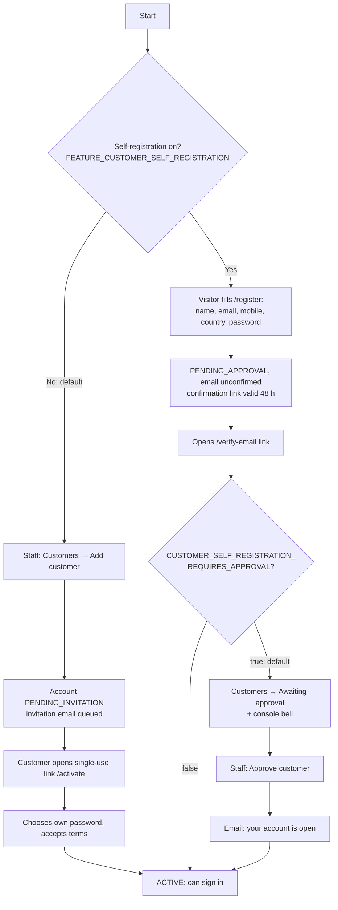
```mermaid
flowchart TD
    A[Start] --> B{Self-registration on?<br/>FEATURE_CUSTOMER_SELF_REGISTRATION}
    B -- No: default --> C[Staff: Customers → Add customer]
    C --> D[Account PENDING_INVITATION<br/>invitation email queued]
    D --> E[Customer opens single-use link /activate]
    E --> F[Chooses own password, accepts terms]
    F --> Z[ACTIVE: can sign in]
    B -- Yes --> G[Visitor fills /register:<br/>name, email, mobile, country, password]
    G --> H[PENDING_APPROVAL, email unconfirmed<br/>confirmation link valid 48 h]
    H --> I[Opens /verify-email link]
    I --> J{CUSTOMER_SELF_REGISTRATION_<br/>REQUIRES_APPROVAL?}
    J -- false --> Z
    J -- true: default --> K[Customers → Awaiting approval<br/>+ console bell]
    K --> L[Staff: Approve customer]
    L --> M[Email: your account is open]
    M --> Z
```

Things that must hold: the form never says an address is taken; staff can
never approve an unconfirmed address; nobody but the customer knows the
password.

## 6.2 Browse → quote → cart → checkout → paid

The most important flow (FR-SRCH-001, FR-PRC-001, FR-CART-001, FR-CHK-001…006,
FR-PAY-003).

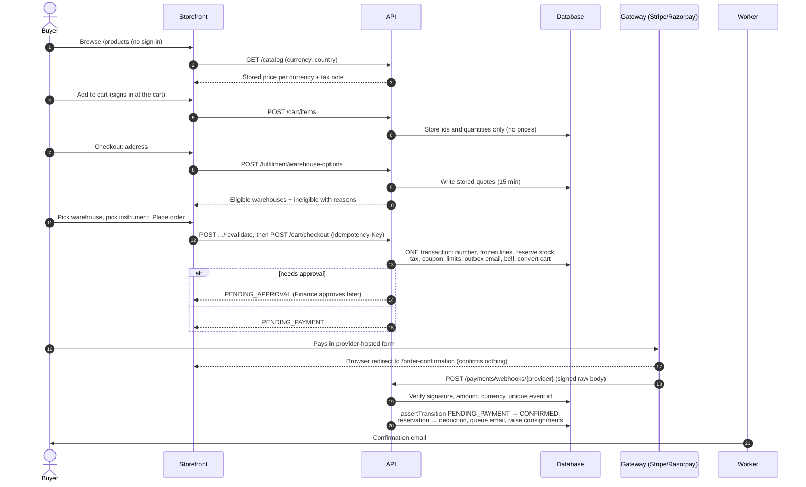
```mermaid
sequenceDiagram
    autonumber
    actor B as Buyer
    participant S as Storefront
    participant A as API
    participant DB as Database
    participant G as Gateway (Stripe/Razorpay)
    participant W as Worker
    B->>S: Browse /products (no sign-in)
    S->>A: GET /catalog (currency, country)
    A-->>S: Stored price per currency + tax note
    B->>S: Add to cart (signs in at the cart)
    S->>A: POST /cart/items
    A->>DB: Store ids and quantities only (no prices)
    B->>S: Checkout: address
    S->>A: POST /fulfilment/warehouse-options
    A->>DB: Write stored quotes (15 min)
    A-->>S: Eligible warehouses + ineligible with reasons
    B->>S: Pick warehouse, pick instrument, Place order
    S->>A: POST .../revalidate, then POST /cart/checkout (Idempotency-Key)
    A->>DB: ONE transaction: number, frozen lines, reserve stock,<br/>tax, coupon, limits, outbox email, bell, convert cart
    alt needs approval
        A-->>S: PENDING_APPROVAL (Finance approves later)
    else
        A-->>S: PENDING_PAYMENT
    end
    B->>G: Pays in provider-hosted form
    G-->>S: Browser redirect to /order-confirmation (confirms nothing)
    G->>A: POST /payments/webhooks/{provider} (signed raw body)
    A->>DB: Verify signature, amount, currency, unique event id
    A->>DB: assertTransition PENDING_PAYMENT → CONFIRMED,<br/>reservation → deduction, queue email, raise consignments
    W->>B: Confirmation email
```

## 6.3 The order's life

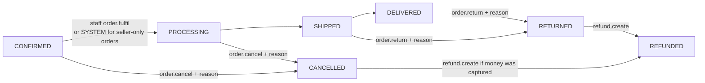
```mermaid
flowchart LR
    C[CONFIRMED] -->|staff order.fulfil<br/>or SYSTEM for seller-only orders| P[PROCESSING]
    P --> S[SHIPPED]
    S --> D[DELIVERED]
    S -->|order.return + reason| R[RETURNED]
    D -->|order.return + reason| R
    R -->|refund.create| F[REFUNDED]
    C -->|order.cancel + reason| X[CANCELLED]
    P -->|order.cancel + reason| X
    X -->|refund.create if money was captured| F
```

In parallel, each consignment moves through the shipment machine (§7.9) and
each seller's share through its order-group machine (§7.6). An order made
entirely of sellers' goods is moved by the system as sellers' groups progress.

## 6.4 A scheduled order (Subscribe & Reorder)

(FR-SCH-001…006, FR-PAY-007.)

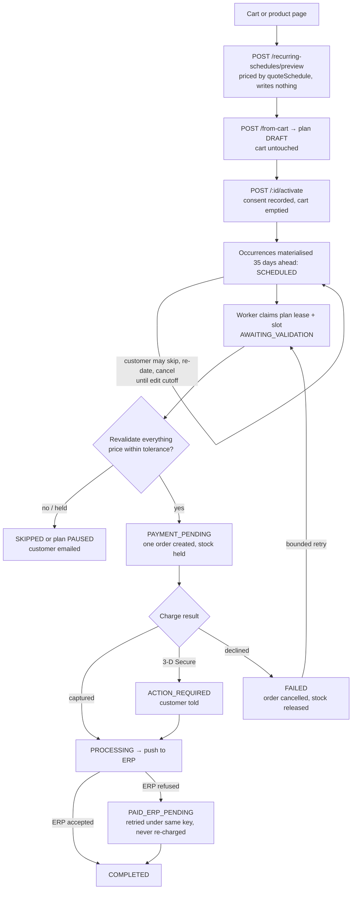
```mermaid
flowchart TD
    A[Cart or product page] --> B[POST /recurring-schedules/preview<br/>priced by quoteSchedule, writes nothing]
    B --> C[POST /from-cart → plan DRAFT<br/>cart untouched]
    C --> D[POST /:id/activate<br/>consent recorded, cart emptied]
    D --> E[Occurrences materialised 35 days ahead: SCHEDULED]
    E -->|customer may skip, re-date, cancel<br/>until edit cutoff| E
    E --> F[Worker claims plan lease + slot<br/>AWAITING_VALIDATION]
    F --> G{Revalidate everything<br/>price within tolerance?}
    G -- no / held --> H[SKIPPED or plan PAUSED<br/>customer emailed]
    G -- yes --> I[PAYMENT_PENDING<br/>one order created, stock held]
    I --> J{Charge result}
    J -- captured --> K[PROCESSING → push to ERP]
    J -- 3-D Secure --> L[ACTION_REQUIRED<br/>customer told]
    J -- declined --> M[FAILED<br/>order cancelled, stock released]
    K -- ERP accepted --> N[COMPLETED]
    K -- ERP refused --> O[PAID_ERP_PENDING<br/>retried under same key, never re-charged]
    O --> N
    L --> K
    M -->|bounded retry| F
```

## 6.5 A bulk preorder

(FR-PRE-001…007.)

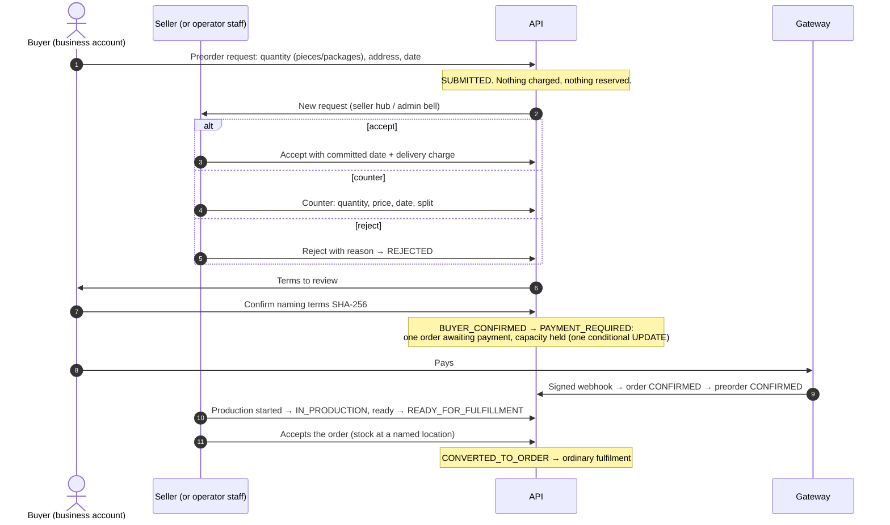
```mermaid
sequenceDiagram
    autonumber
    actor B as Buyer (business account)
    participant S as Seller (or operator staff)
    participant A as API
    participant G as Gateway
    B->>A: Preorder request: quantity (pieces/packages), address, date
    Note over A: SUBMITTED. Nothing charged, nothing reserved.
    A->>S: New request (seller hub / admin bell)
    alt accept
        S->>A: Accept with committed date + delivery charge
    else counter
        S->>A: Counter: quantity, price, date, split
    else reject
        S->>A: Reject with reason → REJECTED
    end
    A->>B: Terms to review
    B->>A: Confirm naming terms SHA-256
    Note over A: BUYER_CONFIRMED → PAYMENT_REQUIRED:<br/>one order awaiting payment, capacity held (one conditional UPDATE)
    B->>G: Pays
    G->>A: Signed webhook → order CONFIRMED → preorder CONFIRMED
    S->>A: Production started → IN_PRODUCTION, ready → READY_FOR_FULFILLMENT
    S->>A: Accepts the order (stock at a named location)
    Note over A: CONVERTED_TO_ORDER → ordinary fulfilment
```

Timers: request expiry 72 h, offer expiry 120 h, payment expiry 168 h
(cancels the order, returns capacity), risk flag 3 days before the committed
date.

## 6.6 Seller onboarding and a listing going on sale

(FR-SEL-001…008, FR-SLOG-001.)

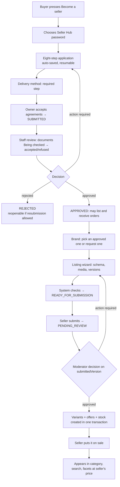
```mermaid
flowchart TD
    A[Buyer presses Become a seller] --> B[Chooses Seller Hub password]
    B --> C[Eight-step application<br/>auto-saved, resumable]
    C --> D[Delivery method: required step]
    D --> E[Owner accepts agreements → SUBMITTED]
    E --> F[Staff review: documents Being checked → accepted/refused]
    F --> G{Decision}
    G -- action required --> C
    G -- rejected --> R[REJECTED<br/>reopenable if resubmission allowed]
    G -- approved --> H[APPROVED: may list and receive orders]
    H --> I[Brand: pick an approved one or request one]
    I --> J[Listing wizard: schema, media, versions]
    J --> K[System checks → READY_FOR_SUBMISSION]
    K --> L[Seller submits → PENDING_REVIEW]
    L --> M{Moderator decision on submittedVersion}
    M -- action required --> J
    M -- approved --> N[Variants + offers + stock created in one transaction]
    N --> O[Seller puts it on sale]
    O --> P[Appears in category, search, facets at seller's price]
```

## 6.7 Shipment hand-over

(FR-LOG-003…006, FR-SLOG-004/007/008.)

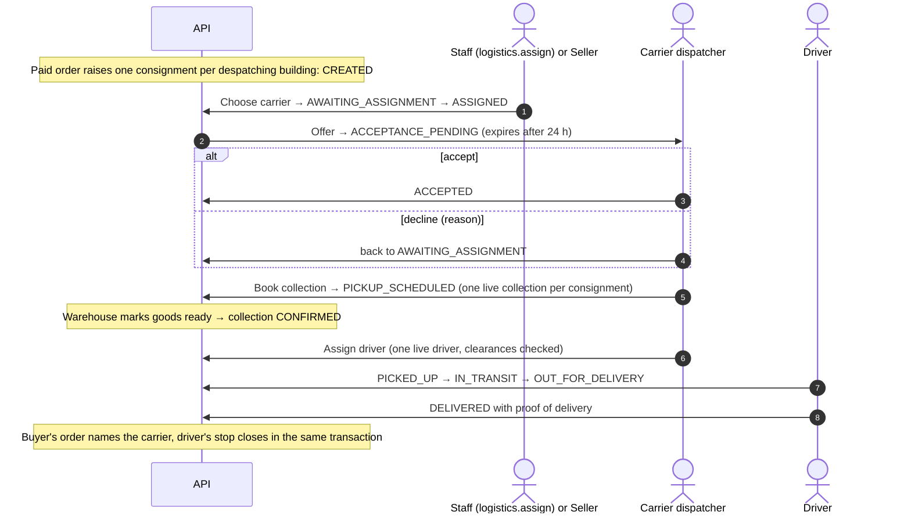
```mermaid
sequenceDiagram
    autonumber
    participant A as API
    actor Op as Staff (logistics.assign) or Seller
    actor C as Carrier dispatcher
    actor D as Driver
    Note over A: Paid order raises one consignment per despatching building: CREATED
    Op->>A: Choose carrier → AWAITING_ASSIGNMENT → ASSIGNED
    A->>C: Offer → ACCEPTANCE_PENDING (expires after 24 h)
    alt accept
        C->>A: ACCEPTED
    else decline (reason)
        C->>A: back to AWAITING_ASSIGNMENT
    end
    C->>A: Book collection → PICKUP_SCHEDULED (one live collection per consignment)
    Note over A: Warehouse marks goods ready → collection CONFIRMED
    C->>A: Assign driver (one live driver, clearances checked)
    D->>A: PICKED_UP → IN_TRANSIT → OUT_FOR_DELIVERY
    D->>A: DELIVERED with proof of delivery
    Note over A: Buyer's order names the carrier, driver's stop closes in the same transaction
```

A seller on their own DHL/FedEx account instead quotes, buys and books the
collection through their own contract; a seller with no API account records a
**manual booking** and needs a POD photo to mark it delivered.

## 6.8 Refund and return

(FR-ORD-006, FR-PAY-008.)

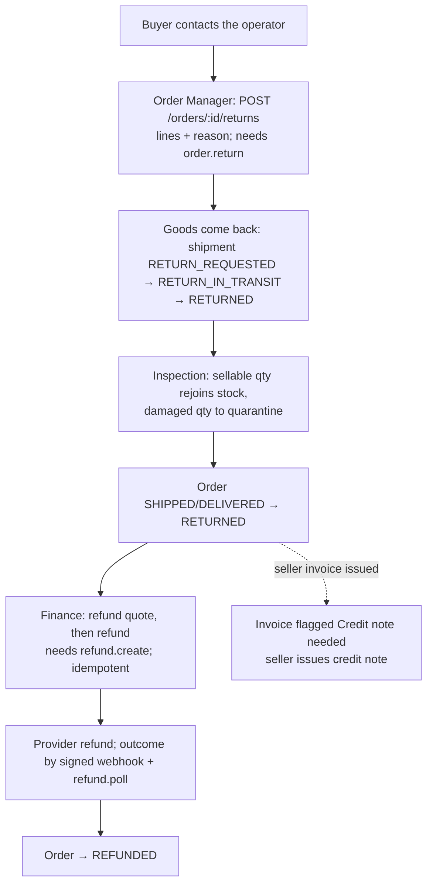
```mermaid
flowchart TD
    A[Buyer contacts the operator] --> B[Order Manager: POST /orders/:id/returns<br/>lines + reason; needs order.return]
    B --> C[Goods come back: shipment RETURN_REQUESTED → RETURN_IN_TRANSIT → RETURNED]
    C --> D[Inspection: sellable qty rejoins stock,<br/>damaged qty to quarantine]
    D --> E[Order SHIPPED/DELIVERED → RETURNED]
    E --> F[Finance: refund quote, then refund<br/>needs refund.create; idempotent]
    F --> G[Provider refund; outcome by signed webhook + refund.poll]
    G --> H[Order → REFUNDED]
    E -. seller invoice issued .-> I[Invoice flagged Credit note needed<br/>seller issues credit note]
```

A cancelled order whose money was captured goes `CANCELLED → REFUNDED` the
same way. A seller can never refund; money leaving is the operator's action.

## 6.9 Staff onboarding

(FR-IDN-008…010.)

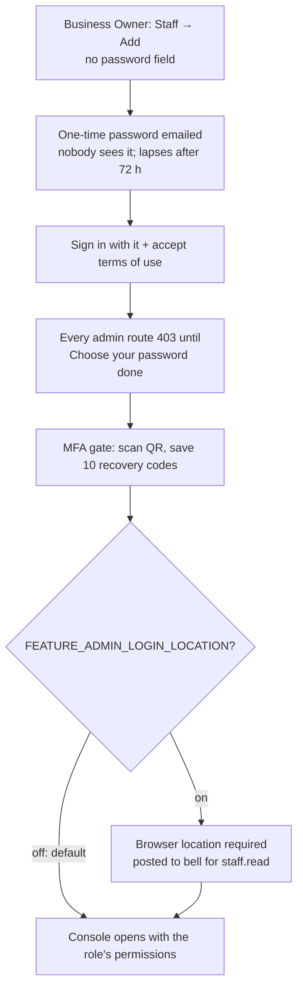
```mermaid
flowchart TD
    A[Business Owner: Staff → Add<br/>no password field] --> B[One-time password emailed<br/>nobody sees it; lapses after 72 h]
    B --> C[Sign in with it + accept terms of use]
    C --> D[Every admin route 403 until<br/>Choose your password done]
    D --> E[MFA gate: scan QR, save 10 recovery codes]
    E --> F{FEATURE_ADMIN_LOGIN_LOCATION?}
    F -- on --> G[Browser location required<br/>posted to bell for staff.read]
    F -- off: default --> H[Console opens with the role's permissions]
    G --> H
```

---

# 7. State models

All diagrams are taken exactly from the domain files. Where a diagram would be
unreadable, the complete transition table follows it. Labels show the actor
(SYSTEM, ADMIN, CUSTOMER…) and any permission or reason requirement.

## 7.1 Order status (`backend/src/domain/order-state-machine.ts`)

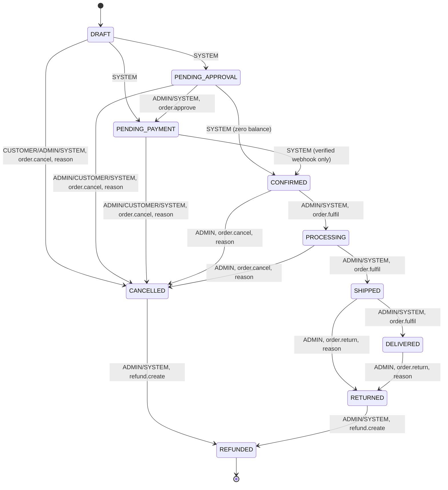
```mermaid
stateDiagram-v2
    [*] --> DRAFT
    DRAFT --> PENDING_APPROVAL: SYSTEM
    DRAFT --> PENDING_PAYMENT: SYSTEM
    DRAFT --> CANCELLED: CUSTOMER/ADMIN/SYSTEM, order.cancel, reason
    PENDING_APPROVAL --> PENDING_PAYMENT: ADMIN/SYSTEM, order.approve
    PENDING_APPROVAL --> CONFIRMED: SYSTEM (zero balance)
    PENDING_APPROVAL --> CANCELLED: ADMIN/CUSTOMER/SYSTEM, order.cancel, reason
    PENDING_PAYMENT --> CONFIRMED: SYSTEM (verified webhook only)
    PENDING_PAYMENT --> CANCELLED: ADMIN/CUSTOMER/SYSTEM, order.cancel, reason
    CONFIRMED --> PROCESSING: ADMIN/SYSTEM, order.fulfil
    CONFIRMED --> CANCELLED: ADMIN, order.cancel, reason
    PROCESSING --> SHIPPED: ADMIN/SYSTEM, order.fulfil
    PROCESSING --> CANCELLED: ADMIN, order.cancel, reason
    SHIPPED --> DELIVERED: ADMIN/SYSTEM, order.fulfil
    SHIPPED --> RETURNED: ADMIN, order.return, reason
    DELIVERED --> RETURNED: ADMIN, order.return, reason
    CANCELLED --> REFUNDED: ADMIN/SYSTEM, refund.create
    RETURNED --> REFUNDED: ADMIN/SYSTEM, refund.create
    REFUNDED --> [*]
```

- Terminal: `REFUNDED`. Stock held in CONFIRMED, PROCESSING, SHIPPED, DELIVERED; released on CANCELLED, RETURNED.
- Deliberately absent: CONFIRMED → PENDING_PAYMENT (a second charge on a paid order); DELIVERED → CANCELLED; anything out of REFUNDED.
- Permissions are consulted only for an ADMIN actor. No admin, even with every permission, can move an order to CONFIRMED.

## 7.2 Schedule plan status (`backend/src/domain/schedule-state.ts`)

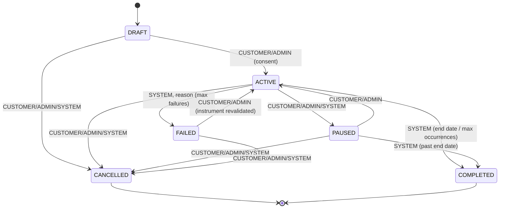
```mermaid
stateDiagram-v2
    [*] --> DRAFT
    DRAFT --> ACTIVE: CUSTOMER/ADMIN (consent)
    DRAFT --> CANCELLED: CUSTOMER/ADMIN/SYSTEM
    ACTIVE --> PAUSED: CUSTOMER/ADMIN/SYSTEM
    ACTIVE --> CANCELLED: CUSTOMER/ADMIN/SYSTEM
    ACTIVE --> COMPLETED: SYSTEM (end date / max occurrences)
    ACTIVE --> FAILED: SYSTEM, reason (max failures)
    PAUSED --> ACTIVE: CUSTOMER/ADMIN
    PAUSED --> CANCELLED: CUSTOMER/ADMIN/SYSTEM
    PAUSED --> COMPLETED: SYSTEM (past end date)
    FAILED --> ACTIVE: CUSTOMER/ADMIN (instrument revalidated)
    FAILED --> CANCELLED: CUSTOMER/ADMIN/SYSTEM
    CANCELLED --> [*]
    COMPLETED --> [*]
```

- Terminal: CANCELLED, COMPLETED. Only ACTIVE plans are run by the worker.
- Deliberately absent: anything back to DRAFT; anything out of CANCELLED; COMPLETED → ACTIVE; **anything → ACTIVE by SYSTEM** (a plan becomes live only because a person said so).

## 7.3 Schedule occurrence status (`schedule-state.ts`)

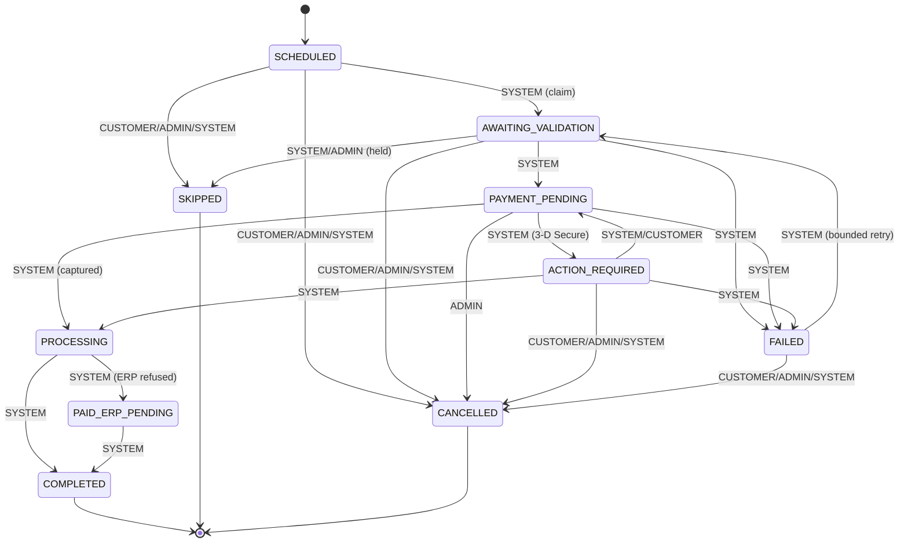
```mermaid
stateDiagram-v2
    [*] --> SCHEDULED
    SCHEDULED --> AWAITING_VALIDATION: SYSTEM (claim)
    SCHEDULED --> SKIPPED: CUSTOMER/ADMIN/SYSTEM
    SCHEDULED --> CANCELLED: CUSTOMER/ADMIN/SYSTEM
    AWAITING_VALIDATION --> PAYMENT_PENDING: SYSTEM
    AWAITING_VALIDATION --> SKIPPED: SYSTEM/ADMIN (held)
    AWAITING_VALIDATION --> CANCELLED: CUSTOMER/ADMIN/SYSTEM
    AWAITING_VALIDATION --> FAILED: SYSTEM
    PAYMENT_PENDING --> PROCESSING: SYSTEM (captured)
    PAYMENT_PENDING --> ACTION_REQUIRED: SYSTEM (3-D Secure)
    PAYMENT_PENDING --> FAILED: SYSTEM
    PAYMENT_PENDING --> CANCELLED: ADMIN
    ACTION_REQUIRED --> PROCESSING: SYSTEM
    ACTION_REQUIRED --> PAYMENT_PENDING: SYSTEM/CUSTOMER
    ACTION_REQUIRED --> FAILED: SYSTEM
    ACTION_REQUIRED --> CANCELLED: CUSTOMER/ADMIN/SYSTEM
    PROCESSING --> COMPLETED: SYSTEM
    PROCESSING --> PAID_ERP_PENDING: SYSTEM (ERP refused)
    PAID_ERP_PENDING --> COMPLETED: SYSTEM
    FAILED --> AWAITING_VALIDATION: SYSTEM (bounded retry)
    FAILED --> CANCELLED: CUSTOMER/ADMIN/SYSTEM
    COMPLETED --> [*]
    SKIPPED --> [*]
    CANCELLED --> [*]
```

- Terminal: COMPLETED, SKIPPED, CANCELLED. Money has moved in PROCESSING, PAID_ERP_PENDING, COMPLETED (and legacy PAID): **no edge leads back into the charge path**.
- PAID_ERP_PENDING is **not a failure**; its only exit is COMPLETED.
- Customer-editable only in SCHEDULED. Legacy statuses PENDING, ORDER_CREATED, PAID are read, never written.

## 7.4 Preorder status (`backend/src/domain/preorder-state.ts`)

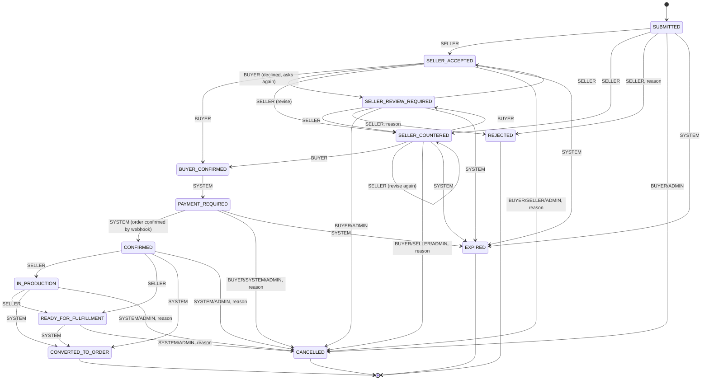
```mermaid
stateDiagram-v2
    [*] --> SUBMITTED
    SUBMITTED --> SELLER_ACCEPTED: SELLER
    SUBMITTED --> SELLER_COUNTERED: SELLER
    SUBMITTED --> REJECTED: SELLER, reason
    SUBMITTED --> CANCELLED: BUYER/ADMIN
    SUBMITTED --> EXPIRED: SYSTEM
    SELLER_REVIEW_REQUIRED --> SELLER_ACCEPTED: SELLER
    SELLER_REVIEW_REQUIRED --> SELLER_COUNTERED: SELLER
    SELLER_REVIEW_REQUIRED --> REJECTED: SELLER, reason
    SELLER_REVIEW_REQUIRED --> CANCELLED: BUYER/ADMIN
    SELLER_REVIEW_REQUIRED --> EXPIRED: SYSTEM
    SELLER_ACCEPTED --> BUYER_CONFIRMED: BUYER
    SELLER_ACCEPTED --> SELLER_REVIEW_REQUIRED: BUYER (declined, asks again)
    SELLER_ACCEPTED --> SELLER_COUNTERED: SELLER (revise)
    SELLER_ACCEPTED --> CANCELLED: BUYER/SELLER/ADMIN, reason
    SELLER_ACCEPTED --> EXPIRED: SYSTEM
    SELLER_COUNTERED --> BUYER_CONFIRMED: BUYER
    SELLER_COUNTERED --> SELLER_REVIEW_REQUIRED: BUYER
    SELLER_COUNTERED --> SELLER_COUNTERED: SELLER (revise again)
    SELLER_COUNTERED --> CANCELLED: BUYER/SELLER/ADMIN, reason
    SELLER_COUNTERED --> EXPIRED: SYSTEM
    BUYER_CONFIRMED --> PAYMENT_REQUIRED: SYSTEM
    PAYMENT_REQUIRED --> CONFIRMED: SYSTEM (order confirmed by webhook)
    PAYMENT_REQUIRED --> CANCELLED: BUYER/SYSTEM/ADMIN, reason
    PAYMENT_REQUIRED --> EXPIRED: SYSTEM
    CONFIRMED --> IN_PRODUCTION: SELLER
    CONFIRMED --> READY_FOR_FULFILLMENT: SELLER
    CONFIRMED --> CONVERTED_TO_ORDER: SYSTEM
    CONFIRMED --> CANCELLED: SYSTEM/ADMIN, reason
    IN_PRODUCTION --> READY_FOR_FULFILLMENT: SELLER
    IN_PRODUCTION --> CONVERTED_TO_ORDER: SYSTEM
    IN_PRODUCTION --> CANCELLED: SYSTEM/ADMIN, reason
    READY_FOR_FULFILLMENT --> CONVERTED_TO_ORDER: SYSTEM
    READY_FOR_FULFILLMENT --> CANCELLED: SYSTEM/ADMIN, reason
    CONVERTED_TO_ORDER --> [*]
    REJECTED --> [*]
    CANCELLED --> [*]
    EXPIRED --> [*]
```

- Seller owes an answer: SUBMITTED, SELLER_REVIEW_REQUIRED. Buyer owes one: SELLER_ACCEPTED, SELLER_COUNTERED.
- Capacity held: PAYMENT_REQUIRED, CONFIRMED, IN_PRODUCTION, READY_FOR_FULFILLMENT.
- Invariants: the seller cannot move a request to anything the buyer pays for; nothing returns to negotiation once an order exists; CONFIRMED comes only from SYSTEM.

## 7.5 Buyer ERP connection (`backend/src/domain/customer-erp-state.ts`)

Connection statuses: `DRAFT`, `TESTING`, `ACTIVE`, `PAUSED`,
`ACTION_REQUIRED`, `FAILED`, `DISCONNECTED`. Each sync job moves through
`QUEUED`, `PROCESSING`, `SUCCEEDED`, `RETRYING`, `FAILED`, `SKIPPED` by the
actions CLAIM, SUCCEED, SCHEDULE_RETRY, ABANDON and SKIP. Switching a
connection on is refused until a test passed and the mapping was checked
against a real response from the buyer's own system. The full edge list lives
in the domain file.

## 7.6 Seller order group (one seller's share of an order; `seller-state.ts`)

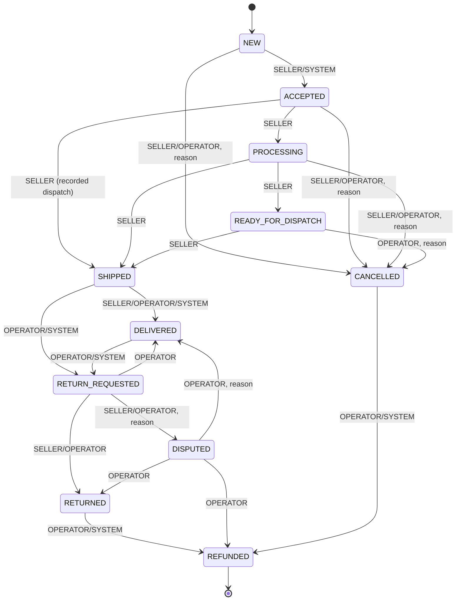
```mermaid
stateDiagram-v2
    [*] --> NEW
    NEW --> ACCEPTED: SELLER/SYSTEM
    NEW --> CANCELLED: SELLER/OPERATOR, reason
    ACCEPTED --> PROCESSING: SELLER
    ACCEPTED --> SHIPPED: SELLER (recorded dispatch)
    ACCEPTED --> CANCELLED: SELLER/OPERATOR, reason
    PROCESSING --> READY_FOR_DISPATCH: SELLER
    PROCESSING --> SHIPPED: SELLER
    PROCESSING --> CANCELLED: SELLER/OPERATOR, reason
    READY_FOR_DISPATCH --> SHIPPED: SELLER
    READY_FOR_DISPATCH --> CANCELLED: OPERATOR, reason
    SHIPPED --> DELIVERED: SELLER/OPERATOR/SYSTEM
    SHIPPED --> RETURN_REQUESTED: OPERATOR/SYSTEM
    DELIVERED --> RETURN_REQUESTED: OPERATOR/SYSTEM
    RETURN_REQUESTED --> RETURNED: SELLER/OPERATOR
    RETURN_REQUESTED --> DISPUTED: SELLER/OPERATOR, reason
    RETURN_REQUESTED --> DELIVERED: OPERATOR
    RETURNED --> REFUNDED: OPERATOR/SYSTEM
    DISPUTED --> RETURNED: OPERATOR
    DISPUTED --> DELIVERED: OPERATOR, reason
    DISPUTED --> REFUNDED: OPERATOR
    CANCELLED --> REFUNDED: OPERATOR/SYSTEM
    REFUNDED --> [*]
```

This is **not** the buyer's order status. A seller cannot cancel after
dispatch and cannot refund.

## 7.7 Seller application (`backend/src/domain/seller-state.ts`)

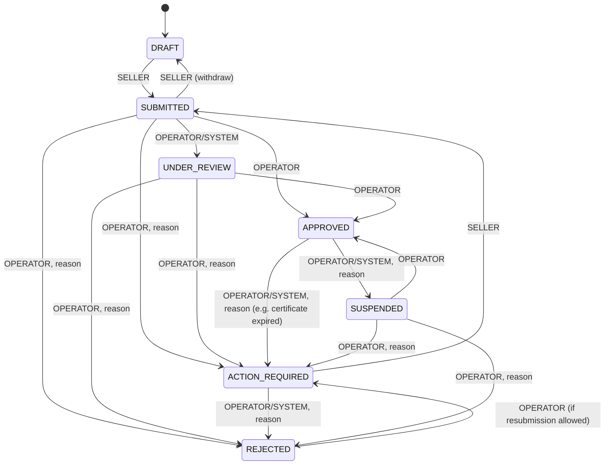
```mermaid
stateDiagram-v2
    [*] --> DRAFT
    DRAFT --> SUBMITTED: SELLER
    SUBMITTED --> UNDER_REVIEW: OPERATOR/SYSTEM
    SUBMITTED --> ACTION_REQUIRED: OPERATOR, reason
    SUBMITTED --> APPROVED: OPERATOR
    SUBMITTED --> REJECTED: OPERATOR, reason
    SUBMITTED --> DRAFT: SELLER (withdraw)
    UNDER_REVIEW --> ACTION_REQUIRED: OPERATOR, reason
    UNDER_REVIEW --> APPROVED: OPERATOR
    UNDER_REVIEW --> REJECTED: OPERATOR, reason
    ACTION_REQUIRED --> SUBMITTED: SELLER
    ACTION_REQUIRED --> REJECTED: OPERATOR/SYSTEM, reason
    APPROVED --> SUSPENDED: OPERATOR/SYSTEM, reason
    APPROVED --> ACTION_REQUIRED: OPERATOR/SYSTEM, reason (e.g. certificate expired)
    REJECTED --> ACTION_REQUIRED: OPERATOR (if resubmission allowed)
    SUSPENDED --> APPROVED: OPERATOR
    SUSPENDED --> ACTION_REQUIRED: OPERATOR, reason
    SUSPENDED --> REJECTED: OPERATOR, reason
```

Only APPROVED sellers may trade. A seller can never be its own operator.

## 7.8 Seller listing draft (`seller-state.ts`)

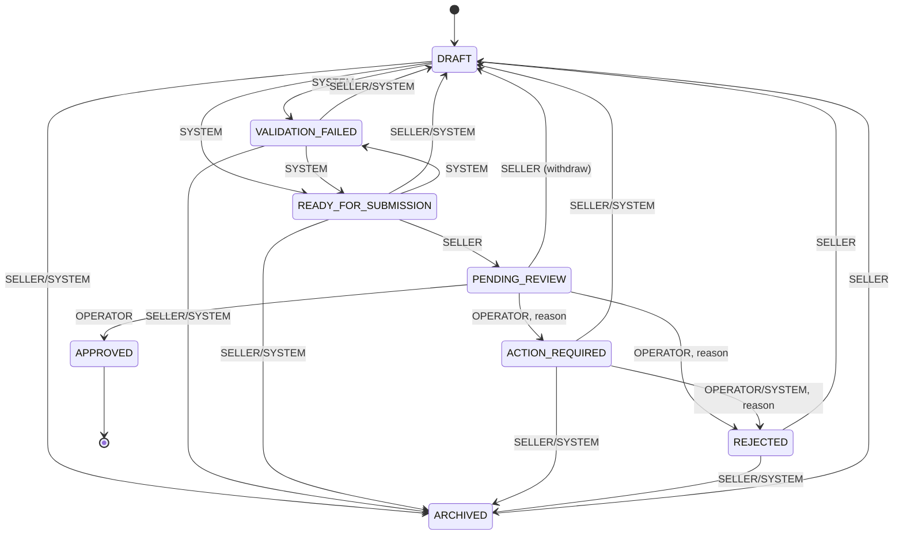
```mermaid
stateDiagram-v2
    [*] --> DRAFT
    DRAFT --> VALIDATION_FAILED: SYSTEM
    DRAFT --> READY_FOR_SUBMISSION: SYSTEM
    DRAFT --> ARCHIVED: SELLER/SYSTEM
    VALIDATION_FAILED --> DRAFT: SELLER/SYSTEM
    VALIDATION_FAILED --> READY_FOR_SUBMISSION: SYSTEM
    VALIDATION_FAILED --> ARCHIVED: SELLER/SYSTEM
    READY_FOR_SUBMISSION --> PENDING_REVIEW: SELLER
    READY_FOR_SUBMISSION --> DRAFT: SELLER/SYSTEM
    READY_FOR_SUBMISSION --> VALIDATION_FAILED: SYSTEM
    READY_FOR_SUBMISSION --> ARCHIVED: SELLER/SYSTEM
    PENDING_REVIEW --> APPROVED: OPERATOR
    PENDING_REVIEW --> ACTION_REQUIRED: OPERATOR, reason
    PENDING_REVIEW --> REJECTED: OPERATOR, reason
    PENDING_REVIEW --> DRAFT: SELLER (withdraw)
    ACTION_REQUIRED --> DRAFT: SELLER/SYSTEM
    ACTION_REQUIRED --> ARCHIVED: SELLER/SYSTEM
    ACTION_REQUIRED --> REJECTED: OPERATOR/SYSTEM, reason
    REJECTED --> DRAFT: SELLER
    REJECTED --> ARCHIVED: SELLER/SYSTEM
    ARCHIVED --> DRAFT: SELLER
    APPROVED --> [*]
```

APPROVED is terminal for the draft: the listing lives on as a `SellerOffer`
(pausing and resuming happen on the offer). **Nothing reaches APPROVED except
from PENDING_REVIEW, and only an operator can do it.**

## 7.9 Shipment (consignment) status (`backend/src/domain/logistics-shipment-state.ts`)

27 statuses: 15 on the forward path, 7 exceptions, 3 return, LOST and
CANCELLED. Actor groups used below:

- **CARRIER_STAFF** = PARTNER, UBOSS_ADMIN, SYSTEM
- **FIELD** = PARTNER, DRIVER, CARRIER (feed), UBOSS_ADMIN, SYSTEM
- **SELLER** = a seller recording their own manual booking (only with a live hand-made booking)

Forward path and terminals (exception edges in the table below):

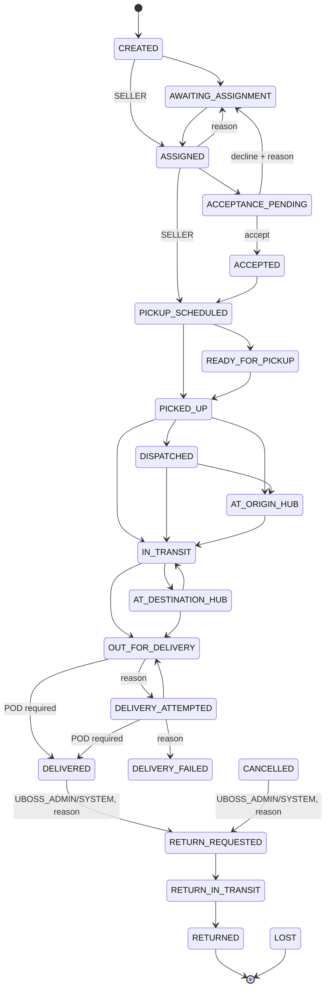
```mermaid
stateDiagram-v2
    [*] --> CREATED
    CREATED --> AWAITING_ASSIGNMENT
    CREATED --> ASSIGNED: SELLER
    AWAITING_ASSIGNMENT --> ASSIGNED
    ASSIGNED --> ACCEPTANCE_PENDING
    ASSIGNED --> AWAITING_ASSIGNMENT: reason
    ASSIGNED --> PICKUP_SCHEDULED: SELLER
    ACCEPTANCE_PENDING --> ACCEPTED: accept
    ACCEPTANCE_PENDING --> AWAITING_ASSIGNMENT: decline + reason
    ACCEPTED --> PICKUP_SCHEDULED
    PICKUP_SCHEDULED --> READY_FOR_PICKUP
    PICKUP_SCHEDULED --> PICKED_UP
    READY_FOR_PICKUP --> PICKED_UP
    PICKED_UP --> DISPATCHED
    PICKED_UP --> AT_ORIGIN_HUB
    PICKED_UP --> IN_TRANSIT
    DISPATCHED --> AT_ORIGIN_HUB
    DISPATCHED --> IN_TRANSIT
    AT_ORIGIN_HUB --> IN_TRANSIT
    IN_TRANSIT --> AT_DESTINATION_HUB
    IN_TRANSIT --> OUT_FOR_DELIVERY
    AT_DESTINATION_HUB --> OUT_FOR_DELIVERY
    AT_DESTINATION_HUB --> IN_TRANSIT
    OUT_FOR_DELIVERY --> DELIVERED: POD required
    OUT_FOR_DELIVERY --> DELIVERY_ATTEMPTED: reason
    DELIVERY_ATTEMPTED --> DELIVERED: POD required
    DELIVERY_ATTEMPTED --> OUT_FOR_DELIVERY
    DELIVERY_ATTEMPTED --> DELIVERY_FAILED: reason
    DELIVERED --> RETURN_REQUESTED: UBOSS_ADMIN/SYSTEM, reason
    RETURN_REQUESTED --> RETURN_IN_TRANSIT
    RETURN_IN_TRANSIT --> RETURNED
    CANCELLED --> RETURN_REQUESTED: UBOSS_ADMIN/SYSTEM, reason
    RETURNED --> [*]
    LOST --> [*]
```

**Complete transition table** (exactly as in the code; "IME" = the in-motion
exception set: → DELAYED (FIELD + SELLER, reason), → ON_HOLD (CARRIER_STAFF,
reason), → DAMAGED (FIELD, reason), → LOST (CARRIER_STAFF, reason),
→ TEMPERATURE_EXCEPTION (FIELD, reason); all IME edges need
`logistics.shipment.status.write`):

| From | To (actors; permission; reason/POD) |
|---|---|
| CREATED | AWAITING_ASSIGNMENT (UBOSS_ADMIN, SYSTEM); ASSIGNED (SELLER); CANCELLED (UBOSS_ADMIN, SYSTEM; reason) |
| AWAITING_ASSIGNMENT | ASSIGNED (UBOSS_ADMIN, SYSTEM, SELLER); ON_HOLD (UBOSS_ADMIN; reason); CANCELLED (UBOSS_ADMIN, SYSTEM; reason) |
| ASSIGNED | ACCEPTANCE_PENDING (UBOSS_ADMIN, SYSTEM); AWAITING_ASSIGNMENT (UBOSS_ADMIN, SYSTEM, SELLER; reason); PICKUP_SCHEDULED (SELLER); CANCELLED (UBOSS_ADMIN, SYSTEM; reason) |
| ACCEPTANCE_PENDING | ACCEPTED (PARTNER, UBOSS_ADMIN; `shipment.accept`); AWAITING_ASSIGNMENT (PARTNER, UBOSS_ADMIN, SYSTEM; `shipment.accept`; reason); CANCELLED (UBOSS_ADMIN, SYSTEM; reason) |
| ACCEPTED | PICKUP_SCHEDULED (CARRIER_STAFF; `pickup.write`); ADDRESS_ISSUE, ON_HOLD (CARRIER_STAFF; status.write; reason); CANCELLED (UBOSS_ADMIN, SYSTEM; reason) |
| PICKUP_SCHEDULED | READY_FOR_PICKUP (CARRIER_STAFF; `pickup.write`); PICKED_UP (FIELD + SELLER; `pickup.write`); AWAITING_ASSIGNMENT (SELLER; reason); DELAYED (FIELD; reason); ADDRESS_ISSUE, ON_HOLD (CARRIER_STAFF; reason); CANCELLED (UBOSS_ADMIN, SYSTEM; reason) |
| READY_FOR_PICKUP | PICKED_UP (FIELD; `pickup.write`); DELAYED (FIELD; reason); ADDRESS_ISSUE, ON_HOLD (CARRIER_STAFF; reason); CANCELLED (UBOSS_ADMIN, SYSTEM; reason) |
| PICKED_UP | DISPATCHED (CARRIER_STAFF; `dispatch.write`); AT_ORIGIN_HUB (FIELD); IN_TRANSIT (FIELD + SELLER); IME; RETURN_REQUESTED (UBOSS_ADMIN, SYSTEM; reason) |
| DISPATCHED | AT_ORIGIN_HUB, IN_TRANSIT (FIELD); CUSTOMS_HOLD (FIELD; reason); IME; RETURN_REQUESTED (UBOSS_ADMIN, SYSTEM; reason) |
| AT_ORIGIN_HUB | IN_TRANSIT (FIELD); CUSTOMS_HOLD (FIELD; reason); IME; RETURN_REQUESTED (UBOSS_ADMIN, SYSTEM; reason) |
| IN_TRANSIT | AT_DESTINATION_HUB (FIELD); OUT_FOR_DELIVERY (FIELD + SELLER); CUSTOMS_HOLD, ADDRESS_ISSUE (FIELD; reason); IME; RETURN_REQUESTED (UBOSS_ADMIN, SYSTEM; reason) |
| AT_DESTINATION_HUB | OUT_FOR_DELIVERY, IN_TRANSIT (FIELD); CUSTOMS_HOLD, ADDRESS_ISSUE (FIELD; reason); IME; RETURN_REQUESTED (UBOSS_ADMIN, SYSTEM; reason) |
| OUT_FOR_DELIVERY | DELIVERED (PARTNER, DRIVER, CARRIER, UBOSS_ADMIN, SELLER; `pod.write`; **POD**); DELIVERY_ATTEMPTED (FIELD + SELLER; reason); ADDRESS_ISSUE (FIELD; reason); IME |
| DELIVERY_ATTEMPTED | DELIVERED (as above; **POD**); OUT_FOR_DELIVERY (FIELD + SELLER); DELIVERY_FAILED (CARRIER_STAFF + SELLER; reason); ADDRESS_ISSUE (FIELD; reason); RETURN_REQUESTED (CARRIER_STAFF; reason); IME |
| DELIVERED | RETURN_REQUESTED (UBOSS_ADMIN, SYSTEM; reason) |
| DELAYED | READY_FOR_PICKUP (CARRIER_STAFF); PICKED_UP (FIELD; `pickup.write`); AT_ORIGIN_HUB, AT_DESTINATION_HUB (FIELD); IN_TRANSIT, OUT_FOR_DELIVERY (FIELD + SELLER); DELIVERY_ATTEMPTED, CUSTOMS_HOLD, ADDRESS_ISSUE, DAMAGED (FIELD; reason); DELIVERY_FAILED, ON_HOLD, LOST, RETURN_REQUESTED (CARRIER_STAFF; reason); CANCELLED (UBOSS_ADMIN, SYSTEM; reason) |
| ON_HOLD | ACCEPTED, READY_FOR_PICKUP (CARRIER_STAFF); PICKUP_SCHEDULED (CARRIER_STAFF; `pickup.write`); IN_TRANSIT, AT_DESTINATION_HUB, OUT_FOR_DELIVERY (FIELD); DELAYED (FIELD; reason); RETURN_REQUESTED (CARRIER_STAFF; reason); CANCELLED (UBOSS_ADMIN, SYSTEM; reason) |
| ADDRESS_ISSUE | OUT_FOR_DELIVERY, IN_TRANSIT, AT_DESTINATION_HUB (FIELD); PICKUP_SCHEDULED (CARRIER_STAFF; `pickup.write`); DELIVERY_FAILED, ON_HOLD, RETURN_REQUESTED (CARRIER_STAFF; reason); CANCELLED (UBOSS_ADMIN, SYSTEM; reason) |
| CUSTOMS_HOLD | IN_TRANSIT, AT_DESTINATION_HUB (FIELD); DELAYED (FIELD; reason); DELIVERY_FAILED, RETURN_REQUESTED, LOST (CARRIER_STAFF; reason); CANCELLED (UBOSS_ADMIN, SYSTEM; reason) |
| DAMAGED | IN_TRANSIT, DELIVERY_FAILED, RETURN_REQUESTED, LOST (CARRIER_STAFF; reason) |
| TEMPERATURE_EXCEPTION | IN_TRANSIT, OUT_FOR_DELIVERY (CARRIER_STAFF; reason); DAMAGED (FIELD; reason); DELIVERY_FAILED, RETURN_REQUESTED (CARRIER_STAFF; reason) |
| DELIVERY_FAILED | OUT_FOR_DELIVERY (FIELD + SELLER); RETURN_REQUESTED (CARRIER_STAFF + SELLER; reason); ON_HOLD (CARRIER_STAFF; reason); CANCELLED (UBOSS_ADMIN, SYSTEM; reason) |
| RETURN_REQUESTED | RETURN_IN_TRANSIT (CARRIER_STAFF + SELLER); CANCELLED (UBOSS_ADMIN, SYSTEM; reason) |
| RETURN_IN_TRANSIT | RETURNED (FIELD + SELLER); DELAYED, DAMAGED (FIELD; reason); LOST (CARRIER_STAFF; reason) |
| RETURNED | — (terminal) |
| LOST | — (terminal) |
| CANCELLED | RETURN_REQUESTED (UBOSS_ADMIN, SYSTEM; reason) |

- Terminal: RETURNED, LOST. Tracking complete: DELIVERED, RETURNED, LOST, CANCELLED.
- In carrier possession (stock committed to fulfilment): PICKED_UP through RETURN_IN_TRANSIT, including every exception.
- Exceptions queue: DELAYED, ON_HOLD, ADDRESS_ISSUE, CUSTOMS_HOLD, DAMAGED, TEMPERATURE_EXCEPTION, DELIVERY_FAILED, LOST.
- DELIVERED only from OUT_FOR_DELIVERY or DELIVERY_ATTEMPTED; a partner cannot un-deliver; the operator's corrections go through `assertShipmentCorrection`.

## 7.10 Collection (pickup) (`backend/src/domain/logistics-pickup-state.ts`)

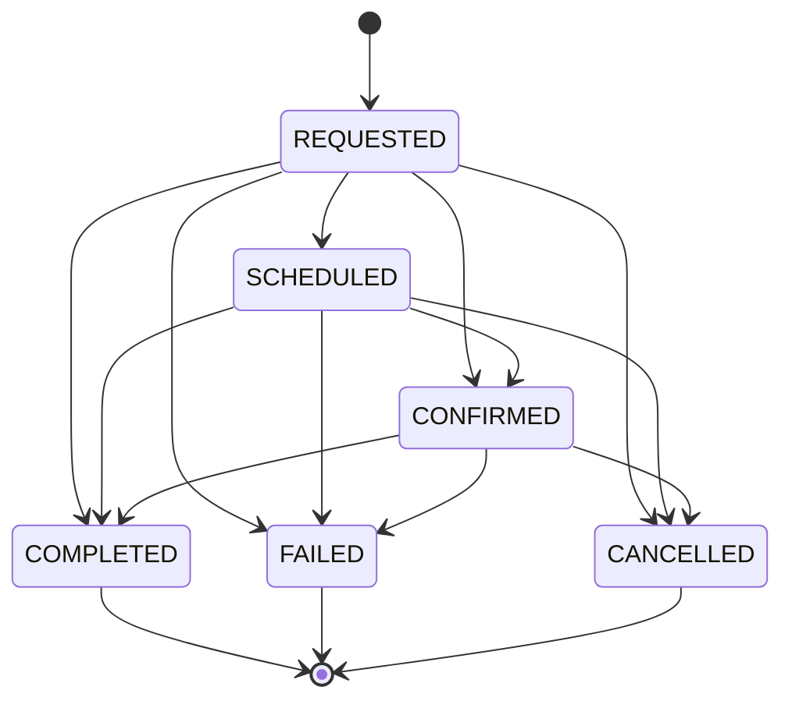
```mermaid
stateDiagram-v2
    [*] --> REQUESTED
    REQUESTED --> SCHEDULED
    REQUESTED --> CONFIRMED
    REQUESTED --> COMPLETED
    REQUESTED --> FAILED
    REQUESTED --> CANCELLED
    SCHEDULED --> CONFIRMED
    SCHEDULED --> COMPLETED
    SCHEDULED --> FAILED
    SCHEDULED --> CANCELLED
    CONFIRMED --> COMPLETED
    CONFIRMED --> FAILED
    CONFIRMED --> CANCELLED
    COMPLETED --> [*]
    FAILED --> [*]
    CANCELLED --> [*]
```

Terminal means terminal: a failed collection that is rebooked is a new
collection. Live states: REQUESTED, SCHEDULED, CONFIRMED.

## 7.11 Delivery leg (L1–L4) (`backend/src/domain/logistics-levels.ts`)

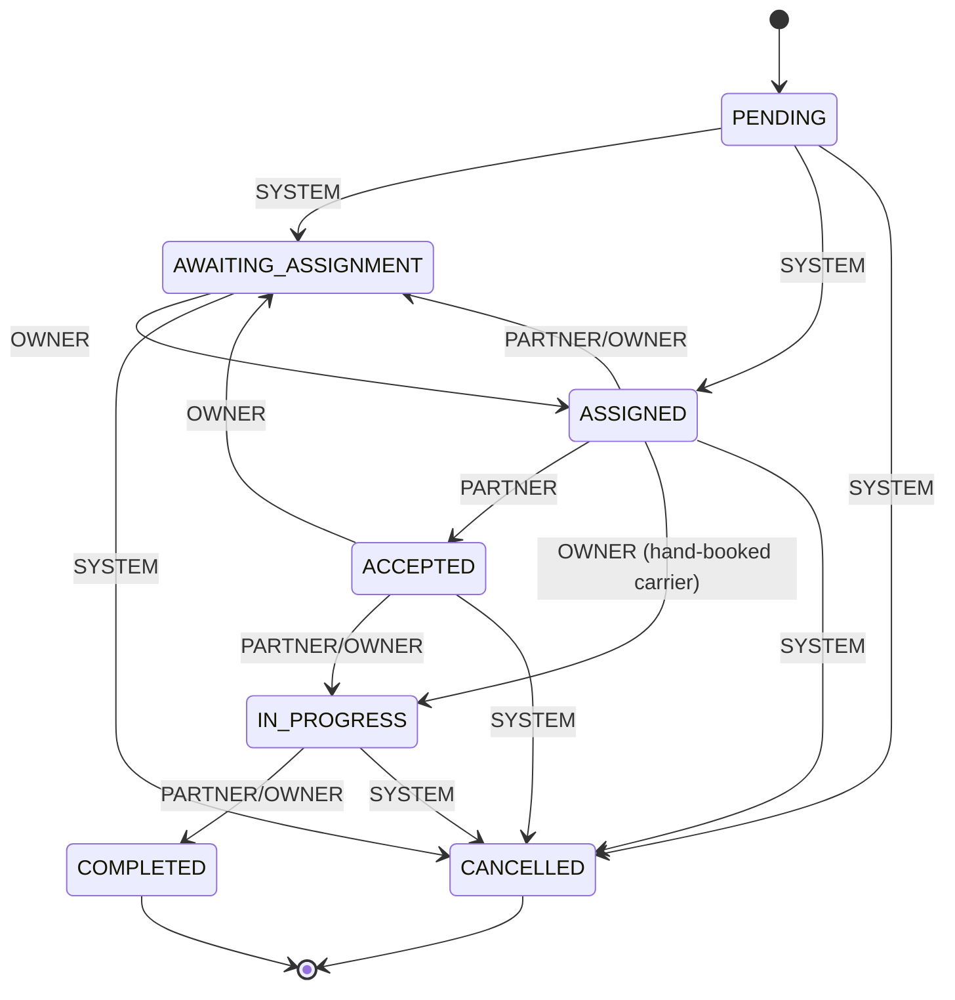
```mermaid
stateDiagram-v2
    [*] --> PENDING
    PENDING --> AWAITING_ASSIGNMENT: SYSTEM
    PENDING --> ASSIGNED: SYSTEM
    PENDING --> CANCELLED: SYSTEM
    AWAITING_ASSIGNMENT --> ASSIGNED: OWNER
    AWAITING_ASSIGNMENT --> CANCELLED: SYSTEM
    ASSIGNED --> ACCEPTED: PARTNER
    ASSIGNED --> AWAITING_ASSIGNMENT: PARTNER/OWNER
    ASSIGNED --> IN_PROGRESS: OWNER (hand-booked carrier)
    ASSIGNED --> CANCELLED: SYSTEM
    ACCEPTED --> IN_PROGRESS: PARTNER/OWNER
    ACCEPTED --> AWAITING_ASSIGNMENT: OWNER
    ACCEPTED --> CANCELLED: SYSTEM
    IN_PROGRESS --> COMPLETED: PARTNER/OWNER
    IN_PROGRESS --> CANCELLED: SYSTEM
    COMPLETED --> [*]
    CANCELLED --> [*]
```

OWNER is whoever controls that level (the seller, or the marketplace).

## 7.12 Operator warehouse-ERP connection (`backend/src/domain/erp-connection-state.ts`)

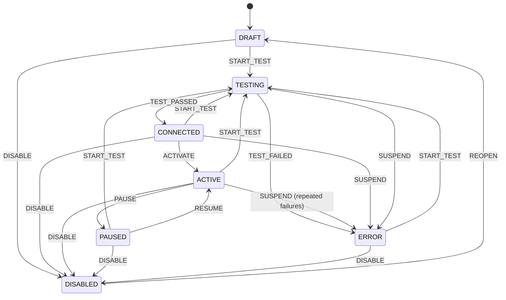
```mermaid
stateDiagram-v2
    [*] --> DRAFT
    DRAFT --> TESTING: START_TEST
    CONNECTED --> TESTING: START_TEST
    ACTIVE --> TESTING: START_TEST
    PAUSED --> TESTING: START_TEST
    ERROR --> TESTING: START_TEST
    TESTING --> CONNECTED: TEST_PASSED
    TESTING --> ERROR: TEST_FAILED
    CONNECTED --> ACTIVE: ACTIVATE
    ACTIVE --> PAUSED: PAUSE
    PAUSED --> ACTIVE: RESUME
    ACTIVE --> ERROR: SUSPEND (repeated failures)
    CONNECTED --> ERROR: SUSPEND
    TESTING --> ERROR: SUSPEND
    DRAFT --> DISABLED: DISABLE
    CONNECTED --> DISABLED: DISABLE
    ACTIVE --> DISABLED: DISABLE
    PAUSED --> DISABLED: DISABLE
    ERROR --> DISABLED: DISABLE
    DISABLED --> DRAFT: REOPEN
```

Editing from anywhere returns the connection to DRAFT. A passing test
started from ACTIVE or PAUSED returns to where it started (the service keeps
live connections live). At most one ACTIVE.

---

# 8. Business rules

Enforced in code. Changing one is a deliberate decision, not an edit.

## 8.1 Money

| ID | Rule |
|---|---|
| BR-MON-001 | **Money is never a float.** Every amount is a BigInt of minor units, carried as a **string** on the wire (a total can exceed 2^53). No JS `number` in any money path. |
| BR-MON-002 | **A hundred is not the conversion.** Moving between minor and major units shifts digits by the **currency's own exponent** (JPY and KRW have 0). The API refuses to start if the currencies table and `domain/money.ts` disagree about an exponent. |
| BR-MON-003 | **Rounding is half-up** (away from zero at exactly half), once per step, through the shared money helpers. Store-wide quantity discounts round the discount **down** so "5% off" never charges more than 95%. |
| BR-MON-004 | **Apportionment uses largest remainder**, so per-line figures always sum to the total, never losing or inventing a minor unit. |
| BR-MON-005 | **An amount is never read in a currency it was not entered in.** Catalogue prices, coupon minimums and purchasing limits are per currency; there is no exchange rate in the ordering path (except the opt-in approximate derivation, FR-PRC-004, which is labelled and frozen on the order). |
| BR-MON-006 | **An order never moves again**: rate, mid-market, spread, provider, provider date and rounding-policy version are recorded; refunds read them, never today's rate. |

## 8.2 Price and tax

| ID | Rule |
|---|---|
| BR-PRC-001 | **The quoted price is the charged price.** The storefront quotes a stored figure; checkout reprices and refuses (`FULFILMENT_QUOTE_STALE`) if the total moved. |
| BR-PRC-002 | **A scheduled basket is priced by `quoteSchedule` and nothing else** — the review screen and the worker that charges weeks later call the same function. |
| BR-PRC-003 | **A quantity band is applied by `priceForQuantity` and nothing else** — basket, checkout, preorder, scheduled order and popover. A band never makes a line dearer than list; the band is frozen on the order item. |
| BR-PRC-004 | **Store-wide quantity discounts never touch a seller's product.** |
| BR-PRC-005 | **Tax is charged on the discounted amount**; coupons are apportioned before tax. |
| BR-PRC-006 | **Tax decisions are frozen on the order**: treatment, tax country, both VAT numbers, rate. |
| BR-PRC-007 | **A product with no price row in a currency is not sold in that market.** |
| BR-PRC-008 | **The server is the only authority on price.** The cart stores no prices; nothing trusts a number from a browser. |
| BR-PRC-009 | **What a line is counted in is decided by who sells it** (operator: carton of `PIECES_PER_CARTON`/`piecesPerCarton`; seller: pieces at their own minimum and step), from ownership and the offer's stored unit, never from a category or a string. |
| BR-PRC-010 | **The platform fee is a deduction from the seller's proceeds**, never added to the buyer's total. |

## 8.3 Orders and payment

| ID | Rule |
|---|---|
| BR-ORD-001 | **Order status changes only through `assertTransition`.** No service writes `status`. |
| BR-ORD-002 | **An order is confirmed only by a signature-verified provider event** (or, in development only, the clearly marked mock). Never by a redirect, never by an admin button. |
| BR-ORD-003 | **A webhook is verified with the gateway it arrived from** (the `:provider` in the URL). |
| BR-ORD-004 | **Every admin cancellation needs `order.cancel`** and a reason, from every status. Rejecting an approval is separate (`order.approve`). |
| BR-ORD-005 | **One order per checkout** (idempotency key + body hash). |
| BR-ORD-006 | **Stock cannot oversell**: reservations inside the order transaction. |
| BR-ORD-007 | **Duplicate protection is structural** — unique indexes, not checks: `payment_events.providerEventId`, `idempotency_records(scope,key)`, `schedule_occurrences(scheduleId, plannedRunAt)`, `orders.scheduleOccurrenceId`, `refunds.idempotencyKey`, `notification_outbox.dedupeKey`, `preorder_requests.convertedOrderId`. |
| BR-ORD-008 | **Refunds can never exceed what was paid** (service, `chk_order_refund_within_paid`, provider). |
| BR-ORD-009 | **A paid order raises its own consignments, one per despatching building**; raising is idempotent and never fails a paid order. |
| BR-ORD-010 | **A stored card is charged off-session only with `OFF_SESSION` consent.** |

## 8.4 Schedules and preorders

| ID | Rule |
|---|---|
| BR-SCH-001 | **Plan and occurrence status change only through `schedule-state.ts`.** |
| BR-SCH-002 | **Nothing returns to a pre-payment state from a paid one.** |
| BR-SCH-003 | **Minimum notice is counted in calendar days on the customer's own clock** (`SCHEDULE_MIN_NOTICE_DAYS`, default 7). |
| BR-SCH-004 | **Every occurrence is repriced and revalidated from scratch.** A price move beyond tolerance holds rather than charges. |
| BR-SCH-005 | **No "run now" button.** |
| BR-SCH-006 | **A new `ScheduleFrequency` member needs a migration** for `chk_schedule_frequency_field_present`. |
| BR-PRE-001 | **A preorder becomes an order only when the buyer confirms, only once**, naming the terms by hash; capacity is held with one conditional UPDATE; status only via `assertPreorderTransition`. |
| BR-PRE-002 | **A preorder is never faster than the schedule notice rule.** |

## 8.5 Catalogue, packaging and freight

| ID | Rule |
|---|---|
| BR-CAT-001 | **Nothing is published by accident**: Active **and** Published; import can activate, never publish. |
| BR-CAT-002 | **No two variants of one product describe themselves the same way** (`unique(productId, optionSignature)`). |
| BR-CAT-003 | **A variant axis is a choice a buyer makes**, not a fact (size is an axis; country of origin is a specification; minimum order is a term; batch belongs to stock). |
| BR-CAT-004 | **Pack count is not cart quantity.** |
| BR-BULK-001 | **A bulk order stores base units, never packages**, with an immutable packaging snapshot. |
| BR-BULK-002 | **A package price must divide exactly** by the units inside it. |
| BR-BULK-003 | **No carrier API is ever asked to price a load it cannot carry**; pallets and containers on parcel carriers need a human quote; no shipping price is ever invented. |
| BR-CAT-005 | **Product HTML is never rendered raw** (sanitised on write and on display). |
| BR-CAT-006 | **The demonstration catalogue can only touch its own rows.** |

## 8.6 Tenancy, identity and security

| ID | Rule |
|---|---|
| BR-SEC-001 | **One seller cannot read another seller's data**: every owned row carries `sellerAccountId`; no route takes one from the caller. |
| BR-SEC-002 | **A carrier is whichever company its session says it is.** |
| BR-SEC-003 | **A seller's storefront is resolved from the Host header only.** |
| BR-SEC-004 | **A brand is one row; permission to sell it is one company's.** |
| BR-SEC-005 | **A listing decision applies to the revision that was reviewed.** |
| BR-SEC-006 | **The sign-in form is not a directory** (no enumeration). |
| BR-SEC-007 | **The console's session is never lengthened by lengthening anybody else's**; a sign-in has an absolute maximum age; a refresh token is spent once. |
| BR-SEC-008 | **A credential never follows a redirect off its origin.** |
| BR-SEC-009 | **A file is never called clean because nothing looked at it** (ClamAV in production). |
| BR-SEC-010 | **The audit log is append-only.** |
| BR-SEC-011 | **Error codes in `backend/src/domain/errors.ts` are a published contract** (about 340 codes, each mapped to a message in eight languages). Add new codes; never repurpose one. |
| BR-SEC-012 | **A table holding personal data is disclosed in the GDPR export** (or listed with a reason). |
| BR-SEC-013 | **Carrier credentials belong to each seller**; no operator env var holds one; a connection goes live only after a real call plus a person's confirmation. |

## 8.7 Seller documents and ERP

| ID | Rule |
|---|---|
| BR-SINV-001 | **An issued seller invoice is never edited**; numbering inside the issuing transaction; one live invoice per consignment; corrections by credit note. |
| BR-ERP-001 | **A seller's TallyPrime is never dialled from this server.** |
| BR-ERP-002 | **"Connected" is a conclusion, never a stored flag.** |
| BR-ERP-003 | **An HTTP 200 from Tally is not a success.** |
| BR-ERP-004 | **On order is not on hand** in a buyer's ERP; on-hand moves only on goods receipt. |
| BR-ERP-005 | **A job is never destroyed by the worker that cannot run it** (it goes back to the queue). |

---

# 9. Non-functional requirements

## 9.1 Security (NFR-SEC)

| ID | Requirement | Status |
|---|---|---|
| NFR-SEC-001 | Passwords hashed with **Argon2id**; a dummy hash for unknown addresses keeps timing equal. | Built |
| NFR-SEC-002 | Session and refresh tokens in `httpOnly`, signed cookies; `secure` forced in production; `SameSite=lax`; `none` refused in production. | Built |
| NFR-SEC-003 | **Double-submit CSRF** on every write; the CSRF cookie is the only one JavaScript can read. | Built |
| NFR-SEC-004 | Each surface has its own cookie jar, a `users.type` check and a token **audience**; a credential for one surface is refused on another. | Built |
| NFR-SEC-005 | **Deny-by-default authorisation** on the server, per route, per permission; resource ownership for customers (other people's records answer 404). | Built |
| NFR-SEC-006 | Rate limits: global `RATE_LIMIT_GLOBAL_PER_MINUTE` (300), login 10 per 15 min, lockout after 8 failures for 15 min (counted in the database); per-endpoint limits (AI, image search, insights, quotes). | Built |
| NFR-SEC-007 | MFA (TOTP + recovery codes, replay-proof) mandatory for staff in production; mandatory for carrier Owners/Admins. | Built |
| NFR-SEC-008 | Stored secrets (gateway, ERP, carrier, DeepL keys) encrypted **AES-256-GCM with AAD** bound to the row, with `SECRETS_ENCRYPTION_KEY` (exactly 32 bytes); never returned to a browser after saving. | Built |
| NFR-SEC-009 | Tokens that must be verifiable but never replayed (invitations, resets, bridge tokens, pairing codes, carrier webhook secrets) stored as **SHA-256** only. | Built |
| NFR-SEC-010 | **SSRF protection** on every outbound call to an address somebody typed: http/https only; DNS resolved first; loopback, link-local (incl. `169.254.169.254`), private, CGNAT, multicast and IPv4-mapped IPv6 refused; the socket pinned to the validated address; redirects re-validated (max 3), the credential dropped off-origin. `ALLOW_PRIVATE_ERP_TARGETS` is development-only (refused in production). | Built |
| NFR-SEC-011 | Webhook signatures verified with HMAC over the **raw body** and `timingSafeEqual`; Stripe timestamp freshness enforced. | Built |
| NFR-SEC-012 | Uploads: type by magic bytes; SVG/HTML refused as images; size caps; private storage prefix; single-use, short-lived signed download links; **ClamAV scanning required in production** (`MALWARE_SCANNER_DRIVER=clamav`), unscanned downloads refused in production. | Built |
| NFR-SEC-013 | HTML sanitised by allowlist on write and again in the browser. | Built |
| NFR-SEC-014 | Logs redact credentials, tokens, signatures, card fields, address JSON and GPS coordinates; 500s disclose no stack, SQL or driver message. | Built |
| NFR-SEC-015 | Configuration is validated at boot (Zod); the process **refuses to start** on a bad or dangerous value (live key outside production, test key in production, mock payments in production, placeholder secrets, two identical secrets, `log` email driver, local storage, no ClamAV, MFA off). | Built |
| NFR-SEC-016 | The audit log is append-only at the database (grants). | Built |
| NFR-SEC-017 | No raw card data ever touches the system (provider-hosted collection; tokens only). | Built |
| NFR-SEC-018 | Vulnerability disclosure policy in `SECURITY.md` (acknowledge in 2 working days, triage in 5; Critical fixed in 7 days) and a `security.txt` to publish. | Built (operator publishes) |
| NFR-SEC-019 | Penetration test and prompt-injection red-teaming of the AI features. | **Unverified** — not commissioned |

## 9.2 Privacy and data protection (NFR-PRV)

| ID | Requirement |
|---|---|
| NFR-PRV-001 | The operator is the data **controller**; the software gives the machinery (§5.21). |
| NFR-PRV-002 | Only strictly necessary cookies ship; no analytics, pixels or marketing email. |
| NFR-PRV-003 | Every optional third-party recipient (geocoder, FX feed, AI providers, gateways, SMTP) is off unless configured, and must be named in the operator's privacy notice. The AI assistant receives the catalogue and the visitor's question, never account or order data; the insights panel receives metrics only. |
| NFR-PRV-004 | Retention windows are settings (§10) and run automatically. |
| NFR-PRV-005 | Employee location tracking is off by default and needs a DPIA to switch on; driver GPS is a data-protection decision before a technical one. |
| NFR-PRV-006 | A new table with personal data fails CI until the GDPR export accounts for it. |

## 9.3 Accessibility (NFR-A11Y)

| ID | Requirement | Status |
|---|---|---|
| NFR-A11Y-001 | Target: **WCAG 2.1 AA** (EN 301 549, European Accessibility Act) for the storefront; the console held to the same standard. | Goal |
| NFR-A11Y-002 | Three automated layers in `npm run verify`: `eslint-plugin-jsx-a11y`, axe-core in vitest (with a guard test that proves axe can fail), and `npm run audit:contrast` for WCAG 1.4.3/1.4.11 on both themes. | Built |
| NFR-A11Y-003 | Charts always have a text/table alternative; nothing depends on colour alone; decoration is hidden from assistive technology; reduced-motion honoured. | Built |
| NFR-A11Y-004 | Wide tables are focusable regions; disclosure menus not fake ARIA menus. | Built |
| NFR-A11Y-005 | Keyboard operation, focus order and screen-reader behaviour independently tested against WCAG 2.2 AA. | **Unverified** — not done |

## 9.4 Internationalisation (NFR-I18N)

| ID | Requirement |
|---|---|
| NFR-I18N-001 | Eight languages: `en` English (default and fallback), `nl` Dutch, `fr` French, `de` German, `el` Greek, `it` Italian, `pl` Polish, `es` Spanish. |
| NFR-I18N-002 | Language is separate from country and currency. |
| NFR-I18N-003 | Plural forms follow CLDR (Polish needs four); placeholders are never dropped; one key per sentence; `<Trans>` for markup. |
| NFR-I18N-004 | Each language is a separate chunk (~3 KB gzipped); English is bundled. |
| NFR-I18N-005 | Formality: the formal register (Sie/usted/vous) is requested from DeepL; Greek register needs a human read. |
| NFR-I18N-006 | CI fails on any missing key in any language (`npm run check:i18n`, about 67,000 strings). |

## 9.5 Performance (NFR-PERF)

No load test exists, so **no throughput or latency figure is claimed** anywhere
in the repository. Proposed targets for an operator to measure against:

| ID | Proposed target |
|---|---|
| NFR-PERF-001 | Catalogue list and product page API p95 < 500 ms at normal load |
| NFR-PERF-002 | Checkout transaction p95 < 1.5 s excluding the gateway |
| NFR-PERF-003 | Worker claims a due job within `WORKER_POLL_INTERVAL_MS` (default 2 s) plus lease handling |
| NFR-PERF-004 | Storefront language chunk and first render usable on a mid-range phone on 4G |

Built-in efficiency choices: the AI catalogue snapshot is cached against a
catalogue stamp; the image-search index is cached for 60 s; exports are paged;
availability is never cached by a proxy.

## 9.6 Reliability (NFR-REL)

| ID | Requirement | Status |
|---|---|---|
| NFR-REL-001 | Jobs are claimed under a **lease** with a conditional UPDATE (works without `SKIP LOCKED` on MariaDB 10.4); several workers are safe; periodic work deduplicated on a UNIQUE time-slot key. | Built |
| NFR-REL-002 | Transient vs permanent error classification, retry with backoff (full jitter where stated), dead-lettering, lease reaping, circuit breakers for connectors and carriers. | Built |
| NFR-REL-003 | Transactional outbox: notifications and integration events written in the business transaction. | Built |
| NFR-REL-004 | A worker that does not know a job type returns it to the queue. | Built |
| NFR-REL-005 | Graceful shutdown with a 15 s ceiling, so an in-flight checkout commits. | Built |
| NFR-REL-006 | Degradation, not outage: AI down → shop works; warehouse options down → checkout works; image search failure → its own error codes, not a site banner. | Built |
| NFR-REL-007 | Backups: nightly encrypted off-site (`uboss-backup.timer`), binary logs every 15 minutes for point-in-time recovery (`uboss-binlog.timer`), a monitor (`uboss-monitor.timer`). RPO/RTO are **operator decisions** (`<APPROVE>` in the runbook). | Built (operator enables) |

## 9.7 Observability (NFR-OBS)

| ID | Requirement |
|---|---|
| NFR-OBS-001 | Prometheus metrics at `/metrics`: request latency and errors, queue and outbox depth, payment rejections, unreconciled payments, recurring outcomes, low stock. Route labels are registered paths, never URLs. |
| NFR-OBS-002 | `/health/live` (external uptime check) and `/health/ready` (dependency status without reasons; reasons go to the journal). |
| NFR-OBS-003 | Pino structured logs with correlation id on every response and redaction. |
| NFR-OBS-004 | `npm run check:ai` (exit 0/1/2) to prove the AI provider still answers; run on a schedule. |
| NFR-OBS-005 | The monitor timer checks worker liveness, queue backlog, backups and certificate expiry, calling `UBOSS_ALERT_COMMAND`. |

## 9.8 Database (NFR-DB)

| ID | Requirement |
|---|---|
| NFR-DB-001 | **MariaDB 10.4** in development (XAMPP, not strict); **MariaDB 11.4 LTS** (11.4.13 pinned in CI) in production. Check `backend/prisma/schema.prisma`'s header before assuming a feature. |
| NFR-DB-002 | No `SKIP LOCKED` reliance, no native UUID (ULID primary keys, `CHAR(26)`), and a UNIQUE index treats every NULL as distinct (no partial indexes; some single-row rules enforced in services). |
| NFR-DB-003 | 226 Prisma models; CHECK constraints guard business invariants (e.g. frequency fields, packaging arithmetic, refund within paid, single booking party). CHECK columns referenced by foreign keys use `ON UPDATE RESTRICT` (11.4 error 1901). |
| NFR-DB-004 | Migrations are applied with `prisma migrate deploy`; **never `prisma migrate dev`** against this schema. The test database needs its own migrate. Migration SQL files are LF. |
| NFR-DB-005 | Before a database change reaches a server, rehearse on 11.4: `.\scripts\db\compat-test.ps1`, `.\scripts\db\validate-data.ps1`. |
| NFR-DB-006 | The application user cannot rewrite the audit log or create tables (grants applied after every migration by `release.sh`). |

## 9.9 Deployment and operability (NFR-DEP)

| ID | Requirement |
|---|---|
| NFR-DEP-001 | Self-hosted: API and worker are long-lived processes on the operator's machine (systemd units shipped); the three front ends are static builds with a history fallback, on nginx or a static host (Netlify config shipped, with an API proxy under the same origin). |
| NFR-DEP-002 | Each front end ideally on its own host name; exact CORS allowlist; `strictPort` in development. |
| NFR-DEP-003 | Going live is an ordered checklist (README "Going live"): production mode, four distinct fresh secrets, migrate + grants + reference data, price every currency, enable gateway currencies, webhooks and secrets, customer terms per currency, build, history fallback, host names, delete seeded accounts, runbook, timers, external uptime check, `security.txt`, sandbox scores. |
| NFR-DEP-004 | CI on every pull request against MariaDB 11.4.13: typecheck, lint, tests, contrast audit, builds, schema/migration drift, grants, validation queries, flagged `DROP`/`TRUNCATE`, dependency audit, SBOM and secret scan. Deploy workflow is manual only. |
| NFR-DEP-005 | Development on Windows/PowerShell: `.\scripts\dev-stack.ps1` (and `-Status`, `-Restart`, `-Stop`, `-Tunnel`); one worker locally. |
| NFR-DEP-006 | Verification before committing: `cd backend ; npm run verify` (run alone — it truncates the shared test database), and `npm run verify` in each front end. |

## 9.10 Branding and UI quality (NFR-UI)

| ID | Requirement |
|---|---|
| NFR-UI-001 | Light and dark themes from design tokens, both contrast-audited. |
| NFR-UI-002 | Responsive layouts at phone width; signed-out screens show the earth on wide windows and a drawn globe otherwise. |
| NFR-UI-003 | The operator's name, never "Glovia", heads a deployment that has a business profile. |
| NFR-UI-004 | No third-party component source whose licence forbids redistribution is shipped (the product is redistributed to every operator). |

---

# 10. Configuration and feature flags

All settings live in `backend/.env` and are validated at boot by
`backend/src/config/env.ts`. Defaults below are the **code** defaults.
Setting one in PowerShell for a single command:

```powershell
cd backend
$env:DATABASE_URL = 'mysql://root@127.0.0.1:3306/uboss_test'
npx prisma migrate deploy
Remove-Item Env:\DATABASE_URL
```

## 10.1 Feature flags (switch a capability on or off)

| Flag | Default | What it turns on |
|---|---|---|
| `FEATURE_CUSTOMER_SELF_REGISTRATION` | `false` | The storefront sign-up form (FR-IDN-002) |
| `CUSTOMER_SELF_REGISTRATION_REQUIRES_APPROVAL` | `true` | The sign-up approval gate; `false` = instant sign-in after email confirmation (FR-IDN-003) |
| `FEATURE_STOCK_RESERVATIONS` | `true` | Seeds the `stock_reservations` database flag (reserve stock at checkout) |
| `FEATURE_ORDER_APPROVALS` | `false` | Seeds the `order_approvals` database flag (route orders above a threshold to an approver) |
| `FEATURE_RECURRING_ORDERS` | `true` | Subscribe & Reorder |
| `FEATURE_SCHEDULED_ORDERS` | `true` | Buy Later |
| `FEATURE_SCHEDULE_ANY_PRODUCT` | `true` | Every published product may be scheduled; `false` = only ticked products |
| `FEATURE_SUBSCRIPTION_AUTOPAY` | `false` | Saved cards charged off-session for schedules (needs Stripe) |
| `FEATURE_CUSTOMER_AUTOPAY` | `false` | The customer's standing Autopay authority with limits (needs the flag above and Stripe) |
| `FEATURE_ERP_INTEGRATION` | `false` | Operator's warehouse ERP configured from **Settings → ERP** |
| `FEATURE_CUSTOMER_ERP` | `false` | Buyers connect their own ERP |
| `FEATURE_SELLER_ERP` | `false` | Sellers connect TallyPrime (server half) |
| `FEATURE_LOGISTICS_PORTAL` | `false` | The logistics partner portal and every `/logistics/*` route |
| `FEATURE_ADMIN_MFA` | `true` | Staff TOTP; must be `true` in production |
| `FEATURE_ADMIN_LOGIN_LOCATION` | `false` | Staff sign-in location requirement (needs HTTPS and a DPIA) |
| `ASSISTANT_ENABLED` | `true` | Master switch for AI Mode, image search and AI insights (still needs a key) |
| `ASSISTANT_ALLOW_GUESTS` | `false` | AI Mode answers visitors with no account |
| `PREORDER_OPEN_TO_ALL` | `true` | Preorders on every product (platform default terms; staff answer the operator's own) |
| `PAYMENT_MOCK_SUCCESS` | `false` | Development-only "Mark this order as paid" test path |
| `ENABLE_DEMO_CATALOG` | `true` outside production, `false` in production | Shows the demonstration catalogue |
| `SELLER_ERP_ALLOW_DIRECT_MODE` | `false` | Direct Tally URL mode for private networks (needs `SELLER_ERP_DIRECT_HOST_SUFFIXES`) |
| `ALLOW_PRIVATE_ERP_TARGETS` | `false` | Development only: ERP addresses on private networks |
| `SELLER_ALLOW_UNSCANNED_DOCUMENTS` | `false` | Open seller documents no scanner has seen (refused in production) |
| `LOGISTICS_ALLOW_UNSCANNED_DOCUMENTS` | `false` | Same for carrier documents |
| `ERP_VERIFY_STOCK_BEFORE_CHARGE` | `true` | Check ERP stock before charging |

Database-held switches (changed in the console, not `.env`): the database
feature flags above (`feature_flag.write`), `business_profile.vatCountry` (EU
VAT), `gpsrEnforced`, `mdrEnforced`, automatic exchange-rate updates and
`deriveMissingPrices`, `seller.allowSellerEditedTitles`.

## 10.2 Settings that must agree (origins and URLs)

| Variable | Default / must be |
|---|---|
| `API_PUBLIC_URL` | The API's public URL (required) |
| `ADMIN_WEB_ORIGIN` / `CUSTOMER_WEB_ORIGIN` / `LOGISTICS_WEB_ORIGIN` | Exact origins (`http://localhost:5173` / `5174` / `5175`) |
| `CUSTOMER_WEB_PUBLIC_URL` / `ADMIN_WEB_PUBLIC_URL` / `LOGISTICS_WEB_PUBLIC_URL` | Where emailed links point; the logistics one is required when the portal is on |
| `VITE_API_BASE_URL` (each app) | `http://localhost:4000/api/v1` |
| `STORAGE_PUBLIC_BASE_URL` | `/media` in development (root-relative) |
| `SELLER_STOREFRONT_DOMAIN` | Empty = no seller shop fronts |

## 10.3 Sessions and security

| Variable | Default |
|---|---|
| `SESSION_COOKIE_SECRET`, `ACCESS_TOKEN_SECRET`, `REFRESH_TOKEN_SECRET` | ≥ 32 chars, all different |
| `SECRETS_ENCRYPTION_KEY` | Exactly 32 bytes, base64 |
| `ACCESS_TOKEN_TTL_SECONDS` | 3600 |
| `ADMIN_ACCESS_TOKEN_TTL_SECONDS` | 900 |
| `REFRESH_TOKEN_TTL_SECONDS` | 2,592,000 (30 days) |
| `SESSION_ABSOLUTE_TTL_SECONDS` | 7,776,000 (90 days) |
| `COOKIE_SECURE` / `COOKIE_SAME_SITE` / `COOKIE_DOMAIN` | `false` (must be `true` in production) / `lax` / empty |
| `RATE_LIMIT_GLOBAL_PER_MINUTE` / `RATE_LIMIT_LOGIN_PER_15MIN` | 300 / 10 |
| `LOGIN_LOCKOUT_THRESHOLD` / `LOGIN_LOCKOUT_MINUTES` | 8 / 15 |
| `MALWARE_SCANNER_DRIVER` | `disabled` (must be `clamav` in production) |

## 10.4 Infrastructure

| Variable | Default |
|---|---|
| `NODE_ENV` | `development` |
| `API_PORT` / `API_HOST` | 4000 / `127.0.0.1` |
| `DATABASE_URL` / `DB_POOL_SIZE` | required / 10 |
| `QUEUE_DRIVER` / `CACHE_DRIVER` | `database` / `memory` (the Redis driver is a deliberate throw, not an implementation) |
| `WORKER_POLL_INTERVAL_MS` / `WORKER_CONCURRENCY` / `WORKER_LEASE_SECONDS` | 2000 / 4 / 60 |
| `STORAGE_DRIVER` | `local` (must be `s3` in production) |
| `UPLOAD_MAX_BYTES` / `UPLOAD_VIDEO_MAX_BYTES` | 5 MiB / 64 MiB |
| `EMAIL_DRIVER` | `log` (must be `smtp` in production); `EMAIL_FROM_NAME`, `EMAIL_FROM_ADDRESS` required |
| `DEFAULT_CURRENCY` / `DEFAULT_TIMEZONE` | `INR` / `Asia/Kolkata` |
| `PIECES_PER_CARTON` | Default carton size for imports that know a product is cartoned but not by how many |

## 10.5 Payments and schedules

| Variable | Default |
|---|---|
| `PAYMENT_DEFAULT_PROVIDER` | `razorpay` |
| `RAZORPAY_KEY_ID/SECRET/WEBHOOK_SECRET`, `STRIPE_PUBLISHABLE_KEY/SECRET_KEY/WEBHOOK_SECRET` | empty (development fallback; production uses **Integrations**) |
| `PAYMENT_LINK_TTL_HOURS` | 72 |
| `AUTOPAY_CONSENT_VERSION` / `AUTOPAY_PLATFORM_MAX_MINOR` | `v1` / 0 (no ceiling) |
| `SCHEDULE_PRICE_TOLERANCE_PERCENT` / `_MINOR` | 5 / 500 |
| `SCHEDULE_EDIT_CUTOFF_MINUTES` | 1440 |
| `SCHEDULE_MATERIALISE_AHEAD_DAYS` | 35 |
| `SCHEDULE_REMINDER_LEAD_HOURS` | 48 |
| `SCHEDULE_MAX_PAYMENT_ATTEMPTS` | 3 |
| `SCHEDULE_MIN_NOTICE_DAYS` | 7 |
| `FULFILMENT_QUOTE_TTL_MINUTES` | 15 |

## 10.6 Preorders

| Variable | Default |
|---|---|
| `PREORDER_MIN_NOTICE_DAYS` | 7 (never below the schedule notice) |
| `PREORDER_REQUEST_EXPIRY_HOURS` | 72 |
| `PREORDER_OFFER_EXPIRY_HOURS` | 120 |
| `PREORDER_PAYMENT_EXPIRY_HOURS` | 168 |
| `PREORDER_RISK_WINDOW_DAYS` | 3 |
| `PREORDER_DEFAULT_LEAD_DAYS` | 14 |
| `PREORDER_DEFAULT_MAX_ADVANCE_DAYS` | 365 |

## 10.7 AI

| Variable | Default |
|---|---|
| `ASSISTANT_PROVIDER` | empty (use whichever key is set), or `gemini` / `anthropic` |
| `GEMINI_API_KEY` / `GEMINI_MODEL` | empty / `gemini-3.8-flash` |
| `ANTHROPIC_API_KEY` / `ANTHROPIC_MODEL` | empty / `claude-opus-5` |
| `ASSISTANT_MAX_TOKENS` / `ASSISTANT_MAX_TURNS` / `ASSISTANT_RATE_LIMIT_PER_5MIN` | 400 / 20 / 20 |
| `ASSISTANT_GUEST_RATE_LIMIT_PER_5MIN` / `ASSISTANT_GUEST_MESSAGE_LIMIT` | 10 / 5 |

## 10.8 ERP

| Variable | Default |
|---|---|
| Operator ERP: `ERP_ORDER_CONNECTION_NAME`, `ERP_ORDER_PATH` (`/orders`), `ERP_STOCK_PATH` (`/stock/availability`), `ERP_ORDER_REFERENCE_PATH` (`id`), `ERP_IDEMPOTENCY_HEADER` (`Idempotency-Key`), `ERP_ORDER_MAX_ATTEMPTS` (8), `ERP_MAX_CONNECTIONS` (5), `ERP_MAX_ATTEMPTS` (6), `ERP_MAX_SYNC_RECORDS` (5000), `ERP_MAX_RECORD_ERRORS` (50), `ERP_FAILURE_THRESHOLD` (5) | |
| Buyer ERP: `CUSTOMER_ERP_MAX_CONNECTIONS_PER_ORG` (5), `_MAX_ATTEMPTS` (6), `_RETRY_BASE_SECONDS` (30), `_RETRY_MAX_SECONDS` (3600), `_FAILURE_THRESHOLD` (5), `_MAX_SYNC_RECORDS` (5000), `_MAX_RESPONSE_BYTES` (2 MiB), `_OAUTH_STATE_TTL_SECONDS` (900), `_OAUTH_REDIRECT_URI`, `_ALLOWED_HOST_SUFFIXES`, `_INVITE_TTL_HOURS` (168); `MONDAY_OAUTH_CLIENT_ID/SECRET/SCOPES` | |
| Seller Tally: `SELLER_ERP_MAX_CONNECTIONS` (5), `_PAIRING_TTL_MINUTES` (15), `_PAIRING_MAX_ATTEMPTS` (5), `_PAIRING_RATE_PER_HOUR` (10), `_BRIDGE_TOKEN_TTL_DAYS` (180), `_TASK_LEASE_SECONDS` (300), `_TASK_BATCH_SIZE` (5), `_MAX_ATTEMPTS` (8), `_RETRY_BASE_SECONDS` (30), `_FAILURE_THRESHOLD` (5), `_DIRECT_HOST_SUFFIXES`, `_MAX_RESPONSE_BYTES` (8 MiB) | |

## 10.9 Logistics, maps and geocoding

| Variable | Default |
|---|---|
| `LOGISTICS_ASSIGNMENT_RESPONSE_HOURS` / `LOGISTICS_INVITE_TTL_HOURS` | 24 / 48 |
| `LOGISTICS_TRIP_TOKEN_TTL_HOURS` | 14 |
| `LOGISTICS_PING_INTERVAL_SECONDS` / `_MAX_AGE_MINUTES` / `_MAX_SPEED_KMH` | 60 / 120 / 200 |
| `LOGISTICS_WEBHOOK_MAX_ATTEMPTS` / `LOGISTICS_CARRIER_FAILURE_THRESHOLD` | 6 / 5 |
| `LOGISTICS_DOCUMENT_URL_TTL_SECONDS` | 300 |
| `DELIVERY_COVERAGE_RADIUS_KM` | 500 |
| `MAP_TILE_URL`, `MAP_STYLE_URL`, `MAP_SATELLITE_URL` (+ attributions), `MAP_GOOGLE_API_KEY`, `MAP_GOOGLE_MAP_ID` | empty (maps work without a provider) |
| `GEOCODE_REVERSE_URL` / `GEOCODE_FORWARD_URL` / `GEOCODE_TIMEOUT_MS` | Nominatim by default / Nominatim by default / 5000; empty switches off |

## 10.10 Exchange rates, VAT and data retention

| Variable | Default |
|---|---|
| `FX_RATE_URL` | `https://open.er-api.com/v6/latest/{base}` |
| `FX_ECB_URL`, `FX_RATE_TIMEOUT_MS` (10 s), `FX_RATE_MAX_ATTEMPTS` (3), `FX_SNAPSHOT_RETENTION_DAYS` (730) | |
| `VIES_CHECK_URL` / `VIES_TIMEOUT_MS` | EU VIES / 10 s; empty = no checking (all taxed) |
| `RETENTION_ABANDONED_CART_DAYS` | 90 |
| `RETENTION_ASSISTANT_CONVERSATION_DAYS` | 180 |
| `RETENTION_AUDIT_LOG_DAYS` | 730 |
| `RETENTION_SENT_NOTIFICATION_DAYS` | 365 |
| `RETENTION_SESSION_LOCATION_DAYS` | 90 |
| `RETENTION_LOGISTICS_LOCATION_PING_DAYS` | 30 |
| `RETENTION_JOB_HISTORY_DAYS` / `RETENTION_PAYMENT_EVENT_DAYS` / `RETENTION_EXPIRED_SESSION_DAYS` | 7 / 730 / 30 |
| `DATA_REQUEST_DOWNLOAD_TTL_HOURS` | 72 |
| `UNSPLASH_ACCESS_KEY`, `DEMO_CATALOG_PRODUCT_COUNT` (6) | Demonstration catalogue photographs |

Leftover names read by nothing: `DHL_API_KEY`, `FEDEX_CLIENT_ID` and similar in
`.env.example` — carrier credentials are per seller.

---

# 11. Integrations

| Integration | Purpose | Optional? | Configured by | Status |
|---|---|---|---|---|
| **Stripe** | Cards (Elements), saved cards, off-session Autopay, refunds, webhooks | One gateway required to take payment | Integrations screen (encrypted); `.env` fallback in development | Built |
| **Razorpay** | Cards, UPI, saved cards inside Razorpay's sheet, refunds, webhooks | As above. Not an EEA acquirer — use Stripe for EU trade | Integrations screen | Built; verified against the live TEST API |
| **SMTP** | All email | Required in production | `EMAIL_DRIVER=smtp`, `SMTP_*` | Built |
| **Gemini** (Google AI Studio) | AI Mode, image search, insights | Optional | `GEMINI_API_KEY`, `GEMINI_MODEL` | Built; free-tier quota is per model — use `check:ai` |
| **Anthropic** | Same, alternative provider | Optional | `ANTHROPIC_API_KEY`, `ANTHROPIC_MODEL` | Built |
| **DeepL** | Catalogue translation (console); interface translation (build script `scripts/auto-translate.mjs`) | Optional | Key pasted in Settings (encrypted) / `$env:DEEPL_API_KEY` for the script | Built |
| **Exchange-rate feed** (open.er-api / ECB) | Bulk conversion pre-fill, daily refresh, derived prices | Optional | `FX_RATE_URL`, `FX_ECB_URL`, Settings | Built |
| **EU VIES** | VAT number validation | Optional (off = everything taxed) | `VIES_CHECK_URL` | Built |
| **Geocoder** (Nominatim by default) | Reverse (staff location), forward (address suggestions) | Optional | `GEOCODE_*` | Built |
| **Map tiles** (MapLibre sources, Google Maps) | Warehouse map basemap | Optional | `MAP_*` | Built |
| **Operator's warehouse ERP** | Order push, stock check | Optional | Env vars or Settings → ERP (`FEATURE_ERP_INTEGRATION`) | Built |
| **Buyers' ERPs** (SAP, monday.com, Odoo, custom REST/OData/GraphQL; 20 presets) | Purchase orders, shipments, receipts, invoices, payment refs | Optional | Each buyer (`FEATURE_CUSTOMER_ERP`) | Built |
| **TallyPrime** via Glovia Tally Bridge | Seller accounting vouchers | Optional | Each seller (`FEATURE_SELLER_ERP`) | Server built; **bridge program not in this repository**; never tested on a real Tally |
| **DHL** | Rates, consignment, tracking, address check, collection | Optional, per seller | Seller Hub (encrypted per seller) | Built, unconfigured by design; sandbox only |
| **FedEx** | Rates, consignment, cancel, tracking, address check | Optional, per seller | Seller Hub | Built, unconfigured by design; never called |
| **India Post** | Manual article-number tracking | Optional | Seller Hub | Manual by design (no official API) |
| **UPS** | Declared as a parcel carrier in freight routing | — | — | Named in freight rules; no seller connection described |
| **Carrier webhooks (portal partners)** | Status events from a carrier's own system | Optional | Logistics → Integrations | Behind `FEATURE_LOGISTICS_PORTAL` |
| **ClamAV** | Upload malware scanning | **Required in production** | `MALWARE_SCANNER_DRIVER=clamav`, socket | Built; host must install and test it |
| **S3-compatible storage** | Durable uploads, exports | **Required in production** | `STORAGE_DRIVER=s3`, `S3_*` | Built |
| **Unsplash** | Demo catalogue photographs | Optional | `UNSPLASH_ACCESS_KEY` | Built |
| **Payout provider** (Stripe Connect or similar) | Pay sellers | — | — | **Not built** (`PROVIDER_UNCONFIGURED`) |
| **Peppol / SdI / KSeF / IRP** | E-invoicing transport and registration | — | — | **Not built** (UBL document is produced; transport is not) |
| **SMS provider** | SMS notifications | — | — | **Not built** |
| **Google sign-in** | People's OAuth sign-in | — | — | **Not built** |

---

# 12. Out of scope, known gaps, risks, assumptions and open questions

## 12.1 Out of scope (by decision)

- Hosting the operator's shop as SaaS; multi-operator tenancy.
- Guest checkout; B2C consumer features (reviews, marketing email, tracking pixels).
- Storing card data; holding a PCI scope.
- Automatic shipping prices for pallets and containers.
- Preorder deposits and proforma invoices.
- Live vehicle tracking (this release).
- Runtime interface translation.
- A perceptual image-similarity index.
- MDR quality-management, clinical evaluation and vigilance.
- A "run this schedule now" button.
- Drivers for external carriers.

## 12.2 Known gaps (not built or partial)

| # | Gap | What it blocks | Source |
|---|---|---|---|
| M1 | **More than one buyer per buying business** (shared ordering, shared limits) | Procurement teams | PRODUCT-READINESS §4 |
| M2 | **Continue with Google** | Low-friction sign-up | §4 |
| M3 | **Seller payouts** (money does not move; needs D13 marketplace role decision) | Paying third-party sellers — a launch blocker for a paying marketplace | §4 |
| M4 | Customer erasure policy — code exists (§5.21) but the readiness audit still lists it missing; needs an approved "what delete means" policy | Art. 17 on accounts with orders | §4, Appendix A |
| M5 | **KSeF** (Polish e-invoicing) | Selling from a Polish establishment | §4 |
| M6 | **SMS** | Phone as a channel or second factor | §4 |
| M7 | Malware scanning — ClamAV now required in production per the code; the readiness audit still describes it as missing | Policy requiring scanning | Appendix A |
| G1 | Freight quote from a cart before an order exists | Pre-purchase freight pricing | §2.7a |
| G2 | Bulk packaging on a recurring schedule | Standing pallet orders | §2.7a |
| G3 | Admin screen for a bulk line (data exists) | Staff reading pallet breakdowns | §2.7a |
| G4 | Tally receipts, credit notes, master upserts not enqueued; scheduled inventory pull not scheduled; admin view of seller Tally | Full seller accounting sync | §2.9a |
| G5 | Glovia Tally Bridge program | Any real Tally connection | §2.9a |
| G6 | E-invoicing transport, OSS/Intrastat, distance-selling threshold, proof-of-export | EU mandates | EU-VAT.md §7 |
| G7 | GST IRP/IRN registration | Sellers above the e-invoicing threshold | README |
| G8 | Server rendering / prerender for link previews | Rich previews in chat apps | README |
| G9 | Customer self-service return request screen | Buyer-initiated returns (staff record them today) | Code search |
| G10 | GPSR pictograms, batch/serial capture, Safety Gate reporting | Some product-safety duties | PRODUCT-SAFETY.md |
| G11 | Documentation of seller logistics levels (L1–L4) in README and PROJECT-GUIDE | Readers of those guides | Appendix A |

## 12.3 Risks

| # | Risk | Likelihood / impact | Mitigation in product | Owner action |
|---|---|---|---|---|
| R1 | Carrier adapters fail against a real contract (DHL sandbox only, FedEx never called) | Medium / High | Two-gate go-live; honest statuses | First seller connection is a supervised test |
| R2 | TallyPrime never tested live (RR-9) | Medium / High | Server-side counter checks, triple idempotency | Pilot with one seller |
| R3 | AI key silently stops working (quota per model) | High / Low | Deterministic fallback; `check:ai` | Schedule `check:ai`; enable billing |
| R4 | Prompt injection through AI Mode or image search | Unknown / Medium | Catalogue-only context, verified cards, validated output | Commission a red-team |
| R5 | No load test | Unknown / Medium | Aggregates, paging, leases | Load-test before a large launch |
| R6 | Machine-translated catalogues unreviewed | High / Medium | On-screen notice | Native-speaker review per market |
| R7 | Seeded VAT rates out of date | Medium / High | Rates as periods; blocking on missing bands | Verify against the Commission table |
| R8 | Development passwords in the repository reach a reachable host | Medium / High | `db:rotate-seed-passwords`; production refuses to seed carriers | Delete seeded accounts before going live |
| R9 | Enabling staff location or driver GPS without a DPIA | Low / High (legal) | Off by default | DPIA, works council |
| R10 | Payout provider missing at marketplace launch | High / High | Refuses rather than pretends | Decide D13, integrate a provider |
| R11 | Two verify runs share the test database | Medium / Low | Suite refuses `DATABASE_URL` | Run backend tests alone |

## 12.4 Assumptions

- The operator runs MariaDB 11.4 in production and has HTTPS for every surface.
- The operator configures at least one payment gateway with a webhook secret, SMTP, S3-compatible storage and ClamAV before going live.
- Buyers are businesses; one person per buying account is acceptable until M1 is built.
- The operator enters a real price per currency for every market it sells in.
- Tax rates, thresholds and filings are checked with the operator's accountant.
- Sellers who want API carriers hold their own commercial carrier accounts.

## 12.5 Open questions

| # | Question | Why it matters |
|---|---|---|
| Q1 | What is the marketplace payment role — merchant of record, facilitator or collector (D13)? | Decides the payout provider and tax on seller sales |
| Q2 | Should staff MFA-equivalent be mandatory for sellers (the Hub password is not MFA)? | Sellers hold catalogue, stock and payout settings |
| Q3 | Does checkout read the `order_approvals` / `stock_reservations` database flags, or are approvals driven only by customer purchasing rules? The env flags only seed those rows. | Clarity for operators toggling them in Settings |
| Q4 | **Answered:** nothing switches the Seller Hub off — "Become a seller" is always offered on the marketplace's own domain, and nothing is sold until staff approve an application (README corrected). Still open: should an operator who wants a single-supplier shop be able to hide it? | Operators wanting a single-supplier shop |
| Q5 | Is customer erasure (`executeErasure`) approved for use, and with which retention policy? | GDPR Art. 17 |
| Q6 | Will buyer-side multi-user accounts (M1) reuse the buyer ERP organisation model? | Avoids two membership models |
| Q7 | Should buyers be able to raise return requests themselves? | Support load |
| Q8 | Does the platform fee on "goods plus the seller's own delivery" contradict the readiness note "commission never on delivery"? | Seller contracts |
| Q9 | Is driver GPS to be switched on for any deployment, and with what DPIA? | Privacy |

---

# 13. Glossary

| Term | Plain meaning |
|---|---|
| **Acceptance criteria** | Checks a tester runs to prove a requirement works. |
| **ACTION_REQUIRED** | A state meaning "a person must do something before this can continue" (3-D Secure, missing application info, etc.). |
| **Admin console** | The staff application (`apps/admin-web`), port 5173. |
| **AI Mode** | The storefront's assistant as a full page at `/ai`. |
| **AI insights panel** | The paragraph beside each dashboard ring that explains the figures; it cannot act. |
| **Alert (bell)** | A notification that stays until the underlying problem is fixed, for everyone. Compare *news*. |
| **Apportionment (largest remainder)** | Splitting a discount across lines so the pieces add up exactly to the total. |
| **Approximate price** | A price converted from the base currency because no real price exists (opt-in); always labelled. |
| **Argon2id** | A slow, memory-hard password hashing method. |
| **assertTransition** | The one function allowed to change an order's status. |
| **Audit log** | The append-only record of who changed what, when and why. |
| **Autopay** | The customer's standing permission to be charged off-session for scheduled orders, with their own limits. |
| **B2B** | Business-to-business: companies selling to companies. |
| **Base units** | The piece count of a line; 2 pallets of 1,200 is 2,400 base units. |
| **BigInt minor units** | Money stored as whole numbers of the smallest coin (paise, cents), never decimals. |
| **Bridge (Glovia Tally Bridge)** | A small program beside a seller's TallyPrime that connects outward to this system. |
| **Business account** | An active customer account with a company name on its profile. |
| **Buy Later** | Deliver this cart once, on a chosen future date (a ONE_TIME plan). |
| **Buyer requests** | Instructions shoppers left on a product without buying, shown to sellers. |
| **Carrier / logistics partner** | A delivery company working in the logistics portal. |
| **CGST / SGST / IGST** | Indian GST split: central + state tax inside one state; integrated tax between states. |
| **CHECK constraint** | A database rule that refuses rows breaking an invariant. |
| **ClamAV** | An open-source malware scanner used on uploads. |
| **Consignment / shipment** | One vehicle-load of goods from one despatching building; an order may have several. |
| **Controller (GDPR)** | The organisation responsible for personal data — the operator. |
| **Coupon** | A percentage discount code with rules. |
| **Credit note** | A document that reverses an issued invoice; invoices are never edited. |
| **CSRF** | Cross-site request forgery; blocked with a double-submit token. |
| **Customer / buyer** | A person ordering from the storefront for their business. |
| **DeepL** | A machine-translation service. |
| **Delivery level (L1–L4)** | The four legs of an international delivery: first mile, international haul, destination inland, last mile. |
| **Delivery zone** | A configured area (country + postal prefixes) a warehouse delivers to, with a fee. |
| **Deny-by-default** | Nothing is allowed unless a permission explicitly grants it. |
| **Department / shelf** | Top-level and second-level categories. |
| **DPIA** | Data protection impact assessment — required before intrusive monitoring. |
| **DRAFT** | Not yet live or authorised. |
| **Dry run** | A test of an integration that sends nothing real. |
| **EN 16931 / UBL / Peppol** | The EU electronic-invoice standard, its XML format and the network that carries it. |
| **ERP** | Enterprise resource planning software (a company's business system). Three separate ERP features exist here. |
| **Eudamed / UDI-DI** | The EU medical-device database and device identifiers. |
| **EU VAT treatment** | Which VAT rule applies: domestic, reverse charge, B2C destination, export. |
| **Feature flag** | A setting that switches a capability on or off. |
| **Freight quote** | A human-entered price for a pallet or container delivery. |
| **Fulfilment quote** | A stored, time-limited offer from one warehouse for this cart to this address. |
| **Geofencing** | Showing where a warehouse's delivery radius reaches and which countries are closed. |
| **GPSR** | EU General Product Safety Regulation — listing information requirements. |
| **GSTIN** | Indian GST registration number. |
| **HSN code** | Indian goods classification code printed on invoices. |
| **Idempotency key** | A key that makes a repeated request return the first result instead of acting twice. |
| **Instant Buy** | The ordinary cart tab: pay now. |
| **Integration manager** | A buyer-organisation role that configures the buyer's ERP connection. |
| **Lease (job lease)** | A time-limited claim on a job so only one worker runs it. |
| **Listing / listing draft** | A seller's description of a product going through review. |
| **Logistics portal** | The carriers' application (`apps/logistics-web`), port 5175. |
| **LUT** | Letter of Undertaking — lets an Indian exporter ship without IGST. |
| **Manual booking** | A seller books DHL/FedEx/India Post themselves and records the tracking here. |
| **Marketplace** | The operator's shop with other sellers selling in it (Seller Hub). |
| **MariaDB** | The database (10.4 in development, 11.4 in production). |
| **MDR** | EU Medical Device Regulation; only listing fields are held here. |
| **MFA / TOTP** | Multi-factor authentication using six-digit time-based codes. |
| **Mock payment** | The development-only "mark as paid" path (`PAYMENT_MOCK_SUCCESS`). |
| **Moderation** | Staff reviewing a seller's listing before it can go on sale. |
| **News (bell)** | A notification that clears for a reader once they read it. |
| **Occurrence** | One billing cycle of a scheduled plan. |
| **Offer** | One seller's price and stock for a product. |
| **Off-session charge** | Charging a saved card when the customer is not present. |
| **Operator** | The company that bought and runs this deployment. |
| **Option signature** | A normalised description of a variant's options, unique per product. |
| **Order group** | One seller's share of a buyer's order. |
| **Outbox** | A table where messages are written in the business transaction and sent later by the worker. |
| **PAID_ERP_PENDING** | Paid and ordered, but the ERP has not accepted it yet; retried, never re-charged. |
| **Packaging snapshot** | The frozen package breakdown on a cart or order line. |
| **Pairing code** | A short-lived single-use code to link a Tally Bridge to a seller. |
| **Payment link** | A single-use, amount-bound link a customer pays through. |
| **Permission** | A key like `order.cancel` that a role grants. |
| **Plan** | A scheduled order's standing instruction (cart, frequency, address, card). |
| **Platform fee** | What the marketplace deducts from a seller's proceeds. |
| **POD** | Proof of delivery (photo, signature per policy). |
| **Preorder** | A request asking a seller to make a quantity by a date; becomes one order only when the buyer confirms. |
| **Price band / quantity tier** | A lower per-piece price from a quantity upwards. |
| **Publication gate** | A product reaches buyers only when Active and Published. |
| **quoteSchedule** | The only function that prices a scheduled basket. |
| **priceForQuantity** | The only function that applies quantity bands. |
| **Reverse charge** | Intra-EU B2B supply at 0% where the buyer accounts for VAT. |
| **Role** | A fixed bundle of permissions. |
| **Schedule Cart** | The cart tab and workspace for standing orders. |
| **Seller** | A business selling through the operator's marketplace; a tenant. |
| **Seller Hub** | The seller's console inside the storefront (`/seller`). |
| **Settlement** | The calculated amount owed to a seller. |
| **Signature-verified webhook** | A server-to-server message from a gateway whose cryptographic signature proves it is genuine. |
| **SSRF** | Server-side request forgery; blocked on every outbound call to typed addresses. |
| **Storefront** | The customer application (`apps/customer-web`), port 5174. |
| **Subscribe & Reorder** | A recurring scheduled order. |
| **SYSTEM (actor)** | The software acting on its own. |
| **Tenant** | An isolated owner of data (a seller, a carrier, a buyer organisation). |
| **ULID** | A sortable unique id used as primary key (26 characters). |
| **Variant** | One buyable form of a product (size, colour). |
| **VIES** | The EU service that validates VAT numbers. |
| **Worker** | The background process that runs everything nobody is waiting for. |

---

# 14. Related documents

| Document | Answers |
|---|---|
| [`README.md`](../README.md) | Features, configuration, markets, payments, languages, going live, the rules |
| [`PROJECT-GUIDE.md`](../PROJECT-GUIDE.md) | How every piece works, end to end (English; a Hinglish twin exists locally and is gitignored) |
| [`SETUP.md`](../SETUP.md) | Installing and running on a new machine |
| [`docs/DATABASE-DESIGN.md`](DATABASE-DESIGN.md) | Database design (sibling document) |
| [`docs/API.md`](API.md) | API overview (sibling document) |
| [`docs/UI-SCREENS.md`](UI-SCREENS.md) | Every screen (sibling document) |
| [`docs/reference/DATABASE-TABLES.md`](reference/DATABASE-TABLES.md) | Table-by-table reference |
| [`docs/reference/API-ENDPOINTS.md`](reference/API-ENDPOINTS.md) | Endpoint-by-endpoint reference |
| [`docs/reference/ERROR-CODES.md`](reference/ERROR-CODES.md) | The published error-code contract |
| [`docs/PRODUCT-READINESS.md`](PRODUCT-READINESS.md) | Built vs off vs missing, capability by capability |
| [`docs/DEPLOYMENT.md`](DEPLOYMENT.md) | Server build, releases, compliance matrix, decisions before going live |
| [`docs/NETLIFY.md`](NETLIFY.md) | Front ends on a static host |
| [`docs/DATABASE-PRODUCTION.md`](DATABASE-PRODUCTION.md), [`docs/DATABASE-MIGRATION.md`](DATABASE-MIGRATION.md), [`docs/DATABASE-RECOVERY.md`](DATABASE-RECOVERY.md) | Running, migrating and recovering MariaDB |
| `backend/docs/RUNBOOK.md`, `STATUS.md`, `DATA-PROTECTION.md`, `EU-VAT.md`, `ACCESSIBILITY.md`, `PRODUCT-SAFETY.md`, `FRONTEND-INTEGRATION.md`, `HANDOFF.md` | Backend operating, status and compliance notes |
| [`SECURITY.md`](../SECURITY.md) | Vulnerability reporting policy |
| `output/UBOSS_Sourcing_Feature_Guide.docx` | Plain-language feature guide (generated from `scripts/build-feature-guide-doc.mjs`) |
| `CLAUDE.md` | Rules for working in the repository |

---

# 15. Appendix A — Where the sources disagree

The code was trusted in every case below. On 2026-09-24 the other source was corrected wherever it was a document that had fallen behind; the **Status** column says which. What remains open is a product decision, not a stale sentence.

| # | Topic | What differs | This PRD follows | Status |
|---|---|---|---|---|
| A1 | Self-registration and approval defaults | Code and `.env.example`: self-registration `false`, approval `true`. The reference development `.env` sets self-registration `true`, approval `false` (instant sign-in; the approval gate "parked"). | Code defaults, with the local setting noted | Not a document error — the local `.env` is a deliberate development choice |
| A2 | Customer erasure | `PRODUCT-READINESS.md` M4 and `backend/docs/STATUS.md`: not built. Code: `erasure.service.ts` with `executeErasure`; `DATA-PROTECTION.md` describes it. | Built in code; policy approval pending | Fixed in PRODUCT-READINESS, RUNBOOK and STATUS |
| A3 | Malware scanning | `PRODUCT-READINESS.md` M7: nothing scans; unscanned flags default to allowing. Code: `MALWARE_SCANNER_DRIVER` must be `clamav` in production; both `*_ALLOW_UNSCANNED_DOCUMENTS` default `false` and are refused in production. README agrees with the code. | Code | Fixed in PRODUCT-READINESS and DEPLOYMENT |
| A4 | `backend/docs/STATUS.md` generally | Dated 2026-09-02: says MFA enrolment not built, no mock payment path, 40 permissions, 54 models, auto-pay charging not implemented. Code today: MFA built, `PAYMENT_MOCK_SUCCESS` exists (development only), 56 staff permissions, 226 models, off-session Autopay built behind flags. | Code | STATUS kept as a dated record, with a "what has changed since" table |
| A5 | Refund permission name | `PROJECT-GUIDE.md` §9.7 says `payment.refund`. Code: `refund.create`. | `refund.create` | Fixed in both project guides |
| A6 | Carrier credentials | `PROJECT-GUIDE.md` §14 "Carriage" says `DHL_API_KEY` etc. belong in a secrets manager. README and code: they are read by nothing; credentials are per seller in the Seller Hub. | Per seller | Fixed in both project guides |
| A7 | "Medical" vs general | `PROJECT-GUIDE.md` §1 calls it a shop selling medical supplies; README and the project's own rule: the marketplace is general. | General | Fixed in both project guides |
| A8 | Number of ERP features | Task framing: two separate ERP features (operator's and buyer's). README/PROJECT-GUIDE: TallyPrime is a **third** (seller's). | Three, kept strictly apart | Not a document error — three features, by design |
| A9 | Seller Hub switch | README: "Off unless enabled". No gating flag found in `env.ts`. | Open question Q4 | Fixed in README: the Hub is always available; Q4 answered |
| A10 | Commission on delivery | `PRODUCT-READINESS.md` §2.5: commission "never on delivery". `platform-fee.ts` supports basis `PRODUCT_SUBTOTAL_PLUS_SELLER_DELIVERY`. | Both documented; open question Q8 | Fixed in PRODUCT-READINESS |
| A11 | Seller logistics levels | Built (commit `2a7e437`, `domain/logistics-levels.ts`, seller and admin routes) but not described in README or PROJECT-GUIDE. | Documented here (FR-SLOG-009) | Fixed: README, both project guides and the feature guide now describe it |
| A12 | Operator invoice PDFs | `EU-VAT.md` §7: "No PDF rendering". Seller invoices and packing lists now render PDFs; the operator's EU invoice is still structured data (UBL). | Both, as stated | Fixed in EU-VAT |
| A13 | Permission count | `PROJECT-GUIDE.md`: "about 50". Code: 56 staff, 32 seller, 28 logistics. | Code | Fixed in both project guides |

*End of document.*
