# Gloviaa Mart — Product Requirements Document (PRD)

Ledger payouts now retain funds in transit when the provider outcome is unknown.
Timeouts and server errors do not reverse or authorize a new send. Later runs
query the original reference; confirmed success settles once and confirmed
failure reverses once. An empty lookup stays unknown. Concurrent runs and
restarts cannot create a fresh operation while the original is unresolved.
Legacy FAILED rows without definitive rejection proof require finance review.
Stripe recovery validates transfer-group and exact decimal metadata; older
records without that evidence stay reserved for manual reconciliation.
LIVE-017 remains open until its staging outage test is completed.

Carrier tracking maintenance is built behind `FEATURE_LOGISTICS_PORTAL`.
The worker schedules active API-carrier tracking every 15 minutes for
non-terminal shipments with tracking references. It preserves provider event
times and references, deduplicates repeated events, rejects stale or backward
progress, and applies the established shipment and inspection transition rules.
One pending/running job per shipment prevents duplicate scheduling; failures
retry with queue backoff and remain visible as operational job evidence.
Reads have a 30-second deadline. LIVE-017 still needs staging outage evidence.

**A self-hosted B2B sourcing and ordering platform.**
Product name: **Gloviaa Mart** · Tagline: *Source with Intelligence | Deliver with Confidence* · Made by **UBOSS** ("Powered by UBOSS").
Repository and internal name: **UBOSS / UBOSS Sourcing**.

---

## Document control

| Field | Value |
|---|---|
| Document | Product Requirements Document (PRD) |
| File | `docs/PRD.md` |
| Version | 1.0 |
| Date | 2026-09-24 |
| Status | Baseline — describes the product as it exists in the repository on this date |
| Repository state | `main` at `225f254` ("Show quantity offers when the quantity goes up") |
| Product owner | Head of Product (role) — accountable for what the product does and for approving changes to this document |
| Technical owner | Lead Engineer / Architect (role) — accountable for keeping the requirement statements true to the code |
| Compliance reviewer | Data Protection / Compliance lead (role) — reviews the privacy, tax and product-safety sections |
| Operations reviewer | Operations / Support lead (role) — reviews journeys, roles and the going-live material |
| Audience | Everybody: product people, engineers, testers, support, sales, operators who buy the software, and non-technical readers |

### Version history

| Version | Date | Change |
|---|---|---|
| 1.0 | 2026-09-24 | First complete PRD, written from the code, `README.md`, `PROJECT-GUIDE.md`, `docs/PRODUCT-READINESS.md`, `backend/docs/*` and the domain files |
| 1.1 | 2026-09-25 | Stripe card payments move to Stripe-hosted Checkout (FR-PAY-010), one capture path (FR-PAY-011), saved cards through Stripe's own save box (FR-PAY-006), new Stripe events, merchant-of-record and Stripe Connect India notes |
| 1.2 | 2026-09-26 | Individual and Company buyers: Individual/Company sign-in tabs and a server-held buyer context (FR-IDN-016), the new §5.1a Company buyers (FR-BCO-001 to FR-BCO-018), the company status model (§7.13), three `buyer_company.*` staff permissions, `FEATURE_BUYER_COMPANIES` and the buyer-company settings (§10.11), four official registries in §11, and gap M1 moved to *Partial* |
| 1.3 | 2026-09-26 | Product reviews: four 1–5 scores (no comment) from a buyer whose order was delivered (FR-CAT-018), the review status model (§7.14), `review.read` and `review.moderate` staff permissions, `FEATURE_PRODUCT_REVIEWS` (§10.1), BR-CAT-007 |
| 1.4 | 2026-09-26 | B2C Maximum Order Quantity: a per-listing ceiling on what an Individual buyer (or anybody buying for a company that is not approved) may buy of one seller's product in one order (FR-PRC-011), enforced in the basket, checkout, scheduled orders and preorders (FR-CART-007, FR-CHK-002, FR-SCH-006, FR-PRE-001, FR-PRE-003), set in Seller Hub and the admin product form (FR-SEL-006, FR-SEL-008), BR-PRC-012, four open policy decisions (Q11 to Q14) |
| 1.5 | 2026-09-28 | Company-buyer onboarding: the six-step wizard with a shared step indicator that starts on the sign-up form (FR-BCO-002), the representative's relationship to the business, an authorisation letter required of an outside agent, proof of address and a business licence offered (FR-BCO-005), upload progress, starting from and linking to the person's seller account with independent approvals (new FR-BCO-019), and "Check your email" as its own page that opens at its top with its heading focused (new FR-BCO-020) |
| 1.6 | 2026-09-28 | Support tickets: the new §5.19a (FR-SUP-001 to FR-SUP-012) — the **Support** page and **Raise a ticket** form for buyers, sellers and carriers, **Your tickets**, files on a ticket, the console **Support → Tickets** inbox, the ticket status model (§7.15), three `support_ticket.*` staff permissions, `FEATURE_SUPPORT_TICKETS` (§10.1) and the support settings (§10.12), BR-SUP-001 to BR-SUP-004, and what is not built |
| 1.7 | 2026-09-28 | The About page: `/about` (new FR-SRCH-009), linked from the footer and the header, showing only the capabilities this deployment has switched on |
| 1.8 | 2026-09-28 | Seller commission invoices: the new §5.14a (FR-CINV-001 to FR-CINV-012) — the operator's own A6 invoice to a seller for the platform commission, with credit notes, numbering, tax presentation, single-use downloads and public verification; **Finance → Commission invoices** and the order-detail card; seven `commission_invoice.*` / `commission_credit_note.*` permissions (§3.3.1); the commission invoice status model (§7.16); BR-CINV-001 to BR-CINV-004; gap G13 and question Q15 |
| 1.9 | 2026-09-28 | Terms and Conditions at sign-up: the Terms dialog that alone can tick the sign-up box, read-to-the-end, and server-checked acceptance of the exact version in force for storefront sign-up and both invitation activations (FR-IDN-017); versioned, immutable legal documents written and published in **Administration → Legal documents**, the public `/legal/terms` page and PDF (FR-IDN-018); `legal_document.read`, `.write`, `.publish`; error codes `TERMS_ACCEPTANCE_REQUIRED`, `TERMS_VERSION_OUTDATED`, `TERMS_DOCUMENT_UNAVAILABLE`, `LEGAL_DOCUMENT_IMMUTABLE`, `LEGAL_DOCUMENT_VERSION_EXISTS` |
| 1.10 | 2026-10-02 | Admin governance (JOURNEY-060, 061, 062, 064, 065, 067, LIVE-011): the Command Center's risk and SLA groups, maker-checker for critical account actions (`critical_action_approval`), record history and staff messages, listing moderation flags, evidence requests, appeals and destination blocks (FR-SEL-007), label rules and rule history, the integration monitor and outage banners, content approval, preview, versions and conflict checks, and the exception queues with SLAs and owner roles (FR-SET-003, FR-SET-004, FR-SET-006 to FR-SET-009) |

### Keeping this document true

> **This document is updated in the same piece of work as any change to a
> feature, a role, a permission, a flow, a business rule, a feature flag or an
> integration.** Not later, and not "if there is time".
>
> A requirements document that has quietly stopped being true is worse than no
> document, because people trust it and act on it. The same rule already
> governs `README.md`, `PROJECT-GUIDE.md` (and its Hinglish twin) and the
> generated feature guide (`scripts/build-feature-guide-doc.mjs`); see
> `CLAUDE.md`. A pull request that changes behaviour and leaves this file
> saying the old thing is incomplete.
>
> When the code and this document disagree, **the code is right and this
> document is the bug**. Fix the document.

What counts as a change that must be reflected here:

- A page, screen or surface is added, moved or removed.
- A requirement's status changes (for example, *Not built* becomes *Built*).
- A role, permission or who-may-do-what changes.
- A state machine gains or loses a status or a transition.
- A business rule changes — money, tax, rounding, approval, confirmation.
- A feature flag or environment setting is added, renamed or has its default changed.
- An integration is added, removed or changes what it needs.

Commands in this document are written for **Windows PowerShell**. An
environment variable is set on its own line (`$env:NAME = 'value'`) and commands
are chained with `;`. The `VAR=value command` form is a parse error there and is
never used.

### How to read the status column

Every requirement carries one status. They are taken from
`docs/PRODUCT-READINESS.md` and checked against the code.

| Status | Meaning in plain words |
|---|---|
| **Built** | It works today, in the shipped software, with no switch to turn on. |
| **Behind a flag** | It is built, but a setting must be switched on first. The flag is named. |
| **Unconfigured by design** | It is built up to the point where an outside provider is needed, and it **refuses** rather than pretends until one is connected. Not a defect. |
| **Partial** | Some of it works. The row says which part. |
| **Not built** | It does not exist in the code. |
| **Unverified** | Could not be established from the repository. Not claimed either way. |

Requirement IDs look like `FR-CART-003`: **FR** (functional requirement), a
module code, and a number. Non-functional requirements use `NFR-…`. Business
rules use `BR-…`. IDs are never reused: a removed requirement keeps its ID with
the status *Removed*.

---

## Table of contents

1. [Product overview](#1-product-overview)
2. [Goals, non-goals and success metrics](#2-goals-non-goals-and-success-metrics)
3. [Personas, users and roles](#3-personas-users-and-roles)
4. [Surfaces: the programs and what each is for](#4-surfaces-the-programs-and-what-each-is-for)
5. [Functional requirements](#5-functional-requirements)
   - 5.1 [Identity, sign-up and sign-in](#51-identity-sign-up-and-sign-in-idn)
   - 5.1a [Company buyers](#51a-company-buyers-bco)
   - 5.2 [Catalogue, categories, variants and packaging](#52-catalogue-categories-variants-and-packaging-cat)
   - 5.3 [Search, discovery, AI Mode and image search](#53-search-discovery-ai-mode-and-image-search-srch)
   - 5.4 [Markets, prices, quantity prices, discounts and coupons](#54-markets-prices-quantity-prices-discounts-and-coupons-prc)
   - 5.5 [Cart: Instant Buy and Schedule Cart](#55-cart-instant-buy-and-schedule-cart-cart)
   - 5.6 [Checkout and choosing a fulfilment warehouse](#56-checkout-and-choosing-a-fulfilment-warehouse-chk)
   - 5.7 [Payments, webhooks, saved cards and Autopay](#57-payments-webhooks-saved-cards-and-autopay-pay)
   - 5.8 [Orders, cancellations, returns, refunds and invoices](#58-orders-cancellations-returns-refunds-and-invoices-ord)
   - 5.9 [Warehouses, inventory and geofencing](#59-warehouses-inventory-and-geofencing-wh)
   - 5.10 [Scheduled orders: Buy Later and Subscribe & Reorder](#510-scheduled-orders-buy-later-and-subscribe--reorder-sch)
   - 5.11 [Bulk preorders](#511-bulk-preorders-pre)
   - 5.12 [Buying by the carton, pallet or container; freight](#512-buying-by-the-carton-pallet-or-container-freight-bulk)
   - 5.13 [Seller Hub: onboarding, listings, orders, money](#513-seller-hub-onboarding-listings-orders-money-sel)
   - 5.14 [Seller invoices, packing lists and document verification](#514-seller-invoices-packing-lists-and-document-verification-sinv)
   - 5.14a [Seller commission invoices](#514a-seller-commission-invoices-cinv)
   - 5.15 [How a seller's goods are delivered](#515-how-a-sellers-goods-are-delivered-slog)
   - 5.16 [Logistics partner portal](#516-logistics-partner-portal-log)
   - 5.17 [ERP integrations (three separate features)](#517-erp-integrations-three-separate-features-erp)
   - 5.18 [Tax: GST and EU VAT](#518-tax-gst-and-eu-vat-tax)
   - 5.19 [Notifications, email and the bell](#519-notifications-email-and-the-bell-not)
   - 5.19a [Support tickets](#519a-support-tickets-sup)
   - 5.20 [Dashboards, reports, exports and AI insights](#520-dashboards-reports-exports-and-ai-insights-rpt)
   - 5.21 [Privacy and GDPR](#521-privacy-and-gdpr-prv)
   - 5.22 [Product safety: GPSR and MDR](#522-product-safety-gpsr-and-mdr-gpsr)
   - 5.23 [Languages and translation](#523-languages-and-translation-i18n)
   - 5.24 [Audit log](#524-audit-log-aud)
   - 5.25 [Settings, companies and administration](#525-settings-companies-and-administration-set)
6. [Key user journeys, end to end](#6-key-user-journeys-end-to-end)
7. [State models](#7-state-models)
8. [Business rules](#8-business-rules)
9. [Non-functional requirements](#9-non-functional-requirements)
10. [Configuration and feature flags](#10-configuration-and-feature-flags)
11. [Integrations](#11-integrations)
12. [Out of scope, known gaps, risks, assumptions and open questions](#12-out-of-scope-known-gaps-risks-assumptions-and-open-questions)
13. [Glossary](#13-glossary)
14. [Related documents](#14-related-documents)
15. [Appendix A — Where the sources disagree](#15-appendix-a--where-the-sources-disagree)

---

# 1. Product overview

## 1.1 The one-sentence version

**Gloviaa Mart is an online shop for businesses buying from businesses — a company
sells to other companies, and this software runs everything from the product
page to the invoice**: catalogue, stock, per-market prices, checkout, payment,
fulfilment, returns, repeat orders, a marketplace for other sellers, a portal
for delivery companies, and the audit trail behind all of it.

## 1.2 The problem it solves

Buying supplies for a business is not like buying a book online. A hospital
group, a factory or a distributor:

- buys in **cartons, pallets and containers**, not single pieces;
- has **its own prices, credit terms and purchasing limits**, agreed with the supplier;
- buys the **same things again and again**, on a rhythm (every month, every quarter);
- sometimes needs a supplier to **make** a large quantity by a date;
- works in **several countries, languages and currencies**, each with its own tax rules;
- runs **its own purchasing system (ERP)** and does not want to re-type every order;
- needs **proper tax invoices**, delivery proof and a clear record of who did what.

Consumer shop software does not do these things well. Building them from
scratch is slow and risky, because the parts that matter most — money, tax,
stock and payment confirmation — are exactly where a small mistake costs real
money.

## 1.3 The vision

A complete, trustworthy B2B commerce system that **any company can buy and run
on its own servers**, which:

- quotes the price a buyer is charged, never an estimate that drifts;
- confirms an order only when money has provably arrived;
- never loses, doubles or invents a unit of stock or a unit of money;
- lets other businesses sell through the same shop (a marketplace), and lets
  delivery companies work inside it (a carrier portal);
- speaks the buyer's language and currency, and follows the tax rules of the
  market it sells into;
- tells every person the truth on screen — "not connected", "quote required",
  "not priced in this currency" — rather than pretending.

## 1.4 Who buys the software, and who uses it

This distinction runs through the whole product.

| Who | What they are | Example |
|---|---|---|
| **The operator** | The company that **buys and installs** Gloviaa Mart and runs its own shop with it. Every business detail — name, address, markets, prices, tax, whether customers may sign up — is a **setting** the operator fills in. | "Northwind Industrial" installs Gloviaa Mart; its storefront says *Northwind Industrial* at the top and *Powered by UBOSS* in the footer. |
| **UBOSS** | The company that **makes** the software. UBOSS is **not** assumed to be the operator. | — |
| **Buyers (customers)** | Businesses that **order** from the operator's shop. | A hospital's purchasing officer. |
| **Sellers** | Other businesses that **sell through** the operator's shop when the marketplace (Seller Hub) is in use. | A glove manufacturer listing its products. |
| **Staff** | The operator's own employees working in the admin console. | Catalog Manager, Finance Approver. |
| **Carriers** | Delivery companies working in the logistics portal. | A regional haulier and its drivers. |

**Nothing in the product may assume the author is the operator.** A fresh
install shows "Gloviaa Mart" in its header only until the operator fills in a business
profile, because naming the software is the only honest thing to show before
then.

## 1.5 What makes it "B2B"

| Consumer shop | This B2B shop |
|---|---|
| Everyone sees the same price | Each customer can have their **own prices, credit terms and purchasing limits** (per currency) |
| Buy any quantity | Products have **minimum order quantities and steps**, and can be bought **by the carton, pallet or container** |
| Anyone can sign up and buy | Accounts are created **by invitation** by default; self-registration can require **staff approval** |
| One country, one currency | Sells into **many countries**, each with a **real, staff-entered price** per currency |
| Pay now, every time | **Payment links**, approval for high-value orders, **Autopay** for standing orders |
| One-off orders | **Buy Later**, **Subscribe & Reorder** and **bulk preorders** |
| One seller | A **marketplace**: other businesses sell alongside the operator, each a separate tenant |
| The shop delivers | Deliveries by the operator, by **carrier companies in a portal**, or by the **seller's own carrier account** |

## 1.6 What the marketplace sells

The marketplace is **general, not tied to one trade**. The seeded examples and
parts of the documentation come from medical supplies (the product was first
built against a medical-supplies catalogue, which is why GPSR and MDR fields
exist), but every trade-specific question hangs off the **category**, not a
global field list. A deployment selling fasteners and one selling surgical
gloves run the same code. See Appendix A for where older text still says
"medical".

## 1.7 Product naming, precisely

| Name | What it is | Translated? |
|---|---|---|
| **Gloviaa Mart** | The product. Where it is the brand, "Gloviaa" is set in its own script face (Dancing Script Bold) and "Mart" in Inter at 0.62em, semibold, on the same baseline, like a parent brand naming a service. Plain text; it reads "Gloviaa Mart". A deployment with its own name is drawn in one face | Never |
| **Gloviaa** | The one-word name. Used only where two words do not fit or do not belong: the label on the greeting page's globe, and the storefront header on a phone (under 640px). Never "Glovia", "Glovia Mart" or "Gloviaa Market" | Never |
| **Source with Intelligence \| Deliver with Confidence** | The product's tagline (it replaced "The Way to the Global Sourcing"). Set in the same script face as the name (Dancing Script Bold), so the two look the same on every device. Shown in the storefront header (from 1024px), the home hero, the About page heading, the admin rail and the logistics portal | Never |
| **Powered by UBOSS** | The attribution, as small print | Never |
| The operator's business name | Whoever runs the deployment (Settings → Business profile) | It is a name, not a string |

Inside the code, **UBOSS stays** in package names, database, routes, cookie
names (`uboss_shop_*`, `uboss_admin_*`, `uboss_logi_*`), environment variables
and headers (`X-UBOSS-Signature`). Nobody using the product reads them, and
renaming them would break working connections.

---

# 2. Goals, non-goals and success metrics

## 2.1 Goals

| # | Goal | Why it matters |
|---|---|---|
| G1 | **The quoted price is the charged price.** | A buyer disputing a total nobody can explain is the most expensive support case there is. |
| G2 | **An order is confirmed only by provable payment** (a signature-verified webhook). | A browser redirect can be typed by hand; a signed server event cannot. |
| G3 | **Money and stock are never lost, doubled or invented.** | Integer minor units, database uniqueness and transactions, not good intentions. |
| G4 | **Every business detail is a setting.** | The software is sold to many operators. |
| G5 | **B2B ordering patterns work natively**: bulk packages, repeat orders, preorders, per-customer terms. | These are why a business buys this rather than a consumer shop. |
| G6 | **One shop can become a marketplace** with strict tenant isolation between sellers. | One seller must never read another's data. |
| G7 | **Carriers can work inside the system** with strict isolation between carriers. | A carrier sees only its own consignments. |
| G8 | **Multilingual and multi-market** (eight languages, per-currency prices, GST and EU VAT). | The product is expanding into European markets. |
| G9 | **Honest screens.** Every screen says what is true — "not connected", "quote required", "estimate". | Trust is the product. |
| G10 | **Compliance building blocks** for GDPR, GPSR, MDR listing fields, EU VAT invoices and accessibility. | European selling needs them. |

## 2.2 Non-goals

These are deliberately **not** what this product is trying to be.

| # | Non-goal | Consequence |
|---|---|---|
| NG1 | A hosted SaaS run by UBOSS. | Every buyer runs their own deployment. No multi-operator tenancy. |
| NG2 | A consumer (B2C) shop. | No guest checkout; the sign-in wall is at the cart. |
| NG3 | A payment processor or card vault. | Cards are held by the gateway; this system stores only a token, brand and last four digits. |
| NG4 | A tax adviser. | Tax rules are applied from configured rates; rate choice, thresholds and filings are the operator's. |
| NG5 | A full ERP, WMS or accounting system. | It integrates with them (three separate ERP features) rather than replacing them. |
| NG6 | A carrier (it does not drive vans) or a freight marketplace. | Parcel APIs are used only for what they can carry; pallets and containers need a human quote. |
| NG7 | Medical-device regulatory compliance (MDR QMS, vigilance). | It holds only the listing-level fields a buyer and an authority read. |
| NG8 | Live vehicle tracking in this release. | GPS is modelled but not a feature; it is an owner decision after a privacy review. |
| NG9 | Runtime machine translation of the interface. | Interface translation is a build step; catalogue translation is an explicit staff action. |

## 2.3 Success metrics (proposed)

> **These are proposed targets, not measured facts.** The repository contains
> no production telemetry and no load test (`docs/PRODUCT-READINESS.md` §5).
> Each metric below says how it could be measured with what the product
> already records. An operator should set its own baseline before adopting a
> target.

| # | Metric | Proposed target | How it can be measured |
|---|---|---|---|
| M-01 | Orders whose charged total differs from the confirmed quote | **0** | Compare `orders` totals with the frozen fulfilment quote and schedule quote; any `FULFILMENT_QUOTE_STALE` refusal is a prevented mismatch, not a failure |
| M-02 | Orders moved to CONFIRMED by anything other than a verified provider event (or the development mock) | **0** | `order_status_history` actor on every CONFIRMED row |
| M-03 | Duplicate charges for one checkout or one schedule occurrence | **0** | Uniqueness on `idempotency_records`, `orders.scheduleOccurrenceId`, `payment_events.providerEventId` |
| M-04 | Oversold stock events | **0** | Inventory ledger never negative; reservation failures |
| M-05 | Checkout conversion (carts reaching PENDING_PAYMENT that reach CONFIRMED) | Set by operator after baseline; propose ≥ 80% for invited B2B accounts | Order status history |
| M-06 | Scheduled occurrences completed without human help | Propose ≥ 95% of occurrences that reach PAYMENT_PENDING | `schedule_occurrences` status distribution |
| M-07 | Occurrences stuck in PAID_ERP_PENDING for more than 24 hours | Propose < 1% | Occurrence age by status |
| M-08 | Time from seller application submitted to decision | Propose median ≤ 3 working days | `seller_accounts` status timestamps and audit |
| M-09 | Time from listing submitted to moderation decision | Propose median ≤ 2 working days | Listing draft status history |
| M-10 | Preorder requests answered by the seller before expiry | Propose ≥ 90% | `preorder_requests` statuses; EXPIRED share |
| M-11 | Carrier offers accepted within `LOGISTICS_ASSIGNMENT_RESPONSE_HOURS` | Propose ≥ 90% | Shipment status history |
| M-12 | Deliveries marked DELIVERED with proof of delivery attached | **100%** (enforced for DELIVERED) | Shipment + POD rows |
| M-13 | GDPR data requests completed inside the one-month deadline | **100%** | `data_requests.dueAt` vs completion |
| M-14 | Missing translation keys in any of the eight languages | **0** (CI gate) | `npm run check:i18n` |
| M-15 | Automated contrast audit passing on every frontend | **100%** (CI gate) | `npm run audit:contrast` |
| M-16 | AI provider answering when configured | Propose check every hour; alert on exit code 1 | `cd scripts ; npm run check:ai` |
| M-17 | Worker queue age (oldest claimable job) | Propose < 5 minutes | `/metrics` queue depth; `uboss-monitor.timer` |
| M-18 | API availability (`/health/live` from outside) | Propose ≥ 99.5% monthly | External uptime check (going-live step 14) |

---

# 3. Personas, users and roles

## 3.1 Personas

| Persona | Surface | Typical goal | What they care about |
|---|---|---|---|
| **Priya, purchasing officer at a hospital group** (buyer) | Storefront | Reorder the same consumables monthly; buy 4 pallets of gloves; get a tax invoice | Right price, right quantity, no surprises, delivery date, invoice |
| **Arun, owner of a small distributor** (buyer) | Storefront + own ERP | Have orders appear in his ERP automatically | Not re-typing; accurate "on order" vs "on hand" |
| **Mei, sales manager at a manufacturer** (seller owner) | Seller Hub | List products, answer preorders, ship, get paid | Approval speed, her own prices, her own carrier, her own invoices |
| **Tom, warehouse lead at the seller** (seller inventory manager) | Seller Hub | Keep stock right; pack and dispatch | Clear orders to pack; packing lists |
| **Sara, catalog manager** (staff) | Admin console | Add and publish products; set prices per market | Nothing published by accident; bulk tools |
| **Vikram, inventory manager** (staff) | Admin console | Receive stock; open a new warehouse | Stock ledger, warehouse reach |
| **Lena, order manager** (staff) | Admin console | Move orders through fulfilment; hand consignments to carriers; handle returns | Clear queues; correct buttons |
| **Omar, finance approver** (staff) | Admin console | Approve large orders; refunds; payment links; seller fee policies | Money correct to the minor unit |
| **The business owner** (staff) | Admin console | Staff, settings, integrations, everything | Control and oversight |
| **Kasia, dispatcher at a carrier** (logistics) | Logistics portal | Accept consignments, book collections, assign drivers | Only her company's work; clear SLAs |
| **Jan, driver** (logistics) | Logistics portal (phone) | See today's stops; capture proof of delivery | A simple task list |

## 3.2 Buyers (customers) and company accounts

- A **customer** is a person with a storefront account (`users.type` for the
  storefront) and a **customer profile** holding their company name,
  department, addresses, country, language, VAT/GST numbers and purchasing
  terms.
- **One identity, two ways to buy.** A buyer (a `users.type = CUSTOMER`
  account with the platform `customer` role, the "Buyer" role) always has
  one customer profile, and can buy in one of two **buyer contexts**:
  - **Individual** — as themselves, exactly as before. Every account that
    existed before company buyers were added carries on as an individual
    buyer with nothing to re-enter. `CustomerProfile.userId` is still
    unique: one account, one profile.
  - **Company** — for a **buyer company** they belong to. A buyer company
    is a registered business that has applied, been checked and been
    **approved by a member of staff** (§5.1a). A person may belong to
    several companies, and nobody gets a second login to buy for their
    employer.
  Which context a session is in is **held on the server** (on the session
  row), never trusted from the browser, and the membership behind it is
  re-checked on every request (FR-IDN-016). **Status: Built. Behind a
  flag** — `FEATURE_BUYER_COMPANIES` (default `true`).
- **Company roles.** Inside one company a member holds one role. These are
  company roles, **not** platform permissions — every member is still a
  platform Buyer with no admin permission.

  | Company role | May do |
  |---|---|
  | `OWNER` | Everything. The person who applied starts here. |
  | `COMPANY_ADMIN` | Everything the owner can: manage the application, buy, and (when built) approve orders, finance and members |
  | `BUYER` | Buy for the company; see the company's orders **they** placed |
  | `ORDER_APPROVER` | See the company's orders (approving other members' orders is **not built**) |
  | `FINANCE` | See the company's orders (company finance screens are **not built**) |
  | `VIEWER` | See the company's orders, application and status |

  Only `OWNER` and `COMPANY_ADMIN` may edit the application. `OWNER`,
  `COMPANY_ADMIN` and `BUYER` may buy. The owner and administrators of an
  approved company invite colleagues by email and change or remove them
  (FR-BCO-019). Gap **M1** stays **Partial** for the parts listed under it.
- **Buyer companies are not buyer organisations.** The **buyer's ERP
  integration** has its own **buyer organisation** with three nested roles
  (Owner, Integration manager, Member) joined by single-use invitation. That
  organisation governs only who may configure and see the buyer's ERP
  connection — not ordering (§5.17). It is created silently, is never
  verified, and a person belongs to at most one. A buyer company is a
  verified legal entity a person buys for. The two are kept apart on
  purpose and are **not linked** today.
- A "**business account**" in rules such as preorders and business-only
  quantity bands means an **active account with a company name on its
  profile**.
- Customers hold **no admin permission** at all. Their access is ownership of
  their own records, checked on the server (a request for another customer's
  record answers 404, not 403).

## 3.3 Staff: the seven staff roles

Roles and permissions are defined in `backend/src/domain/permissions.ts`. The
code defines **eight** roles: seven staff roles plus `customer`, which holds no
admin permission. Authorisation is **deny-by-default**: every admin route
declares the permission it needs, and the server checks it on every request.
Hiding a button in the console is politeness, not security.

| Role key | Name | Description (from the code) |
|---|---|---|
| `business_owner` | Business Owner / Super Admin | Full access to business settings, gateway setup, roles, catalog, orders and reports. The only role holding every permission, including `role.assign`. |
| `catalog_manager` | Catalog Manager | Categories, products, media, pricing and publication. |
| `inventory_manager` | Inventory Manager | Stock receipts, adjustments, reservations, warehouses and alerts. |
| `order_manager` | Order Manager | Orders, fulfilment, cancellation and return handling. |
| `finance_approver` | Finance / Approver | Payment review, payment links, refunds and high-value approvals. |
| `support_agent` | Support Agent | Answers support requests and preorder chats; reads orders, never moves money. |
| `compliance_officer` | Compliance Officer | Seller and buyer verification, privacy requests and the audit log; no money and no catalogue changes. |
| `customer` | Customer | Website account; **no admin permission**. |

**No escalation:** `canGrantRole` lets an administrator grant a role only if
they already hold **every** permission in it, and only if they hold
`role.assign` (Business Owner by default).

### 3.3.1 Staff permission matrix

79 permission keys. **Y** = granted by default. **BO** Business Owner, **CM**
Catalog Manager, **IM** Inventory Manager, **OM** Order Manager, **FA** Finance /
Approver.

| Area | Permission | What it allows | BO | CM | IM | OM | FA |
|---|---|---|:-:|:-:|:-:|:-:|:-:|
| Settings | `settings.read` | Read business configuration | Y | Y | Y | Y | Y |
| Settings | `settings.write` | Change business configuration | Y | | | | |
| Settings | `feature_flag.write` | Switch database feature flags | Y | | | | |
| Staff | `staff.read` | See staff; receive sign-in location notices | Y | | | | |
| Staff | `staff.write` | Create and manage staff accounts | Y | | | | |
| Staff | `role.assign` | Assign roles (never above own permissions) | Y | | | | |
| Catalogue | `category.read` | Read categories | Y | Y | Y | Y | |
| Catalogue | `category.write` | Create/edit categories | Y | Y | | | |
| Catalogue | `category.archive` | Archive categories | Y | Y | | | |
| Catalogue | `product.read` | Read products | Y | Y | Y | Y | Y |
| Catalogue | `product.write` | Create/edit products | Y | Y | | | |
| Catalogue | `product.publish` | Make a product publicly buyable | Y | Y | | | |
| Catalogue | `product.archive` | Archive products | Y | Y | | | |
| Catalogue | `product.import` | Bulk import products | Y | Y | | | |
| Catalogue | `media.upload` | Upload product media | Y | Y | | | |
| Catalogue | `review.read` | Read every product review, including hidden ones and who wrote them | Y | Y | | Y | |
| Catalogue | `review.moderate` | Hide a product review (with a reason the buyer is shown) and show it again | Y | Y | | | |
| Coupons | `coupon.read` | Read coupons and store-wide quantity discounts | Y | Y | | | |
| Coupons | `coupon.write` | Author coupons and quantity discounts | Y | Y | | | |
| Coupons | `coupon.archive` | Retire a live coupon | Y | Y | | | |
| Inventory | `inventory.read` | Read stock and warehouses | Y | Y | Y | Y | |
| Inventory | `inventory.receive` | Record stock received | Y | | Y | | |
| Inventory | `inventory.adjust` | Adjust stock (can create or destroy stock) | Y | | Y | | |
| Inventory | `inventory.location.write` | Add/edit a warehouse (master data) | Y | | Y | | |
| Customers | `customer.read` | Read customers (and seller/buyer companies) | Y | | | Y | Y |
| Customers | `customer.write` | Edit customers | Y | | | | |
| Customers | `customer.invite` | Invite a customer | Y | | | | |
| Customers | `customer.limits.write` | Set purchasing limits and terms | Y | | | | Y |
| Customers | `customer.status.write` | Activate/deactivate/approve accounts | Y | | | | |
| Customers | `assistant_chat.read` | Read storefront chat enquiries | Y | | | Y | Y |
| Buyer companies | `buyer_company.read` | Read the review queue, an application, its registry checks and its documents | Y | | | Y | Y |
| Buyer companies | `buyer_company.review` | Start a review, assign it, write notes, request information, approve, reject, ask an approved company to re-verify, re-run checks, decide documents | Y | | | | Y |
| Buyer companies | `buyer_company.suspend` | Suspend an approved company and restore a suspended one (it stops a trading customer mid-order) | Y | | | | |
| Preorder chat | `preorder_chat.view` | Read the Preorder Chats inbox, conversations, notes and activity | Y | | | Y | Y |
| Preorder chat | `preorder_chat.reply` | Reply, notes, take a conversation, status, priority, tags, link a preorder, send proposals | Y | | | Y | |
| Preorder chat | `preorder_chat.assign` | Give a conversation to a colleague or take it off them | Y | | | | |
| Preorder chat | `preorder_chat.moderate` | Spam, block and unblock a customer, redact a message | Y | | | | |
| Preorder chat | `preorder_chat.export` | Download a transcript | Y | | | | |
| Support | `support_ticket.view` | Read the support inbox, every ticket and its internal notes | Y | | | Y | Y |
| Support | `support_ticket.reply` | Reply, write an internal note, change status and priority, take a ticket | Y | | | Y | |
| Support | `support_ticket.assign` | Give a ticket to a colleague or take it off them | Y | | | | |
| Orders | `order.read` | Read orders | Y | | Y | Y | Y |
| Orders | `order.approve` | Approve/reject high-value orders | Y | | | | Y |
| Orders | `order.fulfil` | Move orders through fulfilment | Y | | | Y | |
| Orders | `order.cancel` | Cancel an order (from any status) | Y | | | Y | Y |
| Orders | `order.return` | Record returns and inspections | Y | | | Y | |
| Orders | `order.note.write` | Write internal order notes | Y | | | Y | Y |
| Payments | `payment.read` | Read payments | Y | | | Y | Y |
| Payments | `payment_link.create` | Create payment links | Y | | | | Y |
| Payments | `payment_gateway.write` | Configure payment gateways | Y | | | | Y |
| Payments | `refund.create` | Issue a refund | Y | | | | Y |
| Recurring | `schedule.read` | Read customers' schedules | Y | | | Y | Y |
| Recurring | `schedule.write` | Pause/resume/cancel schedules | Y | | | | Y |
| Integrations | `integration.read` | Read integrations (ERP, connectors) | Y | | | | |
| Integrations | `integration.write` | Configure integrations | Y | | | | |
| Logistics | `logistics.read` | Read carriers, consignments, exceptions | Y | | Y | Y | |
| Logistics | `logistics.write` | Contract decisions: create/approve/suspend carriers; fleet register | Y | | | | |
| Logistics | `logistics.assign` | Put a consignment on a carrier/driver; correct a status | Y | | | Y | |
| Logistics | `logistics.integration.write` | Configure a carrier API connection (touches a secret) | Y | | | | |
| Finance | `finance.policy.read` | Read platform-fee policies | Y | | | | Y |
| Finance | `finance.policy.write` | Draft, publish, retire platform-fee policies | Y | | | | Y |
| Finance | `finance.tax.verify` | Mark a fee policy's tax rule verified | Y | | | | Y |
| Reports | `report.read` | Read reports | Y | Y | Y | Y | Y |
| Reports | `export.create` | Create exports | Y | | Y | Y | Y |
| Audit | `audit.read` | Read the audit log | Y | | | | Y |
| Invoicing | `invoice.read` | Read invoices and credit notes | Y | | | Y | Y |
| Invoicing | `invoice.issue` | Issue invoices and credit notes | Y | | | | Y |
| Commission invoices | `commission_invoice.view` | See the commission invoice list, an invoice, its history and the order card | Y | | | | Y |
| Commission invoices | `commission_invoice.preview` | Render a draft commission invoice as a PDF | Y | | | | Y |
| Commission invoices | `commission_invoice.generate` | Create, rebuild and discard a draft | Y | | | | Y |
| Commission invoices | `commission_invoice.issue` | Issue (reserve the number, freeze it), void an issued one where the settings allow, record the seller's payment | Y | | | | Y |
| Commission invoices | `commission_invoice.download` | Download an issued commission invoice or credit note PDF | Y | | | | Y |
| Commission invoices | `commission_credit_note.create` | Issue a credit note against an issued commission invoice | Y | | | | Y |
| Commission invoices | `commission_invoice.settings.write` | Change the issuing legal entity, its registration, numbering and rules | Y | | | | Y |
| Legal documents | `legal_document.read` | See every version of the Terms, drafts included, and how many accepted each | Y | | | | |
| Legal documents | `legal_document.write` | Write, change and delete drafts | Y | | | | |
| Legal documents | `legal_document.publish` | Publish a draft; its words are then frozen | Y | | | | |
| Privacy | `data_request.read` | Read the data-subject request queue | Y | | | | |
| Privacy | `data_request.action` | Decide a data request (erasure is irreversible) | Y | | | | |
| Risk | `risk.read` | Read the fraud and risk signal queue and the rules | Y | | | | Y |
| Risk | `risk.review` | Decide a risk signal (confirmed or false positive), with a reason | Y | | | | Y |
| Risk | `risk.rule.write` | Change a fraud rule's thresholds or approve them for production | Y | | | | |

### 3.3.2 Support Agent and Compliance Officer

Two narrower roles for least privilege (SEC-002). The full matrix is in
`docs/AUTHORIZATION-MATRIX.md`; the role table in code is pinned by
`tests/unit/staff-least-privilege.test.ts`.

- **Support Agent:** `settings.read`, `category.read`, `product.read`,
  `customer.read`, `assistant_chat.read`, `preorder_chat.view`/`reply`,
  `support_ticket.view`/`reply`, `dispute.view`, `review.read`, `order.read`,
  `inspection.read`, `logistics.read`, `invoice.read`. No refund, cancel,
  fulfil, dispute decision, privacy, export, audit, settings or staff permission.
- **Compliance Officer:** `settings.read`, `category.read`, `product.read`,
  `review.read`, `customer.read`, `customer.status.write` (seller, factory and
  account verification decisions and suspension), `buyer_company.read`/
  `review`/`suspend`, `dispute.view`, `order.read`, `inspection.read`,
  `legal_document.read`, `data_request.read`/`action`, `audit.read`,
  `report.read`, `risk.read`/`review`. No refund, payment, finance policy,
  catalogue write, invoice, settings, staff or role permission.

Things that look like omissions and are deliberate: the Catalog Manager has no
payment permission; the Finance Approver cannot delete catalogue items; the
Order Manager cannot refund. Every role that can approve an order also holds
`order.cancel`. The Order Manager may **read** a company application (to
answer a buyer asking where theirs is) but not decide one; the Finance
Approver may decide one (verifying a business is credit work) but not
suspend a trading company. Support tickets (§5.19a) go to the Order Manager
to answer; the Finance Approver may read them (a payment question) but not
reply; the Catalog Manager and Inventory Manager do not see them. Commission
invoices to sellers (§5.14a) are finance's documents end to end: only the
Business Owner and the Finance / Approver hold any `commission_invoice.*` key;
the Order Manager does not even see them.

## 3.4 Sellers and seller roles

A **seller** is a business selling through the operator's shop (Seller Hub).
A seller is a **tenant**: every listing, offer, stock record, order group and
settlement carries its `sellerAccountId`, and no route takes a seller id from
the caller. Selling shares the account a person buys with (one email, one
identity), and the Hub has **its own second password**, different from the shop
password. It is not a second factor and is not called one.

Seven seller roles (`backend/src/domain/seller-permissions.ts`), 32 permission
keys. A seller member may grant a role only if they hold `seller.member.write`
and every permission in the target role.

| Role | Name | Description |
|---|---|---|
| `OWNER` | Seller Owner | Full control, including the team and the marketplace agreements |
| `ADMIN` | Seller Admin | Runs the business day to day; cannot sign agreements |
| `CATALOGUE_MANAGER` | Catalogue Manager | Listings, brands, product media and offer prices |
| `INVENTORY_MANAGER` | Inventory Manager | Stock, warehouses, reorder thresholds, stock sync |
| `ORDER_MANAGER` | Order Manager | Orders, dispatch, shipments and returns |
| `FINANCE_VIEWER` | Finance Viewer | Settlements, statements, payout history; read-only |
| `SUPPORT_MEMBER` | Support Member | Reads orders and returns to answer a buyer; changes nothing |

### 3.4.1 Seller permission matrix

**OW** Owner, **AD** Admin, **CAT** Catalogue Manager, **INV** Inventory
Manager, **ORD** Order Manager, **FIN** Finance Viewer, **SUP** Support Member.

| Permission | OW | AD | CAT | INV | ORD | FIN | SUP |
|---|:-:|:-:|:-:|:-:|:-:|:-:|:-:|
| `seller.account.read` | Y | Y | Y | Y | Y | Y | Y |
| `seller.account.write` | Y | Y | | | | | |
| `seller.account.submit` | Y | Y | | | | | |
| `seller.agreement.accept` | Y | | | | | | |
| `seller.member.read` | Y | Y | | | | | |
| `seller.member.write` | Y | Y | | | | | |
| `seller.listing.read` | Y | Y | Y | Y | Y | | Y |
| `seller.listing.write` | Y | Y | Y | | | | |
| `seller.listing.submit` | Y | Y | Y | | | | |
| `seller.offer.publish` | Y | Y | Y | | | | |
| `seller.offer.price.write` | Y | Y | Y | | | | |
| `seller.brand.request` | Y | Y | Y | | | | |
| `seller.media.upload` | Y | Y | Y | | | | |
| `seller.bulk_import.run` | Y | Y | Y | | | | |
| `seller.inventory.read` | Y | Y | Y | Y | Y | | Y |
| `seller.inventory.write` | Y | Y | | Y | | | |
| `seller.inventory.adjust` | Y | Y | | Y | | | |
| `seller.location.read` | Y | Y | Y | Y | Y | | |
| `seller.location.write` | Y | Y | | Y | | | |
| `seller.order.read` | Y | Y | | Y | Y | Y | Y |
| `seller.order.fulfil` | Y | Y | | | Y | | |
| `seller.order.cancel` | Y | Y | | | Y | | |
| `seller.return.handle` | Y | Y | | | Y | | |
| `seller.finance.read` | Y | Y | | | | Y | |
| `seller.payout.setup` | Y | Y | | | | | |
| `seller.fulfilment.read` | Y | Y | | Y | Y | | |
| `seller.fulfilment.write` | Y | Y | | | | | |
| `seller.carrier.credential.write` | Y | Y | | | | | |
| `seller.integration.read` | Y | Y | | Y | | | |
| `seller.integration.write` | Y | Y | | | | | |
| `seller.analytics.read` | Y | Y | Y | Y | Y | Y | |
| `seller.audit.read` | Y | Y | | | | | |

## 3.5 Logistics partner (carrier) roles

A **logistics partner** (carrier) is a delivery company with its own sign-in on
the logistics portal. The company a portal session belongs to is **derived on
the server from the authenticated membership and nothing else** — no query
parameter, stored browser value or default. Six roles
(`backend/src/domain/logistics-permissions.ts`), 28 permission keys. Owner and
Administrator **must** enrol a second factor (MFA).

| Role key | Name | MFA required | Description |
|---|---|:-:|---|
| `LOGISTICS_PARTNER_OWNER` | Partner Owner | Yes | Full control of the company including its people; cannot change the regions, capabilities or SLA the marketplace approved |
| `LOGISTICS_PARTNER_ADMIN` | Partner Administrator | Yes | Runs the company day to day, including people and fleet |
| `DISPATCHER` | Dispatcher | No | Accepts work, schedules pickups, builds manifests, puts drivers on shipments |
| `DRIVER` | Driver | No | Own stops for today, scans, status, proof of delivery; cannot list the company's shipments |
| `OPERATIONS_AGENT` | Operations Agent | No | Works the exception queue: delays, addresses, re-delivery |
| `READ_ONLY_TRACKING_USER` | Tracking Viewer | No | Reads shipments and timelines; cannot see where a driver is |

### 3.5.1 Logistics permission matrix

**OW** Owner, **AD** Admin, **DSP** Dispatcher, **DRV** Driver, **OPS**
Operations Agent, **TRK** Tracking Viewer.

| Permission | OW | AD | DSP | DRV | OPS | TRK |
|---|:-:|:-:|:-:|:-:|:-:|:-:|
| `logistics.organisation.read` | Y | Y | Y | | Y | Y |
| `logistics.organisation.write` | Y | Y | | | | |
| `logistics.member.read` | Y | Y | | | | |
| `logistics.member.write` | Y | Y | | | | |
| `logistics.shipment.read` | Y | Y | Y | | Y | Y |
| `logistics.shipment.accept` | Y | Y | Y | | | |
| `logistics.shipment.status.write` | Y | Y | Y | Y | Y | |
| `logistics.shipment.exception.write` | Y | Y | Y | Y | Y | |
| `logistics.shipment.export` | Y | Y | Y | | Y | |
| `logistics.document.read` | Y | Y | Y | | Y | Y |
| `logistics.document.write` | Y | Y | Y | Y | Y | |
| `logistics.pod.write` | Y | Y | | Y | | |
| `logistics.pickup.read` | Y | Y | Y | | Y | Y |
| `logistics.pickup.write` | Y | Y | Y | | | |
| `logistics.dispatch.read` | Y | Y | Y | | Y | |
| `logistics.dispatch.write` | Y | Y | Y | | | |
| `logistics.driver.read` | Y | Y | Y | | Y | |
| `logistics.driver.write` | Y | Y | | | | |
| `logistics.driver.assign` | Y | Y | Y | | | |
| `logistics.vehicle.read` | Y | Y | Y | | | |
| `logistics.vehicle.write` | Y | Y | | | | |
| `logistics.driver.task.read` | Y | | | Y | | |
| `logistics.trip.write` | Y | | | Y | | |
| `logistics.trip.location.read` | Y | Y | Y | | | |
| `logistics.company.read` | Y | Y | Y | | Y | Y |
| `logistics.analytics.read` | Y | Y | Y | | Y | |
| `logistics.audit.read` | Y | Y | | | | |
| `logistics.integration.read` | Y | Y | | | | |

A driver has no `logistics.shipment.read`, so they cannot list shipments. Three
reads — a shipment's page, its timeline and its proof of delivery — accept
`logistics.driver.task.read` in its place, and then only for a stop assigned
to that driver (FR-LOG-006).

The marketplace's own authority over **all** carriers is a separate set of
**staff** permissions (`logistics.read`, `logistics.write`, `logistics.assign`,
`logistics.integration.write`, §3.3.1). The two catalogues are kept apart on
purpose: one grants authority over one carrier's rows, the other over every
carrier.

The carrier's **My Profile** page (FR-LOG-012) follows the first two rows:
`logistics.organisation.read` sees it (everyone except a driver), and
`logistics.organisation.write` edits it (owner and administrator only). Its
profile history needs `logistics.audit.read`. Staff read a carrier's profile
with `logistics.read` and decide on its changes and documents with
`logistics.write`.

The portal's **Support** page (FR-SUP-001) needs no logistics permission:
every member of the carrier, drivers included, can raise a ticket and read
their own. The same is true of Seller Hub's **Support** page for every seller
member.

## 3.6 Drivers

- A driver is **a name on the carrier's fleet register**, with what they are
  cleared to carry (cold chain, sterile handling, dangerous goods, licence
  expiry). **No account is required** — the owner types the name.
- Linking a colleague's portal account to a driver is optional and buys one
  thing: the phone view with task list, scanner and proof-of-delivery capture.
- A driver with delivery history is **stood down, never deleted**.
- **Drivers are never managed here for an external carrier** (DHL, FedEx,
  India Post): their couriers are their staff. A seller never sees or assigns a
  driver.

## 3.7 Other actors

| Actor | What it is |
|---|---|
| **SYSTEM** | The software acting on its own: the worker, a verified webhook, a sweep |
| **Payment gateway** | Stripe or Razorpay, calling signed webhooks |
| **Carrier feed** | A carrier's webhook or polled tracking (actor `CARRIER` in the shipment machine) |
| **Buyer's ERP** | The buyer's own purchasing system, via inbound webhooks and polling |
| **Gloviaa Mart Tally Bridge** | A small Windows program beside a seller's TallyPrime, connecting outward (not built in this repository) |

---

# 4. Surfaces: the programs and what each is for

Five processes run at once: three browser applications, one API, one worker.

| # | Program | Path | Dev port | For whom | What it is for |
|---|---|---|---|---|---|
| 1 | **Customer storefront** | `apps/customer-web` | 5174 | Buyers; sellers (Seller Hub) | Browse, search, AI Mode, quote, cart, checkout, orders, repeat orders, preorders, account, the buyer's ERP, Individual/Company sign-in and company applications, the **Support** page and support tickets; the **Seller Hub** is a `/seller` route group inside this app; a **seller's own shop front** is resolved from the host name |
| 2 | **Admin console** | `apps/admin-web` | 5173 | The operator's staff | Catalogue, inventory, warehouses, orders, payments, customers, buyer companies (review), companies, sellers, listings review, brand requests, preorders, support tickets, logistics, platform fees and commission invoices to sellers, reports, data requests, audit, settings, integrations |
| 3 | **Logistics partner portal** | `apps/logistics-web` | 5175 | Carrier companies and drivers | Accept consignments, collections, manifests, exceptions, drivers, vehicles, proof of delivery. **Behind a flag:** `FEATURE_LOGISTICS_PORTAL` (default `false`) |
| 4 | **Backend API** | `backend/` | 4000 | All three apps; gateways; carriers; bridges | Fastify 5 + Prisma 7 on MariaDB. The only authority on price, stock, status and permission |
| 5 | **Worker** | `backend/src/worker` | none | — | Emails, schedules, Autopay charges, payment-link expiry, exports, exchange-rate refresh, webhook delivery and retries, preorder expiry, buyer-company registry checks, retention sweeps. Claims jobs under a lease; the scheduler lives inside it |

Useful URLs in development: storefront <http://localhost:5174>, console
<http://localhost:5173>, portal <http://localhost:5175>, API
<http://localhost:4000>, readiness <http://localhost:4000/health/ready>, metrics
<http://localhost:4000/metrics>.

**Why the front ends are separate applications:** each is signed into by
different people, ideally on a different host name. They use distinct session
cookie names (`uboss_shop_*`, `uboss_admin_*`, `uboss_logi_*`), each surface has
its own cookie jar, a `users.type` check and a token audience claim, so a
credential minted for one surface cannot be presented to another.

**Each role opens on a dashboard** made of one ring chart and an AI insights
panel:

| Role | Where | The ring |
|---|---|---|
| Buyer | `/account` | **My orders** — the ten order statuses folded into five groups |
| Staff | `/dashboard` (console) | **Platform operations** — what is waiting, in seven groups (approvals, payments, inventory, logistics, platform, risk and compliance, past their deadline), across queues that person can act on |
| Carrier | `/dashboard` (portal) | **Assigned shipments** — the 27 consignment statuses folded into eight stages |

Every figure is a database aggregate scoped on the server; the period and
selected slice live in the URL; the ring is never the only way to read the data
(legend buttons and "View as a table").

# 5. Functional requirements

How each requirement is written:

- **Statement** — "The user can…" (what a person does) and "The system does…"
  (what the software does back), in that order.
- **Acceptance criteria** — observable checks a tester can run. Each one is
  true of the code today unless the status says otherwise.
- **Rules** — the business rules the requirement must never break.
- **Status** — see the legend in Document control.

---

## 5.1 Identity, sign-up and sign-in (IDN)

### FR-IDN-001 — Customer account by staff invitation (the default path)

- **Statement.** A member of staff can add a customer (name, email). The system
  creates the account as `PENDING_INVITATION`, emails a single-use activation
  link, and lets the customer choose their own password at `/activate`.
- **Acceptance criteria.**
  1. No staff member ever sees or sets the customer's password.
  2. The activation link is single-use, time-limited, and only its SHA-256 hash is stored.
  3. After activation the status is `ACTIVE` and `activatedAt` is stamped.
  4. A customer creation that fails leaves no activation token and no queued email.
  5. Activation needs the Terms and Conditions in force, agreed to in the Terms dialog (FR-IDN-017); the backend refuses without them (`TERMS_ACCEPTANCE_REQUIRED`, `TERMS_VERSION_OUTDATED`, `TERMS_DOCUMENT_UNAVAILABLE`) before the link is spent.
- **Rules.** Requires `customer.invite` (Business Owner by default).
- **Status.** Built.

### FR-IDN-002 — Customer self-registration

- **Statement.** A visitor can open their own account at `/register` with name,
  email, mobile number, country and password. The system emails a confirmation
  link valid for **48 hours**; until it is opened the account cannot sign in.
- **Acceptance criteria.**
  1. The form exists only when `FEATURE_CUSTOMER_SELF_REGISTRATION=true`.
  2. The **country** decides the currency every price for that account is quoted in; the storefront's "where are you ordering from?" prompt does not interrupt their first visit.
  3. A duplicate email gets the **same status code and body** as a new sign-up (the password is hashed in both branches so timing matches); the real owner is emailed "you already have an account" with a reset link.
  4. The storefront says, on the form, whether a confirmed sign-up still waits for staff.
  5. The account is created only with the Terms in force agreed to (FR-IDN-017), in the same transaction as the acceptance record.
- **Status.** Behind a flag — `FEATURE_CUSTOMER_SELF_REGISTRATION` (code default `false`).

### FR-IDN-003 — Sign-up approval gate (parked, not removed)

- **Statement.** When approval is required, a confirmed sign-up stays
  `PENDING_APPROVAL` and appears under **Customers → Awaiting approval** and on
  the console bell. Staff press **Approve customer**; the holder is emailed that
  the account is open and signs in with the password they chose.
- **Acceptance criteria.**
  1. The Approve button is absent, and the endpoint refuses, while the email confirmation is still unopened — approving would hand a live account to whoever *typed* the address.
  2. Approval never issues a credential.
  3. With `CUSTOMER_SELF_REGISTRATION_REQUIRES_APPROVAL=false`, a confirmed account becomes `ACTIVE` immediately ("instant sign-in").
- **Rules.** The whole approval path is kept intact behind one environment
  flag, so it can be switched back on without code changes.
- **Status.** Built. **Behind a flag** — `CUSTOMER_SELF_REGISTRATION_REQUIRES_APPROVAL` (code default `true`).
  Note: the local development `.env` on the reference machine sets
  self-registration **on** and approval **off** (instant sign-in); the code and
  `.env.example` defaults are self-registration off, approval on. An operator
  decides both. See Appendix A.

### FR-IDN-004 — Sign-in checks and non-enumeration

- **Statement.** A person can sign in with email and password on each surface.
  The system checks, in order: account exists; right surface; lockout;
  archived/deactivated; pending invitation; pending approval (unconfirmed vs
  waiting); password; expired temporary password.
- **Acceptance criteria.**
  1. Unknown email, wrong surface and wrong password give the **identical** code and message, with comparable timing (a dummy hash is verified for an unknown address).
  2. Account states ("deactivated", "awaiting approval", "confirm your email") are named only **after** the password matches.
  3. A locked account is disclosed with the wait time.
  4. An expired temporary password is reported only after the password check.
- **Rules.** Login is rate limited (`RATE_LIMIT_LOGIN_PER_15MIN`, default 10) and locks after `LOGIN_LOCKOUT_THRESHOLD` (default 8) failures for `LOGIN_LOCKOUT_MINUTES` (default 15). Failures are counted **in the database**, so they are correct across several API instances.
- **Status.** Built.

### FR-IDN-005 — Terms acceptance tick at sign-in

- **Statement.** Both the storefront and console sign-in screens require an
  unticked-by-default **I accept the terms** box; the links beside it are the
  operator's own policy links from **Settings → Policy links**.
- **Acceptance criteria.** Never pre-ticked, never remembered; a deployment with no links still requires the tick. Customers accept *terms of business*; staff accept *terms of use*.
- **Rules.** It is a client-side gate and a reminder of the standing agreement recorded at registration or activation; it is **not** a new stored consent per sign-in.
- **Status.** Built.

### FR-IDN-017 — Terms and Conditions accepted when an account is opened

- **Statement.** Wherever an account is opened - storefront sign-up (individual
  and the first step of a company sign-up), an invited customer's activation and
  a carrier's activation - the person must read the Terms and Conditions in force
  and agree to them. The system records exactly which document they agreed to.
- **Acceptance criteria.**
  1. The *I have read and agree to the Terms and Conditions* box starts unticked. Ticking it, pressing Space or Enter on it, or clicking the words opens the Terms dialog and does not tick it.
  2. **I agree** is disabled until the end of the text has been in view (within 8 pixels). Text that fits without scrolling enables it at once. Mouse, keyboard and screen-reader scrolling all count. Reaching the end ticks nothing.
  3. Only **I agree** ticks the box, and closes the dialog. Cancel, Close and Escape close it and leave the box unticked. Clicking outside the dialog does nothing.
  4. Unticking an agreed box clears the agreement; ticking again reopens the Terms and needs **I agree** again. If another document replaces the one agreed to (a new version, or another language), the agreement is cleared.
  5. The server refuses the account unless `termsDocumentId` names a published document of the kind that account needs, whose version is in force now: 400 `TERMS_ACCEPTANCE_REQUIRED`, 409 `TERMS_VERSION_OUTDATED`, 503 `TERMS_DOCUMENT_UNAVAILABLE`. On a refusal the form keeps every other answer, clears the box, loads the current Terms and asks again.
  6. The acceptance (document, version, language, SHA-256 of the text, where it was given, server time) is written in the same transaction as the account. The browser's version, hash and time are never used. No IP address or browser string is stored with it.
  7. One acceptance per person per document, enforced by a unique index; a repeated form creates neither a second account nor a second acceptance.
  8. The privacy notice and the operator's other policy links are shown on a separate line. Agreeing to the Terms is not consent to data processing or marketing, and there is no marketing box on these forms.
- **Rules.** Buyers (individuals, company applicants, invited customers) accept `PLATFORM_TERMS`; carrier staff accept `LOGISTICS_PARTNER_TERMS`. Seller Hub agreements are a separate, later step (FR-SLR agreements). A company application's own declarations are separate too.
- **Status.** Built. Needs Terms published by the operator (FR-IDN-018); until then every sign-up and activation is refused.

### FR-IDN-018 — Versioned legal documents

- **Statement.** Staff with `legal_document.write` write a version of a legal
  document as a draft (kind, version, language, title, text, effective date,
  optional summary of changes). Staff with `legal_document.publish` publish it.
  Anyone can read any published version at `/legal/terms` and
  `/legal/documents/:id` on the storefront, print it, and download it as a PDF.
- **Acceptance criteria.**
  1. A draft is never shown outside the console and can never be accepted.
  2. Publishing freezes the words and stores their SHA-256. A published document can never be edited or deleted (`LEGAL_DOCUMENT_IMMUTABLE`); a document somebody accepted cannot be deleted even in the database.
  3. The version in force is the newest published version whose effective date has passed. A past effective date becomes the moment of publishing, and a date earlier than the latest published version in the same language is refused.
  4. A reader gets the version in force in their own language when published, otherwise English, otherwise any language of that version - and is told which language it is. An older version in their language is never offered instead.
  5. The PDF is built from the stored text and is the same file every time for the same document.
  6. The console shows how many people accepted each version, never who.
- **Rules.** The software supplies no legal wording. The development seed installs a clearly marked placeholder on development machines only. Re-acceptance by existing accounts when a new version is published is **not built**: new accounts accept the new version, existing ones stay linked to the one they accepted.
- **Status.** Built. Permissions `legal_document.read`, `legal_document.write`, `legal_document.publish` (Business Owner by default).

### FR-IDN-006 — Sessions, tokens and CSRF

- **Statement.** The system keeps a person signed in with an access token and a
  rotating refresh token in `httpOnly` cookies, and protects every write with a
  double-submit CSRF token.
- **Acceptance criteria.**
  1. Access token lifetime: `ACCESS_TOKEN_TTL_SECONDS` (default 3600 s) for storefront, Seller Hub and driver app; `ADMIN_ACCESS_TOKEN_TTL_SECONDS` (default 900 s) for the console. Both clamped to 1 minute–1 day.
  2. Refresh token: `REFRESH_TOKEN_TTL_SECONDS` (default 30 days), sliding.
  3. Absolute ceiling: `SESSION_ABSOLUTE_TTL_SECONDS` (default 90 days) from the moment the password was typed; must exceed the refresh TTL or the process refuses to start.
  4. A refresh token is spent once even by two simultaneous requests (conditional `UPDATE`); a reused token revokes the whole token family and is audited.
  5. `COOKIE_SAME_SITE=none` is refused in production; `COOKIE_SECURE` must be true in production.
- **Status.** Built.

### FR-IDN-007 — Password reset

- **Statement.** A person can request a reset link and choose a new password.
- **Acceptance criteria.** The response is identical whether or not the address has an account; tokens are hashed, single-use and time-boxed.
- **Status.** Built.

### FR-IDN-008 — Staff onboarding with a one-time password

- **Statement.** A Business Owner can create a staff account from **Staff**.
  There is no password field: the system generates a one-time password and
  emails it. Signing in with it leads only to **Choose your password**.
- **Acceptance criteria.**
  1. Until the new password is set, **every** admin route answers 403 (`mustChangePassword`, enforced on the server).
  2. The temporary password lapses after **72 hours**.
  3. **Staff → Resend password** issues a new one and kills the old; the button disappears once the holder has chosen a password.
  4. Both directions answer identically for an address with no account.
- **Rules.** Needs `staff.write`; the role assigned cannot exceed the granter's permissions.
- **Status.** Built.

### FR-IDN-009 — Staff second factor (TOTP MFA)

- **Statement.** Every staff member signs in with a password and then a
  six-digit code from an authenticator app. On first reaching the gate the
  console draws a **QR code** (in the browser, never fetched as an image), the
  setup key as text, and ten single-use recovery codes shown once.
- **Acceptance criteria.**
  1. The console renders the gate instead of the panel until the session is challenged.
  2. Each call to `/admin/auth/mfa/setup` issues a new secret; reloading invalidates a scanned one (the screen says so).
  3. Codes are replay-proof (counter); a recovery code is spent when used.
  4. Production refuses to start with `FEATURE_ADMIN_MFA=false`.
- **Status.** Built (on by default; cannot be disabled in production).

### FR-IDN-019 — Buyer two-step sign-in, bot check and sign-in alerts

- **Statement.** A buyer can turn on TOTP two-step sign-in from the profile
  page, replace recovery codes and turn it off; sign-in asks for the code
  after the password. Sign-in can require a CAPTCHA, and a sign-in from a new
  device or place emails the account holder. Sensitive acts need a fresh
  confirmation (step-up: the code when two-step is on, otherwise the
  password).
- **Rules.**
  1. Wrong codes count in a row until a right one; at `LOGIN_LOCKOUT_THRESHOLD`
     the account locks for `LOGIN_LOCKOUT_MINUTES` and every session ends.
  2. Turning it off needs a fresh step-up with a code, is refused while a
     seller owner or finance role requires it, and emails the holder.
  3. The secret and recovery codes appear in one response each and are never
     cached in the browser.
- **Status.** Built (API: 29 Sep 2026 pass 3; profile panel: 29 Sep 2026,
  checklist Master row 10).

### FR-IDN-020 — Individual buyer identity check, importer details and marketing choices

- **Statement.** An individual buyer can fill in their identity details
  (legal name, date of birth, nationality, country of residence, identity
  document type, number and expiry), upload documents (identity document,
  proof of address, import licence, tax registration, other) and send the
  check for review, on **Identity and import** (`/account/identity`). They
  can record importer-of-record details (EORI, tax number, import licence,
  customs broker, preferred Incoterm) and choose three marketing options on
  the profile page. Staff read the check on the customer page and decide it.
- **Rules.**
  1. The check moves only through `domain/customer-kyc-state.ts`:
     NOT_STARTED → SUBMITTED (buyer) → VERIFIED or REJECTED (staff);
     REJECTED or EXPIRED → SUBMITTED (buyer); VERIFIED → REJECTED (staff
     withdraws it) or EXPIRED.
  2. Identity details and identity documents are locked while SUBMITTED or
     VERIFIED. Importer details are always editable and never "verified".
  3. Sending needs every identity detail and an identity document waiting
     or accepted (`CUSTOMER_KYC_INCOMPLETE`). Verifying needs an accepted
     identity document. Refusing a document or the check needs a reason,
     which the buyer sees.
  4. The document number is stored masked (last characters only); the whole
     number is never kept or returned.
  5. Files are sniffed, malware-scanned and stored privately (at most ten
     active). Staff open them with `buyer_company.review`; every opening is
     audited. Reading the check needs `customer.read`.
  6. Marketing choices (email, SMS, product news) are all off until the
     buyer turns one on; every change is audited with its time.
  7. All three records are in the GDPR export and removed by erasure.
  8. A VERIFIED check whose identity document has passed its expiry date
     becomes EXPIRED the first time it is read after that date, written by
     the system and audited (`customer_kyc.expired`). A lapsed document is
     refused when the buyer sends the check and when staff verify it.
  9. A staff decision states the status the reviewer saw
     (`expectedStatus`). If the check moved on meanwhile - a colleague
     decided, or it expired - the decision is refused (409, detail
     `STALE`) instead of overturning what happened. Every status change is
     conditional on the version read, so two decisions at once give one
     winner.
- **Status.** Built (29 Sep 2026, checklist Master row 11). Company buyers
  are checked through the company application (FR on buyer companies)
  instead.

### FR-IDN-010 — Staff sign-in location check

- **Statement.** When switched on, the console asks the browser for the
  device's location before the panel opens, records it on the session,
  reverse-geocodes it and posts "*someone@example.com signed in from Pune,
  Maharashtra*" to the bell for holders of `staff.read`.
- **Acceptance criteria.**
  1. Until location is given, only `/me` and `/logout` work; every other admin route returns `403 LOCATION_REQUIRED`.
  2. The coordinates are evidence for a person to read, **never an authorisation input**.
  3. Reverse geocoding (`GEOCODE_REVERSE_URL`) is best effort and never blocks sign-in; empty switches it off.
  4. The sign-in country sets the console's market (price list and VAT shown) and suggests the interface language once per country.
- **Rules.** Geolocation requires HTTPS; on plain HTTP nobody can sign in, so
  the flag must be off there. Enabling it needs a documented privacy and
  employment-law assessment (DPIA; works council where applicable).
- **Status.** Behind a flag — `FEATURE_ADMIN_LOGIN_LOCATION` (default `false`).

### FR-IDN-011 — Changing sign-in email or phone

- **Statement.** A customer can change their email address or telephone number.
  The system parks the new value as pending, emails a two-hour single-use link
  to the new address (and a no-link warning to the old one), and promotes it
  only when the link is opened in a signed-in session.
- **Acceptance criteria.** Uniqueness is checked at request and again at confirm; confirming an email change revokes every session; a phone change goes via the **email** address because there is no SMS driver; cancelling consumes the token.
- **Status.** Built.

### FR-IDN-012 — Closing one's own account

- **Statement.** A customer can close their account with their password. The
  system first reports what closing would do (active schedules paused, Autopay
  authority withdrawn, orders still owed), then pauses every schedule through
  the schedule state machine, disables Autopay, sets the account
  `DEACTIVATED`, revokes all sessions, audits it and emails a summary.
- **Rules.** Nothing is deleted. Erasure is a separate GDPR request (§5.21).
- **Status.** Built.

### FR-IDN-013 — Seller Hub password

- **Statement.** A seller member opening the Hub for the first time chooses a
  second password, which must differ from the shop password. Entering it is
  remembered per browser; changing it closes the Hub everywhere else without
  signing shop sessions out.
- **Idle limit (Seller Hub session rule).** An open Hub closes itself when
  nobody has used it for `SELLER_HUB_IDLE_TIMEOUT_SECONDS` (default 3600, sixty
  minutes; allowed 300–86,400). Only the Hub closes; the shop session, the
  console and the logistics portal are untouched, and token lifetimes do not
  change.
- **Acceptance criteria.**
  1. The server enforces the limit in the seller guard, on every `/api/v1/seller/*` route and on `/api/v1/sellers/session`. When it has passed, the unlock is cleared on the session row and the request gets `403 SELLER_SESSION_EXPIRED`; later Hub requests get `SELLER_LOCK_REQUIRED` until the Hub password is entered again.
  2. Activity is deliberate only: any `POST`/`PUT`/`PATCH`/`DELETE` to a Hub route, or a `GET` with the header `x-seller-activity: 1`. The storefront sends that header only after a click or key press in the last 15 seconds in a visible tab. Background polling, hidden tabs and mouse movement do not count. The server records activity at most every 30 seconds.
  3. Every Hub response carries `x-seller-session-expires-at`. `GET /api/v1/sellers/session` reports the expiry, the limit and the warning time without counting as activity; `POST /api/v1/sellers/session/renew` ("Stay signed in") grants another full period, needs CSRF, is audited, and is refused with `SELLER_SESSION_EXPIRED` once the Hub has closed. `GET /api/v1/sellers/me` includes the same `session` block.
  4. `SELLER_HUB_IDLE_WARNING_SECONDS` (default 300, shorter than the limit) before expiry the Hub shows "Are you still there?" with a countdown, **Stay signed in** and **Sign out**. The warning goes only once the server has renewed; a failure is shown and never displays an active session falsely. **Sign out** closes the Hub and leaves the shop signed in.
  5. At expiry the page asks the server first; once confirmed it clears the Hub's cached data, closes open Hub pages and their live streams, and the lock screen says the session expired due to inactivity. Unsaved form input on that page is lost.
  6. Open tabs agree: they share one session row, and a `BroadcastChannel` passes new expiry times, renewals, sign-outs and expiry between them.
  7. A refresh-token rotation carries the Hub unlock and last-activity time forward, so a silent refresh never closes the Hub. (It used to, several times an hour.)
  8. Audited as `seller.lock.opened`, `seller.lock.closed`, `seller.session.renewed`, `seller.session.expired`.
- **Known limits.** Opening the Hub does not issue a new session id (the
  session was created fresh at sign-in). Suspending a seller does not by itself
  close an open Hub; the Hub's trading routes already refuse a suspended
  seller. There is no separate re-enter-password step for sensitive seller
  actions beyond the Hub password.
- **Status.** Built.

### FR-IDN-014 — Logistics portal activation and MFA

- **Statement.** A carrier's first person is invited from the console with a
  single-use activation link (`LOGISTICS_INVITE_TTL_HOURS`, default 48) and
  chooses their own password. Owners and administrators must enrol MFA before
  using the portal.
- **Status.** Behind a flag — `FEATURE_LOGISTICS_PORTAL`.

### FR-IDN-015 — "Continue with Google"

- **Statement.** A person signs in with a Google account.
- **Status.** **Not built.** No OAuth sign-in for people exists; the only OAuth in the system belongs to the buyer's ERP connectors. Gap **M2**.

### FR-IDN-016 — Individual and Company sign-in, and the buyer context

- **Statement.** A buyer can choose, on the storefront sign-in page, whether
  they are signing in **as an individual** or **for a company**. The system
  signs them in with the same checks either way, then puts the session in the
  matching **buyer context** and remembers it on the server. A signed-in buyer
  can switch context at any time from the account menu.
- **Acceptance criteria.**
  1. `/login` shows two tabs, **Individual** and **Company**, built as accessible tabs (arrow keys, Home and End move between them). `/login?buyerType=individual` and `/login?buyerType=company` open one directly; any other value opens Individual. The tabs appear only when `features.buyerCompanies` is true in the public config.
  2. The tab is sent as an optional `buyerType` on sign-in. It is a **preference, not a claim**: the password check is identical, and a wrong password or unknown email gives the same `INVALID_CREDENTIALS` on both tabs, so the form never reveals whether somebody has a company.
  3. The sign-in answer says what happens next: `READY` (Individual tab, or Company tab with exactly one company — that company is chosen); `CHOOSE_COMPANY` (Company tab, several companies — the storefront shows `/select-company`); `NO_COMPANY` (Company tab, no company — signed in as an individual, and `/select-company` offers to apply).
  4. Both tabs land on `/`, the one home page. The "Create account" link under each tab goes to `/register` (Individual) or `/register/company` (Company). A return address (`?next=` or router state) is followed only if it is a path on the same site; anything else goes to `/`. `/home` is not a page: it is a permanent redirect (301) to `/` that keeps the query string, done by the web server (nginx, Netlify) and again by the storefront router.
  5. The Company sign-up path creates an ordinary account first, with the same email confirmation, and after the email is confirmed sends the person to `/login?buyerType=company`.
  6. The context lives on the session row (`sessions.buyerContextKind`, `sessions.buyerCompanyId`) and survives refresh-token rotation. `GET /auth/buyer-context` lists the current context and every company the person may switch to; `PUT /auth/buyer-context` switches. The switch needs CSRF, is rate limited (30 per 15 minutes) and is audited (`buyer_context.switched`).
  7. A refused switch always gets the **same** answer, `403 BUYER_CONTEXT_INVALID`, whether the person is not a member, was removed, or the company does not exist — so nobody can probe for company ids.
  8. On **every** request from a buyer in company context the server re-reads the membership. If the member was removed or the company no longer exists, the session is reset to Individual and that request is refused with `403 BUYER_CONTEXT_INVALID`; the next request works as Individual. `GET /auth/me` then reports `buyerContextReset: true`. A company that is suspended or rejected is **not** a reset: the person stays in its context and is told why they cannot buy.
  9. Switching context in the storefront clears every cached screen, so nothing from one context is ever shown in the other. The password field has a show/hide control.
- **Rules.** The browser never decides the context; the session row does.
- **Status.** Built. **Behind a flag** — `FEATURE_BUYER_COMPANIES` (default `true`). With the flag off, sign-in has no tabs and every buyer is an individual.

---

## 5.1a Company buyers (BCO)

A **buyer company** is a registered business that buys here, as opposed to
a person who does. A buyer applies for one, the system checks it against
official registries where an official interface exists, and a member of
staff decides. Until a company is **approved**, its members can browse and
fill a basket for it but cannot check out, pay, or submit or confirm a
preorder for it.

Every requirement in this section is **Behind a flag** —
`FEATURE_BUYER_COMPANIES` (default `true`, so on unless an operator turns it
off) — unless its status says otherwise. With the flag off the Company tab,
the application, the context switcher and the admin console screens are
all absent (`BUYER_COMPANIES_DISABLED`).

### FR-BCO-001 — Starting an application

- **Statement.** A buyer can start a company application from
  **Register a company** (`/register/company`), from `/select-company`, or
  from **Account → Companies** (`/account/companies`, "Apply for another
  company"). The system creates a draft with a random reference such as
  `BC-7K2M9Q4T`, and makes the applicant its `OWNER`.
- **Acceptance criteria.**
  1. `/account/companies` lists the person's companies with status and role.
  2. `/account/companies/:id` shows the six-step wizard while the application is editable, and otherwise a status panel, the reviewer's requests, a resubmit bar, a summary of what was sent and a timeline of the events the applicant may see.
  3. A person may have at most `BUYER_COMPANY_MAX_OPEN_APPLICATIONS` (default 3) unfinished applications; one more is refused with `BUYER_COMPANY_LIMIT_REACHED`.
  4. Starting an application is rate limited (10 per hour).
- **Rules.** The reference is random, not sequential, so it says nothing about how many companies apply.
- **Status.** Behind a flag.

### FR-BCO-002 — The six-step application wizard

- **Statement.** The applicant fills in six steps: **Account and
  representative**, **Business details**, **Registration and tax details**,
  **Addresses**, **Verification documents** and **Review and submit**. Each
  step is saved to the server on "Save and continue", so it can be finished on
  another device.
- **Acceptance criteria.**
  1. Nothing is kept in the browser; the draft is on the server.
  2. Only the sections sent are checked. If anything is wrong, **nothing** is saved and each problem comes back as a field and a code, which the storefront words in the reader's language. The applicant stays on the step with everything they typed.
  3. **One indicator for the whole journey.** The same six steps are shown on the signed-out company sign-up form ("Step 1 of 6") and beside the wizard. Below `lg` it is a numbered row with a bar that wraps rather than widening the page; from `lg` up it is a card naming each step with its state in words - *Complete*, *In progress*, *Needs attention* or *Not started*. A step is Complete only once saved with nothing missing. A draft opens on the earliest step that still needs something.
  4. **Account and representative:** the representative's name and phone number with country code (shown from their own profile), job title, **relationship to the business** (`DIRECTOR_OR_OFFICER`, `OWNER_OR_PARTNER`, `EMPLOYEE`, `AUTHORISED_AGENT`, `OTHER` - required at submission), an "I am authorised to act for this company" confirmation, and a business email (pre-filled with the account email).
  5. **Business details:** legal name, trading name, legal form, registration country, registration number, incorporation date (when the legal form needs one), industry, website, business phone. Which register the number belongs to depends on country and form: India CIN (companies) or LLPIN (LLPs); Poland KRS (companies) or CEIDG (sole proprietors); elsewhere "local register". The optional **buying plans** (expected monthly volume, number of users, categories, delivery countries, currency, interest in payment terms and in an ERP connection) are a folded section of this step and are never used to decide the application.
  6. **Registration and tax details:** only the identifiers that exist for the chosen country and legal form (FR-BCO-004).
  7. **Addresses:** registered office (required), operating (optional), billing and shipping, as separate fields, each with "same as registered"; the postcode format is checked for countries it is known for.
  8. The applicant may edit only while the status is `DRAFT`, `EMAIL_VERIFICATION_PENDING`, `MORE_INFORMATION_REQUIRED` or `REVERIFICATION_REQUIRED`; otherwise `409 BUYER_COMPANY_NOT_EDITABLE`.
  9. Nothing seller-only is asked: no catalogue, commission, payout account, warehouse, logistics or seller-invoice set-up.
- **Status.** Behind a flag.

### FR-BCO-003 — Proving the business email

- **Statement.** If the business email is not the account's own verified
  email, the system sends a six-digit code to it, and the applicant enters it.
- **Acceptance criteria.**
  1. The code expires after 15 minutes and allows 5 attempts. Only an HMAC hash of it is stored.
  2. Changing the business email clears its verification.
  3. Sending a code is rate limited (5 per 15 minutes); entering one is rate limited (10 per 15 minutes). A wrong code is `BUYER_COMPANY_EMAIL_CODE_INVALID`.
  4. An application waiting only for this code is `EMAIL_VERIFICATION_PENDING`.
- **Status.** Behind a flag.

### FR-BCO-004 — Identifiers, and "not registered / not applicable"

- **Statement.** The applicant gives the tax and trade numbers that apply to
  their country, or says that one does not apply and why.
- **Acceptance criteria.**
  1. The list depends on the country. India: PAN, GSTIN, Udyam, IEC. Poland: NIP, REGON, EU VAT. Other EU countries: EU VAT, EORI. Other countries: a tax ID. A LEI (Legal Entity Identifier) is optional everywhere.
  2. Numbers with a checksum (NIP, REGON, GSTIN, LEI) are checksum-checked; others are format-checked.
  3. Every identifier offers **"Not registered / not applicable"** with a reason: `NOT_REGISTERED`, `EXEMPT`, `BELOW_THRESHOLD` or `NOT_ISSUED_FOR_ENTITY`. Such an answer is a lawful declaration, not a gap.
  4. Where the number is legally required for that kind of business (for example NIP for a Polish company), "not applicable" is refused.
  5. Numbers that should agree (the PAN inside a GSTIN, the NIP inside a Polish VAT number) are compared, and a disagreement is raised to the reviewer as a signal, not a refusal.
- **Status.** Behind a flag.

### FR-BCO-005 — Documents: only what is needed, with the reason

- **Statement.** The applicant uploads only the documents their case needs,
  and each request says **why** it is asked for.
- **Acceptance criteria.**
  1. Proof that the business exists (a certificate of incorporation or a registry extract) is required, **except for a Polish KRS company**, whose register is read directly.
  2. An Indian GST registration certificate is required when a GSTIN is given.
  3. An authorisation letter is required from an `AUTHORISED_AGENT` (who acts for the company from outside and will not appear in its register) and optional for everybody else.
  4. Proof of the registered address and a **business licence** (`BUSINESS_LICENCE`) are offered to every applicant and required of none; a reviewer asks where the trade needs one.
  5. **Identity documents of representatives and ownership (beneficial-owner) declarations are never asked for by default.** Only a reviewer can request one, for a specific case (FR-BCO-011). An upload of a kind nobody asked for is refused (403).
  6. **Bank details are never collected.**
  7. A document not yet decided can be withdrawn by the applicant.
  8. Each upload shows how much has been sent, then that the file is being checked. An empty file, or one not named as a PDF, JPEG, PNG or WebP, is refused before it is sent; the server still decides from the file's own bytes, its size ceiling and the malware scan (FR-BCO-017).
- **Status.** Behind a flag.

### FR-BCO-006 — Separate declarations at submission

- **Statement.** On **Review and submit** the applicant ticks four separate
  declarations: that the information is accurate, the business terms, the
  privacy notice, and their authority to act for the company. The system
  records each one on its own.
- **Acceptance criteria.**
  1. Four ticks, never one tick for all.
  2. Each is stored as its own consent record with its purpose, the version of the text (`BUYER_COMPANY_CONSENT_VERSION`, default `2026-09`), a SHA-256 hash of the exact text shown, the IP address, the browser (user agent) and the time.
  3. An incomplete application is refused with `BUYER_COMPANY_INCOMPLETE`. Submitting is rate limited (10 per 15 minutes).
- **Rules.** The privacy notice tick is an acknowledgement that the notice was shown, not a GDPR consent; the processing rests on contract and legitimate interest. The operator must change the version whenever the wording changes.
- **Status.** Behind a flag.

### FR-BCO-007 — Company status model

- **Statement.** A company moves through eleven statuses (§7.13). The system
  allows only the moves in that table, and records each one.
- **Acceptance criteria.**
  1. Only `transitionCompany` writes the status, after `assertBuyerCompanyTransition` allows the move; any other move is `BUYER_COMPANY_TRANSITION_NOT_ALLOWED`.
  2. Every change writes a status-history row, a timeline event and an audit row in one transaction.
  3. Each decision carries the version the reviewer saw; a stale one is refused with `409 BUYER_COMPANY_VERSION_CONFLICT`, so two reviewers deciding at once never overwrite each other.
  4. Rejecting, suspending, asking for more information and asking for re-verification all need a reason.
  5. **Only a person can approve.** The system never approves and never rejects.
  6. Only `APPROVED` can buy.
- **Status.** Behind a flag.

### FR-BCO-008 — Automated checks inform a person, never decide

- **Statement.** When an application is submitted or resubmitted, the
  worker checks it against every source that applies and hands the result to
  a reviewer.
- **Acceptance criteria.**
  1. A background job (`buyer_company.checks`) moves the application to `AUTOMATED_CHECK_IN_PROGRESS`, runs every applicable check, writes one result per check, works out a risk level, and **always** ends in `UNDER_REVIEW`.
  2. Each result is one of: `PASS`, `FAIL`, `INCONCLUSIVE` (answered, but not clearly), `UNAVAILABLE` (the source could not be reached), `MANUAL_REQUIRED` (no source we may call; a person must look), `SIGNAL` (for information, such as a duplicate).
  3. Risk level (advisory only): `HIGH` if any check failed or an approved company matches; `ELEVATED` if any signal or inconclusive result; `LOW` if something needs a manual look or was unavailable; otherwise `NONE`.
  4. A registry that is down, slow or erroring is recorded as `UNAVAILABLE` and goes to a person — **never an automatic rejection**.
  5. Live checks, all official, free and needing no key: **EU VIES** (VAT numbers, reusing `VIES_CHECK_URL`), **GLEIF** (LEI records, `BUYER_COMPANY_GLEIF_URL`), the **Polish Ministry of Finance VAT whitelist** (`BUYER_COMPANY_PL_VAT_URL`), and the **Polish KRS open API**, registers P then S (`BUYER_COMPANY_PL_KRS_URL`). Each call times out after `BUYER_COMPANY_REGISTRY_TIMEOUT_MS` (10,000). A blank URL switches that check to manual.
  6. From the VAT whitelist answer, bank account numbers, home addresses and named people are dropped and never stored.
  7. Manual checks, with the official link for the reviewer (no public interface, or one needing a key or contract the deployment does not have): India MCA (CIN, LLPIN), GST portal (GSTIN), PAN, Udyam, IEC (DGFT); Poland CEIDG and REGON (GUS BIR); EU BRIS for other EU business registers; EORI; and the local register of any other country. Nothing is faked.
  8. Rule checks: identifiers that should agree; the email domain against the website (a free-mail address is flagged, not refused).
  9. A reviewer can re-run the checks; a re-run adds new results and keeps the old ones.
- **Rules.** No paid verification service, no scraping, no bypassing a CAPTCHA.
- **Status.** Behind a flag. Live registry checks need the server to reach the public registries.

### FR-BCO-009 — Duplicates are signals; the claim is taken at approval

- **Statement.** When two applications look like the same business, the
  system tells the reviewer. It refuses only a second **approval**.
- **Acceptance criteria.**
  1. Same registration, same identifier, a similar legal name, the same address, the same email domain or the same document file as another application is shown to the reviewer as a duplicate flag. It is **never** a refusal at submission, so the form cannot be used to learn who already buys here.
  2. On approval, the company **claims** its registration number and each identifier. A second company with the same registration or identifier cannot be approved: `409 BUYER_COMPANY_ALREADY_CLAIMED`.
  3. Rejecting a company releases its claims.
- **Status.** Behind a flag.

### FR-BCO-010 — The admin review queue

- **Statement.** Staff with `buyer_company.read` open **Company verification**
  (after Customers in the console navigation, `/buyer-companies`) and see
  every application.
- **Acceptance criteria.**
  1. Counters per status; filters by status, country, assigned reviewer ("mine" and "unassigned" included) and risk; search by name, reference, registration or identifier number and email.
  2. Sort by oldest submitted first (the default), newest, most recent activity or risk; paged.
  3. The last filters used are remembered in the reviewer's own browser. Named saved views are not built.
  4. The assigned reviewer is shown on each row.
- **Status.** Behind a flag.

### FR-BCO-011 — Reviewing and deciding an application

- **Statement.** A reviewer opens an application (`/buyer-companies/:id`) and
  sees everything about it, then acts on it.
- **Acceptance criteria.**
  1. The page shows every field, which requirements are met, the check results with the registries' answers and the manual-check links, duplicate flags, risk, documents, requests sent to the applicant, **internal notes (never shown to the applicant)** and the full history.
  2. Actions (`buyer_company.review`): start the review (the reviewer takes it); assign or unassign a colleague who has review permission; add a note; request more information (a message, optionally naming document kinds, including the review-only kinds such as a representative's identity); approve; reject; request re-verification; re-run checks; accept or refuse each document (refusal needs a reason, which the applicant sees).
  3. Rejection needs a reason code — `REGISTRATION_NOT_FOUND`, `DETAILS_DO_NOT_MATCH`, `DOCUMENTS_INSUFFICIENT`, `AUTHORITY_NOT_SHOWN`, `NOT_A_REGISTERED_BUSINESS`, `DUPLICATE_APPLICATION`, `UNSUPPORTED_JURISDICTION`, `NO_RESPONSE` or `OTHER` — plus a reason the applicant reads, and whether they may correct and reapply.
  4. Suspending, and restoring a suspended company, need `buyer_company.suspend` (Business Owner by default).
  5. Approve, reject and suspend ask for confirmation. A decision made on a stale version is refused and the page reloads.
  6. On the **first** approval, the verified billing and shipping addresses are copied into the company's own address book.
- **Status.** Behind a flag.

### FR-BCO-012 — Answering a reviewer and resubmitting

- **Statement.** An applicant whose application is sent back sees the
  reviewer's requests, answers them, uploads what was asked, and sends it back.
- **Acceptance criteria.**
  1. `MORE_INFORMATION_REQUIRED` and `REVERIFICATION_REQUIRED` let the applicant edit and resubmit (`RESUBMITTED`), which runs the checks again.
  2. A rejected application where the reviewer allowed it can be reopened ("correct and reapply"), which returns it to `DRAFT`.
- **Status.** Behind a flag.

### FR-BCO-013 — Second review for risky applications (optional)

- **Statement.** An operator can require two different reviewers to approve
  an application at or above a risk level.
- **Acceptance criteria.**
  1. `BUYER_COMPANY_SECOND_REVIEW_RISK` is `OFF` (default), `ELEVATED` or `HIGH`.
  2. At or above that level, the first approval is recorded and the application waits; the same person approving again is refused with `BUYER_COMPANY_SECOND_REVIEW_REQUIRED`; a different reviewer's approval completes it.
- **Status.** Behind a flag (off by default through its own setting).

### FR-BCO-014 — The purchasing gate

- **Statement.** In company context, a member can prepare but cannot spend
  money in the company's name until the company is approved.
- **Acceptance criteria.**
  1. Checkout, payment, and submitting or confirming a preorder in company context need the `PURCHASE` capability (`OWNER`, `COMPANY_ADMIN`, `BUYER`) **and** status `APPROVED`. Otherwise `403 BUYER_COMPANY_NOT_APPROVED`, carrying the company's status so the storefront can say why.
  2. Editing the basket and the company address book is allowed while the company is still pending.
  3. A member whose role lacks the capability gets `403 BUYER_COMPANY_ROLE_FORBIDDEN`.
  4. The cart page disables checkout and shows a "company not approved" notice; the checkout page shows the same notice. A banner under the header names the status when the active company is not approved.
- **Status.** Behind a flag.

### FR-BCO-015 — Keeping the contexts apart (data isolation)

- **Statement.** What a buyer sees and changes depends on the context they
  are in.
- **Acceptance criteria.**
  1. **Baskets:** one active basket per person per context. The personal basket and each company basket are separate, never mixed.
  2. **Orders:** in Individual context a person sees only their own orders with no company. In company context a `BUYER` sees only the company orders they placed; `OWNER`, `COMPANY_ADMIN`, `ORDER_APPROVER`, `FINANCE` and `VIEWER` see all the company's orders. Another person's or another company's order answers **404**, never 403.
  3. **Payments** on an order check that the order belongs to the current context.
  4. **Addresses:** the company has its own address book.
  5. **Preorders:** listed, read and acted on in context; the order made from a confirmed company preorder carries the company.
  6. **Company pages:** a non-member asking for a company gets 404.
- **Not built.**
  - **Recurring and scheduled orders in company context** are refused (`403 BUYER_CONTEXT_UNSUPPORTED`), because the scheduling worker only knows a person's profile.
  - **Company tax treatment:** tax and VAT pricing in company context still use the person's own profile (for example, the VAT number used for zero-rating).
  - **Approving another member's order** (`ORDER_APPROVER`) and company finance screens (`FINANCE`): the capabilities are defined, nothing uses them yet. Inviting and removing members (`MANAGE_MEMBERS`) is built: FR-BCO-019.
- **Status.** Behind a flag, with the gaps above **Not built**.

### FR-BCO-019 — A company's team: invitations, roles and removal

- **Statement.** The owner and administrators of an approved company invite
  colleagues by email in one role, resend or withdraw an invitation, change a
  member's role and remove a member, in the **Team** panel on the company page
  (`/account/companies/:id`). The person invited opens the emailed link,
  signs in (or creates an account) with that address, sees the company, the
  inviter and the role, and presses **Accept and join**
  (`/account/join-company`). Every member sees who else is in the company.
- **Rules.**
  1. Managing the team needs `MANAGE_MEMBERS` (OWNER, COMPANY_ADMIN) and an
     approved company; before approval the panel says why
     (`BUYER_COMPANY_NOT_APPROVED`).
  2. OWNER is never given by invitation or role change, and the owner cannot
     be changed or removed, so a company always keeps the person who can
     manage it. Only the owner gives, changes or removes COMPANY_ADMIN. Nobody
     changes or removes themselves (`BUYER_COMPANY_MEMBER_PROTECTED`, detail
     OWNER, SELF or ADMIN_NEEDS_OWNER).
  3. One live invitation per address per company
     (`BUYER_COMPANY_INVITATION_EXISTS`); an existing member is refused
     (`BUYER_COMPANY_ALREADY_MEMBER`). An expired invitation is replaced by
     a new one.
  4. The link carries a single-use token; only its SHA-256 is stored. It
     works for `BUYER_COMPANY_INVITE_TTL_HOURS` (default a week). Resending
     sends a new link, restarts the period and stops the old link; one
     invitation is sent at most five times.
  5. Accepting needs a signed-in account whose verified email is the one
     invited. Unknown, expired, withdrawn, used and misaddressed links all get
     the same answer (`BUYER_COMPANY_INVITATION_INVALID`). Two clicks make
     one membership. A former member is restored on the same record.
  6. A removal or role change takes effect on the member's next request,
     because the buyer context is re-read on every request.
  7. Everything is scoped to the caller's membership: another company's
     team, invitation or member reads as not found. Every act is audited
     (`buyer_company.member_invited`, `invitation_resent`,
     `invitation_revoked`, `invitation_accepted`, `member_role_changed`,
     `member_removed`).
  8. The email is written in the inviter's language, because the person
     invited may have no account yet.
- **Status.** Built (29 Sep 2026, checklist Master rows 11 and 14).

### FR-BCO-016 — Notifications

- **Statement.** The applicant is emailed at each step, and staff see new
  work on the console bell.
- **Acceptance criteria.**
  1. Nine emails, each in the applicant's own language (en, pl, de, fr, es, it, nl, el): submitted, email code, more information required, approved, rejected, suspended, re-verification required, restored, document refused. They go through the normal outbox.
  2. The account **Notifications** page lists them, like every other sent email (there is no storefront in-app notification model).
  3. Staff bell: an application submitted, and an applicant who responded.
  4. A rejection email includes the reason the reviewer wrote for the applicant.
- **Status.** Behind a flag. Whether a rejection email should carry that reason is a legal and policy question for the operator.

### FR-BCO-017 — Document security

- **Statement.** Uploaded company documents are checked on the way in and
  opened by staff only through a single-use link.
- **Acceptance criteria.**
  1. The file type is decided from the file's own bytes (PDF, JPEG, PNG or WebP), never from its name or the declared type.
  2. Active content (PDF JavaScript, launch actions, embedded files, rich media, XFA and submit forms) and files that are two formats at once are refused.
  3. Limits: `BUYER_COMPANY_DOCUMENT_MAX_PAGES` (50 pages) and `BUYER_COMPANY_DOCUMENT_MAX_BYTES` (10 MB). Uploads are rate limited (30 per 15 minutes).
  4. Every file is malware-scanned with the existing scanner and stored privately under a generated name. An unscanned file is not served unless `BUYER_COMPANY_ALLOW_UNSCANNED_DOCUMENTS=true`, which is for development only and refused at start-up in production.
  5. Staff open a document through a signed, **single-use, short-lived** link bound to that member of staff. It is sent as a download with `nosniff`, a sandboxing content-security policy and no caching. Every view is audited.
- **Status.** Behind a flag.

### FR-BCO-019 — The same business as a seller

- **Statement.** A person who runs a seller account can start a buyer-company
  application from that seller's details, and the two stay separately
  verified.
- **Acceptance criteria.**
  1. Only an `OWNER` or `ADMIN` of a seller account is offered it, and only for their own seller account. Any other seller account id is refused with the same 404 as an unknown one.
  2. The draft is pre-filled with the seller's legal name, country, registration number, website, and registered and billing addresses - each only where it passes the buyer side's own rules - and starts at `DRAFT`. The applicant is told to check every detail.
  3. The application records the seller account it came from. Removing the seller account clears the link and never removes the buyer company.
  4. **Approving a buyer company grants no seller capability, and an approved seller account grants no buyer-company capability** - including exemption from the B2C Maximum Order Quantity.
  5. The reviewer sees the seller account and its own status, and an automated `SELLER_ACCOUNT` check: `PASS` when the linked seller's registration number still matches, `SIGNAL` when it no longer does, and `SIGNAL` when an unlinked seller account has the same registration number. It does not count as an approved duplicate for the risk level.
- **Status.** Behind a flag.

### FR-BCO-020 — From "Create account" to "Check your email"

- **Statement.** After the sign-up form is sent, the buyer lands on a page of
  its own that starts at its top.
- **Acceptance criteria.**
  1. "Create account" is disabled with a progress indicator while the request runs, and a double-click sends one request.
  2. Only a successful answer moves to `/register/check-email`. A failure stays on the form with every value kept and says why.
  3. The page opens at its top - the window and any scrolling form column - instantly, with focus on its heading.
  4. Back returns to the previous page where it was left; changing only a page's query never moves it.
  5. The email address is carried in the browser's history entry, never in the URL. Opened directly or refreshed, the page still renders, and asks for the address before resending.
  6. The individual sign-up has the same page and is otherwise unchanged.
- **Status.** Built (the individual sign-up is behind `FEATURE_CUSTOMER_SELF_REGISTRATION`; the company sign-up also needs `FEATURE_BUYER_COMPANIES`).

### FR-BCO-018 — Security and data protection

- **Rules.**
  - CSRF on every change; every admin route carries its own permission check.
  - Audit rows for every status change, assignment, note, information request, document upload, view and decision, consent, email verification and context switch.
  - Free text is stored as written and shown as text, never as HTML. Search is parameterised.
  - **GDPR export** gains a `companyMemberships` section: the person's memberships and their own declarations, and, for a company they manage (`OWNER` or `COMPANY_ADMIN`), its application details and the timeline the applicant sees. Internal notes are never exported; unused email codes are reported as credentials, not disclosed.
  - **Erasure** marks the person's memberships as removed, clears the IP address and browser on their declarations (the declarations stay as evidence), and deletes their business-email codes. The company record itself stays, because it belongs to the business and may be under retention.
- **Status.** Behind a flag.
- **Open for the operator's legal review:** the declaration wording, the privacy notice, retention periods, how a sole proprietor's PAN is treated, what a rejection email may say, and whether keeping the company record on erasure is right. Nothing in this feature makes a deployment compliant by itself.

---

## 5.2 Catalogue, categories, variants and packaging (CAT)

### FR-CAT-001 — Categories

- **Statement.** Staff can build a category tree (departments and shelves),
  with translations; the storefront shows a department strip and category
  pages.
- **Acceptance criteria.** Archiving is separate from editing (`category.archive`). A department or shelf the software recognises gets a picture; an unrecognised one gets a drawn plate rather than a guess.
- **Status.** Built.

### FR-CAT-002 — Products and the publication gate

- **Statement.** Staff can create a product with SKU, brand, category,
  description, specifications, images and compliance fields. A product reaches
  customers only when it is **both Active and Published**.
- **Acceptance criteria.**
  1. Publishing needs `product.publish`, separate from `product.write`.
  2. The completeness check returns every blocker at once.
  3. `publicProductWhere()` is the single definition of public visibility; a draft product cannot leak by list, direct slug or a deactivated category.
  4. Bulk import can activate but **never publish**.
  5. Product HTML is sanitised on write and again in the browser.
- **Status.** Built.

### FR-CAT-003 — Variant builder and option signatures

- **Statement.** Staff can build the forms a product comes in with a **Variant
  builder**: the dimensions that shelf is normally stocked along (from 112
  shelf templates across 24 departments), values from the template or typed,
  and a preview of every combination and its generated SKU before anything is
  written.
- **Acceptance criteria.**
  1. Generating never removes and never overwrites; re-running after adding one size creates one row.
  2. Each variant carries an **option signature**, unique per product (`unique(productId, optionSignature)`), so no two variants describe themselves the same way.
  3. A category with no template keeps the free-form option editor.
  4. `npm run variants:audit` reports products whose variants cannot be told apart (report only unless `-- --apply`).
- **Status.** Built.

### FR-CAT-004 — Buying a product that comes in several forms

- **Statement.** A buyer chooses a form in one of two ways, decided by the
  product: a **narrowing selector** (colour, then size; unstocked combinations
  switched off; the choice kept in the URL) or an **option list** where several
  options are bought at once, each with its own quantity.
- **Acceptance criteria.** Availability is published as a **boolean per SKU**, never a quantity; "out of stock" is drawn differently from "not offered"; a sold-out option cannot be ticked.
- **The purchase row.** From 640px up, **Add to Cart** (orange), **Schedule
  your Cart** (teal) and **Preorder** (filled brand blue) always sit on one line
  in a three-column grid (the Preorder column has a 12rem floor; in a narrow
  column a label may wrap to two lines inside its 48px button). On a phone
  they stack full width. Before an option is chosen all three stay in the row
  and pressing any of them points the caret at the missing choice. With one
  option chosen, Schedule your Cart links to `/schedules/new`; it is hidden
  when recurring orders are off or the product cannot be bought. Preorder is
  disabled only when the server says preorder is unavailable or the account
  has no company. **Add instructions** (FR-CAT-009) sits directly under the row.
- **Status.** Built.

### FR-CAT-005 — Pack count is not cart quantity

- **Statement.** A packaged variant says what is in it ("500 g · Pack of 10")
  and, as the buyer types a quantity, what the lot comes to ("2 packs is 20
  units, 10000 g in total").
- **Rules.** The pack is part of the product (its own SKU, barcode and price); how many packs somebody wants lives on the cart line.
- **Status.** Built.

### FR-CAT-006 — The selling unit: carton or piece

- **Statement.** Each product says what its price is a price *for*.
  `products.piecesPerCarton` is null for a piece-sold item; the operator's
  cartoned items use it; `PIECES_PER_CARTON` is the default only for an import
  that knew a product was cartoned but not by how many.
- **Rules.** The unit is decided by **who is selling** the line: the operator
  sells cartons; a third-party seller sells pieces at their own minimum and
  step. The cart resolves the offer before the quantity. A request naming a
  unit the line is not sold in is refused, not reinterpreted.
- **Status.** Built.

### FR-CAT-007 — Price of one piece and the line total on the product page

- **Statement.** Every product page states the price of one piece in the same
  words whatever the unit, and shows what the chosen quantity comes to as it is
  typed — goods only, labelled as such.
- **Rules.** The basket remains the only place a final figure (tax, delivery, coupons, terms) is worked out.
- **Status.** Built.

### FR-CAT-008 — Special instructions per product line

- **Statement.** A buyer can type instructions for one product ("the 316 grade,
  not 304"). They travel on the basket line, are frozen onto the order line at
  checkout, and are shown to whoever packs it (operator's warehouse or the
  seller).
- **Status.** Built.

### FR-CAT-009 — Add instructions without buying (buyer requests)

- **Statement.** A signed-in buyer can leave one standing instruction per
  product ("do you do this in 8 mm?") without buying. Every seller listing that
  product reads it in **Seller Hub → Buyer requests** (`/seller/instructions`).
- **Where and how.** **Add instructions** sits directly under the product
  page's row of Add to Cart, Schedule your Cart and Preorder. It opens a small
  inline panel right under the control, not a modal (`role="dialog"`,
  non-modal, named by its heading "Tell the seller what you need"): a text box
  of at most 500 characters (enforced), a visible "used/500" counter, Save,
  Cancel, a close (×) button, and Remove when an instruction exists. A guest is
  sent to sign in.
- **Rules.** Saving again replaces it; clearing (Remove) withdraws it; never shown to other shoppers; read-only for sellers; scoped to products the seller lists.
- **Acceptance criteria.** Focus moves into the box on open and back to the
  button on close; Escape closes it. Cancel and Escape discard the draft, so
  reopening shows what is saved. Save trims leading and trailing spaces and is
  disabled while saving (no double submit). A failed save keeps the panel open
  with the words and shows an error in it. It uses the same API as before
  (`GET`/`POST /account/product-instructions`, one standing instruction per
  shopper per product and option); there is no new field. The cart line's own
  "Special instructions" box is separate and unchanged.
- **Status.** Built.

### FR-CAT-010 — Save for later (wishlist)

- **Statement.** A buyer can save a line to `/account/wishlist`. It carries no
  quantity and no note; its action opens the product page.
- **Rules.** A saved product that has gone (unpublished, deactivated, not priced in this currency) is shown as unavailable rather than hidden.
- **Status.** Built.

### FR-CAT-011 — Product photographs, full screen

- **Statement.** Pressing a product photograph opens it full screen with zoom
  (buttons, wheel, double-click, keyboard) and drag to move; the source is the
  original upload.
- **Status.** Built.

### FR-CAT-012 — Uploads and media

- **Statement.** Staff and sellers can upload product images and videos.
- **Rules.** Type is decided by **magic bytes**, never the declared MIME; SVG and HTML are refused; size limits `UPLOAD_MAX_BYTES` (default 5 MiB) and `UPLOAD_VIDEO_MAX_BYTES` (default 64 MiB). Media URLs are root-relative so they work through any host.
- **Status.** Built.

### FR-CAT-013 — Price on request and listed-but-not-for-sale

- **Statement.** Staff can show a product in the catalogue without it being
  buyable (price on request), and mark placeholder prices so they can be found
  again.
- **Status.** Built.

### FR-CAT-014 — Supplier product sheet and catalogue import

- **Statement.** Staff can load a supplier spreadsheet (`catalog:import`) with
  a report of what was read, grouped into products and variants.
- **Rules.** The sheet's MRP is recorded, never used as the selling price; the import can activate, never publish.
- **Status.** Built.

### FR-CAT-015 — Demonstration catalogue

- **Statement.** An operator can plant a broad demonstration catalogue
  (`npm run seed:demo-catalog`) covering every department and shelf, and hide it
  with `ENABLE_DEMO_CATALOG=false`.
- **Rules.** It can only touch rows listed in `demo_catalog_entries`; re-running converges to the same figures; no certification, GTIN or hazard claim is invented; refuses to run in production unless explicitly enabled.
- **Status.** Built. `ENABLE_DEMO_CATALOG` defaults on outside production and off in production.

### FR-CAT-017 — Product information: highlights, description and grouped specifications

- **Statement.** Below the buy panel the product page shows, in one fixed order
  and each only when it has data: **Product highlights**, **Product
  description** (the seller's sections: heading, plain text, optional picture;
  or the older single description), **Specifications** grouped under fixed
  translated headings, **Packaging and bulk ordering**, **Compliance and
  certifications**, **Warranty**, and **Manufacturer and seller information**.
- **Acceptance criteria.** Specifications are label | value rows (two columns
  from `sm`, stacked on a phone, long values wrap); a long list shows eight
  rows and **View all specifications (n)** / **Show less** with `aria-expanded`,
  keeping the toggle's place; `#specifications` opens it. Choosing an option
  replaces the whole list with that option's when it has its own values.
- **Rules.**
  - Groups are the closed list `SPEC_GROUPS` (15) and units `SPEC_UNITS`; a row
    written before groups existed reads as General, so existing products
    render unchanged.
  - Empty values, empty groups, duplicate labels and "null"/"undefined" values
    are never shown. Nothing is generated: every value is the seller's or the
    catalogue's.
  - Description sections are plain text; tags and control characters are
    stripped when saved, and the older HTML description stays sanitised on
    write. Section pictures are lazy-loaded and always have alt text.
  - A translated set of sections replaces the product's own for a reader in
    that language, never mixed.
- **Status.** Built. **Not built:** machine translation of seller-entered
  labels and values (group headings are translated; the seller's words are
  shown as written).

### FR-CAT-018 — Product reviews (four scores)

- **Statement.** A buyer who has received a product scores it 1 to 5 for
  **quality**, **delivery**, **experience** and **support**. There is no
  comment field: a review is the four scores. The product page shows the averages (overall, per category, and how
  reviews spread across one to five stars) and the reviews; every product card
  and catalogue row shows the average and the count. The buyer can review from
  the product page, from a delivered order (**Rate this product** per line) and
  from **Account → My reviews** (`/account/reviews`), which lists delivered
  products not yet rated. Staff read and moderate them in the console under
  **Catalogue → Product reviews** (`/product-reviews`).
- **Rules.**
  1. Only a buyer with an order of their own containing the product in
     `DELIVERED` or `RETURNED` may review it; anybody else is refused with
     `REVIEW_NOT_ELIGIBLE` (403). A buyer who already reviewed may always edit.
  2. One review per buyer per product (`uq_product_review`); writing again
     replaces the scores.
  3. Published immediately. Staff with `review.moderate` can hide a review
     only with a reason, which the buyer is shown, and can show it again.
     Editing a hidden review does not republish it.
  4. Averages are computed on read and exclude hidden reviews; nothing stores a
     total.
  5. The public sees a first name and an initial only — never the surname,
     company, email or order.
  6. Each score is a whole number 1–5, enforced by the API and by the CHECK
     constraint `chk_product_review_ratings`.
  7. Hiding and showing are audited (`product_review.hidden`,
     `product_review.published`). Reviews are in the Art. 15 export
     (`productReviews`) and deleted on erasure.
  8. **Verified transaction, and whose (JOURNEY-059).** A review counts
     towards the seller of the delivered order line it rests on
     (`product_reviews.sellerAccountId`, taken from the line at write time);
     the marketplace's own stock has none.
  9. **Product score versus seller score.** The product's rating is the four
     scores of its reviews. A seller's **service score** is the mean of the
     delivery and support scores across every published review of goods it
     sold, with the count; it is shown on the supplier profile and on the
     product's "sold by" panel. Neither is stored.
  10. **Seller response.** The seller (Seller Hub → Reviews) may publish one
      answer under a review of its own sale, up to 1000 characters, edited in
      place, shown under the review signed with the trading name. Staff with
      `review.moderate` can hide the answer with a reason the seller is shown,
      without touching the review; editing a hidden answer does not republish
      it. Audited (`product_review.responded`,
      `product_review.response_hidden`, `product_review.response_published`).
  11. **Anti-fraud.** A member of the selling seller's own team cannot review
      that sale (`REVIEW_SELF_DEALING`, 403, audited as
      `product_review.refused` and raised as a `REVIEW_SELF_DEALING` risk
      signal). A buyer may write at most `REVIEW_MAX_PER_DAY` (default 10) new
      reviews in 24 hours (`REVIEW_RATE_LIMITED`, 429, and a `REVIEW_VELOCITY`
      risk signal; the risk scan also counts reviews per buyer per window).
  12. **An inspection result is not a rating.** Inspection results (signed
      reports, passed and failed, last twelve months) are shown beside the
      ratings in their own box and are never averaged into any score.
- **Status.** Built. **Behind a flag** — `FEATURE_PRODUCT_REVIEWS` (default
  `true`); off hides every star and refuses the storefront and Seller Hub
  review routes, while written reviews are kept and the console screen still
  works. **Not built:** photos or text comments on a review.

### FR-CAT-016 — Recurring eligibility

- **Statement.** By default every published product may be put on a repeat
  purchase. With `FEATURE_SCHEDULE_ANY_PRODUCT=false`, only products with
  **Eligible for repeat purchase** ticked may be.
- **Rules.** Asked in exactly one place (`recurring-eligibility.ts`) by every caller.
- **Status.** Built (flag default `true`).

---

## 5.3 Search, discovery, AI Mode and image search (SRCH)

### FR-SRCH-001 — Browse without an account

- **Statement.** Anybody can browse the home page, products, categories,
  search and product pages with real per-market prices. The sign-in wall is at
  the **cart**.
- **Status.** Built.

### FR-SRCH-002 — Search, filters and facets

- **Statement.** A visitor can search and filter; facets come from the
  administrator's filters (`/catalog/filters`). A search also lists the
  verified suppliers whose public name matches it, and the results can be
  narrowed to one supplier (`seller`).
- **Rules.**
  1. **Market eligibility.** For the shopper's destination country, a product
     with an active, in-force `BLOCK` market rule — on the product, or on its
     category or any category above it — is excluded from the list, the
     search and the facet counts. `DOCUMENTS_REQUIRED` does not hide. With no
     destination, nothing is excluded. Rules are recorded in `market_rules`;
     the screen to manage them is FR for Master row 69 and not built yet.
  2. Refusing a blocked product at the cart and checkout is Master row 26 and
     not built yet; until then a direct link to a blocked product can still be
     added to a basket.
- **Status.** Built (market eligibility and supplier results: 29 Sep 2026,
  checklist Master row 2).

### FR-SRCH-003 — Voice search

- **Statement.** A visitor can dictate a search using the browser's own speech
  engine; nothing is sent to a third party by this system.
- **Status.** Built.

### FR-SRCH-004 — AI Mode (the assistant as a page)

- **Statement.** A signed-in buyer can open `/ai` and ask questions in plain
  language. The assistant answers from the live catalogue and the operator's
  own settings (legal name, policy links, delivery options, served countries,
  currencies) and ends product answers with product cards.
- **Acceptance criteria.**
  1. The assistant's prompt names no trade; it reads the catalogue from the database on every answer, cached against a catalogue stamp (not a clock), so publishing or re-pricing is known at the next question.
  2. A field the operator has not filled in is absent from the prompt rather than printed empty.
  3. Product cards are drawn only from `GET /catalog/product-cards` — never a name, price, stock figure or image URL taken from model output. Unresolved references are counted honestly.
  4. The assistant is given the catalogue, **not** account or order data.
  5. It is told not to give clinical/medical advice.
  6. Conversations belong to the account (history, rename, soft delete) and are retained for `RETENTION_ASSISTANT_CONVERSATION_DAYS` (default 180).
  7. If the provider fails, the shop keeps working; with no key the AI tab is not offered.
  8. A failed reply is never replaced by a made-up answer. The stream's `error` frame names the reason as `BUSY`, `QUOTA`, `TIMEOUT`, `UNAVAILABLE` or `REFUSED`, with `retryable`; the page words it in the visitor's language and offers *Try again* only when a second attempt can work. A refused key or a missing model reaches the visitor only as `UNAVAILABLE`; the real reason is logged. Both provider clients give up: Gemini after 30 seconds per attempt, answer included; Anthropic after 30 seconds without a response or 60 seconds for the whole answer, whichever comes first.
  9. `GET /api/v1/admin/assistant/status` (`settings.read`) reports `DISABLED`, `MISSING_CREDENTIALS` or `CONFIGURED` with the provider and model; `?probe=true` makes one real call (10 per hour). It never returns the key.
  10. The provider key is read by the API process only. CI fails a frontend build whose bundle contains a server secret's name or a secret-shaped value.
- **Rules.** Rate limit `ASSISTANT_RATE_LIMIT_PER_5MIN` (default 20); max tokens `ASSISTANT_MAX_TOKENS` (400); max turns `ASSISTANT_MAX_TURNS` (20).
- **Status.** Built. **Needs an AI provider key** (`GEMINI_API_KEY` or `ANTHROPIC_API_KEY`); master switch `ASSISTANT_ENABLED` (default `true`).

### FR-SRCH-005 — AI Mode for guests

- **Statement.** When allowed, a visitor with no account can ask a limited
  number of questions before being asked to sign in or register.
- **Acceptance criteria.**
  1. With `ASSISTANT_ALLOW_GUESTS=false` (default) a guest is shown the way in where the composer would be, no starter chips, and **no request is made**; a question carried from the home search bar survives the sign-in trip.
  2. With it on, a guest gets `ASSISTANT_GUEST_MESSAGE_LIMIT` questions (default 5; 0 = no cap) and a counter; one address may request `ASSISTANT_GUEST_RATE_LIMIT_PER_5MIN` replies (default 10).
- **Status.** Behind a flag — `ASSISTANT_ALLOW_GUESTS` (default `false`).

### FR-SRCH-006 — Image search

- **Statement.** A signed-in buyer can photograph or upload a picture; the
  system asks the AI provider what the item is and which catalogue entries
  match, and shows those products priced for the buyer's market.
- **Acceptance criteria.**
  1. Requires a session (it spends the operator's AI budget); rate limited to 12 per 5 minutes.
  2. Every returned slug is checked against the catalogue index; invented slugs are dropped.
  3. The image type is decided by magic bytes; SVG refused; **the bytes are never stored**.
  3a. The picture is **malware-scanned before it goes to the AI provider**: a file the scanner flags is refused with `MALWARE_DETECTED` (400), and when the scanner cannot be reached the request is refused (503), never passed on unscanned. With `MALWARE_SCANNER_DRIVER=disabled` (development only) the scan is skipped.
  3b. The dialog says, before anything is sent, that the picture goes to an AI service and is not stored by us, and, beside the results, that matches are approximate.
  4. Distinct errors: `IMAGE_SEARCH_BUSY` (503: busy, over quota, timed out or unreachable - try again), `IMAGE_SEARCH_UNAVAILABLE` (503: the key or model was refused - a retry cannot help) and `IMAGE_SEARCH_UNREADABLE` (502). The storefront words each in the page's language.
- **Rules.** This is recognition by a model, **not** perceptual-similarity search; there is no embedding index.
- **Status.** Built. Needs an AI provider key.

**Product and message translation (ENH-021).** Choosing a supported language
loads the stored product translation; missing fields retain the original copy.
On the product page, **Show original product text** reads the same public
product in the same country/currency without a language override. It shows the
original name, short and detailed descriptions, description sections, safety
warnings/instructions and intended purpose alongside the selected-language
page. The control reads only when opened, can be hidden, and offers an explicit
retry on failure. An unpublished product is not exposed by this read. Plain
text is escaped and rich descriptions use the existing HTML sanitizer. This
does not translate missing product content on demand or change quantity,
price, market, stored content or buying decisions.

Messages retain their original words while optional **Translate** adds a
reader-only result; **Show original** hides that result. Changing the reader's
language requests a fresh translation instead of reusing another language.
Message translation still requires its flag and the configured DeepL key and
checks the existing buyer/seller/thread ownership before any provider call.
Provider refusal, unreadable JSON and malformed payloads return the existing
translation-unavailable error. Logs omit provider exception text because it
may contain private words. No translated message is stored. Provider tests use
fixtures; they do not prove a live provider result.

**Destination guidance in RFQs (ENH-022).** Choose the delivery country and
category while creating, editing or amending a request. The form shows the
operator's published importer/compliance instructions and active category or
ancestor-category rules for that destination, including labels and documents.
Changing either field refreshes the guidance and hides the previous response
while loading. Failed reads have an explicit retry. An empty result says no
guidance is configured; it does not confirm compliance. Guidance never changes
or saves the draft. An unconditional category block shows its configured
reason. A value-qualified rule keeps its exact currency amount and order-value
qualification; the RFQ target unit price is not an order total. If the currency
cannot be displayed reliably, the rule keeps an explicit qualification instead
of guessing. Submission and amendment still enforce the existing destination
rules on the server. This is configured guidance, not legal approval.

**Destination guidance at checkout (ENH-022).** Once the delivery address is
chosen, checkout shows the operator's published importer/compliance
instructions for that country and the documents any basket line needs there
(product, category or ancestor-category DOCUMENTS_REQUIRED rules, deduplicated).
Label rules keep their own notice. Nothing configured means no notice, which
does not confirm compliance. An unreadable answer shows nothing rather than
breaking checkout. Blocked lines are still refused when the order is placed.

**Deadline countdowns (ENH-030).** Quote-response deadlines (buyer RFQ
detail while open, seller RFQ list and detail), inspection assignment and
report deadlines (agency jobs), shipment readiness (seller order dispatch-by)
and dispute handling (seller response due) show a live badge: "Due in 5 hours"
or "Overdue: was due 2 days ago", refreshed every 30 seconds. The exact deadline
counts as overdue. Under a day left is amber, overdue is red. Units come from
the browser's own relative-time wording for each language. Built.

**Price-break slider (ENH-027).** The bulk-offers dialog on a product has a
quantity slider across its bulk bands. It shows the band price per piece, the
exact line total (BigInt minor units), the weeks the seller's stated weekly
capacity needs, the stated lead time, and "Capacity not stated" / "Lead time
not stated" when missing. A link opens the landed-cost estimator prefilled with
that price (only in the shopper's own currency) and quantity. The basket still
re-prices on every add. Built.

**Seller action queue (ENH-018).** The Seller Hub dashboard opens with one
ranked to-do list from `GET /seller/action-queue` (seller session, no-store):
disputes awaiting the seller's answer, orders to dispatch with a dispatch-by
time, and open RFQ invitations with a response deadline. Overdue first, then due
within a day, then by deadline; at the same instant a dispute outranks a
dispatch, which outranks a quote; then by amount at stake in its own currency;
then by id, so ties are deterministic. Each row links to the task and shows a
live countdown. Up to 50 of each kind are read; the dashboard shows the top 10. Built.

**Alert bundling and escalation (ENH-020).** Four kinds of alert escalate:
a failed inspection, a payment at risk, a delayed shipment and an RFQ about to
expire. They are matched on the event key's words, always HIGH priority, and
carry `escalation` in the notification centre response. The centre shows
unread escalated alerts first in a "Needs your attention now" box, one row per
event and subject with a repeat count (deduplicated). Low-priority news is
bundled into one expandable row per family. Everything else lists as sent. Built.

**Exception centre (ENH-019).** The admin dashboard has one ranked queue from
`GET /admin/exceptions` covering six types: failed payments (unreconciled
payments, rejected payment webhooks, failed scheduled charges), missing documents
(lapsing compliance documents and consignments held for missing documentation),
failed inspections, late shipments (delay and SLA consignment exceptions),
settlements on hold, and integration failures (ERP, carriers, buyer ERP events,
dead jobs, undelivered notifications). Counts and permission gating come from the
operations overview; a type the member may not act on is absent, not zero. Rows
are ranked urgent first, then by count, and link to the screen that fixes them. Built.

**SKU list upload (ENH-016).** On the cart, a buyer can upload a CSV or Excel
(.xlsx) file of SKUs and quantities (header `sku` and `quantity`/`qty`, or the
first two columns). `POST /cart/items/upload/preview` reads it with the seller
bulk-import reader and only previews: each row resolves to a published product
or variant SKU, and every unusable row is reported (no SKU, invalid quantity,
unknown SKU, duplicate SKU, more than 50 lines). Limits: 1 MB and 50 lines. The
buyer reviews the list and presses Add, which uses the existing all-or-nothing
bulk add, so nothing reaches the cart unseen. Built.

**Quick-action dock (ENH-005).** Every storefront page (except full-height
application panes) has a "Quick actions" button at the bottom right. It opens
Create RFQ (when RFQs are on), Search by image (when image search is on, opening
the existing image dialog), Ask AI (when the assistant is on), Reorder and Track
an order (signed-in buyers: the dashboard's Buy again section and the order
list), and Contact support. An action that would not work for this visitor is
not shown. Built.

**Sourced quote comparison summary (ENH-002).** Above the RFQ comparison table, a
"What differs" box states the lowest total, lowest landed estimate, shortest
lead time and lowest MOQ, naming the supplier(s) and value, each with a link to
the exact table cell it comes from. It is worked out only from the quotes' own
fields (exact BigInt money, converted amounts when every quote has a rate,
otherwise one shared currency), never by a model. Ties name every supplier; a
quote that did not state a field is counted, not guessed; with mixed currencies
and no rate, no price conclusion is drawn and that is said. Built.

**Form help with confirmed suggestions (ENH-032).** The RFQ form has a "Help with
this form" panel. It explains the hard fields (Incoterm, inspection, samples,
certificates, target price) in plain words, and suggests destination country and
port, Incoterm, unit, target currency and inspection from the buyer's own most
recent submitted request. A suggestion is offered only for an empty field and is
applied only when the buyer presses "Use this"; nothing fills in by itself. Built.

**Plain-language sourcing to filters and an RFQ draft (ENH-001).** Under an AI
Mode answer, the buyer's question is read by fixed rules (not a model) into
quantity and unit, destination country, Incoterm, certificates, lead time and
target price. These show as chips, with "Search with these filters" (catalogue
with certified, Incoterm and lead-time filters) and "Draft a request" (the RFQ
form prefilled, with the whole text kept as the specification). The form says it
was filled from the description and that nothing was sent; the buyer edits and
sends it. Anything not recognised is left out of the fields, never guessed. Built.

**Search everything (ENH-004).** The new `/find` page (also in the quick-action
dock) searches products and suppliers for anyone, the signed-in buyer's own
orders, invoices, shipments and requests (`GET /account/search`, scoped to that
customer, two characters minimum, five per kind), and help pages. Each group
loads and fails on its own. Signed out, account records are not requested. Built.
The storefront header reaches it from a "Search everything" icon at every
width, and carries one "Messages and notifications" entry for a signed-in
customer: a bell whose badge is unread messages plus unread notifications,
opening links to both with their own counts (checklist DYNAMIC-001). Built.

**Home by persona (ENH-003).** Under the quick start, `components/home/HomePersona.tsx`
changes with who is looking, decided only from facts the storefront already
holds. A **guest** gets Create an account, Browse suppliers and Sell here. A
**private buyer** (signed in, buyer context INDIVIDUAL) gets their orders,
saved items and, when buyer companies are on, Buy for a company. A **business
buyer** (buyer context COMPANY) sees "Buying for {company}" with Request quotes
(only when RFQs are on), Upload a SKU list and Company and team. A **seller**
whose account is trading (`GET /sellers/me`, the header's own read and cache)
gets Seller Hub, orders to fulfil and listings; an application still in review
is not a seller here. A **returning** visitor (this browser viewed a product or
supplier before, `lib/recently-viewed`) sees "Welcome back." and a first link
back to what they last looked at, on top of whichever of the four applies;
a returning guest is offered Sign in instead of Create an account.
Nothing renders until the session and the seller read have answered, so the
panel never switches persona in front of the person. No new endpoint. Built.

**Home B2B tools (DYNAMIC-007).** Below the task row, "Tools for business
buying" (`components/home/HomeB2bTools.tsx`) shows five tiles, each opening a
screen that already exists: **Request private label / OEM** (the ENH-024 RFQ
template, `/account/rfqs/new?template=oem`, with no product so the buyer names
it; needs `features.rfq`), **Upload bulk requirement** (the cart's CSV/Excel
SKU list upload, ENH-016), **Landed cost** (`/tools/landed-cost`), **Schedule
cart** (`/account/schedules`; needs `features.recurringOrders`) and **ERP
integration** (`/account/integrations/erp`; needs `features.customerErp`). A
tool switched off in the deployment shows "Not offered on this marketplace at
the moment" and no link. No new endpoint. Built.

**Home task row (DYNAMIC-004).** A signed-in buyer's home page shows "Your next
steps": quotes waiting for their decision, open inspection jobs (new
`GET /account/inspections`, their own orders only, soonest first), shipments on
the way, payments to make, and a product to buy again. Each tile links to the
screen that acts on it. Tiles with nothing to do, and sources that fail, are left
out. Signed-out visitors see nothing and nothing is requested. Built.

**Private label / OEM request (ENH-024).** When requests for quotation are
switched on, a product with a category offers a dedicated Request private
label / OEM link. It opens an editable RFQ template with the product/category,
a private-label/OEM title, branding and packaging specification rows, a
required drawing/custom-specification field and target volume with its unit.
The buyer can edit every suggested detail before saving or sending. Save
keeps the template open and retains entered requirements. Drawings use the
existing private Files upload after saving, with scanner and access checks.
Branding and packaging are ordinary editable RFQ specification rows; blank
rows are not saved. Target volume remains a decimal string subject to the
existing quantity rules. Supplier views and sent requirement versions retain
the entered details and attached files. This asks suppliers to quote; it does
not claim a product or supplier can fulfil custom manufacturing. No new
request type, API, database field, price or automatic approval is introduced.

**Image-search reference in a request (UAT-UI-002).** Open a matched product,
then choose Request quotes. The title and category are filled in and the
original searched image stays in this browser navigation as a pending
reference. Save the draft, then choose Attach searched image. Only that
explicit action uploads it as a private request attachment through the
existing file checks and scanner. A failed upload keeps the pending image
and permits a retry. Send stays unavailable until the image is attached or
explicitly discarded. If file storage or scanning is unavailable, the buyer
can discard the reference. Search itself still does not store the image.
This is a same-tab flow; opening a separate tab or leaving the browser flow
does not persist an unsaved image. No image URL or bytes enter the request URL.

### FR-SRCH-007 — Search engines and link previews

- **Statement.** Product pages publish canonical and `hreflang` tags for all
  eight languages, Open Graph/Twitter cards, `Product`/`Offer` structured data,
  a `robots.txt` and `GET /api/v1/sitemap.xml` from the live catalogue.
- **Rules.** A converted (approximate) price publishes **no** Offer. The sitemap needs `CUSTOMER_WEB_PUBLIC_URL`. The sitemap also lists each listed supplier's page (`/suppliers/:slug`, the same suppliers that have a page), and that page publishes `Organization` structured data (name, address of the page, website, country; never a rating).
- **Status.** Built. **Limitation:** single-page app — chat clients that fetch raw HTML (Slack, WhatsApp, LinkedIn) see only fallback tags; server rendering is not built.

### FR-SRCH-008 — Home page, sourcing globe and feature cards

- **Statement.** The home page carries a search module, a department rail,
  curated shelves, an animated sourcing globe (maps ship with the build) and
  feature cards (assistant, autopay, schedule, ERP), each a real button that
  opens its screen or explains why it cannot.
- **Rules.** A card never links somewhere the person cannot go. A feature this deployment has switched off shows a note instead of a link, to guests and customers alike: the public config reports `features.customerAutopay` (true only when `FEATURE_CUSTOMER_AUTOPAY` and `FEATURE_SUBSCRIPTION_AUTOPAY` are both on) and `features.customerErp` (`FEATURE_CUSTOMER_ERP`); a config without them counts as off. Reduced-motion, low-power and no-WebGL fallbacks; decoration is hidden from assistive technology.
- **Status.** Built. Until 29 Sep 2026 the Autopay and ERP cards linked to their pages even when those features were off, which left the customer at a dead end.

### FR-SRCH-010 — Verified suppliers: the home-page sentence and the admin lists

- **Statement.** The home page says, in one sentence under the headline, what
  the marketplace offers, naming verified suppliers only when there are some.
  It no longer lists suppliers: the **Verified suppliers** and **Newly
  verified suppliers** sections moved to the admin console's **Sellers**
  screen. `GET /api/v1/catalog/suppliers` (public, `limit` 1–24, optional
  `country` and `slug`) is unchanged and still feeds search, category pages
  and supplier pages; the home page reads it with `limit=1` and no longer asks
  for `sort=newest`. The catalogue and its filter counts accept the same
  `seller` filter.
- **Admin lists.** Under the application table, the Sellers screen shows
  **Verified suppliers** (up to 24, longest-verified first; Supplier and slug,
  Type, Registered in, Verified on, Live products; "Showing X of Y" when there
  are more) and **Newly verified suppliers** (verified in the last 90 days,
  newest first). Each has loading, empty and error (with retry) states, and a
  row opens `/sellers/:id`. Both read `GET /api/v1/admin/sellers/verified`
  (`customer.read`, the same as the Sellers queue; `limit` 1–24, default 24,
  optional `sort=newest` and `q`). A guest gets 401, a buyer 401 or 403, and
  staff without `customer.read` 403.
- **Rules.**
  1. A supplier is listed only when the operator approved them
     (`APPROVED`, not suspended, not archived) **and** they have at least one
     live offer on a product the public catalogue shows. "Verified" means
     exactly that review; nothing else is claimed (no ratings, no rankings).
  2. A country is named ("from India") only when every verified supplier is
     registered in it, counted across all of them, not just the page shown.
  3. With no verified suppliers the sentence is the neutral "Everything your
     business orders, in one place", and the admin lists show their empty state.
  4. A seller's own shop front (a seller subdomain) gets an empty list: it
     never advertises other sellers.
  5. The public list exposes only the public name, slug, kind, country,
     approval date, product count and logo — never the legal name or notes.
     The admin list applies the same rule for "verified" and adds only
     `sellerId`.
- **Status.** Built. The home-page lists were built 29 Sep 2026 (checklist
  Master row 1) and moved to the admin Sellers screen in October 2026.

### FR-SRCH-011 — Sourcing entry on a category page

- **Statement.** A category page tells a buyer who sells that line here and
  whether it can come to them, and offers a way to ask.
- **Rules.**
  1. `GET /api/v1/catalog/categories/:slug?country=` returns `marketNotes`:
     the in-force category rules for that destination on this category or
     any above it (BLOCK first), with the operator's reason and, for
     DOCUMENTS_REQUIRED, the document names. None without a destination.
  2. `GET /api/v1/catalog/suppliers?category=` counts and lists verified
     suppliers with a live offer on a public product anywhere in the
     category's subtree; an unknown category has none.
  3. The assistant hand-off appears only when `features.assistant` is on, and
     parks the question for editing — it is never sent on the buyer's behalf.
  4. "Request quotes from suppliers" opens a new request for quotation
     filed in this category (FR-RFQ-001), when `features.rfq` is on and the
     category is not blocked for the destination.
- **Status.** Built (29 Sep 2026, checklist Master row 3).

### FR-SRCH-012 — Product page: who sells it and how it reaches you

- **Statement.** `GET /api/v1/catalog/products/:slug` carries `sourcing`:
  the seller, delivery to the destination, lead time, origin and the
  inspection outlook; the product page shows them in one block.
- **Rules.**
  1. **Seller** = the approved seller whose offer the basket binds (the
     base-product offer, or for a marketplace product sold only in sizes the
     cheapest sellable offer of any size in the shopper's currency). A
     product that binds no offer is the marketplace's own stock.
  2. **Delivery**: no destination → "choose your country"; a BLOCK market
     rule on the product or any category above it → cannot be sold there; a
     seller who listed selling regions that exclude the destination → not
     sold there by this seller; DOCUMENTS_REQUIRED → sold to a buyer holding
     the listed documents; otherwise available.
  3. **Inspection** uses the operator's inspection rules as the dispatch gate
     does, for this category, destination and seller risk: required, required
     from an order value, depends on the country (no country chosen and a
     country rule could apply), not required, or not applicable (marketplace
     stock is not gated).
  4. **A suspended or archived seller takes no new orders.** Their offers are
     left out of the shelf price, the offer a page binds and the cart; the
     shelf is re-projected when a seller is suspended or reinstated. Before
     29 Sep 2026 a suspended seller's ACTIVE offers were still buyable.
- **Status.** Built (29 Sep 2026, checklist Master row 4).

### FR-SRCH-013 — Supplier page

- **Statement.** `/suppliers/:slug` is a verified supplier's public page:
  company, what they sell here, verified certifications, factories and
  stated capabilities. `GET /api/v1/catalog/suppliers/:slug`.
- **Rules.**
  1. Only a listed supplier has a page (approved, not suspended, not
     archived, something live to sell). Anyone else is the same 404 as an
     unknown slug.
  2. Certifications appear only when the operator VERIFIED them and they are
     in date; pending, rejected and expired ones are not shown at all.
  3. Factories are published by name, city, region and country with the
     capacity facts; never street address, postcode or coordinates.
  4. Never published: legal name, registration/tax/Udyam/IEC numbers,
     contact people, internal notes, verification documents.
  5. The website is linked only when it is http(s), with `rel="noopener
     noreferrer nofollow"`. What the marketplace did not verify is labelled
     "As stated by the supplier".
  6. Supplier cards, pills and the product page's seller link open this page.
- **Status.** Built (checklist Master row 5). Factory and certificate facts
  are entered through the built seller profile and factory verification
  screens (Master rows 13 and 34). Only verified, current evidence is public.

**Linked certificate expiry (UAT-UI-013).** `TrustSettings.certificateExpiryPolicy`
selects `WARN` (the default) or `HOLD_LISTINGS`. An expired certificate stops
showing as verified to buyers in either mode, and the seller receives a
deduplicated expiry notice. `WARN` keeps listings on sale. `HOLD_LISTINGS`
puts live offers explicitly linked to that certificate into `NEEDS_CHANGES`,
records the certificate hold and updates marketplace price projections in
the same transaction. Other suppliers and unlinked products are unaffected.
Pause/resume cannot bypass a hold; idle listings cannot resume with an expired
linked certificate. A renewed certificate must be submitted and verified by
marketplace staff. Only its holds are released; every other certificate must
also be clear before our held offer returns to its previous status. A later
seller pause, archive, unrelated needs-changes reason or marketplace block
is preserved. Certificate dates are valid through their stated UTC day.
No API shape, permission, schema or provider decision changes.

### FR-SRCH-014 — Compare products and suppliers

- **Statement.** A visitor can pick up to four products and up to four
  suppliers ("Compare" beside a product's title and on a supplier's page) and
  see them side by side at `/compare`.
- **Rules.**
  1. The list is kept in this browser only (slug and name); no account, no
     server state.
  2. Every value is read fresh from the product and supplier reads, for the
     shopper's current country, currency and language — never a remembered
     price. An item that has gone says so once in its column.
  3. A fifth item is refused with a message; a tampered stored list is
     ignored.
  4. It is a real table (row and column headers, caption), scrolling inside
     its own frame on a phone.
- **Status.** Built (29 Sep 2026, checklist Master row 6).

### FR-SRCH-015 — How assurance works

- **Statement.** `/assurance` explains, in plain language, verification,
  inspection before dispatch, payment, returns, claims and what is not
  covered, and how far approved carriers deliver. Linked from the footer and from every product page's sourcing
  block. `GET /api/v1/catalog/assurance` supplies the facts.
- **Rules.**
  1. Every figure is the operator's current setting: verified-supplier count,
     whether any in-force inspection rule exists, the return window and
     replacement option, the claim, seller-response, decision and appeal
     windows, and delivery reach: active marketplace carriers and the
     countries their active delivery regions cover. A seller's own carrier
     does not count.
  2. A protection not in use is said to be not in use (no inspection rules →
     "not required on any order at the moment"; return window 0 → "not
     offered").
  3. No claim about holding payment back from sellers (payouts are not
     built); "What this does not cover" is always shown.
  4. Raising a claim is described as it works today: a support request with
     the order number (the buyer claim screen is Master rows 24/30).
  5. The page is laid out as a milestone timeline (verification, payment,
     inspection, delivery across borders, returns, claims) followed by a "who is responsible for what"
     section for buyer, seller and marketplace. The home page carries a short
     "How buying here is protected" block from the same facts, showing only
     protections that are switched on. Its delivery line ("Global logistics",
     checklist DYNAMIC-003) appears only when approved carriers reach more
     than one country.
- **Status.** Built (29 Sep 2026, checklist Master row 7). Links to published
  buyer-protection, inspection and returns policies come with Master row 9.

### FR-SRCH-016 — Market landing pages

- **Statement.** `/markets/:country` tells a buyer in one destination the
  currency they are quoted in (with "Shop as a buyer in …"), what may not be
  sold there or needs documents (with the operator's reason), and — once
  published — the operator's own intro, duties, delivery and compliance notes
  and featured categories. Linked from the footer for the shopper's country.
  Admin → Settings → **Market pages** edits the text. The page also shows the
  country's stored language and a summary of the shipping routes in force to it
  (origin, mode and typical transit window; never carrier or price). The home
  page carries a "Shopping from {country}" block for the shopper's selected
  country that links here.
- **Rules.**
  1. Only active countries have a page; any other code is a 404.
  2. The currency and restrictions are always shown; the operator's text only
     while published.
  3. Featured categories keep the operator's order and drop any that are not
     public; at most 12.
  4. `GET /admin/settings/market-profiles` needs `settings.read`;
     `PUT /admin/settings/market-profiles/:country` needs `settings.write`,
     validates lengths and slugs, stores blanks as nothing and writes a
     `settings.updated` audit entry (resource `market_profile`).
- **Status.** Built (29 Sep 2026, checklist Master row 8).

### FR-SRCH-017 — Help, policies and legal

- **Statement.** `/legal` lists the Terms and Conditions and every published
  policy — seller terms, privacy, returns, buyer protection, inspection,
  prohibited products — each opening its published, versioned text; names the
  ones not yet published; links support, How assurance works and the
  operator's own policy links. Linked from the footer. The assurance page
  links the returns, buyer-protection and inspection policies when published.
- **Rules.**
  1. Policies are legal documents like the terms: drafted and published in
     Admin → Settings → Legal documents, hashed on publishing, never edited
     after, older versions still readable.
  2. Only the two terms kinds can be accepted at sign-up; the kind is always
     chosen by the server, so a policy can never stand in for the terms.
  3. `GET /api/v1/legal/in-force?locale=` returns titles and links (never
     bodies) for the buyer terms and the policies; the carrier terms are not
     listed.
  4. `RETURNS_POLICY` added by migration `20261018100000_legal_returns_policy`.
- **Status.** Built (29 Sep 2026, checklist Master row 9). **The texts
  themselves are the operator's** — to be written and approved by their legal
  owner; a fresh deployment has none, and the page says so.

### FR-SRCH-009 — The About page

- **Statement.** `/about` is a public page explaining what the marketplace
  is, who takes part in it (buyers, company buyers, sellers, warehouses,
  logistics partners, the marketplace team) and what it does. It is opened
  from the footer at every width and from an icon in the header from 1024px.
  It has an introduction, a **What we do** section beside a picture of the
  earth with those groups around it, up to six capability cards and links to
  the catalogue, `/sell` and `/support`.
- **Rules.**
  1. It describes this deployment only. The AI assistant, company accounts and
     scheduled purchasing appear only when `features.assistant`,
     `features.buyerCompanies` and `features.recurringOrders` are on; the card
     grid refills from the always-built capabilities.
  2. It names the operator through `{marketplace}`. The product's tagline is
     the heading only when the storefront trades as Gloviaa Mart.
  3. It shows no figures (no customer counts, countries, delivery times or
     ratings), no video and no questions and answers — those are the Support
     page's (FR-SUP-002a).
  4. Its picture uses only an image the app already ships; nothing is fetched
     from another site.
- **Status.** Built.

---

## 5.4 Markets, prices, quantity prices, discounts and coupons (PRC)

### FR-PRC-001 — A real price per currency

- **Statement.** Staff enter a real price per product per currency. The
  storefront quotes the stored figure for the buyer's currency with a tax note
  naming the country and rate.
- **Acceptance criteria.**
  1. A product with **no price row in a currency is left out of that market** entirely (not converted).
  2. A currency nobody has priced anything in is dropped from the switcher.
  3. Prices are always carried as BigInt minor units and cross the API as strings.
- **Status.** Built.

### FR-PRC-002 — Bulk currency pricing

- **Statement.** Staff can convert an entire price list into another currency
  at a rate they enter (**Products → Currency pricing**), with a preview.
- **Rules.** Converts **once, on write**; never targets the base currency; leaves already-priced products alone unless told; capped at 5,000 prices per run; rows are marked `isAutoConverted` (cleared as soon as a person edits the price).
- **Status.** Built.

### FR-PRC-003 — Automatic exchange-rate refresh

- **Statement.** When switched on in **Settings → Automatic exchange rate
  updates**, a daily job fetches rates and re-converts only prices the bulk tool
  produced.
- **Rules.** Only touches `isAutoConverted` rows; abandons the whole run if any price would move more than `maxDriftPercent` (15% default); never opens a new market; "Refresh now" runs the same code; `marginPercent` is added over mid-market. Providers: `json` (`FX_RATE_URL`, default `open.er-api.com`) or `ecb` (`FX_ECB_URL`, for information only). Every fetch is stored, including refusals; exactly one live set per provider.
- **Status.** Built, off until switched on in Settings.

### FR-PRC-004 — Automatic conversion for missing prices (approximate)

- **Statement.** When switched on (**Settings → Exchange rates → automatic
  conversion**, `deriveMissingPrices`), a SKU with no price row in the chosen
  currency is priced by converting the base figure and is marked
  **approximate** everywhere.
- **Rules.** A typed price always wins. Freshness windows: `alertMaxAgeHours` 72 (alert), `checkoutMaxAgeHours` 96 (checkout in a derived currency refused with its own code), `displayMaxAgeHours` 168 (derived prices hidden); must stay in that order. Every order records rate, mid-market rate, spread, provider, provider date and rounding-policy version; a refund reads those, never today's rate.
- **Status.** Built, off by default.

### FR-PRC-005 — Customer terms and purchasing limits

- **Statement.** Staff can give a customer, **per currency**, quantity rules,
  order-value rules, a monthly spend cap and approval routing. Checkout reports
  every violation at once.
- **Rules.** Needs `customer.limits.write`. A customer cannot raise their own cap (the self-service schema omits every limit field). An account with terms in one currency and none in another is refused in the second rather than having credit control silently dropped.
- **Status.** Built.

### FR-PRC-006 — Seller quantity price bands

- **Statement.** A seller can set price bands per listing (**Seller Hub →
  Listings → Quantity prices**): "from 100 pieces, 9.50; from 500, 9.20".
- **Acceptance criteria.**
  1. A band can set from/up to (pieces), price per piece, start/end dates, active, business accounts only, delivery countries, preorders only.
  2. The set is validated as a whole: a larger quantity can never cost more per piece; two bounded bands may not overlap; each problem shown against its band; up to 20 bands.
  3. A band price must be lower than the listing's own price.
- **Rules.** Applied only by `priceForQuantity` — the basket, checkout, preorder, scheduled order and the product-page popover all call it. The band that priced a line is frozen onto the order item (`order_items.quantityTierJson`). A band prices a **loose** line; a package line already has its own package price and is not discounted twice.
- **Status.** Built.

### FR-PRC-007 — Bulk-savings popover

- **Statement.** On the product page the buyer sees how many more pieces reach
  the next band, what the current quantity saves, and the price per piece loose,
  by carton, pallet and container. Raising the quantity shows a short animation
  (0.9–2.6 s) then the figures; past the seller's stock it offers a preorder.
- **Rules.** No movement under `prefers-reduced-motion`; changes are announced politely to screen readers; a converted figure is labelled approximate.
- **Status.** Built.

### FR-PRC-007a — All bulk offers together

- **Statement.** On the product page, a *View all bulk offers (N)* link under
  the quantity box opens a *Bulk offers* dialog that shows every band the buyer
  can reach, at once, as cards. Each card says *Buy N or more* and shows the
  price per piece, the crossed-out usual price, the saving per piece, the
  discount %, the total for N, the total saving, stock availability, the end
  date and a *Select N* button. Preorder-only prices are listed separately.
- **Acceptance criteria.**
  1. The link appears only when at least one genuine offer exists.
  2. Cards are tagged *Your quantity* (the band the chosen quantity is priced
     by), *Next saving* (the nearest band above that lowers the price), *Best
     value* (strictly the cheapest per piece, only with two or more offers and
     no tie) and *Business accounts*. A progress line says *Add N more to pay
     P a piece.*
  3. Stock reads *Available from stock* or *Only X in stock. The rest would be
     a preorder.*
  4. *Select N* sets the quantity to N (only where the page counts pieces for
     one version), closes the dialog and re-prices.
  5. The dialog opens by itself on a quantity **increase** (stepper, arrow key,
     or typed and settled) when offers exist, once per product and version per
     browser session. It opens by itself again only if the set of bands
     changes. Closing it without choosing silences it for that product and
     version for the session. The link always opens it.
  6. It is an accessible native dialog: focus moves in, Escape and the
     backdrop close it, focus returns to what opened it. Cards rise in one
     after another and lift on hover; under reduced motion they just appear.
     All text in eight languages.
- **Rules.** The server builds the cards (`offers` and `preorderOffers` on
  `GET /api/v1/catalog/bulk-pricing`) in BigInt minor units with the same
  `priceForQuantity` / `nextSaving` the basket uses. A band whose effective
  price is not below list gives no card. Business-only, country-limited, dated
  and preorder-only bands follow the basket's eligibility. The dialog reserves
  no price; the basket and checkout re-price everything.
- **Status.** Built.

### FR-PRC-007b — More than is in stock

- **Statement.** Where the seller takes preorders, a quantity change that
  crosses the stock line opens a *More than is in stock* prompt: quantity asked
  for, available now, short by, and the seller's preorder minimum.
  *Continue with preorder* goes into the existing preorder flow (the note, then
  the form). *Change quantity* puts focus back in the quantity box.
- **Acceptance criteria.**
  1. It opens only on the change that crosses the stock line: 501 → 502 → 503
     opens it once; going back to the stock figure or below re-arms it.
     Exactly the stock (500 of 500) is within stock.
  2. It behaves the same for + / −, typing, pasting, arrow keys, the
     browser's number spinner and *Select N*. If *Select N* picks more than
     stock, the prompt opens after the offers dialog has closed.
  3. A typed quantity counts ("commits") on Enter, on leaving the box, or
     after 0.8 seconds without typing; a stepper press, arrow key or paste
     counts at once. Typing 1000 over a stock of 500 is judged once, on 1000,
     never on 1, 10 or 100.
  4. Changing the version re-checks the current quantity against that
     version's stock and can open the prompt. It never opens the offers dialog
     by itself.
  5. *Continue with preorder* shows the preorder note if it is not yet
     acknowledged, then the preorder form, opening on the quantity, version
     and unit on the page. *Change quantity* returns focus to the quantity
     box.
- **Rules.** "Stock" is the available figure `GET /catalog/bulk-pricing`
  reports for that product and version, the same one the page shows. Only
  where the seller takes preorders. Only one dialog is open at a time. One
  coordinator decides, in this order: an invalid quantity opens nothing; over
  stock opens the stock prompt; an increase with offers opens the offers
  dialog. It acts only on the server's answer for the exact quantity and
  version committed; an older reply arriving late is ignored. The *Ordering in
  bulk?* prompt waits while another dialog is open, and stands aside when the
  quantity is over stock, because the stock prompt shows the minimum too. The
  prompt decides nothing on the server: stock and every preorder and basket
  rule are checked again when anything is submitted. Each choice sends a
  `uboss:preorder` window event (`stock_prompt_dismissed`,
  `stock_prompt_change_quantity`, `stock_prompt_start_preorder`).
- **Status.** Built.

### FR-PRC-007c — Safe quantity input

- **Statement.** Every quantity box in the storefront, the basket included,
  accepts only a whole, positive number of pieces. Anything else is refused
  with a message under the box, and nothing invalid is ever sent or priced.
- **Acceptance criteria.**
  1. A pasted number is read in the page language's own convention: "1,000" in
     English, "1.000" in German and "1 000" in French all mean a thousand;
     "1.000" in English means one.
  2. Refused, with a message in eight languages: negative (*Enter a quantity
     above zero.*), zero (*Enter a quantity of at least 1.*), a fraction
     (*Enter a whole number of pieces.*), anything not a plain number,
     including `1e3`, `Infinity` and hex (*Enter a quantity using digits
     only.*), and more than 100,000,000 (*Enter at most 100,000,000.*).
  3. The `e`, `+` and `-` keys are blocked.
  4. An empty box while retyping is not read as zero.
  5. Leaving the box while it holds something invalid puts back the last good
     quantity.
- **Rules.** The box only helps; the server checks every quantity rule again.
- **Status.** Built.

### FR-PRC-008 — Store-wide quantity discounts (operator's own products)

- **Statement.** Staff can set one ladder for the store's own products at
  **Catalogue → Quantity discounts**: "from 10 pieces, 3% off; from 50, 5% off".
- **Rules.** Off until a rule is added; a rule starts at ≥ 2 pieces and takes 0.01%–90% off; larger quantity never takes off less; up to 10 rules; the discount is rounded **down** to the smallest coin; **never applied to a marketplace seller's product**; needs `coupon.read`/`coupon.write`; audited.
- **Status.** Built.

### FR-PRC-009 — Mock seller quantity bands for demonstrations

- **Statement.** An operator can give every active seller listing without bands
  a mock ladder (3% from 10, 5% from 50, 8% from 100):
  `cd backend ; npm run seed:demo-quantity-tiers` (and `-- --undo`).
- **Rules.** Never touches a listing with its own bands; `--undo` removes only the exact mock ladder; refuses in production.
- **Status.** Built.

### FR-PRC-010 — Coupons

- **Statement.** Staff can create percentage coupons with a code, scope (all
  products or categories, optionally including descendants), validity window,
  usage limit, per-customer limit, per-currency minimum order value, and
  whether the coupon is publicly listed. Buyers see advertised codes at
  `/account/coupons` and apply one in the cart.
- **Rules.** Codes are stored upper case and compared case-insensitively. A coupon's share is apportioned across eligible lines with **largest remainder before tax** is calculated, so per-line figures sum to the total. Redemptions keep a code snapshot. Archiving a live coupon needs `coupon.archive`.
- **Status.** Built.

### FR-PRC-011 — B2C Maximum Order Quantity (the individual purchase limit)

- **Statement.** A seller sets, on each listing, the **most units of that
  product an Individual buyer may buy in one order**. On every screen it is
  called the **B2C Maximum Order Quantity** ("B2C" means business-to-consumer:
  selling to a private person). It is deliberately not called "MOQ", because
  MOQ means a *minimum*. A buyer who needs more must buy for an **approved**
  company. It is a purchasing limit, not stock: setting or changing it never
  changes inventory.
- **Who is held to it.** Guests, people buying as themselves, and anybody
  buying for a company that is not approved (draft, under review, more
  information required, rejected, suspended, re-verification). Only an
  **approved company buying context** is exempt: the server works it out from
  the session (an active membership of a company that is approved and not
  archived). Nothing the browser sends — account type, company id, approval
  flag — is trusted.
- **How it counts.** One seller's units of one product: every variant and
  every basket line are added together, so duplicate lines, repeat adds,
  several variants or one bulk request carrying the product twice cannot get
  round it. The catalogue product is shared between sellers, so **each
  seller's limit governs that seller's own units**, and two sellers' units are
  counted separately. The operator's own stock (lines with no seller offer)
  uses a limit on the product, set by an admin. It is separate from the offer's
  own per-line minimum and maximum, which bind every buyer, and from the
  preorder minimum (a floor).
- **Acceptance criteria.**
  1. Seller Hub has the field in the new-listing wizard (*Price, stock and
     shipping*) and on the live listing's edit page: label, helper text, an
     info tooltip saying it applies only to Individual buyers and does not
     change inventory, − and + buttons, keyboard entry with the `e`, `+`, `-`
     and `.` keys blocked, and an inline error — in eight languages.
  2. A whole number from 1 to 1,000,000, not below the listing's minimum order
     quantity. Zero, negatives, decimals, text and scientific notation are
     refused, never silently corrected.
  3. A draft may be saved with the box empty. A new listing cannot be submitted
     for review without a valid value (blocker issues
     `B2C_MAX_ORDER_QUANTITY_REQUIRED` / `B2C_MAX_ORDER_QUANTITY_INVALID`). The
     value is set once per listing and written to every variant's offer.
  4. The edit page shows the current limit. A configured limit can be changed
     but not removed. The wizard header shows "B2C maximum order quantity: N
     units" (or "not set yet") beside the submit button; the moderation review
     screen shows it as a fact.
  5. The admin product form (the operator's own products) has the field too.
     There it is optional; blank means not configured.
  6. The product page shows "Individual purchase limit: N units" under the
     quantity box (or that it does not apply to an approved company), linked to
     the box for screen readers.
  7. When a held buyer settles on more than the limit, presses Add to Cart over
     it, or the server refuses an add because basket plus new units would pass
     it, a dialog explains and offers the next step for who is asking: a guest
     gets *Sign in as Company* and *Create Company Account*; a person with an
     approved company gets *Switch to Company* (one per approved company); a
     company still being verified gets *View Verification Status*; somebody with
     no company gets *Create Company Account*; somebody buying for an
     unapproved company is shown its status. *Reduce to N* (where one item is
     chosen, rounded down to a quantity the product's own rules allow, counting
     what is already in the basket) and *Cancel* (puts the quantity back) are
     always there. Nothing switches account or starts a registration without a
     press. Focus returns to the control that opened the dialog.
  8. Changing a limit applies to future basket changes and checkouts only.
     Placed orders never change; existing baskets are never trimmed.
- **Rules.** The server is the authority at every step: add to basket, bulk
  add, change quantity, change pack quantity, basket read, checkout,
  scheduled orders and preorders (see FR-CART-007, FR-CHK-002, FR-SCH-006,
  FR-PRE-001, FR-PRE-003). A refusal is `409 B2C_MAX_ORDER_QUANTITY_EXCEEDED`
  with the allowed, requested and current basket quantities and nothing about
  the seller or any company. Only the owning seller (checked on the offer row)
  with `seller.listing.write`, or an admin with `product.write`, can change a
  limit. Every seller change writes the audit entry
  `seller.offer.b2c_limit_changed` (old value, new value, member, profile,
  time); an admin change is in the `PRODUCT_UPDATED` entry with before and
  after. Listings and products that existed before this rule have no limit
  ("not configured") and sell exactly as before; Seller Hub flags each as
  **B2C limit not configured** with a link to set it. No figure was invented
  for them. Buy Now is not a separate path in this product: checkout uses the
  basket.
- **Status.** Built. Four policy choices are waiting for confirmation (§12.5,
  Q11 to Q14).

---

## 5.5 Cart: Instant Buy and Schedule Cart (CART)

### FR-CART-001 — The cart survives sign-in and reprices on every read

- **Statement.** A buyer can add lines to the cart (one option, or several at
  once in one transaction). The cart stores product ids and quantities and **no
  prices**; every read reprices from the catalogue and revalidates publication,
  stock and purchasing limits, with per-line issues rather than all-or-nothing
  failure.
- **Acceptance criteria.** Adding checks the product is published, the option belongs to the product, and the quantity meets the minimum; adding a seller's product binds that seller's offer server-side.
- **Status.** Built.

### FR-CART-008 — Seller, save for later and duties note in the basket

- **Statement.** Each basket line says which seller sells it ("Sold by …"),
  offers **Save for later** (adds the product and chosen option to the
  wishlist), and the totals carry a note that import duties and customs charges
  are not included in the estimated total.
- **Status.** Built.

### FR-CART-009 — Order these again reports each line

- **Statement.** **Order these again** on an order tries every line at today's
  prices. A refused line does not stop the ones after it. If any line is
  refused the page shows a result for each line, with the server's reason for
  the refused ones; if all go in, the buyer goes straight to the cart.
- **Status.** Built.

### FR-CART-002 — Instant Buy and Schedule Cart tabs

- **Statement.** The cart has two tabs: **Instant Buy** (`/cart`, pay now) and
  **Schedule Cart** (`/accounts/schedule`), the workspace where standing orders
  are listed and changed.
- **Status.** Built.

### FR-CART-003 — "Need this again?" panel and Autopay state

- **Statement.** When at least one line is eligible for repeat purchase, the
  cart shows a panel leading to the schedule builder and the Autopay state (On,
  Paused, Off) with exactly one control for that state.
- **Rules.** Nothing is authorised from the panel; card and consent are collected in a dialog, separately. The panel fails quietly and never removes the checkout button.
- **Status.** Built.

### FR-CART-004 — Package lines

- **Statement.** A buyer can add a line **by package** (carton, UK pallet, US
  pallet, container) where the seller offers packaging. The cart line stores
  **base units** plus an immutable packaging snapshot.
- **Rules.** See §5.12.
- **Status.** Built.

### FR-CART-005 — Delivery options while browsing

- **Statement.** A visitor can ask "can you reach my country, roughly when?"
  (`POST /delivery/options`) from a country code, without an account.
- **Rules.** This is an estimate for browsing, never an offer.
- **Status.** Built.

### FR-CART-006 — Abandoned carts

- **Rules.** Baskets never bought are deleted after `RETENTION_ABANDONED_CART_DAYS` (default 90).
- **Status.** Built.

### FR-CART-007 — The B2C Maximum Order Quantity in the basket

- **Statement.** For a buyer held to the individual purchase limit
  (FR-PRC-011), the basket refuses any change that would take one seller's
  units of one product past it, and flags a basket that is already over.
- **Acceptance criteria.**
  1. Add, bulk add, change quantity and change pack quantity each lock the
     basket row, total that seller's units of that product before and after,
     and refuse an **increase** that ends over the limit
     (`B2C_MAX_ORDER_QUANTITY_EXCEEDED`). Two requests at once cannot both
     succeed.
  2. Lowering a quantity is always allowed, even while the basket is still over.
  3. A basket over the limit (the seller lowered it, or the company lost
     approval) is kept exactly as it is. Every line of that product shows a
     translated warning ("…your basket holds N…") with *Reduce to N* and *See
     options* (the same dialog, noting that a company has its own separate
     basket). Checkout is refused until it is fixed.
  4. Each basket line carries a `b2cLimit` summary (the limit, the product's
     total, whether it applies, whether it is exceeded).
- **Status.** Built.

---

## 5.6 Checkout and choosing a fulfilment warehouse (CHK)

**Landed cost calculator (built).** Public page `/tools/landed-cost`, linked from each product page. The buyer enters unit price, quantity, freight, inspection fee and duty, tax and platform-fee percentages; the page shows goods, freight, duty (on goods plus freight), tax (on that plus duty), inspection, platform fee, total and per unit in the selected currency. BigInt minor units, basis points, rounded half up. An estimate from the buyer's own figures, never a quote.

### FR-CHK-000 — Agreeing to the terms before ordering

Built. The review step has an unticked box: "I have read and agree to the Terms and Conditions and the returns and refund rules in the store policies", linking to `/legal/terms` and `/legal`. Place order stays off until the customer ticks it themselves, and a hint beside the button says why. Under the tax line, the page says that import duties or customs fees charged by the destination country are not included. The tick is checked in the browser only; it is not yet stored with the order.

### FR-CHK-001 — One order per checkout (idempotency)

- **Statement.** A buyer presses **Place order**; the system creates exactly
  one order even if the button is pressed twice, the network retries, or two
  submissions arrive at once.
- **Acceptance criteria.**
  1. The browser generates an `Idempotency-Key` once per attempt and reuses it across retries.
  2. Same key + same body → the first response is replayed. Same key + different body → rejected with `IDEMPOTENCY_KEY_REUSED_WITH_DIFFERENT_BODY`.
  3. Stored in `idempotency_records` with `UNIQUE(scope, key)` and a SHA-256 of the canonical body.
- **Status.** Built.

### FR-CHK-002 — The checkout transaction

- **Statement.** Inside **one** database transaction the system: allocates an
  order number from a row-locked counter (e.g. `UB-2026-000123`); freezes every
  line (name, SKU, unit price, tax rate, instructions, packaging, band) into
  `order_items`; reserves stock; works out tax; applies any coupon; checks the
  customer's purchasing limit in that currency; queues the confirmation email;
  posts the admin bell notification; converts the cart.
- **Acceptance criteria.** All of it or none of it. A failed reservation writes no order at all. Editing a product later does not change a placed order. The B2C Maximum Order Quantity (FR-PRC-011) is checked again inside this transaction, under the basket lock, with the live limits and the live company status, before stock is reserved or the order written; a line over it is reported as a detail of `CART_ITEM_UNAVAILABLE`. The order records whether it was bought as an individual or for a company (`buyerContextKind`), and each line records the limit applied and whether an approved-company exemption applied. No company verification data is copied onto the order, and these never change later.
- **Status.** Built.

### FR-CHK-003 — Approval before payment

- **Statement.** An order that needs approval (high value or credit terms,
  from the customer's purchasing rules) goes to `PENDING_APPROVAL`; a Finance
  Approver approves (→ `PENDING_PAYMENT`, or straight to `CONFIRMED` for a zero
  balance) or rejects (→ `CANCELLED`, reason required).
- **Rules.** Approving needs `order.approve`. Orders held for an approver appear as a counted queue on the console.
- **Status.** Built. Note: `FEATURE_ORDER_APPROVALS` (default `false`) only seeds the initial value of a database feature flag (`order_approvals`) that staff can change in Settings; whether checkout reads that flag, versus only the customer's purchasing rules, is **Unverified** (see §12.5).

### FR-CHK-004 — Choose your fulfilment warehouse

- **Statement.** Between the address and payment, the buyer sees **Choose your
  fulfilment warehouse**: each eligible warehouse as a card with where it ships
  from, when it arrives, which carrier, whether stock is there, and the full
  price breakdown. Selecting one changes the summary.
- **Acceptance criteria.**
  1. `POST /api/v1/fulfilment/warehouse-options` (signed in) returns options with a `quoteId` and `expiresAt`; every answer writes a stored quote; never cached.
  2. Eligibility: warehouse active and `OPERATIONAL` or `LIMITED`; an active delivery zone covering the destination country **and postcode**; the country not closed on that warehouse; enough of **every** line (on hand minus live holds); cold chain and weight restrictions; the lane prices delivery in the cart's currency; the destination accepts the goods.
  3. **One warehouse per order**: a warehouse that can supply only part of the cart is not an option. Ineligible warehouses are returned under `ineligible` with a reason code (`NO_DELIVERY_ZONE`, `COUNTRY_CLOSED`, `INSUFFICIENT_STOCK`, `PRODUCT_RESTRICTED`, `COLD_CHAIN_UNSUPPORTED`, `OVER_WEIGHT`, `CURRENCY_MISMATCH`, `NOT_PLACED`).
  4. Badges `isFastest`, `isCheapest`, `isRecommended` are decided on the server. Recommended = cheapest option arriving no more than a day after the fastest.
  5. A country-only request returns `isEstimate: true`; estimate cards cannot be selected, and checkout refuses an estimate (`FULFILMENT_QUOTE_INVALID`).
  6. At Place Order the quote is revalidated (`…/:quoteId/revalidate`, answers 200 `ok:false` on failure); checkout re-checks owner, cart, address, cart digest, expiry, warehouse and stock and reprices; if the total moved, the order is refused with `FULFILMENT_QUOTE_STALE`, showing both figures.
  7. Frozen onto the order: location, quote id, carrier, service level, dispatch date, delivery window.
  8. Quotes last `FULFILMENT_QUOTE_TTL_MINUTES` (default 15); the page re-asks before expiry and **never substitutes** another warehouse.
  9. A store that has never drawn a delivery zone gets no options and checkout runs as before; a failure of this endpoint does not block checkout.
  10. Lines sold by marketplace sellers are reported as `sellerFulfilled`; a cart made only of them shows *Sent by the seller*.
- **Status.** Built.

### FR-CHK-005 — How the buyer is asked to pay

- **Statement.** The buyer chooses **Pay now** (Credit Card, Debit Card, or UPI
  where a gateway has it) or **Send a payment link**. They are never shown a
  gateway name.
- **Rules.** `domain/payment-instrument.ts` maps an instrument to a gateway. It **refuses rather than substitutes** (`PAYMENT_INSTRUMENT_UNAVAILABLE`). Credit/debit is discovered from the card, not declared. When the chosen card instrument is paid on Stripe-hosted Checkout (§5.7, FR-PAY-010), the checkout page hides its own saved-card list and says the saved cards will be offered on the secure payment page; the payment page itself then says payments are processed by Stripe, because the customer is about to land on Stripe's page.
- **Status.** Built.

### FR-CHK-006 — The redirect confirms nothing

- **Statement.** After paying, the browser returns to
  `/order-confirmation/:orderId` — or, for a Stripe payment, to
  `/checkout/payment/:orderId/confirmation` — which shows the order's real state.
- **Rules.** Only a signature-verified webhook, or a server-side read of the payment from Stripe's API (the confirmation page's poll, *Check again*, or the worker's `payment.reconcile` sweep), moves the order to CONFIRMED (§5.7). The browser's return is never taken as proof of payment.
- **Status.** Built.

---

## 5.7 Payments, webhooks, saved cards and Autopay (PAY)

### FR-PAY-001 — Two gateways behind one interface

- **Statement.** The operator can connect **Stripe** and/or **Razorpay**.
  Order code never learns which is in use.
- **Acceptance criteria.**
  1. In production, credentials are entered in **Integrations** and stored AES-256-GCM encrypted, bound to the connection row. `.env` keys are a development fallback. `PAYMENT_DEFAULT_PROVIDER` (default `razorpay`) chooses when both are present.
  2. Stripe publishable (`pk_`) and secret (`sk_`/`rk_`) keys pasted the wrong way round are refused at save; mixed test/live pairs are refused.
  3. A gateway cannot be activated without its webhook signing secret.
  4. LIVE mode is labelled "real money" and activation asks for confirmation.
- **Rules.** Needs `payment_gateway.write`.
- **Status.** Built.

### FR-PAY-002 — Live and test key guard

- **Rules.** The process refuses to start with a live key (`rzp_live_`, `sk_live_`, `pk_live_`) when `NODE_ENV` is not production, and refuses a test key in production.
- **Status.** Built.

### FR-PAY-003 — Signed webhooks confirm orders

- **Statement.** The gateway's server calls
  `POST /api/v1/payments/webhooks/stripe` or `…/razorpay`. The system verifies
  the signature over the **raw body**, matches amount and currency, records the
  event and moves the order `PENDING_PAYMENT → CONFIRMED`; the stock
  reservation becomes a deduction; the confirmation email is queued.
- **Acceptance criteria.**
  1. HMAC over raw bytes, `timingSafeEqual`; Stripe timestamp freshness enforced (5 minutes).
  2. The `:provider` in the URL decides which secret is used; a gateway with nothing configured is refused, never checked against the other one's secret.
  3. `providerEventId` is unique; a redelivered event is a no-op. A partially applied attempt stays claimable for the provider's retry.
  4. A forged, tampered or unsigned webhook is recorded REJECTED and the order stays PENDING_PAYMENT.
  5. A capture whose amount or currency does not match is refused and alerted.
  6. Stripe events to subscribe: `checkout.session.completed`, `checkout.session.async_payment_succeeded`, `checkout.session.async_payment_failed`, `checkout.session.expired`, `payment_intent.succeeded`, `payment_intent.payment_failed`, `charge.refunded`, `refund.updated`, `refund.failed`, `charge.dispute.created`, `payment_method.detached` — **not** `charge.succeeded` (it would double-credit).
  7. A Stripe event is matched to its payment by Checkout session id, then (for a dispute) charge id, then PaymentIntent id, then our own attempt id carried in `client_reference_id` or the PaymentIntent's metadata — so a `payment_intent.succeeded` that arrives before its `checkout.session.completed` still matches.
  8. `checkout.session.completed` with a paid session: amount and currency must equal the attempt; the server then re-reads the session from Stripe and applies the capture. An unpaid session (a delayed payment method) leaves the attempt PENDING and still holding the order; `…async_payment_succeeded` captures it; `…async_payment_failed` fails it and sends the payment-failed email; `…expired` expires it and frees the order for a new attempt.
  9. `payment_intent.payment_failed` on a Checkout attempt does **not** close it: the customer is still on Stripe's page and can try another card. The decline is noted; no email is sent.
  10. `charge.dispute.created` records the dispute (`disputedAt`, `disputeReason`), writes the audit entry `payment.disputed` and alerts finance. The payment stays CAPTURED and the order keeps its status.
  11. `payment_method.detached` marks that saved card DETACHED here too.
- **Status.** Built.

### FR-PAY-004 — Payment links

- **Statement.** Staff (or the buyer at checkout) can send a payment link.
- **Rules.** Hashed, amount-bound, expiring (`PAYMENT_LINK_TTL_HOURS`, default 72), single-use; unusable after the order total changes. Staff need `payment_link.create`.
- **Status.** Built.

### FR-PAY-005 — Testing a payment without a gateway (development only)

- **Statement.** With `PAYMENT_MOCK_SUCCESS=true`, the payment page shows
  **Test mode** and offers *Mark this order as paid*; the order is confirmed
  through exactly the code a real capture runs.
- **Rules.** Refused at start in production and beside any live key; refused at runtime for a LIVE connection; every record is marked (`mock_pay_…`, `mock_evt_…`, `"mock": true`).
- **Status.** Behind a flag — `PAYMENT_MOCK_SUCCESS` (default `false`, development only).

### FR-PAY-006 — Saving a card

- **Statement.** A buyer can tick Stripe's own "save for future purchases" box
  on Stripe-hosted Checkout (or Razorpay's own tick in its sheet), or enrol a
  card for Autopay. The system stores only a gateway **token**, brand, last
  four, expiry, funding, country and the consent — never a card number, CVC or
  raw card data.
- **Acceptance criteria.**
  1. On Stripe, the box is Stripe's, unticked by default, in Stripe's wording. The storefront shows no save tick of its own for Stripe.
  2. A card is recorded only if, read back from Stripe, it is a `card`, attached to **this** person's mapped Stripe Customer, and saved with `allow_redisplay: always`. Otherwise nothing is stored.
  3. It is stored with consent scope `CHECKOUT` and consent version `stripe-checkout-native-v1`, and an audit entry `payment_method.saved` records the consent type `SAVE_CARD_FOR_CHECKOUT`, its intended use `CUSTOMER_INITIATED_CHECKOUT`, the Checkout session and the payment.
  4. The next Stripe Checkout opens on the same Stripe Customer, so Stripe offers the saved card (e.g. "Visa ending in 4242"). The customer may pick it or enter a new card; Stripe asks for the CVC or 3-D Secure when the bank wants it. An expired, detached or declined saved card is replaced by choosing another on Stripe's page.
  5. Removing a card is refused while an ACTIVE or PAUSED Autopay mandate uses it (`PAYMENT_METHOD_IN_USE`, detail `AUTOPAY_DEPENDS_ON_METHOD`).
  6. Cards saved with the old in-page tick carry `allow_redisplay: unspecified`, so Checkout would not offer them. The one-off, idempotent `npm run payments:backfill-redisplay` (in `backend/`) sets `always` on active Stripe cards with scope `CHECKOUT` only; Autopay cards are untouched.
- **Rules.** Two different consents: `CHECKOUT` ("so I need not retype it") and `OFF_SESSION` ("charge it while I am away"). Only `OFF_SESSION` cards can be charged by the worker (`assertChargeable`); a `CHECKOUT` card can never be charged off-session, and the save box on Checkout does **not** create an Autopay mandate. Autopay needs its own separate card enrolment (a Stripe SetupIntent on Stripe's Payment Element, using the same mapped Stripe Customer) with its own off-session consent. On Stripe, saved cards are chosen on Stripe's page, not charged from this site (`savedCardsChargeableHere` is false). **Razorpay** saved cards are also picked inside Razorpay's own sheet; a Razorpay token arrives only on a verified `payment.captured` webhook. The payment-method routes are refused unless `FEATURE_SUBSCRIPTION_AUTOPAY` is on.
- **Status.** Built; card-saving for schedules **behind a flag** (`FEATURE_SUBSCRIPTION_AUTOPAY`, default `true` since 29 Sep 2026). It is only offered once Stripe is connected (Settings > Payments or env keys); the store starts without it.

### FR-PAY-007 — Autopay (customer's standing authority)

- **Statement.** A buyer can turn on Autopay at `/account/autopay`: consent,
  a per-transaction ceiling, a threshold above which they want to be asked, and
  which card. Scheduled occurrences are then charged off-session.
- **Acceptance criteria.**
  1. Consent timestamp and wording version (`AUTOPAY_CONSENT_VERSION`) are recorded.
  2. `AUTOPAY_PLATFORM_MAX_MINOR` (default 0 = none) is an operator ceiling on any single off-session charge, applied on top of the customer's.
  3. Payment attempts per occurrence are capped at `SCHEDULE_MAX_PAYMENT_ATTEMPTS` (default 3).
  4. "Authentication required" (3-D Secure) moves the occurrence to ACTION_REQUIRED; nothing retries on its own.
  5. A failed charge never cancels the subscription.
  6. The customer's limits bind every scheduled off-session charge. Before charging, the worker asks `evaluateAutoPay`:
     - Above the customer's maximum or the operator ceiling, or while Autopay is paused: **nothing is charged and no order is created**. The delivery is skipped with the reason code, the plan is paused, and the customer is told.
     - Above the approval threshold: the order is created but **not charged**. The delivery goes to ACTION_REQUIRED (`AUTOPAY_APPROVAL_REQUIRED`), and the customer pays it themselves or not at all.
     - A customer with no account-wide Autopay setting, or with it switched off, is governed by the schedule's own consent.
     - Every withheld charge is audited as `autopay.charge_withheld`.
  7. The customer sets four more limits on the Autopay page, and the worker applies each: an **end date** (after it nothing is charged: `AUTOPAY_AUTHORITY_EXPIRED`; an end date in the past is refused when set), a **start date** (before it nothing is charged: `AUTOPAY_AUTHORITY_NOT_STARTED`), a **cap per period** (week, month, quarter or year; a charge that would take the period's automatic charges past it is not made and the customer is asked: `AUTOPAY_PERIOD_CAP_REACHED`; failed attempts and payments made by hand do not count) and a **supplier and category scope** (an order with any line outside it is not charged and the customer is asked: `AUTOPAY_OUTSIDE_SCOPE`; the marketplace's own stock is a supplier the customer can allow). A cap needs a period and a currency, and a supplier or category that does not exist is refused. `GET /api/v1/account/autopay/scope-options` feeds the pickers (approved suppliers, active categories).
  8. Changing any Autopay setting needs a fresh confirmation (`STEP_UP_REQUIRED`) and, where `AUTOPAY_REQUIRES_MFA` is on, a second factor (`MFA_SETUP_REQUIRED`).
  9. **Failure handling follows the customer's choice** (JOURNEY-051). When an automatic charge is declined, the delivery is tried at most `min(maxFailures, retryAttemptsFor(preference) + 1)` times: *Tell me, and do not try again* is one attempt, *Try once more* two, the standard choice follows `SCHEDULE_MAX_PAYMENT_ATTEMPTS`. The choice never allows more attempts than the plan does.
  10. **Charge alert.** With *A payment is taken* ticked (`notifyOnCharge`, on by default), a successful automatic charge sends `autopay.charged`. **Failure notices are always sent** (`payment.failed`, `schedule.paused`) whatever `notifyOnFailure` says, because a failed payment means a delivery does not go out; the Autopay page shows that box ticked and locked and says why.
  11. **Pre-charge notice.** The reminder before each delivery (`schedule.reminder`) says whether Autopay will charge the saved card, or that the customer's own maximum, consult-above amount, period cap or supplier and category scope will hold the charge, using the same read-only decision the run makes.
- **Status.** Behind flags — `FEATURE_CUSTOMER_AUTOPAY` **and** `FEATURE_SUBSCRIPTION_AUTOPAY` (both default `true` since 29 Sep 2026). Offered to customers only once Stripe is connected; until then the routes refuse with `FEATURE_DISABLED` and the home card explains. This replaced a production start-up refusal. Criterion 6 was added on 29 Sep 2026; before that, the limits were stored but never applied when a card was charged (found in the pre-go-live verification, `Checklist.md`).

### FR-PAY-008 — Refunds

- **Statement.** A Finance Approver can refund a cancelled or returned order,
  with a refund quote first.
- **Rules.** Refunds are idempotent (`unique(refunds.idempotencyKey)`); over-refunding is refused by the service, by the database (`chk_order_refund_within_paid`) and by the provider; the outcome comes back by signed webhook, and the `refund.poll` job asks the provider about a refund whose webhook never came (FR-PAY-020). Needs `refund.create`.
- **Status.** Built (records and provider calls).

### FR-PAY-009 — Marketplace payment architecture and seller payouts

- **Statement.** Money collected for sellers' goods is paid out to sellers.
- **Rules.** The platform operator is the **merchant of record** (the business in whose name the customer is charged): one Stripe account, and the platform collects every payment. Splitting a payment between sellers would need **Stripe Connect**, and Stripe does not support "separate charges and transfers", or destination charges with application fees, for India-registered platforms. That is a documented blocker for an India-registered operator.
- **Status.** **Unconfigured by design / not built.** Settlements and commission are calculated as records, and settlement statements can be produced behind `FEATURE_SELLER_SETTLEMENT_STATEMENTS` (FR-SEL-012), but a statement moves no money; `payout.service.ts` has one adapter, `unconfigured`, returning `PROVIDER_UNCONFIGURED`. No bank details are collected. No fund splitting or payouts are built; Stripe Connect or equivalent is not wired. How sellers are to be paid remains an owner decision (D13). Gap **M3**.

### FR-PAY-010 — Card payments on Stripe-hosted Checkout

- **Statement.** When the chosen gateway is Stripe, *Pay securely now* on
  `/checkout/payment/:orderId` sends the same tab to **Stripe-hosted
  Checkout** — Stripe's own payment page (`checkout.stripe.com`, or the
  operator's custom Checkout domain). Card entry, the choice of a saved card,
  3-D Secure / SCA (the bank's extra check), bank redirects and the save box
  all happen there. The customer returns to
  `/checkout/payment/:orderId/confirmation?session_id=…`, which waits for the
  backend. Razorpay is unchanged: its sheet still opens over the page.
- **Acceptance criteria.**
  1. The order is created and priced at `/checkout`; the payment page never reprices. The amount charged is `grandTotalMinor − paidMinor`, read on the server. The request carries no amount, currency, discount, tax, seller, warehouse or shipping; any such field is ignored.
  2. Stripe gets **one** line item, `Order <number>`, described by up to three "qty × product" entries and "+N more", for exactly the outstanding total — so Stripe's total can never differ from ours by rounding. The breakdown is shown on our page before the customer leaves.
  3. The amount is checked against Stripe's rules (`domain/stripe-amount.ts`): the currency's decimals, a positive amount, at most 99,999,999 minor units, whole forint for HUF. It is never rounded; a refusal is `PAYMENT_AMOUNT_NOT_SUPPORTED` (400).
  4. **One open attempt per order.** A double click, second tab or retry is handed the same Stripe page (if it is open with more than 2 minutes left), told to wait with `PAYMENT_ATTEMPT_IN_PROGRESS` (409) while the first request is still creating it (under 20 seconds), or sent to the confirmation if the session is already complete. The storefront retries that code up to 3 times, 1.5 seconds apart, and disables the button at once.
  5. The Stripe idempotency key is `stripe-checkout:<attemptId>`, minted by the server — never the browser's `Idempotency-Key`. An attempt left without a session for 20 seconds is closed FAILED (`SESSION_NOT_RECORDED`) and a fresh one opens.
  6. The session is `mode=payment` on the person's own Stripe Customer, with Stripe's native save box enabled and **no** `setup_future_usage` or off-session use. `client_reference_id` and metadata carry only our attempt id and order id (and the order number on the PaymentIntent) — no name, email, address or product.
  7. A billing address is required on Stripe's page, and the payment carries a description of what is bought and the delivery name and address. India's export rules require these for every payment on a non-Indian card.
  8. Stripe's page is shown in the customer's preferred language (the eight storefront languages), otherwise Stripe's `auto`. It expires after 32 minutes. The return and cancel URLs are built by the server, never taken from the request body: the base is the storefront origin the customer paid from when it exactly matches one in `CUSTOMER_WEB_ORIGIN` (so they come back signed in), and `CUSTOMER_WEB_PUBLIC_URL` otherwise, so there is no open redirect. The URL Stripe returns is accepted only if it is `https` and contains the session id; the storefront checks again before navigating.
  9. Which payment methods Stripe offers is decided in the Stripe Dashboard; no method list is sent.
  10. Opening Checkout extends the order's stock reservations to the session's expiry plus 5 minutes. Reservations that had lapsed are taken again all-or-nothing; if the stock is gone, the payment page is refused with `INSUFFICIENT_STOCK` and the attempt closes FAILED (`STOCK_UNAVAILABLE`). On expiry or failure the reservations lapse by the usual sweep; the order stays PENDING_PAYMENT and can be paid again.
  11. Stripe's *Cancel* link returns to the payment page, which expires the open session at Stripe (so a tab left open cannot pay), marks the attempt CANCELLED and says nothing was charged. If Stripe says it was already paid, the payment is recorded instead.
  12. The confirmation page never reads the browser's return as payment. While the attempt is open (`CREATED` or `PENDING`), each poll has the server ask Stripe's API — at most once per 4 seconds per attempt, by an atomic claim on `reconciledAt` — and apply the answer through the same guarded path; if Stripe does not answer, it answers from our records. So a card Stripe has confirmed shows "Payment successful" on the first answer even when the webhook is late. *Check again* asks Stripe regardless of that throttle; it never starts a payment.
  12a. The worker's `payment.reconcile` job asks Stripe about every Stripe Checkout attempt still open after a minute (`CREATED` every 2 minutes, `PENDING` every 15, 25 per beat). A paid one is captured, an expired one is closed. This is the backstop for a webhook that never arrived and a customer who never came back; before it existed such an order stayed PENDING_PAYMENT although Stripe had the money. The webhook stays the main path and should still be registered. Decline reasons are shown as a small fixed set (declined, insufficient funds, expired card, incorrect CVC, authentication failed, bank payment failed, other); Stripe's raw codes are never passed on.
  12a. The confirmation page shows the provider's own payment id as the **payment reference** once it has one (not before), and a **Contact support** link with the order already filled in, whatever the outcome. The order-placed page carries the same link.
  13. Each signed-in customer gets **one Stripe Customer per mode** (test or live), created the first time they open Checkout so Stripe can offer the save box. It is never matched by email and never accepted from a browser; it adopts the Stripe customer of the person's existing saved cards; a Stripe customer Stripe reports missing is forgotten and a new one made. Guests cannot pay on the storefront at all.
  14. GDPR: the export lists the Stripe Customer under the withheld `credentials` section; erasure deletes the row and then, best-effort, the Customer at Stripe.
- **Rules.** Needs a signed-in customer, scoped to their own order. The storefront localises `PAYMENT_PROVIDER_NOT_CONFIGURED` ("Card payment is not set up on this store yet…") and shows its own sentence for `PAYMENT_PROVIDER_ERROR`; Stripe's own error text is logged, never shown.
- **Status.** Built. Needs Stripe keys and the webhook events in FR-PAY-003. For an India-registered Stripe account, international (non-INR) payments also need the export settings in the Stripe Dashboard (§11); verify these in the live Dashboard before claiming live international payments.

### FR-PAY-011 — One capture path

- **Statement.** A payment becomes a CONFIRMED order in exactly one place,
  `applyCapturedPayment` in `payment.service.ts`: the webhook,
  `checkout.session.completed`, *Check again*, and admin or customer reconcile
  all use it.
- **Acceptance criteria.**
  1. A conditional update moves the payment to CAPTURED only from a state allowed to become CAPTURED; the order is credited only if that update matched, and moved to CONFIRMED through the order state machine. Stock reservations are committed exactly once, inside that move.
  2. The ERP push, scheduled-occurrence settlement and buyer-ERP payment reference follow, idempotent and outside the database transaction. Seller and admin notifications fire only when the order becomes CONFIRMED.
  3. A capture on an attempt we had closed (CANCELLED or EXPIRED) is still recorded and finance is alerted (`CAPTURE_ON_CLOSED_ATTEMPT`). A capture on an order already paid in full is recorded and alerted (`DUPLICATE_PAYMENT`).
  4. Reconcile asks the attempt's own gateway, not whichever gateway is active.
- **Status.** Built.

---

## 5.8 Orders, cancellations, returns, refunds and invoices (ORD)

**Payment reconciliation and actionable notifications (built).** `GET /admin/payments/reconciliation` (payment.read) compares each order's recorded paid and refunded totals with captured payments and succeeded refunds over the last 90 days and lists differences; the admin Integrations page shows it. The customer notification centre links each notification to its screen (RFQs, orders, returns, claims) and labels shipment, quote, return, claim and inspection notifications.

**Admin dispute console (built).** `/disputes` (queue: status filter, search) and `/disputes/:id` (buyer, seller, money paid/refunded/refundable, evidence, thread; take into review, record a decision with a mandatory reason and a server preview that says when a second approver is needed, approve or send back, message buyer/seller/both, internal notes). Needs `dispute.view`; each action follows the case's `can` block.

**Dispute console case view (JOURNEY-058, built).** The case page shows every file as an **evidence timeline** (oldest first, who sent it, when, its size) with a single-use download link per file, and staff can add their own file (an inspection report, a carrier's statement) which both parties see. A **Deadlines, authority and owner** card shows the seller-answer, decision, evidence and appeal deadlines (marked overdue when passed), the refund amount above which a second approver is needed, and an assignee picker (`/disputes/assignees`, `/disputes/:id/assignment`). A **Payment, chargeback and seller funds** card shows the payment's status and provider, an open chargeback's provider status and evidence deadline (a warning says no refund can be decided while it is open), and each seller's held funds with the hold reason. A linked **inspection report** panel shows each inspection of the order's seller parts — revision, status and result — linking to the inspection console. The decision card shows the proposed remedy, any proposal waiting for a second approver, who decided and who approved; the decision preview shows the money each seller's settlement moves. The buyer and the seller see the evidence timeline with downloads and the inspection **result** only (a signed report; buyers only once the inspection policy releases it to them), never its contents; a claim never changes an inspection result.

**Seller Hub claims (JOURNEY-058, built).** `/seller/disputes` (Open / Closed / All) and `/seller/disputes/:reference`: the buyer's claim and evidence, the answer deadline, the inspection result, and the seller's actions — answer with an optional offer (full refund, partial refund, replacement), write a message, add and download evidence, and appeal a decision once inside the appeal window. Needs `seller.order.read`; open even while the seller's trading is paused, so a deadline can still be met.

**Buyer claim screens (built).** Any placed, uncancelled order shows "Raise a claim about this order", opening `/account/orders/:id/claim`: the buyer picks the whole order or one line, a reason from those the operator enabled, a description (minimum length from the server), and a remedy (full refund, partial refund with an amount, or replacement). `/account/disputes` lists claims; `/account/disputes/:reference` shows status, the requested remedy, the decision and refund, evidence, and the message thread. Evidence upload, messages, escalation, withdrawal and appeal are offered only when the claim's `can` block allows them.

**Buyer return screens (built).** A delivered order shows "Return items from this order", which opens `/account/orders/:id/return`: the buyer picks lines and quantities, a reason, optional details, photos (required when the operator's policy says so for that reason) and, where offered, refund or replacement. `/account/returns` lists every return and `/account/returns/:id` shows status, return instructions, the refund and the history. The screens call the existing returns API and compute nothing.

**Buy again, and RFQ shortcuts (built).** The buyer dashboard lists up to four products the buyer ordered most that are still on sale ("Buy again"). Search results with a search term, and the AI Mode transcript, link to a new request for quotation prefilled with the search or the last question, when RFQs are switched on.

### FR-ORD-001 — Ten order statuses, one state machine

- **Statement.** Every order is in exactly one of ten statuses: `DRAFT`,
  `PENDING_APPROVAL`, `PENDING_PAYMENT`, `CONFIRMED`, `PROCESSING`, `SHIPPED`,
  `DELIVERED`, `CANCELLED`, `RETURNED`, `REFUNDED`.
- **Rules.** Status changes **only** through `assertTransition` in `backend/src/domain/order-state-machine.ts`, inside the same transaction as the update. Every change appends to `order_status_history`. The console renders its action buttons from the same table (`allowedTransitions`), so a button that appears is one the API accepts. See §7.1.
- **Status.** Built.

### FR-ORD-002 — Buyer's order history and detail

- **Statement.** A buyer can list their orders, filter the list by status,
  open one, see its tracking, the carrier carrying each consignment, delivery
  levels and issued seller invoices. The filter is in the address
  (`?status=`) and is applied by the API, so it covers every order and not
  only the first page.
- **Status.** Built. The operator's own invoice can be read through the API
  (`GET /orders/:id/invoice`), but no screen links to it yet.

### FR-ORD-003 — Buyer cancels their own order

- **Statement.** A buyer can cancel their own order while it is `DRAFT`,
  `PENDING_APPROVAL` or `PENDING_PAYMENT`, giving a reason.
- **Status.** Built.

### FR-ORD-004 — Staff moves an order through fulfilment

- **Statement.** Staff with `order.fulfil` move `CONFIRMED → PROCESSING →
  SHIPPED → DELIVERED`. An order made entirely of sellers' goods is moved by the
  SYSTEM as sellers' order groups progress.
- **Status.** Built.

### FR-ORD-005 — Staff cancellation

- **Rules.** Every admin cancellation, from every status, needs `order.cancel` and a written reason. Rejecting an approval is a separate act needing `order.approve`. After DELIVERED the only way back is RETURNED.
- **Status.** Built.

### FR-ORD-006 — Returns

- **Statement.** Staff with `order.return` can record a return request for
  chosen order lines with a reason, then record the inspection: how many units
  are sellable (rejoin stock) and how many damaged (quarantine movement).
- **Status.** Built (staff-raised). A **customer self-service return request screen** was not found in the storefront; buyers ask the operator, who records it. See §12.2.

### FR-ORD-007 — Operator's invoices (EU-ready)

- **Statement.** Finance can issue an invoice for the operator's own sales; it
  is frozen at issue with every Art. 226 VAT Directive field; download as
  EN 16931 UBL 2.1 (Peppol BIS Billing 3.0) and run a pre-send EN 16931 check.
- **Rules.** Number from a locked counter inside the issuing transaction; no edit, no delete; corrections are credit notes; issuing is idempotent by order. Needs `invoice.issue`.
- **Status.** Built. **Not built:** e-invoicing transport (Peppol access point, SdI clearance), OSS/Intrastat filing. Invoicing into Poland's KSeF is not built (gap **M5**).

### FR-ORD-008 — Order split per seller

- **Statement.** A multi-seller order is split into one **seller order group**
  per seller, each with its own status machine (§7.6), and one consignment per
  despatching building.
- **Status.** Built.

### FR-ORD-009 — Order history is frozen

- **Rules.** Order lines are snapshots, not references. A renamed product, a changed price, a changed band or a re-specified pallet never rewrites a placed order.
- **Status.** Built.

---

## 5.9 Warehouses, inventory and geofencing (WH)

### FR-WH-001 — Warehouses

- **Statement.** Staff with `inventory.location.write` can add and edit
  warehouses: code, name, country, address, coordinates, timezone, status
  (`OPERATIONAL`, `LIMITED`, …), default flag and delivery radius.
- **Acceptance criteria.** Typing an address offers real places (`GEOCODE_FORWARD_URL`); choosing one fills street, town, region, postcode and coordinates and draws the pin before saving; with no geocoder every field still takes typing. A location with no usable coordinates stays in the table and is counted under the map.
- **Status.** Built. Seeded sample locations in Belgium, Spain, Greece and Poland.

### FR-WH-002 — The warehouse map and three views

- **Statement.** Staff see warehouses on a map (globe at overview zoom; flat
  toggle), with search, filters and a stock roll-up, in three views: *Our
  warehouses*, *One seller company*, *Every seller*.
- **Rules.** The seller views need `inventory.read` **and** `customer.read`, and list only sellers whose onboarding is approved and whose account is live, enforced on the endpoint. Works with no tile provider configured; nothing is sent anywhere until a map service is set (`MAP_TILE_URL`, `MAP_STYLE_URL`, `MAP_SATELLITE_URL`, `MAP_GOOGLE_API_KEY`…).
- **Status.** Built.

### FR-WH-003 — Geofencing: where a warehouse reaches and where it refuses

- **Statement.** Hovering (or tapping) a warehouse shows which countries its
  delivery radius reaches, measured geodesically to each country's **nearest
  border** using Natural Earth 1:50m polygons, and which countries the operator
  has **closed** for that warehouse, with reasons.
- **Rules.** The radius belongs to the warehouse (`deliveryRadiusKm`, capped at 2,000 km), falling back to `DELIVERY_COVERAGE_RADIUS_KM` (default 500). "Reachable" and "offered" are stored separately; a closed country stays on the map; exclusions outside the radius are kept as dormant; a warehouse may be closed in its own country. The drawn circle is **a drawing, not a rule** — fulfilment eligibility comes from delivery zones, postal prefixes, carrier limits and stock (FR-CHK-004).
- **Status.** Built.

### FR-WH-004 — Inventory ledger

- **Statement.** Staff can receive stock, adjust stock (with a reason) and see
  per-location balances; adjustments need their own permission.
- **Rules.** Append-only movement ledger; `SELECT … FOR UPDATE` oversell prevention; all-or-nothing reservations; idempotent commit; expiry sweep; low-stock alerts fire on the threshold crossing only. A concurrency test drives ten reservations at stock of three and exactly three succeed.
- **Status.** Built.

### FR-WH-005 — Stock reservations at checkout

- **Statement.** Checkout reserves stock; confirmation turns the reservation
  into a deduction; cancellation or expiry releases it.
- **Rules.** Committed-stock statuses: CONFIRMED, PROCESSING, SHIPPED, DELIVERED. Releasing statuses: CANCELLED, RETURNED. `FEATURE_STOCK_RESERVATIONS` (default `true`) seeds the database flag; turning it off warns that overselling becomes possible under contention.
- **Status.** Built.

### FR-WH-006 — Clicking a warehouse: what is in it

- **Statement.** Staff can open a warehouse and see what stock it holds.
- **Status.** Built.

---

## 5.10 Scheduled orders: Buy Later and Subscribe & Reorder (SCH)

### FR-SCH-001 — Three things to do with a cart

| Option | Meaning | Creates |
|---|---|---|
| **Buy Now** | Pay now | An order |
| **Buy Later** | Deliver this cart once, on a chosen date | A `ONE_TIME` plan |
| **Subscribe & Reorder** | Deliver again and again | A `RECURRING` plan |

- **Status.** Built. Buy Later behind `FEATURE_SCHEDULED_ORDERS`; Subscribe & Reorder behind `FEATURE_RECURRING_ORDERS` (both default `true`).

### FR-SCH-002 — Building a plan and the review screen

- **Statement.** A buyer can start a plan from a product page (**Schedule your
  Cart**), the cart (**Need this again?**), checkout (**Repeat this order on a
  schedule**, placed below Place Order) or `/account/schedules`. The review
  screen prices the cart under the proposed schedule (items, quantities,
  price, discount, tax, delivery, total, address, payment method, frequency,
  next processing date) and writes nothing.
- **Acceptance criteria.**
  1. `POST /recurring-schedules/preview` writes nothing.
  2. `POST /recurring-schedules/from-cart` creates a `DRAFT`; the cart is untouched.
  3. `POST /recurring-schedules/:id/activate` records versioned consent, empties the cart and materialises upcoming occurrences.
- **Rules.** The price shown and the price charged later come from **`quoteSchedule` and nothing else**.
- **Status.** Built.

### FR-SCH-003 — Intervals

- **Statement.** A buyer picks from *Common intervals* — every 15 days, every
  month, every 2, 3 or 6 months, once a year — or *Something else*: every N
  days, weekly on a weekday, monthly on a date.
- **Rules.** `ScheduleFrequency` has exactly six members: `EVERY_N_DAYS`, `WEEKLY`, `BIWEEKLY` (alternate weeks anchored to the start date's weekday), `MONTHLY`, `EVERY_N_MONTHS`, `ONE_TIME`. `EVERY_N_MONTHS` counts calendar months from the start date (never days), with month-end clamping; there is no `intervalMonths` of 1 (that is `MONTHLY`). Adding a frequency needs a migration for `chk_schedule_frequency_field_present`.
- **Status.** Built.

### FR-SCH-004 — The seven-day rule (minimum notice)

- **Statement.** The first delivery must be at least `SCHEDULE_MIN_NOTICE_DAYS`
  (default **7**) **calendar days on the customer's own clock** from today. The
  calendar greys out earlier dates; the server refuses them regardless.
- **Rules.** Never `7 × 24 × 3600 × 1000` ms (DST and time-zone differences). Zero allowed. The exact floor per address and warehouse comes from `GET /recurring-schedules/delivery-window`.
- **Status.** Built.

### FR-SCH-005 — Managing a plan

- **Statement.** A buyer can edit items, quantities, frequency, start date,
  time of day, timezone, address, card and tolerance; skip the next delivery or
  a named one; cancel one delivery; pause; resume (next date recomputed from
  now — no backlog); cancel future runs; hide a **finished** plan from the list.
- **Rules.** Edits close `SCHEDULE_EDIT_CUTOFF_MINUTES` (default 1440) before a run; only `SCHEDULED` occurrences are customer-editable; reminders go `SCHEDULE_REMINDER_LEAD_HOURS` (default 48) before a charge and must be longer than the cutoff; occurrences are materialised `SCHEDULE_MATERIALISE_AHEAD_DAYS` (default 35) ahead. A plan may be hidden only once it has stopped.
- **Status.** Built.

### FR-SCH-006 — Running an occurrence

- **Statement.** The worker claims a plan (lease) and a slot (conditional
  UPDATE), revalidates everything (account, products, current prices, tax,
  delivery, platform stock, ERP stock, limits, address, payment method), checks
  price tolerance against what was quoted, creates one order, holds stock and
  charges (off-session Stripe or payment link).
- **Acceptance criteria.**
  1. Price tolerance: `SCHEDULE_PRICE_TOLERANCE_PERCENT` (5%) and `SCHEDULE_PRICE_TOLERANCE_MINOR` (500) — the more generous wins; a plan may override. A rise beyond it holds the occurrence (AWAITING_CONFIRMATION) for re-confirmation rather than charging.
  1a. The customer answers a held delivery on `/account/schedules/:id`: **Confirm the new price** (`POST /api/v1/recurring-schedules/:id/occurrences/:occurrenceId/confirm-price`) or **Skip this delivery** (`.../decline-price`). Confirming sends back the total that was on screen; if the total has moved since, it is refused with `SCHEDULE_CONFIRMED_TOTAL_STALE` (409) and the page reloads the new figure. The delivery is then priced again by `quoteSchedule` and charged only if that fresh total is still exactly the one accepted. Nobody answering by `SCHEDULE_PRICE_CONFIRMATION_HOURS` skips the delivery; the plan carries on either way. Another customer's occurrence answers 404; a delivery no longer waiting answers `SCHEDULE_CONFIRMATION_NOT_PENDING` (409).
  2. Captured → PROCESSING → ERP push → COMPLETED; ERP refused → **PAID_ERP_PENDING**, retried under the same key, never re-charged.
  3. requires_action → ACTION_REQUIRED (customer told, plan carries on); declined → FAILED (order cancelled, stock released, plan carries on; bounded retries).
  4. An unpublished or de-eligible product pauses the plan and emails the customer.
  4a. The B2C Maximum Order Quantity (FR-PRC-011) applies: creating or changing a plan over it is refused (a detail of `SCHEDULE_PRODUCT_NOT_ELIGIBLE`, 400); each delivery's quote raises a HOLD problem when the basket is over today's limit, so the worker never charges for more than that; and a backstop re-check runs inside the order transaction.
  5. A slot run twice, or by ten workers, or after a lease expires, produces one order (`unique(orders.scheduleOccurrenceId)`, `unique(schedule_occurrences.scheduleId, plannedRunAt)`).
- **Rules.** There is **no** "run this schedule now" admin action. The occurrence idempotency key is `occ:<plan ULID>:<UTC timestamp>` and every side effect derives its own child key (`:payment`, `:order`, `:erp`, `:stock`).
- **Status.** Built.

### FR-SCH-007 — Staff view of schedules

- **Statement.** Staff with `schedule.read` can list and open customers'
  schedules; with `schedule.write` pause, resume and cancel them.
- **Status.** Built.

### FR-SCH-008 — Bulk packaging on a recurring schedule

- **Status.** **Not built.** `quoteSchedule` has not been taught package lines.

---

## 5.11 Bulk preorders (PRE)

### FR-PRE-001 — Asking a seller to make a quantity

- **Statement.** A buyer with an active **business** account presses
  **Preorder** (the third button on every product page), chooses the quantity
  in pieces, cartons, pallets or containers, the delivery address and a date,
  and sends a request. Nothing is charged and no stock is reserved.
- **Acceptance criteria.** A guest pressing it is signed in and returned to the same product, variant and open form. The earliest date is the latest of: today + platform notice (at least one day); today + seller production lead time; today + handling + published transit to the address — counted in calendar days on the buyer's clock, never faster than the schedule rule. The preview and the submit are refused over the B2C Maximum Order Quantity (FR-PRC-011) unless the buyer is in an approved company context. The preorder minimum is a separate rule (a floor) with its own errors.
- **Status.** Built.

### FR-PRE-002 — Seller answers

- **Statement.** The seller sees the request at **Seller Hub → Orders →
  Preorders** with their capacity for that period, and accepts, counters
  (quantity, price, committed date, split deliveries) or rejects with a reason.
  Every answer carries a committed delivery date and delivery charge.
- **Status.** Built.

### FR-PRE-003 — Buyer confirms by terms hash

- **Statement.** The buyer confirms or declines the seller's terms. Confirming
  names the exact terms revision by its SHA-256; terms that changed while the
  page was open are refused.
- **Acceptance criteria.** Confirmation creates **one** order awaiting payment (`preorder_requests.convertedOrderId` is UNIQUE) and holds the seller's capacity with one conditional UPDATE (two buyers confirming the last capacity cannot both succeed). The order — and the preorder — is confirmed only by the signed payment webhook. The B2C Maximum Order Quantity is re-checked when the preorder is confirmed into an order.
- **Status.** Built.

### FR-PRE-004 — Production and hand-over

- **Statement.** The seller marks production started and ready; once in stock
  they accept the order as usual and the preorder becomes an ordinary order.
- **Status.** Built.

### FR-PRE-005 — Expiry and risk

- **Rules.** Unanswered requests expire after `PREORDER_REQUEST_EXPIRY_HOURS` (72); unconfirmed offers after `PREORDER_OFFER_EXPIRY_HOURS` (120); unpaid confirmed preorders after `PREORDER_PAYMENT_EXPIRY_HOURS` (168), cancelling the order and releasing capacity; an unready preorder is flagged to both parties `PREORDER_RISK_WINDOW_DAYS` (3) before the committed date. The worker checks every minute.
- **Status.** Built.

### FR-PRE-006 — Seller preorder terms

- **Statement.** A seller can set preorder terms at **Listing → Preorder
  terms** at three levels (this version, every version of the product, their
  default): minimum (pieces or package unit), step, maximum, capacity per
  day/week/month, lead time, how far ahead, delivery countries, fixed price
  bands or "quoted per request", partial/split deliveries, response times,
  cancellation terms and instructions.
- **Rules.** The most specific level applies **whole**; a version switched off is off.
- **Status.** Built.

### FR-PRE-007 — Every product can be preordered

- **Statement.** With `PREORDER_OPEN_TO_ALL=true` (default), a seller listing
  with no terms takes preorders on platform defaults (a minimum of
  `PREORDER_DEFAULT_MOQ` pieces, 1,000 by default, or its own ordering minimum
  where higher, on its own step; list price as indicative; `PREORDER_DEFAULT_LEAD_DAYS` 14,
  `PREORDER_DEFAULT_MAX_ADVANCE_DAYS` 365), and the **operator's own products**
  are answered by staff at **Sales → Preorders** (gated on `order.fulfil`), with
  an alert on the admin bell. With it off, only listings with seller terms take
  preorders and others show the button disabled.
- **Rules.** A seller who switches preorders off keeps it off. The minimum comes from one chain — version, product, seller default, then the operator's `PREORDER_DEFAULT_MOQ` setting — never from a figure in code. The buyer is told the store's name, never the staff member's.
- **Status.** Built.

### FR-PRE-009 — The minimum, said before the buyer asks

- **Statement.** Inside **Preorder**, after the word and before the chat icon, is a separate ⓘ button that opens *Bulk
  preorder information*: the product's minimum in its own unit, that the
  seller confirms quantity, price, availability and a committed date, and that
  a request charges nothing. When the quantity on the page reaches the minimum
  from below, an *Ordering in bulk?* suggestion offers **Start preorder** and,
  only where Add to Cart takes that quantity, **Continue with regular order**.
- **Acceptance criteria.** The ⓘ is visible whenever Preorder is, is never
  nested inside it, works by mouse, keyboard, touch and screen reader, closes on
  Escape and returns focus. It is a popover on a desktop and a bottom sheet on a
  phone. The suggestion fires on 999 → 1,000 but not 1,000 → 1,001, once the
  quantity settles, once per product per session (a new minimum or note version
  brings it back). All three entry points state the same minimum, from the
  eligibility answer, and lead into the same form with the product, variant and
  quantity kept (at least the minimum).
- **Status.** Built.

### FR-PRE-010 — First-use acknowledgement

- **Statement.** A buyer's first press of Preorder opens the note with *"I
  understand the minimum quantity and preorder process."*; *Agree and continue
  to preorder* is disabled until it is ticked, then records the acknowledgement
  and opens the form.
- **Rules.** Recorded on the server per person against `PREORDER_INFO_VERSION`
  (`customer_acknowledgements`); a request from an account with no record at the
  current version is refused (`PREORDER_ACKNOWLEDGEMENT_REQUIRED`), whatever the
  request says. Only the current version can be recorded
  (`PREORDER_INFO_OUTDATED`). Raising the version asks every buyer again. A
  guest's tick is kept in the browser tab and recorded after sign-in. It is an
  acknowledgement of information only — not acceptance of terms, payment
  authority or an order.
- **Status.** Built.

### FR-PRE-011 — Ordering in 20-ft and 40-ft containers

- **Statement.** On the Preorder form, **Order in** offers *Pieces*, *20-ft
  Container* and *40-ft Container* (internal values `PIECE`,
  `CONTAINER_20_FT`, `CONTAINER_40_FT`), followed by the seller's existing
  carton, pallet and container packaging. Choosing a container renames the
  quantity to **Number of containers** (whole numbers only) and shows, for
  example, *"1 × 20-ft Container = 12,000 pieces"* and *"2 × 20-ft Container =
  24,000 pieces in total"*, from the seller's **verified** capacity for that
  exact variant. The summary shows order in containers, pieces per container,
  total pieces, price per piece, product subtotal, *"Estimated logistics
  charges: To be confirmed"* and the estimated total.
- **Acceptance criteria.**
  - Changing the variant reloads eligibility for that variant; if the chosen
    unit stops being available, the form switches to Pieces and says so.
  - A size that is not configured or not verified is shown disabled *"(not
    available)"*, Pieces stays available, and the form says *"Container
    ordering is not available because the seller has not configured the
    packing capacity for this product."* It never shows 0 pieces or an
    estimate.
  - The buyer sends only the unit and the count. The server works out pieces
    per container, total pieces, price, stock and every figure again, and
    refuses any extra field (400). Minimum, price bands, capacity and stock use
    the total equivalent pieces.
  - The request keeps a frozen copy of the capacity it was made with; a later
    change never alters it.
  - The order line records `orderingUnit` `CONTAINER` with its pieces per unit,
    and a packaging breakdown (container type `DRY_20GP` / `DRY_40GP`, cartons
    per container, gross weight) for the packing list and invoice.
- **Rules.** Capacity is per seller listing (one seller's terms for one
  variant). The operator's own products show container ordering as not
  available. Refusal: `PREORDER_CONTAINER_NOT_CONFIGURED`.
- **Status.** Built.

### FR-PRE-012 — Seller container loading

- **Statement.** At **Seller Hub → Listing → Container loading for preorders**
  (below Bulk packaging) a seller enters pieces per carton, carton length,
  width and height (mm/cm/m/in), gross weight per carton (g/kg/lb), an optional
  stacking limit, loose cartons or pallets (then cartons per pallet and pallets
  per container), and for each of 20-ft and 40-ft whether it is offered and
  cartons per container.
- **Acceptance criteria.**
  - The card shows pieces per container (pieces per carton × cartons per
    container), cargo weight against the allowed payload, the share of space
    used, and a system estimate with *Use the estimate*. The estimate is the
    best single-orientation fit, capped by the stacking limit and payload —
    space, stacking and weight, never volume alone.
  - Ticking *"I have loaded or checked this figure"* marks a size
    **seller-verified**. Only verified sizes are offered to buyers; an
    unverified size is a calculated estimate and never shown to buyers.
    Changing the carton or a count without re-verifying drops that size back to
    an estimate.
  - Refused (`CONTAINER_LOADING_INVALID`) when cargo is heavier than the payload
    limit, cartons take more room than the container's nominal internal
    volume, one carton fits in no orientation, or a figure is missing or not a
    whole number.
  - Every save is versioned (optimistic concurrency) and written to the seller
    audit log with the figures before and after.
- **Rules.** Payload limits are settings: `CONTAINER_20FT_MAX_PAYLOAD_KG`
  (28,200) and `CONTAINER_40FT_MAX_PAYLOAD_KG` (26,700).
- **Status.** Built.

### FR-PRE-013 — Requests for more than is available

- **Statement.** The server works out **available-to-promise** (ATP): sellable
  stock at the seller's locations that may serve preorders (the policy's
  eligible locations, or all), minus paid orders the seller has not yet
  accepted, minus the seller's **Stock kept back from preorders (pieces)** — a
  new field in the preorder terms — never below zero. Sellable stock already
  excludes reserved and quarantined stock and other preorders' holds.
- **Acceptance criteria.**
  - ATP and the shortfall are recorded at submission. Nothing is reserved then.
  - If the request is more than ATP, the buyer sees *"The complete requested
    quantity is not currently available."* with requested, available for the
    first fulfilment and remaining, and that the seller will propose a revised
    date or a split delivery. The seller's alert says how many are available
    and the inbox shows a **More than available** badge.
  - A buyer never sees warehouse details; the seller sees the ATP breakdown.
  - If stock covers the request, the flow is unchanged (FR-PRE-002).
- **Rules.** Inbound and production quantities are not counted; later supply is
  a future-supply shipment on a date the seller commits to.
- **Status.** Built.

### FR-PRE-014 — Seller proposes a delivery schedule

- **Statement.** At **Seller Hub → Preorders → (a request) → Propose a delivery
  schedule** the seller chooses:
  - **A. Complete quantity on a revised date** — one committed date after the
    buyer's requested date and not before the platform notice; optionally hold
    the pieces available now for this buyer when they accept; price per piece;
    delivery charge (0 = included); offer expiry between 1 hour and
    `PREORDER_PROPOSAL_MAX_EXPIRY_HOURS` (720); optional location; note.
  - **B. Split delivery** — two to 24 shipments on strictly later dates; the
    first from stock available now and no more than ATP; the rest from later
    supply; adding up exactly to the requested pieces; no zero or negative
    quantity; the buyer's quantity is never changed or rounded.
- **Acceptance criteria.** Before sending, a live server preview shows the
  schedule with container equivalents (whole containers, or "a part-filled
  container of N pieces", never rounded), the stock that will be held, and the
  full price (subtotal, tax, delivery, total) from the same pricing engine as
  the order. Closing a changed proposal asks *"Discard this proposal?"*.
  Problems are refused with `PREORDER_PROPOSAL_INVALID`, listing each one.
- **Rules.** Stored as offer kinds `FULL_ON_REVISED_DATE` and `SPLIT_DELIVERY`
  on the existing `SELLER_COUNTERED` status (no new statuses). The terms hash
  covers the schedule and the stock allocation.
- **Status.** Built.

### FR-PRE-015 — Buyer accepts, rejects or asks for a change

- **Statement.** The buyer is emailed and, on their preorder page, sees the
  unit and containers, pieces per container, total pieces, what was available
  when they asked, the schedule, price, subtotal, tax, delivery, total, expiry
  and the seller's note, with **Accept offer**, **Reject offer** (ends the
  preorder) and **Request a change** (message required; back to the seller as
  `SELLER_REVIEW_REQUIRED`, the offer declined with the message; each round a
  new revision, so the history is kept).
- **Acceptance criteria.**
  - Nothing is ordered or charged until Accept and then the normal payment.
  - On Accept, in one transaction, the server revalidates offer, product, price
    and tax, locks the listing's stock rows, recomputes ATP, reserves the stock
    allocation with a conditional decrement, marks shipments reserved or
    planned, reserves production capacity only for the part still to be made,
    freezes the terms and creates the order awaiting payment.
  - If the stock is no longer there, nothing is reserved or charged, the offer
    is invalidated, the request returns to the seller, both are told, and the
    buyer sees `PREORDER_STOCK_CHANGED` ("Stock changed; seller revision
    required"). The page warns before Accept when stock has already gone; an
    expired offer cannot be accepted. Two buyers accepting against the same
    stock at once cannot both get it (tested).
  - Holds are released if the preorder is cancelled, expires or is rejected, or
    its order is cancelled; they are handed over when the seller accepts the
    order, in the same transaction as the order's own reservation, so nothing
    is reserved twice.
  - A split-delivery order can be accepted with only the first shipment's stock
    on hand; each later shipment reserves its own stock when dispatched and
    cannot be dispatched before the stock exists.
- **Rules.** Every seller read and write is limited to the seller's own
  listings and preorders (another seller's answers 404); a buyer sees only
  their own preorders (404 otherwise).
- **Status.** Built.

### FR-PRE-008 — What preorders do not do

- **Status.** **Not built (by decision):** deposits (partial capture) and proforma invoices. The confirmed terms with their reference are the quotation.
- **Status.** **Not built:** verified inbound or production stock in
  available-to-promise (this product has no verified inbound record);
  container ordering and preorder stock holds on the operator's own products;
  a revised-date or split-delivery screen for staff answering the operator's
  own products (the admin console shows these offers read-only). An ordinary
  accept or counter still holds no stock.

## 5.11a Preorder chat (PCH)

A signed-in buyer on any product page asks **the operator's own team** about a
preorder, and staff answer live in the console. It is **customer ↔ operator
staff only**: the seller of the product is not a participant, is sent nothing
and has no route that reads these conversations.

### FR-PCH-001 — A chat icon on every product

- **Statement.** The Preorder button reads `[ boxes icon  Preorder  (i)  chat
  icon ]`. The chat entry is a 36px round icon target (speech bubbles) laid
  over the right end of the 48px Preorder plate, as a sibling of Preorder and
  never nested in it, so pressing it opens the chat and never starts a
  preorder. It is there whether or not the product can be preordered right
  now. The separate chat square that used to sit beside Preorder is gone; there
  is no visible "Chat with …" text button.
- **Acceptance criteria.** Its accessible name is **Chat with {marketplace}**,
  the operator's own trading name (**Chat with Gloviaa Mart** until one is set), and
  **Chat with {marketplace}. Unread replies: N** when replies are unread. The
  tooltip "Ask {marketplace} about this preorder" shows on hover and keyboard
  focus, is linked by `aria-describedby`, and Escape hides it; on touch a tap
  opens the chat and nothing depends on hover. It has a visible focus ring and
  respects reduced motion. A red badge (99+ cap) counts staff replies still
  unread in the signed-in customer's conversations about this product, counted
  by the server; it refreshes once a minute while the tab is in front and when
  the chat marks messages read or a live message arrives. A guest sees no
  badge. A guest who presses it is sent to sign in and brought
  back to the same product and option with the chat open; the quantity and unit
  they were looking at wait in that browser tab only. No conversation exists for
  a guest.
- **Status.** Built. Off with `FEATURE_PREORDER_CHAT=false`.

### FR-PCH-002 — The conversation and its product card

- **Statement.** The chat opens as a drawer on the right on a desktop and full
  screen on a phone. Its header card shows the product picture, name, seller,
  SKU, option, minimum preorder quantity, and the buyer's order unit (pieces,
  20-ft or 40-ft container), quantity, equivalent pieces and desired date.
- **Rules.** The card is built by the **server** from the catalogue and the
  preorder terms; the browser only names the product, option, unit, quantity and
  date. Container pieces come from the seller's **verified** loading, never a
  nominal figure. When the conversation starts the card is saved as a snapshot
  that never changes; staff also see a link to the product as it is now. The card
  never shows stock, cost, margin or other buyers.
- **Rules.** Opening the drawer creates nothing. The conversation is created with
  the first message, in the same transaction.
- **Status.** Built.

### FR-PCH-003 — Honest availability and safety notice

- **Statement.** The team's availability, the operator's typical response time
  (`PREORDER_CHAT_TYPICAL_RESPONSE`) and a safety notice not to share
  passwords, card details, bank credentials, API keys or OTPs. Before a
  conversation exists the history holds the preorder assistant (FR-PCH-012),
  which replaced the fixed welcome and the nine quick questions that filled the
  message box.
- **Rules.** "{marketplace} team is available" only while a member of staff who can reply
  is actually connected (across every API process); otherwise "currently
  offline".
- **Status.** Built.

### FR-PCH-004 — One conversation per product, reopened not duplicated

- **Rules.** One live conversation per customer, product, option and linked
  preorder (`preorder_chat_conversations.activeKey`, UNIQUE, NULL once closed).
  Writing about the same product again continues it; a resolved one reopens (and
  is counted); a closed one stays readable and refuses new messages, and a new
  question starts a new conversation.
- **Status.** Built.

### FR-PCH-005 — Real-time, reliable delivery

- **Statement.** Messages appear on the other side without a reload, with
  Sending, Sent, Delivered, Read and Failed marks and a Retry.
- **Rules.** Sending is REST; the message is validated, stored and committed
  before anybody is told, and the response is the acknowledgement. The WebSocket
  only announces changes. Order is the server's sequence number. A retry reuses
  the browser's `clientMessageId` (UNIQUE per sender) and gets the stored message
  back. After a dropped connection the page reconnects with backoff and fetches
  everything after its last sequence. Typing and presence are never stored.
  Several API processes share events through `REALTIME_BUS_DRIVER=database`.
  Production refuses to start with any other value.
- **Status.** Built.

### FR-PCH-006 — The Preorder Chats inbox

- **Statement.** **Preorder Chats** in the console sidebar, badged live with the
  conversations waiting for a reply. Queue, conversation and context panel side
  by side on a wide screen; one at a time on a phone.
- **Acceptance criteria.** Filters: all, unassigned, assigned to me, unread,
  high priority (high and urgent, still being worked), open, waiting for
  customer, waiting for internal response, resolved, closed, spam/blocked. Sorts: newest message, oldest unanswered, priority, longest
  waiting. Search: customer name, company, email (only with `customer.read`),
  product, SKU, seller, conversation id, preorder id or number, message word.
  Server-side keyset pagination; the queue never loads message history. Each
  row shows how long the customer has waited against the response target, in
  words as well as colour. From 1280 px the details panel sits beside the
  thread; below that it opens over it.
- **Status.** Built.

### FR-PCH-006a — Both chat screens are application panes

- **Statement.** Account → Messages and Preorder Chats fill the window; the
  document never scrolls, only the list, the message history and the details
  panel do, and the conversation header and reply box stay in view - above a
  phone's on-screen keyboard too.
- **Acceptance criteria.** Enter sends and Shift+Enter starts a new line in
  both reply boxes; an input method composing a character, a held key, a double
  press, a paste and a click on top of a key press never send twice or send
  early; on a touch keyboard Enter is a new line and the Send button sends. The
  internal-note box saves only with its button or Ctrl+Enter. The history opens
  at the first unread message (or the newest), follows new messages only while
  the reader is at the newest, otherwise shows "N new messages", keeps the
  reader's place when older messages load, and never animates. The history is
  a  with one polite announcement per new message. The customer's
  header names the team; the seller appears only as a fact about the product,
  and the product strip is labelled a snapshot, never a quote.
- **Status.** Built. Not virtualised: a history of several hundred messages
  renders in full, loaded fifty at a time.

### FR-PCH-007 — Working a conversation

- **Statement.** Staff reply; take, give or release a conversation; move it to
  waiting for customer, waiting internally, resolved, closed, reopened or spam;
  block and unblock the customer; add internal notes and tags; set priority;
  link a preorder; send a preorder proposal; redact a message; download the
  transcript.
- **Rules.** The first reply to an unassigned conversation assigns it to whoever
  wrote it. Internal notes are in their own table, on their own tab, and never
  reach a customer response or socket. A redaction removes the words and keeps
  the row; the audit trail records a SHA-256 and length of what was removed,
  never the text. A block is per customer, so a new thread cannot go round it.
  Every action is audited.
- **Status.** Built.

### FR-PCH-008 — Preorder proposals use the preorder workflow

- **Statement.** When staff and buyer agree, staff send a structured proposal:
  unit, quantity, equivalent pieces (server-computed), an **indicative** price,
  availability, delivery date, split schedule, terms and expiry. The buyer's
  **Review proposal** opens the ordinary preorder form filled in.
- **Rules.** A proposal orders, reserves and charges nothing, and nothing a buyer
  types in chat accepts it. The buyer accepts the preorder terms and sends a real
  preorder request; the supplier's answer, confirmed by its terms hash
  (FR-PRE-003), is what binds. The request is then linked to the conversation. A
  change is a new revision; the old one is marked superseded.
- **Status.** Built.

### FR-PCH-009 — Notifications

- **Rules.** Buyer: an email when a reply, proposal, "response requested" or
  "resolved" has sat unread for `PREORDER_CHAT_EMAIL_DELAY_MINUTES`, with a link
  and never the message; an unread badge on **Account → Messages**. Staff: the
  live sidebar badge; the bell for a new conversation, a proposal answered, and
  an SLA alert after `PREORDER_CHAT_SLA_MINUTES` that only a reply closes; an email
  to a colleague given a conversation; optional desktop alerts after the browser
  grants permission, which never include message text.
- **Status.** Built. Mobile push: **not built** (no push system exists).

### FR-PCH-010 — Attachments

- **Rules.** PDF and JPEG/PNG/WebP/GIF only, recognised by content; size limit
  `PREORDER_CHAT_ATTACHMENT_MAX_BYTES`; scanned by ClamAV before storage; private
  storage at a random key; five-minute single-use download links bound to the
  signed-in participant; uploads and downloads audited. With no scanner and
  `PREORDER_CHAT_ALLOW_UNSCANNED_ATTACHMENTS=false` (the default, and required in
  production) attachments say they are unavailable and text chat still works.
- **Status.** Built. Spreadsheets: **not built** (not accepted).

### FR-PCH-012 — The preorder assistant and asking for a person

- **Statement.** Before a conversation exists, the chat answers twelve common
  preorder questions automatically - minimum quantity, bulk pricing, 20-ft and
  40-ft container loading, stock for the quantity asked about, short stock,
  delivery date, split shipments, customisation, payment, logistics and
  tracking, changing or cancelling - shown as a card of tappable rows (icon,
  question, chevron; six, then **View all questions**). After each answer:
  *Was this helpful?* (**Yes** / **Ask another question**) and *Would you like to
  connect with a human agent?* (**Connect with a human agent** / **Not now**).
  **Connect with a human agent** is also in the assistant's header at all times.
  A guest can read answers; writing or asking for a person signs them in first,
  and the answers read and the request are carried through sign-in in the tab.
- **Rules.**
  - Labelled **"{marketplace} Preorder Assistant · Automated"** on every answer,
    with its own mark. Stored with sender `AUTOMATION`, never `ADMIN`, and never
    counted as staff answering.
  - Every answer is built by the server from the product's own data
    (`evaluateEligibility`: preorder terms, verified container loading, listing
    stock, delivery window, split-delivery and cancellation settings). A figure
    the data does not hold is never shown: the answer says *"This information
    needs confirmation from the {team} preorder team"*, is marked **Needs
    confirmation**, and offers a person. Customisation always does.
  - Answers are signed by the server; a handoff accepts only answers it signed
    for this product and option in the last 24 hours, so the transcript staff
    read is the one the customer was shown.
  - A handoff creates or reuses the ONE live conversation for the product and
    option, stores the transcript and a `HANDOFF_REQUEST`, sets
    `handoffRequestedAt` and `handoffTopic`, counts as unread for staff, starts
    the waiting clock, notifies staff with `preorder_chat.view`
    (`preorder_chat.handoff`), and appears in the **Human requested** queue view
    with a **Human assistance requested** badge until staff reply. A RESOLVED
    conversation reopens; a CLOSED one refuses.
  - The customer is told the request is queued - *"Your request has been sent to
    the {team} preorder team. A human representative will reply here as soon as
    possible."* - never that anybody is connected. The first staff reply after
    the request adds *"A member of the {team} team has joined the
    conversation."* once.
  - The FAQ configuration (`modules/preorder-chat/assistant/catalogue.ts`) holds
    id, category, question and answer translation keys, required data fields,
    display order, active, requires-human-confirmation and version per question.
  - The send button is a round brand-colour button with an upward arrow, named
    "Send message": disabled when empty, progress while sending, a mark when the
    last send failed (text kept with Retry).
- **Status.** Built. **Not built:** an admin screen to edit the questions (the
  catalogue is shaped for one); a "not helpful" answer or analytics on it.

### FR-PCH-011 — What preorder chat does not do

- **Status.** **Not built:** a seller participant; mobile push; message
  editing by the sender. Translation is now an optional "Translate" action
  (FR-MSG-004, off by default). **By decision:** staff appear to the customer
  as "the {marketplace} team", never by name.

---

## 5.11a-2 Message centre (MSG) — JOURNEY-055

Three conversations carry messages between people: a preorder chat (buyer and
the operator's team), an RFQ thread (buyer and one invited seller) and, new, an
**order thread** (buyer and one seller about that seller's part of an order).
`/account/messages` reaches all three.

### FR-MSG-001 — Order threads

- **Statement.** On an order, the buyer can write to each seller of it, and the
  seller answers from the order in Seller Hub. The message centre has an
  **Order messages** tab listing threads with any message, most recent first.
- **Rules.** One thread per seller order group (`order_messages`); a seller sees
  only its own and another buyer or seller gets "not found". Plain text, up to
  4000 characters; a resend with the same `clientMessageId` is one message. The
  seller is told in Seller Hub (`ORDER_MESSAGE`), the buyer by the
  `order.message` email, each at most once an hour per thread. Marketplace-own
  stock has no seller thread; the buyer uses support.
- **Status.** Built.

### FR-MSG-002 — Files on RFQ messages

- **Statement.** An RFQ message may point at one file already uploaded to that
  request.
- **Rules.** The file must belong to that seller's thread (the writer's own
  quote, negotiation or sample upload) or be a published requirement file; a
  file from another seller's thread is "not found". A seller may download a
  buyer's file once a message in its own thread points at it. Preorder chats
  keep their own attachment rules.
- **Status.** Built.

### FR-MSG-003 — Report a message

- **Statement.** A buyer or a seller can **Report** a message written by the
  other side — in an order thread, an RFQ thread or (buyers) a preorder chat —
  giving a reason (spam, abuse, fraud, personal data, asked to deal off the
  platform, other) and an optional note.
- **Rules.** One report per person per message (a repeat returns the first);
  your own message cannot be reported (`MESSAGE_REPORT_OWN_MESSAGE`); a message
  you cannot read is "not found". A report rings the staff bell as an ALERT
  (`message.reported`, `review.read`) and is audited (`message.reported`).
  Nothing is hidden by a report: staff with `review.moderate` decide it in
  **Message reports** (`/message-reports`) — ACTIONED or DISMISSED, with a note
  (audited, `message_report.decided`) — which closes the bell, and act through
  the existing controls (redacting a chat message, suspending an account).
- **Status.** Built.

### FR-MSG-004 — Translate a message (optional)

- **Statement.** Under a message from the other side, **Translate** shows it in
  the reader's language, with "Show original".
- **Rules.** Off by default (`FEATURE_MESSAGE_TRANSLATION`), and offered only
  while the operator has stored a DeepL key under Settings → Catalogue
  translation — the same key, no other provider. Nothing is stored. Off, or with
  no key, the API refuses with `MESSAGE_TRANSLATION_UNAVAILABLE`.
- **Status.** Built, **behind a flag** (default off).

### FR-MSG-005 — Sensitive-data warning

- **Statement.** Above every order and RFQ composer, a standing warning: never
  send bank details, passwords or card numbers, and never pay outside the
  marketplace. Typing something that looks like an email address, a telephone
  number, an IBAN or a card number shows a stronger warning before sending.
- **Rules.** A warning only: nothing is blocked, scanned on the server or
  rewritten — a message is the sender's own words.
- **Status.** Built.

---

## 5.11b Requests for quotation (RFQ)

A buyer describes what they need; the marketplace sends it to the approved
sellers who could supply it; each seller answers. Behind `FEATURE_RFQ`
(default on). Status is only changed through `domain/rfq-state.ts`, and every
status write is conditional on the status and version that were read.

### FR-RFQ-001 — Raise a request (checklist Master row 16)

- **Statement.** A signed-in buyer, for themselves or for a company, writes a
  request, saves it as a DRAFT as often as they like, and sends it.
- **Fields.** Category, title, detailed specification, key/value details
  (up to 40), quantity and unit of measure (decimal, up to 3 places), yearly
  volume, target price (minor units + currency, both or neither), destination
  country, port and address, Incoterm (the 11 Incoterms 2020), required
  certifications, sample requirement, inspection requirement, response
  deadline (an instant, UTC), wanted delivery date, notes, files.
- **Rules.**
  1. Every save checks format: known active category, active currency, ISO
     country, positive quantities, a deadline in the future, a real date.
  2. Submission checks again on the server and names every problem at once
     (`RFQ_INCOMPLETE`): the required fields, a deadline within
     `RFQ_MAX_RESPONSE_DAYS`, a port or address for C and D group Incoterms,
     and a delivery date not before the deadline.
  3. A company request needs the PURCHASE capability; a draft may be written
     before the company is approved, but sending it needs APPROVED.
  4. Only a draft can be edited in place or deleted (`RFQ_NOT_EDITABLE`).
  5. Sending needs an Idempotency-Key; a repeat replays the first answer and a
     second press finds the request no longer a draft (409).
  6. Matching: sellers that are APPROVED, have a live offer on a public
     product in the category or beneath it, whose product may be sold into
     the destination (market rules), and are not the buyer's own business,
     capped by `RFQ_MAX_MATCHED_SUPPLIERS`. The buyer may exclude matched
     sellers and add approved ones by name; the total is capped by
     `RFQ_MAX_INVITED_SUPPLIERS`.
  7. A category blocked for the destination refuses submission
     (`RFQ_DESTINATION_BLOCKED`). No match is a real outcome (`NO_MATCH`),
     shown to the buyer, who can still invite sellers by name.
  8. Each invitation is a row (one per seller per request); each invited
     seller gets a Seller Hub alert and an email to members who can fulfil
     orders. Creating, sending, inviting, cancelling and files are audited.
  9. Files: PDF, JPEG, PNG, WebP or GIF, checked by content, malware-scanned,
     private, up to `RFQ_ATTACHMENT_MAX_BYTES` and `RFQ_ATTACHMENTS_PER_RFQ`.
     A file on a draft becomes part of version 1 on submission and can no
     longer be removed.
- **Status.** Built (checklist Master row 16).

### FR-RFQ-002 — After sending: versions, sellers, questions (checklist Master row 17)

- **Statement.** The buyer follows who was asked and where each stands, asks
  and answers questions per seller, and changes a sent requirement only by
  publishing a new version. Each seller works its invitations in Seller Hub.
- **Rules.**
  1. A seller reaches a request only through its own invitation; any other
     request is a 404. It sees the current requirement, every version with
     the fields that changed, the requirement's files, its own thread and its
     own files - never another seller's name, answer or messages.
  2. Invitation status: INVITED, VIEWED (first open), QUOTED, DECLINED (with a
     reason the buyer reads), WITHDRAWN, EXPIRED (the UTC deadline passed with
     no answer; materialised when the request is next read). Moving the
     deadline later gives expired invitations back (INVITED).
  3. A change to a sent request is `POST /rfqs/:id/versions`: a new
     `rfq_requirement_versions` row with the changed fields and the buyer's
     summary; nothing is overwritten silently. The category is locked;
     no difference is refused (`RFQ_NO_CHANGE`); pending files join the new
     version; every seller still taking part is told (Seller Hub + email).
  4. Questions: one thread per invited seller, persisted. A resend with the
     same `clientMessageId` is one message; polling with `?after=` returns
     only newer messages. Closed once the request is no longer OPEN or the
     seller declined.
  5. Reading needs the seller permission ORDER_READ; declining and writing
     need ORDER_FULFIL on an account approved to trade (`SELLER_NOT_APPROVED`).
  6. Files are streamed only through signed-in routes that apply the rules in
     rule 1; every download is audited.
- **Status.** Built (checklist Master row 17). Not built: attaching a file to
  a question (files go with the requirement or with an offer).

### FR-RFQ-003 — Quotes and comparing them (checklist Master row 18)

- **Statement.** Each invited seller sends one quote; the buyer compares the
  quotes side by side, in their chosen currency, and exports the comparison.
- **Quote fields.** Unit price (minor units) and currency, optional price
  tiers (ascending quantities), quantity, MOQ, lead time in days, capacity
  per month, Incoterm and place, payment terms, inspection terms, warranty,
  tooling/NRE, sample cost, shipping estimate, taxes/duties/exclusions, a
  comment, files, and a validity date. That is offer version 1.
- **Rules.**
  1. One quote per seller per request (`uq_rfq_quote_seller`,
     `RFQ_QUOTE_EXISTS`); only while the request is open and before the
     deadline, and not after declining (`RFQ_RESPONSE_CLOSED`). Invalid terms
     are `RFQ_QUOTE_INVALID` with the field named.
  2. The comparison shows every figure as quoted. When the buyer chooses
     another currency, each figure is also converted with the project's own
     published rate set (mid-market, no margin), labelled approximate, with
     the rate, its provider and its as-of date. A pair with no published rate
     is shown as quoted only and says so.
  3. A term not given is `null` and reads "Not provided", never zero. The
     total is the applicable tier price times the quantity, rounded half-up
     once; the converted total converts that total.
  4. Sort by total, unit price, lead time, MOQ or supplier (unknown figures
     last); filter to the shortlist or by status. The shortlist is the
     buyer's alone (audited) and changes no term.
  5. `GET /rfqs/:id/comparison.csv` is built from the same rows; every cell
     is written through the export's formula guard (a leading `=`, `+`, `-`,
     `@`, tab or CR is prefixed with `'`). The export is audited.
  6. A seller sees only its own quote; the comparison is the buyer's.
- **Status.** Built (checklist Master row 18).

### FR-RFQ-004 — Negotiation and acceptance (checklist Master row 19)

- **Statement.** The buyer and the quote's seller negotiate in immutable
  offer versions until one side accepts the other's terms, which are then
  locked as what a later order must use.
- **Rules.**
  1. Version 1 is the quote. A counter-offer from either side is the next
     version (price, quantity, MOQ, lead time, Incoterm and place, payment and
     inspection terms, comment, files, expiry; the seller's other terms carry
     forward; tiers belong to the first quote). It names the version it
     answers and is refused if that moved (`RFQ_OFFER_NOT_OPEN`, STALE).
     No version is ever edited.
  2. Only the request's buyer and that quote's seller take part; anyone else
     gets 404. Only the side that did not write the version on the table may
     accept or reject it (OWN_OFFER).
  3. Accepting names the terms hash; a different hash is refused
     (TERMS_CHANGED); an expired version cannot be accepted
     (`RFQ_OFFER_EXPIRED`) but can be countered.
  4. Acceptance is three conditional updates in one transaction - request
     OPEN -> AWARDED while `awardedQuoteId` is NULL (UNIQUE), quote OPEN ->
     ACCEPTED while this version is current, version PROPOSED -> ACCEPTED - so
     concurrent actions cannot produce two accepted states
     (`RFQ_ALREADY_AWARDED`). Repeating an acceptance answers with the
     accepted quote (idempotent). Every other open quote closes
     (AWARDED_ELSEWHERE) and its seller is told.
  5. The accepted terms and their hash are frozen on the quote;
     `GET /rfqs/:id/accepted-terms` (and the seller's equivalent) returns them,
     re-checking the hash.
  6. Before accepting, either party reviews a final term sheet with all 18
     contract fields, its version and terms fingerprint. Changed clauses show
     their previous values; absent terms are explicit. Confirmation sends the
     displayed version and hash. If a refresh replaces them, acceptance stops
     and the person must review the latest offer. The first offer has no
     invented changes. This is built in all eight interface languages.
  7. Reject closes the quote (REJECTED); the seller may withdraw an open
     quote (WITHDRAWN, invitation WITHDRAWN). Every step is audited with the
     actor and the version.
- **Status.** Built (checklist Master row 19). The accepted-terms response
  reports `NOT_RAISED` until the buyer completes the purchase-order review,
  then links the durable PO and its approval state.

### FR-RFQ-005 — B2B purchase-order review (checklist Master row 21)

- **Statement.** The awarded requirement and the exact accepted offer become
  one immutable purchase-order contract. The buyer reviews every final term,
  electronically accepts its hash, and completes any company approval matrix
  before the PO is binding.
- **Rules.**
  1. `GET /rfqs/:id/purchase-order` returns a non-persisted preview until the
     buyer raises the PO, then returns the same stored PO. The contract copies
     the final specification, buyer SKU, quantity and unit, applicable tier
     price, tooling, shipping estimate, Incoterm and place, payment and tax
     disclosure, inspection, warranty, destination, target date,
     certifications and requirement documents.
  2. `POST /rfqs/:id/purchase-order` requires explicit electronic acceptance,
     the accepted-terms hash shown to the buyer, and the signer's name. A stale
     hash is refused (`RFQ_PURCHASE_ORDER_INVALID`). The canonical contract is
     sealed with SHA-256 and commercial fields are never updated afterward.
     A retry returns the one PO for that RFQ.
  3. The goods total is the applicable accepted tier price times the accepted
     decimal quantity, rounded half-up once. Tooling and the shipping estimate
     are separate. Tax is disclosed but calculated later by the existing
     order checkout, so it is not invented in the PO total.
  4. An individual, or a company whose approval policy does not trigger,
     produces `APPROVED`. A triggered company policy creates ordered
     `APPROVER` and optional `FINANCE` stages. The requestor cannot decide;
     finance must be a different member from the approver; stale versions and
     out-of-order decisions are refused
     (`RFQ_PURCHASE_ORDER_APPROVAL_INVALID`). A rejection is final and records
     its reason.
  5. Buyer scope returns 404 for another buyer's PO. Creation and every
     decision record the actor, contract hash, IP/correlation context and
     before/after approval state in the audit log.
- **Status.** Built (checklist Master row 21). Converting an approved PO into
  an order is FR-RFQ-006.

### FR-RFQ-006 — An approved purchase order becomes an order (LIVE-004, JOURNEY-019)

- **Statement.** The buyer turns an approved RFQ purchase order into an
  ordinary marketplace order, pays it, and the supplier makes, has inspected,
  ships and delivers it through the same steps as any other seller order.
- **Rules.**
  1. `POST /rfqs/:id/purchase-order/order` (Idempotency-Key required) works
     only on an `APPROVED` PO, only for a buyer who can see it and may
     purchase in that context (an approved company). Anyone else - another
     buyer, the supplier - gets 404. A PO that is not approved, whose
     quantity is not a whole number of units, whose supplier can no longer
     trade, whose tax cannot be worked out, or whose contract and totals
     disagree is refused with `RFQ_PURCHASE_ORDER_NOT_CONVERTIBLE`
     (`details[0].code` says which).
  2. One PO makes one live order. `rfq_purchase_orders.orderId` is unique and
     is set conditionally in the same transaction that creates the order, so
     a repeat or a concurrent press returns the same order. A cancelled order
     that was never paid may be replaced; a paid one never is.
  3. The order (source `RFQ_PURCHASE_ORDER`) has one line for the goods at the
     agreed unit price and quantity and, when there is tooling, a second
     one-unit line for it. The supplier's shipping estimate is the order's
     shipping charge and is credited to the seller as their own delivery in
     the split. The quoted price is treated as before tax; tax for the
     destination is added by the ordinary tax engine with the deployment's
     default tax class. The goods and shipping must equal the sealed PO
     figures or the conversion is refused.
  4. Order lines name a private product and seller offer made for that PO
     alone: in the RFQ's category, for the awarded seller, never published,
     never orderable, archived. This keeps the seller split, platform fee,
     inspection rules and documents working without special cases, and
     nothing can buy the private product from the catalogue.
  5. The full total is paid on the ordinary payment screen and held until the
     goods are inspected and delivered. The quote's payment terms text is
     recorded on the order; staged or deferred payment is not modelled - the
     operator can send a payment link instead. The order is confirmed only by
     a signature-verified payment webhook; that confirmation records
     `PURCHASE_ORDER_PAID` on the request and tells the supplier.
  6. Goods made to a PO are not held from stock when the seller accepts; the
     seller records production milestones instead.
  7. Inspection: when the PO's requirement asked for any inspection, or the
     accepted offer named inspection terms, the seller order's inspection is
     `MANDATORY` with the PO named as the reason, whatever the marketplace
     rules say (rules can only raise it). The buyer's latest approved
     reference sample from that supplier is linked to the inspection
     (`inspection_requirements.referenceSampleId`) and shown to the buyer, the
     seller and the inspector with its code, criteria and evidence.
  8. A consignment of the order must be booked on the PO's Incoterm
     (`BOOKING_TERMS_INVALID`, `PURCHASE_ORDER_INCOTERM`); the booking form
     starts from the PO's Incoterm and place and lists the export documents
     promised.
  9. The buyer's order page, the seller's order list and detail, and the
     admin order page show the PO reference and its terms. The privacy
     export lists the order number each PO became. Conversion is audited
     (`rfq.purchase_order_converted`) with the order created.
- **Status.** Built (LIVE-004, JOURNEY-019). Behind `FEATURE_RFQ`.

### FR-RFQ-006 — Sample requests (checklist Master row 20)

- **Statement.** On an open or awarded request the buyer asks a supplier
  taking part (optionally against its quote) for a sample; both sides follow
  it to a decision.
- **Fields.** Quantity, unit, delivery address, needed-by date, approval
  criteria, notes; the supplier's cost (minor units + currency, or free) and
  note; courier and tracking number; the decision and its reason; evidence
  files; the reference-sample code.
- **Rules.**
  1. Creating needs an Idempotency-Key; a repeat is one request. Only a
     supplier with a live invitation can be asked (`RFQ_SUPPLIER_NOT_ELIGIBLE`).
  2. Status (`domain/rfq-sample-state.ts`), each step by one side only and
     conditional on the status and version read: REQUESTED -> ACCEPTED or
     DECLINED (supplier, with a reason) or CANCELLED (buyer); ACCEPTED ->
     SHIPPED (supplier, courier and tracking required) or CANCELLED; SHIPPED ->
     DELIVERED (buyer confirms receipt); DELIVERED -> APPROVED or REJECTED
     (buyer, rejection with a reason). Anything else is
     `RFQ_SAMPLE_TRANSITION_NOT_ALLOWED`.
  3. Nothing is marked done without its event: shipped needs the tracking
     details and delivered needs the buyer. A supplier may state a sample
     cost and a shipping charge. A charged sample is paid through the
     ordinary checkout: "Pay for the sample" makes an order (source
     RFQ_SAMPLE, no lines; the fee taxed with the default tax class for the
     request's destination, the shipping charge added as seller delivery) and
     the buyer pays it on the order's payment screen. The sample becomes PAID
     only when that order is confirmed by a signature-verified payment
     webhook. It cannot be shipped before that, nor cancelled by the buyer
     after it; cancelling an unpaid sample cancels its unpaid order. A free
     sample skips payment.
  4. Approval sets a reference-sample code (`REF-<reference>`), the sample a
     later inspection is measured against.
  5. Evidence files (purpose SAMPLE) are seen only by the buyer and that
     supplier. Every step is on the timeline, told to the other side and
     audited.
- **Status.** Built (checklist Master row 20), including paid samples.
  **Not built:** refunding a paid sample that is rejected; linking a reference sample into an inspection
  booking (the code is recorded for that).

### FR-RFQ-007 — Sourcing on the buyer dashboard (checklist Master row 15)

- **Statement.** With `FEATURE_RFQ` on, the buyer dashboard shows counts of
  requests (open, draft, awarded), open quotes, negotiations (a quote past its
  first offer) and samples in progress, each with how many wait on the buyer,
  and up to six next actions. Every figure links to the filtered list; every
  action to the page where it is done.
- **Rules.**
  1. Everything is counted from the buyer's own rows (the same scope as the
     request list); nothing is estimated. "Waiting on you" means the current
     offer is the supplier's and still open, or a sample is shipped (confirm
     receipt) or delivered (approve or reject).
  2. Each block is measured on its own; a block that fails is `null` and
     named in `unavailable`, and the screen shows a dash, never 0.
  3. The card has its own request; its failure never blanks the order ring.
- **Status.** Built.

## 5.12 Buying by the carton, pallet or container; freight (BULK)

### FR-BULK-001 — Seller packaging per listing

- **Statement.** A seller can say how goods are packed per listing (**Listing →
  Bulk packaging**): individual units, carton, UK pallet (1200 × 1000 mm), US
  pallet (1219 × 1016 mm), container (20GP, 40GP, 40HC nominal figures,
  FCL/LCL, loading method, or "quote on request").
- **Rules.** A pallet preset is a **footprint only**; a container preset is **guidance, never a capacity** (every preset field is named `nominal…`). The seller supplies layers, cartons per layer, heights, loads and prices.
- **Status.** Built. No configuration or flag needed.

### FR-BULK-002 — Derived figures and override

- **Statement.** The form derives units per pallet/container as the seller
  types; the seller may override, and both numbers are stored and shown, with
  an audit row.
- **Rules.** An override more than a factor of two from the arithmetic is refused as a typo. Arithmetic is integer-first rational (no floats).
- **Status.** Built.

### FR-BULK-003 — Package price must divide exactly

- **Rules.** `unit price × units per package == package price`. A 1,200-unit pallet must be priced in whole minor units per unit (9,999,600 accepted, 9,999,900 refused). Enforced at the seller's form.
- **Status.** Built.

### FR-BULK-004 — Base units everywhere

- **Rules.** `cart_items.quantity` and `order_items.quantity` stay a **piece count**: 2 pallets × 50 cartons × 24 units stores 2,400; a CHECK constraint enforces `totalBaseUnits = packageQuantity × unitsPerPackage`. Reservation and deduction are on base units. An immutable packaging snapshot (`CartItemPackaging`, `OrderItemPackaging` — the order copy has no `updatedAt`) keeps the package breakdown; a seller editing packaging later changes nothing about an order.
- **Status.** Built, and tested.

### FR-BULK-005 — What the buyer sees

- **Statement.** An **Order by** selector with the full breakdown ("2 UK pallets
  × 50 cartons × 24 units = 2,400 units"), price per package and per unit,
  loaded size and weight, lead time, minimum, step, next price band, and how
  many **complete** packages are available (rounded down).
- **Status.** Built.

### FR-BULK-006 — Freight routing and quotes

- **Statement.** The load type is worked out from what is shipped (a mixed
  consignment takes the **heaviest** load). Parcel carriers (DHL, FedEx, UPS,
  India Post) take parcels and cartons only; a pallet or container on them
  raises a **freight quote request** answered by a person with a real figure,
  service and dates.
- **Rules.** No price is ever fabricated; the screen says *Freight quote required* until one is entered. A seller's own operation or contracted partner can take pallets if approved for `PALLET`, containers if approved for `INTERNATIONAL`.
- **Status.** Built. **Not built:** a freight quote from a cart before an order exists (the schema carries `cartId`, nothing writes it).

### FR-BULK-007 — Admin view of a bulk line

- **Status.** **Partial.** The order API returns the full packaging breakdown; no admin screen renders it yet.

## 5.13 Seller Hub: onboarding, listings, orders, money (SEL)

The Seller Hub turns the storefront into a marketplace. It is a `/seller` route
group inside the storefront application, not a separate program. `/sell` (what
selling involves) is public.

### FR-SEL-001 — Becoming a seller

- **Statement.** A buyer can press **Become a seller** in the storefront header
  and apply under the account they already have. The button reads *Become a
  seller*, *Continue setup · 40%*, *Application needs changes* or *Seller Hub*
  depending on where they are.
- **Status.** Built.

### FR-SEL-002 — The eight-step application

- **Statement.** The seller completes eight steps, each saved on its own and
  resumable: contact verification; business identity; identity and documents;
  store details; pickup and returns; payout account; compliance; agreements.
- **Acceptance criteria.**
  1. Every keystroke is kept in the seller's own browser; the whole step is sent a couple of seconds after typing stops; a reopened step with an unsent draft says so and offers to discard it; drafts expire after a fortnight.
  2. The registered address is six fields (line 1, line 2, city, region, postal code, country); the postal code is checked against its own country's format; stored as a string.
  3. Tax identifiers asked for are named **per country** from `SellerOnboardingRequirement` rows (GSTIN, VAT, ABN, EIN, TRN, UEN…); a country with no row is asked for "GSTIN / VAT registration number" and an optional "PAN / unique taxpayer reference". A wrong format is reported as an unfinished step, never refused at save.
  4. What is **required** is operator data keyed by country and seller kind; nothing is required by default.
  5. Agreements are accepted only by the Owner (`seller.agreement.accept`).
- **Status.** Built.

### FR-SEL-003 — Seller compliance documents (certificates)

- **Statement.** A seller can upload a PDF or photograph of a CE certificate,
  Declaration of Conformity, ISO certificate, licence or registration document.
  It shows *Being checked* until marketplace staff accept or refuse it on the
  seller's screen in the console.
- **Acceptance criteria.**
  1. PDFs and images only, decided by magic bytes, up to 10 MB; stored privately; served only through a link that lives minutes (`LOGISTICS_DOCUMENT_URL_TTL_SECONDS`, default 300) and works once, as a download with `nosniff`.
  2. A refusal must carry a reason, which the seller reads word for word.
  3. An expired certificate stops counting on the day it expires (the worker can move an approved seller back to ACTION_REQUIRED).
  4. Accepting, refusing and opening are recorded on the operator's audit trail and the seller's.
  5. Uploads are scanned with ClamAV before storage in production; scan state is shown; unscanned seller documents cannot be opened while `SELLER_ALLOW_UNSCANNED_DOCUMENTS=false` (default).
- **Status.** Built. See Appendix A about malware-scanning wording.

### FR-SEL-004 — Application review (asynchronous)

- **Statement.** Staff review applications at **Sellers → (a seller)**:
  business, documents, people, decision. The seller and staff never need to be
  online together.
- **Rules.** Application statuses change only through the seller state machine (§7.7). Only an operator can approve. Rejection and "action required" need a reason. Only `APPROVED` sellers may submit listings and receive orders.
- **Status.** Built.

### FR-SEL-005 — Brands and brand-authorisation requests

- **Statement.** A seller picks from brands **their business** is approved for,
  or asks for one. Staff decide at **Brand requests**.
- **Rules.** A brand is one catalogue row for everybody; permission to sell under it is per company. Asking for an existing brand attaches to the same row. The picker and the publish gate read the same answer.
- **Status.** Built.

### FR-SEL-006 — The listing wizard and versions

- **Statement.** A seller creates a listing through a wizard driven by the
  category's schema, with photographs and videos, a generated product title,
  and a **Set up versions** step offering the candidate dimensions for that
  shelf (nothing ticked on the seller's behalf) with the projected combination
  count.
- **Acceptance criteria.** Regenerating after adding a colour keeps every code, price and stock already typed. On approval each approved combination becomes a `ProductVariant`, its own `SellerOffer` and its own per-warehouse stock, in one transaction.
- **Rules.** Listing drafts change status only through the listing state machine (§7.8): **nothing reaches APPROVED except from PENDING_REVIEW, and only an operator can do it**. Whether a seller may edit the generated title is a database flag (`seller.allowSellerEditedTitles`).
- **Description and specifications.** A **Description and specifications**
  card in the wizard (and on the edit page of a live listing the seller
  described) holds description sections, specification groups and rows (label,
  value, unit from the closed list, a highlight tick), and values for one
  option; each can be added, moved and removed, previewed with the product
  page's own component, and saved. The server refuses a duplicate label, an
  unknown unit or group, a picture or option that is not this listing's, and
  any change while the listing is PENDING_REVIEW. Approval copies it onto the
  product - only a product the listing described. On a live listing only the
  describing seller may change it, which applies at once and is audited; a
  seller who matched an existing page may not. Another seller's listing
  answers 404. The moderator sees it read only on the review page.
- **B2C Maximum Order Quantity.** The *Price, stock and shipping* step asks
  for it (FR-PRC-011). A draft can be saved without it; submission for review
  is blocked until it is a valid whole number from 1 to 1,000,000 and not
  below the listing's minimum. The wizard header shows it beside the submit
  button, and the moderator sees it on the review page.
- **Status.** Built.

### FR-SEL-007 — Listing moderation

- **Statement.** Staff review submitted listings at `/listing-review`, oldest
  first, with a note control on every field, and approve, send back or reject.
- **Rules.** A decision carries `submittedVersion` and is refused if the seller has resubmitted or a colleague already decided. Approval makes a listing *eligible*; the seller still puts it on sale.
- **Acceptance criteria (JOURNEY-062).**
  1. **Automated flags + human review.** Staff with `product.publish` keep a list of prohibited terms (word or phrase, reason, severity) on the review queue screen. When a seller submits, the listing's text is scanned (whole words, any case) and each hit is saved as a `PROHIBITED_TERM` issue shown under "Already flagged", marked *Automated*. A flag never refuses a listing; the moderator decides.
  2. **Evidence request.** "Send back" can carry a structured list of what the seller must send (certificate, test report, label photo, product photo, authorisation, other), each with a label and note. The seller sees it as a checklist in the wizard.
  3. **Reject reason** is required (state machine).
  4. **Appeal.** A refused listing can be appealed by the seller with a reason (REJECTED → APPEALED). It appears in the *Appeals* tab of the queue. A moderator other than the one who refused it decides (`LISTING_APPEAL_SAME_MODERATOR` otherwise): upheld returns it to PENDING_REVIEW, refused keeps it REJECTED. The seller is notified; both trails are written.
  5. **Destination restrictions.** Approval can name countries the product may not be sold to. Each becomes a PRODUCT-scope BLOCK country rule with a history row, editable on the Country rules screen.
- **Status.** Built.

### FR-SEL-008 — Offers, going on sale, pausing, editing, resuming

- **Statement.** A seller puts an approved listing on sale; it appears in its
  category, in search and in facet counts at their own price. They can edit
  routine things (price, stock, order rules) while live; structural changes
  (options, combinations) need **Pause & Edit**; they finish with *Save as
  paused* or *Save & resume sale*. Versions can be added beside the original.
- **Acceptance criteria.**
  1. Resume re-checks name, code, price, recommended price, stock, a photograph, a tax class and that something is switched on; each refusal names the one thing to fix.
  2. Who paused and why is recorded; the reason is never shown to a buyer.
  3. Combinations are matched by option signature; withdrawing one somebody bought archives it.
  4. The storefront price row is a projection of the cheapest live offer written in the same transaction; pausing the last offer takes the product off the shelf.
  5. The edit page shows the B2C Maximum Order Quantity and lets the seller change it while live, but not remove it once set. A listing with none shows **B2C limit not configured** with a link to set it. Each change is audited (`seller.offer.b2c_limit_changed`).
  6. **Archive** is a button on every listing row that is not already archived. It asks first, takes the product off the shelf in the same transaction, sets `archivedAt` and writes a `seller.offer.archived` audit entry. The listing is kept, not deleted.
  7. **The marketplace can block a listing** (`POST /admin/seller-offers/:id/block`, needs `product.publish`) with a required reason. Status becomes `BLOCKED`, the product leaves the shelf in the same transaction, both audit trails record it and the seller is notified. The seller cannot resume, pause, archive or edit it (`LISTING_BLOCKED`). `POST /admin/seller-offers/:id/unblock` returns it to where it was, except that a listing that was on sale comes back **paused** so the resume checks run. The seller-page card "Their listings" is where staff do this.
- **Rules.** A **product** is the thing; an **offer** is one seller's price and stock for it. Ten sellers on one product = one product row, ten offers.
- **Status.** Built. `npm run marketplace:sync` builds rows for installations that approved listings before the projection existed.

### FR-SEL-009 — Seller inventory and pickup locations

- **Statement.** A seller manages dispatch locations (`SellerLocation`), stock
  per version per location and reorder thresholds.
- **Status.** Built.

### FR-SEL-010 — Seller orders (order groups)

- **Statement.** A seller sees their share of each buyer's order and moves it
  NEW → ACCEPTED → (PROCESSING → READY_FOR_DISPATCH) → SHIPPED → DELIVERED;
  records the shipment with carrier and tracking; handles returns.
- **Rules.** A seller cannot cancel after dispatch and **cannot refund** (money leaving is the operator's action through the refund path). SHIPPED is reached by a recorded dispatch, never a bare button. See §7.6.
- **Ordered product information.** Each line shows, read only, what was bought
  as it was described when the order was created: description, specifications
  (the variant's own values applied), packaging, minimum, carton and container
  figures, options chosen and special instructions, in tabs, with **View
  current listing** as a separate link. It comes from an immutable snapshot on
  the order item, written in the creating transaction for checkout, preorder
  conversion and scheduled orders, and never rewritten; later edits,
  unpublishing or archiving change nothing. An order from before snapshots
  shows the current listing under a notice saying so. A seller reads only their
  own lines (404 otherwise); the customer's order page shows the same snapshot;
  the invoice and packing list name the line from the same frozen fields.
- **Status.** Built.

### FR-SEL-011 — A seller's own shop front

- **Statement.** With `SELLER_STOREFRONT_DOMAIN` set, `<slug>.<domain>` serves
  that seller's own shop with their name, logo and support contacts.
- **Rules.** The seller is resolved once per request **from the Host header only** — never a parameter, query string or cookie. Empty setting = no seller shop fronts. Needs an API restart.
- **Status.** Built (optional).

### FR-SEL-012 — Settlements, commission and platform fees

- **Statement.** The system calculates each seller's settlement. Finance
  defines **platform-fee policies** (percent, flat or both; basis = goods, or
  goods plus the seller's own delivery; scope global, market, category or
  seller; minimum/maximum; tax on the fee) at **Finance → Platform fees**,
  drafts, publishes, retires and previews them, and marks a policy's tax rule
  verified before a document may call it GST. A seller previews their
  settlement (`/seller/settlements/estimate`).
- **Fee rules (screen built).** On top of a policy, finance drafts **fee rules**: value bands, volume tiers, seller tiers and promotions (`/admin/platform-fee-rules`, screen **Finance → Fee rules**). **Maker-checker:** a rule is drafted, submitted, and published only by a *different* member of finance staff than whoever created, edited or submitted it (`PLATFORM_FEE_SELF_APPROVAL_FORBIDDEN`, 403); the screen disables Approve for that person and says why. A rejection needs a reason of ten characters and returns the rule to draft with it. A published rule is never edited: **Replace** drafts a rule that supersedes it and approving that one retires the old one in the same step. A rule applies only to orders confirmed while it is live. **No retroactive surprise (JOURNEY-054):** approving a draft whose start has passed publishes it from the approval instant, a settlement already worked out is never recalculated, and sellers see the published rules that affect them - live and upcoming - in Seller Hub → Payments (*Fee rules that apply to you*, read-only). **Seller tiers (screen built):** the same screen places a seller in a tier, moves them or takes them out, with a reason of ten characters or more, audited; only the seller's next orders change. No seller notification is sent when a rule is published (not built).
- **Rules.** The platform fee is a **deduction from the seller's proceeds, never added to what a buyer pays**. Rates are exact decimals, amounts BigInt, rounding half-up once per step; no rate is a constant in code. Needs `finance.policy.*` / `finance.tax.verify`.
- **Settlement statements.** A daily worker job closes the last finished period into **one statement per seller and currency** (status `PENDING_PAYOUT`, number `STL-YYYY-MM-NNNN`), shown in **Seller Hub → Payments**. The operator decides the period (`SELLER_SETTLEMENT_PERIOD`: `MONTHLY` or `WEEKLY`, UTC) and the return window (`SELLER_SETTLEMENT_PAYABLE_AFTER_DAYS`, no default): an order counts only if delivered at least that many days before the period ended. Lines are copied from each order's settlement record, never recalculated: sale (+), the seller's own delivery (+), platform fee (−), tax on the fee (−), refunds (−). Each order is sold on exactly one statement; a later refund goes on the next statement as the difference only. The statement header must satisfy gross − commission − processing fee − refunds + adjustments = net before it is written. Re-running the close writes nothing twice (`uq_seller_settlement_period_currency`). The Seller Hub shows the period as the days it covers and labels each line by its kind in the reader's language, followed by the seller order number.
- **Held funds, the ledger and payouts (D13; built, behind `FEATURE_ESCROW_LEDGER`).** Facilitator model: the buyer's payment is held on the platform's Stripe balance; each seller order's share (gross − platform fee − fee tax) is held with its release terms snapshotted at the sale; it is released when the order is delivered, `SELLER_FUNDS_RELEASE_AFTER_DAYS` (no default) have passed, no dispute or chargeback is open and any required inspection passed; a reserve (`SELLER_FUNDS_RESERVE_BPS` for `SELLER_FUNDS_RESERVE_DAYS`) can be kept. Every movement is a balanced, append-only double entry, idempotent on its cause, and the single source for where an order's money went (JOURNEY-052): the sale allocation books the tax added on top of the price, the delivery for levels the operator controls and any discount the platform carries on lines of their own, and the operator's own goods, tax and shipping get their own entry once the order is paid in full, so the buyer clearing account nets to zero. Inspection moves no money through the ledger: no inspection fee is charged to the buyer and an agency's invoice is paid outside the platform; finance sees those invoices beside the ledger. The application account has no UPDATE or DELETE on the three ledger tables (database grants, checked in CI); a correction is a reversal entry, at most one per entry. Finance (`payment.read` to view, `finance.policy.write` to act) sees one ledger per order (gross, fees, tax, refunds, settlement), places and lifts holds, asks for an early release that a different person approves, runs payouts to each seller's Stripe Connect account (or `SELLER_FUNDS_AUTO_PAYOUT`) and reconciles the ledger with payments, refunds, settlements and the provider's transfers. Refunds and lost chargebacks are posted and charged to the seller order that carries them. Sellers (`FINANCE_READ`) see gross, fees, refunds, held, reserve, available, in transit, paid out and held funds per order, and connect their payout account through a Stripe account link (`STRIPE_CONNECT_CLIENT_ID`; the `acct_` id and onboarding state are stored, never bank details). Buyers see method, currency, status, the release terms and one milestone per seller. Not built: Connect webhooks (account status is read when the seller returns and on refresh), chargeback fees, converting a payout between currencies.
- **Status.** Settlement calculation: built. **Settlement statements: built, behind a flag** — `FEATURE_SELLER_SETTLEMENT_STATEMENTS` (default `false`); before 29 Sep 2026 nothing created them, so the statements page was always empty. A statement moves no money. **Payouts** (moving money) — Unconfigured by design (FR-PAY-009); paying a statement is refused with `SELLER_PAYOUT_PROVIDER_UNCONFIGURED`. The operator's own invoice to the seller for this fee is §5.14a; once a statement exists, a commission invoice shows its reference, and its collection becomes "taken from settlement" only when that statement is paid, which cannot happen while payouts are unconfigured.

### FR-SEL-013 — Seller team and roles

- **Statement.** A seller Owner or Admin can invite members and give them one
  of seven roles (§3.4).
- **Status.** Built.

### FR-SEL-014 — Seller notifications

- **Statement.** A seller has its own bell. Decisions and acceptances are
  **news**; a refusal and a lapsed carrier offer are **alerts** that stay until
  the parcel has somebody.
- **Rules.** `seller_notifications` separates read (per person), active (per business) and resolved (kept, with what closed it). Deduplication is a UNIQUE index. Each row carries a **priority** (HIGH for a warning or critical severity) and its in-app link. A member can switch off Seller Hub families for their own feed only (listings and brands, low stock, carriers and delivery, ERP, preorders, quotes, buyer messages, inspection); the essential family — application, security, payouts, new orders, claims, dispatch deadlines, expiring documents — and any ALERT still open are always shown (JOURNEY-056).
- **Status.** Built.

### FR-SEL-015 — Seller audit history and activity

- **Status.** Built (`seller.audit.read`).

### FR-SEL-016 — Seller bulk import

- **Statement.** A seller can import listings in bulk (`seller.bulk_import.run`).
- **Status.** **Not built.** The permission (`seller.bulk_import.run`) and two error codes (`BULK_IMPORT_FILE_INVALID`, `BULK_IMPORT_NOT_APPLICABLE`) are defined, but there is no seller route, page or importer. A seller adds listings one at a time in the wizard (FR-SEL-006). The operator's own catalogue import (FR-CAT) is a different feature.

### FR-SEL-017 — The home screen is a prioritised work queue (JOURNEY-026)

- **Statement.** Seller Hub home lists, in order of urgency: overdue and new orders, orders **at risk before they are late** (dispatch due within `SELLER_ORDER_AT_RISK_HOURS`, an open claim, a payment in question), RFQs awaiting a response, inspection actions, **shipment documents** the destination rules still need, **money on hold** (funds and statements on hold, payouts paused) and compliance expiries. Each row links to where the work is done.
- **Status.** Built. Each tile is computed on its own and shown as unavailable, never as zero, when it fails.

### FR-SEL-018 — Change control for verified company details (JOURNEY-027)

- **Statement.** After approval, the legal name, registration and tax numbers, EORI number and registered address change only through a request the seller sends and staff approve or reject with a reason. A material change (legal name, registration number, registered country, tax number) re-opens the matching verification case. The seller is warned thirty and seven days before a verified certificate or factory lapses, and on the day it does, once each. Seller profile and Factories have **Preview as buyer**, which opens the public supplier page.
- **Status.** Built. Factory changes already re-entered review on a material change (FR-TRUST). Decisions are audited. Admin console → **Company changes**.

### FR-SEL-019 — Catalogue manager: capacity, market eligibility, history, clone (JOURNEY-028)

- **Statement.** On each listing the seller can state weekly capacity and production lead time, see every country rule that restricts the product with its reason, and read the listing's change history. **Copy** makes a new listing draft with the terms filled in, under a new code.
- **Status.** Built. A copy is a draft that becomes its own product on approval; it is never a second offer on the same product (one seller holds one offer per product and variant). Draft/review/live/blocked status and bulk actions were already built (FR-SEL-006 to 008).

### FR-SEL-020 — RFQ inbox: fit, buyer, hide, owner (JOURNEY-030)

- **Statement.** Each request in the seller's inbox shows a 0–100 qualification score with its reasons and flags, whether the buyer is a verified business, a business under verification or an individual, the deadline and the destination. A seller can hide a request that is not for them (their view only) and give it to one member of the team, and filter by owner.
- **Status.** Built.

### FR-SEL-021 — Statements explain every deduction and can be exported (JOURNEY-034)

- **Statement.** A statement shows gross sales, commission, the tax on the commission as its own line, refunds, inspection fees the seller pays through the marketplace, logistics charges, adjustments and the net, with each statement's payout status. Beside it: the funds held for their release terms, on hold, and in reserve. A statement or a period of statements downloads as a CSV file for reconciliation.
- **Status.** Built. Inspection fees come from agency invoices with payer SELLER that the operator approved or paid, deducted once each. **Logistics charges: no flow writes one** — sellers buy labels on their own carrier accounts and are billed by the carrier — so the statement says "none".

---

## 5.14 Seller invoices, packing lists and document verification (SINV)

### FR-SINV-001 — Invoices in the seller's name, per consignment

- **Statement.** On a marketplace order the seller issues the GST tax invoice
  in their own legal name, under their GSTIN, from their own number series —
  **per consignment** (per vehicle load). Two lorries = two invoices and two
  packing lists that add up to the order exactly.
- **Status.** Built.

### FR-SINV-002 — Packages, split, check, preview, mark as packed

- **Statement.** At **Order → Invoices and packing lists** the seller records
  packages (dimensions, gross/net weight, batch, expiry, container and seal
  number), splits the consignment if needed, runs **Check** (a checklist naming
  every missing field — bad GSTIN check character, missing HSN code, missing
  weight), opens a watermarked **Preview PDF**, then **Mark as packed**.
- **Acceptance criteria.** Mark as packed issues the invoice and packing list and marks the consignment packed **in one transaction**; any failure issues nothing and uses no number.
- **Rules.** HSN code and country of origin are set per listing (**Trade codes**); series, signatory and Letter of Undertaking at **Seller Hub → Invoicing**; the GSTIN comes from the business profile.
- **Status.** Built.

### FR-SINV-003 — Numbers, tax lines and PDFs

- **Rules.** Consecutive number unique within the financial year, at most 16 characters (`INV/26-27/00001`), from a per-seller, per-series, per-financial-year counter inside the issuing transaction; one live invoice per consignment (UNIQUE). CGST + SGST inside one state, IGST between states and on exports (place of supply = delivery); exports without IGST print the LUT declaration. PDFs use bundled DejaVu fonts and are byte-for-byte reproducible; the stored SHA-256 identifies the file.
- **Status.** Built.

### FR-SINV-004 — Corrections

- **Rules.** An issued invoice is never edited. A cancellation, return or refund after issue flags **Credit note needed**; the seller issues a credit note (own number, equal and opposite) and the original becomes *Voided*. A packing list is corrected by **replacing** it.
- **Status.** Built.

### FR-SINV-005 — Who sees what

| Who | Tax invoice | Packing list |
|---|---|---|
| Seller | Draft, issued, credit notes; batch ZIP | Draft and issued |
| Buyer | Issued only | Never (only "*N* packages packed") |
| Assigned carrier (portal) | Never | Issued |
| Operator | Read and download (`invoice.read`) | Read and download |

- **Rules.** Every download is a single-use link valid for `LOGISTICS_DOCUMENT_URL_TTL_SECONDS`, served `no-store`.
- **Status.** Built.

### FR-SINV-006 — The QR code and `/verify-document`

- **Statement.** Every issued document carries a QR code opening
  `/verify-document` on the storefront, showing who issued it, when, and
  whether it still stands — nothing about the buyer or the price.
- **Rules.** It is an authenticity check, **not a GST e-invoice QR**. This software does not register invoices with the Invoice Registration Portal (IRP); a seller above the e-invoicing threshold must still generate an IRN.
- **Status.** Built. IRP/IRN registration **Not built**.

---

## 5.14a Seller commission invoices (CINV)

A **commission invoice** is the marketplace operator's own invoice **to a
seller** for the platform commission (the platform fee, FR-SEL-012) it charged
on one seller order, plus the tax on that fee. It is **not** the seller's
invoice to the buyer (§5.14), not a shipping label, not a receipt and not proof
of a transfer. It moves no money and changes nothing in payment, refund or
payout flows. The work lives in the console at **Finance → Commission
invoices** (`/finance/commission-invoices`). Every part is **Built**, with no
feature flag. The domain rules are in `backend/src/domain/commission-invoice.ts`
and `commission-invoice-state.ts`; the service is
`backend/src/modules/commission-invoicing/`.

### FR-CINV-001 — Figures come from the settlement, never recalculated

- **Statement.** The system builds a commission invoice from the seller order's
  **settlement** — the record calculated when the order was confirmed, on the
  fee policy in force then. It copies the platform fee, the tax on the fee,
  the tax rate, the per-policy breakdown and the policy version.
- **Acceptance criteria.** One service line per fee policy in the breakdown
  when the breakdown adds up exactly to the stored totals; otherwise one line
  carrying the stored totals. A figure sent by a client is never used — a
  request names a seller order, a draft or a basis, and every amount is the
  server's.
- **Rules.** Money is BigInt minor units throughout. Rates are never in code or
  in the settings; they come from fee policies.
- **Status.** Built.

### FR-CINV-002 — When a seller order can be invoiced (eligibility)

- **Statement.** Finance can start a commission invoice only when every check
  holds. The system names each failing check with a code, and the screen
  shows it in words.
- **Rules.** All of these must hold:
  - the buyer's payment is captured (a captured payment transaction, or the
    amount paid is at least the grand total), and the order is not `DRAFT` or
    `PENDING_*`;
  - the order is not `CANCELLED` or `REFUNDED`;
  - the seller order is not cancelled, returned, refunded or disputed;
  - a settlement exists and its commission is more than zero;
  - the seller order has reached the stage set in the settings (**When to
    invoice the commission**: confirmed, shipped or delivered; default
    **delivered**).
- **Document issues** block **issuing** but still allow a draft: a missing
  issuer legal name, address, city, country or email; for Indian GST also the
  SAC code (service accounting code) and PAN; a missing or invalid seller
  GSTIN when **Require the seller's tax number** is on (default on) and the
  seller is in the issuer's country; an incomplete seller address; an unknown
  state; an unverified tax rule; a missing Letter of Undertaking (LUT); a
  currency mismatch between settlement and order.
- **Status.** Built.

### FR-CINV-003 — How tax is shown

- **Statement.** The issuing entity's **tax regime** is a setting: Indian GST,
  VAT, other sales tax, or not registered (default: not registered). The
  system decides the tax lines from the regime and where the seller is.
- **Rules.**
  - **Indian GST.** For a seller in India the place of supply is the seller's
    registered state (from the first two digits of their GSTIN, otherwise
    their billing region). Same state as the issuer: CGST + SGST, or CGST +
    UTGST in a union territory without a legislature (codes 04, 26, 31, 35,
    38, 97). Another state: IGST. A seller outside India is an **export of
    service**: IGST if tax was charged; with no tax, the LUT reference must
    be set and the LUT declaration is printed. The place of supply then reads
    "Other Country (96)".
  - **VAT or other sales tax.** Same country: taxed as charged, under the
    policy's label. Cross-border with no tax, to a seller with a VAT number:
    **reverse charge**, with Art. 196 wording.
  - **Not registered.** Any tax on the fee blocks issuing.
  - Tax above zero from a fee policy whose tax rule finance has **not
    verified** (`finance.tax.verify`) blocks issuing (`TAX_RULE_UNVERIFIED`).
    The label "GST" is never claimed otherwise.
  - **Title.** TAX INVOICE when tax is charged. With no tax: INVOICE or BILL
    OF SUPPLY (setting **Title when no tax is charged**). An export under LUT
    is a TAX INVOICE.
  - **Rounding.** GST is split into its halves with the odd paisa going to the
    state half. Rounding the grand total to a whole unit (half up) is optional
    (setting, default off) and shown as its own signed line. The discount /
    adjustment line is always shown and is always 0, because nothing supplies
    a discount.
  - There is no IRN and no GST e-invoice QR. The QR is the marketplace's own
    "Verify this document" check, and the PDF says it is not a GST e-invoice.
  - The final tax rules need review by a chartered accountant or tax
    professional; the settings screen says so (§12.5).
- **Status.** Built.

### FR-CINV-004 — Generate, preview, rebuild, issue

- **Statement.** Finance generates a **draft** for one seller order, opens a
  watermarked **preview**, can **rebuild** the draft from its sources, and
  then **issues** it, after a confirmation dialog.
- **Acceptance criteria.**
  - Generating needs an `Idempotency-Key` header. There is one live invoice
    per commission event (the settlement): a repeat, a double click or a race
    returns the existing invoice.
  - The preview is a watermarked draft PDF with no number, barcode or QR.
  - Issuing is one transaction: it locks the row, rebuilds the draft, and
    refuses if any issue remains or if the result differs from the draft that
    was reviewed (`SOURCES_CHANGED`: rebuild and review again). It then takes
    the next number, renders the A6 PDF, stores it in **private** storage
    with its SHA-256 hash, and freezes the snapshots. A render or storage
    failure rolls back, so no number is used.
  - Issuing an invoice that is already issued returns it.
- **Rules.** After issue an invoice is **immutable**; the only correction is a
  credit note (FR-CINV-006). Generating and rebuilding need
  `commission_invoice.generate`, the preview `commission_invoice.preview`, and
  issuing `commission_invoice.issue`.
- **Status.** Built.

### FR-CINV-005 — Numbering

- **Rules.** The server gives the number at issue: `<prefix>/<financial
  year>/<zero-padded sequence>`, for example `GM/COM/2026-27/000001`; credit
  notes use their own series, for example `GM/CCN/2026-27/000001`. The
  prefixes, the padding (3 to 9 digits, default 6), the month the financial
  year starts (default 4, April) and a legal-entity code (default `MAIN`) are
  settings. The counter lives in `number_sequences`, one per series prefix and
  financial year — exactly what the printed number is made of, and not the
  legal-entity code, so changing that code in Settings can never make the next
  number repeat one already issued. Numbers are concurrency-safe and never reused: an issued
  invoice that is voided keeps its number, recorded as voided in its history.
- **Status.** Built.

### FR-CINV-006 — Credit notes

- **Statement.** Finance creates a credit note against an issued invoice,
  choosing a **reason** (order cancelled, full refund, partial refund,
  commission reversal, chargeback, seller dispute, tax adjustment) and a
  **basis**: everything not yet credited; in proportion to the refund (the
  invoice's taxable amount times the share of the seller's proceeds refunded,
  from the settlement, less what is already credited); or an amount finance
  enters (the commission before tax).
- **Acceptance criteria.** The tax is reversed per line and per component in
  proportion, rounded half up; a final credit takes exactly what is left, so
  the invoice nets to zero. A credit note can never take more than is left.
  It has its own number series, its own A6 PDF with its own hash, names the
  invoice number and date, and needs an `Idempotency-Key`. The invoice moves
  to **Partly credited** or **Fully credited**.
- **Rules.** The list and the detail page show a **"Credit note may be due"**
  hint when the order was cancelled or refunded, the seller order is disputed,
  or a refund was recorded. It is advice only; nothing is credited
  automatically, and refund and payment flows are unchanged. Once an invoice
  is fully credited a replacement invoice may be generated. Needs
  `commission_credit_note.create`.
- **Status.** Built.

### FR-CINV-007 — Discard, void and recording the seller's payment

- **Statement.** Finance can discard a draft. An issued invoice can be
  **voided** only when the setting **Allow voiding an issued invoice** is on
  (default off) and it has no credit notes. Finance records the seller's
  payment with its reference.
- **Rules.** Each invoice carries a **collection status**: **Payable by
  seller** (`OUTSTANDING`, printed as "Amount Payable by Seller to
  <marketplace>"), **Paid** (a payment recorded by finance), or **Taken from
  settlement** (`ADJUSTED_AGAINST_SETTLEMENT`, only when a paid seller
  settlement carries a commission line for that seller order). The issued PDF
  never changes. Discarding, voiding and recording a payment all need
  `commission_invoice.issue`.
- **Status.** Built.

### FR-CINV-008 — The PDF

- **Statement.** The issued document is an ISO **A6** portrait PDF (105 × 148
  mm) with selectable Unicode text (embedded DejaVu Sans, minimum 6 pt).
- **Rules.** It carries a strong outer border on every page; a header with the
  marketplace's globe mark and the title; **From — Supplier** and **Bill To —
  Seller** side by side; a grid with invoice number, date and time, financial
  year, due date, currency, place of supply, reverse charge, order number,
  payment reference and settlement reference; a Code 128 barcode of the number
  beside a "Verify this document" QR; the service table (SAC, order reference,
  taxable, rate, tax, total) with its header repeated on every page; the totals
  with the grand total on a navy band, the amount in words and a collection
  box; a legal footer; page numbers ("1/2") and the number on every page. A
  draft is watermarked. The bytes are reproducible. The file is named
  `Gloviaa-Mart-Commission-Invoice-<number with / as ->.pdf`.
- **Status.** Built.

### FR-CINV-009 — Downloads and public verification

- **Statement.** Staff download an issued invoice or credit note through a
  **five-minute, single-use link** bound to the person who asked for it. The
  QR opens `/verify-document` on the storefront, which answers for commission
  invoices and commission credit notes as it does for seller documents
  (FR-SINV-006).
- **Rules.** Only the link token's SHA-256 is stored. The stored bytes are
  hashed again on download and refused if they no longer match; every
  download is audited. The public check shows only whether the document is
  valid, its number, kind, status, issue time and the issuer's legal name —
  nothing about the seller or the amounts. Needs `commission_invoice.download`.
- **Status.** Built.

### FR-CINV-010 — The console screens

- **Statement.** **Finance → Commission invoices** has three tabs:
  **Invoices** (search by invoice number, seller name or ID, order number or
  seller order number; filters for status, payment, seller registration
  country, currency and a date range; 25 a page, paged on the server),
  **Awaiting invoice** (seller orders with a commission and no live invoice,
  each with its reasons or a **Generate draft** button) and **Settings** (the
  issuing legal entity, tax registration, numbering and rules; it lists what is
  still missing; saved with a version check). The detail page shows the
  preview or the issued PDF's name, pages and SHA-256, the parties, the
  calculation, the source records, credit notes and history, with actions by
  status and permission. The **order detail** page has a **Commission
  invoices** card for each seller order.
- **Rules.** Every string is in the eight interface languages. Screens are
  described in `docs/UI-SCREENS.md`.
- **Status.** Built.

### FR-CINV-011 — Who may do what

| Permission | What it allows |
|---|---|
| `commission_invoice.view` | See the list, an invoice, its history, and the order card |
| `commission_invoice.preview` | Render the draft PDF |
| `commission_invoice.generate` | Create, rebuild and discard a draft |
| `commission_invoice.issue` | Issue; void an issued one where allowed; record the seller's payment |
| `commission_invoice.download` | Download an issued PDF |
| `commission_credit_note.create` | Issue a credit note |
| `commission_invoice.settings.write` | Change the issuing entity, numbering and rules |

- **Rules.** Granted to the Business Owner (every permission) and the Finance /
  Approver. No other role holds any of them.
- **Status.** Built.

### FR-CINV-012 — What commission invoices do not do

- They do not move money, collect it from the seller, or change a refund, a
  payment or a payout.
- They do not register with India's Invoice Registration Portal (no IRN) and
  carry no GST e-invoice QR.
- They are not created or credited automatically; finance starts each one.
- They are not sent to the seller. There is no Seller Hub screen for them and
  no email; the PDF is downloaded from the console (**Not built**).

---

## 5.15 How a seller's goods are delivered (SLOG)

### FR-SLOG-001 — Choosing a delivery method

- **Statement.** During onboarding (**Seller Hub → Delivery**, a required step)
  and afterwards, a seller picks a mode:

| Mode | Who carries it | Credentials | Drivers managed here | Reviewed by marketplace |
|---|---|---|---|---|
| Carrier account of your own | DHL, FedEx or India Post on the **seller's** account | Seller's own | No | No |
| Self-managed | The seller's own delivery arm | None | Yes | Yes |
| Dedicated partner | A company contracted to that seller | None | Yes | Yes |
| Marketplace delivery (`OPERATOR_FULFILLED`) | The marketplace arranges a haulier | None | Yes | No |

- **Rules.** Marketplace delivery needs nothing set up, so the step is always answerable in one click.
- **Status.** Built.

### FR-SLOG-002 — Seller's own carrier credentials

- **Statement.** A seller connects their own DHL or FedEx account in the Seller
  Hub. A connection goes live only after (1) a call that genuinely reached the
  carrier succeeded and (2) a named person at the seller confirmed going live.
- **Rules.** Keys are AES-256-GCM encrypted in their own table with the connection id as additional authenticated data; **no read path returns a secret**; rotating a key drops it back behind both gates. There is **no operator environment variable** for a carrier key (`DHL_API_KEY`, `FEDEX_CLIENT_ID` in `.env.example` are read by nothing). Statuses shown: *Carrier API not connected*, *API credentials required*, *Waiting for a successful test*, *Connection failed*, *Paused*, *Connected*, *Manual booking only* (India Post). Needs `seller.carrier.credential.write`.
- **Status.** Built, **unconfigured by design** — DHL has reached only its sandbox with fabricated keys; FedEx has never been called.

### FR-SLOG-003 — What each carrier can do

| | DHL | FedEx | India Post |
|---|---|---|---|
| Price a consignment | Yes | Yes | No live rates |
| Create a consignment | Yes | Yes | No |
| Cancel afterwards | No | Yes | No |
| Book the collection | Yes | No | No |
| Tracking | Yes | Yes | No |
| Check an address | Yes | Yes | Local checks only |
| Resend the label | No | No | No |
| Proof of delivery | No | No | No |

- **Rules.** A seller is shown only what their carrier genuinely does. The label is stored when created and can be reprinted here. India Post is a **manual** provider: no test button, never shown as connected, article number format-checked, events entered by hand.
- **Status.** Built.

### FR-SLOG-004 — Sending without any API account (manual booking)

- **Statement.** On a confirmed order a seller can choose DHL, FedEx or India
  Post, book it themselves and record the tracking number, service, pickup
  reference, dates, optional cost, photos and each step. The consignment is
  badged *Manual booking*.
- **Rules.** Marking it delivered needs a proof-of-delivery photo. Staff can enter the tracking number on the seller's behalf. The seller's edges in the shipment machine apply only with a live hand-made booking.
- **Status.** Built.

### FR-SLOG-005 — Which method carries which parcel

- **Rules.** Most specific first: listing rule, warehouse rule, destination rule, then default and fallback. A rule selects among approved methods and grants nothing; eligibility is re-checked every time. When nothing is eligible the consignment is still raised, marked for manual review with a reason per method tried. The answer is written onto the consignment and never recomputed.
- **Status.** Built.

### FR-SLOG-006 — Self-managed delivery operation

- **Statement.** A seller using their own vans configures: collection points
  per warehouse (days, window, daily capacity, directions); service areas
  (countries, states, cities, postcode ranges) with **exclusions** that beat
  larger areas; capabilities (cold chain, sterile handling…) which the seller
  **requests** and the marketplace approves; and a **versioned** rate card.
- **Status.** Built.

### FR-SLOG-007 — Marketplace carriers for a seller

- **Statement.** A seller may **request** a marketplace carrier by reference
  (**Seller Hub → Carriers**); only the marketplace approves (**Sellers →
  Carrier arrangements**). On a confirmed order the seller assigns a logistics
  partner from a picker that lists ineligible carriers disabled with the reason.
- **Rules.** An arrangement is re-checked on every offer (approved, in date, not suspended, carrier active, covering both ends and the handling). It narrows, never widens. Suspended finishes parcels in progress and takes no new ones. Nobody is offered work before the seller confirms the order. Reassignment is allowed only before collection, needs a reason and keeps both assignment rows. A container load is offered to no delivery company.
- **Status.** Built.

### FR-SLOG-008 — Quoting, buying and booking the van

- **Statement.** For a seller on their own carrier account, the delivery panel
  asks what it costs, buys it and books the collection.
- **Rules.** Quotes are stored with their service; buying is idempotent at the database (a double click returns the first answer); the label is served only by signed link. A collection is arranged by **exactly one** party (CHECK constraint); a second live collection collides on a UNIQUE index. Cancelling twice is an answer; cancelling a completed collection is refused. "Goods ready" calls nobody; it records that the warehouse said so. Collection states follow §7.10.
- **Status.** Built.

### FR-SLOG-009 — Seller-managed logistics levels (L1–L4)

- **Statement.** A seller can say who controls each of the four legs of a
  delivery and what each costs, at **Seller Hub → Logistics**:

| Level | Leg |
|---|---|
| L1 | First mile: plant/origin warehouse → port or airport of loading |
| L2 | International haul: port of loading → destination port/airport |
| L3 | Destination inland: destination port → destination warehouse |
| L4 | Last mile: destination warehouse → the buyer |

- **Acceptance criteria.**
  1. Modes: **SELF** (seller controls L2–L4), **UBOSS** (marketplace controls L2–L4), **HYBRID** (seller takes some but not all of L2–L4). **L1 is always the seller's.**
  2. Each level has transport modes (L1 road/rail; L2 air/sea/road/rail/postal; L3 road/rail; L4 road/postal) and carriers (DHL, FedEx, India Post, manual forwarder, platform partner), each with declared capability (e.g. India Post: postal parcels only; DHL/FedEx: road/air, parcel/pallet).
  3. **Empty is not zero**: an unpriced level is `PRICE_REQUIRED`; zero is accepted only when marked free and confirmed.
  4. A route is resolved as one chained journey (L2 starts where L1 ends…); the most specific price wins; a price with no destination matches only if marked worldwide flat.
  5. A seller cannot price a level the marketplace controls (`LOGISTICS_LEVEL_NOT_SELLER_CONTROLLED`), and staff cannot price a seller-controlled level (`LOGISTICS_LEVEL_NOT_UBOSS_CONTROLLED`), enforced on every write.
  6. Staff price marketplace-controlled levels at **Logistics → Managed levels** and see legs at **Logistics → Legs**; the buyer sees delivery levels on the order; each leg follows its own status machine (§7.11).
  7. The seller previews the resulting settlement.
- **Status.** Built (added in commit `2a7e437`). **Documentation gap:** not yet described in `README.md` or `PROJECT-GUIDE.md` (Appendix A).

### FR-SLOG-010 — Operator oversight of delivery

- **Statement.** Staff see every provider, every partner across sellers, the
  approvals queue and the health of each seller's carrier connection (state,
  last success, sanitised error — never the key) at **Logistics → Delivery
  catalogue**. The logistics portal deliberately does not get this screen.
- **Status.** Built.

---

## 5.16 Logistics partner portal (LOG)

**Behind a flag:** `FEATURE_LOGISTICS_PORTAL` (default `false`). Off means the
portal has nothing to sign in to, every `/api/v1/logistics/*` route refuses, no
carrier can be created, and the Logistics group is absent from the console.
`LOGISTICS_WEB_PUBLIC_URL` is required when it is on.

### FR-LOG-001 — Creating a carrier (no public registration)

- **Statement.** Staff create a carrier at **Logistics → Carriers**, which
  sends a one-time activation link. The carrier starts `PENDING_ACTIVATION` and
  its people cannot use the portal until staff mark it active.
- **Rules.** Creating a carrier signs nobody in and there is no impersonation path. A new carrier gets its own organisation (tested). Needs `logistics.write`.
- **Status.** Behind a flag.

### FR-LOG-002 — Tenant boundary

- **Rules.** The carrier is whichever company its session membership says, and nothing else. A browser already holding a session for another carrier is told whose it is and offered *continue* or *sign out and use another account*. A missing, disabled or unactivated membership is refused by name.
- **Status.** Behind a flag.

### FR-LOG-003 — Consignments: offer, accept, decline

- **Statement.** A dispatcher sees consignments offered to their company and
  accepts or declines (with a reason). An offer not answered within
  `LOGISTICS_ASSIGNMENT_RESPONSE_HOURS` (default 24) expires back to the queue.
- **Rules.** A paid order raises one consignment per despatching building (operator warehouse or each seller's pickup place); raising is idempotent and can never fail a paid order. Nothing is assigned at creation; staff choose the carrier at **Logistics → Shipments**. Statuses follow §7.9.
- **Status.** Behind a flag.

The marketplace's staff (`logistics.read`) see every document on a consignment on its admin page, including those whose audience is the marketplace only, with each file's audience and scan state (`GET /admin/logistics/shipments/:id/documents`). It returns names and states, never the file or where it is stored; a deleted file is not listed. Opening a file is a carrier-portal action (FR-LOG-003).

### FR-LOG-004 — Collections and dispatch manifests

- **Statement.** A dispatcher schedules collections and builds dispatch manifests.
- **Status.** Behind a flag.

### FR-LOG-005 — Drivers and vehicles

- **Statement.** An owner or admin adds drivers (a name and clearances, no
  account needed) and vehicles (with the temperature range a refrigerated one
  holds); a dispatcher assigns a driver to a **consignment**, never an order.
- **Acceptance criteria.**
  1. Exactly one live driver per consignment (unique index).
  2. Reassignment needs a written reason and keeps and links the previous assignment.
  3. Assignment is refused for another carrier's driver, an inactive driver, a finished consignment, and a driver not cleared for the load (cold chain, sterile, dangerous goods, expired licence).
  4. A delivered, returned, lost or cancelled consignment leaves the driver's list in the same transaction.
  5. Standing down a driver holding consignments asks first and says how many.
- **Rules.** The marketplace's operations desk can also work a carrier's fleet (one register, not a copy); the fleet is derived from the consignment's carrier and cannot be named in the request; the desk's writes land in the carrier's audit named as the marketplace. `logistics.write` = fleet register; `logistics.assign` = putting somebody on a parcel.
- **Status.** Behind a flag.

### FR-LOG-006 — Driver's round and proof of delivery

- **Statement.** A driver sees only their own stops for today, scans packages,
  updates status and captures proof of delivery.
- **Rules.** DELIVERED is reachable only from OUT_FOR_DELIVERY or DELIVERY_ATTEMPTED and requires proof of delivery for every shipment, per the shipment's SLA policy. Proof is captured on the shipment detail page: choosing **Delivered** opens **Complete the delivery** for a role with `logistics.pod.write` (partner owner, admin, driver — not dispatcher or operations agent). It asks for what the policy requires (recipient name by default; optionally their role, a signature image, a photo), plus a company-stamp tick and a note. Images only, up to 10 MB, uploaded as shipment documents first; recording the proof moves the shipment to DELIVERED. One idempotency key per opening; a repeat capture after a successful one is answered as a duplicate. A person without the permission is told to ask their company administrator. A driver's device token lasts `LOGISTICS_TRIP_TOKEN_TTL_HOURS` (default 14).
- **Delivery codes (OTP).** Where the policy requires a delivery code, the buyer is emailed a six-digit code, in their own language, when the shipment goes OUT_FOR_DELIVERY. The dialog asks the driver for the code the buyer reads out and can send a new one while the shipment is OUT_FOR_DELIVERY or DELIVERY_ATTEMPTED; a new code cancels the old one. The code goes only to the buyer — never in a portal response, audit row or log — and is stored as a keyed hash. Limits: five wrong tries kill a code, five codes per shipment per 24 hours, one minute between codes, 12 hours of life (constants, not settings). With no buyer account to send it to, the dialog says so and the delivery cannot be completed there.
- **Drivers.** A driver opens the shipment page (detail, timeline, proof of delivery) only for a stop assigned to them — live, or one they completed — and never another driver's, another company's, or anything without a driver profile. They still cannot list the company's shipments. Contact details stay masked on that page.
- **Acceptance criteria.**
  1. Going OUT_FOR_DELIVERY under a code policy emails the buyer one code; no email when the policy asks for none.
  2. A wrong, missing, expired, killed or superseded code is refused and the shipment stays where it was; a repeated capture is answered as the same delivery.
  3. A sixth code in 24 hours, or a second within a minute, is refused.
  4. A driver can read and complete their own stop; a colleague's stop, another company's shipment and a driver with no profile get "not found".
- **Status.** Behind a flag (`FEATURE_LOGISTICS_PORTAL`). Proof-of-delivery capture on the detail page: built (before 29 Sep 2026 no portal user could mark a shipment delivered). Delivery codes and drivers completing their own stops: built 29 Sep 2026 (gaps **G14**, **G15** closed). Not covered: a seller's hand-booked outside carrier never uses this dialog, so no code is sent for it.

### FR-LOG-007 — Exceptions and SLA

- **Statement.** Operations agents work the exception queue (DELAYED, ON_HOLD,
  ADDRESS_ISSUE, CUSTOMS_HOLD, DAMAGED, TEMPERATURE_EXCEPTION, DELIVERY_FAILED,
  LOST); failure reasons and returns are recorded.
- **Rules.** Every status change records actor and timestamp; exceptions need a reason; a status correction by staff goes through a separate correction guard and needs `logistics.assign`.
- **Status.** Behind a flag.

### FR-LOG-008 — Carrier integrations and webhooks

- **Statement.** A carrier's own system can post status events; staff
  configure carrier API connections (`logistics.integration.write`).
- **Rules.** Carrier webhook events are idempotent (a retried notification does not notify twice); status mapping per carrier; retries `LOGISTICS_WEBHOOK_MAX_ATTEMPTS` (6); a connection is degraded after `LOGISTICS_CARRIER_FAILURE_THRESHOLD` (5) failures. Carrier webhook secrets are stored as SHA-256.
- **Status.** Behind a flag.

### FR-LOG-009 — Dashboard ring and bell

- **Statement.** The portal dashboard folds the 27 consignment statuses into
  eight stages with the AI panel beside it; the portal bell follows the
  news-versus-alert rule.
- **Status.** Behind a flag.

### FR-LOG-010 — What a carrier is shown

- **Rules.** Recipient details are masked by role (`logistics-masking.ts`); a Tracking Viewer cannot see driver location; a carrier never sees another carrier's sellers or integrations; a carrier sees the issued packing list but never the tax invoice.
- **Status.** Behind a flag.

### FR-LOG-011 — Driver GPS location

- **Statement.** A driver's device reports its position while on duty.
- **Rules.** Modelled (`LogisticsLocationPing`, `LogisticsActiveTrip`) with ping interval (60 s), maximum age (120 min), maximum implied speed (200 km/h), retention `RETENTION_LOGISTICS_LOCATION_PING_DAYS` (30), redaction from logs, and never recorded outside working hours.
- **Status.** **Built in the data model only — an owner decision, not a feature.** Live vehicle tracking is not part of this release and nothing in the interface suggests it; switching it on needs a DPIA, driver notice and access review.

### FR-LOG-012 — My Profile: the carrier's own company profile

- **Statement.** A carrier keeps its company profile on one page, **My
  Profile** (`/profile` in the portal), in eight tabs: Overview, Company
  details, Authorised contacts, Service coverage, Logistics capabilities,
  Compliance and documents, Integration status, and Account and security. Some
  fields save at once. Legal and licence fields go to the marketplace for
  review. Staff review changes and documents on the carrier's page in the
  console (**Profile verification** card).
- **Roles.** See `logistics.organisation.read` / `.write` in §3.5.1. Drivers do
  not see the page. Staff: `logistics.read` to view, `logistics.write` to
  decide.
- **Flow.**
  1. An owner or administrator edits fields across the tabs. One draft covers
     every tab; a save bar counts the unsaved changes; leaving with unsaved
     changes asks first.
  2. On save, fields the carrier may change apply at once.
  3. Re-verified fields create **one** pending change request. The live record
     keeps the old values. A newer request replaces the older one (which is
     marked withdrawn). The carrier can withdraw it.
  4. Staff see the request as field / now / asked for, and **Approve and
     apply** (the values apply and the company becomes VERIFIED) or **Reject**
     (a reason of at least eight characters, shown to the carrier).
  5. The carrier uploads compliance documents. Staff download each through a
     single-use link and **Verify** or **Reject** it with a reason.
- **Four kinds of field.**

  | Kind | Fields |
  |---|---|
  | System, read-only | ID, partner code, dates, fleet and driver counts, levels |
  | Operator-controlled | Account status, contract, approved regions, approved capabilities, carrier integration, verification state |
  | Carrier edits, applies at once | Business email and phone; primary contact name and title; emergency contact name and phone; support email and phone; billing contact name, email and phone; website; business description; operational address; operating hours per weekday; time zone (IANA, validated); declared transport modes (road, air, sea, rail); hub and warehouse locations (up to 20) |
  | Carrier asks, staff approve | Legal name, trading name, registration number, tax (GST/VAT) number, registration country, registered address, transport licence number and expiry |

- **Acceptance criteria.**
  1. No partner-side route takes a partner id; the company comes from the
     session.
  2. The save refuses, with 400, any field outside the last two kinds (for
     example `id`, `partnerCode`, `status`, `verificationState`,
     `internalNotes`).
  3. A trading name that clashes with another carrier's is refused with 409.
  4. At most one open change request per company (a unique key in the
     database).
  5. Profile completion is computed on the server from 18 checks, including
     logo, addresses, numbers, contacts, hours, time zone, declared modes,
     licence and the three required documents.
  6. Every save, change request, withdrawal, approval or rejection, logo
     change, document upload, download or decision, and verification change
     writes the carrier's logistics audit log (`logistics.profile.*`). Staff
     decisions also write the main audit log.
  7. Every string is in the eight languages.
- **Rules.**
  - **Capabilities are derived, never typed.** Self-managed = partner kind
    `SELLER_SELF_MANAGED`. L1–L4 = the published level rates that name the
    company, and the legs it holds. Transport priced for = the modes on its
    published rates. Fleet size, refrigerated vehicles, vehicle types and
    heaviest load = its active vehicles. Active drivers = its active drivers.
  - **Declared transport modes are the carrier's own statement**, shown as
    such, never as an approval.
  - **Compliance documents.** Kinds: Business licence, Insurance certificate,
    Transport permit (these three are required), Company registration, Tax
    registration, Other. PDF, JPEG, PNG, WebP or GIF by file signature, not by
    name or header; at most 10 MB; malware-scanned (ClamAV) before storing, and
    marked "not scanned" — never "clean" — when no scanner is configured;
    stored under the private prefix. A newer upload of the same kind
    supersedes the older one, which is kept. Each required kind shows Missing,
    Waiting for review, Verified, Not accepted or Expired.
  - **Downloads** are a single-use link valid for
    `LOGISTICS_DOCUMENT_URL_TTL_SECONDS` (default 300), bound to the same
    signed-in person, served as an attachment with `nosniff`. An unscanned file
    is not served unless `LOGISTICS_ALLOW_UNSCANNED_DOCUMENTS=true` (default
    `false`).
  - **Logo.** JPEG, PNG, WebP or GIF by signature; SVG refused; scanned; public
    storage, like a seller's logo.
  - **Integration status never shows a secret.** DHL and FedEx: Connected (an
    active integration with a recorded success), Set up but not yet confirmed,
    Failing, Switched off, or Credentials required (default). India Post:
    always Manual tracking. GPS: Active (a position in the last 24 hours),
    Drivers agreed but no positions yet, or Not configured. Tracking webhook:
    Connected only once a signed event was accepted, Waiting for the first
    update (secret set, no event), or Not configured.
  - Carriers that existed before this feature start **UNVERIFIED**, because no
    check was ever recorded.
- **Not built.** No bank details for carriers (the system has no carrier
  payouts). The portal does not let a carrier widen its regions or
  capabilities.
- **Status.** Built. **Behind a flag** — the portal's own
  `FEATURE_LOGISTICS_PORTAL`.

---

## 5.17 ERP integrations (three separate features) (ERP)

> **Never conflate these.** The operator's **warehouse ERP** and each **buyer's
> own purchasing ERP** are two separate features with different owners, and
> the **seller's TallyPrime** is a third. They share no table, no job type and
> no retry budget.

| Feature | Whose system | Who configures it | Flag |
|---|---|---|---|
| Warehouse ERP | The **operator's** | The operator, in the console | `FEATURE_ERP_INTEGRATION` |
| Purchasing ERP | A **buyer's** (e.g. a hospital's Odoo or SAP) | Each buyer, in their account | `FEATURE_CUSTOMER_ERP` |
| TallyPrime | A **seller's** accounting system | Each seller, in the Seller Hub | `FEATURE_SELLER_ERP` |

### 5.17.1 The operator's warehouse ERP (ERP-OP)

#### FR-ERP-OP-001 — Order push to the operator's ERP

- **Statement.** Every confirmed order is sent to the operator's one ERP.
  Configured either by environment variables (`ERP_ORDER_CONNECTION_NAME`,
  `ERP_ORDER_PATH`, `ERP_STOCK_PATH`, `ERP_IDEMPOTENCY_HEADER`…) or from
  **Settings → ERP** in the console; the screen connection is tried first.
- **Acceptance criteria.**
  1. Screen connection: base URL, endpoints, credentials, field mapping, webhook secret, test, dry run, sync, activity.
  2. Connection states DRAFT → TESTING → CONNECTED → ACTIVE, with PAUSED, ERROR, DISABLED (§7.12); **CONNECTED → ACTIVE is the only way traffic starts**, needing a passed test and a mapping checked against a real response; editing returns it to DRAFT; testing a live connection leaves it live; at most one ACTIVE.
  3. A failed push after successful payment is a recoverable state (`PAID_ERP_PENDING` for schedules); the customer is never charged again; staff retry (`integration.write`).
  4. Stock can be verified in the ERP before charging (`ERP_VERIFY_STOCK_BEFORE_CHARGE`, default `true`).
- **Rules.** Outbound calls go through the SSRF guard (NFR-SEC-010). No customer-facing screen. Needs `integration.read`/`integration.write`.
- **Status.** Behind a flag — `FEATURE_ERP_INTEGRATION` (default `false`) for the screen connection.

### 5.17.2 The buyer's own ERP (ERP-CUS)

#### FR-ERP-CUS-001 — A buyer connects their own ERP

- **Statement.** A buyer opens **Account → ERP integration** and, through a
  six-step wizard, connects their purchasing system so orders placed here
  appear there as purchase orders, then shipments, goods receipts, invoices and
  payment references.
- **Acceptance criteria.**
  1. Four connectors (protocol dialects): **SAP** (S/4HANA, ECC; OData CSRF handling, Cloud Connector), **monday.com** (GraphQL, column ids), **Odoo** (JSON-RPC), **Custom** (REST/OData/GraphQL, OpenAPI import). Twenty vendor presets are data, including NetSuite, Dynamics 365, SAP Business One, Zoho, Acumatica, QuickBooks, Sage X3, Epicor, Infor ION, TCS iON, Tally Prime, Marg, Busy and "Any other system".
  2. Authentication: API key, bearer, basic, OAuth 2.0 (redirect `CUSTOMER_ERP_OAUTH_REDIRECT_URI`; monday OAuth client settings).
  3. Mappings: fields, products (SKU cross-reference), warehouses, units, inventory. The field mapping is walked step by step — purchase order, **order acknowledgement**, **shipment notice**, invoice, status names, then products, stock and payments. Acknowledgement and shipment are optional: mapping any of their fields opts the connection in, and their required fields (purchase order number and status) must then be mapped before it can be switched on. Mapped, they shape what is written to the ERP and are read from its signed webhooks onto the order link (ENH-015, built).
  4. Test connection, dry run, last-sync status, audit log; inbound webhooks and scheduled polling.
  5. **On order is not on hand**: a confirmed order raises a purchase order and "on order"; on-hand moves only on a goods receipt, and only if the buyer's policy says to write it automatically.
  6. Payment sync carries the provider **reference and status only** — no card number, last four or token.
  7. Switching on is refused until a test passed and the mapping was checked against the buyer's own real response.
  8. A portal with a login and no API is refused, in those words.
- **Rules.** Owned by a **buyer organisation** with roles Owner / Integration manager / Member; members get a different API shape without credentials or endpoints. Joining is by single-use, expiring invitation checked against the signed-in email (`CUSTOMER_ERP_INVITE_TTL_HOURS`, 168). Credentials encrypted (`SECRETS_ENCRYPTION_KEY`) and never returned to the browser. Limits: `CUSTOMER_ERP_MAX_CONNECTIONS_PER_ORG` (5), attempts, retry, failure threshold, record and response-size limits. An admin view exists that does not expose the buyer's secrets. Connection states: DRAFT, TESTING, ACTIVE, PAUSED, ACTION_REQUIRED, FAILED, DISCONNECTED.
- **Status.** Behind a flag — `FEATURE_CUSTOMER_ERP` (default `true` since 29 Sep 2026).

### 5.17.3 The seller's TallyPrime (ERP-TAL)

#### FR-ERP-TAL-001 — Pairing an outbound-only bridge

- **Statement.** A seller at **Seller Hub → ERP integrations → TallyPrime**
  follows a ten-step checklist: install the Gloviaa Mart Tally Bridge beside
  TallyPrime; open the company; generate a pairing code; paste it; choose the
  company (only from those a test found); test; map ledgers, stock items,
  godowns, units, voucher types, tax accounts, cost centres (chosen from what a
  master pull found, never typed); choose what posts; check; first sync.
- **Rules.** The server **never dials** a seller's Tally (its listener has no authentication and `localhost:9000` from the server is the server). The bridge connects outward over HTTPS and claims work. Pairing codes: 60 bits, 15 minutes, single-use, burned after 5 wrong guesses, 10 per hour; pairing codes and bridge tokens stored as SHA-256 only; revocation is immediate. Direct mode (`SELLER_ERP_ALLOW_DIRECT_MODE`) is off by default and refuses to start without a host allowlist.
- **Status.** Server half **Behind a flag** — `FEATURE_SELLER_ERP` (default `false`). **The bridge program itself is Not built in this repository.** Never tested against a real TallyPrime (residual risk RR-9).

#### FR-ERP-TAL-002 — "Connected" is a conclusion

- **Rules.** Thirteen states derived from four timestamped facts: heartbeat within 3 minutes, a passing test within 15 minutes, the configured company open in Tally, every required mapping confirmed. States: Not set up, Bridge needed, Waiting to be paired, Pairing expired, Bridge offline, TallyPrime not answering, Company not open in Tally, Matching not finished, Validation failed, Connected, Sending, Connected with warnings, Switched off.
- **Status.** Behind a flag.

#### FR-ERP-TAL-003 — What posts, and how exactly

- **Rules.**
  - Sync switches: confirmed orders → Sales Order (**on**); invoices → Sales voucher (off); settlements → Receipt (off); refunds → Credit Note (off); create masters (off). Order and revenue are separate events.
  - Quantities post in **base units** (2 pallets = 2,400), with the packaging in the narration; posting in a compound Tally unit is opt-in and checked against the order's packaging.
  - **HTTP 200 is not success**: Tally's own created/altered/error counters are evaluated on the server.
  - **Exactly one voucher**: deterministic unique idempotency key, an external-reference row, and Tally's `REMOTEID`.
  - Financial ledgers are never created automatically; a missing mapping refuses the job and names it.
  - The XML parser has no DOCTYPE support; XXE and billion-laughs are refused whole.
  - Nothing sensitive is logged; Tally error paths are stripped.
- **Status.** Behind a flag. **Partial:** receipts, credit notes and master upserts have builders but no lifecycle hook enqueues them; scheduled inventory pull is not scheduled. **Not built:** an admin view of a seller's Tally status (deliberate for now).

---

## 5.18 Tax: GST and EU VAT (TAX)

### FR-TAX-001 — Flat-rate tax (default)

- **Statement.** Until a business profile names a `vatCountry`, every order is
  taxed at its tax class's own flat percentage (for example an Indian GST shop).
- **Rules.** Tax is charged on the **discounted** amount. Inclusive and exclusive tax are both supported without losing a minor unit (`net + tax === gross`). The rate, class and treatment are frozen on each order line.
- **Status.** Built.

### FR-TAX-002 — GST presentation

- **Rules.** `domain/gst.ts` decides how a rate already charged is **presented**: CGST + SGST inside one state, IGST across states and on exports; state from the GSTIN's first two digits; outside India is place-of-supply code 96. It never decides a rate.
- **Status.** Built.

### FR-TAX-003 — EU VAT

- **Statement.** With `vatCountry` set, the system chooses a treatment per
  order: `DOMESTIC`, `INTRA_EU_REVERSE_CHARGE` (another member state, VAT number
  **confirmed by VIES**), `INTRA_EU_B2C` (destination rate), `EXPORT` (0%), or a
  quote at own rates while browsing.
- **Acceptance criteria.**
  1. The **delivery address** decides, not the customer's stated country.
  2. Unchecked VAT numbers are treated as invalid (taxed). VIES outcomes: valid, invalid, could-not-ask; answers cached a week, failures an hour; the consultation number is stored.
  3. A domestic B2B sale is not reverse-charged.
  4. A product whose tax class has no VAT band, sold under an EU treatment, blocks the line with an explanation.
  5. Rates are periods (`validFrom`); a correction adds a later row; a rate is never edited or deleted.
  6. Tax-inclusive catalogues convert gross back to net at the seller's rate before applying the destination's.
  7. Treatment, tax country and both VAT numbers are frozen on the order.
- **Rules.** `npm run db:reference` marks the 27 member states `isEuVat` and seeds rates, which must be verified by the operator. `VIES_CHECK_URL` empty switches checking off (everything then taxed).
- **Status.** Built, off until `vatCountry` is set. **Not built:** €10,000 distance-selling threshold, OSS/Intrastat returns, proof-of-export capture, e-invoicing transport.

### FR-TAX-004 — Admin market view of prices

- **Statement.** Staff see beside each price what a customer in the sign-in
  market pays (that currency's row plus that country's VAT), with a *Your
  market* badge on the per-currency panel.
- **Status.** Built.

---

## 5.19 Notifications, email and the bell (NOT)

### FR-NOT-001 — Email via an outbox

- **Statement.** The system emails verification, invitations, resets,
  approvals, payment, schedule reminders and outcomes, shipment updates,
  preorder events and operational alerts.
- **Rules.** Notifications are written to `notification_outbox` **after the business record commits** (in the same transaction), deduplicated by `unique(dedupeKey)`, and sent by the worker; a safety net re-dispatches rows stranded by a crash. `EMAIL_DRIVER=smtp` sends; `log` prints to the worker (development only; refused in production). Sender name and address are settings.
- **Status.** Built.

### FR-NOT-002 — The buyer's notification centre (JOURNEY-056)

- **Statement.** A buyer sees at `/account/notifications` what was **sent** to
  them, newest first, with an **unread** mark, a **priority** ("Important" for
  what needs acting on now), and a **link to the thing itself** — the order,
  the claim, the request. They can mark one or all as read, show unread only,
  and choose, per family of notification, whether it reaches them by **email**,
  **text message** or **on this page**.
- **Rules.**
  1. Unread is the recipient's own mark (`notification_outbox.readAt`; one
     outbox row is one recipient). Opening the page marks nothing; opening a
     row or "Mark all as read" does.
  2. Priority is derived from the event key, never stored: HIGH for a failed
     payment, a new sign-in, a delivery problem, a price change waiting for
     consent; LOW for news asked for (saved-search matches, reminders).
  3. Families are matched on the longest key prefix (`order.message` is a
     message, not an order confirmation). **Account security, orders, payments
     and data rights are mandatory** and cannot be muted; the API refuses with
     `NOTIFICATION_PREFERENCE_MANDATORY`, and the send path ignores a mute for
     them even if one were written. A few single events are mandatory inside an
     optional family (the delivery code, a payment the bank wants confirmed, a
     price change, a claim decision). An unknown event is treated as mandatory.
  4. A mute is checked in `enqueueNotification` before any row is written.
     Email muted with this page still on records an IN_APP row, so the centre
     still lists it; this page muted hides the family from the centre only.
  5. **Channel mapping.** Email by the outbox and the email worker. **SMS**:
     when the operator switched SMS on for that event and the person has not
     muted it, an SMS row is written beside the email with its own dedupe key
     (`<key>:sms`) and delivered through the operator's gateway (`SMS_HTTP_URL`);
     with no gateway, or no telephone number on the account, it is SUPPRESSED
     with the reason and never retried. **WhatsApp** has no provider and stays
     SUPPRESSED as before. **In-app** is this page.
  6. **Duplicate suppression.** Every row carries the caller's dedupe key, so a
     retried business operation writes nothing new; conversations send at most
     one notice an hour per thread.
  7. No body is returned (emails carry single-use links). Choices are audited
     (`notification.preferences_changed`) and in the Art. 15 export
     (`notificationPreferences`).
- **Status.** Built.

### FR-NOT-003 — The console bell: news versus alerts

- **Statement.** Staff see news (clears per reader when read) and **alerts**
  (stay for everybody until the underlying problem reaches a terminal state).
- **Rules.** An alert closes in the same transaction as the fix; no button closes one otherwise, except a consignment nobody collected, which `logistics.assign` may close with a reason. Closed alerts are kept (a **Resolved** tab shows who, when and why); a recurring problem opens a new occurrence. The portal and Seller Hub bells follow the same rule.
- **Status.** Built.

### FR-NOT-004 — Waiting counts on the navigation rail

- **Statement.** Every console row with a queue shows a count (listings in
  review, brand requests, orders held for an approver, sign-ups awaiting
  approval, data requests, open consignment exceptions, seller applications
  and certificates). A refresh control re-reads a screen without losing scroll
  or an open dialog.
- **Rules.** Each count is gated by the permission that makes it actionable; a count a user may not see is absent, not zero.
- **Status.** Built.

### FR-NOT-005 — SMS

- **Statement.** Where the operator switches SMS on for a notification (the
  notification template screen), a text message goes beside the email to the
  account's telephone number, through the operator's own gateway.
- **Rules.** Delivered by the worker through `infra/sms.ts` (`SMS_HTTP_URL`,
  `SMS_HTTP_TOKEN`, `SMS_SENDER_ID`). Its own outbox row and dedupe key; a
  person can mute it per family. No gateway or no number: SUPPRESSED with the
  reason, never faked as sent. Phone-change codes still go to the verified
  email.
- **Status.** Built, **off until configured** (no gateway and no event with SMS
  switched on by default).

### FR-NOT-006 — Dead background jobs and undeliverable emails

- **Statement.** Staff open **Dead background jobs** (`/operations/dead-jobs`) and **Undeliverable emails** (`/operations/failed-notifications`) — the screens the dashboard's "dead background jobs" and "failed notifications" queues name — read why each one stopped, and try one again.
- **Rules.** Listing needs `settings.read` (the same grant as the dashboard queue); retrying needs `settings.write`. Lists are paged (up to 100 a page). A job shows its type, attempts made and allowed, last error and when it stopped — never its payload. An email shows its event key, the recipient masked (first letter and domain), attempts, the last error with addresses masked, and the last attempt — never the body, subject, recipient name or phone. Retry asks for confirmation and gives **exactly one more attempt**: the attempt counter is not reset, and a second press or a second person gets `409 CONFLICT`. An email retry also re-arms its delivery job. An email to an erased person cannot be retried. Each retry is audited (`job.retried`, `notification.retried`).
- **Status.** Built. Before 29 Sep 2026 the two queues' links pointed at pages that did not exist. No navigation-menu entry; each page links to the other. The dashboard ring does not draw queue links at present, so the pages are opened by address or from each other.

---

## 5.19a Support tickets (SUP)

A person with an account — a buyer, a seller member or a carrier member —
raises a **support ticket** (a written request for help that gets a number
and a conversation with the operator's team). Staff answer it in the console.
Tickets are between the sender and **the operator's staff** only. Nobody else
at the sender's company, seller or carrier sees them.

### FR-SUP-001 — Where Support is reached

- **Statement.** The user can open **Support** from: a headset button in the
  storefront header (icon only, named "Support" for screen readers, shown from
  the `sm` breakpoint up — on a phone it is reached from the account menu and
  the footer), the account menu, the account sidebar (**Support** →
  **Your tickets**, `/account/support`), the footer's Support column, an order's
  **Contact support about this order** link (opens `/support` with the order
  number and topic filled in), the Seller Hub navigation (`/seller/support`)
  and the logistics portal navigation (`/support`, visible to every member,
  drivers included).
- **Rules.** The guest-facing "Contact support" links on the sign-in and
  activation pages stay email links: a person who cannot sign in cannot raise
  a ticket.
- **Status.** Built.

### FR-SUP-002 — The Support page

- **Statement.** `/support` is a public page. It shows **"{marketplace}
  Support"**, the heading **"How can we help?"**, a **Get in touch** column with
  the operator's published support email and phone above an animated
  wireframe globe, and a **Raise a ticket** card. A guest sees the contacts and
  **Sign in to continue**, which returns to `/support`. Between the heading
  and the contacts sit the **Frequently asked questions** (FR-SUP-002a).
- **Rules.**
  1. The contacts come from **Settings → Business profile**. If none are
     published the page says so. There are no placeholder contacts anywhere.
  2. The globe's country outline (world-atlas `countries-110m`, public-domain
     Natural Earth data) ships with the app as a same-origin file, because the
     Content Security Policy allows `connect-src 'self'` only. If it fails to
     load, the form still works.
  3. The globe pauses when off screen, stops turning under
     `prefers-reduced-motion`, and is hidden from assistive technology. Light
     and dark theme follow the app's colour tokens.
- **Status.** Built.

### FR-SUP-002a — Frequently asked questions on the Support page

- **Statement.** The storefront's Support page answers common questions
  before asking anybody to write in. The questions are grouped in six topics:
  accounts and verification, orders and payments, bulk orders and preorders,
  shipping and tracking, sellers and logistics partners, and ERP and technical
  help. It appears once, on `/support` only, and not on Seller Hub's Support
  page.
- **Rules.**
  1. Every answer describes what the product does today. No answer names a
     refund, delivery or reply time, because no setting defines one, and none
     describes something not built (live GPS tracking, a customer returns
     screen, a list of supported browsers).
  2. Settings decide some answers. Company questions are hidden when
     `buyerCompanies` is off. The sign-up answer says "by invitation" when
     `selfRegistration` is off. The "reach a person" answer drops tickets when
     `supportTickets` is off.
  3. A next-step link is shown only to someone who can follow it: account
     pages to a signed-in customer, the verification page to a member of a
     company, sign-up links only where sign-up is open.
  4. The content is static and translated into all eight languages. It is not
     managed in the console. Questions and topics have stable ids.
  5. No FAQ structured data is emitted: only one topic is visible at a time,
     and structured data must match what is visible.
  6. If the section fails to render, it disappears and the request form keeps
     working.
- **Status.** Built.

### FR-SUP-003 — Raising a ticket

- **Statement.** The signed-in user fills in only the problem: a **topic**
  (Orders, Payments, Preorders, Products, Seller Hub, Logistics and tracking,
  Company verification, ERP integration, Account and security, Other), a
  **subject**, **Describe the issue** (10 to 5000 characters), an optional
  **order number** and optional files. A line reads *"Raised as {name} [for
  {company}]. Replies go to {email}."* The system answers with the ticket
  number, whether the acknowledgement email was queued, what happened to each
  file, and **View your ticket**.
- **Acceptance criteria.**
  - There are no name, email or company fields. The server takes the name, the
    account email and the company (when buying for a company), the seller (in
    Seller Hub) or the carrier (in the portal) from the session, never from
    the form.
  - An order number is accepted only if the order is the sender's own. A
    stranger's order and a typo get the same refusal,
    `SUPPORT_ORDER_NOT_FOUND` (422). In Seller Hub it means the seller's
    orders, and only for a member who holds `seller.order.read`. The portal
    offers no order field: a carrier's consignments are not orders it looks up
    by number.
  - The number looks like `SR-XXXX-XXXX`. It is random, not a counter, so it
    says nothing about how many tickets exist.
  - "Email sent" is claimed only when the email was actually queued.
  - A failure keeps everything typed. A retry reuses the same
    `Idempotency-Key`, so a double click or a network retry makes exactly one
    ticket.
- **Status.** Built. **Not built:** a ticket from a guest without an account.

### FR-SUP-004 — Your tickets

- **Statement.** The user sees their tickets — **Your tickets** at
  `/account/support`, `/seller/support/requests` in Seller Hub, and a list
  under the form in the portal — and opens one (`/account/support/:reference`
  and the same in the other two). A ticket shows the first message, the team's
  replies, status changes and files with **Open**. The user can add files and
  write again until the ticket is `CLOSED`.
- **Rules.** Staff appear as **"Support team"**, never by name. The sender sees
  simpler status words: Sent, Being handled, Waiting for your reply, Resolved,
  Closed. Writing on a `CLOSED` ticket is refused with
  `SUPPORT_TICKET_CLOSED` (409); a new problem is a new ticket.
- **Status.** Built. **Not built:** live (websocket) updates — the page shows
  new replies when it is reloaded or reopened.

### FR-SUP-005 — Files on a ticket

- **Statement.** The user attaches images (JPEG, PNG, WebP, GIF), videos
  (MP4, WebM, MOV) and PDFs, on the new ticket and later.
- **Rules.**
  1. The type is decided from the file's bytes, not its name. Office documents
     and archives are not accepted.
  2. Each file is scanned for malware before it is stored, kept in private
     storage, and opened only through a five-minute, single-use link made for
     the signed-in person.
  3. At most 10 files per ticket (`SUPPORT_ATTACHMENT_LIMIT_REACHED`, 409). Size
     limit `SUPPORT_ATTACHMENT_MAX_BYTES` (default 25 MB).
  4. Files upload one at a time after the ticket exists, so a refused file
     never loses the ticket.
  5. Needs a scanner (`MALWARE_SCANNER_DRIVER=clamav`).
     `SUPPORT_ALLOW_UNSCANNED_ATTACHMENTS=true` is for development and is
     refused in production. With neither, the form says files cannot be
     attached here (`SUPPORT_ATTACHMENTS_UNAVAILABLE`, 409).
- **Status.** Built. **Not built:** staff attaching files to a reply.

### FR-SUP-006 — The console inbox

- **Statement.** Staff with `support_ticket.view` open **Support → Tickets**
  (`/support`). It opens on **Needs work** (Open, In progress, Waiting for
  customer) with a count per status. Staff filter by status, priority, topic,
  where it was raised (Storefront, Seller Hub, Logistics portal) and who it is
  assigned to (me, nobody), and search by reference, subject, name, email,
  company or order number.
- **Status.** Built.

### FR-SUP-007 — Working a ticket

- **Statement.** A ticket (`/support/:id`) shows who raised it (name, email —
  and the account's current email if it has changed since — role, who they
  were acting for with a link to the buyer company, seller or carrier record,
  and where it was raised), the related order, one timeline of the
  conversation and its history, and the sender's documents in the main column: an image previews in a dialog on the same page (fit or actual size, previous/next, download); a PDF or video downloads without leaving the page. Nothing is fetched until asked, and each open is audited. Staff
  with `support_ticket.reply` move the status (allowed moves only), set the
  priority (Low, Normal, High, Urgent), take or release the ticket, write a
  reply (and optionally mark it Waiting for customer or Resolved at the same
  time) or write an internal note. Staff with `support_ticket.assign` give it
  to a colleague.
- **Rules.**
  1. Internal notes, priority changes and assignment changes are marked
     **Staff only** and are never shown to the sender.
  2. Priority is set by staff only, never by the sender.
  3. The order number is shown to everybody who can read the ticket; it is a
     link only for staff who hold `order.read`.
  4. A colleague who cannot work tickets — deactivated, or without the
     support permission — cannot be given one
     (`SUPPORT_ASSIGNEE_NOT_ELIGIBLE`, 400). A move the status model does not
     allow is refused with `SUPPORT_TICKET_TRANSITION_NOT_ALLOWED` (409).
  5. **Service levels.** Each ticket copies two deadlines when it is sent: a first reply and a resolution, from the targets set per category (defaults apply until the operator sets its own; `GET`/`PUT /admin/support-tickets/sla-policies`, the write needs `settings.write`). A target changed later moves no promise already made. The clock does not stop while the team waits for the sender. "Late" is worked out by the server, not stored: the deadline has passed and the promise is not kept, or it was kept after the deadline. The inbox has a **Late only** filter (`breached=true`), shows what is due on every row, and the ticket page shows both deadlines, whether each is late, and the first-reply time.
  6. **Resolution code.** Resolving or closing needs a code saying how it ended (Answered, Fixed, Refunded, Replaced, Referred, Duplicate, No response, No action) unless the ticket already has one (`SUPPORT_RESOLUTION_CODE_REQUIRED`, 400). The Manage card and the reply box ask for it; the ticket page shows it.
- **Status.** Built, including service-level deadlines, the late filter and resolution codes. **Not built:** an editor for the per-category targets in the console (the API exists; the defaults apply until it is called).

### FR-SUP-008 — Notifications

- **Statement.** Four emails, each an operator-editable template in
  **Settings → Notifications**: `support_ticket.received` (to the sender, when
  the ticket is raised), `support_ticket.reply` (to the sender, when staff
  reply), `support_ticket.new_for_team` (to the operator's published support
  email, if one is set) and `support_ticket.assigned` (to a colleague given a
  ticket). The console bell shows **New support ticket SR-…** and **Reply on
  support ticket SR-…** to staff with `support_ticket.view`.
- **Rules.** Emails carry the reference and a link, never the message text.
  If the operator switches the reply template off, a staff reply is still
  saved and the console says the sender was not emailed. The acknowledgement
  is claimed on the confirmation screen only when it was actually queued.
- **Status.** Built.

### FR-SUP-009 — Privacy and who can read a ticket

- **Rules.**
  1. Only the sender reads their ticket: it is found by their user id and the
     surface it was sent from — and, in Seller Hub, the seller; in the portal,
     the carrier. Colleagues at the same company or seller do not see each
     other's tickets. Somebody else's reference answers "not found".
  2. Messages are plain text. Control and bidirectional-override characters
     are removed, and text is never rendered as HTML.
  3. The audit trail records who did what (created, status, priority,
     assignment, reply, internal note, file uploaded, file downloaded), never
     the message text or a file name.
  4. The Art. 15 export includes the sender's tickets, the thread they can see
     and the list of their files (name, type, size). Internal notes, priority
     and assignment are withheld under the existing `internalNotes` reason.
  5. Erasure deletes the person's tickets, their events and their files,
     including the stored bytes.
- **Status.** Built.

### FR-SUP-010 — Limits against abuse

- **Rules.** 5 new tickets per 10 minutes per IP address; 20 messages and 20
  uploads per 10 minutes. Each account may raise `SUPPORT_TICKETS_PER_DAY`
  tickets a day (default 10, range 1–200); beyond that the answer is
  `SUPPORT_TICKET_LIMIT_REACHED` (429). The CSRF double-submit check applies,
  because these routes use cookie sessions. An `Idempotency-Key` is required to
  raise a ticket and to write again.
- **Status.** Built.

### FR-SUP-011 — Switching it off

- **Rules.** `FEATURE_SUPPORT_TICKETS=false` leaves the Support page showing
  only the published contacts and refuses new tickets with `403
  FEATURE_DISABLED`. Existing tickets stay readable, senders can still reply
  and add files, and staff keep working in the console. The public config
  reports it as `features.supportTickets`.
- **Status.** Built. **Behind a flag** — `FEATURE_SUPPORT_TICKETS` (default
  `true`).

### FR-SUP-012 — Languages, and what support tickets do not do

- **Statement.** Every new screen is in the eight interface languages. The
  text was machine-translated with DeepL and corrected by hand; like the rest
  of the product, every language (Greek in particular) still wants a native
  reader.
- **Status.** **Not built:** guest tickets without an account; staff
  attaching files to replies; live (websocket) updates. (Service-level
  deadlines are built: see FR-SUP-007.)

---

## 5.20 Dashboards, reports, exports and AI insights (RPT)

### FR-RPT-001 — Role dashboards

- **Statement.** Each role opens on one ring chart and an AI panel (§4).
- **Rules.** Every figure is a database aggregate scoped on the server; a buyer sees their own orders, a carrier its own consignments, staff only queues they can act on; period and slice in the URL; legend buttons and a table view make the chart never the only way to read it. On the admin dashboard, staff with `report.read` also see **key figures** (orders, gross sales, average order value, collected, net revenue, low stock, each against the previous period of the same length) and a **system-health tile** (emails that could not be sent, dead background jobs, refused payment messages, unmatched payments, repeat-order plans needing attention), all from `GET /admin/dashboard`.
- **Status.** Built.

### FR-RPT-002 — Reports

- **Statement.** Staff with `report.read` see reports for sales, orders,
  payments, inventory, customers, recurring and operations, and marketplace
  reports (checklist Master row 74): **GMV** per currency (goods value of
  orders not abandoned or cancelled, before tax and shipping, and the part
  sold by marketplace sellers with its commission), **supplier quality** (per
  seller: orders, returns, buyer claims, failed inspections and cancellations
  in the period, worst first), **inspection** (reports signed and failed,
  reports overdue, where every inspection stands, open NCRs by severity) and
  **disputes** (by kind and status, decisions by outcome, amount awarded per
  currency, seller responses overdue). Staff with `payment.read` also see the
  **settlement** report: seller statements by status and currency (gross,
  commission, refunds, net payable), payouts by status, settlements on hold
  and failed payouts.
- **Rules.** Every figure is an aggregate, never a sum of a page; money stays BigInt and leaves as a string; windows are half-open; product reports read order-item snapshots. Reports are never restated in another currency, and an amount is never added across currencies. A rate is shown with its counts, and a rate over nothing is a dash.
- **Status.** Built. `GET /admin/reports/marketplace`, `GET /admin/reports/settlements`.

### FR-RPT-006 — Seller Hub home and seller performance (checklist Master rows 33, 44, 92)

- **Statement.** The Seller Hub home is one workspace: besides sales, orders
  and payouts it lists requests for quotation waiting for a quote (where RFQs
  are on), inspections waiting for the lot to be declared ready, open NCRs
  waiting for corrective action, certificates lapsed, refused or expiring
  within 60 days, listings held for a lapsed certificate and verification
  checks waiting on the seller, with one link each to catalogue, RFQs, orders,
  inspection, logistics, payouts, compliance and performance. A **Performance**
  page (`seller.analytics.read`) shows, over 30, 90 or 365 days: RFQ quote rate
  and conversion (purchase orders / quotes, over invitations received in the
  window), order fulfilment rate, OTIF (delivered on or before the latest
  promised delivery date with no return), on time, in full, dispatch on time,
  return rate, inspection fail rate, open NCRs, cancellation rate, claims
  opened and open, claims per order and chargebacks.
- **Rules.** Computed from existing rows; nothing is stored. Every figure is
  scoped to the signed-in seller. Rates leave as numerator and denominator;
  orders with no promised delivery date are counted apart, not as late. Each
  home tile can fail alone and is then listed as unavailable.
- **Status.** Built. `GET /seller/dashboard`, `GET /seller/performance`.

### FR-RPT-003 — Exports

- **Statement.** Staff with `export.create` request an export; the worker
  builds it, paged; the download is a hashed, expiring, requester-scoped link.
- **Rules.** CSV cells starting with `=` are neutralised; internal staff notes never reach an export; one admin cannot collect another's export; files are deleted when the window closes.
- **Status.** Built.

### FR-RPT-004 — AI insights panel

- **Statement.** On every dashboard a panel explains the figures and answers a
  typed question about them, streamed as it is written.
- **Rules.** The model never counts — it receives named metrics from role-scoped aggregates; nothing identifying is sent; replies are parsed and every cited metric checked; links are taken from metrics, never the reply. With no key (or on timeout, quota or bad reply) a deterministic summary is shown and labelled as such. 10 requests per 5 minutes per route. **It cannot act.**
- **Status.** Built. The AI wording needs a provider key; the deterministic fallback always works.

### FR-RPT-005 — Chat enquiries

- **Statement.** Staff with `assistant_chat.read` read AI Mode transcripts and
  whose account each belongs to (`/chat-enquiries`).
- **Status.** Built.

---

## 5.21 Privacy and GDPR (PRV)

### FR-PRV-001 — Art. 15/20 export

- **Statement.** A customer requests a copy of their data from their account;
  a JSON bundle is built and emailed as an expiring link
  (`DATA_REQUEST_DOWNLOAD_TTL_HOURS`, 72).
- **Rules.** The bundle includes `companyMemberships` (buyer-company memberships, the person's declarations, and the application details of companies they manage). Self-policing: `tests/unit/export-bundle-completeness.test.ts` fails if a table with `userId`, `customerProfileId`, `actorUserId`, `subjectUserId` or `visitorEmailNormalized` is not disclosed, withheld with a reason, or marked out of scope.
- **Status.** Built.

### FR-PRV-002 — Art. 17 erasure request queue

- **Statement.** A customer can request erasure; staff see the request in
  **Data requests**, sorted by the one-month deadline with overdue named, see
  blockers (unpaid orders, open returns = "not yet"), and approve or refuse
  with a reason emailed verbatim with the right to complain.
- **Rules.** Identity is proven by the authenticated session; no passport scan. Deciding needs `data_request.action` (Business Owner by default). Approved erasure pseudonymises the account and keeps invoiced orders (tax retention, Art. 17(3)(b)). It also marks the person's buyer-company memberships removed, clears IP and browser from their declarations and deletes their business-email codes; the company record stays (FR-BCO-018). Audit rows are kept as evidence and stripped of the person's email, IP and user agent. This runs just after the erasure commits, as the maintenance account (FR-AUD-001). A failure there fails the erasure, and a rerun finishes it.
- **Status.** **Built in code** — `modules/privacy/erasure.service.ts` has `findErasureBlockers` and `executeErasure`, as `backend/docs/DATA-PROTECTION.md` describes. **Sources disagree:** `docs/PRODUCT-READINESS.md` (M4) and `backend/docs/STATUS.md` still say deletion/anonymisation is not built. Trusting the code; the readiness entry looks stale. The operator must still approve a written policy for what "delete" means and set tax-retention periods before using it (Appendix A).

### FR-PRV-003 — Retention sweeps

- **Rules.** The worker deletes personal data past its window: abandoned carts 90 days, assistant conversations 180, audit log 730, session locations and failed sign-ins 90, sent notifications 365, logistics location pings 30; plus operational housekeeping (job history 7, payment events 730, expired sessions 30). `0` disables a sweep. Orders, payments and refunds are not swept.
- **Status.** Built.

### FR-PRV-004 — Cookies

- **Rules.** Only strictly necessary cookies (session, refresh, CSRF) and localStorage for language, locale, declined offers and the hidden-recent-activity choice; no tracking pixels or third-party analytics ship. First-party product analytics are anonymous daily counters (FR-ANL-001): no cookie, identifier or IP address, and nothing is sent when the browser asks for Do Not Track or Global Privacy Control. No cookie banner is needed for what ships.
- **Status.** Built.

### FR-PRV-005 — Art. 16 correction requests

- **Statement.** In **Account → Your data** a customer asks for a correction and says what is wrong and what it should say (at least 10 characters). Staff holding `data_request.action` decide it in **Data requests**; approving a correction needs a note of what was corrected, which the customer sees.
- **Rules.** One open correction request at a time; the one-month deadline is shown. The software never rewrites a record on the strength of the request alone - staff make the change. Request, decision and actor are in the audit log.
- **Status.** Built.

### FR-PRV-006 — Controlled cross-border access to sensitive files

- **Statement.** `STAFF_SENSITIVE_DATA_COUNTRIES` (ISO codes, empty by default) limits where staff may open identity (KYC), business (KYB) and seller documents and privacy requests from. The country comes from a header the operator's reverse proxy sets (`STAFF_COUNTRY_HEADER`, default `cf-ipcountry`).
- **Rules.** With a list set, a request from another country, or without the header, is refused (403, `DATA_REGION_NOT_ALLOWED`). With no list, nothing changes. Which countries to allow is the operator's legal decision. Every staff read of these files, and of inspection evidence, is audited.
- **Status.** Built, off by default.

### FR-PRV-007 — Fraud and risk signals (SEC-008)

- **Statement.** The worker evaluates configurable rules on every maintenance pass: repeated failed sign-ins; a password or MFA change after failures; sellers sharing a tax or company number; the same evidence file on several inspections; evidence uploaded long after capture; refund count and value per buyer; coupon redemptions per buyer; orders per buyer; several high-risk signals on one subject. Each match is a **risk signal** with its facts. **Admin → Risk review** lists them; `risk.review` decides each one as confirmed or a false positive with a reason.
- **Rules.** A signal never suspends, cancels or holds anything on its own. Duplicate signals are prevented by a dedupe key per pattern and window. A reviewer cannot decide a signal about themselves. Changing an earlier decision is allowed and recorded as an override with the old and new decision. High and critical signals ring the admin bell until reviewed. Thresholds live in `risk_rules`, start as placeholders marked not approved for production, and are changed only with `risk.rule.write` (versioned, audited). Tax numbers are stored as a fingerprint plus the last four characters. Bank-detail duplicates are not checked: bank accounts are held by the payout provider.
- **Status.** Built. Production thresholds need the business's risk owner.

---

## 5.22 Product safety: GPSR and MDR (GPSR)

### FR-GPSR-001 — GPSR listing fields

- **Statement.** Staff record manufacturers and EU responsible persons
  (**Catalogue → Manufacturers**, with an electronic address), product
  identifiers (GTIN, model), and safety warnings and instructions (translated).
  `GET /admin/products/:id/safety` reports gaps.
- **Rules.** The EU responsible person is required only where the manufacturer is outside the EU VAT area. Checks run always; they block publication only when `gpsrEnforced` is on in the business profile. Missing warning languages are reported, never blocking.
- **Status.** Built, not enforced by default. **Not built:** pictograms, batch/serial capture, Safety Gate reporting.

### FR-GPSR-002 — MDR listing fields

- **Statement.** Staff can mark a product a medical device and record device
  class, notified body number, UDI-DI and Basic UDI-DI (separately), intended
  purpose, declaration-of-conformity URL, and the manufacturer's Eudamed SRN.
- **Rules.** Enforced only with `mdrEnforced`; a non-device is `notADevice`, not a pass. **This is not MDR compliance** — only the listing-level part.
- **Status.** Built, not enforced by default.

### FR-GPSR-003 — Country restrictions

- **Rules.** `ProductCountryRestriction` stops a product being sent to a destination; it overrides every other fulfilment reason.
- **Status.** Built.

---

## 5.23 Languages and translation (I18N)

### FR-I18N-001 — Eight interface languages

- **Statement.** All three front ends ship in **English** (default and
  fallback), **Dutch**, **French**, **German**, **Greek**, **Italian**,
  **Polish** and **Spanish** — codes `en, nl, fr, de, el, it, pl, es`
  (`SUPPORTED_LANGUAGES` in `language.service.ts`).
- **Acceptance criteria.**
  1. Language resolution (storefront and console): saved account preference → choice in this browser → `navigator.languages` → English. The portal: browser choice → `navigator.languages` → English. `nl-BE`/`fr-BE` resolve to Dutch/French.
  2. The picker is on every sign-in, activation and password screen and in the header.
  3. `npm run check:i18n` fails CI on a missing key, a dropped placeholder, an empty value, invalid JSON or a missing CLDR plural form.
  4. Non-English catalogues are machine-translated and **say so** under the picker until reviewed by a native speaker.
  5. Brand strings (Gloviaa Mart, tagline, Powered by UBOSS) are never translated.
- **Rules.** Language is not currency; amounts are formatted with `Intl.NumberFormat` from the exact decimal string, never a JS number. Each new page ships translated into all eight in the same piece of work.
- **Status.** Built.

### FR-I18N-002 — Language as a pricing signal

- **Rules.** Each storefront language suggests a country. If nobody has answered, that market becomes the starting currency (below a saved profile and a browser choice); if they have, nothing is repriced — a banner offers the switch and a refusal is remembered. Filtered to activated countries and priced currencies. English suggests none.
- **Status.** Built.

### FR-I18N-003 — Translating the catalogue

- **Statement.** Staff paste a DeepL key (**Settings → Catalogue translation**),
  estimate the cost and translate products and categories.
- **Rules.** Never overwrites a reviewed row; overwrites unreviewed rows only when asked; never translates SKU, slug or variant names; XML-escaped; capped at 100 rows per language per press. Reading falls back field by field.
- **Status.** Built. Needs a DeepL key (stored encrypted).

---

## 5.24 Audit log (AUD)

### FR-AUD-001 — Append-only audit trail

- **Statement.** Every state change records who, when, from where, what
  changed and why. Staff with `audit.read` read it at `/audit`.
- **Rules.** `UPDATE` and `DELETE` on `audit_logs` are revoked from the application's database user (`deploy/scripts/apply-grants.sh`), so the application cannot rewrite its own history; no screen edits or deletes an entry. Retention `RETENTION_AUDIT_LOG_DAYS` (730). The only two changes ever made to an audit row, GDPR erasure (blanking `actorEmail`, `ipAddress` and `userAgent`) and the retention delete, run as a separate account, `uboss_maintenance` (`DATABASE_MAINTENANCE_URL`, required in production). Its grant is limited to those three columns (plus the `updatedAt` stamp Prisma writes on any update) and `DELETE`. Erasure pseudonymises the audit rows just after its own transaction commits. If that step fails, the erasure fails and a rerun completes it. Fixed 29 Sep 2026: before that, both ran as the application account and would have been refused in production. Sellers have their own audit (`seller.audit.read`); carriers theirs (`logistics.audit.read`).
- **Status.** Built.

### FR-AUD-002 — What each entry shows, and taking a copy

- **Statement.** Each entry on `/audit` shows the time, the action, the
  actor, the **role the actor held when they acted**, the record acted on,
  the **reason** where the entry states one, the IP address, the **device**
  (a browser-and-system summary, with the full User-Agent on hover), the
  before/after values and the reference id. Staff holding both `audit.read`
  and `export.create` can **download a CSV** of the current filter.
- **Rules.**
  1. The role is recorded on the row when it is written (`audit_logs.actorRoles`,
     looked up by `recordAudit` inside the caller's transaction). It is never
     joined from today's grants, so promoting somebody does not rewrite what
     role they acted in. Entries written before 14 Oct 2026 have no role, and
     the screen says "Role not recorded".
  2. There is no reason column. The reason is read from the entry's `after`
     values (`reason`, `reasonCode`, `declineReason`, `rejectionReason`); an
     entry that states none shows none.
  3. Every entry written during an HTTP request records that request's IP
     address and User-Agent, even where the service passes neither: the API
     keeps them in a request-scoped context (`infra/request-context.ts`) and
     `recordAudit` falls back to it. A value the service passes wins. Entries
     written by the worker or a script, outside any request, record neither.
     Entries written before 14 Oct 2026 by services that passed no User-Agent
     (most staff edits) have no device.
  4. The export is `POST /admin/audit-logs/export`: CSRF-protected, 10 per
     15 minutes, at most **10,000** entries newest first. It needs `audit.read`
     **and** `export.create` — the file holds nothing the reader could not see
     on screen, and taking records away is what `export.create` gates for
     every other export. The file carries the same fields as the screen,
     already redacted when the entry was written, plus the full User-Agent.
  5. Every export writes its own `audit.exported` entry (filter, rows in the
     file, rows matched, whether the cap cut it) **before** the file is sent,
     in a transaction: an export that cannot be recorded is not handed out.
     The file is pinned to the moment of the request.
  6. The actor-email filter on the screen is honoured by the API (it was
     silently ignored before 14 Oct 2026).
- **Status.** Built.

---

## 5.25 Settings, companies and administration (SET)

### FR-SET-001 — Business profile and published config

- **Statement.** A Business Owner sets the business profile (display and legal
  name, address, VAT/GSTIN, support contacts, logo, `vatCountry`,
  `gpsrEnforced`, `mdrEnforced`), policy links, tax classes, shipping,
  currencies, notifications and database feature flags.
- **Rules.** The storefront reads branding, timezone, policy links, capability flags, markets, fulfilment rules and selling unit from `GET /api/v1/config` at runtime; nothing is hard-coded in the client. It offers only currencies the catalogue is priced in. Needs `settings.write` (flags: `feature_flag.write`).
- **Status.** Built.

### FR-SET-002 — Companies: one business, all of its accounts

- **Statement.** Staff see every business as one card grouping its seller
  account, buying accounts, carrier account and the people in them.
- **Rules.** Read-only. Sellers and buyers need `customer.read`, carriers `logistics.read`. This grouping is not the same as **buyer companies**, which are applied for and verified (§5.1a) and reviewed on their own screen.
- **Status.** Built.

### FR-SET-003 — Customers management

- **Statement.** Staff list customers (including *Awaiting approval*), open one
  to see prices, limits, addresses and orders; invite, activate and deactivate.
- **Rules.** Deactivation revokes sessions immediately. Addresses have one enforced default; cross-customer access returns 404.
- **Acceptance criteria (JOURNEY-061).**
  1. **Reason.** Deactivating a customer needs a reason (400 without one); it is kept on the audit entry.
  2. **Maker-checker.** With the database flag `critical_action_approval` on (the default), deactivating a customer, suspending or refusing a seller and suspending a buyer company are not done at once: the route answers 202 with a request, a *different* member of staff holding the same permission approves it (`PENDING_ACTION_SAME_APPROVER` for the asker), and only the approval runs the action through the same service. One open request per action per record (`PENDING_ACTION_ALREADY_OPEN`). Requested, approved, rejected and withdrawn are each audited. Requests wait on the record page and on **Exception queues**.
  3. **History.** Customer and seller pages show a History card: the audit trail filtered to that record (needs `audit.read`).
  4. **Communication.** Staff with `customer.write` can write to a customer (email from the editable `account.staff_message` template) or a seller (a Seller Hub notice, and the email to the person who opened the account). Each message is audited against the record.
- **Status.** Built.

### FR-SET-004 — Integrations screen

- **Statement.** Payment gateway credentials and connectors, encrypted at rest,
  never shown again after saving (only a hint).
- **Acceptance criteria (JOURNEY-065).**
  1. **Integration monitor** at the top of the screen (`GET /admin/integrations/health`): payment gateway, carriers, warehouse ERP, buyers' ERP connections and inspection agencies, each with a status (working, degraded, down, not set up), the facts behind it and, for webhook sources, the last delivery and the accepted and refused counts in the last 24 hours. Each source is shown only to the permission that works it.
  2. **Retry and dead letters.** Dead-lettered carrier webhooks can be put back on the retry queue (`logistics.integration.write`); dead jobs and failed notifications link to their retry screens.
  3. **Manual reconcile** links to the payments needing a hand reconcile.
  4. **Outage banner.** Every admin screen shows a banner while a visible source is down or payments are degraded. The storefront shows a short notice when card payments may fail (`GET /service-status`, yes or no only).
  5. **Inspection** has no outside API: agencies work in the in-app portal, so its health is the portal's own deadlines (jobs not accepted in time, overdue reports).
- **Status.** Built.

### FR-SET-005 — Custom API connector (catalogue feed)

- **Rules.** HTTPS enforced, credentials encrypted, dry run by default, row-level errors, circuit breaker; it only **updates** existing products — never creates catalogue rows.
- **Status.** Built.

### FR-SET-006 — Admin Command Center exceptions (JOURNEY-060)

- **Statement.** The dashboard's Platform operations ring and table count, for the person looking, the exceptions that need someone today.
- **Acceptance criteria.**
  1. High and critical risk signals not yet reviewed (`risk.read`); inspections whose signed result is FAIL with no passing re-inspection (`inspection.read`); seller documents and certificates lapsed or lapsing within the trust settings' warning window (`customer.read`) — group *Risk and compliance*.
  2. Payments to reconcile, refused payment webhooks and settlements and held funds on hold (`payment.read`) — group *Payments*.
  3. Carrier integrations in error or failing repeatedly (`logistics.read`), buyers' ERP events that gave up this week (`integration.read`), plus the existing ERP, dead job and notification counts — group *Platform*.
  4. Disputes past their response or decision deadline, support requests past their first-response deadline, pre-order chats past their reply target, inspection jobs not accepted in time or with an overdue report — group *Past their deadline*.
  5. A queue the person may not see is absent, not zero.
- **Status.** Built.

### FR-SET-007 — Exception queues, SLAs and owners (LIVE-011)

- **Statement.** **Exception queues** lists every admin exception queue the person may see with the number waiting, the age of the oldest item, how many are past the SLA, the SLA in hours, the owner role and the escalation role; staff with `settings.write` change the hours and roles (audited). It also lists critical actions waiting for a second approver.
- **Rules.** Owners are roles. Naming the people who hold them on each shift is the operator's task (`docs/INCIDENT-READINESS.md` §3a).
- **Status.** Built (software). Named people: operator task.

### FR-SET-008 — Country rules: labels and history (JOURNEY-064)

- **Statement.** Country rules gain a third effect, **LABEL_REQUIRED**, with the labelling text goods must carry in that country. It never blocks; it is shown on the product page, the category and market pages and at checkout (`GET /catalog/label-requirements`). Every save and delete writes a version (who, when, what the rule said, its source, version and owner), shown by **History** on the Country rules screen; the history outlives a deleted rule.
- **Status.** Built. Restricted products, document requirements, duty presentation and serviceability were built before (Master rows 69, 71; JOURNEY-049).

### FR-SET-009 — Storefront content: approval, preview, rollback, conflicts (JOURNEY-067)

- **Statement.** A banner or category block is DRAFT, PENDING_APPROVAL or PUBLISHED. Saving with *Send for approval* (or **Send for approval** later) waits for a **different** member of staff to approve it (`CONTENT_BLOCK_SAME_APPROVER`); any edit returns it to draft and off the storefront. Every save is a version; **Restore** writes an old version back as a new draft. **Preview** shows what the storefront would show for a country, a language and a moment, drafts included.
- **Acceptance criteria.** Saving returns warnings for a coupon that is not active or public, ends before the block does, starts after it, or has no minimum in the target country's currency, and for a banner overlapping another in the same placement, audience and time. Approval refuses a coupon that is archived or ends before the block starts (`CONTENT_BLOCK_CONFLICT`). Country and language targeting and the schedule are as before (Master row 72).
- **Status.** Built.

# 6. Key user journeys, end to end

Each journey names the requirements it exercises.

## 6.1 A customer opens an account

Two ways in; the difference is who vouched for the person (FR-IDN-001…003).

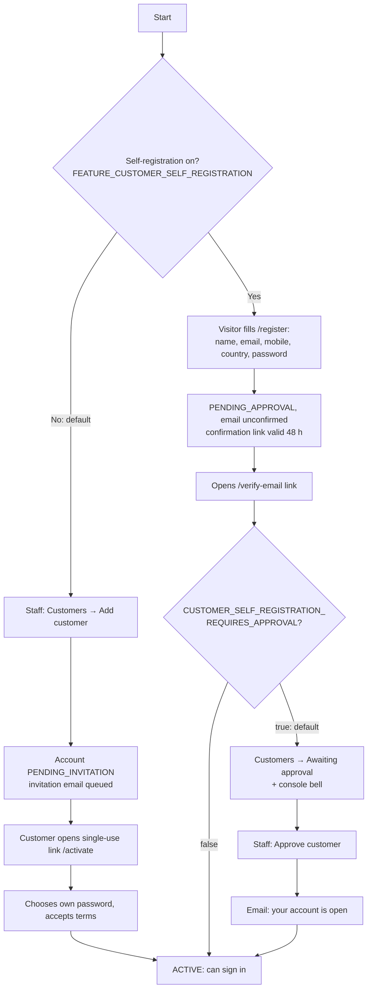
```mermaid
flowchart TD
    A[Start] --> B{Self-registration on?<br/>FEATURE_CUSTOMER_SELF_REGISTRATION}
    B -- No: default --> C[Staff: Customers → Add customer]
    C --> D[Account PENDING_INVITATION<br/>invitation email queued]
    D --> E[Customer opens single-use link /activate]
    E --> F[Chooses own password, accepts terms]
    F --> Z[ACTIVE: can sign in]
    B -- Yes --> G[Visitor fills /register:<br/>name, email, mobile, country, password]
    G --> H[PENDING_APPROVAL, email unconfirmed<br/>confirmation link valid 48 h]
    H --> I[Opens /verify-email link]
    I --> J{CUSTOMER_SELF_REGISTRATION_<br/>REQUIRES_APPROVAL?}
    J -- false --> Z
    J -- true: default --> K[Customers → Awaiting approval<br/>+ console bell]
    K --> L[Staff: Approve customer]
    L --> M[Email: your account is open]
    M --> Z
```

Things that must hold: the form never says an address is taken; staff can
never approve an unconfirmed address; nobody but the customer knows the
password.

## 6.2 Browse → quote → cart → checkout → paid

The most important flow (FR-SRCH-001, FR-PRC-001, FR-CART-001, FR-CHK-001…006,
FR-PAY-003).

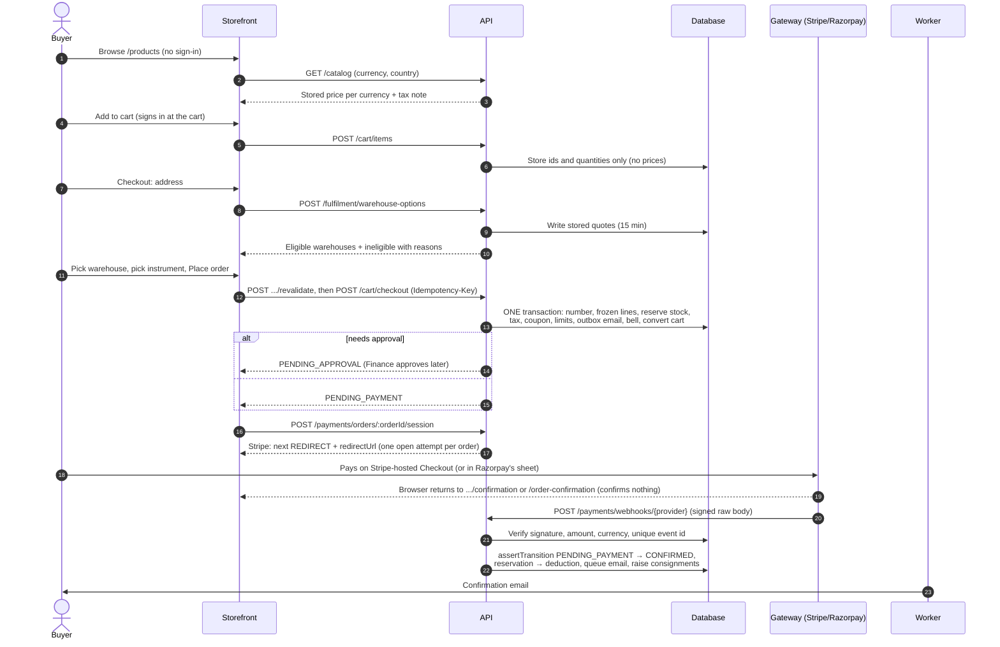
```mermaid
sequenceDiagram
    autonumber
    actor B as Buyer
    participant S as Storefront
    participant A as API
    participant DB as Database
    participant G as Gateway (Stripe/Razorpay)
    participant W as Worker
    B->>S: Browse /products (no sign-in)
    S->>A: GET /catalog (currency, country)
    A-->>S: Stored price per currency + tax note
    B->>S: Add to cart (signs in at the cart)
    S->>A: POST /cart/items
    A->>DB: Store ids and quantities only (no prices)
    B->>S: Checkout: address
    S->>A: POST /fulfilment/warehouse-options
    A->>DB: Write stored quotes (15 min)
    A-->>S: Eligible warehouses + ineligible with reasons
    B->>S: Pick warehouse, pick instrument, Place order
    S->>A: POST .../revalidate, then POST /cart/checkout (Idempotency-Key)
    A->>DB: ONE transaction: number, frozen lines, reserve stock,<br/>tax, coupon, limits, outbox email, bell, convert cart
    alt needs approval
        A-->>S: PENDING_APPROVAL (Finance approves later)
    else
        A-->>S: PENDING_PAYMENT
    end
    S->>A: POST /payments/orders/:orderId/session
    A-->>S: Stripe: next REDIRECT + redirectUrl (one open attempt per order)
    B->>G: Pays on Stripe-hosted Checkout (or in Razorpay's sheet)
    G-->>S: Browser returns to .../confirmation or /order-confirmation (confirms nothing)
    G->>A: POST /payments/webhooks/{provider} (signed raw body)
    A->>DB: Verify signature, amount, currency, unique event id
    A->>DB: assertTransition PENDING_PAYMENT → CONFIRMED,<br/>reservation → deduction, queue email, raise consignments
    W->>B: Confirmation email
```

## 6.3 The order's life

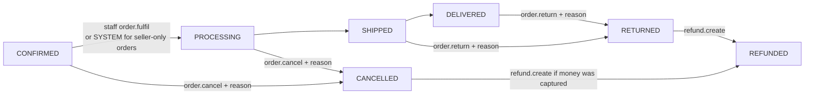
```mermaid
flowchart LR
    C[CONFIRMED] -->|staff order.fulfil<br/>or SYSTEM for seller-only orders| P[PROCESSING]
    P --> S[SHIPPED]
    S --> D[DELIVERED]
    S -->|order.return + reason| R[RETURNED]
    D -->|order.return + reason| R
    R -->|refund.create| F[REFUNDED]
    C -->|order.cancel + reason| X[CANCELLED]
    P -->|order.cancel + reason| X
    X -->|refund.create if money was captured| F
```

In parallel, each consignment moves through the shipment machine (§7.9) and
each seller's share through its order-group machine (§7.6). An order made
entirely of sellers' goods is moved by the system as sellers' groups progress.

## 6.4 A scheduled order (Subscribe & Reorder)

(FR-SCH-001…006, FR-PAY-007.)

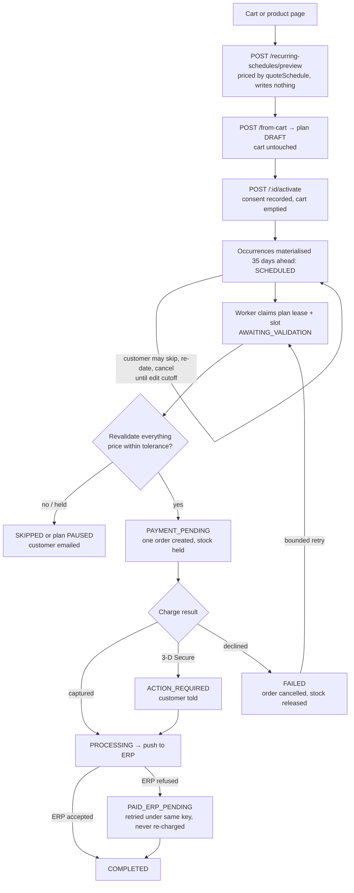
```mermaid
flowchart TD
    A[Cart or product page] --> B[POST /recurring-schedules/preview<br/>priced by quoteSchedule, writes nothing]
    B --> C[POST /from-cart → plan DRAFT<br/>cart untouched]
    C --> D[POST /:id/activate<br/>consent recorded, cart emptied]
    D --> E[Occurrences materialised 35 days ahead: SCHEDULED]
    E -->|customer may skip, re-date, cancel<br/>until edit cutoff| E
    E --> F[Worker claims plan lease + slot<br/>AWAITING_VALIDATION]
    F --> G{Revalidate everything<br/>price within tolerance?}
    G -- no / held --> H[SKIPPED or plan PAUSED<br/>customer emailed]
    G -- yes --> I[PAYMENT_PENDING<br/>one order created, stock held]
    I --> J{Charge result}
    J -- captured --> K[PROCESSING → push to ERP]
    J -- 3-D Secure --> L[ACTION_REQUIRED<br/>customer told]
    J -- declined --> M[FAILED<br/>order cancelled, stock released]
    K -- ERP accepted --> N[COMPLETED]
    K -- ERP refused --> O[PAID_ERP_PENDING<br/>retried under same key, never re-charged]
    O --> N
    L --> K
    M -->|bounded retry| F
```

## 6.5 A bulk preorder

(FR-PRE-001…007.)

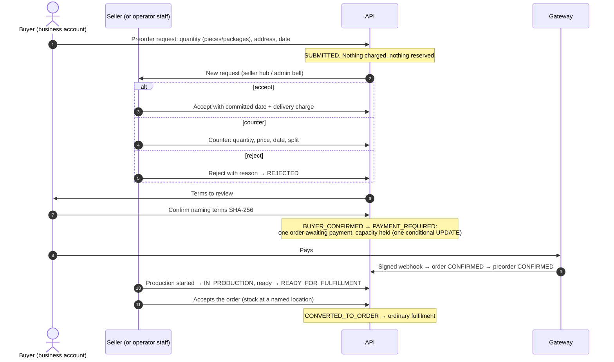
```mermaid
sequenceDiagram
    autonumber
    actor B as Buyer (business account)
    participant S as Seller (or operator staff)
    participant A as API
    participant G as Gateway
    B->>A: Preorder request: quantity (pieces/packages), address, date
    Note over A: SUBMITTED. Nothing charged, nothing reserved.
    A->>S: New request (seller hub / admin bell)
    alt accept
        S->>A: Accept with committed date + delivery charge
    else counter
        S->>A: Counter: quantity, price, date, split
    else reject
        S->>A: Reject with reason → REJECTED
    end
    A->>B: Terms to review
    B->>A: Confirm naming terms SHA-256
    Note over A: BUYER_CONFIRMED → PAYMENT_REQUIRED:<br/>one order awaiting payment, capacity held (one conditional UPDATE)
    B->>G: Pays
    G->>A: Signed webhook → order CONFIRMED → preorder CONFIRMED
    S->>A: Production started → IN_PRODUCTION, ready → READY_FOR_FULFILLMENT
    S->>A: Accepts the order (stock at a named location)
    Note over A: CONVERTED_TO_ORDER → ordinary fulfilment
```

Timers: request expiry 72 h, offer expiry 120 h, payment expiry 168 h
(cancels the order, returns capacity), risk flag 3 days before the committed
date.

### 6.5.1 More requested than is available

(FR-PRE-013…015.)

```mermaid
sequenceDiagram
    autonumber
    actor B as Buyer
    actor S as Seller
    participant A as API
    B->>A: Preorder request (pieces or containers)
    Note over A: ATP recorded, shortfall recorded. Nothing reserved.
    A->>B: "The complete requested quantity is not currently available."
    A->>S: Alert: N available; inbox badge "More than available"
    S->>A: Preview, then propose: complete on a revised date, or split delivery
    Note over A: Offer kind FULL_ON_REVISED_DATE / SPLIT_DELIVERY<br/>on SELLER_COUNTERED, installments written
    A->>B: Email: delivery schedule proposed
    alt accept
        B->>A: Accept (existing confirm endpoint)
        Note over A: One transaction: lock stock rows, recompute ATP,<br/>hold stock, capacity for the rest, order awaiting payment
        alt stock gone
            Note over A: Nothing reserved or charged. Offer INVALIDATED.<br/>SYSTEM → SELLER_REVIEW_REQUIRED. PREORDER_STOCK_CHANGED
            A->>S: Stock changed: revise
        end
    else request a change (message)
        B->>A: Offer DECLINED → SELLER_REVIEW_REQUIRED (new revision next)
    else reject
        B->>A: Preorder ends
    end
```

Holds are released on cancel, expiry, rejection or order cancellation, and
handed over (not doubled) when the seller accepts the order. Each later
split-delivery shipment reserves its own stock at dispatch.

## 6.6 Seller onboarding and a listing going on sale

(FR-SEL-001…008, FR-SLOG-001.)

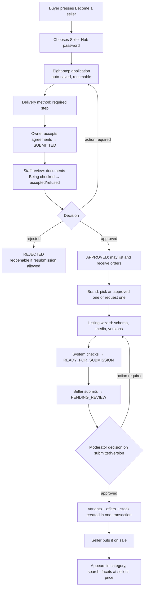
```mermaid
flowchart TD
    A[Buyer presses Become a seller] --> B[Chooses Seller Hub password]
    B --> C[Eight-step application<br/>auto-saved, resumable]
    C --> D[Delivery method: required step]
    D --> E[Owner accepts agreements → SUBMITTED]
    E --> F[Staff review: documents Being checked → accepted/refused]
    F --> G{Decision}
    G -- action required --> C
    G -- rejected --> R[REJECTED<br/>reopenable if resubmission allowed]
    G -- approved --> H[APPROVED: may list and receive orders]
    H --> I[Brand: pick an approved one or request one]
    I --> J[Listing wizard: schema, media, versions]
    J --> K[System checks → READY_FOR_SUBMISSION]
    K --> L[Seller submits → PENDING_REVIEW]
    L --> M{Moderator decision on submittedVersion}
    M -- action required --> J
    M -- approved --> N[Variants + offers + stock created in one transaction]
    N --> O[Seller puts it on sale]
    O --> P[Appears in category, search, facets at seller's price]
```

## 6.7 Shipment hand-over

(FR-LOG-003…006, FR-SLOG-004/007/008.)

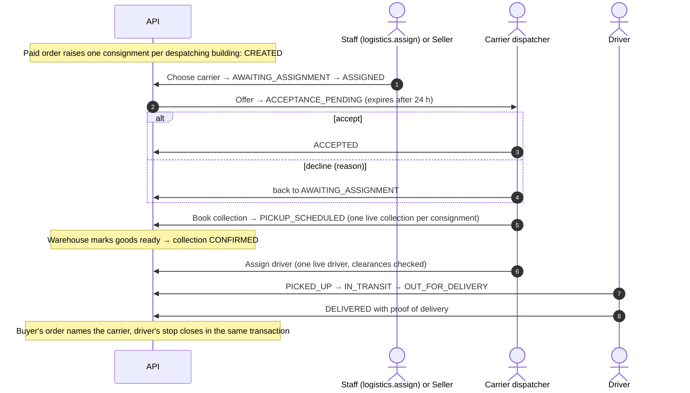
```mermaid
sequenceDiagram
    autonumber
    participant A as API
    actor Op as Staff (logistics.assign) or Seller
    actor C as Carrier dispatcher
    actor D as Driver
    Note over A: Paid order raises one consignment per despatching building: CREATED
    Op->>A: Choose carrier → AWAITING_ASSIGNMENT → ASSIGNED
    A->>C: Offer → ACCEPTANCE_PENDING (expires after 24 h)
    alt accept
        C->>A: ACCEPTED
    else decline (reason)
        C->>A: back to AWAITING_ASSIGNMENT
    end
    C->>A: Book collection → PICKUP_SCHEDULED (one live collection per consignment)
    Note over A: Warehouse marks goods ready → collection CONFIRMED
    C->>A: Assign driver (one live driver, clearances checked)
    D->>A: PICKED_UP → IN_TRANSIT → OUT_FOR_DELIVERY
    D->>A: DELIVERED with proof of delivery
    Note over A: Buyer's order names the carrier, driver's stop closes in the same transaction
```

A seller on their own DHL/FedEx account instead quotes, buys and books the
collection through their own contract; a seller with no API account records a
**manual booking** and needs a POD photo to mark it delivered.

## 6.8 Refund and return

(FR-ORD-006, FR-PAY-008.)

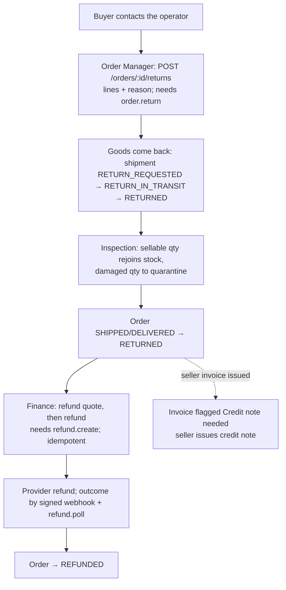
```mermaid
flowchart TD
    A[Buyer contacts the operator] --> B[Order Manager: POST /orders/:id/returns<br/>lines + reason; needs order.return]
    B --> C[Goods come back: shipment RETURN_REQUESTED → RETURN_IN_TRANSIT → RETURNED]
    C --> D[Inspection: sellable qty rejoins stock,<br/>damaged qty to quarantine]
    D --> E[Order SHIPPED/DELIVERED → RETURNED]
    E --> F[Finance: refund quote, then refund<br/>needs refund.create; idempotent]
    F --> G[Provider refund; outcome by signed webhook + refund.poll]
    G --> H[Order → REFUNDED]
    E -. seller invoice issued .-> I[Invoice flagged Credit note needed<br/>seller issues credit note]
```

A cancelled order whose money was captured goes `CANCELLED → REFUNDED` the
same way. A seller can never refund; money leaving is the operator's action.

If the operator had already issued a **commission invoice** to the seller for
that seller order (§5.14a), the invoice list and detail page now show
**Credit note may be due**. Finance decides and issues the credit note —
usually *in proportion to the refund* — at **Finance → Commission invoices**.
Nothing is credited automatically, and the refund itself is unchanged.

## 6.9 Staff onboarding

(FR-IDN-008…010.)

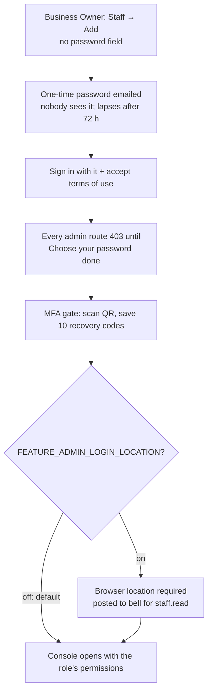
```mermaid
flowchart TD
    A[Business Owner: Staff → Add<br/>no password field] --> B[One-time password emailed<br/>nobody sees it; lapses after 72 h]
    B --> C[Sign in with it + accept terms of use]
    C --> D[Every admin route 403 until<br/>Choose your password done]
    D --> E[MFA gate: scan QR, save 10 recovery codes]
    E --> F{FEATURE_ADMIN_LOGIN_LOCATION?}
    F -- on --> G[Browser location required<br/>posted to bell for staff.read]
    F -- off: default --> H[Console opens with the role's permissions]
    G --> H
```

---

# 7. State models

All diagrams are taken exactly from the domain files. Where a diagram would be
unreadable, the complete transition table follows it. Labels show the actor
(SYSTEM, ADMIN, CUSTOMER…) and any permission or reason requirement.

## 7.1 Order status (`backend/src/domain/order-state-machine.ts`)

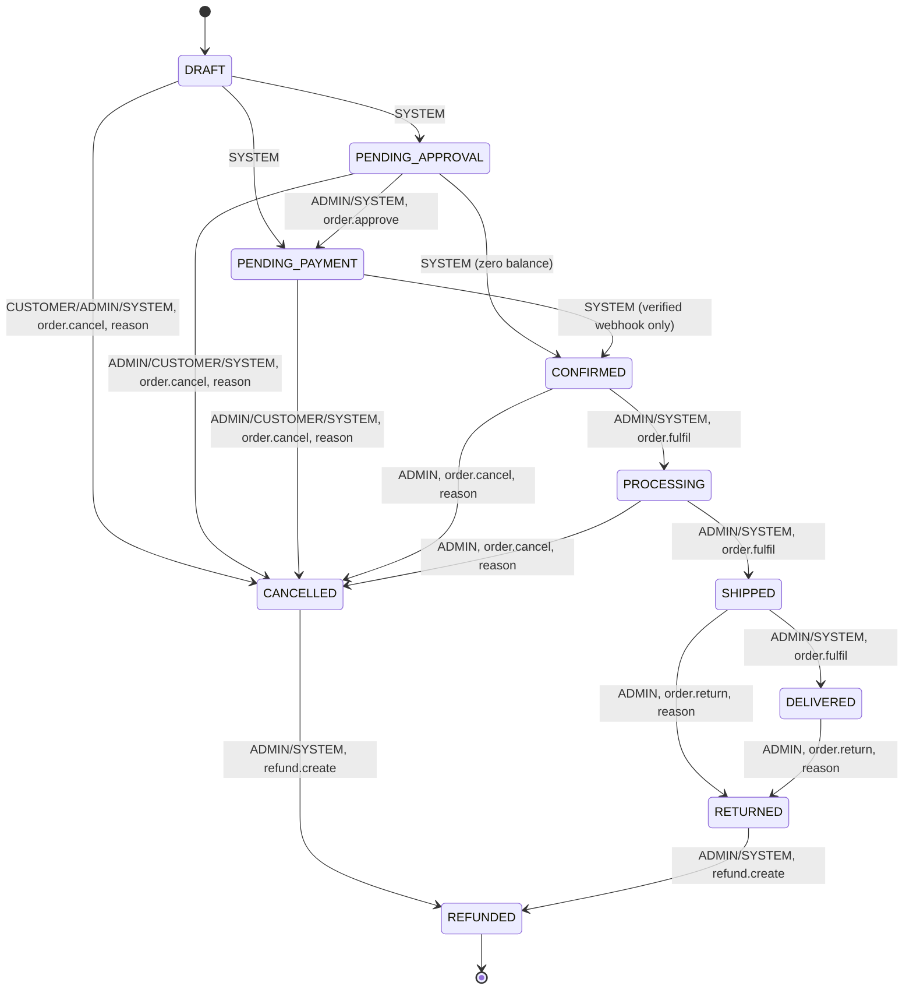
```mermaid
stateDiagram-v2
    [*] --> DRAFT
    DRAFT --> PENDING_APPROVAL: SYSTEM
    DRAFT --> PENDING_PAYMENT: SYSTEM
    DRAFT --> CANCELLED: CUSTOMER/ADMIN/SYSTEM, order.cancel, reason
    PENDING_APPROVAL --> PENDING_PAYMENT: ADMIN/SYSTEM, order.approve
    PENDING_APPROVAL --> CONFIRMED: SYSTEM (zero balance)
    PENDING_APPROVAL --> CANCELLED: ADMIN/CUSTOMER/SYSTEM, order.cancel, reason
    PENDING_PAYMENT --> CONFIRMED: SYSTEM (verified webhook only)
    PENDING_PAYMENT --> CANCELLED: ADMIN/CUSTOMER/SYSTEM, order.cancel, reason
    CONFIRMED --> PROCESSING: ADMIN/SYSTEM, order.fulfil
    CONFIRMED --> CANCELLED: ADMIN, order.cancel, reason
    PROCESSING --> SHIPPED: ADMIN/SYSTEM, order.fulfil
    PROCESSING --> CANCELLED: ADMIN, order.cancel, reason
    SHIPPED --> DELIVERED: ADMIN/SYSTEM, order.fulfil
    SHIPPED --> RETURNED: ADMIN, order.return, reason
    DELIVERED --> RETURNED: ADMIN, order.return, reason
    CANCELLED --> REFUNDED: ADMIN/SYSTEM, refund.create
    RETURNED --> REFUNDED: ADMIN/SYSTEM, refund.create
    REFUNDED --> [*]
```

- Terminal: `REFUNDED`. Stock held in CONFIRMED, PROCESSING, SHIPPED, DELIVERED; released on CANCELLED, RETURNED.
- Deliberately absent: CONFIRMED → PENDING_PAYMENT (a second charge on a paid order); DELIVERED → CANCELLED; anything out of REFUNDED.
- Permissions are consulted only for an ADMIN actor. No admin, even with every permission, can move an order to CONFIRMED.

## 7.2 Schedule plan status (`backend/src/domain/schedule-state.ts`)

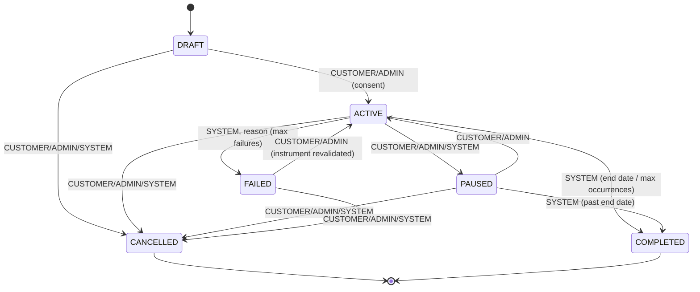
```mermaid
stateDiagram-v2
    [*] --> DRAFT
    DRAFT --> ACTIVE: CUSTOMER/ADMIN (consent)
    DRAFT --> CANCELLED: CUSTOMER/ADMIN/SYSTEM
    ACTIVE --> PAUSED: CUSTOMER/ADMIN/SYSTEM
    ACTIVE --> CANCELLED: CUSTOMER/ADMIN/SYSTEM
    ACTIVE --> COMPLETED: SYSTEM (end date / max occurrences)
    ACTIVE --> FAILED: SYSTEM, reason (max failures)
    PAUSED --> ACTIVE: CUSTOMER/ADMIN
    PAUSED --> CANCELLED: CUSTOMER/ADMIN/SYSTEM
    PAUSED --> COMPLETED: SYSTEM (past end date)
    FAILED --> ACTIVE: CUSTOMER/ADMIN (instrument revalidated)
    FAILED --> CANCELLED: CUSTOMER/ADMIN/SYSTEM
    CANCELLED --> [*]
    COMPLETED --> [*]
```

- Terminal: CANCELLED, COMPLETED. Only ACTIVE plans are run by the worker.
- Deliberately absent: anything back to DRAFT; anything out of CANCELLED; COMPLETED → ACTIVE; **anything → ACTIVE by SYSTEM** (a plan becomes live only because a person said so).

## 7.3 Schedule occurrence status (`schedule-state.ts`)

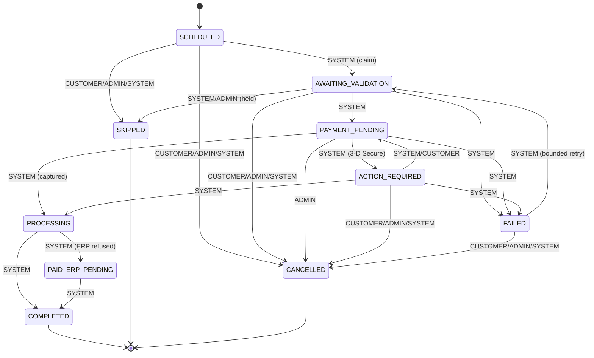
```mermaid
stateDiagram-v2
    [*] --> SCHEDULED
    SCHEDULED --> AWAITING_VALIDATION: SYSTEM (claim)
    SCHEDULED --> SKIPPED: CUSTOMER/ADMIN/SYSTEM
    SCHEDULED --> CANCELLED: CUSTOMER/ADMIN/SYSTEM
    AWAITING_VALIDATION --> PAYMENT_PENDING: SYSTEM
    AWAITING_VALIDATION --> SKIPPED: SYSTEM/ADMIN (held)
    AWAITING_VALIDATION --> CANCELLED: CUSTOMER/ADMIN/SYSTEM
    AWAITING_VALIDATION --> FAILED: SYSTEM
    PAYMENT_PENDING --> PROCESSING: SYSTEM (captured)
    PAYMENT_PENDING --> ACTION_REQUIRED: SYSTEM (3-D Secure)
    PAYMENT_PENDING --> FAILED: SYSTEM
    PAYMENT_PENDING --> CANCELLED: ADMIN
    ACTION_REQUIRED --> PROCESSING: SYSTEM
    ACTION_REQUIRED --> PAYMENT_PENDING: SYSTEM/CUSTOMER
    ACTION_REQUIRED --> FAILED: SYSTEM
    ACTION_REQUIRED --> CANCELLED: CUSTOMER/ADMIN/SYSTEM
    PROCESSING --> COMPLETED: SYSTEM
    PROCESSING --> PAID_ERP_PENDING: SYSTEM (ERP refused)
    PAID_ERP_PENDING --> COMPLETED: SYSTEM
    FAILED --> AWAITING_VALIDATION: SYSTEM (bounded retry)
    FAILED --> CANCELLED: CUSTOMER/ADMIN/SYSTEM
    COMPLETED --> [*]
    SKIPPED --> [*]
    CANCELLED --> [*]
```

- Terminal: COMPLETED, SKIPPED, CANCELLED. Money has moved in PROCESSING, PAID_ERP_PENDING, COMPLETED (and legacy PAID): **no edge leads back into the charge path**.
- PAID_ERP_PENDING is **not a failure**; its only exit is COMPLETED.
- Customer-editable only in SCHEDULED. Legacy statuses PENDING, ORDER_CREATED, PAID are read, never written.

## 7.4 Preorder status (`backend/src/domain/preorder-state.ts`)

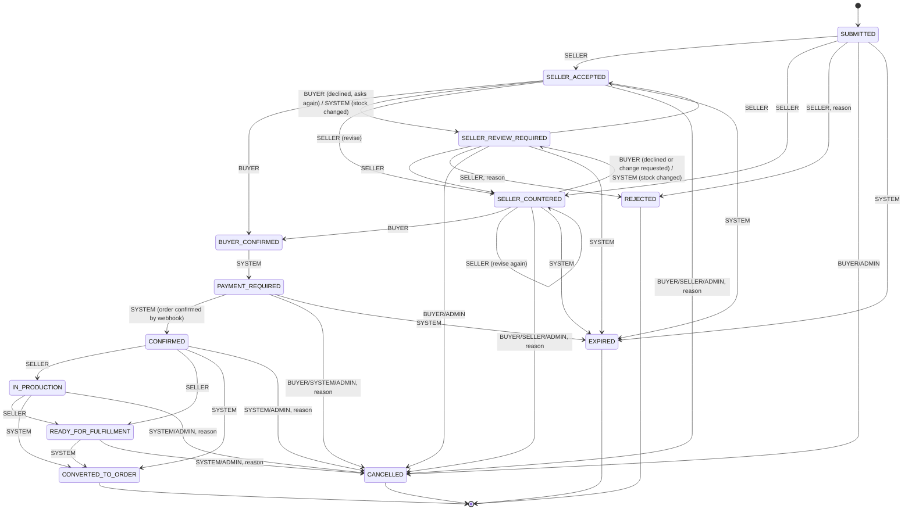
```mermaid
stateDiagram-v2
    [*] --> SUBMITTED
    SUBMITTED --> SELLER_ACCEPTED: SELLER
    SUBMITTED --> SELLER_COUNTERED: SELLER
    SUBMITTED --> REJECTED: SELLER, reason
    SUBMITTED --> CANCELLED: BUYER/ADMIN
    SUBMITTED --> EXPIRED: SYSTEM
    SELLER_REVIEW_REQUIRED --> SELLER_ACCEPTED: SELLER
    SELLER_REVIEW_REQUIRED --> SELLER_COUNTERED: SELLER
    SELLER_REVIEW_REQUIRED --> REJECTED: SELLER, reason
    SELLER_REVIEW_REQUIRED --> CANCELLED: BUYER/ADMIN
    SELLER_REVIEW_REQUIRED --> EXPIRED: SYSTEM
    SELLER_ACCEPTED --> BUYER_CONFIRMED: BUYER
    SELLER_ACCEPTED --> SELLER_REVIEW_REQUIRED: BUYER (declined, asks again) / SYSTEM (stock changed)
    SELLER_ACCEPTED --> SELLER_COUNTERED: SELLER (revise)
    SELLER_ACCEPTED --> CANCELLED: BUYER/SELLER/ADMIN, reason
    SELLER_ACCEPTED --> EXPIRED: SYSTEM
    SELLER_COUNTERED --> BUYER_CONFIRMED: BUYER
    SELLER_COUNTERED --> SELLER_REVIEW_REQUIRED: BUYER (declined or change requested) / SYSTEM (stock changed)
    SELLER_COUNTERED --> SELLER_COUNTERED: SELLER (revise again)
    SELLER_COUNTERED --> CANCELLED: BUYER/SELLER/ADMIN, reason
    SELLER_COUNTERED --> EXPIRED: SYSTEM
    BUYER_CONFIRMED --> PAYMENT_REQUIRED: SYSTEM
    PAYMENT_REQUIRED --> CONFIRMED: SYSTEM (order confirmed by webhook)
    PAYMENT_REQUIRED --> CANCELLED: BUYER/SYSTEM/ADMIN, reason
    PAYMENT_REQUIRED --> EXPIRED: SYSTEM
    CONFIRMED --> IN_PRODUCTION: SELLER
    CONFIRMED --> READY_FOR_FULFILLMENT: SELLER
    CONFIRMED --> CONVERTED_TO_ORDER: SYSTEM
    CONFIRMED --> CANCELLED: SYSTEM/ADMIN, reason
    IN_PRODUCTION --> READY_FOR_FULFILLMENT: SELLER
    IN_PRODUCTION --> CONVERTED_TO_ORDER: SYSTEM
    IN_PRODUCTION --> CANCELLED: SYSTEM/ADMIN, reason
    READY_FOR_FULFILLMENT --> CONVERTED_TO_ORDER: SYSTEM
    READY_FOR_FULFILLMENT --> CANCELLED: SYSTEM/ADMIN, reason
    CONVERTED_TO_ORDER --> [*]
    REJECTED --> [*]
    CANCELLED --> [*]
    EXPIRED --> [*]
```

- Seller owes an answer: SUBMITTED, SELLER_REVIEW_REQUIRED. Buyer owes one: SELLER_ACCEPTED, SELLER_COUNTERED.
- Capacity held: PAYMENT_REQUIRED, CONFIRMED, IN_PRODUCTION, READY_FOR_FULFILLMENT.
- A revised-date or split-delivery offer (offer kinds `FULL_ON_REVISED_DATE`, `SPLIT_DELIVERY`) uses SELLER_COUNTERED; there are no extra statuses. Its stock hold is written when the buyer accepts and lasts until it is released (the preorder is cancelled, expires or is rejected, or its order is cancelled) or handed over to the order when the seller accepts it.
- SYSTEM moves SELLER_ACCEPTED or SELLER_COUNTERED back to SELLER_REVIEW_REQUIRED when the stock an offer relied on is gone at acceptance; the offer becomes INVALIDATED.
- Invariants: the seller cannot move a request to anything the buyer pays for; nothing returns to negotiation once an order exists; CONFIRMED comes only from SYSTEM.

## 7.4a Preorder chat status (`backend/src/domain/preorder-chat-state.ts`)

`NEW` (nobody from the business has answered) → `OPEN` → `WAITING_FOR_CUSTOMER` / `WAITING_FOR_INTERNAL` → `RESOLVED` → `CLOSED`, with `SPAM` and `BLOCKED` set aside by moderation.

- **Staff moves** need `preorder_chat.reply`; into or out of `SPAM`/`BLOCKED` needs `preorder_chat.moderate`. `NEW` is never a target. `CLOSED` → `OPEN` is a reopen and is refused if the customer has since started a newer conversation about the same product.
- **Messages imply moves:** a customer's message moves `WAITING_FOR_CUSTOMER` to `OPEN` and reopens `RESOLVED` (counted); it is refused in `CLOSED` and `BLOCKED`, and kept silently in `SPAM`. The first staff reply moves `NEW` to `OPEN`.
- **The customer sees fewer words:** Open, Waiting for your reply, Resolved, Closed, Messaging unavailable. Spam and waiting-internally both read as Open.

## 7.5 Buyer ERP connection (`backend/src/domain/customer-erp-state.ts`)

Connection statuses: `DRAFT`, `TESTING`, `ACTIVE`, `PAUSED`,
`ACTION_REQUIRED`, `FAILED`, `DISCONNECTED`. Each sync job moves through
`QUEUED`, `PROCESSING`, `SUCCEEDED`, `RETRYING`, `FAILED`, `SKIPPED` by the
actions CLAIM, SUCCEED, SCHEDULE_RETRY, ABANDON and SKIP. Switching a
connection on is refused until a test passed and the mapping was checked
against a real response from the buyer's own system. The full edge list lives
in the domain file.

## 7.6 Seller order group (one seller's share of an order; `seller-state.ts`)

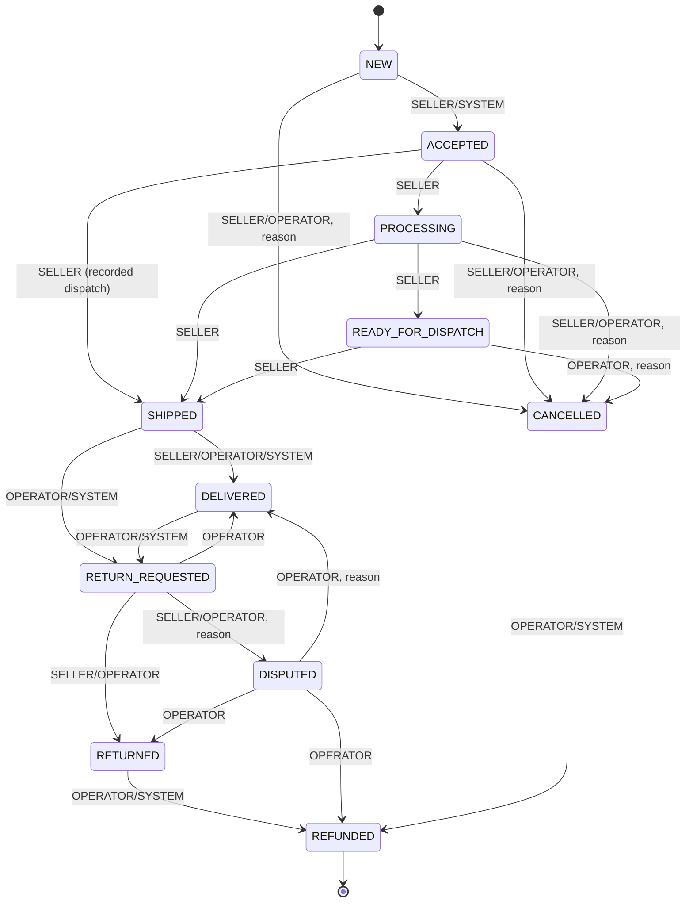
```mermaid
stateDiagram-v2
    [*] --> NEW
    NEW --> ACCEPTED: SELLER/SYSTEM
    NEW --> CANCELLED: SELLER/OPERATOR, reason
    ACCEPTED --> PROCESSING: SELLER
    ACCEPTED --> SHIPPED: SELLER (recorded dispatch)
    ACCEPTED --> CANCELLED: SELLER/OPERATOR, reason
    PROCESSING --> READY_FOR_DISPATCH: SELLER
    PROCESSING --> SHIPPED: SELLER
    PROCESSING --> CANCELLED: SELLER/OPERATOR, reason
    READY_FOR_DISPATCH --> SHIPPED: SELLER
    READY_FOR_DISPATCH --> CANCELLED: OPERATOR, reason
    SHIPPED --> DELIVERED: SELLER/OPERATOR/SYSTEM
    SHIPPED --> RETURN_REQUESTED: OPERATOR/SYSTEM
    DELIVERED --> RETURN_REQUESTED: OPERATOR/SYSTEM
    RETURN_REQUESTED --> RETURNED: SELLER/OPERATOR
    RETURN_REQUESTED --> DISPUTED: SELLER/OPERATOR, reason
    RETURN_REQUESTED --> DELIVERED: OPERATOR
    RETURNED --> REFUNDED: OPERATOR/SYSTEM
    DISPUTED --> RETURNED: OPERATOR
    DISPUTED --> DELIVERED: OPERATOR, reason
    DISPUTED --> REFUNDED: OPERATOR
    CANCELLED --> REFUNDED: OPERATOR/SYSTEM
    REFUNDED --> [*]
```

This is **not** the buyer's order status. A seller cannot cancel after
dispatch and cannot refund.

## 7.7 Seller application (`backend/src/domain/seller-state.ts`)

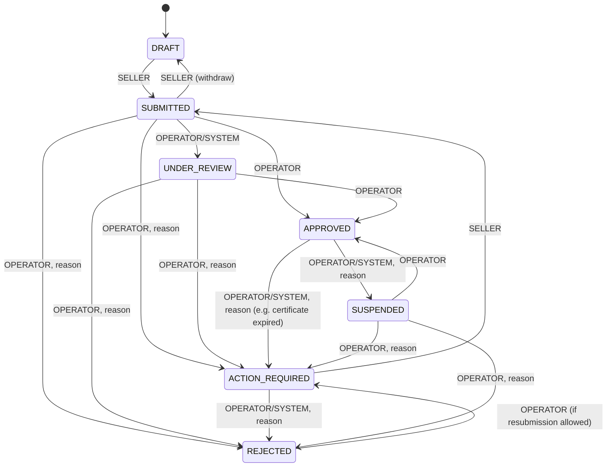
```mermaid
stateDiagram-v2
    [*] --> DRAFT
    DRAFT --> SUBMITTED: SELLER
    SUBMITTED --> UNDER_REVIEW: OPERATOR/SYSTEM
    SUBMITTED --> ACTION_REQUIRED: OPERATOR, reason
    SUBMITTED --> APPROVED: OPERATOR
    SUBMITTED --> REJECTED: OPERATOR, reason
    SUBMITTED --> DRAFT: SELLER (withdraw)
    UNDER_REVIEW --> ACTION_REQUIRED: OPERATOR, reason
    UNDER_REVIEW --> APPROVED: OPERATOR
    UNDER_REVIEW --> REJECTED: OPERATOR, reason
    ACTION_REQUIRED --> SUBMITTED: SELLER
    ACTION_REQUIRED --> REJECTED: OPERATOR/SYSTEM, reason
    APPROVED --> SUSPENDED: OPERATOR/SYSTEM, reason
    APPROVED --> ACTION_REQUIRED: OPERATOR/SYSTEM, reason (e.g. certificate expired)
    REJECTED --> ACTION_REQUIRED: OPERATOR (if resubmission allowed)
    SUSPENDED --> APPROVED: OPERATOR
    SUSPENDED --> ACTION_REQUIRED: OPERATOR, reason
    SUSPENDED --> REJECTED: OPERATOR, reason
```

Only APPROVED sellers may trade. A seller can never be its own operator.

## 7.8 Seller listing draft (`seller-state.ts`)

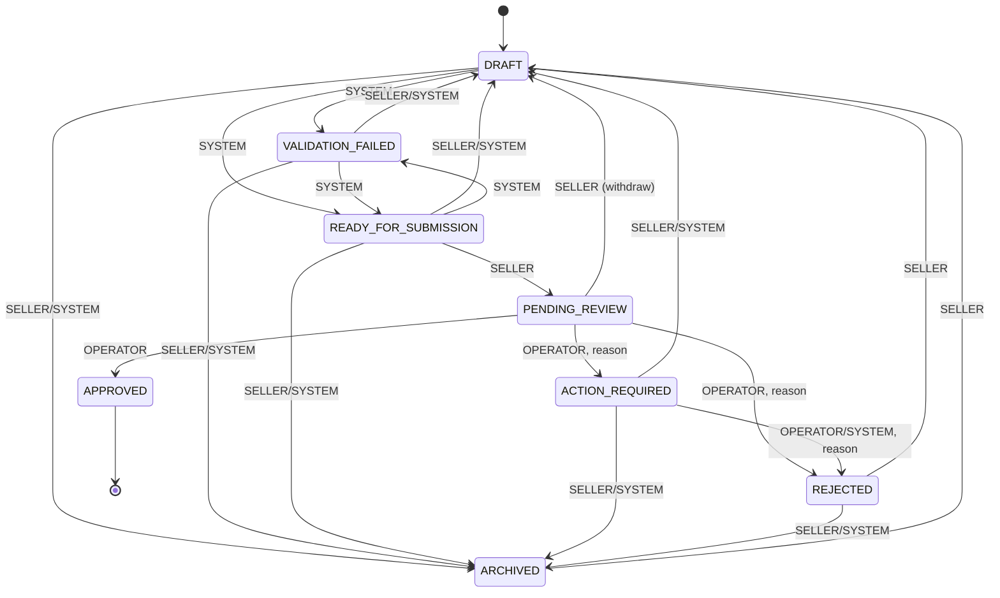
```mermaid
stateDiagram-v2
    [*] --> DRAFT
    DRAFT --> VALIDATION_FAILED: SYSTEM
    DRAFT --> READY_FOR_SUBMISSION: SYSTEM
    DRAFT --> ARCHIVED: SELLER/SYSTEM
    VALIDATION_FAILED --> DRAFT: SELLER/SYSTEM
    VALIDATION_FAILED --> READY_FOR_SUBMISSION: SYSTEM
    VALIDATION_FAILED --> ARCHIVED: SELLER/SYSTEM
    READY_FOR_SUBMISSION --> PENDING_REVIEW: SELLER
    READY_FOR_SUBMISSION --> DRAFT: SELLER/SYSTEM
    READY_FOR_SUBMISSION --> VALIDATION_FAILED: SYSTEM
    READY_FOR_SUBMISSION --> ARCHIVED: SELLER/SYSTEM
    PENDING_REVIEW --> APPROVED: OPERATOR
    PENDING_REVIEW --> ACTION_REQUIRED: OPERATOR, reason
    PENDING_REVIEW --> REJECTED: OPERATOR, reason
    PENDING_REVIEW --> DRAFT: SELLER (withdraw)
    ACTION_REQUIRED --> DRAFT: SELLER/SYSTEM
    ACTION_REQUIRED --> ARCHIVED: SELLER/SYSTEM
    ACTION_REQUIRED --> REJECTED: OPERATOR/SYSTEM, reason
    REJECTED --> DRAFT: SELLER
    REJECTED --> ARCHIVED: SELLER/SYSTEM
    ARCHIVED --> DRAFT: SELLER
    APPROVED --> [*]
```

APPROVED is terminal for the draft: the listing lives on as a `SellerOffer`
(pausing and resuming happen on the offer). **Nothing reaches APPROVED except
from PENDING_REVIEW, and only an operator can do it.**

## 7.9 Shipment (consignment) status (`backend/src/domain/logistics-shipment-state.ts`)

27 statuses: 15 on the forward path, 7 exceptions, 3 return, LOST and
CANCELLED. Actor groups used below:

- **CARRIER_STAFF** = PARTNER, UBOSS_ADMIN, SYSTEM
- **FIELD** = PARTNER, DRIVER, CARRIER (feed), UBOSS_ADMIN, SYSTEM
- **SELLER** = a seller recording their own manual booking (only with a live hand-made booking)

Forward path and terminals (exception edges in the table below):

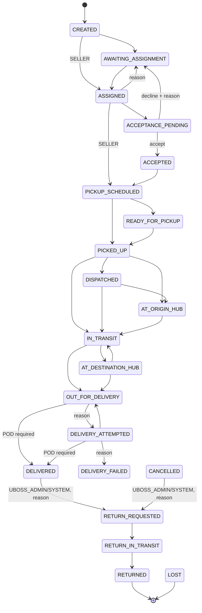
```mermaid
stateDiagram-v2
    [*] --> CREATED
    CREATED --> AWAITING_ASSIGNMENT
    CREATED --> ASSIGNED: SELLER
    AWAITING_ASSIGNMENT --> ASSIGNED
    ASSIGNED --> ACCEPTANCE_PENDING
    ASSIGNED --> AWAITING_ASSIGNMENT: reason
    ASSIGNED --> PICKUP_SCHEDULED: SELLER
    ACCEPTANCE_PENDING --> ACCEPTED: accept
    ACCEPTANCE_PENDING --> AWAITING_ASSIGNMENT: decline + reason
    ACCEPTED --> PICKUP_SCHEDULED
    PICKUP_SCHEDULED --> READY_FOR_PICKUP
    PICKUP_SCHEDULED --> PICKED_UP
    READY_FOR_PICKUP --> PICKED_UP
    PICKED_UP --> DISPATCHED
    PICKED_UP --> AT_ORIGIN_HUB
    PICKED_UP --> IN_TRANSIT
    DISPATCHED --> AT_ORIGIN_HUB
    DISPATCHED --> IN_TRANSIT
    AT_ORIGIN_HUB --> IN_TRANSIT
    IN_TRANSIT --> AT_DESTINATION_HUB
    IN_TRANSIT --> OUT_FOR_DELIVERY
    AT_DESTINATION_HUB --> OUT_FOR_DELIVERY
    AT_DESTINATION_HUB --> IN_TRANSIT
    OUT_FOR_DELIVERY --> DELIVERED: POD required
    OUT_FOR_DELIVERY --> DELIVERY_ATTEMPTED: reason
    DELIVERY_ATTEMPTED --> DELIVERED: POD required
    DELIVERY_ATTEMPTED --> OUT_FOR_DELIVERY
    DELIVERY_ATTEMPTED --> DELIVERY_FAILED: reason
    DELIVERED --> RETURN_REQUESTED: UBOSS_ADMIN/SYSTEM, reason
    RETURN_REQUESTED --> RETURN_IN_TRANSIT
    RETURN_IN_TRANSIT --> RETURNED
    CANCELLED --> RETURN_REQUESTED: UBOSS_ADMIN/SYSTEM, reason
    RETURNED --> [*]
    LOST --> [*]
```

**Complete transition table** (exactly as in the code; "IME" = the in-motion
exception set: → DELAYED (FIELD + SELLER, reason), → ON_HOLD (CARRIER_STAFF,
reason), → DAMAGED (FIELD, reason), → LOST (CARRIER_STAFF, reason),
→ TEMPERATURE_EXCEPTION (FIELD, reason); all IME edges need
`logistics.shipment.status.write`):

| From | To (actors; permission; reason/POD) |
|---|---|
| CREATED | AWAITING_ASSIGNMENT (UBOSS_ADMIN, SYSTEM); ASSIGNED (SELLER); CANCELLED (UBOSS_ADMIN, SYSTEM; reason) |
| AWAITING_ASSIGNMENT | ASSIGNED (UBOSS_ADMIN, SYSTEM, SELLER); ON_HOLD (UBOSS_ADMIN; reason); CANCELLED (UBOSS_ADMIN, SYSTEM; reason) |
| ASSIGNED | ACCEPTANCE_PENDING (UBOSS_ADMIN, SYSTEM); AWAITING_ASSIGNMENT (UBOSS_ADMIN, SYSTEM, SELLER; reason); PICKUP_SCHEDULED (SELLER); CANCELLED (UBOSS_ADMIN, SYSTEM; reason) |
| ACCEPTANCE_PENDING | ACCEPTED (PARTNER, UBOSS_ADMIN; `shipment.accept`); AWAITING_ASSIGNMENT (PARTNER, UBOSS_ADMIN, SYSTEM; `shipment.accept`; reason); CANCELLED (UBOSS_ADMIN, SYSTEM; reason) |
| ACCEPTED | PICKUP_SCHEDULED (CARRIER_STAFF; `pickup.write`); ADDRESS_ISSUE, ON_HOLD (CARRIER_STAFF; status.write; reason); CANCELLED (UBOSS_ADMIN, SYSTEM; reason) |
| PICKUP_SCHEDULED | READY_FOR_PICKUP (CARRIER_STAFF; `pickup.write`); PICKED_UP (FIELD + SELLER; `pickup.write`); AWAITING_ASSIGNMENT (SELLER; reason); DELAYED (FIELD; reason); ADDRESS_ISSUE, ON_HOLD (CARRIER_STAFF; reason); CANCELLED (UBOSS_ADMIN, SYSTEM; reason) |
| READY_FOR_PICKUP | PICKED_UP (FIELD; `pickup.write`); DELAYED (FIELD; reason); ADDRESS_ISSUE, ON_HOLD (CARRIER_STAFF; reason); CANCELLED (UBOSS_ADMIN, SYSTEM; reason) |
| PICKED_UP | DISPATCHED (CARRIER_STAFF; `dispatch.write`); AT_ORIGIN_HUB (FIELD); IN_TRANSIT (FIELD + SELLER); IME; RETURN_REQUESTED (UBOSS_ADMIN, SYSTEM; reason) |
| DISPATCHED | AT_ORIGIN_HUB, IN_TRANSIT (FIELD); CUSTOMS_HOLD (FIELD; reason); IME; RETURN_REQUESTED (UBOSS_ADMIN, SYSTEM; reason) |
| AT_ORIGIN_HUB | IN_TRANSIT (FIELD); CUSTOMS_HOLD (FIELD; reason); IME; RETURN_REQUESTED (UBOSS_ADMIN, SYSTEM; reason) |
| IN_TRANSIT | AT_DESTINATION_HUB (FIELD); OUT_FOR_DELIVERY (FIELD + SELLER); CUSTOMS_HOLD, ADDRESS_ISSUE (FIELD; reason); IME; RETURN_REQUESTED (UBOSS_ADMIN, SYSTEM; reason) |
| AT_DESTINATION_HUB | OUT_FOR_DELIVERY, IN_TRANSIT (FIELD); CUSTOMS_HOLD, ADDRESS_ISSUE (FIELD; reason); IME; RETURN_REQUESTED (UBOSS_ADMIN, SYSTEM; reason) |
| OUT_FOR_DELIVERY | DELIVERED (PARTNER, DRIVER, CARRIER, UBOSS_ADMIN, SELLER; `pod.write`; **POD**); DELIVERY_ATTEMPTED (FIELD + SELLER; reason); ADDRESS_ISSUE (FIELD; reason); IME |
| DELIVERY_ATTEMPTED | DELIVERED (as above; **POD**); OUT_FOR_DELIVERY (FIELD + SELLER); DELIVERY_FAILED (CARRIER_STAFF + SELLER; reason); ADDRESS_ISSUE (FIELD; reason); RETURN_REQUESTED (CARRIER_STAFF; reason); IME |
| DELIVERED | RETURN_REQUESTED (UBOSS_ADMIN, SYSTEM; reason) |
| DELAYED | READY_FOR_PICKUP (CARRIER_STAFF); PICKED_UP (FIELD; `pickup.write`); AT_ORIGIN_HUB, AT_DESTINATION_HUB (FIELD); IN_TRANSIT, OUT_FOR_DELIVERY (FIELD + SELLER); DELIVERY_ATTEMPTED, CUSTOMS_HOLD, ADDRESS_ISSUE, DAMAGED (FIELD; reason); DELIVERY_FAILED, ON_HOLD, LOST, RETURN_REQUESTED (CARRIER_STAFF; reason); CANCELLED (UBOSS_ADMIN, SYSTEM; reason) |
| ON_HOLD | ACCEPTED, READY_FOR_PICKUP (CARRIER_STAFF); PICKUP_SCHEDULED (CARRIER_STAFF; `pickup.write`); IN_TRANSIT, AT_DESTINATION_HUB, OUT_FOR_DELIVERY (FIELD); DELAYED (FIELD; reason); RETURN_REQUESTED (CARRIER_STAFF; reason); CANCELLED (UBOSS_ADMIN, SYSTEM; reason) |
| ADDRESS_ISSUE | OUT_FOR_DELIVERY, IN_TRANSIT, AT_DESTINATION_HUB (FIELD); PICKUP_SCHEDULED (CARRIER_STAFF; `pickup.write`); DELIVERY_FAILED, ON_HOLD, RETURN_REQUESTED (CARRIER_STAFF; reason); CANCELLED (UBOSS_ADMIN, SYSTEM; reason) |
| CUSTOMS_HOLD | IN_TRANSIT, AT_DESTINATION_HUB (FIELD); DELAYED (FIELD; reason); DELIVERY_FAILED, RETURN_REQUESTED, LOST (CARRIER_STAFF; reason); CANCELLED (UBOSS_ADMIN, SYSTEM; reason) |
| DAMAGED | IN_TRANSIT, DELIVERY_FAILED, RETURN_REQUESTED, LOST (CARRIER_STAFF; reason) |
| TEMPERATURE_EXCEPTION | IN_TRANSIT, OUT_FOR_DELIVERY (CARRIER_STAFF; reason); DAMAGED (FIELD; reason); DELIVERY_FAILED, RETURN_REQUESTED (CARRIER_STAFF; reason) |
| DELIVERY_FAILED | OUT_FOR_DELIVERY (FIELD + SELLER); RETURN_REQUESTED (CARRIER_STAFF + SELLER; reason); ON_HOLD (CARRIER_STAFF; reason); CANCELLED (UBOSS_ADMIN, SYSTEM; reason) |
| RETURN_REQUESTED | RETURN_IN_TRANSIT (CARRIER_STAFF + SELLER); CANCELLED (UBOSS_ADMIN, SYSTEM; reason) |
| RETURN_IN_TRANSIT | RETURNED (FIELD + SELLER); DELAYED, DAMAGED (FIELD; reason); LOST (CARRIER_STAFF; reason) |
| RETURNED | — (terminal) |
| LOST | — (terminal) |
| CANCELLED | RETURN_REQUESTED (UBOSS_ADMIN, SYSTEM; reason) |

- Terminal: RETURNED, LOST. Tracking complete: DELIVERED, RETURNED, LOST, CANCELLED.
- In carrier possession (stock committed to fulfilment): PICKED_UP through RETURN_IN_TRANSIT, including every exception.
- Exceptions queue: DELAYED, ON_HOLD, ADDRESS_ISSUE, CUSTOMS_HOLD, DAMAGED, TEMPERATURE_EXCEPTION, DELIVERY_FAILED, LOST.
- DELIVERED only from OUT_FOR_DELIVERY or DELIVERY_ATTEMPTED; a partner cannot un-deliver; the operator's corrections go through `assertShipmentCorrection`.

## 7.10 Collection (pickup) (`backend/src/domain/logistics-pickup-state.ts`)

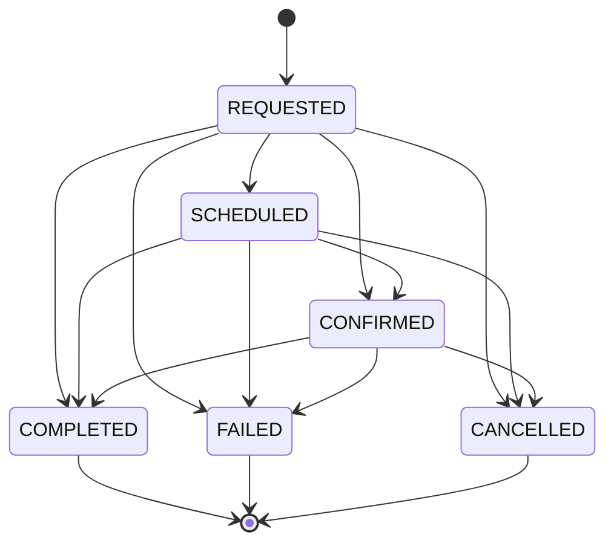
```mermaid
stateDiagram-v2
    [*] --> REQUESTED
    REQUESTED --> SCHEDULED
    REQUESTED --> CONFIRMED
    REQUESTED --> COMPLETED
    REQUESTED --> FAILED
    REQUESTED --> CANCELLED
    SCHEDULED --> CONFIRMED
    SCHEDULED --> COMPLETED
    SCHEDULED --> FAILED
    SCHEDULED --> CANCELLED
    CONFIRMED --> COMPLETED
    CONFIRMED --> FAILED
    CONFIRMED --> CANCELLED
    COMPLETED --> [*]
    FAILED --> [*]
    CANCELLED --> [*]
```

Terminal means terminal: a failed collection that is rebooked is a new
collection. Live states: REQUESTED, SCHEDULED, CONFIRMED.

## 7.11 Delivery leg (L1–L4) (`backend/src/domain/logistics-levels.ts`)

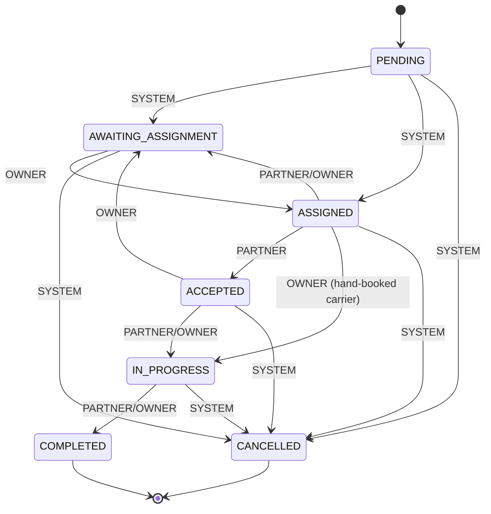
```mermaid
stateDiagram-v2
    [*] --> PENDING
    PENDING --> AWAITING_ASSIGNMENT: SYSTEM
    PENDING --> ASSIGNED: SYSTEM
    PENDING --> CANCELLED: SYSTEM
    AWAITING_ASSIGNMENT --> ASSIGNED: OWNER
    AWAITING_ASSIGNMENT --> CANCELLED: SYSTEM
    ASSIGNED --> ACCEPTED: PARTNER
    ASSIGNED --> AWAITING_ASSIGNMENT: PARTNER/OWNER
    ASSIGNED --> IN_PROGRESS: OWNER (hand-booked carrier)
    ASSIGNED --> CANCELLED: SYSTEM
    ACCEPTED --> IN_PROGRESS: PARTNER/OWNER
    ACCEPTED --> AWAITING_ASSIGNMENT: OWNER
    ACCEPTED --> CANCELLED: SYSTEM
    IN_PROGRESS --> COMPLETED: PARTNER/OWNER
    IN_PROGRESS --> CANCELLED: SYSTEM
    COMPLETED --> [*]
    CANCELLED --> [*]
```

OWNER is whoever controls that level (the seller, or the marketplace).

## 7.12 Operator warehouse-ERP connection (`backend/src/domain/erp-connection-state.ts`)

```mermaid
stateDiagram-v2
    [*] --> DRAFT
    DRAFT --> TESTING: START_TEST
    CONNECTED --> TESTING: START_TEST
    ACTIVE --> TESTING: START_TEST
    PAUSED --> TESTING: START_TEST
    ERROR --> TESTING: START_TEST
    TESTING --> CONNECTED: TEST_PASSED
    TESTING --> ERROR: TEST_FAILED
    CONNECTED --> ACTIVE: ACTIVATE
    ACTIVE --> PAUSED: PAUSE
    PAUSED --> ACTIVE: RESUME
    ACTIVE --> ERROR: SUSPEND (repeated failures)
    CONNECTED --> ERROR: SUSPEND
    TESTING --> ERROR: SUSPEND
    DRAFT --> DISABLED: DISABLE
    CONNECTED --> DISABLED: DISABLE
    ACTIVE --> DISABLED: DISABLE
    PAUSED --> DISABLED: DISABLE
    ERROR --> DISABLED: DISABLE
    DISABLED --> DRAFT: REOPEN
```

Editing from anywhere returns the connection to DRAFT. A passing test
started from ACTIVE or PAUSED returns to where it started (the service keeps
live connections live). At most one ACTIVE.

## 7.13 Buyer company status (`backend/src/domain/buyer-company-state.ts`)

Three actors: **APPLICANT** (a member with `MANAGE_APPLICATION`),
**REVIEWER** (staff with `buyer_company.review`, or `buyer_company.suspend`
for suspend and restore) and **SYSTEM** (the worker). A `*` means a reason
is required.

```mermaid
stateDiagram-v2
    [*] --> DRAFT
    DRAFT --> EMAIL_VERIFICATION_PENDING: applicant (email code needed)
    DRAFT --> SUBMITTED: applicant
    EMAIL_VERIFICATION_PENDING --> SUBMITTED: applicant
    EMAIL_VERIFICATION_PENDING --> DRAFT: applicant
    SUBMITTED --> AUTOMATED_CHECK_IN_PROGRESS: system
    SUBMITTED --> UNDER_REVIEW: reviewer, system
    SUBMITTED --> MORE_INFORMATION_REQUIRED: reviewer *
    SUBMITTED --> REJECTED: reviewer *
    AUTOMATED_CHECK_IN_PROGRESS --> UNDER_REVIEW: system, reviewer
    UNDER_REVIEW --> MORE_INFORMATION_REQUIRED: reviewer *
    UNDER_REVIEW --> APPROVED: reviewer
    UNDER_REVIEW --> REJECTED: reviewer *
    MORE_INFORMATION_REQUIRED --> RESUBMITTED: applicant
    MORE_INFORMATION_REQUIRED --> REJECTED: reviewer *
    RESUBMITTED --> AUTOMATED_CHECK_IN_PROGRESS: system
    RESUBMITTED --> UNDER_REVIEW: reviewer, system
    RESUBMITTED --> MORE_INFORMATION_REQUIRED: reviewer *
    RESUBMITTED --> REJECTED: reviewer *
    APPROVED --> SUSPENDED: reviewer, system *
    APPROVED --> REVERIFICATION_REQUIRED: reviewer, system *
    REJECTED --> DRAFT: applicant (if reapply allowed)
    SUSPENDED --> APPROVED: reviewer * (restore)
    SUSPENDED --> REVERIFICATION_REQUIRED: reviewer *
    SUSPENDED --> REJECTED: reviewer *
    REVERIFICATION_REQUIRED --> RESUBMITTED: applicant
    REVERIFICATION_REQUIRED --> APPROVED: reviewer *
    REVERIFICATION_REQUIRED --> SUSPENDED: reviewer, system *
```

**Only a reviewer can ever reach `APPROVED`**; the system never approves or
rejects. The applicant may edit in `DRAFT`, `EMAIL_VERIFICATION_PENDING`,
`MORE_INFORMATION_REQUIRED` and `REVERIFICATION_REQUIRED`. Only `APPROVED`
may buy. Every change is written with a status-history row, a timeline event
and an audit row, under an optimistic version check.

## 7.14 Product review status (`backend/src/modules/catalog/product-review.service.ts`)

Two states. A review is created `PUBLISHED`. Only staff with
`review.moderate` move it; a `*` means a reason is required.

```mermaid
stateDiagram-v2
    [*] --> PUBLISHED: buyer writes it
    PUBLISHED --> HIDDEN: staff *
    HIDDEN --> PUBLISHED: staff
    PUBLISHED --> [*]: buyer deletes it
    HIDDEN --> [*]: buyer deletes it
```

The buyer editing a review never changes its status. A hidden review counts
towards no average and is not shown publicly; its author sees it with the
reason.

## 7.15 Support ticket status (`backend/src/domain/support-ticket-state.ts`)

Five states. The status changes only through the assertions in this file; no
service writes it directly.

```mermaid
stateDiagram-v2
    [*] --> OPEN: sender raises it
    OPEN --> IN_PROGRESS
    OPEN --> WAITING_FOR_CUSTOMER
    OPEN --> RESOLVED
    OPEN --> CLOSED
    IN_PROGRESS --> WAITING_FOR_CUSTOMER
    IN_PROGRESS --> RESOLVED
    IN_PROGRESS --> CLOSED
    WAITING_FOR_CUSTOMER --> IN_PROGRESS
    WAITING_FOR_CUSTOMER --> RESOLVED
    WAITING_FOR_CUSTOMER --> CLOSED
    RESOLVED --> IN_PROGRESS
    RESOLVED --> CLOSED
    CLOSED --> [*]
```

- `OPEN` means sent and not yet picked up. It is never a target: nothing moves
  back to it.
- `CLOSED` is final. Nobody writes on it; a new problem is a new ticket.
- **Messages imply moves.** A staff reply on an `OPEN` ticket makes it
  `IN_PROGRESS` and, if nobody holds it, assigns it to whoever replied. The
  sender writing on `WAITING_FOR_CUSTOMER` or `RESOLVED` moves it to
  `IN_PROGRESS`.
- **Staff moves** need `support_ticket.reply`.
- **The sender sees other words:** Sent (`OPEN`), Being handled
  (`IN_PROGRESS`), Waiting for your reply, Resolved, Closed.

## 7.16 Commission invoice status (`backend/src/domain/commission-invoice-state.ts`)

Five states. The status changes only through `assertCommissionMove` in this
file; no service writes it directly.

```mermaid
stateDiagram-v2
    [*] --> DRAFT: generate
    DRAFT --> DRAFT: rebuild
    DRAFT --> ISSUED: issue (number taken)
    DRAFT --> VOID: discard
    ISSUED --> PARTIALLY_CREDITED: credit note (part)
    ISSUED --> FULLY_CREDITED: credit note (the rest)
    PARTIALLY_CREDITED --> PARTIALLY_CREDITED: credit note (part)
    PARTIALLY_CREDITED --> FULLY_CREDITED: credit note (the rest)
    ISSUED --> VOID: void (only if the setting allows and no credit notes)
    VOID --> [*]
    FULLY_CREDITED --> [*]
```

- **Nothing leaves `VOID` or `FULLY_CREDITED`.** An issued invoice never goes
  back to `DRAFT`; asking to rebuild, discard or re-issue it is answered
  `COMMISSION_INVOICE_IMMUTABLE`.
- **Live** means `DRAFT`, `ISSUED` or `PARTIALLY_CREDITED`. A settlement has at
  most one live invoice. Once an invoice is `VOID` or `FULLY_CREDITED`, a new
  one may be generated for the same seller order.
- A voided issued invoice keeps its number, recorded as `number_voided` in its
  history.
- The **collection status** (Payable by seller, Paid, Taken from settlement)
  is kept apart from this status and never changes the issued PDF.
- **The screens show other words:** Draft, Issued, Partly credited, Fully
  credited, Void.

---

# 8. Business rules

Enforced in code. Changing one is a deliberate decision, not an edit.

## 8.1 Money

| ID | Rule |
|---|---|
| BR-MON-001 | **Money is never a float.** Every amount is a BigInt of minor units, carried as a **string** on the wire (a total can exceed 2^53). No JS `number` in any money path. |
| BR-MON-002 | **A hundred is not the conversion.** Moving between minor and major units shifts digits by the **currency's own exponent** (JPY and KRW have 0). The API refuses to start if the currencies table and `domain/money.ts` disagree about an exponent. |
| BR-MON-003 | **Rounding is half-up** (away from zero at exactly half), once per step, through the shared money helpers. Store-wide quantity discounts round the discount **down** so "5% off" never charges more than 95%. |
| BR-MON-004 | **Apportionment uses largest remainder**, so per-line figures always sum to the total, never losing or inventing a minor unit. |
| BR-MON-005 | **An amount is never read in a currency it was not entered in.** Catalogue prices, coupon minimums and purchasing limits are per currency; there is no exchange rate in the ordering path (except the opt-in approximate derivation, FR-PRC-004, which is labelled and frozen on the order). |
| BR-MON-006 | **An order never moves again**: rate, mid-market, spread, provider, provider date and rounding-policy version are recorded; refunds read them, never today's rate. |

## 8.2 Price and tax

| ID | Rule |
|---|---|
| BR-PRC-001 | **The quoted price is the charged price.** The storefront quotes a stored figure; checkout reprices and refuses (`FULFILMENT_QUOTE_STALE`) if the total moved. |
| BR-PRC-002 | **A scheduled basket is priced by `quoteSchedule` and nothing else** — the review screen and the worker that charges weeks later call the same function. |
| BR-PRC-003 | **A quantity band is applied by `priceForQuantity` and nothing else** — basket, checkout, preorder, scheduled order and popover. A band never makes a line dearer than list; the band is frozen on the order item. |
| BR-PRC-004 | **Store-wide quantity discounts never touch a seller's product.** |
| BR-PRC-005 | **Tax is charged on the discounted amount**; coupons are apportioned before tax. |
| BR-PRC-006 | **Tax decisions are frozen on the order**: treatment, tax country, both VAT numbers, rate. |
| BR-PRC-007 | **A product with no price row in a currency is not sold in that market.** |
| BR-PRC-008 | **The server is the only authority on price.** The cart stores no prices; nothing trusts a number from a browser. |
| BR-PRC-009 | **What a line is counted in is decided by who sells it** (operator: carton of `PIECES_PER_CARTON`/`piecesPerCarton`; seller: pieces at their own minimum and step), from ownership and the offer's stored unit, never from a category or a string. |
| BR-PRC-010 | **The platform fee is a deduction from the seller's proceeds**, never added to the buyer's total. |
| BR-PRC-011 | **A bulk offer is shown only when it is a real saving.** A band whose effective price is not below list is never presented as an offer, and the offers a buyer sees are exactly the bands the basket would apply to them. Showing an offer reserves nothing; the basket and checkout re-price. |
| BR-PRC-012 | **An Individual buyer's B2C Maximum Order Quantity is decided by the server, per seller, per product, per order.** It adds every variant and every basket line of one seller's product together, is checked under a lock on the basket and again inside the checkout transaction, and exempts only an approved company context resolved from the session. It is a purchasing limit, never stock. Changing it never alters a placed order or trims a basket. |

## 8.3 Orders and payment

| ID | Rule |
|---|---|
| BR-ORD-001 | **Order status changes only through `assertTransition`.** No service writes `status`. |
| BR-ORD-002 | **An order is confirmed only by a signature-verified provider event** (or, in development only, the clearly marked mock). Never by a redirect, never by an admin button. |
| BR-ORD-003 | **A webhook is verified with the gateway it arrived from** (the `:provider` in the URL). |
| BR-ORD-004 | **Every admin cancellation needs `order.cancel`** and a reason, from every status. Rejecting an approval is separate (`order.approve`). |
| BR-ORD-005 | **One order per checkout** (idempotency key + body hash). |
| BR-ORD-006 | **Stock cannot oversell**: reservations inside the order transaction. |
| BR-ORD-007 | **Duplicate protection is structural** — unique indexes, not checks: `payment_events.providerEventId`, `idempotency_records(scope,key)`, `schedule_occurrences(scheduleId, plannedRunAt)`, `orders.scheduleOccurrenceId`, `refunds.idempotencyKey`, `notification_outbox.dedupeKey`, `preorder_requests.convertedOrderId`. |
| BR-ORD-008 | **Refunds can never exceed what was paid** (service, `chk_order_refund_within_paid`, provider). |
| BR-ORD-009 | **A paid order raises its own consignments, one per despatching building**; raising is idempotent and never fails a paid order. |
| BR-ORD-010 | **A stored card is charged off-session only with `OFF_SESSION` consent.** A card saved through Stripe Checkout's save box has `CHECKOUT` consent and is never charged off-session. |
| BR-ORD-011 | **The server decides what a card is charged**: the order's grand total minus what is paid, never an amount from the browser, and never rounded (`PAYMENT_AMOUNT_NOT_SUPPORTED` instead). |
| BR-ORD-012 | **One open payment attempt per order** (`uq_payment_open_attempt`); a second click, tab or retry joins the first or is told to wait (`PAYMENT_ATTEMPT_IN_PROGRESS`). |
| BR-ORD-013 | **Money becomes a confirmed order in one place only** (`applyCapturedPayment`), so webhook, *Check again* and reconcile cannot double-credit. |

## 8.4 Schedules and preorders

| ID | Rule |
|---|---|
| BR-SCH-001 | **Plan and occurrence status change only through `schedule-state.ts`.** |
| BR-SCH-002 | **Nothing returns to a pre-payment state from a paid one.** |
| BR-SCH-003 | **Minimum notice is counted in calendar days on the customer's own clock** (`SCHEDULE_MIN_NOTICE_DAYS`, default 7). |
| BR-SCH-004 | **Every occurrence is repriced and revalidated from scratch.** A price move beyond tolerance holds rather than charges. |
| BR-SCH-005 | **No "run now" button.** |
| BR-SCH-006 | **A new `ScheduleFrequency` member needs a migration** for `chk_schedule_frequency_field_present`. |
| BR-PRE-001 | **A preorder becomes an order only when the buyer confirms, only once**, naming the terms by hash; capacity is held with one conditional UPDATE; status only via `assertPreorderTransition`. |
| BR-PRE-002 | **A preorder is never faster than the schedule notice rule.** |
| BR-PRE-003 | **Only a seller-verified container capacity is offered to a buyer.** An estimate is never shown; a changed carton or count without re-verifying drops the size back to an estimate. |
| BR-PRE-004 | **The server decides every preorder figure.** The buyer sends the unit and the count only; extra fields are refused. Minimum, bands, capacity and stock use the total equivalent pieces. |
| BR-PRE-005 | **Available-to-promise never counts inbound or production stock**, and never goes below zero. |
| BR-PRE-006 | **A split delivery adds up exactly to the requested pieces**; the buyer's quantity is never changed or rounded, and the first shipment is never more than available-to-promise. |
| BR-PCH-001 | **Preorder chat is customer and operator staff only.** No seller route reads it and no seller is sent an event. Staff appear to the customer as "the {marketplace} team". |
| BR-PCH-002 | **A chat message binds nobody.** Only a preorder request, answered by the supplier and confirmed by its terms hash, is a commitment; a proposal only fills in the preorder form. |
| BR-PCH-003 | **Conversation status changes only through `preorder-chat-state.ts`.** Assignment is not a status; "unassigned" is `assignedAdminId IS NULL`. |
| BR-PCH-004 | **Nothing is announced before it is committed**, and the database is the source of truth: a page that missed an event catches up by sequence number. |
| BR-PCH-005 | **Internal notes never reach a customer**: separate table, no customer route, never on a customer socket. |
| BR-PRE-007 | **Preorder stock is held only when the buyer accepts**, in one transaction with a conditional decrement; if it is gone, nothing is reserved or charged and the seller must revise. A hold is released or handed over to the order, never reserved twice. |

## 8.5 Catalogue, packaging and freight

| ID | Rule |
|---|---|
| BR-CAT-001 | **Nothing is published by accident**: Active **and** Published; import can activate, never publish. |
| BR-CAT-002 | **No two variants of one product describe themselves the same way** (`unique(productId, optionSignature)`). |
| BR-CAT-003 | **A variant axis is a choice a buyer makes**, not a fact (size is an axis; country of origin is a specification; minimum order is a term; batch belongs to stock). |
| BR-CAT-004 | **Pack count is not cart quantity.** |
| BR-BULK-001 | **A bulk order stores base units, never packages**, with an immutable packaging snapshot. |
| BR-BULK-002 | **A package price must divide exactly** by the units inside it. |
| BR-BULK-003 | **No carrier API is ever asked to price a load it cannot carry**; pallets and containers on parcel carriers need a human quote; no shipping price is ever invented. |
| BR-CAT-005 | **Product HTML is never rendered raw** (sanitised on write and on display). |
| BR-CAT-006 | **The demonstration catalogue can only touch its own rows.** |
| BR-CAT-007 | **Only somebody who received a product may review it** (own order `DELIVERED` or `RETURNED`). One review per buyer per product; a hidden review stays hidden when edited; averages are computed on read, never stored. |

## 8.6 Tenancy, identity and security

| ID | Rule |
|---|---|
| BR-SEC-001 | **One seller cannot read another seller's data**: every owned row carries `sellerAccountId`; no route takes one from the caller. |
| BR-SEC-002 | **A carrier is whichever company its session says it is.** |
| BR-SEC-003 | **A seller's storefront is resolved from the Host header only.** |
| BR-SEC-004 | **A brand is one row; permission to sell it is one company's.** |
| BR-SEC-005 | **A listing decision applies to the revision that was reviewed.** |
| BR-SEC-006 | **The sign-in form is not a directory** (no enumeration). |
| BR-SEC-007 | **The console's session is never lengthened by lengthening anybody else's**; a sign-in has an absolute maximum age; a refresh token is spent once. |
| BR-SEC-008 | **A credential never follows a redirect off its origin.** |
| BR-SEC-009 | **A file is never called clean because nothing looked at it** (ClamAV in production). |
| BR-SEC-010 | **The audit log is append-only.** |
| BR-SEC-011 | **Error codes in `backend/src/domain/errors.ts` are a published contract** (about 340 codes, each mapped to a message in eight languages). Add new codes; never repurpose one. |
| BR-SEC-012 | **A table holding personal data is disclosed in the GDPR export** (or listed with a reason). |
| BR-SEC-013 | **Carrier credentials belong to each seller**; no operator env var holds one; a connection goes live only after a real call plus a person's confirmation. |
| BR-SEC-014 | **The buyer context is held on the server session and re-checked on every request.** The sign-in tab is a preference; a refused context switch always gets one generic answer. |
| BR-BCO-001 | **Buyer company status changes only through `transitionCompany`**, after `assertBuyerCompanyTransition`, with a history row and a version check. |
| BR-BCO-002 | **Only a person approves a company.** Automated checks inform the reviewer; a registry being unavailable is never a rejection. |
| BR-BCO-003 | **A company spends money in its own name only when `APPROVED`.** Before then its members may browse, fill its basket and edit its address book, nothing more. |
| BR-BCO-004 | **A registration number or identifier is claimed at approval, not at draft.** Duplicates before approval are reviewer signals; a second approval is refused. |
| BR-BCO-005 | **Identity documents, ownership declarations and bank details are never asked for by default.** Only a reviewer may request the first two, for one case; bank details are never collected. |
| BR-SUP-001 | **A support ticket is read only by the person who raised it** (and staff with `support_ticket.view`). It is found by the sender's user id and the surface it came from — plus the seller in Seller Hub and the carrier in the portal. Colleagues never see each other's tickets; another person's reference answers "not found". |
| BR-SUP-002 | **Who raised a ticket comes from the session, never the form**: name, account email, and the company, seller or carrier they were acting for. An order is linked only if it is the sender's own. |
| BR-SUP-003 | **Ticket status changes only through `support-ticket-state.ts`**; `CLOSED` is final. What the sender may see is decided when each event is written (`visibleToRequester`), so an internal note can never leak later. |
| BR-SUP-004 | **Support emails and the audit trail never carry message text**: emails carry the reference and a link; the audit records who did what, never the words or a file name. |

## 8.7 Seller documents and ERP

| ID | Rule |
|---|---|
| BR-SINV-001 | **An issued seller invoice is never edited**; numbering inside the issuing transaction; one live invoice per consignment; corrections by credit note. |
| BR-CINV-001 | **A commission invoice copies the settlement; it never recalculates the fee.** Rates come from fee policies, never from code or settings, and a client-sent figure is never used. |
| BR-CINV-002 | **One live commission invoice per commission event** (UNIQUE on the settlement while live); the number is taken inside the issuing transaction and a failed render uses none. |
| BR-CINV-003 | **An issued commission invoice is never edited**; corrections by credit note, which can never take it below zero. Voiding an issued one is off unless the setting allows it. |
| BR-CINV-004 | **Tax on the fee is shown only if its fee-policy tax rule is verified**, and never when the issuing entity is not registered for tax. |
| BR-ERP-001 | **A seller's TallyPrime is never dialled from this server.** |
| BR-ERP-002 | **"Connected" is a conclusion, never a stored flag.** |
| BR-ERP-003 | **An HTTP 200 from Tally is not a success.** |
| BR-ERP-004 | **On order is not on hand** in a buyer's ERP; on-hand moves only on goods receipt. |
| BR-ERP-005 | **A job is never destroyed by the worker that cannot run it** (it goes back to the queue). |

---

# 9. Non-functional requirements

## 9.1 Security (NFR-SEC)

| ID | Requirement | Status |
|---|---|---|
| NFR-SEC-001 | Passwords hashed with **Argon2id**; a dummy hash for unknown addresses keeps timing equal. | Built |
| NFR-SEC-002 | Session and refresh tokens in `httpOnly`, signed cookies; `secure` forced in production; `SameSite=lax`; `none` refused in production. | Built |
| NFR-SEC-003 | **Double-submit CSRF** on every write; the CSRF cookie is the only one JavaScript can read. | Built |
| NFR-SEC-004 | Each surface has its own cookie jar, a `users.type` check and a token **audience**; a credential for one surface is refused on another. | Built |
| NFR-SEC-005 | **Deny-by-default authorisation** on the server, per route, per permission; resource ownership for customers (other people's records answer 404). | Built |
| NFR-SEC-006 | Rate limits: global `RATE_LIMIT_GLOBAL_PER_MINUTE` (300), login 10 per 15 min, lockout after 8 failures for 15 min (counted in the database); per-endpoint limits (AI, image search, insights, quotes). | Built |
| NFR-SEC-007 | MFA (TOTP + recovery codes, replay-proof) mandatory for staff in production; mandatory for carrier Owners/Admins. | Built |
| NFR-SEC-008 | Stored secrets (gateway, ERP, carrier, DeepL keys) encrypted **AES-256-GCM with AAD** bound to the row, with `SECRETS_ENCRYPTION_KEY` (exactly 32 bytes); never returned to a browser after saving. | Built |
| NFR-SEC-009 | Tokens that must be verifiable but never replayed (invitations, resets, bridge tokens, pairing codes, carrier webhook secrets) stored as **SHA-256** only. | Built |
| NFR-SEC-010 | **SSRF protection** on every outbound call to an address somebody typed: http/https only; DNS resolved first; loopback, link-local (incl. `169.254.169.254`), private, CGNAT, multicast and IPv4-mapped IPv6 refused; the socket pinned to the validated address; redirects re-validated (max 3), the credential dropped off-origin. `ALLOW_PRIVATE_ERP_TARGETS` is development-only (refused in production). | Built |
| NFR-SEC-011 | Webhook signatures verified with HMAC over the **raw body** and `timingSafeEqual`; Stripe timestamp freshness enforced. | Built |
| NFR-SEC-012 | Uploads: type by magic bytes; SVG/HTML refused as images; size caps; private storage prefix; single-use, short-lived signed download links; **ClamAV scanning required in production** (`MALWARE_SCANNER_DRIVER=clamav`), unscanned downloads refused in production. | Built |
| NFR-SEC-013 | HTML sanitised by allowlist on write and again in the browser. | Built |
| NFR-SEC-014 | Logs redact credentials, tokens, signatures, card fields, address JSON and GPS coordinates, and mask a card number quoted inside free text or an error's message (including the line's own message when an error is logged); 500s disclose no stack, SQL or driver message. Held down by `tests/unit/logger-redaction.test.ts`. | Built |
| NFR-SEC-015 | Configuration is validated at boot (Zod); the process **refuses to start** on a bad or dangerous value (live key outside production, test key in production, mock payments in production, placeholder secrets, two identical secrets, `log` email driver, local storage, no ClamAV, MFA off). | Built |
| NFR-SEC-016 | The audit log and the transaction ledger (ledger_accounts, ledger_entries, ledger_lines) are append-only at the database (grants). | Built |
| NFR-SEC-017 | No raw card data ever touches the system (provider-hosted collection; tokens only). | Built |
| NFR-SEC-018 | Vulnerability disclosure policy in `SECURITY.md` (acknowledge in 2 working days, triage in 5; Critical fixed in 7 days) and a `security.txt` to publish. | Built (operator publishes) |
| NFR-SEC-019 | Penetration test and prompt-injection red-teaming of the AI features. | **Unverified** — not commissioned |

## 9.2 Privacy and data protection (NFR-PRV)

| ID | Requirement |
|---|---|
| NFR-PRV-001 | The operator is the data **controller**; the software gives the machinery (§5.21). |
| NFR-PRV-002 | Only strictly necessary cookies ship; no analytics, pixels or marketing email. |
| NFR-PRV-003 | Every optional third-party recipient (geocoder, FX feed, AI providers, gateways, SMTP) is off unless configured, and must be named in the operator's privacy notice. The AI assistant receives the catalogue and the visitor's question, never account or order data; the insights panel receives metrics only. |
| NFR-PRV-004 | Retention windows are settings (§10) and run automatically. |
| NFR-PRV-005 | Employee location tracking is off by default and needs a DPIA to switch on; driver GPS is a data-protection decision before a technical one. |
| NFR-PRV-006 | A new table with personal data fails CI until the GDPR export accounts for it. |

## 9.3 Accessibility (NFR-A11Y)

| ID | Requirement | Status |
|---|---|---|
| NFR-A11Y-001 | Target: **WCAG 2.1 AA** (EN 301 549, European Accessibility Act) for the storefront; the console held to the same standard. | Goal |
| NFR-A11Y-002 | Three automated layers in `npm run verify`: `eslint-plugin-jsx-a11y`, axe-core in vitest (with a guard test that proves axe can fail), and `npm run audit:contrast` for WCAG 1.4.3/1.4.11 on both themes. | Built |
| NFR-A11Y-003 | Charts always have a text/table alternative; nothing depends on colour alone; decoration is hidden from assistive technology; reduced-motion honoured. | Built |
| NFR-A11Y-004 | Wide tables are focusable regions; disclosure menus not fake ARIA menus. | Built |
| NFR-A11Y-005 | Keyboard operation, focus order and screen-reader behaviour independently tested against WCAG 2.2 AA. | **Unverified** — not done |

## 9.4 Internationalisation (NFR-I18N)

| ID | Requirement |
|---|---|
| NFR-I18N-001 | Eight languages: `en` English (default and fallback), `nl` Dutch, `fr` French, `de` German, `el` Greek, `it` Italian, `pl` Polish, `es` Spanish. |
| NFR-I18N-002 | Language is separate from country and currency. |
| NFR-I18N-003 | Plural forms follow CLDR (Polish needs four); placeholders are never dropped; one key per sentence; `<Trans>` for markup. |
| NFR-I18N-004 | Each language is a separate chunk (~3 KB gzipped); English is bundled. |
| NFR-I18N-005 | Formality: the formal register (Sie/usted/vous) is requested from DeepL; Greek register needs a human read. |
| NFR-I18N-006 | CI fails on any missing key in any language (`npm run check:i18n`, about 67,000 strings). |

## 9.5 Performance (NFR-PERF)

No load test exists, so **no throughput or latency figure is claimed** anywhere
in the repository. Proposed targets for an operator to measure against:

| ID | Proposed target |
|---|---|
| NFR-PERF-001 | Catalogue list and product page API p95 < 500 ms at normal load |
| NFR-PERF-002 | Checkout transaction p95 < 1.5 s excluding the gateway |
| NFR-PERF-003 | Worker claims a due job within `WORKER_POLL_INTERVAL_MS` (default 2 s) plus lease handling |
| NFR-PERF-004 | Storefront language chunk and first render usable on a mid-range phone on 4G |

Built-in efficiency choices: the AI catalogue snapshot is cached against a
catalogue stamp; the image-search index is cached for 60 s; exports are paged;
availability is never cached by a proxy.

## 9.6 Reliability (NFR-REL)

| ID | Requirement | Status |
|---|---|---|
| NFR-REL-001 | Jobs are claimed under a **lease** with a conditional UPDATE (works without `SKIP LOCKED` on MariaDB 10.4); several workers are safe; periodic work deduplicated on a UNIQUE time-slot key. | Built |
| NFR-REL-002 | Transient vs permanent error classification, retry with backoff (full jitter where stated), dead-lettering, lease reaping, circuit breakers for connectors and carriers. | Built |
| NFR-REL-003 | Transactional outbox: notifications and integration events written in the business transaction. | Built |
| NFR-REL-004 | A worker that does not know a job type returns it to the queue. | Built |
| NFR-REL-005 | Graceful shutdown with a 15 s ceiling, so an in-flight checkout commits. | Built |
| NFR-REL-006 | Degradation, not outage: AI down → shop works; warehouse options down → checkout works; image search failure → its own error codes, not a site banner. | Built |
| NFR-REL-007 | Backups: nightly encrypted off-site (`uboss-backup.timer`), binary logs every 15 minutes for point-in-time recovery (`uboss-binlog.timer`), a monitor (`uboss-monitor.timer`). RPO/RTO are **operator decisions** (`<APPROVE>` in the runbook). | Built (operator enables) |
| NFR-REL-008 | A screen that cannot be shown gets one full-page error in all three apps, for ten kinds (404, 401, 403, 408, 429, 500, 502, 503, offline, a file that failed to load). It never shows the technical message; it shows the server's reference number when there is one. "Try again" reloads the page and is offered only where that is safe; offline recovers on reconnection; a failed file offers one refresh, never an automatic loop. | Built |

## 9.7 Observability (NFR-OBS)

| ID | Requirement |
|---|---|
| NFR-OBS-001 | Prometheus metrics at `/metrics`: request latency and errors, queue and outbox depth, payment rejections, unreconciled payments, recurring outcomes, low stock. Route labels are registered paths, never URLs. |
| NFR-OBS-002 | `/health/live` (external uptime check) and `/health/ready` (dependency status without reasons; reasons go to the journal). |
| NFR-OBS-003 | Pino structured logs with correlation id on every response and redaction. |
| NFR-OBS-004 | `npm run check:ai` (exit 0/1/2) to prove the AI provider still answers; run on a schedule. |
| NFR-OBS-005 | The monitor timer checks worker liveness, queue backlog, backups and certificate expiry, calling `UBOSS_ALERT_COMMAND`. |

## 9.8 Database (NFR-DB)

| ID | Requirement |
|---|---|
| NFR-DB-001 | **MariaDB 10.4** in development (XAMPP, not strict); **MariaDB 11.4 LTS** (11.4.13 pinned in CI) in production. Check `backend/prisma/schema.prisma`'s header before assuming a feature. |
| NFR-DB-002 | No `SKIP LOCKED` reliance, no native UUID (ULID primary keys, `CHAR(26)`), and a UNIQUE index treats every NULL as distinct (no partial indexes; some single-row rules enforced in services). |
| NFR-DB-003 | 256 Prisma models; CHECK constraints guard business invariants (e.g. frequency fields, packaging arithmetic, refund within paid, single booking party). CHECK columns referenced by foreign keys use `ON UPDATE RESTRICT` (11.4 error 1901). |
| NFR-DB-004 | Migrations are applied with `prisma migrate deploy`; **never `prisma migrate dev`** against this schema. The test database needs its own migrate. Migration SQL files are LF. |
| NFR-DB-005 | Before a database change reaches a server, rehearse on 11.4: `.\scripts\db\compat-test.ps1`, `.\scripts\db\validate-data.ps1`. |
| NFR-DB-006 | The application user cannot rewrite the audit log or create tables (grants applied after every migration by `release.sh`). |

## 9.9 Deployment and operability (NFR-DEP)

| ID | Requirement |
|---|---|
| NFR-DEP-001 | Self-hosted: API and worker are long-lived processes on the operator's machine (systemd units shipped); the three front ends are static builds with a history fallback, on nginx or a static host (Netlify config shipped, with an API proxy under the same origin). |
| NFR-DEP-002 | Each front end ideally on its own host name; exact CORS allowlist; `strictPort` in development. |
| NFR-DEP-003 | Going live is an ordered checklist (README "Going live"): production mode, four distinct fresh secrets, migrate + grants + reference data, price every currency, enable gateway currencies, webhooks and secrets, customer terms per currency, build, history fallback, host names, delete seeded accounts, runbook, timers, external uptime check, `security.txt`, sandbox scores. |
| NFR-DEP-004 | CI on every pull request against MariaDB 11.4.13: typecheck, lint, tests, contrast audit, builds, schema/migration drift, grants, validation queries, flagged `DROP`/`TRUNCATE`, dependency audit, SBOM and secret scan. Deploy workflow is manual only. |
| NFR-DEP-005 | Development on Windows/PowerShell: `.\scripts\dev-stack.ps1` (and `-Status`, `-Restart`, `-Stop`, `-Tunnel`); one worker locally. |
| NFR-DEP-006 | Verification before committing: `cd backend ; npm run verify` (run alone — it truncates the shared test database), and `npm run verify` in each front end. |

## 9.10 Branding and UI quality (NFR-UI)

| ID | Requirement |
|---|---|
| NFR-UI-001 | Light and dark themes from design tokens, both contrast-audited. |
| NFR-UI-002 | Responsive layouts at phone width; signed-out screens show the earth on wide windows and a drawn globe otherwise. |
| NFR-UI-003 | The operator's name, never "Gloviaa Mart", heads a deployment that has a business profile. |
| NFR-UI-004 | No third-party component source whose licence forbids redistribution is shipped (the product is redistributed to every operator). |
| NFR-UI-005 | Full-page errors and the appearance control draw only from design tokens, so they follow the chosen theme; decorative motion stops under reduced motion; no picture on an error page is fetched from another site. |

---

# 10. Configuration and feature flags

All settings live in `backend/.env` and are validated at boot by
`backend/src/config/env.ts`. Defaults below are the **code** defaults.
Setting one in PowerShell for a single command:

```powershell
cd backend
$env:DATABASE_URL = 'mysql://root@127.0.0.1:3306/uboss_test'
npx prisma migrate deploy
Remove-Item Env:\DATABASE_URL
```

## 10.1 Feature flags (switch a capability on or off)

| Flag | Default | What it turns on |
|---|---|---|
| `FEATURE_CUSTOMER_SELF_REGISTRATION` | `false` | The storefront sign-up form (FR-IDN-002) |
| `CUSTOMER_SELF_REGISTRATION_REQUIRES_APPROVAL` | `true` | The sign-up approval gate; `false` = instant sign-in after email confirmation (FR-IDN-003) |
| `FEATURE_STOCK_RESERVATIONS` | `true` | Seeds the `stock_reservations` database flag (reserve stock at checkout) |
| `FEATURE_ORDER_APPROVALS` | `false` | Seeds the `order_approvals` database flag (route orders above a threshold to an approver) |
| `FEATURE_RECURRING_ORDERS` | `true` | Subscribe & Reorder |
| `FEATURE_SCHEDULED_ORDERS` | `true` | Buy Later |
| `FEATURE_SCHEDULE_ANY_PRODUCT` | `true` | Every published product may be scheduled; `false` = only ticked products |
| `FEATURE_SUBSCRIPTION_AUTOPAY` | `true` | Saved cards charged off-session for schedules (offered only once Stripe is connected) |
| `FEATURE_CUSTOMER_AUTOPAY` | `true` | The customer's standing Autopay authority with limits (needs the flag above and Stripe). Reported as `features.customerAutopay` in the public config, true only when both flags are on |
| `FEATURE_ERP_INTEGRATION` | `false` | Operator's warehouse ERP configured from **Settings → ERP** |
| `FEATURE_CUSTOMER_ERP` | `true` | Buyers connect their own ERP. Reported as `features.customerErp` in the public config |
| `FEATURE_SELLER_ERP` | `false` | Sellers connect TallyPrime (server half) |
| `FEATURE_SELLER_SETTLEMENT_STATEMENTS` | `false` | A daily job closes each finished period into seller settlement statements (FR-SEL-012). Needs `SELLER_SETTLEMENT_PAYABLE_AFTER_DAYS`; settings in §10.5 |
| `FEATURE_LOGISTICS_PORTAL` | `false` | The logistics partner portal and every `/logistics/*` route |
| `FEATURE_ADMIN_MFA` | `true` | Staff TOTP; must be `true` in production |
| `FEATURE_ADMIN_LOGIN_LOCATION` | `false` | Staff sign-in location requirement (needs HTTPS and a DPIA) |
| `ASSISTANT_ENABLED` | `true` | Master switch for AI Mode, image search and AI insights (still needs a key) |
| `ASSISTANT_ALLOW_GUESTS` | `false` | AI Mode answers visitors with no account |
| `FEATURE_BUYER_COMPANIES` | `true` | Individual/Company sign-in tabs, the company application, the context switcher and the **Company verification** review screens (FR-IDN-016, §5.1a). Settings in §10.11 |
| `PREORDER_OPEN_TO_ALL` | `true` | Preorders on every product (platform default terms; staff answer the operator's own) |
| `FEATURE_PREORDER_CHAT` | `true` | **Chat with {marketplace}** on product pages and the **Preorder Chats** inbox (FR-PCH). Tuning: `REALTIME_BUS_DRIVER` (`memory`; `database` for several API processes), `PREORDER_CHAT_TYPICAL_RESPONSE`, `OPERATOR_TEAM_NAME` (the operator team's name in chat and delivery levels; empty = the marketplace name), `PREORDER_CHAT_SLA_MINUTES` (240), `PREORDER_CHAT_EMAIL_DELAY_MINUTES` (10), `PREORDER_CHAT_MESSAGES_PER_MINUTE` (20), `PREORDER_CHAT_CONVERSATIONS_PER_HOUR` (10), `PREORDER_CHAT_MAX_MESSAGE_CHARS` (4000), `PREORDER_CHAT_ATTACHMENTS_ENABLED` (`true`), `PREORDER_CHAT_ATTACHMENT_MAX_BYTES` (10 MB), `PREORDER_CHAT_ALLOW_UNSCANNED_ATTACHMENTS` (`false`, refused in production), `PREORDER_CHAT_RETENTION_DAYS` (0 = keep) |
| `FEATURE_PRODUCT_REVIEWS` | `true` | **Product reviews** (FR-CAT-018): stars on cards and product pages, the review form, **Rate this product** on delivered orders and **Account → My reviews**. Reported as `features.productReviews` in the public config. Off refuses the storefront review routes; the console screen stays |
| `FEATURE_MESSAGE_TRANSLATION` | `false` | **Translate a message** (FR-MSG-004): a "Translate" action under messages in order, RFQ and preorder-chat threads, using the DeepL key stored under Settings → Catalogue translation (no other provider). Reported as `features.messageTranslation` (true only while a key is stored). Off refuses the translate routes with `MESSAGE_TRANSLATION_UNAVAILABLE`; nothing translated is ever stored |
| `FEATURE_RFQ` | `true` | **Requests for quotation** (§5.11b): the account's RFQ pages, "Request quotes" on category and product pages, and the Seller Hub inbox. Reported as `features.rfq`. Off refuses every RFQ route with `404 FEATURE_DISABLED` on both sides; nothing is deleted. Tuning: `RFQ_MAX_RESPONSE_DAYS` (90), `RFQ_MAX_MATCHED_SUPPLIERS` (25), `RFQ_MAX_INVITED_SUPPLIERS` (50), `RFQ_ATTACHMENT_MAX_BYTES` (10 MB), `RFQ_ATTACHMENTS_PER_RFQ` (40), `RFQ_ALLOW_UNSCANNED_ATTACHMENTS` (`false`; refused in production) |
| `FEATURE_SUPPORT_TICKETS` | `true` | **Support tickets** (§5.19a): the **Raise a ticket** form on the Support page in the storefront, Seller Hub and the portal. Reported as `features.supportTickets` in the public config. Off shows only the published contacts and refuses new tickets with `403 FEATURE_DISABLED`; existing tickets stay readable, senders can still reply and add files, and the console inbox keeps working. Settings in §10.12 |
| `critical_action_approval` (database flag, **Settings → Feature flags**) | on | Maker-checker for deactivating a customer, suspending or refusing a seller and suspending a buyer company (FR-SET-003). Off = one member of staff acts alone |
| `PAYMENT_MOCK_SUCCESS` | `false` | Development-only "Mark this order as paid" test path |
| `ENABLE_DEMO_CATALOG` | `true` outside production, `false` in production | Shows the demonstration catalogue |
| `SELLER_ERP_ALLOW_DIRECT_MODE` | `false` | Direct Tally URL mode for private networks (needs `SELLER_ERP_DIRECT_HOST_SUFFIXES`) |
| `ALLOW_PRIVATE_ERP_TARGETS` | `false` | Development only: ERP addresses on private networks |
| `SELLER_ALLOW_UNSCANNED_DOCUMENTS` | `false` | Open seller documents no scanner has seen (refused in production) |
| `LOGISTICS_ALLOW_UNSCANNED_DOCUMENTS` | `false` | Same for carrier documents |
| `ERP_VERIFY_STOCK_BEFORE_CHARGE` | `true` | Check ERP stock before charging |

Database-held switches (changed in the console, not `.env`): the database
feature flags above (`feature_flag.write`), `business_profile.vatCountry` (EU
VAT), `gpsrEnforced`, `mdrEnforced`, automatic exchange-rate updates and
`deriveMissingPrices`, `seller.allowSellerEditedTitles`.

## 10.2 Settings that must agree (origins and URLs)

| Variable | Default / must be |
|---|---|
| `API_PUBLIC_URL` | The API's public URL (required) |
| `ADMIN_WEB_ORIGIN` / `CUSTOMER_WEB_ORIGIN` / `LOGISTICS_WEB_ORIGIN` | Exact origins (`http://localhost:5173` / `5174` / `5175`) |
| `CUSTOMER_WEB_PUBLIC_URL` / `ADMIN_WEB_PUBLIC_URL` / `LOGISTICS_WEB_PUBLIC_URL` | Where emailed links point; the logistics one is required when the portal is on. `CUSTOMER_WEB_PUBLIC_URL` is also where Stripe returns paying customers who did not pay from another configured storefront origin, so in production it must be `https` or the backend refuses to start |
| `VITE_API_BASE_URL` (each app) | `http://localhost:4000/api/v1` |
| `STORAGE_PUBLIC_BASE_URL` | `/media` in development (root-relative) |
| `SELLER_STOREFRONT_DOMAIN` | Empty = no seller shop fronts |

## 10.3 Sessions and security

| Variable | Default |
|---|---|
| `SESSION_COOKIE_SECRET`, `ACCESS_TOKEN_SECRET`, `REFRESH_TOKEN_SECRET` | ≥ 32 chars, all different |
| `SECRETS_ENCRYPTION_KEY` | Exactly 32 bytes, base64 |
| `ACCESS_TOKEN_TTL_SECONDS` | 3600 |
| `ADMIN_ACCESS_TOKEN_TTL_SECONDS` | 900 |
| `REFRESH_TOKEN_TTL_SECONDS` | 2,592,000 (30 days) |
| `SESSION_ABSOLUTE_TTL_SECONDS` | 7,776,000 (90 days) |
| `SELLER_HUB_IDLE_TIMEOUT_SECONDS` | 3600 (60 minutes; allowed 300–86,400) |
| `SELLER_HUB_IDLE_WARNING_SECONDS` | 300 (5 minutes; must be shorter than the idle limit) |
| `COOKIE_SECURE` / `COOKIE_SAME_SITE` / `COOKIE_DOMAIN` | `false` (must be `true` in production) / `lax` / empty |
| `RATE_LIMIT_GLOBAL_PER_MINUTE` / `RATE_LIMIT_LOGIN_PER_15MIN` | 300 / 10 |
| `LOGIN_LOCKOUT_THRESHOLD` / `LOGIN_LOCKOUT_MINUTES` | 8 / 15 |
| `MALWARE_SCANNER_DRIVER` | `disabled` (must be `clamav` in production) |

## 10.4 Infrastructure

| Variable | Default |
|---|---|
| `NODE_ENV` | `development` |
| `API_PORT` / `API_HOST` | 4000 / `127.0.0.1` |
| `DATABASE_URL` / `DB_POOL_SIZE` | required / 10 |
| `DATABASE_MAINTENANCE_URL` | unset in development (the main connection is used). **Required in production** and must be a different account: the only account allowed to blank an erased person's email/IP/user agent on audit rows and to delete audit rows past retention (see `docs/DATABASE-PRODUCTION.md` §6) |
| `QUEUE_DRIVER` / `CACHE_DRIVER` | `database` / `memory` (the Redis driver is a deliberate throw, not an implementation) |
| `WORKER_POLL_INTERVAL_MS` / `WORKER_CONCURRENCY` / `WORKER_LEASE_SECONDS` | 2000 / 4 / 60 |
| `STORAGE_DRIVER` | `local` (must be `s3` in production) |
| `UPLOAD_MAX_BYTES` / `UPLOAD_VIDEO_MAX_BYTES` | 5 MiB / 64 MiB |
| `EMAIL_DRIVER` | `log` (must be `smtp` in production); `EMAIL_FROM_NAME`, `EMAIL_FROM_ADDRESS` required |
| `DEFAULT_CURRENCY` / `DEFAULT_TIMEZONE` | `INR` / `Asia/Kolkata` |
| `PIECES_PER_CARTON` | Default carton size for imports that know a product is cartoned but not by how many |

## 10.5 Payments and schedules

| Variable | Default |
|---|---|
| `PAYMENT_DEFAULT_PROVIDER` | `razorpay` |
| `RAZORPAY_KEY_ID/SECRET/WEBHOOK_SECRET`, `STRIPE_PUBLISHABLE_KEY/SECRET_KEY/WEBHOOK_SECRET` | empty (development fallback; production uses **Integrations**). Stripe's mode (test or live) comes from the key prefix. Missing Stripe keys: the payment page says card payment is not set up yet |
| `PAYMENT_LINK_TTL_HOURS` | 72 |
| `AUTOPAY_CONSENT_VERSION` / `AUTOPAY_PLATFORM_MAX_MINOR` | `v1` / 0 (no ceiling) |
| `SCHEDULE_PRICE_TOLERANCE_PERCENT` / `_MINOR` | 5 / 500 |
| `SCHEDULE_EDIT_CUTOFF_MINUTES` | 1440 |
| `SCHEDULE_MATERIALISE_AHEAD_DAYS` | 35 |
| `SCHEDULE_REMINDER_LEAD_HOURS` | 48 |
| `SCHEDULE_MAX_PAYMENT_ATTEMPTS` | 3 |
| `SCHEDULE_MIN_NOTICE_DAYS` | 7 |
| `FULFILMENT_QUOTE_TTL_MINUTES` | 15 |
| `SELLER_SETTLEMENT_PERIOD` | `MONTHLY` (1st 00:00 UTC to the next 1st); `WEEKLY` is Monday 00:00 UTC to the next Monday |
| `SELLER_SETTLEMENT_PAYABLE_AFTER_DAYS` | **No default** (0–365). The return window. Required when `FEATURE_SELLER_SETTLEMENT_STATEMENTS` is on — the service refuses to start without it |

## 10.6 Preorders

| Variable | Default |
|---|---|
| `PREORDER_MIN_NOTICE_DAYS` | 7 (never below the schedule notice) |
| `PREORDER_REQUEST_EXPIRY_HOURS` | 72 |
| `PREORDER_OFFER_EXPIRY_HOURS` | 120 |
| `PREORDER_PAYMENT_EXPIRY_HOURS` | 168 |
| `PREORDER_RISK_WINDOW_DAYS` | 3 |
| `PREORDER_DEFAULT_LEAD_DAYS` | 14 |
| `PREORDER_DEFAULT_MAX_ADVANCE_DAYS` | 365 |
| `PREORDER_PROPOSAL_MAX_EXPIRY_HOURS` | 720 (the longest a revised-date or split-delivery proposal may stay open) |
| `CONTAINER_20FT_MAX_PAYLOAD_KG` | 28200 (heaviest cargo a seller's 20-ft loading may state) |
| `CONTAINER_40FT_MAX_PAYLOAD_KG` | 26700 (the same for 40-ft) |

## 10.7 AI

| Variable | Default |
|---|---|
| `ASSISTANT_PROVIDER` | empty (use whichever key is set), or `gemini` / `anthropic` |
| `GEMINI_API_KEY` / `GEMINI_MODEL` | empty / `gemini-3.8-flash` |
| `ANTHROPIC_API_KEY` / `ANTHROPIC_MODEL` | empty / `claude-opus-5` |
| `ASSISTANT_MAX_TOKENS` / `ASSISTANT_MAX_TURNS` / `ASSISTANT_RATE_LIMIT_PER_5MIN` | 400 / 20 / 20 |
| `ASSISTANT_GUEST_RATE_LIMIT_PER_5MIN` / `ASSISTANT_GUEST_MESSAGE_LIMIT` | 10 / 5 |

## 10.8 ERP

| Variable | Default |
|---|---|
| Operator ERP: `ERP_ORDER_CONNECTION_NAME`, `ERP_ORDER_PATH` (`/orders`), `ERP_STOCK_PATH` (`/stock/availability`), `ERP_ORDER_REFERENCE_PATH` (`id`), `ERP_IDEMPOTENCY_HEADER` (`Idempotency-Key`), `ERP_ORDER_MAX_ATTEMPTS` (8), `ERP_MAX_CONNECTIONS` (5), `ERP_MAX_ATTEMPTS` (6), `ERP_MAX_SYNC_RECORDS` (5000), `ERP_MAX_RECORD_ERRORS` (50), `ERP_FAILURE_THRESHOLD` (5) | |
| Buyer ERP: `CUSTOMER_ERP_MAX_CONNECTIONS_PER_ORG` (5), `_MAX_ATTEMPTS` (6), `_RETRY_BASE_SECONDS` (30), `_RETRY_MAX_SECONDS` (3600), `_FAILURE_THRESHOLD` (5), `_MAX_SYNC_RECORDS` (5000), `_MAX_RESPONSE_BYTES` (2 MiB), `_OAUTH_STATE_TTL_SECONDS` (900), `_OAUTH_REDIRECT_URI`, `_ALLOWED_HOST_SUFFIXES`, `_INVITE_TTL_HOURS` (168); `MONDAY_OAUTH_CLIENT_ID/SECRET/SCOPES` | |
| Seller Tally: `SELLER_ERP_MAX_CONNECTIONS` (5), `_PAIRING_TTL_MINUTES` (15), `_PAIRING_MAX_ATTEMPTS` (5), `_PAIRING_RATE_PER_HOUR` (10), `_BRIDGE_TOKEN_TTL_DAYS` (180), `_TASK_LEASE_SECONDS` (300), `_TASK_BATCH_SIZE` (5), `_MAX_ATTEMPTS` (8), `_RETRY_BASE_SECONDS` (30), `_FAILURE_THRESHOLD` (5), `_DIRECT_HOST_SUFFIXES`, `_MAX_RESPONSE_BYTES` (8 MiB) | |

## 10.9 Logistics, maps and geocoding

| Variable | Default |
|---|---|
| `LOGISTICS_ASSIGNMENT_RESPONSE_HOURS` / `LOGISTICS_INVITE_TTL_HOURS` | 24 / 48 |
| `LOGISTICS_TRIP_TOKEN_TTL_HOURS` | 14 |
| `LOGISTICS_PING_INTERVAL_SECONDS` / `_MAX_AGE_MINUTES` / `_MAX_SPEED_KMH` | 60 / 120 / 200 |
| `LOGISTICS_WEBHOOK_MAX_ATTEMPTS` / `LOGISTICS_CARRIER_FAILURE_THRESHOLD` | 6 / 5 |
| `LOGISTICS_DOCUMENT_URL_TTL_SECONDS` | 300 |
| `DELIVERY_COVERAGE_RADIUS_KM` | 500 |
| `MAP_TILE_URL`, `MAP_STYLE_URL`, `MAP_SATELLITE_URL` (+ attributions), `MAP_GOOGLE_API_KEY`, `MAP_GOOGLE_MAP_ID` | empty (maps work without a provider) |
| `GEOCODE_REVERSE_URL` / `GEOCODE_FORWARD_URL` / `GEOCODE_TIMEOUT_MS` | Nominatim by default / Nominatim by default / 5000; empty switches off |

## 10.10 Exchange rates, VAT and data retention

| Variable | Default |
|---|---|
| `FX_RATE_URL` | `https://open.er-api.com/v6/latest/{base}` |
| `FX_ECB_URL`, `FX_RATE_TIMEOUT_MS` (10 s), `FX_RATE_MAX_ATTEMPTS` (3), `FX_SNAPSHOT_RETENTION_DAYS` (730) | |
| `VIES_CHECK_URL` / `VIES_TIMEOUT_MS` | EU VIES / 10 s; empty = no checking (all taxed) |
| `RETENTION_ABANDONED_CART_DAYS` | 90 |
| `RETENTION_ASSISTANT_CONVERSATION_DAYS` | 180 |
| `RETENTION_AUDIT_LOG_DAYS` | 730 |
| `RETENTION_SENT_NOTIFICATION_DAYS` | 365 |
| `RETENTION_SESSION_LOCATION_DAYS` | 90 |
| `RETENTION_LOGISTICS_LOCATION_PING_DAYS` | 30 |
| `RETENTION_JOB_HISTORY_DAYS` / `RETENTION_PAYMENT_EVENT_DAYS` / `RETENTION_EXPIRED_SESSION_DAYS` | 7 / 730 / 30 |
| `DATA_REQUEST_DOWNLOAD_TTL_HOURS` | 72 |
| `UNSPLASH_ACCESS_KEY`, `DEMO_CATALOG_PRODUCT_COUNT` (6) | Demonstration catalogue photographs |

Leftover names read by nothing: `DHL_API_KEY`, `FEDEX_CLIENT_ID` and similar in
`.env.example` — carrier credentials are per seller.

## 10.11 Buyer companies

| Variable | Default | Meaning |
|---|---|---|
| `FEATURE_BUYER_COMPANIES` | `true` | The whole feature (§10.1). The public config reports it as `features.buyerCompanies` |
| `BUYER_COMPANY_MAX_OPEN_APPLICATIONS` | 3 | Unfinished applications per person |
| `BUYER_COMPANY_INVITE_TTL_HOURS` | 168 | Hours an invitation to join a company can be accepted; resending restarts it |
| `BUYER_COMPANY_DOCUMENT_MAX_BYTES` | 10,000,000 | Largest document upload |
| `BUYER_COMPANY_DOCUMENT_MAX_PAGES` | 50 | Most pages in a PDF |
| `BUYER_COMPANY_ALLOW_UNSCANNED_DOCUMENTS` | `false` | Serve documents no scanner has cleared. Development only; refused in production |
| `BUYER_COMPANY_SECOND_REVIEW_RISK` | `OFF` | `OFF`, `ELEVATED` or `HIGH`: the risk at which two different reviewers must approve |
| `BUYER_COMPANY_CONSENT_VERSION` | `2026-09` | Version stamped on each declaration. Change it whenever the wording changes |
| `BUYER_COMPANY_GLEIF_URL` | `https://api.gleif.org/api/v1/lei-records/{lei}` | LEI check. Blank switches it to manual |
| `BUYER_COMPANY_PL_VAT_URL` | Polish Ministry of Finance VAT whitelist | Blank switches it to manual |
| `BUYER_COMPANY_PL_KRS_URL` | Polish KRS open API | Blank switches it to manual |
| `BUYER_COMPANY_REGISTRY_TIMEOUT_MS` | 10000 | Time limit for each registry call |
| `VIES_CHECK_URL` | EU VIES (§10.10) | Reused for the EU VAT check on company applications |

## 10.12 Support tickets

| Variable | Default | Meaning |
|---|---|---|
| `FEATURE_SUPPORT_TICKETS` | `true` | Raising new tickets (§10.1). The public config reports it as `features.supportTickets` |
| `SUPPORT_TICKETS_PER_DAY` | 10 | New tickets one account may raise in a day (1–200). Beyond it: `SUPPORT_TICKET_LIMIT_REACHED` |
| `SUPPORT_ATTACHMENTS_ENABLED` | `true` | Files on tickets |
| `SUPPORT_ATTACHMENT_MAX_BYTES` | 26,214,400 (25 MB) | Largest file |
| `SUPPORT_ALLOW_UNSCANNED_ATTACHMENTS` | `false` | Accept files with no malware scanner configured. Development only; refused in production |

---

# 11. Integrations

| Integration | Purpose | Optional? | Configured by | Status |
|---|---|---|---|---|
| **Stripe** | Cards via Stripe-hosted Checkout (saved cards offered on Stripe's page), Autopay card enrolment (Payment Element + SetupIntent), off-session Autopay, refunds, disputes, webhooks | One gateway required to take payment | Integrations screen (encrypted); `.env` fallback in development; payment methods, branding and webhook events in the Stripe Dashboard | Built. India-registered accounts: invite-only; non-INR payments need export opt-in, a purpose code and an IEC — verify in the live Dashboard |
| **Razorpay** | Cards, UPI, saved cards inside Razorpay's sheet, refunds, webhooks | As above. Not an EEA acquirer — use Stripe for EU trade | Integrations screen | Built; verified against the live TEST API |
| **SMTP** | All email | Required in production | `EMAIL_DRIVER=smtp`, `SMTP_*` | Built |
| **Gemini** (Google AI Studio) | AI Mode, image search, insights | Optional | `GEMINI_API_KEY`, `GEMINI_MODEL` | Built; free-tier quota is per model — use `check:ai` |
| **Anthropic** | Same, alternative provider | Optional | `ANTHROPIC_API_KEY`, `ANTHROPIC_MODEL` | Built |
| **DeepL** | Catalogue translation (console); interface translation (build script `scripts/auto-translate.mjs`) | Optional | Key pasted in Settings (encrypted) / `$env:DEEPL_API_KEY` for the script | Built |
| **Exchange-rate feed** (open.er-api / ECB) | Bulk conversion pre-fill, daily refresh, derived prices | Optional | `FX_RATE_URL`, `FX_ECB_URL`, Settings | Built |
| **EU VIES** | VAT number validation; also the EU VAT check on company applications | Optional (off = everything taxed; the company check becomes manual) | `VIES_CHECK_URL` | Built |
| **GLEIF** (LEI records) | Company application check: the Legal Entity Identifier | Optional (blank = manual) | `BUYER_COMPANY_GLEIF_URL` | Behind `FEATURE_BUYER_COMPANIES`; official, free, no key |
| **Polish VAT whitelist** (Ministry of Finance, wl-api.mf.gov.pl) | Company application check: NIP and VAT status. Bank accounts, home addresses and people in the answer are dropped | Optional (blank = manual) | `BUYER_COMPANY_PL_VAT_URL` | Behind `FEATURE_BUYER_COMPANIES`; official, free, no key |
| **Polish KRS** (api-krs.ms.gov.pl) | Company application check: the court register, registers P then S | Optional (blank = manual) | `BUYER_COMPANY_PL_KRS_URL` | Behind `FEATURE_BUYER_COMPANIES`; official, free, no key |
| **CEIDG, REGON (GUS BIR), India MCA / GST / PAN / Udyam / IEC, EU BRIS, EORI** | Company application checks for these registers | — | — | **Not built** as live checks (they need a token, a key or a contract, or have no public interface). Shown to the reviewer as manual checks with the official link |
| **Geocoder** (Nominatim by default) | Reverse (staff location), forward (address suggestions) | Optional | `GEOCODE_*` | Built |
| **Map tiles** (MapLibre sources, Google Maps) | Warehouse map basemap | Optional | `MAP_*` | Built |
| **Operator's warehouse ERP** | Order push, stock check | Optional | Env vars or Settings → ERP (`FEATURE_ERP_INTEGRATION`) | Built |
| **Buyers' ERPs** (SAP, monday.com, Odoo, custom REST/OData/GraphQL; 20 presets) | Purchase orders, shipments, receipts, invoices, payment refs | Optional | Each buyer (`FEATURE_CUSTOMER_ERP`) | Built |
| **TallyPrime** via Gloviaa Mart Tally Bridge | Seller accounting vouchers | Optional | Each seller (`FEATURE_SELLER_ERP`) | Server built; **bridge program not in this repository**; never tested on a real Tally |
| **DHL** | Rates, consignment, tracking, address check, collection | Optional, per seller | Seller Hub (encrypted per seller) | Built, unconfigured by design; sandbox only |
| **FedEx** | Rates, consignment, cancel, tracking, address check | Optional, per seller | Seller Hub | Built, unconfigured by design; never called |
| **India Post** | Manual article-number tracking | Optional | Seller Hub | Manual by design (no official API) |
| **UPS** | Declared as a parcel carrier in freight routing | — | — | Named in freight rules; no seller connection described |
| **Carrier webhooks (portal partners)** | Status events from a carrier's own system | Optional | Logistics → Integrations | Behind `FEATURE_LOGISTICS_PORTAL` |
| **ClamAV** | Upload malware scanning | **Required in production** | `MALWARE_SCANNER_DRIVER=clamav`, socket | Built; host must install and test it |
| **S3-compatible storage** | Durable uploads, exports | **Required in production** | `STORAGE_DRIVER=s3`, `S3_*` | Built |
| **Unsplash** | Demo catalogue photographs | Optional | `UNSPLASH_ACCESS_KEY` | Built |
| **Payout provider** (Stripe Connect or similar) | Pay sellers | — | — | **Not built** (`PROVIDER_UNCONFIGURED`). The operator is merchant of record; Stripe Connect's fund-splitting charge types are not supported for India-registered platforms |
| **Peppol / SdI / KSeF / IRP** | E-invoicing transport and registration | — | — | **Not built** (UBL document is produced; transport is not) |
| **SMS provider** | SMS notifications and phone-change links | Optional | `SMS_HTTP_URL`, `SMS_HTTP_TOKEN`, `SMS_SENDER_ID` | Built (any HTTPS gateway; notifications go only for events the operator switched SMS on for) |
| **Google sign-in** | People's OAuth sign-in | — | — | **Not built** |

---

# 12. Out of scope, known gaps, risks, assumptions and open questions

## 12.1 Out of scope (by decision)

- Hosting the operator's shop as SaaS; multi-operator tenancy.
- Guest checkout; B2C consumer features (reviews, marketing email, tracking pixels).
- Storing card data; holding a PCI scope.
- Automatic shipping prices for pallets and containers.
- Preorder deposits and proforma invoices.
- Live vehicle tracking (this release).
- Runtime interface translation.
- A perceptual image-similarity index.
- MDR quality-management, clinical evaluation and vigilance.
- A "run this schedule now" button.
- Drivers for external carriers.

## 12.2 Known gaps (not built or partial)

| # | Gap | What it blocks | Source |
|---|---|---|---|
| M1 | **More than one buyer per buying business** (shared ordering, shared limits). **Partial:** verified buyer companies with company roles, a server-held buyer context and member invitations (FR-BCO-019) are built (§5.1a); **approving another member's order, company finance screens and shared limits are not built** | Procurement teams | PRODUCT-READINESS §4 |
| M8 | **Recurring and scheduled orders in company context** (refused with `BUYER_CONTEXT_UNSUPPORTED`) | Standing orders bought for a company | FR-BCO-015 |
| M9 | **Company tax treatment** — tax and VAT in company context still use the person's own profile | Zero-rating on the company's own VAT number | FR-BCO-015 |
| M10 | **Live CEIDG, REGON and Indian registry checks** — manual with official links | Faster review for Polish sole traders and Indian businesses | FR-BCO-008 |
| M11 | **Storefront in-app notifications**; project-wide emails other than the nine buyer-company emails are English-only | Applicants who miss an email | FR-BCO-016 |
| M2 | **Continue with Google** | Low-friction sign-up | §4 |
| M3 | **Seller payouts** (money does not move; needs D13 marketplace role decision). Settlement statements are built behind `FEATURE_SELLER_SETTLEMENT_STATEMENTS`, but paying one is refused | Paying third-party sellers — a launch blocker for a paying marketplace | §4 |
| M4 | Customer erasure policy — code exists (§5.21) but the readiness audit still lists it missing; needs an approved "what delete means" policy | Art. 17 on accounts with orders | §4, Appendix A |
| M5 | **KSeF** (Polish e-invoicing) | Selling from a Polish establishment | §4 |
| M6 | **SMS** | Phone as a channel or second factor | §4 |
| M7 | Malware scanning — ClamAV now required in production per the code; the readiness audit still describes it as missing | Policy requiring scanning | Appendix A |
| G1 | Freight quote from a cart before an order exists | Pre-purchase freight pricing | §2.7a |
| G2 | Bulk packaging on a recurring schedule | Standing pallet orders | §2.7a |
| G3 | Admin screen for a bulk line (data exists) | Staff reading pallet breakdowns | §2.7a |
| G4 | Tally receipts, credit notes, master upserts not enqueued; scheduled inventory pull not scheduled; admin view of seller Tally | Full seller accounting sync | §2.9a |
| G5 | Gloviaa Mart Tally Bridge program | Any real Tally connection | §2.9a |
| G6 | E-invoicing transport, OSS/Intrastat, distance-selling threshold, proof-of-export | EU mandates | EU-VAT.md §7 |
| G7 | GST IRP/IRN registration | Sellers above the e-invoicing threshold | README |
| G8 | Server rendering / prerender for link previews | Rich previews in chat apps | README |
| G9 | Customer self-service return request screen | Buyer-initiated returns (staff record them today) | Code search |
| G10 | GPSR pictograms, batch/serial capture, Safety Gate reporting | Some product-safety duties | PRODUCT-SAFETY.md |
| G11 | Documentation of seller logistics levels (L1–L4) in README and PROJECT-GUIDE | Readers of those guides | Appendix A |
| G12 | Support tickets: guest tickets without an account, staff attaching files to a reply, live (websocket) updates on a ticket, a console editor for the SLA targets (the deadlines themselves are built) | Visitors who cannot sign in (they use the published email); staff sending a document back; seeing a reply without reloading; setting response-time targets without calling the API | FR-SUP-012 |
| G13 | Commission invoices: sending them to the seller (Seller Hub screen or email), GST IRP/IRN registration of them, and automatic credit notes on a refund | Sellers reading their own commission invoices; operators above the e-invoicing threshold | FR-CINV-012 |
| G14 | **Closed 29 Sep 2026.** Delivery codes (OTP) are now emailed to the buyer when a shipment goes out for delivery, and can be re-sent from the portal within limits | — | FR-LOG-006 |
| G15 | **Closed 29 Sep 2026.** A driver can open the shipment page for a stop on their own round and complete it; still not the company's other shipments | — | FR-LOG-006 |

## 12.3 Risks

| # | Risk | Likelihood / impact | Mitigation in product | Owner action |
|---|---|---|---|---|
| R1 | Carrier adapters fail against a real contract (DHL sandbox only, FedEx never called) | Medium / High | Two-gate go-live; honest statuses | First seller connection is a supervised test |
| R2 | TallyPrime never tested live (RR-9) | Medium / High | Server-side counter checks, triple idempotency | Pilot with one seller |
| R3 | AI key silently stops working (quota per model) | High / Low | Deterministic fallback; `check:ai` | Schedule `check:ai`; enable billing |
| R4 | Prompt injection through AI Mode or image search | Unknown / Medium | Catalogue-only context, verified cards, validated output | Commission a red-team |
| R5 | No load test | Unknown / Medium | Aggregates, paging, leases | Load-test before a large launch |
| R6 | Machine-translated catalogues unreviewed | High / Medium | On-screen notice | Native-speaker review per market |
| R7 | Seeded VAT rates out of date | Medium / High | Rates as periods; blocking on missing bands | Verify against the Commission table |
| R8 | Development passwords in the repository reach a reachable host | Medium / High | `db:rotate-seed-passwords`; production refuses to seed carriers | Delete seeded accounts before going live |
| R9 | Enabling staff location or driver GPS without a DPIA | Low / High (legal) | Off by default | DPIA, works council |
| R10 | Payout provider missing at marketplace launch | High / High | Refuses rather than pretends | Decide D13, integrate a provider |
| R11 | Two verify runs share the test database | Medium / Low | Suite refuses `DATABASE_URL` | Run backend tests alone |

## 12.4 Assumptions

- The operator runs MariaDB 11.4 in production and has HTTPS for every surface.
- The operator configures at least one payment gateway with a webhook secret, SMTP, S3-compatible storage and ClamAV before going live.
- Buyers are businesses; one person per individual buying account is acceptable. A buyer company may have many members (FR-BCO-019).
- The operator enters a real price per currency for every market it sells in.
- Tax rates, thresholds and filings are checked with the operator's accountant.
- Sellers who want API carriers hold their own commercial carrier accounts.

## 12.5 Open questions

| # | Question | Why it matters |
|---|---|---|
| Q1 | What is the marketplace payment role — merchant of record, facilitator or collector (D13)? As built, the operator is merchant of record and collects every payment; paying sellers out is not built, and Stripe Connect's split-payment forms are not available to India-registered platforms. | Decides the payout provider and tax on seller sales |
| Q2 | Should staff MFA-equivalent be mandatory for sellers (the Hub password is not MFA)? | Sellers hold catalogue, stock and payout settings |
| Q3 | Does checkout read the `order_approvals` / `stock_reservations` database flags, or are approvals driven only by customer purchasing rules? The env flags only seed those rows. | Clarity for operators toggling them in Settings |
| Q4 | **Answered:** nothing switches the Seller Hub off — "Become a seller" is always offered on the marketplace's own domain, and nothing is sold until staff approve an application (README corrected). Still open: should an operator who wants a single-supplier shop be able to hide it? | Operators wanting a single-supplier shop |
| Q5 | Is customer erasure (`executeErasure`) approved for use, and with which retention policy? | GDPR Art. 17 |
| Q6 | **Answered:** buyer-side company accounts do **not** reuse the buyer ERP organisation model — buyer companies (§5.1a) have their own verified membership, kept apart on purpose. Still open: should a buyer company and a buyer organisation ever be linked? | Avoids two membership models drifting apart |
| Q10 | Should a rejection email carry the reviewer's reason? Is keeping the company record on a member's erasure right? What retention applies to company documents and a sole proprietor's PAN? | GDPR and the operator's own policy (FR-BCO-016, FR-BCO-018) |
| Q7 | Should buyers be able to raise return requests themselves? | Support load |
| Q8 | Does the platform fee on "goods plus the seller's own delivery" contradict the readiness note "commission never on delivery"? | Seller contracts |
| Q9 | Is driver GPS to be switched on for any deployment, and with what DPIA? | Privacy |
| Q11 | B2C Maximum Order Quantity, several sellers of one product: as built, each seller's limit counts only that seller's units, so an individual could buy up to each seller's limit from each seller. Should there be one limit across all sellers instead? | Whether the limit caps a buyer or caps a seller's sale |
| Q12 | B2C Maximum Order Quantity, listings that existed before it: as built, "not configured" means **no ceiling**, and Seller Hub flags them. Should an unconfigured listing instead be closed to individuals until a limit is set? | Old listings sell to individuals without any cap |
| Q13 | B2C Maximum Order Quantity, the operator's own products: as built, an admin **may** set a limit but does not have to, while a seller listing cannot be submitted without one. Should the operator's products require one too? | The same rule applied unevenly |
| Q14 | B2C Maximum Order Quantity, switching context: a company's basket is separate from the person's own basket, so switching to a company does not move the lines over. Should the refusal dialog offer to carry them across? | A buyer who switches finds an empty company basket |
| Q15 | Commission invoices — for a chartered accountant or tax professional: which SAC code (998599 is only an example); whether commission to foreign sellers qualifies as an export of service (IGST Act s.2(6), including payment in foreign exchange); LUT use; place of supply for unregistered sellers; Bill of Supply or invoice when no tax is charged; rounding; whether e-invoicing (IRP/IRN) applies at the operator's turnover (not integrated); credit note time limits (CGST s.34); the verified GST rate on the fee; reverse-charge wording for VAT | The documents are legal tax records; the settings screen says the rules need this review (FR-CINV-003) |

---

# 13. Glossary

| Term | Plain meaning |
|---|---|
| **Acceptance criteria** | Checks a tester runs to prove a requirement works. |
| **ACTION_REQUIRED** | A state meaning "a person must do something before this can continue" (3-D Secure, missing application info, etc.). |
| **Admin console** | The staff application (`apps/admin-web`), port 5173. |
| **AI Mode** | The storefront's assistant as a full page at `/ai`. |
| **AI insights panel** | The paragraph beside each dashboard ring that explains the figures; it cannot act. |
| **Alert (bell)** | A notification that stays until the underlying problem is fixed, for everyone. Compare *news*. |
| **Apportionment (largest remainder)** | Splitting a discount across lines so the pieces add up exactly to the total. |
| **Approximate price** | A price converted from the base currency because no real price exists (opt-in); always labelled. |
| **Argon2id** | A slow, memory-hard password hashing method. |
| **Available-to-promise (ATP)** | Pieces a seller could give a preorder today: sellable stock at eligible locations, less paid orders not yet accepted, less stock kept back; never below zero, never counting inbound stock. |
| **Container loading** | A seller's statement of how many pieces of one listing fit a 20-ft and a 40-ft container; offered to buyers only once verified. |
| **assertTransition** | The one function allowed to change an order's status. |
| **Audit log** | The append-only record of who changed what, when and why. |
| **Autopay** | The customer's standing permission to be charged off-session for scheduled orders, with their own limits. |
| **B2B** | Business-to-business: companies selling to companies. |
| **B2C Maximum Order Quantity** | The most units of one seller's product an Individual buyer (or anybody buying for a company that is not approved) may buy in one order. A ceiling, not a minimum, so never called "MOQ"; a purchasing limit, never stock (FR-PRC-011). |
| **Base units** | The piece count of a line; 2 pallets of 1,200 is 2,400 base units. |
| **BigInt minor units** | Money stored as whole numbers of the smallest coin (paise, cents), never decimals. |
| **Bridge (Gloviaa Mart Tally Bridge)** | A small program beside a seller's TallyPrime that connects outward to this system. |
| **Business account** | An active customer account with a company name on its profile. |
| **Buyer company** | A registered business a buyer buys for, applied for and approved by staff (§5.1a). Not the same as a buyer organisation. |
| **Buyer context** | Whether a session is buying as the person (Individual) or for one of their companies (Company). Held on the server session. |
| **Buyer organisation** | The tenant that owns a buyer's ERP connection (§5.17.2). Never verified; not a buyer company. |
| **Buy Later** | Deliver this cart once, on a chosen future date (a ONE_TIME plan). |
| **Buyer requests** | Instructions shoppers left on a product without buying, shown to sellers. |
| **Carrier / logistics partner** | A delivery company working in the logistics portal. |
| **CGST / SGST / IGST** | Indian GST split: central + state tax inside one state; integrated tax between states. |
| **CHECK constraint** | A database rule that refuses rows breaking an invariant. |
| **Claim (registration claim)** | The unique hold an approved company takes on its registration number and identifiers, so no second company with them can be approved. |
| **ClamAV** | An open-source malware scanner used on uploads. |
| **Consignment / shipment** | One vehicle-load of goods from one despatching building; an order may have several. |
| **Controller (GDPR)** | The organisation responsible for personal data — the operator. |
| **Commission invoice** | The operator's own invoice to a seller for the platform commission on one seller order, plus the tax on it (§5.14a). Not the seller's invoice to the buyer. |
| **Coupon** | A percentage discount code with rules. |
| **Credit note** | A document that reverses an issued invoice; invoices are never edited. |
| **CSRF** | Cross-site request forgery; blocked with a double-submit token. |
| **Customer / buyer** | A person ordering from the storefront for their business. |
| **DeepL** | A machine-translation service. |
| **Delivery level (L1–L4)** | The four legs of an international delivery: first mile, international haul, destination inland, last mile. |
| **Delivery zone** | A configured area (country + postal prefixes) a warehouse delivers to, with a fee. |
| **Deny-by-default** | Nothing is allowed unless a permission explicitly grants it. |
| **Department / shelf** | Top-level and second-level categories. |
| **DPIA** | Data protection impact assessment — required before intrusive monitoring. |
| **DRAFT** | Not yet live or authorised. |
| **Dry run** | A test of an integration that sends nothing real. |
| **EN 16931 / UBL / Peppol** | The EU electronic-invoice standard, its XML format and the network that carries it. |
| **ERP** | Enterprise resource planning software (a company's business system). Three separate ERP features exist here. |
| **Eudamed / UDI-DI** | The EU medical-device database and device identifiers. |
| **EU VAT treatment** | Which VAT rule applies: domestic, reverse charge, B2C destination, export. |
| **Feature flag** | A setting that switches a capability on or off. |
| **Freight quote** | A human-entered price for a pallet or container delivery. |
| **Fulfilment quote** | A stored, time-limited offer from one warehouse for this cart to this address. |
| **Geofencing** | Showing where a warehouse's delivery radius reaches and which countries are closed. |
| **GPSR** | EU General Product Safety Regulation — listing information requirements. |
| **GSTIN** | Indian GST registration number. |
| **KRS / CEIDG / REGON / NIP** | Polish registers and numbers: the court register of companies, the register of sole traders, the statistical number and the tax number. |
| **LEI** | Legal Entity Identifier, a global company number looked up in GLEIF. |
| **Hosted Checkout (Stripe-hosted Checkout)** | Stripe's own payment page. The storefront sends the customer there to enter or choose a card, and Stripe sends them back when they are done. Card details never reach this system. |
| **HSN code** | Indian goods classification code printed on invoices. |
| **Idempotency key** | A key that makes a repeated request return the first result instead of acting twice. |
| **Instant Buy** | The ordinary cart tab: pay now. |
| **Integration manager** | A buyer-organisation role that configures the buyer's ERP connection. |
| **Lease (job lease)** | A time-limited claim on a job so only one worker runs it. |
| **Listing / listing draft** | A seller's description of a product going through review. |
| **Logistics portal** | The carriers' application (`apps/logistics-web`), port 5175. |
| **LUT** | Letter of Undertaking — lets an Indian exporter ship without IGST. |
| **Manual booking** | A seller books DHL/FedEx/India Post themselves and records the tracking here. |
| **Marketplace** | The operator's shop with other sellers selling in it (Seller Hub). |
| **MariaDB** | The database (10.4 in development, 11.4 in production). |
| **Merchant of record** | The business in whose name the customer is charged. Here that is the operator: one payment account collects everything. |
| **MDR** | EU Medical Device Regulation; only listing fields are held here. |
| **MFA / TOTP** | Multi-factor authentication using six-digit time-based codes. |
| **Mock payment** | The development-only "mark as paid" path (`PAYMENT_MOCK_SUCCESS`). |
| **Moderation** | Staff reviewing a seller's listing before it can go on sale. |
| **News (bell)** | A notification that clears for a reader once they read it. |
| **Occurrence** | One billing cycle of a scheduled plan. |
| **Offer** | One seller's price and stock for a product. |
| **Off-session charge** | Charging a saved card when the customer is not present. |
| **Operator** | The company that bought and runs this deployment. |
| **Option signature** | A normalised description of a variant's options, unique per product. |
| **Order group** | One seller's share of a buyer's order. |
| **Outbox** | A table where messages are written in the business transaction and sent later by the worker. |
| **PAID_ERP_PENDING** | Paid and ordered, but the ERP has not accepted it yet; retried, never re-charged. |
| **Packaging snapshot** | The frozen package breakdown on a cart or order line. |
| **Pairing code** | A short-lived single-use code to link a Tally Bridge to a seller. |
| **Payment link** | A single-use, amount-bound link a customer pays through. |
| **Permission** | A key like `order.cancel` that a role grants. |
| **Plan** | A scheduled order's standing instruction (cart, frequency, address, card). |
| **Place of supply** | Under GST, the state (or "Other Country") whose tax applies to a supply; it decides CGST + SGST or IGST. |
| **Platform fee** | What the marketplace deducts from a seller's proceeds. |
| **POD** | Proof of delivery (photo, signature per policy). |
| **Preorder** | A request asking a seller to make a quantity by a date; becomes one order only when the buyer confirms. |
| **Preorder stock hold** | Pieces on a seller's shelf set aside for one buyer when they accept a revised-date or split-delivery offer. |
| **Price band / quantity tier** | A lower per-piece price from a quantity upwards. |
| **Publication gate** | A product reaches buyers only when Active and Published. |
| **quoteSchedule** | The only function that prices a scheduled basket. |
| **priceForQuantity** | The only function that applies quantity bands. |
| **Reverse charge** | Intra-EU B2B supply at 0% where the buyer accounts for VAT. |
| **Role** | A fixed bundle of permissions. |
| **SAC** | Services Accounting Code — the Indian code for a type of service, printed on a GST invoice for a service. |
| **Schedule Cart** | The cart tab and workspace for standing orders. |
| **Seller** | A business selling through the operator's marketplace; a tenant. |
| **Seller Hub** | The seller's console inside the storefront (`/seller`). |
| **Settlement** | The calculated amount owed to a seller. |
| **Signature-verified webhook** | A server-to-server message from a gateway whose cryptographic signature proves it is genuine. |
| **SSRF** | Server-side request forgery; blocked on every outbound call to typed addresses. |
| **Storefront** | The customer application (`apps/customer-web`), port 5174. |
| **Stripe Connect** | Stripe's product for splitting a payment between a platform and its sellers. Not built here. |
| **Subscribe & Reorder** | A recurring scheduled order. |
| **Support ticket** | A written request for help raised from an account, with a number (`SR-XXXX-XXXX`) and a conversation with the operator's staff (§5.19a). |
| **SYSTEM (actor)** | The software acting on its own. |
| **Tenant** | An isolated owner of data (a seller, a carrier, a buyer organisation). |
| **ULID** | A sortable unique id used as primary key (26 characters). |
| **Variant** | One buyable form of a product (size, colour). |
| **VIES** | The EU service that validates VAT numbers. |
| **Worker** | The background process that runs everything nobody is waiting for. |

---


## Inspection agency dashboard

Agency members open `/inspection` to see assignments, acceptance and report deadlines, overdue work, and links to each report. Coordinators can review member identity-verification dates and credential expiry. Members with invoice permission see submitted invoices, payer, status and the exact amount in its currency. Inspectors receive only jobs assigned to them; invoices and the agency roster are omitted by the server. Failed reads offer a retry.

Duplicate-producing inspection writes use the existing central replay policy with a required request key. Customer privacy exports include RFQ purchase-order contracts, e-acceptance, amounts and approval decisions for their own requests.

# 14. Related documents

| Document | Answers |
|---|---|
| [`README.md`](../README.md) | Features, configuration, markets, payments, languages, going live, the rules |
| [`PROJECT-GUIDE.md`](../PROJECT-GUIDE.md) | How every piece works, end to end (English; a Hinglish twin exists locally and is gitignored) |
| [`SETUP.md`](../SETUP.md) | Installing and running on a new machine |
| [`docs/DATABASE-DESIGN.md`](DATABASE-DESIGN.md) | Database design (sibling document) |
| [`docs/API.md`](API.md) | API overview (sibling document) |
| [`docs/UI-SCREENS.md`](UI-SCREENS.md) | Every screen (sibling document) |
| [`docs/reference/DATABASE-TABLES.md`](reference/DATABASE-TABLES.md) | Table-by-table reference |
| [`docs/reference/API-ENDPOINTS.md`](reference/API-ENDPOINTS.md) | Endpoint-by-endpoint reference |
| [`docs/reference/ERROR-CODES.md`](reference/ERROR-CODES.md) | The published error-code contract |
| [`docs/PRODUCT-READINESS.md`](PRODUCT-READINESS.md) | Built vs off vs missing, capability by capability |
| [`docs/DEPLOYMENT.md`](DEPLOYMENT.md) | Server build, releases, compliance matrix, decisions before going live |
| [`docs/NETLIFY.md`](NETLIFY.md) | Front ends on a static host |
| [`docs/DATABASE-PRODUCTION.md`](DATABASE-PRODUCTION.md), [`docs/DATABASE-MIGRATION.md`](DATABASE-MIGRATION.md), [`docs/DATABASE-RECOVERY.md`](DATABASE-RECOVERY.md) | Running, migrating and recovering MariaDB |
| `backend/docs/RUNBOOK.md`, `STATUS.md`, `DATA-PROTECTION.md`, `EU-VAT.md`, `ACCESSIBILITY.md`, `PRODUCT-SAFETY.md`, `FRONTEND-INTEGRATION.md`, `HANDOFF.md` | Backend operating, status and compliance notes |
| [`SECURITY.md`](../SECURITY.md) | Vulnerability reporting policy |
| `output/UBOSS_Sourcing_Feature_Guide.docx` | Plain-language feature guide (generated from `scripts/build-feature-guide-doc.mjs`) |
| `CLAUDE.md` | Rules for working in the repository |

---

# 15. Appendix A — Where the sources disagree

The code was trusted in every case below. On 2026-09-24 the other source was corrected wherever it was a document that had fallen behind; the **Status** column says which. What remains open is a product decision, not a stale sentence.

| # | Topic | What differs | This PRD follows | Status |
|---|---|---|---|---|
| A1 | Self-registration and approval defaults | Code and `.env.example`: self-registration `false`, approval `true`. The reference development `.env` sets self-registration `true`, approval `false` (instant sign-in; the approval gate "parked"). | Code defaults, with the local setting noted | Not a document error — the local `.env` is a deliberate development choice |
| A2 | Customer erasure | `PRODUCT-READINESS.md` M4 and `backend/docs/STATUS.md`: not built. Code: `erasure.service.ts` with `executeErasure`; `DATA-PROTECTION.md` describes it. | Built in code; policy approval pending | Fixed in PRODUCT-READINESS, RUNBOOK and STATUS |
| A3 | Malware scanning | `PRODUCT-READINESS.md` M7: nothing scans; unscanned flags default to allowing. Code: `MALWARE_SCANNER_DRIVER` must be `clamav` in production; both `*_ALLOW_UNSCANNED_DOCUMENTS` default `false` and are refused in production. README agrees with the code. | Code | Fixed in PRODUCT-READINESS and DEPLOYMENT |
| A4 | `backend/docs/STATUS.md` generally | Dated 2026-09-02: says MFA enrolment not built, no mock payment path, 40 permissions, 54 models, auto-pay charging not implemented. Code today: MFA built, `PAYMENT_MOCK_SUCCESS` exists (development only), 56 staff permissions, 226 models, off-session Autopay built behind flags. | Code | STATUS kept as a dated record, with a "what has changed since" table |
| A5 | Refund permission name | `PROJECT-GUIDE.md` §9.7 says `payment.refund`. Code: `refund.create`. | `refund.create` | Fixed in both project guides |
| A6 | Carrier credentials | `PROJECT-GUIDE.md` §14 "Carriage" says `DHL_API_KEY` etc. belong in a secrets manager. README and code: they are read by nothing; credentials are per seller in the Seller Hub. | Per seller | Fixed in both project guides |
| A7 | "Medical" vs general | `PROJECT-GUIDE.md` §1 calls it a shop selling medical supplies; README and the project's own rule: the marketplace is general. | General | Fixed in both project guides |
| A8 | Number of ERP features | Task framing: two separate ERP features (operator's and buyer's). README/PROJECT-GUIDE: TallyPrime is a **third** (seller's). | Three, kept strictly apart | Not a document error — three features, by design |
| A9 | Seller Hub switch | README: "Off unless enabled". No gating flag found in `env.ts`. | Open question Q4 | Fixed in README: the Hub is always available; Q4 answered |
| A10 | Commission on delivery | `PRODUCT-READINESS.md` §2.5: commission "never on delivery". `platform-fee.ts` supports basis `PRODUCT_SUBTOTAL_PLUS_SELLER_DELIVERY`. | Both documented; open question Q8 | Fixed in PRODUCT-READINESS |
| A11 | Seller logistics levels | Built (commit `2a7e437`, `domain/logistics-levels.ts`, seller and admin routes) but not described in README or PROJECT-GUIDE. | Documented here (FR-SLOG-009) | Fixed: README, both project guides and the feature guide now describe it |
| A12 | Operator invoice PDFs | `EU-VAT.md` §7: "No PDF rendering". Seller invoices and packing lists now render PDFs; the operator's EU invoice is still structured data (UBL). | Both, as stated | Fixed in EU-VAT |
| A13 | Permission count | `PROJECT-GUIDE.md`: "about 50". Code: 56 staff, 32 seller, 28 logistics. | Code | Fixed in both project guides |

*End of document.*


## Inspection packaging and label checks

The dedicated agency screen `/inspection/jobs/:id/packaging` shows the PACKAGING and LABELLING items frozen in the booked plan: inner/outer packaging, carton count, pallets, marks, barcodes, destination labels and applicable safety symbols. The named inspector can record a result, measured value and notes while the job is IN_PROGRESS; a nonconformance needs a reason. Evidence is linked to its check and visible after saving. Agency readers see saved findings without edit controls. Unknown evidence check codes are refused by the server, and completed reports stay locked. Custom plans show only their own booked items; an empty plan gets an explicit empty state.


## Corrective evidence and linked re-inspection

After a signed inspection fails, the seller uploads corrective evidence on each NCR and submits the response and corrective action. All severities can require correction; evidence must be stored before submission. Staff with inspection.manage choose the original failed inspection in the booking form. Booking stays blocked while any completed inspection has an open finding or another job is active. The server enforces these conditions and the original-job relationship. Both seller and admin views display the original inspection number. A passing repeat report closes the corrected findings; the original failed report stays immutable.

Inspection responses now expose report as the latest report visible to that audience (or null), alongside the unchanged revision list. Agency job controls read the server’s transition objects by their to field. This repairs the inherited live-job rendering mismatch and preserves report visibility policies.

## Shipment documents and shipment booking (Master rows 42 and 56) — built

**Shipment documents.** On a seller order, the seller keeps the papers a consignment travels with besides the commercial invoice and packing list (which are issued in the panel above it): certificate of origin, bill of lading, air waybill, shipping bill, inspection certificate, export and import licences, other, and any category document a destination or category trade rule requires. Each save is a new version with the issuer, the document number, the issue date and the expiry date; older versions are kept. The seller can generate a certificate of origin draft PDF from the order (watermarked, for an issuing authority to certify) or upload a PDF or image. Marketplace staff with logistics.write mark the current version valid or rejected (a rejection needs a reason); a version past its expiry date shows as expired. The buyer sees the certificate of origin, bill of lading, air waybill, inspection certificate, import licence and category documents on their order, current version only, never a rejected one. The shipping bill, export licence and "other" stay between the seller and the marketplace.

**Shipment booking.** For each consignment the seller states the mode (road, air, sea, rail, courier, multimodal), the Incoterm and its named place, the origin and destination ports (UN/LOCODE), a route note, and the pickup date and time window. A cross-border air or sea consignment must name both ports. The seller may name DHL, FedEx or India Post: that records a hand booking through the existing path, with no carrier API call and no invented tracking number. Booking through the seller's own carrier account and offering the consignment to a delivery company stay where they were. Once collected, the booking can no longer change. The buyer sees each consignment's booking and carrier on the order page.

**Freight option details (JOURNEY-046) — built.** The booking form shows the origin and destination countries and a note when dispatch is waiting: for the pre-shipment inspection release, or for a destination documents hold (see below). It lists the operator's own rate cards (lanes) that can carry the consignment's weight on its route today, each with carrier, mode, transit days, price and the date the rate card stops being valid. A carrier price bought through the seller's own account shows until when it is valid, and an expired price shows as expired (the server already refuses to buy one). **Cargo insurance** is offered only when staff set a premium rate (basis points; 0, the default, means not offered). The seller ticks it and enters the value; it may not exceed the operator's cap (basis points of the goods value, 11000 = 110% by default). The premium is worked out in BigInt minor units and stored with the rate that produced it; the buyer sees the insured value and premium. Asking for insurance where none is offered is refused with `SHIPMENT_INSURANCE_NOT_OFFERED` (409); a missing value or one above the cap with `BOOKING_TERMS_INVALID` (400). Staff set the rate and cap on **Settings → Trade compliance** (logistics.read / logistics.write; audited).

**Destination documentation readiness (JOURNEY-049) — built.** Staff keep **trade rules** (settings.read / settings.write; every change audited): per destination ('' for every destination), category (and everything beneath it) and HS prefix, a rule can mark the goods **restricted** (allowed only with its document) or **prohibited**, require a document and name who provides it — seller, buyer, forwarder or the marketplace — and require the HS code to be verified. Staff **verify HS codes** in a queue on the same page (product.read to see, product.publish to decide): verify the declared code, optionally correcting it, or reject it with a note; the seller is notified and the decision audited. Changing the code on the listing sends it back to "waiting for review". The seller's shipment documents panel lists every rule that applies with the responsible party and restriction, and the buyer's order page lists the documents the buyer must provide. **Exception hold:** a seller order cannot move to ready for dispatch or be dispatched, and its consignment cannot be collected, while a prohibited rule matches, a document the seller owes has no current valid version (awaiting review is not enough), or an HS code a rule needs verified is unverified or rejected. The refusal is `DESTINATION_DOCUMENTS_NOT_READY` (409) with each hold and the party who must act. Staff with logistics.write can **override** the hold on the order page with a written reason (at least 10 characters); it is audited, the seller is told, it covers only the holds open at that moment, and it can be withdrawn. Documents owed by the buyer, forwarder or marketplace are listed but do not hold the seller's goods.

## Discovery and sourcing additions (Section 17.1, pass 8)

### FR-ANL-001 — Privacy-first product analytics

- **Statement.** The storefront and Seller Hub send event names from a fixed list (screen views, search, checkout started and completed, RFQ started and submitted, return requested, dispute opened) with the **route pattern** only, to `POST /api/v1/analytics/events`. The server adds them to per-day counters (`analytics_daily_counts`). Staff with `report.read` see totals, the most viewed screens and a **reconciliation** of client events against the source tables (orders, RFQs, returns, disputes) in **Reports**.
- **Rules.** No user, session, cookie or IP address is stored; a screen that looks like it carries an id is refused. Do Not Track and Global Privacy Control send nothing. Days are UTC. The source tables are the authority; a count above them is flagged.
- **Status.** Built. Validating against production traffic is a go-live step (LIVE-020).

### FR-DSC-010 — Home quick start (JOURNEY-001)

- Separate **Buying** (browse, request quotes when RFQ is on, track orders) and **Selling** ("Sell on {{marketplace}}") cards, and a **Continue where you left off** list from this browser's recently viewed items that the shopper can hide for 30 days. Built.

### FR-DSC-011 — B2B search filters (JOURNEY-002)

- Search and category results filter by **minimum order**, **country of origin**, **bulk lead time**, **verified certificate**, **verified supplier**, **samples** and **Incoterm**, as URL parameters (`maxMoq`, `origin`, `maxLeadTimeDays`, `certified`, `verifiedSupplier`, `sample`, `incoterm`) so results can be shared. Each narrows to products an approved supplier sells on those terms. A search with no results offers clearing filters, browsing everything and a request for quotation. Built.

### FR-DSC-012 — Category landing SEO and popular specifications (JOURNEY-003)

- A category page uses the category's own meta title and description when the operator wrote them, and shows up to eight **popular specifications** (most common filterable attribute values) as one-tap filters. Built.

### FR-DSC-013 — Listing sourcing terms (JOURNEY-004, JOURNEY-029)

- **Seller Hub → listing → Sourcing terms**: samples (with terms), OEM, private label, bulk lead-time range, Incoterms quoted, and links to the seller's own **verified, in-date** certificates. The product page shows these for the seller it is priced from, plus production capacity. Saved in `seller_listing_trust` (now with `incotermsJson`); validated (range, certificate ownership and state) and written to the seller audit log. Built.

### FR-DSC-014 — Supplier storefront additions (JOURNEY-005)

- The **registered name** is published only for registered companies (LLP, private or public limited), never for a sole trader or partnership. Verified factories list their **machines**. An **independent inspections** section counts reports agencies signed on the supplier's orders in the last twelve months by result (counts only). Built.

## Identity, sourcing and checkout additions (Sections 17.2-17.4, pass 8)

### FR-ID-020 — Phone confirmation by SMS (JOURNEY-008)

- With `SMS_HTTP_URL` set (an HTTPS gateway taking `{ to, from, body }` as JSON, Bearer `SMS_HTTP_TOKEN`, sender `SMS_SENDER_ID`), a phone change sends the confirmation link by text message to the NEW number; confirming it marks the number verified. A gateway that refuses is a 502 `SMS_DELIVERY_FAILED` and nothing stays pending - never a silent fall back to email. Without a gateway the link goes to the account email, as before, and the API returns `channel` so the screen says which. Built; live delivery depends on the operator's gateway. Social or enterprise sign-in (SSO) is optional in the checklist and is not built.

### FR-RFQ-030 — Match explanation and flags (JOURNEY-014)

- Each matched supplier carries `reasons` (LIVE_IN_CATEGORY, EXPORTS_TO_DESTINATION, VERIFIED_CERTIFICATE, MOQ_FITS_QUANTITY, RESPONDS_TO_RFQS) and `flags` (CAPACITY_UNKNOWN, CAPACITY_BELOW_QUANTITY from stated weekly capacity against quantity and target date, OPEN_DISPUTE with this buyer, MOQ_ABOVE_QUANTITY when every live offer's minimum order exceeds the quantity, RESPONSE_RECORD_UNKNOWN with fewer than three closed invitations in the last year, RESPONSE_RECORD_LOW when under half were answered). Answered means quoted or declined; expired counts against; pending and withdrawn do not count (ENH-008). The seller's own qualification score keeps its original codes. Flags never remove a supplier; the buyer can invite all or exclude all and pick. Built.

### FR-RFQ-031 — Export documents on a quote (JOURNEY-016)

- A supplier ticks the export documents they will provide (commercial invoice, packing list, certificate of origin, bill of lading or air waybill, inspection, insurance, test report, safety data sheet, export licence). They are part of the hashed terms - present only when offered, so earlier versions keep their hashes - carried through counter-offers and frozen into the purchase order. Built.

### FR-RFQ-032 — Comparison landed estimate, missing terms and PDF (JOURNEY-017)

- Each row has a landed estimate (total + tooling + shipping estimate; empty when shipping was not quoted; duties not estimated), the export documents, and the list of terms the supplier did not give. The comparison downloads as CSV and as PDF, both audited. Built.

### FR-CHK-020 — Server-side checkout consent and address shape (JOURNEY-022)

- Checkout requires `acceptedTerms: true` and the id of the current published Terms version; the server checks it (again inside the order transaction) and records `orders.termsDocumentId` and `termsAcceptedAt`. An outdated version is a 409 the page answers by reloading the Terms. Addresses are checked for the postal-code shape of IN, DE, FR, ES, IT, GR, NL, PL, US and GB, on the server and in the form. Built.

### FR-RET-020 — Refund method and timing (JOURNEY-025)

- The return page says a refund goes back to the original payment method once the item is received and checked, without promising a number of days. Built.

## Go-live readiness additions (Section 14)

### FR-IDN-021 — Staff privileged-access review (LIVE-015)

- **Statement.** On **Staff**, a Business Owner sees a **Staff access review** panel: every staff account with its roles, whether two-factor sign-in is on, its last sign-in, a **Dormant** flag and the latest review decision. For each account the owner records **Keep access**, **Reduce access** or **Revoke access**, with a note.
- **Rules.**
  1. Business Owners only. The panel is not shown to anyone else, and `GET /api/v1/admin/staff/access-review` and `POST /api/v1/admin/staff/:id/access-reviews` answer 403 (`PERMISSION_DENIED`) for any other role.
  2. Nobody reviews their own account: the owner's own row has no button, and the API refuses it (409 `CONFLICT`, detail `SELF_REVIEW`).
  3. Reducing or revoking needs a note (400 `VALIDATION_FAILED`, detail `note` `REQUIRED`); keeping does not.
  4. An account is dormant once it has gone `STAFF_DORMANT_AFTER_DAYS` days (default 90; 0 switches the flag off) without a sign-in, counted from its creation if it never signed in. A deactivated account is never dormant.
  5. A decision changes nothing by itself. The owner then reduces or revokes with the **Roles** and **Deactivate** actions, which keep their own checks and audit entries.
  6. Each decision is one `staff_access_reviews` row, never edited, holding what the account had at that moment (role keys, two-factor, last sign-in, dormant), and one audit entry `staff.access_reviewed`, in the same transaction.
- **Status.** Built.

### FR-SET-020 — Master-data readiness (LIVE-019)

- **Statement.** **Settings → Master data** opens with a **Ready to go live?** card. It lists each reference list the marketplace needs with a count and a status, and names anything the demonstration data left behind. `GET /api/v1/admin/master-data-readiness` (needs `settings.read`) returns the same.
- **Rules.**
  1. Required lists (missing breaks a flow): active categories, active currencies, exactly one base currency, exchange rates fetched in the last 7 days when more than one currency is active, tax classes, countries, delivery prices (an active shipping method or a published delivery-level rate), published Terms and Conditions that are not the development placeholder, a published privacy policy, and units of measure. Inspection defect codes are required once an inspection rule exists.
  2. Advised lists (the marketplace works, but part of it is empty): country market rules, inspection rules, inspection plans, inspection agencies and Incoterms.
  3. Demonstration rows are found by what the seed itself writes: demo catalogue products, the development placeholder Terms, the seed's carrier, and accounts on the test-only `.local` email domain.
  4. **Ready** means no required list is missing and nothing from the demonstration data is left. The check only reads.
- **Status.** Built.

### FR-PAY-020 — Refunds whose webhook never arrives (LIVE-017)

- **Statement.** A refund the provider accepted but has not finished stays **Processing** until the provider's webhook settles it. The worker's `refund.poll` job (every beat) asks the provider about each refund still processing more than 15 minutes after it was last touched, and applies a final answer the same way the webhook does: the refund's status, then the sellers' settlements worked out again from every succeeded refund, and an audit entry `refund.completed` (source `refund_poll`).
- **Rules.** The update only happens while the refund is still processing, so a webhook arriving at the same time cannot be applied twice. A provider that cannot be reached, or that answers about a different refund, changes nothing and is asked again on the next beat. Stripe and Razorpay both answer this question.
- **Status.** Built.

### FR-ANL-002 — An order placed is counted once (LIVE-020)

- **Statement.** The order confirmation page sends `checkout_completed` once per order in a browser. Reloading the page, coming back to it from history, or React's development double mount no longer adds a second count. The order id is kept in that browser only and is never sent.
- **Status.** Built.

### FR-UX-020 — Every data screen shows loading, failure and empty (LIVE-003)

- **Statement.** Each storefront, Seller Hub and console screen that reads data says when it is loading, says when the read failed (with **Try again**), and says when a list is empty. A failed read is never shown as an empty list.
- **Rules.** A test in each app (`src/pages/query-states.test.ts`) checks every screen that reads data, and lists the few that handle a state another way, each with its reason.
- **Status.** Built.


**Public catalogue discovery (HOME-009).** The home search offers labelled product,
category, approved supplier and supplier-declared capability links after the buyer
pauses typing. Product results and facets share the same word/synonym matching.
Explicit English request prefixes such as “please find me” or “suppliers who make”
are removed; the remaining words, codes and specifications stay literal. Maintained
active SearchSynonym rows expand words or complete phrases. There is no AI inference
of materials, exclusions, quantities, prices or buying terms. The discovery route
is GET /catalog/search with q (up to 120 characters), currency, destination and
language. It uses published, active, non-archived products/categories, market BLOCK
rules, selected-currency availability and approved live supplier offers. Seller
shops remain scoped to their own offers and suppliers. Only public labels and
destinations leave the route, with up to 12 product and 8 other matches per scope;
the home preview displays six links. Source capabilities are displayed as declared
tags, without promising that an enquiry can be fulfilled. Single-word spelling
suggestions use a bounded visible product-name shortlist and at most one edit;
they never rewrite a request automatically. Empty results offer revised words,
an explicit spelling link when available, and browsing; failed reads offer retry.
Up to eight submitted searches are kept in optional browser-tab session storage,
can refill the editable input, and have a Clear control. They are never sent to
analytics: search_submitted remains a privacy-respecting daily counter without
query text or identifiers. No private account, RFQ, order or invoice search is added.

**Sourcing hero shortcuts (DYNAMIC-002).** Product opens the product catalogue, Supplier opens the new public /suppliers directory, and both carry the typed words. The supplier directory searches public display names, shows up to 24 approved suppliers with live published offers and links to their public profiles. It states its bounded result limit and offers loading, empty, failure and explicit retry states; an empty supplier-shop directory does not advertise other sellers. RFQ opens the existing authenticated request form with the words as an editable title, without creating or submitting a request. Image search opens the existing gated image dialog. Switched-off RFQ/image features show unavailable wording without a dead destination. The search/AI links retain their existing behavior. The Indian manufacturer statement is shown only after the existing bounded shared public supplier read includes a MANUFACTURER registered in India with a valid recorded verification date. It means recorded marketplace verification and registered location, not independent factory certification or a fulfilment guarantee. The bounded read may leave the statement absent even if another manufacturer exists beyond its result limit. The statement space stays reserved while loading or after refusal, including before styles load. No supplier cards or newly verified supplier section is restored to the homepage. Twelve new labels are translated in all eight customer locales.
