# Glovia — Every Screen

What each screen in the three Glovia apps shows, who can open it, what
people can do on it, and which server calls it makes. The repository is
called UBOSS Sourcing; the product is Glovia.

This document is for everyone: people who test the product, people who
support its users, people who sell or run it, and people who change its code.
It uses plain words where it can. Where a technical name is useful (a file, an
address, a server call), it is shown in `code` so a developer can find it.

---

## 1. Keeping this document true

**Update this file in the same piece of work as the change.** Do not leave it
for later. People trust a document like this, so one that has quietly gone
out of date does more harm than having no document.

Update it whenever:

- a screen is **added, moved, renamed or removed**, including a redirect
- **who can open a screen** changes: sign-in, a role, a permission, a
  feature flag, a seller's approval
- **what a screen shows or does** changes: a new section, a button, a
  status, a message, an empty or error state worth knowing
- **a server call a screen makes** is added, removed or renamed
- a **flow** in [section 8](#8-key-flows) changes
- a **shared component** in [section 9](#9-shared-components-worth-knowing)
  moves or changes how it behaves

Where the facts come from, so you can check them:

| What | Where it is written in code |
|---|---|
| Storefront and Seller Hub addresses | `apps/customer-web/src/app/router.tsx` |
| Admin panel addresses and the permission each needs | `apps/admin-web/src/app/router.tsx` |
| Logistics portal addresses and the permission each needs | `apps/logistics-web/src/app/router.tsx` |
| Admin sidebar | `apps/admin-web/src/layout/navigation.ts` |
| Logistics sidebar | `apps/logistics-web/src/layout/navigation.ts` |
| Account area sidebar and header menu | `apps/customer-web/src/pages/account/account-nav.ts` |
| Seller Hub sidebar | `apps/customer-web/src/pages/seller/SellerLayout.tsx` |
| Screen wording in English | `src/i18n/locales/en.json` in each app |
| Server calls | `src/lib/api.ts` in each app adds `/api/v1` in front of every path |

Two rules for writing here:

- **Do not describe anything the code does not do.** If a feature is only
  half-built, say what works and what does not.
- **Use PowerShell for any command**, never bash. On this project's
  machines `VAR=value command` is an error. Set a variable on its own line
  (`$env:NAME = 'value'`) and join commands with `;`.

This file is written in Markdown with LF line endings. The diagrams are
[Mermaid](https://mermaid.js.org/), which GitHub draws on its own.

### Contents

1. [Keeping this document true](#1-keeping-this-document-true)
2. [Overview](#2-overview)
   - [2.1 The three apps](#21-the-three-apps)
   - [2.2 Opening each app on a development machine](#22-opening-each-app-on-a-development-machine)
   - [2.3 What every screen has in common](#23-what-every-screen-has-in-common)
3. [Site maps](#3-site-maps)
4. [Storefront screens](#4-storefront-screens)
   - [4.0 The frame around every storefront page](#40-the-frame-around-every-storefront-page)
   - [4.1 Browsing, signing in, and public pages](#41-storefront-browsing-signing-in-and-public-pages)
   - [4.2 Buying](#42-storefront-buying)
   - [4.3 The account area](#43-storefront-the-account-area)
5. [Seller Hub screens](#5-seller-hub-screens)
6. [Admin panel screens](#6-admin-panel-screens)
7. [Logistics portal screens](#7-logistics-portal-screens)
8. [Key flows](#8-key-flows)
9. [Shared components worth knowing](#9-shared-components-worth-knowing)
10. [Glossary](#10-glossary)
11. [Screenshots](#11-screenshots)

### How to read a screen entry

Each screen has the same shape:

| Part | What it tells you |
|---|---|
| Heading | The address (path) and the screen's title |
| **Who** | Who can open it: anybody, a signed-in customer, a seller, a staff permission, a logistics permission, or a feature that must be switched on |
| **File** | Where the screen's code lives, relative to the app's `src` folder |
| **Purpose** | What the screen is for |
| **On the screen** | The main sections, fields and buttons, with their English labels |
| **What happens** | What the system does when you act |
| **States** | Empty, loading and error messages worth knowing |
| **API calls** | The server calls the screen makes. `:id` stands for a value in the address, `…` for the rest of a path or its query |

---

## 2. Overview

### 2.1 The three apps

Glovia is a business-to-business sourcing marketplace. Companies buy it and
**run it themselves**, so nothing on any screen assumes who the operator is:
the store's name, logo, currencies, policies and switches all come from its
own settings.

There are three separate web apps. They share no code in the browser, run
on different ports, and keep their sign-ins apart (`uboss_shop_*`,
`uboss_admin_*` and `uboss_logi_*` cookies). So a member of staff can be
signed in to the admin panel and, in the same browser, as a test customer.

| App | Folder | Who uses it | What it is for |
|---|---|---|---|
| **Storefront** | `apps/customer-web` | Buyers at client companies, and anybody browsing | Browse, search, ask AI Mode, buy, pay, repeat orders on a schedule, manage the account. **It also holds the Seller Hub** |
| **Seller Hub** | `apps/customer-web`, under `/seller` | Businesses that sell on the marketplace | Apply to sell, list products, handle orders, invoices, delivery and payouts |
| **Admin panel** | `apps/admin-web` | The operator's own staff | Catalogue, stock, orders, payments, customers, sellers, logistics, reports, settings |
| **Logistics portal** | `apps/logistics-web` | Haulage companies and their drivers | Accept consignments, assign drivers, record progress. **Only exists when `FEATURE_LOGISTICS_PORTAL` is on** |

All three talk to one backend (`backend/`, port 4000) over HTTP and JSON.
Every server call starts with `/api/v1`.

### 2.2 Opening each app on a development machine

How to install and start everything is in [`SETUP.md`](../SETUP.md); it is
not repeated here. In short, from the repository folder in PowerShell:

```powershell
.\scripts\dev-stack.ps1           # start everything
.\scripts\dev-stack.ps1 -Status   # what is running
.\scripts\dev-stack.ps1 -Restart  # stop, then start again
```

| App | Address | Notes |
|---|---|---|
| Storefront | http://localhost:5174 | The Seller Hub is at http://localhost:5174/seller |
| Admin panel | http://localhost:5173 | Served at the root on a local run. Under a tunnel (`-Tunnel`) or on the combined demo build it is under `/admin/`, behind the storefront |
| Logistics portal | http://localhost:5175 | Only started when `FEATURE_LOGISTICS_PORTAL=true` in `backend\.env`. Under a tunnel it is under `/logistics/` |
| Backend API | http://localhost:4000/api/v1 | Each app's dev server forwards `/api` to it |

The development sign-ins for each app are listed in `SETUP.md` under
"Development sign-ins". Admin sign-ins work only on the admin panel, and
customer sign-ins only on the storefront.

A demonstration build can list sign-in buttons on each sign-in page. They
appear only when the app is built with `VITE_DEMO_LOGINS` set.

### 2.3 What every screen has in common

#### The look

- **One palette for all three apps.** The colours are design tokens (named
  CSS variables) defined in each app's `src/index.css`. The storefront and
  admin blocks are kept **identical**; the logistics portal uses the same
  values. The storefront is the spacious one and the panels are denser, but
  that difference is in spacing and type size, never in colour.
- **White and sky blue.** The page ground is a blue-tinted white, and the
  cards, header and sidebars on it are pure white.
- **Colour means something:**

  | Colour | Used for |
  |---|---|
  | Blue | Navigation and ordinary main buttons |
  | Orange | The buy path only: Add to cart, the cart button, Checkout, Place order |
  | Teal | Standing arrangements: schedules and Autopay |
  | Green, amber, red | Success, warning, danger (badges, messages) |

- **Light and dark.** The appearance control (storefront header, admin and
  logistics top bars) has three choices: **Match my device** (the default),
  **Light** and **Dark**. The choice is kept in the browser under
  `uboss.theme`, not on the account, because it belongs to the screen being
  used. On phones the control is one button that cycles through the three.
- **Contrast is checked by a script.** `npm run audit:contrast` (part of
  `npm run verify` in each app) checks every colour pair against WCAG 2.1 AA
  in both themes.
- **The sign-in screens** in all three apps are split in two from the `lg`
  width up: a turning earth on the left and the form on the right. Below
  `lg` there is only the form.

More detail: "The look, and the one place it is defined" in
[`PROJECT-GUIDE.md`](../PROJECT-GUIDE.md).

#### Screens that work on a phone

Every screen is built to work from 320 pixels wide.

- **A page never scrolls sideways.** Only a wide table or a diagram may
  scroll inside its own box.
- **Sidebars are one shared component** (`components/ui/sidebar.tsx` in each
  app): a narrow rail of icons that widens to show labels when the pointer or
  keyboard is inside it. Below `md` it becomes a drawer that traps focus and
  closes with Escape. The Seller Hub's sidebar becomes a bar across the bottom
  below `lg`.
- **Wide admin tables** hide their less important columns on small screens,
  and some lists turn into cards.
- **Dialogs** never grow taller than the screen; only their middle scrolls,
  so Save and Cancel stay visible.
- **A bar pinned to the bottom** (the cart's Checkout row on phones) tells the
  rest of the page how tall it is, so nothing else sits on top of it.

#### Accessibility

- Every app has a **Skip to content** link as the first thing a keyboard
  reaches.
- On every page change the new page **starts at the top**. In the
  storefront, the Seller Hub and the admin panel, focus also moves to the
  page, so a screen reader knows it changed; the logistics portal announces
  the new page's name instead.
- **Dialogs** use the browser's own `<dialog>`: focus stays inside, the page
  behind cannot be reached, and Escape closes it.
- Icon-only buttons and collapsed sidebar rows carry a spoken name.
- Flags are drawn and hidden from screen readers, because the country's name
  is always written beside them.
- Form errors are listed in a summary that takes focus, and each message
  also appears under its own field.

#### Languages and currency

- **Eight languages** in all three apps: English, Dutch, French, German,
  Greek, Italian, Polish and Spanish. English is the original; the others
  show a small "machine translated" notice until a native speaker has
  checked them.
- **Every new screen must be translated into all eight in the same piece of
  work.** The words live in `src/i18n/locales/<language>.json`.
- **Language and currency are separate choices.** Changing the language never
  changes a price. In the storefront, one control in the header sets
  language, country and currency together, and **nothing changes until
  Apply**. The country decides the price list and the tax, so applying it
  requotes every price on screen and the cart, and a message says so.
- A guest's choice is kept in the browser. A customer's is saved on the
  account (`PUT /api/v1/account/locale`, `PUT /api/v1/auth/language`).
- In the admin panel the language can be changed, but the market is taken
  from where the member of staff signed in and is shown read-only.
- **Money is never rounded in the browser.** Amounts travel as whole minor
  units (cents, paise) written as text, and are only formatted for display
  (`lib/format.ts`).

#### How errors reach the user, in their language

Every failure from the server has the same shape: a stable **code**, a
**message**, the **fields** that were wrong, and a **correlation id**.

| What happened | What the user sees |
|---|---|
| The server refused a request | The server's own sentence, which explains why. For the codes a user meets mid-task (paying, adding to the cart, delivery levels, preorders, seller invoices), the app shows its own sentence in the user's language instead, filled in with the figures from the error |
| A form field was wrong | The message under that field, and a summary at the top |
| No connection | "You appear to be offline…" in the user's language |
| The server could not be reached | "Could not reach the store…" in the user's language |
| The server is briefly down (503) | A banner: "The store is briefly unavailable… your cart and orders are safe" |
| The sign-in expired | The app quietly renews it once (`POST …/auth/refresh`). If that fails: "Your session has ended. Sign in again to carry on." |
| A page could not load its data | An error panel with the message, **Try again**, and a chip "Quote this if you contact support: …" with the correlation id, which support can find in the server log |
| A page crashed | "This page stopped working. Nothing in your cart has been lost." with **Reload the page** |

The mapping lives in `src/lib/errors.ts` in each app. Error codes are a
published contract (`backend/src/domain/errors.ts`): new codes are added, an
existing one is never reused for something else.

#### Loading, empty and waiting

- Pages are loaded only when first opened. While a page's code arrives, a
  small spinner shows.
- Lists show grey placeholder rows while loading, and a plain sentence when
  empty ("No orders yet").
- Pressing a button that saves disables it and shows a spinner until the
  server answers, so it cannot be pressed twice. Where pressing twice would
  do harm (placing an order, paying, refunding, moving stock), the request
  also carries a one-time key, so even a retry is applied only once.

#### Who can open what

A screen that needs a sign-in or a permission is guarded twice: the app hides
it or explains, and **the server checks the same rule on every request**.
Hiding a button is only politeness; it is never the protection.

---

## 3. Site maps

These show how the screens link. A box with `:id` is one item, opened from
the list above it.

### 3.1 Storefront

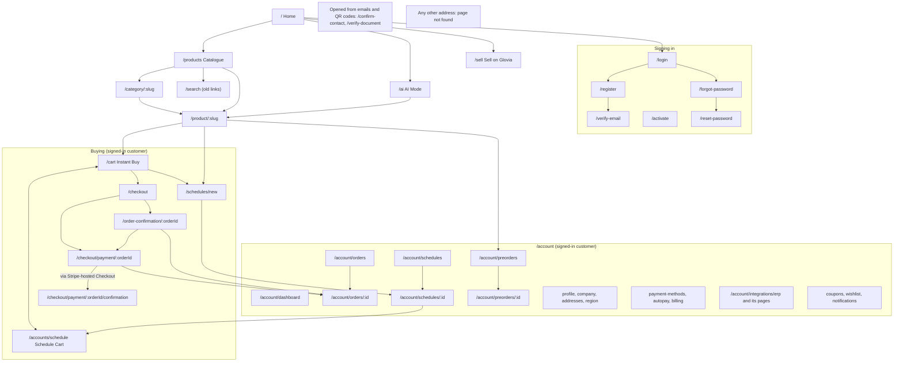

### 3.2 Seller Hub

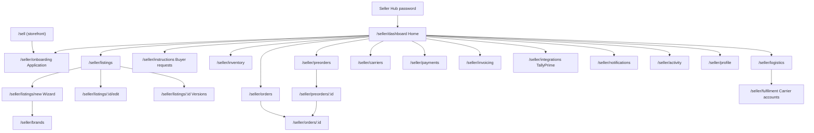

### 3.3 Admin panel

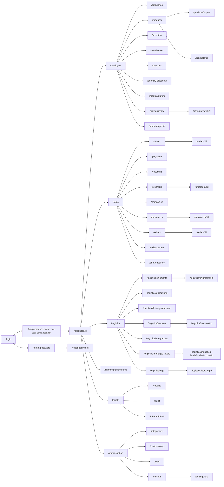

### 3.4 Logistics portal

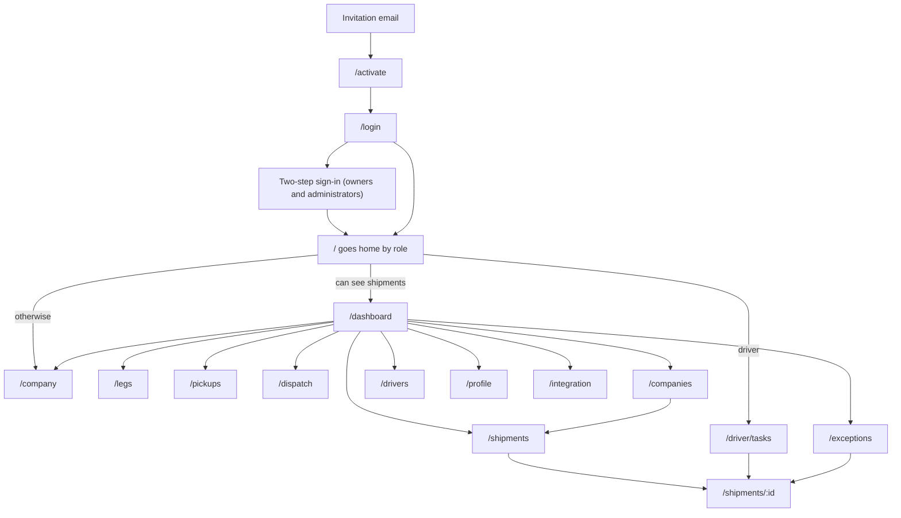

---

## 4. Storefront screens

`apps/customer-web`. The shop that buyers use. The same app also holds the
Seller Hub, which has its own frame and is described in
[section 5](#5-seller-hub-screens).

**Browsing needs no account.** Anybody can see the whole catalogue and its
prices. The sign-in wall is at the cart: buying, orders and the account area
need a signed-in, **activated** customer.

### 4.0 The frame around every storefront page

Files: `src/layout/StoreLayout.tsx`, `src/layout/Header.tsx`,
`src/layout/Footer.tsx`, `src/layout/BecomeSellerButton.tsx`,
`src/app/ServiceBanner.tsx`, `src/app/ErrorBoundary.tsx`,
`src/app/RouteFallback.tsx`.

**Top to bottom**

1. A **Skip to content** link for keyboard users.
2. A **banner**, only when something is wrong:

   | Banner | When |
   |---|---|
   | "You are offline. You can keep browsing what has already loaded…" | The device has no connection |
   | "Your session has ended. Sign in again to carry on. Nothing in your cart has been lost." | The sign-in ran out in this tab |
   | "The store is briefly unavailable… your cart and orders are safe" | The server answered "unavailable" (503) |
   | "We are having trouble reaching the store…" | The server cannot be reached |

3. **The header** (one band at every width), left to right:

   | Item | What it is | What it does |
   |---|---|---|
   | Brand | The store's logo (or the earth mark) and name. For Glovia: the wordmark (23px, 17px on a phone) over **The Way to the World** (15px, from 1024px), in their own bright colour tokens | Goes to `/` |
   | Appearance | Match my device, Light, Dark. One cycling button on phones | Kept in this browser only |
   | Market control | Flag, language code, and on wide screens the country and currency; no chevron on a phone | Opens "Language, country and currency": languages, a searchable country list with "Your browser suggests … Use that", currencies. **Nothing changes until Apply.** Then every price is quoted again and a message says so. Hidden when the store has only one country and one currency |
   | Become a seller | A button whose words follow the person's seller state (see below). Hidden on a seller's own storefront | Opens `/sell`, the onboarding, or the Seller Hub |
   | Account | **Sign in** for a guest. For a customer, their first name and a menu (on a phone the icon alone, no chevron) | The menu lists the account pages in four groups and **Sign out**, which asks first |
   | Cart | Orange, with a count of items | Opens `/cart` (a guest is asked to sign in) |

   There is **no search box and no category bar** in the header, on purpose.
   Search lives on the front page and at the top of the catalogue filters.

   **The "Become a seller" button**

   | Person | Label | Goes to |
   |---|---|---|
   | Guest, or customer with no seller account | Become a seller | `/sell` |
   | Application not finished | Continue setup (with a percentage) | `/seller/onboarding` |
   | Application sent back | Application needs changes | `/seller/onboarding` |
   | Application sent, not yet approved | Application submitted | `/seller/dashboard` |
   | Approved seller | Seller Hub | `/seller/dashboard` |
   | Suspended seller | Selling paused | `/seller/dashboard` |

4. **Where are you ordering from?** A one-time dialog for a signed-in
   customer who has never chosen a country: country, currency, **Use my
   location**, **Not now**, **Continue**.
5. **A market suggestion**, when the chosen language usually means another
   currency: "Prices are shown in … Orders from … are quoted in …" with **Keep
   …** and **Switch to …**.
6. **The page itself.** On every page change, focus moves to it and the window
   scrolls to the top. While a page's code downloads, a spinner shows.
7. **The footer**: the store's name; **Shop** (All products, My orders, Repeat
   purchases); **Support** (email and phone from Settings, or "Contact details
   coming soon"); **Policies** (the links set in Settings, each in a new tab);
   and "All prices in …". There is no footer on `/ai`.

**If a page crashes**, the whole app shows "This page stopped working. Nothing
in your cart has been lost. Reloading usually clears it." with **Reload the
page** and **Go to the home page**.

**API calls made by the frame**

- `GET /api/v1/config` — the store's name, logo, support details, policy
  links, countries, currencies and which features are switched on
- `GET /api/v1/auth/me` — who is signed in
- `GET /api/v1/cart` — the cart count (customers only)
- `GET /api/v1/account/profile` — the name on the account menu
- `GET` and `PUT /api/v1/account/locale` — the country and currency
- `GET` and `PUT /api/v1/auth/language` — the language
- `GET /api/v1/sellers/me` and `GET /api/v1/seller/onboarding` — the seller
  button
- `POST /api/v1/auth/refresh` — renews the sign-in after it expires, once
- `POST /api/v1/auth/logout` — sign out

**What the store has switched on** comes from `GET /api/v1/config`. If that
call fails, everything below counts as off.

| Setting | What it changes on screen |
|---|---|
| `selfRegistration` | Whether `/register` shows a form or "Accounts are by invitation" |
| `selfRegistrationRequiresApproval` | Whether sign-up says the account will be reviewed first |
| `recurringOrders` | The Instant Buy / Schedule Cart tabs, the schedule builder, Schedule Cart, "Scheduled orders" in the account menu, and "Schedule your Cart" on the product page |
| `assistant` | The AI Assistant tab on the front page and the AI node in the sourcing hub |
| `assistant.allowsGuests` | Whether AI Mode answers somebody who is not signed in (server setting `ASSISTANT_ALLOW_GUESTS`, off by default) |
| `imageSearch` | The camera button on the front page search and in AI Mode |

### 4.1 Storefront: browsing, signing in, and public pages

| Path | Screen | Who |
|---|---|---|
| `/` | Home | Anybody |
| `/products` | All products | Anybody |
| `/category/:slug` | One category | Anybody |
| `/search` | Search results (old links) | Anybody |
| `/product/:slug` | One product | Anybody (buying needs a customer) |
| `/login` | Sign in | Anybody |
| `/register` | Create an account | Anybody |
| `/verify-email` | Confirm your email address | Anybody with the emailed link |
| `/activate` | Activate your account (from an invitation) | Anybody with the emailed link |
| `/forgot-password` | Reset your password | Anybody |
| `/reset-password` | Choose a new password | Anybody with the emailed link |
| `/confirm-contact` | Confirm a new email or phone | Open to all; asks you to sign in before it acts |
| `/verify-document` | Check a document | Anybody (the QR code on a seller's invoice) |
| `/ai` | AI Mode | Anybody can open it; whether it answers a guest is a setting |
| `/sell` | Sell on Glovia | Anybody |
| any other address | We could not find that page | Anybody |

#### `/` — Home

| | |
|---|---|
| **Who** | Anybody. A customer sees "Welcome back, …" |
| **File** | `pages/HomePage.tsx`, `components/hero-search/*`, `components/greeting/*`, `components/home/*` |
| **Local screenshot** | `01-customer-home.png` |

**Purpose.** Say what this store does, and send the visitor to search or
browse.

**On the screen, top to bottom**

1. **The greeting**, over a turning earth. It is not a separate card: one
   background (light washes, a faint grid and points) starts right under the
   header, runs to both edges of the window and carries on behind every
   section of the page. The turning earth stays in the greeting only.
   - "One connected flow" (guest) or "Welcome back, …" (customer), the store's
     name, and a line that changes ("Source with Intelligence" / "Deliver with
     Confidence").
   - **The search module**: tabs **Home**, **AI Assistant** (when switched on)
     and **Products**; the search box ("Search the catalogue"); a camera
     button for **Image search** (when switched on); a microphone for **Search
     by voice** (when the browser can); and **Search**.
   - For a guest: "Ordering needs an account. Sign in to order".
   - Small chips: "Priced in …", "Order online, any time", "Repeat purchase
     scheduling" (when switched on).
   - **The sourcing hub**: four glass cards — AI Assistant, Schedule your Cart,
     Autopay, ERP Integration. Each opens its page, or explains why it cannot
     (switched off, or sign in first).
2. **Shop by category**: a rail of the departments that have stock. Opening
   one lists what is inside it, with **Browse …**. Hidden when nothing is
   stocked.
3. **Shelves**: up to five rows of six products (New arrivals, Business
   essentials, Industrial and professional supplies, Technology and
   electronics, Home, lifestyle and personal care), each with **See all**. A
   shelf with nothing on it is not shown.
4. **Products**: the catalogue, 12 at a time, with **Sort by** and page
   buttons. Then "Looking for something specific?" and **View all products**.

**What happens.** **Search** opens `/products?q=…`. Typing and then pressing
**AI Assistant** carries the words over to AI Mode. **Image search** (customers
only; a guest is asked to sign in) takes or uploads a photo and shows matching
products.

Product cards on this page only show; they have no "add to cart". The name
opens the product.

**API calls**

- `GET /api/v1/catalog/categories`
- `GET /api/v1/catalog/products?…` (one call per shelf, and one for the list)
- `GET /api/v1/account/profile` (customers)
- `POST /api/v1/catalog/image-search` (customers)

#### `/products`, `/category/:slug`, `/search` — The catalogue

| | |
|---|---|
| **Who** | Anybody |
| **File** | `pages/CatalogPage.tsx`, `components/catalog/*`, `components/ProductRow.tsx` |
| **Local screenshot** | `02-customer-catalogue.png` |

**Purpose.** A list of products that can be filtered, sorted and paged. One
screen serves three addresses:

| Address | Starts with | Heading |
|---|---|---|
| `/products` | Everything | "Products" |
| `/category/:slug` | That category, and a "What is inside" rail of its sub-categories | The category's name |
| `/search?q=…` | The search term | "Results for …". Kept for old links; the front page search now uses `/products?q=…` |

**Everything is kept in the address bar**, so a filtered list can be shared
or bookmarked: `q`, `category` (one or a comma list), `page`, `sort` (newest,
price up, price down, name A–Z, name Z–A), `minPrice`, `maxPrice`, `inStock`,
`onSale`, `recurringOnly`, `added` (7, 30 or 90 days) and `attr` (repeatable,
`name:value`). Changing a filter goes back to page 1. **Clear all** keeps the
search term and removes the rest.

**On the screen**

- A breadcrumb, the heading, and a count ("Showing 1–24 of 310 products").
- **Sort by**.
- A strip of departments ("All products" and each department).
- **Filters** (a sidebar on wide screens; a **Filters** button and dialog on
  phones):
  - **Search** by name or product code.
  - **Categories**: back to the parent, and the sub-categories with counts.
  - **Price**: lowest and highest, **Apply price**.
  - **Show only**: In stock, On offer, Repeat orders.
  - **When it was added**: any time, last 7, 30 or 90 days.
  - One block per product attribute the catalogue offers, with counts.
- **Filtered by**: a chip per filter, each with ×.
- The results: a row per product with its name, SKU, price (or "Request a
  quote"), tax, badges (Minimum N, In multiples of N, N% off, Currently
  unavailable) and **Save for later**.
- **Previous**, "Page X of Y", **Next**.

**Save for later** adds the product to the wishlist. A guest is asked to sign
in first.

**States.** Loading shows four grey rows. Nothing found: "Nothing matches …
Try a shorter search, check the spelling, or clear the filters." An unknown
category shows an empty list, not an error.

**API calls**

- `GET /api/v1/catalog/categories`
- `GET /api/v1/catalog/categories/:slug`
- `GET /api/v1/catalog/products?page=…&limit=24&…`
- `GET /api/v1/catalog/filters?…` (the filter blocks and price range)
- `GET` and `POST /api/v1/account/wishlist`, `DELETE /api/v1/account/wishlist/:id`
  (customers)

#### `/product/:slug` — One product

| | |
|---|---|
| **Who** | Anybody can look. Buying needs an activated customer |
| **File** | `pages/ProductPage.tsx`, `components/VariantSelector.tsx`, `components/QuantityInput.tsx`, `components/BulkSavingsPopover.tsx`, `components/BulkOffersDialog.tsx`, `lib/quantity-decision.ts`, `lib/use-quantity-decision.ts`, `components/preorder/*`, `components/ProductInstructionsButton.tsx` |
| **Local screenshot** | `03-customer-product-detail.png` |

**Purpose.** Where the decision to buy is made.

**On the screen**

- **Pictures**: the chosen version's pictures (or the product's). Hovering
  magnifies; pressing opens the picture full screen.
- **Name** and short description.
- **Price**: per piece or per carton, a range when several versions are
  chosen, a crossed-out price with "Reduced price", or "Price on request". An
  approximate price in another currency when prices were converted. The tax
  line. How it is sold ("Sold by the piece" or "Ordering in cartons of N"),
  the minimum and the step.
- **Choosing a version**: one control per option (size, colour …). A
  combination that does not exist is greyed out. Some products let you pick
  several versions at once, each with its own quantity. The choice goes into
  the address bar (for example `?size=…`).
- **Quantity**: kept inside the product's minimum, step and maximum. "Comes
  to N pieces" when ordering cartons. Whole positive pieces only, up to
  100,000,000 (see *Safe quantity input* under Shared controls). A typed
  quantity counts on Enter, on leaving the box, or after 0.8 seconds without
  typing; + / −, an arrow key or a paste counts at once.
- **Quantity savings**: what you would save by buying more.
- **View all bulk offers (N)**: a link under the quantity box, shown whenever
  the listing has at least one genuine offer. It opens the **Bulk offers**
  dialog: every band at once, as cards (not a carousel). Each card: *Buy N or
  more*, price per piece, crossed-out usual price, saving per piece, discount
  %, total for N, total saving, stock (*Available from stock* / *Only X in
  stock. The rest would be a preorder.*), the offer's end date, and **Select
  N**. Tags: *Your quantity*, *Next saving*, *Best value*, *Business
  accounts*. A progress line: *Add N more to pay P a piece.* A separate list
  of preorder-only prices. A footnote that prices are re-checked in the basket
  and at checkout. Cards rise in one after another and lift on hover; under
  reduced motion they just appear. A native `<dialog>`: focus moves in,
  Escape and the backdrop close it, focus returns to what opened it.
  - **Opens by itself** on a quantity increase (stepper, arrow key, or typed
    and settled) when offers exist, once per product and version per browser
    session; again only if the set of bands changes (another version, a
    business buyer's own bands). Closing it without choosing silences it for
    that product and version for the session. The link always opens it.
  - **Select N** sets the quantity to N (only where the page counts pieces for
    one version), closes the dialog and re-prices. If N is more than stock,
    the stock prompt opens after this dialog has closed.
- **More than is in stock**: where the seller takes preorders, the change that
  crosses the stock line opens a prompt with the quantity asked for, available
  now, short by, and the preorder minimum, in pieces. **Continue with
  preorder** goes into the preorder flow (the note if not yet acknowledged,
  then the form, opening on the page's quantity, version and unit); **Change
  quantity** puts focus back in the quantity box.
  - "Stock" is the available figure from `GET /catalog/bulk-pricing` for that
    product and version, the one the page already shows.
  - Same for + / −, typing, pasting, arrow keys, the browser's spinner, and
    **Select N**. Typing 1000 over a stock of 500 is judged once, on 1000.
  - Opens once on the crossing (501 → 502 → 503 opens it once); back to the
    stock figure or below re-arms it. 500 of 500 is within stock.
  - Changing the version re-checks the current quantity and can open it.
- **Which dialog opens**: one coordinator decides, in this order: an invalid
  quantity opens nothing; over stock opens the stock prompt; an increase with
  offers opens the offers dialog. It acts only on the server's answer for the
  exact quantity and version committed; a late older reply is ignored. Never
  two dialogs at once. *Ordering in bulk?* stands aside when the quantity is
  over stock.
- **Total**: price per piece, pieces, total cost.
- **Special instructions (optional)**: sent with the line when it is added.
- **Buttons, for a customer**
  - **Add to cart** (orange). A message confirms it. You stay on the page.
  - **Request a quote**, instead, when the price is on request. It opens an
    email to the store's support address with the product name and SKU as the
    subject, or calls the store's support telephone when there is no address.
    With neither set in Settings, the button is left out and **Preorder** and
    **Add instructions** remain.
  - **Schedule your Cart** (teal), when recurring orders are switched on,
    the product allows it and exactly one version is chosen. Opens
    `/schedules/new?productId=…&quantity=…`.
  - **Preorder**: ask the seller for a large quantity by a date. Needs one
    version chosen and a business account. Opens a dialog with the address,
    a preview, and **Send**. The first time (per version of the note), it
    opens **Bulk preorder information** first: the minimum, how the seller
    confirms, that nothing is charged, and a checkbox *"I understand the
    minimum quantity and preorder process."*; **Agree and continue to
    preorder** stays disabled until it is ticked. **Not now** closes it.
  - **ⓘ** inside Preorder's right end (its own button, laid over it, label *Preorder
    information*): the same note, to read at any time — a popover beside the
    button on a desktop, a bottom sheet on a phone. Already acknowledged, it
    offers **Continue to preorder** with no checkbox.
  - **Chat icon** (speech bubbles) directly right of the ⓘ, on every product
    whether or not it can be preordered. The row is `[ Preorder (i) ] [ chat
    icon ]`: the icon is a 48×48 px button as tall as Preorder; on a phone
    Preorder takes the rest of the row and the row does not wrap. There is no
    visible "Chat with …" text button; this is the only chat entry in the row.
    Its accessible name is *Chat with {marketplace}* (the operator's own name;
    *Chat with Glovia* until one is set), or *Chat with {marketplace}. Unread
    replies: N*. The tooltip *"Ask {marketplace} about this preorder"* shows on
    hover and keyboard focus, is linked by `aria-describedby`, and Escape hides
    it; on touch a tap opens the chat directly. Visible focus ring, a soft
    brand-colour hover glow, reduced motion respected. A red badge (99+ cap)
    counts staff replies still unread in the signed-in customer's
    conversations about this product, from
    `GET /api/v1/preorder-chats/unread?productId=…`; it refreshes once a minute
    while the tab is in front and when the chat marks messages read or a live
    message arrives. Guests see no badge. A guest opens the same drawer with
    the preorder assistant only and a **Sign in to write** button; asking for a
    person or writing signs them in and brings them back with the chat open,
    their answers kept and the request finished. It opens a drawer on the right (full screen on a phone): the team's
    availability and typical response time; the product card (picture, name,
    seller, SKU, option, minimum, and **Your requirement**: order unit -
    Pieces, 20-ft or 40-ft container - quantity, equivalent pieces from the
    seller's verified figures, desired date; editable until the first
    message); before a conversation exists, the **preorder assistant**: its
    header ("{marketplace} Preorder Assistant", an **Automated** tag, and
    **Connect with a human agent**), a greeting by first name naming the
    product, the common questions as a card of rows (icon, question, chevron;
    six, then **View all questions**), each answer labelled Automated (with a
    **Needs confirmation** tag when the team must confirm), *Was this helpful?*
    and *Would you like to connect with a human agent?*; after a handoff the
    notice *"Your request has been sent to the {team} preorder team…"* above
    the box; the history with Sending / Sent / Delivered / Read / Not sent and
    Retry, the assistant's stored answers, and *"A member of the {team} team has
    joined the conversation."*; the security notice; the message box (Enter
    sends, Shift+Enter is a new line) with a round brand-colour **Send message**
    button (upward arrow; disabled when empty; progress while sending; a mark
    after a failed send) and a paperclip for a PDF or image when attachments are
    available. A proposal card shows the figures, "indicative" price and
    expiry, with **Review proposal** (opens the preorder form filled in, with
    a note to check every field) and **Decline**. Opening the drawer creates
    nothing. API: `GET /api/v1/preorder-chats/availability`,
    `POST /api/v1/preorder-chats/context`, `POST /api/v1/preorder-chats/assistant`,
    `POST .../assistant/answer`, `POST .../handoff`, `POST /api/v1/preorder-chats/messages`,
    `GET .../:id/messages`, `POST .../:id/read`, the socket
    `/api/v1/preorder-chats/socket`, and `GET/POST .../proposals/:proposalId…`.
  - **In the preorder dialog, Order in** is a dropdown: *Pieces*, *20-ft
    Container*, *40-ft Container*, then any carton, pallet or container
    packaging the seller has. Choosing a container renames the quantity to
    **Number of containers** (whole numbers only) and shows *"1 × 20-ft
    Container = 12,000 pieces"* and *"2 × 20-ft Container = 24,000 pieces in
    total"* from the seller's verified figure for this version. The summary
    shows order in containers, pieces per container, total pieces, price per
    piece, product subtotal, *"Estimated logistics charges: To be confirmed"*
    and the estimated total. A size the seller has not configured or verified
    is shown disabled *"(not available)"* with *"Container ordering is not
    available because the seller has not configured the packing capacity for
    this product."*; Pieces stays available. Changing the version reloads the
    options; if the chosen unit is no longer available the dialog switches to
    Pieces and says so. When the request is for more than is available, the
    preview says *"The complete requested quantity is not currently
    available."* with requested, available for the first fulfilment and
    remaining, and that the seller will propose a revised date or a split
    delivery. On the store's own products containers are not available.
- **"Ordering in bulk?"**: when the quantity reaches the product's preorder
  minimum from below (999 → 1,000), a dialog shows the quantity chosen and the
  minimum, with **Start preorder** and — only where Add to Cart takes that
  quantity — **Continue with regular order**. Once per product per session.
  Start preorder goes through the note (if not yet acknowledged) into the
  form, keeping the version and the quantity. It waits while another dialog
  (such as Bulk offers) is open.
  - **Add instructions**: a standing note to the seller about this product,
    without buying anything.
  - **Save for later**.
  - **Order by** carton, pallet or container, when the product offers it.
- **Buttons, for a guest**: **Sign in to order**, **Save for later**,
  **Preorder** and **Add instructions** all go to sign-in first and come back.
- **Ordering information**, then the product information in one fixed order,
  each only with data: **Product highlights** (six, then **View all
  highlights**); **Description** (seller's sections - heading, text with line
  breaks, lazy-loaded picture with alt text - or the older description);
  **Specifications** grouped under translated headings as label | value rows,
  eight rows then **View all specifications (n)** / **Show less**
  (`aria-expanded`, keeps its place, `#specifications` opens it); **Packaging
  and bulk ordering** (those groups, then packaging and dimensions);
  **Compliance and certifications** (that group, then medical device details);
  **Warranty**; **Manufacturer and seller information** (those groups, then
  product safety). Choosing an option swaps in its own specifications.

**States.** "Loading the product". A product that does not exist shows the
"We could not find that page" screen.

**API calls**

- `GET /api/v1/catalog/products/:slug?currency=…&country=…&language=…`
- `GET /api/v1/catalog/variant-axes`
- `GET /api/v1/catalog/bulk-pricing?productId=…&variantId=…&quantity=…`
  (the popover, and `offers` / `preorderOffers` for the Bulk offers dialog)
- `POST /api/v1/cart/items/bulk` (Add to cart and Order by)
- `GET /api/v1/preorders/eligibility?productId=…&variantId=…`
- `POST /api/v1/preorders/acknowledgement` (Agree and continue to preorder)
- `GET /api/v1/account/addresses`, `POST /api/v1/preorders/preview`,
  `POST /api/v1/preorders` (the preorder dialog)
- `GET` and `POST /api/v1/account/product-instructions`
- `GET` and `POST /api/v1/account/wishlist`, `DELETE /api/v1/account/wishlist/:id`

#### `/login` — Sign in

| | |
|---|---|
| **Who** | Anybody. A signed-in customer is sent straight on |
| **File** | `pages/LoginPage.tsx`, `auth/SessionProvider.tsx`, `components/DemoLoginPanel.tsx` |
| **Local screenshot** | `04-customer-login.png` |

**On the screen.** The split layout: a turning earth on the left from `lg`
up, the form on the right. The language picker. **Email address**,
**Password**, "I accept the terms of business" (with the store's policy
links), **Sign in →**, **Forgot your password?**. Then either "Create one now"
(when sign-up is switched on) or "Accounts are set up by our team…".

**Where you go afterwards.** The page you were trying to open, or the `next`
address, or `/`. Only addresses inside this store are accepted.

**When it goes wrong**, the server's reason is shown, with a line of help for
the common cases: too many attempts (try again in N minutes), not activated
yet, email not confirmed, waiting for approval, locked, no longer active.

**Demo sign-ins** appear only on a build made with `VITE_DEMO_LOGINS`.

**API call:** `POST /api/v1/auth/login`

#### `/register` — Create your account

| | |
|---|---|
| **Who** | Anybody |
| **Turned on by** | `selfRegistration`. When off, the page explains that accounts are by invitation |
| **File** | `pages/RegisterPage.tsx` |
| **Local screenshot** | `30-customer-register.png` |

**On the screen (when sign-up is on).** **Your name**, **Email address**,
**Country you order from** (sets the currency), **Mobile number** (with the
country's dialling code), **Company (optional)**, **Choose a password** (at
least 12 characters), **Confirm your password**, the terms box, and **Create
account →**. When new accounts are reviewed: "New accounts are reviewed by our
team before the first order…".

**What happens.** "Check your email — if … can have an account here, a
confirmation link is on its way." with **Send it again**. You are not signed
in yet. The page never says whether an email address is already in use.

**API calls:** `POST /api/v1/auth/register`, `POST /api/v1/auth/verify-email/resend`

#### `/verify-email` — Confirm your email address

| | |
|---|---|
| **Who** | Anybody holding the link (`?token=…`) |
| **File** | `pages/VerifyEmailPage.tsx` |

**What happens.** The page sends the token once, straight away ("Confirming
your email address"). Then:

| Result | What it says |
|---|---|
| Confirmed, account ready | "Your email is confirmed", **Sign in** |
| Confirmed, waiting for review | "Thank you — your email is confirmed. Our team reviews each new account…" |
| Link expired or used | Explains, and offers **Send a new link** |
| Link invalid, or account closed | Explains, with **Go to sign in** and **Contact support** |

**API calls:** `POST /api/v1/auth/verify-email`, `POST /api/v1/auth/verify-email/resend`

#### `/activate` — Activate your account

| | |
|---|---|
| **Who** | A customer invited by staff, holding the link (`?token=…`) |
| **File** | `pages/ActivatePage.tsx` |
| **Local screenshot** | `31-customer-activate.png` |

**On the screen.** "Choose a password. Only you will know it — nobody at …
can see or set it." **Choose a password** (12 to 128 characters), **Confirm
your password**, the terms box, **Activate my account**.

**What happens.** The account is activated and you are signed in: "Your
account is ready", **Browse products**. An expired, used or invalid link shows
a clear card with **Go to sign in** and **Contact support**.

**API calls:** `POST /api/v1/auth/invitations/accept`, then `POST /api/v1/auth/login`

#### `/forgot-password` — Reset your password

| | |
|---|---|
| **Who** | Anybody |
| **File** | `pages/ForgotPasswordPage.tsx` |
| **Local screenshot** | `32-customer-forgot-password.png` |

**On the screen.** **Email address** and **Send the reset link**. It always
answers "Check your email — if that address belongs to an account, a reset
link is on its way", so it cannot be used to find out who has an account.

**API call:** `POST /api/v1/auth/password/forgot`

#### `/reset-password` — Choose a new password

| | |
|---|---|
| **Who** | Anybody holding the link (`?token=…`) |
| **File** | `pages/ResetPasswordPage.tsx` |

**On the screen.** **New password** (at least 12 characters), **Confirm your
password**, **Save my new password**. A bad link shows "This link will not
work" with **Request a new link**. On success you go to sign in.

**API call:** `POST /api/v1/auth/password/reset`

#### `/confirm-contact` — Confirm your details

| | |
|---|---|
| **Who** | Anybody can open it; it asks you to sign in before it acts |
| **File** | `pages/ConfirmContactPage.tsx` |

**Purpose.** Where the link lands after you asked to change your email or
phone number on your profile (`?token=…&kind=email|phone`). The page is
public so that the link still works from an email program; signing in keeps
the token.

**What happens**

| Case | What it says |
|---|---|
| Not signed in | "Sign in to finish this change — use the address your account still has", **Sign in** |
| New email confirmed | "Your new email address is confirmed. You have been signed out everywhere, so sign back in with it." |
| New phone confirmed | "Your new number is confirmed. You are still signed in." |
| Link bad or incomplete | Explains, with **Start again from your profile** |

**API calls:** `POST /api/v1/account/email-change/confirm` or
`POST /api/v1/account/phone-change/confirm`, then `GET /api/v1/account/profile`

#### `/verify-document` — Check a document

| | |
|---|---|
| **Who** | Anybody. It is read by whoever holds the carton |
| **File** | `pages/VerifyDocumentPage.tsx` |

**Purpose.** Where the QR code printed on a seller's invoice or packing list
lands (`?kind=invoice|packing-list&number=…&code=…`). It says whether the
document is real, who issued it and whether it still stands. It never shows
the buyer or any price. **This address is printed into every document and
must never move.**

**What it shows.** "Valid" (green), or Cancelled, Being corrected, Replaced
by a newer version, or Not issued; the kind (Tax invoice, Credit note, Packing
list), the number, who issued it and when, how many packages. If nothing
matches: "This document could not be confirmed… Treat the document with
caution."

**API call:** `GET /api/v1/documents/verify?kind=…&number=…&code=…`

#### `/ai` — AI Mode

| | |
|---|---|
| **Who** | Anybody can open it. It answers a guest only when the store allows it (`ASSISTANT_ALLOW_GUESTS`, off by default). A history needs an account |
| **File** | `pages/AiModePage.tsx`, `pages/ai/*`, `lib/ai-mode.ts`, `lib/assistant-stream.ts` |

**Purpose.** A full-page shopping assistant. The page uses the whole window
and has no footer.

**On the screen**

- **Left side**: "AI Mode", **New chat**, and the **History** of your
  conversations (rename or delete each). A guest sees "Sign in to keep your
  conversations".
- **Empty chat**: a greeting for the time of day, "How can we help you
  today?", how many products are on sale, and starter questions ("What do you
  have in …?", "Compare two products", "Help me prepare a recurring order").
  A notice: "You are chatting with an AI assistant, not a person."
- **The conversation**: your messages, and the answers, written as they
  arrive ("Thinking…"). Product addresses in an answer become links. **Copy**
  and **Ask again**. Products the answer names appear as cards under it
  ("From the catalogue") with price, stock, **View specifications**, and **Add
  to cart** (or **Choose your options**, or **Sign in to order**).
- **The box at the bottom**: "Your question" (Enter sends, Shift+Enter makes a
  new line), **Attach a photograph** (when image search is on), a microphone,
  **Send** or **Stop generating**. "Generated by AI. Check product codes and
  prices before ordering."

**Limits.** 20 questions per conversation. A guest has a small number of free
questions; at zero a dialog offers **Create an account** or **Sign in**. When
the store does not answer guests, the box is replaced by "Sign in to ask the
assistant".

**API calls**

- `POST /api/v1/assistant/start`
- `POST /api/v1/assistant/chat` (a live stream)
- `GET /api/v1/assistant/conversations`,
  `GET`, `PATCH` and `DELETE /api/v1/assistant/conversations/:id`
- `GET /api/v1/catalog/categories`
- `GET /api/v1/catalog/product-cards?refs=…`
- `POST /api/v1/cart/items`
- `POST /api/v1/catalog/image-search` (customers)
- `GET /api/v1/account/profile`

#### `/sell` — Sell on Glovia

| | |
|---|---|
| **Who** | Anybody. What it shows depends on who is looking |
| **File** | `pages/seller/SellPage.tsx` |

**Purpose.** The public page about selling on the marketplace, and where a
customer starts a seller application under the account they already have.

**On the screen**

- "Sell to businesses that buy in bulk", and a button that depends on the
  visitor:

  | Visitor | Button |
  |---|---|
  | Already a seller | **Open your Seller Hub** |
  | Signed-in customer | **Start your application** |
  | Guest | **Sign in to apply** and **Create an account** |

- **What you get** (four points) and **How it works** (four steps). "Every
  seller is checked before they can list anything."
- **Start your seller application** (signed-in customers): **Registered
  business name**, **Shop name buyers will see** (checked as you type: "That
  name is available." or "Another seller already trades under that name."),
  **Country the business is registered in**, and **What kind of seller are
  you?** (manufacturer, authorised distributor, wholesaler, reseller). **Start
  application** opens `/seller/onboarding`. "Nothing is published until we have
  approved your account."

**API calls**

- `GET /api/v1/sellers/me`
- `GET /api/v1/sellers/display-name-available?name=…`
- `POST /api/v1/sellers/apply`

#### Any other address — We could not find that page

| | |
|---|---|
| **Who** | Anybody |
| **File** | `pages/NotFoundPage.tsx` |

"We could not find that page. The link may be out of date, or the product may
no longer be available." with **Browse products** and **Home**. The product
page shows the same screen for a product that does not exist.

### 4.2 Storefront: buying

Every screen in this part needs a **signed-in, activated customer**. The guard
is `auth/RequireCustomer.tsx`. A visitor who is not signed in is sent to
`/login`, and the page they wanted is remembered so they come back to it after
signing in. The server checks the same thing on every request; the guard only
saves a screen of failures.

**The progress bar.** The cart, checkout, payment and confirmation screens
share a four-step bar (`components/CheckoutSteps.tsx`): **Cart → Address →
Payment → Confirmation**. A step is ticked only when it is really done. For
example, Payment is ticked only when the server says the order is paid;
otherwise it shows "Not paid yet".

**What the customer sees an order's status as** (`lib/order-status.ts`)

| Status in the system | Label | What the order page says |
|---|---|---|
| Pending payment | Awaiting payment | "This order is waiting for payment. You can pay from this page." (or, for a payment link: "A payment link has been emailed…") |
| Pending approval | Awaiting approval | "Your approver has been notified…" |
| Confirmed | Confirmed | "Payment received. We are getting your order ready." |
| Processing | Being prepared | "Your order is being picked and packed." |
| Shipped | On its way | "On its way to you." |
| Delivered | Delivered | — |
| Cancelled | Cancelled | "This order was cancelled. Any payment taken has been refunded." |
| Returned | Returned | — |
| Refunded, Draft | shown as the plain word, grey | — |

#### `/cart` — Your cart (Instant Buy)

| | |
|---|---|
| **Who** | Activated customer |
| **File** | `pages/CartPage.tsx`, `components/CartModeTabs.tsx`, `components/CouponPanel.tsx`, `components/DeliveryOptionsPanel.tsx`, `components/DeliveryBreakdown.tsx` |
| **Local screenshots** | `06-customer-product-added.png`, `07-customer-cart.png` |

**Purpose.** The basket. It is kept on the server, and every change returns
the whole cart, which then replaces what is on screen. So what you see is
always what the server holds.

**On the screen, top to bottom**

- The progress bar, with Cart as the current step.
- Two tabs, **Instant Buy** (this page) and **Schedule Cart**
  (`/accounts/schedule`). The tabs appear only when the store has recurring
  orders switched on.
- "Your cart", how many items across how many products, and **Empty the
  cart**.
- A row per line:
  - Picture and name (link to the product), version and SKU.
  - How it is packed, the line total and the price basis ("per carton", "per
    piece" or "each"), and whether tax is included.
  - Quantity-price news from the server, for example "Add 20 more pieces to
    pay … each".
  - A quantity stepper. It counts pieces, or cartons when the product is sold
    by the carton, and it respects the seller's minimum and step.
  - **Remove**.
  - **Add instructions**: a note for this one line (Save, Cancel, Remove).
  - Problems in the server's words, with a one-press fix where there is one:
    "Reduce to 40" when there is not enough stock, "Change to 50" when the
    quantity breaks a rule. An unavailable item is red; a price change is
    blue.
- **Order summary**: Subtotal, Discount, Tax, Delivery ("Calculated at
  checkout"), the delivery charge split by level (L1 to L4) when sellers
  charge per level, and the **Estimated total**.
- **Coupons**: type a code and **Apply**, or open the list of codes the store
  has and apply one. **Remove** takes it off.
- **Where this can ship from**: the warehouses that can send this basket to
  your country, marked Soonest, Cheapest or "Running at reduced capacity".
  This is for information only. It does not change the price; the choice that
  counts is made at checkout.
- "This order will need approval", when your account's rules say so.
- "Before you can check out", listing anything that blocks checkout.
- **Proceed to checkout** (orange). It can only be pressed when the server
  says the cart is ready.
- **Need this again?** When some products can be delivered on a schedule: the
  Autopay state (On, Off, Paused) with one button to manage it, and **Schedule
  your Cart**, which opens `/schedules/new`.
- On a phone, a bar pinned to the bottom with the item count and
  **Checkout**.

**States.** "Loading your cart". Empty: "Your cart is empty — everything you
add stays here until you check out", with **Browse products**. A line being
changed is dimmed until the server answers.

**API calls**

- `GET /api/v1/cart`
- `PATCH /api/v1/cart/items/:itemId` (quantity)
- `PATCH /api/v1/cart/items/:itemId/packs` (cartons)
- `PATCH /api/v1/cart/items/:itemId/note`
- `DELETE /api/v1/cart/items/:itemId`
- `DELETE /api/v1/cart` (empty it)
- `POST /api/v1/cart/coupon`, `DELETE /api/v1/cart/coupon`
- `POST /api/v1/delivery/options` (where it can ship from)
- `GET /api/v1/account/autopay`, `POST /api/v1/account/autopay/pause`
- From the Autopay dialog: `GET /api/v1/account/payment-methods`,
  `POST /api/v1/account/autopay`, and the card-saving calls listed under
  [Saved payment methods](#accountpayment-methods--saved-payment-methods)

#### `/checkout` — Checkout

| | |
|---|---|
| **Who** | Activated customer |
| **File** | `pages/CheckoutPage.tsx`, `pages/checkout/FulfilmentWarehouseSection.tsx` |
| **Local screenshot** | `08-customer-checkout.png` |

**Purpose.** Choose where the order goes, where it ships from and how you will
pay, then create **exactly one** order. No money moves on this page: "Nothing
is charged until the next step."

**On the screen**

1. **Delivery address.** Your saved addresses as cards, the default chosen.
   **Add a different address** opens the address form in place. **Bill to the
   same address** can be unticked to choose a billing address.
2. **Choose your fulfilment warehouse** (or **Sent by the seller** when the
   seller ships it). One card per warehouse that can send the whole basket:
   where it ships from, when it leaves, days in transit, distance, and its own
   subtotal, tax, delivery and total. Badges: Fastest delivery, Lowest price,
   Recommended. The recommended one is chosen until you pick another. Below,
   "Why 2 other warehouses cannot send this", with what they are short of. One
   order is never split across warehouses.
3. **How would you like to pay?**
   - **Pay now**, then "Pay with" Credit Card, Debit Card or UPI (whatever the
     store offers in this currency), and your saved cards that fit, or "Use a
     different card". When the card is paid on Stripe's own page, the saved-card
     list is hidden here and replaced by "Your saved cards will be offered on
     the secure payment page…".
   - **Send a payment link**: the order is placed now and a secure link is
     emailed, for example to your finance team.
4. **Anything we should know?** A note for the order (delivery instructions, a
   PO number, a site contact).

On the right, **Your order**: the lines (with **Edit** back to the cart), the
warehouse and arrival date, the totals, any approval notice, and the main
button: **Place order and pay** (pay now) or **Place order** (payment link).
The button says why it cannot be pressed when it cannot ("Choose a delivery
address to continue." …). **Repeat this order on a schedule** is offered when
recurring orders are on.

**What happens when you press the button**

1. The chosen warehouse price is checked again. If it has changed or gone,
   nothing is placed, the options are fetched again, and you choose again.
2. The order is created. The request carries a key made once for this visit,
   so pressing again after a network failure **cannot** create a second order.
3. Then:
   - Pay now, no approval needed → the payment page.
   - Payment link, or approval needed → the confirmation page.

**API calls**

- `GET /api/v1/account/addresses`
- `GET /api/v1/cart?shippingAddressId=…`
- `GET /api/v1/payments/instruments?currency=…`
- `GET /api/v1/account/payment-methods`
- `POST /api/v1/fulfilment/warehouse-options`
- `POST /api/v1/fulfilment/warehouse-options/:quoteId/revalidate`
- `POST /api/v1/cart/checkout` (with an `Idempotency-Key` header)
- From the address form: `POST /api/v1/account/addresses`,
  `POST /api/v1/account/addresses/geocode/suggest`

#### `/checkout/payment/:orderId` — Pay for your order

| | |
|---|---|
| **Who** | Activated customer, for their own order |
| **File** | `pages/PaymentPage.tsx`, `lib/stripe-checkout.ts`, `lib/razorpay.ts` |
| **Local screenshot** | `29-customer-payment-step.png` |

**Purpose.** Take the payment for an order that already exists. **This page
never decides on its own that an order is paid.** It waits for the server,
and the server marks an order paid only when the payment provider's signed
message (a webhook) arrives, or when the server itself has asked the provider.
The page never reprices the order: the amount is the order's, read on the
server.

**On the screen.** "Pay for your order", the order number, and an order
summary from the server: how many items, the subtotal, any discount, delivery,
tax, the **Amount due**, and "Charged in …" with the currency. The billing
address. A status badge. The button **Pay securely now** (or **Try the payment
again**) and **Pay later — view the order**. "Retrying uses this same order —
it will never create a second one." A secure-payment note.

With Stripe, the page also says **"Payments are processed securely by
Stripe"**, and explains that the "save for future purchases" box on the next
page is Stripe's own, is never ticked in advance, and that a saved card is
only used when you pay yourself. There is no save tick of our own for Stripe.
Razorpay keeps its own **Save this card for next time** box, never ticked in
advance.

**What happens**

1. **Pay securely now** is disabled at once and says "Opening secure
   payment…", so a double click cannot start two payments. It asks the server
   to start a payment. The request carries no amount, tax or discount.
2. **Stripe:** the same tab goes to **Stripe-hosted Checkout** — Stripe's own
   payment page. Card entry, choosing a saved card, the bank's check (3-D
   Secure) and the save box all happen there. The address is checked before
   leaving: it must be `https` and belong to this payment. If another tab is
   already opening the payment, the page waits and tries again (up to three
   times). If the order is already being paid, it goes straight to the
   confirmation page below.
3. **Razorpay:** its sheet opens over the page, as before. The page then asks
   the server every two seconds whether the order is paid, and shows "Payment
   confirmed" when it is. Closing the sheet: "Your order is saved and still
   awaiting payment."
4. **Back from Stripe's Cancel link** (`?payment=cancelled`): the page tells
   the server, which closes Stripe's page so it cannot be paid later, and shows
   **"Payment cancelled — nothing was charged"** with a retry. If the server
   finds it was paid after all, the page goes to the confirmation.
5. **Back with the browser's Back button:** a page the browser restores from
   its memory has its button switched on again.
6. Errors are shown in a summary that takes focus. "Card payment is not set up
   on this store yet…" when Stripe has no keys. A problem at Stripe is shown
   in the store's own words; Stripe's text is never shown.

**Test mode.** When the store runs with test payments, a "Test mode" panel
offers **Mark this order as paid**.

**API calls**

- `GET /api/v1/orders/:orderId`
- `GET /api/v1/payments/instruments?currency=…`
- `POST /api/v1/payments/orders/:orderId/session` (with an `Idempotency-Key`)
- `POST /api/v1/payments/orders/:orderId/checkout/cancel` (back from
  Stripe's Cancel link)
- `GET /api/v1/payments/orders/:orderId/status` (every two seconds while
  waiting for Razorpay)
- `POST /api/v1/payments/orders/:orderId/mock-capture` (test mode only)
- The Razorpay script, loaded from the provider

#### `/checkout/payment/:orderId/confirmation` — Payment confirmation (Stripe)

| | |
|---|---|
| **Who** | Activated customer, for their own order, back from Stripe-hosted Checkout |
| **File** | `pages/PaymentConfirmationPage.tsx` |

**Purpose.** Where Stripe sends you back after paying
(`?session_id=cs_…`). Arriving here proves nothing, so the page says nothing
about the payment until the server has.

**On the screen.** One of these, as a heading that is read aloud by screen
readers and takes focus when it changes:

| State | What it shows |
|---|---|
| Confirming payment… | A spinner while the server waits for Stripe |
| Payment successful | The order number, the amount, when it was paid, the card ("Visa ending in 4242"), the order status, **View order** and **Continue shopping** |
| Payment processing | The bank has not finished yet (a delayed payment method). **Check again** |
| Payment failed | Why, in plain words (declined, not enough funds, expired card, wrong CVC, failed bank check, bank payment failed). **Retry payment** |
| Payment cancelled | Nothing was charged. **Retry payment** |
| Session expired | Stripe's page timed out. **Retry payment** |
| Confirmation temporarily delayed | After 60 seconds of waiting. **Check again** |

A session that does not exist or is not yours: "We could not find this
payment".

**What happens.** The page asks the server every two seconds for up to 60
seconds. **Check again** makes the server ask Stripe directly and apply the
answer; it never starts a new payment. **Retry payment** is offered only
when the attempt closed without being paid, and goes back to the payment page
for the same order.

**API calls**

- `GET /api/v1/payments/orders/:orderId/checkout/:sessionId` (every two
  seconds while waiting)
- `POST /api/v1/payments/orders/:orderId/checkout/:sessionId/refresh`
  (**Check again**)

#### `/order-confirmation/:orderId` — Your order has been placed

| | |
|---|---|
| **Who** | Activated customer, reached from checkout |
| **File** | `pages/OrderConfirmationPage.tsx` |

**Purpose.** The "thank you" page for orders that need nothing more from you
right now: payment-link orders and orders waiting for approval. It never says
"paid" unless the order is.

**On the screen**

- "Your order has been placed", the order reference (easy to copy), when it
  was placed, and its status.
- **What happens next**, which depends on the status:

  | Status | What it says |
  |---|---|
  | Waiting for approval | Your approver reviews it → once approved we confirm it and arrange payment → we email you |
  | Payment link sent | Whoever got the link pays → the order is confirmed → we email you. The link is shown only in the email, never here |
  | Awaiting payment | The steps, and **Pay for this order** |
  | Confirmed | We pick and pack → you get a tracking link |

- **What you ordered**, with the totals and "Paid so far".
- **Track this order**, **All your orders**, **Keep shopping**.

**API call:** `GET /api/v1/orders/:orderId`

#### `/schedules/new` — Schedule your Cart (build a repeat order)

| | |
|---|---|
| **Who** | Activated customer |
| **Turned on by** | `recurringOrders`. When off: "Repeat purchases are not available" |
| **File** | `pages/ScheduleBuilderPage.tsx` |
| **Local screenshot** | `11-customer-schedule-builder.png` |

**Purpose.** Set up a standing order that the store places for you on dates
you choose.

**Where you come from.** The cart's **Schedule your Cart** (the whole cart's
eligible lines), checkout's **Repeat this order on a schedule**, the product
page's **Schedule your Cart** (one product, passed in the address as
`?productId=…&quantity=…&variantId=…`), or **Set up a new one** on
`/account/schedules`.

**On the screen**

1. **What to send**: each product with a **Cartons per delivery** stepper.
2. **How often**:

   | Choice | Meaning |
   |---|---|
   | Every 15 days | Every 15 days |
   | Every month (default) | Monthly, on the day of the first delivery |
   | Every 2, 3 or 6 months | Every so many months |
   | Once a year | Every 12 months |
   | Every so many days | 1 to 365 days ("7 gives you a weekly delivery") |
   | Weekly, on a chosen day | Monday to Sunday |
   | Monthly, on a chosen date | Day 1 to 31 |

   **First delivery on** (earlier dates are greyed out; the store needs notice,
   seven days unless it sets otherwise). **When should it stop?**: keep going
   until I cancel, stop after a date, or stop after a number of deliveries.
3. **Where to deliver**: your addresses, or add one.
4. **How each delivery is paid**: **Send a payment link each time** (the
   default, with the email it goes to) or **Autopay** (needs a card mandate).

On the right, **Your schedule**: its name (suggested for you), a summary, the
**estimated** amount per delivery ("every delivery is priced fresh"), and a
consent box that is not ticked in advance. **Start this repeat purchase** can
be pressed only when everything needed is there.

**What the system does.** Creates the schedule and opens its page,
`/account/schedules/:id`. Your cart is not changed.

**API calls**

- `GET /api/v1/cart` or `GET /api/v1/catalog/products` (what to send)
- `GET /api/v1/account/addresses`, `GET /api/v1/account/profile`
- `GET /api/v1/recurring-schedules/delivery-window?shippingAddressId=…&timezone=…`
- `POST /api/v1/recurring-schedules`

#### `/accounts/schedule` — Schedule Cart

| | |
|---|---|
| **Who** | Activated customer |
| **Turned on by** | `recurringOrders`. When off: "Schedules are not available here" |
| **File** | `pages/schedule/ScheduleCartPage.tsx`, `ScheduleEditor.tsx`, `NewSchedulePanel.tsx`, `CadenceFields.tsx`, `ScheduleProductPicker.tsx` |

**Purpose.** The second tab of the cart. The list of your standing orders on
the left and an editor on the right. This is where a schedule is **changed**
(its products, dates, address and name) and where a new one can be made from
scratch. Note the address: `/accounts/schedule`, with an **s**, next to
`/cart`, not inside the account area.

**On the screen**

- **New schedule** at the top.
- **Your schedules**: a card per schedule with its status, next processing
  date, number of products, how it is paid, and the estimated amount. A
  finished or cancelled schedule has **Remove** (it only leaves your list; the
  record is kept).
- The chosen schedule opens on the right (its id goes into `?id=`):
  - A lock notice when it cannot be changed (cancelled, finished, or the next
    delivery is already being prepared). Otherwise: "Changes here apply to
    future deliveries only."
  - **What is delivered**: each product with a cartons stepper and a bin
    button, and a stock warning when stock is short. **Add a product** opens a
    search of products allowed on a schedule.
  - **How often, and when**: the same choices as the builder, plus a time zone.
    **Deliver to** and **Name this schedule**.
  - **Estimated amount**, priced by the server, with any problems listed.
  - **Apply changes**, which works out the upcoming delivery dates again.
  - **Cancel this schedule**, which asks why.
  - A link **Delivery history and payment** to `/account/schedules/:id`.
- **A new schedule** panel: products (in pieces), how often, delivery and
  payment (payment link, or charge a saved card), name, consent, and **Create
  this schedule**.

**API calls**

- `GET /api/v1/recurring-schedules?estimate=true`
- `GET /api/v1/recurring-schedules/:id`
- `GET /api/v1/recurring-schedules/:id/estimate`
- `PATCH /api/v1/recurring-schedules/:id`
- `DELETE /api/v1/recurring-schedules/:id?reason=…` (cancel)
- `POST /api/v1/recurring-schedules/:id/hide` (remove from the list)
- `POST /api/v1/recurring-schedules` (a new one)
- `GET /api/v1/recurring-schedules/delivery-window?…`
- `GET /api/v1/catalog/products?q=…&recurringOnly=true&limit=12` (the picker)
- `GET /api/v1/account/addresses`, `GET /api/v1/account/profile`

#### `/account/orders` — Your orders

| | |
|---|---|
| **Who** | Activated customer (account area) |
| **File** | `pages/OrdersPage.tsx` |
| **Local screenshot** | `10-customer-orders.png` |

**Purpose.** Your order history, newest first (the latest 50).

**On the screen.** A row per order: number and date, how many products, a
"Repeat purchase" badge for orders placed by a schedule, the status, and the
Total, Paid and Refunded figures. Each row opens the order. Empty: "No orders
yet", with **Browse products**.

**API call:** `GET /api/v1/orders?limit=50`

#### `/account/orders/:id` — One order

| | |
|---|---|
| **Who** | Activated customer, for their own order |
| **File** | `pages/OrderDetailPage.tsx`, `components/OrderDeliveryLevels.tsx`, `components/OrderSellerInvoices.tsx` |

**Purpose.** Everything about one order, and the things you can still do with
it.

**On the screen**

- Number, date, status, and a sentence explaining the status. **Pay for this
  order** when it is waiting for payment (and is not a payment-link order).
- **Items**: as ordered, with any line instructions and the tax included, and **Ordered product information** (the description, specifications, packaging and selections as they were when the order was placed) for orders placed since those were kept.
- Totals, and the delivery charge by level (L1 to L4) when sellers charge per
  level.
- **Progress**: the order's timeline.
- **Delivery**: addresses, method, and one tracking block per shipment: the
  carrier, the stage (Waiting for the seller to confirm, Carrier assigned,
  Picked up, In transit, Out for delivery, Delivered …), the seller who sent
  it, the tracking number with **Track it**, and its events.
- **Invoices**: each seller's invoice or credit note with **Download PDF**.
- **Need something?**
  - **Order these again** adds the same products to the cart at today's prices
    and opens the cart.
  - **Cancel this order** asks for a reason. It is always shown; the server
    decides whether it is still possible and says so either way.
- "Something wrong? Email … quoting …" when the store has a support email.

**API calls**

- `GET /api/v1/orders/:id`
- `GET /api/v1/orders/:id/price-breakdown`
- `GET /api/v1/documents/orders/:id`
- `POST /api/v1/documents/buyer/invoice/:invoiceId/link` (then the file is
  downloaded)
- `POST /api/v1/orders/:id/cancel`
- `POST /api/v1/cart/items` (once per line, for "Order these again")

#### `/account/schedules` — Repeat purchases

| | |
|---|---|
| **Who** | Activated customer. The sidebar entry shows only when `recurringOrders` is on |
| **File** | `pages/SchedulesPage.tsx` |

**Purpose.** The list of your standing orders, for reading. Each row opens its
page.

**On the screen.** **Set up a new one** (when recurring orders are on). A row
per schedule: name, summary, status (Active, Paused, Finished, Cancelled,
"Stopped after repeated failures"), next delivery, how many delivered, how it
is paid, a warning when recent deliveries could not be placed, and the pause
reason.

**API call:** `GET /api/v1/recurring-schedules`

#### `/account/schedules/:id` — One repeat purchase

| | |
|---|---|
| **Who** | Activated customer, for their own schedule |
| **File** | `pages/ScheduleDetailPage.tsx` |

**Purpose.** Read one standing order (its dates, how it is paid, its delivery
history) and pause, resume or cancel it. Changing what it delivers is done in
Schedule Cart.

**On the screen**

- A banner when it is paused, and a warning when deliveries have failed ("After
  … failures in a row the schedule stops on its own").
- **Schedule**: next and last delivery, started, ends, delivered count, and
  payment (a payment link sent to …, or charged automatically; a warning when
  Autopay has no mandate yet).
- **What is delivered**.
- **Delivery history**: each planned delivery with its status and a link to
  the order it created, or why it failed or was skipped.
- **Manage**: **Change what is delivered** (opens
  `/accounts/schedule?id=…`), **Pause deliveries** (optional reason),
  **Resume deliveries**, **Cancel this repeat purchase** (reason required, and
  final). Each asks to confirm, and each affects future deliveries only.

**API calls**

- `GET /api/v1/recurring-schedules/:id`
- `POST /api/v1/recurring-schedules/:id/pause`
- `POST /api/v1/recurring-schedules/:id/resume`
- `DELETE /api/v1/recurring-schedules/:id?reason=…`

#### `/account/preorders` — My preorders

| | |
|---|---|
| **Who** | Activated customer |
| **File** | `pages/PreordersPage.tsx` |

**Purpose.** Bulk requests you have sent to sellers ("I need 10,000 pieces by
this date"), and whose turn it is on each.

**On the screen.** A row per request: product, request number, seller, status,
pieces, the committed (or requested) delivery date, the value, and "Your answer
is needed by …" when the seller is waiting on you.

| Preorder status | Label |
|---|---|
| Submitted | Sent to seller |
| Seller review required | Awaiting seller |
| Seller accepted | Accepted — awaiting you |
| Seller countered | Counter-offer — awaiting you |
| Buyer confirmed | Confirmed by buyer |
| Payment required | Awaiting payment |
| Confirmed | Confirmed |
| In production | In production |
| Ready for fulfilment | Ready for dispatch |
| Converted to order | Handed to fulfilment |
| Rejected | Declined by seller |
| Cancelled | Cancelled |
| Expired | Expired |

**API call:** `GET /api/v1/preorders`

#### `/account/preorders/:id` — One preorder

| | |
|---|---|
| **Who** | Activated customer, for their own request |
| **File** | `pages/PreorderDetailPage.tsx` |

**Purpose.** Read the seller's answer and confirm it, send it back, or cancel.
**Confirming charges nothing**: it creates an order waiting for payment, which
is then paid the normal way.

**On the screen**

- A sentence explaining the status.
- **Ready to pay** with **Go to payment** (opens the order) once an order
  exists.
- **The seller's terms**: pieces, price per piece, goods, delivery, total
  before tax, committed delivery date, split deliveries, how long the offer is
  open. Buttons **Confirm these terms** and **Decline and ask again** (with an
  optional "What would work for you").
- **A proposed delivery schedule**, when the seller answered a request for more
  than was available: ordered as (containers), pieces per container, total
  pieces, how many were available when you asked, the schedule (each shipment's
  date and pieces, with container equivalents), price, subtotal, tax, delivery,
  total, when the offer expires, and the seller's note. Buttons **Accept
  offer**, **Reject offer** (ends the preorder) and **Request a change** (a
  message is required; it goes back to the seller as a new round). If the stock
  the offer relied on has already gone, the page warns before you press
  Accept; an expired offer cannot be accepted. If the stock goes while you
  accept, you are told *"Stock changed; seller revision required"* and nothing
  is reserved or charged.
- **What you asked for**, **Earlier terms**, **History**.
- **Cancel preorder** (a reason is required; any capacity or stock held for you
  is released) and **View the product**.

If the terms changed while you were reading, confirming is refused and the
page reloads the new terms.

**API calls**

- `GET /api/v1/preorders/:id`
- `POST /api/v1/preorders/:id/confirm` (with an `Idempotency-Key`; also
  Accept offer)
- `POST /api/v1/preorders/:id/request-change` (Request a change)
- `POST /api/v1/preorders/:id/decline`
- `POST /api/v1/preorders/:id/cancel`

#### `/account/messages` and `/account/messages/:id` — Messages

| | |
|---|---|
| **Who** | Activated customer, for their own conversations |
| **File** | `pages/account/MessagesPage.tsx`, `components/preorder-chat/ChatThread.tsx` |

**Purpose.** Every preorder chat with the operator's team, to reread and
answer. The "a reply is waiting" email links to `/account/messages/:id`.

**On the screen.** The screen fills the window and the page itself does not
scroll: the list and the message history scroll on their own, the header and
the reply box stay in view. The list (product picture and name, "{marketplace}
Preorder Team · Seller: …", last message, time, status, unread count) sits
beside the open conversation from `md`; on a phone they are separate views and
the conversation's back arrow returns to the list. The conversation header
names the team, with status, availability, **View product** and **View
preorder**; under it a foldable product strip (option, minimum, what was asked
for, date, the newest proposal's state - labelled a snapshot). The history
has day separators, an **Unread messages** marker, grouped bubbles, Sent /
Delivered / Read marks and a **New messages** / **Jump to latest** button.
Enter sends, Shift+Enter is a new line; a one-line safety notice sits under
the reply box. The thread is the same component as the product page drawer. A closed conversation is read-only and says
to start a new one from the product page; **Review proposal** opens the
product page with the preorder form filled in. No conversation starts here.

**API calls:** `GET /api/v1/preorder-chats`, `GET /api/v1/preorder-chats/:id`,
`GET .../:id/messages`, `POST .../:id/messages`, `POST .../:id/read`,
`GET /api/v1/preorder-chats/unread`, and the socket.

#### `/account/autopay` — Autopay

| | |
|---|---|
| **Who** | Activated customer. If the store does not offer it: "Autopay is not offered by this store." |
| **File** | `pages/AutoPayPage.tsx` |
| **Local screenshot** | `37-customer-autopay.png` |

**Purpose.** Let scheduled deliveries be paid without you being there, within
limits you set.

**On the screen**

- Status: Off, On or Paused.
- **Card to charge**, or **Add a card** when there is none.
- Limits: **Never charge more than** and **Ask me first above**, and the
  currency they are in.
- **If a payment fails**: tell me and do not try again, try once more the next
  day, or try a few times over a few days.
- **Tell me when**: a payment is taken, a payment does not go through.
- When off: a consent box, never ticked in advance, and **Turn on Autopay**.
- When on: **Save**, **Pause** or **Resume**, **Turn off**, and when the
  authorisation was given.

**API calls**

- `GET /api/v1/account/autopay`
- `GET /api/v1/account/payment-methods`
- `POST /api/v1/account/autopay` (turn on)
- `PATCH /api/v1/account/autopay` (save)
- `POST /api/v1/account/autopay/pause`
- `DELETE /api/v1/account/autopay` (turn off)
- The card-saving calls, when adding a card

### 4.3 Storefront: the account area

Every page in this part sits inside one frame, `AccountLayout`
(`apps/customer-web/src/pages/account/AccountLayout.tsx`). The frame needs a
signed-in, activated customer. The guard is on the frame, so no child page can
be opened without it.

**The frame**

- Two columns from the `md` width up: a sidebar on the left, the page on the
  right.
- The sidebar is a narrow rail of icons. It widens to show the labels when the
  pointer or the keyboard is inside it.
- Below `md` the sidebar becomes a drawer. A full-width button above the page
  opens it, and the button shows the name of the page you are on.
- At the top of the sidebar: an avatar icon, "Hello,", your full name (or your
  email) and your company. This comes from `GET /api/v1/account/profile`.
  Saving on Profile, Company or Billing updates it straight away.
- At the bottom: **Sign out**. It asks first ("Sign out of this account?") and
  says that the cart, addresses and scheduled orders are kept. Signing out
  calls `POST /api/v1/auth/logout`.

**The sidebar, top to bottom** (from `pages/account/account-nav.ts`)

| Group | Item | Path | Shown when |
|---|---|---|---|
| Orders | Dashboard | `/account/dashboard` | Always |
| Orders | My orders | `/account/orders` | Always |
| Orders | Scheduled orders | `/account/schedules` | Only when the store has recurring orders switched on (`features.recurringOrders`) |
| Orders | Preorders | `/account/preorders` | Always |
| Orders | Messages | `/account/messages` | Unless `FEATURE_PREORDER_CHAT` is off. Badged with unread replies |
| Account settings | Profile information | `/account/profile` | Always |
| Account settings | Company information | `/account/company` | Always |
| Account settings | Manage addresses | `/account/addresses` | Always |
| Account settings | Language and region | `/account/region` | Always |
| Payments | Saved payment methods | `/account/payment-methods` | Always |
| Payments | Auto-Pay settings | `/account/autopay` | Always |
| Payments | Billing information | `/account/billing` | Always |
| Integrations | ERP API connections | `/account/integrations/erp` | Always |
| My stuff | Coupons | `/account/coupons` | Always |
| My stuff | Wishlist | `/account/wishlist` | Always |
| My stuff | Notifications | `/account/notifications` | Always |

The account menu in the header reads the same list, grouped a little
differently (Your account, Orders, Payments, Details). Hiding "Scheduled
orders" removes the menu entry only; the address itself still opens.

Two addresses only redirect:

| Path | Goes to | Why |
|---|---|---|
| `/account` | `/account/dashboard` | The first thing people want is "is anything waiting on me" |
| `/account/erp` | `/account/integrations/erp` | An old address kept for bookmarks and old emails |

The order, schedule and preorder pages that also live in this frame are
described in [4.2 Buying](#42-storefront-buying).

#### `/account/dashboard` — Your dashboard

| | |
|---|---|
| **Who** | Any signed-in customer |
| **File** | `pages/account/DashboardPage.tsx` |

**Purpose.** The first screen of the account. It answers "is anything waiting
on me, and where have my other orders got to?"

**On the screen**

- Title "Your dashboard", and "Updated … ago".
- **Reporting period** tabs: Today, Last 7 days, Last 30 days (the default),
  Custom (From and To dates, then Search).
- **Refresh** button.
- **My orders** ring. Every order in the period, in five groups:

  | Group | Order statuses in it |
  |---|---|
  | Waiting on you | Pending payment, Pending approval |
  | Being prepared | Confirmed, Processing |
  | On the way | Shipped |
  | Delivered | Delivered |
  | Cancelled or returned | Cancelled, Returned, Refunded |

  Draft orders are not counted. Pressing a slice filters to that group
  ("Showing … only", "Clear filter"). **View as a table** shows the same
  numbers as rows.
- **Glovia AI Insights** card: **Explain this chart**, or type a question and
  press **Ask**. The answer is written word by word as it arrives. A line under
  it says the figures come from your own data, never from the model. Nothing is
  sent until you press a button.

**What the system does.** The period, the dates and the chosen slice are kept
in the address bar, so a view can be shared or reloaded. The page refreshes
itself every two minutes while the tab is visible.

**States.** "You have not placed an order in this period." when empty. If the
first load fails, the page shows an error with **Try again**. When no AI
provider is set up, the insights card says so.

**API calls**

- `GET /api/v1/account/dashboard?from=…&to=…`
- `POST /api/v1/account/dashboard/insights/stream` (a live stream)

#### `/account/profile` — Profile information

| | |
|---|---|
| **Who** | Any signed-in customer |
| **File** | `pages/account/ProfileInformationPage.tsx` and the panels beside it |
| **Local screenshot** | `09-customer-profile.png` |

**Purpose.** Your own details, your password, your limits, your data rights,
and closing the account. Each panel has its own **Edit**, **Save** and
**Cancel**, and only one is open at a time.

| Panel | What you see and do | What the system does | API |
|---|---|---|---|
| Personal information | First name, Last name, Job title. At least one name is required | Saves, and shows "Profile saved." | `PATCH /api/v1/account/profile` |
| Email address | Current address with "Confirmed" or "Not confirmed". Type a new address, press **Send confirmation link** | Emails a link to the new address. Nothing changes until you follow it. A pending change can be cancelled. Confirming signs you out everywhere | `POST` and `DELETE /api/v1/account/email-change` |
| Mobile number | The number on the account, and the delivery contact number (edited on Company). Type a new number, press **Send confirmation link** | The link goes by **email**, because there is no text-message provider | `POST` and `DELETE /api/v1/account/phone-change` |
| Language and region | Country, language and currency, read-only | Link to `/account/region` | — |
| Change your password | Current password, new password (at least 12 characters), confirm | Changes it and signs out your other sessions | `POST /api/v1/auth/password/change` |
| Your purchasing limits | Minimum and maximum per order, spent this month, whether orders need approval. Read-only | These are set by the store on your account | (part of the profile) |
| Questions about these changes | Five short questions and answers | — | — |
| Your data | **Request a copy of my data**, **Request erasure** (asks to confirm first). A list of your requests with their status | Staff handle the request. When a copy is ready, a **Download my data (JSON)** link appears. The list checks for news every few seconds while a request is open | `GET` and `POST /api/v1/account/data-requests`; download from `/api/v1/my-data/download/:token` |
| Closing this account | **Deactivate account** opens a dialog that first lists what will happen (schedules paused, Auto-Pay withdrawn, unpaid orders still owed). Confirm with your password | Closes the account, emails you, and signs you out | `GET /api/v1/account/closure`, `POST /api/v1/account/deactivate` |
| Account record | Member since, orders placed | — | (part of the profile) |

Deleting an account is done through **Your data** (an erasure request), not by
a button of its own.

#### `/account/company` — Company information

| | |
|---|---|
| **Who** | Any signed-in customer |
| **File** | `pages/account/CompanyInformationPage.tsx` |
| **Local screenshot** | `33-customer-company.png` |

**Purpose.** Facts about the organisation that is buying, kept apart from the
person.

**On the screen.** One panel, "Ordering details": Company name, Department,
Delivery contact number (the number a courier rings). None is required. Tax
numbers are on Billing, not here.

**API calls:** `GET /api/v1/account/profile`, `PATCH /api/v1/account/profile`

#### `/account/addresses` — Addresses

| | |
|---|---|
| **Who** | Any signed-in customer |
| **File** | `pages/AddressesPage.tsx`, `components/AddressForm.tsx`, `components/AddressSuggest.tsx` |
| **Local screenshot** | `34-customer-addresses.png` |

**Purpose.** The delivery and billing addresses used at checkout.

**On the screen**

- **Add an address** button.
- The address form: Label, Contact name, Contact phone, Address line 1 (with
  suggestions as you type), Address line 2, Town or city, State, Postcode,
  Country code, "Use this address for" (Delivery and billing, Delivery only,
  Billing only), and two ticks for default delivery and default billing.
- A card per address with its badges (Default delivery, Default billing),
  **Edit** and **Remove**.

**What the system does.** Removing an address archives it. Orders already
placed keep their own copy of the address, so nothing about them changes. If
the server rejects a field, the message appears under that field.

**States.** Empty: "No addresses saved".

**API calls**

- `GET /api/v1/account/addresses`
- `POST /api/v1/account/addresses`
- `PATCH /api/v1/account/addresses/:addressId`
- `DELETE /api/v1/account/addresses/:addressId`
- `POST /api/v1/account/addresses/geocode/suggest` (the suggestions)

#### `/account/region` — Language and region

| | |
|---|---|
| **Who** | Any signed-in customer |
| **File** | `pages/account/RegionPage.tsx` |
| **Local screenshot** | `35-customer-region.png` |

**Purpose.** The one settings screen for language, country and currency. It
asks the same three questions as the market control in the header, with more
room to explain.

**On the screen**

- **Language** (each option written in its own language). Changing it does
  not change what you are charged.
- **Ordering from** (country). Only shown when the store serves more than one
  country.
- **Prices shown in** (currency). Only shown when there is more than one
  currency.
- A warning when the chosen country's currency has no prices in this
  catalogue.
- **Save changes**, and "Currently quoting in …".

**What the system does.** Saving a new country or currency reprices the whole
catalogue and your cart, and a message says so.

**API calls**

- `PUT /api/v1/auth/language` (the language)
- `PUT /api/v1/account/locale` (country and currency)

#### `/account/payment-methods` — Saved payment methods

| | |
|---|---|
| **Who** | Any signed-in customer |
| **File** | `pages/account/PaymentMethodsPage.tsx`, `components/CardSetupDialog.tsx` |
| **Local screenshot** | `36-customer-payment-methods.png` |

**Purpose.** Cards saved for checkout and for automatic payment. Card numbers
are typed into the payment provider's own secure field (Stripe) and never
reach the store. The store keeps only the brand, the last four digits and a
reference. A card saved with Stripe's own "save for future purchases" box on
Stripe-hosted Checkout appears here as **Checkout only**: it is offered again
on Stripe's page, and never charged without you present.

**On the screen**

- A row per card with badges: Default, Cannot be charged, Credit card or Debit
  card, Checkout only, and the expiry date.
- **Make default** and **Delete** on each row. Deleting is refused while an
  Auto-Pay mandate that is active or paused uses the card, and the reason is
  shown.
- **Add a card** opens "Save a card" for Auto-Pay: Stripe's own Payment
  Element (secure card fields hosted by Stripe) and a consent box that is not
  ticked in advance.
- When recurring orders are switched on, a panel explains where a saved card
  is charged without you present, with a link to Auto-Pay.

**API calls**

- `GET /api/v1/account/payment-methods`
- `POST /api/v1/account/payment-methods/:id/default`
- `DELETE /api/v1/account/payment-methods/:id`
- `POST /api/v1/account/payment-methods/setup-intent`, then the card is
  confirmed with Stripe directly, then `POST /api/v1/account/payment-methods`

#### `/account/billing` — Billing information

| | |
|---|---|
| **Who** | Any signed-in customer |
| **File** | `pages/account/BillingPage.tsx` |
| **Local screenshot** | `38-customer-billing.png` |

**Purpose.** The tax numbers printed on invoices, and which address invoices
go to.

**On the screen**

- **Tax identifiers** (editable): EU VAT number and GSTIN / national tax
  number. The VAT number shows "Not checked yet", "Confirmed" or "Not
  recognised", and when it was last checked. Typing a number does not remove
  tax until the EU's VIES service confirms it.
- **Billing address** (read-only): the saved address marked as default for
  billing. If there is none, invoices use the delivery address. Link to
  Manage addresses.

**API calls:** `GET /api/v1/account/profile`, `GET /api/v1/account/addresses`,
`PATCH /api/v1/account/profile`

#### `/account/integrations/erp` — ERP integration (the hub)

| | |
|---|---|
| **Who** | Any signed-in customer. What they can change depends on their role in their organisation: Owner, Integration manager or Member |
| **Turned on by** | The store owner. When it is off, the page says "Not available here" |
| **File** | `pages/account/erp/ErpHubPage.tsx` |
| **Local screenshot** | `39-customer-erp.png` |

**Purpose.** Where a buyer connects **their own** purchasing system (their SAP,
their monday.com board, their own API) so that what they buy here appears
there. This is the buyer's feature. It is not the operator's warehouse system,
which lives in the admin panel under Settings → ERP.

**On the screen**

- **Connect a system** (Owner and Integration manager only).
- An amber banner when something is waiting for a decision, with links to the
  approvals.
- **Your connections**: one row per connection with its state (Draft, Being
  tested, Switched on, Paused, Needs attention, Out of service, Disconnected),
  "Test system" badge, last and next sync, and how many items failed or are
  waiting.
- **What the hand-off does**: four short points.
- **Who has access**: the people in the organisation and their roles. The
  Owner can change roles, remove people, invite somebody by email and withdraw
  an invitation.

**API calls**

- `GET /api/v1/account/integrations/erp/connections`
- `GET /api/v1/account/integrations/erp/organization`
- `GET /api/v1/account/integrations/erp/approvals?pendingOnly=true`
- `POST /api/v1/account/integrations/erp/organization/invites`
- `DELETE /api/v1/account/integrations/erp/organization/invites/:inviteId`
- `PATCH /api/v1/account/integrations/erp/organization/members/:memberId`
- `DELETE /api/v1/account/integrations/erp/organization/members/:memberId`

#### `/account/integrations/erp/join` — Join an organisation

| | |
|---|---|
| **Who** | A signed-in customer who was invited by email |
| **File** | `pages/account/erp/ErpJoinPage.tsx` |

**Purpose.** Where the invitation email lands. The page reads the `token` in
the link and accepts it once, straight away.

**What you see.** "Checking your invitation", then either "You are in" with
**Go to ERP integration**, or "That invitation did not work". Every kind of
failure gives the same message on purpose, so a stranger learns nothing from
it.

**API call:** `POST /api/v1/account/integrations/erp/organization/join`

#### `/account/integrations/erp/new` and `/account/integrations/erp/:id/edit` — Connect a system

| | |
|---|---|
| **Who** | Owner or Integration manager (the server refuses anybody else) |
| **File** | `pages/account/erp/ErpWizardPage.tsx` |

**Purpose.** A six-step wizard to set up a connection, or to change one. The
connection is saved as a draft at step 3. Nothing is sent to the buyer's system
until they switch it on at the end.

| Step | What you fill in | What happens |
|---|---|---|
| 1. Choose system | Search and pick a system (SAP, NetSuite, Tally, … or "Any other system"). Connection name, version, Test system or Live system | The list is ordered for the store's region |
| 2. Connection details | The address, how it signs in (OAuth, API key, token, username and password …), the secrets, and system-specific placement (for SAP: company code, purchasing organisation …; for monday.com: board) | Secrets are write-only. A stored one shows only a hint, and leaving the box empty keeps it |
| 3. Network | On the internet, behind an IP allowlist, VPN or private link, SAP Cloud Connector. Notes for your IT team | **Save and continue** creates or updates the connection |
| 4. Endpoints | For each purpose (products, stock, purchase orders, invoices …): in use, path, method, paging. Or paste an OpenAPI file and press **Read it** | Only confident suggestions are filled in. Continue saves them |
| 5. Field mapping | Our field → your field, and a conversion. **Test and preview** reads a real record | Says which required fields were found and which were not |
| 6. Sync rules | Which system is right, direction, what to do when they disagree, whether stock changes need a person, an approval threshold, what to send, warehouse plant codes | **Save rules**, **Dry run**, and **Switch on**, which opens the connection page |

**API calls**

- `GET /api/v1/account/integrations/erp/options?environment=…&region=…`
- `GET /api/v1/account/integrations/erp/connections/:id`
- `POST /api/v1/account/integrations/erp/connections`
- `PATCH /api/v1/account/integrations/erp/connections/:id`
- `POST /api/v1/account/integrations/erp/openapi/import`
- `PUT /api/v1/account/integrations/erp/connections/:id/endpoints`
- `POST /api/v1/account/integrations/erp/connections/:id/test`
- `PUT /api/v1/account/integrations/erp/connections/:id/mappings`
- `GET /api/v1/account/integrations/erp/warehouses`
- `PUT /api/v1/account/integrations/erp/connections/:id/warehouses`
- `PUT /api/v1/account/integrations/erp/connections/:id/policy`
- `POST /api/v1/account/integrations/erp/connections/:id/dry-run`
- `POST /api/v1/account/integrations/erp/connections/:id/activate`

#### `/account/integrations/erp/oauth/callback` — Connecting your system

| | |
|---|---|
| **Who** | A signed-in customer coming back from their own system's sign-in page |
| **File** | `pages/account/erp/ErpOAuthCallbackPage.tsx` |

**Purpose.** When a system asks the buyer to sign in and approve (for example
monday.com), it sends them back here. The page finishes the connection once.

**What you see.** "Finishing the connection", then one of: "Your system is
connected" (with **Go to the connection**), "You did not approve the
connection", "That link is incomplete", or "The connection could not be
finished".

**Do not rename this address.** It is registered with the buyer's system, and
the server names the same path.

**API call:** `POST /api/v1/account/integrations/erp/oauth/callback`

#### `/account/integrations/erp/:id` — One connection

| | |
|---|---|
| **Who** | Any member of the organisation. Members see the health only; Owners and Integration managers see everything and get the buttons |
| **File** | `pages/account/erp/ErpConnectionPage.tsx`, `ErpMatchingTab.tsx` |

**Purpose.** One connection's health, its controls and its history.

**At the top.** Buttons appear only when the server allows them: **Connect
…** or **Sign in again** (for systems that need a sign-in), **Test
connection**, **Sync now**, **Switch on**, **Pause**, **Resume**, **Reconnect**,
**Edit**, **Disconnect**. Below them a health strip: state, test or live, last
successful sync, next sync, last test, and the queue (done, waiting, failed).

**Tabs** (the chosen tab is kept in `?tab=`)

| Tab | What is on it | What you can do |
|---|---|---|
| Overview | Configuration (address, sign-in method, endpoints in use, whether the mapping was checked, credential hints, the address your system sends to us). Orders sent to your system. Invoices sent | Copy the webhook address |
| Product matching | Three counts: in both systems, only in yours, only here. Lists of each. A product-code mapping box | **Check now**. Paste two columns of codes and **Save these mappings**. Remove a mapping |
| Activity | Up to 50 events, with a search box and a status filter | **Try again** on a failed or skipped event. A retry cannot create a duplicate |
| Approvals | Things waiting for a decision, and past decisions | **Approve** or **Decline** |
| Deliveries | Messages received from your system (accepted or refused), and sync history | — |

**API calls**

- `GET /api/v1/account/integrations/erp/connections/:id`
- `POST …/connections/:id/test`, `/sync`, `/activate`, `/pause`, `/resume`,
  `/reconnect`, `/disconnect`, `/oauth/start` (all under
  `/api/v1/account/integrations/erp`)
- `GET …/connections/:id/links`
- `POST …/connections/:id/reconcile`
- `GET …/connections/:id/product-codes`,
  `POST …/connections/:id/product-codes/import`,
  `DELETE …/connections/:id/product-codes/:mappingId`
- `GET …/events?connectionId=:id`, `POST …/events/:eventId/retry`
- `GET …/approvals?connectionId=:id`, `POST …/approvals/:approvalId`
- `GET …/webhook-events?connectionId=:id`, `GET …/jobs?connectionId=:id`

#### `/account/coupons` — Coupons

| | |
|---|---|
| **Who** | Any signed-in customer |
| **File** | `pages/account/CouponsPage.tsx` |
| **Local screenshot** | `40-customer-coupons.png` |

**Purpose.** Codes you can use, and codes you have used. This page never
promises a code will work; the cart decides that.

**On the screen**

- **Available to you**: a card per code with the percentage off, name,
  minimum order, valid-until date and **Copy code**.
- **Already used**: code, date, the discount, and the order number.
- "Enter a code in your cart to apply it", with **Go to your cart**.

**API call:** `GET /api/v1/account/coupons`

#### `/account/wishlist` — Wishlist

| | |
|---|---|
| **Who** | Any signed-in customer |
| **File** | `pages/account/WishlistPage.tsx` |
| **Local screenshot** | `41-customer-wishlist.png` |

**Purpose.** Products saved for later, without a quantity. A product that is
no longer on sale stays in the list, marked "Not available".

**On the screen.** A row per saved product: picture, name (links to the
product), SKU and version, price in your currency, the date saved, **View
product** and **Remove**. Empty: "Nothing saved yet", with **View all
products**.

**API calls:** `GET /api/v1/account/wishlist?currency=…&country=…&language=…`,
`DELETE /api/v1/account/wishlist/:id`

#### `/account/notifications` — Notifications

| | |
|---|---|
| **Who** | Any signed-in customer |
| **File** | `pages/account/NotificationsPage.tsx` |
| **Local screenshot** | `42-customer-notifications.png` |

**Purpose.** A record of the messages actually sent to this account (order
confirmations, payment receipts, delivery updates). It lists the subject and
the time. It is not an inbox: there is no read or unread, and no message body.

**API call:** `GET /api/v1/account/notifications`

---

## 5. Seller Hub screens

The Seller Hub lives inside the storefront app (`apps/customer-web`, pages in
`src/pages/seller`), under `/seller`. A seller is an ordinary customer account
with a seller organisation attached, so it uses the same sign-in. But the Hub
has **its own frame**, without the shop's header, cart and footer: a seller
packing forty orders is not shopping.

### 5.1 Getting in

Before any Hub page is shown, four things are checked, in this order:

| Check | If it fails |
|---|---|
| Signed in as an activated customer | Sent to `/login`, and back afterwards |
| The account has a seller organisation (`GET /api/v1/sellers/me`) | Sent to `/sell`, where an application can be started |
| **The Seller Hub password** has been chosen | "Choose your Seller Hub password": a second password, at least 12 characters, separate from the shop password. **Save it and open the Hub** (`POST /api/v1/sellers/lock`) |
| The Hub password has been entered in this browser | "Enter your Seller Hub password", **Open the Hub** (`POST /api/v1/sellers/lock/open`) |

Both password screens have **Back to the shop**. **Close the Hub** at the foot
of the sidebar locks it again without signing out of the shop
(`POST /api/v1/sellers/lock/close`).

**After the Hub closed itself.** When the Hub was closed because nobody used it
(see 5.2, "The idle warning"), the "Enter your Seller Hub password" screen also
shows the notice "Your session expired due to inactivity. Please sign in
again." The shop is still signed in; only the Hub password is asked for.

### 5.2 The frame

File: `pages/seller/SellerLayout.tsx`.

- **The sidebar** on the left (a bar across the bottom below `lg`): the
  company's logo and name, "Seller Hub", the list below, **Back to the shop**
  and **Close the Hub**.
- **The top bar**: the company name and legal name, the application status,
  the bell, **Refresh this screen**, and **Add listing** (greyed out until the
  seller is approved).
- **The idle warning** (file: `pages/seller/SellerSessionGuard.tsx`). The open
  Hub closes after `SELLER_HUB_IDLE_TIMEOUT_SECONDS` (default sixty minutes)
  with nobody using it. `SELLER_HUB_IDLE_WARNING_SECONDS` (default five
  minutes) before that, a dialog opens over whatever page is showing:
  - Title **"Are you still there?"**, then "Your Seller Hub session will expire
    soon due to inactivity.", a line saying the Hub closes after that many
    minutes and the shop sign-in is not affected, and a countdown.
  - **Stay signed in** calls `POST /api/v1/sellers/session/renew`. The dialog
    closes only once the server agrees. If it fails, the dialog says "We could
    not keep you signed in. Try again." and stays.
  - **Sign out** closes the Hub (`POST /api/v1/sellers/lock/close`) and leaves
    the shop signed in.
  - Escape hides the dialog, but the clock keeps running.
  - The clock comes from the server: every Hub answer carries
    `x-seller-session-expires-at`, and the page checks with
    `GET /api/v1/sellers/session`. Clicks and key presses in a visible tab make
    the next page load count as activity (`x-seller-activity: 1`); background
    polling and mouse movement do not.
  - At the end, the page asks the server first, because another tab may have
    kept the Hub open. Once the server confirms, the Hub's cached data is
    cleared, the open page and its live updates close, and the password screen
    shows the expiry notice (see 5.1). Unsaved typing on that page is lost.
  - Open tabs tell each other about a new closing time, a renewal, a sign-out
    and the expiry, so no tab warns about a Hub another tab is using.
- **A banner** on every page until the application is approved:

  | Application status | Badge | Banner |
  |---|---|---|
  | Draft | Not submitted | "Your seller application is not finished", **Continue setup** |
  | Submitted | Submitted | "Your application is with the marketplace… You can look at your answers but not change them" |
  | Under review | Being reviewed | the same |
  | Action required | Needs changes | "Your application needs some changes", **Open your application** |
  | Approved | Approved | no banner |
  | Rejected | Not approved | "This application was not approved" |
  | Suspended | Paused | "Selling is paused on this account. Existing orders still need fulfilling…" |

- **The sidebar list.** One flat list. Items marked "after approval" are shown
  greyed out, with "Available once your application is approved", until the
  seller is approved. A seller that is suspended or rejected also sees them
  greyed out.

  | Item | Path | Opens |
  |---|---|---|
  | Home | `/seller/dashboard` | Always |
  | Listings | `/seller/listings` | After approval |
  | Brands | `/seller/brands` | After approval |
  | Buyer requests | `/seller/instructions` | After approval |
  | Inventory | `/seller/inventory` | After approval |
  | Orders | `/seller/orders` | After approval |
  | Preorders | `/seller/preorders` | After approval |
  | Logistics | `/seller/logistics` | Always (can be set up before approval) |
  | Carriers | `/seller/carriers` | After approval |
  | Payments | `/seller/payments` | Always |
  | Invoicing | `/seller/invoicing` | Always |
  | ERP integrations | `/seller/integrations` | After approval |
  | Notifications | `/seller/notifications` | Always |
  | Activity | `/seller/activity` | Always |
  | Profile | `/seller/profile` | Always |

  `/seller/onboarding` and `/seller/fulfilment` have no sidebar entry; they are
  reached from banners and from Logistics. `/seller` on its own goes to
  `/seller/dashboard`.

- **The bell**: a red count of live alerts not yet read by **this** member,
  and the latest eight notices with **See all**. Opening one marks it read and
  goes where it points.
  `GET /api/v1/seller/notifications`, `POST /api/v1/seller/notifications/:id/read`

**Roles inside a seller** (defined in `backend/src/domain/seller-permissions.ts`)

| Role | What it may do |
|---|---|
| Owner | Everything, including signing the agreements |
| Admin | Everything except signing the agreements |
| Catalogue manager | Listings, brands, pictures, prices, bulk import; can read stock and places |
| Inventory manager | Stock and places; can read orders |
| Order manager | Orders, fulfilment, cancellations, returns |
| Finance viewer | Reads money, orders and figures |
| Support | Reads the account, listings, orders and stock |

Most screens do not hide buttons by role; the server refuses what a role may
not do, and the screen shows the reason. Only the Profile page hides its team,
place and logo controls by permission.

### 5.3 Every Seller Hub screen

| Path | Screen |
|---|---|
| `/seller` | Goes to `/seller/dashboard` |
| `/seller/dashboard` | Home |
| `/seller/onboarding` | Your seller application |
| `/seller/listings/new` | Add a single listing (the wizard) |
| `/seller/listings` | All listings |
| `/seller/listings/:id/edit` | Edit a listing |
| `/seller/listings/:id` | One listing and its versions |
| `/seller/brands` | Brands you have asked for |
| `/seller/instructions` | What buyers have asked for |
| `/seller/inventory` | Inventory |
| `/seller/orders` | Orders |
| `/seller/orders/:id` | One order |
| `/seller/preorders` | Preorders |
| `/seller/preorders/:id` | One preorder |
| `/seller/payments` | Payments |
| `/seller/invoicing` | Invoicing |
| `/seller/carriers` | Carriers |
| `/seller/logistics` | Logistics |
| `/seller/fulfilment` | How your orders are delivered |
| `/seller/notifications` | Notifications |
| `/seller/activity` | Activity |
| `/seller/integrations` | TallyPrime |
| `/seller/profile` | Seller profile |

#### `/seller/dashboard` — Home

| | |
|---|---|
| **Who** | Every seller, in any status |
| **File** | `pages/seller/SellerDashboardPage.tsx` |

**Purpose.** Everything that needs attention, and how the last period went.

**On the screen**

- "Good day, …" and a period: Today, 7 days, 30 days, 90 days.
- **A new seller** sees "Nothing here yet" with three steps (finish your
  account, add your first product, get ready for orders), **Add your first
  listing** (or **Continue your application**), and the **Setup** card.
- **An established seller** sees:
  - Work tiles: **New orders**, **To dispatch**, **Past dispatch time** (red
    above zero), **Open returns**. Each opens the orders list, filtered.
  - **Sales** (gross, and "Your earnings — after marketplace commission", with
    the change on the period before) and **Next payout** (or "Not set up" when
    the marketplace has no payout provider).
  - **Catalogue health**: live listings, being reviewed, need changes, drafts.
  - **What needs doing**: late orders, orders to accept, listings to fix,
    products out of stock or running low, documents expiring, closed places.
    Or "You are up to date."
  - **Setup**: how complete the account is, and **Continue**.

**API call:** `GET /api/v1/seller/dashboard?range=today|week|month|quarter`

#### `/seller/onboarding` — Your seller application

| | |
|---|---|
| **Who** | Every seller. Answers can be changed only while the application is a draft or sent back. Documents can be uploaded in every status except rejected and suspended (so an approved seller can upload a renewed certificate) |
| **File** | `pages/seller/SellerOnboardingPage.tsx`, `lib/onboarding-draft.ts`, `lib/form-autosave.ts` |

**Purpose.** The application to sell. The steps and the questions come from
the server and depend on the country the business is registered in and the
kind of seller. "Work through these in any order. Everything saves as you go."

**On the screen.** On the left, how complete it is and the list of steps (Not
started, In progress, Done, Needs attention, Being checked). On the right, the
chosen step with **← Back** and **Continue: … →**.

| Step | Required | What is asked |
|---|---|---|
| Contact verification | Yes | The email and mobile number, confirmed through the account (link to your account details) |
| Business identity | Yes | Company registration number, tax number (GSTIN, VAT number …, named for the country), the registered address in six parts, website, EORI number |
| Identity and documents | Yes | Tax reference (PAN, UTR …), the authorised representative and their email, and two files: a business registration document and photo identification |
| Store details | Yes | The shop name (read-only; chosen when applying), about your business, support email and phone |
| Pickup and returns | Yes | A summary of your places. They are added on the Profile page. At least one place must dispatch and one must take returns |
| Payout account | No | Whether the marketplace has a payout provider; the bank account is connected through it |
| Compliance | Only if the store requires it | Certificates such as a quality certificate or Declaration of Conformity; country-specific licences |
| Agreements | Yes | Tick "I accept" for five documents (seller agreement, commission schedule, returns and refunds policy, privacy policy, a declaration that you may sell what you list), type **Your full name**, and **Record my acceptance**. This is recorded as consent with the version, time, address and browser; it is not an electronic signature. Only the Owner may do it |

**Documents.** Choose what the file is, the issue and expiry dates (you are
warned before a certificate runs out), pick the file (PDF or image, up to
10 MB) and **Upload**. Each file shows Being checked, Accepted or Not accepted,
and the reviewer's reason. **Open** and **Remove** (while still being checked).

**Nothing typed is lost.** Every keystroke is kept in this browser for 14 days,
and about two seconds after you stop typing it is sent to the server. A line
beside **Save** says where it is ("Kept on this device — sending shortly",
"Saving…", "Saved at 14:02 — the marketplace has this"). Coming back to a step
with unsent answers shows "We brought back what you typed".

**Send for review** can be pressed only when every required step is done.
Otherwise the button lists what is left. Sending moves the application to the
marketplace's queue (admin `/sellers`). "Your application has been sent. We
will be in touch."

**API calls**

- `GET /api/v1/seller/onboarding`
- `GET` and `PATCH /api/v1/seller/business-profile`
- `PATCH /api/v1/seller/store-profile`
- `GET /api/v1/seller/locations`
- `GET /api/v1/seller/payout-account`
- `GET` and `POST /api/v1/seller/documents`,
  `POST /api/v1/seller/documents/:id/link`, `DELETE /api/v1/seller/documents/:id`
- `POST /api/v1/seller/agreements`
- `POST /api/v1/seller/submit`

#### `/seller/listings/new` — Add a single listing

| | |
|---|---|
| **Who** | Approved sellers. Others see "This opens once you are approved" |
| **File** | `pages/seller/SellerListingWizardPage.tsx`, `ListingMediaPanel.tsx`, `VariantStepPanel.tsx` |

**Purpose.** Create one listing and send it for quality review. The draft is
kept on the server from the moment a category is chosen, and its id goes into
the address (`?draft=…`), so closing the tab loses nothing.

**Four steps**

| Step | What you do | What the system does |
|---|---|---|
| 1. Select category | Search (at least two letters) or browse the departments | Creates the draft |
| 2. Select brand | Search the brands. Pick one you are approved for, or **Ask for a brand** | An asked-for brand is attached at once; you can carry on, but the listing cannot go on sale until the marketplace approves the name (admin `/brand-requests`) |
| 3. Add product details | **Photos and video** (a slot per picture the category asks for, a main picture, a description of each; one video up to 64 MB). **Product title** (built from your answers; **Preview title**). Five sections, each with a completion count: Product photos; Price, stock and shipping (your product code, minimum order, price per piece, step, maximum, currency, stock per place); Product description; Additional information; Compliance and certification. The questions come from the category | Each section saves on **Save**. A summary says how many things must be fixed |
| 4. Set up versions | "Does this product come in more than one version?" No, or Yes: choose the options (size, colour …) and their values, **Create N combinations**, then set each combination's code, price, was-price, stock and whether it is on sale. Bulk tools set every price or stock at once | Every change saves the whole table |

At the top: a save indicator, **Save and go back**, and **Send for quality
review**, which can only be pressed when the server says nothing blocks it.

**What happens when you send it.** The listing goes to the marketplace's
quality review (admin `/listing-review`). "Sent for quality review. We will let
you know the outcome." You go to the **In review** tab.

Bulk packaging, quantity prices, preorder terms and trade codes are **not** in
the wizard. They are set on the edit page once the listing exists.

**API calls**

- `GET /api/v1/catalog/categories`
- `POST /api/v1/seller/listing-drafts`, `PATCH /api/v1/seller/listing-drafts/:id`
- `GET /api/v1/seller/brands?q=…`, `POST /api/v1/seller/brand-requests`
- `GET` and `POST /api/v1/seller/listing-drafts/:id/media`,
  `PATCH` and `DELETE /api/v1/seller/listing-drafts/:id/media/:mediaId`
- `POST /api/v1/seller/listing-drafts/:id/preview-title`
- `POST /api/v1/seller/listing-drafts/:id/variants/generate`
- `GET /api/v1/seller/locations`
- `POST /api/v1/seller/listing-drafts/:id/submit`

#### `/seller/listings` — All listings

| | |
|---|---|
| **Who** | Approved sellers |
| **File** | `pages/seller/SellerListingsPage.tsx` |

**Purpose.** Everything you sell, and everything still being written, in
tabs. The tab, search, stock filter and page are kept in the address bar.

| Tab | What is in it |
|---|---|
| Active | On sale |
| Ready to switch on | Approved, not yet on sale |
| Needs changes | The marketplace wants something fixed |
| Paused | Taken off sale by you |
| Drafts | Draft, needs fixing, ready to send |
| In review | With the marketplace |
| Sent back | Returned by the marketplace with notes |
| Archived | Archived |

**Listings on sale or approved.** Columns: Product (picture, name, code,
brand), Price and minimum, Stock ("N held for orders"), Quality (Good,
Average, Needs work), Status, and actions:

| Button | What happens |
|---|---|
| Edit | For a listing on sale, asks "Pause this product to edit?" first, then opens the edit page |
| Versions | Opens `/seller/listings/:id` |
| Pause | Asks first, and explains: it leaves search, baskets are told, orders already placed are not affected. An optional reason only your team sees |
| Put on sale | Puts a paused or ready listing on sale |
| Copy | Makes a paused copy under a new code |

**Drafts.** A row per draft with its title, code, brand, when it was last
saved, progress dots per section and how many issues it has. It opens the
wizard. A draft **In review** can be taken back (**Take it back**) to change
it.

**API calls**

- `GET /api/v1/seller/listings?status=…&page=…&pageSize=25&search=…&stockState=…`
- `GET /api/v1/seller/listing-drafts?status=…`
- `PATCH /api/v1/seller/listings/:id/status`
- `POST /api/v1/seller/listings/:id/duplicate`
- `POST /api/v1/seller/listing-drafts/:id/withdraw`

**Description and specifications card** (on `/seller/listings/new` step 3,
below the sections, and on `/seller/listings/:id/edit` for a listing the
seller described): description sections (heading, text, a picture from this
listing with its alt text), specification groups (group, then rows of label,
value, unit and **Show in highlights**) and **Values for one option**; every
item has **Move up**, **Move down** and **Remove**; **Add a section**, **Add a
group**, **Add a specification**, **Add a value for an option**; **Preview**
(the product page's own component) and **Save**. The server's answer about a
field appears under it (`aria-invalid`). Read only, with the reason, while the
listing is under review or when the page is shared with other sellers; "saving
changes the product page straight away" on a live listing. API:
`GET`/`PUT /api/v1/seller/listing-drafts/:id/content`.

#### `/seller/listings/:id/edit` — Edit a listing

| | |
|---|---|
| **Who** | Approved sellers with the listing permission (checked by the server) |
| **File** | `pages/seller/SellerListingEditPage.tsx`, `SellerPackagingPanel.tsx`, `SellerContainerLoadingPanel.tsx`, `SellerPreorderTermsPanel.tsx`, `SellerTradeCodesPanel.tsx`, `SellerQuantityTiersPanel.tsx` |

**Purpose.** Change a listing that has already been approved. Prices, order
rules and stock can be changed while it is on sale; its options and
combinations only while it is paused. Opened with `?pause=1`, the page pauses
it on arrival.

**Sections**

| Section | What is in it |
|---|---|
| This listing is on sale | **Pause & edit**, when it is on sale |
| Photographs | **Add a photograph**, **Show first**, **Remove**. Only when you described the product yourself |
| What you are selling | Read-only facts from the catalogue |
| Price and order rules | Price, smallest order, steps, largest order, days to dispatch, shelf life, warranty |
| Bulk packaging | Tabs Carton, UK pallet, US pallet, Container. Offer it or not, units per package, layers, sizes and weights, terms (smallest order, how it is priced: from the unit price, a package price, or on request), price bands, dangerous goods and handling notes, and a preview of what buyers see |
| Container loading for preorders | Below Bulk packaging. Pieces per carton; carton length, width and height (mm, cm, m or in); gross weight per carton (g, kg or lb); an optional stacking limit (cartons high); loose cartons or on pallets (then cartons per pallet and pallets per container); and for each of 20-ft and 40-ft whether it is offered and cartons per container. Shows pieces per container, cargo weight against the allowed payload, the share of the container's space used, and a system estimate with **Use the estimate**. The tick *"I have loaded or checked this figure"* makes a size available to buyers; changing the carton or a count without ticking again takes it back to an estimate. An impossible or incomplete figure is refused with the reason |
| Preorder terms | For this version, every version, or all your products: take preorders, minimum and step, capacity, lead time, how far ahead, countries, pricing, partial and split delivery, answer and confirm times, price bands, and **Stock kept back from preorders (pieces)** |
| Trade codes | HSN or HS code, country of origin |
| Quantity prices | Up to 20 bands: from and up to how many pieces, price per piece, dates, countries, business accounts only, preorders only |
| Product variants & inventory | Options and values (only while paused), and every version with its code, price, recommended price, stock, smallest order, and more per row |

At the bottom: **Cancel**, **Save as paused**, **Save & resume sale**. Leaving
with unsaved changes asks "Leave without saving?".

**API calls**

- `GET` and `PATCH /api/v1/seller/listings/:id/edit`
- `POST /api/v1/seller/listings/:id/pause-for-edit`
- `POST /api/v1/seller/listings/:id/photos`,
  `PATCH` and `DELETE /api/v1/seller/listings/:id/photos/:mediaId`
- `GET /api/v1/seller/offers/:id/packaging`,
  `GET /api/v1/seller/packaging/presets`,
  `PUT /api/v1/seller/offers/:id/packaging/options`,
  `POST /api/v1/seller/offers/:id/packaging/options/:packageType/enabled`
- `GET` and `PUT /api/v1/seller/offers/:id/container-loading`,
  `POST /api/v1/seller/offers/:id/container-loading/preview`
- `GET` and `PUT /api/v1/seller/preorder-policies`
- `GET` and `PUT /api/v1/seller/offers/:id/trade-codes`
- `GET` and `PUT /api/v1/seller/offers/:id/quantity-tiers`
- `GET /api/v1/seller/locations`

#### `/seller/listings/:id` — One listing and its versions

| | |
|---|---|
| **Who** | Approved sellers (adding versions is checked by the server) |
| **File** | `pages/seller/SellerListingDetailPage.tsx` |

**Purpose.** See the versions a listing sells in, add the ones it was listed
without, and read what buyers asked for about it.

**On the screen**

- **Versions**: version, code, price, stock, status (read-only).
- **Pause before adding versions** when it is on sale, with **Pause this
  listing**. Otherwise **Add versions**: choose options and values, tick the
  combinations to add, set code, price and stock, **Add N versions**. New
  versions start off sale.
- **What buyers have asked for**: the instructions shoppers left on this
  product.

**API calls**

- `GET /api/v1/seller/listings/:id/variants`
- `POST /api/v1/seller/listings/:id/variants`
- `PATCH /api/v1/seller/listings/:id/status`
- `GET /api/v1/seller/listings/:id/instructions`
- `GET /api/v1/seller/locations`

#### `/seller/brands` — Brands you have asked for

| | |
|---|---|
| **Who** | Approved sellers |
| **File** | `pages/seller/SellerBrandsPage.tsx` |

**Purpose.** Every brand name you asked to list under, and what was decided.
A name is asked for from the listing wizard.

**On the screen.** A row per request: the name, the date, the status (Being
reviewed, We need more from you, Approved, Refused, Withdrawn) and the
marketplace's reason or question. Approved: "You can choose it in the listing
wizard now." **Withdraw** while undecided. **Start a listing**.

**API calls:** `GET /api/v1/seller/brand-requests`,
`DELETE /api/v1/seller/brand-requests/:id`

#### `/seller/instructions` — What buyers have asked for

| | |
|---|---|
| **Who** | Approved sellers |
| **File** | `pages/seller/SellerInstructionsPage.tsx` |

**Purpose.** Instructions shoppers left on your products without buying,
grouped by product, newest first. It tells you which product to change.
Read-only; each group links to the listing.

**API call:** `GET /api/v1/seller/instructions?limit=200`

#### `/seller/inventory` — Inventory

| | |
|---|---|
| **Who** | Approved sellers |
| **File** | `pages/seller/SellerInventoryPage.tsx` |

**Purpose.** What you hold, where, and what is running out.

**On the screen.** Search and **Running low only**. Columns: Product,
Location, Available (red at zero, "Low" badge), Held (for open orders), Batch
and expiry, **Adjust**. The adjust dialog: **Stock received** (how many) or
**Correction to the count** (up or down, and a required reason that goes on
the permanent record). Pressing twice cannot move stock twice.

**API calls:** `GET /api/v1/seller/inventory?pageSize=100&lowOnly=…&search=…`,
`POST /api/v1/seller/inventory/movements`

#### `/seller/orders` — Orders

| | |
|---|---|
| **Who** | Approved sellers |
| **File** | `pages/seller/SellerOrdersPage.tsx` |

**Purpose.** Your part of every order buyers have placed. One buyer order with
lines from three sellers becomes three seller orders.

**On the screen.** Tabs with counts: All, New, Accepted, Picking, Ready to
go, Shipped, Delivered, Returns, Cancelled. **Past dispatch time only**. Each
row: the seller order number, status, "Past dispatch time" in red when late,
items and lines, the place it ships from, the dispatch deadline, and **your net
amount** ("your share of …"). The buyer's email, phone and payment reference
are deliberately not shown. The list refreshes every minute.

**Quick buttons**

| Status | Buttons |
|---|---|
| New | **Accept** (choose the place it ships from; that sets the dispatch deadline), **Reject** (a reason both the buyer and the marketplace see; releases the stock and counts against your cancellation rate) |
| Accepted | Start picking |
| Picking | Ready to go |
| Ready to go | Mark as shipped |
| Shipped | Mark delivered |
| Return requested | Accept the return, Dispute it (with a reason) |

**API calls:** `GET /api/v1/seller/orders?pageSize=50&status=…&overdueOnly=…`,
`PATCH /api/v1/seller/orders/:id/status`, `GET /api/v1/seller/locations`

#### `/seller/orders/:id` — One order

| | |
|---|---|
| **Who** | Seller members (the server checks each action) |
| **File** | `pages/seller/SellerOrderDetailPage.tsx`, `SellerOrderLegsPanel.tsx`, `ConsignmentLogisticsPanel.tsx`, `ConsignmentCarrierPurchasePanel.tsx`, `ConsignmentDocumentsPanel.tsx` |

**Purpose.** The work screen for one order: what to pick, the money, the four
delivery levels, who carries it, the invoice and packing list, shipments,
returns, and the next steps.

**Left column**

| Section | What is in it | What you can do |
|---|---|---|
| What to send | Each line: the product name as ordered, ordered, sent, returned, still to send, "The buyer asked for" when there is a line note, and **Ordered product information** (collapsed; tabs Description, Specifications, Packaging - order unit, quantity, pieces per unit, equivalent pieces, minimum, carton and container figures - and Order selections), read only, from the snapshot taken when the order was created; an older order shows the current listing under "Historical product snapshot was not available…" | Open **Ordered product information**; **View current listing** (`/seller/listings/:offerId`) |
| Delivery levels | Only for orders priced on four levels. L1 First mile, L2 International transport, L3 Destination inland transport, L4 Last mile; who manages each; status (Waiting for the level before, Needs a carrier, Carrier named, Accepted by the carrier, Moving, Handed over) | On the levels **you** manage: choose **Who carries this level**, **Save tracking**, **Mark as started**, **Mark as handed over** (or **Mark as delivered** for L4). UBOSS levels are read-only |
| Who carries this | One block per consignment: stage (from "Awaiting logistics assignment" through "Picked up", "In transit" to "Delivered", "Returned"), partner, carrier, driver (shown masked), tracking number, assignment history | **Prepare the consignment** when none exists. **Assign Logistics Partner** (a delivery company on the marketplace, or DHL, FedEx or India Post booked by you). **Take it back from the partner**. For a hand booking: enter the tracking number and dates, record milestones (Picked up, In transit, Delayed, Out for delivery, Delivered …), attach proof of delivery. With your own carrier account: **Ask what it costs**, **Choose this**, **Book it for …**, **Book a parcel pickup**, **The goods are ready** |
| Invoices and packing lists | Per consignment: packages, the tax invoice and the packing list, each with its status (Not started, Draft, Needs fixing, Ready to issue, Issued, Voided, Credit note needed, Replaced) and a checklist of what is missing | **Add packages** (type, sizes, gross and net weight, container and seal, what is in each with batch and expiry). **Split into two consignments**. **Check**, **Preview PDF**, **Issue invoice**, **Issue packing list**. **Mark as packed** issues both together, or nothing at all if something is missing. **Download**, **Download all**. **Issue credit note** (an invoice is only ever corrected by a credit note). **Replace** a packing list |
| Shipments | Parcels you recorded, with carrier, tracking number and dates | — |
| Returns | Reason, status, and what you replied | — |

**Right column**

- **What this earns**: goods, shipping, tax, marketplace commission, and
  **Yours**.
- **Deliver to**.
- **What happens next**: **Record a shipment** (carrier, tracking number,
  optional link, and how many of each line are in the box; the buyer can track
  it at once) and the status buttons the server allows (the same as the list).

**API calls**

- `GET /api/v1/seller/orders/:id`, `PATCH /api/v1/seller/orders/:id/status`,
  `POST /api/v1/seller/orders/:id/shipments`
- `GET /api/v1/seller/orders/:sellerOrderId/legs`,
  `POST /api/v1/seller/orders/:sellerOrderId/legs/:level/assign`,
  `PATCH /api/v1/seller/orders/:sellerOrderId/legs/:level`,
  `POST /api/v1/seller/orders/:sellerOrderId/legs/:level/transition`
- `GET /api/v1/seller/logistics/policy`, `GET /api/v1/seller/logistics/partners`
- `POST /api/v1/seller/orders/:sellerOrderId/consignments`
- `GET /api/v1/seller/consignments/:shipmentId/carrier-options`,
  `POST …/carrier`, `POST` and `PATCH …/manual-booking`, `POST …/withdraw`,
  `POST …/milestones`, `POST …/documents` (all under
  `/api/v1/seller/consignments/:shipmentId`)
- `GET` and `POST …/quotes`, `POST …/quotes/:quoteId/select`,
  `POST …/purchase`, `POST …/pickups` (same prefix);
  `GET /api/v1/seller/pickups?shipmentId=…`,
  `POST /api/v1/seller/pickups/:pickupId/ready`,
  `POST /api/v1/seller/pickups/:pickupId/cancel`
- `GET /api/v1/seller/orders/:sellerOrderId/documents`
- `PUT …/packages`, `POST …/split`, `POST …/invoice/preview`,
  `POST …/invoice/issue`, `POST …/packing-list/preview`,
  `POST …/packing-list/issue`, `POST …/packing-list/supersede`,
  `POST …/pack`, `GET …/invoice/pdf`, `GET …/packing-list/pdf` (same prefix)
- `POST /api/v1/seller/invoices/:invoiceId/credit`
- `POST /api/v1/seller/document-links/:kind/:id`,
  `POST /api/v1/seller/document-links/batch`

#### `/seller/preorders` — Preorders

| | |
|---|---|
| **Who** | Approved sellers |
| **File** | `pages/seller/SellerPreordersPage.tsx` |

**Purpose.** Bulk requests from business buyers that are not orders yet.
"Answer before they expire: an accepted request becomes an order only once the
buyer confirms and pays."

**On the screen.** Filters with counts: Awaiting your answer (default), New,
Countered, Awaiting buyer, Confirmed, In production, Handed to fulfilment,
Rejected, Expired, Cancelled, All. A row per request: product, number, buyer,
pieces, delivery date, value, status, and "Answer by …". A request for more
than is available carries a **More than available** badge.

**API call:** `GET /api/v1/seller/preorders?filter=…`

#### `/seller/preorders/:id` — One preorder

| | |
|---|---|
| **Who** | Approved sellers |
| **File** | `pages/seller/SellerPreorderDetailPage.tsx`, `SellerAvailabilityProposal.tsx` |

**Purpose.** Answer one request, and later record production.

**On the screen.** **Your answer** ("None of these answers charges the
buyer"): **Accept as requested** (price when it must be quoted, delivery
charge, where it ships from, a note), **Send a counter-offer** (quantity,
price, delivery charge, committed date, optional split deliveries), **Reject**
(a reason the buyer sees). **Production**: **Production has started**, **Ready
for fulfilment**, and **Open the order** once there is one. Also the current
terms, the request, earlier terms, the buyer, **Your capacity** (whether it
fits), and history. For a container request the page shows the containers,
pieces per container and total pieces. It also shows the stock picture
(available-to-promise and how it was worked out) and any stock held for this
buyer.

**Propose a delivery schedule** (for a request larger than the stock
available). Two options:

- **Complete quantity on a revised date**: one committed date (after the
  buyer's date, not before the platform notice), an option to hold the pieces
  available now for this buyer when they accept, price per piece, delivery
  charge (0 = included), offer expiry date and time, an optional location, a
  note to the buyer.
- **Split delivery**: two or more shipments (up to 24) on later and later
  dates. The first comes from stock available now and cannot be more than is
  available; the rest from later supply. They must add up exactly to the
  requested pieces.

A live preview from the server shows the schedule with container equivalents
(whole containers, or "a part-filled container of N pieces"), the stock that
will be held, and the full price (subtotal, tax, delivery, total). Each problem
is listed. Closing a changed proposal asks *"Discard this proposal?"*.

**API calls**

- `GET /api/v1/seller/preorders/:id`, `GET /api/v1/seller/locations`
- `POST /api/v1/seller/preorders/:id/accept`, `/counter`, `/reject`,
  `/start-production`, `/ready`
- `POST /api/v1/seller/preorders/:id/availability-proposal/preview`,
  `POST /api/v1/seller/preorders/:id/availability-proposal`

#### `/seller/payments` — Payments

| | |
|---|---|
| **Who** | Every seller member |
| **File** | `pages/seller/SellerPaymentsPage.tsx` |

**Purpose.** Your statements, what the marketplace kept, and where the money
goes.

**On the screen**

- **Payout account**: enabled or not, the bank and last four digits, the
  currency, whether payouts are on hold and why. **Check again**. When the
  marketplace has not set up payouts: "Not set up yet".
- **Statements**: per period, its status (Still open, Awaiting payout, Paid,
  On hold), the lines (sales, commission, payment processing, refunds,
  adjustments) and **Payable to you**. **Show every line**.
- **Payouts**: reference, date, amount, status (Being prepared, On its way,
  Paid, Failed, Cancelled) and why one failed.

**API calls:** `GET /api/v1/seller/payout-account`,
`POST /api/v1/seller/payout-account/refresh`,
`GET /api/v1/seller/settlements`, `GET /api/v1/seller/settlements/:id/lines`,
`GET /api/v1/seller/payouts`

#### `/seller/invoicing` — Invoicing

| | |
|---|---|
| **Who** | Every seller member |
| **File** | `pages/seller/SellerInvoiceSettingsPage.tsx` |

**Purpose.** The tax invoices for your orders are issued in your name. This is
how they are numbered and signed. The order page's invoice checklist checks
against these settings.

**On the screen.** **Issued as** (your legal name and tax number, read-only,
with a warning if the GSTIN looks wrong). **Numbering**: invoice format (from
my country, India GST, Europe VAT, commercial), when the financial year starts,
invoice series and credit note series. **Signing**: who signs and their role
(required for a GST invoice). **Exports without IGST**: the LUT reference and
its dates. **Footer** notes. **Save settings**.

**API calls:** `GET` and `PUT /api/v1/seller/invoice-settings`

#### `/seller/carriers` — Carriers

| | |
|---|---|
| **Who** | Approved sellers |
| **File** | `pages/seller/SellerCarriersPage.tsx` |

**Purpose.** The haulage companies on the marketplace that you may hand your
own parcels to. You ask; **the marketplace decides** (admin
`/seller-carriers`). DHL, FedEx and India Post keys are **not** entered here;
they are on `/seller/fulfilment`.

**On the screen.** **Your arrangements**: each with its status (Waiting for
an answer, Agreed, Refused, Paused, Ended), references, the countries agreed
and the dates. **Ask to use a carrier**: the carrier's reference (given to you
by the marketplace or the carrier), your account number with them, **Send
request**.

**API calls:** `GET` and `POST /api/v1/seller/carriers`

#### `/seller/logistics` — Logistics

| | |
|---|---|
| **Who** | Every seller member. Read-only when the seller is suspended or rejected |
| **File** | `pages/seller/SellerLogisticsPage.tsx`, `LogisticsRateDialog.tsx`, `SettlementPreviewCard.tsx` |

**Purpose.** The one place logistics is set up: which carriers you use, who
manages each of the four delivery levels, and what each level costs. "Changes
apply to new orders only."

**On the screen**

1. **Carriers**: DHL, FedEx, India Post and "Forwarder booked by hand", each
   with its state (Not set up, Booked by hand, Connected …). **Use and book by
   hand** or **Switch off**, and **Connect an API account** (opens
   `/seller/fulfilment`). "Nothing here books a shipment, prints a label or
   creates a tracking number for you."
2. **Who manages each delivery level**. Three modes:

   | Mode | L1 First mile | L2, L3, L4 |
   |---|---|---|
   | Self Ship | You | You |
   | *{marketplace}* | You | *{marketplace}* |
   | Self + *{marketplace}* | You | You tick which you manage; at least one stays with the marketplace |

   *{marketplace}* is the operator's own business name from Settings → Business
   profile (`marketplace.displayName` on `GET /config`), never a fixed word.

   One card per level with who owns it, its pricing state (Draft, Price
   required, Quote required, Waiting for the *{marketplace}* price, Ready to publish,
   Published, Switched off), warnings, and its prices per route. On your own
   levels: **Add a price**, **Change price**, **Publish price**, **Switch
   off**. UBOSS levels are read-only. At the bottom: **Save draft** and
   **Publish** (both ask to confirm a change of who manages a level).
3. **Add a price** (dialog): the route (depends on the level: warehouse, port
   or airport, destination warehouse, postcode, customer country), transport
   and carrier, transit days, the price (empty means not priced, not zero),
   tax included or not, from when, or "This level is free for the customer"
   with a second confirmation. **Save as draft**.
4. **Settlement preview**: type a product value and your delivery charge,
   choose the buyer's country (starts at your own) and optionally one of your
   listings, and see gross proceeds, the platform fee and its tax, and the
   estimated settlement - on the fee policy a real order to that country for
   that listing's category would use.

**API calls**

- `GET` and `PUT /api/v1/seller/logistics/policy`,
  `POST /api/v1/seller/logistics/policy/publish`
- `POST /api/v1/seller/logistics/providers/:provider/enable`,
  `POST /api/v1/seller/logistics/providers/:provider/disable`
- `GET /api/v1/seller/logistics/partners`
- `POST /api/v1/seller/logistics/rates`, `PUT /api/v1/seller/logistics/rates/:rateId`,
  `POST /api/v1/seller/logistics/rates/:rateId/publish`,
  `POST /api/v1/seller/logistics/rates/:rateId/deactivate`
- `GET /api/v1/seller/settlements/estimate?goodsMinor=…&sellerDeliveryMinor=…&currency=…`

#### `/seller/fulfilment` — How your orders are delivered

| | |
|---|---|
| **Who** | Every seller member. Read-only when suspended or rejected |
| **File** | `pages/seller/SellerFulfilmentPage.tsx`, `LogisticsPartnerPanel.tsx`, `FulfilmentSetupPanel.tsx`, `SelfManagedConfigPanel.tsx` |

**Purpose.** Your delivery methods and carrier accounts. **This is where a
seller's own DHL, FedEx or India Post account is entered**, tested and put
live. Reached from Logistics; there is no sidebar entry.

**On the screen**

- **Your methods**: each with its kind (your own account with a haulage
  company, your own delivery team, a delivery company you work with, arranged
  by the marketplace), its setup state, Default or Fallback, and its status
  (Finish setting up, With us for review, Ready to use, Changes needed, Not
  approved, Paused). **Make this the default**, **Use as fallback**, **Pause**
  (with a reason), **Start using again**.
- **Ways to deliver**: a card per option with what it covers, and **Set this
  up**.
- **Setting one up**
  - A carrier (DHL, FedEx): the account number, then the key (never shown
    again), **Test the connection**, then **Start sending real parcels** (only
    after a good test), and **Disconnect and delete the key**. India Post has
    no official interface, so it is booked by hand.
  - Your own delivery team: its name, company, contact and owner, then where
    goods are collected, where it delivers, what it may carry (the marketplace
    approves each), and its prices.
  - A delivery company you work with: **Find a delivery company** and **Ask
    them**, or **Invite a delivery company**.

**API calls**

- `GET /api/v1/seller/fulfilment/options`
- `POST /api/v1/seller/fulfilment/methods`,
  `PATCH /api/v1/seller/fulfilment/methods/:methodId/role`,
  `PATCH /api/v1/seller/fulfilment/methods/:methodId/status`
- `GET` and `POST /api/v1/seller/fulfilment/connections`,
  `GET /api/v1/seller/fulfilment/connections/fields/:provider`,
  `PUT` and `DELETE /api/v1/seller/fulfilment/connections/:connectionId/credentials`,
  `POST /api/v1/seller/fulfilment/connections/:connectionId/test`,
  `POST /api/v1/seller/fulfilment/connections/:connectionId/activate`
- `POST /api/v1/seller/fulfilment/self-managed`
- `GET /api/v1/seller/fulfilment/partners/search?q=…`,
  `POST /api/v1/seller/fulfilment/partners/request`,
  `POST /api/v1/seller/fulfilment/partners/invite`
- `GET` and `PUT /api/v1/seller/fulfilment/methods/:methodId/pickup-profiles`,
  `GET` and `PUT …/service-areas`, `DELETE …/service-areas/:areaId`,
  `GET` and `POST …/capabilities`, `GET` and `POST …/rate-cards` (same prefix)
- `GET /api/v1/seller/locations`

#### `/seller/notifications` — Notifications

| | |
|---|---|
| **Who** | Every seller member |
| **File** | `pages/seller/SellerNotificationsPage.tsx` |

**Purpose.** Every notice the marketplace has sent, never deleted: decisions on
your application, your listings and your brands. Read or unread is kept per
person. Each row: title, "New", severity, text, time, **Open →** and **Mark
read**.

**API calls:** `GET /api/v1/seller/notifications`,
`POST /api/v1/seller/notifications/:id/read`

#### `/seller/activity` — Activity

| | |
|---|---|
| **Who** | Every seller member |
| **File** | `pages/seller/SellerActivityPage.tsx` |

**Purpose.** Everything that happened to your account, listings and orders.
Marketplace staff appear under their role, not their name.

**API call:** `GET /api/v1/seller/audit?limit=200`

#### `/seller/integrations` — TallyPrime

| | |
|---|---|
| **Who** | Approved sellers. When the marketplace has not switched accounting integrations on: "This marketplace has not switched on accounting integrations." |
| **File** | `pages/seller/SellerErpPage.tsx`, `SellerErpMappingPanel.tsx` |

**Purpose.** Post your sales into your own TallyPrime, through the Glovia Tally
Bridge running on your own machine. "Nothing here ever connects to it" — the
bridge connects out.

**On the screen**

- **Connect TallyPrime** (give it a name) the first time.
- The connection's state (Bridge needed, Waiting to be paired, Bridge offline,
  TallyPrime not answering, Company not open in Tally, Matching not finished,
  Connected, Sending …) and its last heartbeat, test and sync.
- A ten-step checklist: install the bridge, open Tally, **Generate a pairing
  code** (shown once), paste it into the bridge, choose the company, **Test the
  connection**, match ledgers and stock items, choose what is posted, **Check it
  would work**, **Run the first sync**.
- **Paired machines**, with **Revoke**.
- **Matching to Tally**: each item that has no match, with a list of what Tally
  holds. **Save N matches**.
- **What gets posted**: confirmed orders, invoices, raise the invoice on
  dispatch, settlements, refunds, create missing ledgers, whose stock figure
  wins. Each change saves at once.
- **What has been sent**: the last 25 jobs, with **Try again** and **Cancel
  this**.

**API calls**

- `GET` and `POST /api/v1/seller/erp/connections`
- `GET …/devices`, `…/companies`, `…/mappings`, `…/policy`, `…/jobs`,
  `…/masters?entity=…` (under `/api/v1/seller/erp/connections/:id`)
- `POST …/pairing-codes`, `…/test`, `…/company`, `…/auto-create-masters`,
  `…/validate`, `…/initial-sync`, `…/masters/refresh`, `…/enabled`;
  `PATCH …/policy`; `PUT …/mappings` (same prefix)
- `POST /api/v1/seller/erp/devices/:deviceId/revoke`
- `POST /api/v1/seller/erp/jobs/:jobId/retry`, `POST /api/v1/seller/erp/jobs/:jobId/cancel`

#### `/seller/profile` — Seller profile

| | |
|---|---|
| **Who** | Every seller member. Logo: `seller.account.write`. Places: `seller.location.write`. Team: `seller.member.read` to see, `seller.member.write` to change |
| **File** | `pages/seller/SellerProfilePage.tsx` |

**Purpose.** Your business details, your logo, the places you ship from, and
your team. (This page is in English only for now.)

**On the screen**

- **Your business** (read-only, "Reviewed by the marketplace").
- **Your shop logo**: **Add a logo**, **Replace it**, **Remove**.
- **Where you ship from**: a map and a row per place, with its cut-off time,
  days to pick, and badges (Dispatches, Takes returns, Cold chain, Closed).
  **Add an address** (code, name, address with suggestions, city, postcode,
  country, map position, cut-off, days to pick, dispatches, takes returns),
  **Edit**, **Close** (nothing is deleted).
- **Your team**: each person's role, a role picker and **Remove** (not for the
  Owner). Nobody can give a role above their own.

**API calls**

- `GET /api/v1/seller/business-profile`
- `POST` and `DELETE /api/v1/seller/logo`
- `GET` and `POST /api/v1/seller/locations`,
  `PATCH` and `DELETE /api/v1/seller/locations/:id`,
  `POST /api/v1/seller/locations/geocode`,
  `POST /api/v1/seller/locations/geocode/suggest`
- `GET /api/v1/seller/members`, `PATCH` and `DELETE /api/v1/seller/members/:memberId`

---

## 6. Admin panel screens

`apps/admin-web`. The back office of the company running the marketplace.
Only staff accounts can sign in.

Every screen except the three sign-in pages sits inside `RequireAuth`, and
then inside `RequirePermission`, which checks the permission named in the
router (`src/app/router.tsx`). A person without it sees "You do not have
access to this page. Your account does not include the permissions this
screen needs. A Business Owner can change that from Staff." The server checks
the same permission on every request, so hiding a screen or a button is a
courtesy, never the protection.

### 6.1 Staff roles and permissions

A member of staff has one or more **roles**. A role is a fixed bundle of
**permissions**. The bundles are defined on the server
(`backend/src/domain/permissions.ts`); the panel keeps a copy of the keys in
`src/lib/permissions.ts`.

| Role | In short |
|---|---|
| Business Owner | Everything, including staff and settings |
| Catalog Manager | Categories, products, media, prices, publishing |
| Inventory Manager | Stock receipts, adjustments, warehouses |
| Order Manager | Orders, fulfilment, cancellations, returns |
| Finance Approver | Payments, payment links, refunds, approvals |

The permission keys, grouped the way the code groups them:

| Area | Keys |
|---|---|
| Settings | `settings.read`, `settings.write`, `feature_flag.write` |
| Staff | `staff.read`, `staff.write`, `role.assign` |
| Categories | `category.read`, `category.write`, `category.archive` |
| Products | `product.read`, `product.write`, `product.publish`, `product.archive`, `product.import`, `media.upload` |
| Coupons | `coupon.read`, `coupon.write`, `coupon.archive` |
| Inventory | `inventory.read`, `inventory.receive`, `inventory.adjust`, `inventory.location.write` |
| Customers | `customer.read`, `customer.write`, `customer.invite`, `customer.limits.write`, `customer.status.write`, `assistant_chat.read` |
| Orders | `order.read`, `order.approve`, `order.fulfil`, `order.cancel`, `order.return`, `order.note.write` |
| Payments | `payment.read`, `payment_link.create`, `payment_gateway.write`, `refund.create` |
| Schedules | `schedule.read`, `schedule.write` |
| Integrations | `integration.read`, `integration.write` |
| Logistics | `logistics.read`, `logistics.write`, `logistics.assign`, `logistics.integration.write` |
| Finance | `finance.policy.read`, `finance.policy.write`, `finance.tax.verify` |
| Reporting | `report.read`, `export.create`, `audit.read` |
| Invoices | `invoice.read`, `invoice.issue` |
| Data requests | `data_request.read`, `data_request.action` |

### 6.2 Signing in, and the gates after it

Signing in to the admin panel is four steps. The last three are drawn **in
place of the whole panel**, not reached by a link, so none of them can be
skipped by typing another address.

| Step | When it appears | What the person does | API |
|---|---|---|---|
| 1. Sign in (`/login`) | Not signed in | Email, password, tick the terms. **Sign in →** | `POST /api/v1/admin/auth/login` |
| 2. Choose your password | Signed in with the temporary password that was emailed | Temporary password, new password (12 to 128 characters), confirm. **Save and continue**. The panel then signs in again with the new password | `POST /api/v1/admin/auth/password/change`, then `POST /api/v1/admin/auth/login` |
| 3. Two-step sign-in required | Always, for every administrator. First time: set it up. After that: once per session | First time: scan the QR code (drawn in the browser), save the recovery codes, tick "I have saved the recovery codes somewhere secure", type the six-digit code. Later: type the code or a recovery code. **Verify and continue** | `POST /api/v1/admin/auth/mfa/setup`, `POST /api/v1/admin/auth/mfa/verify` |
| 4. Allow location access | When the deployment asks where a sign-in comes from | The browser asks for the position. Each failure has its own message (denied, unavailable, timed out, not supported). **Retry** or **Sign out instead** | `POST /api/v1/admin/auth/session/location` |

Files: `src/pages/LoginPage.tsx`, `src/pages/ChangePasswordPage.tsx`,
`src/auth/AdminMfaGate.tsx`, `src/auth/LocationGate.tsx`,
`src/auth/guards.tsx`, `src/auth/session.tsx`.

Local screenshot of the sign-in page: `12-admin-login.png`.

#### `/login` — Sign in to Glovia Admin

| | |
|---|---|
| **Who** | Anybody. "Staff accounts only." |
| **File** | `src/pages/LoginPage.tsx` |

**On the screen.** The split sign-in layout with the earth on the left from
`lg` up. The language picker at the top. **Email address**, **Password**, and
"I accept the terms of use" (never ticked in advance), with links to the
operator's policies. **Sign in →** and **Forgot your password?**. A "No account
yet?" note: staff accounts are created by an administrator. After too many
attempts: "Too many attempts. Wait a few minutes before trying again."

**API calls:** `GET /api/v1/config` (the policy links),
`POST /api/v1/admin/auth/login`, `GET /api/v1/admin/auth/me`

#### `/forgot-password` — Reset your password

| | |
|---|---|
| **Who** | Anybody |
| **File** | `src/pages/ForgotPasswordPage.tsx` |

**On the screen.** **Email address** and **Email me a link**. It always says
the same thing, whether or not the address exists: "If that address belongs to
a staff account, a reset link is on its way. It expires in an hour…". So the
page cannot be used to find out who works here.

**API call:** `POST /api/v1/admin/auth/password/forgot`

#### `/reset-password` — Choose a new password

| | |
|---|---|
| **Who** | Anybody holding a reset link (`/reset-password?token=…`) |
| **File** | `src/pages/ResetPasswordPage.tsx` |

**On the screen.** "Choose a new password": **New password** (12 to 128
characters), **Confirm your password**, **Save my new password**. If the link
is expired, already used, invalid, or the account is deactivated, the page
explains and offers **Email me a new link** and **Go to sign in**.

**API call:** `POST /api/v1/admin/auth/password/reset`

### 6.3 The frame around every screen

`src/layout/AppShell.tsx`, `src/layout/navigation.ts`,
`src/layout/NotificationBell.tsx`, `src/layout/LocaleMenu.tsx`.

- **Skip to content** link for keyboard users.
- **The sidebar**: a rail of icons that widens on hover or focus; a drawer
  below `md`. A row is shown only when the person holds one of its
  permissions, and a group with no rows left disappears. Some rows carry a
  **count of what is waiting**, from `GET /api/v1/admin/attention`, refreshed
  every minute.
- **The top bar**, left to right: the menu button (phones), the breadcrumb,
  **Refresh this screen** (fetches the page's data again without reloading),
  the bell, the light or dark switch, the **Language and market** menu, and
  the user menu with **Sign out**.
- **The bell**: a count of unread news and live alerts, tabs **Open** and
  **Resolved**. **Mark all as read**. On a live alert: **Hide from my bell**
  (for this person only) and, when the server allows it, **Resolve** with a
  reason. Rows link to what they are about.
  - `GET /api/v1/admin/notifications?limit=20&view=active|resolved`
  - `POST /api/v1/admin/notifications/read`, `/read-all`, `/dismiss`
  - `POST /api/v1/admin/notifications/:id/resolve`
- **Language and market**: the eight languages, and a read-only line saying
  which market's prices are shown and where the sign-in came from. The market
  comes from the sign-in location and cannot be changed here.
  - `GET /api/v1/config`, `GET` and `PUT /api/v1/admin/auth/language`

**The sidebar, in order**

| Group | Row | Path | Needs | Count shown |
|---|---|---|---|---|
| Overview | Dashboard | `/` | — | |
| Catalogue | Categories | `/categories` | `category.read` | |
| Catalogue | Products | `/products` | `product.read` | |
| Catalogue | Inventory | `/inventory` | `inventory.read` | |
| Catalogue | Warehouses | `/warehouses` | `inventory.read` | |
| Catalogue | Coupons | `/coupons` | `coupon.read` | |
| Catalogue | Quantity discounts | `/quantity-discounts` | `coupon.read` | |
| Catalogue | Manufacturers | `/manufacturers` | `product.read` | |
| Catalogue | Listing review | `/listing-review` | `product.read` | Listings waiting |
| Catalogue | Brand requests | `/brand-requests` | `product.read` | Requests waiting |
| Sales | Orders | `/orders` | `order.read` | Orders to approve |
| Sales | Payments | `/payments` | `payment.read` | |
| Sales | Recurring | `/recurring` | `schedule.read` | |
| Sales | Preorders | `/preorders` | `order.read` | |
| Sales | Companies | `/companies` | `customer.read` or `logistics.read` | |
| Sales | Customers | `/customers` | `customer.read` | Accounts to approve |
| Sales | Sellers | `/sellers` | `customer.read` | Applications and documents |
| Sales | Carrier arrangements | `/seller-carriers` | `customer.read` | |
| Sales | Preorder Chats | `/preorder-chats` | `preorder_chat.view` | Customers waiting for a reply (live) |
| Sales | Chat enquiries | `/chat-enquiries` | `assistant_chat.read` | |
| Logistics | Consignments | `/logistics/shipments` | `logistics.read` | |
| Logistics | Delivery problems | `/logistics/exceptions` | `logistics.read` | Open problems |
| Logistics | Delivery catalogue | `/logistics/delivery-catalogue` | `logistics.read` | |
| Logistics | Carriers | `/logistics/partners` | `logistics.read` | |
| Logistics | Carrier connections | `/logistics/integrations` | `logistics.read` | |
| Logistics | Delivery levels | `/logistics/managed-levels` | `logistics.read` | |
| Logistics | Delivery legs | `/logistics/legs` | `logistics.read` | |
| Finance | Platform fees | `/finance/platform-fees` | `finance.policy.read` | |
| Insight | Reports | `/reports` | `report.read` | |
| Insight | Audit log | `/audit` | `audit.read` | |
| Insight | Data requests | `/data-requests` | `data_request.read` | Requests waiting |
| Administration | Integrations | `/integrations` | `integration.read` or `payment_gateway.write` | |
| Administration | Customer ERP | `/customer-erp` | `integration.read` | |
| Administration | Staff | `/staff` | `staff.read` | |
| Administration | Settings | `/settings` | `settings.read` | |

Some screens have no sidebar row and are reached from another screen:
`/products/import`, `/products/:id`, `/orders/:id`, `/preorders/:id`,
`/customers/:id`, `/sellers/:id`, `/listing-review/:id`,
`/logistics/partners/:id`, `/logistics/shipments/:id`,
`/logistics/managed-levels/:sellerAccountId`, `/logistics/legs/:legId` and
`/settings/erp`.

**Any other address** inside the panel goes back to the dashboard, `/`.

### 6.4 Overview

#### `/` — Dashboard

| | |
|---|---|
| **Who** | Every signed-in member of staff |
| **File** | `src/pages/DashboardPage.tsx`, `src/pages/dashboard/*`, `src/components/dashboard/*` |
| **Local screenshot** | `13-admin-dashboard.png` |

**Purpose.** What is waiting for the team, across the queues **this person**
can act on.

**On the screen**

- Title "Dashboard". **Reporting period** tabs (Today, Last 7 days, Last 30
  days, Custom) and **Refresh**.
- **Platform operations** ring. "NEEDS ACTION — items waiting across your
  queues", in up to five groups: Approvals, Payments, Inventory, Logistics,
  Platform. A group this person cannot act on is left out, not shown as zero.
  The queues behind it include seller applications and documents, listing
  review, brand requests, orders and customers to approve, data requests,
  delivery problems, unreconciled payments, refused payment webhooks, failed
  scheduled deliveries, low stock, unhealthy ERP connections, failed
  notifications and dead background jobs. **View as a table** shows the rows.
  Pressing a slice focuses the AI question on it; it does not open the queue.
- **Glovia AI Insights**: **Explain this chart** and **Ask**. If the AI
  provider cannot be reached, the answer says it was built straight from the
  figures.

The ring refreshes every minute.

**API calls**

- `GET /api/v1/admin/operations`
- `POST /api/v1/admin/dashboard/insights/stream` (a live stream)

### 6.5 Catalogue

#### `/categories` — Categories

| | |
|---|---|
| **Who** | `category.read`. **New category** and **Edit**: `category.write`. **Archive**: `category.archive` |
| **File** | `src/pages/CategoriesPage.tsx` |
| **Local screenshot** | `14-admin-categories.png` |

**Purpose.** The tree of categories customers browse.

**On the screen.** An indented table: Category (name and address), Products,
Sort, Status (Active, Inactive, Archived). The editor: Name, Slug, Parent
category, Sort order, Active, Description. **Archive** asks first; the server
refuses while products or child categories still use it, and the message is
shown.

**API calls:** `GET` and `POST /api/v1/admin/categories`,
`PATCH` and `DELETE /api/v1/admin/categories/:id`

#### `/products` — Products

| | |
|---|---|
| **Who** | `product.read`. **Bulk import**: `product.import`. **New product** and **Currency pricing**: `product.write` |
| **File** | `src/pages/ProductsPage.tsx` |
| **Local screenshot** | `15-admin-products.png` |

**Purpose.** The catalogue list, with prices as a customer would see them.

**Filters** (kept in the address bar): search by name or SKU, category,
catalogue status (Draft, Active, Inactive), storefront (Published, Not
published), price from and to, stock (in, out), added in the last N days, an
attribute and value, **On offer**, **Repeat orders**, **Include archived**,
**Clear filters**.

**Columns:** Product, Category, Price, Customer pays (with tax), Catalogue
status, Storefront (Live or Not published), Variants, Images (a warning when
there are none).

**Currency pricing** ("Price the catalogue in another currency"): pick the
target currency and rate (can be filled from a live feed), rounding, whether to
overwrite, **Preview**, then write.

**API calls**

- `GET /api/v1/admin/products?…`, `GET /api/v1/admin/products/filters?…`
- `GET /api/v1/admin/categories`
- `GET /api/v1/admin/currencies?rates=true`
- `POST /api/v1/admin/products/prices/bulk` (preview and write)

#### `/products/import` — Bulk import

| | |
|---|---|
| **Who** | `product.import` |
| **File** | `src/pages/ProductImportPage.tsx` |

**Purpose.** Create or update many products from a CSV file, in three steps.

| Step | What you do | What the system does |
|---|---|---|
| 1. Download the CSV template | **Download**, and read "What each column means" | — |
| 2. Upload | **Choose a CSV file** | Reads it and shows a preview: rows read, will create, will update, rows with errors, and a table of every problem (row, column, problem). **Nothing is written yet** |
| 3. Confirm the import | If some rows have errors, tick "Import the N valid rows and skip the M with errors". Confirm | Creates and updates the products. Imported products are **not** published |

**Recent imports** lists the last ten files.

**API calls**

- `GET /api/v1/admin/products/import/template`
- `GET /api/v1/admin/products/import/columns`
- `POST /api/v1/admin/products/import` (upload and preview)
- `POST /api/v1/admin/products/import/:jobId/confirm`
- `GET /api/v1/admin/products/import?limit=10`

#### `/products/:id` — Product editor (also `/products/new`)

| | |
|---|---|
| **Who** | `product.read` to open. Editing: `product.write`. **Publish**: `product.publish`. **Archive**: `product.archive`. Pictures: `media.upload` |
| **File** | `src/pages/ProductDetailPage.tsx`, `src/pages/product/*` |

**Purpose.** Everything about one product. Two separate decisions are kept
apart: the **catalogue status** (Draft, Active, Inactive) and whether it is
**published** on the storefront.

**Sections, top to bottom**

| Section | What is in it |
|---|---|
| Details | Name, SKU (unique across products and variants), Category, Slug, Short description, Description |
| Pricing | Price, Compare-at price, Tax class |
| Prices by currency | A price per currency, and what a customer in your market pays |
| Ordering rules | Minimum and maximum quantity, quantity step, reorder threshold, weight, track stock, available for recurring orders |
| Availability | Price on request, available to order, and why not |
| Images | Upload and remove pictures |
| Specifications | Name and value pairs, and whether each can be filtered on |
| Variant builder | Choose the option axes (size, colour …), preview the combinations, generate the ones that do not exist yet |
| Variants | Add, edit and delete variants. A variant that has been ordered is archived instead of deleted, and the dialog says which will happen |
| Medical device (MDR) | Device class, UDI codes, notified body, intended purpose, sterile and other flags |
| Product safety (GPSR) | Manufacturer, EU responsible person, GTIN, model, safety warnings and instructions, and a checklist of what is missing |
| Packaging and source record | Read-only |
| Translations | The product's text in each language. An empty field falls back to the original |

**On the right:** the **Visibility** card (catalogue status, published or
not, a list of what the server checks before publishing, **Publish** or
**Unpublish**) and the **Archive** card.

**API calls**

- `GET`, `PATCH` and `DELETE /api/v1/admin/products/:id`;
  `POST /api/v1/admin/products` (create)
- `PATCH /api/v1/admin/products/:id/status`,
  `PATCH /api/v1/admin/products/:id/publication`
- `GET` and `PUT /api/v1/admin/products/:id/prices`
- `POST /api/v1/admin/products/:id/media`,
  `DELETE /api/v1/admin/products/:id/media/:mediaId`
- `GET /api/v1/admin/products/:id/variant-template`,
  `PUT /api/v1/admin/products/:id/variant-axes`,
  `POST /api/v1/admin/products/:id/variants/preview`,
  `POST /api/v1/admin/products/:id/variants/generate`
- `GET` and `POST /api/v1/admin/products/:id/variants`,
  `PATCH` and `DELETE /api/v1/admin/products/:id/variants/:variantId`
- `GET`, `PUT` and `DELETE /api/v1/admin/products/:id/device`
- `GET /api/v1/admin/products/:id/safety`,
  `GET /api/v1/admin/economic-operators`
- `GET /api/v1/admin/products/:id/translations`,
  `PUT` and `DELETE /api/v1/admin/products/:id/translations/:lang`
- `GET /api/v1/admin/categories`, `GET /api/v1/admin/settings/tax-classes`

#### `/coupons` — Coupons

| | |
|---|---|
| **Who** | `coupon.read`. New and Edit: `coupon.write`. Archive: `coupon.write` and `coupon.archive` |
| **File** | `src/pages/CouponsPage.tsx` |
| **Local screenshot** | `43-admin-coupons.png` |

**Purpose.** Percentage-off codes, optionally for some categories only, with a
qualifying amount per currency.

**Columns:** Code and name, Discount %, Applies to, Qualifies above (per
currency), Live (dates or Always), Used, Status (Active, Draft, Disabled,
Archived, "Code only").

**The editor:** Code (a suggestion is filled in), Internal name,
Customer-facing description, Discount %, Status, Applies to (all products or
chosen categories), Qualifying amount per currency (leave a currency empty to
not offer it there), Starts and Ends, Total uses and Uses per customer, and
**Advertise on the cart** (off makes it a code customers must know).

**API calls:** `GET` and `POST /api/v1/admin/coupons`,
`GET /api/v1/admin/coupons/suggest-code`,
`PUT` and `DELETE /api/v1/admin/coupons/:id`, `GET /api/v1/config`,
`GET /api/v1/admin/categories`

#### `/quantity-discounts` — Quantity discounts

| | |
|---|---|
| **Who** | `coupon.read`. Changing: `coupon.write` |
| **File** | `src/pages/QuantityDiscountsPage.tsx` |

**Purpose.** A store-wide "buy more, save more" ladder for the store's **own**
products, in every currency. Sellers' products are not affected.

**On the screen.** Up to ten rules. Each: **From (pieces)** (at least 2),
**Discount (%)**, **Active**, a worked example, **Remove**. **Add a rule**,
**Save quantity discounts**. A badge On or Off, and a "What a buyer sees"
preview. If a rule is wrong (too low, out of range, a repeated minimum, a
discount that does not grow with the quantity, too many rules), the message
appears under that rule.

**API calls:** `GET` and `PUT /api/v1/admin/quantity-discounts`

#### `/inventory` — Inventory

| | |
|---|---|
| **Who** | `inventory.read`. **Receive**: `inventory.receive`. **Adjust**: `inventory.adjust` |
| **File** | `src/pages/InventoryPage.tsx` |
| **Local screenshot** | `16-admin-inventory.png` |

**Purpose.** Stock per product and place, and the record of every movement.

**On the screen**

- Search, and **Needs reordering only**.
- The stock table: Product and variant, Stock (Out of stock, Low, In stock),
  Location, On hand, Reserved, Available, Reorder at, Value. Out-of-stock rows
  are tinted.
- **Receive stock**: location, quantity received, reference, note.
- **Adjust stock**: location, a change up or down, what on-hand would become,
  and a **reason** that goes into the record. The server refuses to go below
  zero.
- **Movement ledger**: when, type (Receipt, Return, Adjustment, Shipment,
  Damage …), product, change, on hand after, reason, who.

**API calls**

- `GET /api/v1/admin/inventory?…`, `GET /api/v1/admin/inventory/locations`
- `GET /api/v1/admin/inventory/movements?limit=25`
- `POST /api/v1/admin/inventory/receipts`
- `POST /api/v1/admin/inventory/adjustments`

#### `/warehouses` — Warehouses

| | |
|---|---|
| **Who** | `inventory.read`. Add, edit, retire, delete: `inventory.location.write`. The seller views: `customer.read` |
| **File** | `src/pages/WarehousesPage.tsx`, `src/pages/warehouse/*` |
| **Local screenshot** | `17-admin-warehouses.png` |

**Purpose.** The places stock is held, drawn on a map, with how far each one
delivers.

**On the screen**

- Tabs **Our warehouses**, **One seller company**, **Every seller** (the last
  two only with `customer.read`, and read-only).
- Tiles: Warehouses, On hand, Low stock.
- A **map**. Hovering or choosing a warehouse draws where it delivers.
- Filters: search, operational status (Operational, Limited, Maintenance,
  Suspended), country, **Include retired**, **Add a warehouse**.
- The table: warehouse, country, operational, state, position, delivery
  radius and excluded countries, on hand, low stock (links to Inventory),
  ERP.
- Row buttons: **Inventory** (what is in it, as a 3D shelf or a table),
  **Details**, **Edit**, **Retire** or **Bring back** (the server refuses to
  retire a warehouse that still holds stock), **Delete** (not for the default
  warehouse or one with stock records).
- The warehouse form: name, code, country, address, latitude and longitude
  (with **Look up** from the address), time zone, status, default warehouse,
  delivery radius, lead times, delivery fee, excluded countries (each with a
  reason), ERP id.

**API calls**

- `GET /api/v1/admin/inventory/warehouses?…`,
  `POST /api/v1/admin/inventory/warehouses`,
  `PATCH` and `DELETE /api/v1/admin/inventory/warehouses/:id`
- `GET /api/v1/admin/inventory/warehouses/:id/delivery-coverage`
- `GET /api/v1/admin/inventory/warehouses/:id/inventory?…`
- `POST /api/v1/admin/inventory/warehouses/geocode`
- `GET /api/v1/admin/inventory/warehouse-countries`,
  `GET /api/v1/admin/inventory/world-countries`, `GET /api/v1/config`
- `GET /api/v1/admin/inventory/seller-search?q=…`,
  `GET /api/v1/admin/inventory/seller-warehouses?…`

#### `/manufacturers` — Manufacturers and responsible persons

| | |
|---|---|
| **Who** | `product.read`. Add, edit, retire: `product.write` |
| **File** | `src/pages/ManufacturersPage.tsx` |
| **Local screenshot** | `44-admin-manufacturers.png` |

**Purpose.** The companies EU product-safety law says a listing must name:
the manufacturer, the EU responsible person and the importer.

**On the screen.** A **Role** filter. Columns: Company (with address), Role,
Contact, Listings, and **Edit** or **Retire**. The form: role, country,
registered and trading name, address, email, phone, website, and the EUDAMED
SRN for a manufacturer. Retiring is refused while a product still names the
company.

**API calls:** `GET` and `POST /api/v1/admin/economic-operators`,
`PATCH` and `DELETE /api/v1/admin/economic-operators/:id`

#### `/listing-review` — Listing review

| | |
|---|---|
| **Who** | `product.read` |
| **File** | `src/pages/ListingReviewQueuePage.tsx` |

**Purpose.** Listings sellers have sent in for a quality check, oldest first.

**Columns:** Listing (title and the seller's code), Seller, Brand, Waiting
(how long), Open issues ("Clean" or a count). A row opens the listing. Empty:
"Nothing waiting — when a seller submits a listing, it appears here for
review."

**API call:** `GET /api/v1/admin/seller-listings/review-queue?page=…&pageSize=25`

#### `/listing-review/:id` — One listing under review

| | |
|---|---|
| **Who** | `product.read` to open. The decision is accepted only from people with `product.publish` (checked by the server; the buttons are shown to everybody who can open the page) |
| **File** | `src/pages/ListingReviewPage.tsx` |

**Purpose.** Look at everything the seller sent, put a note on any field, and
decide.

**On the screen**

- Title, seller, when it was sent, which revision. If it is no longer waiting:
  "This listing is not waiting for a decision" and nothing can be changed.
- **What this claims to be**: seller, seller's code, brand (warns when the
  brand is not yet approved), category, title, last changed.
- **Photographs and video**: one tile per slot the category asks for, marked
  "Required, missing", "Not sent" or "Upload never finished".
- **Price, stock and packing**: price, how it is sold, minimum and step,
  handling time, price breaks, stock per place with batch and expiry,
  packing.
- One card per section (Description, Additional information, Compliance),
  with each answer on its own row, and "Required, not answered" where a
  required answer is empty.
- **Description and specifications**: the seller's sections, specification
  groups (highlights marked) and values for one option, read only, as approval
  will put them on the product page; "The seller has not added a description
  or specifications" when there are none.
- A **Note** button on every photo slot, row and section.
- **Already flagged**: what was said last time.
- **Your review**: the notes so far, and three buttons.

| Decision | Comment | What happens |
|---|---|---|
| Approve | Optional. Notes are **not** sent | The product and the seller's offer are created. It is **not** on sale yet: the seller switches that on |
| Send back for changes | Required. The notes are sent and shown next to the right fields on the seller's screen | The seller fixes and resubmits |
| Reject | Required. The notes are sent | The listing is refused |

The decision names the revision it was made on. If the seller changed the
listing meanwhile, the server refuses the decision. Afterwards the page goes
back to the queue.

**API calls:** `GET /api/v1/admin/seller-listings/:id`,
`POST /api/v1/admin/seller-listings/:id/decision`

#### `/brand-requests` — Brand requests

| | |
|---|---|
| **Who** | `product.read` to open. Deciding needs `product.publish` (checked by the server) |
| **File** | `src/pages/BrandRequestsPage.tsx` |

**Purpose.** Brand names that sellers asked to list under because they could
not find them in the wizard. Listings under that name wait until it is
decided.

**On the screen.** "N waiting for a decision, holding up M listings." A card
per request: the name, who asked and when, how many listings wait, the
manufacturer, website, and why they say they may sell it. A warning when other
sellers asked for the same name. Buttons:

| Button | Needs | What happens |
|---|---|---|
| Approve | Optionally correct the spelling | The name becomes usable |
| Ask for more | A question | The seller is asked |
| Refuse | A reason | The name is refused |

**API calls:** `GET /api/v1/admin/brand-requests`,
`POST /api/v1/admin/brand-requests/:id/decision`

### 6.6 Sales

#### `/orders` — Orders

| | |
|---|---|
| **Who** | `order.read` |
| **File** | `src/pages/OrdersPage.tsx` |
| **Local screenshot** | `18-admin-orders.png` |

**Purpose.** Every order. How far it has got (fulfilment) and whether it is
paid are two separate columns.

**Filters:** search by order number or customer, fulfilment status, source
(Website, Recurring, Created by staff), **Clear filters**.

**Columns:** Order (number, item count, "recurring"), Customer, Fulfilment,
Payment (Paid, Part paid, Unpaid, Refunded, Part refunded), Total, Paid,
Placed.

**API call:** `GET /api/v1/admin/orders?page=…&limit=25&status=…&source=…&q=…`

#### `/orders/:id` — One order

| | |
|---|---|
| **Who** | `order.read`. Approve or reject: `order.approve`. Internal note: `order.note.write`. Raise an invoice or a credit note: `invoice.issue`. Seller documents: `invoice.read`. Each status step: the permission the server names for it |
| **File** | `src/pages/OrderDetailPage.tsx`, `src/pages/order/InvoicePanel.tsx`, `src/pages/order/SellerDocumentsPanel.tsx` |

**Purpose.** One order, and the next steps it can take.

**Main column**

- **Waiting for approval** (only when it waits): an optional comment,
  **Approve order** and **Reject order**. Without `order.approve`: "A Finance
  Approver or Business Owner has to decide this one."
- **Items**: product (links to it), the customer's line instructions,
  quantity in cartons and pieces, unit price, tax, line total, and the totals.
- **Delivery**: method, addresses, the customer's note.
- **Internal note**: **Save note**.
- **Timeline**: every status change, who made it and why.

**Side column**

- **What happens next**: one button per step **the server says is allowed for
  you now** (for example **Start processing**, **Mark as packed**, **Mark as
  shipped**, **Mark as delivered**, **Record a return**, **Cancel order**).
  A step that needs a reason asks for one. Cancelling warns: "Cancelling does
  not move money… refund it separately from the Payments panel." When nothing
  can move: "This is a final state, or the next step belongs to the system."
  **Confirming an order is never a button**: only the payment provider's
  signed message confirms an order.
- **Invoice**: **Raise the invoice**; once raised, its number, tax treatment,
  VAT breakdown, an EN 16931 check, **Download the electronic invoice (UBL)**
  and **Issue a credit note**. Nothing can be edited or deleted.
- **Seller invoices and packing lists**: download only.
- **Customer**: a link to the account.
- **Payment**: attempts, payment links and refunds, as reported by the
  provider. **Open in Payments**. There is no "mark paid" and no refund button
  here; refunds are made on Payments.

**API calls**

- `GET /api/v1/admin/orders/:id`
- `POST /api/v1/admin/orders/:id/approval`
- `POST /api/v1/admin/orders/:id/transition`
- `PATCH /api/v1/admin/orders/:id/note`
- `GET` and `POST /api/v1/admin/orders/:id/invoice`
- `GET /api/v1/admin/invoices/:invoiceId/en16931-check`,
  `GET /api/v1/admin/invoices/:invoiceId/ubl`,
  `POST /api/v1/admin/invoices/:invoiceId/credit`
- `GET /api/v1/admin/orders/:id/seller-documents`,
  `POST /api/v1/admin/documents/invoice/:docId/link`,
  `POST /api/v1/admin/documents/packing-list/:docId/link`

#### `/payments` — Payments

| | |
|---|---|
| **Who** | `payment.read`. **Refund**: `refund.create` |
| **File** | `src/pages/PaymentsPage.tsx` |
| **Local screenshot** | `19-admin-payments.png` |

**Purpose.** What the payment provider confirmed. The only things staff can
do are **Reconcile** (ask the provider again) and **Refund**.

**On the screen**

- A status filter: Settled; Still in flight (created, pending, authorised);
  Ended without payment (failed, cancelled, expired). Arriving from an order
  filters to it.
- Columns: Order, Status (with the failure message), Amount, Captured,
  Gateway (provider, LIVE or TEST, method), When.
- **Refund**: shows Captured, Already refunded and Refundable now; enter an
  amount (or **Use the full refundable amount**) and a **reason**. **Issue
  refund**. Pressing twice cannot refund twice.
- **Webhook health**: recent messages from the provider, whether each
  signature was verified, and a red warning when some were refused.

**API calls**

- `GET /api/v1/admin/payments?…`
- `POST /api/v1/admin/payments/:paymentId/reconcile`
- `GET /api/v1/admin/orders/:orderId/refund-quote`
- `POST /api/v1/admin/orders/:orderId/refunds` (with an `Idempotency-Key`)
- `GET /api/v1/admin/payments/webhook-health`

#### `/recurring` — Recurring

| | |
|---|---|
| **Who** | `schedule.read`. Pause, resume, cancel: `schedule.write` |
| **File** | `src/pages/RecurringPage.tsx` |
| **Local screenshot** | `20-admin-recurring.png` |

**Purpose.** The standing orders customers have set up.

**On the screen.** A status filter (Active, Paused, Completed, Cancelled,
Failed). Columns: Schedule (with a summary like "Every 7 days at 06:00"),
Customer, Status (failures so far, pause reason), Next run, Payment (a warning
when there is no mandate), Runs. Failed rows are tinted. **Pause** (optional
reason), **Resume**, **Cancel** (reason required, final).

**API calls:** `GET /api/v1/admin/schedules?…`,
`POST /api/v1/admin/schedules/:id/pause`,
`POST /api/v1/admin/schedules/:id/resume`,
`DELETE /api/v1/admin/schedules/:id?reason=…`

#### `/preorders` — Preorders

| | |
|---|---|
| **Who** | `order.read` |
| **File** | `src/pages/PreordersPage.tsx` |

**Purpose.** Bulk preorders across every seller. For the store's own products
staff answer them; for sellers' products this is for support only.

**On the screen.** Filters: supplier (all, the store, sellers) and status.
Columns: Request, Seller ("Ours" for the store), Buyer, Pieces, Value,
Delivery date, Status, Updated.

**API call:** `GET /api/v1/admin/preorders?status=…&supplier=…`

#### `/preorders/:id` — One preorder

| | |
|---|---|
| **Who** | `order.read`. Answering: `order.fulfil`, and only for the store's own products |
| **File** | `src/pages/PreorderDetailPage.tsx`, `src/pages/preorder/OperatorAnswerCard.tsx` |

**Purpose.** The request, every set of terms proposed, the order it became,
and its history.

**Answer this preorder** (store's own products only; the buttons come from the
server): **Accept as asked**, **Send a counter-offer** (quantity, price,
freight, date, note), **Decline** (a reason), **Production has started**,
**Ready for fulfilment**.

A seller's revised-date or split-delivery offer is shown read-only, with its
schedule and any stock held. There is no screen here for staff to propose one
on the store's own products.

**API calls**

- `GET /api/v1/admin/preorders/:id`
- `POST /api/v1/admin/preorders/:id/accept`, `/counter`, `/reject`,
  `/start-production`, `/ready`

#### `/companies` — Companies

| | |
|---|---|
| **Who** | `customer.read` or `logistics.read`. The server decides which companies each person sees |
| **File** | `src/pages/CompaniesPage.tsx` |

**Purpose.** Every business as one card: its seller account, its buying
accounts, its carrier account, and the people inside them. Read-only. (This
page is in English only for now.)

**On the screen.** Tiles: Sellers, Buying companies, Carriers. Search and a
**Shows** filter. Each company card opens to show the seller panel (link to the
seller, listings and orders, sales per currency, a map of where it ships
from), the carrier panel (link to the carrier), the buying accounts (link to
Customers), and the people with their roles. Below: "Buyers with no company
named".

**API calls:** `GET /api/v1/admin/directory?…`,
`GET /api/v1/admin/sellers/:sellerAccountId/insight`

#### `/customers` — Customers

| | |
|---|---|
| **Who** | `customer.read`. **New customer**: `customer.write` |
| **File** | `src/pages/CustomersPage.tsx` |
| **Local screenshot** | `21-admin-customers.png` |

**Purpose.** Business customer accounts, including the ones awaiting approval.

**On the screen.** Search, and a status filter: Active, Invited, Awaiting
approval, Suspended. Columns: Customer, Organisation, Status, Approvals (when
orders need approval), Orders, Last sign-in. **New customer**: email, contact
name, organisation, department, phone, GSTIN, and **Send an invitation now**
(on by default).

**API calls:** `GET /api/v1/admin/customers?…`, `POST /api/v1/admin/customers`

#### `/customers/:id` — One customer

| | |
|---|---|
| **Who** | `customer.read`. Limits: `customer.limits.write`. VAT number: `customer.write`. Invite: `customer.invite`. Approve, suspend, reactivate: `customer.status.write` |
| **File** | `src/pages/CustomerDetailPage.tsx`, `src/pages/customer/VatNumberPanel.tsx` |

**Purpose.** One account: its details, what it may spend, its addresses, its
VAT number and its status.

**On the screen**

- **Account**: email, contact, organisation, phone, tax numbers, customer
  code, dates.
- **Ordering limits**: **Orders need approval**, then per currency: minimum
  and maximum per order, monthly cap, approval above. **Add currency**,
  **Remove … terms**, **Save limits**. An account with no currency terms
  cannot order.
- **Addresses** (read-only).
- **EU VAT number**: save it, then **Check with VIES**; shows whether it was
  confirmed and the registered name.
- **Status**: **Approve customer** (for a self-registered account with a
  confirmed email), **Send invitation** or **Resend invitation**, **Suspend
  customer** or **Reactivate customer**.

**API calls**

- `GET` and `PATCH /api/v1/admin/customers/:id`
- `PATCH /api/v1/admin/customers/:id/limits`
- `POST /api/v1/admin/customers/:id/vat-number/check`
- `POST /api/v1/admin/customers/:id/approve`
- `POST /api/v1/admin/customers/:id/invite`
- `PATCH /api/v1/admin/customers/:id/status`
- `GET /api/v1/config`

#### `/sellers` — Sellers

| | |
|---|---|
| **Who** | `customer.read` |
| **File** | `src/pages/SellersPage.tsx` |

**Purpose.** Businesses applying to sell on the marketplace, oldest first.

**On the screen.** "N applications are waiting for a decision." A status
filter with counts: Waiting for review, Being reviewed, Sent back, Approved,
Rejected, Suspended, Not submitted yet. Search by name. Columns: Business,
Type, Registered in, Application (steps done, with a bar), Documents,
Submitted, Status.

**API call:** `GET /api/v1/admin/sellers?page=…&pageSize=25&status=…&search=…`

#### `/sellers/:id` — One seller application

| | |
|---|---|
| **Who** | `customer.read` to open. Decisions on the application and its documents need `customer.status.write`; the commission needs `settings.write` (both checked by the server) |
| **File** | `src/pages/SellerDetailPage.tsx` |

**Purpose.** Read one application in full, decide each document, and decide
the application.

**Main column:** what the seller was told last; **The business** (names, type,
country, registration and tax numbers, EORI, EUDAMED SRN, website, years
trading, registered address, what they sell, country-specific numbers);
**Who represents it** and who can use the account; **Documents** (each with
type, file, dates, virus-scan state, decision; **Open**, **Accept**, **Send
back** with a reason); **Where they ship from**; **What they have accepted**
(agreements, version, who, when, from which IP).

**Side column:** **Where it stands** (dates), **Application progress** (eight
steps: contact verification, business identity, identity and documents, store
details, pickup and returns, payout account, compliance, agreements),
**Checks**, **Payout account**, **Commission** (the standard rate or their own,
with **Change**), **Internal notes** (never shown to the seller), and links to
their catalogue.

**The decision buttons depend on the status**

| Status now | Buttons |
|---|---|
| Not submitted | none |
| Waiting for review | Take it on, Approve, Send back, Reject |
| Being reviewed | Approve, Send back, Reject |
| Sent back | Reject (the seller resubmits themselves) |
| Approved | Suspend, Send back |
| Suspended | Approve (reinstate), Send back, Reject |
| Rejected | Send back (reopen) |

Each decision asks "What should the seller be told?" (required to send back,
reject or suspend) and an internal note. Reject has "They may apply again". If
somebody else decided first, the server refuses the stale decision.

**API calls**

- `GET /api/v1/admin/sellers/:id`
- `GET /api/v1/admin/settings/business`
- `POST /api/v1/admin/sellers/:id/decision`
- `PATCH /api/v1/admin/sellers/:id/commission`
- `POST /api/v1/admin/seller-documents/:documentId/link`
- `POST /api/v1/admin/seller-documents/:documentId/decision`

#### `/seller-carriers` — Carrier arrangements

| | |
|---|---|
| **Who** | `customer.read`. Deciding: `customer.status.write` |
| **File** | `src/pages/SellerCarriersPage.tsx` |

**Purpose.** Which sellers may hand parcels to which haulage companies.
Sellers ask from their own Carriers page; staff decide here.

**On the screen.** **Show**: Waiting for a decision (default), Approved,
Paused, Refused, Ended, All. Each row: seller → carrier, status, dates, reason,
and a warning when the carrier itself is not active. A **Reason** box (the
seller reads it) and the buttons for the current state:

| State | Buttons |
|---|---|
| Requested | Approve, Refuse |
| Approved | Pause, End |
| Paused | Approve, End |
| Refused, Ended | none |

**API calls:** `GET /api/v1/admin/seller-carriers?status=…`,
`PATCH /api/v1/admin/seller-carriers/:linkId`

#### `/preorder-chats` and `/preorder-chats/:id` — Preorder Chats

| | |
|---|---|
| **Who** | `preorder_chat.view`. Replying and most actions: `preorder_chat.reply`; giving a conversation to someone else: `preorder_chat.assign`; spam, block, redact: `preorder_chat.moderate`; transcript: `preorder_chat.export` |
| **File** | `src/pages/preorder-chat/PreorderChatsPage.tsx`, `ConversationPane.tsx`, `ContextPanel.tsx`, `ProposalForm.tsx` |

**Purpose.** Answer customers' preorder questions live. The seller of the
product is not part of these conversations.

**On the screen.** The screen fills the window and the page itself does not
scroll; the queue, the history and the details panel scroll on their own. One
line across the top: the title, the desk's figures (open, unassigned, waiting
for a reply, past the response target, 30-day average first response) and
**Turn on desktop alerts**. Then three panes from 1280 px; below that
**Show details** opens the third over the conversation; below `lg` the queue
and the conversation are separate views.

- **Queue:** search (customer, company, email with `customer.read`,
  product, SKU, seller, conversation or preorder id, a word in a message),
  sort (newest message, oldest unanswered, priority, longest waiting), view
  chips with counts (All, Human requested, Unassigned, Assigned to me,
  Unread, High priority),
  a status menu with counts (Open, Waiting for customer, Waiting for internal
  response, Resolved, Closed, Spam and blocked), and rows with the customer's
  initials, customer, product and seller, last message, unread count, status,
  priority, a **Human assistance requested** badge with the topic while a
  handoff waits for a reply, waiting time (with "near" / "past the response
  target") and assignee.
  **Load more** pages on.
- **Conversation:** header with the customer, product and seller, status,
  priority and assignee; **Assign to me** / **Put back in the queue**,
  **Resolve** / **Reopen**, and **More actions** (another status, priority,
  **Download transcript**). Tabs **Conversation** (history with day
  separators, an unread marker, Sent / Delivered / Read by the customer,
  proposal cards, the preorder assistant's transcript (the customer's
  questions, answers labelled "{marketplace} Preorder Assistant · Automated",
  "{customer} asked for a person about: {topic}"), typing, **Redact** with a reason, **New messages** / **Jump
  to latest**, and the reply box - Enter sends, Shift+Enter is a new line), **Internal notes** (amber, "never seen by the
  customer"; saved with the button or Ctrl+Enter, never plain Enter),
  **Activity** (the audit entries).
- **Details:** the product as the customer saw it and a link to it as it is
  now; the current offer (the open proposal, price labelled indicative); a
  shortcut to the internal notes; the customer (with a link, and **Block from chat** / **Unblock**); the
  seller; **Assign to**; tags; the linked preorder with **Link** / **Unlink**;
  proposals with **Create preorder proposal** / **Update preorder
  proposal** (unit, quantity, indicative price per piece in the offer's
  currency, date, availability, schedule, terms, hours open) and
  **Withdraw**.

The sidebar badge and the queue update live over
`/api/v1/admin/preorder-chats/socket`.

**API calls:** everything under `/api/v1/admin/preorder-chats` - see
[API.md](API.md#preorder-chat).

#### `/chat-enquiries` — Chat enquiries

| | |
|---|---|
| **Who** | `assistant_chat.read` |
| **File** | `src/pages/ChatEnquiriesPage.tsx` |
| **Local screenshot** | `22-admin-chat-enquiries.png` |

**Purpose.** Conversations people had with AI Mode on the storefront, and
whose account each belongs to. Read-only.

**On the screen.** Search by name, email or phone; **Who asked** (everyone, or
registered customers only). Columns: Visitor, Contact, Opening question,
Messages, Last message, **Read chat**. The transcript opens in a dialog.

**API calls:** `GET /api/v1/admin/assistant/conversations?…`,
`GET /api/v1/admin/assistant/conversations/:id`

### 6.7 Logistics

All of these need `logistics.read`. Narrower buttons need `logistics.write`,
`logistics.assign` or `logistics.integration.write`, as noted.

#### `/logistics/delivery-catalogue` — Delivery catalogue

| | |
|---|---|
| **Who** | `logistics.read` |
| **File** | `src/pages/logistics/DeliveryCataloguePage.tsx` |

**Purpose.** Every way anything gets delivered, on one read-only page.

**On the screen.** Tiles: active companies, seller-run operations, dedicated
partners, live carrier accounts, methods and arrangements awaiting review,
connections not working, consignments with nobody. **Providers** (DHL, FedEx
…, whether each has an interface and how many sellers use it). **Delivery
companies** (search, kind, status). **Seller carrier accounts**, with **Only
ones with a problem**.

**API calls:** `GET /api/v1/admin/logistics/delivery-catalogue`,
`GET /api/v1/admin/logistics/delivery-catalogue/partners?…`

#### `/logistics/partners` — Carriers

| | |
|---|---|
| **Who** | `logistics.read`. **Add a carrier**: `logistics.write` |
| **File** | `src/pages/logistics/PartnersPage.tsx` |

**Purpose.** The haulage companies registered with the marketplace. Only staff
create them.

**On the screen.** Status filter and search. Columns: Carrier, Registered in,
Contract, Open work, People, Areas, Status. **Add a carrier**: trading and
registered name, country, email, company number, contract reference, an
internal note, and the first person's name and email. **Create and send the
invitation** emails that person a one-time link; no password is created.

**API calls:** `GET` and `POST /api/v1/admin/logistics/partners`

#### `/logistics/partners/:id` — One carrier

| | |
|---|---|
| **Who** | `logistics.read`. Every change: `logistics.write` |
| **File** | `src/pages/logistics/PartnerDetailPage.tsx` |

**Purpose.** The full record of one carrier, and every control over it.

**Cards:** registration and contract; contacts and limits (most open
consignments, most offers per day); internal note; **Change status** (pending,
active, suspended, deactivated, with a reason the carrier sees, and "Take back
work they have not accepted yet"); **What they can carry** (approve, suspend
or refuse each capability, with evidence and expiry); **Where they operate**
(until an area is added they are offered nothing); **Delivery promises**
(hours to collect and deliver, attempts, what proof a delivery must record);
**Drivers and vehicles**; **Their people** and **Invite somebody**.

**Profile verification** card (`src/pages/logistics/PartnerVerificationCard.tsx`).
Seen with `logistics.read`; every decision needs `logistics.write`.

- The verification badge, with **Mark as verified** and **Ask for
  re-verification** (a reason the carrier sees is required).
- The pending profile change, as a table of field / now / asked for, with
  **Approve and apply** (the values apply and the carrier becomes verified)
  and **Reject** (a reason of at least eight characters, which the carrier
  sees).
- The compliance documents, with scan and review badges, **Download** (a
  single-use link bound to the member of staff), and **Verify** or **Reject**
  with a reason.

**API calls**

- `GET /api/v1/admin/logistics/partners/:id`
- `GET /api/v1/admin/logistics/partners/:id/profile`
- `POST /api/v1/admin/logistics/partners/:id/profile-changes/:changeId/decision`
- `POST /api/v1/admin/logistics/partners/:id/verification`
- `POST /api/v1/admin/logistics/partners/:id/documents/:documentId/decision`
- `POST /api/v1/admin/logistics/partners/:id/documents/:documentId/link`, then
  `GET /api/v1/admin/logistics/partners/:id/documents/:documentId/download`
- `POST /api/v1/admin/logistics/partners/:id/status`
- `POST /api/v1/admin/logistics/partners/:id/capabilities`
- `PUT /api/v1/admin/logistics/partners/:id/regions`
- `PUT /api/v1/admin/logistics/partners/:id/sla-policies`
- `POST /api/v1/admin/logistics/partners/:id/invitations`
- `GET` and `POST /api/v1/admin/logistics/partners/:id/drivers`,
  `PATCH /api/v1/admin/logistics/partners/:id/drivers/:driverProfileId`
- `GET` and `POST /api/v1/admin/logistics/partners/:id/vehicles`

#### `/logistics/shipments` — Consignments

| | |
|---|---|
| **Who** | `logistics.read` |
| **File** | `src/pages/logistics/ShipmentsPage.tsx` |
| **Screenshot** | [03-admin-consignments-desktop.jpg](logistics-screenshots/03-admin-consignments-desktop.jpg) |

**Purpose.** Every consignment, from every seller and carrier.

**On the screen.** Tiles: consignments, waiting for a carrier, in transit,
out for delivery, delivered, gone wrong, open problems. Filters: status,
carrier, buyer, seller, warehouse, driver, dates, search, **Waiting for a
carrier**, **Problems only**. Columns: Reference, Going to, Carrier, From,
Boxes, Due, Promise, Status.

**API calls:** `GET /api/v1/admin/logistics/shipments?…`,
`GET /api/v1/admin/logistics/tracking-filters`,
`GET /api/v1/admin/logistics/partners?status=ACTIVE`

#### `/logistics/shipments/:id` — One consignment

| | |
|---|---|
| **Who** | `logistics.read`. Every action: `logistics.assign` |
| **File** | `src/pages/logistics/ShipmentDetailPage.tsx` |

**Purpose.** One consignment, and the controls to get it moving. The bell's
delivery-problem alerts link here.

**Actions at the top:** **Offer to a carrier** (lists the carriers, marked
"Can take it" or "Not a match", with their open work and on-time rate), **Take
it back** (a reason the carrier reads), **Correct the status** (what it should
be, and why).

**Sections:** summary; route and contacts; dates; how it must be handled
(cold chain, sterile, dangerous goods, fragile); **The seller's side** (with
**Save the tracking number** for a hand booking); **The carrier's feed**;
problems; who it was offered to; **Who has carried this** (assign, move or take
off a driver, and **Send on the way**); **What has happened**.

**API calls**

- `GET /api/v1/admin/logistics/shipments/:id`
- `GET /api/v1/admin/logistics/shipments/:id/eligible-partners`
- `POST /api/v1/admin/logistics/shipments/:id/assign`
- `POST /api/v1/admin/logistics/shipments/:id/withdraw`
- `POST /api/v1/admin/logistics/shipments/:id/correct-status`
- `PATCH /api/v1/admin/logistics/shipments/:id/manual-booking`
- `POST /api/v1/admin/logistics/shipments/:id/assign-driver`,
  `/unassign-driver`, `/status-events`
- `GET /api/v1/admin/logistics/partners/:partnerId/drivers` and `/vehicles`

#### `/logistics/exceptions` — Delivery problems

| | |
|---|---|
| **Who** | `logistics.read` |
| **File** | `src/pages/logistics/ExceptionsPage.tsx` |

**Purpose.** Open delivery problems, worst first, then oldest. Read-only.

**On the screen.** Seriousness filter, **Include ones already sorted out**.
Columns: How bad, What happened, Consignment, Carrier, Raised, Sort out by,
State.

**API call:** `GET /api/v1/admin/logistics/exceptions?…`

#### `/logistics/integrations` — Carrier connections

| | |
|---|---|
| **Who** | `logistics.read`. Every change: `logistics.integration.write` |
| **File** | `src/pages/logistics/IntegrationsPage.tsx` |
| **Screenshot** | [04-admin-carrier-connections-desktop.jpg](logistics-screenshots/04-admin-carrier-connections-desktop.jpg) |

**Purpose.** The marketplace's own links to carriers' tracking systems.

**On the screen.** "Where the keys live" and "What each carrier needs". A card
per connection: its state, where the carrier posts, whether a signing secret is
set, how often it asks for updates, last success. Buttons: **Test it**, **New
signing secret** (shown once), **Status codes** (what each of the carrier's
codes means here). **Add a connection**.

**API calls**

- `GET` and `PUT /api/v1/admin/logistics/integrations`
- `POST /api/v1/admin/logistics/integrations/:id/test`
- `POST /api/v1/admin/logistics/integrations/:id/rotate-secret`
- `PUT /api/v1/admin/logistics/integrations/:id/status-mappings`
- `GET /api/v1/admin/logistics/integrations/known-codes?provider=…`

#### `/logistics/managed-levels` — Delivery levels

| | |
|---|---|
| **Who** | `logistics.read`. The customer-display switch: `settings.write` |
| **File** | `src/pages/logistics/ManagedLevelsPage.tsx` |

**Purpose.** Each seller's four delivery levels (L1 First mile, L2
International transport, L3 Destination inland transport, L4 Last mile), who
manages each (the seller, the marketplace, or both), and which marketplace
prices are missing. *{marketplace}* below is the operator's own business name.

**On the screen.** Search, **Only sellers with a *{marketplace}* level** (on by
default), **Only missing *{marketplace}* prices**. Columns: Seller, Mode, who owns each
level, Missing *{marketplace}* prices. A row opens the seller. **What customers see**:
"Show customers the price of each level (L1 to L4)".

**API calls:** `GET /api/v1/admin/logistics/managed-levels?…`,
`GET` and `PUT /api/v1/admin/logistics/presentation`

#### `/logistics/managed-levels/:sellerAccountId` — One seller's levels

| | |
|---|---|
| **Who** | `logistics.read`. Pricing: `logistics.write`, and only for levels UBOSS manages (never L1) |
| **File** | `src/pages/logistics/ManagedLevelSellerPage.tsx` |

**Purpose.** Price the levels UBOSS manages for one seller.

**On the screen.** A card per level: who owns it, the price (or Free, or Not
priced), and the rate's state (Draft, Published, Replaced, Switched off).
**Add a *{marketplace}* price** or **Edit** (ports or airports, destination warehouse,
customer country, transport by road, air, sea, rail or post, carrier or a
forwarder booked by hand, price, or "This level is free" with a confirmation).
It saves as a draft; **Publish price** makes it live; **Switch off**. A
warning when a level in use has no published price. History at the bottom.

**API calls**

- `GET /api/v1/admin/logistics/managed-levels/sellers/:sellerAccountId`
- `POST /api/v1/admin/logistics/managed-levels/sellers/:sellerAccountId/rates`
- `PUT /api/v1/admin/logistics/managed-levels/rates/:rateId`
- `POST /api/v1/admin/logistics/managed-levels/rates/:rateId/publish-price`
- `POST /api/v1/admin/logistics/managed-levels/rates/:rateId/deactivate`

#### `/logistics/legs` — Delivery legs

| | |
|---|---|
| **Who** | `logistics.read` |
| **File** | `src/pages/logistics/LegsPage.tsx` (`LegsPage`) |

**Purpose.** The four legs of every confirmed seller order.

**On the screen.** **Managed by** (anyone, UBOSS by default, seller), status
(Waiting for the leg before, Needs a carrier, Carrier named, Accepted by the
carrier, Moving, Handed over, Cancelled), **Only legs with no carrier**.
Columns: Level, Order, Managed by, Seller, Carrier, Status. Refreshes every two
minutes.

**API call:** `GET /api/v1/admin/logistics/legs?owner=…&status=…&needsAssignment=…`

#### `/logistics/legs/:legId` — One leg

| | |
|---|---|
| **Who** | `logistics.read`. Carrying it: `logistics.assign` |
| **File** | `src/pages/logistics/LegsPage.tsx` (`LegDetailPage`) |

**Purpose.** One leg, and the whole journey it belongs to.

**On the screen.** The four legs with this one highlighted. A leg the seller
manages: "only the seller can change it". A leg UBOSS manages: **Carry this
leg**: choose a carrier (or a forwarder booked by hand) and why it changes,
**Save carrier**; a tracking reference and **Save tracking**; **Mark as
started**; **Mark as handed over**. History below.

**API calls**

- `GET /api/v1/admin/logistics/legs/:legId`
- `POST /api/v1/admin/logistics/legs/:legId/assign`
- `PATCH /api/v1/admin/logistics/legs/:legId`
- `POST /api/v1/admin/logistics/legs/:legId/transition`

### 6.8 Finance

#### `/finance/platform-fees` — Platform fees

| | |
|---|---|
| **Who** | `finance.policy.read`. New, publish, retire: `finance.policy.write`. Verify the tax rule: `finance.tax.verify` |
| **File** | `src/pages/finance/PlatformFeesPage.tsx` |

**Purpose.** What sellers are charged by the marketplace, and the tax on that
fee.

**On the screen.** Columns: Policy, Fee, Tax on the fee (Verified or Not
verified), Status (Draft, In use, Retired), From, and a link to the orders
settled on it. With no policy: "sellers are charged the commission rate in
Settings, with no tax on it." **New fee policy**: name; applies to the whole
platform, one market, one category or one seller; percentage, flat, or both;
charged on product value or product value plus the seller's own delivery; tax
on the fee. Publishing replaces the policy for the same scope, for new orders
only. **Settlement preview**: enter a seller, product value and delivery, and
see the fee and the estimated settlement.

**API calls**

- `GET` and `POST /api/v1/admin/platform-fees`
- `POST /api/v1/admin/platform-fees/:policyId/publish`, `/retire`,
  `/verify-tax`
- `GET /api/v1/admin/platform-fees/:policyId/orders`
- `POST /api/v1/admin/platform-fees/preview`

### 6.9 Insight

#### `/reports` — Reports

| | |
|---|---|
| **Who** | `report.read`. Requesting an export: `export.create` |
| **File** | `src/pages/ReportsPage.tsx` |
| **Local screenshot** | `22-admin-reports.png` / `23-admin-reports.png` |

**Purpose.** Sales and order figures, and full exports as CSV files.

**On the screen.** **Period** (7, 30, 90 days, 12 months). Figures: orders,
gross sales, collected, net revenue, tax, shipping, discounts, refunded.
**Orders by status** and **Fulfilment ageing** tables. **Exports**: choose
orders, payments, customers, inventory or products and **Request export** (an
export covers everything, not the chosen period); the list shows each export's
state and **Download** when ready.

**API calls**

- `GET /api/v1/admin/reports/sales?from=…&to=…`
- `GET /api/v1/admin/reports/orders?from=…&to=…`
- `GET` and `POST /api/v1/admin/exports`, `GET /api/v1/admin/exports/:id`
- `GET /api/v1/exports/download/:token` (the file)

#### `/audit` — Audit log

| | |
|---|---|
| **Who** | `audit.read` |
| **File** | `src/pages/AuditPage.tsx` |
| **Local screenshot** | `26-admin-audit.png` / `28-admin-audit.png` |

**Purpose.** Who changed what, when and from where. Nothing on it can be
changed.

**On the screen.** Filters: action, who (email), resource type. Columns: When,
Action, By (email or "The system", and IP), Resource, **Show detail** (before
and after), Reference (the correlation id a customer may quote).

**API call:** `GET /api/v1/admin/audit-logs?…`

#### `/data-requests` — Data subject requests

| | |
|---|---|
| **Who** | `data_request.read`. Approve and refuse: `data_request.action` |
| **File** | `src/pages/DataRequestsPage.tsx` |
| **Local screenshot** | `45-admin-data-requests.png` |

**Purpose.** Customers' requests for a copy of their data, or for erasure,
under GDPR, ordered by legal deadline.

**On the screen.** A red "Past the legal deadline" warning when any are late.
Filters: status and right (copy or erasure). Columns: Subject, Right, Status,
Deadline ("x days left" or "Overdue by x days"), Requested, Decision. Approving
an erasure warns "This cannot be undone" and lists anything blocking it.
Refusing needs a reason, which is emailed to the customer.

**API calls:** `GET /api/v1/admin/data-requests?…`,
`GET /api/v1/admin/data-requests/:id`,
`POST /api/v1/admin/data-requests/:id/approve`,
`POST /api/v1/admin/data-requests/:id/reject`

### 6.10 Administration

#### `/integrations` — Integrations

| | |
|---|---|
| **Who** | `integration.read` or `payment_gateway.write`. The gateway panel: `payment.read` or `payment_gateway.write`; its buttons: `payment_gateway.write`. The other-connectors panel: `integration.read` |
| **File** | `src/pages/IntegrationsPage.tsx` |
| **Local screenshot** | `23-admin-integrations.png` / `24-admin-integrations.png` |

**Purpose.** The payment provider keys (Razorpay and Stripe), and a list of
other connectors.

**On the screen.** Three steps: save the keys, test them, then activate. A row per
connection: Live (real money) or Test, active or not, a masked key, whether a
webhook secret is set (without one no payment can be verified), and the last
test. **Test connection**, **Activate** (only after a good test; live asks
"Activate LIVE payments?"), **Deactivate**, **Replace credentials**. Saving new
keys always deactivates the connection until it passes a test. The form spots
a test key in live mode and a mixed-up Stripe key.

**API calls**

- `GET` and `PUT /api/v1/admin/payments/connections`
- `POST /api/v1/admin/payments/connections/:id/test`
- `PATCH /api/v1/admin/payments/connections/:id/status`
- `GET /api/v1/admin/integrations`

#### `/customer-erp` — Customer ERP

| | |
|---|---|
| **Who** | `integration.read` |
| **Turned on by** | `FEATURE_CUSTOMER_ERP=true`. When off, the page says so |
| **File** | `src/pages/CustomerErpPage.tsx` |

**Purpose.** Support monitoring of **customers'** own ERP connections (the
ones set up in the storefront's account area). Staff can see health and
events; they cannot see credentials, mappings or order data. (English only
for now.)

**On the screen.** Tiles: switched on, need attention, failed events,
awaiting approval. Search and a state filter. Columns: Customer, System, State,
Host, Queue, Last success, **View events**.

**API calls:** `GET /api/v1/admin/customer-erp/summary`,
`GET /api/v1/admin/customer-erp/connections?…`,
`GET /api/v1/admin/customer-erp/connections/:id/events`

#### `/staff` — Staff

| | |
|---|---|
| **Who** | `staff.read`. New account and resend password: `staff.write` and `role.assign`. Roles: `role.assign`. Deactivate and reactivate: `staff.write` |
| **File** | `src/pages/StaffPage.tsx` |
| **Local screenshot** | `24-admin-staff.png` / `25-admin-staff.png` |

**Purpose.** Staff accounts and their roles.

**On the screen.** Columns: Account ("That's you"), Roles, Status (Active,
Deactivated, Locked, Awaiting first sign-in), Two-factor, Last sign-in.
**New staff account**: an email and at least one role; a one-time password is
emailed, valid for 72 hours. **Roles**, **Resend password**, **Deactivate**
(sessions end at once) and **Reactivate**. Two rules cannot be broken: the
last Business Owner cannot be demoted or deactivated, and nobody can
deactivate themselves.

**API calls**

- `GET` and `POST /api/v1/admin/staff`
- `GET /api/v1/admin/staff/assignable-roles`
- `PATCH /api/v1/admin/staff/:id/roles`, `PATCH /api/v1/admin/staff/:id/status`
- `POST /api/v1/admin/staff/:id/temporary-password`

#### `/settings` — Settings

| | |
|---|---|
| **Who** | `settings.read`. Changing: `settings.write`. Feature flags: `feature_flag.write` |
| **File** | `src/pages/SettingsPage.tsx`, `src/pages/settings/*` |
| **Local screenshot** | `25-admin-settings.png` / `26-admin-settings.png` |

**Purpose.** How this installation behaves. One long page of panels, no tabs.
Without `settings.write`: "You can read these settings but not change them."

| Panel | What can be set | API |
|---|---|---|
| Business profile | Legal and display name, tax numbers, time zone, VAT country, "Require product safety information before publishing", support email and phone, order and invoice number prefixes. The currency is shown but fixed once any order exists | `GET` and `PATCH /api/v1/admin/settings/business` |
| Policy links | Label and address pairs used by the storefront footer and the terms tick at sign-in | `PATCH /api/v1/admin/settings/policy-links` |
| Marketplace commission | The standard rate sellers pay, in % | `PATCH /api/v1/admin/settings/business` |
| Tax classes | Code, name, rate, EU VAT band, whether prices include it, default, active | `GET` and `POST /api/v1/admin/settings/tax-classes`, `PATCH /api/v1/admin/settings/tax-classes/:id` |
| EU VAT rates | One rate per member state and band, with a start date. Rates are added, never edited; a period can be closed | `GET` and `POST /api/v1/admin/vat-rates`, `PATCH /api/v1/admin/vat-rates/:id` |
| Automatic exchange rate updates | The rate source, daily refresh, working out missing prices, margin, rounding, the biggest move allowed, when to warn, stop sales and stop showing. **Refresh now**. The feed's history | `GET` and `PUT /api/v1/admin/settings/exchange-rates`, `GET /api/v1/admin/settings/exchange-rates/snapshots?limit=10`, `POST /api/v1/admin/settings/exchange-rates/refresh` |
| Catalogue translation | The DeepL key (only its last four characters are ever shown), coverage in each language, a cost estimate, **Translate now** | `GET` and `PUT /api/v1/admin/settings/catalogue-translation`, `POST /api/v1/admin/settings/catalogue-translation/run` |
| ERP connection | Shown only when the ERP feature is on. The connections and a link to `/settings/erp` | `GET /api/v1/admin/erp/capabilities`, `GET /api/v1/admin/erp/connections` |
| Feature flags | Each flag with On or Off and what it does. Turning one off first shows what it will affect | `GET /api/v1/admin/settings/feature-flags`, `GET /api/v1/admin/settings/feature-flags/:key/impact`, `PATCH /api/v1/admin/settings/feature-flags/:key` |
| Who else sees the data | A read-only list of the outside services this installation shares data with | `GET /api/v1/admin/settings/processors` |

#### `/settings/erp` — Settings → ERP

| | |
|---|---|
| **Who** | `integration.read`. Changes need `integration.write` (checked by the server) |
| **Turned on by** | `FEATURE_ERP_INTEGRATION=true`. When off, the page says so |
| **File** | `src/pages/ErpSettingsPage.tsx` |
| **Local screenshot** | `27-admin-erp-settings.png` |

**Purpose.** The **operator's own** warehouse ERP: stock comes in, orders go
out. This is not the buyers' ERP feature (that is `/customer-erp` here and the
account area in the storefront).

**The connection form:** name, address (HTTPS), timeout; how it signs in (API
key, bearer token, username and password, OAuth); endpoints; field mapping;
and behaviour (send orders, let the ERP push stock changes with a signing
secret, check for stock changes every so many minutes, which figure wins, allow
a figure to be set by hand). Saving puts the connection back to Draft.

**The connection view:** status (Draft, Testing, Tested, Active, Paused,
Error, Switched off), what blocks switching on, **Test connection**, **Dry
run**, **Switch on**, **Pause**, **Resume**, **Reopen**, **Switch off**, **Sync
now**, the address the ERP calls, recent syncs, stock as the ERP last reported
it (and where it disagrees), activity with **Try again**, and **Delete this
connection**.

**API calls**

- `GET /api/v1/admin/erp/capabilities`
- `GET` and `POST /api/v1/admin/erp/connections`,
  `PUT` and `DELETE /api/v1/admin/erp/connections/:id`
- `POST /api/v1/admin/erp/connections/:id/test`, `/dry-run`, `/actions`,
  `/sync`
- `GET /api/v1/admin/erp/connections/:id/sync-runs`
- `GET /api/v1/admin/erp/inventory?connectionId=…`
- `GET /api/v1/admin/erp/events?connectionId=…&limit=15`,
  `POST /api/v1/admin/erp/events/:id/retry`

---

## 7. Logistics portal screens

`apps/logistics-web`. The desk of a haulage company that carries goods for
the marketplace, and the phone of its drivers.

- **Only exists when `FEATURE_LOGISTICS_PORTAL` is on** in `backend\.env`.
  With it off, nothing here can be reached, not even the sign-in.
- Nobody signs themselves up. The operator creates the carrier company in the
  admin panel and invites its first person. That person invites the rest.
- The portal sees **only** the consignments given to that company. A
  consignment of another carrier answers "not found".

### 7.1 Roles in the portal

The real list lives in `backend/src/domain/logistics-permissions.ts`. The
portal's copy in `src/lib/permissions.ts` only decides what to show.

| Role | What it is for | Two-step sign-in |
|---|---|---|
| Partner Owner | Runs the company. Holds every permission | Required |
| Partner Administrator | Same as the owner, without the driver's own task list | Required |
| Dispatcher | Accepts work, books collections, handles manifests, assigns drivers | No |
| Driver | Their own round only: status updates, their task list | No |
| Operations agent | Works the exception queue | No |
| Tracking viewer | Can look, cannot change anything | No |

A person can only give somebody a role whose permissions they hold
themselves.

### 7.2 Signing in, and the frame around every screen

**Before anything is shown** the portal asks the server who is signed in
(`GET /api/v1/logistics/auth/me`). Then:

| Situation | What the person sees |
|---|---|
| Not signed in | Sent to `/login`. The page they wanted is remembered |
| Owner or administrator with no second factor yet | The two-step setup screen, in place of every page |
| Second factor set up, not yet entered in this session | The "Enter your code" screen, in place of every page |
| Signed in and verified | The portal |
| Signed in, but the role lacks the permission a page needs | "You do not have access to this. Your role in this company does not include what this screen needs." |

The two-step screens are drawn in place of the page, not reached by a link,
so they cannot be skipped by typing another address.

**The frame** (`src/layout/AppShell.tsx`)

- A "Skip to the main content" link for keyboard users.
- The sidebar rail on the left (a drawer on phones, opened with **Menu**).
- A bar across the top: company name, "Signed in as …", the notification
  bell, the language picker, the light or dark switch, and **Sign out**.
- If the company is suspended, a red banner that cannot be closed: work
  already assigned can be finished, and no new work will be offered.

**The sidebar** (`src/layout/navigation.ts`). An item is shown only to
somebody who holds its permission.

| Section | Item | Path | Needs |
|---|---|---|---|
| — | Dashboard | `/dashboard` | See shipments |
| — | My tasks | `/driver/tasks` | Driver task list |
| Shipments | Shipments | `/shipments` | See shipments |
| Shipments | Delivery legs | `/legs` | See shipments |
| Shipments | Pickups | `/pickups` | See collections |
| Shipments | Dispatch | `/dispatch` | See manifests |
| Shipments | Exceptions (with a count of open ones) | `/exceptions` | See shipments |
| Companies | Companies | `/companies` | See companies |
| Companies | Drivers | `/drivers` | See drivers or vehicles |
| Companies | My Profile | `/profile` | See the organisation |
| Companies | My company | `/company` | See the organisation |
| Companies | Integration | `/integration` | See the integration (owner and administrator) |

**The bell** (`src/layout/NotificationBell.tsx`). A count of unread news and
live alerts. Two tabs, **Open** and **Resolved**. A row about a shipment
opens that shipment. Live alerts are red. It checks for news every minute
while the tab is visible.

- `GET /api/v1/logistics/notifications?view=active|resolved`
- `POST /api/v1/logistics/notifications/read`
- The open-exception count: `GET /api/v1/logistics/exceptions?openOnly=true&page=1`
  every two minutes.

### 7.3 Every screen

| Path | Screen | Who can open it |
|---|---|---|
| `/login` | Sign in | Anybody |
| `/activate` | Set your password (from an invitation) | Anybody holding an invitation link |
| (in place) | Set up two-step sign-in | Owner and administrator, until done |
| (in place) | Enter your code | Anybody with a second factor, once per session |
| `/` | Goes to the right home screen for the role | Signed in |
| `/dashboard` | Today | See shipments |
| `/shipments` | Shipments | See shipments |
| `/shipments/:id` | One shipment | See shipments, **or** a driver for a stop on their own round |
| `/legs` | Delivery legs | See shipments |
| `/pickups` | Collections | See collections |
| `/dispatch` | Dispatch | See manifests |
| `/exceptions` | Exceptions | See shipments |
| `/companies` | Companies we carry for | See companies |
| `/drivers` | Drivers and vehicles | See drivers or vehicles |
| `/profile` | My Profile | See the organisation (not drivers). Editing: owner and administrator |
| `/company` | My company | See the organisation |
| `/integration` | Your integration | See the integration |
| `/driver/tasks` | My tasks | Driver task list |
| any other address | Goes home, like `/` | Signed in |

There is no "page not found" screen inside the portal. A wrong address inside
a signed-in application is almost always an old link, so it goes home.

#### `/login` — Sign in to the logistics portal

| | |
|---|---|
| **Who** | Anybody |
| **File** | `src/pages/LoginPage.tsx`, inside `AuthLayout.tsx` |

**On the screen.** The split sign-in layout: a turning earth on the left from
`lg` up, the form on the right. Language picker above the card, light or dark
switch at the top. Fields **Work email** and **Password**, button **Sign in**.
Under it: "No account yet? Accounts are created by *{marketplace}* operations. There is
no sign-up here."

**Already signed in?** The page says so, names the company and the email, and
offers **Continue as …** or **Sign out and use another account**.

**What the system does.** On success it opens the page the person wanted, or
`/`, which sends each person to their own home: the dashboard for office
roles, **My tasks** for a driver, the company page for anyone else.

**API calls:** `POST /api/v1/logistics/auth/login`, then
`GET /api/v1/logistics/auth/me`. Sign out is `POST /api/v1/logistics/auth/logout`.

#### `/activate` — Set your password

| | |
|---|---|
| **Who** | A person holding an invitation link (`/activate?token=…`) |
| **File** | `src/pages/ActivatePage.tsx` |

**Purpose.** Where the invitation email lands. The link works once and
expires. No password is ever emailed.

**On the screen.** **New password** (at least 12 characters), **Confirm
password**, the terms box, and **Activate my account**. Without a token:
"This link is not valid any more. Ask your operations contact for another."

**What the system does.** Activates the account, says "Your account is active.
Sign in to continue." and moves to `/login` after a moment.

**API call:** `POST /api/v1/logistics/auth/invitations/accept`

#### Two-step sign-in — setup and challenge

| | |
|---|---|
| **Who** | Setup: owner and administrator, before their first screen. Challenge: anybody with a second factor, once per session |
| **File** | `src/pages/MfaPage.tsx`, `src/pages/QrCode.tsx` |
| **Screenshot** | [07-portal-mfa-enrolment-desktop.jpg](logistics-screenshots/07-portal-mfa-enrolment-desktop.jpg) |

**Setup, three steps**

1. "Set up two-step sign-in" and a button of the same name.
2. "Save your recovery codes". Each works once, and this is the only time they
   are shown. Press **I have saved them**.
3. A QR code for an authenticator app (drawn in the browser, nothing is sent
   anywhere), the key as text, a **Six-digit code** box and **Continue**.

**Challenge.** "Enter your code", the **Six-digit code** box and
**Continue**. "Use a recovery code instead" swaps the box for a recovery code.

**API calls:** `POST /api/v1/logistics/auth/mfa/setup`,
`POST /api/v1/logistics/auth/mfa/verify`

#### `/` — Home

`src/app/HomeRedirect.tsx` decides by role:

| If the person can… | They go to |
|---|---|
| See shipments | `/dashboard` |
| Otherwise, see a driver task list | `/driver/tasks` |
| Otherwise | `/company` |

#### `/dashboard` — Today

| | |
|---|---|
| **Who** | See shipments |
| **File** | `src/pages/DashboardPage.tsx` |
| **Screenshots** | [01-portal-dashboard-desktop.jpg](logistics-screenshots/01-portal-dashboard-desktop.jpg), [06-portal-detail-tablet-dashboard-phone.jpg](logistics-screenshots/06-portal-detail-tablet-dashboard-phone.jpg) (phone half). Both show an **older** tile layout; the page is now the ring and the AI card described below |

**Purpose.** Where the company's work is, and what is at risk today.

**On the screen**

- **Reporting period**: Today, Last 7 days, Last 30 days (default), Custom.
- A **driver** filter (only for people who can see drivers).
- **Refresh**.
- **Assigned shipments** ring, in eight groups: Awaiting your answer,
  Accepted, Collected, In transit, Out for delivery, Delivered, Exception,
  Returning or cancelled. Press a slice to focus on it. **View as a table**
  shows the numbers as rows.
- **Glovia AI Insights**: **Explain this chart**, a question box, and
  suggested questions ("Which shipments do not have drivers?", "Which
  deliveries are at risk today?" …). Nothing is sent until a button is
  pressed.

The period, dates, slice and driver are kept in the address bar. The page
refreshes itself every two minutes.

**API calls**

- `GET /api/v1/logistics/dashboard?from=…&to=…` (and `driverProfileId`)
- `GET /api/v1/logistics/drivers`
- `POST /api/v1/logistics/dashboard/insights/stream` (a live stream)

#### `/shipments` — Shipments

| | |
|---|---|
| **Who** | See shipments. **Export as CSV** needs the export permission |
| **File** | `src/pages/ShipmentsPage.tsx` |
| **Screenshots** | [02-portal-shipments-desktop.jpg](logistics-screenshots/02-portal-shipments-desktop.jpg), [05-portal-shipments-tablet-and-phone.jpg](logistics-screenshots/05-portal-shipments-tablet-and-phone.jpg) |

**Purpose.** Every consignment given to this company, 25 to a page.

**Filters** (kept in the address bar): search by shipment, tracking or order
reference; **Status** (grouped as Waiting to move, On the way, Needs
attention, Finished); **Agreed time** (On time, At risk, Past the agreed time);
**Driver**; **Problems only**; **Clear filters**.

**Columns on a wide screen:** Shipment (and order), Receiving company (with
Cold chain and Dangerous goods badges), To, Status, Agreed time, Estimated
delivery, Driver, Last update. Below `lg` each shipment is a card instead.

**States.** "Nothing assigned yet — when UBOSS assigns your company a
consignment it appears here." With filters: "No shipment matches those
filters."

**API calls**

- `GET /api/v1/logistics/shipments?search=&status=&slaState=&driverProfileId=&hasException=&page=&pageSize=25`
- `GET /api/v1/logistics/shipments/export?…` (the CSV file)
- `GET /api/v1/logistics/drivers`

#### `/shipments/:id` — One shipment

| | |
|---|---|
| **Who** | See shipments, or a driver whose round includes it. Anyone else gets "not found" |
| **File** | `src/pages/ShipmentDetailPage.tsx` |
| **Screenshot** | [06-portal-detail-tablet-dashboard-phone.jpg](logistics-screenshots/06-portal-detail-tablet-dashboard-phone.jpg) (tablet half) |

**At the top.** The reference, "seller → receiver", and badges for status,
agreed time, cold chain and dangerous goods. If the shipment is no longer
this company's: "You can read its history and change nothing."

**Sections and what you can do**

| Section | Shown to | What it holds | Actions and what happens |
|---|---|---|---|
| Waiting for your answer | Can accept work, while the job is offered | The deadline to answer | **Accept this shipment** ("It is yours to collect"). **Turn it down** asks why; UBOSS is told and finds another carrier |
| Route | Everyone | Collection point, delivery address, distance. With the right permission, the driver's live location (checked every minute) and how old it is | — |
| Timeline | Everyone | Every status change, who made it (Portal, Driver app, *{marketplace}* operations, Carrier API …), notes and places | — |
| Packages | Everyone | Each package: weight, packaging, batch, collected and delivered scans | — |
| Update status | Anyone allowed to change status, when the server offers a next step | **New status** lists only the steps the server allows for this person. Some need a **Reason** | **Update status** records it. A step that needs proof of delivery shows a warning and cannot be pressed |
| Who has carried this | People who can see shipments (not drivers) | The current driver and vehicle, and the history | With the assign permission: **Assign** or **Move** to a driver (and vehicle), **Take off, no replacement** (asks why), and a quick **Send on the way** button |
| Handling | Everyone | References, packages, weight, collection time, estimated delivery, temperature, contents, time left | — |
| Contacts | Everyone | Pickup, delivery and driver contacts. A hidden number says so | Tap a visible number to call |
| Documents | Can see documents | File names and types | — (read-only) |

**Not on this screen yet:** capturing proof of delivery, raising an
exception, and uploading a document. The server supports them; the page has
no form for them. So **Delivered** cannot be recorded from the portal today.

**API calls**

- `GET /api/v1/logistics/shipments/:id`
- `GET /api/v1/logistics/shipments/:id/timeline`
- `GET /api/v1/logistics/shipments/:id/live-location`
- `GET /api/v1/logistics/shipments/:id/driver-history`
- `GET /api/v1/logistics/shipments/:id/documents`
- `POST /api/v1/logistics/shipments/:id/accept`
- `POST /api/v1/logistics/shipments/:id/reject`
- `POST /api/v1/logistics/shipments/:id/status-events`
- `POST /api/v1/logistics/shipments/:id/assign-driver`
- `POST /api/v1/logistics/shipments/:id/unassign-driver`
- `GET /api/v1/logistics/drivers`, `GET /api/v1/logistics/vehicles`

#### `/legs` — Delivery legs

| | |
|---|---|
| **Who** | See shipments. Each button needs its own permission |
| **File** | `src/pages/LegsPage.tsx` |

**Purpose.** A delivery can travel in up to four levels: **L1** First mile,
**L2** International transport, **L3** Destination inland transport, **L4**
Last mile. This page lists the levels given to this company.

**Each leg card** shows the level, the order number and seller, a status, and
from → to.

| Leg status | Label | Buttons |
|---|---|---|
| Pending | Waiting for the leg before | — |
| Awaiting assignment | Given back | — |
| Assigned | Waiting for your answer | **Accept**, or give a reason and **Refuse** |
| Accepted | Accepted | Pick a **Driver** and **Save driver**; **Your tracking reference** and **Save reference**; **Mark as started** |
| In progress | Moving | The same driver and reference controls; **Mark as handed over** (or **Mark as delivered** for L4) |
| Completed | Handed over | — |
| Cancelled | Cancelled | — |

The last four events of each leg are listed under it.

**API calls**

- `GET /api/v1/logistics/legs`
- `POST /api/v1/logistics/legs/:id/accept`
- `POST /api/v1/logistics/legs/:id/reject`
- `POST /api/v1/logistics/legs/:id/driver`
- `PATCH /api/v1/logistics/legs/:id`
- `POST /api/v1/logistics/legs/:id/progress`
- `GET /api/v1/logistics/drivers`

#### `/pickups` — Collections

| | |
|---|---|
| **Who** | See collections. Buttons need the collection-write permission |
| **File** | `src/pages/OperationsPages.tsx` (`PickupsPage`) |

**On the screen.** **Open only** (on by default). A row per collection: the
warehouse, its state, the time window, the shipment, the warehouse's
instructions and any failure reason.

| Button | What happens |
|---|---|
| Goods are ready | Confirms the collection |
| Mark collected | Records it as collected |
| Could not collect | Asks "What stopped the collection?" and records the failure |

Booking a new collection is not on this screen.

**API calls:** `GET /api/v1/logistics/pickups?state=…`,
`POST /api/v1/logistics/pickups/:pickupId/confirm`,
`POST /api/v1/logistics/pickups/:pickupId/complete`,
`POST /api/v1/logistics/pickups/:pickupId/fail`

#### `/dispatch` — Dispatch

| | |
|---|---|
| **Who** | See manifests. The button needs the dispatch-write permission |
| **File** | `src/pages/OperationsPages.tsx` (`DispatchPage`) |

**On the screen.** A row per dispatch manifest: its number, state, how many
shipments and packages, the driver and vehicle, and the planned departure.
**Confirm handover** asks who signed for it and records the handover.
Creating a manifest is not on this screen.

**API calls:** `GET /api/v1/logistics/dispatch-manifests`,
`POST /api/v1/logistics/dispatch-manifests/:id/handover`

#### `/exceptions` — Exceptions

| | |
|---|---|
| **Who** | See shipments. Closing needs the exception-write permission |
| **File** | `src/pages/OperationsPages.tsx` (`ExceptionsPage`) |

**On the screen.** **Severity** (Critical, High, Medium, Low) and **Open
only**. A row per problem: severity, type ("Collection missed", "Temperature
went out of range" …), the shipment, the receiving company, the reason, when
it was raised, "Fix by …" and who owns it. **Close this** asks what was done
about it. Empty: "Nothing outstanding — every shipment is running as it
should."

**API calls:** `GET /api/v1/logistics/exceptions?openOnly=…&severity=…`,
`PATCH /api/v1/logistics/exceptions/:id`

#### `/companies` — Companies we carry for

| | |
|---|---|
| **Who** | See companies |
| **File** | `src/pages/CompaniesPage.tsx` |

**On the screen.** **Showing**: Receiving companies (default) or Sellers. A
table: Company, Active, In transit, Delivered, Delayed (amber when above
zero), Mostly to, Last shipment. Read-only.

**API call:** `GET /api/v1/logistics/companies?type=RECEIVER|SELLER`

#### `/drivers` — Drivers and vehicles

| | |
|---|---|
| **Who** | See drivers or see vehicles. Adding and changing needs the write permission for each |
| **File** | `src/pages/CompanyPages.tsx` (`DriversPage`) |

**Drivers.** **Add driver**, **Find a driver**, a **Status** filter. Columns:
Driver, Contact (and whether they use the phone app), Status, Cleared for
(cold chain, sterile handling, dangerous goods), Licence expires, Location
sharing agreed, Open tasks. **Edit**, **Stand down** (warns first if the driver
still carries work) and **Bring back**.

The driver form: name (required, no account needed), phone, email, staff
number, licence number and expiry, what they are cleared for, and **Link a
colleague's account** to give the driver a sign-in.

**Vehicles.** **Add a vehicle**: registration, type (van, truck, bike, car,
refrigerated van or truck), cold chain and tail lift, temperature range,
maximum load. There is no edit or remove for a vehicle yet.

**API calls**

- `GET /api/v1/logistics/drivers`, `POST /api/v1/logistics/drivers`,
  `PATCH /api/v1/logistics/drivers/:driverProfileId`
- `GET /api/v1/logistics/vehicles`, `POST /api/v1/logistics/vehicles`
- `GET /api/v1/logistics/members`

#### `/company` — My company

| | |
|---|---|
| **Who** | See the organisation. Changing the email needs the organisation-write permission |
| **File** | `src/pages/CompanyPages.tsx` (`CompanyPage`) |

**On the screen**

- **Contact details**: work email, telephone, out-of-hours number, website,
  country, reference. **Change** edits the contact email only.
- **Approved service regions** and **Approved handling**: set by UBOSS
  operations. Contact them to change it.
- **Agreed service levels**: collection and delivery hours, and what proof of
  delivery is needed.
- **People** (with the member permission): name, email, role, whether the
  second factor is set up, status.

Inviting people and changing roles are not on this screen yet.

**API calls:** `GET /api/v1/logistics/organisation`,
`PATCH /api/v1/logistics/organisation`, `GET /api/v1/logistics/members`

#### `/profile` — My Profile

| | |
|---|---|
| **Who** | See the organisation (`logistics.organisation.read`): owner, administrator, dispatcher, operations agent, tracking viewer. Not drivers. Editing needs `logistics.organisation.write` (owner and administrator). The profile history needs `logistics.audit.read` |
| **File** | `src/pages/ProfilePage.tsx`, with `src/components/profile/` |
| **Address** | Served as `/logistics/profile`. `?tab=` opens one tab directly |

**Purpose.** The carrier's whole company profile on one page. Some details
save at once; legal and licence details go to the marketplace for review. The
company always comes from the session; nothing on the page names a partner id.

**Header card.** Logo (or the company's initial), trading name, legal name,
partner ID (read-only, with a copy button and an accessible tooltip), account
status, verification badge, "change waiting for review" badge, a
profile-completion ring (the percentage comes from the server, 18 checks) and
the last-updated time.

**Tabs.** An accessible tablist: arrow keys, Home and End move between tabs.

| Tab | On the screen |
|---|---|
| Overview | Summary cards that highlight on hover, "still to add" chips, and the system record (ID, partner code, dates, counts, levels) |
| Company details | Legal and trading name, registration and tax numbers, registration country, registered and operational address, website, business description. Re-verified fields carry a badge saying they go for review |
| Authorised contacts | Business email and phone; primary, emergency, support and billing contacts |
| Service coverage | Approved regions (set by the marketplace, read-only) and up to 20 hub and warehouse locations |
| Logistics capabilities | Approved capabilities (read-only); evidence worked out from the fleet, drivers and published rates (self-managed, L1–L4 levels, transport priced for, fleet size, refrigerated vehicles, vehicle types, heaviest load, active drivers); declared transport modes (road, air, sea, rail), shown as the carrier's own statement; time zone; opening hours for each weekday |
| Compliance and documents | Business licence, insurance certificate and transport permit (required), plus company registration, tax registration and other. Each shows Missing, Waiting for review, Verified, Not accepted or Expired. Upload (PDF or picture, up to 10 MB) and Download |
| Integration status | DHL, FedEx, India Post, GPS and the tracking webhook, each with its state. No secret is ever shown; "Connected" only after a verified success |
| Account and security | Your role, whether two-step sign-in is on, recovery codes left, how the profile is protected, and the profile history (with `logistics.audit.read`) |

**Saving.** One draft covers every tab. A sticky save bar shows how many
changes are unsaved, with **Discard changes** and **Save**. Leaving with
unsaved changes asks first, both for a link inside the portal and for closing
the browser tab. Each field shows its own error, from the page's checks and
from the server's. A pending change can be withdrawn. Reduced motion is
respected.

**API calls**

- `GET` and `PATCH /api/v1/logistics/profile`
- `DELETE /api/v1/logistics/profile/pending-change`
- `POST` and `DELETE /api/v1/logistics/profile/logo`
- `POST /api/v1/logistics/profile/documents`
- `POST /api/v1/logistics/profile/documents/:id/link`, then
  `GET /api/v1/logistics/profile/documents/:id/download` (single use)

#### `/integration` — Your integration

| | |
|---|---|
| **Who** | See the integration (owner and administrator) |
| **File** | `src/pages/IntegrationPage.tsx` |

**Purpose.** What the company covers, what it is approved to carry, and
whether its tracking link to the marketplace is working. Read-only: the
credentials behind a carrier connection are held by the marketplace.

**On the screen.** Your company (code, name, status, kind); how your
consignments are tracked (typed into this portal, or a named carrier feed with
when it last worked and last failed); where you deliver; what you are approved
to carry; drivers on, consignments carrying, open problems; who you work for.

**API call:** `GET /api/v1/logistics/integration`

#### `/driver/tasks` — My tasks

| | |
|---|---|
| **Who** | People with a driver task list (drivers; the owner also holds it) |
| **File** | `src/pages/DriverTasksPage.tsx` |

**Purpose.** A driver's round for today, made for a phone.

**Shift card.** "Your dispatcher can see where you are while a shift is
running, and only then."

| Button | What happens |
|---|---|
| Start my shift | Records the driver's consent to location sharing and starts a trip |
| End my shift | Ends the trip |
| Share my location while I work (shown during a shift) | **Withdraws** the consent and ends the trip. The label reads the opposite way to what it does |

**Task cards.** "Collect" or "Deliver", the shipment status, cold chain and
dangerous goods badges, the company, the address, the contact, the time it is
due, how many packages, and handling notes. Buttons: **Navigate** (opens the
phone's map app), **Call** and the shipment reference (opens the shipment).

Empty: "Nothing on your list — when your dispatcher puts a job on your round
it appears here." The list refreshes every two minutes.

**Not on this screen yet:** scanning packages, sending location while
driving, working offline, and proof of delivery.

**API calls**

- `GET /api/v1/logistics/driver/tasks`
- `POST /api/v1/logistics/driver/location-consent`
- `POST /api/v1/logistics/driver/trips`
- `POST /api/v1/logistics/driver/trips/:tripId/end`

## 8. Key flows

Each flow shows the screens a person moves through and what the system does
between them. The words on the boxes are the buttons and screens described
in sections 4 to 7.

### 8.1 Signing up and signing in (storefront)

A customer account comes into being in one of two ways: the person signs up
(when the store allows it), or staff create it and send an invitation.

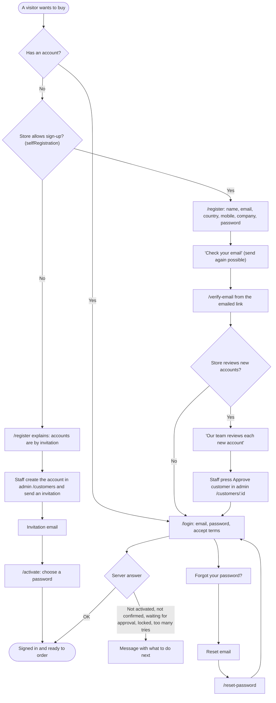

After sign-in, the person returns to the page they were trying to open.

**Admin panel sign-in** has more steps, each drawn in place of the panel so
it cannot be skipped:

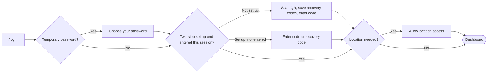

**Logistics portal sign-in**: nobody signs up. An invitation link opens
`/activate`, the person chooses a password, signs in, and owners and
administrators must set up a two-step code before anything else. Then `/`
sends each person to the right home screen for their role.

### 8.2 From a product to a confirmed order

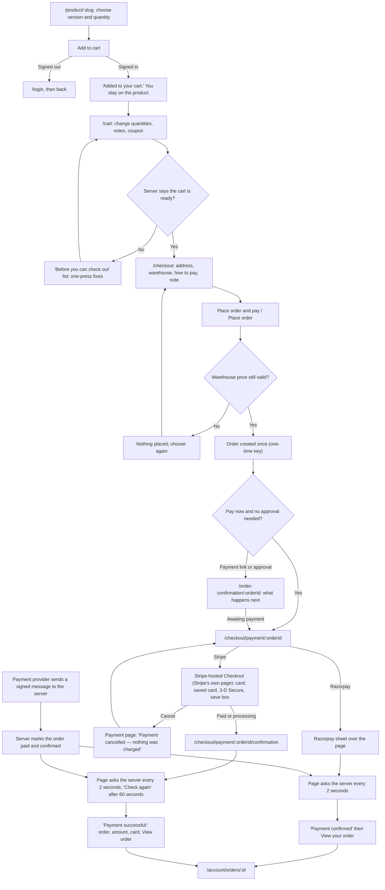

**The one rule:** the browser never decides that an order is paid. Coming
back from Stripe's page proves nothing. Only the payment provider's signed
message (the webhook), or the server asking the provider itself (**Check
again**), confirms it. The pages just wait for the server to say so.

### 8.3 Building a repeat order (schedule)

Only when the store has `recurringOrders` switched on.

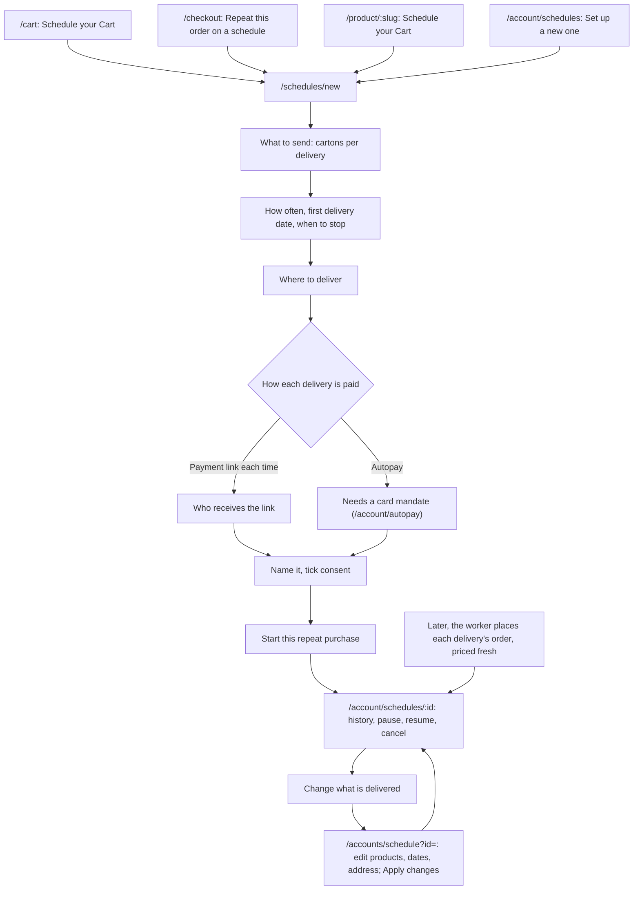

The estimate on screen is only an estimate: each delivery is priced again
when it runs, by the same calculation the review screen used.

### 8.4 Becoming a seller, and listing a product

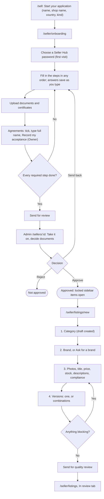

### 8.5 Reviewing a listing (admin)

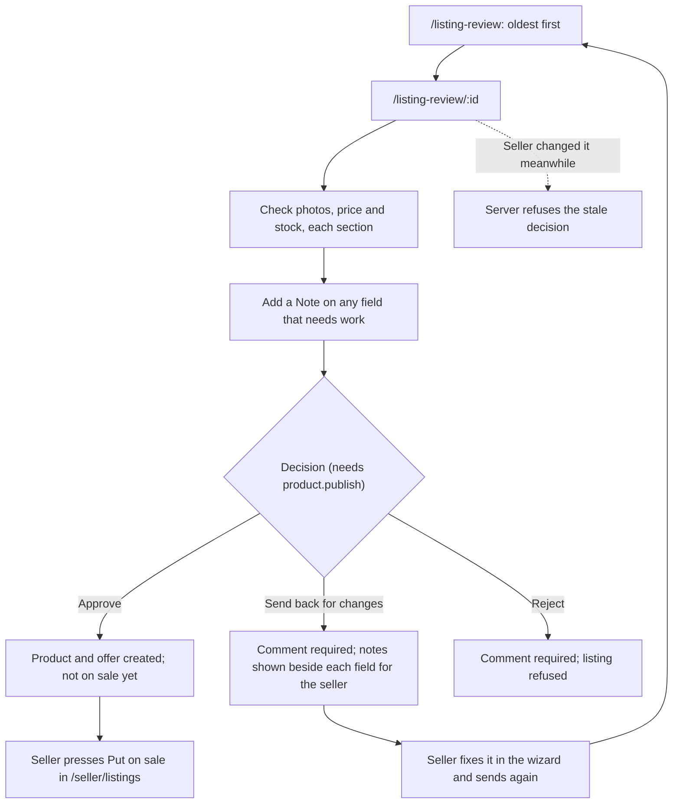

A brand name the seller asked for is decided separately on `/brand-requests`
(Approve, Ask for more, Refuse). A listing under a brand that is not yet
approved cannot go on sale.

### 8.6 Handling an order (admin and seller)

**In the admin panel** the order's status only ever moves through the steps
the server offers. The panel has no list of its own.

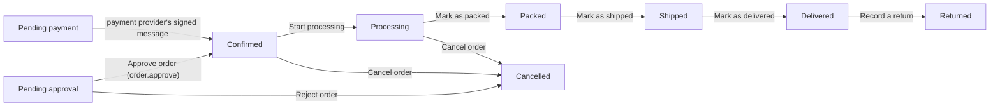

Treat this as a guide to the usual path. The buttons on `/orders/:id` are
exactly the steps the server says this person may take now. "Confirm order"
is never a manual step, and cancelling moves no money: a refund is made
separately on `/payments`.

**In the Seller Hub** each seller handles their own part of the order:

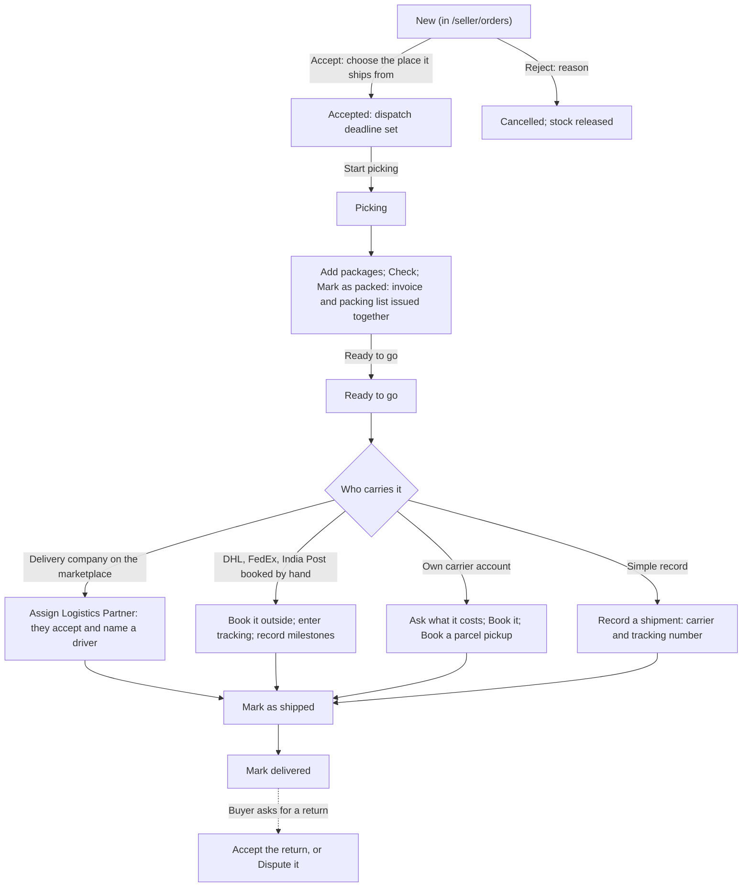

On orders priced on four delivery levels, each level the seller manages is
carried and handed over separately (L1 to L4), and UBOSS handles the others.

### 8.7 A consignment in the logistics portal

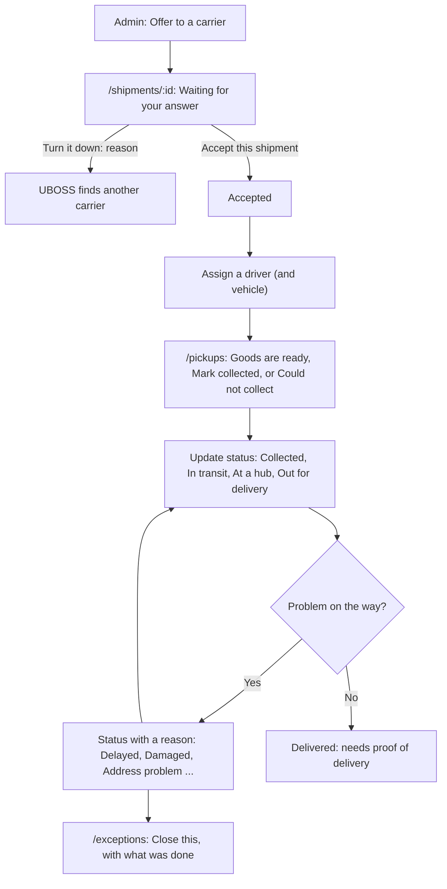

Two things the portal cannot do yet, and the flow above does not pretend it
can: there is no form to record **proof of delivery**, so "Delivered" cannot
be pressed from the portal; and there is no button to **raise** an exception
by itself (a problem is recorded by choosing a problem status).

**A driver's day**

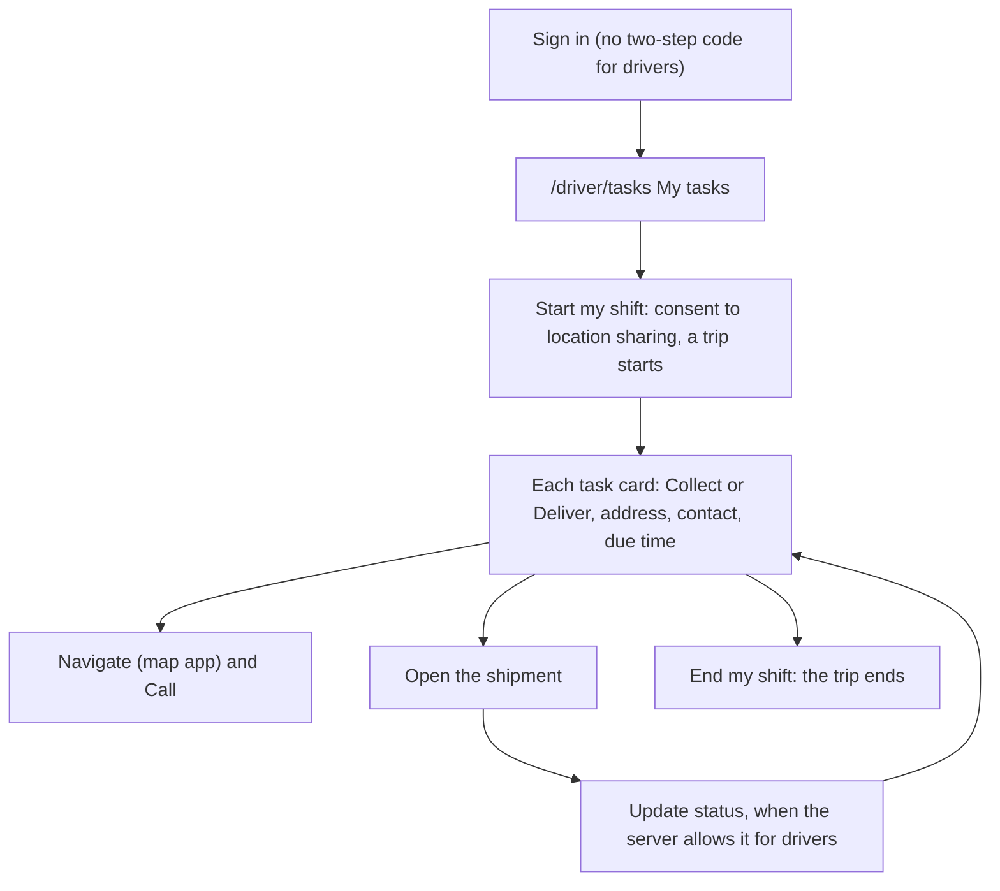

Signing in takes a driver straight to **My tasks**. A driver who types
`/dashboard` by hand sees "no access", because drivers cannot see the
company's whole list.

---

## 9. Shared components worth knowing

The three apps share no code in the browser, so each has its own copy of
these. Paths are relative to each app's `src` folder.

| Component | Where | What it does, and what to know |
|---|---|---|
| Buttons, fields, cards, badges | `components/ui.tsx` (all three) | `Button`, `Field`, `Input`, `Select`, `Textarea`, `Card`, `Badge`, `PageHeader`. The admin and logistics copies add `Callout`, `Metric`, `SummaryTiles`, `DescriptionList`, `Toolbar`, `Checkbox`, `MultiSelect`, `NoAccessState` |
| Empty, loading and error panels | `components/ui.tsx`: `EmptyState`, `LoadingState`, `ErrorState` | `ErrorState` shows the message in the reader's language, **Try again**, and the correlation id to quote to support |
| Form error summary | `components/ui.tsx`: `ErrorSummary` (storefront) | A red box listing every problem. It takes focus once, when it appears |
| Dialogs | `components/Modal.tsx`: `Modal`, `ConfirmDialog` (all three) | Built on the browser's `<dialog>`: focus stays inside, Escape closes it. Capped to the screen's height with only the middle scrolling. Page scrolling behind it is locked by `lib/scroll-lock.ts` |
| Messages that pop up | `components/toast.tsx`, `components/toast-context.ts` | "Saved.", "Added to your cart." and so on. Three tones: success, error, info |
| The sidebar | `components/ui/sidebar.tsx` (all three) | A rail of icons that widens on hover or focus, and a drawer on phones. Used by the admin panel, the account area and the logistics portal |
| Tables | `components/DataTable.tsx`: `DataTable`, `Pager` (admin, logistics) | Scrolls inside itself. Columns can be hidden on small screens (`secondary` below `lg`, `tertiary` below `xl`) |
| Quantity | `components/QuantityInput.tsx`, `lib/parse-quantity.ts` (storefront, every quantity box including the basket) | Steps by the product's own increment and keeps inside its minimum and maximum. **Safe quantity input:** whole positive pieces only, up to 100,000,000. A paste is read in the page language's convention ("1.000" is a thousand in German, one in English). Negative, zero, fractions, and anything not plain digits (`1e3`, `Infinity`, hex) are refused with a message under the box in eight languages; `e`, `+` and `-` are blocked; an empty box while retyping is not zero; leaving the box on something invalid puts back the last good quantity. The server checks the rules again; this only helps |
| Money and dates | `lib/format.ts` (all three): `formatMoney`, `minorToMajor`, `majorToMinor`, `formatDate`, `formatRelative`; the storefront adds `formatMoneyMinor` | Amounts arrive as whole minor units written as text and are never turned into a floating-point number. The currency's own number of decimals is respected |
| Other prices | `components/ApproximatePrice.tsx`, `components/BandPriceValue.tsx`, `components/Totals.tsx`, `components/DeliveryBreakdown.tsx` (storefront) | An approximate price in another currency; a quantity-band price; the rows of a total; the L1 to L4 delivery charges |
| The checkout progress bar | `components/CheckoutSteps.tsx`, `lib/checkout-steps.ts` (storefront) | Cart → Address → Payment → Confirmation. A step is ticked only when it is truly done |
| The bottom bar on phones | `components/StickyBottomBar.tsx` (storefront) | Publishes its height as `--page-bottom-bar` so nothing else sits on it |
| Cart tabs | `components/CartModeTabs.tsx` (storefront) | Instant Buy and Schedule Cart. Shown only when recurring orders are on |
| Version choice | `components/VariantSelector.tsx` (storefront) | One control per option; combinations that do not exist are greyed out |
| Addresses | `components/AddressForm.tsx`, `components/AddressSuggest.tsx`, `components/BusinessAddressFields.tsx` (storefront) | The address form with suggestions as you type; the six-part registered address for sellers |
| Cards on file | `components/CardSetupDialog.tsx`, `components/AutoPaySetupDialog.tsx` (storefront) | The card fields are the payment provider's own; the store never sees a card number. Checkout card payments happen on Stripe-hosted Checkout, not in a storefront component |
| Flags | `components/CountryFlag.tsx` (storefront, admin) | Drawn in code, not emoji or images, so they look the same on every machine and need nothing from the internet |
| Market control | `components/market/*` (storefront) | The header control for language, country and currency |
| Light and dark | `components/ThemeToggle.tsx` (all three) | Match my device, Light, Dark |
| Dashboard pieces | `components/dashboard/ModernDonutCard.tsx`, `AiInsightsCard.tsx`, `controls.tsx`, `console.tsx` (all three) | The ring chart with its table view, the AI insights card, and the period tabs used on every dashboard |
| Small charts | `components/charts.tsx`: `Sparkline`, `Delta`, `ProportionBar` (admin, logistics) | The trend line, the change figure, and the stacked bar |
| QR code | `components/QrCode.tsx` (admin), `pages/QrCode.tsx` (logistics) | Drawn in the browser for two-step sign-in; nothing is sent anywhere |
| Sign-in layout | `components/ui/auth-split.tsx`, `auth-globe.tsx` (all three) | The two-column sign-in screen with the earth |
| Demo sign-ins | `components/DemoLoginPanel.tsx` (all three) | Only when built with `VITE_DEMO_LOGINS` |
| Page not found, crash | `pages/NotFoundPage.tsx` (storefront), `app/ErrorBoundary.tsx` and `app/RouteFallback.tsx` (all three) | The 404 page, the crash screen, and the spinner while a page loads. The admin panel and logistics portal have no 404 page: an unknown address goes home |

---

## 10. Glossary

| Word | Meaning here |
|---|---|
| **Activated customer** | A customer account that has finished signing up (or accepted its invitation) and may buy |
| **AI Mode** | The storefront's shopping assistant at `/ai` |
| **Autopay** | A customer's permission for scheduled deliveries to be charged to a saved card without them present, within limits they set |
| **Business Owner** | The staff role that can do everything in the admin panel |
| **Carrier** | A haulage company that carries goods. On the marketplace it is a *logistics partner* with its own portal |
| **Consignment** | One parcel or group of packages that travels together. One order can have several |
| **Correlation id** | A code on every error that support can use to find the exact server log line |
| **Credit note** | The only way to correct an invoice once it has been issued |
| **Dispatch deadline** | When a seller must send an order, worked out from the place it ships from |
| **Draft (listing)** | A listing still being written in the wizard, saved on the server |
| **ERP** | A company's own business system. There are three separate ERP features: the **operator's** warehouse ERP (admin Settings → ERP), each **buyer's** purchasing system (storefront account area), and each **seller's** TallyPrime (Seller Hub). They are not the same thing |
| **Feature flag** | A switch that turns a part of the product on or off for one installation |
| **Fulfilment** | Getting goods from the shelf to the buyer: picking, packing, carrying |
| **GPSR** | EU product safety law; it is why products name a manufacturer and a responsible person |
| **Idempotency key** | A one-time key sent with a request that must not happen twice, so a retry is applied only once |
| **Instant Buy** | The ordinary cart, paid for now |
| **L1, L2, L3, L4** | The four delivery levels: First mile, International transport, Destination inland transport, Last mile |
| **Listing** | A seller's offer of a product: its price, stock and rules |
| **Listing review** | The operator's quality check of a seller's listing before it can go on sale |
| **Logistics partner** | A carrier company registered with the marketplace |
| **Mandate** | A customer's standing permission to charge a card later |
| **Market** | The country a buyer orders from. It decides the price list and the tax |
| **Minor units** | The smallest unit of a currency (cents, paise). All money is kept in these |
| **Operator** | The company that runs a Glovia installation and its staff |
| **Payment link** | A secure link emailed so somebody else (often a finance team) can pay an order |
| **Permission** | One thing a role may do, such as `order.approve` |
| **Preorder** | A buyer's request to a seller for a large quantity by a date. It becomes an order only once the buyer confirms and pays |
| **Proof of delivery** | What a delivery must record: who took it, a signature, a photo or a code |
| **Recurring order, schedule, repeat purchase, standing order** | The same thing: an order placed again on dates the buyer chose |
| **Schedule Cart** | The cart's second tab, `/accounts/schedule`, where standing orders are changed |
| **Seller** | A business that sells on the marketplace through the Seller Hub |
| **Seller Hub** | The sellers' workspace at `/seller` |
| **Seller Hub password** | A second password that opens the Seller Hub, separate from the shop password |
| **Settlement** | A statement of what a seller sold, what the marketplace kept, and what is paid out |
| **SKU** | A product's code |
| **Tunnel** | A way to show a development machine to somebody elsewhere; the admin panel and portal are then served under `/admin/` and `/logistics/` |
| **Two-step sign-in** | A six-digit code from an authenticator app, asked after the password |
| **Variant, version** | One exact form of a product, such as one size and colour |
| **VIES** | The EU service that confirms a VAT number |
| **Webhook** | A signed message the payment provider sends to the server. It is the only thing that confirms an order is paid |
| **Wishlist, Save for later** | Products a customer kept without buying |

---

## 11. Screenshots

**In the repository** (`docs/logistics-screenshots/`, linked from the
screens above):

| File | What it shows |
|---|---|
| [01-portal-dashboard-desktop.jpg](logistics-screenshots/01-portal-dashboard-desktop.jpg) | Logistics portal dashboard, desktop, dark theme. An **older** layout with counters; today it is the ring and AI card |
| [02-portal-shipments-desktop.jpg](logistics-screenshots/02-portal-shipments-desktop.jpg) | Logistics portal, Shipments list |
| [03-admin-consignments-desktop.jpg](logistics-screenshots/03-admin-consignments-desktop.jpg) | Admin panel, Logistics → Consignments |
| [04-admin-carrier-connections-desktop.jpg](logistics-screenshots/04-admin-carrier-connections-desktop.jpg) | Admin panel, Logistics → Carrier connections |
| [05-portal-shipments-tablet-and-phone.jpg](logistics-screenshots/05-portal-shipments-tablet-and-phone.jpg) | Logistics portal, Shipments on a tablet and a phone |
| [06-portal-detail-tablet-dashboard-phone.jpg](logistics-screenshots/06-portal-detail-tablet-dashboard-phone.jpg) | A shipment on a tablet, and the older dashboard on a phone |
| [07-portal-mfa-enrolment-desktop.jpg](logistics-screenshots/07-portal-mfa-enrolment-desktop.jpg) | Logistics portal, setting up two-step sign-in |

These were taken before the delivery legs and integration screens were added,
so the portal's sidebar in them is shorter than it is now.

**On a machine that has run the capture scripts** (`scripts/capture-*.mjs`),
there is a larger set in `output/live-sitemap-screenshots/`. That folder is
**not in git**, so the screen entries above name those files ("Local
screenshot") rather than linking them. The names run from
`01-customer-home.png` to `45-admin-data-requests.png`. A few numbers appear
twice (for example `22-admin-chat-enquiries.png` and `22-admin-reports.png`),
because the set was captured in more than one run.
