# Database reference: every table, column, index and enum

> **Generated file - do not edit by hand.** It is rebuilt from
> `backend/prisma/schema.prisma` by `scripts/build-reference-docs.mjs`.
> After changing that code, run `cd scripts; npm run docs` and commit the result.
> `npm run docs:check` fails when this file has fallen behind the code.

This is the complete list. For **why** the database is shaped this way - the principles, the domains, the life of an order in rows - read [`../DATABASE-DESIGN.md`](../DATABASE-DESIGN.md) first.

**226 tables · 203 enums · 550 extra indexes and unique keys**, in 42 groups. The groups follow the section banners in the schema file.

## How to read this file

- **Model** is the name the code uses. **Table** is the name in MariaDB.
- **Type** is the Prisma type, then the exact database type after the dot, e.g. `String · Char(26)`.
  - `Char(26)` holding an id is a **ULID**: a sortable, 26-character unique id.
  - `BigInt` holding money (a name ending in `Minor`) is an amount in **minor units** - paise, cents. `12345` in INR is ₹123.45. Money is never a decimal fraction here.
  - `DateTime · DateTime(3)` is an instant in **UTC**, to the millisecond.
- **Null?** "yes" means the column may be empty.
- **Key**: `PK` primary key, `FK →` foreign key (points at another table), `UNIQUE` no two rows may share it.
- **List** rows (a type ending `[]`) are not columns. They are the other side of a relation: "this row has many of those".
- In each diagram, `||--o{` means "one to many", `||--o|` "one to zero-or-one", `}o--||` "many to one".

## Groups

| Group | Tables | Enums |
|---|---|---|
| [Identity & access](#group-identity-access) | 8 | 3 |
| [Business configuration](#group-business-configuration) | 7 | 1 |
| [Media](#group-media) | 1 | 0 |
| [Catalog](#group-catalog) | 9 | 5 |
| [/ whether a warehouse is currently shipping, and how well. / / deliberately not the same axis as `isactive`, and confusing the two is the / mistake this enum exists to prevent. `isactive` answers "is this place part / of the business at all" - a retired warehouse is archived master data and / disappears from every picker. this answers "of the places that are, can / this one move a box today". a warehouse under a roof repair is thoroughly / active and cannot ship a thing.](#group-whether-a-warehouse-is-currently-shipping-and-how-well-deliberately-not-the-same-axis-as-isactive-and-confusing-the-two-is-the-mistake-this-enum-exists-to-prevent-isactive-answers-is-this-place-part-of-the-business-at-all-a-retired-warehouse-is-archived-master-data-and-disappears-from-every-picker-this-answers-of-the-places-that-are-can-this-one-move-a-box-today-a-warehouse-under-a-roof-repair-is-thoroughly-active-and-cannot-ship-a-thing) | 6 | 4 |
| [Customers](#group-customers) | 2 | 1 |
| [Cart](#group-cart) | 2 | 1 |
| [Orders](#group-orders) | 5 | 6 |
| [Payments](#group-payments) | 5 | 7 |
| [Recurring purchases](#group-recurring-purchases) | 5 | 10 |
| [/ one warehouse's offer for one basket, frozen. / / rows are cheap and short-lived: one per eligible option per request, swept / once they expire unless an order points at them. a quote attached to an / order is kept for ever - it is the evidence of what the customer was shown / before they agreed to pay.](#group-one-warehouse-s-offer-for-one-basket-frozen-rows-are-cheap-and-short-lived-one-per-eligible-option-per-request-swept-once-they-expire-unless-an-order-points-at-them-a-quote-attached-to-an-order-is-kept-for-ever-it-is-the-evidence-of-what-the-customer-was-shown-before-they-agreed-to-pay) | 3 | 2 |
| [Integrations (custom product/inventory API connector)](#group-integrations-custom-product-inventory-api-connector) | 3 | 5 |
| [Bulk import / export](#group-bulk-import-export) | 3 | 1 |
| [Notifications (transactional outbox)](#group-notifications-transactional-outbox) | 2 | 1 |
| [/ whether a console row is a problem or a piece of news. / / the distinction the bell could not previously draw, and the one the whole / resolution lifecycle hangs off. "a customer placed an order" is news: it is / true forever, nobody can fix it, and the only sensible way to clear it is / for somebody to read it. "a consignment went warm" is a problem: it stays / worth acting on until the underlying exception is closed, whether or not / anybody has glanced at the bell. / / counting both the same way is what made a bell that either nagged forever / or went quiet the moment somebody looked at it.](#group-whether-a-console-row-is-a-problem-or-a-piece-of-news-the-distinction-the-bell-could-not-previously-draw-and-the-one-the-whole-resolution-lifecycle-hangs-off-a-customer-placed-an-order-is-news-it-is-true-forever-nobody-can-fix-it-and-the-only-sensible-way-to-clear-it-is-for-somebody-to-read-it-a-consignment-went-warm-is-a-problem-it-stays-worth-acting-on-until-the-underlying-exception-is-closed-whether-or-not-anybody-has-glanced-at-the-bell-counting-both-the-same-way-is-what-made-a-bell-that-either-nagged-forever-or-went-quiet-the-moment-somebody-looked-at-it) | 2 | 4 |
| [Job queue (MariaDB-backed; Redis driver is an alternative, not a requirement)](#group-job-queue-mariadb-backed-redis-driver-is-an-alternative-not-a-requirement) | 2 | 0 |
| [Audit](#group-audit) | 1 | 0 |
| [Sequences](#group-sequences) | 1 | 0 |
| [Localisation, currency & pricing](#group-localisation-currency-pricing) | 3 | 0 |
| [/ whether the fetch itself worked.](#group-whether-the-fetch-itself-worked) | 2 | 2 |
| [Coupons](#group-coupons) | 5 | 2 |
| [Storefront assistant](#group-storefront-assistant) | 4 | 1 |
| [Data protection (GDPR)](#group-data-protection-gdpr) | 1 | 2 |
| [/ which of a member state's rate bands a product falls in. / / deliberately the bands rather than the numbers. every member state sets its / own percentages and changes them on its own schedule; what is stable is / that a given product is "the standard rate here" or "the reduced rate / here". storing the band on the tax class and the percentage per country is / what lets one catalogue be sold into twenty-seven of them.](#group-which-of-a-member-state-s-rate-bands-a-product-falls-in-deliberately-the-bands-rather-than-the-numbers-every-member-state-sets-its-own-percentages-and-changes-them-on-its-own-schedule-what-is-stable-is-that-a-given-product-is-the-standard-rate-here-or-the-reduced-rate-here-storing-the-band-on-the-tax-class-and-the-percentage-per-country-is-what-lets-one-catalogue-be-sold-into-twenty-seven-of-them) | 2 | 2 |
| [Invoicing](#group-invoicing) | 1 | 0 |
| [/ the roles union product law recognises for whoever put a product on the / market. named after the law rather than after the supply chain: an / "importer" here is the art. 4 reg. 2019/1020 economic operator, not / whichever company happens to have shipped the container.](#group-the-roles-union-product-law-recognises-for-whoever-put-a-product-on-the-market-named-after-the-law-rather-than-after-the-supply-chain-an-importer-here-is-the-art-4-reg-2019-1020-economic-operator-not-whichever-company-happens-to-have-shipped-the-container) | 1 | 1 |
| [/ risk class, under the annex viii rules. / / class i is subdivided because the subdivision decides whether a notified / body is involved at all: a plain class i device is self-certified, but one / that is supplied sterile, has a measuring function, or is a reusable / surgical instrument needs a notified body for that specific aspect. a / validator that treated "class i" as one thing would let a sterile syringe / publish with no nb number, which is the exact case it exists to catch.](#group-risk-class-under-the-annex-viii-rules-class-i-is-subdivided-because-the-subdivision-decides-whether-a-notified-body-is-involved-at-all-a-plain-class-i-device-is-self-certified-but-one-that-is-supplied-sterile-has-a-measuring-function-or-is-a-reusable-surgical-instrument-needs-a-notified-body-for-that-specific-aspect-a-validator-that-treated-class-i-as-one-thing-would-let-a-sterile-syringe-publish-with-no-nb-number-which-is-the-exact-case-it-exists-to-catch) | 2 | 1 |
| [/ where the ERP connection stands. / / the order matters and the gaps matter. draft -&gt; testing -&gt; connected is the / setup path, and active is reachable only from connected: a connection that / has never answered a test cannot start carrying orders. see / `ERP-connection-state.ts`, which is the only thing allowed to move a row / between these.](#group-where-the-erp-connection-stands-the-order-matters-and-the-gaps-matter-draft-testing-connected-is-the-setup-path-and-active-is-reachable-only-from-connected-a-connection-that-has-never-answered-a-test-cannot-start-carrying-orders-see-erp-connection-state-ts-which-is-the-only-thing-allowed-to-move-a-row-between-these) | 7 | 9 |
| [Saved for later](#group-saved-for-later) | 1 | 0 |
| [Instructions left on a product without buying it](#group-instructions-left-on-a-product-without-buying-it) | 1 | 0 |
| [/ what somebody may do inside a buyer organisation. / / three levels rather than a permission matrix, because there are exactly / three questions a buyer's it department actually has: who owns this, who / may change the credentials, and who may look. a fourth role would have to / be explained to somebody, and nobody has asked for one.](#group-what-somebody-may-do-inside-a-buyer-organisation-three-levels-rather-than-a-permission-matrix-because-there-are-exactly-three-questions-a-buyer-s-it-department-actually-has-who-owns-this-who-may-change-the-credentials-and-who-may-look-a-fourth-role-would-have-to-be-explained-to-somebody-and-nobody-has-asked-for-one) | 19 | 20 |
| [/ where a seller's application has got to. / / the order matters: this is a state machine, enforced in / `domain/seller-state.ts`, and nothing writes this column directly - the / same rule `orderstatus` and `schedulestatus` follow, for the same reason. / an application decides whether a business may put medical devices in front / of hospitals, so "how did it get to approved" must always have an answer.](#group-where-a-seller-s-application-has-got-to-the-order-matters-this-is-a-state-machine-enforced-in-domain-seller-state-ts-and-nothing-writes-this-column-directly-the-same-rule-orderstatus-and-schedulestatus-follow-for-the-same-reason-an-application-decides-whether-a-business-may-put-medical-devices-in-front-of-hospitals-so-how-did-it-get-to-approved-must-always-have-an-answer) | 33 | 25 |
| [/ how a seller came to be able to use a carrier. / / stored because it decides who may end the relationship and on what notice, / which is a question that gets asked exactly once - during a dispute.](#group-how-a-seller-came-to-be-able-to-use-a-carrier-stored-because-it-decides-who-may-end-the-relationship-and-on-what-notice-which-is-a-question-that-gets-asked-exactly-once-during-a-dispute) | 1 | 2 |
| [/ who is responsible for moving a seller's goods. / / read together with `sellerfulfilmentmethod.status`: a mode says what kind / of delivery this is, the status says whether it may be used yet. a seller / can have a dedicated_partner method sitting in pending_approval for a / fortnight while their integrated_carrier method carries everything.](#group-who-is-responsible-for-moving-a-seller-s-goods-read-together-with-sellerfulfilmentmethod-status-a-mode-says-what-kind-of-delivery-this-is-the-status-says-whether-it-may-be-used-yet-a-seller-can-have-a-dedicated-partner-method-sitting-in-pending-approval-for-a-fortnight-while-their-integrated-carrier-method-carries-everything) | 11 | 12 |
| [Logistics partner portal](#group-logistics-partner-portal) | 27 | 28 |
| [Demo catalogue](#group-demo-catalogue) | 1 | 0 |
| [/ a package a buyer can order by. / / parallel to the four bulk members of `orderingunit` rather than the same / enum, because the two answer different questions: this one is configuration / ("may this be bought by the pallet?") and that one is a historical fact on / a line ("this was bought by the pallet"). keeping them apart is what lets a / package type be retired from the configuration without rewriting the / meaning of every order that used it.](#group-a-package-a-buyer-can-order-by-parallel-to-the-four-bulk-members-of-orderingunit-rather-than-the-same-enum-because-the-two-answer-different-questions-this-one-is-configuration-may-this-be-bought-by-the-pallet-and-that-one-is-a-historical-fact-on-a-line-this-was-bought-by-the-pallet-keeping-them-apart-is-what-lets-a-package-type-be-retired-from-the-configuration-without-rewriting-the-meaning-of-every-order-that-used-it) | 5 | 9 |
| [/ what kind of transport a consignment actually needs.](#group-what-kind-of-transport-a-consignment-actually-needs) | 1 | 2 |
| [/ which accounting system. one member today; the abstraction is the point. / / the connector interface, the job pipeline, the mapping table and the bridge / are all provider-agnostic; only the payload builder and the response parser / are tally-specific. a second provider is a new module, not a new schema.](#group-which-accounting-system-one-member-today-the-abstraction-is-the-point-the-connector-interface-the-job-pipeline-the-mapping-table-and-the-bridge-are-all-provider-agnostic-only-the-payload-builder-and-the-response-parser-are-tally-specific-a-second-provider-is-a-new-module-not-a-new-schema) | 11 | 10 |
| [Seller logistics policy - who controls each of the four delivery levels, what each level costs, and what the seller is owed afterwards](#group-seller-logistics-policy-who-controls-each-of-the-four-delivery-levels-what-each-level-costs-and-what-the-seller-is-owed-afterwards) | 9 | 12 |
| [/ which level of the fallback chain a policy sits at. / / offer -&gt; product -&gt; seller_default -&gt; the platform's own defaults (config) / / the first one that exists wins, whole. a variant whose own policy says / "disabled" is disabled, and does not fall through to an enabled product / policy - a seller who switched one variant off meant it.](#group-which-level-of-the-fallback-chain-a-policy-sits-at-offer-product-seller-default-the-platform-s-own-defaults-config-the-first-one-that-exists-wins-whole-a-variant-whose-own-policy-says-disabled-is-disabled-and-does-not-fall-through-to-an-enabled-product-policy-a-seller-who-switched-one-variant-off-meant-it) | 6 | 9 |
| [Seller documents: invoices and packing lists](#group-seller-documents-invoices-and-packing-lists) | 5 | 3 |

<a id="group-identity-access"></a>

## Identity & access

[User](#model-user) · [Role](#model-role) · [Permission](#model-permission) · [RolePermission](#model-rolepermission) · [UserRole](#model-userrole) · [Session](#model-session) · [AuthToken](#model-authtoken) · [LoginAttempt](#model-loginattempt)

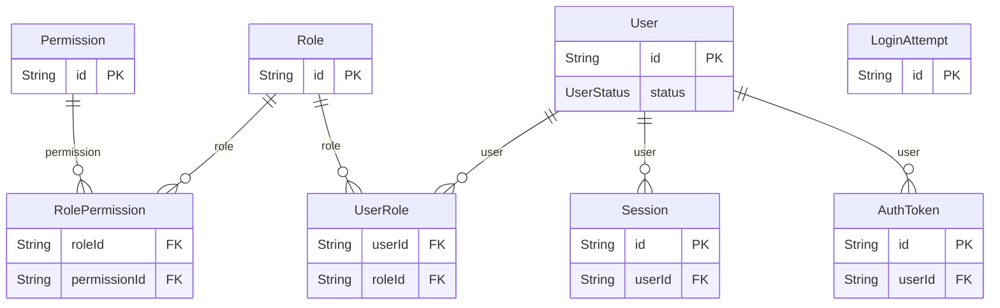

<a id="model-user"></a>

### User

Table `users`

| Column | Type | Null? | Key | Default | Notes |
|---|---|---|---|---|---|
| `id` | String · Char(26) |  | PK |  |  |
| `type` | [enum UserType](#enum-usertype) |  |  |  |  |
| `email` | String · VarChar(320) |  |  |  |  |
| `emailNormalized` | String · VarChar(320) |  | UNIQUE |  | Lowercased/trimmed email. Uniqueness is enforced here, not on `email`. |
| `phone` | String · VarChar(32) | yes |  |  |  |
| `passwordHash` | String · VarChar(255) | yes |  |  |  |
| `status` | [enum UserStatus](#enum-userstatus) |  |  | PENDING_INVITATION |  |
| `emailVerifiedAt` | DateTime · DateTime(3) | yes |  |  |  |
| `phoneVerifiedAt` | DateTime · DateTime(3) | yes |  |  |  |
| `pendingEmail` | String · VarChar(320) | yes |  |  | An address the holder has asked to move to, not yet confirmed. |
| `pendingEmailNormalized` | String · VarChar(320) | yes |  |  |  |
| `pendingPhone` | String · VarChar(32) | yes |  |  | A telephone number the holder has asked to move to, not yet confirmed. |
| `mustChangePassword` | Boolean |  |  | false | Set when the account was opened with a system-issued temporary password. While it is true the session may sign in and do exactly one thing: choose a real password. Every other admin route refuses it. |
| `temporaryPasswordExpiresAt` | DateTime · DateTime(3) | yes |  |  | When that temporary password stops working. A password emailed in plaintext sits in an inbox forever otherwise; this is what stops it being a permanent key. Null once the holder has chosen their own. |
| `mfaSecretEnc` | String · Text | yes |  |  | TOTP secret, AES-256-GCM encrypted. Null until an admin enrols in MFA. |
| `mfaEnabledAt` | DateTime · DateTime(3) | yes |  |  |  |
| `mfaLastCounter` | BigInt | yes |  |  | The highest TOTP counter this account has already spent. |
| `mfaRecoveryCodeHashesJson` | Json | yes |  |  | SHA-256 of each UNUSED recovery code, as a JSON array of strings. |
| `preferredLanguage` | String · VarChar(10) | yes |  |  | The language the interface is rendered in for this account, as a BCP-47 primary subtag ("pl", "el", "nl"). Deliberately on `User` rather than on `CustomerProfile`: staff need it too, and a staff account has no profile row to hang it from. |
| `lastLoginAt` | DateTime · DateTime(3) | yes |  |  |  |
| `failedLoginCount` | Int |  |  | 0 |  |
| `lockedUntil` | DateTime · DateTime(3) | yes |  |  |  |
| `createdAt` | DateTime · DateTime(3) |  |  | now() |  |
| `updatedAt` | DateTime · DateTime(3) |  | auto-updated |  |  |
| `archivedAt` | DateTime · DateTime(3) | yes |  |  | Soft delete. Transactional history keeps referencing the row. |
| `erasedAt` | DateTime · DateTime(3) | yes |  |  | When an Art. 17 erasure rewrote this row. Distinct from `archivedAt`, which only means 'no longer in use': an archived account can be brought back, an erased one has nothing left to bring back. Set once and never cleared - it is the evidence the erasure happened. |

**Relations**

- `roles` ← [UserRole](#model-userrole) - has many
- `sessions` ← [Session](#model-session) - has many
- `authTokens` ← [AuthToken](#model-authtoken) - has many
- `customerProfile` ← [CustomerProfile](#model-customerprofile) - has zero or one
- `auditLogs` ← [AuditLog](#model-auditlog) - has many
- `notificationReads` ← [AdminNotificationRead](#model-adminnotificationread) - has many
- `notificationsResolved` ← [AdminNotification](#model-adminnotification) - has many
- `logisticsMembership` ← [LogisticsPartnerUser](#model-logisticspartneruser) - has zero or one
- `logisticsAuditLogs` ← [LogisticsAuditLog](#model-logisticsauditlog) - has many
- `logisticsPings` ← [LogisticsLocationPing](#model-logisticslocationping) - has many

**Indexes and keys**

- `@@index([type, status], map: "ix_user_type_status")`
- `@@index([createdAt], map: "ix_user_created_at")`
- `@@index([pendingEmailNormalized], map: "ix_user_pending_email")`

<a id="model-role"></a>

### Role

Table `roles`

| Column | Type | Null? | Key | Default | Notes |
|---|---|---|---|---|---|
| `id` | String · Char(26) |  | PK |  |  |
| `key` | String · VarChar(64) |  | UNIQUE |  |  |
| `name` | String · VarChar(128) |  |  |  |  |
| `description` | String · VarChar(512) | yes |  |  |  |
| `isSystem` | Boolean |  |  | false | System roles cannot be renamed or deleted from the admin UI. |
| `createdAt` | DateTime · DateTime(3) |  |  | now() |  |
| `updatedAt` | DateTime · DateTime(3) |  | auto-updated |  |  |

**Relations**

- `permissions` ← [RolePermission](#model-rolepermission) - has many
- `users` ← [UserRole](#model-userrole) - has many

<a id="model-permission"></a>

### Permission

Table `permissions`

| Column | Type | Null? | Key | Default | Notes |
|---|---|---|---|---|---|
| `id` | String · Char(26) |  | PK |  |  |
| `key` | String · VarChar(96) |  | UNIQUE |  | Dotted resource.action, e.g. `product.publish`, `refund.create`. |
| `description` | String · VarChar(512) | yes |  |  |  |

**Relations**

- `roles` ← [RolePermission](#model-rolepermission) - has many

<a id="model-rolepermission"></a>

### RolePermission

Table `role_permissions`

| Column | Type | Null? | Key | Default | Notes |
|---|---|---|---|---|---|
| `roleId` | String · Char(26) |  | FK → [Role](#model-role) |  | (on delete: Cascade) |
| `permissionId` | String · Char(26) |  | FK → [Permission](#model-permission) |  | (on delete: Cascade) |

**Relations**

- `role` → [Role](#model-role) via `roleId` - many-to-one, required, on delete **Cascade**
- `permission` → [Permission](#model-permission) via `permissionId` - many-to-one, required, on delete **Cascade**

**Indexes and keys**

- `@@id([roleId, permissionId])`
- `@@index([permissionId], map: "ix_role_permission_permission")`

<a id="model-userrole"></a>

### UserRole

Table `user_roles`

| Column | Type | Null? | Key | Default | Notes |
|---|---|---|---|---|---|
| `userId` | String · Char(26) |  | FK → [User](#model-user) |  | (on delete: Cascade) |
| `roleId` | String · Char(26) |  | FK → [Role](#model-role) |  | (on delete: Restrict) |
| `assignedById` | String · Char(26) | yes |  |  |  |
| `assignedAt` | DateTime · DateTime(3) |  |  | now() |  |

**Relations**

- `user` → [User](#model-user) via `userId` - many-to-one, required, on delete **Cascade**
- `role` → [Role](#model-role) via `roleId` - many-to-one, required, on delete **Restrict**

**Indexes and keys**

- `@@id([userId, roleId])`
- `@@index([roleId], map: "ix_user_role_role")`

<a id="model-session"></a>

### Session

Table `sessions`

| Column | Type | Null? | Key | Default | Notes |
|---|---|---|---|---|---|
| `id` | String · Char(26) |  | PK |  |  |
| `userId` | String · Char(26) |  | FK → [User](#model-user) |  | (on delete: Cascade) |
| `refreshTokenHash` | String · Char(64) |  | UNIQUE |  | SHA-256 of the refresh token. The raw token is returned once and never stored. |
| `familyId` | String · Char(26) |  |  |  | Rotation family. Reuse of a revoked token revokes the whole family. |
| `userAgent` | String · VarChar(512) | yes |  |  |  |
| `ipAddress` | String · VarChar(45) | yes |  |  |  |
| `locationLatitude` | Decimal · Decimal(9, 6) | yes |  |  | Where the device said this sign-in happened, from the browser's Geolocation API. Admin sessions carry it because the console refuses to open until it is recorded; a customer session never has it. |
| `locationLongitude` | Decimal · Decimal(9, 6) | yes |  |  |  |
| `locationAccuracyM` | Int | yes |  |  | The radius the device claimed, in metres. A wifi fix is a few hundred, a GPS fix single digits - shown alongside the place so a coarse fix is not read as a precise one. |
| `locationLabel` | String · VarChar(255) | yes |  |  | The reverse-geocoded place, when a lookup was possible. Null falls back to the coordinates, which are always present whenever this section is filled. |
| `locationCountry` | String · Char(2) | yes |  |  | The country that place is in, ISO-3166-1 alpha-2, when the geocoder named one. It is what the console prices for: a member of staff signing in from Germany is shown what a German customer pays, because that is the only market they can speak for. Null wherever no geocoder answered, and the console then quotes the… |
| `locationCapturedAt` | DateTime · DateTime(3) | yes |  |  |  |
| `mfaVerifiedAt` | DateTime · DateTime(3) | yes |  |  | When THIS session passed its second-factor challenge. |
| `sellerUnlockedAt` | DateTime · DateTime(3) | yes |  |  | When THIS session last presented the seller password, and for whom. |
| `sellerUnlockedForId` | String · Char(26) | yes |  |  |  |
| `expiresAt` | DateTime · DateTime(3) |  |  |  |  |
| `revokedAt` | DateTime · DateTime(3) | yes |  |  |  |
| `revokedReason` | String · VarChar(128) | yes |  |  |  |
| `replacedBySessionId` | String · Char(26) | yes |  |  |  |
| `familyStartedAt` | DateTime · DateTime(3) | yes |  |  | When the SIGN-IN behind this family happened. |
| `createdAt` | DateTime · DateTime(3) |  |  | now() |  |
| `lastUsedAt` | DateTime · DateTime(3) |  |  | now() |  |

**Relations**

- `user` → [User](#model-user) via `userId` - many-to-one, required, on delete **Cascade**

**Indexes and keys**

- `@@index([userId, revokedAt], map: "ix_session_user_revoked")`
- `@@index([familyId], map: "ix_session_family")`
- `@@index([expiresAt], map: "ix_session_expires")`

<a id="model-authtoken"></a>

### AuthToken

Table `auth_tokens`

| Column | Type | Null? | Key | Default | Notes |
|---|---|---|---|---|---|
| `id` | String · Char(26) |  | PK |  |  |
| `userId` | String · Char(26) |  | FK → [User](#model-user) |  | (on delete: Cascade) |
| `type` | [enum AuthTokenType](#enum-authtokentype) |  |  |  |  |
| `tokenHash` | String · Char(64) |  | UNIQUE |  | SHA-256 of a 32-byte random token. Single use, enforced via consumedAt. |
| `expiresAt` | DateTime · DateTime(3) |  |  |  |  |
| `consumedAt` | DateTime · DateTime(3) | yes |  |  |  |
| `createdById` | String · Char(26) | yes |  |  |  |
| `createdAt` | DateTime · DateTime(3) |  |  | now() |  |

**Relations**

- `user` → [User](#model-user) via `userId` - many-to-one, required, on delete **Cascade**

**Indexes and keys**

- `@@index([userId, type, consumedAt], map: "ix_auth_token_user_type")`
- `@@index([expiresAt], map: "ix_auth_token_expires")`

<a id="model-loginattempt"></a>

### LoginAttempt

Table `login_attempts`

| Column | Type | Null? | Key | Default | Notes |
|---|---|---|---|---|---|
| `id` | String · Char(26) |  | PK |  |  |
| `emailNormalized` | String · VarChar(320) |  |  |  |  |
| `userType` | [enum UserType](#enum-usertype) |  |  |  |  |
| `ipAddress` | String · VarChar(45) | yes |  |  |  |
| `success` | Boolean |  |  |  |  |
| `failureReason` | String · VarChar(64) | yes |  |  |  |
| `createdAt` | DateTime · DateTime(3) |  |  | now() |  |

**Indexes and keys**

- `@@index([emailNormalized, createdAt], map: "ix_login_attempt_email_time")`
- `@@index([ipAddress, createdAt], map: "ix_login_attempt_ip_time")`

### Enums in Identity & access

<a id="enum-usertype"></a>

#### enum UserType

| Value | Meaning |
|---|---|
| `ADMIN` |  |
| `CUSTOMER` |  |
| `LOGISTICS` | A person who works for a third-party logistics company. |

<a id="enum-userstatus"></a>

#### enum UserStatus

| Value | Meaning |
|---|---|
| `PENDING_INVITATION` |  |
| `PENDING_APPROVAL` |  |
| `ACTIVE` |  |
| `DEACTIVATED` |  |

<a id="enum-authtokentype"></a>

#### enum AuthTokenType

| Value | Meaning |
|---|---|
| `INVITATION` |  |
| `EMAIL_VERIFICATION` |  |
| `PASSWORD_RESET` |  |
| `EMAIL_CHANGE` | Confirming a NEW email address the holder has asked to move to. The address itself is parked in `users.pendingEmail` until this is consumed: an unverified address must never become the one the account signs in with, or a typo locks somebody out of their own purchasing account. |
| `PHONE_CHANGE` | Confirming a new telephone number, the same way. See the note on `users.pendingPhone` for what actually carries the code today. |

<a id="group-business-configuration"></a>

## Business configuration

[BusinessProfile](#model-businessprofile) · [TaxClass](#model-taxclass) · [ShippingMethod](#model-shippingmethod) · [CurrencyRateSync](#model-currencyratesync) · [CatalogTranslationSync](#model-catalogtranslationsync) · [FeatureFlag](#model-featureflag) · [NotificationSetting](#model-notificationsetting)

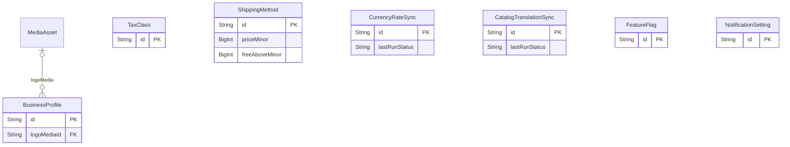

<a id="model-businessprofile"></a>

### BusinessProfile

Table `business_profile`

| Column | Type | Null? | Key | Default | Notes |
|---|---|---|---|---|---|
| `id` | String · Char(26) |  | PK |  | Single-row table. This deployment serves exactly one business. |
| `legalName` | String · VarChar(255) |  |  |  |  |
| `displayName` | String · VarChar(255) |  |  |  |  |
| `logoMediaId` | String · Char(26) | yes | FK → [MediaAsset](#model-mediaasset) |  | (on delete: SetNull) |
| `supportEmail` | String · VarChar(320) |  |  |  |  |
| `supportPhone` | String · VarChar(32) | yes |  |  |  |
| `gstin` | String · VarChar(32) | yes |  |  |  |
| `gpsrEnforced` | Boolean |  |  | false | Whether product listings must satisfy GPSR Art. 19 before they publish. |
| `sellerCommissionBasisPoints` | Int · SmallInt |  |  | 0 | What the marketplace keeps when a seller's offer is bought, in basis points (250 = 2.50%). |
| `showLogisticsLevelBreakdown` | Boolean |  |  | true | Whether a buyer sees L1-L4 as separate delivery lines, or one delivery total. A presentation choice only: the order keeps every level's amount either way, because a disputed delivery charge is answered from them. |
| `mdrEnforced` | Boolean |  |  | false | Whether a product marked as a medical device must carry its MDR identification before it publishes. |
| `vatNumber` | String · VarChar(32) | yes |  |  | The seller's EU VAT identification number, e.g. "NL123456789B01". Art. 226(3) requires it on every invoice; its presence is also what switches EU VAT resolution on for this deployment. |
| `vatCountry` | String · Char(2) | yes |  |  | The member state the business is established in for VAT. Decides which supplies are domestic, which are intra-Community, and which are exports. Null in a deployment that is not in the EU, and VAT resolution then never runs - the flat tax-class rate applies, as it always did. |
| `addressJson` | Json | yes |  |  | Registered/invoice address. Shape validated by Zod at the API boundary. |
| `currency` | String · Char(3) |  |  |  |  |
| `timezone` | String · VarChar(64) |  |  |  | IANA zone used for invoice dates, reports and schedule defaults. |
| `invoicePrefix` | String · VarChar(16) |  |  | "INV" |  |
| `orderPrefix` | String · VarChar(16) |  |  | "UB" |  |
| `policyLinksJson` | Json | yes |  |  |  |
| `createdAt` | DateTime · DateTime(3) |  |  | now() |  |
| `updatedAt` | DateTime · DateTime(3) |  | auto-updated |  |  |
| `updatedById` | String · Char(26) | yes |  |  |  |

**Relations**

- `logoMedia` → [MediaAsset](#model-mediaasset) via `logoMediaId` - many-to-one, optional, on delete **SetNull**

<a id="model-taxclass"></a>

### TaxClass

Table `tax_classes`

| Column | Type | Null? | Key | Default | Notes |
|---|---|---|---|---|---|
| `id` | String · Char(26) |  | PK |  |  |
| `code` | String · VarChar(32) |  | UNIQUE |  |  |
| `name` | String · VarChar(128) |  |  |  |  |
| `ratePercent` | Decimal · Decimal(9, 6) |  |  |  | Percent, e.g. 18.000000 for 18% GST. Decimal, never Float. |
| `vatCategory` | [enum VatCategory](#enum-vatcategory) | yes |  |  | Which EU rate band this class falls in. Null means "this class has no EU meaning": the flat `ratePercent` above is used wherever it is sold, which is the correct behaviour for GST and for any deployment with no VAT rates configured. Set it and the rate becomes a lookup against the destination member state instead -… |
| `isInclusive` | Boolean |  |  | false | true = listed price already contains tax (extract it) false = tax is added on top of the listed price |
| `isDefault` | Boolean |  |  | false |  |
| `isActive` | Boolean |  |  | true |  |
| `createdAt` | DateTime · DateTime(3) |  |  | now() |  |
| `updatedAt` | DateTime · DateTime(3) |  | auto-updated |  |  |

**Relations**

- `products` ← [Product](#model-product) - has many

**Indexes and keys**

- `@@index([isActive], map: "ix_tax_class_active")`

<a id="model-shippingmethod"></a>

### ShippingMethod

Table `shipping_methods`

| Column | Type | Null? | Key | Default | Notes |
|---|---|---|---|---|---|
| `id` | String · Char(26) |  | PK |  |  |
| `code` | String · VarChar(32) |  | UNIQUE |  |  |
| `name` | String · VarChar(128) |  |  |  |  |
| `description` | String · VarChar(512) | yes |  |  |  |
| `priceMinor` | BigInt |  |  | 0 |  |
| `freeAboveMinor` | BigInt | yes |  |  | Order subtotal at or above which this method costs nothing. Null = never free. |
| `regionsJson` | Json | yes |  |  | Serviceable regions/postcodes. Null = everywhere. |
| `estimatedDaysMin` | Int | yes |  |  |  |
| `estimatedDaysMax` | Int | yes |  |  |  |
| `isActive` | Boolean |  |  | true |  |
| `sortOrder` | Int |  |  | 0 |  |
| `createdAt` | DateTime · DateTime(3) |  |  | now() |  |
| `updatedAt` | DateTime · DateTime(3) |  | auto-updated |  |  |

**Indexes and keys**

- `@@index([isActive, sortOrder], map: "ix_shipping_method_active")`

<a id="model-currencyratesync"></a>

### CurrencyRateSync

Table `currency_rate_sync`

Keeping converted prices current, without ever converting at read time.

| Column | Type | Null? | Key | Default | Notes |
|---|---|---|---|---|---|
| `id` | String · Char(26) |  | PK |  |  |
| `isEnabled` | Boolean |  |  | false | Off until staff turn it on. A deployment that has never opened a second market must not start making outbound calls on a timer. |
| `marginPercent` | Decimal · Decimal(5, 2) |  |  | 0.00 | Added on top of every converted figure, as a percentage. |
| `rounding` | String · VarChar(8) |  |  | "charm" | How a converted figure is tidied: exact, whole, or charm. Mirrors the bulk pricing tool, so a scheduled run and a manual one agree. |
| `maxDriftPercent` | Decimal · Decimal(5, 2) |  |  | 15.00 | Abandon a run that would move any single price by more than this. |
| `lastRunAt` | DateTime · DateTime(3) | yes |  |  |  |
| `lastRunStatus` | String · VarChar(16) | yes |  |  | ok \| skipped \| failed - what the settings screen reports. |
| `lastRunMessage` | String · VarChar(512) | yes |  |  |  |
| `lastRunUpdated` | Int |  |  | 0 |  |
| `provider` | String · VarChar(32) |  |  | "json" | The adapter that fetches rates: "ecb" or "json". |
| `displayMaxAgeHours` | Int |  |  | 168 | How old a stored rate set may be and still be shown on a page. |
| `checkoutMaxAgeHours` | Int |  |  | 96 | How old a rate set may be and still have money taken against it. |
| `alertMaxAgeHours` | Int |  |  | 72 | Past this age the health check raises an operational alert, whether or not anything has yet failed to price. |
| `quoteTtlSeconds` | Int |  |  | 900 | How long a checkout quote holds its rate. |
| `deriveMissingPrices` | Boolean |  |  | false | Whether a currency with no price row of its own may be priced by converting the base-currency figure at read time. |
| `lastSuccessAt` | DateTime · DateTime(3) | yes |  |  | When a fetch last succeeded and last failed, kept apart so "it has been failing for six hours" is answerable without reading a log. |
| `lastFailureAt` | DateTime · DateTime(3) | yes |  |  |  |
| `consecutiveFailures` | Int |  |  | 0 | Drives the retry backoff, and reset to zero by any success. A worker that has failed eleven times in a row should not still be trying every hour. |
| `createdAt` | DateTime · DateTime(3) |  |  | now() |  |
| `updatedAt` | DateTime · DateTime(3) |  | auto-updated |  |  |
| `updatedById` | String · Char(26) | yes |  |  |  |

<a id="model-catalogtranslationsync"></a>

### CatalogTranslationSync

Table `catalog_translation_sync`

Machine-translating the catalogue itself.

| Column | Type | Null? | Key | Default | Notes |
|---|---|---|---|---|---|
| `id` | String · Char(26) |  | PK |  |  |
| `apiKeyEncrypted` | String · Text | yes |  |  | DeepL auth key, encrypted at rest with `SECRETS_ENCRYPTION_KEY`. Null until somebody enters one, which is what keeps the feature switched off. |
| `apiKeyHint` | String · VarChar(8) | yes |  |  | The last four characters of the key, so the panel can show *which* key is stored without being able to show the key. |
| `lastRunAt` | DateTime · DateTime(3) | yes |  |  |  |
| `lastRunStatus` | String · VarChar(16) | yes |  |  | ok \| skipped \| failed |
| `lastRunMessage` | String · VarChar(512) | yes |  |  |  |
| `lastRunTranslated` | Int |  |  | 0 |  |
| `isRunning` | Boolean |  |  | false | True while a run is in flight, so the panel can show progress and a second click cannot start an overlapping run. |
| `createdAt` | DateTime · DateTime(3) |  |  | now() |  |
| `updatedAt` | DateTime · DateTime(3) |  | auto-updated |  |  |
| `updatedById` | String · Char(26) | yes |  |  |  |

<a id="model-featureflag"></a>

### FeatureFlag

Table `feature_flags`

| Column | Type | Null? | Key | Default | Notes |
|---|---|---|---|---|---|
| `id` | String · Char(26) |  | PK |  |  |
| `key` | String · VarChar(96) |  | UNIQUE |  |  |
| `enabled` | Boolean |  |  | false |  |
| `description` | String · VarChar(512) | yes |  |  |  |
| `updatedAt` | DateTime · DateTime(3) |  | auto-updated |  |  |
| `updatedById` | String · Char(26) | yes |  |  |  |

<a id="model-notificationsetting"></a>

### NotificationSetting

Table `notification_settings`

| Column | Type | Null? | Key | Default | Notes |
|---|---|---|---|---|---|
| `id` | String · Char(26) |  | PK |  |  |
| `eventKey` | String · VarChar(96) |  | UNIQUE |  | e.g. `customer.invitation`, `order.confirmed`, `inventory.low_stock`. |
| `name` | String · VarChar(128) |  |  |  |  |
| `emailEnabled` | Boolean |  |  | true |  |
| `smsEnabled` | Boolean |  |  | false |  |
| `subjectTemplate` | String · VarChar(255) |  |  |  |  |
| `bodyTemplate` | String · Text |  |  |  |  |
| `internalRecipientsJson` | Json | yes |  |  | Extra internal recipients (Finance, Inventory Manager...) beyond the subject. |
| `isActive` | Boolean |  |  | true |  |
| `createdAt` | DateTime · DateTime(3) |  |  | now() |  |
| `updatedAt` | DateTime · DateTime(3) |  | auto-updated |  |  |

### Enums in Business configuration

<a id="enum-notificationchannel"></a>

#### enum NotificationChannel

| Value | Meaning |
|---|---|
| `EMAIL` |  |
| `SMS` |  |

<a id="group-media"></a>

## Media

[MediaAsset](#model-mediaasset)

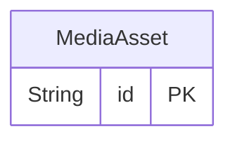

<a id="model-mediaasset"></a>

### MediaAsset

Table `media_assets`

| Column | Type | Null? | Key | Default | Notes |
|---|---|---|---|---|---|
| `id` | String · Char(26) |  | PK |  |  |
| `storageKey` | String · VarChar(512) |  | UNIQUE |  | Key inside the configured storage driver (local disk or S3). |
| `url` | String · VarChar(1024) |  |  |  |  |
| `mimeType` | String · VarChar(128) |  |  |  |  |
| `sizeBytes` | Int |  |  |  |  |
| `width` | Int | yes |  |  |  |
| `height` | Int | yes |  |  |  |
| `altText` | String · VarChar(512) | yes |  |  |  |
| `checksum` | String · Char(64) | yes |  |  | SHA-256 of the bytes; lets repeat uploads reuse an existing asset. |
| `uploadedById` | String · Char(26) | yes |  |  |  |
| `createdAt` | DateTime · DateTime(3) |  |  | now() |  |

**Relations**

- `productMedia` ← [ProductMedia](#model-productmedia) - has many
- `variantMedia` ← [ProductVariantMedia](#model-productvariantmedia) - has many
- `categoryImages` ← [Category](#model-category) - has many
- `categoryBanners` ← [Category](#model-category) - has many
- `businessProfiles` ← [BusinessProfile](#model-businessprofile) - has many

**Indexes and keys**

- `@@index([checksum], map: "ix_media_checksum")`

<a id="group-catalog"></a>

## Catalog

[Category](#model-category) · [Product](#model-product) · [ProductVariant](#model-productvariant) · [ProductVariantMedia](#model-productvariantmedia) · [ProductMedia](#model-productmedia) · [ProductAttribute](#model-productattribute) · [ProductPackaging](#model-productpackaging) · [ProductPackDimension](#model-productpackdimension) · [ProductImportRecord](#model-productimportrecord)

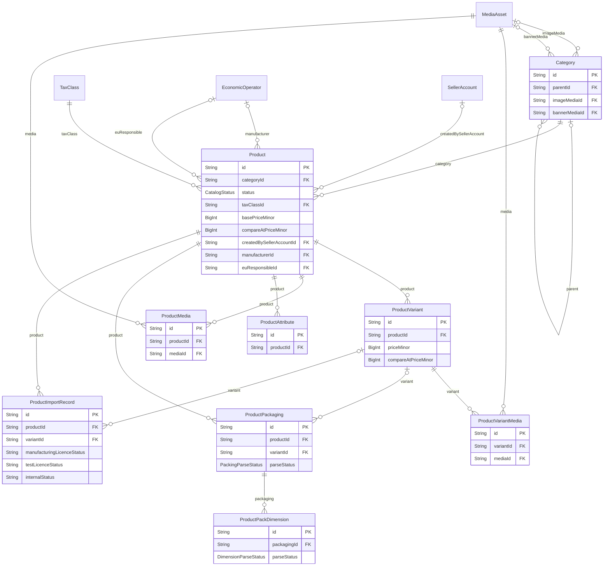

<a id="model-category"></a>

### Category

Table `categories`

| Column | Type | Null? | Key | Default | Notes |
|---|---|---|---|---|---|
| `id` | String · Char(26) |  | PK |  |  |
| `parentId` | String · Char(26) | yes | FK → [Category](#model-category) |  | (on delete: Restrict) |
| `name` | String · VarChar(255) |  |  |  |  |
| `slug` | String · VarChar(255) |  | UNIQUE |  |  |
| `description` | String · Text | yes |  |  |  |
| `imageMediaId` | String · Char(26) | yes | FK → [MediaAsset](#model-mediaasset) |  | (on delete: SetNull) |
| `bannerMediaId` | String · Char(26) | yes | FK → [MediaAsset](#model-mediaasset) |  | (on delete: SetNull) |
| `path` | String · VarChar(1024) |  |  | "/" | Materialised ancestor path (`/rootId/childId/`) + depth, so subtree reads and cycle checks are one indexed query instead of a recursive CTE (MariaDB 10.4 has recursive CTEs, but this keeps hot reads cheap). |
| `depth` | Int |  |  | 0 |  |
| `sortOrder` | Int |  |  | 0 |  |
| `isActive` | Boolean |  |  | false |  |
| `metaTitle` | String · VarChar(255) | yes |  |  |  |
| `metaDescription` | String · VarChar(512) | yes |  |  |  |
| `createdAt` | DateTime · DateTime(3) |  |  | now() |  |
| `updatedAt` | DateTime · DateTime(3) |  | auto-updated |  |  |
| `archivedAt` | DateTime · DateTime(3) | yes |  |  |  |
| `createdById` | String · Char(26) | yes |  |  |  |
| `updatedById` | String · Char(26) | yes |  |  |  |

**Relations**

- `parent` → [Category](#model-category) via `parentId` - many-to-one, optional, on delete **Restrict**
- `imageMedia` → [MediaAsset](#model-mediaasset) via `imageMediaId` - many-to-one, optional, on delete **SetNull**
- `bannerMedia` → [MediaAsset](#model-mediaasset) via `bannerMediaId` - many-to-one, optional, on delete **SetNull**
- `children` ← [Category](#model-category) - has many
- `products` ← [Product](#model-product) - has many
- `couponCategories` ← [CouponCategory](#model-couponcategory) - has many
- `translations` ← [CategoryTranslation](#model-categorytranslation) - has many
- `attributeDefinitions` ← [CategoryAttributeDefinition](#model-categoryattributedefinition) - has many
- `listingDrafts` ← [SellerListingDraft](#model-sellerlistingdraft) - has many

**Indexes and keys**

- `@@index([parentId, sortOrder], map: "ix_category_parent_sort")`
- `@@index([isActive, archivedAt], map: "ix_category_active")`
- `@@index([path(length: 768)], map: "ix_category_path")`

<a id="model-product"></a>

### Product

Table `products`

| Column | Type | Null? | Key | Default | Notes |
|---|---|---|---|---|---|
| `id` | String · Char(26) |  | PK |  |  |
| `categoryId` | String · Char(26) |  | FK → [Category](#model-category) |  | (on delete: Restrict) |
| `name` | String · VarChar(255) |  |  |  |  |
| `slug` | String · VarChar(255) |  | UNIQUE |  |  |
| `sku` | String · VarChar(64) |  | UNIQUE |  |  |
| `shortDescription` | String · VarChar(1024) | yes |  |  |  |
| `description` | String · Text | yes |  |  |  |
| `descriptionHtml` | String · Text | yes |  |  | Sanitised HTML only. Stored post-sanitisation; never rendered raw. |
| `status` | [enum CatalogStatus](#enum-catalogstatus) |  |  | DRAFT |  |
| `isPublished` | Boolean |  |  | false |  |
| `publishedAt` | DateTime · DateTime(3) | yes |  |  |  |
| `publishFrom` | DateTime · DateTime(3) | yes |  |  | Set when publication is scheduled ahead of time. |
| `taxClassId` | String · Char(26) |  | FK → [TaxClass](#model-taxclass) |  | (on delete: Restrict) |
| `basePriceMinor` | BigInt |  |  |  |  |
| `currency` | String · Char(3) |  |  |  |  |
| `hasProvisionalPrice` | Boolean |  |  | false | This price is a placeholder somebody still has to replace. |
| `isPriceOnRequest` | Boolean |  |  | false | The price is deliberately not published; the buyer is asked to request one. |
| `compareAtPriceMinor` | BigInt | yes |  |  | Optional strike-through / list price for display. Must be &gt;= basePriceMinor. |
| `isStockTracked` | Boolean |  |  | true |  |
| `reorderThreshold` | Int |  |  | 0 |  |
| `isOrderable` | Boolean |  |  | true | Listed, but not for sale right now. |
| `unavailabilityReason` | String · VarChar(255) | yes |  |  | Why it cannot be ordered, in the operator's own words, shown to the customer beside the "Currently unavailable" notice. Null shows the notice on its own rather than an empty sentence. |
| `piecesPerCarton` | Int | yes |  |  | How many pieces are in one carton of THIS product, or null for an item sold one at a time. |
| `minOrderQty` | Int |  |  | 1 | Purchasing rules enforced server-side on every cart mutation and at checkout. |
| `maxOrderQty` | Int | yes |  |  |  |
| `qtyIncrement` | Int |  |  | 1 |  |
| `isRecurringEligible` | Boolean |  |  | false |  |
| `hasVariants` | Boolean |  |  | false |  |
| `variantAxesJson` | Json | yes |  |  | The variant axes this product actually sells along, as an ordered list of template axis keys: `["size_system", "size", "colour"]`. |
| `isMarketplaceProduct` | Boolean |  |  | false | A catalogue entry that exists because a seller listed it, rather than because the operator stocks it. |
| `createdBySellerAccountId` | String · Char(26) | yes | FK → [SellerAccount](#model-selleraccount) |  | The seller who first described this item. Kept for the trail and for moderation - "who told us this is what a Class IIb pump is" has to have an answer - and NOT as ownership: once the product exists, any approved seller may offer it. (on delete: SetNull) |
| `requiresColdChain` | Boolean |  |  | false | Whether this has to travel refrigerated. |
| `weightGrams` | Int | yes |  |  |  |
| `metaTitle` | String · VarChar(255) | yes |  |  |  |
| `metaDescription` | String · VarChar(512) | yes |  |  |  |
| `importFingerprint` | String · Char(64) | yes | UNIQUE |  | Identity of the source-sheet product family this row came from. |
| `manufacturerId` | String · Char(26) | yes | FK → [EconomicOperator](#model-economicoperator) |  | --- Product safety (GPSR Art. 19) --- (on delete: Restrict) |
| `euResponsibleId` | String · Char(26) | yes | FK → [EconomicOperator](#model-economicoperator) |  | Art. 19(b). The responsible person inside the Union, required whenever the manufacturer is established outside it. This is the field an importing seller most often has no answer for, and the one a market surveillance authority asks for first. (on delete: Restrict) |
| `gtin` | String · VarChar(14) | yes |  |  | Art. 19(c). Identifiers a buyer and an authority can both use. |
| `modelIdentifier` | String · VarChar(64) | yes |  |  |  |
| `safetyWarnings` | String · Text | yes |  |  | Art. 19(d). Warnings and safety information. |
| `safetyInstructions` | String · Text | yes |  |  |  |
| `createdAt` | DateTime · DateTime(3) |  |  | now() |  |
| `updatedAt` | DateTime · DateTime(3) |  | auto-updated |  |  |
| `archivedAt` | DateTime · DateTime(3) | yes |  |  |  |
| `createdById` | String · Char(26) | yes |  |  |  |
| `updatedById` | String · Char(26) | yes |  |  |  |

**Relations**

- `category` → [Category](#model-category) via `categoryId` - many-to-one, required, on delete **Restrict**
- `taxClass` → [TaxClass](#model-taxclass) via `taxClassId` - many-to-one, required, on delete **Restrict**
- `manufacturer` → [EconomicOperator](#model-economicoperator) via `manufacturerId` - many-to-one, optional, on delete **Restrict**
- `euResponsible` → [EconomicOperator](#model-economicoperator) via `euResponsibleId` - many-to-one, optional, on delete **Restrict**
- `createdBySellerAccount` → [SellerAccount](#model-selleraccount) via `createdBySellerAccountId` - many-to-one, optional, on delete **SetNull**
- `deviceInfo` ← [ProductDeviceInfo](#model-productdeviceinfo) - has zero or one
- `variants` ← [ProductVariant](#model-productvariant) - has many
- `media` ← [ProductMedia](#model-productmedia) - has many
- `attributes` ← [ProductAttribute](#model-productattribute) - has many
- `inventoryBalances` ← [InventoryBalance](#model-inventorybalance) - has many
- `inventoryMovements` ← [InventoryMovement](#model-inventorymovement) - has many
- `stockReservations` ← [StockReservation](#model-stockreservation) - has many
- `cartItems` ← [CartItem](#model-cartitem) - has many
- `orderItems` ← [OrderItem](#model-orderitem) - has many
- `scheduleItems` ← [RecurringScheduleItem](#model-recurringscheduleitem) - has many
- `substituteForItems` ← [RecurringScheduleItem](#model-recurringscheduleitem) - has many
- `prices` ← [ProductPrice](#model-productprice) - has many
- `translations` ← [ProductTranslation](#model-producttranslation) - has many
- `wishlistItems` ← [WishlistItem](#model-wishlistitem) - has many
- `instructions` ← [ProductInstruction](#model-productinstruction) - has many
- `countryRestrictions` ← [ProductCountryRestriction](#model-productcountryrestriction) - has many
- `packagings` ← [ProductPackaging](#model-productpackaging) - has many
- `importRecords` ← [ProductImportRecord](#model-productimportrecord) - has many
- `sellerOffers` ← [SellerOffer](#model-selleroffer) - has many
- `demoEntry` ← [DemoCatalogEntry](#model-democatalogentry) - has zero or one

**Indexes and keys**

- `@@index([isMarketplaceProduct, status], map: "ix_product_marketplace")`
- `@@index([createdBySellerAccountId], map: "ix_product_created_by_seller")`
- `@@index([categoryId, status, isPublished], map: "ix_product_category_visibility")`
- `@@index([status, isPublished, archivedAt], map: "ix_product_visibility")`
- `@@index([basePriceMinor], map: "ix_product_price")`
- `@@index([createdAt], map: "ix_product_created")`
- `@@index([name], map: "ix_product_name")`
- `@@index([manufacturerId], map: "ix_product_manufacturer")`
- `@@index([euResponsibleId], map: "ix_product_eu_responsible")`
- `@@index([gtin], map: "ix_product_gtin")`

<a id="model-productvariant"></a>

### ProductVariant

Table `product_variants`

| Column | Type | Null? | Key | Default | Notes |
|---|---|---|---|---|---|
| `id` | String · Char(26) |  | PK |  |  |
| `productId` | String · Char(26) |  | FK → [Product](#model-product) |  | (on delete: Restrict) |
| `sku` | String · VarChar(64) |  | UNIQUE |  |  |
| `name` | String · VarChar(255) |  |  |  |  |
| `gtin` | String · VarChar(14) | yes |  |  | The same two identifiers `Product` carries, per sellable SKU. |
| `modelIdentifier` | String · VarChar(64) | yes |  |  |  |
| `optionsJson` | Json |  |  |  | Selected option values, e.g. { "Size": "1L", "Pack": "12" }. |
| `optionSignature` | String · VarChar(512) |  |  | "" | The deterministic identity of this combination. |
| `priceMinor` | BigInt | yes |  |  | Absolute price for this variant. Null falls back to Product.basePriceMinor. |
| `compareAtPriceMinor` | BigInt | yes |  |  | Strike-through price for THIS size, where it differs from the family's. |
| `minOrderQty` | Int | yes |  |  | --- Terms of trade, per sellable SKU --- |
| `qtyIncrement` | Int | yes |  |  |  |
| `maxOrderQty` | Int | yes |  |  |  |
| `leadTimeDays` | Int | yes |  |  | Working days between the order and dispatch, where this size is made or brought in to order. Null means the family's ordinary lead time. |
| `multipackCount` | Int | yes |  |  | --- What is in one purchasable unit --- How many identical sellable units are supplied together - the 10 in "Pack of 10". Null or 1 is a single. |
| `netContentValue` | Decimal · Decimal(18, 6) | yes |  |  | What is inside ONE of those units - 500 g, 250 ml, 100 sheets. |
| `netContentUnit` | String · VarChar(16) | yes |  |  |  |
| `unitPricingBaseValue` | Decimal · Decimal(18, 6) | yes |  |  | The amount a unit price is quoted against - "per 1 kg", "per 100 g". |
| `unitPricingBaseUnit` | String · VarChar(16) | yes |  |  |  |
| `manufacturerPackLabel` | String · VarChar(64) | yes |  |  | The manufacturer's own packaged unit, in their words - "Box of 100". Displayed, never parsed: it is a label on a carton, not a quantity this system does arithmetic with. |
| `shippingWeightGrams` | Int | yes |  |  | --- Shipping, per sellable SKU --- |
| `shippingLengthMm` | Int | yes |  |  |  |
| `shippingWidthMm` | Int | yes |  |  |  |
| `shippingHeightMm` | Int | yes |  |  |  |
| `shippingClass` | String · VarChar(32) | yes |  |  | The operator's own handling class - "fragile", "oversize", "hazmat". A label this system passes through; nothing here interprets it. |
| `isActive` | Boolean |  |  | true |  |
| `sortOrder` | Int |  |  | 0 |  |
| `archivedAt` | DateTime · DateTime(3) | yes |  |  |  |
| `createdAt` | DateTime · DateTime(3) |  |  | now() |  |
| `updatedAt` | DateTime · DateTime(3) |  | auto-updated |  |  |
| `importFingerprint` | String · Char(64) | yes | UNIQUE |  | See `Product.importFingerprint`. This one is per source row. |

**Relations**

- `product` → [Product](#model-product) via `productId` - many-to-one, required, on delete **Restrict**
- `inventoryBalances` ← [InventoryBalance](#model-inventorybalance) - has many
- `inventoryMovements` ← [InventoryMovement](#model-inventorymovement) - has many
- `stockReservations` ← [StockReservation](#model-stockreservation) - has many
- `cartItems` ← [CartItem](#model-cartitem) - has many
- `orderItems` ← [OrderItem](#model-orderitem) - has many
- `scheduleItems` ← [RecurringScheduleItem](#model-recurringscheduleitem) - has many
- `substituteForItems` ← [RecurringScheduleItem](#model-recurringscheduleitem) - has many
- `prices` ← [ProductPrice](#model-productprice) - has many
- `packagings` ← [ProductPackaging](#model-productpackaging) - has many
- `importRecords` ← [ProductImportRecord](#model-productimportrecord) - has many
- `sellerOffers` ← [SellerOffer](#model-selleroffer) - has many
- `media` ← [ProductVariantMedia](#model-productvariantmedia) - has many

**Indexes and keys**

- `@@unique([productId, optionSignature], map: "uq_variant_option_signature")`
- `@@index([productId, isActive, sortOrder], map: "ix_variant_product")`

<a id="model-productvariantmedia"></a>

### ProductVariantMedia

Table `product_variant_media`

A photograph of one particular size or colour.

| Column | Type | Null? | Key | Default | Notes |
|---|---|---|---|---|---|
| `id` | String · Char(26) |  | PK |  |  |
| `variantId` | String · Char(26) |  | FK → [ProductVariant](#model-productvariant) |  | (on delete: Cascade) |
| `mediaId` | String · Char(26) |  | FK → [MediaAsset](#model-mediaasset) |  | (on delete: Restrict) |
| `sortOrder` | Int |  |  | 0 |  |
| `isPrimary` | Boolean |  |  | false |  |
| `createdAt` | DateTime · DateTime(3) |  |  | now() |  |

**Relations**

- `variant` → [ProductVariant](#model-productvariant) via `variantId` - many-to-one, required, on delete **Cascade**
- `media` → [MediaAsset](#model-mediaasset) via `mediaId` - many-to-one, required, on delete **Restrict**

**Indexes and keys**

- `@@unique([variantId, mediaId], map: "uq_variant_media")`
- `@@index([variantId, sortOrder], map: "ix_variant_media_sort")`

<a id="model-productmedia"></a>

### ProductMedia

Table `product_media`

| Column | Type | Null? | Key | Default | Notes |
|---|---|---|---|---|---|
| `id` | String · Char(26) |  | PK |  |  |
| `productId` | String · Char(26) |  | FK → [Product](#model-product) |  | (on delete: Cascade) |
| `mediaId` | String · Char(26) |  | FK → [MediaAsset](#model-mediaasset) |  | (on delete: Restrict) |
| `sortOrder` | Int |  |  | 0 |  |
| `isPrimary` | Boolean |  |  | false |  |
| `createdAt` | DateTime · DateTime(3) |  |  | now() |  |

**Relations**

- `product` → [Product](#model-product) via `productId` - many-to-one, required, on delete **Cascade**
- `media` → [MediaAsset](#model-mediaasset) via `mediaId` - many-to-one, required, on delete **Restrict**

**Indexes and keys**

- `@@unique([productId, mediaId], map: "uq_product_media")`
- `@@index([productId, sortOrder], map: "ix_product_media_sort")`

<a id="model-productattribute"></a>

### ProductAttribute

Table `product_attributes`

| Column | Type | Null? | Key | Default | Notes |
|---|---|---|---|---|---|
| `id` | String · Char(26) |  | PK |  |  |
| `productId` | String · Char(26) |  | FK → [Product](#model-product) |  | (on delete: Cascade) |
| `name` | String · VarChar(128) |  |  |  |  |
| `value` | String · VarChar(512) |  |  |  |  |
| `sortOrder` | Int |  |  | 0 |  |
| `isFilterable` | Boolean |  |  | false | Attributes drive faceted filtering when true. |

**Relations**

- `product` → [Product](#model-product) via `productId` - many-to-one, required, on delete **Cascade**

**Indexes and keys**

- `@@unique([productId, name], map: "uq_product_attribute_name")`
- `@@index([name, value], map: "ix_product_attribute_lookup")`

<a id="model-productpackaging"></a>

### ProductPackaging

Table `product_packaging`

| Column | Type | Null? | Key | Default | Notes |
|---|---|---|---|---|---|
| `id` | String · Char(26) |  | PK |  |  |
| `productId` | String · Char(26) |  | FK → [Product](#model-product) |  | (on delete: Cascade) |
| `variantId` | String · Char(26) | yes | FK → [ProductVariant](#model-productvariant) |  | (on delete: Cascade) |
| `variantKey` | String · VarChar(26) |  |  | "" | The variant ULID, or the empty string for the base product. Never null - see ProductPrice.variantKey for why a nullable column cannot carry this. |
| `packingType` | String · VarChar(128) | yes |  |  | How it is packed - "Blister Pack", "Ribbon", "Peel Open Pouch". |
| `packingRawText` | String · VarChar(255) | yes |  |  | The packing description exactly as the source wrote it. Always kept, whatever the parser made of it, because it is the only thing that can settle an argument about what the supplier actually said. |
| `piecesPerInnerPack` | Int | yes |  |  |  |
| `innerPacksPerOuterCarton` | Int | yes |  |  |  |
| `piecesPerOuterCarton` | Int | yes |  |  |  |
| `innerPackType` | String · VarChar(64) | yes |  |  | What the source called them - "Box", "Pouch", "Pkt", "Carton". Displayed rather than a generic word, so the screen matches the paperwork. |
| `outerPackType` | String · VarChar(64) | yes |  |  |  |
| `parseStatus` | [enum PackingParseStatus](#enum-packingparsestatus) |  |  | UNPARSED |  |
| `validationMessage` | String · VarChar(512) | yes |  |  | Why it is PARTIAL or NEEDS_REVIEW, in a sentence an administrator can act on. Null when there is nothing to say. |
| `createdAt` | DateTime · DateTime(3) |  |  | now() |  |
| `updatedAt` | DateTime · DateTime(3) |  | auto-updated |  |  |

**Relations**

- `product` → [Product](#model-product) via `productId` - many-to-one, required, on delete **Cascade**
- `variant` → [ProductVariant](#model-productvariant) via `variantId` - many-to-one, optional, on delete **Cascade**
- `dimensions` ← [ProductPackDimension](#model-productpackdimension) - has many

**Indexes and keys**

- `@@unique([productId, variantKey], map: "uq_product_packaging_sku")`
- `@@index([variantId], map: "ix_product_packaging_variant")`

<a id="model-productpackdimension"></a>

### ProductPackDimension

Table `product_pack_dimensions`

| Column | Type | Null? | Key | Default | Notes |
|---|---|---|---|---|---|
| `id` | String · Char(26) |  | PK |  |  |
| `packagingId` | String · Char(26) |  | FK → [ProductPackaging](#model-productpackaging) |  | (on delete: Cascade) |
| `kind` | [enum PackDimensionKind](#enum-packdimensionkind) |  |  |  |  |
| `rawText` | String · VarChar(255) |  |  |  | As written in the source: "460*350*210 mm", "27 x 134", "15*12 inch pouch". |
| `displayValue` | String · VarChar(128) | yes |  |  | The numbers, normalised to one separator: "460 x 350 x 210". Null when nothing could be read. Never invented - a two-number source stays two numbers rather than gaining a height. |
| `unit` | String · VarChar(16) | yes |  |  | "mm", "inch" - only when the source actually said so. A unit nobody wrote down is not a unit, and guessing millimetres onto an inch measurement is a twenty-five-fold error. |
| `parseStatus` | [enum DimensionParseStatus](#enum-dimensionparsestatus) |  |  | UNPARSED |  |

**Relations**

- `packaging` → [ProductPackaging](#model-productpackaging) via `packagingId` - many-to-one, required, on delete **Cascade**

**Indexes and keys**

- `@@unique([packagingId, kind], map: "uq_pack_dimension_kind")`

<a id="model-productimportrecord"></a>

### ProductImportRecord

Table `product_import_records`

| Column | Type | Null? | Key | Default | Notes |
|---|---|---|---|---|---|
| `id` | String · Char(26) |  | PK |  |  |
| `productId` | String · Char(26) |  | FK → [Product](#model-product) |  | (on delete: Cascade) |
| `variantId` | String · Char(26) | yes | FK → [ProductVariant](#model-productvariant) |  | (on delete: Cascade) |
| `variantKey` | String · VarChar(26) |  |  | "" |  |
| `fingerprint` | String · Char(64) |  |  |  | SHA-256 of the normalised identity fields. Matches `ProductVariant.importFingerprint`; kept here too so provenance can be read without joining back through the SKU. |
| `sourceFileName` | String · VarChar(255) |  |  |  |  |
| `sourceSheet` | String · VarChar(128) |  |  |  |  |
| `sourceRow` | Int |  |  |  |  |
| `importedAt` | DateTime · DateTime(3) |  |  |  |  |
| `rawJson` | Json |  |  |  | Every column of the source row, exactly as read, keyed by column letter. The audit trail: it is what makes "the sheet said something else" a question with an answer. |
| `productCode` | String · VarChar(128) | yes |  |  | --- The identity fields, normalised, as the importer read them --- |
| `gtinRaw` | String · VarChar(64) | yes |  |  | The barcode as written, including any GS1 application identifier and its spacing: "(01) 0 8904379800013". A string, always - held as a number it loses its leading zero and its formatting in one step. |
| `gtinNormalised` | String · VarChar(14) | yes |  |  | Digits only, left-padded to 14 where the source gave a readable barcode. |
| `genericName` | String · VarChar(255) | yes |  |  |  |
| `modelSize` | String · VarChar(128) | yes |  |  |  |
| `sterilisation` | String · VarChar(128) | yes |  |  |  |
| `brand` | String · VarChar(128) | yes |  |  |  |
| `packingType` | String · VarChar(128) | yes |  |  |  |
| `shelfLife` | String · VarChar(64) | yes |  |  |  |
| `productionCapacityPerMonth` | String · VarChar(64) | yes |  |  | --- Operator-internal. Never returned on a public read. --- |
| `launchDate` | DateTime · Date | yes |  |  |  |
| `manufacturingLicenceStatus` | String · VarChar(64) | yes |  |  |  |
| `testLicenceStatus` | String · VarChar(64) | yes |  |  |  |
| `internalStatus` | String · VarChar(64) | yes |  |  | The source workflow state - "Done", "Hold", "Working on it" - recorded as written. What it does to the listing is decided once, by the importer, and expressed in `Product.isOrderable`; nothing reads this string later to make a decision, so a new word appearing in the column cannot quietly change who is allowed to buy… |
| `createdAt` | DateTime · DateTime(3) |  |  | now() |  |
| `updatedAt` | DateTime · DateTime(3) |  | auto-updated |  |  |

**Relations**

- `product` → [Product](#model-product) via `productId` - many-to-one, required, on delete **Cascade**
- `variant` → [ProductVariant](#model-productvariant) via `variantId` - many-to-one, optional, on delete **Cascade**

**Indexes and keys**

- `@@unique([productId, variantKey], map: "uq_import_record_sku")`
- `@@index([fingerprint], map: "ix_import_record_fingerprint")`
- `@@index([sourceFileName, sourceRow], map: "ix_import_record_source")`

### Enums in Catalog

<a id="enum-catalogstatus"></a>

#### enum CatalogStatus

| Value | Meaning |
|---|---|
| `DRAFT` |  |
| `ACTIVE` |  |
| `INACTIVE` |  |

<a id="enum-packingparsestatus"></a>

#### enum PackingParseStatus

How much of a packing description could be read, and whether it adds up.

| Value | Meaning |
|---|---|
| `PARSED` | Every figure was read, and inner x packs = outer exactly. |
| `PARTIAL` | Some figures were read; the text genuinely does not contain the rest. A bare total with no breakdown is PARTIAL, not a failure. |
| `NEEDS_REVIEW` | Read, but the multiplication in the source contradicts itself. Held for a person: correcting it silently is how a customer ends up disputing a quantity nobody can explain. |
| `UNPARSED` | Nothing structured could be read. The raw text is all there is. |

<a id="enum-packdimensionkind"></a>

#### enum PackDimensionKind

Which box a dimension describes.

| Value | Meaning |
|---|---|
| `PRIMARY_PACK` | The pouch, blister or wrap around the item itself. |
| `INNER_BOX` | The inner box those are packed into. |
| `OUTER_CARTON` | The shipping carton the inner boxes travel in. |
| `STICKER_ARTWORK` | The printed label artwork. Internal - a print specification rather than a product fact, and it is on this table only so the source column has somewhere honest to land. Never selected on a public read. |

<a id="enum-dimensionparsestatus"></a>

#### enum DimensionParseStatus

How much of a dimension string could be read.

| Value | Meaning |
|---|---|
| `PARSED` | Numbers and a unit, both stated in the source. |
| `UNIT_UNKNOWN` | Numbers read, but the source never said millimetres or inches. Shown as written rather than given a unit nobody wrote down. |
| `UNPARSED` | Not confidently readable. The raw text is shown instead. |

<a id="enum-orderingunit"></a>

#### enum OrderingUnit

The unit a buyer chose to order in.

| Value | Meaning |
|---|---|
| `PIECE` |  |
| `INNER_PACK` |  |
| `OUTER_CARTON` |  |
| `CARTON` | --- A seller's bulk packaging ----------------------------------------- |
| `UK_PALLET` | A 1200 x 1000 mm footprint, loaded as the seller configured it. |
| `US_PALLET` | A 1219 x 1016 mm (48 x 40 in) footprint, likewise. |
| `CONTAINER` | A shipping container - 20GP, 40GP, 40HC or one the seller described. |

<a id="group-whether-a-warehouse-is-currently-shipping-and-how-well-deliberately-not-the-same-axis-as-isactive-and-confusing-the-two-is-the-mistake-this-enum-exists-to-prevent-isactive-answers-is-this-place-part-of-the-business-at-all-a-retired-warehouse-is-archived-master-data-and-disappears-from-every-picker-this-answers-of-the-places-that-are-can-this-one-move-a-box-today-a-warehouse-under-a-roof-repair-is-thoroughly-active-and-cannot-ship-a-thing"></a>

##  / whether a warehouse is currently shipping, and how well. / / deliberately not the same axis as `isactive`, and confusing the two is the / mistake this enum exists to prevent. `isactive` answers "is this place part / of the business at all" - a retired warehouse is archived master data and / disappears from every picker. this answers "of the places that are, can / this one move a box today". a warehouse under a roof repair is thoroughly / active and cannot ship a thing.

[InventoryLocation](#model-inventorylocation) · [WarehouseCountryExclusion](#model-warehousecountryexclusion) · [WarehouseDeliveryZone](#model-warehousedeliveryzone) · [InventoryBalance](#model-inventorybalance) · [InventoryMovement](#model-inventorymovement) · [StockReservation](#model-stockreservation)

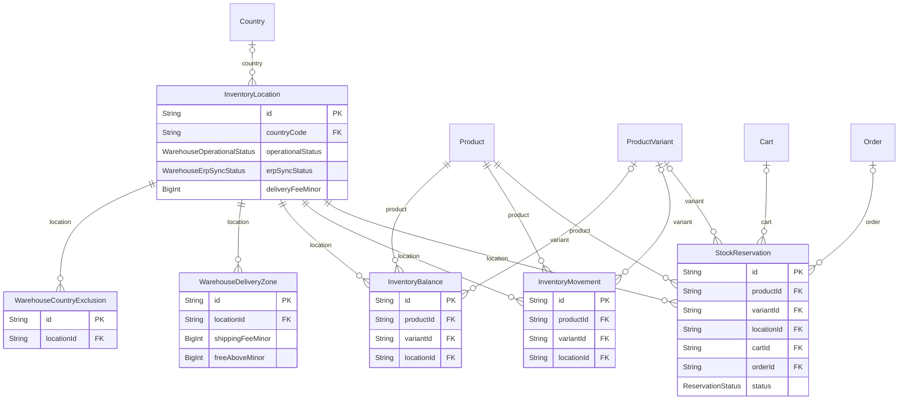

<a id="model-inventorylocation"></a>

### InventoryLocation

Table `inventory_locations`

| Column | Type | Null? | Key | Default | Notes |
|---|---|---|---|---|---|
| `id` | String · Char(26) |  | PK |  |  |
| `code` | String · VarChar(32) |  | UNIQUE |  |  |
| `name` | String · VarChar(128) |  |  |  |  |
| `addressJson` | Json | yes |  |  |  |
| `isDefault` | Boolean |  |  | false |  |
| `isActive` | Boolean |  |  | true |  |
| `countryCode` | String · Char(2) | yes | FK → [Country](#model-country) |  | The country this warehouse is in. ISO-3166-1 alpha-2. (on delete: Restrict) |
| `timezone` | String · VarChar(64) | yes |  |  | The IANA zone the people working here read a clock in, e.g. "Europe/Brussels". |
| `operationalStatus` | [enum WarehouseOperationalStatus](#enum-warehouseoperationalstatus) |  |  | OPERATIONAL | Can this place ship today? See the enum for why it is not `isActive`. |
| `erpExternalId` | String · VarChar(64) | yes |  |  | This warehouse's identifier in the ERP, when one owns its stock. |
| `erpSyncStatus` | [enum WarehouseErpSyncStatus](#enum-warehouseerpsyncstatus) |  |  | NEVER_SYNCED | Written by whatever syncs with the ERP, through `PUT /admin/inventory/warehouses/:id/erp-status`. Never edited by hand on the warehouse form: a sync state somebody typed is a sync state that lies. |
| `erpLastSyncAt` | DateTime · DateTime(3) | yes |  |  |  |
| `erpSyncMessage` | String · VarChar(512) | yes |  |  | What the connector said about the last attempt. Carries the reason on a FAILED, and a note like "412 SKUs reconciled" on a SYNCED. |
| `latitude` | Decimal · Decimal(9, 6) | yes |  |  | Where this warehouse is, so the console can draw it on a map. |
| `longitude` | Decimal · Decimal(9, 6) | yes |  |  |  |
| `deliveryRadiusKm` | Int | yes |  |  | How far this warehouse promises to deliver, in kilometres. |
| `deliveryLeadTimeMinDays` | Int | yes |  |  | How long a delivery from here takes, in days, as a range. |
| `deliveryLeadTimeMaxDays` | Int | yes |  |  |  |
| `deliveryFeeMinor` | BigInt | yes |  |  | What this warehouse charges to deliver, in minor units of its own currency. |
| `deliveryFeeCurrency` | String · Char(3) | yes |  |  |  |
| `createdAt` | DateTime · DateTime(3) |  |  | now() |  |
| `updatedAt` | DateTime · DateTime(3) |  | auto-updated |  |  |

**Relations**

- `country` → [Country](#model-country) via `countryCode` - many-to-one, optional, on delete **Restrict**
- `balances` ← [InventoryBalance](#model-inventorybalance) - has many
- `movements` ← [InventoryMovement](#model-inventorymovement) - has many
- `reservations` ← [StockReservation](#model-stockreservation) - has many
- `schedules` ← [RecurringSchedule](#model-recurringschedule) - has many
- `exclusions` ← [WarehouseCountryExclusion](#model-warehousecountryexclusion) - has many
- `deliveryZones` ← [WarehouseDeliveryZone](#model-warehousedeliveryzone) - has many
- `fulfilmentQuotes` ← [FulfilmentQuote](#model-fulfilmentquote) - has many
- `fulfilledOrders` ← [Order](#model-order) - has many
- `logisticsShipments` ← [LogisticsShipment](#model-logisticsshipment) - has many
- `logisticsPickups` ← [LogisticsPickupRequest](#model-logisticspickuprequest) - has many

**Indexes and keys**

- `@@index([isActive, countryCode], map: "ix_inventory_location_active_country")`
- `@@index([operationalStatus], map: "ix_inventory_location_operational")`

<a id="model-warehousecountryexclusion"></a>

### WarehouseCountryExclusion

Table `warehouse_country_exclusions`

A country this warehouse will not deliver to, whatever the radius says.

| Column | Type | Null? | Key | Default | Notes |
|---|---|---|---|---|---|
| `id` | String · Char(26) |  | PK |  |  |
| `locationId` | String · Char(26) |  | FK → [InventoryLocation](#model-inventorylocation) |  | (on delete: Cascade) |
| `countryCode` | String · Char(2) |  |  |  | ISO 3166-1 alpha-2, upper case. Not an FK - see the model comment. |
| `reason` | String · VarChar(256) | yes |  |  | Why this country is closed, in the operator's own words. |
| `createdAt` | DateTime · DateTime(3) |  |  | now() |  |

**Relations**

- `location` → [InventoryLocation](#model-inventorylocation) via `locationId` - many-to-one, required, on delete **Cascade**

**Indexes and keys**

- `@@unique([locationId, countryCode], map: "uq_warehouse_exclusion_country")`
- `@@index([countryCode], map: "ix_warehouse_exclusion_country")`

<a id="model-warehousedeliveryzone"></a>

### WarehouseDeliveryZone

Table `warehouse_delivery_zones`

A lane: somewhere this warehouse delivers to, and on what terms.

| Column | Type | Null? | Key | Default | Notes |
|---|---|---|---|---|---|
| `id` | String · Char(26) |  | PK |  |  |
| `locationId` | String · Char(26) |  | FK → [InventoryLocation](#model-inventorylocation) |  | (on delete: Cascade) |
| `countryCode` | String · Char(2) |  |  |  | ISO 3166-1 alpha-2, upper case. Not an FK, for exactly the reason `WarehouseCountryExclusion.countryCode` is not one: this is measured against the world, and `countries` is the shorter list of markets the deployment prices in. |
| `postalPrefixes` | String · VarChar(512) |  |  | "" | Which postcodes inside that country, as a comma-separated prefix list. |
| `carrierName` | String · VarChar(64) |  |  |  | Who carries it, and how fast. Free text, because it is the operator's own arrangement and no enum this repository invented would survive contact with their contracts. |
| `serviceLevel` | String · VarChar(64) |  |  |  |  |
| `handlingDays` | Int |  |  | 1 | Days between the order being placed and the box leaving the building. |
| `transitMinDays` | Int |  |  |  | Days on the road, as a range. Both columns, always - a minimum with no maximum is a promise with no end. |
| `transitMaxDays` | Int |  |  |  |  |
| `usesBusinessDays` | Boolean |  |  | true | Whether the two figures above are counted in working days. |
| `shippingFeeMinor` | BigInt |  |  | 0 | What this lane charges. BigInt minor units with its own currency, and the currency has to match the one the basket is quoted in or the lane is not offered - a fee converted at a rate this software chose would be an exchange-rate opinion printed as a price. |
| `shippingFeeCurrency` | String · Char(3) |  |  |  |  |
| `freeAboveMinor` | BigInt | yes |  |  | Basket value at or above which the lane is free. Null = never free. |
| `supportsColdChain` | Boolean |  |  | false | What the lane can physically take. |
| `maxWeightGrams` | Int | yes |  |  | Null = no limit this operator has stated. |
| `isActive` | Boolean |  |  | true | Off without being deleted. An operator suspending a carrier for a month should not have to retype the lane afterwards. |
| `priority` | Int |  |  | 0 | Which lane wins when several match the same postcode. Lower first. |
| `createdAt` | DateTime · DateTime(3) |  |  | now() |  |
| `updatedAt` | DateTime · DateTime(3) |  | auto-updated |  |  |

**Relations**

- `location` → [InventoryLocation](#model-inventorylocation) via `locationId` - many-to-one, required, on delete **Cascade**
- `quotes` ← [FulfilmentQuote](#model-fulfilmentquote) - has many

**Indexes and keys**

- `@@unique([locationId, countryCode, postalPrefixes, serviceLevel], map: "uq_warehouse_zone_lane")`
- `@@index([countryCode, isActive], map: "ix_warehouse_zone_country")`
- `@@index([locationId, isActive], map: "ix_warehouse_zone_location")`

<a id="model-inventorybalance"></a>

### InventoryBalance

Table `inventory_balances`

| Column | Type | Null? | Key | Default | Notes |
|---|---|---|---|---|---|
| `id` | String · Char(26) |  | PK |  |  |
| `productId` | String · Char(26) |  | FK → [Product](#model-product) |  | (on delete: Restrict) |
| `variantId` | String · Char(26) | yes | FK → [ProductVariant](#model-productvariant) |  | (on delete: Restrict) |
| `variantKey` | String · VarChar(26) |  |  | "" | The variant ULID, or an empty string for the base product. Never null, so the composite unique below really blocks duplicates - a MySQL unique index treats every NULL as distinct and would happily allow two rows. |
| `locationId` | String · Char(26) |  | FK → [InventoryLocation](#model-inventorylocation) |  | (on delete: Restrict) |
| `onHandQty` | Int |  |  | 0 |  |
| `reservedQty` | Int |  |  | 0 |  |
| `version` | Int |  |  | 0 | Optimistic-locking counter, bumped on every write. |
| `updatedAt` | DateTime · DateTime(3) |  | auto-updated |  |  |

**Relations**

- `product` → [Product](#model-product) via `productId` - many-to-one, required, on delete **Restrict**
- `variant` → [ProductVariant](#model-productvariant) via `variantId` - many-to-one, optional, on delete **Restrict**
- `location` → [InventoryLocation](#model-inventorylocation) via `locationId` - many-to-one, required, on delete **Restrict**

**Indexes and keys**

- `@@unique([productId, variantKey, locationId], map: "uq_inventory_balance_sku_location")`
- `@@index([locationId], map: "ix_inventory_balance_location")`
- `@@index([variantId], map: "ix_inventory_balance_variant")`

<a id="model-inventorymovement"></a>

### InventoryMovement

Table `inventory_movements`

| Column | Type | Null? | Key | Default | Notes |
|---|---|---|---|---|---|
| `id` | String · Char(26) |  | PK |  |  |
| `productId` | String · Char(26) |  | FK → [Product](#model-product) |  | (on delete: Restrict) |
| `variantId` | String · Char(26) | yes | FK → [ProductVariant](#model-productvariant) |  | (on delete: Restrict) |
| `variantKey` | String · VarChar(26) |  |  | "" |  |
| `locationId` | String · Char(26) |  | FK → [InventoryLocation](#model-inventorylocation) |  | (on delete: Restrict) |
| `type` | [enum InventoryMovementType](#enum-inventorymovementtype) |  |  |  |  |
| `quantityDelta` | Int |  |  |  | Signed: positive adds to on-hand, negative removes. Never zero. |
| `resultingOnHand` | Int |  |  |  | On-hand value immediately after this movement, for ledger reconciliation. |
| `reason` | String · VarChar(512) | yes |  |  |  |
| `referenceType` | String · VarChar(48) | yes |  |  |  |
| `referenceId` | String · Char(26) | yes |  |  |  |
| `dedupeKey` | String · VarChar(120) | yes | UNIQUE |  | Optional caller-supplied key that makes a movement idempotent. |
| `actorUserId` | String · Char(26) | yes |  |  |  |
| `actorType` | [enum ActorType](#enum-actortype) |  |  | SYSTEM |  |
| `createdAt` | DateTime · DateTime(3) |  |  | now() |  |

**Relations**

- `product` → [Product](#model-product) via `productId` - many-to-one, required, on delete **Restrict**
- `variant` → [ProductVariant](#model-productvariant) via `variantId` - many-to-one, optional, on delete **Restrict**
- `location` → [InventoryLocation](#model-inventorylocation) via `locationId` - many-to-one, required, on delete **Restrict**

**Indexes and keys**

- `@@index([productId, variantKey, createdAt], map: "ix_inventory_movement_sku_time")`
- `@@index([referenceType, referenceId], map: "ix_inventory_movement_reference")`
- `@@index([createdAt], map: "ix_inventory_movement_time")`
- `@@index([locationId], map: "ix_inventory_movement_location")`

<a id="model-stockreservation"></a>

### StockReservation

Table `stock_reservations`

| Column | Type | Null? | Key | Default | Notes |
|---|---|---|---|---|---|
| `id` | String · Char(26) |  | PK |  |  |
| `productId` | String · Char(26) |  | FK → [Product](#model-product) |  | (on delete: Restrict) |
| `variantId` | String · Char(26) | yes | FK → [ProductVariant](#model-productvariant) |  | (on delete: Restrict) |
| `variantKey` | String · VarChar(26) |  |  | "" |  |
| `locationId` | String · Char(26) |  | FK → [InventoryLocation](#model-inventorylocation) |  | (on delete: Restrict) |
| `cartId` | String · Char(26) | yes | FK → [Cart](#model-cart) |  | (on delete: SetNull) |
| `orderId` | String · Char(26) | yes | FK → [Order](#model-order) |  | (on delete: SetNull) |
| `quantity` | Int |  |  |  |  |
| `status` | [enum ReservationStatus](#enum-reservationstatus) |  |  | ACTIVE |  |
| `expiresAt` | DateTime · DateTime(3) |  |  |  |  |
| `committedAt` | DateTime · DateTime(3) | yes |  |  |  |
| `releasedAt` | DateTime · DateTime(3) | yes |  |  |  |
| `releaseReason` | String · VarChar(128) | yes |  |  |  |
| `createdAt` | DateTime · DateTime(3) |  |  | now() |  |

**Relations**

- `product` → [Product](#model-product) via `productId` - many-to-one, required, on delete **Restrict**
- `variant` → [ProductVariant](#model-productvariant) via `variantId` - many-to-one, optional, on delete **Restrict**
- `location` → [InventoryLocation](#model-inventorylocation) via `locationId` - many-to-one, required, on delete **Restrict**
- `cart` → [Cart](#model-cart) via `cartId` - many-to-one, optional, on delete **SetNull**
- `order` → [Order](#model-order) via `orderId` - many-to-one, optional, on delete **SetNull**

**Indexes and keys**

- `@@index([status, expiresAt], map: "ix_reservation_sweep")`
- `@@index([orderId], map: "ix_reservation_order")`
- `@@index([cartId], map: "ix_reservation_cart")`
- `@@index([productId, variantKey, status], map: "ix_reservation_sku_status")`
- `@@index([locationId], map: "ix_reservation_location")`

### Enums in  / whether a warehouse is currently shipping, and how well. / / deliberately not the same axis as `isactive`, and confusing the two is the / mistake this enum exists to prevent. `isactive` answers "is this place part / of the business at all" - a retired warehouse is archived master data and / disappears from every picker. this answers "of the places that are, can / this one move a box today". a warehouse under a roof repair is thoroughly / active and cannot ship a thing.

<a id="enum-warehouseoperationalstatus"></a>

#### enum WarehouseOperationalStatus

| Value | Meaning |
|---|---|
| `OPERATIONAL` | Running normally. |
| `LIMITED` | Running, but not at full capacity - short staffed, one dock closed. |
| `MAINTENANCE` | Temporarily not dispatching. Planned, and expected back. |
| `SUSPENDED` | Not dispatching, and not by plan - a flood, a strike, a lost lease. |

<a id="enum-warehouseerpsyncstatus"></a>

#### enum WarehouseErpSyncStatus

Where a warehouse stands with the ERP that owns its stock figures.

| Value | Meaning |
|---|---|
| `NEVER_SYNCED` | No sync has ever been attempted. The honest default. |
| `SYNCED` | The last attempt succeeded. |
| `PENDING` | An attempt is in flight, or one is queued. |
| `FAILED` | The last attempt failed. `erpSyncMessage` says what the connector said. |

<a id="enum-inventorymovementtype"></a>

#### enum InventoryMovementType

| Value | Meaning |
|---|---|
| `RECEIPT` |  |
| `ADJUSTMENT` |  |
| `RESERVATION_COMMIT` |  |
| `ORDER_CANCEL_RESTOCK` |  |
| `RETURN_RESTOCK` |  |
| `RETURN_QUARANTINE` |  |
| `SYNC_CORRECTION` |  |

<a id="enum-reservationstatus"></a>

#### enum ReservationStatus

| Value | Meaning |
|---|---|
| `ACTIVE` |  |
| `COMMITTED` |  |
| `RELEASED` |  |
| `EXPIRED` |  |

<a id="group-customers"></a>

## Customers

[CustomerProfile](#model-customerprofile) · [Address](#model-address)

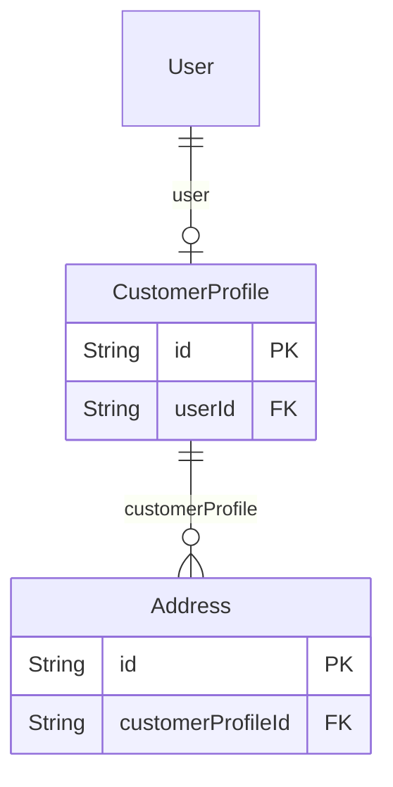

<a id="model-customerprofile"></a>

### CustomerProfile

Table `customer_profiles`

| Column | Type | Null? | Key | Default | Notes |
|---|---|---|---|---|---|
| `id` | String · Char(26) |  | PK |  |  |
| `userId` | String · Char(26) |  | UNIQUE, FK → [User](#model-user) |  | (on delete: Cascade) |
| `fullName` | String · VarChar(255) |  |  |  | The name every other screen in the product uses: an order, an invoice, a delivery note, the greeting in the header. |
| `firstName` | String · VarChar(120) | yes |  |  | The name captured in two parts, because that is how a person fills in a form and because a name split on the first space is not a name: "Van der Berg" and "Jean Paul" both come apart wrongly. Nullable, and legitimately so — accounts created by invitation, by import or by an administrator have only the one field, and… |
| `lastName` | String · VarChar(120) | yes |  |  |  |
| `organization` | String · VarChar(255) | yes |  |  |  |
| `department` | String · VarChar(128) | yes |  |  |  |
| `jobTitle` | String · VarChar(128) | yes |  |  | What this person does, as they describe it. Distinct from `department`, which is where in the organisation the order is being placed from: "Head of Theatre Procurement" in "Surgical Services". |
| `phone` | String · VarChar(32) | yes |  |  |  |
| `gstin` | String · VarChar(32) | yes |  |  |  |
| `customerCode` | String · VarChar(32) | yes | UNIQUE |  |  |
| `vatNumber` | String · VarChar(32) | yes |  |  | The customer's EU VAT identification number, including the member state prefix, e.g. "DE811569869". Kept apart from `gstin`, which is the Indian registration: they are different identifiers under different laws, and a business can hold both. |
| `vatNumberValid` | Boolean | yes |  |  | What VIES said, and when. Null means never checked, which is not the same as invalid: a check that could not be made leaves this null and the sale is taxed rather than zero-rated, because Art. 138(1)(b) puts the burden of the customer's status on the seller. |
| `vatNumberCheckedAt` | DateTime · DateTime(3) | yes |  |  |  |
| `vatNumberReference` | String · VarChar(64) | yes |  |  | The VIES consultation reference for the last successful check. Evidence under Art. 31 of Reg. 904/2010 that the seller relied on an official answer, which is what stands between a mis-zero-rated supply and the seller paying the tax themselves. |
| `requiresOrderApproval` | Boolean |  |  | false | Whether this account needs sign-off at all. The amounts that decide when live in `customer_limits`, one row per currency - see that model. |
| `internalNotes` | String · Text | yes |  |  |  |
| `preferredCountry` | String · Char(2) | yes |  |  | Where the shopper says they are, and what they want to be quoted in. Asked once on first sign-in and changeable afterwards from the header. Null preferredCurrency means "not chosen yet" - the storefront then asks. |
| `preferredCurrency` | String · Char(3) | yes |  |  |  |
| `localeChosenAt` | DateTime · DateTime(3) | yes |  |  |  |
| `detectedCountry` | String · Char(2) | yes |  |  | What the browser's geolocation resolved to, kept separately from the stated country so the two can be compared rather than one overwriting the other. Null when permission was refused or never asked. |
| `detectedAt` | DateTime · DateTime(3) | yes |  |  |  |
| `consentAcceptedAt` | DateTime · DateTime(3) | yes |  |  |  |
| `consentVersion` | String · VarChar(32) | yes |  |  |  |
| `invitedById` | String · Char(26) | yes |  |  |  |
| `invitedAt` | DateTime · DateTime(3) | yes |  |  |  |
| `activatedAt` | DateTime · DateTime(3) | yes |  |  |  |
| `createdAt` | DateTime · DateTime(3) |  |  | now() |  |
| `updatedAt` | DateTime · DateTime(3) |  | auto-updated |  |  |

**Relations**

- `user` → [User](#model-user) via `userId` - one-to-one, required, on delete **Cascade**
- `addresses` ← [Address](#model-address) - has many
- `carts` ← [Cart](#model-cart) - has many
- `orders` ← [Order](#model-order) - has many
- `schedules` ← [RecurringSchedule](#model-recurringschedule) - has many
- `paymentMethods` ← [CustomerPaymentMethod](#model-customerpaymentmethod) - has many
- `autoPaySetting` ← [CustomerAutoPaySetting](#model-customerautopaysetting) - has zero or one
- `couponRedemptions` ← [CouponRedemption](#model-couponredemption) - has many
- `limits` ← [CustomerLimit](#model-customerlimit) - has many
- `wishlistItems` ← [WishlistItem](#model-wishlistitem) - has many
- `productInstructions` ← [ProductInstruction](#model-productinstruction) - has many
- `fulfilmentQuotes` ← [FulfilmentQuote](#model-fulfilmentquote) - has many
- `assistantConversations` ← [AssistantConversation](#model-assistantconversation) - has many
- `preorderRequests` ← [PreorderRequest](#model-preorderrequest) - has many
- `organizationMembership` ← [BuyerOrganizationMember](#model-buyerorganizationmember) - has zero or one
- `sellerMembership` ← [SellerMember](#model-sellermember) - has zero or one

**Indexes and keys**

- `@@index([organization], map: "ix_customer_organization")`
- `@@index([createdAt], map: "ix_customer_created")`

<a id="model-address"></a>

### Address

Table `addresses`

| Column | Type | Null? | Key | Default | Notes |
|---|---|---|---|---|---|
| `id` | String · Char(26) |  | PK |  |  |
| `customerProfileId` | String · Char(26) |  | FK → [CustomerProfile](#model-customerprofile) |  | (on delete: Cascade) |
| `kind` | [enum AddressKind](#enum-addresskind) |  |  | BOTH |  |
| `label` | String · VarChar(64) | yes |  |  |  |
| `contactName` | String · VarChar(255) |  |  |  |  |
| `contactPhone` | String · VarChar(32) |  |  |  |  |
| `line1` | String · VarChar(255) |  |  |  |  |
| `line2` | String · VarChar(255) | yes |  |  |  |
| `city` | String · VarChar(128) |  |  |  |  |
| `state` | String · VarChar(128) |  |  |  |  |
| `postalCode` | String · VarChar(16) |  |  |  |  |
| `country` | String · Char(2) |  |  |  |  |
| `latitude` | Decimal · Decimal(9, 6) | yes |  |  | Where this address actually is, when anybody has been able to work it out. |
| `longitude` | Decimal · Decimal(9, 6) | yes |  |  |  |
| `timezone` | String · VarChar(64) | yes |  |  | The IANA zone this delivery point reads a clock in, e.g. "Europe/Brussels". |
| `isDefaultBilling` | Boolean |  |  | false |  |
| `isDefaultShipping` | Boolean |  |  | false |  |
| `createdAt` | DateTime · DateTime(3) |  |  | now() |  |
| `updatedAt` | DateTime · DateTime(3) |  | auto-updated |  |  |
| `archivedAt` | DateTime · DateTime(3) | yes |  |  | Soft delete. Orders keep an independent JSON snapshot of the address as it was at checkout, so archiving here never rewrites order history. |

**Relations**

- `customerProfile` → [CustomerProfile](#model-customerprofile) via `customerProfileId` - many-to-one, required, on delete **Cascade**
- `shippingSchedules` ← [RecurringSchedule](#model-recurringschedule) - has many
- `billingSchedules` ← [RecurringSchedule](#model-recurringschedule) - has many
- `fulfilmentQuotes` ← [FulfilmentQuote](#model-fulfilmentquote) - has many

**Indexes and keys**

- `@@index([customerProfileId, archivedAt], map: "ix_address_customer")`

### Enums in Customers

<a id="enum-addresskind"></a>

#### enum AddressKind

| Value | Meaning |
|---|---|
| `BILLING` |  |
| `SHIPPING` |  |
| `BOTH` |  |

<a id="group-cart"></a>

## Cart

[Cart](#model-cart) · [CartItem](#model-cartitem)

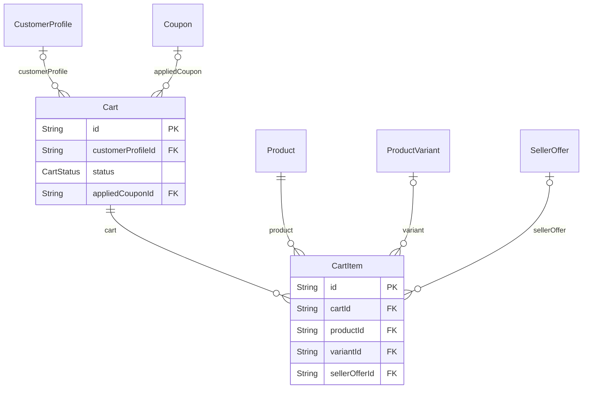

<a id="model-cart"></a>

### Cart

Table `carts`

| Column | Type | Null? | Key | Default | Notes |
|---|---|---|---|---|---|
| `id` | String · Char(26) |  | PK |  |  |
| `customerProfileId` | String · Char(26) | yes | FK → [CustomerProfile](#model-customerprofile) |  | (on delete: Cascade) |
| `guestToken` | String · Char(64) | yes | UNIQUE |  | Opaque cookie token for a not-yet-signed-in visitor. Merged into the customer cart on login; checkout always requires an authenticated customer. |
| `status` | [enum CartStatus](#enum-cartstatus) |  |  | ACTIVE |  |
| `currency` | String · Char(3) |  |  |  |  |
| `appliedCouponId` | String · Char(26) | yes | FK → [Coupon](#model-coupon) |  | The coupon the shopper has applied, if any. Held on the cart so it survives a page reload, and re-validated on every read - a coupon can expire, be disabled, or stop qualifying while the cart sits open. (on delete: SetNull) |
| `createdAt` | DateTime · DateTime(3) |  |  | now() |  |
| `updatedAt` | DateTime · DateTime(3) |  | auto-updated |  |  |
| `expiresAt` | DateTime · DateTime(3) | yes |  |  |  |

**Relations**

- `customerProfile` → [CustomerProfile](#model-customerprofile) via `customerProfileId` - many-to-one, optional, on delete **Cascade**
- `appliedCoupon` → [Coupon](#model-coupon) via `appliedCouponId` - many-to-one, optional, on delete **SetNull**
- `items` ← [CartItem](#model-cartitem) - has many
- `reservations` ← [StockReservation](#model-stockreservation) - has many
- `orders` ← [Order](#model-order) - has many
- `fulfilmentQuotes` ← [FulfilmentQuote](#model-fulfilmentquote) - has many

**Indexes and keys**

- `@@index([customerProfileId, status], map: "ix_cart_customer_status")`
- `@@index([status, expiresAt], map: "ix_cart_sweep")`

<a id="model-cartitem"></a>

### CartItem

Table `cart_items`

| Column | Type | Null? | Key | Default | Notes |
|---|---|---|---|---|---|
| `id` | String · Char(26) |  | PK |  |  |
| `cartId` | String · Char(26) |  | FK → [Cart](#model-cart) |  | (on delete: Cascade) |
| `productId` | String · Char(26) |  | FK → [Product](#model-product) |  | (on delete: Restrict) |
| `variantId` | String · Char(26) | yes | FK → [ProductVariant](#model-productvariant) |  | (on delete: Restrict) |
| `variantKey` | String · VarChar(26) |  |  | "" |  |
| `sellerOfferId` | String · Char(26) | yes | FK → [SellerOffer](#model-selleroffer) |  | Whose offer this line is, when it is a seller's rather than the operator's own stock. (on delete: Restrict) |
| `sellerOfferKey` | String · VarChar(26) |  |  | "" | `sellerOfferId`, or '' for the operator's own stock. Never null, and the reason the unique index below works: MariaDB treats every NULL in a UNIQUE index as distinct, so a nullable column there would let the same operator SKU be added twice instead of bumping the quantity. Exactly the trick `variantKey` above plays,… |
| `quantity` | Int |  |  |  | Always pieces. Every price, stock check, reservation and tax line reads this and nothing else, so adding pack ordering changed none of them. |
| `orderingUnit` | [enum OrderingUnit](#enum-orderingunit) |  |  | PIECE | What the buyer chose to count in, and the conversion they were shown. |
| `unitQuantity` | Int |  |  | 1 | How many of `orderingUnit` they asked for. quantity = this x the snapshot. |
| `piecesPerUnitSnapshot` | Int |  |  | 1 | Pieces in one `orderingUnit` at the moment it was chosen. |
| `note` | String · VarChar(500) | yes |  |  | What the buyer needs done to THIS product, in their own words. |
| `createdAt` | DateTime · DateTime(3) |  |  | now() |  |
| `updatedAt` | DateTime · DateTime(3) |  | auto-updated |  |  |

**Relations**

- `cart` → [Cart](#model-cart) via `cartId` - many-to-one, required, on delete **Cascade**
- `product` → [Product](#model-product) via `productId` - many-to-one, required, on delete **Restrict**
- `variant` → [ProductVariant](#model-productvariant) via `variantId` - many-to-one, optional, on delete **Restrict**
- `sellerOffer` → [SellerOffer](#model-selleroffer) via `sellerOfferId` - many-to-one, optional, on delete **Restrict**
- `packaging` ← [CartItemPackaging](#model-cartitempackaging) - has zero or one

**Indexes and keys**

- `@@unique([cartId, productId, variantKey, sellerOfferKey], map: "uq_cart_item_sku")`
- `@@index([productId], map: "ix_cart_item_product")`
- `@@index([sellerOfferId], map: "ix_cart_item_seller_offer")`

### Enums in Cart

<a id="enum-cartstatus"></a>

#### enum CartStatus

| Value | Meaning |
|---|---|
| `ACTIVE` |  |
| `CONVERTED` |  |
| `ABANDONED` |  |

<a id="group-orders"></a>

## Orders

[Order](#model-order) · [OrderItem](#model-orderitem) · [OrderStatusHistory](#model-orderstatushistory) · [OrderApproval](#model-orderapproval) · [IdempotencyRecord](#model-idempotencyrecord)

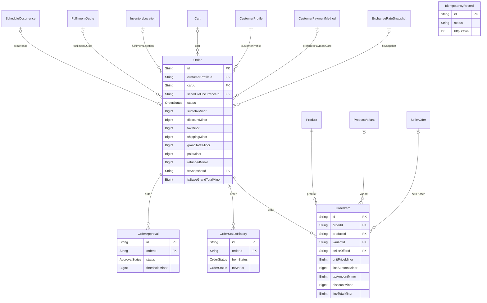

<a id="model-order"></a>

### Order

Table `orders`

| Column | Type | Null? | Key | Default | Notes |
|---|---|---|---|---|---|
| `id` | String · Char(26) |  | PK |  |  |
| `orderNumber` | String · VarChar(32) |  | UNIQUE |  | Human-facing sequential-ish reference, e.g. UB-2026-000123. |
| `customerProfileId` | String · Char(26) |  | FK → [CustomerProfile](#model-customerprofile) |  | (on delete: Restrict) |
| `cartId` | String · Char(26) | yes | FK → [Cart](#model-cart) |  | (on delete: SetNull) |
| `source` | [enum OrderSource](#enum-ordersource) |  |  | ONE_TIME |  |
| `scheduleOccurrenceId` | String · Char(26) | yes | UNIQUE, FK → [ScheduleOccurrence](#model-scheduleoccurrence) |  | (on delete: SetNull) |
| `status` | [enum OrderStatus](#enum-orderstatus) |  |  | DRAFT |  |
| `currency` | String · Char(3) |  |  |  |  |
| `subtotalMinor` | BigInt |  |  | 0 | Every amount is BigInt minor units. grandTotal = subtotal - discount + tax + shipping. |
| `discountMinor` | BigInt |  |  | 0 |  |
| `taxMinor` | BigInt |  |  | 0 |  |
| `shippingMinor` | BigInt |  |  | 0 |  |
| `grandTotalMinor` | BigInt |  |  | 0 |  |
| `paidMinor` | BigInt |  |  | 0 | Settled money, maintained only from verified provider events. |
| `refundedMinor` | BigInt |  |  | 0 |  |
| `fxPriceSource` | [enum FxPriceSource](#enum-fxpricesource) | yes |  |  | How the figures above were arrived at. MANUAL - a price row a person entered for this currency. CONVERTED - derived from the base-currency price at the rate below. Null on orders written before this existed. |
| `fxSnapshotId` | String · Char(26) | yes | FK → [ExchangeRateSnapshot](#model-exchangeratesnapshot) |  | The snapshot the rate came from. The audit join: from an order to the exact list a provider published on a date, and every rate in it. (on delete: SetNull) |
| `fxBaseCurrency` | String · Char(3) | yes |  |  | The authoritative currency the catalogue figure was held in, and what the order was worth in it. Kept beside the charged amount so a settlement in the base currency needs no reconstruction. |
| `fxBaseGrandTotalMinor` | BigInt | yes |  |  |  |
| `fxMidRate` | Decimal · Decimal(24, 12) | yes |  |  | What the market said, and what this deployment quoted against it. |
| `fxRateUsed` | Decimal · Decimal(24, 12) | yes |  |  |  |
| `fxAdjustmentPercent` | Decimal · Decimal(5, 2) | yes |  |  |  |
| `fxRateAsOf` | DateTime · DateTime(3) | yes |  |  | The provider's own date for the rate, and the provider's name. Copied rather than joined so an order stays readable after a snapshot is pruned. |
| `fxProvider` | String · VarChar(32) | yes |  |  |  |
| `fxPolicyVersion` | String · VarChar(32) | yes |  |  | Which rounding and conversion rules were in force. |
| `billingAddressJson` | Json |  |  |  | Address as captured at checkout. Independent of the Address rows. |
| `shippingAddressJson` | Json |  |  |  |  |
| `shippingMethodCode` | String · VarChar(32) | yes |  |  |  |
| `shippingMethodName` | String · VarChar(128) | yes |  |  |  |
| `paymentMode` | [enum PaymentIntentMode](#enum-paymentintentmode) |  |  | ONLINE |  |
| `fulfilmentLocationId` | String · Char(26) | yes | FK → [InventoryLocation](#model-inventorylocation) |  | --- Which warehouse this ships from, and what was promised --- (on delete: Restrict) |
| `fulfilmentQuoteId` | String · Char(26) | yes | FK → [FulfilmentQuote](#model-fulfilmentquote) |  | (on delete: Restrict) |
| `fulfilmentCarrier` | String · VarChar(64) | yes |  |  | The promise itself, copied out of the quote rather than joined to it. |
| `fulfilmentServiceLevel` | String · VarChar(64) | yes |  |  |  |
| `fulfilmentDispatchDate` | DateTime · Date | yes |  |  |  |
| `fulfilmentDeliveryFrom` | DateTime · Date | yes |  |  |  |
| `fulfilmentDeliveryTo` | DateTime · Date | yes |  |  |  |
| `preferredPaymentProvider` | [enum PaymentProviderKind](#enum-paymentproviderkind) | yes |  |  | What the customer chose at checkout when there was more than one gateway to choose from. |
| `preferredPaymentMethod` | [enum PaymentMethodPreference](#enum-paymentmethodpreference) | yes |  |  |  |
| `preferredPaymentInstrument` | [enum PaymentInstrumentKind](#enum-paymentinstrumentkind) | yes |  |  | What the customer actually chose at checkout, in their own vocabulary. |
| `preferredPaymentMethodId` | String · Char(26) | yes | FK → [CustomerPaymentMethod](#model-customerpaymentmethod) |  | The saved card the customer picked at checkout, when they picked one. (on delete: SetNull) |
| `taxTreatment` | [enum TaxTreatment](#enum-taxtreatment) |  |  | FLAT_RATE | Why this order was taxed the way it was, and under whose rates. Frozen here rather than recomputed, because rates change and VAT numbers get cancelled - and an invoice already issued must not start disagreeing with the order behind it. |
| `taxCountry` | String · Char(2) | yes |  |  | The member state whose rates were applied. Null under FLAT_RATE. |
| `sellerVatNumberSnapshot` | String · VarChar(32) | yes |  |  | Art. 226(3)-(4): both parties' VAT numbers as they stood at checkout. The buyer's is the one that justified a zero rate, so it has to survive any later edit to the customer record. |
| `buyerVatNumberSnapshot` | String · VarChar(32) | yes |  |  |  |
| `customerNote` | String · Text | yes |  |  |  |
| `internalNote` | String · Text | yes |  |  |  |
| `placedAt` | DateTime · DateTime(3) | yes |  |  |  |
| `confirmedAt` | DateTime · DateTime(3) | yes |  |  |  |
| `cancelledAt` | DateTime · DateTime(3) | yes |  |  |  |
| `cancelReason` | String · VarChar(512) | yes |  |  |  |
| `createdAt` | DateTime · DateTime(3) |  |  | now() |  |
| `updatedAt` | DateTime · DateTime(3) |  | auto-updated |  |  |

**Relations**

- `fxSnapshot` → [ExchangeRateSnapshot](#model-exchangeratesnapshot) via `fxSnapshotId` - many-to-one, optional, on delete **SetNull**
- `preferredPaymentCard` → [CustomerPaymentMethod](#model-customerpaymentmethod) via `preferredPaymentMethodId` - many-to-one, optional, on delete **SetNull**
- `customerProfile` → [CustomerProfile](#model-customerprofile) via `customerProfileId` - many-to-one, required, on delete **Restrict**
- `cart` → [Cart](#model-cart) via `cartId` - many-to-one, optional, on delete **SetNull**
- `fulfilmentLocation` → [InventoryLocation](#model-inventorylocation) via `fulfilmentLocationId` - many-to-one, optional, on delete **Restrict**
- `fulfilmentQuote` → [FulfilmentQuote](#model-fulfilmentquote) via `fulfilmentQuoteId` - many-to-one, optional, on delete **Restrict**
- `occurrence` → [ScheduleOccurrence](#model-scheduleoccurrence) via `scheduleOccurrenceId` - one-to-one, optional, on delete **SetNull**
- `logisticsShipments` ← [LogisticsShipment](#model-logisticsshipment) - has many
- `logisticsLegCharges` ← [OrderLogisticsLeg](#model-orderlogisticsleg) - has many
- `shipmentLegs` ← [ShipmentLeg](#model-shipmentleg) - has many
- `items` ← [OrderItem](#model-orderitem) - has many
- `statusHistory` ← [OrderStatusHistory](#model-orderstatushistory) - has many
- `approvals` ← [OrderApproval](#model-orderapproval) - has many
- `payments` ← [PaymentTransaction](#model-paymenttransaction) - has many
- `paymentLinks` ← [PaymentLink](#model-paymentlink) - has many
- `refunds` ← [Refund](#model-refund) - has many
- `shipments` ← [Shipment](#model-shipment) - has many
- `returnRequests` ← [ReturnRequest](#model-returnrequest) - has many
- `reservations` ← [StockReservation](#model-stockreservation) - has many
- `paymentEvents` ← [PaymentEvent](#model-paymentevent) - has many
- `couponRedemption` ← [CouponRedemption](#model-couponredemption) - has zero or one
- `invoices` ← [Invoice](#model-invoice) - has many
- `erpPush` ← [ErpOrderPush](#model-erporderpush) - has zero or one
- `sellerOrderGroups` ← [SellerOrderGroup](#model-sellerordergroup) - has many
- `preorderRequest` ← [PreorderRequest](#model-preorderrequest) - has zero or one
- `sellerInvoices` ← [SellerInvoice](#model-sellerinvoice) - has many
- `packingLists` ← [SellerPackingList](#model-sellerpackinglist) - has many

**Indexes and keys**

- `@@index([customerProfileId, createdAt], map: "ix_order_customer_time")`
- `@@index([status, createdAt], map: "ix_order_status_time")`
- `@@index([source, createdAt], map: "ix_order_source_time")`
- `@@index([placedAt], map: "ix_order_placed")`
- `@@index([fulfilmentLocationId], map: "ix_order_fulfilment_location")`
- `@@index([fulfilmentQuoteId], map: "ix_order_fulfilment_quote")`
- `@@index([fxSnapshotId], map: "ix_order_fx_snapshot")`

<a id="model-orderitem"></a>

### OrderItem

Table `order_items`

| Column | Type | Null? | Key | Default | Notes |
|---|---|---|---|---|---|
| `id` | String · Char(26) |  | PK |  |  |
| `orderId` | String · Char(26) |  | FK → [Order](#model-order) |  | (on delete: Cascade) |
| `productId` | String · Char(26) |  | FK → [Product](#model-product) |  | (on delete: Restrict) |
| `variantId` | String · Char(26) | yes | FK → [ProductVariant](#model-productvariant) |  | (on delete: Restrict) |
| `sellerOfferId` | String · Char(26) | yes | FK → [SellerOffer](#model-selleroffer) |  | Whose offer was bought, when it was a seller's rather than the operator's own stock. Null means the operator sold it. This is what `splitOrderToSellers` groups on, so a line without it never reaches a seller's queue — which is correct, because nobody else is owed anything for it. (on delete: Restrict) |
| `nameSnapshot` | String · VarChar(255) |  |  |  | --- Immutable snapshots taken at checkout --- |
| `skuSnapshot` | String · VarChar(64) |  |  |  |  |
| `variantNameSnapshot` | String · VarChar(255) | yes |  |  |  |
| `taxClassCodeSnapshot` | String · VarChar(32) |  |  |  |  |
| `imageUrlSnapshot` | String · VarChar(1024) | yes |  |  |  |
| `unitPriceMinor` | BigInt |  |  |  |  |
| `quantity` | Int |  |  |  | Pieces, like everywhere else. The unit price is per piece. |
| `orderingUnit` | [enum OrderingUnit](#enum-orderingunit) |  |  | PIECE | What the buyer ordered in, frozen with the rest of the line. An invoice that says 4,000 pieces where the buyer ordered 2 cartons is a dispute waiting to be had, and the packing it was worked out from may not survive to the day somebody asks. |
| `unitQuantity` | Int |  |  | 1 |  |
| `piecesPerUnitSnapshot` | Int |  |  | 1 |  |
| `noteSnapshot` | String · VarChar(500) | yes |  |  | The buyer's special instruction for this line, frozen at checkout. |
| `quantityTierJson` | Json | yes |  |  | The quantity band that priced this line, frozen: its id, range, the list price it replaced and the price charged. Null when the list price applied. Written once, so a later change to the seller's bands never rewrites what this order says it was charged and why. |
| `lineSubtotalMinor` | BigInt |  |  |  |  |
| `taxRatePercent` | Decimal · Decimal(9, 6) |  |  |  |  |
| `taxInclusive` | Boolean |  |  | false |  |
| `taxAmountMinor` | BigInt |  |  |  |  |
| `discountMinor` | BigInt |  |  | 0 |  |
| `lineTotalMinor` | BigInt |  |  |  |  |
| `isRecurringEligibleSnapshot` | Boolean |  |  | false |  |
| `createdAt` | DateTime · DateTime(3) |  |  | now() |  |

**Relations**

- `order` → [Order](#model-order) via `orderId` - many-to-one, required, on delete **Cascade**
- `product` → [Product](#model-product) via `productId` - many-to-one, required, on delete **Restrict**
- `variant` → [ProductVariant](#model-productvariant) via `variantId` - many-to-one, optional, on delete **Restrict**
- `sellerOffer` → [SellerOffer](#model-selleroffer) via `sellerOfferId` - many-to-one, optional, on delete **Restrict**
- `packaging` ← [OrderItemPackaging](#model-orderitempackaging) - has zero or one

**Indexes and keys**

- `@@index([orderId], map: "ix_order_item_order")`
- `@@index([productId], map: "ix_order_item_product")`
- `@@index([sellerOfferId], map: "ix_order_item_seller_offer")`

<a id="model-orderstatushistory"></a>

### OrderStatusHistory

Table `order_status_history`

| Column | Type | Null? | Key | Default | Notes |
|---|---|---|---|---|---|
| `id` | String · Char(26) |  | PK |  |  |
| `orderId` | String · Char(26) |  | FK → [Order](#model-order) |  | (on delete: Cascade) |
| `fromStatus` | [enum OrderStatus](#enum-orderstatus) | yes |  |  |  |
| `toStatus` | [enum OrderStatus](#enum-orderstatus) |  |  |  |  |
| `actorType` | [enum ActorType](#enum-actortype) |  |  | SYSTEM |  |
| `actorUserId` | String · Char(26) | yes |  |  |  |
| `reason` | String · VarChar(512) | yes |  |  |  |
| `metaJson` | Json | yes |  |  |  |
| `correlationId` | String · VarChar(64) | yes |  |  |  |
| `createdAt` | DateTime · DateTime(3) |  |  | now() |  |

**Relations**

- `order` → [Order](#model-order) via `orderId` - many-to-one, required, on delete **Cascade**

**Indexes and keys**

- `@@index([orderId, createdAt], map: "ix_order_history_order_time")`

<a id="model-orderapproval"></a>

### OrderApproval

Table `order_approvals`

| Column | Type | Null? | Key | Default | Notes |
|---|---|---|---|---|---|
| `id` | String · Char(26) |  | PK |  |  |
| `orderId` | String · Char(26) |  | FK → [Order](#model-order) |  | (on delete: Cascade) |
| `status` | [enum ApprovalStatus](#enum-approvalstatus) |  |  | PENDING |  |
| `requiredReason` | String · VarChar(255) |  |  |  |  |
| `thresholdMinor` | BigInt | yes |  |  |  |
| `decidedById` | String · Char(26) | yes |  |  |  |
| `decidedAt` | DateTime · DateTime(3) | yes |  |  |  |
| `comment` | String · VarChar(512) | yes |  |  |  |
| `createdAt` | DateTime · DateTime(3) |  |  | now() |  |

**Relations**

- `order` → [Order](#model-order) via `orderId` - many-to-one, required, on delete **Cascade**

**Indexes and keys**

- `@@index([status, createdAt], map: "ix_order_approval_status")`
- `@@index([orderId], map: "ix_order_approval_order")`

<a id="model-idempotencyrecord"></a>

### IdempotencyRecord

Table `idempotency_records`

| Column | Type | Null? | Key | Default | Notes |
|---|---|---|---|---|---|
| `id` | String · Char(26) |  | PK |  |  |
| `scope` | String · VarChar(64) |  |  |  | Logical operation, e.g. `checkout.submit`, `payment.create`, `refund.create`. |
| `key` | String · VarChar(128) |  |  |  | Client-supplied Idempotency-Key header value. |
| `requestHash` | String · Char(64) |  |  |  | SHA-256 of the canonical request body. A replay with a DIFFERENT body under the same key is rejected rather than silently returning the old response. |
| `status` | String · VarChar(16) |  |  |  |  |
| `responseJson` | Json | yes |  |  |  |
| `httpStatus` | Int | yes |  |  |  |
| `ownerId` | String · Char(26) | yes |  |  | Scopes it to the caller, so two customers cannot collide on a shared key. |
| `createdAt` | DateTime · DateTime(3) |  |  | now() |  |
| `completedAt` | DateTime · DateTime(3) | yes |  |  |  |
| `expiresAt` | DateTime · DateTime(3) |  |  |  |  |

**Indexes and keys**

- `@@unique([scope, key], map: "uq_idempotency_scope_key")`
- `@@index([expiresAt], map: "ix_idempotency_expires")`

### Enums in Orders

<a id="enum-actortype"></a>

#### enum ActorType

| Value | Meaning |
|---|---|
| `SYSTEM` |  |
| `ADMIN` |  |
| `CUSTOMER` |  |
| `PROVIDER` |  |
| `LOGISTICS` | A third-party carrier's own staff, acting inside the logistics portal. |

<a id="enum-orderstatus"></a>

#### enum OrderStatus

| Value | Meaning |
|---|---|
| `DRAFT` |  |
| `PENDING_APPROVAL` |  |
| `PENDING_PAYMENT` |  |
| `CONFIRMED` |  |
| `PROCESSING` |  |
| `SHIPPED` |  |
| `DELIVERED` |  |
| `CANCELLED` |  |
| `RETURNED` |  |
| `REFUNDED` |  |

<a id="enum-ordersource"></a>

#### enum OrderSource

| Value | Meaning |
|---|---|
| `ONE_TIME` |  |
| `RECURRING` |  |
| `PREORDER` | Converted from a bulk preorder both parties confirmed. Appended: MariaDB stores an enum by position. |

<a id="enum-fxpricesource"></a>

#### enum FxPriceSource

How an order's money was arrived at in the currency it was charged in.

| Value | Meaning |
|---|---|
| `MANUAL` |  |
| `CONVERTED` |  |

<a id="enum-paymentintentmode"></a>

#### enum PaymentIntentMode

| Value | Meaning |
|---|---|
| `ONLINE` |  |
| `PAYMENT_LINK` |  |

<a id="enum-approvalstatus"></a>

#### enum ApprovalStatus

| Value | Meaning |
|---|---|
| `PENDING` |  |
| `APPROVED` |  |
| `REJECTED` |  |

<a id="group-payments"></a>

## Payments

[PaymentProviderConnection](#model-paymentproviderconnection) · [PaymentTransaction](#model-paymenttransaction) · [PaymentEvent](#model-paymentevent) · [PaymentLink](#model-paymentlink) · [Refund](#model-refund)

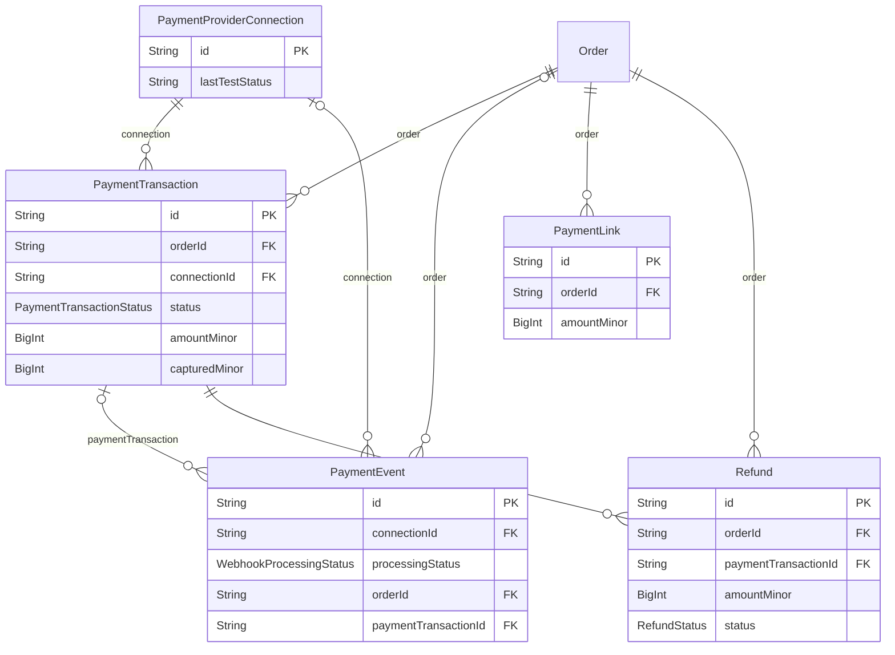

<a id="model-paymentproviderconnection"></a>

### PaymentProviderConnection

Table `payment_provider_connections`

| Column | Type | Null? | Key | Default | Notes |
|---|---|---|---|---|---|
| `id` | String · Char(26) |  | PK |  |  |
| `provider` | [enum PaymentProviderKind](#enum-paymentproviderkind) |  |  |  |  |
| `mode` | [enum PaymentMode](#enum-paymentmode) |  |  |  |  |
| `label` | String · VarChar(128) |  |  |  |  |
| `credentialsEnc` | String · Text |  |  |  | AES-256-GCM ciphertext. Decrypted only inside the payment infrastructure adapter; never returned by any API, never logged. |
| `webhookSecretEnc` | String · Text | yes |  |  |  |
| `credentialsMask` | String · VarChar(64) | yes |  |  | Non-secret display prefix for the admin UI, e.g. rzp_test_xxxx9f2a. |
| `isActive` | Boolean |  |  | false |  |
| `lastTestedAt` | DateTime · DateTime(3) | yes |  |  |  |
| `lastTestStatus` | String · VarChar(32) | yes |  |  |  |
| `lastTestMessage` | String · VarChar(512) | yes |  |  |  |
| `createdAt` | DateTime · DateTime(3) |  |  | now() |  |
| `updatedAt` | DateTime · DateTime(3) |  | auto-updated |  |  |
| `createdById` | String · Char(26) | yes |  |  |  |

**Relations**

- `transactions` ← [PaymentTransaction](#model-paymenttransaction) - has many
- `events` ← [PaymentEvent](#model-paymentevent) - has many

**Indexes and keys**

- `@@unique([provider, mode], map: "uq_payment_connection_provider_mode")`
- `@@index([isActive], map: "ix_payment_connection_active")`

<a id="model-paymenttransaction"></a>

### PaymentTransaction

Table `payment_transactions`

| Column | Type | Null? | Key | Default | Notes |
|---|---|---|---|---|---|
| `id` | String · Char(26) |  | PK |  |  |
| `orderId` | String · Char(26) |  | FK → [Order](#model-order) |  | (on delete: Restrict) |
| `connectionId` | String · Char(26) |  | FK → [PaymentProviderConnection](#model-paymentproviderconnection) |  | (on delete: Restrict) |
| `provider` | [enum PaymentProviderKind](#enum-paymentproviderkind) |  |  |  |  |
| `mode` | [enum PaymentMode](#enum-paymentmode) |  |  |  |  |
| `providerOrderId` | String · VarChar(128) | yes |  |  | Provider-side identifiers. providerOrderId is created first; providerPaymentId arrives with authorisation or capture. |
| `providerPaymentId` | String · VarChar(128) | yes | UNIQUE |  |  |
| `status` | [enum PaymentTransactionStatus](#enum-paymenttransactionstatus) |  |  | CREATED |  |
| `amountMinor` | BigInt |  |  |  |  |
| `capturedMinor` | BigInt |  |  | 0 |  |
| `currency` | String · Char(3) |  |  |  |  |
| `method` | String · VarChar(48) | yes |  |  |  |
| `failureCode` | String · VarChar(64) | yes |  |  |  |
| `failureMessage` | String · VarChar(512) | yes |  |  |  |
| `idempotencyKey` | String · VarChar(128) |  | UNIQUE |  | Guards against creating two provider orders for one checkout attempt. |
| `mandateReference` | String · VarChar(128) | yes |  |  | Set when this attempt is a recurring auto-pay against a stored mandate. |
| `authorizedAt` | DateTime · DateTime(3) | yes |  |  |  |
| `capturedAt` | DateTime · DateTime(3) | yes |  |  |  |
| `failedAt` | DateTime · DateTime(3) | yes |  |  |  |
| `reconciledAt` | DateTime · DateTime(3) | yes |  |  | Last time status was actively re-queried from the provider, which is how a UI timeout or a late webhook gets reconciled. |
| `createdAt` | DateTime · DateTime(3) |  |  | now() |  |
| `updatedAt` | DateTime · DateTime(3) |  | auto-updated |  |  |

**Relations**

- `order` → [Order](#model-order) via `orderId` - many-to-one, required, on delete **Restrict**
- `connection` → [PaymentProviderConnection](#model-paymentproviderconnection) via `connectionId` - many-to-one, required, on delete **Restrict**
- `refunds` ← [Refund](#model-refund) - has many
- `events` ← [PaymentEvent](#model-paymentevent) - has many

**Indexes and keys**

- `@@index([orderId, createdAt], map: "ix_payment_order_time")`
- `@@index([status, createdAt], map: "ix_payment_status_time")`
- `@@index([providerOrderId], map: "ix_payment_provider_order")`

<a id="model-paymentevent"></a>

### PaymentEvent

Table `payment_events`

| Column | Type | Null? | Key | Default | Notes |
|---|---|---|---|---|---|
| `id` | String · Char(26) |  | PK |  |  |
| `provider` | [enum PaymentProviderKind](#enum-paymentproviderkind) |  |  |  |  |
| `connectionId` | String · Char(26) | yes | FK → [PaymentProviderConnection](#model-paymentproviderconnection) |  | (on delete: SetNull) |
| `providerEventId` | String · VarChar(191) |  | UNIQUE |  | Provider event id, and the duplicate-delivery guard: a second webhook carrying the same id hits this unique index and is acknowledged without being reprocessed. |
| `eventType` | String · VarChar(96) |  |  |  |  |
| `signatureVerified` | Boolean |  |  | false | Signature is verified against the RAW body before the payload is parsed or trusted. False here means the event was rejected, never applied. |
| `rawPayload` | String · LongText |  |  |  | Raw request body, retained verbatim for dispute and audit. Card data never appears here; providers send references only. |
| `processingStatus` | [enum WebhookProcessingStatus](#enum-webhookprocessingstatus) |  |  | RECEIVED |  |
| `processingError` | String · VarChar(1024) | yes |  |  |  |
| `orderId` | String · Char(26) | yes | FK → [Order](#model-order) |  | (on delete: SetNull) |
| `paymentTransactionId` | String · Char(26) | yes | FK → [PaymentTransaction](#model-paymenttransaction) |  | (on delete: SetNull) |
| `receivedAt` | DateTime · DateTime(3) |  |  | now() |  |
| `processedAt` | DateTime · DateTime(3) | yes |  |  |  |
| `attemptStartedAt` | DateTime · DateTime(3) | yes |  |  | When the attempt currently holding this row began. |

**Relations**

- `connection` → [PaymentProviderConnection](#model-paymentproviderconnection) via `connectionId` - many-to-one, optional, on delete **SetNull**
- `order` → [Order](#model-order) via `orderId` - many-to-one, optional, on delete **SetNull**
- `paymentTransaction` → [PaymentTransaction](#model-paymenttransaction) via `paymentTransactionId` - many-to-one, optional, on delete **SetNull**

**Indexes and keys**

- `@@index([processingStatus, receivedAt], map: "ix_payment_event_status_time")`
- `@@index([orderId], map: "ix_payment_event_order")`
- `@@index([receivedAt], map: "ix_payment_event_time")`

<a id="model-paymentlink"></a>

### PaymentLink

Table `payment_links`

| Column | Type | Null? | Key | Default | Notes |
|---|---|---|---|---|---|
| `id` | String · Char(26) |  | PK |  |  |
| `orderId` | String · Char(26) |  | FK → [Order](#model-order) |  | (on delete: Cascade) |
| `tokenHash` | String · Char(64) |  | UNIQUE |  | SHA-256 of a 32-byte random token. The raw token exists only in the email. |
| `recipientEmail` | String · VarChar(320) |  |  |  |  |
| `recipientName` | String · VarChar(255) | yes |  |  |  |
| `amountMinor` | BigInt |  |  |  | Amount is locked at creation; a later order edit invalidates the link. |
| `currency` | String · Char(3) |  |  |  |  |
| `expiresAt` | DateTime · DateTime(3) |  |  |  |  |
| `sentAt` | DateTime · DateTime(3) | yes |  |  |  |
| `openedAt` | DateTime · DateTime(3) | yes |  |  |  |
| `usedAt` | DateTime · DateTime(3) | yes |  |  | Single use: set the moment payment completes, after which the token fails. |
| `revokedAt` | DateTime · DateTime(3) | yes |  |  |  |
| `revokedReason` | String · VarChar(255) | yes |  |  |  |
| `supersededByLinkId` | String · Char(26) | yes |  |  | When a link is resent, the old row points at the new one and stays invalid. |
| `createdById` | String · Char(26) |  |  |  |  |
| `createdAt` | DateTime · DateTime(3) |  |  | now() |  |

**Relations**

- `order` → [Order](#model-order) via `orderId` - many-to-one, required, on delete **Cascade**

**Indexes and keys**

- `@@index([orderId, createdAt], map: "ix_payment_link_order")`
- `@@index([expiresAt, usedAt], map: "ix_payment_link_expiry")`

<a id="model-refund"></a>

### Refund

Table `refunds`

| Column | Type | Null? | Key | Default | Notes |
|---|---|---|---|---|---|
| `id` | String · Char(26) |  | PK |  |  |
| `orderId` | String · Char(26) |  | FK → [Order](#model-order) |  | (on delete: Restrict) |
| `paymentTransactionId` | String · Char(26) |  | FK → [PaymentTransaction](#model-paymenttransaction) |  | (on delete: Restrict) |
| `provider` | [enum PaymentProviderKind](#enum-paymentproviderkind) |  |  |  |  |
| `providerRefundId` | String · VarChar(128) | yes | UNIQUE |  |  |
| `amountMinor` | BigInt |  |  |  |  |
| `currency` | String · Char(3) |  |  |  |  |
| `reason` | String · VarChar(512) |  |  |  |  |
| `status` | [enum RefundStatus](#enum-refundstatus) |  |  | REQUESTED |  |
| `requestedById` | String · Char(26) |  |  |  |  |
| `approvedById` | String · Char(26) | yes |  |  |  |
| `idempotencyKey` | String · VarChar(128) |  | UNIQUE |  |  |
| `failureCode` | String · VarChar(64) | yes |  |  |  |
| `failureMessage` | String · VarChar(512) | yes |  |  |  |
| `createdAt` | DateTime · DateTime(3) |  |  | now() |  |
| `updatedAt` | DateTime · DateTime(3) |  | auto-updated |  |  |
| `completedAt` | DateTime · DateTime(3) | yes |  |  |  |

**Relations**

- `order` → [Order](#model-order) via `orderId` - many-to-one, required, on delete **Restrict**
- `paymentTransaction` → [PaymentTransaction](#model-paymenttransaction) via `paymentTransactionId` - many-to-one, required, on delete **Restrict**
- `returnRequests` ← [ReturnRequest](#model-returnrequest) - has many

**Indexes and keys**

- `@@index([orderId, createdAt], map: "ix_refund_order_time")`
- `@@index([status, createdAt], map: "ix_refund_status_time")`

### Enums in Payments

<a id="enum-paymentproviderkind"></a>

#### enum PaymentProviderKind

| Value | Meaning |
|---|---|
| `RAZORPAY` |  |
| `STRIPE` |  |

<a id="enum-paymentmethodpreference"></a>

#### enum PaymentMethodPreference

Which instruments to open a gateway's sheet on.

| Value | Meaning |
|---|---|
| `ANY` |  |
| `UPI` |  |

<a id="enum-paymentinstrumentkind"></a>

#### enum PaymentInstrumentKind

What the customer chose to pay with, in the words they were shown.

| Value | Meaning |
|---|---|
| `CREDIT_CARD` |  |
| `DEBIT_CARD` |  |
| `UPI` |  |

<a id="enum-paymentmode"></a>

#### enum PaymentMode

| Value | Meaning |
|---|---|
| `TEST` |  |
| `LIVE` |  |

<a id="enum-paymenttransactionstatus"></a>

#### enum PaymentTransactionStatus

| Value | Meaning |
|---|---|
| `CREATED` |  |
| `PENDING` |  |
| `AUTHORIZED` |  |
| `CAPTURED` |  |
| `FAILED` |  |
| `CANCELLED` |  |
| `EXPIRED` |  |

<a id="enum-webhookprocessingstatus"></a>

#### enum WebhookProcessingStatus

| Value | Meaning |
|---|---|
| `RECEIVED` |  |
| `PROCESSED` |  |
| `DUPLICATE` |  |
| `REJECTED` |  |
| `FAILED` |  |

<a id="enum-refundstatus"></a>

#### enum RefundStatus

| Value | Meaning |
|---|---|
| `REQUESTED` |  |
| `PROCESSING` |  |
| `SUCCEEDED` |  |
| `FAILED` |  |
| `CANCELLED` |  |

<a id="group-recurring-purchases"></a>

## Recurring purchases

[RecurringSchedule](#model-recurringschedule) · [RecurringScheduleItem](#model-recurringscheduleitem) · [ScheduleOccurrence](#model-scheduleoccurrence) · [CustomerPaymentMethod](#model-customerpaymentmethod) · [ErpOrderPush](#model-erporderpush)

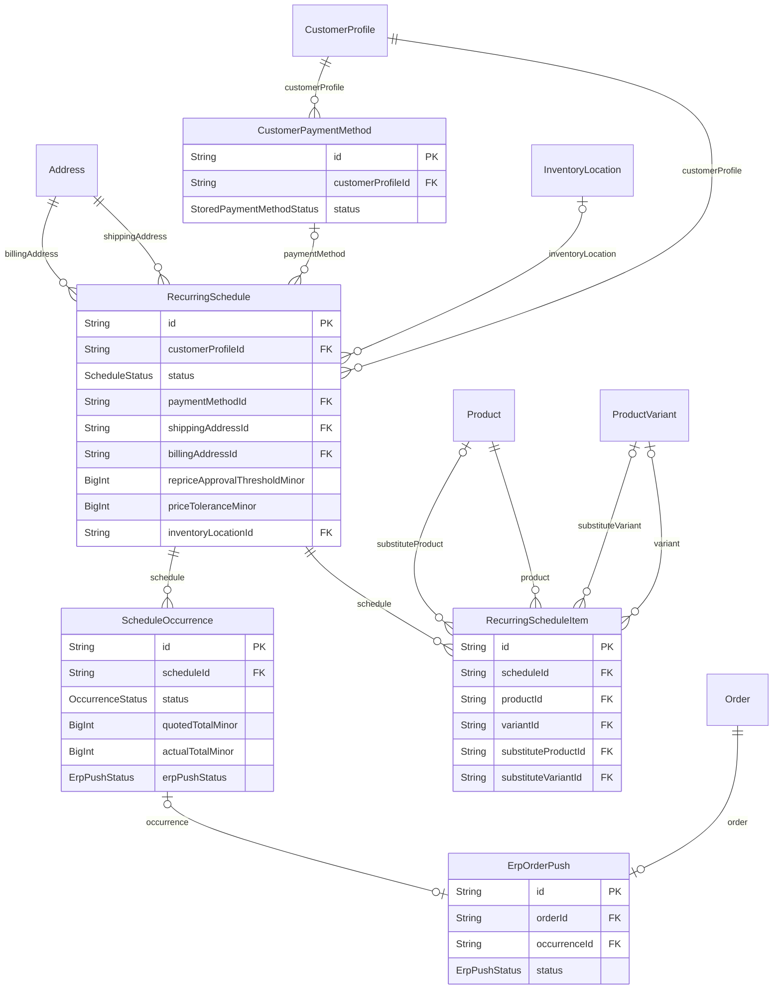

<a id="model-recurringschedule"></a>

### RecurringSchedule

Table `recurring_schedules`

| Column | Type | Null? | Key | Default | Notes |
|---|---|---|---|---|---|
| `id` | String · Char(26) |  | PK |  |  |
| `customerProfileId` | String · Char(26) |  | FK → [CustomerProfile](#model-customerprofile) |  | (on delete: Restrict) |
| `name` | String · VarChar(128) |  |  |  |  |
| `status` | [enum ScheduleStatus](#enum-schedulestatus) |  |  | ACTIVE |  |
| `kind` | [enum ScheduleKind](#enum-schedulekind) |  |  | RECURRING | Repeats, or fires once (Buy Later). See the enum. |
| `runOnceAt` | DateTime · DateTime(3) | yes |  |  | The single instant a ONE_TIME plan fires, in UTC. |
| `frequency` | [enum ScheduleFrequency](#enum-schedulefrequency) |  |  |  |  |
| `intervalDays` | Int | yes |  |  | Used when frequency = EVERY_N_DAYS. The doc calls out "every 7 days". |
| `weekday` | Int | yes |  |  | Used when frequency = WEEKLY. 1 = Monday .. 7 = Sunday (ISO-8601). |
| `monthDay` | Int | yes |  |  | Used when frequency = MONTHLY. 1..31, clamped to the last valid day. |
| `intervalMonths` | Int | yes |  |  | Used when frequency = EVERY_N_MONTHS. 2..24. |
| `timezone` | String · VarChar(64) |  |  |  | IANA zone the wall-clock run time is interpreted in. The server timezone is deliberately not trusted for this. |
| `runAtMinute` | Int |  |  | 360 | Local time-of-day for the run, minutes since local midnight. |
| `startDate` | DateTime · Date |  |  |  |  |
| `endDate` | DateTime · Date | yes |  |  |  |
| `maxOccurrences` | Int | yes |  |  | Optional cap on total orders produced. Null = until cancelled. |
| `occurrenceCount` | Int |  |  | 0 |  |
| `nextRunAt` | DateTime · DateTime(3) | yes |  |  | Next planned instant, in UTC. Also the queue key the worker polls. |
| `lastRunAt` | DateTime · DateTime(3) | yes |  |  |  |
| `paymentMode` | [enum SchedulePaymentMode](#enum-schedulepaymentmode) |  |  |  |  |
| `mandateReference` | String · VarChar(128) | yes |  |  | Provider mandate/token reference for AUTO_PAY. Never a card number. |
| `mandateProvider` | [enum PaymentProviderKind](#enum-paymentproviderkind) | yes |  |  |  |
| `payerEmail` | String · VarChar(320) | yes |  |  | Approved payer for PAYMENT_LINK mode. |
| `paymentMethodId` | String · Char(26) | yes | FK → [CustomerPaymentMethod](#model-customerpaymentmethod) |  | The reusable instrument an AUTO_PAY plan charges off-session. (on delete: Restrict) |
| `shippingAddressId` | String · Char(26) |  | FK → [Address](#model-address) |  | (on delete: Restrict) |
| `billingAddressId` | String · Char(26) |  | FK → [Address](#model-address) |  | (on delete: Restrict) |
| `shippingMethodCode` | String · VarChar(32) | yes |  |  |  |
| `consentAcceptedAt` | DateTime · DateTime(3) |  |  |  | Explicit consent is required before activation, and is re-checked at every occurrence. Storing the version lets a policy change force re-consent. |
| `consentVersion` | String · VarChar(32) |  |  |  |  |
| `repriceApprovalThresholdMinor` | BigInt | yes |  |  | Occurrence total above which the run pauses for approval instead of charging. |
| `priceTolerancePercent` | Decimal · Decimal(5, 2) | yes |  |  | How far the total may move from the quoted amount before the charge needs re-confirming, as a percentage. |
| `priceToleranceMinor` | BigInt | yes |  |  | The same test as an absolute floor, so a tolerance of 5% on a small basket does not hold an occurrence over a rounding difference. Whichever of the two is more generous wins. |
| `editCutoffMinutes` | Int |  |  | 1440 | How long before a run the plan stops accepting edits, in minutes. |
| `substitutionPolicy` | [enum SubstitutionPolicy](#enum-substitutionpolicy) |  |  | NEVER |  |
| `fulfilmentRule` | [enum ScheduleFulfilmentRule](#enum-schedulefulfilmentrule) |  |  | AUTO | Where these orders ship from. NULL location with FIXED_LOCATION is refused at write time - the two columns are set together. |
| `inventoryLocationId` | String · Char(26) | yes | FK → [InventoryLocation](#model-inventorylocation) |  | (on delete: Restrict) |
| `cartSnapshotJson` | Json | yes |  |  | The cart the customer authorised, exactly as the review screen showed it. |
| `sourceCartId` | String · Char(26) | yes |  |  |  |
| `activatedAt` | DateTime · DateTime(3) | yes |  |  | When the customer confirmed the review screen. NULL while DRAFT. |
| `completedAt` | DateTime · DateTime(3) | yes |  |  |  |
| `failureCount` | Int |  |  | 0 |  |
| `maxFailures` | Int |  |  | 3 |  |
| `pausedAt` | DateTime · DateTime(3) | yes |  |  |  |
| `pausedReason` | String · VarChar(512) | yes |  |  |  |
| `pausedById` | String · Char(26) | yes |  |  |  |
| `cancelledAt` | DateTime · DateTime(3) | yes |  |  |  |
| `cancelReason` | String · VarChar(512) | yes |  |  |  |
| `hiddenAt` | DateTime · DateTime(3) | yes |  |  | When the customer removed this finished plan from their own list. |
| `leaseOwner` | String · VarChar(64) | yes |  |  | --- Worker lease (stands in for SKIP LOCKED on MariaDB 10.4) --- |
| `leaseExpiresAt` | DateTime · DateTime(3) | yes |  |  |  |
| `createdAt` | DateTime · DateTime(3) |  |  | now() |  |
| `updatedAt` | DateTime · DateTime(3) |  | auto-updated |  |  |

**Relations**

- `customerProfile` → [CustomerProfile](#model-customerprofile) via `customerProfileId` - many-to-one, required, on delete **Restrict**
- `shippingAddress` → [Address](#model-address) via `shippingAddressId` - many-to-one, required, on delete **Restrict**
- `billingAddress` → [Address](#model-address) via `billingAddressId` - many-to-one, required, on delete **Restrict**
- `paymentMethod` → [CustomerPaymentMethod](#model-customerpaymentmethod) via `paymentMethodId` - many-to-one, optional, on delete **Restrict**
- `inventoryLocation` → [InventoryLocation](#model-inventorylocation) via `inventoryLocationId` - many-to-one, optional, on delete **Restrict**
- `items` ← [RecurringScheduleItem](#model-recurringscheduleitem) - has many
- `occurrences` ← [ScheduleOccurrence](#model-scheduleoccurrence) - has many

**Indexes and keys**

- `@@index([status, nextRunAt], map: "ix_schedule_due")`
- `@@index([customerProfileId, status], map: "ix_schedule_customer_status")`
- `@@index([leaseExpiresAt], map: "ix_schedule_lease")`
- `@@index([customerProfileId, kind, status], map: "ix_schedule_customer_kind")`
- `@@index([paymentMethodId], map: "ix_schedule_payment_method")`
- `@@index([inventoryLocationId], map: "ix_schedule_location")`

<a id="model-recurringscheduleitem"></a>

### RecurringScheduleItem

Table `recurring_schedule_items`

| Column | Type | Null? | Key | Default | Notes |
|---|---|---|---|---|---|
| `id` | String · Char(26) |  | PK |  |  |
| `scheduleId` | String · Char(26) |  | FK → [RecurringSchedule](#model-recurringschedule) |  | (on delete: Cascade) |
| `productId` | String · Char(26) |  | FK → [Product](#model-product) |  | (on delete: Restrict) |
| `variantId` | String · Char(26) | yes | FK → [ProductVariant](#model-productvariant) |  | (on delete: Restrict) |
| `variantKey` | String · VarChar(26) |  |  | "" |  |
| `quantity` | Int |  |  |  | Pieces. `quoteSchedule` prices this column and only this column. |
| `orderingUnit` | [enum OrderingUnit](#enum-orderingunit) |  |  | PIECE | The unit the plan was agreed in, and the conversion at that moment. |
| `unitQuantity` | Int |  |  | 1 |  |
| `piecesPerUnitSnapshot` | Int |  |  | 1 |  |
| `substituteProductId` | String · Char(26) | yes | FK → [Product](#model-product) |  | The one product the customer agreed may stand in for this line. (on delete: Restrict) |
| `substituteVariantId` | String · Char(26) | yes | FK → [ProductVariant](#model-productvariant) |  | (on delete: Restrict) |
| `substituteVariantKey` | String · VarChar(26) |  |  | "" |  |
| `createdAt` | DateTime · DateTime(3) |  |  | now() |  |
| `updatedAt` | DateTime · DateTime(3) |  | auto-updated |  |  |

**Relations**

- `schedule` → [RecurringSchedule](#model-recurringschedule) via `scheduleId` - many-to-one, required, on delete **Cascade**
- `product` → [Product](#model-product) via `productId` - many-to-one, required, on delete **Restrict**
- `variant` → [ProductVariant](#model-productvariant) via `variantId` - many-to-one, optional, on delete **Restrict**
- `substituteProduct` → [Product](#model-product) via `substituteProductId` - many-to-one, optional, on delete **Restrict**
- `substituteVariant` → [ProductVariant](#model-productvariant) via `substituteVariantId` - many-to-one, optional, on delete **Restrict**

**Indexes and keys**

- `@@unique([scheduleId, productId, variantKey], map: "uq_schedule_item_sku")`
- `@@index([productId], map: "ix_schedule_item_product")`
- `@@index([substituteProductId], map: "ix_schedule_item_substitute")`

<a id="model-scheduleoccurrence"></a>

### ScheduleOccurrence

Table `schedule_occurrences`

| Column | Type | Null? | Key | Default | Notes |
|---|---|---|---|---|---|
| `id` | String · Char(26) |  | PK |  |  |
| `scheduleId` | String · Char(26) |  | FK → [RecurringSchedule](#model-recurringschedule) |  | (on delete: Cascade) |
| `plannedRunAt` | DateTime · DateTime(3) |  |  |  | The intended run instant in UTC. Combined with scheduleId this is the idempotency key for the whole recurring engine. |
| `timezone` | String · VarChar(64) |  |  | "UTC" | The zone `plannedRunAt` was computed in, copied off the plan when this occurrence was materialised. |
| `status` | [enum OccurrenceStatus](#enum-occurrencestatus) |  |  | SCHEDULED |  |
| `attemptCount` | Int |  |  | 0 |  |
| `lastAttemptAt` | DateTime · DateTime(3) | yes |  |  |  |
| `nextRetryAt` | DateTime · DateTime(3) | yes |  |  |  |
| `paymentAttemptCount` | Int |  |  | 0 | Payment attempts, counted separately from `attemptCount`. |
| `quotedTotalMinor` | BigInt | yes |  |  | Amount quoted to the customer in the reminder, so a reprice is detectable. |
| `actualTotalMinor` | BigInt | yes |  |  |  |
| `paymentReference` | String · VarChar(128) | yes |  |  | The provider's reference for the charge - a Stripe PaymentIntent id. |
| `erpOrderReference` | String · VarChar(128) | yes |  |  | The ERP's own identifier for the order it accepted. |
| `erpPushStatus` | [enum ErpPushStatus](#enum-erppushstatus) | yes |  |  |  |
| `idempotencyKey` | String · VarChar(80) |  | UNIQUE |  | The stable key every side effect of this occurrence is keyed on: the Stripe charge, the platform order, the ERP push, the inventory movement. |
| `cartSnapshotJson` | Json | yes |  |  | What the plan authorised, priced as at this occurrence. |
| `skippedByUser` | Boolean |  |  | false | True when a person skipped this cycle, false when the engine did. |
| `failureCode` | String · VarChar(64) | yes |  |  |  |
| `failureMessage` | String · VarChar(512) | yes |  |  |  |
| `skipReason` | String · VarChar(512) | yes |  |  |  |
| `actionRequiredAt` | DateTime · DateTime(3) | yes |  |  | When Stripe asked for the cardholder. Read by the reminder that chases an ACTION_REQUIRED occurrence before its window closes. |
| `reminderSentAt` | DateTime · DateTime(3) | yes |  |  |  |
| `createdAt` | DateTime · DateTime(3) |  |  | now() |  |
| `completedAt` | DateTime · DateTime(3) | yes |  |  |  |

**Relations**

- `schedule` → [RecurringSchedule](#model-recurringschedule) via `scheduleId` - many-to-one, required, on delete **Cascade**
- `order` ← [Order](#model-order) - has zero or one
- `erpPush` ← [ErpOrderPush](#model-erporderpush) - has zero or one

**Indexes and keys**

- `@@unique([scheduleId, plannedRunAt], map: "uq_occurrence_schedule_run")`
- `@@index([status, nextRetryAt], map: "ix_occurrence_retry")`
- `@@index([plannedRunAt], map: "ix_occurrence_planned")`
- `@@index([status, plannedRunAt, reminderSentAt], map: "ix_occurrence_reminder")`
- `@@index([scheduleId, status], map: "ix_occurrence_schedule_status")`

<a id="model-customerpaymentmethod"></a>

### CustomerPaymentMethod

Table `customer_payment_methods`

A reusable payment instrument, plus the consent that makes it chargeable while the customer is not there.

| Column | Type | Null? | Key | Default | Notes |
|---|---|---|---|---|---|
| `id` | String · Char(26) |  | PK |  |  |
| `customerProfileId` | String · Char(26) |  | FK → [CustomerProfile](#model-customerprofile) |  | (on delete: Cascade) |
| `provider` | [enum PaymentProviderKind](#enum-paymentproviderkind) |  |  |  |  |
| `providerCustomerId` | String · VarChar(128) |  |  |  | Stripe's Customer id (cus_...). One per customer per provider, reused across every plan they authorise. |
| `providerPaymentMethodId` | String · VarChar(128) |  |  |  | Stripe's PaymentMethod id (pm_...). The thing actually charged. |
| `setupIntentId` | String · VarChar(128) | yes |  |  | The SetupIntent that produced it, kept for reconciliation with Stripe. |
| `brand` | String · VarChar(32) | yes |  |  | --- Display only. Stripe returns these; none of them can pay for anything. |
| `last4` | String · VarChar(4) | yes |  |  |  |
| `expMonth` | Int | yes |  |  |  |
| `expYear` | Int | yes |  |  |  |
| `funding` | String · VarChar(16) | yes |  |  |  |
| `country` | String · Char(2) | yes |  |  | The card's issuing country, which is what some tax and SCA rules turn on. |
| `status` | [enum StoredPaymentMethodStatus](#enum-storedpaymentmethodstatus) |  |  | ACTIVE |  |
| `consentScope` | [enum PaymentConsentScope](#enum-paymentconsentscope) |  |  | OFF_SESSION | --- Consent (the provider's requirement, and the law's) --- |
| `consentAcceptedAt` | DateTime · DateTime(3) |  |  |  |  |
| `consentVersion` | String · VarChar(32) |  |  |  |  |
| `consentIpHash` | String · VarChar(64) | yes |  |  | Hashed, never the address itself: it is evidence that consent came from somewhere, and keeping the raw IP would make this table a worse thing to leak than it needs to be. |
| `consentUserAgent` | String · VarChar(256) | yes |  |  |  |
| `isDefault` | Boolean |  |  | false | The customer's default for new plans. Enforced in the service, not the schema: a partial unique index on (customerProfileId) WHERE isDefault is not something MariaDB 10.4 offers. |
| `detachedAt` | DateTime · DateTime(3) | yes |  |  |  |
| `createdAt` | DateTime · DateTime(3) |  |  | now() |  |
| `updatedAt` | DateTime · DateTime(3) |  | auto-updated |  |  |

**Relations**

- `customerProfile` → [CustomerProfile](#model-customerprofile) via `customerProfileId` - many-to-one, required, on delete **Cascade**
- `schedules` ← [RecurringSchedule](#model-recurringschedule) - has many
- `autoPaySettings` ← [CustomerAutoPaySetting](#model-customerautopaysetting) - has many
- `orders` ← [Order](#model-order) - has many

**Indexes and keys**

- `@@unique([provider, providerPaymentMethodId], map: "uq_payment_method_provider_ref")`
- `@@index([customerProfileId, status], map: "ix_payment_method_customer")`

<a id="model-erporderpush"></a>

### ErpOrderPush

Table `erp_order_pushes`

One order's hand-off to the ERP, and the state of its retries.

| Column | Type | Null? | Key | Default | Notes |
|---|---|---|---|---|---|
| `id` | String · Char(26) |  | PK |  |  |
| `orderId` | String · Char(26) |  | UNIQUE, FK → [Order](#model-order) |  | (on delete: Cascade) |
| `occurrenceId` | String · Char(26) | yes | UNIQUE, FK → [ScheduleOccurrence](#model-scheduleoccurrence) |  | The occurrence that caused it, when a schedule did. NULL for an ordinary checkout pushed to the ERP. (on delete: SetNull) |
| `connectionId` | String · Char(26) | yes |  |  | The legacy `integration_connections` row used, on an installation still configured through `ERP_ORDER_CONNECTION_NAME`. NULL once a connection is deleted; the ledger row outlives the configuration that made it. |
| `erpConnectionId` | String · Char(26) | yes |  |  | The `erp_connections` row used - the one an administrator configured under Settings -&gt; ERP, which is the path every new installation takes. |
| `idempotencyKey` | String · VarChar(80) |  | UNIQUE |  | Sent to the ERP as its idempotency header, and unique here. |
| `status` | [enum ErpPushStatus](#enum-erppushstatus) |  |  | PENDING |  |
| `erpOrderReference` | String · VarChar(128) | yes |  |  | The ERP's identifier for the order it created. |
| `attemptCount` | Int |  |  | 0 |  |
| `lastAttemptAt` | DateTime · DateTime(3) | yes |  |  |  |
| `nextRetryAt` | DateTime · DateTime(3) | yes |  |  |  |
| `succeededAt` | DateTime · DateTime(3) | yes |  |  |  |
| `lastErrorCode` | String · VarChar(64) | yes |  |  |  |
| `lastErrorMessage` | String · VarChar(1024) | yes |  |  |  |
| `requestJson` | Json | yes |  |  | What was sent and what came back, for the argument that follows a disagreement about an order. Credentials are redacted before either is written. |
| `responseJson` | Json | yes |  |  |  |
| `createdAt` | DateTime · DateTime(3) |  |  | now() |  |
| `updatedAt` | DateTime · DateTime(3) |  | auto-updated |  |  |

**Relations**

- `order` → [Order](#model-order) via `orderId` - one-to-one, required, on delete **Cascade**
- `occurrence` → [ScheduleOccurrence](#model-scheduleoccurrence) via `occurrenceId` - one-to-one, optional, on delete **SetNull**

**Indexes and keys**

- `@@index([status, nextRetryAt], map: "ix_erp_push_retry")`
- `@@index([connectionId, createdAt], map: "ix_erp_push_connection_time")`
- `@@index([erpConnectionId, createdAt], map: "ix_erp_push_erp_connection_time")`

### Enums in Recurring purchases

<a id="enum-schedulestatus"></a>

#### enum ScheduleStatus

| Value | Meaning |
|---|---|
| `DRAFT` | Configured but not yet authorised. Nothing is ever charged from a DRAFT. |
| `ACTIVE` |  |
| `PAUSED` |  |
| `CANCELLED` |  |
| `COMPLETED` | Ran to its natural end - the end date passed, or maxOccurrences was reached. Distinct from CANCELLED, which is somebody deciding to stop it, and the distinction belongs to the customer: "finished" and "you cancelled this" are not the same sentence. |
| `FAILED` | Auto-set after failureCount reaches maxFailures. Needs a human to resume. |

<a id="enum-schedulefrequency"></a>

#### enum ScheduleFrequency

| Value | Meaning |
|---|---|
| `EVERY_N_DAYS` |  |
| `WEEKLY` |  |
| `BIWEEKLY` | Every fortnight, on a fixed weekday. |
| `MONTHLY` |  |
| `EVERY_N_MONTHS` | Every N calendar months, on the start date's day of the month. |
| `ONE_TIME` | Buy Later: one delivery, on one date, and then the plan is COMPLETED. |

<a id="enum-schedulekind"></a>

#### enum ScheduleKind

Whether a plan repeats, or fires once and finishes.

| Value | Meaning |
|---|---|
| `ONE_TIME` |  |
| `RECURRING` |  |

<a id="enum-substitutionpolicy"></a>

#### enum SubstitutionPolicy

What to do when a scheduled product cannot be supplied.

| Value | Meaning |
|---|---|
| `NEVER` | Hold the occurrence and notify. Never swap anything. |
| `SAVED_PREFERENCE` | Use the substitute saved against the schedule item, if one is set and is itself available. Falls back to holding - never to guessing. |

<a id="enum-schedulefulfilmentrule"></a>

#### enum ScheduleFulfilmentRule

Where a scheduled order is fulfilled from.

| Value | Meaning |
|---|---|
| `AUTO` | Let the inventory service pick, the way an ordinary checkout does. |
| `FIXED_LOCATION` | Always this warehouse. Held rather than moved even if another location has more stock, because somebody chose it for a reason. |

<a id="enum-schedulepaymentmode"></a>

#### enum SchedulePaymentMode

| Value | Meaning |
|---|---|
| `AUTO_PAY` | Charges a stored provider mandate/token without customer interaction. |
| `PAYMENT_LINK` | Emails an expiring single-use payment link to the approved payer. |

<a id="enum-occurrencestatus"></a>

#### enum OccurrenceStatus

The life of one billing cycle.

| Value | Meaning |
|---|---|
| `SCHEDULED` | Materialised ahead of time so the customer has a row to skip, edit or cancel before it runs. Not yet touched by the worker. |
| `AWAITING_VALIDATION` | Claimed by a worker and being revalidated - eligibility, prices, stock, limits, address, ERP mapping. No money has moved. |
| `PAYMENT_PENDING` | Revalidated and priced. A charge has been started but not confirmed: either an off-session PaymentIntent is in flight, or a payment link is out with the payer. |
| `ACTION_REQUIRED` | Stripe needs the cardholder present - 3-D Secure, or a mandate the bank wants re-authenticated. The customer has been told; nothing retries on its own, because only they can clear it. |
| `PROCESSING` | Paid, and the platform order is being created and fulfilled. |
| `PAID_ERP_PENDING` | Paid and the platform order exists, but the ERP has not accepted it. |
| `COMPLETED` | Everything done: paid, ordered, ERP notified, customer told. |
| `SKIPPED` | Deliberately not run: product unpublished, stock short, limit breached, or the customer skipped it. |
| `CANCELLED` | The customer or an administrator cancelled this cycle, or the whole plan was cancelled before it ran. Distinct from SKIPPED, which the engine also decides for itself. |
| `FAILED` |  |
| `PENDING` | --- Retained for rows written before the statuses above existed --- |
| `ORDER_CREATED` |  |
| `PAID` |  |

<a id="enum-erppushstatus"></a>

#### enum ErpPushStatus

Where an order stands with the ERP.

| Value | Meaning |
|---|---|
| `PENDING` |  |
| `SUCCEEDED` |  |
| `FAILED` |  |
| `ABANDONED` | Retries exhausted. A person has to look at it; nothing will retry again on its own, because a connector that has refused the same payload a dozen times will refuse the thirteenth. |

<a id="enum-storedpaymentmethodstatus"></a>

#### enum StoredPaymentMethodStatus

A reusable payment instrument's usability.

| Value | Meaning |
|---|---|
| `ACTIVE` |  |
| `DETACHED` | Detached at the provider - by the customer here, or in the provider's own dashboard. |
| `EXPIRED` | The card's expiry has passed, or the provider reported it unusable. |

<a id="enum-paymentconsentscope"></a>

#### enum PaymentConsentScope

What a stored card's owner agreed to. See `CustomerPaymentMethod`.

| Value | Meaning |
|---|---|
| `CHECKOUT` |  |
| `OFF_SESSION` |  |

<a id="group-one-warehouse-s-offer-for-one-basket-frozen-rows-are-cheap-and-short-lived-one-per-eligible-option-per-request-swept-once-they-expire-unless-an-order-points-at-them-a-quote-attached-to-an-order-is-kept-for-ever-it-is-the-evidence-of-what-the-customer-was-shown-before-they-agreed-to-pay"></a>

##  / one warehouse's offer for one basket, frozen. / / rows are cheap and short-lived: one per eligible option per request, swept / once they expire unless an order points at them. a quote attached to an / order is kept for ever - it is the evidence of what the customer was shown / before they agreed to pay.

[FulfilmentQuote](#model-fulfilmentquote) · [Shipment](#model-shipment) · [ReturnRequest](#model-returnrequest)

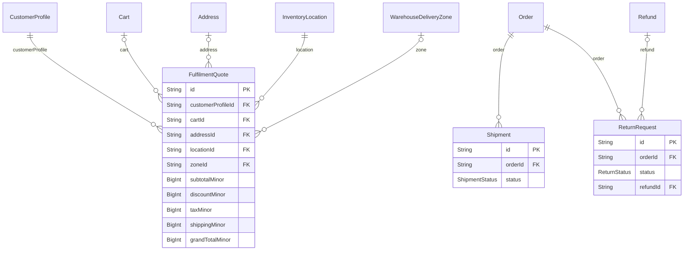

<a id="model-fulfilmentquote"></a>

### FulfilmentQuote

Table `fulfilment_quotes`

| Column | Type | Null? | Key | Default | Notes |
|---|---|---|---|---|---|
| `id` | String · Char(26) |  | PK |  |  |
| `customerProfileId` | String · Char(26) |  | FK → [CustomerProfile](#model-customerprofile) |  | (on delete: Cascade) |
| `cartId` | String · Char(26) | yes | FK → [Cart](#model-cart) |  | The cart it was priced from, where there was one. Null for a quote taken against an explicit item list rather than the live cart. (on delete: SetNull) |
| `addressId` | String · Char(26) | yes | FK → [Address](#model-address) |  | The delivery address it was priced to. Null where the buyer had only said which country they are in - see `isEstimate`. (on delete: SetNull) |
| `locationId` | String · Char(26) |  | FK → [InventoryLocation](#model-inventorylocation) |  | (on delete: Restrict) |
| `zoneId` | String · Char(26) | yes | FK → [WarehouseDeliveryZone](#model-warehousedeliveryzone) |  | The lane that produced the dates and the fee. SetNull rather than Restrict: an operator retiring a carrier must not be blocked by quotes, and the quote keeps its own frozen copy of every figure anyway. (on delete: SetNull) |
| `destinationCountry` | String · Char(2) |  |  |  | Where it was going. The country is always known; the postcode only when an address was given. |
| `destinationPostalCode` | String · VarChar(16) | yes |  |  |  |
| `isEstimate` | Boolean |  |  | false | True when this was priced from a country alone. |
| `currency` | String · Char(3) |  |  |  | The offer. BigInt minor units in one currency, like everywhere else. grandTotal = subtotal - discount + tax + shipping. |
| `subtotalMinor` | BigInt |  |  | 0 |  |
| `discountMinor` | BigInt |  |  | 0 |  |
| `taxMinor` | BigInt |  |  | 0 |  |
| `shippingMinor` | BigInt |  |  | 0 |  |
| `grandTotalMinor` | BigInt |  |  | 0 |  |
| `dispatchDate` | DateTime · Date |  |  |  | The promise, as calendar dates in the warehouse's own zone. |
| `deliveryFromDate` | DateTime · Date |  |  |  |  |
| `deliveryToDate` | DateTime · Date |  |  |  |  |
| `transitMinDays` | Int |  |  |  |  |
| `transitMaxDays` | Int |  |  |  |  |
| `handlingDays` | Int |  |  | 0 |  |
| `carrierName` | String · VarChar(64) |  |  |  | Who was going to carry it, copied rather than joined. The lane can be edited or retired; what the customer was told cannot. |
| `serviceLevel` | String · VarChar(64) |  |  |  |  |
| `distanceKm` | Decimal · Decimal(9, 2) | yes |  |  | Kilometres from the warehouse to the destination - to the address itself where coordinates were known, and to the country's nearest border otherwise. Information for the buyer, never a rule: eligibility is the zone's business. Null where neither could be measured. |
| `basketHash` | String · Char(64) |  |  |  | The basket this was priced for, as a digest. |
| `itemsJson` | Json |  |  |  | The lines themselves, for the audit trail and for a support conversation months later about what exactly was offered. |
| `expiresAt` | DateTime · DateTime(3) |  |  |  | When it stops being an offer. Short - see FULFILMENT_QUOTE_TTL_MINUTES - because it holds a stock figure, and a stock figure is the fastest-moving input in this system. |
| `createdAt` | DateTime · DateTime(3) |  |  | now() |  |

**Relations**

- `customerProfile` → [CustomerProfile](#model-customerprofile) via `customerProfileId` - many-to-one, required, on delete **Cascade**
- `cart` → [Cart](#model-cart) via `cartId` - many-to-one, optional, on delete **SetNull**
- `address` → [Address](#model-address) via `addressId` - many-to-one, optional, on delete **SetNull**
- `location` → [InventoryLocation](#model-inventorylocation) via `locationId` - many-to-one, required, on delete **Restrict**
- `zone` → [WarehouseDeliveryZone](#model-warehousedeliveryzone) via `zoneId` - many-to-one, optional, on delete **SetNull**
- `orders` ← [Order](#model-order) - has many

**Indexes and keys**

- `@@index([customerProfileId, createdAt], map: "ix_fulfilment_quote_customer")`
- `@@index([expiresAt], map: "ix_fulfilment_quote_expiry")`
- `@@index([locationId], map: "ix_fulfilment_quote_location")`
- `@@index([cartId], map: "ix_fulfilment_quote_cart")`
- `@@index([addressId], map: "ix_fulfilment_quote_address")`
- `@@index([zoneId], map: "ix_fulfilment_quote_zone")`

<a id="model-shipment"></a>

### Shipment

Table `shipments`

| Column | Type | Null? | Key | Default | Notes |
|---|---|---|---|---|---|
| `id` | String · Char(26) |  | PK |  |  |
| `orderId` | String · Char(26) |  | FK → [Order](#model-order) |  | (on delete: Cascade) |
| `carrier` | String · VarChar(128) |  |  |  |  |
| `trackingNumber` | String · VarChar(128) | yes |  |  |  |
| `trackingUrl` | String · VarChar(1024) | yes |  |  |  |
| `status` | [enum ShipmentStatus](#enum-shipmentstatus) |  |  | CREATED |  |
| `itemsJson` | Json |  |  |  | Which order items and quantities went out in this shipment. |
| `dispatchedAt` | DateTime · DateTime(3) | yes |  |  |  |
| `deliveredAt` | DateTime · DateTime(3) | yes |  |  |  |
| `notes` | String · VarChar(512) | yes |  |  |  |
| `createdById` | String · Char(26) |  |  |  |  |
| `createdAt` | DateTime · DateTime(3) |  |  | now() |  |
| `updatedAt` | DateTime · DateTime(3) |  | auto-updated |  |  |

**Relations**

- `order` → [Order](#model-order) via `orderId` - many-to-one, required, on delete **Cascade**

**Indexes and keys**

- `@@index([orderId], map: "ix_shipment_order")`
- `@@index([status, createdAt], map: "ix_shipment_status_time")`
- `@@index([trackingNumber], map: "ix_shipment_tracking")`

<a id="model-returnrequest"></a>

### ReturnRequest

Table `return_requests`

| Column | Type | Null? | Key | Default | Notes |
|---|---|---|---|---|---|
| `id` | String · Char(26) |  | PK |  |  |
| `orderId` | String · Char(26) |  | FK → [Order](#model-order) |  | (on delete: Cascade) |
| `status` | [enum ReturnStatus](#enum-returnstatus) |  |  | REQUESTED |  |
| `reason` | String · VarChar(512) |  |  |  |  |
| `itemsJson` | Json |  |  |  | Requested items with quantity, plus the post-inspection sellable versus quarantined split that drives the restock movements. |
| `requestedById` | String · Char(26) |  |  |  |  |
| `decidedById` | String · Char(26) | yes |  |  |  |
| `decidedAt` | DateTime · DateTime(3) | yes |  |  |  |
| `decisionNote` | String · VarChar(512) | yes |  |  |  |
| `refundId` | String · Char(26) | yes | FK → [Refund](#model-refund) |  | (on delete: SetNull) |
| `createdAt` | DateTime · DateTime(3) |  |  | now() |  |
| `updatedAt` | DateTime · DateTime(3) |  | auto-updated |  |  |
| `completedAt` | DateTime · DateTime(3) | yes |  |  |  |

**Relations**

- `order` → [Order](#model-order) via `orderId` - many-to-one, required, on delete **Cascade**
- `refund` → [Refund](#model-refund) via `refundId` - many-to-one, optional, on delete **SetNull**

**Indexes and keys**

- `@@index([orderId], map: "ix_return_order")`
- `@@index([status, createdAt], map: "ix_return_status_time")`

### Enums in  / one warehouse's offer for one basket, frozen. / / rows are cheap and short-lived: one per eligible option per request, swept / once they expire unless an order points at them. a quote attached to an / order is kept for ever - it is the evidence of what the customer was shown / before they agreed to pay.

<a id="enum-shipmentstatus"></a>

#### enum ShipmentStatus

| Value | Meaning |
|---|---|
| `CREATED` |  |
| `DISPATCHED` |  |
| `IN_TRANSIT` |  |
| `DELIVERED` |  |
| `FAILED` |  |
| `RETURNED_TO_ORIGIN` |  |

<a id="enum-returnstatus"></a>

#### enum ReturnStatus

| Value | Meaning |
|---|---|
| `REQUESTED` |  |
| `APPROVED` |  |
| `REJECTED` |  |
| `RECEIVED` |  |
| `INSPECTED` |  |
| `COMPLETED` |  |

<a id="group-integrations-custom-product-inventory-api-connector"></a>

## Integrations (custom product/inventory API connector)

[IntegrationConnection](#model-integrationconnection) · [SyncRun](#model-syncrun) · [SyncError](#model-syncerror)

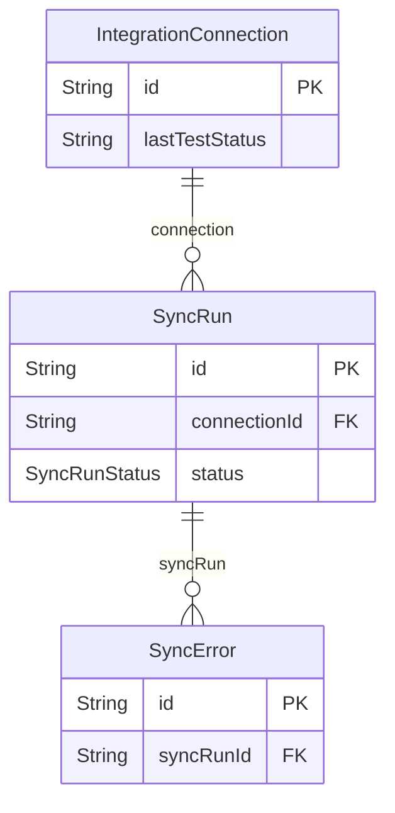

<a id="model-integrationconnection"></a>

### IntegrationConnection

Table `integration_connections`

| Column | Type | Null? | Key | Default | Notes |
|---|---|---|---|---|---|
| `id` | String · Char(26) |  | PK |  |  |
| `name` | String · VarChar(128) |  |  |  |  |
| `baseUrl` | String · VarChar(1024) |  |  |  |  |
| `authType` | [enum IntegrationAuthType](#enum-integrationauthtype) |  |  | NONE |  |
| `credentialsEnc` | String · Text | yes |  |  | AES-256-GCM ciphertext. Never returned by any API. |
| `credentialsMask` | String · VarChar(64) | yes |  |  |  |
| `fieldMappingJson` | Json |  |  |  | External field -&gt; UBOSS field mapping, validated at save time. |
| `direction` | [enum SyncDirection](#enum-syncdirection) |  |  | IMPORT |  |
| `conflictPolicy` | [enum ConflictPolicy](#enum-conflictpolicy) |  |  | EXTERNAL_WINS |  |
| `scheduleCron` | String · VarChar(64) | yes |  |  | Cron expression evaluated in the business timezone. Null = manual only. |
| `timeoutMs` | Int |  |  | 15000 |  |
| `maxRetries` | Int |  |  | 3 |  |
| `circuitState` | [enum CircuitState](#enum-circuitstate) |  |  | CLOSED |  |
| `circuitOpenedAt` | DateTime · DateTime(3) | yes |  |  |  |
| `consecutiveFailures` | Int |  |  | 0 |  |
| `isActive` | Boolean |  |  | false |  |
| `lastSuccessAt` | DateTime · DateTime(3) | yes |  |  |  |
| `lastTestedAt` | DateTime · DateTime(3) | yes |  |  |  |
| `lastTestStatus` | String · VarChar(32) | yes |  |  |  |
| `alertRecipientsJson` | Json | yes |  |  |  |
| `createdById` | String · Char(26) | yes |  |  |  |
| `createdAt` | DateTime · DateTime(3) |  |  | now() |  |
| `updatedAt` | DateTime · DateTime(3) |  | auto-updated |  |  |

**Relations**

- `syncRuns` ← [SyncRun](#model-syncrun) - has many

**Indexes and keys**

- `@@index([isActive], map: "ix_integration_active")`

<a id="model-syncrun"></a>

### SyncRun

Table `sync_runs`

| Column | Type | Null? | Key | Default | Notes |
|---|---|---|---|---|---|
| `id` | String · Char(26) |  | PK |  |  |
| `connectionId` | String · Char(26) |  | FK → [IntegrationConnection](#model-integrationconnection) |  | (on delete: Cascade) |
| `status` | [enum SyncRunStatus](#enum-syncrunstatus) |  |  | RUNNING |  |
| `isDryRun` | Boolean |  |  | false | A dry run validates and reports without writing catalog rows. |
| `triggeredBy` | String · VarChar(32) |  |  |  |  |
| `startedAt` | DateTime · DateTime(3) |  |  | now() |  |
| `finishedAt` | DateTime · DateTime(3) | yes |  |  |  |
| `totalRecords` | Int |  |  | 0 |  |
| `createdCount` | Int |  |  | 0 |  |
| `updatedCount` | Int |  |  | 0 |  |
| `skippedCount` | Int |  |  | 0 |  |
| `failureCount` | Int |  |  | 0 |  |
| `summaryJson` | Json | yes |  |  |  |
| `errorMessage` | String · VarChar(1024) | yes |  |  |  |

**Relations**

- `connection` → [IntegrationConnection](#model-integrationconnection) via `connectionId` - many-to-one, required, on delete **Cascade**
- `errors` ← [SyncError](#model-syncerror) - has many

**Indexes and keys**

- `@@index([connectionId, startedAt], map: "ix_sync_run_connection_time")`
- `@@index([status, startedAt], map: "ix_sync_run_status_time")`

<a id="model-syncerror"></a>

### SyncError

Table `sync_errors`

| Column | Type | Null? | Key | Default | Notes |
|---|---|---|---|---|---|
| `id` | String · Char(26) |  | PK |  |  |
| `syncRunId` | String · Char(26) |  | FK → [SyncRun](#model-syncrun) |  | (on delete: Cascade) |
| `rowRef` | String · VarChar(128) | yes |  |  | External record identifier or row number, whichever the source provides. |
| `field` | String · VarChar(128) | yes |  |  |  |
| `errorCode` | String · VarChar(64) |  |  |  |  |
| `errorMessage` | String · VarChar(1024) |  |  |  |  |
| `payloadJson` | Json | yes |  |  | Offending record, with credentials and personal data already redacted. |
| `createdAt` | DateTime · DateTime(3) |  |  | now() |  |

**Relations**

- `syncRun` → [SyncRun](#model-syncrun) via `syncRunId` - many-to-one, required, on delete **Cascade**

**Indexes and keys**

- `@@index([syncRunId], map: "ix_sync_error_run")`

### Enums in Integrations (custom product/inventory API connector)

<a id="enum-integrationauthtype"></a>

#### enum IntegrationAuthType

| Value | Meaning |
|---|---|
| `NONE` |  |
| `API_KEY_HEADER` |  |
| `BEARER_TOKEN` |  |
| `BASIC` |  |

<a id="enum-syncdirection"></a>

#### enum SyncDirection

| Value | Meaning |
|---|---|
| `IMPORT` |  |
| `EXPORT` |  |
| `BIDIRECTIONAL` |  |

<a id="enum-conflictpolicy"></a>

#### enum ConflictPolicy

| Value | Meaning |
|---|---|
| `EXTERNAL_WINS` |  |
| `UBOSS_WINS` |  |
| `FIELD_LEVEL` |  |

<a id="enum-circuitstate"></a>

#### enum CircuitState

| Value | Meaning |
|---|---|
| `CLOSED` |  |
| `OPEN` |  |
| `HALF_OPEN` |  |

<a id="enum-syncrunstatus"></a>

#### enum SyncRunStatus

| Value | Meaning |
|---|---|
| `RUNNING` |  |
| `SUCCEEDED` |  |
| `PARTIAL` |  |
| `FAILED` |  |
| `CANCELLED` |  |

<a id="group-bulk-import-export"></a>

## Bulk import / export

[ImportJob](#model-importjob) · [ImportRowError](#model-importrowerror) · [ExportJob](#model-exportjob)

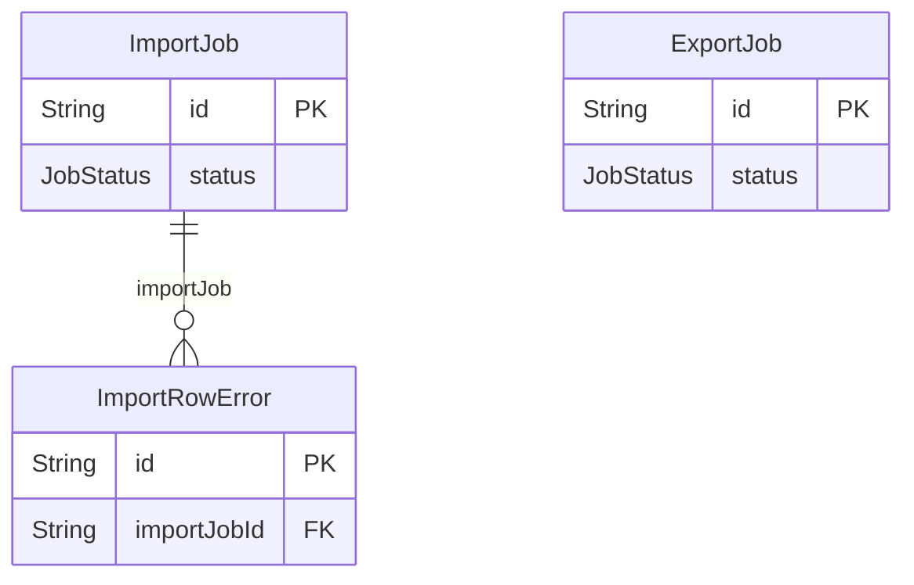

<a id="model-importjob"></a>

### ImportJob

Table `import_jobs`

| Column | Type | Null? | Key | Default | Notes |
|---|---|---|---|---|---|
| `id` | String · Char(26) |  | PK |  |  |
| `type` | String · VarChar(32) |  |  |  | e.g. PRODUCTS, INVENTORY, CUSTOMERS. |
| `fileKey` | String · VarChar(512) |  |  |  | Uploaded CSV/XLSX in the storage driver. |
| `fileName` | String · VarChar(255) |  |  |  |  |
| `isDryRun` | Boolean |  |  | true | A dry run produces per-row validation results and writes nothing. |
| `status` | [enum JobStatus](#enum-jobstatus) |  |  | PENDING |  |
| `totalRows` | Int |  |  | 0 |  |
| `validRows` | Int |  |  | 0 |  |
| `errorRows` | Int |  |  | 0 |  |
| `createdRows` | Int |  |  | 0 |  |
| `updatedRows` | Int |  |  | 0 |  |
| `resultJson` | Json | yes |  |  |  |
| `errorMessage` | String · VarChar(1024) | yes |  |  |  |
| `confirmedFromJobId` | String · Char(26) | yes |  |  | Set once a dry run is confirmed, linking preview to the real import. |
| `createdById` | String · Char(26) |  |  |  |  |
| `createdAt` | DateTime · DateTime(3) |  |  | now() |  |
| `startedAt` | DateTime · DateTime(3) | yes |  |  |  |
| `completedAt` | DateTime · DateTime(3) | yes |  |  |  |

**Relations**

- `rowErrors` ← [ImportRowError](#model-importrowerror) - has many

**Indexes and keys**

- `@@index([type, status, createdAt], map: "ix_import_job_type_status")`

<a id="model-importrowerror"></a>

### ImportRowError

Table `import_row_errors`

| Column | Type | Null? | Key | Default | Notes |
|---|---|---|---|---|---|
| `id` | String · Char(26) |  | PK |  |  |
| `importJobId` | String · Char(26) |  | FK → [ImportJob](#model-importjob) |  | (on delete: Cascade) |
| `rowNumber` | Int |  |  |  |  |
| `field` | String · VarChar(128) | yes |  |  |  |
| `code` | String · VarChar(64) |  |  |  |  |
| `message` | String · VarChar(1024) |  |  |  |  |
| `rawJson` | Json | yes |  |  |  |

**Relations**

- `importJob` → [ImportJob](#model-importjob) via `importJobId` - many-to-one, required, on delete **Cascade**

**Indexes and keys**

- `@@index([importJobId, rowNumber], map: "ix_import_row_error_job")`

<a id="model-exportjob"></a>

### ExportJob

Table `export_jobs`

| Column | Type | Null? | Key | Default | Notes |
|---|---|---|---|---|---|
| `id` | String · Char(26) |  | PK |  |  |
| `type` | String · VarChar(32) |  |  |  |  |
| `paramsJson` | Json |  |  |  |  |
| `status` | [enum JobStatus](#enum-jobstatus) |  |  | PENDING |  |
| `fileKey` | String · VarChar(512) | yes |  |  |  |
| `fileName` | String · VarChar(255) | yes |  |  |  |
| `rowCount` | Int | yes |  |  |  |
| `downloadTokenHash` | String · Char(64) | yes | UNIQUE |  | Downloads go through a hashed, expiring token. The storage key is never handed to the browser directly. |
| `downloadExpiresAt` | DateTime · DateTime(3) | yes |  |  |  |
| `downloadedAt` | DateTime · DateTime(3) | yes |  |  |  |
| `errorMessage` | String · VarChar(1024) | yes |  |  |  |
| `createdById` | String · Char(26) |  |  |  |  |
| `createdAt` | DateTime · DateTime(3) |  |  | now() |  |
| `completedAt` | DateTime · DateTime(3) | yes |  |  |  |

**Indexes and keys**

- `@@index([type, status, createdAt], map: "ix_export_job_type_status")`

### Enums in Bulk import / export

<a id="enum-jobstatus"></a>

#### enum JobStatus

| Value | Meaning |
|---|---|
| `PENDING` |  |
| `RUNNING` |  |
| `SUCCEEDED` |  |
| `PARTIAL` |  |
| `FAILED` |  |
| `DEAD` |  |
| `CANCELLED` |  |

<a id="group-notifications-transactional-outbox"></a>

## Notifications (transactional outbox)

[NotificationOutbox](#model-notificationoutbox) · [NotificationDelivery](#model-notificationdelivery)

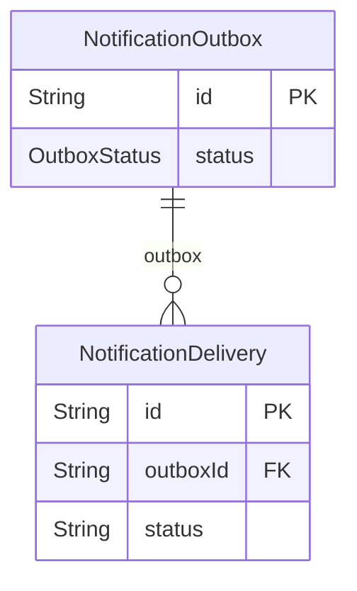

<a id="model-notificationoutbox"></a>

### NotificationOutbox

Table `notification_outbox`

| Column | Type | Null? | Key | Default | Notes |
|---|---|---|---|---|---|
| `id` | String · Char(26) |  | PK |  |  |
| `eventKey` | String · VarChar(96) |  |  |  |  |
| `channel` | [enum NotificationChannel](#enum-notificationchannel) |  |  | EMAIL |  |
| `recipientEmail` | String · VarChar(320) | yes |  |  |  |
| `recipientPhone` | String · VarChar(32) | yes |  |  |  |
| `recipientName` | String · VarChar(255) | yes |  |  |  |
| `subject` | String · VarChar(255) |  |  |  |  |
| `body` | String · LongText |  |  |  |  |
| `payloadJson` | Json | yes |  |  | Template variables, already redacted of secrets and payment payloads. |
| `status` | [enum OutboxStatus](#enum-outboxstatus) |  |  | PENDING |  |
| `attemptCount` | Int |  |  | 0 |  |
| `maxAttempts` | Int |  |  | 5 |  |
| `nextAttemptAt` | DateTime · DateTime(3) |  |  | now() |  |
| `dedupeKey` | String · VarChar(191) | yes | UNIQUE |  | Stops a retried business operation from emailing the same person twice. |
| `lastError` | String · VarChar(1024) | yes |  |  |  |
| `relatedType` | String · VarChar(48) | yes |  |  |  |
| `relatedId` | String · Char(26) | yes |  |  |  |
| `createdAt` | DateTime · DateTime(3) |  |  | now() |  |
| `updatedAt` | DateTime · DateTime(3) |  | auto-updated |  |  |
| `sentAt` | DateTime · DateTime(3) | yes |  |  |  |

**Relations**

- `deliveries` ← [NotificationDelivery](#model-notificationdelivery) - has many

**Indexes and keys**

- `@@index([status, nextAttemptAt], map: "ix_outbox_due")`
- `@@index([eventKey, createdAt], map: "ix_outbox_event_time")`
- `@@index([relatedType, relatedId], map: "ix_outbox_related")`

<a id="model-notificationdelivery"></a>

### NotificationDelivery

Table `notification_deliveries`

| Column | Type | Null? | Key | Default | Notes |
|---|---|---|---|---|---|
| `id` | String · Char(26) |  | PK |  |  |
| `outboxId` | String · Char(26) |  | FK → [NotificationOutbox](#model-notificationoutbox) |  | (on delete: Cascade) |
| `provider` | String · VarChar(48) |  |  |  |  |
| `providerMessageId` | String · VarChar(191) | yes |  |  |  |
| `status` | String · VarChar(32) |  |  |  |  |
| `errorMessage` | String · VarChar(1024) | yes |  |  |  |
| `durationMs` | Int | yes |  |  | Milliseconds spent in the provider call, for latency dashboards. |
| `createdAt` | DateTime · DateTime(3) |  |  | now() |  |

**Relations**

- `outbox` → [NotificationOutbox](#model-notificationoutbox) via `outboxId` - many-to-one, required, on delete **Cascade**

**Indexes and keys**

- `@@index([outboxId], map: "ix_delivery_outbox")`
- `@@index([createdAt], map: "ix_delivery_time")`

### Enums in Notifications (transactional outbox)

<a id="enum-outboxstatus"></a>

#### enum OutboxStatus

| Value | Meaning |
|---|---|
| `PENDING` |  |
| `SENDING` |  |
| `SENT` |  |
| `FAILED` |  |
| `DEAD` |  |
| `SUPPRESSED` |  |

<a id="group-whether-a-console-row-is-a-problem-or-a-piece-of-news-the-distinction-the-bell-could-not-previously-draw-and-the-one-the-whole-resolution-lifecycle-hangs-off-a-customer-placed-an-order-is-news-it-is-true-forever-nobody-can-fix-it-and-the-only-sensible-way-to-clear-it-is-for-somebody-to-read-it-a-consignment-went-warm-is-a-problem-it-stays-worth-acting-on-until-the-underlying-exception-is-closed-whether-or-not-anybody-has-glanced-at-the-bell-counting-both-the-same-way-is-what-made-a-bell-that-either-nagged-forever-or-went-quiet-the-moment-somebody-looked-at-it"></a>

##  / whether a console row is a problem or a piece of news. / / the distinction the bell could not previously draw, and the one the whole / resolution lifecycle hangs off. "a customer placed an order" is news: it is / true forever, nobody can fix it, and the only sensible way to clear it is / for somebody to read it. "a consignment went warm" is a problem: it stays / worth acting on until the underlying exception is closed, whether or not / anybody has glanced at the bell. / / counting both the same way is what made a bell that either nagged forever / or went quiet the moment somebody looked at it.

[AdminNotification](#model-adminnotification) · [AdminNotificationRead](#model-adminnotificationread)

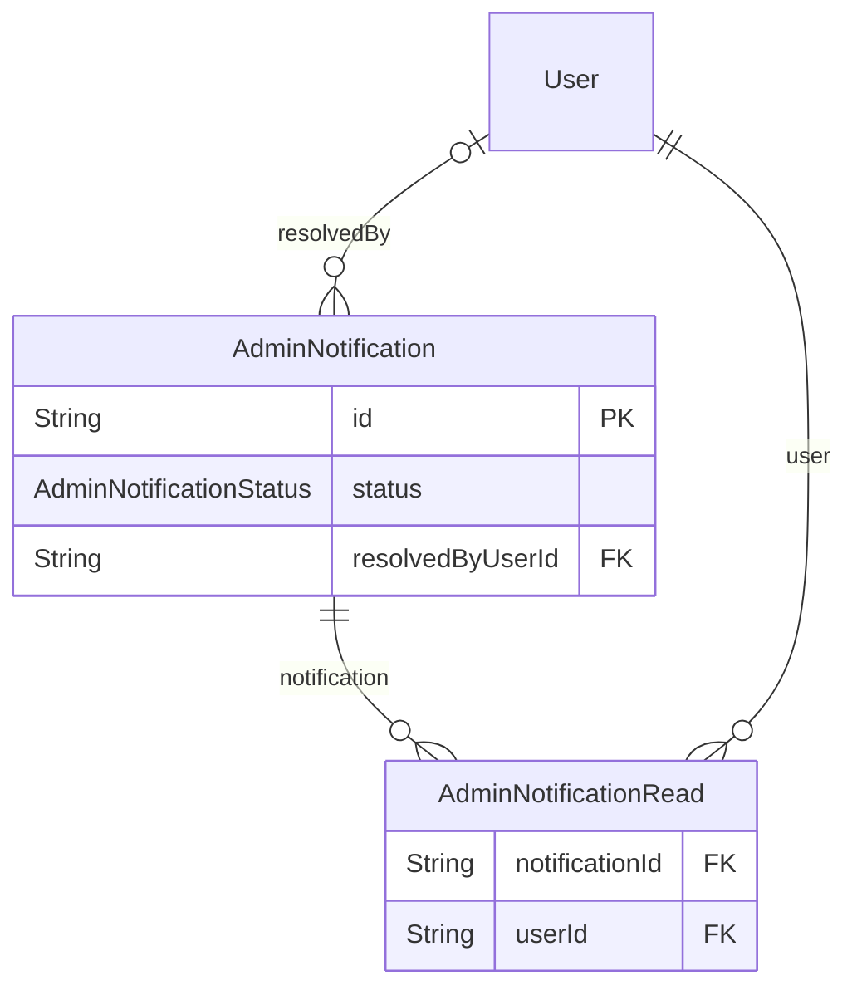

<a id="model-adminnotification"></a>

### AdminNotification

Table `admin_notifications`

| Column | Type | Null? | Key | Default | Notes |
|---|---|---|---|---|---|
| `id` | String · Char(26) |  | PK |  |  |
| `kind` | String · VarChar(48) |  |  |  | Dotted event kind, e.g. order.placed. The panel maps this to a phrase; the catalogue lives in AdminNotificationKind. |
| `class` | [enum AdminNotificationClass](#enum-adminnotificationclass) |  |  | INFORMATION | News or problem. See the enum - this decides how the row leaves the badge. |
| `status` | [enum AdminNotificationStatus](#enum-adminnotificationstatus) |  |  | ACTIVE | Where an ALERT stands. Meaningless on an INFORMATION row, which is why it defaults to ACTIVE and is simply never read for one. |
| `resolutionKey` | String · VarChar(191) | yes |  |  | What this alert is ABOUT, as opposed to what raised it. |
| `resolutionPolicy` | [enum AdminNotificationResolutionPolicy](#enum-adminnotificationresolutionpolicy) |  |  | DOMAIN_ONLY | Whether a human may close it from the bell. See the enum. |
| `resolvedAt` | DateTime · DateTime(3) | yes |  |  |  |
| `resolvedByUserId` | String · Char(26) | yes | FK → [User](#model-user) |  | Null for a resolution nobody signed - a domain event or a sweep. (on delete: SetNull) |
| `resolutionReason` | String · VarChar(512) | yes |  |  |  |
| `resolutionSource` | [enum AdminNotificationResolutionSource](#enum-adminnotificationresolutionsource) | yes |  |  |  |
| `occurrence` | Int |  |  | 1 | Which time round this is, for a problem that has come back. |
| `variablesJson` | Json | yes |  |  | The values that fill the phrase - customer name, order number, total. Primitives only, and already free of anything that should not be read by everyone who can open the bell. |
| `linkPath` | String · VarChar(255) | yes |  |  | Where the row leads in the Admin Panel, e.g. /orders/&lt;id&gt;. Null for a notification with no screen to open, which renders as plain text rather than as a link that goes nowhere. |
| `requiredPermission` | String · VarChar(64) | yes |  |  | Deny-by-default, carried on the row rather than on the endpoint. A notification about an order is shown only to staff who may read orders, so the bell cannot become a side channel around the permission model. Null means every member of staff sees it. |
| `relatedType` | String · VarChar(48) | yes |  |  |  |
| `relatedId` | String · Char(26) | yes |  |  |  |
| `dedupeKey` | String · VarChar(191) | yes | UNIQUE |  | One row per business event even when the operation is retried - the same guarantee `notification_outbox.dedupeKey` gives outgoing mail. |
| `createdAt` | DateTime · DateTime(3) |  |  | now() |  |

**Relations**

- `resolvedBy` → [User](#model-user) via `resolvedByUserId` - many-to-one, optional, on delete **SetNull**
- `reads` ← [AdminNotificationRead](#model-adminnotificationread) - has many

**Indexes and keys**

- `@@index([createdAt], map: "ix_admin_notification_time")`
- `@@index([kind, createdAt], map: "ix_admin_notification_kind_time")`
- `@@index([relatedType, relatedId], map: "ix_admin_notification_related")`
- `@@index([class, status, createdAt], map: "ix_admin_notification_live")`
- `@@index([resolutionKey, status], map: "ix_admin_notification_resolution")`
- `@@index([resolvedByUserId], map: "ix_admin_notification_resolver")`

<a id="model-adminnotificationread"></a>

### AdminNotificationRead

Table `admin_notification_reads`

One person's own state on one console row.

| Column | Type | Null? | Key | Default | Notes |
|---|---|---|---|---|---|
| `notificationId` | String · Char(26) |  | FK → [AdminNotification](#model-adminnotification) |  | (on delete: Cascade) |
| `userId` | String · Char(26) |  | FK → [User](#model-user) |  | (on delete: Cascade) |
| `readAt` | DateTime · DateTime(3) |  |  | now() |  |
| `dismissedAt` | DateTime · DateTime(3) | yes |  |  | This reader has hidden the row without claiming the problem is fixed. |

**Relations**

- `notification` → [AdminNotification](#model-adminnotification) via `notificationId` - many-to-one, required, on delete **Cascade**
- `user` → [User](#model-user) via `userId` - many-to-one, required, on delete **Cascade**

**Indexes and keys**

- `@@id([notificationId, userId])`
- `@@index([userId], map: "ix_admin_notification_read_user")`

### Enums in  / whether a console row is a problem or a piece of news. / / the distinction the bell could not previously draw, and the one the whole / resolution lifecycle hangs off. "a customer placed an order" is news: it is / true forever, nobody can fix it, and the only sensible way to clear it is / for somebody to read it. "a consignment went warm" is a problem: it stays / worth acting on until the underlying exception is closed, whether or not / anybody has glanced at the bell. / / counting both the same way is what made a bell that either nagged forever / or went quiet the moment somebody looked at it.

<a id="enum-adminnotificationclass"></a>

#### enum AdminNotificationClass

| Value | Meaning |
|---|---|
| `INFORMATION` | Something happened. Cleared by the reader, per reader. |
| `ALERT` | Something is wrong. Cleared by the problem being fixed, for everyone. |

<a id="enum-adminnotificationstatus"></a>

#### enum AdminNotificationStatus

Where an alert stands. Shared across every recipient - see the model.

| Value | Meaning |
|---|---|
| `ACTIVE` | Still worth somebody's attention. |
| `RESOLVED` | The underlying problem is no longer actionable. Kept, never deleted: "this happened and here is what was done about it" is the record. |
| `ARCHIVED` | Retained history with no live meaning - the entity it described is gone. |

<a id="enum-adminnotificationresolutionsource"></a>

#### enum AdminNotificationResolutionSource

What closed an alert. Stored because "who says so" is the first question asked when an alert that should be open is not.

| Value | Meaning |
|---|---|
| `DOMAIN_EVENT` | The domain entity reached a terminal state, in the same transaction that moved it. The ordinary path, and the only trustworthy one. |
| `MANUAL` | A member of staff closed it by hand, with a reason and an audit row. |
| `SYSTEM_SWEEP` | A sweep found the thing it described no longer exists. |
| `SUPERSEDED` | A newer occurrence of the same problem replaced it. |

<a id="enum-adminnotificationresolutionpolicy"></a>

#### enum AdminNotificationResolutionPolicy

Whether a human may close this alert from the bell.

| Value | Meaning |
|---|---|
| `DOMAIN_ONLY` | Only the domain event may resolve it. The bell offers no button. |
| `MANUAL_ALLOWED` | An authorised member of staff may close it with a reason. |

<a id="group-job-queue-mariadb-backed-redis-driver-is-an-alternative-not-a-requirement"></a>

## Job queue (MariaDB-backed; Redis driver is an alternative, not a requirement)

[JobQueue](#model-jobqueue) · [RateLimitBucket](#model-ratelimitbucket)

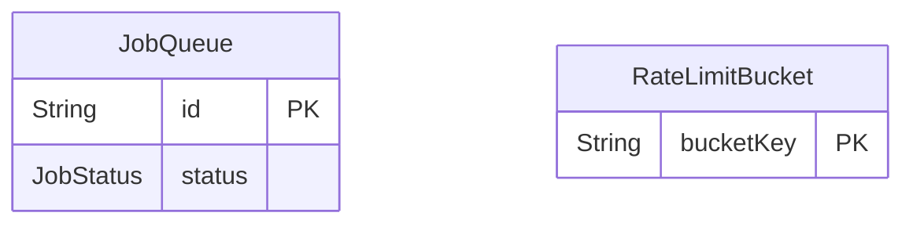

<a id="model-jobqueue"></a>

### JobQueue

Table `job_queue`

| Column | Type | Null? | Key | Default | Notes |
|---|---|---|---|---|---|
| `id` | String · Char(26) |  | PK |  |  |
| `queue` | String · VarChar(48) |  |  | "default" |  |
| `jobType` | String · VarChar(64) |  |  |  | e.g. notification.send, schedule.run, import.process, payment.reconcile. |
| `payloadJson` | Json |  |  |  |  |
| `status` | [enum JobStatus](#enum-jobstatus) |  |  | PENDING |  |
| `priority` | Int |  |  | 0 |  |
| `runAt` | DateTime · DateTime(3) |  |  | now() |  |
| `attemptCount` | Int |  |  | 0 |  |
| `maxAttempts` | Int |  |  | 5 |  |
| `leaseOwner` | String · VarChar(64) | yes |  |  |  |
| `leaseExpiresAt` | DateTime · DateTime(3) | yes |  |  |  |
| `lastError` | String · Text | yes |  |  |  |
| `dedupeKey` | String · VarChar(191) | yes | UNIQUE |  | Optional application-level dedupe, e.g. one reconcile job per order. |
| `createdAt` | DateTime · DateTime(3) |  |  | now() |  |
| `updatedAt` | DateTime · DateTime(3) |  | auto-updated |  |  |
| `startedAt` | DateTime · DateTime(3) | yes |  |  |  |
| `completedAt` | DateTime · DateTime(3) | yes |  |  |  |

**Indexes and keys**

- `@@index([status, runAt, priority], map: "ix_job_claim")`
- `@@index([queue, status], map: "ix_job_queue_status")`
- `@@index([leaseExpiresAt], map: "ix_job_lease_reaper")`
- `@@index([jobType, status], map: "ix_job_type_status")`

<a id="model-ratelimitbucket"></a>

### RateLimitBucket

Table `rate_limit_buckets`

| Column | Type | Null? | Key | Default | Notes |
|---|---|---|---|---|---|
| `bucketKey` | String · VarChar(191) |  | PK |  | Composite of scope and subject, e.g. login:ip:203.0.113.7. |
| `counter` | Int |  |  | 0 |  |
| `windowStart` | DateTime · DateTime(3) |  |  |  |  |
| `expiresAt` | DateTime · DateTime(3) |  |  |  |  |
| `updatedAt` | DateTime · DateTime(3) |  | auto-updated |  |  |

**Indexes and keys**

- `@@index([expiresAt], map: "ix_rate_limit_expires")`

<a id="group-audit"></a>

## Audit

[AuditLog](#model-auditlog)

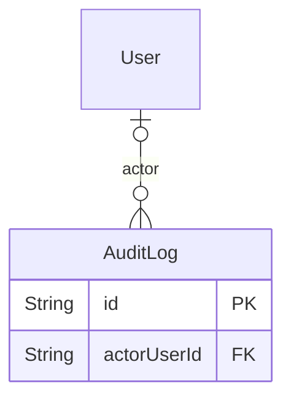

<a id="model-auditlog"></a>

### AuditLog

Table `audit_logs`

| Column | Type | Null? | Key | Default | Notes |
|---|---|---|---|---|---|
| `id` | String · Char(26) |  | PK |  |  |
| `actorType` | [enum ActorType](#enum-actortype) |  |  | SYSTEM |  |
| `actorUserId` | String · Char(26) | yes | FK → [User](#model-user) |  | (on delete: SetNull) |
| `actorEmail` | String · VarChar(320) | yes |  |  |  |
| `action` | String · VarChar(96) |  |  |  | Dotted verb, e.g. product.published, refund.created, connector.updated. |
| `resourceType` | String · VarChar(48) |  |  |  |  |
| `resourceId` | String · Char(26) | yes |  |  |  |
| `beforeJson` | Json | yes |  |  | Redacted before write: no password hashes, tokens, provider secrets or raw payment payloads ever reach these columns. |
| `afterJson` | Json | yes |  |  |  |
| `ipAddress` | String · VarChar(45) | yes |  |  |  |
| `userAgent` | String · VarChar(512) | yes |  |  |  |
| `correlationId` | String · VarChar(64) | yes |  |  |  |
| `createdAt` | DateTime · DateTime(3) |  |  | now() |  |

**Relations**

- `actor` → [User](#model-user) via `actorUserId` - many-to-one, optional, on delete **SetNull**

**Indexes and keys**

- `@@index([resourceType, resourceId, createdAt], map: "ix_audit_resource")`
- `@@index([actorUserId, createdAt], map: "ix_audit_actor")`
- `@@index([action, createdAt], map: "ix_audit_action")`
- `@@index([createdAt], map: "ix_audit_time")`

<a id="group-sequences"></a>

## Sequences

[NumberSequence](#model-numbersequence)

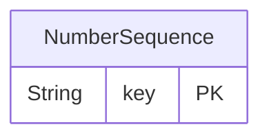

<a id="model-numbersequence"></a>

### NumberSequence

Table `number_sequences`

| Column | Type | Null? | Key | Default | Notes |
|---|---|---|---|---|---|
| `key` | String · VarChar(64) |  | PK |  | e.g. order:2026, invoice:2026. |
| `value` | BigInt |  |  | 0 |  |
| `prefix` | String · VarChar(16) |  |  |  |  |
| `padding` | Int |  |  | 6 | Zero-padding width for the numeric part. |
| `updatedAt` | DateTime · DateTime(3) |  | auto-updated |  |  |

<a id="group-localisation-currency-pricing"></a>

## Localisation, currency & pricing

[Currency](#model-currency) · [Country](#model-country) · [ProductPrice](#model-productprice)

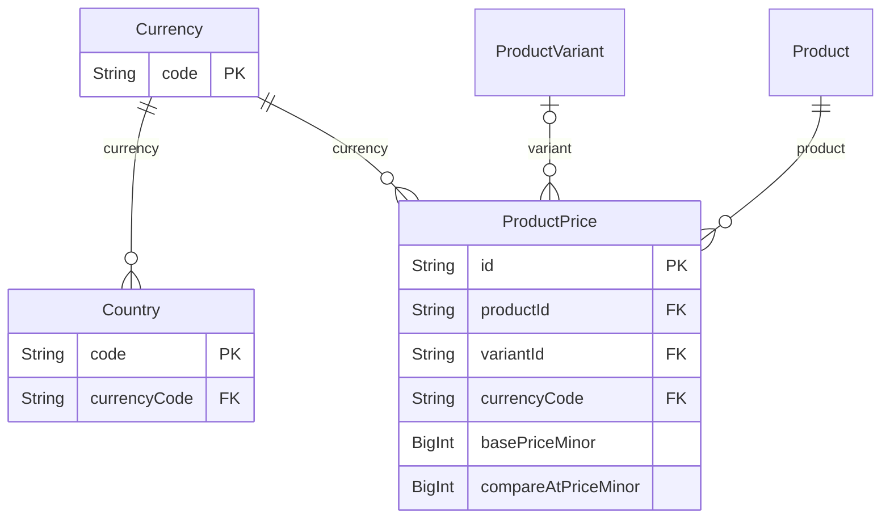

<a id="model-currency"></a>

### Currency

Table `currencies`

| Column | Type | Null? | Key | Default | Notes |
|---|---|---|---|---|---|
| `code` | String · Char(3) |  | PK |  | ISO-4217 alphabetic code. Must also appear in `domain/money.ts` CURRENCY_EXPONENT, or every amount in it fails to parse. |
| `name` | String · VarChar(64) |  |  |  |  |
| `symbol` | String · VarChar(8) |  |  |  | Display symbol, e.g. "₹", "$", "€". Prefixed to the formatted amount. |
| `exponent` | Int |  |  | 2 | Minor units per major unit: 2 for INR/USD, 0 for JPY/KRW. Mirrors CURRENCY_EXPONENT so the database and the money module cannot disagree; a mismatch is rejected at boot. |
| `isBase` | Boolean |  |  | false | The business's own reporting currency. Exactly one row may set this. |
| `isActive` | Boolean |  |  | true |  |
| `sortOrder` | Int |  |  | 0 |  |
| `createdAt` | DateTime · DateTime(3) |  |  | now() |  |
| `updatedAt` | DateTime · DateTime(3) |  | auto-updated |  |  |

**Relations**

- `countries` ← [Country](#model-country) - has many
- `productPrices` ← [ProductPrice](#model-productprice) - has many
- `couponMinimums` ← [CouponMinimum](#model-couponminimum) - has many
- `customerLimits` ← [CustomerLimit](#model-customerlimit) - has many

**Indexes and keys**

- `@@index([isActive, sortOrder], map: "ix_currency_active_sort")`

<a id="model-country"></a>

### Country

Table `countries`

| Column | Type | Null? | Key | Default | Notes |
|---|---|---|---|---|---|
| `code` | String · Char(2) |  | PK |  | ISO-3166-1 alpha-2, upper case. Matches `addresses.country`. |
| `name` | String · VarChar(96) |  |  |  |  |
| `currencyCode` | String · Char(3) |  | FK → [Currency](#model-currency) |  | What a visitor from here is shown by default. They may still switch to any other active currency - this is a starting point, not a restriction. (on delete: Restrict) |
| `phonePrefix` | String · VarChar(8) | yes |  |  | E.164 dialling prefix, e.g. "+91". Display only. |
| `languageCode` | String · VarChar(8) | yes |  |  | The interface language somebody working in this country reads, as a BCP-47 primary subtag. The admin console adopts it for a member of staff whose sign-in resolved to this country, which is what puts a German panel in front of somebody signing in from Berlin without them touching a picker. |
| `isEuVat` | Boolean |  |  | false | Whether this country is inside the EU VAT area. Not the same as EU membership, which is why it is a stored flag rather than a hard-coded list: the Canary Islands and Ceuta are Spain but outside it, Livigno is Italy but outside it, Monaco is not the EU but is treated as France for VAT, and Northern Ireland is a third… |
| `isActive` | Boolean |  |  | true |  |
| `sortOrder` | Int |  |  | 0 |  |
| `createdAt` | DateTime · DateTime(3) |  |  | now() |  |
| `updatedAt` | DateTime · DateTime(3) |  | auto-updated |  |  |

**Relations**

- `currency` → [Currency](#model-currency) via `currencyCode` - many-to-one, required, on delete **Restrict**
- `warehouses` ← [InventoryLocation](#model-inventorylocation) - has many

**Indexes and keys**

- `@@index([isActive, sortOrder], map: "ix_country_active_sort")`
- `@@index([currencyCode], map: "ix_country_currency")`

<a id="model-productprice"></a>

### ProductPrice

Table `product_prices`

| Column | Type | Null? | Key | Default | Notes |
|---|---|---|---|---|---|
| `id` | String · Char(26) |  | PK |  |  |
| `productId` | String · Char(26) |  | FK → [Product](#model-product) |  | (on delete: Cascade) |
| `variantId` | String · Char(26) | yes | FK → [ProductVariant](#model-productvariant) |  | (on delete: Cascade) |
| `variantKey` | String · VarChar(26) |  |  | "" | The variant ULID, or '' for the base product. Never null, because a MySQL UNIQUE index treats every NULL as distinct and a nullable variantId would therefore permit duplicate prices for the same SKU and currency. |
| `currencyCode` | String · Char(3) |  | FK → [Currency](#model-currency) |  | (on delete: Restrict) |
| `basePriceMinor` | BigInt |  |  |  |  |
| `compareAtPriceMinor` | BigInt | yes |  |  | Optional strike-through price. Must be &gt;= basePriceMinor, enforced in the service rather than the schema so the message can name the field. |
| `isAutoConverted` | Boolean |  |  | false | True when this figure is maintained by the exchange-rate refresh rather than typed by a person. |
| `createdAt` | DateTime · DateTime(3) |  |  | now() |  |
| `updatedAt` | DateTime · DateTime(3) |  | auto-updated |  |  |
| `updatedById` | String · Char(26) | yes |  |  |  |

**Relations**

- `product` → [Product](#model-product) via `productId` - many-to-one, required, on delete **Cascade**
- `variant` → [ProductVariant](#model-productvariant) via `variantId` - many-to-one, optional, on delete **Cascade**
- `currency` → [Currency](#model-currency) via `currencyCode` - many-to-one, required, on delete **Restrict**

**Indexes and keys**

- `@@unique([productId, variantKey, currencyCode], map: "uq_product_price_sku_currency")`
- `@@index([currencyCode, basePriceMinor], map: "ix_product_price_currency_amount")`
- `@@index([variantId], map: "ix_product_price_variant")`

<a id="group-whether-the-fetch-itself-worked"></a>

##  / whether the fetch itself worked.

[ExchangeRateSnapshot](#model-exchangeratesnapshot) · [ExchangeRate](#model-exchangerate)

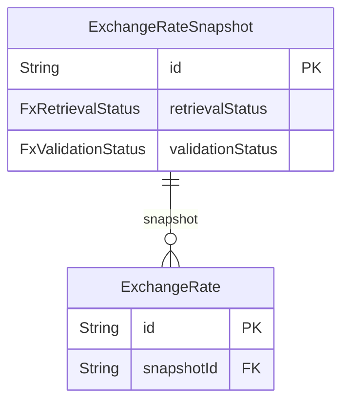

<a id="model-exchangeratesnapshot"></a>

### ExchangeRateSnapshot

Table `exchange_rate_snapshots`

One fetch from one provider.

| Column | Type | Null? | Key | Default | Notes |
|---|---|---|---|---|---|
| `id` | String · Char(26) |  | PK |  |  |
| `provider` | String · VarChar(32) |  |  |  | Which adapter produced this - "ecb", "json". Stored rather than derived from configuration, because configuration changes and an order that points here must still be able to say where its number came from. |
| `pivotCurrency` | String · Char(3) |  |  |  | What every rate in this snapshot is quoted against. EUR for the ECB, and not assumed anywhere: `domain/fx.ts` crosses through whatever this says. |
| `asOf` | DateTime · DateTime(3) |  |  |  | The date the PROVIDER says these rates are for. |
| `fetchedAt` | DateTime · DateTime(3) |  |  | now() | When UBOSS received it. The pair (asOf, fetchedAt) is what tells an operator whether the feed is late or the rates are simply old. |
| `sourceReference` | String · VarChar(512) |  |  |  | Where it came from, for the audit trail: a URL and the document's date. Never a credential, never a response body. |
| `retrievalStatus` | [enum FxRetrievalStatus](#enum-fxretrievalstatus) |  |  | FETCHED |  |
| `validationStatus` | [enum FxValidationStatus](#enum-fxvalidationstatus) |  |  | PENDING |  |
| `failureReason` | String · VarChar(512) | yes |  |  | Why this snapshot was refused or could not be fetched, in words a person reads on the settings screen. Never carries a key, a header or a body. |
| `rateCount` | Int |  |  | 0 | How many rates it carries, and how many rows it saw and refused. The second number is the one that catches a feed degrading quietly. |
| `rejectedCount` | Int |  |  | 0 |  |
| `maxDriftPercent` | Decimal · Decimal(9, 4) | yes |  |  | The largest move against the previously active snapshot, as a percentage, and the currency that moved most. Null on the first snapshot, which has nothing to compare against. |
| `maxDriftCurrency` | String · Char(3) | yes |  |  |  |
| `isActive` | Boolean |  |  | false | True for the snapshot currently being priced from. |
| `activeProvider` | String · VarChar(32) | yes |  |  | The provider name while this snapshot is active, and NULL once it is not. |
| `activatedAt` | DateTime · DateTime(3) | yes |  |  |  |
| `retiredAt` | DateTime · DateTime(3) | yes |  |  |  |
| `createdAt` | DateTime · DateTime(3) |  |  | now() |  |
| `updatedAt` | DateTime · DateTime(3) |  | auto-updated |  |  |

**Relations**

- `rates` ← [ExchangeRate](#model-exchangerate) - has many
- `orders` ← [Order](#model-order) - has many

**Indexes and keys**

- `@@unique([activeProvider], map: "uq_fx_snapshot_active_provider")`
- `@@index([provider, isActive], map: "ix_fx_snapshot_active")`
- `@@index([provider, asOf], map: "ix_fx_snapshot_provider_asof")`
- `@@index([validationStatus, fetchedAt], map: "ix_fx_snapshot_validation")`

<a id="model-exchangerate"></a>

### ExchangeRate

Table `exchange_rates`

One quoted pair inside one snapshot. Never updated.

| Column | Type | Null? | Key | Default | Notes |
|---|---|---|---|---|---|
| `id` | String · Char(26) |  | PK |  |  |
| `snapshotId` | String · Char(26) |  | FK → [ExchangeRateSnapshot](#model-exchangeratesnapshot) |  | (on delete: Cascade) |
| `baseCurrency` | String · Char(3) |  |  |  | Denormalised from the snapshot's pivot so a single row is readable on its own - an order's audit trail quotes one of these, not a join. |
| `quoteCurrency` | String · Char(3) |  |  |  |  |
| `rate` | Decimal · Decimal(24, 12) |  |  |  | How many `quoteCurrency` one `baseCurrency` buys. |
| `createdAt` | DateTime · DateTime(3) |  |  | now() |  |

**Relations**

- `snapshot` → [ExchangeRateSnapshot](#model-exchangeratesnapshot) via `snapshotId` - many-to-one, required, on delete **Cascade**

**Indexes and keys**

- `@@unique([snapshotId, quoteCurrency], map: "uq_exchange_rate_snapshot_currency")`
- `@@index([quoteCurrency, createdAt], map: "ix_exchange_rate_currency_time")`

### Enums in  / whether the fetch itself worked.

<a id="enum-fxretrievalstatus"></a>

#### enum FxRetrievalStatus

| Value | Meaning |
|---|---|
| `FETCHED` | The provider answered and the body parsed. |
| `FAILED` | The provider could not be reached, timed out, or answered unusably. |

<a id="enum-fxvalidationstatus"></a>

#### enum FxValidationStatus

Whether the fetched list is fit to price with.

| Value | Meaning |
|---|---|
| `PENDING` | Fetched, not yet checked. A row should not stay here long. |
| `VALID` | Checked against the currencies in use and the previous snapshot. |
| `REJECTED` | Checked and refused. `failureReason` says why, in words a person reads. |

<a id="group-coupons"></a>

## Coupons

[Coupon](#model-coupon) · [CouponCategory](#model-couponcategory) · [CouponMinimum](#model-couponminimum) · [CouponRedemption](#model-couponredemption) · [CustomerLimit](#model-customerlimit)

```mermaid
erDiagram
    Coupon ||--o{ CouponCategory : "coupon"
    Category ||--o{ CouponCategory : "category"
    Coupon ||--o{ CouponMinimum : "coupon"
    Currency ||--o{ CouponMinimum : "currency"
    Coupon ||--o{ CouponRedemption : "coupon"
    Order ||--o{ CouponRedemption : "order"
    CustomerProfile |o--o{ CouponRedemption : "customerProfile"
    CustomerProfile ||--o{ CustomerLimit : "customerProfile"
    Currency ||--o{ CustomerLimit : "currency"
    Coupon {
        String id PK
        CouponStatus status
    }
    CouponCategory {
        String couponId FK
        String categoryId FK
    }
    CouponMinimum {
        String couponId FK
        String currencyCode FK
        BigInt minOrderMinor
    }
    CouponRedemption {
        String id PK
        String couponId FK
        String orderId FK
        String customerProfileId FK
        BigInt discountMinor
    }
    CustomerLimit {
        String customerProfileId FK
        String currencyCode FK
        BigInt perOrderMinMinor
        BigInt perOrderMaxMinor
        BigInt monthlySpendCapMinor
        BigInt approvalThresholdMinor
    }
```

<a id="model-coupon"></a>

### Coupon

Table `coupons`

| Column | Type | Null? | Key | Default | Notes |
|---|---|---|---|---|---|
| `id` | String · Char(26) |  | PK |  |  |
| `code` | String · VarChar(32) |  | UNIQUE |  | What the customer types. Generated on create, then editable by staff. Compared case-insensitively; stored upper case so the unique index bites. |
| `name` | String · VarChar(128) |  |  |  | Internal label for the admin list. Not shown to customers. |
| `description` | String · VarChar(255) | yes |  |  | Customer-facing line in the "available coupons" list on the cart. |
| `discountPercent` | Decimal · Decimal(5, 2) |  |  |  | Percent off, Decimal never Float. 10.00 = 10%. Capped at 100 in the service. |
| `scope` | [enum CouponScope](#enum-couponscope) |  |  | ALL_PRODUCTS |  |
| `status` | [enum CouponStatus](#enum-couponstatus) |  |  | DRAFT |  |
| `isPubliclyListed` | Boolean |  |  | true | Shown in the storefront's coupon list. A false here makes the coupon code-only: it still works when typed, it just is not advertised. |
| `validFrom` | DateTime · DateTime(3) | yes |  |  | Null on either side means open-ended. |
| `validUntil` | DateTime · DateTime(3) | yes |  |  |  |
| `usageLimit` | Int | yes |  |  | Null = unlimited. `usageCount` is maintained alongside redemptions. |
| `perCustomerLimit` | Int | yes |  |  |  |
| `usageCount` | Int |  |  | 0 |  |
| `createdAt` | DateTime · DateTime(3) |  |  | now() |  |
| `updatedAt` | DateTime · DateTime(3) |  | auto-updated |  |  |
| `archivedAt` | DateTime · DateTime(3) | yes |  |  |  |
| `createdById` | String · Char(26) | yes |  |  |  |
| `updatedById` | String · Char(26) | yes |  |  |  |

**Relations**

- `categories` ← [CouponCategory](#model-couponcategory) - has many
- `minimums` ← [CouponMinimum](#model-couponminimum) - has many
- `redemptions` ← [CouponRedemption](#model-couponredemption) - has many
- `carts` ← [Cart](#model-cart) - has many

**Indexes and keys**

- `@@index([status, validFrom, validUntil], map: "ix_coupon_live")`
- `@@index([status, isPubliclyListed], map: "ix_coupon_listed")`

<a id="model-couponcategory"></a>

### CouponCategory

Table `coupon_categories`

| Column | Type | Null? | Key | Default | Notes |
|---|---|---|---|---|---|
| `couponId` | String · Char(26) |  | FK → [Coupon](#model-coupon) |  | (on delete: Cascade) |
| `categoryId` | String · Char(26) |  | FK → [Category](#model-category) |  | (on delete: Cascade) |
| `includeDescendants` | Boolean |  |  | true | Include products in descendant categories too. A coupon on "Packaging" almost always means the whole branch. |

**Relations**

- `coupon` → [Coupon](#model-coupon) via `couponId` - many-to-one, required, on delete **Cascade**
- `category` → [Category](#model-category) via `categoryId` - many-to-one, required, on delete **Cascade**

**Indexes and keys**

- `@@id([couponId, categoryId])`
- `@@index([categoryId], map: "ix_coupon_category_category")`

<a id="model-couponminimum"></a>

### CouponMinimum

Table `coupon_minimums`

| Column | Type | Null? | Key | Default | Notes |
|---|---|---|---|---|---|
| `couponId` | String · Char(26) |  | FK → [Coupon](#model-coupon) |  | (on delete: Cascade) |
| `currencyCode` | String · Char(3) |  | FK → [Currency](#model-currency) |  | (on delete: Restrict) |
| `minOrderMinor` | BigInt |  |  | 0 | Cart subtotal, before discount and before tax, at or above which the coupon applies. Zero means no threshold in this currency. |

**Relations**

- `coupon` → [Coupon](#model-coupon) via `couponId` - many-to-one, required, on delete **Cascade**
- `currency` → [Currency](#model-currency) via `currencyCode` - many-to-one, required, on delete **Restrict**

**Indexes and keys**

- `@@id([couponId, currencyCode])`

<a id="model-couponredemption"></a>

### CouponRedemption

Table `coupon_redemptions`

| Column | Type | Null? | Key | Default | Notes |
|---|---|---|---|---|---|
| `id` | String · Char(26) |  | PK |  |  |
| `couponId` | String · Char(26) |  | FK → [Coupon](#model-coupon) |  | (on delete: Restrict) |
| `orderId` | String · Char(26) |  | FK → [Order](#model-order) |  | (on delete: Cascade) |
| `customerProfileId` | String · Char(26) | yes | FK → [CustomerProfile](#model-customerprofile) |  | (on delete: SetNull) |
| `codeSnapshot` | String · VarChar(32) |  |  |  | Snapshots. The coupon's percent may be edited later; what this order actually received must not move. |
| `discountPercentSnapshot` | Decimal · Decimal(5, 2) |  |  |  |  |
| `currencyCode` | String · Char(3) |  |  |  |  |
| `discountMinor` | BigInt |  |  |  |  |
| `redeemedAt` | DateTime · DateTime(3) |  |  | now() |  |

**Relations**

- `coupon` → [Coupon](#model-coupon) via `couponId` - many-to-one, required, on delete **Restrict**
- `order` → [Order](#model-order) via `orderId` - many-to-one, required, on delete **Cascade**
- `customerProfile` → [CustomerProfile](#model-customerprofile) via `customerProfileId` - many-to-one, optional, on delete **SetNull**

**Indexes and keys**

- `@@unique([orderId], map: "uq_coupon_redemption_order")`
- `@@index([couponId, redeemedAt], map: "ix_coupon_redemption_coupon")`
- `@@index([customerProfileId, couponId], map: "ix_coupon_redemption_customer")`

<a id="model-customerlimit"></a>

### CustomerLimit

Table `customer_limits`

| Column | Type | Null? | Key | Default | Notes |
|---|---|---|---|---|---|
| `customerProfileId` | String · Char(26) |  | FK → [CustomerProfile](#model-customerprofile) |  | (on delete: Cascade) |
| `currencyCode` | String · Char(3) |  | FK → [Currency](#model-currency) |  | (on delete: Restrict) |
| `perOrderMinMinor` | BigInt | yes |  |  | Null on any of these means that particular rule imposes no limit here. |
| `perOrderMaxMinor` | BigInt | yes |  |  |  |
| `monthlySpendCapMinor` | BigInt | yes |  |  |  |
| `approvalThresholdMinor` | BigInt | yes |  |  | Order total at or above which approval is required, when approvals are on. |
| `createdAt` | DateTime · DateTime(3) |  |  | now() |  |
| `updatedAt` | DateTime · DateTime(3) |  | auto-updated |  |  |
| `updatedById` | String · Char(26) | yes |  |  |  |

**Relations**

- `customerProfile` → [CustomerProfile](#model-customerprofile) via `customerProfileId` - many-to-one, required, on delete **Cascade**
- `currency` → [Currency](#model-currency) via `currencyCode` - many-to-one, required, on delete **Restrict**

**Indexes and keys**

- `@@id([customerProfileId, currencyCode])`
- `@@index([currencyCode], map: "ix_customer_limit_currency")`

### Enums in Coupons

<a id="enum-couponscope"></a>

#### enum CouponScope

| Value | Meaning |
|---|---|
| `ALL_PRODUCTS` | Applies to every line in the cart. |
| `CATEGORIES` | Applies only to lines whose product sits in one of `categories`. |

<a id="enum-couponstatus"></a>

#### enum CouponStatus

| Value | Meaning |
|---|---|
| `DRAFT` | Authored but not yet live. Never matches, never listed. |
| `ACTIVE` |  |
| `DISABLED` | Switched off by staff. Kept for its redemption history. |

<a id="group-storefront-assistant"></a>

## Storefront assistant

[AssistantConversation](#model-assistantconversation) · [AssistantMessage](#model-assistantmessage) · [ProductTranslation](#model-producttranslation) · [CategoryTranslation](#model-categorytranslation)

```mermaid
erDiagram
    CustomerProfile |o--o{ AssistantConversation : "customerProfile"
    AssistantConversation ||--o{ AssistantMessage : "conversation"
    Product ||--o{ ProductTranslation : "product"
    Category ||--o{ CategoryTranslation : "category"
    AssistantConversation {
        String id PK
        String customerProfileId FK
    }
    AssistantMessage {
        String id PK
        String conversationId FK
    }
    ProductTranslation {
        String id PK
        String productId FK
    }
    CategoryTranslation {
        String id PK
        String categoryId FK
    }
```

<a id="model-assistantconversation"></a>

### AssistantConversation

Table `assistant_conversations`

| Column | Type | Null? | Key | Default | Notes |
|---|---|---|---|---|---|
| `id` | String · Char(26) |  | PK |  |  |
| `visitorName` | String · VarChar(120) | yes |  |  | HISTORICAL ONLY. The widget used to ask a visitor for a name, a mobile number and an email before it would answer anything. It no longer does, and nothing written from here on fills these in. |
| `visitorPhone` | String · VarChar(32) | yes |  |  |  |
| `visitorEmail` | String · VarChar(320) | yes |  |  |  |
| `visitorEmailNormalized` | String · VarChar(320) | yes |  |  | Lowercased/trimmed, for grouping repeat enquiries from one address. Not unique: the same buyer may come back with a different question. |
| `sessionTokenHash` | String · Char(64) | yes |  |  | HISTORICAL ONLY, for the same reason. SHA-256 of the opaque token the old guest widget held - the one thing that separated one anonymous visitor's conversation from another's on an endpoint with no session. The endpoint has a session now, so the owner below is the authorisation and no second bearer secret is minted. |
| `customerProfileId` | String · Char(26) | yes | FK → [CustomerProfile](#model-customerprofile) |  | Who this conversation belongs to. Set on every row the signed-in widget creates, and the only thing `/assistant/chat` authorises against. (on delete: SetNull) |
| `title` | String · VarChar(120) | yes |  |  | What the customer calls this conversation in their own history list. |
| `hiddenAt` | DateTime · DateTime(3) | yes |  |  | When the customer removed this conversation from their own history. |
| `messageCount` | Int |  |  | 0 | Denormalised so the enquiry list can be ordered and read without loading every transcript. |
| `lastMessageAt` | DateTime · DateTime(3) | yes |  |  |  |
| `ipAddress` | String · VarChar(45) | yes |  |  |  |
| `userAgent` | String · VarChar(512) | yes |  |  |  |
| `createdAt` | DateTime · DateTime(3) |  |  | now() |  |
| `updatedAt` | DateTime · DateTime(3) |  | auto-updated |  |  |

**Relations**

- `customerProfile` → [CustomerProfile](#model-customerprofile) via `customerProfileId` - many-to-one, optional, on delete **SetNull**
- `messages` ← [AssistantMessage](#model-assistantmessage) - has many

**Indexes and keys**

- `@@index([createdAt], map: "ix_assistant_conversation_created")`
- `@@index([visitorEmailNormalized, createdAt], map: "ix_assistant_conversation_email")`
- `@@index([customerProfileId], map: "ix_assistant_conversation_customer")`

<a id="model-assistantmessage"></a>

### AssistantMessage

Table `assistant_messages`

| Column | Type | Null? | Key | Default | Notes |
|---|---|---|---|---|---|
| `id` | String · Char(26) |  | PK |  |  |
| `conversationId` | String · Char(26) |  | FK → [AssistantConversation](#model-assistantconversation) |  | (on delete: Cascade) |
| `role` | [enum AssistantMessageRole](#enum-assistantmessagerole) |  |  |  |  |
| `content` | String · Text |  |  |  |  |
| `createdAt` | DateTime · DateTime(3) |  |  | now() |  |

**Relations**

- `conversation` → [AssistantConversation](#model-assistantconversation) via `conversationId` - many-to-one, required, on delete **Cascade**

**Indexes and keys**

- `@@index([conversationId, createdAt], map: "ix_assistant_message_conversation")`

<a id="model-producttranslation"></a>

### ProductTranslation

Table `product_translations`

A product's name and copy in one language.

| Column | Type | Null? | Key | Default | Notes |
|---|---|---|---|---|---|
| `id` | String · Char(26) |  | PK |  |  |
| `productId` | String · Char(26) |  | FK → [Product](#model-product) |  | (on delete: Cascade) |
| `language` | String · VarChar(10) |  |  |  | BCP-47 primary subtag, matching the interface languages. |
| `name` | String · VarChar(255) |  |  |  |  |
| `shortDescription` | String · VarChar(1024) | yes |  |  |  |
| `description` | String · Text | yes |  |  |  |
| `safetyWarnings` | String · Text | yes |  |  | GPSR Art. 19(d) requires warnings "in a language which can be easily understood by consumers", which for a storefront in eight languages means the one the reader picked. Null falls back to the base row, exactly like the description above - and the admin panel reports that fallback as a gap rather than as a translation. |
| `safetyInstructions` | String · Text | yes |  |  |  |
| `intendedPurpose` | String · Text | yes |  |  | MDR Art. 10(11): what the device is for. Translated for the same reason the warnings are - an intended purpose the reader cannot read has not been stated to them. |
| `metaTitle` | String · VarChar(255) | yes |  |  | Kept alongside the copy so a translated page can carry its own title. |
| `metaDescription` | String · VarChar(512) | yes |  |  |  |
| `isReviewed` | Boolean |  |  | false | True when a person has checked this row. Machine output ships, but the admin panel has to be able to show what nobody has read yet. |
| `createdAt` | DateTime · DateTime(3) |  |  | now() |  |
| `updatedAt` | DateTime · DateTime(3) |  | auto-updated |  |  |

**Relations**

- `product` → [Product](#model-product) via `productId` - many-to-one, required, on delete **Cascade**

**Indexes and keys**

- `@@unique([productId, language], map: "uq_product_translation")`
- `@@index([language], map: "ix_product_translation_language")`
- `@@index([name], map: "ix_product_translation_name")`

<a id="model-categorytranslation"></a>

### CategoryTranslation

Table `category_translations`

A category's name and copy in one language. Same shape and same reasoning as ProductTranslation.

| Column | Type | Null? | Key | Default | Notes |
|---|---|---|---|---|---|
| `id` | String · Char(26) |  | PK |  |  |
| `categoryId` | String · Char(26) |  | FK → [Category](#model-category) |  | (on delete: Cascade) |
| `language` | String · VarChar(10) |  |  |  |  |
| `name` | String · VarChar(255) |  |  |  |  |
| `description` | String · Text | yes |  |  |  |
| `metaTitle` | String · VarChar(255) | yes |  |  |  |
| `metaDescription` | String · VarChar(512) | yes |  |  |  |
| `isReviewed` | Boolean |  |  | false |  |
| `createdAt` | DateTime · DateTime(3) |  |  | now() |  |
| `updatedAt` | DateTime · DateTime(3) |  | auto-updated |  |  |

**Relations**

- `category` → [Category](#model-category) via `categoryId` - many-to-one, required, on delete **Cascade**

**Indexes and keys**

- `@@unique([categoryId, language], map: "uq_category_translation")`
- `@@index([language], map: "ix_category_translation_language")`

### Enums in Storefront assistant

<a id="enum-assistantmessagerole"></a>

#### enum AssistantMessageRole

| Value | Meaning |
|---|---|
| `VISITOR` |  |
| `ASSISTANT` |  |

<a id="group-data-protection-gdpr"></a>

## Data protection (GDPR)

[DataRequest](#model-datarequest)

```mermaid
erDiagram
    DataRequest {
        String id PK
        DataRequestStatus status
    }
```

<a id="model-datarequest"></a>

### DataRequest

Table `data_requests`

| Column | Type | Null? | Key | Default | Notes |
|---|---|---|---|---|---|
| `id` | String · Char(26) |  | PK |  |  |
| `subjectUserId` | String · Char(26) |  |  |  | The data subject. The email is duplicated out of `users` on purpose: an erasure scrubs that row, and this record must still name who was erased well enough to answer "did you action my request?" months later. It is itself scrubbed to a pseudonym when the erasure runs. |
| `subjectEmail` | String · VarChar(320) |  |  |  |  |
| `type` | [enum DataRequestType](#enum-datarequesttype) |  |  |  |  |
| `status` | [enum DataRequestStatus](#enum-datarequeststatus) |  |  | PENDING |  |
| `requestedAt` | DateTime · DateTime(3) |  |  | now() |  |
| `dueAt` | DateTime · DateTime(3) |  |  |  | Art. 12(3). Set to requestedAt + one month when the request is opened. |
| `completedAt` | DateTime · DateTime(3) | yes |  |  |  |
| `subjectNote` | String · VarChar(1024) | yes |  |  | Free text from the subject. Never trusted as an instruction - a request asking for something the law does not grant is still only a request. |
| `decisionNote` | String · VarChar(1024) | yes |  |  | Why a request was refused, or which exemption was relied on. Required by the service whenever status is REJECTED. |
| `handledById` | String · Char(26) | yes |  |  | Who actioned it. Null while PENDING, and for exports, which fulfil themselves - the subject is already authenticated, and making a person press a button before someone may read their own data adds delay without adding a check. |
| `handledAt` | DateTime · DateTime(3) | yes |  |  |  |
| `fileKey` | String · VarChar(512) | yes |  |  | The export bundle. Same hashed, expiring, single-purpose token as `export_jobs`: this file is every personal fact the system holds about one person, so a guessable or permanent URL would be the worst possible leak. |
| `fileName` | String · VarChar(255) | yes |  |  |  |
| `downloadTokenHash` | String · Char(64) | yes | UNIQUE |  |  |
| `downloadExpiresAt` | DateTime · DateTime(3) | yes |  |  |  |
| `downloadedAt` | DateTime · DateTime(3) | yes |  |  |  |
| `errorMessage` | String · VarChar(1024) | yes |  |  |  |
| `resultJson` | Json | yes |  |  | What the erasure actually did, per table, as counts. Evidence for Art. 5(2) accountability: "the account was erased" is a claim, and this is the record that supports it. |
| `createdAt` | DateTime · DateTime(3) |  |  | now() |  |
| `updatedAt` | DateTime · DateTime(3) |  | auto-updated |  |  |

**Indexes and keys**

- `@@index([status, dueAt], map: "ix_data_request_due")`
- `@@index([subjectUserId, requestedAt], map: "ix_data_request_subject")`
- `@@index([type, status], map: "ix_data_request_type_status")`

### Enums in Data protection (GDPR)

<a id="enum-datarequesttype"></a>

#### enum DataRequestType

| Value | Meaning |
|---|---|
| `EXPORT` | Art. 15 access and Art. 20 portability. Two distinct rights that are satisfied by the same machine-readable bundle, so they share a type. |
| `ERASURE` | Art. 17 erasure. Never a row delete - see `erasure.service.ts` for why the order history has to survive in pseudonymised form. |

<a id="enum-datarequeststatus"></a>

#### enum DataRequestStatus

| Value | Meaning |
|---|---|
| `PENDING` |  |
| `IN_PROGRESS` |  |
| `COMPLETED` |  |
| `REJECTED` | Art. 12(5) and 17(3): a refusal has to say why, and the reason is part of the record because the subject may take it to a supervisory authority. |
| `FAILED` |  |

<a id="group-which-of-a-member-state-s-rate-bands-a-product-falls-in-deliberately-the-bands-rather-than-the-numbers-every-member-state-sets-its-own-percentages-and-changes-them-on-its-own-schedule-what-is-stable-is-that-a-given-product-is-the-standard-rate-here-or-the-reduced-rate-here-storing-the-band-on-the-tax-class-and-the-percentage-per-country-is-what-lets-one-catalogue-be-sold-into-twenty-seven-of-them"></a>

##  / which of a member state's rate bands a product falls in. / / deliberately the bands rather than the numbers. every member state sets its / own percentages and changes them on its own schedule; what is stable is / that a given product is "the standard rate here" or "the reduced rate / here". storing the band on the tax class and the percentage per country is / what lets one catalogue be sold into twenty-seven of them.

[VatRate](#model-vatrate) · [VatNumberCheck](#model-vatnumbercheck)

```mermaid
erDiagram
    VatRate {
        String id PK
    }
    VatNumberCheck {
        String id PK
    }
```

<a id="model-vatrate"></a>

### VatRate

Table `vat_rates`

One rate band, in one country, for a period of time.

| Column | Type | Null? | Key | Default | Notes |
|---|---|---|---|---|---|
| `id` | String · Char(26) |  | PK |  |  |
| `countryCode` | String · Char(2) |  |  |  | ISO-3166-1 alpha-2, matching `countries.code`. Not a foreign key: VAT territory and country are not the same thing, and rows exist for codes the storefront does not sell into. |
| `category` | [enum VatCategory](#enum-vatcategory) |  |  |  |  |
| `ratePercent` | Decimal · Decimal(9, 6) |  |  |  | Percent, e.g. 21.000000. Decimal, never Float - see money.ts. |
| `label` | String · VarChar(128) | yes |  |  | A human label for the band, e.g. "Reduced - medical devices". Shown to staff, so a catalogue manager choosing a tax class can tell which of two reduced bands they mean. |
| `validFrom` | DateTime · Date |  |  |  |  |
| `validTo` | DateTime · Date | yes |  |  | Null means "still in force". Exactly one open-ended row per country and category is the expected shape; the service takes the latest that has started if that is ever violated. |
| `createdAt` | DateTime · DateTime(3) |  |  | now() |  |
| `updatedAt` | DateTime · DateTime(3) |  | auto-updated |  |  |

**Indexes and keys**

- `@@unique([countryCode, category, validFrom], map: "uq_vat_rate_period")`
- `@@index([countryCode, category, validFrom], map: "ix_vat_rate_lookup")`

<a id="model-vatnumbercheck"></a>

### VatNumberCheck

Table `vat_number_checks`

A VAT number that has been checked, and what the check said.

| Column | Type | Null? | Key | Default | Notes |
|---|---|---|---|---|---|
| `id` | String · Char(26) |  | PK |  |  |
| `countryCode` | String · Char(2) |  |  |  | The member state prefix and the number, stored apart because VIES takes them as separate arguments and because the prefix decides which state is being asked. |
| `number` | String · VarChar(32) |  |  |  |  |
| `isValid` | Boolean |  |  |  |  |
| `registeredName` | String · VarChar(255) | yes |  |  | What the member state returned for the holder, when it returns anything. Several answer with a name and address; several answer "---" as a matter of policy. Both are recorded as given. |
| `registeredAddress` | String · VarChar(512) | yes |  |  |  |
| `consultationNumber` | String · VarChar(64) | yes |  |  | The VIES consultation reference. Art. 31 of Reg. 904/2010 evidence. |
| `unavailableReason` | String · VarChar(255) | yes |  |  | Set when no answer could be obtained at all - a timeout, a member state's node being down. Distinct from `isValid = false`, which is a real answer meaning "no such number". |
| `checkedAt` | DateTime · DateTime(3) |  |  | now() |  |

**Indexes and keys**

- `@@unique([countryCode, number], map: "uq_vat_number_check")`
- `@@index([checkedAt], map: "ix_vat_number_check_time")`

### Enums in  / which of a member state's rate bands a product falls in. / / deliberately the bands rather than the numbers. every member state sets its / own percentages and changes them on its own schedule; what is stable is / that a given product is "the standard rate here" or "the reduced rate / here". storing the band on the tax class and the percentage per country is / what lets one catalogue be sold into twenty-seven of them.

<a id="enum-vatcategory"></a>

#### enum VatCategory

| Value | Meaning |
|---|---|
| `STANDARD` |  |
| `REDUCED` | Annex III of Directive 2006/112/EC. Most member states have one or two. |
| `SUPER_REDUCED` | The "super-reduced" band a few states kept under Art. 98(2). |
| `ZERO` | Taxable at 0%, with input VAT still recoverable. |
| `EXEMPT` | Exempt without the right to deduct - e.g. Art. 132 medical care. Distinct from ZERO because the invoice wording and the seller's own VAT return differ, even though the customer pays the same nothing. |

<a id="enum-taxtreatment"></a>

#### enum TaxTreatment

Why an order was taxed the way it was.

| Value | Meaning |
|---|---|
| `FLAT_RATE` | No EU VAT resolution ran. The flat tax-class rate applied - Indian GST, or any deployment that has not configured VAT rates. |
| `DOMESTIC` | Seller and customer in the same member state. That state's rate. |
| `INTRA_EU_REVERSE_CHARGE` | Intra-Community supply to a business holding a valid VAT number in another member state. Zero-rated, and the customer accounts for the tax themselves. Arts. 138 and 196. |
| `INTRA_EU_B2C` | Intra-Community distance sale to someone with no valid VAT number. Charged at the DESTINATION state's rate and declared through the One Stop Shop. Art. 33. |
| `EXPORT` | Goods leaving the Union. Zero-rated under Art. 146, on the condition that the seller can prove they left - a paperwork obligation this software records but cannot discharge. |

<a id="group-invoicing"></a>

## Invoicing

[Invoice](#model-invoice)

```mermaid
erDiagram
    Order ||--o{ Invoice : "order"
    Invoice |o--o{ Invoice : "creditsInvoice"
    Invoice {
        String id PK
        String orderId FK
        BigInt subtotalMinor
        BigInt discountMinor
        BigInt taxMinor
        BigInt shippingMinor
        BigInt grandTotalMinor
        String creditsInvoiceId FK
    }
```

<a id="model-invoice"></a>

### Invoice

Table `invoices`

| Column | Type | Null? | Key | Default | Notes |
|---|---|---|---|---|---|
| `id` | String · Char(26) |  | PK |  |  |
| `number` | String · VarChar(32) |  | UNIQUE |  | Art. 226(2): "a sequential number, based on one or more series, which uniquely identifies the invoice". Allocated from `number_sequences` under a row lock, so two concurrent issues cannot collide. |
| `series` | String · VarChar(16) |  |  | "INV" |  |
| `orderId` | String · Char(26) |  | FK → [Order](#model-order) |  | Not unique. An order has at most one invoice, but it may also have the credit note that cancels it, and both point here - a credit note belongs to the same supply as the document it reverses. "At most one live invoice" is enforced in the service, where the condition (creditsInvoiceId IS NULL) can actually be expressed. (on delete: Restrict) |
| `issuedAt` | DateTime · DateTime(3) |  |  | now() | Art. 226(1). The date of issue, which is not necessarily the date of supply - both are recorded, because the two can fall in different VAT periods. |
| `suppliedAt` | DateTime · DateTime(3) |  |  |  |  |
| `sellerJson` | Json |  |  |  | Art. 226(3)-(5): the seller's and the customer's identities and VAT numbers, as they were. Snapshots, because a business that changes its registered address does not change the invoices it has already issued. |
| `buyerJson` | Json |  |  |  |  |
| `sellerVatNumber` | String · VarChar(32) | yes |  |  |  |
| `buyerVatNumber` | String · VarChar(32) | yes |  |  |  |
| `taxTreatment` | [enum TaxTreatment](#enum-taxtreatment) |  |  |  | Why this was taxed the way it was, carried from the order. |
| `taxCountry` | String · Char(2) | yes |  |  | The member state whose rates were applied. Null under FLAT_RATE. |
| `exemptionNote` | String · VarChar(512) | yes |  |  | Art. 226(11): where no VAT is charged, the invoice must say which provision it relies on. Rendered from the treatment and frozen here, so the wording on a reprint is the wording that was issued. |
| `currency` | String · Char(3) |  |  |  |  |
| `linesJson` | Json |  |  |  | Art. 226(6)-(10): the lines, with quantity, unit price, rate and amount. A JSON snapshot rather than a relation to `order_items`, which stay editable in principle and would silently rewrite an issued document. |
| `vatBreakdownJson` | Json |  |  |  | Art. 226(8)-(10): the taxable amount per rate, and the tax at each. An invoice mixing a standard-rated and a reduced-rated line must break the total down by rate rather than state one figure. |
| `subtotalMinor` | BigInt |  |  |  |  |
| `discountMinor` | BigInt |  |  | 0 |  |
| `taxMinor` | BigInt |  |  | 0 |  |
| `shippingMinor` | BigInt |  |  | 0 |  |
| `grandTotalMinor` | BigInt |  |  |  |  |
| `creditsInvoiceId` | String · Char(26) | yes | FK → [Invoice](#model-invoice) |  | Set when this invoice cancels an earlier one. A credit note rather than a deletion: an issued invoice is never removed, because the sequence it belongs to must have no gaps anyone can explain away. (on delete: Restrict) |
| `createdAt` | DateTime · DateTime(3) |  |  | now() |  |

**Relations**

- `order` → [Order](#model-order) via `orderId` - many-to-one, required, on delete **Restrict**
- `creditsInvoice` → [Invoice](#model-invoice) via `creditsInvoiceId` - many-to-one, optional, on delete **Restrict**
- `creditedBy` ← [Invoice](#model-invoice) - has many

**Indexes and keys**

- `@@index([orderId], map: "ix_invoice_order")`
- `@@index([issuedAt], map: "ix_invoice_issued")`
- `@@index([taxTreatment, issuedAt], map: "ix_invoice_treatment")`

<a id="group-the-roles-union-product-law-recognises-for-whoever-put-a-product-on-the-market-named-after-the-law-rather-than-after-the-supply-chain-an-importer-here-is-the-art-4-reg-2019-1020-economic-operator-not-whichever-company-happens-to-have-shipped-the-container"></a>

##  / the roles union product law recognises for whoever put a product on the / market. named after the law rather than after the supply chain: an / "importer" here is the art. 4 reg. 2019/1020 economic operator, not / whichever company happens to have shipped the container.

[EconomicOperator](#model-economicoperator)

```mermaid
erDiagram
    EconomicOperator {
        String id PK
    }
```

<a id="model-economicoperator"></a>

### EconomicOperator

Table `economic_operators`

A company named on a product listing under Union product law.

| Column | Type | Null? | Key | Default | Notes |
|---|---|---|---|---|---|
| `id` | String · Char(26) |  | PK |  |  |
| `role` | [enum EconomicOperatorRole](#enum-economicoperatorrole) |  |  |  |  |
| `legalName` | String · VarChar(255) |  |  |  | Art. 19(a): "name, registered trade name or registered trade mark". |
| `tradeName` | String · VarChar(255) | yes |  |  | The trading name, where it differs from the registered one. Shown beside it rather than instead of it - a buyer looking for who to complain to needs the name that appears on the register. |
| `addressJson` | Json |  |  |  | Postal address. Shape validated by Zod at the API boundary, like every other address in this schema. |
| `countryCode` | String · Char(2) |  |  |  |  |
| `email` | String · VarChar(320) |  |  |  | Art. 19(a) again: the "electronic address". Not optional, and not the shop's own support address - the point of the field is that a buyer can reach the manufacturer directly. |
| `phone` | String · VarChar(32) | yes |  |  |  |
| `website` | String · VarChar(512) | yes |  |  |  |
| `eudamedSrn` | String · VarChar(64) | yes |  |  | The Single Registration Number Eudamed issues to an actor under MDR Art. 31. Distinct from a VAT number and from a company registration: it identifies this company specifically as a medical-device economic operator, and a buyer's compliance team will ask for it by name. |
| `isActive` | Boolean |  |  | true |  |
| `createdAt` | DateTime · DateTime(3) |  |  | now() |  |
| `updatedAt` | DateTime · DateTime(3) |  | auto-updated |  |  |
| `archivedAt` | DateTime · DateTime(3) | yes |  |  |  |
| `createdById` | String · Char(26) | yes |  |  |  |

**Relations**

- `manufacturedProducts` ← [Product](#model-product) - has many
- `representedProducts` ← [Product](#model-product) - has many

**Indexes and keys**

- `@@index([role, isActive], map: "ix_economic_operator_role")`
- `@@index([legalName], map: "ix_economic_operator_name")`

### Enums in  / the roles union product law recognises for whoever put a product on the / market. named after the law rather than after the supply chain: an / "importer" here is the art. 4 reg. 2019/1020 economic operator, not / whichever company happens to have shipped the container.

<a id="enum-economicoperatorrole"></a>

#### enum EconomicOperatorRole

| Value | Meaning |
|---|---|
| `MANUFACTURER` |  |
| `EU_RESPONSIBLE_PERSON` | The Art. 16 GPSR / Art. 4(2) Reg. 2019/1020 responsible person inside the Union. Required whenever the manufacturer is not established in it, and the single most commonly missing piece on a non-EU seller's listing. |
| `IMPORTER` |  |

<a id="group-risk-class-under-the-annex-viii-rules-class-i-is-subdivided-because-the-subdivision-decides-whether-a-notified-body-is-involved-at-all-a-plain-class-i-device-is-self-certified-but-one-that-is-supplied-sterile-has-a-measuring-function-or-is-a-reusable-surgical-instrument-needs-a-notified-body-for-that-specific-aspect-a-validator-that-treated-class-i-as-one-thing-would-let-a-sterile-syringe-publish-with-no-nb-number-which-is-the-exact-case-it-exists-to-catch"></a>

##  / risk class, under the annex viii rules. / / class i is subdivided because the subdivision decides whether a notified / body is involved at all: a plain class i device is self-certified, but one / that is supplied sterile, has a measuring function, or is a reusable / surgical instrument needs a notified body for that specific aspect. a / validator that treated "class i" as one thing would let a sterile syringe / publish with no nb number, which is the exact case it exists to catch.

[ProductDeviceInfo](#model-productdeviceinfo) · [ProductCountryRestriction](#model-productcountryrestriction)

```mermaid
erDiagram
    Product ||--o| ProductDeviceInfo : "product"
    Product ||--o{ ProductCountryRestriction : "product"
    ProductDeviceInfo {
        String id PK
        String productId FK
    }
    ProductCountryRestriction {
        String id PK
        String productId FK
    }
```

<a id="model-productdeviceinfo"></a>

### ProductDeviceInfo

Table `product_device_info`

The MDR facts that belong on a listing.

| Column | Type | Null? | Key | Default | Notes |
|---|---|---|---|---|---|
| `id` | String · Char(26) |  | PK |  |  |
| `productId` | String · Char(26) |  | UNIQUE, FK → [Product](#model-product) |  | (on delete: Cascade) |
| `deviceClass` | [enum DeviceClass](#enum-deviceclass) |  |  |  |  |
| `basicUdiDi` | String · VarChar(64) | yes |  |  | Art. 27 and Annex VI Part C. |
| `udiDi` | String · VarChar(64) | yes |  |  |  |
| `notifiedBodyNumber` | String · VarChar(8) | yes |  |  | The four-digit identification number of the notified body that issued the certificate, e.g. "0123". It appears beside the CE marking, and its absence on a device that needs one is the most visible sign that something is wrong with a listing. |
| `declarationOfConformityUrl` | String · VarChar(1024) | yes |  |  | Where the declaration of conformity can be read. Art. 19(1) obliges the manufacturer to draw one up; a distributor who cannot point at it cannot discharge Art. 14(2)(a). |
| `intendedPurpose` | String · Text | yes |  |  | Art. 10(11) / Annex I ch. III. What the device is FOR, in the manufacturer's own words. Translated like the safety warnings, and for the same reason: an intended purpose the reader cannot read has not been stated to them. |
| `isSterile` | Boolean |  |  | false | The three properties that change what else is required. |
| `isSingleUse` | Boolean |  |  | false |  |
| `hasMeasuringFunction` | Boolean |  |  | false |  |
| `containsBiologicalMaterial` | Boolean |  |  | false | Whether the device contains a substance, tissue or cell of human or animal origin. Not a rule this software enforces - it drives labelling and, for some combinations, a different conformity route - but a fact a buyer's own compliance team asks for and nobody wants to chase twice. |
| `createdAt` | DateTime · DateTime(3) |  |  | now() |  |
| `updatedAt` | DateTime · DateTime(3) |  | auto-updated |  |  |

**Relations**

- `product` → [Product](#model-product) via `productId` - one-to-one, required, on delete **Cascade**

**Indexes and keys**

- `@@index([deviceClass], map: "ix_device_info_class")`
- `@@index([basicUdiDi], map: "ix_device_info_basic_udi")`

<a id="model-productcountryrestriction"></a>

### ProductCountryRestriction

Table `product_country_restrictions`

A country this product may not be delivered to.

| Column | Type | Null? | Key | Default | Notes |
|---|---|---|---|---|---|
| `id` | String · Char(26) |  | PK |  |  |
| `productId` | String · Char(26) |  | FK → [Product](#model-product) |  | (on delete: Cascade) |
| `countryCode` | String · Char(2) |  |  |  | ISO 3166-1 alpha-2, upper case. Validated against the ISO list in the service; the CHECK constraint is the backstop for a direct SQL write. |
| `reason` | String · VarChar(256) | yes |  |  | Why, in the operator's own words - "no MDR registration", "import licence required". Optional, and worth having: the person reading this row in a year is not the person who wrote it, and the reasons expire at different times. |
| `createdAt` | DateTime · DateTime(3) |  |  | now() |  |

**Relations**

- `product` → [Product](#model-product) via `productId` - many-to-one, required, on delete **Cascade**

**Indexes and keys**

- `@@unique([productId, countryCode], map: "uq_product_country_restriction")`
- `@@index([countryCode], map: "ix_product_restriction_country")`

### Enums in  / risk class, under the annex viii rules. / / class i is subdivided because the subdivision decides whether a notified / body is involved at all: a plain class i device is self-certified, but one / that is supplied sterile, has a measuring function, or is a reusable / surgical instrument needs a notified body for that specific aspect. a / validator that treated "class i" as one thing would let a sterile syringe / publish with no nb number, which is the exact case it exists to catch.

<a id="enum-deviceclass"></a>

#### enum DeviceClass

| Value | Meaning |
|---|---|
| `CLASS_I` |  |
| `CLASS_I_STERILE` |  |
| `CLASS_I_MEASURING` |  |
| `CLASS_I_REUSABLE_SURGICAL` |  |
| `CLASS_IIA` |  |
| `CLASS_IIB` |  |
| `CLASS_III` |  |

<a id="group-where-the-erp-connection-stands-the-order-matters-and-the-gaps-matter-draft-testing-connected-is-the-setup-path-and-active-is-reachable-only-from-connected-a-connection-that-has-never-answered-a-test-cannot-start-carrying-orders-see-erp-connection-state-ts-which-is-the-only-thing-allowed-to-move-a-row-between-these"></a>

##  / where the ERP connection stands. / / the order matters and the gaps matter. draft -> testing -> connected is the / setup path, and active is reachable only from connected: a connection that / has never answered a test cannot start carrying orders. see / `ERP-connection-state.ts`, which is the only thing allowed to move a row / between these.

[ErpConnection](#model-erpconnection) · [ErpInventorySyncRun](#model-erpinventorysyncrun) · [ErpSyncRecordError](#model-erpsyncrecorderror) · [ErpInventorySnapshot](#model-erpinventorysnapshot) · [IntegrationEvent](#model-integrationevent) · [ErpWebhookReceipt](#model-erpwebhookreceipt) · [CustomerAutoPaySetting](#model-customerautopaysetting)

```mermaid
erDiagram
    ErpConnection ||--o{ ErpInventorySyncRun : "connection"
    ErpInventorySyncRun ||--o{ ErpSyncRecordError : "syncRun"
    ErpConnection ||--o{ ErpInventorySnapshot : "connection"
    ErpConnection |o--o{ IntegrationEvent : "connection"
    ErpConnection ||--o{ ErpWebhookReceipt : "connection"
    CustomerProfile ||--o| CustomerAutoPaySetting : "customerProfile"
    CustomerPaymentMethod |o--o{ CustomerAutoPaySetting : "paymentMethod"
    ErpConnection {
        String id PK
        ErpConnectionStatus status
        Int lastTestHttpStatus
    }
    ErpInventorySyncRun {
        String id PK
        String connectionId FK
        ErpSyncRunStatus status
    }
    ErpSyncRecordError {
        String id PK
        String syncRunId FK
    }
    ErpInventorySnapshot {
        String id PK
        String connectionId FK
        BigInt priceMinor
    }
    IntegrationEvent {
        String id PK
        String connectionId FK
        IntegrationEventStatus status
        Int httpStatus
    }
    ErpWebhookReceipt {
        String id PK
        String connectionId FK
    }
    CustomerAutoPaySetting {
        String id PK
        String customerProfileId FK
        AutoPayStatus status
        String paymentMethodId FK
        BigInt maxTransactionMinor
        BigInt approvalThresholdMinor
    }
```

<a id="model-erpconnection"></a>

### ErpConnection

Table `erp_connections`

The business's connection to its ERP.

| Column | Type | Null? | Key | Default | Notes |
|---|---|---|---|---|---|
| `id` | String · Char(26) |  | PK |  |  |
| `name` | String · VarChar(128) |  | UNIQUE |  |  |
| `baseUrl` | String · VarChar(1024) |  |  |  | Scheme + host + optional port + optional base path. Validated on write by `assertSafeErpUrl`, and again on every request: DNS moves, and a hostname that resolved publicly at save time can resolve to 169.254.169.254 an hour later. The guard is kept even though only an administrator types here - it costs nothing and… |
| `status` | [enum ErpConnectionStatus](#enum-erpconnectionstatus) |  |  | DRAFT |  |
| `statusReason` | String · VarChar(512) | yes |  |  | Why it is in ERROR, in words safe to show on screen. Never a provider body, never a header. |
| `statusChangedAt` | DateTime · DateTime(3) |  |  | now() |  |
| `productEndpoint` | String · VarChar(512) | yes |  |  |  |
| `inventoryEndpoint` | String · VarChar(512) | yes |  |  |  |
| `warehouseEndpoint` | String · VarChar(512) | yes |  |  |  |
| `orderCreateEndpoint` | String · VarChar(512) | yes |  |  |  |
| `orderStatusEndpoint` | String · VarChar(512) | yes |  |  |  |
| `methodsJson` | Json | yes |  |  | HTTP method per endpoint, because ERPs disagree. Shape: `{"product":"GET","inventory":"POST"}`. Validated against a closed set - GET, POST, PUT, PATCH - on write. |
| `customHeadersJson` | Json | yes |  |  | Extra headers every request carries: a tenant id, an API version. Header NAMES and non-secret values only. A header carrying a secret belongs in `credentialsEnc`, not in a column the API returns. |
| `timeoutMs` | Int |  |  | 15000 | Per-request ceiling. Bounded on write (1s - 60s): a ten-minute timeout would hold a worker slot hostage. |
| `authMethod` | [enum ErpAuthMethod](#enum-erpauthmethod) |  |  | API_KEY |  |
| `credentialsEnc` | String · Text | yes |  |  | AES-256-GCM over a JSON object whose keys depend on `authMethod`. Never decrypted into any response, log line or error message. AAD binds it to `erp_connection:&lt;id&gt;`, so the ciphertext is useless in another row. |
| `credentialHint` | String · VarChar(128) | yes |  |  | What the edit screen shows instead: `X-API-Key: sk_live...9f2a`. Derived from the secret at save time, and safe to return. |
| `oauthTokenUrl` | String · VarChar(1024) | yes |  |  | --- OAuth 2.0 only --- |
| `oauthScope` | String · VarChar(512) | yes |  |  |  |
| `oauthTokenEnc` | String · Text | yes |  |  | The access token last obtained, encrypted like any other secret. Cached rather than fetched per request: a client-credentials round trip before every stock read would double both the traffic and the failure surface. |
| `oauthTokenExpiresAt` | DateTime · DateTime(3) | yes |  |  |  |
| `webhookEnabled` | Boolean |  |  | false |  |
| `webhookSecretEnc` | String · Text | yes |  |  |  |
| `webhookSignatureHeader` | String · VarChar(64) |  |  | "X-UBOSS-Signature" | The header the ERP puts its signature in. Configurable, because every ERP chose differently. |
| `webhookSlug` | String · VarChar(64) |  | UNIQUE |  | Public, unguessable path segment for this connection's webhook URL: 32 bytes of CSPRNG, base64url. Not a secret on its own - the signature is the authentication - but it keeps the endpoint from being discoverable by iterating ids. |
| `pollingEnabled` | Boolean |  |  | false |  |
| `pollingIntervalMinutes` | Int |  |  | 60 |  |
| `lastPolledAt` | DateTime · DateTime(3) | yes |  |  |  |
| `nextPollAt` | DateTime · DateTime(3) | yes |  |  |  |
| `fieldMappingJson` | Json | yes |  |  |  |
| `mappingVerifiedAt` | DateTime · DateTime(3) | yes |  |  | Set once the mapping has been checked against a real response. Activation requires it: a mapping that only validates structurally is a guess about somebody else's JSON. |
| `inventoryAuthority` | [enum ErpInventoryAuthority](#enum-erpinventoryauthority) |  |  | ERP |  |
| `allowManualOverride` | Boolean |  |  | false | Allow a synced figure to be overridden by hand in the snapshot. Off by default: with ERP as the authority a manual edit is replaced by the next sync, and a control that undoes itself is worse than no control at all. |
| `orderPushEnabled` | Boolean |  |  | true | Whether orders are pushed at all. A business may connect an ERP purely for stock and keep taking orders here. |
| `idempotencyHeader` | String · VarChar(64) |  |  | "Idempotency-Key" | The header this ERP reads an idempotency key from. |
| `lastTestAt` | DateTime · DateTime(3) | yes |  |  |  |
| `lastTestOk` | Boolean | yes |  |  |  |
| `lastTestHttpStatus` | Int | yes |  |  | HTTP status and round-trip of the last test. Safe to show; neither is a credential. |
| `lastTestDurationMs` | Int | yes |  |  |  |
| `lastTestMessage` | String · VarChar(512) | yes |  |  |  |
| `consecutiveFailures` | Int |  |  | 0 |  |
| `circuitOpenedAt` | DateTime · DateTime(3) | yes |  |  |  |
| `lastSyncSuccessAt` | DateTime · DateTime(3) | yes |  |  |  |
| `lastSyncFailureAt` | DateTime · DateTime(3) | yes |  |  |  |
| `createdById` | String · Char(26) | yes |  |  | Who set it up. Kept for the trail: these rows record somebody pointing this server at an outbound address and giving it a credential. |
| `createdAt` | DateTime · DateTime(3) |  |  | now() |  |
| `updatedAt` | DateTime · DateTime(3) |  | auto-updated | now() |  |
| `deletedAt` | DateTime · DateTime(3) | yes |  |  | Soft delete. A connection with integration events behind it is retired rather than removed, so the ledger still explains what became of an order that went through it. |

**Relations**

- `syncRuns` ← [ErpInventorySyncRun](#model-erpinventorysyncrun) - has many
- `snapshots` ← [ErpInventorySnapshot](#model-erpinventorysnapshot) - has many
- `integrationEvents` ← [IntegrationEvent](#model-integrationevent) - has many
- `webhookReceipts` ← [ErpWebhookReceipt](#model-erpwebhookreceipt) - has many

**Indexes and keys**

- `@@index([status], map: "ix_erp_connection_status")`
- `@@index([status, pollingEnabled, nextPollAt], map: "ix_erp_connection_poll_due")`

<a id="model-erpinventorysyncrun"></a>

### ErpInventorySyncRun

Table `erp_inventory_sync_runs`

One pass over the ERP's inventory feed, and what it did.

| Column | Type | Null? | Key | Default | Notes |
|---|---|---|---|---|---|
| `id` | String · Char(26) |  | PK |  |  |
| `connectionId` | String · Char(26) |  | FK → [ErpConnection](#model-erpconnection) |  | (on delete: Cascade) |
| `trigger` | [enum ErpSyncTrigger](#enum-erpsynctrigger) |  |  |  |  |
| `status` | [enum ErpSyncRunStatus](#enum-erpsyncrunstatus) |  |  | RUNNING |  |
| `isDryRun` | Boolean |  |  | false | A dry run reads, maps and reports, and writes no snapshot. The rehearsal that lets somebody check a mapping without moving a number. |
| `correlationId` | String · VarChar(64) |  |  |  | Shared with every log line, audit row and integration event this run produces, so one incident reads back as one story. |
| `startedAt` | DateTime · DateTime(3) |  |  | now() |  |
| `finishedAt` | DateTime · DateTime(3) | yes |  |  |  |
| `processedCount` | Int |  |  | 0 |  |
| `appliedCount` | Int |  |  | 0 |  |
| `skippedCount` | Int |  |  | 0 |  |
| `failedCount` | Int |  |  | 0 |  |
| `conflictCount` | Int |  |  | 0 | Records where the ERP and this platform disagreed. Counted apart from failures: nothing went wrong, a difference was found. |
| `rateLimitedUntil` | DateTime · DateTime(3) | yes |  |  | Set when the ERP asked us to slow down. Rendered as "paused until", which is the only part of a 429 anybody needs. |
| `errorCode` | String · VarChar(64) | yes |  |  |  |
| `errorMessage` | String · VarChar(1024) | yes |  |  |  |

**Relations**

- `connection` → [ErpConnection](#model-erpconnection) via `connectionId` - many-to-one, required, on delete **Cascade**
- `records` ← [ErpSyncRecordError](#model-erpsyncrecorderror) - has many

**Indexes and keys**

- `@@index([connectionId, startedAt], map: "ix_erp_sync_connection_time")`
- `@@index([status, startedAt], map: "ix_erp_sync_status_time")`

<a id="model-erpsyncrecorderror"></a>

### ErpSyncRecordError

Table `erp_sync_record_errors`

One record a sync could not read, and why.

| Column | Type | Null? | Key | Default | Notes |
|---|---|---|---|---|---|
| `id` | String · Char(26) |  | PK |  |  |
| `syncRunId` | String · Char(26) |  | FK → [ErpInventorySyncRun](#model-erpinventorysyncrun) |  | (on delete: Cascade) |
| `externalRef` | String · VarChar(191) | yes |  |  | The SKU or external id the record claimed to be about, when it had one. |
| `field` | String · VarChar(128) | yes |  |  |  |
| `errorCode` | String · VarChar(64) |  |  |  |  |
| `errorMessage` | String · VarChar(1024) |  |  |  | Already safe for display. Redaction happens before the write, not before the read - a value reaching this column has been through `safeErrorMessage`. |
| `createdAt` | DateTime · DateTime(3) |  |  | now() |  |

**Relations**

- `syncRun` → [ErpInventorySyncRun](#model-erpinventorysyncrun) via `syncRunId` - many-to-one, required, on delete **Cascade**

**Indexes and keys**

- `@@index([syncRunId], map: "ix_erp_sync_record_run")`

<a id="model-erpinventorysnapshot"></a>

### ErpInventorySnapshot

Table `erp_inventory_snapshots`

What the ERP last said it holds, per SKU and warehouse.

| Column | Type | Null? | Key | Default | Notes |
|---|---|---|---|---|---|
| `id` | String · Char(26) |  | PK |  |  |
| `connectionId` | String · Char(26) |  | FK → [ErpConnection](#model-erpconnection) |  | (on delete: Cascade) |
| `sku` | String · VarChar(191) |  |  |  | The SKU as the ERP spells it. Matched against this platform's catalogue where it can be, and kept either way - an ERP holding stock of something this business does not list is ordinary, not an error. |
| `warehouseKey` | String · VarChar(64) |  |  |  | This platform's inventory location code the ERP warehouse maps to, or '' when the mapping names none. |
| `productId` | String · Char(26) | yes |  |  | Resolved from `sku` at sync time, and null when nothing here matches. Kept as a link rather than looked up on read so the join is done once per sync instead of once per page view. |
| `variantId` | String · Char(26) | yes |  |  |  |
| `availableQuantity` | Int |  |  | 0 |  |
| `reservedQuantity` | Int |  |  | 0 |  |
| `unitOfMeasure` | String · VarChar(32) | yes |  |  |  |
| `erpProductId` | String · VarChar(191) | yes |  |  | What the ERP called it, for a screen that has to be recognisable to somebody who works in that ERP all day. |
| `erpProductName` | String · VarChar(255) | yes |  |  |  |
| `priceMinor` | BigInt · BigInt | yes |  |  | The ERP's own price, when the mapping supplies one. Minor units, like every other amount in this schema, with its currency beside it - a bare number is not a price. |
| `currency` | String · Char(3) | yes |  |  |  |
| `platformQuantityAtSync` | Int | yes |  |  | What this platform's own balances said at the moment of the sync. Stored so a divergence can be SHOWN rather than merely resolved: "your ERP says 12, we hold 40" is the useful sentence, and it cannot be reconstructed after the fact. |
| `conflictDetectedAt` | DateTime · DateTime(3) | yes |  |  | Set when the two disagreed. Cleared by the next sync that agrees. |
| `manualQuantity` | Int | yes |  |  | A figure a person typed, which survives the next sync. |
| `manualSetAt` | DateTime · DateTime(3) | yes |  |  |  |
| `manualSetByUserId` | String · Char(26) | yes |  |  |  |
| `lastSyncedAt` | DateTime · DateTime(3) |  |  | now() |  |
| `lastSyncRunId` | String · Char(26) | yes |  |  |  |
| `createdAt` | DateTime · DateTime(3) |  |  | now() |  |
| `updatedAt` | DateTime · DateTime(3) |  | auto-updated | now() |  |

**Relations**

- `connection` → [ErpConnection](#model-erpconnection) via `connectionId` - many-to-one, required, on delete **Cascade**

**Indexes and keys**

- `@@unique([connectionId, sku, warehouseKey], map: "uq_erp_snapshot_sku_warehouse")`
- `@@index([sku], map: "ix_erp_snapshot_sku")`
- `@@index([productId], map: "ix_erp_snapshot_product")`
- `@@index([connectionId, conflictDetectedAt], map: "ix_erp_snapshot_conflicts")`

<a id="model-integrationevent"></a>

### IntegrationEvent

Table `integration_events`

The integration ledger: one row per thing attempted against the ERP.

| Column | Type | Null? | Key | Default | Notes |
|---|---|---|---|---|---|
| `id` | String · Char(26) |  | PK |  |  |
| `connectionId` | String · Char(26) | yes | FK → [ErpConnection](#model-erpconnection) |  | Nullable so the row outlives a deleted connection. (on delete: SetNull) |
| `eventType` | [enum IntegrationEventType](#enum-integrationeventtype) |  |  |  |  |
| `status` | [enum IntegrationEventStatus](#enum-integrationeventstatus) |  |  | PENDING |  |
| `orderId` | String · Char(26) | yes |  |  | The platform's order, when this event is about one. |
| `erpOrderReference` | String · VarChar(191) | yes |  |  | What the ERP called it back. |
| `correlationId` | String · VarChar(64) |  |  |  |  |
| `idempotencyKey` | String · VarChar(191) | yes | UNIQUE |  | Stable across every attempt at the same logical operation. NULL for events that are not operations against the ERP's state - a connection test, say, which may be run as often as anybody likes. |
| `attemptCount` | Int |  |  | 0 |  |
| `lastAttemptAt` | DateTime · DateTime(3) | yes |  |  |  |
| `nextRetryAt` | DateTime · DateTime(3) | yes |  |  |  |
| `httpStatus` | Int | yes |  |  |  |
| `durationMs` | Int | yes |  |  |  |
| `errorCode` | String · VarChar(64) | yes |  |  |  |
| `errorMessage` | String · VarChar(1024) | yes |  |  | Safe to read: no credential, no Authorization header, no verbatim provider body. `safeErrorMessage` is the only thing that writes here. |
| `responseJson` | Json | yes |  |  | The provider's answer with credentials stripped and size capped. Kept because a disagreement about an order is settled by what was actually exchanged, and reconstructed evidence is not evidence. |
| `createdAt` | DateTime · DateTime(3) |  |  | now() |  |
| `updatedAt` | DateTime · DateTime(3) |  | auto-updated | now() |  |

**Relations**

- `connection` → [ErpConnection](#model-erpconnection) via `connectionId` - many-to-one, optional, on delete **SetNull**

**Indexes and keys**

- `@@index([createdAt], map: "ix_integration_event_time")`
- `@@index([eventType, status], map: "ix_integration_event_kind")`
- `@@index([orderId], map: "ix_integration_event_order")`
- `@@index([status, nextRetryAt], map: "ix_integration_event_retry")`

<a id="model-erpwebhookreceipt"></a>

### ErpWebhookReceipt

Table `erp_webhook_receipts`

An inbound webhook we have already seen.

| Column | Type | Null? | Key | Default | Notes |
|---|---|---|---|---|---|
| `id` | String · Char(26) |  | PK |  |  |
| `connectionId` | String · Char(26) |  | FK → [ErpConnection](#model-erpconnection) |  | (on delete: Cascade) |
| `externalEventId` | String · VarChar(191) |  |  |  | The ERP's event id, or `sha256:&lt;hex&gt;` of the raw body when it sent none. |
| `receivedAt` | DateTime · DateTime(3) |  |  | now() |  |
| `processedAt` | DateTime · DateTime(3) | yes |  |  |  |
| `syncRunId` | String · Char(26) | yes |  |  | Null until processed. Set to the run that applied it, so a redelivery can answer "already applied, in run X" rather than merely "seen before". |

**Relations**

- `connection` → [ErpConnection](#model-erpconnection) via `connectionId` - many-to-one, required, on delete **Cascade**

**Indexes and keys**

- `@@unique([connectionId, externalEventId], map: "uq_erp_webhook_receipt")`
- `@@index([receivedAt], map: "ix_erp_webhook_time")`

<a id="model-customerautopaysetting"></a>

### CustomerAutoPaySetting

Table `customer_autopay_settings`

One customer's authority to be charged without being present.

| Column | Type | Null? | Key | Default | Notes |
|---|---|---|---|---|---|
| `id` | String · Char(26) |  | PK |  |  |
| `customerProfileId` | String · Char(26) |  | UNIQUE, FK → [CustomerProfile](#model-customerprofile) |  | (on delete: Cascade) |
| `status` | [enum AutoPayStatus](#enum-autopaystatus) |  |  | DISABLED |  |
| `paymentMethodId` | String · Char(26) | yes | FK → [CustomerPaymentMethod](#model-customerpaymentmethod) |  | The instrument to charge. Nullable in the schema and enforced in the service: enabling with no usable instrument is refused rather than stored. (on delete: SetNull) |
| `maxTransactionMinor` | BigInt · BigInt | yes |  |  | The most this may charge in one transaction, in minor units of `limitCurrency`. NULL means the customer set no ceiling of their own; the platform's own limits still apply either way. |
| `approvalThresholdMinor` | BigInt · BigInt | yes |  |  | Above this, nothing is charged automatically - the customer is asked first. NULL means never ask. Held apart from the maximum because they are different instructions: one refuses, the other defers. |
| `limitCurrency` | String · Char(3) | yes |  |  | The currency both amounts are in, required whenever either is set. A bare number is not a limit, and comparing 5000 JPY against a EUR total is the kind of bug that charges somebody eighty times what they agreed to. |
| `retryPreference` | [enum AutoPayRetryPreference](#enum-autopayretrypreference) |  |  | STANDARD |  |
| `notifyOnCharge` | Boolean |  |  | true |  |
| `notifyOnFailure` | Boolean |  |  | true |  |
| `consentAcceptedAt` | DateTime · DateTime(3) | yes |  |  | --- Consent. The same evidence shape as CustomerPaymentMethod. --- |
| `consentVersion` | String · VarChar(32) | yes |  |  |  |
| `consentIpHash` | String · VarChar(64) | yes |  |  |  |
| `consentUserAgent` | String · VarChar(256) | yes |  |  |  |
| `consentWithdrawnAt` | DateTime · DateTime(3) | yes |  |  | When consent was taken back. Set on disable, cleared on a fresh opt-in. |
| `enabledAt` | DateTime · DateTime(3) | yes |  |  |  |
| `pausedAt` | DateTime · DateTime(3) | yes |  |  |  |
| `createdAt` | DateTime · DateTime(3) |  |  | now() |  |
| `updatedAt` | DateTime · DateTime(3) |  | auto-updated | now() |  |

**Relations**

- `customerProfile` → [CustomerProfile](#model-customerprofile) via `customerProfileId` - one-to-one, required, on delete **Cascade**
- `paymentMethod` → [CustomerPaymentMethod](#model-customerpaymentmethod) via `paymentMethodId` - many-to-one, optional, on delete **SetNull**

**Indexes and keys**

- `@@index([status], map: "ix_autopay_status")`
- `@@index([paymentMethodId], map: "ix_autopay_payment_method")`

### Enums in  / where the ERP connection stands. / / the order matters and the gaps matter. draft -> testing -> connected is the / setup path, and active is reachable only from connected: a connection that / has never answered a test cannot start carrying orders. see / `ERP-connection-state.ts`, which is the only thing allowed to move a row / between these.

<a id="enum-erpconnectionstatus"></a>

#### enum ErpConnectionStatus

| Value | Meaning |
|---|---|
| `DRAFT` | Being filled in. No traffic, no jobs, not selectable by anything. |
| `TESTING` | A test is in flight. Transient, and held in the row so a second test started from another tab does not run concurrently with the first. |
| `CONNECTED` | The last test passed and the mapping validates. Ready to be switched on, and deliberately NOT yet carrying orders - activation is a decision an administrator makes, not a side effect of a test that happened to pass. |
| `ACTIVE` | Live. Orders push, inventory syncs, webhooks are accepted. At most one connection is in this state at a time - see `uq_erp_connection_active`. |
| `PAUSED` | Switched off deliberately, temporarily. Configuration is intact and resuming needs no re-test. Inbound webhooks are refused while paused, because accepting stock updates for a connection somebody deliberately stopped is the opposite of what pausing means. |
| `ERROR` | Repeated failures took it out of service. Distinct from PAUSED: nobody chose this, and the row carries the reason. Recovered by a passing test. |
| `DISABLED` | Switched off and kept for its history. Nothing runs; it is not deleted, so the integration events that reference it still read back. |

<a id="enum-erpauthmethod"></a>

#### enum ErpAuthMethod

How the ERP authenticates callers.

| Value | Meaning |
|---|---|
| `API_KEY` | A key in a header the ERP names, e.g. `X-API-Key`. |
| `BEARER_TOKEN` | `Authorization: Bearer &lt;token&gt;`. |
| `BASIC` | `Authorization: Basic base64(user:pass)`. |
| `OAUTH2` | Client-credentials grant. The only method here that makes a call of its own before the real one, and the only one whose secret has a lifetime - see `oauthTokenEnc` and `oauthTokenExpiresAt`. |

<a id="enum-erpinventoryauthority"></a>

#### enum ErpInventoryAuthority

Who wins when the ERP and this platform disagree about a stock figure.

| Value | Meaning |
|---|---|
| `ERP` | The ERP's figure is the one shown as authoritative in the snapshot. |
| `PLATFORM` | This platform's figure stands. The ERP's is recorded beside it so the divergence is visible rather than applied. |
| `MANUAL` | Neither is preferred. Divergences are flagged for a person to resolve, which is the only honest answer during a migration. |

<a id="enum-erpsynctrigger"></a>

#### enum ErpSyncTrigger

What started a sync.

| Value | Meaning |
|---|---|
| `MANUAL` |  |
| `SCHEDULED` |  |
| `WEBHOOK` |  |
| `RETRY` | A retry of a run that failed. Kept apart from the trigger behind the original so a retry storm is visible as one. |

<a id="enum-erpsyncrunstatus"></a>

#### enum ErpSyncRunStatus

| Value | Meaning |
|---|---|
| `RUNNING` |  |
| `SUCCEEDED` |  |
| `PARTIAL` | Some records read, some not. The common outcome of a real feed, and the reason a boolean would have been the wrong shape. |
| `FAILED` |  |
| `RATE_LIMITED` | The ERP asked us to slow down and the run stopped early on purpose. Not a failure: what was processed is applied, and the rest is taken next pass. |

<a id="enum-integrationeventtype"></a>

#### enum IntegrationEventType

Every kind of thing the integration ledger records.

| Value | Meaning |
|---|---|
| `CONNECTION_TEST` |  |
| `DRY_RUN` |  |
| `ORDER_PUSH` |  |
| `INVENTORY_SYNC` |  |
| `INVENTORY_WEBHOOK` |  |
| `ORDER_STATUS_POLL` |  |
| `AUTOPAY_CHARGE` |  |

<a id="enum-integrationeventstatus"></a>

#### enum IntegrationEventStatus

| Value | Meaning |
|---|---|
| `PENDING` |  |
| `IN_PROGRESS` |  |
| `SUCCEEDED` |  |
| `RETRY_SCHEDULED` | Failed for a reason that may pass. `nextRetryAt` is set. |
| `FAILED` | Failed for a reason that will not pass on its own - a 400, a mapping the ERP rejects, a credential it refuses. Never retried automatically; it is shown to an administrator, who may retry it once the cause is fixed. |
| `ABANDONED` | Retries exhausted. A person has to look. |

<a id="enum-autopaystatus"></a>

#### enum AutoPayStatus

Whether a customer has authorised charges made without them present.

| Value | Meaning |
|---|---|
| `DISABLED` | The default, and what a customer who never opted in has. No stored instrument is charged off-session while a row says this. |
| `ACTIVE` |  |
| `PAUSED` | Opted in, consent intact, temporarily stopped. Resuming does NOT ask for consent again, because it was never withdrawn - which is exactly why pause and disable are two different things. |

<a id="enum-autopayretrypreference"></a>

#### enum AutoPayRetryPreference

What a customer wants done when an off-session charge fails.

| Value | Meaning |
|---|---|
| `NONE` | Fail immediately and tell them. The choice of somebody who would rather pay by hand than have a card retried behind their back. |
| `ONCE` | One further attempt, a day later. |
| `STANDARD` | The platform's own bounded schedule. |

<a id="group-saved-for-later"></a>

## Saved for later

[WishlistItem](#model-wishlistitem)

```mermaid
erDiagram
    CustomerProfile ||--o{ WishlistItem : "customerProfile"
    Product ||--o{ WishlistItem : "product"
    WishlistItem {
        String id PK
        String customerProfileId FK
        String productId FK
    }
```

<a id="model-wishlistitem"></a>

### WishlistItem

Table `wishlist_items`

| Column | Type | Null? | Key | Default | Notes |
|---|---|---|---|---|---|
| `id` | String · Char(26) |  | PK |  |  |
| `customerProfileId` | String · Char(26) |  | FK → [CustomerProfile](#model-customerprofile) |  | (on delete: Cascade) |
| `productId` | String · Char(26) |  | FK → [Product](#model-product) |  | (on delete: Cascade) |
| `variantKey` | String · Char(26) |  |  | "" | The variant ULID, or '' for the base product. Never null - see above. |
| `createdAt` | DateTime · DateTime(3) |  |  | now() |  |

**Relations**

- `customerProfile` → [CustomerProfile](#model-customerprofile) via `customerProfileId` - many-to-one, required, on delete **Cascade**
- `product` → [Product](#model-product) via `productId` - many-to-one, required, on delete **Cascade**

**Indexes and keys**

- `@@unique([customerProfileId, productId, variantKey], map: "uq_wishlist_item")`
- `@@index([customerProfileId, createdAt], map: "ix_wishlist_customer_time")`
- `@@index([productId], map: "ix_wishlist_product")`

<a id="group-instructions-left-on-a-product-without-buying-it"></a>

## Instructions left on a product without buying it

[ProductInstruction](#model-productinstruction)

```mermaid
erDiagram
    CustomerProfile ||--o{ ProductInstruction : "customerProfile"
    Product ||--o{ ProductInstruction : "product"
    ProductInstruction {
        String id PK
        String productId FK
        String customerProfileId FK
    }
```

<a id="model-productinstruction"></a>

### ProductInstruction

Table `product_instructions`

| Column | Type | Null? | Key | Default | Notes |
|---|---|---|---|---|---|
| `id` | String · Char(26) |  | PK |  |  |
| `productId` | String · Char(26) |  | FK → [Product](#model-product) |  | (on delete: Cascade) |
| `customerProfileId` | String · Char(26) |  | FK → [CustomerProfile](#model-customerprofile) |  | (on delete: Cascade) |
| `variantKey` | String · Char(26) |  |  | "" | The variant this is about, or '' for the product in general. Never null. |
| `body` | String · VarChar(500) |  |  |  | The shopper's own words. Stored and returned as plain text, never as HTML: nothing renders this with `dangerouslySetInnerHTML`, and the column exists so a seller can read a sentence, not so a buyer can style one. |
| `createdAt` | DateTime · DateTime(3) |  |  | now() |  |
| `updatedAt` | DateTime · DateTime(3) |  | auto-updated | now() |  |

**Relations**

- `customerProfile` → [CustomerProfile](#model-customerprofile) via `customerProfileId` - many-to-one, required, on delete **Cascade**
- `product` → [Product](#model-product) via `productId` - many-to-one, required, on delete **Cascade**

**Indexes and keys**

- `@@unique([customerProfileId, productId, variantKey], map: "uq_product_instruction")`
- `@@index([productId, createdAt], map: "ix_product_instruction_product_time")`
- `@@index([customerProfileId, createdAt], map: "ix_product_instruction_customer_time")`

<a id="group-what-somebody-may-do-inside-a-buyer-organisation-three-levels-rather-than-a-permission-matrix-because-there-are-exactly-three-questions-a-buyer-s-it-department-actually-has-who-owns-this-who-may-change-the-credentials-and-who-may-look-a-fourth-role-would-have-to-be-explained-to-somebody-and-nobody-has-asked-for-one"></a>

##  / what somebody may do inside a buyer organisation. / / three levels rather than a permission matrix, because there are exactly / three questions a buyer's it department actually has: who owns this, who / may change the credentials, and who may look. a fourth role would have to / be explained to somebody, and nobody has asked for one.

[BuyerOrganization](#model-buyerorganization) · [BuyerOrganizationMember](#model-buyerorganizationmember) · [BuyerOrganizationInvite](#model-buyerorganizationinvite) · [CustomerErpConnection](#model-customererpconnection) · [CustomerErpCredential](#model-customererpcredential) · [CustomerErpEndpoint](#model-customererpendpoint) · [CustomerErpFieldMapping](#model-customererpfieldmapping) · [CustomerErpWarehouseMap](#model-customererpwarehousemap) · [CustomerErpSyncPolicy](#model-customererpsyncpolicy) · [CustomerErpSyncEvent](#model-customererpsyncevent) · [CustomerErpSyncJob](#model-customererpsyncjob) · [CustomerErpWebhookEvent](#model-customererpwebhookevent) · [CustomerErpOrderLink](#model-customererporderlink) · [CustomerErpInvoiceLink](#model-customererpinvoicelink) · [CustomerErpInventoryLink](#model-customererpinventorylink) · [CustomerErpProductCode](#model-customererpproductcode) · [CustomerErpApproval](#model-customererpapproval) · [CustomerErpOAuthState](#model-customererpoauthstate) · [CustomerErpAuditLog](#model-customererpauditlog)

```mermaid
erDiagram
    BuyerOrganization ||--o{ BuyerOrganizationMember : "organization"
    CustomerProfile ||--o| BuyerOrganizationMember : "customerProfile"
    BuyerOrganization ||--o{ BuyerOrganizationInvite : "organization"
    BuyerOrganization ||--o{ CustomerErpConnection : "organization"
    CustomerErpConnection ||--o{ CustomerErpCredential : "connection"
    CustomerErpConnection ||--o{ CustomerErpEndpoint : "connection"
    CustomerErpConnection ||--o{ CustomerErpFieldMapping : "connection"
    CustomerErpConnection ||--o{ CustomerErpWarehouseMap : "connection"
    CustomerErpConnection ||--o| CustomerErpSyncPolicy : "connection"
    CustomerErpConnection ||--o{ CustomerErpSyncEvent : "connection"
    CustomerErpConnection ||--o{ CustomerErpSyncJob : "connection"
    CustomerErpConnection ||--o{ CustomerErpWebhookEvent : "connection"
    CustomerErpConnection ||--o{ CustomerErpOrderLink : "connection"
    CustomerErpConnection ||--o{ CustomerErpInvoiceLink : "connection"
    CustomerErpConnection ||--o{ CustomerErpInventoryLink : "connection"
    CustomerErpConnection ||--o{ CustomerErpProductCode : "connection"
    CustomerErpConnection ||--o{ CustomerErpApproval : "connection"
    CustomerErpConnection ||--o{ CustomerErpOAuthState : "connection"
    BuyerOrganization ||--o{ CustomerErpAuditLog : "organization"
    BuyerOrganization {
        String id PK
    }
    BuyerOrganizationMember {
        String id PK
        String organizationId FK
        String customerProfileId FK
    }
    BuyerOrganizationInvite {
        String id PK
        String organizationId FK
    }
    CustomerErpConnection {
        String id PK
        String organizationId FK
        Int lastTestHttpStatus
    }
    CustomerErpCredential {
        String id PK
        String connectionId FK
    }
    CustomerErpEndpoint {
        String id PK
        String connectionId FK
    }
    CustomerErpFieldMapping {
        String id PK
        String connectionId FK
    }
    CustomerErpWarehouseMap {
        String id PK
        String connectionId FK
    }
    CustomerErpSyncPolicy {
        String id PK
        String connectionId FK
        BigInt approvalThresholdMinor
        Boolean sendShipmentStatus
    }
    CustomerErpSyncEvent {
        String id PK
        String connectionId FK
        Int httpStatus
    }
    CustomerErpSyncJob {
        String id PK
        String connectionId FK
        String status
    }
    CustomerErpWebhookEvent {
        String id PK
        String connectionId FK
    }
    CustomerErpOrderLink {
        String id PK
        String connectionId FK
        String erpOrderStatus
        String shipmentStatus
    }
    CustomerErpInvoiceLink {
        String id PK
        String connectionId FK
        BigInt grandTotalMinor
        BigInt taxMinor
        String paymentStatus
    }
    CustomerErpInventoryLink {
        String id PK
        String connectionId FK
    }
    CustomerErpProductCode {
        String id PK
        String connectionId FK
    }
    CustomerErpApproval {
        String id PK
        String connectionId FK
        BigInt amountMinor
    }
    CustomerErpOAuthState {
        String id PK
        String connectionId FK
    }
    CustomerErpAuditLog {
        String id PK
        String organizationId FK
    }
```

<a id="model-buyerorganization"></a>

### BuyerOrganization

Table `buyer_organizations`

A buyer business, as a tenant.

| Column | Type | Null? | Key | Default | Notes |
|---|---|---|---|---|---|
| `id` | String · Char(26) |  | PK |  |  |
| `name` | String · VarChar(255) |  |  |  | What the buyer calls itself. Seeded from `customer_profiles.organization` where there is one, and from the account holder's own name where there is not, because "Organisation" as a heading over somebody's own screen is worse than their own name. |
| `nameNormalized` | String · VarChar(255) |  |  |  | Lowercased, punctuation-stripped `name`. Not unique, and deliberately so: two unrelated buyers may both be "City Medical Supplies", and refusing the second one to protect a namespace nobody navigates by would be absurd. It exists so support can find an organisation by name. |
| `createdByProfileId` | String · Char(26) | yes |  |  | The profile that caused the organisation to exist. Kept for the trail; ownership itself lives in `buyer_organization_members`, because the founder can leave. |
| `createdAt` | DateTime · DateTime(3) |  |  | now() |  |
| `updatedAt` | DateTime · DateTime(3) |  | auto-updated |  |  |
| `archivedAt` | DateTime · DateTime(3) | yes |  |  | Soft delete. Connections, events and audit rows still read back. |

**Relations**

- `members` ← [BuyerOrganizationMember](#model-buyerorganizationmember) - has many
- `invites` ← [BuyerOrganizationInvite](#model-buyerorganizationinvite) - has many
- `connections` ← [CustomerErpConnection](#model-customererpconnection) - has many
- `auditLogs` ← [CustomerErpAuditLog](#model-customererpauditlog) - has many

**Indexes and keys**

- `@@index([nameNormalized], map: "ix_buyer_org_name")`

<a id="model-buyerorganizationmember"></a>

### BuyerOrganizationMember

Table `buyer_organization_members`

One person's place in one buyer organisation.

| Column | Type | Null? | Key | Default | Notes |
|---|---|---|---|---|---|
| `id` | String · Char(26) |  | PK |  |  |
| `organizationId` | String · Char(26) |  | FK → [BuyerOrganization](#model-buyerorganization) |  | (on delete: Cascade) |
| `customerProfileId` | String · Char(26) |  | UNIQUE, FK → [CustomerProfile](#model-customerprofile) |  | (on delete: Cascade) |
| `role` | [enum BuyerOrgRole](#enum-buyerorgrole) |  |  | MEMBER |  |
| `invitedByProfileId` | String · Char(26) | yes |  |  | The member who brought them in. Null for the founder. |
| `joinedAt` | DateTime · DateTime(3) |  |  | now() |  |
| `updatedAt` | DateTime · DateTime(3) |  | auto-updated |  |  |

**Relations**

- `organization` → [BuyerOrganization](#model-buyerorganization) via `organizationId` - many-to-one, required, on delete **Cascade**
- `customerProfile` → [CustomerProfile](#model-customerprofile) via `customerProfileId` - one-to-one, required, on delete **Cascade**

**Indexes and keys**

- `@@index([organizationId, role], map: "ix_buyer_org_member_role")`

<a id="model-buyerorganizationinvite"></a>

### BuyerOrganizationInvite

Table `buyer_organization_invites`

An outstanding invitation to join a buyer organisation.

| Column | Type | Null? | Key | Default | Notes |
|---|---|---|---|---|---|
| `id` | String · Char(26) |  | PK |  |  |
| `organizationId` | String · Char(26) |  | FK → [BuyerOrganization](#model-buyerorganization) |  | (on delete: Cascade) |
| `emailNormalized` | String · VarChar(320) |  |  |  | Lowercased and trimmed. Compared against `users.emailNormalized` when the invitation is accepted, so an invitation sent to one address cannot be redeemed by somebody signed in as another. |
| `role` | [enum BuyerOrgRole](#enum-buyerorgrole) |  |  | MEMBER |  |
| `tokenHash` | String · Char(64) |  | UNIQUE |  |  |
| `expiresAt` | DateTime · DateTime(3) |  |  |  |  |
| `invitedByProfileId` | String · Char(26) | yes |  |  |  |
| `acceptedAt` | DateTime · DateTime(3) | yes |  |  |  |
| `acceptedByProfileId` | String · Char(26) | yes |  |  |  |
| `revokedAt` | DateTime · DateTime(3) | yes |  |  |  |
| `createdAt` | DateTime · DateTime(3) |  |  | now() |  |

**Relations**

- `organization` → [BuyerOrganization](#model-buyerorganization) via `organizationId` - many-to-one, required, on delete **Cascade**

**Indexes and keys**

- `@@index([organizationId, acceptedAt], map: "ix_buyer_org_invite_org")`
- `@@index([emailNormalized], map: "ix_buyer_org_invite_email")`

<a id="model-customererpconnection"></a>

### CustomerErpConnection

Table `customer_erp_connections`

One buyer organisation's connection to one of its own systems.

| Column | Type | Null? | Key | Default | Notes |
|---|---|---|---|---|---|
| `id` | String · Char(26) |  | PK |  |  |
| `organizationId` | String · Char(26) |  | FK → [BuyerOrganization](#model-buyerorganization) |  | (on delete: Cascade) |
| `name` | String · VarChar(128) |  |  |  | What the buyer calls this connection. Unique inside the organisation and nowhere else - two buyers may both call theirs "Production SAP". |
| `system` | [enum CustomerErpSystem](#enum-customererpsystem) |  |  |  |  |
| `apiStyle` | [enum CustomerErpApiStyle](#enum-customererpapistyle) |  |  | REST_JSON |  |
| `environment` | [enum CustomerErpEnvironment](#enum-customererpenvironment) |  |  | SANDBOX |  |
| `vendorPreset` | String · VarChar(48) | yes |  |  | Which named ERP the buyer picked: `sap-s4hana`, `netsuite`, `tcs-ion`. |
| `erpVersion` | String · VarChar(64) | yes |  |  | The release the buyer says they are on: "S/4HANA 2023", "ECC 6.0 EhP8". Free text, shown back to support, and used by the SAP connector only to decide default paths. |
| `state` | [enum CustomerErpConnectionState](#enum-customererpconnectionstate) |  |  | DRAFT |  |
| `stateReason` | String · VarChar(512) | yes |  |  | Why it is where it is, in words safe to show on a screen. Never a provider body, never a header, never a credential. |
| `stateChangedAt` | DateTime · DateTime(3) |  |  | now() |  |
| `baseUrl` | String · VarChar(1024) |  |  |  | Scheme + host + optional port + optional base path. Re-validated on every request, not only on save: DNS moves, and a hostname that resolved publicly an hour ago can resolve to 169.254.169.254 now. |
| `apiVersion` | String · VarChar(32) | yes |  |  | The API version segment or header value the ERP wants, where it wants one. Kept apart from `baseUrl` so it can be changed without retyping the address. |
| `networkMode` | [enum CustomerErpNetworkMode](#enum-customererpnetworkmode) |  |  | PUBLIC_HTTPS |  |
| `networkNotes` | String · VarChar(1024) | yes |  |  | Free text from the buyer's IT team: which virtual host the Cloud Connector maps, which VPN the gateway terminates. Shown back to them and to support. Never interpreted. |
| `tenantIdentifier` | String · VarChar(191) | yes |  |  | The buyer's own identifier for itself inside its ERP - a tenant id, a customer number, a monday account slug. Sent where the connector needs it. Not a secret, and treated as one anyway in logs. |
| `customHeadersJson` | Json | yes |  |  | Extra headers every request carries. Names and NON-SECRET values only; a header carrying a secret goes in `customer_erp_credentials`, not in a column the API returns. Shape: `{"X-Company-Code":"1000"}`. |
| `timeoutMs` | Int |  |  | 20000 | Per-request ceiling, bounded on write (1s - 60s). |
| `sapCompanyCode` | String · VarChar(8) | yes |  |  |  |
| `sapPurchasingOrg` | String · VarChar(8) | yes |  |  |  |
| `sapPurchasingGroup` | String · VarChar(8) | yes |  |  |  |
| `sapPlant` | String · VarChar(8) | yes |  |  |  |
| `sapStorageLocation` | String · VarChar(8) | yes |  |  |  |
| `sapCommunicationScenario` | String · VarChar(64) | yes |  |  | The communication arrangement or scenario id, where the buyer set one up. |
| `mondayWorkspaceId` | String · VarChar(64) | yes |  |  |  |
| `mondayBoardId` | String · VarChar(64) | yes |  |  |  |
| `mondayGroupId` | String · VarChar(64) | yes |  |  | The group new purchase orders are created in. |
| `authMethod` | [enum CustomerErpAuthMethod](#enum-customererpauthmethod) |  |  | OAUTH2_CLIENT_CREDENTIALS |  |
| `apiKeyLocation` | [enum CustomerErpApiKeyLocation](#enum-customererpapikeylocation) | yes |  |  | API_KEY only: where the key goes and what it is called. |
| `apiKeyName` | String · VarChar(64) | yes |  |  |  |
| `oauthAuthorizationUrl` | String · VarChar(1024) | yes |  |  | OAuth only. The URLs are the buyer's; the CLIENT SECRET is the operator's for monday (a registered app) and the buyer's for SAP and custom. Both live in `customer_erp_credentials` - never here. |
| `oauthTokenUrl` | String · VarChar(1024) | yes |  |  |  |
| `oauthScope` | String · VarChar(512) | yes |  |  | Space-separated, least-privilege, and shown to the buyer before they authorise so they can see what they are granting. |
| `oauthUsesPlatformApp` | Boolean |  |  | false | True when the client secret comes from this deployment's configuration rather than from the buyer - which is how a registered monday app works. |
| `mutualTlsEnabled` | Boolean |  |  | false | Whether requests present a client certificate. The certificate and its key live in `customer_erp_credentials`. |
| `webhookEnabled` | Boolean |  |  | false |  |
| `webhookSlug` | String · VarChar(64) |  | UNIQUE |  | Public, unguessable path segment: 32 bytes of CSPRNG, base64url. Not the authentication - the signature is - but it keeps the endpoint from being found by iterating ids. |
| `webhookSignatureHeader` | String · VarChar(64) |  |  | "X-UBOSS-Signature" | The header the ERP puts its signature in. |
| `webhookTimestampHeader` | String · VarChar(64) | yes |  |  | The header carrying the signed timestamp, for replay protection. Where an ERP signs the timestamp into the signature header itself, this is null and the connector parses it out. |
| `webhookToleranceSeconds` | Int |  |  | 300 | How far out of step with our clock an inbound webhook may be, in seconds. Outside it the delivery is refused: a signature stays valid for ever, so without this a captured request is a replay for ever too. |
| `pollingEnabled` | Boolean |  |  | false |  |
| `pollingIntervalMinutes` | Int |  |  | 60 | Minutes rather than a cron expression: the question is "how fresh does this need to be", and every cron field beyond that is a way to get it wrong. |
| `pollingTimezone` | String · VarChar(64) |  |  | "UTC" | The IANA zone the buyer reads their own schedule in. Stored so a "hourly during business hours" answer stays possible, and shown on the dashboard so "next sync" is a time they recognise. |
| `lastPolledAt` | DateTime · DateTime(3) | yes |  |  |  |
| `nextPollAt` | DateTime · DateTime(3) | yes |  |  |  |
| `pollCursor` | String · VarChar(512) | yes |  |  | Where the last incremental read got to. An opaque string - a timestamp, a change token, an OData delta link - whose meaning belongs to the connector. Null means "read everything next time". |
| `lastTestAt` | DateTime · DateTime(3) | yes |  |  |  |
| `lastTestOk` | Boolean | yes |  |  |  |
| `lastTestHttpStatus` | Int | yes |  |  |  |
| `lastTestDurationMs` | Int | yes |  |  |  |
| `lastTestMessage` | String · VarChar(512) | yes |  |  |  |
| `mappingVerifiedAt` | DateTime · DateTime(3) | yes |  |  | Set when the mapping has been checked against a REAL response from this connection. Activation requires it, and any change to endpoints, mappings or authentication clears it: what the last check proved, it proved about a configuration that has since been replaced. |
| `consecutiveFailures` | Int |  |  | 0 |  |
| `circuitOpenedAt` | DateTime · DateTime(3) | yes |  |  |  |
| `lastSuccessAt` | DateTime · DateTime(3) | yes |  |  |  |
| `lastFailureAt` | DateTime · DateTime(3) | yes |  |  |  |
| `createdByProfileId` | String · Char(26) | yes |  |  |  |
| `createdAt` | DateTime · DateTime(3) |  |  | now() |  |
| `updatedAt` | DateTime · DateTime(3) |  | auto-updated |  |  |
| `deletedAt` | DateTime · DateTime(3) | yes |  |  | Soft delete. A connection with events behind it is retired rather than removed, so the ledger still explains what became of an order. |

**Relations**

- `organization` → [BuyerOrganization](#model-buyerorganization) via `organizationId` - many-to-one, required, on delete **Cascade**
- `credentials` ← [CustomerErpCredential](#model-customererpcredential) - has many
- `endpoints` ← [CustomerErpEndpoint](#model-customererpendpoint) - has many
- `fieldMappings` ← [CustomerErpFieldMapping](#model-customererpfieldmapping) - has many
- `warehouseMaps` ← [CustomerErpWarehouseMap](#model-customererpwarehousemap) - has many
- `policy` ← [CustomerErpSyncPolicy](#model-customererpsyncpolicy) - has zero or one
- `events` ← [CustomerErpSyncEvent](#model-customererpsyncevent) - has many
- `jobs` ← [CustomerErpSyncJob](#model-customererpsyncjob) - has many
- `webhookEvents` ← [CustomerErpWebhookEvent](#model-customererpwebhookevent) - has many
- `orderLinks` ← [CustomerErpOrderLink](#model-customererporderlink) - has many
- `invoiceLinks` ← [CustomerErpInvoiceLink](#model-customererpinvoicelink) - has many
- `inventoryLinks` ← [CustomerErpInventoryLink](#model-customererpinventorylink) - has many
- `productCodes` ← [CustomerErpProductCode](#model-customererpproductcode) - has many
- `approvals` ← [CustomerErpApproval](#model-customererpapproval) - has many
- `oauthStates` ← [CustomerErpOAuthState](#model-customererpoauthstate) - has many

**Indexes and keys**

- `@@unique([organizationId, name], map: "uq_customer_erp_connection_name")`
- `@@index([organizationId, state], map: "ix_customer_erp_connection_org_state")`
- `@@index([state, pollingEnabled, nextPollAt], map: "ix_customer_erp_connection_poll_due")`

<a id="model-customererpcredential"></a>

### CustomerErpCredential

Table `customer_erp_credentials`

One encrypted secret belonging to one connection.

| Column | Type | Null? | Key | Default | Notes |
|---|---|---|---|---|---|
| `id` | String · Char(26) |  | PK |  |  |
| `connectionId` | String · Char(26) |  | FK → [CustomerErpConnection](#model-customererpconnection) |  | (on delete: Cascade) |
| `kind` | [enum CustomerErpCredentialKind](#enum-customererpcredentialkind) |  |  |  |  |
| `payloadEnc` | String · Text |  |  |  | The envelope. `v1:&lt;iv&gt;:&lt;tag&gt;:&lt;ciphertext&gt;`, all base64url. |
| `hint` | String · VarChar(191) | yes |  |  | `X-API-Key: sk_live...9f2a`, or `client 8f21...` - safe to return. |
| `expiresAt` | DateTime · DateTime(3) | yes |  |  | When the secret this row holds stops working, where that is knowable: an OAuth access token's expiry, a certificate's notAfter. Null for a secret with no stated lifetime. |
| `grantedScope` | String · VarChar(512) | yes |  |  | What an OAuth grant actually came back with, which is not always what was asked for. Recorded so a buyer can be told "your ERP granted read but not write" rather than discovering it at the first purchase order. |
| `rotatedAt` | DateTime · DateTime(3) | yes |  |  |  |
| `createdAt` | DateTime · DateTime(3) |  |  | now() |  |
| `updatedAt` | DateTime · DateTime(3) |  | auto-updated |  |  |

**Relations**

- `connection` → [CustomerErpConnection](#model-customererpconnection) via `connectionId` - many-to-one, required, on delete **Cascade**

**Indexes and keys**

- `@@unique([connectionId, kind], map: "uq_customer_erp_credential")`
- `@@index([kind, expiresAt], map: "ix_customer_erp_credential_expiry")`

<a id="model-customererpendpoint"></a>

### CustomerErpEndpoint

Table `customer_erp_endpoints`

One address on the buyer's ERP, and how to talk to it.

| Column | Type | Null? | Key | Default | Notes |
|---|---|---|---|---|---|
| `id` | String · Char(26) |  | PK |  |  |
| `connectionId` | String · Char(26) |  | FK → [CustomerErpConnection](#model-customererpconnection) |  | (on delete: Cascade) |
| `purpose` | [enum CustomerErpEndpointPurpose](#enum-customererpendpointpurpose) |  |  |  |  |
| `path` | String · VarChar(512) |  |  |  | Relative to the connection's base URL, or an absolute URL on the SAME origin. An endpoint free to leave the authorised host is an SSRF primitive with a form field in front of it, so off-origin is refused at save time and again before every call. |
| `method` | String · VarChar(8) |  |  | "GET" |  |
| `enabled` | Boolean |  |  | true | Set on an endpoint the buyer has configured but does not want used yet. |
| `pagination` | [enum CustomerErpPagination](#enum-customererppagination) |  |  | NONE |  |
| `paginationConfigJson` | Json | yes |  |  | Query parameter names for the paging style in use, and where the records and the next cursor are found in the response. Shape depends on `pagination`; validated against a closed set of keys on write. |
| `recordsPath` | String · VarChar(191) | yes |  |  | A dotted path to the array of records inside the response body. Null means the body IS the array, which is how about half of them answer. |
| `requestTemplateJson` | Json | yes |  |  | A request body template for a POST/PUT endpoint, as JSON with `{{placeholder}}` markers filled from the mapping. Null means the connector builds the body itself, which is what SAP and monday do. |
| `queryParamsJson` | Json | yes |  |  | Query parameters sent on every call to this endpoint. Non-secret only. |
| `createdAt` | DateTime · DateTime(3) |  |  | now() |  |
| `updatedAt` | DateTime · DateTime(3) |  | auto-updated |  |  |

**Relations**

- `connection` → [CustomerErpConnection](#model-customererpconnection) via `connectionId` - many-to-one, required, on delete **Cascade**

**Indexes and keys**

- `@@unique([connectionId, purpose], map: "uq_customer_erp_endpoint")`

<a id="model-customererpfieldmapping"></a>

### CustomerErpFieldMapping

Table `customer_erp_field_mappings`

One platform field, and where it lives in the buyer's ERP.

| Column | Type | Null? | Key | Default | Notes |
|---|---|---|---|---|---|
| `id` | String · Char(26) |  | PK |  |  |
| `connectionId` | String · Char(26) |  | FK → [CustomerErpConnection](#model-customererpconnection) |  | (on delete: Cascade) |
| `entity` | [enum CustomerErpMappingEntity](#enum-customererpmappingentity) |  |  |  |  |
| `platformField` | String · VarChar(64) |  |  |  | e.g. `sku`, `quantity`, `unitOfMeasure`, `purchaseOrderNumber`. |
| `erpPath` | String · VarChar(191) |  |  |  |  |
| `constantValue` | String · VarChar(191) | yes |  |  | A constant used when the ERP has no field for this and wants one anyway - a fixed document type, a fixed currency. Mutually exclusive with `erpPath` being meaningful, and the service refuses both empty. |
| `erpValue` | String · VarChar(128) | yes |  |  | For STATUS mappings: what the ERP calls a state, against what this platform calls it. `platformField` holds the platform status and this holds the ERP's word for it. |
| `transform` | String · VarChar(32) | yes |  |  | A named, closed-set transform applied on the way through: `TRIM`, `UPPERCASE`, `MINOR_TO_DECIMAL`, `DECIMAL_TO_MINOR`, `ISO_DATE`. Not an expression language - a mapping that can run arbitrary code is a remote code execution primitive somebody types into a form. |
| `required` | Boolean |  |  | false |  |
| `createdAt` | DateTime · DateTime(3) |  |  | now() |  |
| `updatedAt` | DateTime · DateTime(3) |  | auto-updated |  |  |

**Relations**

- `connection` → [CustomerErpConnection](#model-customererpconnection) via `connectionId` - many-to-one, required, on delete **Cascade**

**Indexes and keys**

- `@@unique([connectionId, entity, platformField, erpValue], map: "uq_customer_erp_field_mapping")`
- `@@index([connectionId, entity], map: "ix_customer_erp_field_mapping_entity")`

<a id="model-customererpwarehousemap"></a>

### CustomerErpWarehouseMap

Table `customer_erp_warehouse_maps`

A warehouse here against a plant, storage location or board group there.

| Column | Type | Null? | Key | Default | Notes |
|---|---|---|---|---|---|
| `id` | String · Char(26) |  | PK |  |  |
| `connectionId` | String · Char(26) |  | FK → [CustomerErpConnection](#model-customererpconnection) |  | (on delete: Cascade) |
| `inventoryLocationId` | String · Char(26) | yes |  |  | The platform warehouse, or NULL for the fallback used when an order ships from somewhere unmapped. At most one fallback per connection, enforced in the service - a MariaDB UNIQUE treats every NULL as distinct, so the index below could not express it. |
| `erpPlant` | String · VarChar(32) | yes |  |  | The ERP's word for the same place. |
| `erpStorageLocation` | String · VarChar(32) | yes |  |  |  |
| `erpBoardId` | String · VarChar(64) | yes |  |  | monday: the board and group this warehouse's lines are created in, where the buyer splits them by site. |
| `erpGroupId` | String · VarChar(64) | yes |  |  |  |
| `isFallback` | Boolean |  |  | false |  |
| `createdAt` | DateTime · DateTime(3) |  |  | now() |  |
| `updatedAt` | DateTime · DateTime(3) |  | auto-updated |  |  |

**Relations**

- `connection` → [CustomerErpConnection](#model-customererpconnection) via `connectionId` - many-to-one, required, on delete **Cascade**

**Indexes and keys**

- `@@unique([connectionId, inventoryLocationId], map: "uq_customer_erp_warehouse_map")`

<a id="model-customererpsyncpolicy"></a>

### CustomerErpSyncPolicy

Table `customer_erp_sync_policies`

What this connection is allowed to do, and when.

| Column | Type | Null? | Key | Default | Notes |
|---|---|---|---|---|---|
| `id` | String · Char(26) |  | PK |  |  |
| `connectionId` | String · Char(26) |  | UNIQUE, FK → [CustomerErpConnection](#model-customererpconnection) |  | (on delete: Cascade) |
| `sourceOfTruth` | [enum CustomerErpSourceOfTruth](#enum-customererpsourceoftruth) |  |  | PLATFORM |  |
| `mode` | [enum CustomerErpSyncMode](#enum-customererpsyncmode) |  |  | OUTBOUND |  |
| `conflictPolicy` | [enum CustomerErpConflictPolicy](#enum-customererpconflictpolicy) |  |  | MANUAL |  |
| `inventoryWriteMode` | [enum CustomerErpWriteMode](#enum-customererpwritemode) |  |  | APPROVAL_REQUIRED | Whether an on-hand stock write happens by itself or waits for somebody. |
| `receiptOnPlatformDelivery` | Boolean |  |  | false | Whether a delivery recorded on this platform is enough to receipt goods, or whether the buyer's own ERP must say so. |
| `approvalThresholdMinor` | BigInt | yes |  |  | Purchase orders at or above this are held for approval before they reach the ERP. Minor units, in `approvalCurrency`. Null means no threshold. |
| `approvalCurrency` | String · Char(3) | yes |  |  |  |
| `approvalExpiryHours` | Int |  |  | 72 | How long an approval request waits before it expires. |
| `sendPurchaseOrders` | Boolean |  |  | true | Which events this connection actually sends. A buyer may want purchase orders and nothing else, and switching an event off is not the same as having no endpoint for it. |
| `sendShipmentStatus` | Boolean |  |  | true |  |
| `sendGoodsReceipts` | Boolean |  |  | true |  |
| `sendInvoices` | Boolean |  |  | true |  |
| `sendPaymentReferences` | Boolean |  |  | true |  |
| `syncInventory` | Boolean |  |  | false |  |
| `createdAt` | DateTime · DateTime(3) |  |  | now() |  |
| `updatedAt` | DateTime · DateTime(3) |  | auto-updated |  |  |

**Relations**

- `connection` → [CustomerErpConnection](#model-customererpconnection) via `connectionId` - one-to-one, required, on delete **Cascade**

<a id="model-customererpsyncevent"></a>

### CustomerErpSyncEvent

Table `customer_erp_sync_events`

One unit of work against a buyer's ERP. The outbox.

| Column | Type | Null? | Key | Default | Notes |
|---|---|---|---|---|---|
| `id` | String · Char(26) |  | PK |  |  |
| `connectionId` | String · Char(26) |  | FK → [CustomerErpConnection](#model-customererpconnection) |  | (on delete: Cascade) |
| `organizationId` | String · Char(26) |  |  |  | Denormalised from the connection so every tenant-scoped query is one index lookup rather than a join, and so a query that FORGETS to scope by tenant is a query that fails review rather than one that quietly works. |
| `eventType` | [enum CustomerErpEventType](#enum-customererpeventtype) |  |  |  |  |
| `state` | [enum CustomerErpEventState](#enum-customererpeventstate) |  |  | QUEUED |  |
| `idempotencyKey` | String · VarChar(191) |  | UNIQUE |  | `&lt;organizationId&gt;:&lt;subject&gt;:&lt;eventType&gt;:v&lt;n&gt;`. See the model comment. |
| `eventVersion` | Int |  |  | 1 | Bumped when the platform-side facts behind an event change in a way the ERP needs to hear about - an order amended after its purchase order was raised. A new version is a new key, and therefore a new event, which is exactly right: it is a different thing to tell them. |
| `orderId` | String · Char(26) | yes |  |  |  |
| `occurrenceId` | String · Char(26) | yes |  |  |  |
| `invoiceId` | String · Char(26) | yes |  |  |  |
| `productId` | String · Char(26) | yes |  |  |  |
| `correlationId` | String · VarChar(64) |  |  |  | Shared with every log line, audit row and child event this operation produces, so one incident reads back as one story. This is the id the dashboard's log search is keyed on. |
| `requestJson` | Json | yes |  |  | The mapped request as it was actually sent, with every credential redacted and the size capped. Kept because a disagreement about a purchase order is settled by what was exchanged, and reconstructed evidence is not evidence. |
| `responseJson` | Json | yes |  |  | The ERP's answer, same treatment. |
| `erpReference` | String · VarChar(191) | yes |  |  | What the ERP called the thing it created. The reason the next event about the same order knows what to update. |
| `attemptCount` | Int |  |  | 0 |  |
| `lastAttemptAt` | DateTime · DateTime(3) | yes |  |  |  |
| `nextRetryAt` | DateTime · DateTime(3) | yes |  |  |  |
| `httpStatus` | Int | yes |  |  |  |
| `durationMs` | Int | yes |  |  |  |
| `errorCode` | String · VarChar(64) | yes |  |  |  |
| `errorMessage` | String · VarChar(1024) | yes |  |  | Safe to read: no credential, no Authorization header, no verbatim provider body. `safeErrorMessage` is the only thing that writes here. |
| `skipReason` | String · VarChar(255) | yes |  |  | Why this was SKIPPED, when it was. A different question from why something failed, and a buyer asks it just as often. |
| `approvalId` | String · Char(26) | yes |  |  | The approval this event is waiting on, where it is waiting on one. |
| `leaseOwner` | String · VarChar(64) | yes |  |  | The lease that stops two workers processing the same event. The same device the job queue uses, and for the same MariaDB 10.4 reason: there is no `SKIP LOCKED`, so claiming is a conditional UPDATE plus an affected-rows check. |
| `leaseExpiresAt` | DateTime · DateTime(3) | yes |  |  |  |
| `createdAt` | DateTime · DateTime(3) |  |  | now() |  |
| `updatedAt` | DateTime · DateTime(3) |  | auto-updated |  |  |
| `completedAt` | DateTime · DateTime(3) | yes |  |  |  |

**Relations**

- `connection` → [CustomerErpConnection](#model-customererpconnection) via `connectionId` - many-to-one, required, on delete **Cascade**

**Indexes and keys**

- `@@index([organizationId, createdAt], map: "ix_customer_erp_event_org_time")`
- `@@index([connectionId, state, createdAt], map: "ix_customer_erp_event_conn_state")`
- `@@index([orderId], map: "ix_customer_erp_event_order")`
- `@@index([state, nextRetryAt], map: "ix_customer_erp_event_due")`

<a id="model-customererpsyncjob"></a>

### CustomerErpSyncJob

Table `customer_erp_sync_jobs`

One pass of scheduled or manual work, and what it did.

| Column | Type | Null? | Key | Default | Notes |
|---|---|---|---|---|---|
| `id` | String · Char(26) |  | PK |  |  |
| `connectionId` | String · Char(26) |  | FK → [CustomerErpConnection](#model-customererpconnection) |  | (on delete: Cascade) |
| `organizationId` | String · Char(26) |  |  |  |  |
| `trigger` | String · VarChar(16) |  |  |  | MANUAL, SCHEDULED, WEBHOOK or RETRY. A closed set validated in the service; a string here rather than a fifteenth enum, because nothing branches on it - it is reported, not decided upon. |
| `status` | String · VarChar(16) |  |  | "RUNNING" | RUNNING, SUCCEEDED, PARTIAL, FAILED or RATE_LIMITED. Same reasoning. |
| `isDryRun` | Boolean |  |  | false | A dry run reads, maps and reports, and writes nothing on either side. |
| `correlationId` | String · VarChar(64) |  |  |  |  |
| `startedAt` | DateTime · DateTime(3) |  |  | now() |  |
| `finishedAt` | DateTime · DateTime(3) | yes |  |  |  |
| `processedCount` | Int |  |  | 0 |  |
| `succeededCount` | Int |  |  | 0 |  |
| `skippedCount` | Int |  |  | 0 |  |
| `failedCount` | Int |  |  | 0 |  |
| `conflictCount` | Int |  |  | 0 |  |
| `rateLimitedUntil` | DateTime · DateTime(3) | yes |  |  | Set when the ERP asked us to slow down. Rendered as "paused until", which is the only part of a 429 anybody needs. |
| `cursorAfter` | String · VarChar(512) | yes |  |  | Where this pass got to, written back to the connection only when the pass finishes cleanly. A cursor advanced by a run that failed halfway is how records get skipped for ever. |
| `errorCode` | String · VarChar(64) | yes |  |  |  |
| `errorMessage` | String · VarChar(1024) | yes |  |  |  |
| `startedByProfileId` | String · Char(26) | yes |  |  | The member who pressed the button, for a manual run. |

**Relations**

- `connection` → [CustomerErpConnection](#model-customererpconnection) via `connectionId` - many-to-one, required, on delete **Cascade**

**Indexes and keys**

- `@@index([connectionId, startedAt], map: "ix_customer_erp_job_conn_time")`
- `@@index([organizationId, startedAt], map: "ix_customer_erp_job_org_time")`

<a id="model-customererpwebhookevent"></a>

### CustomerErpWebhookEvent

Table `customer_erp_webhook_events`

An inbound webhook, once it has been through the door.

| Column | Type | Null? | Key | Default | Notes |
|---|---|---|---|---|---|
| `id` | String · Char(26) |  | PK |  |  |
| `connectionId` | String · Char(26) |  | FK → [CustomerErpConnection](#model-customererpconnection) |  | (on delete: Cascade) |
| `organizationId` | String · Char(26) |  |  |  |  |
| `externalEventId` | String · VarChar(191) |  |  |  | The ERP's event id, or `sha256:&lt;hex&gt;` of the raw body. |
| `externalEventType` | String · VarChar(128) | yes |  |  | What the ERP said this was about, as it named it. Not interpreted before the signature has verified. |
| `verified` | Boolean |  |  | false | Whether the signature, the timestamp and the replay window all passed. A row exists either way: a rejected delivery is exactly the thing an operator needs to see, and dropping it silently is how a buyer spends a week wondering why nothing arrives. |
| `rejectionReason` | String · VarChar(255) | yes |  |  | Why it was refused, in words safe to show. Never says WHICH check failed in a response - an endpoint that distinguishes "wrong signature" from "no secret configured" is an oracle - but the row itself may record it, because the row is only ever read by the buyer who owns it. |
| `signedAt` | DateTime · DateTime(3) | yes |  |  | The signed timestamp the ERP sent, where it sent one. |
| `receivedAt` | DateTime · DateTime(3) |  |  | now() |  |
| `processedAt` | DateTime · DateTime(3) | yes |  |  |  |
| `syncEventId` | String · Char(26) | yes |  |  | The event this delivery produced, once it produced one. Null for a duplicate, a rejection, or a payload the connection had no rule for. |
| `payloadJson` | Json | yes |  |  | The body, redacted and capped. The evidence behind "we did receive it". |
| `correlationId` | String · VarChar(64) |  |  |  |  |

**Relations**

- `connection` → [CustomerErpConnection](#model-customererpconnection) via `connectionId` - many-to-one, required, on delete **Cascade**

**Indexes and keys**

- `@@unique([connectionId, externalEventId], map: "uq_customer_erp_webhook_event")`
- `@@index([connectionId, receivedAt], map: "ix_customer_erp_webhook_conn_time")`

<a id="model-customererporderlink"></a>

### CustomerErpOrderLink

Table `customer_erp_order_links`

A platform order against whatever the buyer's ERP made of it.

| Column | Type | Null? | Key | Default | Notes |
|---|---|---|---|---|---|
| `id` | String · Char(26) |  | PK |  |  |
| `connectionId` | String · Char(26) |  | FK → [CustomerErpConnection](#model-customererpconnection) |  | (on delete: Cascade) |
| `organizationId` | String · Char(26) |  |  |  |  |
| `orderId` | String · Char(26) |  |  |  |  |
| `occurrenceId` | String · Char(26) | yes |  |  | Set when a scheduled delivery caused this. Every occurrence of a schedule goes through the same pipeline as an instant purchase and gets its own link row, because each one is a separate delivery the buyer receipts separately. |
| `erpPurchaseOrderId` | String · VarChar(191) | yes |  |  | What the ERP calls the purchase order it created. |
| `erpPurchaseOrderNumber` | String · VarChar(64) | yes |  |  | The human-readable number, where the ERP has both. |
| `erpOrderStatus` | String · VarChar(64) | yes |  |  | The ERP's own status word for it, kept verbatim so support can quote it. |
| `erpGoodsReceiptId` | String · VarChar(191) | yes |  |  | The ERP's goods receipt, once there is one. Its presence is what makes an on-hand stock write legitimate. |
| `goodsReceiptedAt` | DateTime · DateTime(3) | yes |  |  |  |
| `onOrderQty` | Int |  |  | 0 | Where the quantities stand in the buyer's ERP, as we last knew. Not a stock ledger - it is a record of what we told them and what they told us, so a divergence is visible rather than silently reconciled. |
| `receivedQty` | Int |  |  | 0 |  |
| `shipmentStatus` | String · VarChar(64) | yes |  |  | The carrier and tracking last synced. |
| `trackingNumber` | String · VarChar(128) | yes |  |  |  |
| `pushedAt` | DateTime · DateTime(3) | yes |  |  |  |
| `lastSyncedAt` | DateTime · DateTime(3) | yes |  |  |  |
| `createdAt` | DateTime · DateTime(3) |  |  | now() |  |
| `updatedAt` | DateTime · DateTime(3) |  | auto-updated |  |  |

**Relations**

- `connection` → [CustomerErpConnection](#model-customererpconnection) via `connectionId` - many-to-one, required, on delete **Cascade**

**Indexes and keys**

- `@@unique([connectionId, orderId], map: "uq_customer_erp_order_link")`
- `@@index([organizationId, createdAt], map: "ix_customer_erp_order_link_org")`
- `@@index([erpPurchaseOrderId], map: "ix_customer_erp_order_link_erp_po")`

<a id="model-customererpinvoicelink"></a>

### CustomerErpInvoiceLink

Table `customer_erp_invoice_links`

A platform invoice against the buyer's copy of it.

| Column | Type | Null? | Key | Default | Notes |
|---|---|---|---|---|---|
| `id` | String · Char(26) |  | PK |  |  |
| `connectionId` | String · Char(26) |  | FK → [CustomerErpConnection](#model-customererpconnection) |  | (on delete: Cascade) |
| `organizationId` | String · Char(26) |  |  |  |  |
| `invoiceId` | String · Char(26) |  |  |  |  |
| `orderId` | String · Char(26) | yes |  |  |  |
| `erpInvoiceId` | String · VarChar(191) | yes |  |  |  |
| `erpInvoiceNumber` | String · VarChar(64) | yes |  |  |  |
| `currency` | String · Char(3) |  |  |  | What we told them it was for. Frozen at sync time rather than read back from the invoice, so a later credit note does not silently rewrite what was sent. |
| `grandTotalMinor` | BigInt |  |  |  |  |
| `taxMinor` | BigInt |  |  | 0 |  |
| `dueAt` | DateTime · DateTime(3) | yes |  |  |  |
| `documentUrl` | String · VarChar(1024) | yes |  |  | Where the buyer's own systems can fetch the document. A URL on THIS platform - we do not send them somebody else's. |
| `paymentReference` | String · VarChar(191) | yes |  |  | The provider's reference for the money, once it has moved. A reference and a status: never a card number, never a bank account, never a token. The buyer's ERP has no business holding an instrument and this platform has no business handing one over. |
| `paymentStatus` | String · VarChar(32) | yes |  |  |  |
| `paymentSyncedAt` | DateTime · DateTime(3) | yes |  |  |  |
| `syncedAt` | DateTime · DateTime(3) | yes |  |  |  |
| `createdAt` | DateTime · DateTime(3) |  |  | now() |  |
| `updatedAt` | DateTime · DateTime(3) |  | auto-updated |  |  |

**Relations**

- `connection` → [CustomerErpConnection](#model-customererpconnection) via `connectionId` - many-to-one, required, on delete **Cascade**

**Indexes and keys**

- `@@unique([connectionId, invoiceId], map: "uq_customer_erp_invoice_link")`
- `@@index([organizationId, createdAt], map: "ix_customer_erp_invoice_link_org")`

<a id="model-customererpinventorylink"></a>

### CustomerErpInventoryLink

Table `customer_erp_inventory_links`

A product here against a material number there, and the quantities each side believes.

| Column | Type | Null? | Key | Default | Notes |
|---|---|---|---|---|---|
| `id` | String · Char(26) |  | PK |  |  |
| `connectionId` | String · Char(26) |  | FK → [CustomerErpConnection](#model-customererpconnection) |  | (on delete: Cascade) |
| `organizationId` | String · Char(26) |  |  |  |  |
| `productId` | String · Char(26) |  |  |  |  |
| `variantKey` | String · Char(26) |  |  | "" | The variant ULID, or '' for the base product. Never null. |
| `erpMaterialNumber` | String · VarChar(191) | yes |  |  | The ERP's identifier for the same thing: a material number, a SKU, a monday item id. |
| `erpPlant` | String · VarChar(32) | yes |  |  | The warehouse this row is about, where the buyer keeps stock per site. |
| `onOrderQty` | Int |  |  | 0 | Quantities as the buyer's ERP last reported them, or as we last asked it to record. NOT a stock ledger for this platform - `inventory_balances` is that, and nothing here writes it. |
| `incomingQty` | Int |  |  | 0 |  |
| `onHandQty` | Int |  |  | 0 |  |
| `erpUnitOfMeasure` | String · VarChar(16) | yes |  |  | The unit the ERP counts in, where it differs from ours. Recorded rather than converted: a box of 10 quietly treated as 10 boxes is the classic integration disaster, and the mapping's `unitOfMeasure` is where a conversion is stated deliberately. |
| `lastAppliedEventId` | String · Char(26) | yes |  |  | The last event whose figures were applied, so a webhook that arrives out of order can be recognised as stale rather than applied over a newer one. |
| `lastSyncedAt` | DateTime · DateTime(3) | yes |  |  |  |
| `divergenceNote` | String · VarChar(255) | yes |  |  | Set when the two sides disagreed and the policy said MANUAL. Cleared when somebody resolves it. |
| `createdAt` | DateTime · DateTime(3) |  |  | now() |  |
| `updatedAt` | DateTime · DateTime(3) |  | auto-updated |  |  |

**Relations**

- `connection` → [CustomerErpConnection](#model-customererpconnection) via `connectionId` - many-to-one, required, on delete **Cascade**

**Indexes and keys**

- `@@unique([connectionId, productId, variantKey, erpPlant], map: "uq_customer_erp_inventory_link")`
- `@@index([organizationId, updatedAt], map: "ix_customer_erp_inventory_link_org")`
- `@@index([erpMaterialNumber], map: "ix_customer_erp_inventory_link_material")`

<a id="model-customererpproductcode"></a>

### CustomerErpProductCode

Table `customer_erp_product_codes`

"Their code X is our product Y."

| Column | Type | Null? | Key | Default | Notes |
|---|---|---|---|---|---|
| `id` | String · Char(26) |  | PK |  |  |
| `connectionId` | String · Char(26) |  | FK → [CustomerErpConnection](#model-customererpconnection) |  | (on delete: Cascade) |
| `organizationId` | String · Char(26) |  |  |  |  |
| `erpCode` | String · VarChar(191) |  |  |  | Their code, byte for byte as their system sends it. |
| `productId` | String · Char(26) |  |  |  |  |
| `variantKey` | String · Char(26) |  |  | "" | The variant ULID, or '' for the base product. |
| `note` | String · VarChar(512) | yes |  |  | Why this mapping exists, for whoever reads it in a year. |
| `createdAt` | DateTime · DateTime(3) |  |  | now() |  |
| `updatedAt` | DateTime · DateTime(3) |  | auto-updated |  |  |

**Relations**

- `connection` → [CustomerErpConnection](#model-customererpconnection) via `connectionId` - many-to-one, required, on delete **Cascade**

**Indexes and keys**

- `@@unique([connectionId, erpCode], map: "uq_customer_erp_product_code")`
- `@@index([connectionId, productId], map: "ix_customer_erp_product_code_product")`
- `@@index([organizationId], map: "ix_customer_erp_product_code_org")`

<a id="model-customererpapproval"></a>

### CustomerErpApproval

Table `customer_erp_approvals`

Somebody in the buyer's organisation being asked before a write happens.

| Column | Type | Null? | Key | Default | Notes |
|---|---|---|---|---|---|
| `id` | String · Char(26) |  | PK |  |  |
| `connectionId` | String · Char(26) |  | FK → [CustomerErpConnection](#model-customererpconnection) |  | (on delete: Cascade) |
| `organizationId` | String · Char(26) |  |  |  |  |
| `kind` | [enum CustomerErpApprovalKind](#enum-customererpapprovalkind) |  |  |  |  |
| `state` | [enum CustomerErpApprovalState](#enum-customererpapprovalstate) |  |  | PENDING |  |
| `syncEventId` | String · Char(26) |  |  |  | The event waiting on this decision. |
| `orderId` | String · Char(26) | yes |  |  |  |
| `amountMinor` | BigInt | yes |  |  | What is being approved, in money, where money is what makes it need approving. Minor units. |
| `currency` | String · Char(3) | yes |  |  |  |
| `summary` | String · VarChar(512) |  |  |  | A sentence the approver can act on: "Purchase order for order UB-2026- 000123, EUR 14,200.00, above your EUR 10,000.00 threshold." |
| `requestedAt` | DateTime · DateTime(3) |  |  | now() |  |
| `expiresAt` | DateTime · DateTime(3) |  |  |  |  |
| `decidedByProfileId` | String · Char(26) | yes |  |  |  |
| `decidedAt` | DateTime · DateTime(3) | yes |  |  |  |
| `decisionNote` | String · VarChar(512) | yes |  |  |  |

**Relations**

- `connection` → [CustomerErpConnection](#model-customererpconnection) via `connectionId` - many-to-one, required, on delete **Cascade**

**Indexes and keys**

- `@@unique([syncEventId], map: "uq_customer_erp_approval_event")`
- `@@index([organizationId, state, requestedAt], map: "ix_customer_erp_approval_org_state")`
- `@@index([state, expiresAt], map: "ix_customer_erp_approval_expiry")`

<a id="model-customererpoauthstate"></a>

### CustomerErpOAuthState

Table `customer_erp_oauth_states`

An OAuth authorisation-code flow in flight.

| Column | Type | Null? | Key | Default | Notes |
|---|---|---|---|---|---|
| `id` | String · Char(26) |  | PK |  |  |
| `connectionId` | String · Char(26) |  | FK → [CustomerErpConnection](#model-customererpconnection) |  | (on delete: Cascade) |
| `stateToken` | String · VarChar(64) |  | UNIQUE |  | The `state` parameter, unguessable, unique, and single-use. |
| `codeVerifierEnc` | String · Text |  |  |  | PKCE `code_verifier`, encrypted with AAD binding it to this row. |
| `redirectUri` | String · VarChar(1024) |  |  |  | The exact redirect URI sent to the authorisation server. Sent again at token exchange, where the spec requires it to match. |
| `startedByProfileId` | String · Char(26) |  |  |  | Who started it. The callback is refused unless the session belongs to the same member - otherwise a leaked authorisation URL lets somebody else bind their ERP account to this buyer's connection. |
| `expiresAt` | DateTime · DateTime(3) |  |  |  |  |
| `consumedAt` | DateTime · DateTime(3) | yes |  |  |  |
| `createdAt` | DateTime · DateTime(3) |  |  | now() |  |

**Relations**

- `connection` → [CustomerErpConnection](#model-customererpconnection) via `connectionId` - many-to-one, required, on delete **Cascade**

**Indexes and keys**

- `@@index([expiresAt], map: "ix_customer_erp_oauth_state_expiry")`

<a id="model-customererpauditlog"></a>

### CustomerErpAuditLog

Table `customer_erp_audit_logs`

The buyer's own audit trail over their own integration.

| Column | Type | Null? | Key | Default | Notes |
|---|---|---|---|---|---|
| `id` | String · Char(26) |  | PK |  |  |
| `organizationId` | String · Char(26) |  | FK → [BuyerOrganization](#model-buyerorganization) |  | (on delete: Cascade) |
| `connectionId` | String · Char(26) | yes |  |  |  |
| `action` | String · VarChar(64) |  |  |  | `connection.created`, `credential.rotated`, `mapping.updated`, `connection.activated`, `event.retried`. A closed set in the service. |
| `actorProfileId` | String · Char(26) | yes |  |  | Which member did it. Null for something the system did on its own - a token refresh, a circuit opening. |
| `actorEmail` | String · VarChar(320) | yes |  |  | Their email as it was, so the row still reads after they leave. |
| `resourceType` | String · VarChar(48) |  |  |  |  |
| `resourceId` | String · Char(26) | yes |  |  |  |
| `beforeJson` | Json | yes |  |  |  |
| `afterJson` | Json | yes |  |  |  |
| `ipAddress` | String · VarChar(45) | yes |  |  |  |
| `userAgent` | String · VarChar(512) | yes |  |  |  |
| `correlationId` | String · VarChar(64) | yes |  |  |  |
| `createdAt` | DateTime · DateTime(3) |  |  | now() |  |

**Relations**

- `organization` → [BuyerOrganization](#model-buyerorganization) via `organizationId` - many-to-one, required, on delete **Cascade**

**Indexes and keys**

- `@@index([organizationId, createdAt], map: "ix_customer_erp_audit_org_time")`
- `@@index([connectionId, createdAt], map: "ix_customer_erp_audit_conn_time")`
- `@@index([action], map: "ix_customer_erp_audit_action")`

### Enums in  / what somebody may do inside a buyer organisation. / / three levels rather than a permission matrix, because there are exactly / three questions a buyer's it department actually has: who owns this, who / may change the credentials, and who may look. a fourth role would have to / be explained to somebody, and nobody has asked for one.

<a id="enum-buyerorgrole"></a>

#### enum BuyerOrgRole

| Value | Meaning |
|---|---|
| `OWNER` | Everything, including handing ownership on and archiving the organisation. At least one OWNER exists at all times - `removeMember` refuses to take the last one out. |
| `INTEGRATION_MANAGER` | May configure connections, credentials, endpoints, mappings and policies, and may run tests, dry runs and syncs. May not change who is in the organisation. This is the role a buyer gives to the person who actually knows their SAP landscape, who is very often not the person who signs the purchase orders. |
| `MEMBER` | Read-only over connection health, sync history and the audit log. Sees no credential, no hint, and none of the endpoints the connection calls - see `toHealthView`, which is a different shape rather than the same shape with fields blanked. |

<a id="enum-customererpsystem"></a>

#### enum CustomerErpSystem

Which system is on the other end.

| Value | Meaning |
|---|---|
| `SAP` | SAP S/4HANA (cloud or on-premise) and older SAP ERP releases, spoken to over OData or the REST APIs a communication arrangement exposes. Carries company code, purchasing organisation and plant, which nothing else does. |
| `MONDAY` | monday.com. Not an ERP by pedigree, and genuinely used as one by a lot of buyers: boards for purchase orders, groups for status, columns for quantity and SKU. Spoken to over its GraphQL API. |
| `ODOO` | Odoo. Its own member rather than a CUSTOM preset because JSON-RPC is a genuinely different protocol: one address, the method and model inside the body, integer ids instead of codes, and a fault that arrives with HTTP 200. Everything else in the catalogue that speaks REST or OData rides CUSTOM with a vendor preset -… |
| `CUSTOM` | Anything else with a documented HTTP API. REST/JSON by default, with OData and GraphQL available where the buyer's system speaks them. |

<a id="enum-customererpapistyle"></a>

#### enum CustomerErpApiStyle

The wire format of a custom connection.

| Value | Meaning |
|---|---|
| `REST_JSON` |  |
| `ODATA` |  |
| `GRAPHQL` |  |

<a id="enum-customererpenvironment"></a>

#### enum CustomerErpEnvironment

Which of the buyer's landscapes this connection points at.

| Value | Meaning |
|---|---|
| `SANDBOX` |  |
| `PRODUCTION` |  |

<a id="enum-customererpauthmethod"></a>

#### enum CustomerErpAuthMethod

How the buyer's ERP authenticates us.

| Value | Meaning |
|---|---|
| `OAUTH2_CLIENT_CREDENTIALS` | OAuth 2.0 client credentials. Machine-to-machine, no user present. The right answer for SAP, and for any custom ERP that offers it. |
| `OAUTH2_AUTHORIZATION_CODE` | OAuth 2.0 authorisation code with PKCE. A person authorises us against their own ERP account. What monday.com production connections use, and available to custom connections whose ERP supports it. |
| `API_KEY` | A key in a header or a query parameter the ERP names. `apiKeyLocation` and `apiKeyName` say which and what. |
| `BEARER_TOKEN` | `Authorization: Bearer &lt;token&gt;`. |
| `BASIC` | `Authorization: Basic base64(user:pass)`. Offered because some SAP on-premise landscapes and some in-house APIs still require it, and refusing would mean telling a customer their system cannot be connected. Never a default, and never offered first in the UI. |
| `MONDAY_PERSONAL_TOKEN` | monday.com personal API token. Restricted to SANDBOX connections: it carries one person's full account authority, cannot be scoped, and does not die when they leave. |

<a id="enum-customererpapikeylocation"></a>

#### enum CustomerErpApiKeyLocation

Where an API key goes.

| Value | Meaning |
|---|---|
| `HEADER` |  |
| `QUERY` |  |

<a id="enum-customererpnetworkmode"></a>

#### enum CustomerErpNetworkMode

How this platform reaches the buyer's ERP at all.

| Value | Meaning |
|---|---|
| `PUBLIC_HTTPS` | The ERP is on the public internet behind TLS. The ordinary case for SaaS. |
| `IP_ALLOWLIST` | Public, but the customer's firewall admits only known source addresses. The connection screen shows them which to allow. |
| `VPN_GATEWAY` | The customer terminates a VPN or private link at a gateway host and gives us that host's public name. |
| `SAP_CLOUD_CONNECTOR` | SAP Cloud Connector or a comparable reverse proxy in front of an on-premise SAP. The address is the connector's, the virtual host mapping is the customer's business. |

<a id="enum-customererpconnectionstate"></a>

#### enum CustomerErpConnectionState

Where a connection stands. The names the specification asked for, and the transitions live in `customer-erp-state.ts`, which is the only thing allowed to move a row between them.

| Value | Meaning |
|---|---|
| `DRAFT` | Being filled in. Nothing runs, nothing is called, no event is queued. |
| `TESTING` | A test or a dry run is in flight. Transient, and held in the row so a second test started from another tab does not run alongside the first. |
| `ACTIVE` | Live. Events dispatch, polling runs, webhooks are accepted. |
| `PAUSED` | Stopped on purpose. Configuration intact; resuming needs no re-test. **Automatic writes stop immediately** - queued events are held, not dropped, and webhooks are refused, because accepting stock updates for a connection somebody deliberately stopped is the opposite of pausing. |
| `ACTION_REQUIRED` | Something needs a person: an expired refresh token, a mapping the ERP has started rejecting, an approval waiting. Distinct from FAILED because the connection is not broken - it is waiting. |
| `FAILED` | Repeated failures took it out of service. Nobody chose this; the row carries the reason. Recovered by a passing test. |
| `DISCONNECTED` | Switched off and kept for its history. Credentials are destroyed on the way in - see `disconnectConnection` - and the row remains so the events that reference it still read back. |

<a id="enum-customererpeventstate"></a>

#### enum CustomerErpEventState

Where one unit of work stands. Also the names the specification asked for.

| Value | Meaning |
|---|---|
| `QUEUED` |  |
| `PROCESSING` |  |
| `SUCCEEDED` |  |
| `RETRYING` | Failed for a reason that may pass. `nextRetryAt` is set and the attempt count has not run out. |
| `FAILED` | Retries exhausted, or a failure no retry can fix. The dead-letter state. A person retries it by hand once the cause is fixed, under the SAME idempotency key. |
| `SKIPPED` | Deliberately not done: the connection is paused, the policy says outbound only, the buyer's approval was refused, or the ERP already had it. Not a failure, and counted apart from one. |

<a id="enum-customererpeventtype"></a>

#### enum CustomerErpEventType

Every kind of thing that can be sent to, or read from, a buyer's ERP.

| Value | Meaning |
|---|---|
| `CONNECTION_TEST` | A test call. Never idempotency-keyed: a test may be run as often as anybody likes and changes nothing on the other side. |
| `DRY_RUN` | A rehearsal. Reads, maps, reports and writes nothing anywhere. |
| `PURCHASE_ORDER_CREATE` | An order was confirmed here. Raises the purchase order there. |
| `PURCHASE_ORDER_UPDATE` | The order changed - cancelled, amended - and the ERP is told. |
| `SHIPMENT_STATUS` | The order shipped. Carries carrier and tracking. |
| `GOODS_RECEIPT` | The goods arrived. The ONLY event that may move on-hand stock. |
| `INVENTORY_UPDATE` | An availability figure, pushed to or pulled from the ERP. |
| `INVOICE_SYNC` | An invoice was issued here: number, amounts, tax, due date, document URL. |
| `PAYMENT_REFERENCE` | A payment settled. Carries the provider's reference and status, and nothing whatsoever about the instrument. |
| `INBOUND_POLL` | A scheduled read of the ERP, for a connection with no webhooks. |
| `INBOUND_WEBHOOK` | An inbound webhook, once it has been verified and accepted. |

<a id="enum-customererpsyncmode"></a>

#### enum CustomerErpSyncMode

Which way data is allowed to move on a connection.

| Value | Meaning |
|---|---|
| `INBOUND` | We read the ERP and never write to it. |
| `OUTBOUND` | We write to the ERP and never read from it. |
| `BIDIRECTIONAL` | Both. Requires a conflict policy, which is why it is not the default: bidirectional sync without an answer to "who wins" is a data-loss bug waiting for its first disagreement. |

<a id="enum-customererpsourceoftruth"></a>

#### enum CustomerErpSourceOfTruth

Whose figure is believed when the two systems disagree.

| Value | Meaning |
|---|---|
| `ERP` |  |
| `PLATFORM` |  |

<a id="enum-customererpconflictpolicy"></a>

#### enum CustomerErpConflictPolicy

What to do about a disagreement.

| Value | Meaning |
|---|---|
| `ERP_WINS` |  |
| `PLATFORM_WINS` |  |
| `NEWEST_WINS` | Whichever record was updated most recently. Honest only where both sides carry a trustworthy timestamp, which is why it is not the default. |
| `MANUAL` | Neither. The divergence is recorded and a person is asked. |

<a id="enum-customererpwritemode"></a>

#### enum CustomerErpWriteMode

Whether a stock write happens on its own.

| Value | Meaning |
|---|---|
| `AUTOMATIC` | The write goes through as soon as its event is processed. |
| `APPROVAL_REQUIRED` | An approval is raised and the event holds at SKIPPED until somebody in the organisation decides. What a buyer mid-migration wants, and what the approval threshold produces once an order is large enough. |

<a id="enum-customererpendpointpurpose"></a>

#### enum CustomerErpEndpointPurpose

What a connection's endpoint is for.

| Value | Meaning |
|---|---|
| `PRODUCTS` |  |
| `WAREHOUSES` |  |
| `INVENTORY` |  |
| `PURCHASE_ORDER_CREATE` |  |
| `PURCHASE_ORDER_UPDATE` |  |
| `GOODS_RECEIPT` |  |
| `SHIPMENT_STATUS` |  |
| `INVOICE` |  |
| `PAYMENT_REFERENCE` |  |
| `WEBHOOK` | Not something we call. The address the buyer's ERP calls US on is derived from `webhookSlug`; this row records the ERP-side registration so the screen can tell somebody what they configured. |

<a id="enum-customererppagination"></a>

#### enum CustomerErpPagination

How an endpoint pages.

| Value | Meaning |
|---|---|
| `NONE` |  |
| `PAGE_NUMBER` | `?page=1&pageSize=100`, names configurable. |
| `OFFSET_LIMIT` | `?offset=0&limit=100`, names configurable. |
| `CURSOR` | A cursor the previous response handed back, found at `cursorPath`. |
| `ODATA_NEXT_LINK` | OData's `@odata.nextLink`, followed as an absolute URL - and re-checked against the SSRF guard before it is, because it is a URL somebody else chose. |

<a id="enum-customererpmappingentity"></a>

#### enum CustomerErpMappingEntity

Which side of the integration a mapped field belongs to.

| Value | Meaning |
|---|---|
| `PRODUCT` |  |
| `WAREHOUSE` |  |
| `ORDER` |  |
| `INVENTORY` |  |
| `INVOICE` |  |
| `PAYMENT` |  |
| `STATUS` | Status vocabulary: what the ERP calls "released", "posted", "goods issued", against what this platform calls it. |

<a id="enum-customererpcredentialkind"></a>

#### enum CustomerErpCredentialKind

What kind of secret a credential row holds.

| Value | Meaning |
|---|---|
| `PRIMARY` | The long-lived thing the buyer typed: an API key, a bearer token, a username and password, an OAuth client id and secret. |
| `OAUTH_TOKENS` | The short-lived thing an OAuth flow produced: access token, refresh token, expiry, granted scopes. |
| `WEBHOOK_SIGNING` | The HMAC key inbound webhooks are verified with. |
| `CLIENT_CERTIFICATE` | A client certificate and private key for mutual TLS. |

<a id="enum-customererpapprovalkind"></a>

#### enum CustomerErpApprovalKind

What an approval is asking permission for.

| Value | Meaning |
|---|---|
| `PURCHASE_ORDER` | A purchase order whose value is over the organisation's threshold. |
| `INVENTORY_WRITE` | A stock write on a connection whose policy is APPROVAL_REQUIRED. |

<a id="enum-customererpapprovalstate"></a>

#### enum CustomerErpApprovalState

| Value | Meaning |
|---|---|
| `PENDING` |  |
| `APPROVED` |  |
| `REJECTED` |  |
| `EXPIRED` | Nobody decided in time. The event stays SKIPPED and the connection says so, rather than a purchase order appearing three weeks late. |

<a id="group-where-a-seller-s-application-has-got-to-the-order-matters-this-is-a-state-machine-enforced-in-domain-seller-state-ts-and-nothing-writes-this-column-directly-the-same-rule-orderstatus-and-schedulestatus-follow-for-the-same-reason-an-application-decides-whether-a-business-may-put-medical-devices-in-front-of-hospitals-so-how-did-it-get-to-approved-must-always-have-an-answer"></a>

##  / where a seller's application has got to. / / the order matters: this is a state machine, enforced in / `domain/seller-state.ts`, and nothing writes this column directly - the / same rule `orderstatus` and `schedulestatus` follow, for the same reason. / an application decides whether a business may put medical devices in front / of hospitals, so "how did it get to approved" must always have an answer.

[SellerAccount](#model-selleraccount) · [SellerMember](#model-sellermember) · [SellerInvitation](#model-sellerinvitation) · [SellerOnboardingProgress](#model-selleronboardingprogress) · [SellerOnboardingRequirement](#model-selleronboardingrequirement) · [SellerBusinessProfile](#model-sellerbusinessprofile) · [SellerVerificationCase](#model-sellerverificationcase) · [SellerDocument](#model-sellerdocument) · [SellerAgreementAcceptance](#model-selleragreementacceptance) · [SellerPayoutAccountReference](#model-sellerpayoutaccountreference) · [SellerLocation](#model-sellerlocation) · [Brand](#model-brand) · [BrandRequest](#model-brandrequest) · [CategoryAttributeDefinition](#model-categoryattributedefinition) · [SellerListingDraft](#model-sellerlistingdraft) · [SellerListingDraftMedia](#model-sellerlistingdraftmedia) · [SellerListingIssue](#model-sellerlistingissue) · [SellerOffer](#model-selleroffer) · [SellerPriceTier](#model-sellerpricetier) · [StoreQuantityDiscount](#model-storequantitydiscount) · [SellerInventory](#model-sellerinventory) · [SellerInventoryMovement](#model-sellerinventorymovement) · [SellerBulkImportJob](#model-sellerbulkimportjob) · [SellerBulkImportRowError](#model-sellerbulkimportrowerror) · [SellerOrderGroup](#model-sellerordergroup) · [SellerOrderLine](#model-sellerorderline) · [SellerShipment](#model-sellershipment) · [SellerReturn](#model-sellerreturn) · [SellerSettlement](#model-sellersettlement) · [SellerSettlementLine](#model-sellersettlementline) · [SellerPayout](#model-sellerpayout) · [SellerNotification](#model-sellernotification) · [SellerAuditLog](#model-sellerauditlog)

```mermaid
erDiagram
    SellerAccount ||--o{ SellerMember : "sellerAccount"
    CustomerProfile ||--o| SellerMember : "customerProfile"
    SellerAccount ||--o{ SellerInvitation : "sellerAccount"
    SellerAccount ||--o| SellerOnboardingProgress : "sellerAccount"
    SellerAccount ||--o| SellerBusinessProfile : "sellerAccount"
    SellerAccount ||--o{ SellerVerificationCase : "sellerAccount"
    SellerAccount ||--o{ SellerDocument : "sellerAccount"
    SellerAccount ||--o{ SellerAgreementAcceptance : "sellerAccount"
    SellerAccount ||--o| SellerPayoutAccountReference : "sellerAccount"
    SellerAccount ||--o{ SellerLocation : "sellerAccount"
    SellerAccount ||--o{ BrandRequest : "sellerAccount"
    Brand |o--o{ BrandRequest : "brand"
    Category |o--o{ CategoryAttributeDefinition : "category"
    SellerAccount ||--o{ SellerListingDraft : "sellerAccount"
    Category |o--o{ SellerListingDraft : "category"
    Brand |o--o{ SellerListingDraft : "brand"
    SellerListingDraft ||--o{ SellerListingDraftMedia : "draft"
    SellerListingDraft ||--o{ SellerListingIssue : "draft"
    SellerAccount ||--o{ SellerOffer : "sellerAccount"
    Product ||--o{ SellerOffer : "product"
    ProductVariant |o--o{ SellerOffer : "variant"
    Brand |o--o{ SellerOffer : "brand"
    SellerOffer ||--o{ SellerPriceTier : "offer"
    SellerAccount ||--o{ SellerInventory : "sellerAccount"
    SellerOffer ||--o{ SellerInventory : "offer"
    SellerLocation ||--o{ SellerInventory : "location"
    SellerAccount ||--o{ SellerInventoryMovement : "sellerAccount"
    SellerLocation ||--o{ SellerInventoryMovement : "location"
    SellerAccount ||--o{ SellerBulkImportJob : "sellerAccount"
    SellerBulkImportJob ||--o{ SellerBulkImportRowError : "job"
    SellerAccount ||--o{ SellerOrderGroup : "sellerAccount"
    Order ||--o{ SellerOrderGroup : "order"
    SellerOrderGroup ||--o{ SellerOrderLine : "orderGroup"
    SellerOffer ||--o{ SellerOrderLine : "offer"
    SellerAccount ||--o{ SellerShipment : "sellerAccount"
    SellerOrderGroup ||--o{ SellerShipment : "orderGroup"
    SellerLocation |o--o{ SellerShipment : "location"
    SellerAccount ||--o{ SellerReturn : "sellerAccount"
    SellerOrderGroup ||--o{ SellerReturn : "orderGroup"
    SellerAccount ||--o{ SellerSettlement : "sellerAccount"
    SellerSettlement ||--o{ SellerSettlementLine : "settlement"
    SellerOrderGroup |o--o{ SellerSettlementLine : "orderGroup"
    SellerAccount ||--o{ SellerPayout : "sellerAccount"
    SellerSettlement |o--o{ SellerPayout : "settlement"
    SellerAccount ||--o{ SellerNotification : "sellerAccount"
    SellerAccount ||--o{ SellerAuditLog : "sellerAccount"
    SellerAccount {
        String id PK
        SellerApplicationStatus status
    }
    SellerMember {
        String id PK
        String sellerAccountId FK
        String customerProfileId FK
    }
    SellerInvitation {
        String id PK
        String sellerAccountId FK
    }
    SellerOnboardingProgress {
        String id PK
        String sellerAccountId FK
    }
    SellerOnboardingRequirement {
        String id PK
    }
    SellerBusinessProfile {
        String id PK
        String sellerAccountId FK
    }
    SellerVerificationCase {
        String id PK
        String sellerAccountId FK
    }
    SellerDocument {
        String id PK
        String sellerAccountId FK
    }
    SellerAgreementAcceptance {
        String id PK
        String sellerAccountId FK
    }
    SellerPayoutAccountReference {
        String id PK
        String sellerAccountId FK
    }
    SellerLocation {
        String id PK
        String sellerAccountId FK
    }
    Brand {
        String id PK
        BrandStatus status
    }
    BrandRequest {
        String id PK
        String sellerAccountId FK
        String brandId FK
        BrandRequestStatus status
    }
    CategoryAttributeDefinition {
        String id PK
        String categoryId FK
    }
    SellerListingDraft {
        String id PK
        String sellerAccountId FK
        ListingDraftStatus status
        String categoryId FK
        String brandId FK
    }
    SellerListingDraftMedia {
        String id PK
        String draftId FK
    }
    SellerListingIssue {
        String id PK
        String draftId FK
    }
    SellerOffer {
        String id PK
        String sellerAccountId FK
        String productId FK
        String variantId FK
        String brandId FK
        SellerOfferStatus status
        BigInt priceMinor
        BigInt compareAtPriceMinor
    }
    SellerPriceTier {
        String id PK
        String offerId FK
        BigInt priceMinor
    }
    StoreQuantityDiscount {
        String id PK
    }
    SellerInventory {
        String id PK
        String sellerAccountId FK
        String offerId FK
        String locationId FK
    }
    SellerInventoryMovement {
        String id PK
        String sellerAccountId FK
        String locationId FK
    }
    SellerBulkImportJob {
        String id PK
        String sellerAccountId FK
        JobStatus status
    }
    SellerBulkImportRowError {
        String id PK
        String jobId FK
    }
    SellerOrderGroup {
        String id PK
        String sellerAccountId FK
        String orderId FK
        SellerOrderGroupStatus status
        BigInt goodsTotalMinor
        BigInt taxTotalMinor
        BigInt shippingTotalMinor
        BigInt commissionMinor
        BigInt sellerNetMinor
    }
    SellerOrderLine {
        String id PK
        String orderGroupId FK
        String offerId FK
        BigInt unitPriceMinor
        BigInt lineTotalMinor
        BigInt commissionMinor
        BigInt sellerNetMinor
    }
    SellerShipment {
        String id PK
        String sellerAccountId FK
        String orderGroupId FK
        String locationId FK
        ShipmentStatus status
    }
    SellerReturn {
        String id PK
        String sellerAccountId FK
        String orderGroupId FK
        ReturnStatus status
        BigInt refundAmountMinor
    }
    SellerSettlement {
        String id PK
        String sellerAccountId FK
        SellerSettlementStatus status
        BigInt grossMinor
        BigInt taxMinor
        BigInt shippingMinor
        BigInt commissionMinor
        BigInt processingFeeMinor
        BigInt refundsMinor
        BigInt adjustmentsMinor
        BigInt netPayableMinor
    }
    SellerSettlementLine {
        String id PK
        String settlementId FK
        String orderGroupId FK
        BigInt amountMinor
    }
    SellerPayout {
        String id PK
        String sellerAccountId FK
        String settlementId FK
        SellerPayoutStatus status
        BigInt amountMinor
    }
    SellerNotification {
        String id PK
        String sellerAccountId FK
        AdminNotificationStatus status
    }
    SellerAuditLog {
        String id PK
        String sellerAccountId FK
    }
```

<a id="model-selleraccount"></a>

### SellerAccount

Table `seller_accounts`

A seller business, as a tenant.

| Column | Type | Null? | Key | Default | Notes |
|---|---|---|---|---|---|
| `id` | String · Char(26) |  | PK |  |  |
| `legalName` | String · VarChar(255) |  |  |  | The registered business name, as it appears on the registration document. |
| `displayName` | String · VarChar(160) |  |  |  | What buyers see. Chosen by the seller, checked for availability, and changeable only while the application is not yet approved - afterwards it is an operator action, because it appears on orders already placed. |
| `displayNameNormalized` | String · VarChar(160) |  | UNIQUE |  | Lowercased, punctuation-stripped `displayName`. UNIQUE - this is the public namespace. |
| `slug` | String · VarChar(180) |  | UNIQUE |  | URL fragment for the public seller page. Derived from `displayName`. |
| `kind` | [enum SellerKind](#enum-sellerkind) |  |  | RESELLER |  |
| `status` | [enum SellerApplicationStatus](#enum-sellerapplicationstatus) |  |  | DRAFT |  |
| `registrationCountry` | String · Char(2) |  |  |  | ISO-3166-1 alpha-2. Decides which onboarding requirements apply - see `SellerOnboardingRequirement`. NOT a hard-coded list of Indian fields: this product is sold to companies who operate in their own countries. |
| `description` | String · Text | yes |  |  | What the seller trades in. Shown on the public seller page. |
| `logoStorageKey` | String · VarChar(512) | yes |  |  | The seller's own mark, for their own shop front. |
| `statusReason` | String · Text | yes |  |  | Seller-visible reason for the current status, when there is one. Written on ACTION_REQUIRED, REJECTED and SUSPENDED. Kept apart from `internalNotes`, which the seller never sees - conflating the two is how an operator's private assessment ends up on a seller's screen. |
| `internalNotes` | String · Text | yes |  |  | Operator-only. Never serialised to a seller route. |
| `resubmissionAllowed` | Boolean |  |  | true | Whether a rejected application may be started again. False means the operator closed the door and a new attempt needs them to reopen it. |
| `commissionBasisPoints` | Int · SmallInt | yes |  |  | The commission the operator takes, in basis points (250 = 2.50%). A SETTING with a null default meaning "use the platform rate", never a hard-coded percentage: what a marketplace charges is a business decision each deployment makes for itself. |
| `qualityScore` | Decimal · Decimal(5, 2) | yes |  |  | Rolled-up performance, recomputed by the worker. Nullable because a seller with no orders has no score, which is different from a score of zero. |
| `submittedAt` | DateTime · DateTime(3) | yes |  |  |  |
| `reviewedAt` | DateTime · DateTime(3) | yes |  |  |  |
| `approvedAt` | DateTime · DateTime(3) | yes |  |  |  |
| `suspendedAt` | DateTime · DateTime(3) | yes |  |  |  |
| `createdByProfileId` | String · Char(26) | yes |  |  | The profile that pressed "Become a seller". Kept for the trail; authority lives in `seller_members`, because a founder can leave. |
| `version` | Int |  |  | 0 | Optimistic concurrency. Two tabs editing one application is a real case - onboarding is long and people open it twice. |
| `createdAt` | DateTime · DateTime(3) |  |  | now() |  |
| `updatedAt` | DateTime · DateTime(3) |  | auto-updated |  |  |
| `archivedAt` | DateTime · DateTime(3) | yes |  |  | Soft delete. Settlements, orders and audit rows still read back. |

**Relations**

- `members` ← [SellerMember](#model-sellermember) - has many
- `invitations` ← [SellerInvitation](#model-sellerinvitation) - has many
- `onboarding` ← [SellerOnboardingProgress](#model-selleronboardingprogress) - has zero or one
- `businessProfile` ← [SellerBusinessProfile](#model-sellerbusinessprofile) - has zero or one
- `verificationCases` ← [SellerVerificationCase](#model-sellerverificationcase) - has many
- `documents` ← [SellerDocument](#model-sellerdocument) - has many
- `agreements` ← [SellerAgreementAcceptance](#model-selleragreementacceptance) - has many
- `payoutAccount` ← [SellerPayoutAccountReference](#model-sellerpayoutaccountreference) - has zero or one
- `locations` ← [SellerLocation](#model-sellerlocation) - has many
- `brandRequests` ← [BrandRequest](#model-brandrequest) - has many
- `listingDrafts` ← [SellerListingDraft](#model-sellerlistingdraft) - has many
- `offers` ← [SellerOffer](#model-selleroffer) - has many
- `inventory` ← [SellerInventory](#model-sellerinventory) - has many
- `inventoryMovements` ← [SellerInventoryMovement](#model-sellerinventorymovement) - has many
- `bulkImports` ← [SellerBulkImportJob](#model-sellerbulkimportjob) - has many
- `orderGroups` ← [SellerOrderGroup](#model-sellerordergroup) - has many
- `shipments` ← [SellerShipment](#model-sellershipment) - has many
- `returns` ← [SellerReturn](#model-sellerreturn) - has many
- `settlements` ← [SellerSettlement](#model-sellersettlement) - has many
- `payouts` ← [SellerPayout](#model-sellerpayout) - has many
- `notifications` ← [SellerNotification](#model-sellernotification) - has many
- `auditLogs` ← [SellerAuditLog](#model-sellerauditlog) - has many
- `createdProducts` ← [Product](#model-product) - has many
- `logisticsPartners` ← [SellerLogisticsPartner](#model-sellerlogisticspartner) - has many
- `fulfilmentMethods` ← [SellerFulfilmentMethod](#model-sellerfulfilmentmethod) - has many
- `carrierConnections` ← [SellerCarrierConnection](#model-sellercarrierconnection) - has many
- `fulfilmentRules` ← [SellerFulfilmentRule](#model-sellerfulfilmentrule) - has many
- `pickupProfiles` ← [SellerLogisticsPickupProfile](#model-sellerlogisticspickupprofile) - has many
- `logisticsRateCards` ← [SellerLogisticsRateCard](#model-sellerlogisticsratecard) - has many
- `carrierRateQuotes` ← [CarrierRateQuote](#model-carrierratequote) - has many
- `shipmentPurchases` ← [ShipmentPurchase](#model-shipmentpurchase) - has many
- `pickupRequests` ← [LogisticsPickupRequest](#model-logisticspickuprequest) - has many
- `partnerInvitations` ← [SellerLogisticsPartnerInvitation](#model-sellerlogisticspartnerinvitation) - has many
- `ownedLogisticsPartners` ← [LogisticsPartner](#model-logisticspartner) - has many
- `packagingProfiles` ← [SellerPackagingProfile](#model-sellerpackagingprofile) - has many
- `freightQuoteRequests` ← [SellerFreightQuoteRequest](#model-sellerfreightquoterequest) - has many
- `erpConnections` ← [SellerErpConnection](#model-sellererpconnection) - has many
- `erpBridgeDevices` ← [SellerErpBridgeDevice](#model-sellererpbridgedevice) - has many
- `erpSyncJobs` ← [SellerErpSyncJob](#model-sellererpsyncjob) - has many
- `erpAuditEvents` ← [SellerErpAuditEvent](#model-sellererpauditevent) - has many
- `logisticsPolicy` ← [SellerLogisticsPolicy](#model-sellerlogisticspolicy) - has zero or one
- `logisticsPolicyVersions` ← [SellerLogisticsPolicyVersion](#model-sellerlogisticspolicyversion) - has many
- `logisticsProviders` ← [SellerLogisticsProvider](#model-sellerlogisticsprovider) - has many
- `logisticsLevelRates` ← [LogisticsLevelRate](#model-logisticslevelrate) - has many
- `orderLogisticsLegs` ← [OrderLogisticsLeg](#model-orderlogisticsleg) - has many
- `shipmentLegs` ← [ShipmentLeg](#model-shipmentleg) - has many
- `orderSettlements` ← [SellerOrderSettlement](#model-sellerordersettlement) - has many
- `preorderPolicies` ← [PreorderPolicy](#model-preorderpolicy) - has many
- `preorderRequests` ← [PreorderRequest](#model-preorderrequest) - has many
- `invoiceSettings` ← [SellerInvoiceSettings](#model-sellerinvoicesettings) - has zero or one
- `sellerInvoices` ← [SellerInvoice](#model-sellerinvoice) - has many
- `packingLists` ← [SellerPackingList](#model-sellerpackinglist) - has many

**Indexes and keys**

- `@@index([status, createdAt], map: "ix_seller_status")`
- `@@index([registrationCountry], map: "ix_seller_country")`

<a id="model-sellermember"></a>

### SellerMember

Table `seller_members`

One person's place in one seller organisation.

| Column | Type | Null? | Key | Default | Notes |
|---|---|---|---|---|---|
| `id` | String · Char(26) |  | PK |  |  |
| `sellerAccountId` | String · Char(26) |  | FK → [SellerAccount](#model-selleraccount) |  | (on delete: Cascade) |
| `customerProfileId` | String · Char(26) |  | UNIQUE, FK → [CustomerProfile](#model-customerprofile) |  | (on delete: Cascade) |
| `role` | [enum SellerMemberRole](#enum-sellermemberrole) |  |  | SUPPORT_MEMBER |  |
| `passwordHash` | String · VarChar(255) | yes |  |  | The second lock: this person's password for the Seller Hub. |
| `passwordSetAt` | DateTime · DateTime(3) | yes |  |  |  |
| `invitedByProfileId` | String · Char(26) | yes |  |  |  |
| `joinedAt` | DateTime · DateTime(3) |  |  | now() |  |
| `updatedAt` | DateTime · DateTime(3) |  | auto-updated |  |  |
| `removedAt` | DateTime · DateTime(3) | yes |  |  | Set instead of deleting the row, so historical actions still resolve to a person. A removed member fails the guard. |

**Relations**

- `sellerAccount` → [SellerAccount](#model-selleraccount) via `sellerAccountId` - many-to-one, required, on delete **Cascade**
- `customerProfile` → [CustomerProfile](#model-customerprofile) via `customerProfileId` - one-to-one, required, on delete **Cascade**

**Indexes and keys**

- `@@index([sellerAccountId, role], map: "ix_seller_member_role")`
- `@@index([sellerAccountId, removedAt], map: "ix_seller_member_active")`

<a id="model-sellerinvitation"></a>

### SellerInvitation

Table `seller_invitations`

An outstanding invitation to join a seller organisation.

| Column | Type | Null? | Key | Default | Notes |
|---|---|---|---|---|---|
| `id` | String · Char(26) |  | PK |  |  |
| `sellerAccountId` | String · Char(26) |  | FK → [SellerAccount](#model-selleraccount) |  | (on delete: Cascade) |
| `emailNormalized` | String · VarChar(320) |  |  |  |  |
| `role` | [enum SellerMemberRole](#enum-sellermemberrole) |  |  | SUPPORT_MEMBER |  |
| `tokenHash` | String · Char(64) |  | UNIQUE |  |  |
| `expiresAt` | DateTime · DateTime(3) |  |  |  |  |
| `invitedByProfileId` | String · Char(26) | yes |  |  |  |
| `acceptedAt` | DateTime · DateTime(3) | yes |  |  |  |
| `acceptedByProfileId` | String · Char(26) | yes |  |  |  |
| `revokedAt` | DateTime · DateTime(3) | yes |  |  |  |
| `createdAt` | DateTime · DateTime(3) |  |  | now() |  |

**Relations**

- `sellerAccount` → [SellerAccount](#model-selleraccount) via `sellerAccountId` - many-to-one, required, on delete **Cascade**

**Indexes and keys**

- `@@index([sellerAccountId, acceptedAt], map: "ix_seller_invitation_account")`
- `@@index([emailNormalized], map: "ix_seller_invitation_email")`

<a id="model-selleronboardingprogress"></a>

### SellerOnboardingProgress

Table `seller_onboarding_progress`

How far through onboarding a seller is, step by step.

| Column | Type | Null? | Key | Default | Notes |
|---|---|---|---|---|---|
| `id` | String · Char(26) |  | PK |  |  |
| `sellerAccountId` | String · Char(26) |  | UNIQUE, FK → [SellerAccount](#model-selleraccount) |  | (on delete: Cascade) |
| `stepsJson` | Json |  |  |  | Step key -&gt; `{ state, updatedAt, message }`. States are NOT_STARTED, IN_PROGRESS, COMPLETE, ERROR and UNDER_REVIEW. |
| `completedSteps` | Int |  |  | 0 | Denormalised counters for the progress bar. Derived from `stepsJson`. |
| `requiredSteps` | Int |  |  | 0 |  |
| `lastStepKey` | String · VarChar(64) | yes |  |  | Where the seller was when they last stopped, so "continue setup" lands on the right screen rather than at the beginning. |
| `updatedAt` | DateTime · DateTime(3) |  | auto-updated |  |  |
| `createdAt` | DateTime · DateTime(3) |  |  | now() |  |

**Relations**

- `sellerAccount` → [SellerAccount](#model-selleraccount) via `sellerAccountId` - one-to-one, required, on delete **Cascade**

<a id="model-selleronboardingrequirement"></a>

### SellerOnboardingRequirement

Table `seller_onboarding_requirements`

Which onboarding steps and documents a country demands.

| Column | Type | Null? | Key | Default | Notes |
|---|---|---|---|---|---|
| `id` | String · Char(26) |  | PK |  |  |
| `countryCode` | String · Char(2) | yes |  |  | ISO-3166-1 alpha-2, or null for a rule that applies to every country. |
| `countryKey` | String · VarChar(2) |  |  |  | `countryCode` or '*'. Never null - see the note above about MariaDB UNIQUE indexes and NULL. |
| `stepKey` | String · VarChar(64) |  |  |  | Which step of onboarding this belongs to, e.g. `business_identity`. |
| `fieldKey` | String · VarChar(64) |  |  |  | Which field or document inside that step, e.g. `vat_number`. |
| `label` | String · VarChar(160) |  |  |  | Shown to the seller beside the field. |
| `helpText` | String · VarChar(512) | yes |  |  |  |
| `isRequired` | Boolean |  |  | true |  |
| `isDocument` | Boolean |  |  | false | A document upload rather than a typed value. |
| `validationPattern` | String · VarChar(255) | yes |  |  | Regex the value must match, when the identifier has a published format. Applied server-side; the frontend gets it only as a hint. |
| `appliesToKind` | [enum SellerKind](#enum-sellerkind) | yes |  |  | Only applies to sellers of this kind. Null means all kinds - and since that null sits inside the unique key below, two rows differing only by a null kind would both be accepted on MariaDB. `uq_seller_requirement` is therefore advisory for that one case and the service checks it too. |
| `sortOrder` | Int |  |  | 0 |  |
| `createdAt` | DateTime · DateTime(3) |  |  | now() |  |
| `updatedAt` | DateTime · DateTime(3) |  | auto-updated |  |  |

**Indexes and keys**

- `@@unique([countryKey, stepKey, fieldKey, appliesToKind], map: "uq_seller_requirement")`
- `@@index([countryKey, stepKey], map: "ix_seller_requirement_step")`

<a id="model-sellerbusinessprofile"></a>

### SellerBusinessProfile

Table `seller_business_profiles`

The business behind a seller account: who it is, where it is registered, what it is registered as.

| Column | Type | Null? | Key | Default | Notes |
|---|---|---|---|---|---|
| `id` | String · Char(26) |  | PK |  |  |
| `sellerAccountId` | String · Char(26) |  | UNIQUE, FK → [SellerAccount](#model-selleraccount) |  | (on delete: Cascade) |
| `representativeName` | String · VarChar(160) | yes |  |  | Whoever signs for the business. A person, so this row is personal data and is disclosed in the Art. 15 export. |
| `representativeEmail` | String · VarChar(320) | yes |  |  |  |
| `representativePhone` | String · VarChar(32) | yes |  |  |  |
| `representativeRole` | String · VarChar(120) | yes |  |  |  |
| `supportEmail` | String · VarChar(320) | yes |  |  |  |
| `supportPhone` | String · VarChar(32) | yes |  |  |  |
| `preferredLanguage` | String · VarChar(12) | yes |  |  |  |
| `timezone` | String · VarChar(64) | yes |  |  |  |
| `companyRegistrationNumber` | String · VarChar(64) | yes |  |  |  |
| `taxRegistrationNumber` | String · VarChar(64) | yes |  |  | VAT, GST or whichever registration the country uses. One column, because a business holds one registration per jurisdiction and the jurisdiction is `SellerAccount.registrationCountry`. |
| `eoriNumber` | String · VarChar(32) | yes |  |  | EU Economic Operators Registration and Identification, where it applies. |
| `eudamedSrn` | String · VarChar(64) | yes |  |  | Single Registration Number under EUDAMED, for actors in the EU medical device system. |
| `websiteUrl` | String · VarChar(512) | yes |  |  |  |
| `yearsInBusiness` | Int · SmallInt | yes |  |  |  |
| `registeredAddressLine1` | String · VarChar(255) | yes |  |  |  |
| `registeredAddressLine2` | String · VarChar(255) | yes |  |  |  |
| `registeredCity` | String · VarChar(120) | yes |  |  |  |
| `registeredRegion` | String · VarChar(120) | yes |  |  |  |
| `registeredPostcode` | String · VarChar(24) | yes |  |  |  |
| `registeredCountry` | String · Char(2) | yes |  |  |  |
| `billingAddressLine1` | String · VarChar(255) | yes |  |  | Null means "same as registered". Stored separately rather than copied, so changing the registered address does not silently change where invoices go. |
| `billingAddressLine2` | String · VarChar(255) | yes |  |  |  |
| `billingCity` | String · VarChar(120) | yes |  |  |  |
| `billingRegion` | String · VarChar(120) | yes |  |  |  |
| `billingPostcode` | String · VarChar(24) | yes |  |  |  |
| `billingCountry` | String · Char(2) | yes |  |  |  |
| `extraIdentifiersJson` | Json | yes |  |  | Additional country-specific identifiers, keyed by the `fieldKey` of the `SellerOnboardingRequirement` that asked for them. JSON because the set of them is configuration, not schema. |
| `createdAt` | DateTime · DateTime(3) |  |  | now() |  |
| `updatedAt` | DateTime · DateTime(3) |  | auto-updated |  |  |

**Relations**

- `sellerAccount` → [SellerAccount](#model-selleraccount) via `sellerAccountId` - one-to-one, required, on delete **Cascade**

<a id="model-sellerverificationcase"></a>

### SellerVerificationCase

Table `seller_verification_cases`

One verification attempt against one seller.

| Column | Type | Null? | Key | Default | Notes |
|---|---|---|---|---|---|
| `id` | String · Char(26) |  | PK |  |  |
| `sellerAccountId` | String · Char(26) |  | FK → [SellerAccount](#model-selleraccount) |  | (on delete: Cascade) |
| `kind` | [enum SellerVerificationKind](#enum-sellerverificationkind) |  |  |  |  |
| `state` | [enum SellerVerificationState](#enum-sellerverificationstate) |  |  | NOT_STARTED |  |
| `provider` | String · VarChar(48) | yes |  |  | Which adapter answered, e.g. `vies`, `stripe_connect`, `manual_review`. Null while nothing has been attempted. |
| `providerReference` | String · VarChar(128) | yes |  |  | The provider's own reference, for tracing a decision back to them. |
| `failureReason` | String · Text | yes |  |  | Seller-visible. Says what to do about a failure, not what went wrong internally. |
| `internalDetail` | String · Text | yes |  |  | Operator-only detail. Never serialised to a seller route. |
| `expiresAt` | DateTime · DateTime(3) | yes |  |  | Set when the evidence has a shelf life - a certificate, a licence. The worker raises a document-expiry notification before this date. |
| `isCurrent` | Boolean |  |  | true | The newest case for this seller and kind. Exactly one per pair, enforced by the service rather than the index: MariaDB cannot express "at most one true per group" without a generated column, and the extra column would have to be maintained anyway. |
| `decidedByUserId` | String · Char(26) | yes |  |  | The administrator who decided it, for a manual review. Null for an automated answer. |
| `decidedAt` | DateTime · DateTime(3) | yes |  |  |  |
| `createdAt` | DateTime · DateTime(3) |  |  | now() |  |
| `updatedAt` | DateTime · DateTime(3) |  | auto-updated |  |  |

**Relations**

- `sellerAccount` → [SellerAccount](#model-selleraccount) via `sellerAccountId` - many-to-one, required, on delete **Cascade**

**Indexes and keys**

- `@@index([sellerAccountId, kind, isCurrent], map: "ix_seller_verification_current")`
- `@@index([state, expiresAt], map: "ix_seller_verification_expiry")`

<a id="model-sellerdocument"></a>

### SellerDocument

Table `seller_documents`

A file a seller uploaded as evidence.

| Column | Type | Null? | Key | Default | Notes |
|---|---|---|---|---|---|
| `id` | String · Char(26) |  | PK |  |  |
| `sellerAccountId` | String · Char(26) |  | FK → [SellerAccount](#model-selleraccount) |  | (on delete: Cascade) |
| `kind` | [enum SellerDocumentKind](#enum-sellerdocumentkind) |  |  |  |  |
| `requirementFieldKey` | String · VarChar(64) | yes |  |  | Which onboarding requirement this satisfies, when it was uploaded to satisfy one. Null for documents attached to a listing or supplied unprompted. |
| `storageKey` | String · VarChar(512) |  |  |  | Opaque key in the object store. Never a path a browser can construct. |
| `originalFileName` | String · VarChar(255) |  |  |  | The name the seller's own file had. Shown back to them, never used to build a path - see `safeFileName`. |
| `contentType` | String · VarChar(128) |  |  |  |  |
| `byteSize` | Int |  |  |  |  |
| `contentHash` | String · Char(64) |  |  |  | SHA-256 of the bytes, so the same file uploaded twice is recognisable and a stored file can be proved unmodified. |
| `scanState` | [enum SellerDocumentScanState](#enum-sellerdocumentscanstate) |  |  | PENDING_SCAN |  |
| `scannedAt` | DateTime · DateTime(3) | yes |  |  |  |
| `approvedAt` | DateTime · DateTime(3) | yes |  |  | An operator approved this as evidence. Separate from `scanState`: a clean file can still be the wrong document. |
| `approvedByUserId` | String · Char(26) | yes |  |  |  |
| `rejectedReason` | String · Text | yes |  |  |  |
| `issuedOn` | DateTime · Date | yes |  |  | For certificates. Drives the expiry warnings on the dashboard. |
| `expiresOn` | DateTime · Date | yes |  |  |  |
| `uploadedByProfileId` | String · Char(26) | yes |  |  |  |
| `createdAt` | DateTime · DateTime(3) |  |  | now() |  |
| `updatedAt` | DateTime · DateTime(3) |  | auto-updated |  |  |
| `supersededAt` | DateTime · DateTime(3) | yes |  |  | Superseded by a newer upload of the same kind. Kept, not deleted: the document an approval was granted against must stay readable. |

**Relations**

- `sellerAccount` → [SellerAccount](#model-selleraccount) via `sellerAccountId` - many-to-one, required, on delete **Cascade**

**Indexes and keys**

- `@@index([sellerAccountId, kind, supersededAt], map: "ix_seller_document_kind")`
- `@@index([expiresOn], map: "ix_seller_document_expiry")`

<a id="model-selleragreementacceptance"></a>

### SellerAgreementAcceptance

Table `seller_agreement_acceptances`

A seller accepting one agreement, once, at a version.

| Column | Type | Null? | Key | Default | Notes |
|---|---|---|---|---|---|
| `id` | String · Char(26) |  | PK |  |  |
| `sellerAccountId` | String · Char(26) |  | FK → [SellerAccount](#model-selleraccount) |  | (on delete: Cascade) |
| `kind` | [enum SellerAgreementKind](#enum-selleragreementkind) |  |  |  |  |
| `version` | String · VarChar(32) |  |  |  | The published version of the document that was accepted, e.g. `2026-09-01`. Meaningless to compare across kinds; meaningful within one. |
| `method` | [enum SellerConsentMethod](#enum-sellerconsentmethod) |  |  | CLICKWRAP |  |
| `acceptedByProfileId` | String · Char(26) | yes |  |  | The person who clicked. Personal data, and disclosed in the Art. 15 export. |
| `acceptedName` | String · VarChar(160) | yes |  |  |  |
| `signatureStorageKey` | String · VarChar(512) | yes |  |  | Where the drawn signature image lives, for `DRAWN_CONSENT`. An object key like `SellerDocument.storageKey`, not the bytes. |
| `ipAddress` | String · VarChar(45) | yes |  |  | Evidence of the act itself. IP and user agent are the usual minimum for a click-through to be worth anything later. |
| `userAgent` | String · VarChar(512) | yes |  |  |  |
| `acceptedAt` | DateTime · DateTime(3) |  |  | now() |  |

**Relations**

- `sellerAccount` → [SellerAccount](#model-selleraccount) via `sellerAccountId` - many-to-one, required, on delete **Cascade**

**Indexes and keys**

- `@@index([sellerAccountId, kind, acceptedAt], map: "ix_seller_agreement_kind")`

<a id="model-sellerpayoutaccountreference"></a>

### SellerPayoutAccountReference

Table `seller_payout_account_references`

The marketplace's pointer to a payout account held somewhere else.

| Column | Type | Null? | Key | Default | Notes |
|---|---|---|---|---|---|
| `id` | String · Char(26) |  | PK |  |  |
| `sellerAccountId` | String · Char(26) |  | UNIQUE, FK → [SellerAccount](#model-selleraccount) |  | (on delete: Cascade) |
| `provider` | String · VarChar(48) | yes |  |  | Which provider holds the account, e.g. `stripe_connect`. Null while the deployment has none configured. |
| `providerAccountId` | String · VarChar(128) | yes |  |  | The provider's account identifier, e.g. a Stripe `acct_...`. This is the only credential-shaped thing in the table and it is not a credential: it names an account, it does not authorise anything against it. |
| `state` | [enum SellerPayoutAccountState](#enum-sellerpayoutaccountstate) |  |  | NOT_STARTED |  |
| `pendingRequirementsJson` | Json | yes |  |  | What the provider still wants, as it said it. Shown to the seller so "pending" is never a dead end. |
| `bankName` | String · VarChar(120) | yes |  |  | Enough to recognise the account, not enough to use it. |
| `accountLast4` | String · VarChar(4) | yes |  |  |  |
| `payoutCurrency` | String · Char(3) | yes |  |  |  |
| `payoutCountry` | String · Char(2) | yes |  |  |  |
| `payoutsEnabled` | Boolean |  |  | false | Whether the provider will currently send money. Distinct from `state`: an account can be ENABLED and still have payouts paused by the operator. |
| `payoutsHeldByOperator` | Boolean |  |  | false | The operator has paused payouts to this seller, regardless of what the provider thinks. Used while a dispute is open. |
| `payoutHoldReason` | String · Text | yes |  |  |  |
| `lastSyncedAt` | DateTime · DateTime(3) | yes |  |  |  |
| `createdAt` | DateTime · DateTime(3) |  |  | now() |  |
| `updatedAt` | DateTime · DateTime(3) |  | auto-updated |  |  |

**Relations**

- `sellerAccount` → [SellerAccount](#model-selleraccount) via `sellerAccountId` - one-to-one, required, on delete **Cascade**

**Indexes and keys**

- `@@index([state], map: "ix_seller_payout_account_state")`

<a id="model-sellerlocation"></a>

### SellerLocation

Table `seller_locations`

What a seller location is for. A place can be more than one, which is why these are booleans on the row rather than a kind enum.

| Column | Type | Null? | Key | Default | Notes |
|---|---|---|---|---|---|
| `id` | String · Char(26) |  | PK |  |  |
| `sellerAccountId` | String · Char(26) |  | FK → [SellerAccount](#model-selleraccount) |  | (on delete: Cascade) |
| `code` | String · VarChar(32) |  |  |  | Seller-chosen, unique within the seller. Appears on every stock movement ever recorded against the place, which is why it cannot be reused. |
| `name` | String · VarChar(160) |  |  |  |  |
| `addressLine1` | String · VarChar(255) |  |  |  |  |
| `addressLine2` | String · VarChar(255) | yes |  |  |  |
| `city` | String · VarChar(120) |  |  |  |  |
| `region` | String · VarChar(120) | yes |  |  |  |
| `postcode` | String · VarChar(24) |  |  |  |  |
| `countryCode` | String · Char(2) |  |  |  |  |
| `latitude` | Decimal · Decimal(10, 7) | yes |  |  | Where the place actually is. Null when nobody has geocoded it yet - which is not the same as 0,0, a point in the Atlantic that several systems have shipped to. |
| `longitude` | Decimal · Decimal(10, 7) | yes |  |  |  |
| `timezone` | String · VarChar(64) |  |  | "UTC" | IANA zone, e.g. `Europe/Amsterdam`. Dispatch cutoffs are wall-clock times at the warehouse, so they are meaningless without it. |
| `isPickupLocation` | Boolean |  |  | true |  |
| `isReturnLocation` | Boolean |  |  | true |  |
| `dispatchCutoff` | String · VarChar(5) | yes |  |  | `HH:MM` in `timezone`. An order placed after this ships the next working day. |
| `workingDaysMask` | Int |  |  | 31 | Bitmask, Monday = 1. 31 is Mon-Fri. Stored as an int because a seven-way boolean set is what a bitmask is for and MariaDB has no array type. |
| `handlingTimeDays` | Int |  |  | 1 | Working days between an order and its dispatch. |
| `shipsToCountriesJson` | Json | yes |  |  | ISO-3166-1 alpha-2 codes this location will ship to. Empty means "no restriction beyond the marketplace's own". |
| `hasColdChain` | Boolean |  |  | false | Cold chain, controlled substances, sterile storage. Drives which products may be stocked here. |
| `hasControlledStorage` | Boolean |  |  | false |  |
| `hasSterileStorage` | Boolean |  |  | false |  |
| `isOperational` | Boolean |  |  | true | Whether stock here can be sold at all. A closed location keeps its history and its balances and offers none of it. |
| `closedReason` | String · VarChar(255) | yes |  |  |  |
| `createdAt` | DateTime · DateTime(3) |  |  | now() |  |
| `updatedAt` | DateTime · DateTime(3) |  | auto-updated |  |  |
| `archivedAt` | DateTime · DateTime(3) | yes |  |  |  |

**Relations**

- `sellerAccount` → [SellerAccount](#model-selleraccount) via `sellerAccountId` - many-to-one, required, on delete **Cascade**
- `inventory` ← [SellerInventory](#model-sellerinventory) - has many
- `movements` ← [SellerInventoryMovement](#model-sellerinventorymovement) - has many
- `shipments` ← [SellerShipment](#model-sellershipment) - has many
- `pickupProfiles` ← [SellerLogisticsPickupProfile](#model-sellerlogisticspickupprofile) - has many
- `fulfilmentRules` ← [SellerFulfilmentRule](#model-sellerfulfilmentrule) - has many
- `levelRates` ← [LogisticsLevelRate](#model-logisticslevelrate) - has many

**Indexes and keys**

- `@@unique([sellerAccountId, code], map: "uq_seller_location_code")`
- `@@index([sellerAccountId, isOperational], map: "ix_seller_location_operational")`
- `@@index([countryCode], map: "ix_seller_location_country")`

<a id="model-brand"></a>

### Brand

Table `brands`

A manufacturer or brand name, marketplace-wide.

| Column | Type | Null? | Key | Default | Notes |
|---|---|---|---|---|---|
| `id` | String · Char(26) |  | PK |  |  |
| `name` | String · VarChar(160) |  |  |  |  |
| `nameNormalized` | String · VarChar(160) |  | UNIQUE |  | Lowercased, punctuation and whitespace stripped. UNIQUE, and the reason the duplicate check works: "B.Braun", "B Braun" and "b. braun" are one brand and three strings. |
| `slug` | String · VarChar(180) |  | UNIQUE |  |  |
| `status` | [enum BrandStatus](#enum-brandstatus) |  |  | PENDING |  |
| `manufacturerLegalName` | String · VarChar(255) | yes |  |  | The legal manufacturer behind the brand, when it differs from the brand name - "Aesculap" is a brand of "B. Braun Melsungen AG". |
| `manufacturerCountry` | String · Char(2) | yes |  |  |  |
| `description` | String · Text | yes |  |  |  |
| `websiteUrl` | String · VarChar(512) | yes |  |  |  |
| `logoStorageKey` | String · VarChar(512) | yes |  |  | Object key for the brand mark. Optional; a brand with no logo renders as its initials rather than as a broken image. |
| `rejectedReason` | String · Text | yes |  |  |  |
| `createdAt` | DateTime · DateTime(3) |  |  | now() |  |
| `updatedAt` | DateTime · DateTime(3) |  | auto-updated |  |  |

**Relations**

- `requests` ← [BrandRequest](#model-brandrequest) - has many
- `offers` ← [SellerOffer](#model-selleroffer) - has many
- `drafts` ← [SellerListingDraft](#model-sellerlistingdraft) - has many

**Indexes and keys**

- `@@index([status, name], map: "ix_brand_status_name")`

<a id="model-brandrequest"></a>

### BrandRequest

Table `brand_requests`

A seller asking for a brand they cannot find.

| Column | Type | Null? | Key | Default | Notes |
|---|---|---|---|---|---|
| `id` | String · Char(26) |  | PK |  |  |
| `sellerAccountId` | String · Char(26) |  | FK → [SellerAccount](#model-selleraccount) |  | (on delete: Cascade) |
| `brandId` | String · Char(26) | yes | FK → [Brand](#model-brand) |  | Set once a brand row exists for this request - either matched to an existing one or created on approval. (on delete: SetNull) |
| `requestedName` | String · VarChar(160) |  |  |  | What the seller typed. Kept verbatim even after a match, because "we approved 'Braun' when they asked for 'Brawn'" is a thing that needs to be visible. |
| `manufacturerLegalName` | String · VarChar(255) | yes |  |  |  |
| `websiteUrl` | String · VarChar(512) | yes |  |  |  |
| `justification` | String · Text | yes |  |  | Why this seller is entitled to sell it - "we manufacture it", "we are the authorised distributor for Benelux". |
| `status` | [enum BrandRequestStatus](#enum-brandrequeststatus) |  |  | PENDING |  |
| `decisionReason` | String · Text | yes |  |  |  |
| `decidedByUserId` | String · Char(26) | yes |  |  |  |
| `decidedAt` | DateTime · DateTime(3) | yes |  |  |  |
| `requestedByProfileId` | String · Char(26) | yes |  |  |  |
| `createdAt` | DateTime · DateTime(3) |  |  | now() |  |
| `updatedAt` | DateTime · DateTime(3) |  | auto-updated |  |  |

**Relations**

- `sellerAccount` → [SellerAccount](#model-selleraccount) via `sellerAccountId` - many-to-one, required, on delete **Cascade**
- `brand` → [Brand](#model-brand) via `brandId` - many-to-one, optional, on delete **SetNull**

**Indexes and keys**

- `@@index([sellerAccountId, status], map: "ix_brand_request_seller")`
- `@@index([status, createdAt], map: "ix_brand_request_queue")`

<a id="model-categoryattributedefinition"></a>

### CategoryAttributeDefinition

Table `category_attribute_definitions`

One field the listing wizard renders, for one category.

| Column | Type | Null? | Key | Default | Notes |
|---|---|---|---|---|---|
| `id` | String · Char(26) |  | PK |  |  |
| `categoryId` | String · Char(26) | yes | FK → [Category](#model-category) |  | Null means "every category" - the fields every product has regardless of what it is. `categoryKey` carries the same value as a non-null string for the unique index, because MariaDB treats NULLs in a UNIQUE index as distinct and two global definitions of `brand` would both be accepted. (on delete: Cascade) |
| `categoryKey` | String · VarChar(26) |  |  |  |  |
| `attributeKey` | String · VarChar(64) |  |  |  | Stable machine name, e.g. `sterile_status`. Appears in the draft JSON and in the import template header, so renaming one is a migration. |
| `label` | String · VarChar(160) |  |  |  |  |
| `helpText` | String · VarChar(512) | yes |  |  |  |
| `section` | [enum ListingSection](#enum-listingsection) |  |  |  |  |
| `type` | [enum ListingAttributeType](#enum-listingattributetype) |  |  |  |  |
| `isRequired` | Boolean |  |  | false |  |
| `unit` | String · VarChar(24) | yes |  |  | The unit shown beside a NUMBER or DECIMAL that always has the same one. For MEASUREMENT the seller picks from `allowedUnitsJson` instead. |
| `allowedUnitsJson` | Json | yes |  |  |  |
| `allowedValuesJson` | Json | yes |  |  | Options for DROPDOWN and MULTI_SELECT, as `[{ value, label }]`. |
| `minNumber` | Decimal · Decimal(18, 6) | yes |  |  | Server-side bounds. Applied in `listing-validation.ts`; sent to the frontend so it can say the same thing sooner, never so it can decide. |
| `maxNumber` | Decimal · Decimal(18, 6) | yes |  |  |  |
| `minLength` | Int | yes |  |  |  |
| `maxLength` | Int | yes |  |  |  |
| `pattern` | String · VarChar(255) | yes |  |  | Regex, for identifiers with a published format - UDI-DI, GTIN. |
| `isSearchable` | Boolean |  |  | false | Buyers can filter on it. Drives which attributes get indexed. |
| `isVariantDimension` | Boolean |  |  | false | Two listings differing only in this attribute are variants of one another - size, length, gauge, pack quantity. |
| `isTitleComponent` | Boolean |  |  | false | Contributes to the generated product title, in `titleOrder`. |
| `titleOrder` | Int · SmallInt | yes |  |  |  |
| `isRegulatoryOnly` | Boolean |  |  | false | Only asked when the product is a regulated device - carries a device class, a UDI, a CE mark. Lets one category serve both a sterile implant and a waiting-room chair. |
| `sortOrder` | Int |  |  | 0 |  |
| `isActive` | Boolean |  |  | true | Turned off without deleting. A definition that has values stored against it on live listings cannot be deleted without losing them. |
| `createdAt` | DateTime · DateTime(3) |  |  | now() |  |
| `updatedAt` | DateTime · DateTime(3) |  | auto-updated |  |  |

**Relations**

- `category` → [Category](#model-category) via `categoryId` - many-to-one, optional, on delete **Cascade**

**Indexes and keys**

- `@@unique([categoryKey, attributeKey], map: "uq_category_attribute_key")`
- `@@index([categoryId, section, sortOrder], map: "ix_category_attribute_section")`

<a id="model-sellerlistingdraft"></a>

### SellerListingDraft

Table `seller_listing_drafts`

A seller's working copy of a listing.

| Column | Type | Null? | Key | Default | Notes |
|---|---|---|---|---|---|
| `id` | String · Char(26) |  | PK |  |  |
| `sellerAccountId` | String · Char(26) |  | FK → [SellerAccount](#model-selleraccount) |  | (on delete: Cascade) |
| `status` | [enum ListingDraftStatus](#enum-listingdraftstatus) |  |  | DRAFT |  |
| `categoryId` | String · Char(26) | yes | FK → [Category](#model-category) |  | Chosen at step one. Null only for the brief moment before the seller has picked one, which is a real state the wizard renders. (on delete: SetNull) |
| `brandId` | String · Char(26) | yes | FK → [Brand](#model-brand) |  | (on delete: SetNull) |
| `matchedProductId` | String · Char(26) | yes |  |  | Set when the seller matched an existing catalogue product instead of describing a new one. The offer then attaches to that product and the product's own specifications are not editable here - which is the point of matching. |
| `publishedProductId` | String · Char(26) | yes |  |  | The product this draft produced, once approved. Null until then. |
| `publishedOfferId` | String · Char(26) | yes |  |  |  |
| `sellerSku` | String · VarChar(64) | yes |  |  | The seller's own code for the item. Unique within the seller, checked against live offers as well as other drafts - a duplicate SKU is one of the automated quality checks. |
| `attributesJson` | Json | yes |  |  | Attribute key -&gt; value, validated against the category's definitions. |
| `offerJson` | Json | yes |  |  | The commercial terms: price, currency, MOQ, increments, tiers, handling. Separate from `attributesJson` because these are the OFFER, not the product, and they survive into `SellerOffer` unchanged. |
| `stockJson` | Json | yes |  |  | Per-location stock the seller typed in the wizard, applied to `SellerInventory` on approval. |
| `packagingJson` | Json | yes |  |  | Pack hierarchy: base unit, units per pack, packs per box, and so on, with the calculated total sellable units. Decimal-safe arithmetic lives in `packaging.ts`; this stores what the seller entered and what it worked out to, so a later change to the arithmetic is visible rather than silent. |
| `variantAxesJson` | Json | yes |  |  | The axes this listing sells along, and the values the seller offers on each: `{ axes: [{ axisKey, values: [{ label, amount?, unit? }] }] }`. |
| `variantsJson` | Json | yes |  |  | The combinations the seller actually approved, each with its own SKU, price, stock and pack - the matrix, as they last left it. |
| `generatedTitle` | String · VarChar(512) | yes |  |  | The title the rules generated, and the fields that produced it. Null until every title-component attribute is valid - which is exactly when "Preview title" becomes pressable. |
| `generatedTitleSource` | Json | yes |  |  |  |
| `sellerEditedTitle` | String · VarChar(512) | yes |  |  | A title the seller edited, where policy allows it. Null means the generated one stands. |
| `sectionStateJson` | Json | yes |  |  | Section key -&gt; `{ complete, required, state }`, recomputed server-side on every save. Stored rather than derived on read because the listings table shows a quality column for hundreds of rows at a time. |
| `reviewComment` | String · Text | yes |  |  | Moderator's decision text, seller-visible. |
| `reviewedByUserId` | String · Char(26) | yes |  |  |  |
| `reviewedAt` | DateTime · DateTime(3) | yes |  |  |  |
| `submittedAt` | DateTime · DateTime(3) | yes |  |  |  |
| `version` | Int |  |  | 0 | Optimistic concurrency. The wizard autosaves from a long-lived tab and sellers leave two open; this is what stops one overwriting the other. |
| `submittedVersion` | Int | yes |  |  | The value of `version` at the moment the seller pressed submit. |
| `createdByProfileId` | String · Char(26) | yes |  |  |  |
| `createdAt` | DateTime · DateTime(3) |  |  | now() |  |
| `updatedAt` | DateTime · DateTime(3) |  | auto-updated |  |  |

**Relations**

- `sellerAccount` → [SellerAccount](#model-selleraccount) via `sellerAccountId` - many-to-one, required, on delete **Cascade**
- `category` → [Category](#model-category) via `categoryId` - many-to-one, optional, on delete **SetNull**
- `brand` → [Brand](#model-brand) via `brandId` - many-to-one, optional, on delete **SetNull**
- `media` ← [SellerListingDraftMedia](#model-sellerlistingdraftmedia) - has many
- `issues` ← [SellerListingIssue](#model-sellerlistingissue) - has many

**Indexes and keys**

- `@@index([sellerAccountId, status, updatedAt], map: "ix_listing_draft_seller_status")`
- `@@index([status, submittedAt], map: "ix_listing_draft_review_queue")`
- `@@index([sellerAccountId, sellerSku], map: "ix_listing_draft_sku")`

<a id="model-sellerlistingdraftmedia"></a>

### SellerListingDraftMedia

Table `seller_listing_draft_media`

A file attached to a draft listing.

| Column | Type | Null? | Key | Default | Notes |
|---|---|---|---|---|---|
| `id` | String · Char(26) |  | PK |  |  |
| `draftId` | String · Char(26) |  | FK → [SellerListingDraft](#model-sellerlistingdraft) |  | (on delete: Cascade) |
| `slot` | [enum ListingMediaSlot](#enum-listingmediaslot) |  |  | OTHER |  |
| `storageKey` | String · VarChar(512) |  |  |  |  |
| `originalFileName` | String · VarChar(255) |  |  |  |  |
| `contentType` | String · VarChar(128) |  |  |  |  |
| `byteSize` | Int |  |  | 0 |  |
| `contentHash` | String · Char(64) | yes |  |  |  |
| `kind` | [enum SellerMediaKind](#enum-sellermediakind) |  |  | IMAGE | Whether these bytes are a picture or a video. Decides how the gallery renders it and which size limit the upload was held to - see `assertWithinMediaSizeLimit`. |
| `widthPx` | Int | yes |  |  |  |
| `heightPx` | Int | yes |  |  |  |
| `durationSeconds` | Int | yes |  |  | Length of a video, where it could be read. Null for a picture, and null for a video whose container did not say - which is not an error, just an unknown, and the gallery shows the clip without a duration. |
| `altText` | String · VarChar(255) | yes |  |  | Alt text. Required before submission for the primary image, because a catalogue a screen-reader cannot describe is a catalogue some buyers cannot use. |
| `isPrimary` | Boolean |  |  | false | The image shown first. Exactly one per draft, enforced in the service. |
| `sortOrder` | Int |  |  | 0 |  |
| `uploadedAt` | DateTime · DateTime(3) | yes |  |  | The upload was confirmed as finished. Rows that never get here are swept. |
| `scanState` | [enum SellerDocumentScanState](#enum-sellerdocumentscanstate) |  |  | PENDING_SCAN |  |
| `moderationState` | String · VarChar(24) | yes |  |  | A moderator looked at it. Distinct from the scan: a clean file can still be a photograph of the wrong thing, or carry a watermark. |
| `moderationNote` | String · VarChar(512) | yes |  |  |  |
| `rejectionCode` | String · VarChar(48) | yes |  |  | Why an automated check refused it - too small, blurred, duplicate of another slot. Shown beside the slot with the action that fixes it. |
| `createdAt` | DateTime · DateTime(3) |  |  | now() |  |
| `updatedAt` | DateTime · DateTime(3) |  | auto-updated |  |  |

**Relations**

- `draft` → [SellerListingDraft](#model-sellerlistingdraft) via `draftId` - many-to-one, required, on delete **Cascade**

**Indexes and keys**

- `@@index([draftId, sortOrder], map: "ix_listing_media_order")`
- `@@index([draftId, kind], map: "ix_listing_media_kind")`
- `@@index([draftId, slot], map: "ix_listing_media_slot")`

<a id="model-sellerlistingissue"></a>

### SellerListingIssue

Table `seller_listing_issues`

One thing wrong with a listing, tied to the field it is wrong in.

| Column | Type | Null? | Key | Default | Notes |
|---|---|---|---|---|---|
| `id` | String · Char(26) |  | PK |  |  |
| `draftId` | String · Char(26) |  | FK → [SellerListingDraft](#model-sellerlistingdraft) |  | (on delete: Cascade) |
| `severity` | [enum ListingIssueSeverity](#enum-listingissueseverity) |  |  | BLOCKER |  |
| `code` | String · VarChar(64) |  |  |  | Stable code, e.g. `MISSING_REQUIRED_IMAGE`. The frontend translates it; the stored `message` is the fallback. |
| `section` | [enum ListingSection](#enum-listingsection) | yes |  |  |  |
| `attributeKey` | String · VarChar(64) | yes |  |  |  |
| `message` | String · VarChar(512) |  |  |  |  |
| `isFromModerator` | Boolean |  |  | false | Raised by the automated checks, or written by a moderator. Both end up beside the same field, which is what the seller needs; the source decides whether re-running validation clears it. |
| `resolvedAt` | DateTime · DateTime(3) | yes |  |  |  |
| `createdAt` | DateTime · DateTime(3) |  |  | now() |  |

**Relations**

- `draft` → [SellerListingDraft](#model-sellerlistingdraft) via `draftId` - many-to-one, required, on delete **Cascade**

**Indexes and keys**

- `@@index([draftId, resolvedAt], map: "ix_listing_issue_open")`

<a id="model-selleroffer"></a>

### SellerOffer

Table `seller_offers`

One seller's terms for one catalogue product.

| Column | Type | Null? | Key | Default | Notes |
|---|---|---|---|---|---|
| `id` | String · Char(26) |  | PK |  |  |
| `sellerAccountId` | String · Char(26) |  | FK → [SellerAccount](#model-selleraccount) |  | (on delete: Cascade) |
| `productId` | String · Char(26) |  | FK → [Product](#model-product) |  | (on delete: Cascade) |
| `variantId` | String · Char(26) | yes | FK → [ProductVariant](#model-productvariant) |  | (on delete: Cascade) |
| `variantKey` | String · VarChar(26) |  |  | "" | `variantId`, or '' for the base product. Never null. See the note above. |
| `sellerSku` | String · VarChar(64) |  |  |  | The seller's own code. Unique within the seller: it is what their warehouse, their ERP and their invoices all key on, so two products sharing one would make a picking list ambiguous. |
| `brandId` | String · Char(26) | yes | FK → [Brand](#model-brand) |  | (on delete: SetNull) |
| `status` | [enum SellerOfferStatus](#enum-sellerofferstatus) |  |  | INACTIVE |  |
| `priceMinor` | BigInt |  |  |  | Minor units. BigInt, like every other money column in this schema - a price crossing the API as a JS number is how a 19-digit paise figure silently loses its last digit. |
| `currency` | String · Char(3) |  |  |  |  |
| `compareAtPriceMinor` | BigInt | yes |  |  | Strike-through price. Must be at or above `priceMinor`; checked in the service and by a CHECK constraint. |
| `taxClassId` | String · Char(26) | yes |  |  | Which tax class the operator files this under. Reuses the existing `TaxClass` rows rather than inventing a seller-specific tax system. |
| `orderingUnit` | [enum OrderingUnit](#enum-orderingunit) |  |  | PIECE | The unit a buyer orders in - piece, pack, box, carton. Reuses the existing `OrderingUnit` enum so a marketplace line and an operator line behave identically in a cart. |
| `minimumOrderQuantity` | Int |  |  | 1 |  |
| `orderIncrement` | Int |  |  | 1 | Quantities must be a multiple of this. 1 means no restriction. |
| `maximumOrderQuantity` | Int | yes |  |  |  |
| `handlingTimeDays` | Int | yes |  |  | Working days from order to dispatch, when it differs from the location's default. Null means "use the location". |
| `guaranteedShelfLifeMonths` | Int · SmallInt | yes |  |  | Months of shelf life the seller guarantees will remain on dispatch. A hospital that receives a reagent expiring next week cannot use it, so this is a commercial term, not a product fact. |
| `warrantyMonths` | Int · SmallInt | yes |  |  |  |
| `sellingRegionsJson` | Json | yes |  |  | ISO-3166-1 alpha-2 codes the seller will ship this to. Empty means "wherever the locations reach". |
| `availableQuantity` | Int |  |  | 0 | Denormalised from `SellerInventory` so the listings table and the buyer's product page do not each sum a ledger. Recomputed inside the same transaction as the movement that changed it. |
| `reservedQuantity` | Int |  |  | 0 |  |
| `qualityScore` | Int · SmallInt | yes |  |  | Quality, as the automated checks scored it at the last save. 0-100. |
| `statusReason` | String · Text | yes |  |  | Why it is NEEDS_CHANGES, seller-visible. |
| `pausedAt` | DateTime · DateTime(3) | yes |  |  | When this was last taken off sale, and by whom. |
| `pausedByProfileId` | String · Char(26) | yes |  |  |  |
| `sourceDraftId` | String · Char(26) | yes |  |  | The draft this came from, kept so "what exactly was approved" has an answer. |
| `publishedAt` | DateTime · DateTime(3) | yes |  |  |  |
| `version` | Int |  |  | 0 |  |
| `createdAt` | DateTime · DateTime(3) |  |  | now() |  |
| `updatedAt` | DateTime · DateTime(3) |  | auto-updated |  |  |
| `archivedAt` | DateTime · DateTime(3) | yes |  |  |  |
| `hsnCode` | String · VarChar(10) | yes |  |  | The goods' tariff code: an Indian HSN (4, 6 or 8 digits) or an international HS code. The seller's statement about their own goods, and required on a GST tax invoice - so it is on the seller's offer rather than on the shared catalogue product, where two sellers could disagree. |
| `countryOfOrigin` | String · Char(2) | yes |  |  | ISO-3166 alpha-2. Printed on an export invoice and a packing list. |

**Relations**

- `sellerAccount` → [SellerAccount](#model-selleraccount) via `sellerAccountId` - many-to-one, required, on delete **Cascade**
- `product` → [Product](#model-product) via `productId` - many-to-one, required, on delete **Cascade**
- `variant` → [ProductVariant](#model-productvariant) via `variantId` - many-to-one, optional, on delete **Cascade**
- `brand` → [Brand](#model-brand) via `brandId` - many-to-one, optional, on delete **SetNull**
- `fulfilmentRules` ← [SellerFulfilmentRule](#model-sellerfulfilmentrule) - has many
- `priceTiers` ← [SellerPriceTier](#model-sellerpricetier) - has many
- `inventory` ← [SellerInventory](#model-sellerinventory) - has many
- `orderLines` ← [SellerOrderLine](#model-sellerorderline) - has many
- `packagingProfile` ← [SellerPackagingProfile](#model-sellerpackagingprofile) - has zero or one
- `cartItems` ← [CartItem](#model-cartitem) - has many
- `orderItems` ← [OrderItem](#model-orderitem) - has many
- `preorderRequests` ← [PreorderRequest](#model-preorderrequest) - has many

**Indexes and keys**

- `@@unique([sellerAccountId, productId, variantKey], map: "uq_seller_offer_product")`
- `@@unique([sellerAccountId, sellerSku], map: "uq_seller_offer_sku")`
- `@@index([productId, status, priceMinor], map: "ix_seller_offer_product_price")`
- `@@index([sellerAccountId, status, updatedAt], map: "ix_seller_offer_seller_status")`
- `@@index([status, availableQuantity], map: "ix_seller_offer_stock")`

<a id="model-sellerpricetier"></a>

### SellerPriceTier

Table `seller_price_tiers`

"Cheaper if you take more."

| Column | Type | Null? | Key | Default | Notes |
|---|---|---|---|---|---|
| `id` | String · Char(26) |  | PK |  |  |
| `offerId` | String · Char(26) |  | FK → [SellerOffer](#model-selleroffer) |  | (on delete: Cascade) |
| `minQuantity` | Int |  |  |  |  |
| `maxQuantity` | Int | yes |  |  | Inclusive. Null means "and above". |
| `priceMinor` | BigInt |  |  |  |  |
| `isActive` | Boolean |  |  | true | Off without deleting it, so a seller can pause a promotion and keep it. |
| `startsAt` | DateTime · DateTime(3) | yes |  |  | Both optional, inclusive start and exclusive end. |
| `endsAt` | DateTime · DateTime(3) | yes |  |  |  |
| `businessBuyersOnly` | Boolean |  |  | false | Only for buyers with a business account (active, with a company name). |
| `countryCodes` | Json | yes |  |  | ISO 3166-1 alpha-2 delivery countries this band is for. Null: everywhere. |
| `preorderOnly` | Boolean |  |  | false | Only through a bulk preorder, never in the basket - a price for a quantity the seller makes to order rather than holds. |
| `createdAt` | DateTime · DateTime(3) |  |  | now() |  |
| `updatedAt` | DateTime · DateTime(3) |  | auto-updated |  |  |

**Relations**

- `offer` → [SellerOffer](#model-selleroffer) via `offerId` - many-to-one, required, on delete **Cascade**

**Indexes and keys**

- `@@unique([offerId, minQuantity], map: "uq_seller_price_tier")`
- `@@index([offerId, minQuantity], map: "ix_seller_price_tier_band")`

<a id="model-storequantitydiscount"></a>

### StoreQuantityDiscount

Table `store_quantity_discounts`

"Buy more, save more" on every product the operator sells itself.

| Column | Type | Null? | Key | Default | Notes |
|---|---|---|---|---|---|
| `id` | String · Char(26) |  | PK |  |  |
| `minQuantity` | Int |  |  |  | Pieces (base units), the unit a cart line holds. At least 2. |
| `discountBasisPoints` | Int |  |  |  | 1% = 100. Between 1 and 9000. |
| `isActive` | Boolean |  |  | true | Off without deleting it, so a promotion can be paused and kept. |
| `createdAt` | DateTime · DateTime(3) |  |  | now() |  |
| `updatedAt` | DateTime · DateTime(3) |  | auto-updated |  |  |

**Indexes and keys**

- `@@unique([minQuantity], map: "uq_store_quantity_discount_min")`

<a id="model-sellerinventory"></a>

### SellerInventory

Table `seller_inventory`

Stock of one offer at one of the seller's locations.

| Column | Type | Null? | Key | Default | Notes |
|---|---|---|---|---|---|
| `id` | String · Char(26) |  | PK |  |  |
| `sellerAccountId` | String · Char(26) |  | FK → [SellerAccount](#model-selleraccount) |  | (on delete: Cascade) |
| `offerId` | String · Char(26) |  | FK → [SellerOffer](#model-selleroffer) |  | (on delete: Cascade) |
| `locationId` | String · Char(26) |  | FK → [SellerLocation](#model-sellerlocation) |  | (on delete: Cascade) |
| `availableQuantity` | Int |  |  | 0 | On hand and sellable. |
| `reservedQuantity` | Int |  |  | 0 | Held for orders that are not yet dispatched. |
| `quarantinedQuantity` | Int |  |  | 0 | Present, unsellable: damaged, quarantined, past its date. |
| `reorderThreshold` | Int |  |  | 0 | Below this, the dashboard raises a low-stock alert. 0 disables it. |
| `batchNumber` | String · VarChar(64) | yes |  |  | Batch or lot, where the product's regulatory class requires traceability. Nullable, because not every product does - a dressing pack does, a waiting-room chair does not. |
| `manufacturedOn` | DateTime · Date | yes |  |  |  |
| `expiresOn` | DateTime · Date | yes |  |  |  |
| `version` | Int |  |  | 0 | Optimistic concurrency, and the thing that makes concurrent reservation safe on MariaDB 10.4 without `SKIP LOCKED`: a decrement is a conditional UPDATE checking this, and a zero-row result means somebody else got there first. |
| `erpQuantity` | Int | yes |  |  | What the seller's own ERP last said, and when. Null when no ERP is connected. Kept beside the balance rather than in the sync log because "these numbers disagree" is a thing the inventory screen shows. |
| `erpSyncedAt` | DateTime · DateTime(3) | yes |  |  |  |
| `createdAt` | DateTime · DateTime(3) |  |  | now() |  |
| `updatedAt` | DateTime · DateTime(3) |  | auto-updated |  |  |

**Relations**

- `sellerAccount` → [SellerAccount](#model-selleraccount) via `sellerAccountId` - many-to-one, required, on delete **Cascade**
- `offer` → [SellerOffer](#model-selleroffer) via `offerId` - many-to-one, required, on delete **Cascade**
- `location` → [SellerLocation](#model-sellerlocation) via `locationId` - many-to-one, required, on delete **Cascade**

**Indexes and keys**

- `@@unique([offerId, locationId], map: "uq_seller_inventory_offer_location")`
- `@@index([sellerAccountId, availableQuantity], map: "ix_seller_inventory_low")`
- `@@index([expiresOn], map: "ix_seller_inventory_expiry")`

<a id="model-sellerinventorymovement"></a>

### SellerInventoryMovement

Table `seller_inventory_movements`

Every change to seller stock, ever.

| Column | Type | Null? | Key | Default | Notes |
|---|---|---|---|---|---|
| `id` | String · Char(26) |  | PK |  |  |
| `sellerAccountId` | String · Char(26) |  | FK → [SellerAccount](#model-selleraccount) |  | (on delete: Cascade) |
| `offerId` | String · Char(26) |  |  |  |  |
| `locationId` | String · Char(26) |  | FK → [SellerLocation](#model-sellerlocation) |  | (on delete: Cascade) |
| `type` | [enum SellerInventoryMovementType](#enum-sellerinventorymovementtype) |  |  |  |  |
| `quantityDelta` | Int |  |  |  | Signed. Negative takes stock away. Stored signed rather than as a magnitude plus a direction so that summing the column is the balance. |
| `balanceAfter` | Int |  |  |  | The balance after this movement, for auditing without replaying everything. |
| `referenceType` | String · VarChar(48) | yes |  |  | What caused it - an order id, an import job id, a sync run id. |
| `referenceId` | String · Char(26) | yes |  |  |  |
| `reason` | String · VarChar(255) | yes |  |  | Required for ADJUSTMENT. An adjustment with no reason is how stock quietly disappears. |
| `batchNumber` | String · VarChar(64) | yes |  |  |  |
| `actorProfileId` | String · Char(26) | yes |  |  | The person, when a person did it. Null for worker and ERP movements. |
| `idempotencyKey` | String · VarChar(128) | yes |  |  | Makes a retried write harmless. A sync that times out and is repeated must not move the same stock twice. |
| `createdAt` | DateTime · DateTime(3) |  |  | now() |  |

**Relations**

- `sellerAccount` → [SellerAccount](#model-selleraccount) via `sellerAccountId` - many-to-one, required, on delete **Cascade**
- `location` → [SellerLocation](#model-sellerlocation) via `locationId` - many-to-one, required, on delete **Cascade**

**Indexes and keys**

- `@@unique([sellerAccountId, idempotencyKey], map: "uq_seller_movement_idempotency")`
- `@@index([offerId, createdAt], map: "ix_seller_movement_offer")`
- `@@index([sellerAccountId, createdAt], map: "ix_seller_movement_seller")`

<a id="model-sellerbulkimportjob"></a>

### SellerBulkImportJob

Table `seller_bulk_import_jobs`

A spreadsheet of listings, being processed.

| Column | Type | Null? | Key | Default | Notes |
|---|---|---|---|---|---|
| `id` | String · Char(26) |  | PK |  |  |
| `sellerAccountId` | String · Char(26) |  | FK → [SellerAccount](#model-selleraccount) |  | (on delete: Cascade) |
| `status` | [enum JobStatus](#enum-jobstatus) |  |  | PENDING | Reuses the existing `JobStatus` enum rather than adding a parallel one. |
| `isDryRun` | Boolean |  |  | true |  |
| `categoryId` | String · Char(26) | yes |  |  | The category the template was generated for. A template is category-specific because the columns are the category's attributes. |
| `originalFileName` | String · VarChar(255) |  |  |  |  |
| `storageKey` | String · VarChar(512) |  |  |  |  |
| `columnMappingJson` | Json | yes |  |  | Seller's column header -&gt; attribute key, when they did not use the template unchanged. |
| `totalRows` | Int |  |  | 0 |  |
| `validRows` | Int |  |  | 0 |  |
| `invalidRows` | Int |  |  | 0 |  |
| `createdRows` | Int |  |  | 0 |  |
| `updatedRows` | Int |  |  | 0 |  |
| `errorReportStorageKey` | String · VarChar(512) | yes |  |  | Where the downloadable correction file went - the seller's own rows with an error column appended, so they fix and re-upload rather than retype. |
| `failureReason` | String · Text | yes |  |  |  |
| `startedAt` | DateTime · DateTime(3) | yes |  |  |  |
| `finishedAt` | DateTime · DateTime(3) | yes |  |  |  |
| `requestedByProfileId` | String · Char(26) | yes |  |  |  |
| `createdAt` | DateTime · DateTime(3) |  |  | now() |  |
| `updatedAt` | DateTime · DateTime(3) |  | auto-updated |  |  |

**Relations**

- `sellerAccount` → [SellerAccount](#model-selleraccount) via `sellerAccountId` - many-to-one, required, on delete **Cascade**
- `rowErrors` ← [SellerBulkImportRowError](#model-sellerbulkimportrowerror) - has many

**Indexes and keys**

- `@@index([sellerAccountId, createdAt], map: "ix_seller_import_seller")`

<a id="model-sellerbulkimportrowerror"></a>

### SellerBulkImportRowError

Table `seller_bulk_import_row_errors`

One row of one upload that could not be accepted.

| Column | Type | Null? | Key | Default | Notes |
|---|---|---|---|---|---|
| `id` | String · Char(26) |  | PK |  |  |
| `jobId` | String · Char(26) |  | FK → [SellerBulkImportJob](#model-sellerbulkimportjob) |  | (on delete: Cascade) |
| `rowNumber` | Int |  |  |  | 1-based, as the spreadsheet numbers them. Off-by-one here means a seller looking at the wrong line in their own file. |
| `columnName` | String · VarChar(128) | yes |  |  |  |
| `code` | String · VarChar(64) |  |  |  |  |
| `message` | String · VarChar(512) |  |  |  |  |
| `rawValue` | String · VarChar(512) | yes |  |  | The offending cell, so the report is readable without the original file open beside it. |
| `createdAt` | DateTime · DateTime(3) |  |  | now() |  |

**Relations**

- `job` → [SellerBulkImportJob](#model-sellerbulkimportjob) via `jobId` - many-to-one, required, on delete **Cascade**

**Indexes and keys**

- `@@index([jobId, rowNumber], map: "ix_seller_import_error_row")`

<a id="model-sellerordergroup"></a>

### SellerOrderGroup

Table `seller_order_groups`

One seller's part of one buyer order.

| Column | Type | Null? | Key | Default | Notes |
|---|---|---|---|---|---|
| `id` | String · Char(26) |  | PK |  |  |
| `sellerAccountId` | String · Char(26) |  | FK → [SellerAccount](#model-selleraccount) |  | (on delete: Cascade) |
| `orderId` | String · Char(26) |  | FK → [Order](#model-order) |  | (on delete: Cascade) |
| `sellerOrderNumber` | String · VarChar(32) |  |  |  | Sequential per seller, so a seller's own paperwork has its own numbering and does not leak how many orders the marketplace as a whole took. |
| `status` | [enum SellerOrderGroupStatus](#enum-sellerordergroupstatus) |  |  | NEW |  |
| `locationId` | String · Char(26) | yes |  |  | Where it ships from. Chosen by the seller when they accept, or allocated automatically where only one location holds the stock. |
| `goodsTotalMinor` | BigInt |  |  | 0 | The money, as it concerns this seller. Minor units, BigInt, in `currency`. Computed once when the group is created and never recomputed from a live price - a seller's settlement must not move because they edited an offer afterwards. |
| `taxTotalMinor` | BigInt |  |  | 0 |  |
| `shippingTotalMinor` | BigInt |  |  | 0 |  |
| `commissionMinor` | BigInt |  |  | 0 | What the marketplace keeps. Derived from the commission rate in force at the moment the order was placed, stored so it stays that. |
| `sellerNetMinor` | BigInt |  |  | 0 | What the seller is owed before deductions. |
| `currency` | String · Char(3) |  |  |  |  |
| `commissionBasisPointsApplied` | Int · SmallInt |  |  | 0 | The rate actually used, kept beside the figure it produced. Without it a disputed settlement cannot be recomputed. |
| `dispatchDueAt` | DateTime · DateTime(3) | yes |  |  | When the seller must dispatch by, from the location's handling time and cutoff. The dashboard's SLA warnings read this. |
| `acceptedAt` | DateTime · DateTime(3) | yes |  |  |  |
| `dispatchedAt` | DateTime · DateTime(3) | yes |  |  |  |
| `deliveredAt` | DateTime · DateTime(3) | yes |  |  |  |
| `cancelledAt` | DateTime · DateTime(3) | yes |  |  |  |
| `cancellationReason` | String · Text | yes |  |  | Why, when a seller rejected it. Counts against their performance. |
| `createdAt` | DateTime · DateTime(3) |  |  | now() |  |
| `updatedAt` | DateTime · DateTime(3) |  | auto-updated |  |  |

**Relations**

- `sellerAccount` → [SellerAccount](#model-selleraccount) via `sellerAccountId` - many-to-one, required, on delete **Cascade**
- `order` → [Order](#model-order) via `orderId` - many-to-one, required, on delete **Cascade**
- `lines` ← [SellerOrderLine](#model-sellerorderline) - has many
- `shipments` ← [SellerShipment](#model-sellershipment) - has many
- `returns` ← [SellerReturn](#model-sellerreturn) - has many
- `settlementLines` ← [SellerSettlementLine](#model-sellersettlementline) - has many
- `logisticsShipments` ← [LogisticsShipment](#model-logisticsshipment) - has many
- `shipmentLegs` ← [ShipmentLeg](#model-shipmentleg) - has many
- `settlement` ← [SellerOrderSettlement](#model-sellerordersettlement) - has zero or one
- `sellerInvoices` ← [SellerInvoice](#model-sellerinvoice) - has many
- `packingLists` ← [SellerPackingList](#model-sellerpackinglist) - has many

**Indexes and keys**

- `@@unique([sellerAccountId, sellerOrderNumber], map: "uq_seller_order_number")`
- `@@unique([orderId, sellerAccountId], map: "uq_seller_order_group")`
- `@@index([sellerAccountId, status, createdAt], map: "ix_seller_order_group_status")`
- `@@index([sellerAccountId, dispatchDueAt], map: "ix_seller_order_group_sla")`

<a id="model-sellerorderline"></a>

### SellerOrderLine

Table `seller_order_lines`

One line of a buyer order, attributed to one seller's offer.

| Column | Type | Null? | Key | Default | Notes |
|---|---|---|---|---|---|
| `id` | String · Char(26) |  | PK |  |  |
| `orderGroupId` | String · Char(26) |  | FK → [SellerOrderGroup](#model-sellerordergroup) |  | (on delete: Cascade) |
| `orderItemId` | String · Char(26) |  |  |  |  |
| `offerId` | String · Char(26) |  | FK → [SellerOffer](#model-selleroffer) |  | (on delete: Restrict) |
| `quantity` | Int |  |  |  |  |
| `unitPriceMinor` | BigInt |  |  |  |  |
| `lineTotalMinor` | BigInt |  |  |  |  |
| `commissionMinor` | BigInt |  |  | 0 |  |
| `sellerNetMinor` | BigInt |  |  | 0 |  |
| `currency` | String · Char(3) |  |  |  |  |
| `fulfilledQuantity` | Int |  |  | 0 | Dispatched so far. Less than `quantity` while a partial fulfilment is open. |
| `returnedQuantity` | Int |  |  | 0 |  |
| `createdAt` | DateTime · DateTime(3) |  |  | now() |  |
| `updatedAt` | DateTime · DateTime(3) |  | auto-updated |  |  |

**Relations**

- `orderGroup` → [SellerOrderGroup](#model-sellerordergroup) via `orderGroupId` - many-to-one, required, on delete **Cascade**
- `offer` → [SellerOffer](#model-selleroffer) via `offerId` - many-to-one, required, on delete **Restrict**

**Indexes and keys**

- `@@unique([orderItemId], map: "uq_seller_order_line_item")`
- `@@index([orderGroupId], map: "ix_seller_order_line_group")`
- `@@index([offerId], map: "ix_seller_order_line_offer")`

<a id="model-sellershipment"></a>

### SellerShipment

Table `seller_shipments`

A parcel a seller sent.

| Column | Type | Null? | Key | Default | Notes |
|---|---|---|---|---|---|
| `id` | String · Char(26) |  | PK |  |  |
| `sellerAccountId` | String · Char(26) |  | FK → [SellerAccount](#model-selleraccount) |  | (on delete: Cascade) |
| `orderGroupId` | String · Char(26) |  | FK → [SellerOrderGroup](#model-sellerordergroup) |  | (on delete: Cascade) |
| `locationId` | String · Char(26) | yes | FK → [SellerLocation](#model-sellerlocation) |  | (on delete: SetNull) |
| `status` | [enum ShipmentStatus](#enum-shipmentstatus) |  |  | CREATED | Reuses the existing `ShipmentStatus` enum. |
| `carrierName` | String · VarChar(120) | yes |  |  |  |
| `trackingNumber` | String · VarChar(128) | yes |  |  |  |
| `trackingUrl` | String · VarChar(512) | yes |  |  |  |
| `contentsJson` | Json | yes |  |  | What went in the box, as `[{ orderItemId, quantity }]`. JSON because a shipment line has no identity of its own and nothing joins to it. |
| `dispatchedAt` | DateTime · DateTime(3) | yes |  |  |  |
| `deliveredAt` | DateTime · DateTime(3) | yes |  |  |  |
| `createdAt` | DateTime · DateTime(3) |  |  | now() |  |
| `updatedAt` | DateTime · DateTime(3) |  | auto-updated |  |  |

**Relations**

- `sellerAccount` → [SellerAccount](#model-selleraccount) via `sellerAccountId` - many-to-one, required, on delete **Cascade**
- `orderGroup` → [SellerOrderGroup](#model-sellerordergroup) via `orderGroupId` - many-to-one, required, on delete **Cascade**
- `location` → [SellerLocation](#model-sellerlocation) via `locationId` - many-to-one, optional, on delete **SetNull**

**Indexes and keys**

- `@@index([sellerAccountId, status], map: "ix_seller_shipment_status")`
- `@@index([orderGroupId], map: "ix_seller_shipment_group")`

<a id="model-sellerreturn"></a>

### SellerReturn

Table `seller_returns`

A buyer sending something back to a seller.

| Column | Type | Null? | Key | Default | Notes |
|---|---|---|---|---|---|
| `id` | String · Char(26) |  | PK |  |  |
| `sellerAccountId` | String · Char(26) |  | FK → [SellerAccount](#model-selleraccount) |  | (on delete: Cascade) |
| `orderGroupId` | String · Char(26) |  | FK → [SellerOrderGroup](#model-sellerordergroup) |  | (on delete: Cascade) |
| `status` | [enum ReturnStatus](#enum-returnstatus) |  |  | REQUESTED |  |
| `reasonCode` | String · VarChar(48) |  |  |  | Stable code plus the buyer's own words. |
| `reasonText` | String · Text | yes |  |  |  |
| `evidenceJson` | Json | yes |  |  | Object keys for photographs the buyer supplied. |
| `sellerResponse` | String · Text | yes |  |  | What the seller said about it. |
| `sellerRespondedAt` | DateTime · DateTime(3) | yes |  |  |  |
| `platformDecision` | String · VarChar(24) | yes |  |  | The operator's decision when the seller and the buyer disagree. |
| `platformDecisionReason` | String · Text | yes |  |  |  |
| `decidedByUserId` | String · Char(26) | yes |  |  |  |
| `decidedAt` | DateTime · DateTime(3) | yes |  |  |  |
| `refundAmountMinor` | BigInt | yes |  |  | Minor units, deducted from the seller's settlement when the return is upheld. |
| `currency` | String · Char(3) | yes |  |  |  |
| `returnTrackingNumber` | String · VarChar(128) | yes |  |  |  |
| `receivedAt` | DateTime · DateTime(3) | yes |  |  |  |
| `createdAt` | DateTime · DateTime(3) |  |  | now() |  |
| `updatedAt` | DateTime · DateTime(3) |  | auto-updated |  |  |

**Relations**

- `sellerAccount` → [SellerAccount](#model-selleraccount) via `sellerAccountId` - many-to-one, required, on delete **Cascade**
- `orderGroup` → [SellerOrderGroup](#model-sellerordergroup) via `orderGroupId` - many-to-one, required, on delete **Cascade**

**Indexes and keys**

- `@@index([sellerAccountId, status, createdAt], map: "ix_seller_return_status")`

<a id="model-sellersettlement"></a>

### SellerSettlement

Table `seller_settlements`

What a seller earned over one period.

| Column | Type | Null? | Key | Default | Notes |
|---|---|---|---|---|---|
| `id` | String · Char(26) |  | PK |  |  |
| `sellerAccountId` | String · Char(26) |  | FK → [SellerAccount](#model-selleraccount) |  | (on delete: Cascade) |
| `reference` | String · VarChar(32) |  |  |  | Human-readable, e.g. `STL-2026-09-0007`. From `NumberSequence`, so it is gapless and the seller's statements are numbered like documents rather than like rows. |
| `status` | [enum SellerSettlementStatus](#enum-sellersettlementstatus) |  |  | OPEN |  |
| `periodStart` | DateTime · DateTime(3) |  |  |  |  |
| `periodEnd` | DateTime · DateTime(3) |  |  |  |  |
| `currency` | String · Char(3) |  |  |  |  |
| `grossMinor` | BigInt |  |  | 0 | Every figure minor units, BigInt. The identity that must hold: gross - commission - processingFee - refunds + adjustments = net. Checked in the service and asserted in a test, because a settlement that does not add up is a dispute nobody can settle. |
| `taxMinor` | BigInt |  |  | 0 |  |
| `shippingMinor` | BigInt |  |  | 0 |  |
| `commissionMinor` | BigInt |  |  | 0 |  |
| `processingFeeMinor` | BigInt |  |  | 0 |  |
| `refundsMinor` | BigInt |  |  | 0 |  |
| `adjustmentsMinor` | BigInt |  |  | 0 |  |
| `netPayableMinor` | BigInt |  |  | 0 |  |
| `statementStorageKey` | String · VarChar(512) | yes |  |  | Where the downloadable statement went. |
| `closedAt` | DateTime · DateTime(3) | yes |  |  |  |
| `holdReason` | String · Text | yes |  |  |  |
| `createdAt` | DateTime · DateTime(3) |  |  | now() |  |
| `updatedAt` | DateTime · DateTime(3) |  | auto-updated |  |  |

**Relations**

- `sellerAccount` → [SellerAccount](#model-selleraccount) via `sellerAccountId` - many-to-one, required, on delete **Cascade**
- `lines` ← [SellerSettlementLine](#model-sellersettlementline) - has many
- `payouts` ← [SellerPayout](#model-sellerpayout) - has many

**Indexes and keys**

- `@@unique([reference], map: "uq_seller_settlement_reference")`
- `@@index([sellerAccountId, status, periodEnd], map: "ix_seller_settlement_period")`

<a id="model-sellersettlementline"></a>

### SellerSettlementLine

Table `seller_settlement_lines`

One entry on a statement.

| Column | Type | Null? | Key | Default | Notes |
|---|---|---|---|---|---|
| `id` | String · Char(26) |  | PK |  |  |
| `settlementId` | String · Char(26) |  | FK → [SellerSettlement](#model-sellersettlement) |  | (on delete: Cascade) |
| `orderGroupId` | String · Char(26) | yes | FK → [SellerOrderGroup](#model-sellerordergroup) |  | (on delete: SetNull) |
| `kind` | [enum SellerSettlementLineKind](#enum-sellersettlementlinekind) |  |  |  |  |
| `amountMinor` | BigInt |  |  |  | Signed minor units. A commission is negative. Summing the column gives `netPayableMinor`, which is the only reason the identity above can be asserted rather than hoped for. |
| `currency` | String · Char(3) |  |  |  |  |
| `description` | String · VarChar(255) |  |  |  |  |
| `reason` | String · Text | yes |  |  | Required for MANUAL_ADJUSTMENT. |
| `occurredAt` | DateTime · DateTime(3) |  |  |  |  |
| `createdByUserId` | String · Char(26) | yes |  |  |  |
| `createdAt` | DateTime · DateTime(3) |  |  | now() |  |

**Relations**

- `settlement` → [SellerSettlement](#model-sellersettlement) via `settlementId` - many-to-one, required, on delete **Cascade**
- `orderGroup` → [SellerOrderGroup](#model-sellerordergroup) via `orderGroupId` - many-to-one, optional, on delete **SetNull**

**Indexes and keys**

- `@@index([settlementId, kind], map: "ix_seller_settlement_line_kind")`
- `@@index([orderGroupId], map: "ix_seller_settlement_line_group")`

<a id="model-sellerpayout"></a>

### SellerPayout

Table `seller_payouts`

One transfer to a seller.

| Column | Type | Null? | Key | Default | Notes |
|---|---|---|---|---|---|
| `id` | String · Char(26) |  | PK |  |  |
| `sellerAccountId` | String · Char(26) |  | FK → [SellerAccount](#model-selleraccount) |  | (on delete: Cascade) |
| `settlementId` | String · Char(26) | yes | FK → [SellerSettlement](#model-sellersettlement) |  | (on delete: SetNull) |
| `reference` | String · VarChar(32) |  |  |  |  |
| `status` | [enum SellerPayoutStatus](#enum-sellerpayoutstatus) |  |  | PENDING |  |
| `amountMinor` | BigInt |  |  |  |  |
| `currency` | String · Char(3) |  |  |  |  |
| `provider` | String · VarChar(48) | yes |  |  | Which provider moved it, and its own id for the transfer. The pair is how a seller's bank statement is reconciled against this table. |
| `providerPayoutId` | String · VarChar(128) | yes |  |  |  |
| `providerStatusRaw` | String · VarChar(64) | yes |  |  | Signed webhooks drive this column. A redirect never does - the same rule order confirmation follows, for the same reason. |
| `failureCode` | String · VarChar(64) | yes |  |  |  |
| `failureReason` | String · Text | yes |  |  |  |
| `remediationHint` | String · VarChar(512) | yes |  |  | What the operator or the seller must do about a failure. Written rather than inferred, so a failed payout is never a dead end. |
| `scheduledFor` | DateTime · DateTime(3) | yes |  |  |  |
| `paidAt` | DateTime · DateTime(3) | yes |  |  |  |
| `idempotencyKey` | String · VarChar(128) | yes |  |  | Makes a retried payout request harmless. The one guarantee that matters here: a retry must never pay a seller twice. |
| `createdAt` | DateTime · DateTime(3) |  |  | now() |  |
| `updatedAt` | DateTime · DateTime(3) |  | auto-updated |  |  |

**Relations**

- `sellerAccount` → [SellerAccount](#model-selleraccount) via `sellerAccountId` - many-to-one, required, on delete **Cascade**
- `settlement` → [SellerSettlement](#model-sellersettlement) via `settlementId` - many-to-one, optional, on delete **SetNull**

**Indexes and keys**

- `@@unique([reference], map: "uq_seller_payout_reference")`
- `@@unique([sellerAccountId, idempotencyKey], map: "uq_seller_payout_idempotency")`
- `@@index([sellerAccountId, status, createdAt], map: "ix_seller_payout_status")`

<a id="model-sellernotification"></a>

### SellerNotification

Table `seller_notifications`

An in-app notification for a seller organisation.

| Column | Type | Null? | Key | Default | Notes |
|---|---|---|---|---|---|
| `id` | String · Char(26) |  | PK |  |  |
| `sellerAccountId` | String · Char(26) |  | FK → [SellerAccount](#model-selleraccount) |  | (on delete: Cascade) |
| `kind` | [enum SellerNotificationKind](#enum-sellernotificationkind) |  |  |  |  |
| `title` | String · VarChar(200) |  |  |  |  |
| `body` | String · Text |  |  |  |  |
| `linkPath` | String · VarChar(255) | yes |  |  | Where pressing it goes, as an in-app path. |
| `subjectType` | String · VarChar(48) | yes |  |  | What it is about, for deduplication - one low-stock notice per offer per day rather than one per stock movement. |
| `subjectId` | String · Char(26) | yes |  |  |  |
| `severity` | String · VarChar(16) |  |  | "INFO" |  |
| `readByJson` | Json | yes |  |  | `{ "&lt;profileId&gt;": "&lt;iso timestamp&gt;" }`. |
| `class` | [enum AdminNotificationClass](#enum-adminnotificationclass) |  |  | INFORMATION | News, or a problem. News is cleared by reading; a problem is cleared by the problem going away. |
| `status` | [enum AdminNotificationStatus](#enum-adminnotificationstatus) |  |  | ACTIVE |  |
| `resolutionKey` | String · VarChar(120) | yes |  |  | What problem an ALERT is about, so one domain event closes every occurrence of it. Required for an ALERT, ignored for news. |
| `resolvedAt` | DateTime · DateTime(3) | yes |  |  |  |
| `resolutionSource` | [enum AdminNotificationResolutionSource](#enum-adminnotificationresolutionsource) | yes |  |  |  |
| `resolutionNote` | String · VarChar(512) | yes |  |  | One sentence for the seller. Never a stack trace. |
| `dedupeKey` | String · VarChar(120) |  |  |  | The identity of the thing being announced, for deduplication. |
| `createdAt` | DateTime · DateTime(3) |  |  | now() |  |
| `expiresAt` | DateTime · DateTime(3) | yes |  |  | Swept after this. Notifications are not a record; the audit log is. |

**Relations**

- `sellerAccount` → [SellerAccount](#model-selleraccount) via `sellerAccountId` - many-to-one, required, on delete **Cascade**

**Indexes and keys**

- `@@unique([sellerAccountId, kind, dedupeKey], map: "uq_seller_notification_dedupe")`
- `@@index([sellerAccountId, createdAt], map: "ix_seller_notification_feed")`
- `@@index([sellerAccountId, kind, subjectId], map: "ix_seller_notification_subject")`
- `@@index([sellerAccountId, status, class], map: "ix_seller_notification_active")`
- `@@index([resolutionKey, status], map: "ix_seller_notification_resolution")`

<a id="model-sellerauditlog"></a>

### SellerAuditLog

Table `seller_audit_logs`

Everything that happened to one seller account, and who did it.

| Column | Type | Null? | Key | Default | Notes |
|---|---|---|---|---|---|
| `id` | String · Char(26) |  | PK |  |  |
| `sellerAccountId` | String · Char(26) |  | FK → [SellerAccount](#model-selleraccount) |  | (on delete: Cascade) |
| `action` | String · VarChar(96) |  |  |  | `seller.listing.submitted`, `seller.member.invited`. |
| `actorType` | [enum ActorType](#enum-actortype) |  |  |  | Which side acted. A seller reading "your listing was paused" needs to know whether they did it. |
| `actorUserId` | String · Char(26) | yes |  |  |  |
| `actorLabel` | String · VarChar(120) | yes |  |  | Shown to the seller. For an operator action this is a role, never a staff member's name. |
| `resourceType` | String · VarChar(48) |  |  |  |  |
| `resourceId` | String · Char(26) | yes |  |  |  |
| `beforeJson` | Json | yes |  |  |  |
| `afterJson` | Json | yes |  |  |  |
| `summary` | String · VarChar(512) | yes |  |  | Seller-visible summary. Written deliberately rather than derived from the JSON, because the JSON is a diff and a diff is not a sentence. |
| `correlationId` | String · VarChar(64) | yes |  |  |  |
| `createdAt` | DateTime · DateTime(3) |  |  | now() |  |

**Relations**

- `sellerAccount` → [SellerAccount](#model-selleraccount) via `sellerAccountId` - many-to-one, required, on delete **Cascade**

**Indexes and keys**

- `@@index([sellerAccountId, createdAt], map: "ix_seller_audit_time")`
- `@@index([sellerAccountId, action], map: "ix_seller_audit_action")`

### Enums in  / where a seller's application has got to. / / the order matters: this is a state machine, enforced in / `domain/seller-state.ts`, and nothing writes this column directly - the / same rule `orderstatus` and `schedulestatus` follow, for the same reason. / an application decides whether a business may put medical devices in front / of hospitals, so "how did it get to approved" must always have an answer.

<a id="enum-sellerapplicationstatus"></a>

#### enum SellerApplicationStatus

| Value | Meaning |
|---|---|
| `DRAFT` | Being filled in. The only state the seller may edit freely. |
| `SUBMITTED` | Handed to the operator. The seller can look but not change. |
| `UNDER_REVIEW` | An administrator has picked it up. |
| `ACTION_REQUIRED` | Sent back with a reason. Editable again, and the reason is seller-visible. |
| `APPROVED` | May sell. The only state in which a listing can be submitted. |
| `REJECTED` | Refused. Resubmission is allowed only if the operator left it open. |
| `SUSPENDED` | Was approved, now stopped. Existing orders stay; new listings and new orders do not. Distinct from REJECTED because the history is different and so is the way back. |

<a id="enum-sellerkind"></a>

#### enum SellerKind

What a seller is, commercially. Decides which compliance evidence the onboarding asks for - a manufacturer needs a Declaration of Conformity, a reseller needs an authorisation from whoever does.

| Value | Meaning |
|---|---|
| `MANUFACTURER` |  |
| `AUTHORISED_DISTRIBUTOR` |  |
| `WHOLESALER` |  |
| `RESELLER` |  |

<a id="enum-sellermemberrole"></a>

#### enum SellerMemberRole

Who somebody is inside one seller organisation.

| Value | Meaning |
|---|---|
| `OWNER` | Everything, including inviting people, accepting the agreement and handing ownership on. At least one exists at all times. |
| `ADMIN` | Everything except changing who is in the organisation and the legal agreements. |
| `CATALOGUE_MANAGER` | Listings, brands, media, product data. No payouts, no team. |
| `INVENTORY_MANAGER` | Stock, warehouses, reorder thresholds, ERP inventory sync. |
| `ORDER_MANAGER` | Orders, shipments, returns. |
| `FINANCE_VIEWER` | Settlements, payouts, statements. Read-only - a marketplace seller does not move their own money from here. |
| `SUPPORT_MEMBER` | Reads orders and returns to answer a buyer. No money, no catalogue. |

<a id="enum-sellerverificationkind"></a>

#### enum SellerVerificationKind

What is being checked, and by what.

| Value | Meaning |
|---|---|
| `BUSINESS_REGISTRATION` | The business exists and is registered where it says it is. |
| `REPRESENTATIVE_IDENTITY` | The authorised representative is who they say they are. |
| `TAX_REGISTRATION` | The tax number is live and belongs to this business. Where a public register exists - VIES for EU VAT - it is consulted; where one does not, this is a human review. |
| `BANK_ACCOUNT` | The payout account belongs to the business. See the note on `SellerPayoutAccountReference` about what this repository can and cannot do here. |
| `MEDICAL_COMPLIANCE` | ISO 13485, CE/MDR/IVDR, notified body, Declaration of Conformity. |
| `BRAND_AUTHORISATION` | The seller is entitled to sell the brands it has claimed. |

<a id="enum-sellerverificationstate"></a>

#### enum SellerVerificationState

How a verification ended.

| Value | Meaning |
|---|---|
| `NOT_STARTED` | Nothing has been attempted. |
| `AWAITING_INPUT` | Waiting on the seller to supply something. |
| `IN_PROGRESS` | Handed to a provider or a reviewer, no answer yet. |
| `VERIFIED` | Passed. |
| `FAILED` | Failed, with a reason the seller can act on. |
| `PROVIDER_UNCONFIGURED` | Could not be attempted because the deployment has no provider configured. |
| `EXPIRED` | Passed once, now stale - a certificate expired, a registration lapsed. |

<a id="enum-sellerdocumentkind"></a>

#### enum SellerDocumentKind

What a document is evidence of.

| Value | Meaning |
|---|---|
| `BUSINESS_REGISTRATION` |  |
| `TAX_CERTIFICATE` |  |
| `IDENTITY_PROOF` |  |
| `ADDRESS_PROOF` |  |
| `ISO_13485` |  |
| `CE_CERTIFICATE` |  |
| `DECLARATION_OF_CONFORMITY` |  |
| `NOTIFIED_BODY_CERTIFICATE` |  |
| `REGULATORY_LICENCE` |  |
| `BRAND_AUTHORISATION` |  |
| `TRADEMARK_EVIDENCE` |  |
| `INSTRUCTIONS_FOR_USE` |  |
| `STERILISATION_EVIDENCE` |  |
| `BANK_STATEMENT` |  |
| `OTHER` |  |

<a id="enum-sellerdocumentscanstate"></a>

#### enum SellerDocumentScanState

Where a stored file has got to in the checks every upload goes through.

| Value | Meaning |
|---|---|
| `PENDING_SCAN` |  |
| `CLEAN` |  |
| `INFECTED` |  |
| `SCAN_FAILED` |  |
| `SCANNER_UNCONFIGURED` | No scanner is configured for this deployment. The operator decides whether to approve by eye; the state records that no machine did. |

<a id="enum-selleragreementkind"></a>

#### enum SellerAgreementKind

Which agreement a seller accepted.

| Value | Meaning |
|---|---|
| `MARKETPLACE_AGREEMENT` |  |
| `COMMISSION_SCHEDULE` |  |
| `RETURNS_POLICY` |  |
| `PRIVACY_POLICY` |  |
| `INTELLECTUAL_PROPERTY_DECLARATION` |  |

<a id="enum-sellerconsentmethod"></a>

#### enum SellerConsentMethod

How the acceptance was captured.

| Value | Meaning |
|---|---|
| `CLICKWRAP` | A checkbox with a policy version and a timestamp. Legally the same weight as any click-through, which is what it is. |
| `DRAWN_CONSENT` | A drawing, or a typed name rendered as one. Stored as evidence alongside the clickwrap record, never instead of it, and never described in the interface as a verified signature. |
| `QUALIFIED_ESIGNATURE` | An approved e-signature provider bound the acceptance to a verified identity. No provider is configured here; this member exists so the adapter has something to write when one is. |

<a id="enum-sellerpayoutaccountstate"></a>

#### enum SellerPayoutAccountState

How far a payout account has got with the provider.

| Value | Meaning |
|---|---|
| `NOT_STARTED` | Nothing started. |
| `REQUIREMENTS_DUE` | The provider has an account and wants more from the seller. |
| `PENDING_VERIFICATION` | The provider is checking. |
| `ENABLED` | Money can be sent. |
| `RESTRICTED` | The provider has stopped payouts on this account. |
| `PROVIDER_UNCONFIGURED` | No payout provider is configured for this deployment. |

<a id="enum-brandstatus"></a>

#### enum BrandStatus

Whether a brand may be used on a listing.

| Value | Meaning |
|---|---|
| `APPROVED` | Usable. |
| `PENDING` | Somebody asked for it and nobody has decided yet. Usable on a DRAFT listing so the seller is not blocked, never on a published one. |
| `REJECTED` | Refused, with a reason. |
| `RETIRED` | Was approved, withdrawn. Existing listings keep it and cannot be republished until they change it. |

<a id="enum-brandrequeststatus"></a>

#### enum BrandRequestStatus

| Value | Meaning |
|---|---|
| `PENDING` |  |
| `APPROVED` |  |
| `REJECTED` |  |
| `INFORMATION_REQUESTED` | The operator wants evidence before deciding. |

<a id="enum-listingattributetype"></a>

#### enum ListingAttributeType

What kind of control an attribute is, and therefore how its value is validated and stored.

| Value | Meaning |
|---|---|
| `TEXT` |  |
| `LONG_TEXT` |  |
| `RICH_TEXT` | Sanitised HTML. Stored post-sanitisation, never rendered raw - the same rule `Product.descriptionHtml` follows. |
| `NUMBER` |  |
| `DECIMAL` |  |
| `MEASUREMENT` | A number and a unit, e.g. `120 mm`. The unit is constrained to `allowedUnitsJson`, because "12 cm" and "120 mm" sorting apart in a facet is what unconstrained units produce. |
| `DROPDOWN` |  |
| `MULTI_SELECT` |  |
| `BOOLEAN` |  |
| `DATE` |  |
| `KEY_VALUE_LIST` | A repeating group of key/value rows - "In the box: 1 x mask, 2 x filter". |
| `DOCUMENT` | A file the seller uploads against this attribute, e.g. an IFU PDF. |

<a id="enum-listingsection"></a>

#### enum ListingSection

Which section of the listing workspace an attribute appears in.

| Value | Meaning |
|---|---|
| `PRODUCT_PHOTOS` |  |
| `PRICE_STOCK_SHIPPING` |  |
| `PRODUCT_DESCRIPTION` |  |
| `ADDITIONAL_INFORMATION` |  |
| `MEDICAL_COMPLIANCE` |  |

<a id="enum-listingdraftstatus"></a>

#### enum ListingDraftStatus

Where a listing is in its journey from "started" to "buyable".

| Value | Meaning |
|---|---|
| `DRAFT` | Being written. Autosaves land here. |
| `VALIDATION_FAILED` | The seller pressed submit and the automated checks refused it. Editable, and every refusal is attached to a field. |
| `READY_FOR_SUBMISSION` | Every required section passes. The submit button is live. |
| `PENDING_REVIEW` | With the moderators. Read-only for the seller. |
| `ACTION_REQUIRED` | A moderator sent it back. Editable, with comments attached to fields. |
| `APPROVED` | Approved. A `Product` and a `SellerOffer` now exist; the draft is kept as the record of what was approved. |
| `REJECTED` | Refused outright. |
| `ARCHIVED` | The seller abandoned it. |

<a id="enum-listingmediaslot"></a>

#### enum ListingMediaSlot

Which photograph this is meant to be.

| Value | Meaning |
|---|---|
| `FRONT_VIEW` |  |
| `BACK_VIEW` |  |
| `SIDE_VIEW` |  |
| `PACKAGING` |  |
| `PRODUCT_LABEL` |  |
| `UDI_LABEL` |  |
| `DIMENSIONS_REFERENCE` |  |
| `CONNECTOR_VIEW` |  |
| `STERILE_SEAL` |  |
| `INSTRUCTIONS_VIEW` |  |
| `OTHER` |  |
| `DOCUMENT` | A PDF rather than a photograph - an IFU, a certificate. |
| `VIDEO` | A short video of the product. Its own slot rather than a flag on OTHER, because a buyer looking for "is there a video" and a moderator checking the photographs are both asking about a specific thing. |

<a id="enum-sellermediakind"></a>

#### enum SellerMediaKind

Picture or video.

| Value | Meaning |
|---|---|
| `IMAGE` |  |
| `VIDEO` |  |

<a id="enum-listingissueseverity"></a>

#### enum ListingIssueSeverity

How badly an issue blocks a listing.

| Value | Meaning |
|---|---|
| `BLOCKER` | Submission is refused until it is fixed. |
| `WARNING` | Submission is allowed; the moderator will see it. |
| `ADVISORY` | Advice. Improves the listing, blocks nothing. |

<a id="enum-sellerofferstatus"></a>

#### enum SellerOfferStatus

| Value | Meaning |
|---|---|
| `INACTIVE` | Approved but not switched on by the seller. |
| `ACTIVE` | Buyable. |
| `PAUSED` | The seller paused it - holidays, a recall, a supplier problem. |
| `NEEDS_CHANGES` | Something is wrong that the seller must fix: an expired certificate, a retired brand, a compliance document nobody renewed. Not buyable, and the listings page says why. |
| `ARCHIVED` | Withdrawn. Kept because orders reference it. |

<a id="enum-sellerinventorymovementtype"></a>

#### enum SellerInventoryMovementType

Why stock moved. Mirrors `InventoryMovementType` in shape but not in membership: a seller receives, adjusts, reserves and ships, and does not do the operator-only movements.

| Value | Meaning |
|---|---|
| `RECEIPT` |  |
| `ADJUSTMENT` |  |
| `RESERVATION` |  |
| `RESERVATION_RELEASE` |  |
| `DISPATCH` |  |
| `RETURN` |  |
| `QUARANTINE` |  |
| `QUARANTINE_RELEASE` |  |
| `ERP_RECONCILIATION` | An ERP sync overwrote the balance. Recorded as a movement so the ledger still adds up afterwards. |

<a id="enum-sellerordergroupstatus"></a>

#### enum SellerOrderGroupStatus

Where a seller's part of an order has got to.

| Value | Meaning |
|---|---|
| `NEW` |  |
| `ACCEPTED` |  |
| `PROCESSING` |  |
| `READY_FOR_DISPATCH` |  |
| `SHIPPED` |  |
| `DELIVERED` |  |
| `CANCELLED` |  |
| `RETURN_REQUESTED` |  |
| `RETURNED` |  |
| `REFUNDED` |  |
| `DISPUTED` |  |

<a id="enum-sellersettlementstatus"></a>

#### enum SellerSettlementStatus

| Value | Meaning |
|---|---|
| `OPEN` | The period is still open; lines are still being added. |
| `PENDING_PAYOUT` | Closed and totalled, not yet paid. |
| `PAID` | A payout covering it has succeeded. |
| `ON_HOLD` | The operator is holding it - an open dispute, a compliance question. |

<a id="enum-sellersettlementlinekind"></a>

#### enum SellerSettlementLineKind

What a settlement line is for. Determines its sign.

| Value | Meaning |
|---|---|
| `SALE` |  |
| `COMMISSION` |  |
| `PROCESSING_FEE` |  |
| `REFUND` |  |
| `RETURN_DEDUCTION` |  |
| `SHIPPING_CHARGE` |  |
| `MANUAL_ADJUSTMENT` | Anything the operator adds by hand, always with a reason. |

<a id="enum-sellerpayoutstatus"></a>

#### enum SellerPayoutStatus

| Value | Meaning |
|---|---|
| `PENDING` | Created, nothing sent. |
| `IN_TRANSIT` | Handed to the provider. |
| `PAID` |  |
| `FAILED` | The provider refused or the transfer bounced. An actionable state with a reason - NOT a reason to delete anything. The settlement it covers stays exactly as it was and can be paid again. |
| `CANCELLED` |  |

<a id="enum-sellernotificationkind"></a>

#### enum SellerNotificationKind

What a seller is being told about.

| Value | Meaning |
|---|---|
| `APPLICATION_STATUS` |  |
| `LISTING_DECISION` |  |
| `NEW_ORDER` |  |
| `DISPATCH_SLA_WARNING` |  |
| `LOW_STOCK` |  |
| `ERP_SYNC_FAILURE` |  |
| `DOCUMENT_EXPIRING` |  |
| `PAYOUT_RESULT` |  |
| `RETURN_OR_DISPUTE` |  |
| `SECURITY_EVENT` |  |
| `BRAND_REQUEST_DECISION` |  |
| `CARRIER_ARRANGEMENT_DECISION` | The marketplace decided a request to use a carrier. |
| `CARRIER_ACCEPTED` | The carrier took the job. News: nothing is owed by anybody. |
| `CARRIER_REJECTED` | The carrier refused it, with their reason. The parcel has nobody. |
| `CARRIER_OFFER_EXPIRED` | The carrier never answered and the offer lapsed. The parcel has nobody. |
| `FULFILMENT_METHOD_DECISION` | --- How this seller's own goods get delivered --------------------------- The marketplace approved a way of delivering, refused it, or asked for changes. News: the seller reads it once and acts. |
| `CARRIER_CONNECTION_FAILED` | The seller's own carrier account stopped answering. |
| `PARTNER_INVITATION_RESULT` | A delivery company the seller invited accepted, or declined. |
| `CONSIGNMENT_AWAITING_METHOD` | A paid order has nothing that can carry it. |
| `BULK_ORDER_RECEIVED` | --- Bulk ordering ------------------------------------------------------ An order arrived by the pallet or the container. |
| `FREIGHT_QUOTE_REQUESTED` | A buyer asked for a freight price on a load no carrier here can quote. News, and it is waiting for a person to answer. |
| `FREIGHT_QUOTE_AVAILABLE` | Somebody answered a freight request. |
| `PACKAGING_VALIDATION_FAILED` | A package the seller switched on is missing something a buyer would need. |
| `ERP_BRIDGE_OFFLINE` | --- The seller's own accounting system ---------------------------------- The Glovia Tally Bridge has stopped checking in. |
| `ERP_MAPPING_INCOMPLETE` | Something a sync needs has not been matched to Tally yet. |
| `ERP_SYNC_RECOVERED` | The connection is working again after a failure. News, and worth saying: somebody who was told it broke is entitled to be told it is fixed. |
| `ERP_INITIAL_SYNC_COMPLETE` | The one-off first run has finished. |
| `CONSIGNMENT_NEEDS_CARRIER` | --- Handing a confirmed order to a carrier ------------------------------ The seller confirmed an order and its consignment has nobody carrying it. |
| `CARRIER_BOOKING_INCOMPLETE` | A carrier was chosen by hand and the booking with them is not finished. |
| `LOGISTICS_POLICY_UPDATE` | The seller's four-level logistics policy was saved or published. |
| `LOGISTICS_PRICE_REQUIRED` | A delivery level has no published price, so the route cannot be sold. An ALERT, closed when a price is published for that level. |
| `LOGISTICS_UBOSS_PRICE_PUBLISHED` | UBOSS published the price for a level it controls. |
| `LOGISTICS_LEG_ASSIGNMENT_REQUIRED` | A seller-controlled leg of a confirmed order needs a carrier. An ALERT, closed when one is named. |
| `LOGISTICS_LEG_UPDATE` | Something happened on a leg: accepted, refused, handed over, the next leg's turn, or an exception. |
| `SETTLEMENT_CALCULATED` | The settlement for an order was calculated. |
| `PREORDER_REQUEST_RECEIVED` | A buyer asked for a preorder. An ALERT: it waits on the seller. |
| `PREORDER_BUYER_RESPONSE` | The buyer answered the seller's terms - confirmed, or asked again. |
| `PREORDER_CONFIRMED` | The buyer paid and the preorder is a confirmed order. |
| `PREORDER_CLOSED` | The preorder ended without an order: cancelled, rejected or expired. |
| `PREORDER_DELIVERY_RISK` | A confirmed preorder is close to its committed date and is not ready. |
| `INVOICE_CREDIT_NOTE_REQUIRED` | An issued invoice's goods were cancelled or returned, so a credit note is owed. An ALERT, closed when the credit note is issued. |

<a id="group-how-a-seller-came-to-be-able-to-use-a-carrier-stored-because-it-decides-who-may-end-the-relationship-and-on-what-notice-which-is-a-question-that-gets-asked-exactly-once-during-a-dispute"></a>

##  / how a seller came to be able to use a carrier. / / stored because it decides who may end the relationship and on what notice, / which is a question that gets asked exactly once - during a dispute.

[SellerLogisticsPartner](#model-sellerlogisticspartner)

```mermaid
erDiagram
    SellerAccount ||--o{ SellerLogisticsPartner : "sellerAccount"
    LogisticsPartner ||--o{ SellerLogisticsPartner : "logisticsPartner"
    SellerLogisticsPartner {
        String id PK
        String sellerAccountId FK
        String logisticsPartnerId FK
        SellerLogisticsRelationshipStatus status
    }
```

<a id="model-sellerlogisticspartner"></a>

### SellerLogisticsPartner

Table `seller_logistics_partners`

One seller's entitlement to use one carrier.

| Column | Type | Null? | Key | Default | Notes |
|---|---|---|---|---|---|
| `id` | String · Char(26) |  | PK |  |  |
| `sellerAccountId` | String · Char(26) |  | FK → [SellerAccount](#model-selleraccount) |  | (on delete: Cascade) |
| `logisticsPartnerId` | String · Char(26) |  | FK → [LogisticsPartner](#model-logisticspartner) |  | (on delete: Cascade) |
| `relationshipType` | [enum SellerLogisticsRelationshipType](#enum-sellerlogisticsrelationshiptype) |  |  | MARKETPLACE_BROKERED |  |
| `status` | [enum SellerLogisticsRelationshipStatus](#enum-sellerlogisticsrelationshipstatus) |  |  | REQUESTED |  |
| `requestedBySellerMemberId` | String · Char(26) | yes |  |  | Who asked and who decided. |
| `decidedByUserId` | String · Char(26) | yes |  |  |  |
| `requestedAt` | DateTime · DateTime(3) |  |  | now() |  |
| `decidedAt` | DateTime · DateTime(3) | yes |  |  |  |
| `effectiveFrom` | DateTime · DateTime(3) |  |  | now() | When the entitlement starts and stops. |
| `effectiveTo` | DateTime · DateTime(3) | yes |  |  |  |
| `serviceCountriesJson` | Json | yes |  |  | Where this seller may use this carrier, as ISO-3166-1 alpha-2 codes. |
| `approvedCapabilitiesJson` | Json | yes |  |  | Which handling capabilities this seller may ask of this carrier, by `LogisticsCapabilityKind` name. Null means all of the carrier's own. Narrows, never widens, on the same reasoning as the countries above. |
| `sellerReference` | String · VarChar(64) | yes |  |  | The seller's own account number with the carrier, where they have one. Shown on the carrier's copy of a consignment so their billing can match it up. Never used for authorisation. |
| `statusReason` | String · VarChar(512) | yes |  |  | Why, on a rejection, a suspension or an ending. Required by the service for each of those - a refusal with no reason is one the seller cannot act on, and it is the first thing read during a dispute. |
| `createdAt` | DateTime · DateTime(3) |  |  | now() |  |
| `updatedAt` | DateTime · DateTime(3) |  | auto-updated |  |  |
| `archivedAt` | DateTime · DateTime(3) | yes |  |  | Soft delete. Shipments already offered keep working. |
| `contractReference` | String · VarChar(64) | yes |  |  | The paperwork behind the arrangement, where there is any. Free text: a contract number, a framework agreement, a purchase order. Never used for authorisation - it is what somebody quotes on the telephone. |
| `invitationId` | String · Char(26) | yes |  |  | The invitation that produced this arrangement, where a seller introduced the company rather than requesting one the marketplace already had. |

**Relations**

- `sellerAccount` → [SellerAccount](#model-selleraccount) via `sellerAccountId` - many-to-one, required, on delete **Cascade**
- `logisticsPartner` → [LogisticsPartner](#model-logisticspartner) via `logisticsPartnerId` - many-to-one, required, on delete **Cascade**
- `statusEvents` ← [SellerLogisticsRelationshipEvent](#model-sellerlogisticsrelationshipevent) - has many

**Indexes and keys**

- `@@unique([sellerAccountId, logisticsPartnerId], map: "uq_seller_logistics_pair")`
- `@@index([sellerAccountId, status], map: "ix_seller_logistics_by_seller")`
- `@@index([logisticsPartnerId, status], map: "ix_seller_logistics_by_partner")`
- `@@index([status, requestedAt], map: "ix_seller_logistics_pending")`

### Enums in  / how a seller came to be able to use a carrier. / / stored because it decides who may end the relationship and on what notice, / which is a question that gets asked exactly once - during a dispute.

<a id="enum-sellerlogisticsrelationshiptype"></a>

#### enum SellerLogisticsRelationshipType

| Value | Meaning |
|---|---|
| `DIRECT_CONTRACT` | The seller has their own contract with the carrier. The marketplace records it; it is not a party to it. |
| `MARKETPLACE_BROKERED` | The marketplace's own carrier agreement, extended to this seller. |
| `PREFERRED` | No contract, but the seller may offer work ad hoc. |
| `SELLER_SELF_MANAGED` | The carrier IS the seller: their own vans, their own drivers. There is no contract because there are not two parties. |
| `SELLER_DEDICATED` | A delivery company contracted to this seller and introduced by them. Distinct from DIRECT_CONTRACT, which is a seller's own account with a carrier the marketplace already knows. |

<a id="enum-sellerlogisticsrelationshipstatus"></a>

#### enum SellerLogisticsRelationshipStatus

Where a relationship stands.

| Value | Meaning |
|---|---|
| `REQUESTED` | THE ORDER OF THIS ENUM IS APPEND-ONLY AND IS NOT THE READING ORDER. |
| `APPROVED` | Usable. The brief this was built from calls this state ACTIVE; it stays APPROVED because that is what every existing row and every existing query already says, and renaming a stored enum member to gain a synonym is a table rebuild that buys a word. |
| `REJECTED` |  |
| `SUSPENDED` |  |
| `ENDED` |  |
| `DRAFT` | Being written by the seller and not yet sent anywhere. |
| `INVITED` | An invitation has gone to a company that has no account here yet. |
| `PARTNER_ACCEPTANCE_PENDING` | The company has an account and has not yet agreed to work for this seller. Distinct from REQUESTED, which waits on the MARKETPLACE: a seller shown one undifferentiated "pending" chases the wrong party. |
| `CHANGES_REQUESTED` | The marketplace asked for a correction. Back with the seller, and recoverable, which is what separates it from REJECTED. |

<a id="group-who-is-responsible-for-moving-a-seller-s-goods-read-together-with-sellerfulfilmentmethod-status-a-mode-says-what-kind-of-delivery-this-is-the-status-says-whether-it-may-be-used-yet-a-seller-can-have-a-dedicated-partner-method-sitting-in-pending-approval-for-a-fortnight-while-their-integrated-carrier-method-carries-everything"></a>

##  / who is responsible for moving a seller's goods. / / read together with `sellerfulfilmentmethod.status`: a mode says what kind / of delivery this is, the status says whether it may be used yet. a seller / can have a dedicated_partner method sitting in pending_approval for a / fortnight while their integrated_carrier method carries everything.

[SellerFulfilmentMethod](#model-sellerfulfilmentmethod) · [SellerCarrierConnection](#model-sellercarrierconnection) · [SellerCarrierCredential](#model-sellercarriercredential) · [SellerFulfilmentRule](#model-sellerfulfilmentrule) · [SellerLogisticsPickupProfile](#model-sellerlogisticspickupprofile) · [SellerLogisticsRateCard](#model-sellerlogisticsratecard) · [SellerLogisticsRateBand](#model-sellerlogisticsrateband) · [CarrierRateQuote](#model-carrierratequote) · [ShipmentPurchase](#model-shipmentpurchase) · [SellerLogisticsRelationshipEvent](#model-sellerlogisticsrelationshipevent) · [SellerLogisticsPartnerInvitation](#model-sellerlogisticspartnerinvitation)

```mermaid
erDiagram
    SellerAccount ||--o{ SellerFulfilmentMethod : "sellerAccount"
    SellerCarrierConnection |o--o{ SellerFulfilmentMethod : "carrierConnection"
    LogisticsPartner |o--o{ SellerFulfilmentMethod : "logisticsPartner"
    SellerAccount ||--o{ SellerCarrierConnection : "sellerAccount"
    SellerCarrierConnection ||--o| SellerCarrierCredential : "connection"
    SellerAccount ||--o{ SellerFulfilmentRule : "sellerAccount"
    SellerFulfilmentMethod ||--o{ SellerFulfilmentRule : "fulfilmentMethod"
    SellerOffer |o--o{ SellerFulfilmentRule : "sellerOffer"
    SellerLocation |o--o{ SellerFulfilmentRule : "sellerLocation"
    SellerAccount ||--o{ SellerLogisticsPickupProfile : "sellerAccount"
    SellerFulfilmentMethod ||--o{ SellerLogisticsPickupProfile : "fulfilmentMethod"
    SellerLocation ||--o{ SellerLogisticsPickupProfile : "sellerLocation"
    SellerAccount ||--o{ SellerLogisticsRateCard : "sellerAccount"
    SellerFulfilmentMethod ||--o{ SellerLogisticsRateCard : "fulfilmentMethod"
    SellerLogisticsRateCard ||--o{ SellerLogisticsRateBand : "rateCard"
    LogisticsShipment ||--o{ CarrierRateQuote : "shipment"
    SellerAccount ||--o{ CarrierRateQuote : "sellerAccount"
    SellerFulfilmentMethod ||--o{ CarrierRateQuote : "fulfilmentMethod"
    SellerCarrierConnection |o--o{ CarrierRateQuote : "connection"
    SellerLogisticsRateCard |o--o{ CarrierRateQuote : "rateCard"
    LogisticsShipment ||--o{ ShipmentPurchase : "shipment"
    SellerAccount ||--o{ ShipmentPurchase : "sellerAccount"
    SellerLogisticsPartner ||--o{ SellerLogisticsRelationshipEvent : "relationship"
    SellerAccount ||--o{ SellerLogisticsPartnerInvitation : "sellerAccount"
    LogisticsPartner |o--o{ SellerLogisticsPartnerInvitation : "logisticsPartner"
    SellerFulfilmentMethod {
        String id PK
        String sellerAccountId FK
        SellerFulfilmentMethodStatus status
        String sellerCarrierConnectionId FK
        String logisticsPartnerId FK
    }
    SellerCarrierConnection {
        String id PK
        String sellerAccountId FK
    }
    SellerCarrierCredential {
        String id PK
        String sellerCarrierConnectionId FK
    }
    SellerFulfilmentRule {
        String id PK
        String sellerAccountId FK
        String fulfilmentMethodId FK
        String sellerOfferId FK
        String sellerLocationId FK
    }
    SellerLogisticsPickupProfile {
        String id PK
        String sellerAccountId FK
        String fulfilmentMethodId FK
        String sellerLocationId FK
    }
    SellerLogisticsRateCard {
        String id PK
        String sellerAccountId FK
        String fulfilmentMethodId FK
        BigInt minimumChargeMinor
        BigInt maximumChargeMinor
        BigInt freeShippingThresholdMinor
        BigInt remoteAreaSurchargeMinor
        BigInt insuranceFeeMinor
        BigInt codFeeMinor
    }
    SellerLogisticsRateBand {
        String id PK
        String rateCardId FK
        BigInt amountMinor
        BigInt perUnitMinor
    }
    CarrierRateQuote {
        String id PK
        String shipmentId FK
        String sellerAccountId FK
        String fulfilmentMethodId FK
        String sellerCarrierConnectionId FK
        String rateCardId FK
        BigInt baseChargeMinor
        BigInt surchargesMinor
        BigInt taxMinor
        BigInt insuranceMinor
        BigInt dutiesEstimateMinor
        BigInt totalMinor
        BigInt sellerChargeMinor
        BigInt customerChargeMinor
    }
    ShipmentPurchase {
        String id PK
        String shipmentId FK
        String sellerAccountId FK
    }
    SellerLogisticsRelationshipEvent {
        String id PK
        String sellerLogisticsPartnerId FK
        SellerLogisticsRelationshipStatus fromStatus
        SellerLogisticsRelationshipStatus toStatus
    }
    SellerLogisticsPartnerInvitation {
        String id PK
        String sellerAccountId FK
        String logisticsPartnerId FK
    }
```

<a id="model-sellerfulfilmentmethod"></a>

### SellerFulfilmentMethod

Table `seller_fulfilment_methods`

One way one seller can get goods delivered.

| Column | Type | Null? | Key | Default | Notes |
|---|---|---|---|---|---|
| `id` | String · Char(26) |  | PK |  |  |
| `sellerAccountId` | String · Char(26) |  | FK → [SellerAccount](#model-selleraccount) |  | (on delete: Cascade) |
| `mode` | [enum SellerFulfilmentMode](#enum-sellerfulfilmentmode) |  |  |  |  |
| `status` | [enum SellerFulfilmentMethodStatus](#enum-sellerfulfilmentmethodstatus) |  |  | DRAFT |  |
| `role` | [enum SellerFulfilmentMethodRole](#enum-sellerfulfilmentmethodrole) |  |  | ADDITIONAL |  |
| `sellerCarrierConnectionId` | String · Char(26) | yes | FK → [SellerCarrierConnection](#model-sellercarrierconnection) |  | The seller's own carrier account, for INTEGRATED_CARRIER. Null otherwise. (on delete: Restrict) |
| `logisticsPartnerId` | String · Char(26) | yes | FK → [LogisticsPartner](#model-logisticspartner) |  | The logistics organisation, for SELF_MANAGED and DEDICATED_PARTNER. Null otherwise. (on delete: Restrict) |
| `publicDisplayName` | String · VarChar(160) |  |  |  | What a customer is told carried their parcel. |
| `primaryForSellerAccountId` | String · Char(26) | yes |  |  | One PRIMARY and one FALLBACK per seller, enforced by the database. |
| `fallbackForSellerAccountId` | String · Char(26) | yes |  |  |  |
| `methodKey` | String · VarChar(96) |  |  |  | The non-null surrogate that makes "one method per target" expressible. |
| `submittedAt` | DateTime · DateTime(3) | yes |  |  | Approval, and who decided. |
| `decidedByUserId` | String · Char(26) | yes |  |  |  |
| `decidedAt` | DateTime · DateTime(3) | yes |  |  |  |
| `statusReason` | String · VarChar(512) | yes |  |  | Required by the service for REJECTED, CHANGES_REQUESTED and PAUSED. A refusal with no reason is one the seller cannot act on. |
| `allowsInternational` | Boolean |  |  | false | Whether the seller may ship internationally on this method. False until customs responsibilities are configured, because a parcel stopped at a border is worse than one that was never offered the option. |
| `createdAt` | DateTime · DateTime(3) |  |  | now() |  |
| `updatedAt` | DateTime · DateTime(3) |  | auto-updated |  |  |
| `archivedAt` | DateTime · DateTime(3) | yes |  |  | Soft delete. Shipments already sent keep working. |

**Relations**

- `sellerAccount` → [SellerAccount](#model-selleraccount) via `sellerAccountId` - many-to-one, required, on delete **Cascade**
- `carrierConnection` → [SellerCarrierConnection](#model-sellercarrierconnection) via `sellerCarrierConnectionId` - many-to-one, optional, on delete **Restrict**, on update **Restrict**
- `logisticsPartner` → [LogisticsPartner](#model-logisticspartner) via `logisticsPartnerId` - many-to-one, optional, on delete **Restrict**, on update **Restrict**
- `rules` ← [SellerFulfilmentRule](#model-sellerfulfilmentrule) - has many
- `pickupProfiles` ← [SellerLogisticsPickupProfile](#model-sellerlogisticspickupprofile) - has many
- `rateCards` ← [SellerLogisticsRateCard](#model-sellerlogisticsratecard) - has many
- `quotes` ← [CarrierRateQuote](#model-carrierratequote) - has many
- `shipments` ← [LogisticsShipment](#model-logisticsshipment) - has many

**Indexes and keys**

- `@@unique([sellerAccountId, methodKey], map: "uq_seller_fulfilment_method")`
- `@@unique([primaryForSellerAccountId], map: "uq_seller_fulfilment_primary")`
- `@@unique([fallbackForSellerAccountId], map: "uq_seller_fulfilment_fallback")`
- `@@index([sellerAccountId, status], map: "ix_seller_fulfilment_method_status")`
- `@@index([status, submittedAt], map: "ix_seller_fulfilment_method_queue")`
- `@@index([logisticsPartnerId], map: "ix_seller_fulfilment_method_partner")`
- `@@index([sellerCarrierConnectionId], map: "ix_seller_fulfilment_method_connection")`

<a id="model-sellercarrierconnection"></a>

### SellerCarrierConnection

Table `seller_carrier_connections`

One seller's own account with one external carrier.

| Column | Type | Null? | Key | Default | Notes |
|---|---|---|---|---|---|
| `id` | String · Char(26) |  | PK |  |  |
| `sellerAccountId` | String · Char(26) |  | FK → [SellerAccount](#model-selleraccount) |  | (on delete: Cascade) |
| `provider` | [enum CarrierProvider](#enum-carrierprovider) |  |  |  |  |
| `environment` | [enum CarrierEnvironment](#enum-carrierenvironment) |  |  | SANDBOX |  |
| `state` | [enum SellerCarrierConnectionState](#enum-sellercarrierconnectionstate) |  |  | NOT_CONFIGURED |  |
| `trackingMode` | [enum CarrierTrackingMode](#enum-carriertrackingmode) |  |  | AUTOMATIC_API |  |
| `accountNumber` | String · VarChar(64) | yes |  |  | The seller's account number with the carrier. NOT a secret - it is on every label and every invoice - and not a credential either: it identifies, it does not authorise. |
| `billingAccountNumber` | String · VarChar(64) | yes |  |  | Where the carrier bills, where that differs from the shipping account. |
| `shipperDetailsJson` | Json | yes |  |  | The shipper block that goes on every label from this connection, as the carrier wants it spelled. JSON because each carrier disagrees about the field names and a column per carrier is a migration per carrier. |
| `defaultServiceCode` | String · VarChar(48) | yes |  |  | Preferences the seller set once and should not be asked again. |
| `labelFormat` | String · VarChar(24) | yes |  |  |  |
| `packagingPreference` | String · VarChar(48) | yes |  |  |  |
| `pickupPreference` | String · VarChar(48) | yes |  |  |  |
| `customsDefaultsJson` | Json | yes |  |  | Customs defaults, where the seller ships internationally and has supplied them. Never invented: an absent value means the shipment asks. |
| `consecutiveFailures` | Int |  |  | 0 | HEALTH. |
| `lastSuccessAt` | DateTime · DateTime(3) | yes |  |  |  |
| `lastFailureAt` | DateTime · DateTime(3) | yes |  |  |  |
| `lastFailureMessage` | String · VarChar(512) | yes |  |  |  |
| `lastTestAt` | DateTime · DateTime(3) | yes |  |  | THE TWO GATES ON PRODUCTION. |
| `lastTestPassedAt` | DateTime · DateTime(3) | yes |  |  |  |
| `lastTestMessage` | String · VarChar(512) | yes |  |  | The safe summary of the last test, for the connection screen. |
| `productionConfirmedAt` | DateTime · DateTime(3) | yes |  |  |  |
| `productionConfirmedBySellerMemberId` | String · Char(26) | yes |  |  |  |
| `createdBySellerMemberId` | String · Char(26) | yes |  |  |  |
| `createdAt` | DateTime · DateTime(3) |  |  | now() |  |
| `updatedAt` | DateTime · DateTime(3) |  | auto-updated |  |  |
| `disconnectedAt` | DateTime · DateTime(3) | yes |  |  |  |

**Relations**

- `sellerAccount` → [SellerAccount](#model-selleraccount) via `sellerAccountId` - many-to-one, required, on delete **Cascade**
- `credential` ← [SellerCarrierCredential](#model-sellercarriercredential) - has zero or one
- `methods` ← [SellerFulfilmentMethod](#model-sellerfulfilmentmethod) - has many
- `quotes` ← [CarrierRateQuote](#model-carrierratequote) - has many
- `shipments` ← [LogisticsShipment](#model-logisticsshipment) - has many
- `pickups` ← [LogisticsPickupRequest](#model-logisticspickuprequest) - has many

**Indexes and keys**

- `@@unique([sellerAccountId, provider, environment], map: "uq_seller_carrier_connection")`
- `@@index([sellerAccountId, state], map: "ix_seller_carrier_connection_state")`
- `@@index([provider, state], map: "ix_seller_carrier_connection_provider")`

<a id="model-sellercarriercredential"></a>

### SellerCarrierCredential

Table `seller_carrier_credentials`

The secret behind one carrier connection, and nothing else.

| Column | Type | Null? | Key | Default | Notes |
|---|---|---|---|---|---|
| `id` | String · Char(26) |  | PK |  |  |
| `sellerCarrierConnectionId` | String · Char(26) |  | UNIQUE, FK → [SellerCarrierConnection](#model-sellercarrierconnection) |  | (on delete: Cascade) |
| `credentialsEnc` | String · Text |  |  |  | The envelope. A JSON object of provider-specific fields - a client id and secret for FedEx, a key and a password for DHL - encrypted whole, because which fields a carrier wants is the carrier's business and a column per field is a migration every time one of them adds an audience parameter. |
| `webhookSecretEnc` | String · Text | yes |  |  | The secret this connection's inbound webhooks are verified against. Its own column rather than a key inside the envelope above, because it is rotated on a different schedule and by a different person. |
| `maskedHint` | String · VarChar(32) | yes |  |  | What the seller sees instead of the secret: last four characters of the account-identifying field, and nothing derived from the secret itself. |
| `version` | Int |  |  | 1 | Rotation. Incremented in place rather than adding a row, because a superseded credential is a secret with no remaining purpose and keeping it is a liability rather than an audit trail. WHO rotated and WHEN is in `SellerAuditLog`, which is where the trail belongs. |
| `rotatedAt` | DateTime · DateTime(3) | yes |  |  |  |
| `createdBySellerMemberId` | String · Char(26) |  |  |  |  |
| `createdAt` | DateTime · DateTime(3) |  |  | now() |  |
| `updatedAt` | DateTime · DateTime(3) |  | auto-updated |  |  |

**Relations**

- `connection` → [SellerCarrierConnection](#model-sellercarrierconnection) via `sellerCarrierConnectionId` - one-to-one, required, on delete **Cascade**

<a id="model-sellerfulfilmentrule"></a>

### SellerFulfilmentRule

Table `seller_fulfilment_rules`

Which of a seller's methods carries a particular consignment.

| Column | Type | Null? | Key | Default | Notes |
|---|---|---|---|---|---|
| `id` | String · Char(26) |  | PK |  |  |
| `sellerAccountId` | String · Char(26) |  | FK → [SellerAccount](#model-selleraccount) |  | (on delete: Cascade) |
| `fulfilmentMethodId` | String · Char(26) |  | FK → [SellerFulfilmentMethod](#model-sellerfulfilmentmethod) |  | (on delete: Cascade) |
| `scope` | [enum SellerFulfilmentRuleScope](#enum-sellerfulfilmentrulescope) |  |  |  |  |
| `precedence` | Int |  |  |  | 10 PRODUCT, 20 WAREHOUSE, 30 DESTINATION, 40 SELLER_DEFAULT. Lower wins. Derived from `scope` and stored so the sort is an index rather than a CASE expression. |
| `sellerOfferId` | String · Char(26) | yes | FK → [SellerOffer](#model-selleroffer) |  | What the rule matches on. Exactly one shape is populated per scope, and `chk_seller_fulfilment_rule_scope` holds that in the database. (on delete: Cascade) |
| `sellerLocationId` | String · Char(26) | yes | FK → [SellerLocation](#model-sellerlocation) |  | (on delete: Cascade) |
| `destinationCountry` | String · Char(2) | yes |  |  |  |
| `destinationPostalPrefix` | String · VarChar(16) | yes |  |  | A postcode prefix, not a whole postcode: "SW1" covers a district and a full code covers one building. Upper-cased and stripped of spaces on the way in, so a feed that changes its formatting does not stop matching. |
| `ruleKey` | String · VarChar(120) |  |  |  | The non-null surrogate, for the same reason every other one in this schema exists: three of the four match columns are NULL on any given row and MariaDB treats every NULL in a UNIQUE index as distinct, so a unique over them would permit a seller to hold two contradictory default rules. `PRODUCT:&lt;ulid&gt;`,… |
| `isActive` | Boolean |  |  | true |  |
| `effectiveFrom` | DateTime · DateTime(3) |  |  | now() |  |
| `effectiveTo` | DateTime · DateTime(3) | yes |  |  |  |
| `note` | String · VarChar(255) | yes |  |  | Free text, shown on the consignment beside the method it chose, so the seller reading "why DHL?" gets their own words back. |
| `createdBySellerMemberId` | String · Char(26) | yes |  |  |  |
| `createdAt` | DateTime · DateTime(3) |  |  | now() |  |
| `updatedAt` | DateTime · DateTime(3) |  | auto-updated |  |  |
| `archivedAt` | DateTime · DateTime(3) | yes |  |  |  |

**Relations**

- `sellerAccount` → [SellerAccount](#model-selleraccount) via `sellerAccountId` - many-to-one, required, on delete **Cascade**
- `fulfilmentMethod` → [SellerFulfilmentMethod](#model-sellerfulfilmentmethod) via `fulfilmentMethodId` - many-to-one, required, on delete **Cascade**
- `sellerOffer` → [SellerOffer](#model-selleroffer) via `sellerOfferId` - many-to-one, optional, on delete **Cascade**, on update **Restrict**
- `sellerLocation` → [SellerLocation](#model-sellerlocation) via `sellerLocationId` - many-to-one, optional, on delete **Cascade**, on update **Restrict**
- `shipments` ← [LogisticsShipment](#model-logisticsshipment) - has many

**Indexes and keys**

- `@@unique([sellerAccountId, ruleKey], map: "uq_seller_fulfilment_rule")`
- `@@index([sellerAccountId, isActive, precedence], map: "ix_seller_fulfilment_rule_pick")`
- `@@index([fulfilmentMethodId], map: "ix_seller_fulfilment_rule_method")`

<a id="model-sellerlogisticspickupprofile"></a>

### SellerLogisticsPickupProfile

Table `seller_logistics_pickup_profiles`

How goods leave one of a seller's buildings under one delivery method.

| Column | Type | Null? | Key | Default | Notes |
|---|---|---|---|---|---|
| `id` | String · Char(26) |  | PK |  |  |
| `sellerAccountId` | String · Char(26) |  | FK → [SellerAccount](#model-selleraccount) |  | (on delete: Cascade) |
| `fulfilmentMethodId` | String · Char(26) |  | FK → [SellerFulfilmentMethod](#model-sellerfulfilmentmethod) |  | (on delete: Cascade) |
| `sellerLocationId` | String · Char(26) |  | FK → [SellerLocation](#model-sellerlocation) |  | (on delete: Cascade) |
| `pickupDaysMask` | Int |  |  | 31 | Bitmask, Monday = 1, same convention as `SellerLocation.workingDaysMask`. A courier that calls on Tuesdays and Thursdays is 10. |
| `windowStart` | String · VarChar(5) | yes |  |  | `HH:MM` in the LOCATION's timezone, which is why the location owns the timezone and this does not. |
| `windowEnd` | String · VarChar(5) | yes |  |  |  |
| `cutoffOverride` | String · VarChar(5) | yes |  |  | Later than the location's own cutoff for a courier that collects late, earlier for one that collects at noon. Null means the location's applies. |
| `handlingTimeDaysOverride` | Int | yes |  |  | Null means the location's own handling time applies. |
| `maxDailyShipments` | Int | yes |  |  | How many consignments this origin can put out in a day under this method. Null means no ceiling. Information for the picker, not a lock: refusing a paid order because a van is full is worse than dispatching it late, so this raises a flag rather than blocking. |
| `blackoutDatesJson` | Json | yes |  |  | Dates this origin does not despatch, as `["2026-12-25", ...]`. JSON rather than a table because nothing joins to a blackout date and a table of two rows per seller per year is a join for no reason. |
| `contactName` | String · VarChar(160) | yes |  |  |  |
| `contactPhone` | String · VarChar(32) | yes |  |  |  |
| `contactEmail` | String · VarChar(320) | yes |  |  |  |
| `instructions` | String · Text | yes |  |  | What the driver needs to know to find the bay. Shown to the carrier holding the consignment and to nobody else. |
| `eligibleCategoryIdsJson` | Json | yes |  |  | Category ids this origin may despatch under this method, as a JSON list. Empty or null means no restriction. |
| `maxPackageWeightGrams` | Int | yes |  |  | Per-package limits the carrier imposes. Integers in grams and millimetres, like every other measurement in this schema - a float here is a parcel refused at a depot over a rounding error. |
| `maxPackageLengthMm` | Int | yes |  |  |  |
| `maxPackageWidthMm` | Int | yes |  |  |  |
| `maxPackageHeightMm` | Int | yes |  |  |  |
| `isActive` | Boolean |  |  | true |  |
| `createdAt` | DateTime · DateTime(3) |  |  | now() |  |
| `updatedAt` | DateTime · DateTime(3) |  | auto-updated |  |  |

**Relations**

- `sellerAccount` → [SellerAccount](#model-selleraccount) via `sellerAccountId` - many-to-one, required, on delete **Cascade**
- `fulfilmentMethod` → [SellerFulfilmentMethod](#model-sellerfulfilmentmethod) via `fulfilmentMethodId` - many-to-one, required, on delete **Cascade**
- `sellerLocation` → [SellerLocation](#model-sellerlocation) via `sellerLocationId` - many-to-one, required, on delete **Cascade**

**Indexes and keys**

- `@@unique([sellerAccountId, fulfilmentMethodId, sellerLocationId], map: "uq_seller_pickup_profile")`
- `@@index([fulfilmentMethodId, isActive], map: "ix_seller_pickup_profile_method")`
- `@@index([sellerLocationId], map: "ix_seller_pickup_profile_location")`

<a id="model-sellerlogisticsratecard"></a>

### SellerLogisticsRateCard

Table `seller_logistics_rate_cards`

What a seller's own delivery operation charges.

| Column | Type | Null? | Key | Default | Notes |
|---|---|---|---|---|---|
| `id` | String · Char(26) |  | PK |  |  |
| `sellerAccountId` | String · Char(26) |  | FK → [SellerAccount](#model-selleraccount) |  | (on delete: Cascade) |
| `fulfilmentMethodId` | String · Char(26) |  | FK → [SellerFulfilmentMethod](#model-sellerfulfilmentmethod) |  | (on delete: Cascade) |
| `name` | String · VarChar(120) |  |  |  |  |
| `version` | Int |  |  | 1 | Incremented on every published change. The previous version stays, inactive, because quotes point at it. |
| `currency` | String · Char(3) |  |  |  |  |
| `minimumChargeMinor` | BigInt | yes |  |  | Money, BigInt minor units, like everywhere in this schema. A float in a rate card is a delivery charge that disagrees with itself on the invoice. |
| `maximumChargeMinor` | BigInt | yes |  |  |  |
| `freeShippingThresholdMinor` | BigInt | yes |  |  |  |
| `remoteAreaSurchargeMinor` | BigInt | yes |  |  |  |
| `insuranceFeeMinor` | BigInt | yes |  |  |  |
| `codFeeMinor` | BigInt | yes |  |  | Only meaningful where the deployment's payment architecture supports cash on delivery. Null where it does not, and the capability stays unapproved. |
| `taxInclusive` | Boolean |  |  | false | Whether the figures above already include tax. Not a guess: a seller who quotes tax-inclusive prices and a seller who does not produce different invoices from the same number. |
| `taxCategoryCode` | String · VarChar(32) | yes |  |  | The tax code this charge is treated under, where the deployment distinguishes them. Free text against the operator's own tax setup. |
| `isActive` | Boolean |  |  | false |  |
| `effectiveFrom` | DateTime · DateTime(3) |  |  | now() |  |
| `effectiveTo` | DateTime · DateTime(3) | yes |  |  |  |
| `createdBySellerMemberId` | String · Char(26) | yes |  |  |  |
| `createdAt` | DateTime · DateTime(3) |  |  | now() |  |
| `updatedAt` | DateTime · DateTime(3) |  | auto-updated |  |  |

**Relations**

- `sellerAccount` → [SellerAccount](#model-selleraccount) via `sellerAccountId` - many-to-one, required, on delete **Cascade**
- `fulfilmentMethod` → [SellerFulfilmentMethod](#model-sellerfulfilmentmethod) via `fulfilmentMethodId` - many-to-one, required, on delete **Cascade**
- `bands` ← [SellerLogisticsRateBand](#model-sellerlogisticsrateband) - has many
- `quotes` ← [CarrierRateQuote](#model-carrierratequote) - has many

**Indexes and keys**

- `@@unique([fulfilmentMethodId, name, version], map: "uq_seller_rate_card_version")`
- `@@index([fulfilmentMethodId, isActive, effectiveFrom], map: "ix_seller_rate_card_live")`
- `@@index([sellerAccountId], map: "ix_seller_rate_card_seller")`

<a id="model-sellerlogisticsrateband"></a>

### SellerLogisticsRateBand

Table `seller_logistics_rate_bands`

One line of a rate card.

| Column | Type | Null? | Key | Default | Notes |
|---|---|---|---|---|---|
| `id` | String · Char(26) |  | PK |  |  |
| `rateCardId` | String · Char(26) |  | FK → [SellerLogisticsRateCard](#model-sellerlogisticsratecard) |  | (on delete: Cascade) |
| `basis` | [enum SellerLogisticsRateBasis](#enum-sellerlogisticsratebasis) |  |  |  |  |
| `serviceType` | [enum LogisticsServiceType](#enum-logisticsservicetype) |  |  | STANDARD | Which service this band prices. STANDARD is the default row rather than a nullable one, on the NULL-in-a-UNIQUE reasoning used throughout. |
| `minValue` | Int |  |  | 0 | The band's span, in the unit its basis implies: grams for WEIGHT, whole kilometres for DISTANCE, an ordinal for PACKAGE_SIZE, and both zero for FLAT. Integers, never floats. |
| `maxValue` | Int | yes |  |  | Null means "and above", which is the last band of every real card. |
| `postalPrefix` | String · VarChar(16) |  |  | "" | The postcode prefix this band applies to, for POSTAL_ZONE. Empty string rather than NULL, for the unique index below. |
| `amountMinor` | BigInt |  |  |  | The charge. `amountMinor` is the fixed part and `perUnitMinor` the part multiplied by the measure - a card that is "4 euro plus 50 cents a kilo" is one band with both set, rather than forty bands. |
| `perUnitMinor` | BigInt | yes |  |  |  |
| `sortOrder` | Int |  |  | 0 |  |
| `createdAt` | DateTime · DateTime(3) |  |  | now() |  |
| `updatedAt` | DateTime · DateTime(3) |  | auto-updated |  |  |

**Relations**

- `rateCard` → [SellerLogisticsRateCard](#model-sellerlogisticsratecard) via `rateCardId` - many-to-one, required, on delete **Cascade**

**Indexes and keys**

- `@@unique([rateCardId, basis, serviceType, postalPrefix, minValue], map: "uq_seller_rate_band")`
- `@@index([rateCardId, sortOrder], map: "ix_seller_rate_band_order")`

<a id="model-carrierratequote"></a>

### CarrierRateQuote

Table `carrier_rate_quotes`

What one carrier said one consignment would cost, at one moment.

| Column | Type | Null? | Key | Default | Notes |
|---|---|---|---|---|---|
| `id` | String · Char(26) |  | PK |  |  |
| `shipmentId` | String · Char(26) |  | FK → [LogisticsShipment](#model-logisticsshipment) |  | (on delete: Cascade) |
| `sellerAccountId` | String · Char(26) |  | FK → [SellerAccount](#model-selleraccount) |  | Whose consignment. Denormalised from the shipment so every read filters on the session's seller in the same statement that finds the row. (on delete: Cascade) |
| `fulfilmentMethodId` | String · Char(26) |  | FK → [SellerFulfilmentMethod](#model-sellerfulfilmentmethod) |  | (on delete: Restrict) |
| `sellerCarrierConnectionId` | String · Char(26) | yes | FK → [SellerCarrierConnection](#model-sellercarrierconnection) |  | (on delete: SetNull) |
| `rateCardId` | String · Char(26) | yes | FK → [SellerLogisticsRateCard](#model-sellerlogisticsratecard) |  | The card version this was priced from, for a SELF_MANAGED quote. Null for a carrier quote, which was priced by the carrier. (on delete: SetNull) |
| `provider` | [enum CarrierProvider](#enum-carrierprovider) |  |  |  |  |
| `serviceCode` | String · VarChar(48) |  |  |  |  |
| `serviceName` | String · VarChar(120) | yes |  |  |  |
| `currency` | String · Char(3) |  |  |  |  |
| `baseChargeMinor` | BigInt |  |  |  |  |
| `surchargesMinor` | BigInt |  |  | 0 |  |
| `taxMinor` | BigInt |  |  | 0 |  |
| `insuranceMinor` | BigInt |  |  | 0 |  |
| `dutiesEstimateMinor` | BigInt | yes |  |  | Duties and import charges, where the carrier returned a landed-cost estimate. An ESTIMATE, labelled as one everywhere it is shown: nobody but a customs authority knows this figure. |
| `totalMinor` | BigInt |  |  |  |  |
| `sellerChargeMinor` | BigInt | yes |  |  | What the seller pays the carrier, and what the customer was charged for delivery. Two figures because they are routinely different and the difference is the seller's own commercial decision. |
| `customerChargeMinor` | BigInt | yes |  |  |  |
| `estimatedDeliveryAt` | DateTime · DateTime(3) | yes |  |  |  |
| `estimatedTransitDays` | Int | yes |  |  |  |
| `expiresAt` | DateTime · DateTime(3) | yes |  |  | When this stops being honourable. A quote past its expiry is never used silently: the shipment asks again. |
| `providerQuoteReference` | String · VarChar(128) | yes |  |  | The carrier's own id for this quote, so it can be quoted back to them. |
| `state` | [enum CarrierQuoteState](#enum-carrierquotestate) |  |  | OFFERED |  |
| `createdAt` | DateTime · DateTime(3) |  |  | now() |  |
| `updatedAt` | DateTime · DateTime(3) |  | auto-updated |  |  |
| `selectedForShipmentId` | String · Char(26) | yes |  |  | One SELECTED quote per consignment, enforced by the database. |

**Relations**

- `shipment` → [LogisticsShipment](#model-logisticsshipment) via `shipmentId` - many-to-one, required, on delete **Cascade**
- `sellerAccount` → [SellerAccount](#model-selleraccount) via `sellerAccountId` - many-to-one, required, on delete **Cascade**
- `fulfilmentMethod` → [SellerFulfilmentMethod](#model-sellerfulfilmentmethod) via `fulfilmentMethodId` - many-to-one, required, on delete **Restrict**
- `connection` → [SellerCarrierConnection](#model-sellercarrierconnection) via `sellerCarrierConnectionId` - many-to-one, optional, on delete **SetNull**
- `rateCard` → [SellerLogisticsRateCard](#model-sellerlogisticsratecard) via `rateCardId` - many-to-one, optional, on delete **SetNull**

**Indexes and keys**

- `@@unique([selectedForShipmentId], map: "uq_carrier_quote_selected")`
- `@@index([shipmentId, state], map: "ix_carrier_quote_shipment")`
- `@@index([sellerAccountId, createdAt], map: "ix_carrier_quote_seller")`
- `@@index([state, expiresAt], map: "ix_carrier_quote_expiry")`

<a id="model-shipmentpurchase"></a>

### ShipmentPurchase

Table `shipment_purchases`

One attempt to buy one consignment at one provider.

| Column | Type | Null? | Key | Default | Notes |
|---|---|---|---|---|---|
| `id` | String · Char(26) |  | PK |  |  |
| `shipmentId` | String · Char(26) |  | FK → [LogisticsShipment](#model-logisticsshipment) |  | (on delete: Cascade) |
| `sellerAccountId` | String · Char(26) |  | FK → [SellerAccount](#model-selleraccount) |  | Denormalised, for the same reason as on the quote: every read filters on the session's seller in the statement that finds the row. (on delete: Cascade) |
| `idempotencyKey` | String · VarChar(120) |  | UNIQUE |  | Unique across the deployment. The whole mechanism. |
| `provider` | [enum CarrierProvider](#enum-carrierprovider) |  |  |  |  |
| `sellerCarrierConnectionId` | String · Char(26) | yes |  |  |  |
| `quoteId` | String · Char(26) | yes |  |  |  |
| `state` | String · VarChar(16) |  |  | "PENDING" | PENDING while the call is in flight, so a crash mid-call leaves evidence that something may have been bought - which is the state a reconciliation has to be able to find. |
| `providerShipmentId` | String · VarChar(128) | yes |  |  | What came back, once something did. |
| `providerTrackingNumber` | String · VarChar(128) | yes |  |  |  |
| `failureMessage` | String · VarChar(512) | yes |  |  | Safe to show. Never a request body, a header or a credential. |
| `createdBySellerMemberId` | String · Char(26) | yes |  |  |  |
| `createdAt` | DateTime · DateTime(3) |  |  | now() |  |
| `completedAt` | DateTime · DateTime(3) | yes |  |  |  |
| `purchasedShipmentId` | String · Char(26) | yes |  |  | One SUCCEEDED purchase per consignment, enforced by the database rather than by a check the second caller loses the race to. Holds the shipment id on success and NULL otherwise. |

**Relations**

- `shipment` → [LogisticsShipment](#model-logisticsshipment) via `shipmentId` - many-to-one, required, on delete **Cascade**
- `sellerAccount` → [SellerAccount](#model-selleraccount) via `sellerAccountId` - many-to-one, required, on delete **Cascade**

**Indexes and keys**

- `@@unique([purchasedShipmentId], map: "uq_shipment_purchase_succeeded")`
- `@@index([shipmentId, createdAt], map: "ix_shipment_purchase_shipment")`
- `@@index([sellerAccountId, state], map: "ix_shipment_purchase_seller")`

<a id="model-sellerlogisticsrelationshipevent"></a>

### SellerLogisticsRelationshipEvent

Table `seller_logistics_relationship_events`

Every status a seller-to-carrier arrangement has held.

| Column | Type | Null? | Key | Default | Notes |
|---|---|---|---|---|---|
| `id` | String · Char(26) |  | PK |  |  |
| `sellerLogisticsPartnerId` | String · Char(26) |  | FK → [SellerLogisticsPartner](#model-sellerlogisticspartner) |  | (on delete: Cascade) |
| `fromStatus` | [enum SellerLogisticsRelationshipStatus](#enum-sellerlogisticsrelationshipstatus) | yes |  |  |  |
| `toStatus` | [enum SellerLogisticsRelationshipStatus](#enum-sellerlogisticsrelationshipstatus) |  |  |  |  |
| `reason` | String · VarChar(512) | yes |  |  | Required by the service for every status whose change needs explaining. |
| `actorUserId` | String · Char(26) | yes |  |  | WHO moved it. Three separate columns because they are three separate directories - a seller's team, the marketplace's staff, and the carrier's own people - and collapsing them into one id column would make the commonest audit question ("did the carrier agree to this, or did we decide it for them?") unanswerable. |
| `actorSellerMemberId` | String · Char(26) | yes |  |  |  |
| `actorPartnerUserId` | String · Char(26) | yes |  |  |  |
| `actorLabel` | String · VarChar(160) | yes |  |  | Where nobody did it: a sweep, a migration, an expiry. |
| `createdAt` | DateTime · DateTime(3) |  |  | now() |  |

**Relations**

- `relationship` → [SellerLogisticsPartner](#model-sellerlogisticspartner) via `sellerLogisticsPartnerId` - many-to-one, required, on delete **Cascade**

**Indexes and keys**

- `@@index([sellerLogisticsPartnerId, createdAt], map: "ix_seller_logistics_event_history")`

<a id="model-sellerlogisticspartnerinvitation"></a>

### SellerLogisticsPartnerInvitation

Table `seller_logistics_partner_invitations`

A seller asking a delivery company it works with to join this marketplace.

| Column | Type | Null? | Key | Default | Notes |
|---|---|---|---|---|---|
| `id` | String · Char(26) |  | PK |  |  |
| `sellerAccountId` | String · Char(26) |  | FK → [SellerAccount](#model-selleraccount) |  | (on delete: Cascade) |
| `state` | [enum SellerPartnerInvitationState](#enum-sellerpartnerinvitationstate) |  |  | SENT |  |
| `proposedLegalName` | String · VarChar(255) |  |  |  | What the seller says the company is called. PROPOSED, and never written onto the partner row without the partner confirming it: a seller mistyping a legal name should not rename a company. |
| `proposedDisplayName` | String · VarChar(160) |  |  |  |  |
| `businessEmail` | String · VarChar(320) |  |  |  |  |
| `businessPhone` | String · VarChar(32) | yes |  |  |  |
| `registrationNumber` | String · VarChar(64) | yes |  |  |  |
| `countryCode` | String · Char(2) |  |  |  |  |
| `addressJson` | Json | yes |  |  |  |
| `primaryContactName` | String · VarChar(160) | yes |  |  |  |
| `expectedServiceCountriesJson` | Json | yes |  |  | What the seller expects of them, as JSON lists of ISO country codes and `LogisticsCapabilityKind` names. A REQUEST, not a grant: the carrier declares its own coverage and the operator approves its capabilities. |
| `requiredCapabilitiesJson` | Json | yes |  |  |  |
| `relationshipDescription` | String · Text | yes |  |  |  |
| `tokenHash` | String · Char(64) |  | UNIQUE |  | SHA-256 of the single-use token. The token itself is emailed and never stored, exactly as `AuthToken` does it - a database read must not yield something that can be redeemed. |
| `expiresAt` | DateTime · DateTime(3) |  |  |  |  |
| `logisticsPartnerId` | String · Char(26) | yes | FK → [LogisticsPartner](#model-logisticspartner) |  | Filled in once redeemed, so the invitation and the company it produced can be read together. (on delete: SetNull) |
| `sellerLogisticsPartnerId` | String · Char(26) | yes |  |  |  |
| `invitedBySellerMemberId` | String · Char(26) | yes |  |  |  |
| `acceptedAt` | DateTime · DateTime(3) | yes |  |  |  |
| `declinedReason` | String · VarChar(512) | yes |  |  |  |
| `createdAt` | DateTime · DateTime(3) |  |  | now() |  |
| `updatedAt` | DateTime · DateTime(3) |  | auto-updated |  |  |

**Relations**

- `sellerAccount` → [SellerAccount](#model-selleraccount) via `sellerAccountId` - many-to-one, required, on delete **Cascade**
- `logisticsPartner` → [LogisticsPartner](#model-logisticspartner) via `logisticsPartnerId` - many-to-one, optional, on delete **SetNull**

**Indexes and keys**

- `@@index([sellerAccountId, state], map: "ix_seller_partner_invitation_seller")`
- `@@index([state, expiresAt], map: "ix_seller_partner_invitation_expiry")`
- `@@index([businessEmail], map: "ix_seller_partner_invitation_email")`

### Enums in  / who is responsible for moving a seller's goods. / / read together with `sellerfulfilmentmethod.status`: a mode says what kind / of delivery this is, the status says whether it may be used yet. a seller / can have a dedicated_partner method sitting in pending_approval for a / fortnight while their integrated_carrier method carries everything.

<a id="enum-sellerfulfilmentmode"></a>

#### enum SellerFulfilmentMode

| Value | Meaning |
|---|---|
| `INTEGRATED_CARRIER` | An external carrier under the seller's own commercial account. |
| `SELF_MANAGED` | The seller's own drivers, vehicles and service areas. |
| `DEDICATED_PARTNER` | A delivery company contracted to this seller specifically. |
| `OPERATOR_FULFILLED` | The marketplace operator's own fulfilment. The pre-existing behaviour. |

<a id="enum-sellerfulfilmentmethodstatus"></a>

#### enum SellerFulfilmentMethodStatus

Where one of a seller's delivery methods stands.

| Value | Meaning |
|---|---|
| `DRAFT` | Chosen during onboarding, nothing configured yet. |
| `PENDING_SETUP` | Configuration started and incomplete. Waiting on the seller. |
| `PENDING_APPROVAL` | Complete and submitted. Waiting on the marketplace. |
| `APPROVED` | Usable. |
| `CHANGES_REQUESTED` | The marketplace asked for something to be corrected. Back with the seller, and distinct from REJECTED because the seller can still fix it. |
| `REJECTED` | Refused. A seller may start a fresh attempt, which moves this row back to PENDING_SETUP rather than creating a second one. |
| `PAUSED` | The seller stopped using it. Existing consignments finish; no new ones. |
| `DISCONNECTED` | Credentials destroyed or the relationship ended. Terminal, and kept because shipments reference it. |

<a id="enum-sellerfulfilmentmethodrole"></a>

#### enum SellerFulfilmentMethodRole

Which of a seller's methods is reached for first.

| Value | Meaning |
|---|---|
| `PRIMARY` |  |
| `FALLBACK` |  |
| `ADDITIONAL` |  |

<a id="enum-logisticspartnerkind"></a>

#### enum LogisticsPartnerKind

What kind of company a `LogisticsPartner` row is.

| Value | Meaning |
|---|---|
| `MARKETPLACE_CARRIER` | Created by the operator, available to be requested by any seller. |
| `SELLER_SELF_MANAGED` | One seller's own delivery operation. |
| `SELLER_DEDICATED` | A delivery company working for one seller. |

<a id="enum-carrierenvironment"></a>

#### enum CarrierEnvironment

Sandbox or production, for a carrier account.

| Value | Meaning |
|---|---|
| `SANDBOX` |  |
| `PRODUCTION` |  |

<a id="enum-sellercarrierconnectionstate"></a>

#### enum SellerCarrierConnectionState

Where a seller's own carrier account stands.

| Value | Meaning |
|---|---|
| `NOT_CONFIGURED` | Declared, no credentials. |
| `CREDENTIALS_SET` | Credentials stored, never successfully tested. |
| `TEST_PASSED` | A real call to the carrier succeeded. Not yet carrying anything. |
| `ACTIVE` | In use. |
| `PAUSED` | Stopped by the seller. Existing consignments finish. |
| `ERROR` | Taken out of service after consecutive failures, until a test passes. |
| `DISCONNECTED` | Credentials destroyed. Terminal; shipments keep referencing the row. |

<a id="enum-carriertrackingmode"></a>

#### enum CarrierTrackingMode

How this system learns where a parcel is.

| Value | Meaning |
|---|---|
| `AUTOMATIC_API` | The carrier's own API or webhook feeds the timeline. |
| `MANUAL_ENTRY` | A person types events in. Honest, and common. |
| `EXTERNAL_LINK` | The consignment number is real and the tracking lives on the carrier's own public page. This system links to it and claims nothing further. |

<a id="enum-sellerfulfilmentrulescope"></a>

#### enum SellerFulfilmentRuleScope

Which question a fulfilment rule answers.

| Value | Meaning |
|---|---|
| `PRODUCT` | This listing ships this way, whatever else is configured. |
| `WAREHOUSE` | Anything leaving this building ships this way. |
| `DESTINATION` | Anything going to this country or postcode range ships this way. |
| `SELLER_DEFAULT` | Everything else. |

<a id="enum-sellerlogisticsratebasis"></a>

#### enum SellerLogisticsRateBasis

What a self-managed rate line is charged on.

| Value | Meaning |
|---|---|
| `FLAT` |  |
| `WEIGHT` |  |
| `DISTANCE` |  |
| `POSTAL_ZONE` |  |
| `PACKAGE_SIZE` |  |

<a id="enum-carrierquotestate"></a>

#### enum CarrierQuoteState

Where a saved carrier quote stands.

| Value | Meaning |
|---|---|
| `OFFERED` |  |
| `SELECTED` |  |
| `EXPIRED` |  |
| `SUPERSEDED` | A newer quote for the same shipment replaced it. |

<a id="enum-fulfilmentselectionsource"></a>

#### enum FulfilmentSelectionSource

Why a particular method was chosen for a particular consignment.

| Value | Meaning |
|---|---|
| `AUTOMATIC_RULE` | A `SellerFulfilmentRule` matched. The rule id is stored beside this. |
| `SELLER_DEFAULT` | Nothing matched and the seller's default was used. |
| `FALLBACK` | The primary was ineligible and the approved fallback took it. |
| `SELLER_CHOICE` | A person at the seller chose it on the consignment. |
| `OPERATOR_CHOICE` | A person at the marketplace chose it. |
| `MANUAL_REVIEW` | Nothing was eligible. Parked for a human, and never silently sent. |

<a id="enum-sellerpartnerinvitationstate"></a>

#### enum SellerPartnerInvitationState

Where a seller's invitation to a new delivery company stands.

| Value | Meaning |
|---|---|
| `SENT` |  |
| `ACCEPTED` | The invited company redeemed the token and created its own account. |
| `DECLINED` | The invited company said no. |
| `EXPIRED` |  |
| `REVOKED` | The seller withdrew it. |

<a id="group-logistics-partner-portal"></a>

## Logistics partner portal

[LogisticsPartner](#model-logisticspartner) · [LogisticsPartnerUser](#model-logisticspartneruser) · [LogisticsPartnerInvitation](#model-logisticspartnerinvitation) · [LogisticsServiceRegion](#model-logisticsserviceregion) · [LogisticsCapability](#model-logisticscapability) · [LogisticsSlaPolicy](#model-logisticsslapolicy) · [LogisticsShipment](#model-logisticsshipment) · [LogisticsShipmentPackage](#model-logisticsshipmentpackage) · [SellerManualCarrierBooking](#model-sellermanualcarrierbooking) · [LogisticsShipmentAssignment](#model-logisticsshipmentassignment) · [LogisticsShipmentEvent](#model-logisticsshipmentevent) · [LogisticsShipmentException](#model-logisticsshipmentexception) · [LogisticsShipmentDocument](#model-logisticsshipmentdocument) · [LogisticsProofOfDelivery](#model-logisticsproofofdelivery) · [LogisticsPickupRequest](#model-logisticspickuprequest) · [LogisticsDispatchManifest](#model-logisticsdispatchmanifest) · [LogisticsDispatchManifestEntry](#model-logisticsdispatchmanifestentry) · [LogisticsDriverProfile](#model-logisticsdriverprofile) · [LogisticsVehicle](#model-logisticsvehicle) · [LogisticsDriverAssignment](#model-logisticsdriverassignment) · [LogisticsActiveTrip](#model-logisticsactivetrip) · [LogisticsLocationPing](#model-logisticslocationping) · [CarrierIntegration](#model-carrierintegration) · [CarrierStatusMapping](#model-carrierstatusmapping) · [CarrierWebhookEvent](#model-carrierwebhookevent) · [LogisticsNotification](#model-logisticsnotification) · [LogisticsAuditLog](#model-logisticsauditlog)

```mermaid
erDiagram
    CarrierIntegration |o--o{ LogisticsPartner : "carrierIntegration"
    SellerAccount |o--o{ LogisticsPartner : "ownerSellerAccount"
    LogisticsPartner ||--o{ LogisticsPartnerUser : "partner"
    User ||--o| LogisticsPartnerUser : "user"
    LogisticsPartner ||--o{ LogisticsPartnerInvitation : "partner"
    LogisticsPartnerUser |o--o{ LogisticsPartnerInvitation : "invitedBy"
    LogisticsPartner ||--o{ LogisticsServiceRegion : "partner"
    LogisticsPartner ||--o{ LogisticsCapability : "partner"
    LogisticsPartner ||--o{ LogisticsSlaPolicy : "partner"
    Order |o--o{ LogisticsShipment : "order"
    SellerOrderGroup |o--o{ LogisticsShipment : "sellerOrderGroup"
    InventoryLocation |o--o{ LogisticsShipment : "originLocation"
    LogisticsPartner |o--o{ LogisticsShipment : "assignedPartner"
    LogisticsSlaPolicy |o--o{ LogisticsShipment : "slaPolicy"
    CarrierIntegration |o--o{ LogisticsShipment : "carrierIntegration"
    SellerFulfilmentMethod |o--o{ LogisticsShipment : "sellerFulfilmentMethod"
    SellerCarrierConnection |o--o{ LogisticsShipment : "sellerCarrierConnection"
    SellerFulfilmentRule |o--o{ LogisticsShipment : "fulfilmentSelectionRule"
    LogisticsShipment ||--o{ LogisticsShipmentPackage : "shipment"
    LogisticsShipment ||--o{ SellerManualCarrierBooking : "shipment"
    LogisticsShipment ||--o{ LogisticsShipmentAssignment : "shipment"
    LogisticsPartner ||--o{ LogisticsShipmentAssignment : "partner"
    LogisticsShipment ||--o{ LogisticsShipmentEvent : "shipment"
    LogisticsShipment ||--o{ LogisticsShipmentException : "shipment"
    LogisticsPartner |o--o{ LogisticsShipmentException : "partner"
    LogisticsShipment ||--o{ LogisticsShipmentDocument : "shipment"
    LogisticsShipment ||--o| LogisticsProofOfDelivery : "shipment"
    LogisticsPartner |o--o{ LogisticsPickupRequest : "partner"
    SellerAccount |o--o{ LogisticsPickupRequest : "sellerAccount"
    SellerCarrierConnection |o--o{ LogisticsPickupRequest : "sellerConnection"
    LogisticsShipment |o--o{ LogisticsPickupRequest : "shipment"
    InventoryLocation |o--o{ LogisticsPickupRequest : "location"
    LogisticsDriverProfile |o--o{ LogisticsPickupRequest : "driver"
    LogisticsVehicle |o--o{ LogisticsPickupRequest : "vehicle"
    LogisticsPartner ||--o{ LogisticsDispatchManifest : "partner"
    LogisticsDriverProfile |o--o{ LogisticsDispatchManifest : "driver"
    LogisticsVehicle |o--o{ LogisticsDispatchManifest : "vehicle"
    LogisticsDispatchManifest ||--o{ LogisticsDispatchManifestEntry : "manifest"
    LogisticsShipment ||--o{ LogisticsDispatchManifestEntry : "shipment"
    LogisticsPartner ||--o{ LogisticsDriverProfile : "partner"
    LogisticsPartnerUser |o--o| LogisticsDriverProfile : "partnerUser"
    LogisticsPartner ||--o{ LogisticsVehicle : "partner"
    LogisticsShipment ||--o{ LogisticsDriverAssignment : "shipment"
    LogisticsDriverProfile ||--o{ LogisticsDriverAssignment : "driver"
    LogisticsVehicle |o--o{ LogisticsDriverAssignment : "vehicle"
    LogisticsDriverAssignment |o--o{ LogisticsDriverAssignment : "previousAssignment"
    LogisticsDriverProfile ||--o{ LogisticsActiveTrip : "driver"
    LogisticsVehicle |o--o{ LogisticsActiveTrip : "vehicle"
    LogisticsShipment |o--o{ LogisticsActiveTrip : "shipment"
    LogisticsActiveTrip ||--o{ LogisticsLocationPing : "trip"
    LogisticsDriverProfile ||--o{ LogisticsLocationPing : "driver"
    User |o--o{ LogisticsLocationPing : "user"
    CarrierIntegration ||--o{ CarrierStatusMapping : "integration"
    CarrierIntegration ||--o{ CarrierWebhookEvent : "integration"
    LogisticsPartner ||--o{ LogisticsNotification : "partner"
    LogisticsPartnerUser |o--o{ LogisticsNotification : "partnerUser"
    LogisticsShipment |o--o{ LogisticsNotification : "shipment"
    LogisticsPartner ||--o{ LogisticsAuditLog : "partner"
    User |o--o{ LogisticsAuditLog : "actor"
    LogisticsPartner {
        String id PK
        String ownerSellerAccountId FK
        LogisticsPartnerStatus status
        LogisticsContractStatus contractStatus
        String carrierIntegrationId FK
    }
    LogisticsPartnerUser {
        String id PK
        String logisticsPartnerId FK
        String userId FK
        LogisticsMemberStatus status
    }
    LogisticsPartnerInvitation {
        String id PK
        String logisticsPartnerId FK
        String invitedByPartnerUserId FK
    }
    LogisticsServiceRegion {
        String id PK
        String logisticsPartnerId FK
        BigInt remoteAreaSurchargeMinor
    }
    LogisticsCapability {
        String id PK
        String logisticsPartnerId FK
    }
    LogisticsSlaPolicy {
        String id PK
        String logisticsPartnerId FK
    }
    LogisticsShipment {
        String id PK
        String orderId FK
        String sellerOrderGroupId FK
        String originLocationId FK
        String assignedPartnerId FK
        LogisticsShipmentStatus status
        String sellerFulfilmentMethodId FK
        String sellerCarrierConnectionId FK
        String fulfilmentSelectionRuleId FK
        String carrierIntegrationId FK
        BigInt declaredValueMinor
        String slaPolicyId FK
    }
    LogisticsShipmentPackage {
        String id PK
        String shipmentId FK
    }
    SellerManualCarrierBooking {
        String id PK
        String shipmentId FK
        ManualCarrierBookingStatus status
        BigInt shippingCostMinor
    }
    LogisticsShipmentAssignment {
        String id PK
        String shipmentId FK
        String logisticsPartnerId FK
    }
    LogisticsShipmentEvent {
        String id PK
        String shipmentId FK
        LogisticsShipmentStatus previousStatus
        LogisticsShipmentStatus status
    }
    LogisticsShipmentException {
        String id PK
        String shipmentId FK
        String logisticsPartnerId FK
    }
    LogisticsShipmentDocument {
        String id PK
        String shipmentId FK
    }
    LogisticsProofOfDelivery {
        String id PK
        String shipmentId FK
    }
    LogisticsPickupRequest {
        String id PK
        String logisticsPartnerId FK
        String sellerAccountId FK
        String sellerCarrierConnectionId FK
        String shipmentId FK
        String locationId FK
        String driverProfileId FK
        String vehicleId FK
    }
    LogisticsDispatchManifest {
        String id PK
        String logisticsPartnerId FK
        String driverProfileId FK
        String vehicleId FK
    }
    LogisticsDispatchManifestEntry {
        String id PK
        String manifestId FK
        String shipmentId FK
    }
    LogisticsDriverProfile {
        String id PK
        String logisticsPartnerId FK
        String partnerUserId FK
    }
    LogisticsVehicle {
        String id PK
        String logisticsPartnerId FK
    }
    LogisticsDriverAssignment {
        String id PK
        String shipmentId FK
        String driverProfileId FK
        String vehicleId FK
        String previousAssignmentId FK
    }
    LogisticsActiveTrip {
        String id PK
        String driverProfileId FK
        String vehicleId FK
        String shipmentId FK
    }
    LogisticsLocationPing {
        String id PK
        String tripId FK
        String driverProfileId FK
        String driverUserId FK
    }
    CarrierIntegration {
        String id PK
    }
    CarrierStatusMapping {
        String id PK
        String carrierIntegrationId FK
        LogisticsShipmentStatus canonicalStatus
    }
    CarrierWebhookEvent {
        String id PK
        String carrierIntegrationId FK
        LogisticsShipmentStatus resolvedStatus
    }
    LogisticsNotification {
        String id PK
        String logisticsPartnerId FK
        String partnerUserId FK
        String shipmentId FK
        AdminNotificationStatus status
    }
    LogisticsAuditLog {
        String id PK
        String logisticsPartnerId FK
        String actorUserId FK
    }
```

<a id="model-logisticspartner"></a>

### LogisticsPartner

Table `logistics_partners`

One logistics company.

| Column | Type | Null? | Key | Default | Notes |
|---|---|---|---|---|---|
| `id` | String · Char(26) |  | PK |  |  |
| `partnerCode` | String · VarChar(32) |  | UNIQUE |  | Sequential-ish operator-facing reference, e.g. LP-000123. |
| `legalName` | String · VarChar(255) |  |  |  |  |
| `displayName` | String · VarChar(160) |  |  |  |  |
| `displayNameNormalized` | String · VarChar(160) |  | UNIQUE |  | Lowercased, punctuation-stripped. The UNIQUE index is here rather than on `displayName`, so "Swift Freight", "SwiftFreight" and "swift-freight." are one carrier rather than three on the assignment dropdown. |
| `registrationNumber` | String · VarChar(64) | yes |  |  | Company registration, as the carrier's own jurisdiction spells it. Free text because twenty-seven member states disagree about its shape, and a format this software invented would be wrong in most of them. |
| `taxNumber` | String · VarChar(64) | yes |  |  |  |
| `licenceNumber` | String · VarChar(64) | yes |  |  | Transport licence, and when it lapses. The operator's own compliance question; the portal shows it and nothing automatic depends on it, because "stop this carrier at midnight" is a business decision. |
| `licenceExpiresAt` | DateTime · Date | yes |  |  |  |
| `registrationCountry` | String · Char(2) |  |  |  |  |
| `contactEmail` | String · VarChar(320) |  |  |  | The operations desk, not a person. A named individual here becomes stale the week they change jobs and the parcel still has to be chased. |
| `contactPhone` | String · VarChar(32) | yes |  |  |  |
| `emergencyPhone` | String · VarChar(32) | yes |  |  | A second line for out-of-hours, which is when cold-chain exceptions actually happen. |
| `websiteUrl` | String · VarChar(512) | yes |  |  |  |
| `addressJson` | Json | yes |  |  |  |
| `partnerKind` | [enum LogisticsPartnerKind](#enum-logisticspartnerkind) |  |  | MARKETPLACE_CARRIER | What kind of company this is, and therefore who may edit it. |
| `ownerSellerAccountId` | String · Char(26) | yes | FK → [SellerAccount](#model-selleraccount) |  | The seller this company belongs to or works exclusively for. (on delete: SetNull) |
| `status` | [enum LogisticsPartnerStatus](#enum-logisticspartnerstatus) |  |  | PENDING_ACTIVATION |  |
| `contractStatus` | [enum LogisticsContractStatus](#enum-logisticscontractstatus) |  |  | DRAFT |  |
| `contractReference` | String · VarChar(64) | yes |  |  |  |
| `contractStartsAt` | DateTime · Date | yes |  |  |  |
| `contractEndsAt` | DateTime · Date | yes |  |  |  |
| `suspensionReason` | String · VarChar(512) | yes |  |  | Why the marketplace suspended them, in the operator's own words. Shown to the partner, because a carrier told only "suspended" cannot fix anything. |
| `suspendedAt` | DateTime · DateTime(3) | yes |  |  |  |
| `maxOpenShipments` | Int | yes |  |  | How many consignments may be open with this carrier at once, and how many may be offered in a day. Null means no ceiling. |
| `maxDailyAssignments` | Int | yes |  |  |  |
| `autoAssignEnabled` | Boolean |  |  | false | Whether new work may be offered automatically, or only by a person. |
| `carrierIntegrationId` | String · Char(26) | yes | FK → [CarrierIntegration](#model-carrierintegration) |  | Which carrier API this partner's shipments are tracked through, where they are tracked through one at all. Null means the partner works entirely inside this portal - which is the MANUAL provider and the ordinary case. (on delete: SetNull) |
| `internalNotes` | String · Text | yes |  |  | Free-text, operator-only. Never shown to the partner: it routinely names other people, exactly like `CustomerProfile.internalNotes`. |
| `createdById` | String · Char(26) | yes |  |  |  |
| `createdAt` | DateTime · DateTime(3) |  |  | now() |  |
| `updatedAt` | DateTime · DateTime(3) |  | auto-updated |  |  |
| `archivedAt` | DateTime · DateTime(3) | yes |  |  | Soft delete. Shipments keep referencing the row. |

**Relations**

- `carrierIntegration` → [CarrierIntegration](#model-carrierintegration) via `carrierIntegrationId` - many-to-one, optional, on delete **SetNull**
- `ownerSellerAccount` → [SellerAccount](#model-selleraccount) via `ownerSellerAccountId` - many-to-one, optional, on delete **SetNull**
- `fulfilmentMethods` ← [SellerFulfilmentMethod](#model-sellerfulfilmentmethod) - has many
- `sellerInvitations` ← [SellerLogisticsPartnerInvitation](#model-sellerlogisticspartnerinvitation) - has many
- `users` ← [LogisticsPartnerUser](#model-logisticspartneruser) - has many
- `invitations` ← [LogisticsPartnerInvitation](#model-logisticspartnerinvitation) - has many
- `regions` ← [LogisticsServiceRegion](#model-logisticsserviceregion) - has many
- `capabilities` ← [LogisticsCapability](#model-logisticscapability) - has many
- `slaPolicies` ← [LogisticsSlaPolicy](#model-logisticsslapolicy) - has many
- `assignments` ← [LogisticsShipmentAssignment](#model-logisticsshipmentassignment) - has many
- `shipments` ← [LogisticsShipment](#model-logisticsshipment) - has many
- `pickups` ← [LogisticsPickupRequest](#model-logisticspickuprequest) - has many
- `manifests` ← [LogisticsDispatchManifest](#model-logisticsdispatchmanifest) - has many
- `drivers` ← [LogisticsDriverProfile](#model-logisticsdriverprofile) - has many
- `vehicles` ← [LogisticsVehicle](#model-logisticsvehicle) - has many
- `exceptions` ← [LogisticsShipmentException](#model-logisticsshipmentexception) - has many
- `notifications` ← [LogisticsNotification](#model-logisticsnotification) - has many
- `auditLogs` ← [LogisticsAuditLog](#model-logisticsauditlog) - has many
- `sellerLinks` ← [SellerLogisticsPartner](#model-sellerlogisticspartner) - has many
- `levelRates` ← [LogisticsLevelRate](#model-logisticslevelrate) - has many
- `shipmentLegs` ← [ShipmentLeg](#model-shipmentleg) - has many

**Indexes and keys**

- `@@index([status, createdAt], map: "ix_logistics_partner_status")`
- `@@index([registrationCountry], map: "ix_logistics_partner_country")`
- `@@index([carrierIntegrationId], map: "ix_logistics_partner_integration")`
- `@@index([ownerSellerAccountId, partnerKind], map: "ix_logistics_partner_owner")`

<a id="model-logisticspartneruser"></a>

### LogisticsPartnerUser

Table `logistics_partner_users`

One person inside one logistics company.

| Column | Type | Null? | Key | Default | Notes |
|---|---|---|---|---|---|
| `id` | String · Char(26) |  | PK |  |  |
| `logisticsPartnerId` | String · Char(26) |  | FK → [LogisticsPartner](#model-logisticspartner) |  | (on delete: Cascade) |
| `userId` | String · Char(26) |  | UNIQUE, FK → [User](#model-user) |  | (on delete: Cascade) |
| `role` | [enum LogisticsPartnerRole](#enum-logisticspartnerrole) |  |  |  |  |
| `status` | [enum LogisticsMemberStatus](#enum-logisticsmemberstatus) |  |  | INVITED |  |
| `fullName` | String · VarChar(160) |  |  |  | Display name inside the portal. Held here rather than read from `users` because a carrier's dispatcher list is the carrier's own record of who works there. |
| `jobTitle` | String · VarChar(120) | yes |  |  |  |
| `phone` | String · VarChar(32) | yes |  |  |  |
| `regionScopeJson` | Json | yes |  |  | Which of the partner's approved regions this person may work. Empty means all of them, which is the ordinary case for an office role. |
| `disabledAt` | DateTime · DateTime(3) | yes |  |  | Why access was taken away, and when. A disabled member keeps their row so past events still name a person. |
| `disabledReason` | String · VarChar(255) | yes |  |  |  |
| `lastActiveAt` | DateTime · DateTime(3) | yes |  |  |  |
| `createdAt` | DateTime · DateTime(3) |  |  | now() |  |
| `updatedAt` | DateTime · DateTime(3) |  | auto-updated |  |  |

**Relations**

- `partner` → [LogisticsPartner](#model-logisticspartner) via `logisticsPartnerId` - many-to-one, required, on delete **Cascade**
- `user` → [User](#model-user) via `userId` - one-to-one, required, on delete **Cascade**
- `driverProfile` ← [LogisticsDriverProfile](#model-logisticsdriverprofile) - has zero or one
- `invitationsSent` ← [LogisticsPartnerInvitation](#model-logisticspartnerinvitation) - has many
- `notifications` ← [LogisticsNotification](#model-logisticsnotification) - has many

**Indexes and keys**

- `@@index([logisticsPartnerId, status], map: "ix_logistics_partner_user_status")`
- `@@index([logisticsPartnerId, role], map: "ix_logistics_partner_user_role")`

<a id="model-logisticspartnerinvitation"></a>

### LogisticsPartnerInvitation

Table `logistics_partner_invitations`

An emailed invitation to join a carrier's portal account.

| Column | Type | Null? | Key | Default | Notes |
|---|---|---|---|---|---|
| `id` | String · Char(26) |  | PK |  |  |
| `logisticsPartnerId` | String · Char(26) |  | FK → [LogisticsPartner](#model-logisticspartner) |  | (on delete: Cascade) |
| `email` | String · VarChar(320) |  |  |  |  |
| `emailNormalized` | String · VarChar(320) |  |  |  |  |
| `fullName` | String · VarChar(160) |  |  |  |  |
| `role` | [enum LogisticsPartnerRole](#enum-logisticspartnerrole) |  |  |  |  |
| `tokenHash` | String · Char(64) |  | UNIQUE |  | SHA-256 of the raw token. The raw value goes into exactly one email. |
| `expiresAt` | DateTime · DateTime(3) |  |  |  |  |
| `acceptedAt` | DateTime · DateTime(3) | yes |  |  |  |
| `revokedAt` | DateTime · DateTime(3) | yes |  |  |  |
| `invitedByPartnerUserId` | String · Char(26) | yes | FK → [LogisticsPartnerUser](#model-logisticspartneruser) |  | Null when the marketplace itself sent it - which is how the first owner of every carrier account is created. (on delete: SetNull) |
| `invitedByAdminUserId` | String · Char(26) | yes |  |  |  |
| `createdAt` | DateTime · DateTime(3) |  |  | now() |  |

**Relations**

- `partner` → [LogisticsPartner](#model-logisticspartner) via `logisticsPartnerId` - many-to-one, required, on delete **Cascade**
- `invitedBy` → [LogisticsPartnerUser](#model-logisticspartneruser) via `invitedByPartnerUserId` - many-to-one, optional, on delete **SetNull**

**Indexes and keys**

- `@@index([logisticsPartnerId, emailNormalized], map: "ix_logistics_invitation_email")`
- `@@index([expiresAt], map: "ix_logistics_invitation_expiry")`

<a id="model-logisticsserviceregion"></a>

### LogisticsServiceRegion

Table `logistics_service_regions`

Somewhere this carrier is approved to work.

| Column | Type | Null? | Key | Default | Notes |
|---|---|---|---|---|---|
| `id` | String · Char(26) |  | PK |  |  |
| `logisticsPartnerId` | String · Char(26) |  | FK → [LogisticsPartner](#model-logisticspartner) |  | (on delete: Cascade) |
| `scope` | [enum LogisticsRegionScope](#enum-logisticsregionscope) |  |  |  |  |
| `countryCode` | String · Char(2) |  |  |  |  |
| `regionValue` | String · VarChar(120) |  |  | "" | The value the scope names: a state, a city, or a postcode prefix. Empty string for COUNTRY, and empty rather than NULL because MariaDB treats every NULL in a UNIQUE index as distinct - a nullable column here would let one carrier hold two "the whole of Belgium" rows. |
| `supportsPickup` | Boolean |  |  | true | Whether this region can be a source, a destination, or both. A carrier licensed to deliver into a country it may not collect from is ordinary. |
| `supportsDelivery` | Boolean |  |  | true |  |
| `isExclusion` | Boolean |  |  | false | Whether this row grants coverage or takes it away. |
| `deliveryDaysMask` | Int |  |  | 31 | Bitmask, Monday = 1, same convention as `SellerLocation.workingDaysMask`. Which days this region is served at all. |
| `transitDaysMin` | Int | yes |  |  | The transit promise for this region, as a range in whole days. Both null where nobody has committed to one - which is honest, and is shown as "no estimate" rather than as a guess. |
| `transitDaysMax` | Int | yes |  |  |  |
| `remoteAreaSurchargeMinor` | BigInt | yes |  |  | Charged on top for somewhere the van has to be sent specially. BigInt minor units with the currency of the rate card that reads it; a float here is a delivery charge that disagrees with the invoice. |
| `maxShipmentWeightGrams` | Int | yes |  |  | What this region will accept in one consignment. Grams and millimetres, integers, null meaning no limit beyond the carrier's own. |
| `maxPackageLengthMm` | Int | yes |  |  |  |
| `maxPackageWidthMm` | Int | yes |  |  |  |
| `maxPackageHeightMm` | Int | yes |  |  |  |
| `isActive` | Boolean |  |  | true |  |
| `createdAt` | DateTime · DateTime(3) |  |  | now() |  |
| `updatedAt` | DateTime · DateTime(3) |  | auto-updated |  |  |

**Relations**

- `partner` → [LogisticsPartner](#model-logisticspartner) via `logisticsPartnerId` - many-to-one, required, on delete **Cascade**

**Indexes and keys**

- `@@unique([logisticsPartnerId, scope, countryCode, regionValue], map: "uq_logistics_region")`
- `@@index([countryCode, isActive], map: "ix_logistics_region_country")`

<a id="model-logisticscapability"></a>

### LogisticsCapability

Table `logistics_capabilities`

Something this carrier is approved to handle.

| Column | Type | Null? | Key | Default | Notes |
|---|---|---|---|---|---|
| `id` | String · Char(26) |  | PK |  |  |
| `logisticsPartnerId` | String · Char(26) |  | FK → [LogisticsPartner](#model-logisticspartner) |  | (on delete: Cascade) |
| `kind` | [enum LogisticsCapabilityKind](#enum-logisticscapabilitykind) |  |  |  |  |
| `state` | [enum LogisticsCapabilityState](#enum-logisticscapabilitystate) |  |  | REQUESTED |  |
| `evidenceReference` | String · VarChar(255) | yes |  |  | The certificate or accreditation behind it, and when it lapses. |
| `evidenceExpiresAt` | DateTime · Date | yes |  |  |  |
| `temperatureMinC` | Decimal · Decimal(5, 2) | yes |  |  | The band this carrier can actually hold, where the capability is a temperature. Decimal rather than Float for the same reason coordinates are: a stored fact has to read back as it was written. |
| `temperatureMaxC` | Decimal · Decimal(5, 2) | yes |  |  |  |
| `decidedByUserId` | String · Char(26) | yes |  |  |  |
| `decidedAt` | DateTime · DateTime(3) | yes |  |  |  |
| `decisionNote` | String · VarChar(512) | yes |  |  |  |
| `createdAt` | DateTime · DateTime(3) |  |  | now() |  |
| `updatedAt` | DateTime · DateTime(3) |  | auto-updated |  |  |

**Relations**

- `partner` → [LogisticsPartner](#model-logisticspartner) via `logisticsPartnerId` - many-to-one, required, on delete **Cascade**

**Indexes and keys**

- `@@unique([logisticsPartnerId, kind], map: "uq_logistics_capability")`
- `@@index([kind, state], map: "ix_logistics_capability_kind")`

<a id="model-logisticsslapolicy"></a>

### LogisticsSlaPolicy

Table `logistics_sla_policies`

What this carrier promised, and what counts as proof that it delivered.

| Column | Type | Null? | Key | Default | Notes |
|---|---|---|---|---|---|
| `id` | String · Char(26) |  | PK |  |  |
| `logisticsPartnerId` | String · Char(26) |  | FK → [LogisticsPartner](#model-logisticspartner) |  | (on delete: Cascade) |
| `name` | String · VarChar(120) |  |  |  |  |
| `serviceType` | [enum LogisticsServiceType](#enum-logisticsservicetype) |  |  | STANDARD |  |
| `pickupHours` | Int | yes |  |  | Hours from acceptance to collection, and from collection to delivery. |
| `deliveryHours` | Int | yes |  |  |  |
| `riskWindowMinutes` | Int |  |  | 120 | How long before a deadline a consignment starts counting as at risk. Two hours is right for a city courier and useless for an air freight movement, which is why it is a figure rather than a constant. |
| `podRequiresRecipientName` | Boolean |  |  | true | What this deployment accepts as Proof of Delivery. |
| `podRequiresSignature` | Boolean |  |  | false |  |
| `podRequiresPhoto` | Boolean |  |  | false |  |
| `podRequiresOtp` | Boolean |  |  | false |  |
| `podRequiresDesignation` | Boolean |  |  | false |  |
| `maxDeliveryAttempts` | Int |  |  | 3 | How many delivery attempts before the consignment goes back. |
| `isDefault` | Boolean |  |  | false |  |
| `isActive` | Boolean |  |  | true |  |
| `createdAt` | DateTime · DateTime(3) |  |  | now() |  |
| `updatedAt` | DateTime · DateTime(3) |  | auto-updated |  |  |

**Relations**

- `partner` → [LogisticsPartner](#model-logisticspartner) via `logisticsPartnerId` - many-to-one, required, on delete **Cascade**
- `shipments` ← [LogisticsShipment](#model-logisticsshipment) - has many

**Indexes and keys**

- `@@unique([logisticsPartnerId, serviceType, name], map: "uq_logistics_sla_policy")`
- `@@index([logisticsPartnerId, isDefault], map: "ix_logistics_sla_default")`

<a id="model-logisticsshipment"></a>

### LogisticsShipment

Table `logistics_shipments`

A consignment moving from a warehouse to a business.

| Column | Type | Null? | Key | Default | Notes |
|---|---|---|---|---|---|
| `id` | String · Char(26) |  | PK |  |  |
| `shipmentReference` | String · VarChar(32) |  | UNIQUE |  | Human-facing reference, e.g. LS-2026-000123. What a person quotes on the telephone, and unique across the deployment. |
| `orderId` | String · Char(26) | yes | FK → [Order](#model-order) |  | Where it came from in the commerce side of this system. All nullable: a consignment can be raised for a movement that has no order behind it at all - a warehouse transfer, a sample, a replacement. (on delete: SetNull) |
| `sellerOrderGroupId` | String · Char(26) | yes | FK → [SellerOrderGroup](#model-sellerordergroup) |  | (on delete: SetNull) |
| `operatorShipmentId` | String · Char(26) | yes |  |  | The operator's own dispatch note, where one exists. This is the join that keeps the two records from drifting into two versions of one parcel. |
| `originLocationId` | String · Char(26) | yes | FK → [InventoryLocation](#model-inventorylocation) |  | (on delete: Restrict) |
| `assignedPartnerId` | String · Char(26) | yes | FK → [LogisticsPartner](#model-logisticspartner) |  | The carrier currently holding it, denormalised from the live assignment. (on delete: Restrict) |
| `status` | [enum LogisticsShipmentStatus](#enum-logisticsshipmentstatus) |  |  | CREATED |  |
| `serviceType` | [enum LogisticsServiceType](#enum-logisticsservicetype) |  |  | STANDARD |  |
| `trackingNumber` | String · VarChar(64) |  | UNIQUE |  | The tracking number a customer is given. Ours, not the carrier's: a consignment re-assigned to a second carrier keeps this one, so a customer who bookmarked a tracking page does not lose it. |
| `sellerFulfilmentMethodId` | String · Char(26) | yes | FK → [SellerFulfilmentMethod](#model-sellerfulfilmentmethod) |  | HOW THIS PARCEL CAME TO BE GOING THIS WAY. (on delete: SetNull) |
| `sellerCarrierConnectionId` | String · Char(26) | yes | FK → [SellerCarrierConnection](#model-sellercarrierconnection) |  | (on delete: SetNull) |
| `fulfilmentSelectionSource` | [enum FulfilmentSelectionSource](#enum-fulfilmentselectionsource) | yes |  |  |  |
| `fulfilmentSelectionRuleId` | String · Char(26) | yes | FK → [SellerFulfilmentRule](#model-sellerfulfilmentrule) |  | The rule that matched, where one did. SetNull: a seller deleting a rule must not be blocked by the consignments it once routed, and the reason below survives it. (on delete: SetNull) |
| `fulfilmentSelectionReason` | String · VarChar(512) | yes |  |  | The decision in words, for the seller and for the operator reading it months later: "Product rule: cold-chain listings go by MediCourier". |
| `carrierIntegrationId` | String · Char(26) | yes | FK → [CarrierIntegration](#model-carrierintegration) |  | The CARRIER's own number, where an integrated carrier issued one. (on delete: SetNull) |
| `carrierTrackingNumber` | String · VarChar(128) | yes |  |  |  |
| `carrierTrackingUrl` | String · VarChar(1024) | yes |  |  |  |
| `sellerAccountId` | String · Char(26) | yes |  |  | The seller whose goods these are, where the movement came from a marketplace order. Name copied; the id is kept so the operator can join back, and is never disclosed to the carrier. |
| `sellerCompanyName` | String · VarChar(255) |  |  |  |  |
| `receivingCustomerProfileId` | String · Char(26) | yes |  |  | The business receiving it. Same treatment as the seller: the profile id is the operator's link and the name is what the carrier sees. |
| `receivingCompanyName` | String · VarChar(255) |  |  |  |  |
| `pickupAddressJson` | Json |  |  |  |  |
| `deliveryAddressJson` | Json |  |  |  |  |
| `pickupContactName` | String · VarChar(160) | yes |  |  | Contacts, stored whole and MASKED ON THE WAY OUT by `domain/logistics-masking.ts`. Stored whole because a driver standing at a locked loading bay needs the real number and the platform has to be able to place that call; masked on the way out because nobody else does. |
| `pickupContactPhone` | String · VarChar(32) | yes |  |  |  |
| `pickupContactEmail` | String · VarChar(320) | yes |  |  |  |
| `deliveryContactName` | String · VarChar(160) | yes |  |  |  |
| `deliveryContactPhone` | String · VarChar(32) | yes |  |  |  |
| `deliveryContactEmail` | String · VarChar(320) | yes |  |  |  |
| `originCountry` | String · Char(2) |  |  |  | Denormalised from the addresses so the list can filter and group on them without opening JSON. Upper-case alpha-2. |
| `destinationCountry` | String · Char(2) |  |  |  |  |
| `destinationCity` | String · VarChar(120) | yes |  |  |  |
| `destinationPostalCode` | String · VarChar(24) | yes |  |  |  |
| `distanceKm` | Decimal · Decimal(9, 2) | yes |  |  | Kilometres, where both ends could be located. Information, never a rule. |
| `packageCount` | Int |  |  | 1 |  |
| `totalWeightGrams` | Int |  |  | 0 |  |
| `totalVolumeCm3` | Int | yes |  |  | Longest side, girth and volume, for a carrier deciding whether it fits on a van. Grams and millimetres, integers, because a fractional millimetre is not a fact anybody measured. |
| `productCategorySummary` | String · VarChar(512) | yes |  |  | What is in the boxes, in words a carrier may read: "sterile consumables, diagnostic reagents". Never the product names, never the quantities, never the prices - a packing list is a document with its own audience. |
| `requiresColdChain` | Boolean |  |  | false | Handling. These are what the assignment engine matches against a carrier's APPROVED capabilities, and what the portal shows in red at the top of the shipment. |
| `requiresTemperatureRange` | Boolean |  |  | false |  |
| `temperatureMinC` | Decimal · Decimal(5, 2) | yes |  |  |  |
| `temperatureMaxC` | Decimal · Decimal(5, 2) | yes |  |  |  |
| `requiresSterileHandling` | Boolean |  |  | false |  |
| `isFragile` | Boolean |  |  | false |  |
| `isDangerousGoods` | Boolean |  |  | false |  |
| `dangerousGoodsClass` | String · VarChar(24) | yes |  |  |  |
| `handlingNotes` | String · VarChar(1024) | yes |  |  |  |
| `declaredValueMinor` | BigInt · BigInt | yes |  |  | Customs and insurance value. BigInt minor units with its own currency column, like every other amount in this schema - never a float, and never a JS number. |
| `currency` | String · Char(3) | yes |  |  |  |
| `slaPolicyId` | String · Char(26) | yes | FK → [LogisticsSlaPolicy](#model-logisticsslapolicy) |  | (on delete: SetNull) |
| `expectedPickupAt` | DateTime · DateTime(3) | yes |  |  |  |
| `pickupDueAt` | DateTime · DateTime(3) | yes |  |  |  |
| `estimatedDeliveryAt` | DateTime · DateTime(3) | yes |  |  |  |
| `deliveryDueAt` | DateTime · DateTime(3) | yes |  |  |  |
| `slaState` | [enum LogisticsSlaState](#enum-logisticsslastate) |  |  | NOT_APPLICABLE | Maintained by the SLA sweep from `domain/logistics-sla.ts`, so the dashboard can count without recomputing a window over every open row. The detail page recomputes live, and the two agree because they call the same function. |
| `slaEvaluatedAt` | DateTime · DateTime(3) | yes |  |  |  |
| `acceptedAt` | DateTime · DateTime(3) | yes |  |  |  |
| `pickedUpAt` | DateTime · DateTime(3) | yes |  |  |  |
| `dispatchedAt` | DateTime · DateTime(3) | yes |  |  |  |
| `deliveredAt` | DateTime · DateTime(3) | yes |  |  |  |
| `closedAt` | DateTime · DateTime(3) | yes |  |  |  |
| `deliveryAttemptCount` | Int |  |  | 0 |  |
| `lastEventAt` | DateTime · DateTime(3) | yes |  |  | When the last event of any kind landed, and when a carrier feed was last read. Two columns because they answer different questions: the first is "is this parcel moving", the second is "is our integration working", and a shipment can be healthy on one and stale on the other. |
| `lastCarrierSyncAt` | DateTime · DateTime(3) | yes |  |  |  |
| `version` | Int |  |  | 0 | Optimistic concurrency. A dispatcher and a webhook can touch one consignment in the same second; the conditional UPDATE against this column is what makes the loser retry instead of overwriting. |
| `createdById` | String · Char(26) | yes |  |  |  |
| `createdAt` | DateTime · DateTime(3) |  |  | now() |  |
| `updatedAt` | DateTime · DateTime(3) |  | auto-updated |  |  |
| `packedAt` | DateTime · DateTime(3) | yes |  |  | When the seller marked it packed - which happens only after its invoice and packing list were validated and issued, in the same transaction. |
| `splitFromShipmentId` | String · Char(26) | yes |  |  | The consignment this one was split from, when a seller divided one seller order across two vehicles or two dispatch days. Not a key: the original can be cancelled without taking this with it. |

**Relations**

- `order` → [Order](#model-order) via `orderId` - many-to-one, optional, on delete **SetNull**
- `sellerOrderGroup` → [SellerOrderGroup](#model-sellerordergroup) via `sellerOrderGroupId` - many-to-one, optional, on delete **SetNull**
- `originLocation` → [InventoryLocation](#model-inventorylocation) via `originLocationId` - many-to-one, optional, on delete **Restrict**
- `assignedPartner` → [LogisticsPartner](#model-logisticspartner) via `assignedPartnerId` - many-to-one, optional, on delete **Restrict**
- `slaPolicy` → [LogisticsSlaPolicy](#model-logisticsslapolicy) via `slaPolicyId` - many-to-one, optional, on delete **SetNull**
- `carrierIntegration` → [CarrierIntegration](#model-carrierintegration) via `carrierIntegrationId` - many-to-one, optional, on delete **SetNull**
- `sellerFulfilmentMethod` → [SellerFulfilmentMethod](#model-sellerfulfilmentmethod) via `sellerFulfilmentMethodId` - many-to-one, optional, on delete **SetNull**
- `sellerCarrierConnection` → [SellerCarrierConnection](#model-sellercarrierconnection) via `sellerCarrierConnectionId` - many-to-one, optional, on delete **SetNull**
- `fulfilmentSelectionRule` → [SellerFulfilmentRule](#model-sellerfulfilmentrule) via `fulfilmentSelectionRuleId` - many-to-one, optional, on delete **SetNull**
- `rateQuotes` ← [CarrierRateQuote](#model-carrierratequote) - has many
- `purchases` ← [ShipmentPurchase](#model-shipmentpurchase) - has many
- `packages` ← [LogisticsShipmentPackage](#model-logisticsshipmentpackage) - has many
- `assignments` ← [LogisticsShipmentAssignment](#model-logisticsshipmentassignment) - has many
- `events` ← [LogisticsShipmentEvent](#model-logisticsshipmentevent) - has many
- `exceptions` ← [LogisticsShipmentException](#model-logisticsshipmentexception) - has many
- `documents` ← [LogisticsShipmentDocument](#model-logisticsshipmentdocument) - has many
- `proofOfDelivery` ← [LogisticsProofOfDelivery](#model-logisticsproofofdelivery) - has zero or one
- `pickupRequests` ← [LogisticsPickupRequest](#model-logisticspickuprequest) - has many
- `manualCarrierBookings` ← [SellerManualCarrierBooking](#model-sellermanualcarrierbooking) - has many
- `manifestEntries` ← [LogisticsDispatchManifestEntry](#model-logisticsdispatchmanifestentry) - has many
- `lines` ← [LogisticsShipmentLine](#model-logisticsshipmentline) - has many
- `sellerInvoices` ← [SellerInvoice](#model-sellerinvoice) - has many
- `packingLists` ← [SellerPackingList](#model-sellerpackinglist) - has many
- `driverAssignments` ← [LogisticsDriverAssignment](#model-logisticsdriverassignment) - has many
- `trips` ← [LogisticsActiveTrip](#model-logisticsactivetrip) - has many
- `notifications` ← [LogisticsNotification](#model-logisticsnotification) - has many

**Indexes and keys**

- `@@index([assignedPartnerId, status, createdAt], map: "ix_logistics_shipment_partner_status")`
- `@@index([assignedPartnerId, slaState, deliveryDueAt], map: "ix_logistics_shipment_sla")`
- `@@index([assignedPartnerId, expectedPickupAt], map: "ix_logistics_shipment_pickup_due")`
- `@@index([assignedPartnerId, estimatedDeliveryAt], map: "ix_logistics_shipment_delivery_due")`
- `@@index([status, createdAt], map: "ix_logistics_shipment_status")`
- `@@index([orderId], map: "ix_logistics_shipment_order")`
- `@@index([sellerOrderGroupId], map: "ix_logistics_shipment_seller_group")`
- `@@index([originLocationId], map: "ix_logistics_shipment_origin")`
- `@@index([receivingCustomerProfileId], map: "ix_logistics_shipment_receiver")`
- `@@index([sellerAccountId], map: "ix_logistics_shipment_seller")`
- `@@index([destinationCountry, destinationCity], map: "ix_logistics_shipment_destination")`
- `@@index([carrierIntegrationId, lastCarrierSyncAt], map: "ix_logistics_shipment_carrier_sync")`
- `@@index([carrierIntegrationId, carrierTrackingNumber], map: "ix_logistics_shipment_carrier_tracking")`

<a id="model-logisticsshipmentpackage"></a>

### LogisticsShipmentPackage

Table `logistics_shipment_packages`

One box, pallet or carton inside a consignment.

| Column | Type | Null? | Key | Default | Notes |
|---|---|---|---|---|---|
| `id` | String · Char(26) |  | PK |  |  |
| `shipmentId` | String · Char(26) |  | FK → [LogisticsShipment](#model-logisticsshipment) |  | (on delete: Cascade) |
| `packageReference` | String · VarChar(64) |  | UNIQUE |  | What is printed on the label and what a scanner reads. Unique across the deployment because a barcode that means two things is worse than no barcode. |
| `sequence` | Int |  |  | 1 |  |
| `weightGrams` | Int |  |  | 0 |  |
| `lengthMm` | Int | yes |  |  |  |
| `widthMm` | Int | yes |  |  |  |
| `heightMm` | Int | yes |  |  |  |
| `packagingType` | String · VarChar(64) | yes |  |  | Pallet, carton, cool box - the operator's own vocabulary rather than an enum, because packing formats differ by trade and this is a general marketplace. |
| `isFragile` | Boolean |  |  | false |  |
| `requiresColdChain` | Boolean |  |  | false |  |
| `batchReference` | String · VarChar(64) | yes |  |  | Batch or lot, where the goods carry one. |
| `scannedOutAt` | DateTime · DateTime(3) | yes |  |  | Set when a driver scans it at collection and again at delivery. Two columns rather than a status, because a carton can be collected and never arrive and the gap between the two timestamps is the whole story. |
| `scannedInAt` | DateTime · DateTime(3) | yes |  |  |  |
| `createdAt` | DateTime · DateTime(3) |  |  | now() |  |
| `updatedAt` | DateTime · DateTime(3) |  | auto-updated |  |  |
| `netWeightGrams` | Int | yes |  |  | Net of packaging, where the seller weighed it. `weightGrams` above is the gross figure a carrier needs. |
| `containerNumber` | String · VarChar(20) | yes |  |  | A container's own number (ISO 6346) and the seal on it, as printed on a packing list and checked at the port. |
| `sealNumber` | String · VarChar(64) | yes |  |  |  |

**Relations**

- `shipment` → [LogisticsShipment](#model-logisticsshipment) via `shipmentId` - many-to-one, required, on delete **Cascade**
- `contents` ← [LogisticsShipmentPackageLine](#model-logisticsshipmentpackageline) - has many

**Indexes and keys**

- `@@unique([shipmentId, sequence], map: "uq_logistics_package_sequence")`
- `@@index([shipmentId], map: "ix_logistics_package_shipment")`

<a id="model-sellermanualcarrierbooking"></a>

### SellerManualCarrierBooking

Table `seller_manual_carrier_bookings`

A consignment sent with DHL, FedEx or India Post WITHOUT an API account.

| Column | Type | Null? | Key | Default | Notes |
|---|---|---|---|---|---|
| `id` | String · Char(26) |  | PK |  |  |
| `shipmentId` | String · Char(26) |  | FK → [LogisticsShipment](#model-logisticsshipment) |  | (on delete: Cascade) |
| `sellerAccountId` | String · Char(26) |  |  |  | Copied from the shipment, so the seller's own list is one indexed query and ownership is checked on the row that is read. |
| `provider` | [enum CarrierProvider](#enum-carrierprovider) |  |  |  |  |
| `sellerFulfilmentMethodId` | String · Char(26) | yes |  |  | The seller's delivery method for this carrier, where they have one. |
| `status` | [enum ManualCarrierBookingStatus](#enum-manualcarrierbookingstatus) |  |  | BOOKING_REQUIRED |  |
| `activeShipmentId` | String · Char(26) | yes | UNIQUE |  |  |
| `serviceName` | String · VarChar(120) | yes |  |  | What the carrier calls the service: "Express Worldwide", "Speed Post". |
| `pickupReference` | String · VarChar(64) | yes |  |  | The collection booking number the carrier gave, where it gave one. |
| `carrierTrackingNumber` | String · VarChar(128) | yes |  |  | The carrier's OWN waybill number. Never generated here. |
| `expectedPickupAt` | DateTime · DateTime(3) | yes |  |  |  |
| `expectedDeliveryAt` | DateTime · DateTime(3) | yes |  |  |  |
| `shippingCostMinor` | BigInt · BigInt | yes |  |  | What the seller paid the carrier, if they choose to record it. |
| `currency` | String · Char(3) | yes |  |  |  |
| `createdBySellerMemberId` | String · Char(26) | yes |  |  |  |
| `createdByLabel` | String · VarChar(160) |  |  |  |  |
| `bookedAt` | DateTime · DateTime(3) | yes |  |  |  |
| `cancelledAt` | DateTime · DateTime(3) | yes |  |  |  |
| `cancelledReason` | String · VarChar(512) | yes |  |  |  |
| `cancelledByLabel` | String · VarChar(160) | yes |  |  |  |
| `createdAt` | DateTime · DateTime(3) |  |  | now() |  |
| `updatedAt` | DateTime · DateTime(3) |  | auto-updated |  |  |

**Relations**

- `shipment` → [LogisticsShipment](#model-logisticsshipment) via `shipmentId` - many-to-one, required, on delete **Cascade**, on update **Restrict**

**Indexes and keys**

- `@@index([shipmentId, createdAt], map: "ix_manual_booking_shipment")`
- `@@index([sellerAccountId, status], map: "ix_manual_booking_seller")`

<a id="model-logisticsshipmentassignment"></a>

### LogisticsShipmentAssignment

Table `logistics_shipment_assignments`

| Column | Type | Null? | Key | Default | Notes |
|---|---|---|---|---|---|
| `id` | String · Char(26) |  | PK |  |  |
| `shipmentId` | String · Char(26) |  | FK → [LogisticsShipment](#model-logisticsshipment) |  | (on delete: Cascade) |
| `logisticsPartnerId` | String · Char(26) |  | FK → [LogisticsPartner](#model-logisticspartner) |  | (on delete: Restrict) |
| `state` | [enum LogisticsAssignmentState](#enum-logisticsassignmentstate) |  |  | OFFERED |  |
| `assignedAutomatically` | Boolean |  |  | false | Why this carrier. `AUTO` where the engine chose on coverage and capability, `MANUAL` where a person did. Stored because an operator reviewing a bad delivery needs to know whether anybody looked. |
| `offeredAt` | DateTime · DateTime(3) |  |  | now() |  |
| `respondBy` | DateTime · DateTime(3) | yes |  |  | How long the carrier has to answer before it lapses back to the pool. |
| `respondedAt` | DateTime · DateTime(3) | yes |  |  |  |
| `responseReason` | String · VarChar(512) | yes |  |  | Mandatory on a rejection - enforced in the service, not merely here. A refusal with no reason is a refusal the operator cannot act on, and it counts against the carrier's record. |
| `withdrawnAt` | DateTime · DateTime(3) | yes |  |  |  |
| `withdrawnReason` | String · VarChar(512) | yes |  |  |  |
| `completedAt` | DateTime · DateTime(3) | yes |  |  |  |
| `offeredByUserId` | String · Char(26) | yes |  |  | Who did it, on each side. |
| `respondedByPartnerUserId` | String · Char(26) | yes |  |  |  |
| `createdAt` | DateTime · DateTime(3) |  |  | now() |  |
| `updatedAt` | DateTime · DateTime(3) |  | auto-updated |  |  |

**Relations**

- `shipment` → [LogisticsShipment](#model-logisticsshipment) via `shipmentId` - many-to-one, required, on delete **Cascade**
- `partner` → [LogisticsPartner](#model-logisticspartner) via `logisticsPartnerId` - many-to-one, required, on delete **Restrict**

**Indexes and keys**

- `@@index([logisticsPartnerId, state, shipmentId], map: "ix_logistics_assignment_authz")`
- `@@index([shipmentId, state], map: "ix_logistics_assignment_shipment")`
- `@@index([state, respondBy], map: "ix_logistics_assignment_expiry")`

<a id="model-logisticsshipmentevent"></a>

### LogisticsShipmentEvent

Table `logistics_shipment_events`

One thing that happened to a consignment.

| Column | Type | Null? | Key | Default | Notes |
|---|---|---|---|---|---|
| `id` | String · Char(26) |  | PK |  |  |
| `shipmentId` | String · Char(26) |  | FK → [LogisticsShipment](#model-logisticsshipment) |  | (on delete: Cascade) |
| `previousStatus` | [enum LogisticsShipmentStatus](#enum-logisticsshipmentstatus) | yes |  |  | What it moved from and to. `previousStatus` is null only on the first event of a consignment's life. |
| `status` | [enum LogisticsShipmentStatus](#enum-logisticsshipmentstatus) |  |  |  |  |
| `publicDescription` | String · VarChar(512) | yes |  |  | The sentence a customer reads on the tracking page. Deliberately separate from the note below: one is published and one is not, and a single field means an operations note about a difficult receptionist ends up on a buyer's screen. |
| `internalNote` | String · Text | yes |  |  | The carrier's and the operator's own words. Never leaves the portal. |
| `occurredAt` | DateTime · DateTime(3) |  |  |  | When it happened, and when we were told. Two instants because they differ by hours on a polled integration, and a timeline sorted by the wrong one reads as though the parcel went backwards. |
| `recordedAt` | DateTime · DateTime(3) |  |  | now() |  |
| `locationLabel` | String · VarChar(255) | yes |  |  | Where it happened, as a place name and as coordinates where the source gave them. |
| `locationCountry` | String · Char(2) | yes |  |  |  |
| `locationLatitude` | Decimal · Decimal(9, 6) | yes |  |  |  |
| `locationLongitude` | Decimal · Decimal(9, 6) | yes |  |  |  |
| `source` | [enum LogisticsEventSource](#enum-logisticseventsource) |  |  |  |  |
| `actorUserId` | String · Char(26) | yes |  |  | Who, where a person did it. Both nullable: a carrier feed has neither. |
| `actorLogisticsPartnerId` | String · Char(26) | yes |  |  |  |
| `externalEventId` | String · VarChar(128) | yes |  |  | The carrier's own identifiers, kept verbatim for audit even after the code has been mapped. An operator arguing with a carrier about a scan needs their reference, not our translation of it. |
| `externalStatusCode` | String · VarChar(64) | yes |  |  |  |
| `carrierIntegrationId` | String · Char(26) | yes |  |  |  |
| `externalEventKey` | String · VarChar(200) |  | UNIQUE |  | `"&lt;provider&gt;:&lt;their id&gt;"`, or this event's own ULID where no carrier supplied one. NOT NULL - see the note in this model's header. |
| `idempotencyKey` | String · Char(64) |  |  |  | The caller's key, or this event's own ULID. NOT NULL, same reason. |
| `isCorrection` | Boolean |  |  | false | An operator correction rather than a movement. Rendered differently on the timeline, because a corrected record that looks like an ordinary one is a record nobody can audit. |
| `reason` | String · VarChar(512) | yes |  |  | Set where the event names a reason - every transition the matrix marks `requiresReason`. |
| `exceptionId` | String · Char(26) | yes |  |  | The exception this event raised or resolved, and the document it points at. Both SetNull: deleting a document must not delete the fact that one was attached. |
| `documentId` | String · Char(26) | yes |  |  |  |
| `createdAt` | DateTime · DateTime(3) |  |  | now() |  |

**Relations**

- `shipment` → [LogisticsShipment](#model-logisticsshipment) via `shipmentId` - many-to-one, required, on delete **Cascade**

**Indexes and keys**

- `@@unique([shipmentId, idempotencyKey], map: "uq_logistics_event_idempotency")`
- `@@index([shipmentId, occurredAt], map: "ix_logistics_event_timeline")`
- `@@index([shipmentId, recordedAt], map: "ix_logistics_event_recorded")`
- `@@index([source, recordedAt], map: "ix_logistics_event_source")`
- `@@index([carrierIntegrationId, recordedAt], map: "ix_logistics_event_carrier")`

<a id="model-logisticsshipmentexception"></a>

### LogisticsShipmentException

Table `logistics_shipment_exceptions`

Something went wrong and somebody has to do something about it.

| Column | Type | Null? | Key | Default | Notes |
|---|---|---|---|---|---|
| `id` | String · Char(26) |  | PK |  |  |
| `shipmentId` | String · Char(26) |  | FK → [LogisticsShipment](#model-logisticsshipment) |  | (on delete: Cascade) |
| `logisticsPartnerId` | String · Char(26) | yes | FK → [LogisticsPartner](#model-logisticspartner) |  | Null where the marketplace raised it before anybody was assigned. (on delete: SetNull) |
| `type` | [enum LogisticsExceptionType](#enum-logisticsexceptiontype) |  |  |  |  |
| `severity` | [enum LogisticsExceptionSeverity](#enum-logisticsexceptionseverity) |  |  | MEDIUM |  |
| `state` | [enum LogisticsExceptionState](#enum-logisticsexceptionstate) |  |  | OPEN |  |
| `reason` | String · VarChar(512) |  |  |  | What happened, in the words of whoever raised it. |
| `detail` | String · Text | yes |  |  |  |
| `ownerPartnerUserId` | String · Char(26) | yes |  |  | Who owns it. A partner user, or the marketplace's own desk once it is escalated. Both nullable, and an exception with neither is an unassigned one - which the queue shows first. |
| `ownerAdminUserId` | String · Char(26) | yes |  |  |  |
| `resolutionDueAt` | DateTime · DateTime(3) | yes |  |  | When it should be fixed by, and whether it was. |
| `resolvedAt` | DateTime · DateTime(3) | yes |  |  |  |
| `closedAt` | DateTime · DateTime(3) | yes |  |  |  |
| `resolutionNotes` | String · Text | yes |  |  |  |
| `escalatedAt` | DateTime · DateTime(3) | yes |  |  |  |
| `escalationNote` | String · VarChar(512) | yes |  |  |  |
| `revisedEtaAt` | DateTime · DateTime(3) | yes |  |  | The new promise, where the exception moved it. |
| `customerNotifiedAt` | DateTime · DateTime(3) | yes |  |  | Whether the buyer has been told. A separate fact from the exception being open: most exceptions are resolved before anybody needs to know, and the ones that are not are the ones that generate a complaint. |
| `externalPayloadJson` | Json | yes |  |  | The carrier's own payload, where this came from an UNMAPPED_EXTERNAL_EVENT. Kept whole so a person can read what the carrier actually said. |
| `raisedByUserId` | String · Char(26) | yes |  |  |  |
| `createdAt` | DateTime · DateTime(3) |  |  | now() |  |
| `updatedAt` | DateTime · DateTime(3) |  | auto-updated |  |  |

**Relations**

- `shipment` → [LogisticsShipment](#model-logisticsshipment) via `shipmentId` - many-to-one, required, on delete **Cascade**
- `partner` → [LogisticsPartner](#model-logisticspartner) via `logisticsPartnerId` - many-to-one, optional, on delete **SetNull**

**Indexes and keys**

- `@@index([logisticsPartnerId, state, severity], map: "ix_logistics_exception_queue")`
- `@@index([shipmentId, state], map: "ix_logistics_exception_shipment")`
- `@@index([state, severity, createdAt], map: "ix_logistics_exception_operator")`
- `@@index([state, resolutionDueAt], map: "ix_logistics_exception_due")`
- `@@index([type, createdAt], map: "ix_logistics_exception_type")`

<a id="model-logisticsshipmentdocument"></a>

### LogisticsShipmentDocument

Table `logistics_shipment_documents`

A file attached to a consignment.

| Column | Type | Null? | Key | Default | Notes |
|---|---|---|---|---|---|
| `id` | String · Char(26) |  | PK |  |  |
| `shipmentId` | String · Char(26) |  | FK → [LogisticsShipment](#model-logisticsshipment) |  | (on delete: Cascade) |
| `kind` | [enum LogisticsDocumentKind](#enum-logisticsdocumentkind) |  |  |  |  |
| `audience` | [enum LogisticsDocumentAudience](#enum-logisticsdocumentaudience) |  |  | PARTNER |  |
| `fileName` | String · VarChar(255) |  |  |  |  |
| `contentType` | String · VarChar(128) |  |  |  |  |
| `sizeBytes` | Int |  |  |  |  |
| `storageKey` | String · VarChar(512) |  |  |  | The object key, not a URL. A URL stored in a database is a URL that outlives whatever made it temporary. |
| `contentHash` | String · Char(64) | yes |  |  | SHA-256 of the bytes, so a document can be shown to be the one that was uploaded. A delivery photograph is evidence. |
| `scanState` | [enum LogisticsDocumentScanState](#enum-logisticsdocumentscanstate) |  |  | PENDING |  |
| `scannedAt` | DateTime · DateTime(3) | yes |  |  |  |
| `scanDetail` | String · VarChar(255) | yes |  |  |  |
| `uploadedByUserId` | String · Char(26) | yes |  |  |  |
| `uploadedBySource` | [enum LogisticsEventSource](#enum-logisticseventsource) |  |  | LOGISTICS_PORTAL |  |
| `createdAt` | DateTime · DateTime(3) |  |  | now() |  |
| `deletedAt` | DateTime · DateTime(3) | yes |  |  | Soft delete: a document withdrawn from a consignment stays as evidence that it once existed. |

**Relations**

- `shipment` → [LogisticsShipment](#model-logisticsshipment) via `shipmentId` - many-to-one, required, on delete **Cascade**

**Indexes and keys**

- `@@index([shipmentId, kind], map: "ix_logistics_document_shipment")`
- `@@index([scanState, createdAt], map: "ix_logistics_document_scan")`

<a id="model-logisticsproofofdelivery"></a>

### LogisticsProofOfDelivery

Table `logistics_proof_of_delivery`

Evidence that a consignment was handed over.

| Column | Type | Null? | Key | Default | Notes |
|---|---|---|---|---|---|
| `id` | String · Char(26) |  | PK |  |  |
| `shipmentId` | String · Char(26) |  | UNIQUE, FK → [LogisticsShipment](#model-logisticsshipment) |  | (on delete: Cascade) |
| `recipientName` | String · VarChar(160) | yes |  |  | Who took it. Masked on the way out for everybody except the driver who captured it and the marketplace. |
| `recipientDesignation` | String · VarChar(120) | yes |  |  |  |
| `deliveredAt` | DateTime · DateTime(3) |  |  |  |  |
| `deliveryLatitude` | Decimal · Decimal(9, 6) | yes |  |  |  |
| `deliveryLongitude` | Decimal · Decimal(9, 6) | yes |  |  |  |
| `deliveryLocationLabel` | String · VarChar(255) | yes |  |  |  |
| `hasSignature` | Boolean |  |  | false | Whether each element of the deployment's POD policy was actually satisfied. Stored as facts rather than inferred from the presence of a document, so a policy tightened next year does not retroactively invalidate last year's deliveries. |
| `hasPhoto` | Boolean |  |  | false |  |
| `otpVerified` | Boolean |  |  | false |  |
| `businessStamped` | Boolean |  |  | false |  |
| `signatureDocumentId` | String · Char(26) | yes |  |  |  |
| `photoDocumentId` | String · Char(26) | yes |  |  |  |
| `exceptionNote` | String · VarChar(512) | yes |  |  | Anything the driver had to write down: left with security, signed by a colleague, one carton refused. |
| `capturedByPartnerUserId` | String · Char(26) | yes |  |  |  |
| `capturedBySource` | [enum LogisticsEventSource](#enum-logisticseventsource) |  |  | DRIVER_APP |  |
| `createdAt` | DateTime · DateTime(3) |  |  | now() |  |
| `updatedAt` | DateTime · DateTime(3) |  | auto-updated |  |  |

**Relations**

- `shipment` → [LogisticsShipment](#model-logisticsshipment) via `shipmentId` - one-to-one, required, on delete **Cascade**

**Indexes and keys**

- `@@index([deliveredAt], map: "ix_logistics_pod_delivered")`

<a id="model-logisticspickuprequest"></a>

### LogisticsPickupRequest

Table `logistics_pickup_requests`

A request for a carrier to collect from a warehouse.

| Column | Type | Null? | Key | Default | Notes |
|---|---|---|---|---|---|
| `id` | String · Char(26) |  | PK |  |  |
| `logisticsPartnerId` | String · Char(26) | yes | FK → [LogisticsPartner](#model-logisticspartner) |  | WHO ARRANGED IT - exactly one of the two, enforced by `chk_logistics_pickup_arranger`. (on delete: Cascade) |
| `sellerAccountId` | String · Char(26) | yes | FK → [SellerAccount](#model-selleraccount) |  | (on delete: Cascade) |
| `sellerCarrierConnectionId` | String · Char(26) | yes | FK → [SellerCarrierConnection](#model-sellercarrierconnection) |  | (on delete: Restrict) |
| `carrierPickupId` | String · VarChar(128) | yes |  |  | What the carrier gave back. The confirmation number is the one a seller reads out on the telephone when the van has not arrived, which is the whole reason it is stored rather than derived. |
| `carrierConfirmationNumber` | String · VarChar(64) | yes |  |  |  |
| `shipmentId` | String · Char(26) | yes | FK → [LogisticsShipment](#model-logisticsshipment) |  | Null for a standing collection that is not about one parcel. (on delete: SetNull) |
| `activeForShipmentId` | String · Char(26) | yes |  |  | The consignment this collection is LIVE for, and NULL once it is not. |
| `locationId` | String · Char(26) | yes | FK → [InventoryLocation](#model-inventorylocation) |  | (on delete: SetNull) |
| `state` | [enum LogisticsPickupState](#enum-logisticspickupstate) |  |  | REQUESTED |  |
| `windowStartAt` | DateTime · DateTime(3) |  |  |  | The window, in the WAREHOUSE's own zone, which is carried beside it. |
| `windowEndAt` | DateTime · DateTime(3) |  |  |  |  |
| `timezone` | String · VarChar(64) | yes |  |  |  |
| `warehouseInstructions` | String · VarChar(1024) | yes |  |  | What the warehouse needs the driver to know: which gate, which bell, whether there is a tail lift. |
| `readinessConfirmedAt` | DateTime · DateTime(3) | yes |  |  | Has the warehouse said the goods are actually ready? A carrier arriving at an unready dock is the single most common pickup failure, and this is the handshake that prevents it. |
| `driverProfileId` | String · Char(26) | yes | FK → [LogisticsDriverProfile](#model-logisticsdriverprofile) |  | (on delete: SetNull) |
| `vehicleId` | String · Char(26) | yes | FK → [LogisticsVehicle](#model-logisticsvehicle) |  | (on delete: SetNull) |
| `scheduledAt` | DateTime · DateTime(3) | yes |  |  |  |
| `completedAt` | DateTime · DateTime(3) | yes |  |  |  |
| `failedAt` | DateTime · DateTime(3) | yes |  |  |  |
| `cancelledAt` | DateTime · DateTime(3) | yes |  |  |  |
| `failureReason` | String · VarChar(512) | yes |  |  |  |
| `packagesCollected` | Int | yes |  |  | How many packages the driver actually took. Less than the consignment's count is a partial collection and raises an exception. |
| `completionIdempotencyKey` | String · VarChar(64) | yes |  |  | The key the completion call was made under, so a driver's phone retrying on a flaky connection completes one pickup rather than two. |
| `createdByUserId` | String · Char(26) | yes |  |  |  |
| `createdAt` | DateTime · DateTime(3) |  |  | now() |  |
| `updatedAt` | DateTime · DateTime(3) |  | auto-updated |  |  |

**Relations**

- `partner` → [LogisticsPartner](#model-logisticspartner) via `logisticsPartnerId` - many-to-one, optional, on delete **Cascade**, on update **Restrict**
- `sellerAccount` → [SellerAccount](#model-selleraccount) via `sellerAccountId` - many-to-one, optional, on delete **Cascade**
- `sellerConnection` → [SellerCarrierConnection](#model-sellercarrierconnection) via `sellerCarrierConnectionId` - many-to-one, optional, on delete **Restrict**, on update **Restrict**
- `shipment` → [LogisticsShipment](#model-logisticsshipment) via `shipmentId` - many-to-one, optional, on delete **SetNull**
- `location` → [InventoryLocation](#model-inventorylocation) via `locationId` - many-to-one, optional, on delete **SetNull**
- `driver` → [LogisticsDriverProfile](#model-logisticsdriverprofile) via `driverProfileId` - many-to-one, optional, on delete **SetNull**
- `vehicle` → [LogisticsVehicle](#model-logisticsvehicle) via `vehicleId` - many-to-one, optional, on delete **SetNull**

**Indexes and keys**

- `@@unique([logisticsPartnerId, completionIdempotencyKey], map: "uq_logistics_pickup_idempotency")`
- `@@index([logisticsPartnerId, state, windowStartAt], map: "ix_logistics_pickup_board")`
- `@@unique([activeForShipmentId], map: "uq_logistics_pickup_active")`
- `@@index([sellerAccountId, windowStartAt], map: "ix_logistics_pickup_seller")`
- `@@index([shipmentId], map: "ix_logistics_pickup_shipment")`
- `@@index([locationId, windowStartAt], map: "ix_logistics_pickup_location")`
- `@@index([driverProfileId, windowStartAt], map: "ix_logistics_pickup_driver")`

<a id="model-logisticsdispatchmanifest"></a>

### LogisticsDispatchManifest

Table `logistics_dispatch_manifests`

The paperwork for one handover: a list of consignments leaving together.

| Column | Type | Null? | Key | Default | Notes |
|---|---|---|---|---|---|
| `id` | String · Char(26) |  | PK |  |  |
| `logisticsPartnerId` | String · Char(26) |  | FK → [LogisticsPartner](#model-logisticspartner) |  | (on delete: Cascade) |
| `manifestNumber` | String · VarChar(32) |  |  |  |  |
| `state` | [enum LogisticsManifestState](#enum-logisticsmanifeststate) |  |  | OPEN |  |
| `driverProfileId` | String · Char(26) | yes | FK → [LogisticsDriverProfile](#model-logisticsdriverprofile) |  | (on delete: SetNull) |
| `vehicleId` | String · Char(26) | yes | FK → [LogisticsVehicle](#model-logisticsvehicle) |  | (on delete: SetNull) |
| `originLabel` | String · VarChar(160) | yes |  |  | Where it leaves from and where it is bound, as free text: a hub name is not a warehouse this deployment knows about. |
| `destinationLabel` | String · VarChar(160) | yes |  |  |  |
| `plannedDepartureAt` | DateTime · DateTime(3) | yes |  |  |  |
| `closedAt` | DateTime · DateTime(3) | yes |  |  |  |
| `handedOverAt` | DateTime · DateTime(3) | yes |  |  |  |
| `handoverSignedBy` | String · VarChar(160) | yes |  |  | Who signed for the whole load at the far end. |
| `notes` | String · VarChar(1024) | yes |  |  |  |
| `createdByPartnerUserId` | String · Char(26) | yes |  |  |  |
| `createdAt` | DateTime · DateTime(3) |  |  | now() |  |
| `updatedAt` | DateTime · DateTime(3) |  | auto-updated |  |  |

**Relations**

- `partner` → [LogisticsPartner](#model-logisticspartner) via `logisticsPartnerId` - many-to-one, required, on delete **Cascade**
- `driver` → [LogisticsDriverProfile](#model-logisticsdriverprofile) via `driverProfileId` - many-to-one, optional, on delete **SetNull**
- `vehicle` → [LogisticsVehicle](#model-logisticsvehicle) via `vehicleId` - many-to-one, optional, on delete **SetNull**
- `entries` ← [LogisticsDispatchManifestEntry](#model-logisticsdispatchmanifestentry) - has many

**Indexes and keys**

- `@@unique([logisticsPartnerId, manifestNumber], map: "uq_logistics_manifest_number")`
- `@@index([logisticsPartnerId, state, plannedDepartureAt], map: "ix_logistics_manifest_board")`

<a id="model-logisticsdispatchmanifestentry"></a>

### LogisticsDispatchManifestEntry

Table `logistics_dispatch_manifest_entries`

| Column | Type | Null? | Key | Default | Notes |
|---|---|---|---|---|---|
| `id` | String · Char(26) |  | PK |  |  |
| `manifestId` | String · Char(26) |  | FK → [LogisticsDispatchManifest](#model-logisticsdispatchmanifest) |  | (on delete: Cascade) |
| `shipmentId` | String · Char(26) |  | FK → [LogisticsShipment](#model-logisticsshipment) |  | (on delete: Cascade) |
| `packageCount` | Int |  |  | 0 | How many of the consignment's packages went on this load. A consignment split across two vans is unusual and real. |
| `addedAt` | DateTime · DateTime(3) |  |  | now() |  |
| `removedAt` | DateTime · DateTime(3) | yes |  |  |  |

**Relations**

- `manifest` → [LogisticsDispatchManifest](#model-logisticsdispatchmanifest) via `manifestId` - many-to-one, required, on delete **Cascade**
- `shipment` → [LogisticsShipment](#model-logisticsshipment) via `shipmentId` - many-to-one, required, on delete **Cascade**

**Indexes and keys**

- `@@unique([manifestId, shipmentId], map: "uq_logistics_manifest_entry")`
- `@@index([shipmentId], map: "ix_logistics_manifest_entry_shipment")`

<a id="model-logisticsdriverprofile"></a>

### LogisticsDriverProfile

Table `logistics_driver_profiles`

Somebody who drives.

| Column | Type | Null? | Key | Default | Notes |
|---|---|---|---|---|---|
| `id` | String · Char(26) |  | PK |  |  |
| `logisticsPartnerId` | String · Char(26) |  | FK → [LogisticsPartner](#model-logisticspartner) |  | (on delete: Cascade) |
| `fullName` | String · VarChar(160) |  |  |  | The driver's name, typed by whoever runs the fleet. |
| `phone` | String · VarChar(32) | yes |  |  | How to reach them. The number a dispatcher rings when a van is late, and the one masked out of everything the marketplace or a buyer can see. |
| `email` | String · VarChar(320) | yes |  |  |  |
| `partnerUserId` | String · Char(26) | yes | UNIQUE, FK → [LogisticsPartnerUser](#model-logisticspartneruser) |  | Their account, where they have one. (on delete: SetNull) |
| `state` | [enum LogisticsDriverState](#enum-logisticsdriverstate) |  |  | ACTIVE |  |
| `employeeReference` | String · VarChar(64) | yes |  |  | The carrier's own reference for this person. Free text; every fleet numbers its drivers its own way. |
| `licenceNumber` | String · VarChar(64) | yes |  |  |  |
| `licenceExpiresAt` | DateTime · Date | yes |  |  |  |
| `canCarryDangerousGoods` | Boolean |  |  | false | What this driver is certified to carry. Checked against the shipment's handling requirements before an assignment is accepted, which is why dangerous goods and cold chain are columns rather than a note. |
| `canCarryColdChain` | Boolean |  |  | false |  |
| `canCarrySterile` | Boolean |  |  | false |  |
| `regionScopeJson` | Json | yes |  |  | Where they usually work, as region ids. Same shape and reasoning as `LogisticsPartnerUser.regionScopeJson`. |
| `locationConsentAt` | DateTime · DateTime(3) | yes |  |  | Whether this driver's device may send positions at all. |
| `locationConsentWithdrawnAt` | DateTime · DateTime(3) | yes |  |  |  |
| `createdAt` | DateTime · DateTime(3) |  |  | now() |  |
| `updatedAt` | DateTime · DateTime(3) |  | auto-updated |  |  |

**Relations**

- `partner` → [LogisticsPartner](#model-logisticspartner) via `logisticsPartnerId` - many-to-one, required, on delete **Cascade**
- `partnerUser` → [LogisticsPartnerUser](#model-logisticspartneruser) via `partnerUserId` - one-to-one, optional, on delete **SetNull**
- `assignments` ← [LogisticsDriverAssignment](#model-logisticsdriverassignment) - has many
- `pickups` ← [LogisticsPickupRequest](#model-logisticspickuprequest) - has many
- `manifests` ← [LogisticsDispatchManifest](#model-logisticsdispatchmanifest) - has many
- `trips` ← [LogisticsActiveTrip](#model-logisticsactivetrip) - has many
- `pings` ← [LogisticsLocationPing](#model-logisticslocationping) - has many

**Indexes and keys**

- `@@index([logisticsPartnerId, state], map: "ix_logistics_driver_state")`
- `@@index([logisticsPartnerId, fullName], map: "ix_logistics_driver_name")`

<a id="model-logisticsvehicle"></a>

### LogisticsVehicle

Table `logistics_vehicles`

| Column | Type | Null? | Key | Default | Notes |
|---|---|---|---|---|---|
| `id` | String · Char(26) |  | PK |  |  |
| `logisticsPartnerId` | String · Char(26) |  | FK → [LogisticsPartner](#model-logisticspartner) |  | (on delete: Cascade) |
| `registration` | String · VarChar(32) |  |  |  |  |
| `kind` | [enum LogisticsVehicleKind](#enum-logisticsvehiclekind) |  |  | VAN |  |
| `hasRefrigeration` | Boolean |  |  | false | What it can take. Checked the same way a driver's certifications are. |
| `hasTailLift` | Boolean |  |  | false |  |
| `temperatureMinC` | Decimal · Decimal(5, 2) | yes |  |  |  |
| `temperatureMaxC` | Decimal · Decimal(5, 2) | yes |  |  |  |
| `maxWeightGrams` | Int | yes |  |  |  |
| `isActive` | Boolean |  |  | true |  |
| `createdAt` | DateTime · DateTime(3) |  |  | now() |  |
| `updatedAt` | DateTime · DateTime(3) |  | auto-updated |  |  |

**Relations**

- `partner` → [LogisticsPartner](#model-logisticspartner) via `logisticsPartnerId` - many-to-one, required, on delete **Cascade**
- `assignments` ← [LogisticsDriverAssignment](#model-logisticsdriverassignment) - has many
- `pickups` ← [LogisticsPickupRequest](#model-logisticspickuprequest) - has many
- `manifests` ← [LogisticsDispatchManifest](#model-logisticsdispatchmanifest) - has many
- `trips` ← [LogisticsActiveTrip](#model-logisticsactivetrip) - has many

**Indexes and keys**

- `@@unique([logisticsPartnerId, registration], map: "uq_logistics_vehicle_registration")`
- `@@index([logisticsPartnerId, isActive], map: "ix_logistics_vehicle_active")`

<a id="model-logisticsdriverassignment"></a>

### LogisticsDriverAssignment

Table `logistics_driver_assignments`

This driver, on this consignment.

| Column | Type | Null? | Key | Default | Notes |
|---|---|---|---|---|---|
| `id` | String · Char(26) |  | PK |  |  |
| `shipmentId` | String · Char(26) |  | FK → [LogisticsShipment](#model-logisticsshipment) |  | (on delete: Cascade) |
| `driverProfileId` | String · Char(26) |  | FK → [LogisticsDriverProfile](#model-logisticsdriverprofile) |  | (on delete: Cascade) |
| `vehicleId` | String · Char(26) | yes | FK → [LogisticsVehicle](#model-logisticsvehicle) |  | (on delete: SetNull) |
| `activeShipmentId` | String · Char(26) | yes |  |  | The shipment id while this assignment is LIVE, and NULL once it is not. |
| `isPickupLeg` | Boolean |  |  | false | What this driver is doing with it. A consignment can have two driver assignments - one to collect and one to deliver - and the task list has to be able to show the right stop to the right person. |
| `isDeliveryLeg` | Boolean |  |  | true |  |
| `routeSequence` | Int | yes |  |  | Where this stop sits on the day's run. Null until a round is sequenced. |
| `assignedAt` | DateTime · DateTime(3) |  |  | now() |  |
| `unassignedAt` | DateTime · DateTime(3) | yes |  |  |  |
| `completedAt` | DateTime · DateTime(3) | yes |  |  |  |
| `assignedByPartnerUserId` | String · Char(26) | yes |  |  |  |
| `assignedByLabel` | String · VarChar(160) | yes |  |  | Who made this assignment, in words. |
| `unassignedReason` | String · VarChar(512) | yes |  |  | Why this driver was taken off, in the dispatcher's words. |
| `previousAssignmentId` | String · Char(26) | yes | FK → [LogisticsDriverAssignment](#model-logisticsdriverassignment) |  | The assignment this one replaced, where it replaced one. (on delete: SetNull) |
| `createdAt` | DateTime · DateTime(3) |  |  | now() |  |
| `updatedAt` | DateTime · DateTime(3) |  | auto-updated |  |  |

**Relations**

- `shipment` → [LogisticsShipment](#model-logisticsshipment) via `shipmentId` - many-to-one, required, on delete **Cascade**
- `driver` → [LogisticsDriverProfile](#model-logisticsdriverprofile) via `driverProfileId` - many-to-one, required, on delete **Cascade**
- `vehicle` → [LogisticsVehicle](#model-logisticsvehicle) via `vehicleId` - many-to-one, optional, on delete **SetNull**
- `previousAssignment` → [LogisticsDriverAssignment](#model-logisticsdriverassignment) via `previousAssignmentId` - many-to-one, optional, on delete **SetNull**
- `replacedBy` ← [LogisticsDriverAssignment](#model-logisticsdriverassignment) - has many

**Indexes and keys**

- `@@unique([activeShipmentId], map: "uq_logistics_driver_active")`
- `@@index([driverProfileId, unassignedAt, routeSequence], map: "ix_logistics_driver_task")`
- `@@index([shipmentId, unassignedAt], map: "ix_logistics_driver_assignment_shipment")`
- `@@index([driverProfileId, assignedAt], map: "ix_logistics_driver_assignment_driver_time")`
- `@@index([previousAssignmentId], map: "ix_logistics_driver_assignment_previous")`

<a id="model-logisticsactivetrip"></a>

### LogisticsActiveTrip

Table `logistics_active_trips`

A driver on the road with the app open.

| Column | Type | Null? | Key | Default | Notes |
|---|---|---|---|---|---|
| `id` | String · Char(26) |  | PK |  |  |
| `driverProfileId` | String · Char(26) |  | FK → [LogisticsDriverProfile](#model-logisticsdriverprofile) |  | (on delete: Cascade) |
| `vehicleId` | String · Char(26) | yes | FK → [LogisticsVehicle](#model-logisticsvehicle) |  | (on delete: SetNull) |
| `shipmentId` | String · Char(26) | yes | FK → [LogisticsShipment](#model-logisticsshipment) |  | The consignment being worked, where the trip is about one. A multi-drop round has none and its stops are the driver assignments. (on delete: SetNull) |
| `state` | [enum LogisticsTripState](#enum-logisticstripstate) |  |  | ACTIVE |  |
| `startedAt` | DateTime · DateTime(3) |  |  | now() |  |
| `endedAt` | DateTime · DateTime(3) | yes |  |  |  |
| `deviceTokenHash` | String · Char(64) |  | UNIQUE |  | SHA-256 of the device-scoped token this trip's pings must carry. Short lived and single-purpose: it authorises location ingestion for this trip and nothing else, so a token lifted off a phone cannot read a shipment. |
| `deviceTokenExpiresAt` | DateTime · DateTime(3) |  |  |  |  |
| `pingIntervalSeconds` | Int |  |  | 60 | How often the device should report, in seconds. Sent to the phone rather than decided by it, so an operator can slow every device down at once and a battery-aware client can be told to. |
| `lastLatitude` | Decimal · Decimal(9, 6) | yes |  |  | The last accepted position, denormalised so the dispatcher's map is one indexed read rather than a sort over a ping table that grows by a row a minute per driver. |
| `lastLongitude` | Decimal · Decimal(9, 6) | yes |  |  |  |
| `lastAccuracyM` | Int | yes |  |  |  |
| `lastPingAt` | DateTime · DateTime(3) | yes |  |  |  |
| `lastSequence` | Int |  |  | 0 | The highest sequence number accepted, so a replayed or reordered ping is rejected by a comparison rather than by a scan. |
| `createdAt` | DateTime · DateTime(3) |  |  | now() |  |
| `updatedAt` | DateTime · DateTime(3) |  | auto-updated |  |  |

**Relations**

- `driver` → [LogisticsDriverProfile](#model-logisticsdriverprofile) via `driverProfileId` - many-to-one, required, on delete **Cascade**
- `vehicle` → [LogisticsVehicle](#model-logisticsvehicle) via `vehicleId` - many-to-one, optional, on delete **SetNull**
- `shipment` → [LogisticsShipment](#model-logisticsshipment) via `shipmentId` - many-to-one, optional, on delete **SetNull**
- `pings` ← [LogisticsLocationPing](#model-logisticslocationping) - has many

**Indexes and keys**

- `@@index([driverProfileId, state], map: "ix_logistics_trip_driver")`
- `@@index([state, startedAt], map: "ix_logistics_trip_sweep")`
- `@@index([shipmentId], map: "ix_logistics_trip_shipment")`

<a id="model-logisticslocationping"></a>

### LogisticsLocationPing

Table `logistics_location_pings`

One position report.

| Column | Type | Null? | Key | Default | Notes |
|---|---|---|---|---|---|
| `id` | String · Char(26) |  | PK |  |  |
| `tripId` | String · Char(26) |  | FK → [LogisticsActiveTrip](#model-logisticsactivetrip) |  | (on delete: Cascade) |
| `driverProfileId` | String · Char(26) |  | FK → [LogisticsDriverProfile](#model-logisticsdriverprofile) |  | Denormalised from the trip so the retention sweep and an Art. 15 export can find one person's pings without a join across a table this size. (on delete: Cascade) |
| `driverUserId` | String · Char(26) | yes | FK → [User](#model-user) |  | The account, for the same two reasons. Nullable only so an erasure can sever the link without deleting the row's operational value. (on delete: SetNull) |
| `latitude` | Decimal · Decimal(9, 6) |  |  |  |  |
| `longitude` | Decimal · Decimal(9, 6) |  |  |  |  |
| `accuracyM` | Int | yes |  |  | Metres. A wifi fix is a few hundred and a GPS fix single digits; shown beside the position so a coarse fix is not read as a precise one. |
| `headingDeg` | Int | yes |  |  | Degrees from north, and metres per second. Both optional - a stationary device reports neither. |
| `speedMps` | Decimal · Decimal(6, 2) | yes |  |  |  |
| `deviceTimestamp` | DateTime · DateTime(3) |  |  |  | When the DEVICE says it took the fix, and when we received it. Both, because the gap is how a queued offline batch is recognised, and because a device clock is not a fact about the world. |
| `receivedAt` | DateTime · DateTime(3) |  |  | now() |  |
| `sequence` | Int |  |  |  | Monotonic per trip. What makes a duplicate or reordered ping cheap to reject. |
| `idempotencyKey` | String · VarChar(64) |  |  |  | The caller's key. UNIQUE with the trip, so an offline queue flushing twice writes each position once. |

**Relations**

- `trip` → [LogisticsActiveTrip](#model-logisticsactivetrip) via `tripId` - many-to-one, required, on delete **Cascade**
- `driver` → [LogisticsDriverProfile](#model-logisticsdriverprofile) via `driverProfileId` - many-to-one, required, on delete **Cascade**
- `user` → [User](#model-user) via `driverUserId` - many-to-one, optional, on delete **SetNull**

**Indexes and keys**

- `@@unique([tripId, idempotencyKey], map: "uq_logistics_ping_idempotency")`
- `@@unique([tripId, sequence], map: "uq_logistics_ping_sequence")`
- `@@index([tripId, deviceTimestamp], map: "ix_logistics_ping_trip_time")`
- `@@index([driverProfileId, deviceTimestamp], map: "ix_logistics_ping_driver_time")`
- `@@index([receivedAt], map: "ix_logistics_ping_retention")`

<a id="model-carrierintegration"></a>

### CarrierIntegration

Table `carrier_integrations`

A connection to a carrier's API.

| Column | Type | Null? | Key | Default | Notes |
|---|---|---|---|---|---|
| `id` | String · Char(26) |  | PK |  |  |
| `provider` | [enum CarrierProvider](#enum-carrierprovider) |  |  |  |  |
| `name` | String · VarChar(120) |  | UNIQUE |  | An operator's own name for it: "DHL Express - Benelux". Unique, because it is what a person picks from a list. |
| `state` | [enum CarrierIntegrationState](#enum-carrierintegrationstate) |  |  | UNCONFIGURED |  |
| `baseUrl` | String · VarChar(512) |  |  | "" | Where to call. Empty for MANUAL, which calls nothing. |
| `credentialsEnc` | String · Text | yes |  |  | AES-256-GCM envelopes, bound to this row's id as additional authenticated data - so a credential copied into another integration fails to decrypt rather than working somewhere it was never meant to. |
| `webhookSecretEnc` | String · Text | yes |  |  | The secret an inbound webhook's signature is verified against, same treatment. |
| `webhookSignatureHeader` | String · VarChar(64) |  |  | "x-signature" | How the carrier signs a webhook, and in which headers. Configuration rather than code, because carriers disagree about this more than about anything else and an operator must be able to correct it without a release. |
| `webhookTimestampHeader` | String · VarChar(64) |  |  | "x-timestamp" |  |
| `webhookAlgorithm` | String · VarChar(24) |  |  | "sha256" |  |
| `webhookToleranceSeconds` | Int |  |  | 300 | How far a webhook's own timestamp may be from ours before it is refused as a replay. Five minutes, the same window the payment webhooks use. |
| `webhookPathToken` | String · Char(32) |  | UNIQUE |  | The unguessable path segment this integration's webhook is mounted at, so the endpoint is not merely signed but also not enumerable. |
| `pollingEnabled` | Boolean |  |  | false | Polling, for carriers with no webhooks - which is most of them. |
| `pollingIntervalMinutes` | Int |  |  | 30 |  |
| `nextPollAt` | DateTime · DateTime(3) | yes |  |  |  |
| `lastPollAt` | DateTime · DateTime(3) | yes |  |  |  |
| `rateLimitPerMinute` | Int |  |  | 60 | Rate limiting the CARRIER imposes on us, respected by the poller. |
| `consecutiveFailures` | Int |  |  | 0 | Health. `consecutiveFailures` is what takes a connection out of service at the threshold, so a carrier that has been down for a fortnight is not called every half hour for a fortnight. |
| `lastSuccessAt` | DateTime · DateTime(3) | yes |  |  |  |
| `lastFailureAt` | DateTime · DateTime(3) | yes |  |  |  |
| `lastFailureMessage` | String · VarChar(512) | yes |  |  |  |
| `isActive` | Boolean |  |  | true |  |
| `createdById` | String · Char(26) | yes |  |  |  |
| `createdAt` | DateTime · DateTime(3) |  |  | now() |  |
| `updatedAt` | DateTime · DateTime(3) |  | auto-updated |  |  |

**Relations**

- `partners` ← [LogisticsPartner](#model-logisticspartner) - has many
- `shipments` ← [LogisticsShipment](#model-logisticsshipment) - has many
- `statusMappings` ← [CarrierStatusMapping](#model-carrierstatusmapping) - has many
- `webhookEvents` ← [CarrierWebhookEvent](#model-carrierwebhookevent) - has many

**Indexes and keys**

- `@@index([provider, state], map: "ix_carrier_integration_provider")`
- `@@index([pollingEnabled, nextPollAt], map: "ix_carrier_integration_poll")`

<a id="model-carrierstatusmapping"></a>

### CarrierStatusMapping

Table `carrier_status_mappings`

An operator's override of what one carrier code means.

| Column | Type | Null? | Key | Default | Notes |
|---|---|---|---|---|---|
| `id` | String · Char(26) |  | PK |  |  |
| `carrierIntegrationId` | String · Char(26) |  | FK → [CarrierIntegration](#model-carrierintegration) |  | (on delete: Cascade) |
| `providerCode` | String · VarChar(64) |  |  |  | The carrier's own code, lower-cased on the way in so a feed that changes case does not silently stop matching. |
| `canonicalStatus` | [enum LogisticsShipmentStatus](#enum-logisticsshipmentstatus) | yes |  |  |  |
| `raisesExceptionType` | [enum LogisticsExceptionType](#enum-logisticsexceptiontype) | yes |  |  | Whether this code should raise an exception as well as move the status - a customs hold and a temperature excursion both should. |
| `publicDescription` | String · VarChar(255) | yes |  |  | What the customer is told when this code arrives. Null falls back to the canonical status's own wording, which every locale already translates. |
| `note` | String · VarChar(255) | yes |  |  |  |
| `createdAt` | DateTime · DateTime(3) |  |  | now() |  |
| `updatedAt` | DateTime · DateTime(3) |  | auto-updated |  |  |

**Relations**

- `integration` → [CarrierIntegration](#model-carrierintegration) via `carrierIntegrationId` - many-to-one, required, on delete **Cascade**

**Indexes and keys**

- `@@unique([carrierIntegrationId, providerCode], map: "uq_carrier_status_mapping")`

<a id="model-carrierwebhookevent"></a>

### CarrierWebhookEvent

Table `carrier_webhook_events`

One inbound webhook, as it arrived.

| Column | Type | Null? | Key | Default | Notes |
|---|---|---|---|---|---|
| `id` | String · Char(26) |  | PK |  |  |
| `carrierIntegrationId` | String · Char(26) |  | FK → [CarrierIntegration](#model-carrierintegration) |  | (on delete: Cascade) |
| `providerEventId` | String · VarChar(160) |  |  |  | The carrier's own id for this event. NOT NULL and carrying this row's own ULID where the carrier sent none, for the usual MariaDB reason: a NULL in a UNIQUE index is distinct from every other NULL, so a nullable column would deduplicate nothing. |
| `state` | [enum CarrierWebhookState](#enum-carrierwebhookstate) |  |  | RECEIVED |  |
| `trackingNumber` | String · VarChar(128) | yes |  |  | What it was about, where we could tell. Null on a payload we could not parse, which is itself worth keeping. |
| `shipmentId` | String · Char(26) | yes |  |  |  |
| `providerStatusCode` | String · VarChar(64) | yes |  |  |  |
| `resolvedStatus` | [enum LogisticsShipmentStatus](#enum-logisticsshipmentstatus) | yes |  |  | What the code resolved to, or null where nothing did. |
| `payloadJson` | Json |  |  |  | The bytes, as received. Never edited. |
| `signatureVerified` | Boolean |  |  | false | Whether the signature verified. Stored rather than inferred from the state, because "we accepted an unsigned event" is a question somebody will ask after an incident. |
| `attempts` | Int |  |  | 0 |  |
| `nextRetryAt` | DateTime · DateTime(3) | yes |  |  |  |
| `lastError` | String · VarChar(512) | yes |  |  |  |
| `processedAt` | DateTime · DateTime(3) | yes |  |  |  |
| `deadLetteredAt` | DateTime · DateTime(3) | yes |  |  |  |
| `receivedAt` | DateTime · DateTime(3) |  |  | now() |  |

**Relations**

- `integration` → [CarrierIntegration](#model-carrierintegration) via `carrierIntegrationId` - many-to-one, required, on delete **Cascade**

**Indexes and keys**

- `@@unique([carrierIntegrationId, providerEventId], map: "uq_carrier_webhook_event")`
- `@@index([state, nextRetryAt], map: "ix_carrier_webhook_retry")`
- `@@index([carrierIntegrationId, receivedAt], map: "ix_carrier_webhook_recent")`
- `@@index([trackingNumber], map: "ix_carrier_webhook_tracking")`

<a id="model-logisticsnotification"></a>

### LogisticsNotification

Table `logistics_notifications`

Something the portal should tell somebody about.

| Column | Type | Null? | Key | Default | Notes |
|---|---|---|---|---|---|
| `id` | String · Char(26) |  | PK |  |  |
| `logisticsPartnerId` | String · Char(26) |  | FK → [LogisticsPartner](#model-logisticspartner) |  | (on delete: Cascade) |
| `partnerUserId` | String · Char(26) | yes | FK → [LogisticsPartnerUser](#model-logisticspartneruser) |  | Null for something the whole organisation should see. (on delete: Cascade) |
| `shipmentId` | String · Char(26) | yes | FK → [LogisticsShipment](#model-logisticsshipment) |  | (on delete: Cascade) |
| `kind` | [enum LogisticsNotificationKind](#enum-logisticsnotificationkind) |  |  |  |  |
| `title` | String · VarChar(200) |  |  |  |  |
| `body` | String · VarChar(1000) | yes |  |  |  |
| `variablesJson` | Json | yes |  |  | Variables for the translated template, so the same row renders in any of the interface languages rather than freezing one. |
| `dedupeKey` | String · VarChar(120) |  |  |  | What makes two of these the same notification. The event id, the assignment id, the exception id - whatever the caller considers the identity of the thing being announced. |
| `class` | [enum AdminNotificationClass](#enum-adminnotificationclass) |  |  | INFORMATION | News or problem, and where a problem stands. Exactly the split the operator's own bell carries - see `AdminNotificationClass`. A carrier watching a delivery failure needs it to leave their list when the delivery is re-attempted, not when somebody scrolled past it. |
| `status` | [enum AdminNotificationStatus](#enum-adminnotificationstatus) |  |  | ACTIVE |  |
| `resolutionKey` | String · VarChar(120) | yes |  |  | What this alert is about, so one domain resolution can close every occurrence of it. Null on an INFORMATION row. See the note on `AdminNotification.resolutionKey` for why this is not `dedupeKey`. |
| `resolvedAt` | DateTime · DateTime(3) | yes |  |  |  |
| `resolvedByUserId` | String · Char(26) | yes |  |  | The platform user who closed it, where a person did. Carriers and the marketplace both write here, so it is `users.id` and not a partner user. |
| `resolutionReason` | String · VarChar(512) | yes |  |  |  |
| `resolutionSource` | [enum AdminNotificationResolutionSource](#enum-adminnotificationresolutionsource) | yes |  |  |  |
| `readAt` | DateTime · DateTime(3) | yes |  |  |  |
| `emailedAt` | DateTime · DateTime(3) | yes |  |  |  |
| `createdAt` | DateTime · DateTime(3) |  |  | now() |  |

**Relations**

- `partner` → [LogisticsPartner](#model-logisticspartner) via `logisticsPartnerId` - many-to-one, required, on delete **Cascade**
- `partnerUser` → [LogisticsPartnerUser](#model-logisticspartneruser) via `partnerUserId` - many-to-one, optional, on delete **Cascade**
- `shipment` → [LogisticsShipment](#model-logisticsshipment) via `shipmentId` - many-to-one, optional, on delete **Cascade**

**Indexes and keys**

- `@@unique([logisticsPartnerId, kind, dedupeKey], map: "uq_logistics_notification_dedupe")`
- `@@index([logisticsPartnerId, readAt, createdAt], map: "ix_logistics_notification_feed")`
- `@@index([partnerUserId, readAt], map: "ix_logistics_notification_user")`
- `@@index([logisticsPartnerId, class, status, createdAt], map: "ix_logistics_notification_live")`
- `@@index([resolutionKey, status], map: "ix_logistics_notification_resolution")`

<a id="model-logisticsauditlog"></a>

### LogisticsAuditLog

Table `logistics_audit_logs`

What was done inside one logistics organisation.

| Column | Type | Null? | Key | Default | Notes |
|---|---|---|---|---|---|
| `id` | String · Char(26) |  | PK |  |  |
| `logisticsPartnerId` | String · Char(26) |  | FK → [LogisticsPartner](#model-logisticspartner) |  | (on delete: Cascade) |
| `actorUserId` | String · Char(26) | yes | FK → [User](#model-user) |  | Who. Null for the system. `actorUserId` rather than a partner-user id, so an action a member of the marketplace's staff took inside a carrier's account still names a person. (on delete: SetNull) |
| `actorLabel` | String · VarChar(160) |  |  |  |  |
| `action` | String · VarChar(64) |  |  |  |  |
| `resourceType` | String · VarChar(48) |  |  |  |  |
| `resourceId` | String · Char(26) | yes |  |  |  |
| `beforeJson` | Json | yes |  |  |  |
| `afterJson` | Json | yes |  |  |  |
| `summary` | String · VarChar(512) | yes |  |  | A sentence, written deliberately rather than derived from the JSON. A diff is not a sentence, and this is the column a person reads. |
| `isContactReveal` | Boolean |  |  | false | Whether this row records somebody unmasking a contact detail. |
| `ipAddress` | String · VarChar(45) | yes |  |  |  |
| `correlationId` | String · VarChar(64) | yes |  |  |  |
| `createdAt` | DateTime · DateTime(3) |  |  | now() |  |

**Relations**

- `partner` → [LogisticsPartner](#model-logisticspartner) via `logisticsPartnerId` - many-to-one, required, on delete **Cascade**
- `actor` → [User](#model-user) via `actorUserId` - many-to-one, optional, on delete **SetNull**

**Indexes and keys**

- `@@index([logisticsPartnerId, createdAt], map: "ix_logistics_audit_time")`
- `@@index([logisticsPartnerId, action], map: "ix_logistics_audit_action")`
- `@@index([logisticsPartnerId, isContactReveal, createdAt], map: "ix_logistics_audit_reveal")`
- `@@index([resourceType, resourceId], map: "ix_logistics_audit_resource")`

### Enums in Logistics partner portal

<a id="enum-logisticspartnerstatus"></a>

#### enum LogisticsPartnerStatus

| Value | Meaning |
|---|---|
| `PENDING_ACTIVATION` | Created by the marketplace, nobody has activated an account yet. |
| `ACTIVE` |  |
| `SUSPENDED` | Suspended: no NEW assignment may be offered, and the shipments already in its hands stay readable and workable so they can be finished or handed over. Stopping a suspended carrier from updating a parcel it is holding would leave that parcel untrackable. |
| `DEACTIVATED` |  |

<a id="enum-logisticscontractstatus"></a>

#### enum LogisticsContractStatus

| Value | Meaning |
|---|---|
| `DRAFT` |  |
| `ACTIVE` |  |
| `EXPIRED` |  |
| `TERMINATED` |  |

<a id="enum-logisticspartnerrole"></a>

#### enum LogisticsPartnerRole

Roles inside one carrier. Mirrors `domain/logistics-permissions.ts`; a member added here without a grant there holds nothing, which is the safe direction to fail.

| Value | Meaning |
|---|---|
| `LOGISTICS_PARTNER_OWNER` |  |
| `LOGISTICS_PARTNER_ADMIN` |  |
| `DISPATCHER` |  |
| `DRIVER` |  |
| `OPERATIONS_AGENT` |  |
| `READ_ONLY_TRACKING_USER` |  |

<a id="enum-logisticsmemberstatus"></a>

#### enum LogisticsMemberStatus

| Value | Meaning |
|---|---|
| `INVITED` |  |
| `ACTIVE` |  |
| `DISABLED` |  |

<a id="enum-logisticsregionscope"></a>

#### enum LogisticsRegionScope

How wide one approved service region is.

| Value | Meaning |
|---|---|
| `COUNTRY` |  |
| `STATE` |  |
| `CITY` |  |
| `POSTCODE_PREFIX` |  |

<a id="enum-logisticscapabilitykind"></a>

#### enum LogisticsCapabilityKind

What a carrier is approved to carry.

| Value | Meaning |
|---|---|
| `TEMPERATURE_CONTROLLED` |  |
| `COLD_CHAIN_2_8` |  |
| `FROZEN` |  |
| `STERILE_HANDLING` |  |
| `DANGEROUS_GOODS` |  |
| `FRAGILE_HANDLING` |  |
| `OVERSIZED` |  |
| `PALLET` |  |
| `TAIL_LIFT` |  |
| `WHITE_GLOVE` |  |
| `SAME_DAY` |  |
| `NEXT_DAY` |  |
| `INTERNATIONAL` |  |
| `CUSTOMS_BROKERAGE` |  |
| `PROOF_OF_DELIVERY_PHOTO` |  |
| `PROOF_OF_DELIVERY_OTP` |  |
| `STANDARD_DELIVERY` | The service levels a seller's own operation declares. |
| `EXPRESS_DELIVERY` |  |
| `SCHEDULED_DELIVERY` | The buyer picks a slot. |
| `BUSINESS_HOURS_DELIVERY` | Delivers only while the receiving business is open, which for a clinic is the difference between a delivery and a wasted journey. |
| `SIGNATURE_REQUIRED` |  |
| `CASH_ON_DELIVERY` | Only meaningful where the deployment's payment architecture supports it. Stays unapproved otherwise, rather than being offered and failing at the door. |
| `INSURANCE` |  |
| `REVERSE_PICKUP` | Collecting a return from the buyer. Its own capability because a carrier that delivers is not automatically a carrier that collects. |

<a id="enum-logisticscapabilitystate"></a>

#### enum LogisticsCapabilityState

| Value | Meaning |
|---|---|
| `REQUESTED` |  |
| `APPROVED` |  |
| `REJECTED` |  |
| `SUSPENDED` |  |

<a id="enum-logisticsshipmentstatus"></a>

#### enum LogisticsShipmentStatus

Every status a consignment can hold.

| Value | Meaning |
|---|---|
| `CREATED` |  |
| `AWAITING_ASSIGNMENT` |  |
| `ASSIGNED` |  |
| `ACCEPTANCE_PENDING` |  |
| `ACCEPTED` |  |
| `PICKUP_SCHEDULED` |  |
| `READY_FOR_PICKUP` |  |
| `PICKED_UP` |  |
| `DISPATCHED` |  |
| `AT_ORIGIN_HUB` |  |
| `IN_TRANSIT` |  |
| `AT_DESTINATION_HUB` |  |
| `OUT_FOR_DELIVERY` |  |
| `DELIVERY_ATTEMPTED` |  |
| `DELIVERED` |  |
| `DELAYED` |  |
| `ON_HOLD` |  |
| `ADDRESS_ISSUE` |  |
| `CUSTOMS_HOLD` |  |
| `DAMAGED` |  |
| `TEMPERATURE_EXCEPTION` |  |
| `DELIVERY_FAILED` |  |
| `RETURN_REQUESTED` |  |
| `RETURN_IN_TRANSIT` |  |
| `RETURNED` |  |
| `LOST` |  |
| `CANCELLED` |  |

<a id="enum-logisticsservicetype"></a>

#### enum LogisticsServiceType

| Value | Meaning |
|---|---|
| `STANDARD` |  |
| `EXPRESS` |  |
| `SAME_DAY` |  |
| `ECONOMY` |  |
| `FREIGHT` |  |
| `WHITE_GLOVE` |  |

<a id="enum-logisticsslastate"></a>

#### enum LogisticsSlaState

| Value | Meaning |
|---|---|
| `NOT_APPLICABLE` |  |
| `ON_TRACK` |  |
| `AT_RISK` |  |
| `BREACHED` |  |

<a id="enum-logisticsassignmentstate"></a>

#### enum LogisticsAssignmentState

| Value | Meaning |
|---|---|
| `OFFERED` | Put to the partner and waiting for an answer. |
| `ACCEPTED` |  |
| `REJECTED` |  |
| `WITHDRAWN` | The marketplace took it back before it was answered. |
| `EXPIRED` | Nobody answered inside the window. |
| `COMPLETED` | The job is finished. Kept, rather than deleted, because a finished assignment is the evidence of who carried what - and because it is what makes the shipment readable as history while refusing every write. |

<a id="enum-logisticseventsource"></a>

#### enum LogisticsEventSource

Where a tracking event came from.

| Value | Meaning |
|---|---|
| `LOGISTICS_PORTAL` |  |
| `DRIVER_APP` |  |
| `UBOSS_ADMIN` |  |
| `CARRIER_API` |  |
| `INBOUND_WEBHOOK` |  |
| `SYSTEM_AUTOMATION` |  |
| `SELLER_PORTAL` | The seller, in Seller Hub, typing in what their own carrier told them. |

<a id="enum-logisticsexceptiontype"></a>

#### enum LogisticsExceptionType

| Value | Meaning |
|---|---|
| `PICKUP_MISSED` |  |
| `PACKAGE_NOT_READY` |  |
| `ADDRESS_INCORRECT` |  |
| `RECIPIENT_UNAVAILABLE` |  |
| `CUSTOMS_DELAY` |  |
| `WEATHER_DELAY` |  |
| `VEHICLE_BREAKDOWN` |  |
| `PRODUCT_DAMAGED` |  |
| `PACKAGE_LOST` |  |
| `TEMPERATURE_EXCURSION` |  |
| `DELIVERY_ATTEMPT_FAILED` |  |
| `DOCUMENTATION_MISSING` |  |
| `SLA_RISK` |  |
| `SLA_BREACH` |  |
| `UNMAPPED_EXTERNAL_EVENT` | A carrier sent a code this software does not recognise. |

<a id="enum-logisticsexceptionseverity"></a>

#### enum LogisticsExceptionSeverity

| Value | Meaning |
|---|---|
| `LOW` |  |
| `MEDIUM` |  |
| `HIGH` |  |
| `CRITICAL` | Reaches the marketplace's operations desk immediately, whatever the hour. Cold-chain excursions and lost consignments are always this. |

<a id="enum-logisticsexceptionstate"></a>

#### enum LogisticsExceptionState

| Value | Meaning |
|---|---|
| `OPEN` |  |
| `ACKNOWLEDGED` |  |
| `IN_PROGRESS` |  |
| `ESCALATED` |  |
| `RESOLVED` |  |
| `CLOSED` |  |

<a id="enum-logisticsdocumentkind"></a>

#### enum LogisticsDocumentKind

| Value | Meaning |
|---|---|
| `SHIPPING_LABEL` |  |
| `PACKING_LIST` |  |
| `COMMERCIAL_INVOICE` |  |
| `CUSTOMS_DOCUMENT` |  |
| `DELIVERY_INSTRUCTIONS` |  |
| `PROOF_OF_DELIVERY` |  |
| `DELIVERY_SIGNATURE` |  |
| `DELIVERY_PHOTO` |  |
| `DAMAGE_EVIDENCE` |  |
| `RETURN_DOCUMENT` |  |
| `MANIFEST` |  |
| `OTHER` |  |

<a id="enum-logisticsdocumentscanstate"></a>

#### enum LogisticsDocumentScanState

What the malware scanner said.

| Value | Meaning |
|---|---|
| `PENDING` |  |
| `CLEAN` |  |
| `INFECTED` |  |
| `FAILED` |  |
| `SKIPPED` |  |
| `GENERATED` | Produced by this server from its own records - an issued packing list, an issued invoice. Nothing was uploaded, so there was nothing to scan, and saying CLEAN would claim a scan that never happened. Appended: MariaDB stores an enum by position. |

<a id="enum-logisticsdocumentaudience"></a>

#### enum LogisticsDocumentAudience

Who may read one document.

| Value | Meaning |
|---|---|
| `PARTNER` |  |
| `OPERATOR` |  |
| `BOTH` |  |

<a id="enum-logisticspickupstate"></a>

#### enum LogisticsPickupState

| Value | Meaning |
|---|---|
| `REQUESTED` |  |
| `SCHEDULED` |  |
| `CONFIRMED` |  |
| `COMPLETED` |  |
| `FAILED` |  |
| `CANCELLED` |  |

<a id="enum-logisticsmanifeststate"></a>

#### enum LogisticsManifestState

| Value | Meaning |
|---|---|
| `OPEN` |  |
| `CLOSED` |  |
| `HANDED_OVER` |  |
| `CANCELLED` |  |

<a id="enum-logisticsdriverstate"></a>

#### enum LogisticsDriverState

| Value | Meaning |
|---|---|
| `ACTIVE` |  |
| `INACTIVE` |  |
| `SUSPENDED` |  |

<a id="enum-logisticsvehiclekind"></a>

#### enum LogisticsVehicleKind

| Value | Meaning |
|---|---|
| `VAN` |  |
| `TRUCK` |  |
| `BIKE` |  |
| `CAR` |  |
| `REFRIGERATED_VAN` |  |
| `REFRIGERATED_TRUCK` |  |

<a id="enum-logisticstripstate"></a>

#### enum LogisticsTripState

| Value | Meaning |
|---|---|
| `ACTIVE` |  |
| `PAUSED` |  |
| `COMPLETED` |  |
| `ABANDONED` | Started and never ended. The sweep closes these, because a trip that stays ACTIVE is a device that keeps being allowed to send positions. |

<a id="enum-carrierprovider"></a>

#### enum CarrierProvider

| Value | Meaning |
|---|---|
| `MANUAL` | A logistics company working entirely inside this portal, typing its own events. Needs no credential and is the only provider fully working out of the box. |
| `CUSTOM` | A carrier with an API this operator wired up through the generic adapter and the mapping table. |
| `DHL` |  |
| `FEDEX` |  |
| `UPS` |  |
| `INDIA_POST` | India Post - Department of Posts, shown as "India Post (IPS)". |

<a id="enum-carrierintegrationstate"></a>

#### enum CarrierIntegrationState

| Value | Meaning |
|---|---|
| `UNCONFIGURED` | Declared, and missing the credentials it needs. Every call answers CARRIER_PROVIDER_UNCONFIGURED naming the environment variables - never a fabricated success. |
| `CONFIGURED` |  |
| `ACTIVE` |  |
| `ERROR` | Taken out of service after consecutive failures, until a test passes. |
| `DISABLED` |  |

<a id="enum-carrierwebhookstate"></a>

#### enum CarrierWebhookState

| Value | Meaning |
|---|---|
| `RECEIVED` |  |
| `PROCESSED` |  |
| `FAILED` |  |
| `DEAD_LETTER` | Out of attempts. Kept for ever and surfaced on the integrations screen: a dead-lettered tracking event is a parcel whose customer is being told something out of date. |
| `IGNORED` | Verified, understood, and deliberately changing nothing. |

<a id="enum-logisticsnotificationkind"></a>

#### enum LogisticsNotificationKind

| Value | Meaning |
|---|---|
| `SHIPMENT_ASSIGNED` |  |
| `DRIVER_ASSIGNED` | A driver was put on a consignment. Distinct from SHIPMENT_ASSIGNED, which is the marketplace offering the job to the CARRIER - this is the carrier deciding which of their own people carries it, and the two are read by different people for different reasons. |
| `DRIVER_REASSIGNED` | The consignment changed hands between two of the carrier's own drivers, with a reason. Its own kind rather than a second DRIVER_ASSIGNED, because "somebody was taken off this" is the line a dispatcher scans for. |
| `ASSIGNMENT_ACCEPTED` |  |
| `ASSIGNMENT_REJECTED` |  |
| `PICKUP_SCHEDULED` |  |
| `PICKUP_COMPLETED` |  |
| `SHIPMENT_DISPATCHED` |  |
| `SHIPMENT_IN_TRANSIT` |  |
| `OUT_FOR_DELIVERY` |  |
| `SHIPMENT_DELIVERED` |  |
| `DELIVERY_ATTEMPTED` |  |
| `SHIPMENT_DELAYED` |  |
| `EXCEPTION_RAISED` |  |
| `SLA_AT_RISK` |  |
| `SLA_BREACHED` |  |
| `POD_AVAILABLE` |  |
| `RETURN_INITIATED` |  |
| `INTEGRATION_FAILURE` |  |
| `USER_INVITED` |  |
| `SECURITY_EVENT` |  |
| `LEG_ASSIGNED` | A leg of a four-level journey (L1-L4) was given to this company. |
| `LEG_WITHDRAWN` | A leg this company held was taken back by whoever controls it. |

<a id="enum-manualcarrierbookingstatus"></a>

#### enum ManualCarrierBookingStatus

The offer of one consignment to one carrier, and what they said.

| Value | Meaning |
|---|---|
| `BOOKING_REQUIRED` | The seller chose the carrier. Nothing has been booked with it yet. |
| `BOOKED` | The seller booked it outside Glovia and entered the carrier's own tracking number. Only this state lets a consignment be tracked. |
| `CANCELLED` | Given up before collection, with a reason. Kept, never deleted. |

<a id="group-demo-catalogue"></a>

## Demo catalogue

[DemoCatalogEntry](#model-democatalogentry)

```mermaid
erDiagram
    Product ||--o| DemoCatalogEntry : "product"
    DemoCatalogEntry {
        String id PK
        String productId FK
    }
```

<a id="model-democatalogentry"></a>

### DemoCatalogEntry

Table `demo_catalog_entries`

| Column | Type | Null? | Key | Default | Notes |
|---|---|---|---|---|---|
| `id` | String · Char(26) |  | PK |  |  |
| `seedKey` | String · VarChar(128) |  | UNIQUE |  | The blueprint this product was generated from, and the identity a re-run matches on. Stable across runs, which is what makes the seed idempotent: the same blueprint always converges on the same product row rather than creating a second one beside it. |
| `productId` | String · Char(26) |  | UNIQUE, FK → [Product](#model-product) |  | One product per entry, and one entry per product. (on delete: Cascade) |
| `seedSource` | String · VarChar(64) |  |  | "demo-catalog" | Which generator wrote it - `demo-catalog` today. A second generator (a trade-show set, a load-test set) would use its own value, so one can be re-run or removed without touching the other. |
| `seedVersion` | Int |  |  | 1 | Bumped when the blueprint registry changes shape in a way that should rewrite existing rows rather than leave them as they are. |
| `subcategorySlug` | String · VarChar(255) |  |  |  | The sub-category slug this was generated for, kept so coverage can be reported without walking the category tree. |
| `imageSource` | String · VarChar(32) |  |  | "placeholder" | Where the photograph came from: `unsplash-api`, `verified-library`, `local-upload` or `placeholder`. A report reads this rather than trying to infer a provenance from a URL. |
| `imagePhotoId` | String · VarChar(64) | yes |  |  | Attribution, in the form the Unsplash API terms require it to be displayable. Null for an image that did not come from Unsplash. |
| `imagePhotographer` | String · VarChar(255) | yes |  |  |  |
| `imageProfileUrl` | String · VarChar(512) | yes |  |  |  |
| `imagePhotoPageUrl` | String · VarChar(512) | yes |  |  |  |
| `imageNeedsReview` | Boolean |  |  | false | True when no genuinely relevant photograph could be found and a neutral stand-in was used instead. An honest placeholder beats a misleading photograph, and this is what puts the product on the review report. |
| `generatedAt` | DateTime · DateTime(3) |  |  | now() |  |
| `createdAt` | DateTime · DateTime(3) |  |  | now() |  |
| `updatedAt` | DateTime · DateTime(3) |  | auto-updated | now() | `@default(now())` as well as `@updatedAt`, because the migration gave the column `DEFAULT CURRENT_TIMESTAMP(3)`. Without it the schema describes a column with no default, the drift check sees that difference, and CI fails. Same shape as every other `updatedAt` here - see `docs/DATABASE-MIGRATION.md` section 5. |

**Relations**

- `product` → [Product](#model-product) via `productId` - one-to-one, required, on delete **Cascade**

**Indexes and keys**

- `@@index([seedSource, seedVersion], map: "ix_demo_catalog_source")`
- `@@index([subcategorySlug], map: "ix_demo_catalog_subcategory")`
- `@@index([imageNeedsReview], map: "ix_demo_catalog_image_review")`

<a id="group-a-package-a-buyer-can-order-by-parallel-to-the-four-bulk-members-of-orderingunit-rather-than-the-same-enum-because-the-two-answer-different-questions-this-one-is-configuration-may-this-be-bought-by-the-pallet-and-that-one-is-a-historical-fact-on-a-line-this-was-bought-by-the-pallet-keeping-them-apart-is-what-lets-a-package-type-be-retired-from-the-configuration-without-rewriting-the-meaning-of-every-order-that-used-it"></a>

##  / a package a buyer can order by. / / parallel to the four bulk members of `orderingunit` rather than the same / enum, because the two answer different questions: this one is configuration / ("may this be bought by the pallet?") and that one is a historical fact on / a line ("this was bought by the pallet"). keeping them apart is what lets a / package type be retired from the configuration without rewriting the / meaning of every order that used it.

[SellerPackagingProfile](#model-sellerpackagingprofile) · [SellerPackagingOption](#model-sellerpackagingoption) · [SellerPackagingTier](#model-sellerpackagingtier) · [CartItemPackaging](#model-cartitempackaging) · [OrderItemPackaging](#model-orderitempackaging)

```mermaid
erDiagram
    SellerAccount ||--o{ SellerPackagingProfile : "sellerAccount"
    SellerOffer ||--o| SellerPackagingProfile : "offer"
    SellerPackagingProfile ||--o{ SellerPackagingOption : "profile"
    SellerPackagingOption ||--o{ SellerPackagingTier : "option"
    CartItem ||--o| CartItemPackaging : "cartItem"
    OrderItem ||--o| OrderItemPackaging : "orderItem"
    SellerPackagingProfile {
        String id PK
        String sellerAccountId FK
        String offerId FK
    }
    SellerPackagingOption {
        String id PK
        String profileId FK
        BigInt pricePerPackageMinor
    }
    SellerPackagingTier {
        String id PK
        String optionId FK
        BigInt pricePerPackageMinor
    }
    CartItemPackaging {
        String id PK
        String cartItemId FK
        BigInt packagePriceMinor
        BigInt unitPriceMinor
    }
    OrderItemPackaging {
        String id PK
        String orderItemId FK
        BigInt packagePriceMinor
        BigInt unitPriceMinor
    }
```

<a id="model-sellerpackagingprofile"></a>

### SellerPackagingProfile

Table `seller_packaging_profiles`

One seller offer's bulk packaging, as a versioned whole.

| Column | Type | Null? | Key | Default | Notes |
|---|---|---|---|---|---|
| `id` | String · Char(26) |  | PK |  |  |
| `sellerAccountId` | String · Char(26) |  | FK → [SellerAccount](#model-selleraccount) |  | (on delete: Cascade) |
| `offerId` | String · Char(26) |  | UNIQUE, FK → [SellerOffer](#model-selleroffer) |  | One profile per offer, and therefore per seller per variant. (on delete: Cascade) |
| `baseUnitLabel` | String · VarChar(48) | yes |  |  | What one base unit is called on screen - "piece", "bottle", "box of 10". Display only. Nothing computes with it; the base unit is the offer's, and the quantity is a count of them whatever this says. |
| `version` | Int |  |  | 1 | Bumped on every change to this profile or any option under it. Snapshots record the value they were taken at. |
| `notes` | String · VarChar(1000) | yes |  |  | Seller-facing note - "pallets are shrink-wrapped, not strapped". |
| `createdAt` | DateTime · DateTime(3) |  |  | now() |  |
| `updatedAt` | DateTime · DateTime(3) |  | auto-updated |  |  |

**Relations**

- `sellerAccount` → [SellerAccount](#model-selleraccount) via `sellerAccountId` - many-to-one, required, on delete **Cascade**
- `offer` → [SellerOffer](#model-selleroffer) via `offerId` - one-to-one, required, on delete **Cascade**
- `options` ← [SellerPackagingOption](#model-sellerpackagingoption) - has many

**Indexes and keys**

- `@@index([sellerAccountId, updatedAt], map: "ix_packaging_profile_seller")`

<a id="model-sellerpackagingoption"></a>

### SellerPackagingOption

Table `seller_packaging_options`

One package type, fully specified.

| Column | Type | Null? | Key | Default | Notes |
|---|---|---|---|---|---|
| `id` | String · Char(26) |  | PK |  |  |
| `profileId` | String · Char(26) |  | FK → [SellerPackagingProfile](#model-sellerpackagingprofile) |  | (on delete: Cascade) |
| `sellerAccountId` | String · Char(26) |  |  |  | Denormalised from the profile. Every tenant filter in this feature reads it, and a query that has to join to find out whose row it is is a query somebody will one day write without the join. |
| `packageType` | [enum SellerPackageType](#enum-sellerpackagetype) |  |  |  |  |
| `isEnabled` | Boolean |  |  | false |  |
| `state` | [enum PackagingOptionState](#enum-packagingoptionstate) |  |  | DRAFT |  |
| `validationMessage` | String · VarChar(512) | yes |  |  | Why it is INCOMPLETE, naming the field. Seller-facing. |
| `packageSku` | String · VarChar(64) | yes |  |  | The seller's own reference for the packed unit - a carton SKU, an ITF-14. |
| `unitsPerCarton` | Int | yes |  |  | Base units in one carton. Required for CARTON. On a pallet or a container it is the carton size the derivation runs on, and it is carried onto the line so the full chain survives. |
| `unitsPerPackage` | Int | yes |  |  | Base units in one of THIS package. The number everything else multiplies by, and the only one the cart reads. |
| `unitsPerPackageDerived` | Int | yes |  |  | What the arithmetic said, kept even when it was overridden. Null where nothing could be derived because an input was missing. |
| `unitsPerPackageIsOverride` | Boolean |  |  | false | True when `unitsPerPackage` is the seller's figure rather than the derived one. Shown as an override on every screen that draws it, and written to the seller audit log on the save that set it. |
| `palletStandard` | [enum PalletStandard](#enum-palletstandard) | yes |  |  |  |
| `cartonsPerLayer` | Int | yes |  |  |  |
| `layerCount` | Int | yes |  |  |  |
| `cartonsPerPallet` | Int | yes |  |  | cartons per layer x layers, or the seller's own figure. |
| `loadedHeightMm` | Int | yes |  |  | Loaded height including the pallet itself, in millimetres. |
| `isStackable` | Boolean |  |  | false | Whether a loaded pallet may be stacked on another, and how many high in total. A `false` here is what keeps a container's pallet count honest. |
| `maxStackCount` | Int | yes |  |  |  |
| `containerType` | [enum ContainerType](#enum-containertype) | yes |  |  |  |
| `containerLoadMode` | [enum ContainerLoadMode](#enum-containerloadmode) | yes |  |  |  |
| `containerLoadingMethod` | [enum ContainerLoadingMethod](#enum-containerloadingmethod) | yes |  |  |  |
| `palletsPerContainer` | Int | yes |  |  | Pallets in one container, when it is pallet-loaded. Null otherwise, and null is meaningful: a floor-loaded container has no pallet in its chain. |
| `cartonsPerContainer` | Int | yes |  |  | Cartons in one container, however it is loaded. |
| `originPortLabel` | String · VarChar(160) | yes |  |  | The port or place the container leaves from, in the seller's own words. |
| `incoterm` | String · VarChar(8) | yes |  |  | An Incoterms 2020 three-letter code - EXW, FOB, CIF, DAP. Free text against a validated list rather than an enum: the list is revised by the ICC on its own schedule and a migration per revision buys nothing. |
| `lengthMm` | Int | yes |  |  |  |
| `widthMm` | Int | yes |  |  |  |
| `heightMm` | Int | yes |  |  |  |
| `enteredDimensionUnit` | [enum DimensionUnit](#enum-dimensionunit) |  |  | MM | What the seller typed in, so the screen shows their figure back. |
| `netWeightGrams` | BigInt | yes |  |  |  |
| `grossWeightGrams` | BigInt | yes |  |  |  |
| `enteredWeightUnit` | [enum WeightUnit](#enum-weightunit) |  |  | G |  |
| `maxGrossWeightGrams` | BigInt | yes |  |  | The most this package may weigh loaded - the pallet's safe working load, the container's maximum gross cargo weight. Checked against the order. |
| `cargoVolumeCm3` | BigInt | yes |  |  | Estimated loaded volume, cubic centimetres. An ESTIMATE, labelled as one everywhere it is shown. |
| `minimumPackages` | Int |  |  | 1 |  |
| `packageIncrement` | Int |  |  | 1 | Quantities must be a multiple of this. 1 means no restriction. |
| `maximumPackages` | Int | yes |  |  |  |
| `priceMode` | [enum PackagingPriceMode](#enum-packagingpricemode) |  |  | DERIVED_FROM_UNIT |  |
| `pricePerPackageMinor` | BigInt | yes |  |  | Minor units, like every price in this schema. Required when `priceMode` is PER_PACKAGE, ignored when it is DERIVED_FROM_UNIT, and null under FREIGHT_QUOTE - where there is deliberately no number at all. |
| `currency` | String · Char(3) | yes |  |  | Must equal the offer's currency. Checked in the service; a package priced in a currency the offer does not trade in cannot be added to a basket. |
| `handlingLeadTimeDays` | Int | yes |  |  | Working days to pack this package, on top of the offer's own handling time. A pallet is not made up as fast as a box. |
| `productionLeadTimeDays` | Int | yes |  |  | Working days to MAKE the goods, where a container is built to order. |
| `originLocationId` | String · Char(26) | yes |  |  | Which of the seller's own places this ships from, where one package type ships from somewhere else - containers from a port warehouse, cartons from the unit next door. |
| `isHazardous` | Boolean |  |  | false | Temperature, hazardous-material and loading notes. Shown to the buyer, and carried onto the consignment. |
| `temperatureNotes` | String · VarChar(500) | yes |  |  |  |
| `specialHandlingNotes` | String · VarChar(1000) | yes |  |  |  |
| `version` | Int |  |  | 1 |  |
| `createdAt` | DateTime · DateTime(3) |  |  | now() |  |
| `updatedAt` | DateTime · DateTime(3) |  | auto-updated |  |  |

**Relations**

- `profile` → [SellerPackagingProfile](#model-sellerpackagingprofile) via `profileId` - many-to-one, required, on delete **Cascade**
- `tiers` ← [SellerPackagingTier](#model-sellerpackagingtier) - has many

**Indexes and keys**

- `@@unique([profileId, packageType], map: "uq_packaging_option_type")`
- `@@index([sellerAccountId, packageType, state], map: "ix_packaging_option_seller")`
- `@@index([state, isEnabled], map: "ix_packaging_option_buyable")`

<a id="model-sellerpackagingtier"></a>

### SellerPackagingTier

Table `seller_packaging_tiers`

"Cheaper by the pallet if you take four."

| Column | Type | Null? | Key | Default | Notes |
|---|---|---|---|---|---|
| `id` | String · Char(26) |  | PK |  |  |
| `optionId` | String · Char(26) |  | FK → [SellerPackagingOption](#model-sellerpackagingoption) |  | (on delete: Cascade) |
| `minPackages` | Int |  |  |  |  |
| `pricePerPackageMinor` | BigInt |  |  |  |  |
| `createdAt` | DateTime · DateTime(3) |  |  | now() |  |
| `updatedAt` | DateTime · DateTime(3) |  | auto-updated |  |  |

**Relations**

- `option` → [SellerPackagingOption](#model-sellerpackagingoption) via `optionId` - many-to-one, required, on delete **Cascade**

**Indexes and keys**

- `@@unique([optionId, minPackages], map: "uq_packaging_tier_band")`
- `@@index([optionId, minPackages], map: "ix_packaging_tier_band")`

<a id="model-cartitempackaging"></a>

### CartItemPackaging

Table `cart_item_packaging`

The bulk breakdown of one basket line, frozen the moment it was chosen.

| Column | Type | Null? | Key | Default | Notes |
|---|---|---|---|---|---|
| `id` | String · Char(26) |  | PK |  |  |
| `cartItemId` | String · Char(26) |  | UNIQUE, FK → [CartItem](#model-cartitem) |  | (on delete: Cascade) |
| `packageType` | [enum SellerPackageType](#enum-sellerpackagetype) |  |  |  |  |
| `palletStandard` | [enum PalletStandard](#enum-palletstandard) | yes |  |  |  |
| `containerType` | [enum ContainerType](#enum-containertype) | yes |  |  |  |
| `containerLoadMode` | [enum ContainerLoadMode](#enum-containerloadmode) | yes |  |  |  |
| `containerLoadingMethod` | [enum ContainerLoadingMethod](#enum-containerloadingmethod) | yes |  |  |  |
| `packageQuantity` | Int |  |  |  | How many packages the buyer asked for. |
| `unitsPerPackage` | Int |  |  |  | Base units in one package, as it was at the moment of choosing. |
| `totalBaseUnits` | Int |  |  |  | packageQuantity x unitsPerPackage. Held rather than recomputed so the stored line and the stored breakdown can be checked against each other. |
| `unitsPerCarton` | Int | yes |  |  |  |
| `cartonsPerPallet` | Int | yes |  |  |  |
| `palletsPerContainer` | Int | yes |  |  |  |
| `cartonsPerContainer` | Int | yes |  |  |  |
| `lengthMm` | Int | yes |  |  |  |
| `widthMm` | Int | yes |  |  |  |
| `heightMm` | Int | yes |  |  |  |
| `grossWeightGrams` | BigInt | yes |  |  |  |
| `cargoVolumeCm3` | BigInt | yes |  |  |  |
| `packagePriceMinor` | BigInt |  |  |  | Minor units. The price of ONE package and the price of ONE base unit, both frozen. Two columns rather than one and a division: the division does not always come out, and a rounded-back unit price that no longer multiplies up to the package price is how a total stops adding up. |
| `unitPriceMinor` | BigInt |  |  |  |  |
| `currency` | String · Char(3) |  |  |  |  |
| `appliedTierMinPackages` | Int | yes |  |  | The tier band that applied, by its `minPackages`. Null when none did. |
| `profileVersion` | Int |  |  |  | Which version of the seller's profile this was taken from, and when. |
| `snapshotAt` | DateTime · DateTime(3) |  |  | now() |  |
| `requiresFreightQuote` | Boolean |  |  | false | True when this line cannot be priced for delivery instantly and needs a quotation. Decided from the package type and the seller's price mode, and held here so the basket does not have to re-derive it on every read. |

**Relations**

- `cartItem` → [CartItem](#model-cartitem) via `cartItemId` - one-to-one, required, on delete **Cascade**

<a id="model-orderitempackaging"></a>

### OrderItemPackaging

Table `order_item_packaging`

The bulk breakdown of one order line. Immutable.

| Column | Type | Null? | Key | Default | Notes |
|---|---|---|---|---|---|
| `id` | String · Char(26) |  | PK |  |  |
| `orderItemId` | String · Char(26) |  | UNIQUE, FK → [OrderItem](#model-orderitem) |  | (on delete: Cascade) |
| `packageType` | [enum SellerPackageType](#enum-sellerpackagetype) |  |  |  |  |
| `palletStandard` | [enum PalletStandard](#enum-palletstandard) | yes |  |  |  |
| `containerType` | [enum ContainerType](#enum-containertype) | yes |  |  |  |
| `containerLoadMode` | [enum ContainerLoadMode](#enum-containerloadmode) | yes |  |  |  |
| `containerLoadingMethod` | [enum ContainerLoadingMethod](#enum-containerloadingmethod) | yes |  |  |  |
| `packageQuantity` | Int |  |  |  |  |
| `unitsPerPackage` | Int |  |  |  |  |
| `totalBaseUnits` | Int |  |  |  |  |
| `unitsPerCarton` | Int | yes |  |  |  |
| `cartonsPerPallet` | Int | yes |  |  |  |
| `palletsPerContainer` | Int | yes |  |  |  |
| `cartonsPerContainer` | Int | yes |  |  |  |
| `lengthMm` | Int | yes |  |  |  |
| `widthMm` | Int | yes |  |  |  |
| `heightMm` | Int | yes |  |  |  |
| `grossWeightGrams` | BigInt | yes |  |  |  |
| `cargoVolumeCm3` | BigInt | yes |  |  |  |
| `packagePriceMinor` | BigInt |  |  |  |  |
| `unitPriceMinor` | BigInt |  |  |  |  |
| `currency` | String · Char(3) |  |  |  |  |
| `appliedTierMinPackages` | Int | yes |  |  |  |
| `profileVersion` | Int |  |  |  |  |
| `snapshotAt` | DateTime · DateTime(3) |  |  |  |  |
| `requiresFreightQuote` | Boolean |  |  | false |  |
| `packageSkuSnapshot` | String · VarChar(64) | yes |  |  | The seller's packaging reference, frozen. A picking list prints it, and the seller may have changed it since. |
| `incotermSnapshot` | String · VarChar(8) | yes |  |  |  |
| `originPortLabelSnapshot` | String · VarChar(160) | yes |  |  |  |
| `createdAt` | DateTime · DateTime(3) |  |  | now() |  |

**Relations**

- `orderItem` → [OrderItem](#model-orderitem) via `orderItemId` - one-to-one, required, on delete **Cascade**

**Indexes and keys**

- `@@index([packageType], map: "ix_order_item_packaging_type")`

### Enums in  / a package a buyer can order by. / / parallel to the four bulk members of `orderingunit` rather than the same / enum, because the two answer different questions: this one is configuration / ("may this be bought by the pallet?") and that one is a historical fact on / a line ("this was bought by the pallet"). keeping them apart is what lets a / package type be retired from the configuration without rewriting the / meaning of every order that used it.

<a id="enum-sellerpackagetype"></a>

#### enum SellerPackageType

| Value | Meaning |
|---|---|
| `CARTON` |  |
| `UK_PALLET` |  |
| `US_PALLET` |  |
| `CONTAINER` |  |

<a id="enum-palletstandard"></a>

#### enum PalletStandard

A pallet footprint, as a preset.

| Value | Meaning |
|---|---|
| `UK_1200_1000` | 1200 x 1000 mm. The British and wider European standard footprint. |
| `US_1219_1016` | 1219 x 1016 mm, which is 48 x 40 inches. The North American standard. |

<a id="enum-containertype"></a>

#### enum ContainerType

Container equipment.

| Value | Meaning |
|---|---|
| `DRY_20GP` | 20-foot standard dry. |
| `DRY_40GP` | 40-foot standard dry. |
| `HIGH_CUBE_40HC` | 40-foot high cube. |
| `CUSTOM` | Something the seller described themselves. |

<a id="enum-containerloadmode"></a>

#### enum ContainerLoadMode

Whether a container moves as one consignor's load or shares the box.

| Value | Meaning |
|---|---|
| `FCL` | Full container load - this seller fills it. |
| `LCL` | Less than container load - consolidated with other shippers. |

<a id="enum-containerloadingmethod"></a>

#### enum ContainerLoadingMethod

How a container is filled.

| Value | Meaning |
|---|---|
| `PALLET_LOADED` | Palletised, so the container -&gt; pallet -&gt; carton -&gt; unit chain is whole. |
| `CARTON_LOADED` | Loose cartons, floor-loaded. There is no pallet in the breakdown. |
| `CUSTOM` | Something else the seller described in words. |

<a id="enum-dimensionunit"></a>

#### enum DimensionUnit

The unit a seller typed a length in.

| Value | Meaning |
|---|---|
| `MM` |  |
| `CM` |  |
| `M` |  |
| `IN` |  |

<a id="enum-weightunit"></a>

#### enum WeightUnit

The unit a seller typed a weight in. Every weight is STORED in grams, for the same reason as above.

| Value | Meaning |
|---|---|
| `G` |  |
| `KG` |  |
| `LB` |  |

<a id="enum-packagingoptionstate"></a>

#### enum PackagingOptionState

Whether a package type is ready to be bought.

| Value | Meaning |
|---|---|
| `DRAFT` | Being filled in. Never offered. |
| `INCOMPLETE` | Enabled but missing something a buyer would need. Never offered, and the seller's listing screen says which field. |
| `ACTIVE` | Complete and buyable. |
| `DISABLED` | The seller switched it off. Kept, with its figures, so switching it back on does not mean typing them again. |

<a id="enum-packagingpricemode"></a>

#### enum PackagingPriceMode

Where the price of one package comes from.

| Value | Meaning |
|---|---|
| `PER_PACKAGE` | The seller states the package price outright. The per-unit figure shown to the buyer is derived from it, and that direction matters: a seller selling a pallet for a round number should see that round number. |
| `DERIVED_FROM_UNIT` | package price = the offer's unit price x units in the package. What most cartons are, and it keeps a carton price honest when the unit price moves. |
| `FREIGHT_QUOTE` | There is no instant price. The buyer asks for a freight quotation and a person answers. The honest setting for most containers, and the reason nothing here ever invents a shipping figure. |

<a id="group-what-kind-of-transport-a-consignment-actually-needs"></a>

##  / what kind of transport a consignment actually needs.

[SellerFreightQuoteRequest](#model-sellerfreightquoterequest)

```mermaid
erDiagram
    SellerAccount ||--o{ SellerFreightQuoteRequest : "sellerAccount"
    SellerFreightQuoteRequest {
        String id PK
        String sellerAccountId FK
        BigInt quotedAmountMinor
    }
```

<a id="model-sellerfreightquoterequest"></a>

### SellerFreightQuoteRequest

Table `seller_freight_quote_requests`

A request for a price to move a load no configured carrier can quote.

| Column | Type | Null? | Key | Default | Notes |
|---|---|---|---|---|---|
| `id` | String · Char(26) |  | PK |  |  |
| `sellerAccountId` | String · Char(26) |  | FK → [SellerAccount](#model-selleraccount) |  | (on delete: Cascade) |
| `cartId` | String · Char(26) | yes |  |  | What this is a quote FOR. All optional and at least one is set, because a quote can be asked for from a basket before an order exists. |
| `orderId` | String · Char(26) | yes |  |  |  |
| `sellerOrderGroupId` | String · Char(26) | yes |  |  |  |
| `state` | [enum FreightQuoteState](#enum-freightquotestate) |  |  | REQUESTED |  |
| `loadType` | [enum FreightLoadType](#enum-freightloadtype) |  |  |  |  |
| `totalPackages` | Int |  |  |  |  |
| `totalBaseUnits` | Int |  |  |  |  |
| `totalCartons` | Int | yes |  |  |  |
| `totalPallets` | Int | yes |  |  |  |
| `totalContainers` | Int | yes |  |  |  |
| `grossWeightGrams` | BigInt | yes |  |  |  |
| `volumeCm3` | BigInt | yes |  |  |  |
| `originCountry` | String · Char(2) | yes |  |  | ISO-3166-1 alpha-2. |
| `destinationCountry` | String · Char(2) | yes |  |  |  |
| `originPortLabel` | String · VarChar(160) | yes |  |  |  |
| `incoterm` | String · VarChar(8) | yes |  |  |  |
| `isHazardous` | Boolean |  |  | false |  |
| `requiresColdChain` | Boolean |  |  | false |  |
| `linesJson` | Json | yes |  |  | A summary of the lines, enough for a freight desk to price without opening the order. Structured, redacted of anything personal. |
| `logisticsPartnerId` | String · Char(26) | yes |  |  | Who is being asked. Either one of this seller's delivery partners, or nobody - in which case the seller is arranging it themselves. |
| `quotedAmountMinor` | BigInt | yes |  |  | Minor units, like every amount here. Null until somebody answers. |
| `quotedCurrency` | String · Char(3) | yes |  |  |  |
| `serviceName` | String · VarChar(160) | yes |  |  |  |
| `carrierReference` | String · VarChar(120) | yes |  |  |  |
| `trackingReference` | String · VarChar(120) | yes |  |  |  |
| `expectedPickupAt` | DateTime · DateTime(3) | yes |  |  |  |
| `expectedDeliveryAt` | DateTime · DateTime(3) | yes |  |  |  |
| `quoteExpiresAt` | DateTime · DateTime(3) | yes |  |  | When the quoted price stops being good. |
| `responseNote` | String · VarChar(1000) | yes |  |  | Why it was declined, or any note the freight desk left. Seller and buyer-facing, so never a raw provider body. |
| `requestedByProfileId` | String · Char(26) | yes |  |  |  |
| `quotedByUserId` | String · Char(26) | yes |  |  |  |
| `quotedAt` | DateTime · DateTime(3) | yes |  |  |  |
| `decidedAt` | DateTime · DateTime(3) | yes |  |  |  |
| `correlationId` | String · VarChar(64) | yes |  |  |  |
| `createdAt` | DateTime · DateTime(3) |  |  | now() |  |
| `updatedAt` | DateTime · DateTime(3) |  | auto-updated |  |  |

**Relations**

- `sellerAccount` → [SellerAccount](#model-selleraccount) via `sellerAccountId` - many-to-one, required, on delete **Cascade**

**Indexes and keys**

- `@@index([sellerAccountId, state, createdAt], map: "ix_freight_quote_seller_state")`
- `@@index([orderId], map: "ix_freight_quote_order")`
- `@@index([cartId], map: "ix_freight_quote_cart")`
- `@@index([state, quoteExpiresAt], map: "ix_freight_quote_sweep")`

### Enums in  / what kind of transport a consignment actually needs.

<a id="enum-freightloadtype"></a>

#### enum FreightLoadType

| Value | Meaning |
|---|---|
| `PARCEL` | A box a courier takes. What every existing shipment is. |
| `CARTON` | Several cartons, still parcel-network sized. |
| `PALLET` | Palletised freight. A tail-lift, a pallet truck, a groupage network. |
| `FCL` | A full container. |
| `LCL` | A part container, consolidated. |

<a id="enum-freightquotestate"></a>

#### enum FreightQuoteState

Where a request for a freight price has got to.

| Value | Meaning |
|---|---|
| `REQUESTED` | The buyer or the seller asked. Nobody has answered. |
| `QUOTED` | A price, a service and dates have been entered by a person. |
| `ACCEPTED` | Somebody accepted the quoted price. |
| `DECLINED` | The seller or the carrier will not carry it. |
| `EXPIRED` | Nobody answered in time, or the quoted price ran out. |
| `CANCELLED` | Withdrawn before it was answered. |

<a id="group-which-accounting-system-one-member-today-the-abstraction-is-the-point-the-connector-interface-the-job-pipeline-the-mapping-table-and-the-bridge-are-all-provider-agnostic-only-the-payload-builder-and-the-response-parser-are-tally-specific-a-second-provider-is-a-new-module-not-a-new-schema"></a>

##  / which accounting system. one member today; the abstraction is the point. / / the connector interface, the job pipeline, the mapping table and the bridge / are all provider-agnostic; only the payload builder and the response parser / are tally-specific. a second provider is a new module, not a new schema.

[SellerErpConnection](#model-sellererpconnection) · [SellerErpBridgeDevice](#model-sellererpbridgedevice) · [SellerErpPairingCode](#model-sellererppairingcode) · [SellerErpCompany](#model-sellererpcompany) · [SellerErpMasterCache](#model-sellererpmastercache) · [SellerErpMapping](#model-sellererpmapping) · [SellerErpSyncPolicy](#model-sellererpsyncpolicy) · [SellerErpSyncJob](#model-sellererpsyncjob) · [SellerErpSyncAttempt](#model-sellererpsyncattempt) · [SellerErpExternalReference](#model-sellererpexternalreference) · [SellerErpAuditEvent](#model-sellererpauditevent)

```mermaid
erDiagram
    SellerAccount ||--o{ SellerErpConnection : "sellerAccount"
    SellerAccount ||--o{ SellerErpBridgeDevice : "sellerAccount"
    SellerErpConnection ||--o{ SellerErpBridgeDevice : "connection"
    SellerErpConnection ||--o{ SellerErpPairingCode : "connection"
    SellerErpConnection ||--o{ SellerErpCompany : "connection"
    SellerErpConnection ||--o{ SellerErpMasterCache : "connection"
    SellerErpConnection ||--o{ SellerErpMapping : "connection"
    SellerErpConnection ||--o| SellerErpSyncPolicy : "connection"
    SellerAccount ||--o{ SellerErpSyncJob : "sellerAccount"
    SellerErpConnection ||--o{ SellerErpSyncJob : "connection"
    SellerErpSyncJob ||--o{ SellerErpSyncAttempt : "job"
    SellerErpConnection ||--o{ SellerErpExternalReference : "connection"
    SellerAccount ||--o{ SellerErpAuditEvent : "sellerAccount"
    SellerErpConnection |o--o{ SellerErpAuditEvent : "connection"
    SellerErpConnection {
        String id PK
        String sellerAccountId FK
    }
    SellerErpBridgeDevice {
        String id PK
        String sellerAccountId FK
        String connectionId FK
    }
    SellerErpPairingCode {
        String id PK
        String connectionId FK
    }
    SellerErpCompany {
        String id PK
        String connectionId FK
    }
    SellerErpMasterCache {
        String id PK
        String connectionId FK
    }
    SellerErpMapping {
        String id PK
        String connectionId FK
    }
    SellerErpSyncPolicy {
        String id PK
        String connectionId FK
    }
    SellerErpSyncJob {
        String id PK
        String sellerAccountId FK
        String connectionId FK
        SellerErpJobStatus status
    }
    SellerErpSyncAttempt {
        String id PK
        String jobId FK
        Int httpStatus
    }
    SellerErpExternalReference {
        String id PK
        String connectionId FK
    }
    SellerErpAuditEvent {
        String id PK
        String sellerAccountId FK
        String connectionId FK
    }
```

<a id="model-sellererpconnection"></a>

### SellerErpConnection

Table `seller_erp_connections`

One seller's connection to their own accounting system.

| Column | Type | Null? | Key | Default | Notes |
|---|---|---|---|---|---|
| `id` | String · Char(26) |  | PK |  |  |
| `sellerAccountId` | String · Char(26) |  | FK → [SellerAccount](#model-selleraccount) |  | (on delete: Cascade) |
| `provider` | [enum SellerErpProvider](#enum-sellererpprovider) |  |  | TALLY_PRIME |  |
| `name` | String · VarChar(128) |  |  |  | The seller's own name for it - "Head office books", "FY26 company". |
| `state` | [enum SellerErpConnectionState](#enum-sellererpconnectionstate) |  |  | NOT_CONFIGURED |  |
| `stateReason` | String · VarChar(512) | yes |  |  | Why it is in that state, in words safe to put on a screen. Never a provider body, never a header, never a path from the seller's machine. |
| `stateChangedAt` | DateTime · DateTime(3) |  |  | now() |  |
| `networkMode` | [enum SellerErpNetworkMode](#enum-sellererpnetworkmode) |  |  | BRIDGE |  |
| `directBaseUrl` | String · VarChar(1024) | yes |  |  | Only meaningful under DIRECT_PRIVATE. Validated by `assertSafeErpUrl` on every write AND on every request - DNS moves, and a name that resolved to a private host at save time can resolve to a metadata endpoint an hour later. |
| `companyName` | String · VarChar(255) | yes |  |  | The company name EXACTLY as Tally holds it. Tally keys masters by name, so this is not a label - it is the identifier every request carries. |
| `companyGuid` | String · VarChar(96) | yes |  |  | Tally's own GUID for the company, where the version in use reports one. Kept so a company RENAMED in Tally is recognised rather than treated as a different company, which is the failure that silently posts a month of sales into the wrong books. |
| `companyBooksFrom` | DateTime · Date | yes |  |  | The start of the company's books. Used to refuse a voucher dated before it, which Tally would reject anyway - better to say so here. |
| `tallyVersion` | String · VarChar(64) | yes |  |  | What the bridge reported the Tally build as. Display and diagnostics. |
| `tallyBaseCurrency` | String · VarChar(16) | yes |  |  | The seller's own base currency in Tally, as reported. Compared with the order currency; a mismatch is a warning, never a silent conversion. |
| `lastTestAt` | DateTime · DateTime(3) | yes |  |  |  |
| `lastTestOk` | Boolean |  |  | false |  |
| `lastTestMessage` | String · VarChar(512) | yes |  |  |  |
| `lastSuccessfulSyncAt` | DateTime · DateTime(3) | yes |  |  |  |
| `lastHeartbeatAt` | DateTime · DateTime(3) | yes |  |  |  |
| `mappingCompleteAt` | DateTime · DateTime(3) | yes |  |  |  |
| `lastValidationAt` | DateTime · DateTime(3) | yes |  |  |  |
| `lastReconcileAt` | DateTime · DateTime(3) | yes |  |  |  |
| `initialSyncStartedAt` | DateTime · DateTime(3) | yes |  |  | The initial sync, which is its own event: it is the one run that can post a great deal at once, and a seller needs to know it finished. |
| `initialSyncCompletedAt` | DateTime · DateTime(3) | yes |  |  |  |
| `inventoryAuthority` | [enum SellerErpInventoryAuthority](#enum-sellererpinventoryauthority) |  |  | DISABLED |  |
| `autoCreateMasters` | Boolean |  |  | false | Whether this platform may create masters in Tally without being asked each time. FALSE by default and it stays false until a person turns it on: silently creating a ledger in somebody's accounts is not a convenience, it is an unrequested change to a financial record. |
| `payloadVersion` | Int |  |  | 1 | Bumped when the shape of what we send changes, so a bridge running an older build can refuse a payload it does not understand rather than post half of it. |
| `consecutiveFailures` | Int |  |  | 0 |  |
| `circuitState` | [enum CircuitState](#enum-circuitstate) |  |  | CLOSED |  |
| `circuitOpenedAt` | DateTime · DateTime(3) | yes |  |  |  |
| `circuitResetAt` | DateTime · DateTime(3) | yes |  |  |  |
| `disabledAt` | DateTime · DateTime(3) | yes |  |  |  |
| `createdByProfileId` | String · Char(26) | yes |  |  |  |
| `createdAt` | DateTime · DateTime(3) |  |  | now() |  |
| `updatedAt` | DateTime · DateTime(3) |  | auto-updated |  |  |

**Relations**

- `sellerAccount` → [SellerAccount](#model-selleraccount) via `sellerAccountId` - many-to-one, required, on delete **Cascade**
- `bridgeDevices` ← [SellerErpBridgeDevice](#model-sellererpbridgedevice) - has many
- `pairingCodes` ← [SellerErpPairingCode](#model-sellererppairingcode) - has many
- `companies` ← [SellerErpCompany](#model-sellererpcompany) - has many
- `masters` ← [SellerErpMasterCache](#model-sellererpmastercache) - has many
- `mappings` ← [SellerErpMapping](#model-sellererpmapping) - has many
- `syncPolicy` ← [SellerErpSyncPolicy](#model-sellererpsyncpolicy) - has zero or one
- `syncJobs` ← [SellerErpSyncJob](#model-sellererpsyncjob) - has many
- `externalRefs` ← [SellerErpExternalReference](#model-sellererpexternalreference) - has many
- `auditEvents` ← [SellerErpAuditEvent](#model-sellererpauditevent) - has many

**Indexes and keys**

- `@@unique([sellerAccountId, name], map: "uq_seller_erp_connection_name")`
- `@@index([sellerAccountId, state], map: "ix_seller_erp_connection_state")`
- `@@index([state, lastHeartbeatAt], map: "ix_seller_erp_connection_heartbeat")`

<a id="model-sellererpbridgedevice"></a>

### SellerErpBridgeDevice

Table `seller_erp_bridge_devices`

A machine running the Glovia Tally Bridge.

| Column | Type | Null? | Key | Default | Notes |
|---|---|---|---|---|---|
| `id` | String · Char(26) |  | PK |  |  |
| `sellerAccountId` | String · Char(26) |  | FK → [SellerAccount](#model-selleraccount) |  | (on delete: Cascade) |
| `connectionId` | String · Char(26) |  | FK → [SellerErpConnection](#model-sellererpconnection) |  | (on delete: Cascade) |
| `label` | String · VarChar(120) |  |  |  | What the seller called the machine - "Accounts PC", "Server room". |
| `state` | [enum SellerErpBridgeState](#enum-sellererpbridgestate) |  |  | PENDING |  |
| `tokenHash` | String · Char(64) |  | UNIQUE |  | SHA-256 of the bearer token, hex. Unique, so a token cannot be shared between two device rows. |
| `tokenPrefix` | String · VarChar(12) |  |  |  | The first few characters, for "which device is this?" on screen. Never enough to authenticate with. |
| `tokenIssuedAt` | DateTime · DateTime(3) |  |  | now() |  |
| `tokenExpiresAt` | DateTime · DateTime(3) | yes |  |  |  |
| `tokenRotatedAt` | DateTime · DateTime(3) | yes |  |  |  |
| `lastHeartbeatAt` | DateTime · DateTime(3) | yes |  |  |  |
| `lastSeenIpHash` | String · Char(64) | yes |  |  | A salted hash of the address the bridge last called from. Kept for the audit trail without holding a seller's office IP in the clear. |
| `agentVersion` | String · VarChar(32) | yes |  |  |  |
| `osLabel` | String · VarChar(64) | yes |  |  |  |
| `reportedTallyAddress` | String · VarChar(255) | yes |  |  | What the bridge reports as the local Tally address it talks to - shown back to the seller so they can confirm it is the right machine. Recorded, never dialled: this API never connects to it. Typically `http://localhost:9000`. |
| `tasksCompleted` | Int |  |  | 0 | How many tasks it has taken and finished, ever. A cheap liveness figure for the support desk. |
| `tasksFailed` | Int |  |  | 0 |  |
| `revokedAt` | DateTime · DateTime(3) | yes |  |  |  |
| `revokedReason` | String · VarChar(255) | yes |  |  |  |
| `createdAt` | DateTime · DateTime(3) |  |  | now() |  |
| `updatedAt` | DateTime · DateTime(3) |  | auto-updated |  |  |

**Relations**

- `sellerAccount` → [SellerAccount](#model-selleraccount) via `sellerAccountId` - many-to-one, required, on delete **Cascade**
- `connection` → [SellerErpConnection](#model-sellererpconnection) via `connectionId` - many-to-one, required, on delete **Cascade**

**Indexes and keys**

- `@@index([connectionId, state], map: "ix_seller_erp_bridge_connection")`
- `@@index([sellerAccountId, state], map: "ix_seller_erp_bridge_seller_state")`

<a id="model-sellererppairingcode"></a>

### SellerErpPairingCode

Table `seller_erp_pairing_codes`

A short-lived, single-use code that pairs one machine.

| Column | Type | Null? | Key | Default | Notes |
|---|---|---|---|---|---|
| `id` | String · Char(26) |  | PK |  |  |
| `sellerAccountId` | String · Char(26) |  |  |  |  |
| `connectionId` | String · Char(26) |  | FK → [SellerErpConnection](#model-sellererpconnection) |  | (on delete: Cascade) |
| `codeHash` | String · Char(64) |  | UNIQUE |  | SHA-256 of the code, hex. |
| `codePrefix` | String · VarChar(8) |  |  |  | The first group of the code, so the seller can tell two open codes apart on screen without either being usable from what is displayed. |
| `expiresAt` | DateTime · DateTime(3) |  |  |  |  |
| `consumedAt` | DateTime · DateTime(3) | yes |  |  |  |
| `consumedByDeviceId` | String · Char(26) | yes |  |  | The device it created. Set in the same transaction that consumes it. |
| `attemptCount` | Int |  |  | 0 | Failed redemption attempts against this code. A code is burned after a handful, because a code short enough for a person to type is short enough to guess given unlimited goes. |
| `deviceLabel` | String · VarChar(120) |  |  |  | The machine label the seller typed when they generated it, carried onto the device. |
| `createdByProfileId` | String · Char(26) | yes |  |  |  |
| `createdAt` | DateTime · DateTime(3) |  |  | now() |  |

**Relations**

- `connection` → [SellerErpConnection](#model-sellererpconnection) via `connectionId` - many-to-one, required, on delete **Cascade**

**Indexes and keys**

- `@@index([sellerAccountId, createdAt], map: "ix_seller_erp_pairing_seller")`
- `@@index([expiresAt, consumedAt], map: "ix_seller_erp_pairing_sweep")`

<a id="model-sellererpcompany"></a>

### SellerErpCompany

Table `seller_erp_companies`

A company the bridge found open in Tally.

| Column | Type | Null? | Key | Default | Notes |
|---|---|---|---|---|---|
| `id` | String · Char(26) |  | PK |  |  |
| `connectionId` | String · Char(26) |  | FK → [SellerErpConnection](#model-sellererpconnection) |  | (on delete: Cascade) |
| `tallyName` | String · VarChar(255) |  |  |  |  |
| `tallyGuid` | String · VarChar(96) | yes |  |  |  |
| `booksFrom` | DateTime · Date | yes |  |  |  |
| `isSelected` | Boolean |  |  | false | Whether this is the one the connection is configured to post into. |
| `lastSeenAt` | DateTime · DateTime(3) |  |  |  |  |
| `createdAt` | DateTime · DateTime(3) |  |  | now() |  |
| `updatedAt` | DateTime · DateTime(3) |  | auto-updated |  |  |

**Relations**

- `connection` → [SellerErpConnection](#model-sellererpconnection) via `connectionId` - many-to-one, required, on delete **Cascade**

**Indexes and keys**

- `@@unique([connectionId, tallyName], map: "uq_seller_erp_company_name")`
- `@@index([connectionId, isSelected], map: "ix_seller_erp_company_selected")`

<a id="model-sellererpmastercache"></a>

### SellerErpMasterCache

Table `seller_erp_master_cache`

The master lists read back from Tally, so the mapping screen has something to choose from.

| Column | Type | Null? | Key | Default | Notes |
|---|---|---|---|---|---|
| `id` | String · Char(26) |  | PK |  |  |
| `connectionId` | String · Char(26) |  | FK → [SellerErpConnection](#model-sellererpconnection) |  | (on delete: Cascade) |
| `entity` | [enum SellerErpMappingEntity](#enum-sellererpmappingentity) |  |  |  |  |
| `tallyName` | String · VarChar(255) |  |  |  |  |
| `tallyGuid` | String · VarChar(96) | yes |  |  |  |
| `parentName` | String · VarChar(255) | yes |  |  | The group or parent, where Tally reports one - "Sundry Debtors", "Duties & Taxes". What makes a list of four hundred ledgers usable. |
| `extraJson` | Json | yes |  |  | Anything else worth showing in the picker - a unit's decimal places, a stock item's base unit. Non-financial, non-personal. |
| `lastSeenAt` | DateTime · DateTime(3) |  |  |  |  |

**Relations**

- `connection` → [SellerErpConnection](#model-sellererpconnection) via `connectionId` - many-to-one, required, on delete **Cascade**

**Indexes and keys**

- `@@unique([connectionId, entity, tallyName], map: "uq_seller_erp_master")`
- `@@index([connectionId, entity, lastSeenAt], map: "ix_seller_erp_master_entity")`

<a id="model-sellererpmapping"></a>

### SellerErpMapping

Table `seller_erp_mappings`

One thing on this side, matched to one name in Tally.

| Column | Type | Null? | Key | Default | Notes |
|---|---|---|---|---|---|
| `id` | String · Char(26) |  | PK |  |  |
| `sellerAccountId` | String · Char(26) |  |  |  |  |
| `connectionId` | String · Char(26) |  | FK → [SellerErpConnection](#model-sellererpconnection) |  | (on delete: Cascade) |
| `entity` | [enum SellerErpMappingEntity](#enum-sellererpmappingentity) |  |  |  |  |
| `localKey` | String · VarChar(64) |  |  | "" | What is being mapped on THIS side. |
| `localLabel` | String · VarChar(255) | yes |  |  | What it is called here, so the mapping table reads without four joins. |
| `tallyName` | String · VarChar(255) |  |  |  | The Tally master's name, exactly. This is the identifier, not a label. |
| `tallyGuid` | String · VarChar(96) | yes |  |  |  |
| `alternateUnitName` | String · VarChar(64) | yes |  |  | --- Units, for the one case where a package posts as a package --------- |
| `conversionFactor` | Decimal · Decimal(18, 6) | yes |  |  | Base units in one alternate unit. Decimal because Tally's own conversion is decimal; never a float in the application, and compared exactly. |
| `isConfirmed` | Boolean |  |  | false | Whether a person has actually confirmed this, as opposed to it having been suggested by a name match. Nothing syncs on an unconfirmed mapping. |
| `warning` | String · VarChar(512) | yes |  |  | Something non-blocking worth saying - "this ledger is under Sundry Creditors, which is unusual for a customer". |
| `updatedByProfileId` | String · Char(26) | yes |  |  |  |
| `createdAt` | DateTime · DateTime(3) |  |  | now() |  |
| `updatedAt` | DateTime · DateTime(3) |  | auto-updated |  |  |

**Relations**

- `connection` → [SellerErpConnection](#model-sellererpconnection) via `connectionId` - many-to-one, required, on delete **Cascade**

**Indexes and keys**

- `@@unique([connectionId, entity, localKey], map: "uq_seller_erp_mapping")`
- `@@index([sellerAccountId, entity], map: "ix_seller_erp_mapping_seller")`
- `@@index([connectionId, isConfirmed], map: "ix_seller_erp_mapping_confirmed")`

<a id="model-sellererpsyncpolicy"></a>

### SellerErpSyncPolicy

Table `seller_erp_sync_policies`

What this seller wants synchronised, and when.

| Column | Type | Null? | Key | Default | Notes |
|---|---|---|---|---|---|
| `id` | String · Char(26) |  | PK |  |  |
| `connectionId` | String · Char(26) |  | UNIQUE, FK → [SellerErpConnection](#model-sellererpconnection) |  | (on delete: Cascade) |
| `postSalesOrder` | Boolean |  |  | true | --- What posts ----------------------------------------------------------- A confirmed order -&gt; a Sales Order voucher. On by default once the seller completes setup, because it is the one everybody wants and it creates no revenue entry. |
| `postSalesInvoice` | Boolean |  |  | false | An invoice or a dispatch -&gt; a Sales voucher. THE revenue event, and deliberately separate from the order above: placing an order and recognising revenue are not the same accounting event, and a system that treated them as one would overstate a seller's turnover by every order that was later cancelled. |
| `invoiceOnDispatch` | Boolean |  |  | true | Which business event raises the invoice. A seller who invoices on dispatch and one who invoices on payment are both ordinary. |
| `postReceipt` | Boolean |  |  | false |  |
| `postCreditNote` | Boolean |  |  | false |  |
| `cancellationMode` | [enum SellerErpCancellationMode](#enum-sellererpcancellationmode) |  |  | CREDIT_NOTE |  |
| `syncStockItems` | Boolean |  |  | false | --- Masters -------------------------------------------------------------- |
| `syncPartyLedgers` | Boolean |  |  | false |  |
| `syncGodowns` | Boolean |  |  | false |  |
| `inventoryAuthority` | [enum SellerErpInventoryAuthority](#enum-sellererpinventoryauthority) |  |  | DISABLED | --- Inventory ------------------------------------------------------------ |
| `inventoryPollMinutes` | Int | yes |  |  | Minutes between inventory pulls. Null uses the deployment default. |
| `includePackagingNarration` | Boolean |  |  | true | --- Presentation --------------------------------------------------------- Whether the packaging breakdown goes into the voucher narration - "2 UK pallets x 50 cartons x 24 units". On by default: it costs nothing and it is the line an accountant reads when a quantity looks wrong. |
| `narrationTemplate` | String · VarChar(512) | yes |  |  | A template for the narration, with `{{order}}`, `{{packaging}}`, `{{buyer}}` placeholders. Null uses the built-in wording. |
| `maxAttempts` | Int |  |  | 8 | --- Reliability ---------------------------------------------------------- |
| `retryBaseSeconds` | Int |  |  | 30 |  |
| `createdAt` | DateTime · DateTime(3) |  |  | now() |  |
| `updatedAt` | DateTime · DateTime(3) |  | auto-updated |  |  |

**Relations**

- `connection` → [SellerErpConnection](#model-sellererpconnection) via `connectionId` - one-to-one, required, on delete **Cascade**

<a id="model-sellererpsyncjob"></a>

### SellerErpSyncJob

Table `seller_erp_sync_jobs`

The outbox. One row per thing that must reach Tally exactly once.

| Column | Type | Null? | Key | Default | Notes |
|---|---|---|---|---|---|
| `id` | String · Char(26) |  | PK |  |  |
| `sellerAccountId` | String · Char(26) |  | FK → [SellerAccount](#model-selleraccount) |  | (on delete: Cascade) |
| `connectionId` | String · Char(26) |  | FK → [SellerErpConnection](#model-sellererpconnection) |  | (on delete: Cascade) |
| `idempotencyKey` | String · VarChar(191) |  | UNIQUE |  | Deterministic, built from the connection, the event type and the source entity - never from a clock or a random. Two attempts to record the same fact produce the same key. |
| `eventType` | [enum SellerErpEventType](#enum-sellererpeventtype) |  |  |  |  |
| `sourceEntityType` | String · VarChar(48) |  |  |  | What this is about, on this side. `sourceEntityType` is a table name in words - "order", "seller_order_group", "refund", "seller_offer". |
| `sourceEntityId` | String · Char(26) | yes |  |  |  |
| `orderId` | String · Char(26) | yes |  |  | Denormalised so the seller's ERP screen can group by order without a join. Not foreign keys: an order is never deleted, but a job outliving the row it describes must still read back. |
| `sellerOrderGroupId` | String · Char(26) | yes |  |  |  |
| `payloadJson` | Json |  |  |  | What will be sent, built at enqueue time from the data as it was THEN. |
| `payloadVersion` | Int |  |  | 1 |  |
| `status` | [enum SellerErpJobStatus](#enum-sellererpjobstatus) |  |  | PENDING |  |
| `trigger` | [enum SellerErpSyncTrigger](#enum-sellererpsynctrigger) |  |  | EVENT |  |
| `attemptCount` | Int |  |  | 0 |  |
| `maxAttempts` | Int |  |  | 8 |  |
| `nextRetryAt` | DateTime · DateTime(3) | yes |  |  |  |
| `sequenceKey` | String · VarChar(96) |  |  | "" | Per-seller ordering, where it matters. Jobs sharing a key are handed out one at a time and in creation order, so a Receipt cannot post before the Invoice it pays. Empty string for the many events that have no ordering requirement at all, which are handed out freely. |
| `dependsOnJobId` | String · Char(26) | yes |  |  | The job that must land first. Set alongside `sequenceKey` where the dependency is a specific job rather than merely an order. |
| `leaseOwner` | String · VarChar(64) | yes |  |  | --- The bridge's claim ---------------------------------------------------- |
| `leaseExpiresAt` | DateTime · DateTime(3) | yes |  |  |  |
| `externalVoucherId` | String · VarChar(96) | yes |  |  | --- What came back --------------------------------------------------------- Tally's own identifier for what it created, where it gave one. |
| `externalVoucherNumber` | String · VarChar(64) | yes |  |  |  |
| `externalMasterName` | String · VarChar(255) | yes |  |  |  |
| `sanitizedError` | String · VarChar(1000) | yes |  |  | Safe to show. Never a raw Tally body, never a header, never a path from the seller's machine. |
| `errorCode` | String · VarChar(64) | yes |  |  |  |
| `correlationId` | String · VarChar(64) | yes |  |  |  |
| `createdAt` | DateTime · DateTime(3) |  |  | now() |  |
| `updatedAt` | DateTime · DateTime(3) |  | auto-updated |  |  |
| `completedAt` | DateTime · DateTime(3) | yes |  |  |  |

**Relations**

- `sellerAccount` → [SellerAccount](#model-selleraccount) via `sellerAccountId` - many-to-one, required, on delete **Cascade**
- `connection` → [SellerErpConnection](#model-sellererpconnection) via `connectionId` - many-to-one, required, on delete **Cascade**
- `attempts` ← [SellerErpSyncAttempt](#model-sellererpsyncattempt) - has many

**Indexes and keys**

- `@@index([connectionId, status, nextRetryAt, createdAt], map: "ix_seller_erp_job_claim")`
- `@@index([sellerAccountId, status, createdAt], map: "ix_seller_erp_job_seller")`
- `@@index([connectionId, sequenceKey, status], map: "ix_seller_erp_job_sequence")`
- `@@index([orderId], map: "ix_seller_erp_job_order")`
- `@@index([status, leaseExpiresAt], map: "ix_seller_erp_job_lease")`

<a id="model-sellererpsyncattempt"></a>

### SellerErpSyncAttempt

Table `seller_erp_sync_attempts`

One go at one job.

| Column | Type | Null? | Key | Default | Notes |
|---|---|---|---|---|---|
| `id` | String · Char(26) |  | PK |  |  |
| `jobId` | String · Char(26) |  | FK → [SellerErpSyncJob](#model-sellererpsyncjob) |  | (on delete: Cascade) |
| `attemptNumber` | Int |  |  |  |  |
| `startedAt` | DateTime · DateTime(3) |  |  |  |  |
| `finishedAt` | DateTime · DateTime(3) | yes |  |  |  |
| `durationMs` | Int | yes |  |  |  |
| `outcome` | String · VarChar(32) |  |  |  | Whether this go succeeded, and if not, how far it got. |
| `httpStatus` | Int | yes |  |  | --- What Tally said -------------------------------------------------------- |
| `tallyCreated` | Int | yes |  |  |  |
| `tallyAltered` | Int | yes |  |  |  |
| `tallyDeleted` | Int | yes |  |  |  |
| `tallyIgnored` | Int | yes |  |  |  |
| `tallyErrors` | Int | yes |  |  |  |
| `tallyExceptions` | Int | yes |  |  |  |
| `tallyLastVoucherId` | String · VarChar(96) | yes |  |  | Tally's LASTVCHID, where it reported one. |
| `lineErrorsJson` | Json | yes |  |  | Per-line rejections, redacted. Structured so the screen can list them. |
| `sanitizedError` | String · VarChar(1000) | yes |  |  |  |
| `requestHash` | String · Char(64) | yes |  |  | SHA-256 of the request and response bodies. Enough to prove two attempts sent the same thing, and to match a support query against a log, WITHOUT keeping a financial document in a diagnostics table. |
| `responseHash` | String · Char(64) | yes |  |  |  |
| `correlationId` | String · VarChar(64) | yes |  |  |  |
| `createdAt` | DateTime · DateTime(3) |  |  | now() |  |

**Relations**

- `job` → [SellerErpSyncJob](#model-sellererpsyncjob) via `jobId` - many-to-one, required, on delete **Cascade**

**Indexes and keys**

- `@@unique([jobId, attemptNumber], map: "uq_seller_erp_attempt_number")`
- `@@index([jobId, startedAt], map: "ix_seller_erp_attempt_time")`

<a id="model-sellererpexternalreference"></a>

### SellerErpExternalReference

Table `seller_erp_external_references`

What one of our rows became in Tally.

| Column | Type | Null? | Key | Default | Notes |
|---|---|---|---|---|---|
| `id` | String · Char(26) |  | PK |  |  |
| `connectionId` | String · Char(26) |  | FK → [SellerErpConnection](#model-sellererpconnection) |  | (on delete: Cascade) |
| `entityType` | String · VarChar(48) |  |  |  | "order", "refund", "seller_offer", "seller_location", "customer". |
| `localId` | String · Char(26) |  |  |  |  |
| `tallyName` | String · VarChar(255) | yes |  |  | What it is in Tally. A master has a name; a voucher has a number and an id. Nullable individually because different kinds carry different ones. |
| `tallyGuid` | String · VarChar(96) | yes |  |  |  |
| `voucherNumber` | String · VarChar(64) | yes |  |  |  |
| `voucherDate` | DateTime · Date | yes |  |  |  |
| `voucherTypeName` | String · VarChar(128) | yes |  |  |  |
| `lastSyncedAt` | DateTime · DateTime(3) |  |  |  |  |
| `createdAt` | DateTime · DateTime(3) |  |  | now() |  |
| `updatedAt` | DateTime · DateTime(3) |  | auto-updated |  |  |

**Relations**

- `connection` → [SellerErpConnection](#model-sellererpconnection) via `connectionId` - many-to-one, required, on delete **Cascade**

**Indexes and keys**

- `@@unique([connectionId, entityType, localId], map: "uq_seller_erp_ref_entity")`
- `@@index([connectionId, entityType, lastSyncedAt], map: "ix_seller_erp_ref_type")`

<a id="model-sellererpauditevent"></a>

### SellerErpAuditEvent

Table `seller_erp_audit_events`

Security-relevant things that happened to a seller's ERP setup.

| Column | Type | Null? | Key | Default | Notes |
|---|---|---|---|---|---|
| `id` | String · Char(26) |  | PK |  |  |
| `sellerAccountId` | String · Char(26) |  | FK → [SellerAccount](#model-selleraccount) |  | (on delete: Cascade) |
| `connectionId` | String · Char(26) | yes | FK → [SellerErpConnection](#model-sellererpconnection) |  | (on delete: SetNull) |
| `action` | String · VarChar(96) |  |  |  | `seller_erp.paired`, `seller_erp.token_rotated`, `seller_erp.revoked`, `seller_erp.mapping_changed`, `seller_erp.policy_changed`, `seller_erp.master_created`. |
| `actorType` | [enum ActorType](#enum-actortype) |  |  |  |  |
| `actorUserId` | String · Char(26) | yes |  |  |  |
| `actorLabel` | String · VarChar(120) | yes |  |  |  |
| `summary` | String · VarChar(512) | yes |  |  | A sentence, written deliberately. Seller-facing. |
| `metaJson` | Json | yes |  |  | Structured detail. REDACTED before it is written - no token, no pairing code, no Tally body, no buyer's address. The service that writes it owns that guarantee. |
| `ipHash` | String · Char(64) | yes |  |  |  |
| `correlationId` | String · VarChar(64) | yes |  |  |  |
| `createdAt` | DateTime · DateTime(3) |  |  | now() |  |

**Relations**

- `sellerAccount` → [SellerAccount](#model-selleraccount) via `sellerAccountId` - many-to-one, required, on delete **Cascade**
- `connection` → [SellerErpConnection](#model-sellererpconnection) via `connectionId` - many-to-one, optional, on delete **SetNull**

**Indexes and keys**

- `@@index([sellerAccountId, createdAt], map: "ix_seller_erp_audit_time")`
- `@@index([sellerAccountId, action], map: "ix_seller_erp_audit_action")`

### Enums in  / which accounting system. one member today; the abstraction is the point. / / the connector interface, the job pipeline, the mapping table and the bridge / are all provider-agnostic; only the payload builder and the response parser / are tally-specific. a second provider is a new module, not a new schema.

<a id="enum-sellererpprovider"></a>

#### enum SellerErpProvider

| Value | Meaning |
|---|---|
| `TALLY_PRIME` |  |

<a id="enum-sellererpnetworkmode"></a>

#### enum SellerErpNetworkMode

How this platform reaches the seller's Tally.

| Value | Meaning |
|---|---|
| `BRIDGE` | Through the Glovia Tally Bridge, outbound-only. The production answer, and the default. |
| `DIRECT_PRIVATE` | Straight to a host the operator has allowlisted, for a deployment that runs inside the same private network as the seller's Tally. Refused unless the operator has configured an allowlist, and refused for any address `assertSafeErpUrl` will not pass. |

<a id="enum-sellererpconnectionstate"></a>

#### enum SellerErpConnectionState

Where a seller's Tally connection actually stands.

| Value | Meaning |
|---|---|
| `NOT_CONFIGURED` | The row exists and nothing has been set up. |
| `BRIDGE_REQUIRED` | Configured for BRIDGE mode with no bridge installed yet. |
| `AWAITING_PAIRING` | A pairing code has been issued and not yet used. |
| `BRIDGE_OFFLINE` | Paired, and the bridge has missed its heartbeats. The seller's machine is off, asleep, or the agent has stopped. |
| `TALLY_UNAVAILABLE` | The bridge is alive and TallyPrime is not answering on the local address it was given. Tally is closed, or it is running without its HTTP server. |
| `COMPANY_NOT_LOADED` | Tally answered, and the company this connection is configured for is not open in it. The single most common real-world failure, and it looks nothing like a broken connection to the person standing at the machine. |
| `MAPPING_INCOMPLETE` | Everything talks, and a mapping a sync would need is missing. |
| `VALIDATION_FAILED` | The last validation run found something that would post wrongly. Nothing syncs until it is fixed. |
| `CONNECTED` | A live health check passed, within the freshness window, with the company loaded and the mappings complete. The ONLY state that may be shown as "Connected". |
| `SYNCING` | Connected, and work is in flight right now. |
| `CONNECTED_WITH_WARNINGS` | Connected, and something non-blocking wants attention - an unmapped optional ledger, a stock item that has drifted. |
| `PAIRING_EXPIRED` | The bridge token expired or was revoked, or a pairing code lapsed unused. The seller pairs again. |
| `DISABLED` | The seller switched it off. Configuration intact, nothing runs. |

<a id="enum-sellererpbridgestate"></a>

#### enum SellerErpBridgeState

A paired machine's lifecycle.

| Value | Meaning |
|---|---|
| `PENDING` | A pairing code was issued for it; it has not yet completed the exchange. |
| `ACTIVE` | Paired and heartbeating. |
| `OFFLINE` | Paired and past its heartbeat window. |
| `REVOKED` | Revoked by the seller, or its token was rotated out. Never accepted again; a replaced machine pairs as a new device. |

<a id="enum-sellererpmappingentity"></a>

#### enum SellerErpMappingEntity

What a mapping row maps.

| Value | Meaning |
|---|---|
| `PARTY_LEDGER` | A buyer -&gt; a party ledger under Sundry Debtors. |
| `STOCK_ITEM` | A seller offer / SKU -&gt; a stock item. |
| `GODOWN` | One of the seller's locations -&gt; a godown. |
| `UNIT` | The base unit of a stock item. |
| `ALTERNATE_UNIT` | A compound unit - "PLT of 1200 PCS" - used only where the seller has explicitly asked for packages to post as an alternate unit. |
| `SALES_ORDER_VOUCHER_TYPE` |  |
| `SALES_INVOICE_VOUCHER_TYPE` |  |
| `RECEIPT_VOUCHER_TYPE` |  |
| `CREDIT_NOTE_VOUCHER_TYPE` |  |
| `SALES_LEDGER` | The income ledger a sale credits. |
| `FREIGHT_LEDGER` |  |
| `DISCOUNT_LEDGER` |  |
| `COMMISSION_LEDGER` | What the marketplace keeps. An expense in the seller's books. |
| `GATEWAY_FEE_LEDGER` |  |
| `ROUNDING_LEDGER` |  |
| `TAX_LEDGER_CGST` |  |
| `TAX_LEDGER_SGST` |  |
| `TAX_LEDGER_IGST` |  |
| `TAX_LEDGER_CESS` |  |
| `TAX_LEDGER_OTHER` | Any other tax ledger this seller's jurisdiction needs, keyed by the tax class code on this side. |
| `COST_CENTRE` |  |
| `CURRENCY` |  |

<a id="enum-sellererpeventtype"></a>

#### enum SellerErpEventType

The kinds of thing that get posted, pulled or checked.

| Value | Meaning |
|---|---|
| `SALES_ORDER` | A confirmed or paid order -&gt; a Sales Order voucher. |
| `SALES_INVOICE` | An invoice or dispatch -&gt; a Sales voucher. |
| `RECEIPT` | A settlement or payment -&gt; a Receipt. |
| `CREDIT_NOTE` | A refund -&gt; a Credit Note. |
| `CANCELLATION` | A cancellation. Never a delete: posted accounting history is reversed or marked, and which of those it is is the seller's policy. |
| `STOCK_ITEM_UPSERT` | A SKU -&gt; a Stock Item. |
| `PARTY_LEDGER_UPSERT` | A buyer -&gt; a Party Ledger. |
| `GODOWN_UPSERT` | A location -&gt; a Godown. |
| `INVENTORY_PULL` | Read stock back out of Tally. |
| `MASTER_PULL` | Read the master lists - ledgers, stock items, godowns, voucher types, units - so the mapping screen has something to pick from. |
| `CONNECTION_TEST` | Read the open company. What makes "Connected" true. |

<a id="enum-sellererpjobstatus"></a>

#### enum SellerErpJobStatus

Where one queued ERP event has got to.

| Value | Meaning |
|---|---|
| `PENDING` | Queued, due now or later. |
| `IN_FLIGHT` | Claimed by the bridge and awaiting its acknowledgement. Held under a lease, so a bridge that dies mid-task releases the work rather than stranding it. |
| `SUCCEEDED` |  |
| `RETRY_SCHEDULED` | Failed for something that may pass. `nextRetryAt` is set. |
| `FAILED` | Failed for something that will not pass on its own - a ledger Tally does not have, a voucher it rejects. Never retried automatically. |
| `DEAD_LETTER` | Retries exhausted. A person has to look, and the seller has been told. |
| `CANCELLED` |  |
| `BLOCKED` | An earlier event this one depends on has not landed. A Receipt must not post before the Invoice it pays. |

<a id="enum-sellererpinventoryauthority"></a>

#### enum SellerErpInventoryAuthority

Who owns the stock figure when Tally and this platform disagree.

| Value | Meaning |
|---|---|
| `GLOVIA` | This platform's figure stands; Tally's is recorded beside it. |
| `TALLY` | Tally's figure stands and is applied to the seller's own stock, through a recorded movement so the ledger still adds up. |
| `MANUAL` | Neither. Divergences are listed for a person. |
| `DISABLED` | Not synced at all. |

<a id="enum-sellererpsynctrigger"></a>

#### enum SellerErpSyncTrigger

What started a sync.

| Value | Meaning |
|---|---|
| `MANUAL` |  |
| `INITIAL` | The one-off first run after setup. |
| `EVENT` | A business event - an order confirmed, a refund issued. |
| `SCHEDULED` |  |
| `RETRY` |  |
| `RECONCILE` | The periodic pass that looks for events that should have posted and did not, and for vouchers posted twice. |

<a id="enum-sellererpcancellationmode"></a>

#### enum SellerErpCancellationMode

How a cancellation is expressed in the books.

| Value | Meaning |
|---|---|
| `CREDIT_NOTE` | Post a Credit Note against the invoice. The safest, and the default. |
| `MARK_CANCELLED` | Mark the voucher as optional/cancelled in Tally, where the voucher type supports it. |
| `MANUAL` | Do nothing automatically and tell the seller to handle it. Honest for a business whose accountant insists on doing it themselves. |

<a id="group-seller-logistics-policy-who-controls-each-of-the-four-delivery-levels-what-each-level-costs-and-what-the-seller-is-owed-afterwards"></a>

## Seller logistics policy - who controls each of the four delivery levels, what each level costs, and what the seller is owed afterwards

[SellerLogisticsPolicy](#model-sellerlogisticspolicy) · [SellerLogisticsPolicyVersion](#model-sellerlogisticspolicyversion) · [SellerLogisticsProvider](#model-sellerlogisticsprovider) · [LogisticsLevelRate](#model-logisticslevelrate) · [OrderLogisticsLeg](#model-orderlogisticsleg) · [ShipmentLeg](#model-shipmentleg) · [ShipmentLegEvent](#model-shipmentlegevent) · [PlatformFeePolicy](#model-platformfeepolicy) · [SellerOrderSettlement](#model-sellerordersettlement)

```mermaid
erDiagram
    SellerAccount ||--o{ SellerLogisticsPolicy : "sellerAccount"
    SellerLogisticsPolicyVersion |o--o{ SellerLogisticsPolicy : "activeVersion"
    SellerLogisticsPolicy ||--o{ SellerLogisticsPolicyVersion : "policy"
    SellerAccount ||--o{ SellerLogisticsPolicyVersion : "sellerAccount"
    SellerAccount ||--o{ SellerLogisticsProvider : "sellerAccount"
    SellerAccount ||--o{ LogisticsLevelRate : "sellerAccount"
    SellerLocation |o--o{ LogisticsLevelRate : "originLocation"
    LogisticsPartner |o--o{ LogisticsLevelRate : "logisticsPartner"
    Order ||--o{ OrderLogisticsLeg : "order"
    SellerAccount ||--o{ OrderLogisticsLeg : "sellerAccount"
    SellerLogisticsPolicyVersion ||--o{ OrderLogisticsLeg : "policyVersion"
    Order ||--o{ ShipmentLeg : "order"
    SellerOrderGroup ||--o{ ShipmentLeg : "sellerOrderGroup"
    SellerAccount ||--o{ ShipmentLeg : "sellerAccount"
    OrderLogisticsLeg |o--o{ ShipmentLeg : "orderLeg"
    LogisticsPartner |o--o{ ShipmentLeg : "logisticsPartner"
    ShipmentLeg ||--o{ ShipmentLegEvent : "leg"
    SellerOrderGroup ||--o{ SellerOrderSettlement : "sellerOrderGroup"
    SellerAccount ||--o{ SellerOrderSettlement : "sellerAccount"
    PlatformFeePolicy |o--o{ SellerOrderSettlement : "feePolicy"
    SellerLogisticsPolicy {
        String id PK
        String sellerAccountId FK
        String activeVersionId FK
    }
    SellerLogisticsPolicyVersion {
        String id PK
        String policyId FK
        String sellerAccountId FK
    }
    SellerLogisticsProvider {
        String id PK
        String sellerAccountId FK
    }
    LogisticsLevelRate {
        String id PK
        String sellerAccountId FK
        String originLocationId FK
        String logisticsPartnerId FK
        BigInt amountMinor
        LogisticsLevelRateStatus status
    }
    OrderLogisticsLeg {
        String id PK
        String orderId FK
        String sellerAccountId FK
        String policyVersionId FK
        BigInt originalAmountMinor
        BigInt amountMinor
    }
    ShipmentLeg {
        String id PK
        String orderId FK
        String sellerOrderGroupId FK
        String sellerAccountId FK
        String orderLegId FK
        ShipmentLegStatus status
        String logisticsPartnerId FK
    }
    ShipmentLegEvent {
        String id PK
        String legId FK
        ShipmentLegStatus fromStatus
        ShipmentLegStatus toStatus
    }
    PlatformFeePolicy {
        String id PK
        PlatformFeePolicyStatus status
        BigInt flatFeeMinor
        BigInt minFeeMinor
        BigInt maxFeeMinor
    }
    SellerOrderSettlement {
        String id PK
        String sellerOrderGroupId FK
        String sellerAccountId FK
        BigInt grossProceedsMinor
        BigInt sellerDeliveryProceedsMinor
        BigInt ubossDeliveryMinor
        BigInt feeBasisMinor
        BigInt platformFeeMinor
        BigInt platformFeeTaxMinor
        BigInt refundsAdjustmentsMinor
        BigInt estimatedSettlementMinor
        String platformFeePolicyId FK
    }
```

<a id="model-sellerlogisticspolicy"></a>

### SellerLogisticsPolicy

Table `seller_logistics_policies`

A seller's logistics policy: the DRAFT being edited, and a pointer to the version in force.

| Column | Type | Null? | Key | Default | Notes |
|---|---|---|---|---|---|
| `id` | String · Char(26) |  | PK |  |  |
| `sellerAccountId` | String · Char(26) |  | FK → [SellerAccount](#model-selleraccount) |  | (on delete: Cascade) |
| `mode` | [enum LogisticsControlMode](#enum-logisticscontrolmode) |  |  | SELF | The draft. L1 is not stored: it is the seller's in every mode, and a column that could only ever hold one value is a column that could one day hold another. |
| `l2Owner` | [enum LogisticsControlOwner](#enum-logisticscontrolowner) |  |  | SELLER |  |
| `l3Owner` | [enum LogisticsControlOwner](#enum-logisticscontrolowner) |  |  | SELLER |  |
| `l4Owner` | [enum LogisticsControlOwner](#enum-logisticscontrolowner) |  |  | SELLER |  |
| `activeVersionId` | String · Char(26) | yes | FK → [SellerLogisticsPolicyVersion](#model-sellerlogisticspolicyversion) |  | (on delete: SetNull) |
| `version` | Int |  |  | 1 | Optimistic lock. A PUT carries the version it read; two people editing the same policy do not silently overwrite each other. |
| `updatedByUserId` | String · Char(26) | yes |  |  |  |
| `createdAt` | DateTime · DateTime(3) |  |  | now() |  |
| `updatedAt` | DateTime · DateTime(3) |  | auto-updated |  |  |

**Relations**

- `sellerAccount` → [SellerAccount](#model-selleraccount) via `sellerAccountId` - many-to-one, required, on delete **Cascade**, on update **Restrict**
- `activeVersion` → [SellerLogisticsPolicyVersion](#model-sellerlogisticspolicyversion) via `activeVersionId` - many-to-one, optional, on delete **SetNull**, on update **Restrict**
- `versions` ← [SellerLogisticsPolicyVersion](#model-sellerlogisticspolicyversion) - has many

**Indexes and keys**

- `@@unique([sellerAccountId], map: "uq_seller_logistics_policy_seller")`
- `@@unique([activeVersionId], map: "uq_seller_logistics_policy_active")`

<a id="model-sellerlogisticspolicyversion"></a>

### SellerLogisticsPolicyVersion

Table `seller_logistics_policy_versions`

One published state of a seller's policy. Never updated except to record when it stopped being in force: an order names the version it was priced under, and a mode change in March must not rewrite February's orders.

| Column | Type | Null? | Key | Default | Notes |
|---|---|---|---|---|---|
| `id` | String · Char(26) |  | PK |  |  |
| `policyId` | String · Char(26) |  | FK → [SellerLogisticsPolicy](#model-sellerlogisticspolicy) |  | (on delete: Cascade) |
| `sellerAccountId` | String · Char(26) |  | FK → [SellerAccount](#model-selleraccount) |  | (on delete: Cascade) |
| `versionNumber` | Int |  |  |  |  |
| `mode` | [enum LogisticsControlMode](#enum-logisticscontrolmode) |  |  |  |  |
| `l2Owner` | [enum LogisticsControlOwner](#enum-logisticscontrolowner) |  |  |  |  |
| `l3Owner` | [enum LogisticsControlOwner](#enum-logisticscontrolowner) |  |  |  |  |
| `l4Owner` | [enum LogisticsControlOwner](#enum-logisticscontrolowner) |  |  |  |  |
| `changeNote` | String · VarChar(512) | yes |  |  |  |
| `publishedAt` | DateTime · DateTime(3) |  |  | now() |  |
| `publishedByUserId` | String · Char(26) | yes |  |  |  |
| `supersededAt` | DateTime · DateTime(3) | yes |  |  |  |

**Relations**

- `policy` → [SellerLogisticsPolicy](#model-sellerlogisticspolicy) via `policyId` - many-to-one, required, on delete **Cascade**, on update **Restrict**
- `sellerAccount` → [SellerAccount](#model-selleraccount) via `sellerAccountId` - many-to-one, required, on delete **Cascade**, on update **Restrict**
- `activeFor` ← [SellerLogisticsPolicy](#model-sellerlogisticspolicy) - has zero or one
- `legCharges` ← [OrderLogisticsLeg](#model-orderlogisticsleg) - has many

**Indexes and keys**

- `@@unique([policyId, versionNumber], map: "uq_logistics_policy_version_number")`
- `@@index([sellerAccountId, publishedAt], map: "ix_logistics_policy_version_seller")`

<a id="model-sellerlogisticsprovider"></a>

### SellerLogisticsProvider

Table `seller_logistics_providers`

Which of DHL, FedEx, India Post (and a hand-booked forwarder, `MANUAL`) a seller has switched on for their own levels.

| Column | Type | Null? | Key | Default | Notes |
|---|---|---|---|---|---|
| `id` | String · Char(26) |  | PK |  |  |
| `sellerAccountId` | String · Char(26) |  | FK → [SellerAccount](#model-selleraccount) |  | (on delete: Cascade) |
| `provider` | [enum CarrierProvider](#enum-carrierprovider) |  |  |  |  |
| `connectionMode` | [enum LogisticsProviderConnectionMode](#enum-logisticsproviderconnectionmode) |  |  | MANUAL_ONLY |  |
| `enabledAt` | DateTime · DateTime(3) | yes |  |  |  |
| `disabledAt` | DateTime · DateTime(3) | yes |  |  |  |
| `updatedByUserId` | String · Char(26) | yes |  |  |  |
| `createdAt` | DateTime · DateTime(3) |  |  | now() |  |
| `updatedAt` | DateTime · DateTime(3) |  | auto-updated |  |  |

**Relations**

- `sellerAccount` → [SellerAccount](#model-selleraccount) via `sellerAccountId` - many-to-one, required, on delete **Cascade**, on update **Restrict**

**Indexes and keys**

- `@@unique([sellerAccountId, provider], map: "uq_seller_logistics_provider")`

<a id="model-logisticslevelrate"></a>

### LogisticsLevelRate

Table `logistics_level_rates`

What one level costs on one route, and who set it.

| Column | Type | Null? | Key | Default | Notes |
|---|---|---|---|---|---|
| `id` | String · Char(26) |  | PK |  |  |
| `sellerAccountId` | String · Char(26) |  | FK → [SellerAccount](#model-selleraccount) |  | (on delete: Cascade) |
| `level` | [enum LogisticsLevel](#enum-logisticslevel) |  |  |  |  |
| `owner` | [enum LogisticsControlOwner](#enum-logisticscontrolowner) |  |  |  |  |
| `originLocationId` | String · Char(26) | yes | FK → [SellerLocation](#model-sellerlocation) |  | (on delete: Cascade) |
| `originPortCode` | String · VarChar(8) | yes |  |  | UN/LOCODE (INBOM, NLRTM) or IATA airport code (BOM, AMS). |
| `destinationPortCode` | String · VarChar(8) | yes |  |  |  |
| `destinationHubCode` | String · VarChar(64) | yes |  |  | The destination warehouse, as the price's author names it. A code and a name rather than a foreign key: L3 may end at UBOSS's warehouse, a seller's own one abroad, or a forwarder's bonded store. |
| `destinationHubName` | String · VarChar(160) | yes |  |  |  |
| `destinationCountry` | String · Char(2) | yes |  |  |  |
| `destinationPostalPrefix` | String · VarChar(16) |  |  | "" | '' for the whole country. Never NULL - see the note on `regionValue` in `LogisticsServiceRegion`. |
| `packageClass` | String · VarChar(16) | yes |  |  | PARCEL, PALLET, CONTAINER - or NULL for any. |
| `minWeightGrams` | Int | yes |  |  |  |
| `maxWeightGrams` | Int | yes |  |  |  |
| `isWorldwideFlat` | Boolean |  |  | false |  |
| `transportMode` | [enum LogisticsTransportMode](#enum-logisticstransportmode) |  |  |  |  |
| `provider` | [enum CarrierProvider](#enum-carrierprovider) | yes |  |  | DHL, FEDEX, INDIA_POST, or MANUAL (a forwarder booked by hand, named in `providerLabel`). NULL when a delivery company on this platform carries it. |
| `logisticsPartnerId` | String · Char(26) | yes | FK → [LogisticsPartner](#model-logisticspartner) |  | (on delete: Restrict) |
| `providerLabel` | String · VarChar(160) | yes |  |  |  |
| `serviceName` | String · VarChar(120) | yes |  |  |  |
| `trackingReferenceKind` | String · VarChar(16) | yes |  |  | AWB, BOL, CONTAINER - what an L2 tracking reference will be. |
| `requiresCustomsRelease` | Boolean |  |  | false | L3: the goods cannot leave the port until customs releases them. |
| `transitDaysMin` | Int · SmallInt | yes |  |  |  |
| `transitDaysMax` | Int · SmallInt | yes |  |  |  |
| `amountMinor` | BigInt | yes |  |  |  |
| `currency` | String · Char(3) |  |  |  |  |
| `isFree` | Boolean |  |  | false |  |
| `freeConfirmedAt` | DateTime · DateTime(3) | yes |  |  |  |
| `taxInclusive` | Boolean |  |  | false |  |
| `priceSource` | [enum LogisticsPriceSource](#enum-logisticspricesource) |  |  |  |  |
| `status` | [enum LogisticsLevelRateStatus](#enum-logisticslevelratestatus) |  |  | DRAFT |  |
| `effectiveFrom` | DateTime · DateTime(3) |  |  | now() |  |
| `versionNumber` | Int |  |  | 1 |  |
| `supersedesRateId` | String · Char(26) | yes |  |  | The published row this one replaces when it is published. |
| `publishedAt` | DateTime · DateTime(3) | yes |  |  |  |
| `publishedByUserId` | String · Char(26) | yes |  |  |  |
| `updatedByUserId` | String · Char(26) | yes |  |  |  |
| `createdAt` | DateTime · DateTime(3) |  |  | now() |  |
| `updatedAt` | DateTime · DateTime(3) |  | auto-updated |  |  |

**Relations**

- `sellerAccount` → [SellerAccount](#model-selleraccount) via `sellerAccountId` - many-to-one, required, on delete **Cascade**, on update **Restrict**
- `originLocation` → [SellerLocation](#model-sellerlocation) via `originLocationId` - many-to-one, optional, on delete **Cascade**, on update **Restrict**
- `logisticsPartner` → [LogisticsPartner](#model-logisticspartner) via `logisticsPartnerId` - many-to-one, optional, on delete **Restrict**, on update **Restrict**

**Indexes and keys**

- `@@index([sellerAccountId, level, owner, status], map: "ix_level_rate_lookup")`
- `@@index([originLocationId], map: "ix_level_rate_origin")`
- `@@index([logisticsPartnerId], map: "ix_level_rate_partner")`

<a id="model-orderlogisticsleg"></a>

### OrderLogisticsLeg

Table `order_logistics_legs`

What one level cost one buyer, frozen at checkout.

| Column | Type | Null? | Key | Default | Notes |
|---|---|---|---|---|---|
| `id` | String · Char(26) |  | PK |  |  |
| `orderId` | String · Char(26) |  | FK → [Order](#model-order) |  | (on delete: Cascade) |
| `sellerAccountId` | String · Char(26) |  | FK → [SellerAccount](#model-selleraccount) |  | (on delete: Cascade) |
| `level` | [enum LogisticsLevel](#enum-logisticslevel) |  |  |  |  |
| `owner` | [enum LogisticsControlOwner](#enum-logisticscontrolowner) |  |  |  |  |
| `policyVersionId` | String · Char(26) |  | FK → [SellerLogisticsPolicyVersion](#model-sellerlogisticspolicyversion) |  | (on delete: Cascade) |
| `rateId` | String · Char(26) |  |  |  | The price row it was charged from. No foreign key on purpose: the row is kept forever anyway, and this snapshot must not depend on it. |
| `rateVersionNumber` | Int |  |  |  |  |
| `transportMode` | [enum LogisticsTransportMode](#enum-logisticstransportmode) |  |  |  |  |
| `provider` | [enum CarrierProvider](#enum-carrierprovider) | yes |  |  |  |
| `logisticsPartnerId` | String · Char(26) | yes |  |  |  |
| `providerLabel` | String · VarChar(160) | yes |  |  |  |
| `serviceName` | String · VarChar(120) | yes |  |  |  |
| `originLabel` | String · VarChar(160) |  |  |  |  |
| `destinationLabel` | String · VarChar(160) |  |  |  |  |
| `transitDaysMin` | Int · SmallInt | yes |  |  |  |
| `transitDaysMax` | Int · SmallInt | yes |  |  |  |
| `originalAmountMinor` | BigInt |  |  |  | The price as its author entered it. |
| `originalCurrency` | String · Char(3) |  |  |  |  |
| `fxRate` | Decimal · Decimal(24, 12) | yes |  |  | The conversion into the order's currency. All NULL when none was needed. |
| `fxProvider` | String · VarChar(64) | yes |  |  |  |
| `fxRateAsOf` | DateTime · DateTime(3) | yes |  |  |  |
| `amountMinor` | BigInt |  |  |  | What the buyer was charged for this level, in `currency`. |
| `currency` | String · Char(3) |  |  |  |  |
| `isFree` | Boolean |  |  | false |  |
| `taxInclusive` | Boolean |  |  | false |  |
| `priceSource` | [enum LogisticsPriceSource](#enum-logisticspricesource) |  |  |  |  |
| `createdAt` | DateTime · DateTime(3) |  |  | now() |  |

**Relations**

- `order` → [Order](#model-order) via `orderId` - many-to-one, required, on delete **Cascade**, on update **Restrict**
- `sellerAccount` → [SellerAccount](#model-selleraccount) via `sellerAccountId` - many-to-one, required, on delete **Cascade**, on update **Restrict**
- `policyVersion` → [SellerLogisticsPolicyVersion](#model-sellerlogisticspolicyversion) via `policyVersionId` - many-to-one, required, on delete **Cascade**, on update **Restrict**
- `shipmentLeg` ← [ShipmentLeg](#model-shipmentleg) - has zero or one

**Indexes and keys**

- `@@unique([orderId, sellerAccountId, level], map: "uq_order_logistics_leg")`
- `@@index([sellerAccountId], map: "ix_order_logistics_leg_seller")`
- `@@index([policyVersionId], map: "ix_order_logistics_leg_policy")`

<a id="model-shipmentleg"></a>

### ShipmentLeg

Table `shipment_legs`

One leg being carried out, for one seller's part of a confirmed order.

| Column | Type | Null? | Key | Default | Notes |
|---|---|---|---|---|---|
| `id` | String · Char(26) |  | PK |  |  |
| `orderId` | String · Char(26) |  | FK → [Order](#model-order) |  | (on delete: Cascade) |
| `sellerOrderGroupId` | String · Char(26) |  | FK → [SellerOrderGroup](#model-sellerordergroup) |  | (on delete: Cascade) |
| `sellerAccountId` | String · Char(26) |  | FK → [SellerAccount](#model-selleraccount) |  | (on delete: Cascade) |
| `orderLegId` | String · Char(26) | yes | FK → [OrderLogisticsLeg](#model-orderlogisticsleg) |  | (on delete: SetNull) |
| `logisticsShipmentId` | String · Char(26) | yes |  |  | The consignment this journey belongs to, where one was raised. |
| `level` | [enum LogisticsLevel](#enum-logisticslevel) |  |  |  |  |
| `sequence` | Int · SmallInt |  |  |  |  |
| `owner` | [enum LogisticsControlOwner](#enum-logisticscontrolowner) |  |  |  |  |
| `status` | [enum ShipmentLegStatus](#enum-shipmentlegstatus) |  |  | PENDING |  |
| `provider` | [enum CarrierProvider](#enum-carrierprovider) | yes |  |  |  |
| `logisticsPartnerId` | String · Char(26) | yes | FK → [LogisticsPartner](#model-logisticspartner) |  | (on delete: Restrict) |
| `providerLabel` | String · VarChar(160) | yes |  |  |  |
| `serviceName` | String · VarChar(120) | yes |  |  |  |
| `connectionMode` | [enum LogisticsProviderConnectionMode](#enum-logisticsproviderconnectionmode) | yes |  |  |  |
| `trackingNumber` | String · VarChar(64) | yes |  |  | The carrier's own reference: tracking number, air waybill, bill of lading or container number. Typed in by a person, never generated. |
| `trackingReferenceKind` | String · VarChar(16) | yes |  |  |  |
| `pickupReference` | String · VarChar(64) | yes |  |  |  |
| `expectedStartAt` | DateTime · DateTime(3) | yes |  |  |  |
| `expectedCompleteAt` | DateTime · DateTime(3) | yes |  |  |  |
| `driverProfileId` | String · Char(26) | yes |  |  | A driver of the partner holding the leg. Set by that partner only. |
| `assignedAt` | DateTime · DateTime(3) | yes |  |  |  |
| `assignedByUserId` | String · Char(26) | yes |  |  |  |
| `assignedByRole` | String · VarChar(8) | yes |  |  | SELLER or UBOSS - who named the carrier. Always equal to `owner`; kept so the history reads without a join. |
| `acceptedAt` | DateTime · DateTime(3) | yes |  |  |  |
| `startedAt` | DateTime · DateTime(3) | yes |  |  |  |
| `completedAt` | DateTime · DateTime(3) | yes |  |  |  |
| `cancelledAt` | DateTime · DateTime(3) | yes |  |  |  |
| `version` | Int |  |  | 1 |  |
| `createdAt` | DateTime · DateTime(3) |  |  | now() |  |
| `updatedAt` | DateTime · DateTime(3) |  | auto-updated |  |  |

**Relations**

- `order` → [Order](#model-order) via `orderId` - many-to-one, required, on delete **Cascade**, on update **Restrict**
- `sellerOrderGroup` → [SellerOrderGroup](#model-sellerordergroup) via `sellerOrderGroupId` - many-to-one, required, on delete **Cascade**, on update **Restrict**
- `sellerAccount` → [SellerAccount](#model-selleraccount) via `sellerAccountId` - many-to-one, required, on delete **Cascade**, on update **Restrict**
- `orderLeg` → [OrderLogisticsLeg](#model-orderlogisticsleg) via `orderLegId` - many-to-one, optional, on delete **SetNull**, on update **Restrict**
- `logisticsPartner` → [LogisticsPartner](#model-logisticspartner) via `logisticsPartnerId` - many-to-one, optional, on delete **Restrict**, on update **Restrict**
- `events` ← [ShipmentLegEvent](#model-shipmentlegevent) - has many

**Indexes and keys**

- `@@unique([sellerOrderGroupId, level], map: "uq_shipment_leg_group_level")`
- `@@unique([orderLegId], map: "uq_shipment_leg_charge")`
- `@@index([owner, status], map: "ix_shipment_leg_owner_status")`
- `@@index([logisticsPartnerId, status], map: "ix_shipment_leg_partner")`
- `@@index([sellerAccountId, status], map: "ix_shipment_leg_seller")`
- `@@index([orderId], map: "ix_shipment_leg_order")`

<a id="model-shipmentlegevent"></a>

### ShipmentLegEvent

Table `shipment_leg_events`

Everything that happened to a leg, append-only: who named which carrier, the partner's yes or no, each handover. The handover record is what a dispute about "who had it when it broke" is settled from.

| Column | Type | Null? | Key | Default | Notes |
|---|---|---|---|---|---|
| `id` | String · Char(26) |  | PK |  |  |
| `legId` | String · Char(26) |  | FK → [ShipmentLeg](#model-shipmentleg) |  | (on delete: Cascade) |
| `kind` | String · VarChar(32) |  |  |  |  |
| `fromStatus` | [enum ShipmentLegStatus](#enum-shipmentlegstatus) | yes |  |  |  |
| `toStatus` | [enum ShipmentLegStatus](#enum-shipmentlegstatus) |  |  |  |  |
| `actorRole` | String · VarChar(8) |  |  |  | SELLER, UBOSS, PARTNER or SYSTEM. |
| `performedByUserId` | String · Char(26) | yes |  |  |  |
| `note` | String · VarChar(512) | yes |  |  |  |
| `occurredAt` | DateTime · DateTime(3) |  |  | now() |  |
| `idempotencyKey` | String · VarChar(80) | yes |  |  | A retried request collides here rather than recording a handover twice. |

**Relations**

- `leg` → [ShipmentLeg](#model-shipmentleg) via `legId` - many-to-one, required, on delete **Cascade**, on update **Restrict**

**Indexes and keys**

- `@@unique([idempotencyKey], map: "uq_shipment_leg_event_idem")`
- `@@index([legId, occurredAt], map: "ix_shipment_leg_event_leg")`

<a id="model-platformfeepolicy"></a>

### PlatformFeePolicy

Table `platform_fee_policies`

What the marketplace deducts from a seller's proceeds, and the tax charged on that deduction.

| Column | Type | Null? | Key | Default | Notes |
|---|---|---|---|---|---|
| `id` | String · Char(26) |  | PK |  |  |
| `scope` | [enum PlatformFeeScope](#enum-platformfeescope) |  |  |  |  |
| `scopeKey` | String · VarChar(64) |  |  |  | 'GLOBAL', 'MARKET:IN', 'CATEGORY:&lt;id&gt;', 'SELLER:&lt;id&gt;'. |
| `sellerAccountId` | String · Char(26) | yes |  |  |  |
| `categoryId` | String · Char(26) | yes |  |  |  |
| `marketCountry` | String · Char(2) | yes |  |  |  |
| `versionNumber` | Int |  |  |  |  |
| `status` | [enum PlatformFeePolicyStatus](#enum-platformfeepolicystatus) |  |  | DRAFT |  |
| `activeScopeKey` | String · VarChar(64) | yes |  |  |  |
| `name` | String · VarChar(160) |  |  |  |  |
| `feeType` | [enum PlatformFeeType](#enum-platformfeetype) |  |  |  |  |
| `feeBasis` | [enum PlatformFeeBasis](#enum-platformfeebasis) |  |  | PRODUCT_SUBTOTAL |  |
| `percentRate` | Decimal · Decimal(9, 6) |  |  | 0 | Percent, e.g. 10.000000 for 10%. Decimal, never a float. |
| `flatFeeMinor` | BigInt |  |  | 0 |  |
| `minFeeMinor` | BigInt | yes |  |  |  |
| `maxFeeMinor` | BigInt | yes |  |  |  |
| `currency` | String · Char(3) |  |  |  |  |
| `taxRatePercent` | Decimal · Decimal(9, 6) |  |  | 0 | The configured tax on the platform fee, in percent. `platformFeeTaxRate`. |
| `taxLabel` | String · VarChar(64) |  |  | "Tax on platform fee" |  |
| `taxJurisdiction` | String · Char(2) | yes |  |  |  |
| `isTaxRuleVerified` | Boolean |  |  | false |  |
| `taxVerifiedByUserId` | String · Char(26) | yes |  |  |  |
| `taxVerifiedAt` | DateTime · DateTime(3) | yes |  |  |  |
| `taxVerificationNote` | String · VarChar(512) | yes |  |  |  |
| `effectiveFrom` | DateTime · DateTime(3) |  |  | now() |  |
| `effectiveTo` | DateTime · DateTime(3) | yes |  |  |  |
| `notes` | String · VarChar(1024) | yes |  |  |  |
| `publishedAt` | DateTime · DateTime(3) | yes |  |  |  |
| `publishedByUserId` | String · Char(26) | yes |  |  |  |
| `retiredAt` | DateTime · DateTime(3) | yes |  |  |  |
| `createdByUserId` | String · Char(26) | yes |  |  |  |
| `createdAt` | DateTime · DateTime(3) |  |  | now() |  |
| `updatedAt` | DateTime · DateTime(3) |  | auto-updated |  |  |

**Relations**

- `settlements` ← [SellerOrderSettlement](#model-sellerordersettlement) - has many

**Indexes and keys**

- `@@unique([scopeKey, versionNumber], map: "uq_platform_fee_version")`
- `@@unique([activeScopeKey], map: "uq_platform_fee_active")`
- `@@index([status, scope], map: "ix_platform_fee_status")`

<a id="model-sellerordersettlement"></a>

### SellerOrderSettlement

Table `seller_order_settlements`

What one seller is owed for one order, and how that was worked out.

| Column | Type | Null? | Key | Default | Notes |
|---|---|---|---|---|---|
| `id` | String · Char(26) |  | PK |  |  |
| `sellerOrderGroupId` | String · Char(26) |  | FK → [SellerOrderGroup](#model-sellerordergroup) |  | (on delete: Cascade) |
| `sellerAccountId` | String · Char(26) |  | FK → [SellerAccount](#model-selleraccount) |  | (on delete: Cascade) |
| `currency` | String · Char(3) |  |  |  |  |
| `grossProceedsMinor` | BigInt |  |  |  |  |
| `sellerDeliveryProceedsMinor` | BigInt |  |  | 0 |  |
| `ubossDeliveryMinor` | BigInt |  |  | 0 | Delivery the buyer paid for levels UBOSS controlled. Shown so the seller can see it is not theirs; never part of their settlement. |
| `feeBasisMinor` | BigInt |  |  |  |  |
| `platformFeeMinor` | BigInt |  |  |  |  |
| `platformFeeTaxMinor` | BigInt |  |  |  |  |
| `refundsAdjustmentsMinor` | BigInt |  |  | 0 |  |
| `estimatedSettlementMinor` | BigInt |  |  |  |  |
| `platformFeePolicyId` | String · Char(26) | yes | FK → [PlatformFeePolicy](#model-platformfeepolicy) |  | (on delete: Restrict) |
| `platformFeePolicyVersion` | Int | yes |  |  |  |
| `feeTaxRatePercent` | Decimal · Decimal(9, 6) |  |  | 0 |  |
| `feeTaxLabel` | String · VarChar(64) |  |  |  |  |
| `feeTaxVerified` | Boolean |  |  | false |  |
| `breakdownJson` | Json |  |  |  | How the fee was reached, per policy, for the screen that explains it. |
| `computedAt` | DateTime · DateTime(3) |  |  | now() |  |

**Relations**

- `sellerOrderGroup` → [SellerOrderGroup](#model-sellerordergroup) via `sellerOrderGroupId` - many-to-one, required, on delete **Cascade**, on update **Restrict**
- `sellerAccount` → [SellerAccount](#model-selleraccount) via `sellerAccountId` - many-to-one, required, on delete **Cascade**, on update **Restrict**
- `feePolicy` → [PlatformFeePolicy](#model-platformfeepolicy) via `platformFeePolicyId` - many-to-one, optional, on delete **Restrict**, on update **Restrict**

**Indexes and keys**

- `@@unique([sellerOrderGroupId], map: "uq_order_settlement_group")`
- `@@index([sellerAccountId, computedAt], map: "ix_order_settlement_seller")`
- `@@index([platformFeePolicyId], map: "ix_order_settlement_policy")`

### Enums in Seller logistics policy - who controls each of the four delivery levels, what each level costs, and what the seller is owed afterwards

<a id="enum-logisticscontrolmode"></a>

#### enum LogisticsControlMode

| Value | Meaning |
|---|---|
| `SELF` | The seller controls all four levels. |
| `UBOSS` | The seller controls L1; UBOSS controls L2, L3 and L4. |
| `HYBRID` | The seller controls L1 and chooses, per level, who controls L2-L4. |

<a id="enum-logisticslevel"></a>

#### enum LogisticsLevel

| Value | Meaning |
|---|---|
| `L1` |  |
| `L2` |  |
| `L3` |  |
| `L4` |  |

<a id="enum-logisticscontrolowner"></a>

#### enum LogisticsControlOwner

| Value | Meaning |
|---|---|
| `SELLER` |  |
| `UBOSS` |  |

<a id="enum-logisticstransportmode"></a>

#### enum LogisticsTransportMode

| Value | Meaning |
|---|---|
| `ROAD` |  |
| `AIR` |  |
| `SEA` |  |
| `RAIL` |  |
| `POSTAL` |  |

<a id="enum-logisticspricesource"></a>

#### enum LogisticsPriceSource

Where a level's price came from. Recorded because "the seller typed it", "the carrier quoted it" and "UBOSS set it" are answered by different people when a buyer disputes it.

| Value | Meaning |
|---|---|
| `MANUAL` |  |
| `PROVIDER_QUOTE` |  |
| `UBOSS_RATE` |  |
| `RATE_CARD` |  |

<a id="enum-logisticslevelratestatus"></a>

#### enum LogisticsLevelRateStatus

A price row's own life. Append-only in practice: a published price is never edited - a change is a new row that supersedes it - because an order points at the price it was charged and must still find it as it stood.

| Value | Meaning |
|---|---|
| `DRAFT` |  |
| `PUBLISHED` |  |
| `SUPERSEDED` |  |
| `INACTIVE` |  |

<a id="enum-logisticsproviderconnectionmode"></a>

#### enum LogisticsProviderConnectionMode

How a seller means to use a carrier. MANUAL_ONLY is a real, supported choice - book on the carrier's site, type the tracking number here - and never pretends an API exists.

| Value | Meaning |
|---|---|
| `MANUAL_ONLY` |  |
| `API` |  |

<a id="enum-shipmentlegstatus"></a>

#### enum ShipmentLegStatus

One leg of a confirmed order, moving. Changed only through `assertLegTransition` in `domain/logistics-levels.ts`.

| Value | Meaning |
|---|---|
| `PENDING` | Waiting for the leg before it to be handed over. |
| `AWAITING_ASSIGNMENT` | Its turn, and nobody is carrying it yet. |
| `ASSIGNED` | A carrier is named and has not yet said yes (a partner), or has been booked by hand (DHL, FedEx, India Post, a forwarder). |
| `ACCEPTED` | The partner accepted it. |
| `IN_PROGRESS` | The goods are moving on this leg. |
| `COMPLETED` | Handed over to the next leg, or delivered to the buyer on L4. |
| `CANCELLED` |  |

<a id="enum-platformfeetype"></a>

#### enum PlatformFeeType

| Value | Meaning |
|---|---|
| `PERCENT` |  |
| `FLAT` |  |
| `PERCENT_PLUS_FLAT` |  |

<a id="enum-platformfeebasis"></a>

#### enum PlatformFeeBasis

| Value | Meaning |
|---|---|
| `PRODUCT_SUBTOTAL` | The seller's goods, after discounts. Tax and delivery excluded. |
| `PRODUCT_SUBTOTAL_PLUS_SELLER_DELIVERY` | The goods plus the delivery levels the SELLER controls - the delivery money that is theirs. UBOSS-controlled levels are never in a seller's fee basis: that money was never the seller's. |

<a id="enum-platformfeepolicystatus"></a>

#### enum PlatformFeePolicyStatus

| Value | Meaning |
|---|---|
| `DRAFT` |  |
| `PUBLISHED` |  |
| `RETIRED` |  |

<a id="enum-platformfeescope"></a>

#### enum PlatformFeeScope

| Value | Meaning |
|---|---|
| `GLOBAL` |  |
| `MARKET` |  |
| `CATEGORY` |  |
| `SELLER` |  |

<a id="group-which-level-of-the-fallback-chain-a-policy-sits-at-offer-product-seller-default-the-platform-s-own-defaults-config-the-first-one-that-exists-wins-whole-a-variant-whose-own-policy-says-disabled-is-disabled-and-does-not-fall-through-to-an-enabled-product-policy-a-seller-who-switched-one-variant-off-meant-it"></a>

##  / which level of the fallback chain a policy sits at. / /   offer -> product -> seller_default -> the platform's own defaults (config) / / the first one that exists wins, whole. a variant whose own policy says / "disabled" is disabled, and does not fall through to an enabled product / policy - a seller who switched one variant off meant it.

[PreorderPolicy](#model-preorderpolicy) · [PreorderPriceTier](#model-preorderpricetier) · [PreorderCapacityBucket](#model-preordercapacitybucket) · [PreorderRequest](#model-preorderrequest) · [PreorderOffer](#model-preorderoffer) · [PreorderStatusHistory](#model-preorderstatushistory)

```mermaid
erDiagram
    SellerAccount ||--o{ PreorderPolicy : "sellerAccount"
    PreorderPolicy ||--o{ PreorderPriceTier : "policy"
    PreorderPolicy ||--o{ PreorderCapacityBucket : "policy"
    SellerAccount |o--o{ PreorderRequest : "sellerAccount"
    CustomerProfile ||--o{ PreorderRequest : "customerProfile"
    SellerOffer |o--o{ PreorderRequest : "offer"
    Order |o--o| PreorderRequest : "convertedOrder"
    PreorderRequest ||--o{ PreorderOffer : "request"
    PreorderRequest ||--o{ PreorderStatusHistory : "request"
    PreorderPolicy {
        String id PK
        String sellerAccountId FK
    }
    PreorderPriceTier {
        String id PK
        String policyId FK
        BigInt unitPriceMinor
    }
    PreorderCapacityBucket {
        String id PK
        String policyId FK
    }
    PreorderRequest {
        String id PK
        String sellerAccountId FK
        String customerProfileId FK
        String offerId FK
        PreorderStatus status
        BigInt indicativeUnitPriceMinor
        BigInt indicativeTotalMinor
        BigInt confirmedUnitPriceMinor
        BigInt confirmedFreightMinor
        BigInt confirmedGoodsTotalMinor
        String convertedOrderId FK
    }
    PreorderOffer {
        String id PK
        String requestId FK
        BigInt unitPriceMinor
        BigInt goodsTotalMinor
        BigInt freightMinor
    }
    PreorderStatusHistory {
        String id PK
        String requestId FK
        PreorderStatus fromStatus
        PreorderStatus toStatus
    }
```

<a id="model-preorderpolicy"></a>

### PreorderPolicy

Table `preorder_policies`

One seller's preorder terms, at one level of the fallback chain.

| Column | Type | Null? | Key | Default | Notes |
|---|---|---|---|---|---|
| `id` | String · Char(26) |  | PK |  |  |
| `sellerAccountId` | String · Char(26) |  | FK → [SellerAccount](#model-selleraccount) |  | (on delete: Cascade) |
| `scope` | [enum PreorderPolicyScope](#enum-preorderpolicyscope) |  |  |  |  |
| `scopeKey` | String · VarChar(26) |  |  | "" | The offer id under OFFER, the product id under PRODUCT, '' under SELLER_DEFAULT. Never null, so the unique key below actually holds - a MariaDB UNIQUE index treats every NULL as distinct. |
| `offerId` | String · Char(26) | yes |  |  | Set under OFFER and PRODUCT respectively. Deliberately not foreign keys: ownership is checked on write, which is the check that matters, and an archived offer must not take its terms with it. |
| `productId` | String · Char(26) | yes |  |  |  |
| `isEnabled` | Boolean |  |  | false |  |
| `moqUnit` | [enum PreorderQuantityUnit](#enum-preorderquantityunit) |  |  | PIECE |  |
| `moqQuantity` | Int | yes |  |  | Null means the seller has not set one. Never defaulted: a preorder with no minimum would be an ordinary order with extra steps. |
| `incrementQuantity` | Int |  |  | 1 |  |
| `maxQuantity` | Int | yes |  |  |  |
| `capacityBaseUnits` | Int | yes |  |  | Pieces the seller can make per `capacityPeriod`. Null means capacity is not tracked, and nothing is reserved. |
| `capacityPeriod` | [enum PreorderCapacityPeriod](#enum-preordercapacityperiod) |  |  | MONTH |  |
| `minLeadTimeDays` | Int | yes |  |  | Calendar days from today to the earliest delivery the seller will commit to. Null falls back to the platform notice period alone. |
| `maxAdvanceDays` | Int | yes |  |  | How far ahead a delivery may be booked. Null means no limit. |
| `deliveryCountriesJson` | Json | yes |  |  | ISO-3166 alpha-2 codes. Null or empty means wherever the offer sells. |
| `eligibleLocationIdsJson` | Json | yes |  |  | The seller's own locations that can make or ship this. Informational to the buyer; the seller chooses one when they accept. |
| `packagingTypesJson` | Json | yes |  |  | Which of `PreorderQuantityUnit` a buyer may order in. Null means PIECE plus every packaging the offer has active. |
| `pricingMode` | [enum PreorderPricingMode](#enum-preorderpricingmode) |  |  | QUOTE_REQUIRED |  |
| `allowPartialFulfilment` | Boolean |  |  | false |  |
| `allowSplitDelivery` | Boolean |  |  | false |  |
| `requestExpiryHours` | Int | yes |  |  | How long the seller has to answer a request, and the buyer to answer the seller. Null falls back to the platform default. |
| `offerExpiryHours` | Int | yes |  |  |  |
| `cancellationTerms` | String · VarChar(1000) | yes |  |  |  |
| `specialInstructions` | String · VarChar(1000) | yes |  |  |  |
| `version` | Int |  |  | 1 | Bumped on every save. A request records the version it was made under. |
| `updatedByLabel` | String · VarChar(160) | yes |  |  |  |
| `createdAt` | DateTime · DateTime(3) |  |  | now() |  |
| `updatedAt` | DateTime · DateTime(3) |  | auto-updated |  |  |

**Relations**

- `sellerAccount` → [SellerAccount](#model-selleraccount) via `sellerAccountId` - many-to-one, required, on delete **Cascade**, on update **Restrict**
- `tiers` ← [PreorderPriceTier](#model-preorderpricetier) - has many
- `capacity` ← [PreorderCapacityBucket](#model-preordercapacitybucket) - has many

**Indexes and keys**

- `@@unique([sellerAccountId, scope, scopeKey], map: "uq_preorder_policy_scope")`
- `@@index([sellerAccountId, updatedAt], map: "ix_preorder_policy_seller")`

<a id="model-preorderpricetier"></a>

### PreorderPriceTier

Table `preorder_price_tiers`

"Cheaper per piece if you take fifty thousand."

| Column | Type | Null? | Key | Default | Notes |
|---|---|---|---|---|---|
| `id` | String · Char(26) |  | PK |  |  |
| `policyId` | String · Char(26) |  | FK → [PreorderPolicy](#model-preorderpolicy) |  | (on delete: Cascade) |
| `minBaseUnits` | Int |  |  |  |  |
| `unitPriceMinor` | BigInt |  |  |  | The price of ONE base unit in this band. Minor units. |
| `currency` | String · Char(3) |  |  |  |  |
| `createdAt` | DateTime · DateTime(3) |  |  | now() |  |

**Relations**

- `policy` → [PreorderPolicy](#model-preorderpolicy) via `policyId` - many-to-one, required, on delete **Cascade**, on update **Restrict**

**Indexes and keys**

- `@@unique([policyId, minBaseUnits], map: "uq_preorder_tier_band")`

<a id="model-preordercapacitybucket"></a>

### PreorderCapacityBucket

Table `preorder_capacity_buckets`

Production capacity already promised, per policy per period.

| Column | Type | Null? | Key | Default | Notes |
|---|---|---|---|---|---|
| `id` | String · Char(26) |  | PK |  |  |
| `policyId` | String · Char(26) |  | FK → [PreorderPolicy](#model-preorderpolicy) |  | (on delete: Cascade) |
| `sellerAccountId` | String · Char(26) |  |  |  |  |
| `periodKey` | String · VarChar(16) |  |  |  | "2026-12-15", "2026-W50" or "2026-12", after the policy's period. |
| `reservedBaseUnits` | Int |  |  | 0 |  |
| `createdAt` | DateTime · DateTime(3) |  |  | now() |  |
| `updatedAt` | DateTime · DateTime(3) |  | auto-updated |  |  |

**Relations**

- `policy` → [PreorderPolicy](#model-preorderpolicy) via `policyId` - many-to-one, required, on delete **Cascade**, on update **Restrict**

**Indexes and keys**

- `@@unique([policyId, periodKey], map: "uq_preorder_capacity_period")`
- `@@index([sellerAccountId, periodKey], map: "ix_preorder_capacity_seller")`

<a id="model-preorderrequest"></a>

### PreorderRequest

Table `preorder_requests`

One buyer's preorder request, and where the negotiation over it stands.

| Column | Type | Null? | Key | Default | Notes |
|---|---|---|---|---|---|
| `id` | String · Char(26) |  | PK |  |  |
| `requestNumber` | String · VarChar(32) |  | UNIQUE |  | PRQ-2026-000001. What both parties quote on the telephone. |
| `sellerAccountId` | String · Char(26) | yes | FK → [SellerAccount](#model-selleraccount) |  | The seller who answers, or NULL when the product is the operator's own and the operator's staff answer it in the admin console. Null together with `offerId` (chk_preorder_request_supplier). (on delete: Cascade) |
| `customerProfileId` | String · Char(26) |  | FK → [CustomerProfile](#model-customerprofile) |  | (on delete: Cascade) |
| `requestedByUserId` | String · Char(26) |  |  |  |  |
| `productId` | String · Char(26) |  |  |  |  |
| `variantId` | String · Char(26) | yes |  |  |  |
| `variantKey` | String · VarChar(26) |  |  | "" |  |
| `offerId` | String · Char(26) | yes | FK → [SellerOffer](#model-selleroffer) |  | (on delete: Restrict) |
| `policyId` | String · Char(26) | yes |  |  | The policy that applied, its version, and the terms as they stood. The snapshot is what the request is judged against later - a seller raising their minimum next week does not invalidate a request made today. |
| `policyVersion` | Int |  |  |  |  |
| `policySnapshotJson` | Json |  |  |  |  |
| `status` | [enum PreorderStatus](#enum-preorderstatus) |  |  | SUBMITTED |  |
| `orderingUnit` | [enum PreorderQuantityUnit](#enum-preorderquantityunit) |  |  |  |  |
| `unitQuantity` | Int |  |  |  |  |
| `unitsPerPackage` | Int |  |  |  |  |
| `requestedBaseUnits` | Int |  |  |  |  |
| `requestedDeliveryDate` | DateTime · Date |  |  |  | Calendar days, not instants - see `domain/delivery-dates.ts`. |
| `earliestDeliveryDate` | DateTime · Date |  |  |  | What the earliest-date rule said at submission, kept for the dispute about whether the date asked for was ever possible. |
| `timezone` | String · VarChar(64) |  |  |  |  |
| `shippingAddressId` | String · Char(26) | yes |  |  | The buyer's address book entry, and the address as it was. The snapshot is the authority; the id is a convenience that may stop resolving. |
| `shippingAddressJson` | Json |  |  |  |  |
| `destinationCountry` | String · Char(2) |  |  |  |  |
| `destinationWarehouseLabel` | String · VarChar(160) | yes |  |  | The buyer's own receiving warehouse, in their words. |
| `packagingPreference` | [enum PreorderQuantityUnit](#enum-preorderquantityunit) | yes |  |  |  |
| `transportPreference` | [enum PreorderTransportMode](#enum-preordertransportmode) |  |  | ANY |  |
| `allowPartialDelivery` | Boolean |  |  | false |  |
| `purchaseOrderReference` | String · VarChar(64) | yes |  |  |  |
| `customerNotes` | String · VarChar(2000) | yes |  |  |  |
| `handlingInstructions` | String · VarChar(1000) | yes |  |  |  |
| `termsAcceptedAt` | DateTime · DateTime(3) |  |  |  |  |
| `pricingMode` | [enum PreorderPricingMode](#enum-preorderpricingmode) |  |  |  |  |
| `currency` | String · Char(3) |  |  |  |  |
| `indicativeUnitPriceMinor` | BigInt | yes |  |  |  |
| `indicativeTotalMinor` | BigInt | yes |  |  |  |
| `indicativeTierMinBaseUnits` | Int | yes |  |  |  |
| `displayCurrency` | String · Char(3) | yes |  |  | The approximate conversion the buyer was shown, where they browse in a different currency. Display only and labelled so; frozen so the figure they saw can be reproduced. |
| `fxSnapshotId` | String · Char(26) | yes |  |  |  |
| `fxRate` | String · VarChar(40) | yes |  |  |  |
| `fxRateAsOf` | DateTime · DateTime(3) | yes |  |  |  |
| `currentOfferId` | String · Char(26) | yes |  |  | The revision now waiting on somebody. Not a foreign key: the offers point here, and a cycle of keys is a cycle nothing can delete. |
| `acceptedOfferId` | String · Char(26) | yes | UNIQUE |  |  |
| `confirmedTermsJson` | Json | yes |  |  | Frozen at buyer confirmation, with its SHA-256. Never written again. |
| `confirmedTermsHash` | String · Char(64) | yes |  |  |  |
| `confirmedBaseUnits` | Int | yes |  |  |  |
| `confirmedUnitPriceMinor` | BigInt | yes |  |  |  |
| `confirmedFreightMinor` | BigInt | yes |  |  |  |
| `confirmedGoodsTotalMinor` | BigInt | yes |  |  |  |
| `committedDeliveryDate` | DateTime · Date | yes |  |  |  |
| `convertedOrderId` | String · Char(26) | yes | UNIQUE, FK → [Order](#model-order) |  | The order this became. UNIQUE, so a double-clicked confirm, a retried request and a race between two tabs all produce one order. (on delete: SetNull) |
| `capacityBucketId` | String · Char(26) | yes |  |  | What is held against the seller's capacity, and where. |
| `capacityReservedBaseUnits` | Int |  |  | 0 |  |
| `expiresAt` | DateTime · DateTime(3) | yes |  |  | When the party now being waited on runs out of time. |
| `closedReason` | String · VarChar(1000) | yes |  |  |  |
| `submittedAt` | DateTime · DateTime(3) |  |  | now() |  |
| `sellerRespondedAt` | DateTime · DateTime(3) | yes |  |  |  |
| `buyerConfirmedAt` | DateTime · DateTime(3) | yes |  |  |  |
| `confirmedAt` | DateTime · DateTime(3) | yes |  |  |  |
| `productionStartedAt` | DateTime · DateTime(3) | yes |  |  |  |
| `readyAt` | DateTime · DateTime(3) | yes |  |  |  |
| `convertedAt` | DateTime · DateTime(3) | yes |  |  |  |
| `closedAt` | DateTime · DateTime(3) | yes |  |  |  |
| `deliveryRiskNotifiedAt` | DateTime · DateTime(3) | yes |  |  | Set once the delivery-risk warning has been sent, so it is sent once. |
| `version` | Int |  |  | 0 | Optimistic concurrency: every status write is conditional on it. |
| `createdAt` | DateTime · DateTime(3) |  |  | now() |  |
| `updatedAt` | DateTime · DateTime(3) |  | auto-updated |  |  |

**Relations**

- `sellerAccount` → [SellerAccount](#model-selleraccount) via `sellerAccountId` - many-to-one, optional, on delete **Cascade**, on update **Restrict**
- `customerProfile` → [CustomerProfile](#model-customerprofile) via `customerProfileId` - many-to-one, required, on delete **Cascade**, on update **Restrict**
- `offer` → [SellerOffer](#model-selleroffer) via `offerId` - many-to-one, optional, on delete **Restrict**, on update **Restrict**
- `convertedOrder` → [Order](#model-order) via `convertedOrderId` - one-to-one, optional, on delete **SetNull**, on update **Restrict**
- `offers` ← [PreorderOffer](#model-preorderoffer) - has many
- `history` ← [PreorderStatusHistory](#model-preorderstatushistory) - has many

**Indexes and keys**

- `@@index([sellerAccountId, status, updatedAt], map: "ix_preorder_request_seller")`
- `@@index([customerProfileId, createdAt], map: "ix_preorder_request_customer")`
- `@@index([status, expiresAt], map: "ix_preorder_request_expiry")`
- `@@index([offerId], map: "ix_preorder_request_offer")`

<a id="model-preorderoffer"></a>

### PreorderOffer

Table `preorder_offers`

One proposal of terms. Immutable apart from its state.

| Column | Type | Null? | Key | Default | Notes |
|---|---|---|---|---|---|
| `id` | String · Char(26) |  | PK |  |  |
| `requestId` | String · Char(26) |  | FK → [PreorderRequest](#model-preorderrequest) |  | (on delete: Cascade) |
| `sellerAccountId` | String · Char(26) | yes |  |  | NULL when the operator's staff proposed these terms (an operator product). |
| `revision` | Int |  |  |  |  |
| `author` | [enum PreorderParty](#enum-preorderparty) |  |  |  |  |
| `kind` | [enum PreorderOfferKind](#enum-preorderofferkind) |  |  |  |  |
| `state` | [enum PreorderOfferState](#enum-preorderofferstate) |  |  | PROPOSED |  |
| `quantityBaseUnits` | Int |  |  |  |  |
| `unitPriceMinor` | BigInt |  |  |  |  |
| `goodsTotalMinor` | BigInt |  |  |  |  |
| `freightMinor` | BigInt |  |  |  | Delivery, quoted by the seller. Zero means included, and says so. |
| `currency` | String · Char(3) |  |  |  |  |
| `committedDeliveryDate` | DateTime · Date |  |  |  |  |
| `deliverySplitsJson` | Json | yes |  |  | `[{ date, baseUnits }]` when the seller proposes to deliver in parts. Null means one delivery on the committed date. |
| `originLocationId` | String · Char(26) | yes |  |  | The seller's own location this will be made or shipped from. |
| `note` | String · VarChar(2000) | yes |  |  |  |
| `expiresAt` | DateTime · DateTime(3) |  |  |  |  |
| `termsHash` | String · Char(64) |  |  |  |  |
| `createdByUserId` | String · Char(26) | yes |  |  |  |
| `createdByLabel` | String · VarChar(160) |  |  |  |  |
| `respondedAt` | DateTime · DateTime(3) | yes |  |  |  |
| `respondedByLabel` | String · VarChar(160) | yes |  |  |  |
| `responseNote` | String · VarChar(1000) | yes |  |  |  |
| `createdAt` | DateTime · DateTime(3) |  |  | now() |  |
| `updatedAt` | DateTime · DateTime(3) |  | auto-updated |  |  |

**Relations**

- `request` → [PreorderRequest](#model-preorderrequest) via `requestId` - many-to-one, required, on delete **Cascade**, on update **Restrict**

**Indexes and keys**

- `@@unique([requestId, revision], map: "uq_preorder_offer_revision")`
- `@@index([sellerAccountId, createdAt], map: "ix_preorder_offer_seller")`

<a id="model-preorderstatushistory"></a>

### PreorderStatusHistory

Table `preorder_status_history`

Every status a preorder has been through. Append-only.

| Column | Type | Null? | Key | Default | Notes |
|---|---|---|---|---|---|
| `id` | String · Char(26) |  | PK |  |  |
| `requestId` | String · Char(26) |  | FK → [PreorderRequest](#model-preorderrequest) |  | (on delete: Cascade) |
| `fromStatus` | [enum PreorderStatus](#enum-preorderstatus) | yes |  |  |  |
| `toStatus` | [enum PreorderStatus](#enum-preorderstatus) |  |  |  |  |
| `actorType` | [enum ActorType](#enum-actortype) |  |  |  |  |
| `actorUserId` | String · Char(26) | yes |  |  |  |
| `actorLabel` | String · VarChar(160) |  |  |  |  |
| `reason` | String · VarChar(1000) | yes |  |  |  |
| `metaJson` | Json | yes |  |  |  |
| `createdAt` | DateTime · DateTime(3) |  |  | now() |  |

**Relations**

- `request` → [PreorderRequest](#model-preorderrequest) via `requestId` - many-to-one, required, on delete **Cascade**, on update **Restrict**

**Indexes and keys**

- `@@index([requestId, createdAt], map: "ix_preorder_history_request")`

### Enums in  / which level of the fallback chain a policy sits at. / /   offer -> product -> seller_default -> the platform's own defaults (config) / / the first one that exists wins, whole. a variant whose own policy says / "disabled" is disabled, and does not fall through to an enabled product / policy - a seller who switched one variant off meant it.

<a id="enum-preorderpolicyscope"></a>

#### enum PreorderPolicyScope

| Value | Meaning |
|---|---|
| `OFFER` | One seller's offer, which is one seller's terms for one variant. |
| `PRODUCT` | Every one of this seller's offers on one product. |
| `SELLER_DEFAULT` | Everything this seller sells, unless something more specific exists. |

<a id="enum-preorderquantityunit"></a>

#### enum PreorderQuantityUnit

What a preorder quantity is counted in. Whatever it is, the stored quantity is ALSO held in base units (pieces), for the same reason every basket and order line is: one number the rest of the system reads.

| Value | Meaning |
|---|---|
| `PIECE` |  |
| `CARTON` |  |
| `UK_PALLET` |  |
| `US_PALLET` |  |
| `CONTAINER` |  |

<a id="enum-preordercapacityperiod"></a>

#### enum PreorderCapacityPeriod

| Value | Meaning |
|---|---|
| `DAY` |  |
| `WEEK` |  |
| `MONTH` |  |

<a id="enum-preorderpricingmode"></a>

#### enum PreorderPricingMode

Whether the seller publishes a preorder price or quotes each request.

| Value | Meaning |
|---|---|
| `FIXED` | The price bands on the policy apply. The buyer sees an indicative figure on the form, and the seller still confirms it. |
| `QUOTE_REQUIRED` | No indicative price. The seller answers each request with one. |

<a id="enum-preordertransportmode"></a>

#### enum PreorderTransportMode

| Value | Meaning |
|---|---|
| `ANY` |  |
| `ROAD` |  |
| `AIR` |  |
| `SEA` |  |
| `RAIL` |  |

<a id="enum-preorderstatus"></a>

#### enum PreorderStatus

Where a preorder request stands.

| Value | Meaning |
|---|---|
| `SUBMITTED` | The buyer asked. The seller must answer. |
| `SELLER_REVIEW_REQUIRED` | The buyer declined the seller's terms and asked again. The seller must answer. |
| `SELLER_ACCEPTED` | The seller agreed to exactly what was asked, with a committed date. The buyer must confirm. |
| `SELLER_COUNTERED` | The seller proposed something different. The buyer must confirm. |
| `BUYER_CONFIRMED` | The buyer agreed. Recorded in the history; the same transaction moves on to PAYMENT_REQUIRED. |
| `PAYMENT_REQUIRED` | An order exists and is awaiting payment. Capacity is held. |
| `CONFIRMED` | The order was paid - confirmed by a signed webhook, never a redirect. |
| `IN_PRODUCTION` |  |
| `READY_FOR_FULFILLMENT` |  |
| `CONVERTED_TO_ORDER` | Handed to ordinary order fulfilment. Terminal for the preorder. |
| `REJECTED` |  |
| `CANCELLED` |  |
| `EXPIRED` |  |

<a id="enum-preorderparty"></a>

#### enum PreorderParty

| Value | Meaning |
|---|---|
| `BUYER` |  |
| `SELLER` |  |

<a id="enum-preorderofferkind"></a>

#### enum PreorderOfferKind

| Value | Meaning |
|---|---|
| `ACCEPT_AS_REQUESTED` | The seller agreed to the request as asked. |
| `COUNTER` | The seller proposed different terms. |

<a id="enum-preorderofferstate"></a>

#### enum PreorderOfferState

| Value | Meaning |
|---|---|
| `PROPOSED` |  |
| `ACCEPTED` |  |
| `DECLINED` |  |
| `SUPERSEDED` | A newer revision replaced it before anybody answered. |
| `EXPIRED` |  |
| `WITHDRAWN` | The request ended while this was still open. |

<a id="group-seller-documents-invoices-and-packing-lists"></a>

## Seller documents: invoices and packing lists

[SellerInvoiceSettings](#model-sellerinvoicesettings) · [LogisticsShipmentLine](#model-logisticsshipmentline) · [LogisticsShipmentPackageLine](#model-logisticsshipmentpackageline) · [SellerInvoice](#model-sellerinvoice) · [SellerPackingList](#model-sellerpackinglist)

```mermaid
erDiagram
    SellerAccount ||--o| SellerInvoiceSettings : "sellerAccount"
    LogisticsShipment ||--o{ LogisticsShipmentLine : "shipment"
    LogisticsShipmentPackage ||--o{ LogisticsShipmentPackageLine : "package"
    SellerAccount ||--o{ SellerInvoice : "sellerAccount"
    Order ||--o{ SellerInvoice : "order"
    SellerOrderGroup ||--o{ SellerInvoice : "sellerOrderGroup"
    LogisticsShipment ||--o{ SellerInvoice : "shipment"
    SellerAccount ||--o{ SellerPackingList : "sellerAccount"
    Order ||--o{ SellerPackingList : "order"
    SellerOrderGroup ||--o{ SellerPackingList : "sellerOrderGroup"
    LogisticsShipment ||--o{ SellerPackingList : "shipment"
    SellerInvoiceSettings {
        String id PK
        String sellerAccountId FK
    }
    LogisticsShipmentLine {
        String id PK
        String shipmentId FK
    }
    LogisticsShipmentPackageLine {
        String id PK
        String packageId FK
    }
    SellerInvoice {
        String id PK
        String sellerAccountId FK
        String orderId FK
        String sellerOrderGroupId FK
        String logisticsShipmentId FK
        SellerDocumentStatus status
        BigInt taxableMinor
        BigInt discountMinor
        BigInt cgstMinor
        BigInt sgstMinor
        BigInt igstMinor
        BigInt cessMinor
        BigInt otherTaxMinor
        BigInt freightMinor
    }
    SellerPackingList {
        String id PK
        String sellerAccountId FK
        String orderId FK
        String sellerOrderGroupId FK
        String logisticsShipmentId FK
        SellerDocumentStatus status
    }
```

<a id="model-sellerinvoicesettings"></a>

### SellerInvoiceSettings

Table `seller_invoice_settings`

How one seller numbers and signs their invoices.

| Column | Type | Null? | Key | Default | Notes |
|---|---|---|---|---|---|
| `id` | String · Char(26) |  | PK |  |  |
| `sellerAccountId` | String · Char(26) |  | UNIQUE, FK → [SellerAccount](#model-selleraccount) |  | (on delete: Cascade) |
| `jurisdiction` | [enum SellerInvoiceJurisdiction](#enum-sellerinvoicejurisdiction) | yes |  |  | Null means "decide from the seller's registration country". |
| `invoiceSeries` | String · VarChar(6) |  |  | "INV" | Rule 46(b) of the CGST Rules: a series of at most sixteen characters, unique for a financial year. The series here is the prefix; the full number is "INV/26-27/00042". |
| `creditNoteSeries` | String · VarChar(6) |  |  | "CN" |  |
| `financialYearStartMonth` | Int · SmallInt |  |  | 4 | 4 for the Indian April-March year, 1 for a calendar year. |
| `signatoryName` | String · VarChar(160) | yes |  |  |  |
| `signatoryDesignation` | String · VarChar(120) | yes |  |  |  |
| `lutReference` | String · VarChar(64) | yes |  |  | A Letter of Undertaking lets an Indian exporter ship zero-rated without paying IGST. Without one, an export invoice with no tax on it is refused. |
| `lutValidFrom` | DateTime · Date | yes |  |  |  |
| `lutValidTo` | DateTime · Date | yes |  |  |  |
| `footerNotes` | String · VarChar(1000) | yes |  |  |  |
| `version` | Int |  |  | 1 |  |
| `createdAt` | DateTime · DateTime(3) |  |  | now() |  |
| `updatedAt` | DateTime · DateTime(3) |  | auto-updated |  |  |

**Relations**

- `sellerAccount` → [SellerAccount](#model-selleraccount) via `sellerAccountId` - one-to-one, required, on delete **Cascade**, on update **Restrict**

<a id="model-logisticsshipmentline"></a>

### LogisticsShipmentLine

Table `logistics_shipment_lines`

What one consignment carries: this many of this order line.

| Column | Type | Null? | Key | Default | Notes |
|---|---|---|---|---|---|
| `id` | String · Char(26) |  | PK |  |  |
| `shipmentId` | String · Char(26) |  | FK → [LogisticsShipment](#model-logisticsshipment) |  | (on delete: Cascade) |
| `sellerAccountId` | String · Char(26) |  |  |  |  |
| `orderItemId` | String · Char(26) |  |  |  |  |
| `quantity` | Int |  |  |  |  |
| `createdAt` | DateTime · DateTime(3) |  |  | now() |  |
| `updatedAt` | DateTime · DateTime(3) |  | auto-updated |  |  |

**Relations**

- `shipment` → [LogisticsShipment](#model-logisticsshipment) via `shipmentId` - many-to-one, required, on delete **Cascade**, on update **Restrict**

**Indexes and keys**

- `@@unique([shipmentId, orderItemId], map: "uq_shipment_line_item")`
- `@@index([orderItemId], map: "ix_shipment_line_item")`
- `@@index([sellerAccountId, shipmentId], map: "ix_shipment_line_seller")`

<a id="model-logisticsshipmentpackageline"></a>

### LogisticsShipmentPackageLine

Table `logistics_shipment_package_lines`

What one package holds: this many of this order line, of this batch.

| Column | Type | Null? | Key | Default | Notes |
|---|---|---|---|---|---|
| `id` | String · Char(26) |  | PK |  |  |
| `packageId` | String · Char(26) |  | FK → [LogisticsShipmentPackage](#model-logisticsshipmentpackage) |  | (on delete: Cascade) |
| `shipmentId` | String · Char(26) |  |  |  |  |
| `orderItemId` | String · Char(26) |  |  |  |  |
| `quantity` | Int |  |  |  |  |
| `batchNumber` | String · VarChar(64) |  |  | "" | Batch or lot, where the goods carry one. '' where none, never null, so the unique key below holds. |
| `expiryDate` | DateTime · Date | yes |  |  |  |
| `serialNumbersJson` | Json | yes |  |  | Serial numbers, where the goods are serialised. Their count must equal the quantity. |
| `createdAt` | DateTime · DateTime(3) |  |  | now() |  |

**Relations**

- `package` → [LogisticsShipmentPackage](#model-logisticsshipmentpackage) via `packageId` - many-to-one, required, on delete **Cascade**, on update **Restrict**

**Indexes and keys**

- `@@unique([packageId, orderItemId, batchNumber], map: "uq_package_line")`
- `@@index([shipmentId], map: "ix_package_line_shipment")`

<a id="model-sellerinvoice"></a>

### SellerInvoice

Table `seller_invoices`

A seller's tax invoice or credit note, for one consignment.

| Column | Type | Null? | Key | Default | Notes |
|---|---|---|---|---|---|
| `id` | String · Char(26) |  | PK |  |  |
| `sellerAccountId` | String · Char(26) |  | FK → [SellerAccount](#model-selleraccount) |  | (on delete: Cascade) |
| `orderId` | String · Char(26) |  | FK → [Order](#model-order) |  | (on delete: Restrict) |
| `sellerOrderGroupId` | String · Char(26) |  | FK → [SellerOrderGroup](#model-sellerordergroup) |  | (on delete: Restrict) |
| `logisticsShipmentId` | String · Char(26) |  | FK → [LogisticsShipment](#model-logisticsshipment) |  | (on delete: Restrict) |
| `kind` | [enum SellerInvoiceKind](#enum-sellerinvoicekind) |  |  | TAX_INVOICE |  |
| `status` | [enum SellerDocumentStatus](#enum-sellerdocumentstatus) |  |  | DRAFT |  |
| `jurisdiction` | [enum SellerInvoiceJurisdiction](#enum-sellerinvoicejurisdiction) |  |  |  |  |
| `liveKey` | String · VarChar(48) | yes | UNIQUE |  | "&lt;shipmentId&gt;:TAX_INVOICE" while this is the consignment's live invoice - a draft, ready or issued one - and NULL once it is voided or credited. UNIQUE: a consignment has at most one live invoice, however many clicks, retries and tabs ask for one. |
| `series` | String · VarChar(6) | yes |  |  | The number, allocated at issue from `number_sequences` under a row lock, per seller per series per financial year. Null on a draft. |
| `financialYear` | String · VarChar(9) | yes |  |  |  |
| `sequenceNumber` | Int | yes |  |  |  |
| `number` | String · VarChar(20) | yes |  |  |  |
| `creditsInvoiceId` | String · Char(26) | yes |  |  | A credit note points at the invoice it reverses. |
| `templateVersion` | String · VarChar(16) |  |  |  |  |
| `issueDate` | DateTime · Date | yes |  |  |  |
| `issuedAt` | DateTime · DateTime(3) | yes |  |  |  |
| `issuedByLabel` | String · VarChar(160) | yes |  |  |  |
| `currency` | String · Char(3) |  |  |  |  |
| `sellerJson` | Json |  |  |  | The document's content, frozen. Seller, buyer and delivery identities as they stood; every line; the tax per rate and per component; the place of supply and why. Rewritten while a draft, never after issue. |
| `buyerJson` | Json |  |  |  |  |
| `shipToJson` | Json |  |  |  |  |
| `linesJson` | Json |  |  |  |  |
| `taxBreakdownJson` | Json |  |  |  |  |
| `placeOfSupplyJson` | Json | yes |  |  |  |
| `validationJson` | Json | yes |  |  | Any reason this cannot be issued, as `[{ field, message }]`. |
| `supplyType` | String · VarChar(32) |  |  |  | INTRA_STATE, INTER_STATE, EXPORT_WITH_TAX, EXPORT_UNDER_LUT, EU_DOMESTIC, EU_REVERSE_CHARGE, EU_EXPORT, OTHER. A string: a new treatment is a new template, not a migration. |
| `reverseCharge` | Boolean |  |  | false |  |
| `taxableMinor` | BigInt |  |  | 0 |  |
| `discountMinor` | BigInt |  |  | 0 |  |
| `cgstMinor` | BigInt |  |  | 0 |  |
| `sgstMinor` | BigInt |  |  | 0 |  |
| `igstMinor` | BigInt |  |  | 0 |  |
| `cessMinor` | BigInt |  |  | 0 |  |
| `otherTaxMinor` | BigInt |  |  | 0 | VAT or any other tax, where the invoice is not GST. |
| `freightMinor` | BigInt |  |  | 0 |  |
| `totalTaxMinor` | BigInt |  |  | 0 |  |
| `grandTotalMinor` | BigInt |  |  | 0 |  |
| `amountInWords` | String · VarChar(512) | yes |  |  |  |
| `storageKey` | String · VarChar(512) | yes |  |  | The rendered PDF, in private object storage. Hash and size are of the exact bytes stored, so a copy can be shown to be the issued one. |
| `contentHash` | String · Char(64) | yes |  |  |  |
| `sizeBytes` | Int | yes |  |  |  |
| `pageCount` | Int | yes |  |  |  |
| `logisticsDocumentId` | String · Char(26) | yes |  |  | The copy attached to the consignment, for the operator. |
| `voidedAt` | DateTime · DateTime(3) | yes |  |  |  |
| `voidReason` | String · VarChar(1000) | yes |  |  |  |
| `createdAt` | DateTime · DateTime(3) |  |  | now() |  |
| `updatedAt` | DateTime · DateTime(3) |  | auto-updated |  |  |

**Relations**

- `sellerAccount` → [SellerAccount](#model-selleraccount) via `sellerAccountId` - many-to-one, required, on delete **Cascade**, on update **Restrict**
- `order` → [Order](#model-order) via `orderId` - many-to-one, required, on delete **Restrict**, on update **Restrict**
- `sellerOrderGroup` → [SellerOrderGroup](#model-sellerordergroup) via `sellerOrderGroupId` - many-to-one, required, on delete **Restrict**, on update **Restrict**
- `shipment` → [LogisticsShipment](#model-logisticsshipment) via `logisticsShipmentId` - many-to-one, required, on delete **Restrict**, on update **Restrict**

**Indexes and keys**

- `@@unique([sellerAccountId, number], map: "uq_seller_invoice_number")`
- `@@index([sellerAccountId, status, createdAt], map: "ix_seller_invoice_seller")`
- `@@index([orderId], map: "ix_seller_invoice_order")`
- `@@index([logisticsShipmentId], map: "ix_seller_invoice_shipment")`

<a id="model-sellerpackinglist"></a>

### SellerPackingList

Table `seller_packing_lists`

A packing list for one consignment - one vehicle, one load.

| Column | Type | Null? | Key | Default | Notes |
|---|---|---|---|---|---|
| `id` | String · Char(26) |  | PK |  |  |
| `sellerAccountId` | String · Char(26) |  | FK → [SellerAccount](#model-selleraccount) |  | (on delete: Cascade) |
| `orderId` | String · Char(26) |  | FK → [Order](#model-order) |  | (on delete: Restrict) |
| `sellerOrderGroupId` | String · Char(26) |  | FK → [SellerOrderGroup](#model-sellerordergroup) |  | (on delete: Restrict) |
| `logisticsShipmentId` | String · Char(26) |  | FK → [LogisticsShipment](#model-logisticsshipment) |  | (on delete: Restrict) |
| `status` | [enum SellerDocumentStatus](#enum-sellerdocumentstatus) |  |  | DRAFT |  |
| `liveKey` | String · VarChar(48) | yes | UNIQUE |  | "&lt;shipmentId&gt;:PACKING_LIST" while live. See `SellerInvoice.liveKey`. |
| `number` | String · VarChar(24) | yes | UNIQUE |  | PL-2026-000123, platform-wide: it is the reference a warehouse, a driver and a port all quote. Null on a draft. |
| `sellerInvoiceId` | String · Char(26) | yes |  |  | The invoice this load travels under, where one is issued. |
| `templateVersion` | String · VarChar(16) |  |  |  |  |
| `issuedAt` | DateTime · DateTime(3) | yes |  |  |  |
| `issuedByLabel` | String · VarChar(160) | yes |  |  |  |
| `snapshotJson` | Json |  |  |  | Everything printed, frozen: parties, addresses, packages and what each holds, weights, dimensions, handling. |
| `validationJson` | Json | yes |  |  |  |
| `packageCount` | Int |  |  | 0 |  |
| `totalBaseUnits` | Int |  |  | 0 |  |
| `netWeightGrams` | BigInt |  |  | 0 |  |
| `grossWeightGrams` | BigInt |  |  | 0 |  |
| `volumeCm3` | BigInt |  |  | 0 |  |
| `vehicleRegistration` | String · VarChar(32) | yes |  |  |  |
| `driverReference` | String · VarChar(32) | yes |  |  | A driver IDENTIFIER, never a name or a telephone number: the list is handed across loading bays. |
| `verificationCode` | String · Char(16) | yes |  |  | The short code in the QR: an HMAC over the number, so a scanner can check the document is genuine without the code carrying anything about the buyer. |
| `storageKey` | String · VarChar(512) | yes |  |  |  |
| `contentHash` | String · Char(64) | yes |  |  |  |
| `sizeBytes` | Int | yes |  |  |  |
| `pageCount` | Int | yes |  |  |  |
| `logisticsDocumentId` | String · Char(26) | yes |  |  |  |
| `supersededById` | String · Char(26) | yes |  |  |  |
| `voidedAt` | DateTime · DateTime(3) | yes |  |  |  |
| `voidReason` | String · VarChar(1000) | yes |  |  |  |
| `createdAt` | DateTime · DateTime(3) |  |  | now() |  |
| `updatedAt` | DateTime · DateTime(3) |  | auto-updated |  |  |

**Relations**

- `sellerAccount` → [SellerAccount](#model-selleraccount) via `sellerAccountId` - many-to-one, required, on delete **Cascade**, on update **Restrict**
- `order` → [Order](#model-order) via `orderId` - many-to-one, required, on delete **Restrict**, on update **Restrict**
- `sellerOrderGroup` → [SellerOrderGroup](#model-sellerordergroup) via `sellerOrderGroupId` - many-to-one, required, on delete **Restrict**, on update **Restrict**
- `shipment` → [LogisticsShipment](#model-logisticsshipment) via `logisticsShipmentId` - many-to-one, required, on delete **Restrict**, on update **Restrict**

**Indexes and keys**

- `@@index([sellerAccountId, status, createdAt], map: "ix_packing_list_seller")`
- `@@index([orderId], map: "ix_packing_list_order")`
- `@@index([logisticsShipmentId], map: "ix_packing_list_shipment")`

### Enums in Seller documents: invoices and packing lists

<a id="enum-sellerinvoicejurisdiction"></a>

#### enum SellerInvoiceJurisdiction

| Value | Meaning |
|---|---|
| `IN_GST` | Indian GST: GSTIN, HSN, place of supply, CGST+SGST or IGST. |
| `EU_VAT` | EU VAT: VAT numbers, per-rate breakdown, reverse-charge wording. |
| `GENERIC` | Neither: seller and buyer identities, tax per rate as charged. |

<a id="enum-sellerdocumentstatus"></a>

#### enum SellerDocumentStatus

| Value | Meaning |
|---|---|
| `DRAFT` |  |
| `VALIDATION_REQUIRED` |  |
| `READY_TO_ISSUE` |  |
| `ISSUED` |  |
| `VOIDED` |  |
| `CREDIT_NOTE_REQUIRED` | Issued, and the goods were since cancelled or returned. A credit note is owed; the seller is told until they issue one. |
| `SUPERSEDED` | A packing list replaced by a newer version before the load left. |

<a id="enum-sellerinvoicekind"></a>

#### enum SellerInvoiceKind

| Value | Meaning |
|---|---|
| `TAX_INVOICE` |  |
| `CREDIT_NOTE` |  |

